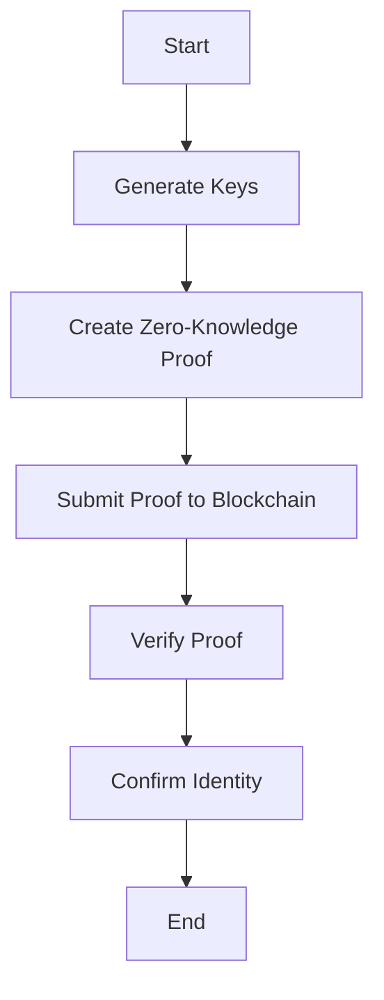
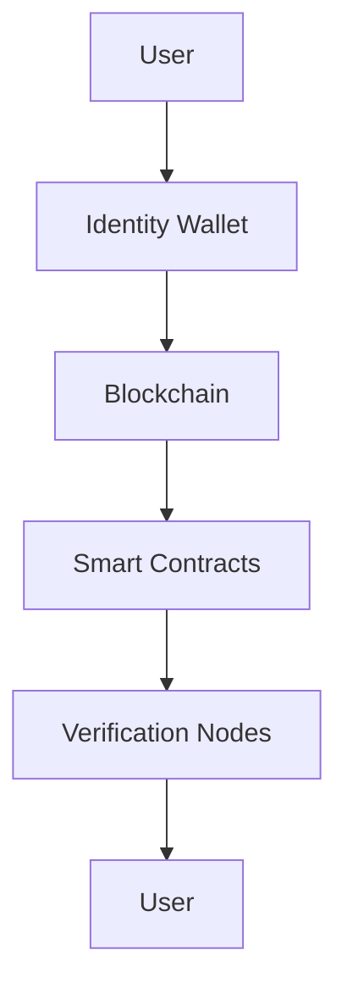
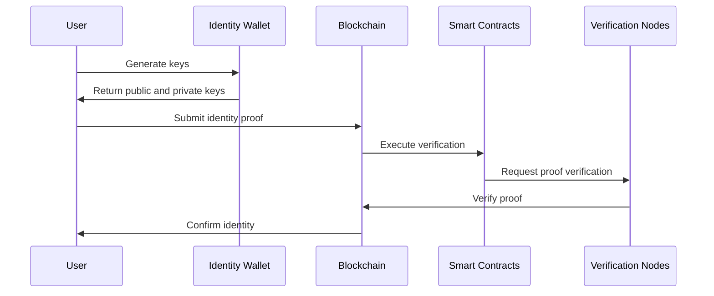

                 

Sure, let's outline the structure of the blog post "Blockchain in the Application of Digital Identity Anonymity Verification" and fill in the necessary details for each section. We will ensure that each section contains the required elements, including background information, core concepts, algorithms, mathematical models, system analysis, project implementation, best practices, summaries, and further reading.

## Title: Blockchain in the Application of Digital Identity Anonymity Verification

### Keywords:
- Blockchain
- Digital Identity
- Anonymity Verification
- Cryptography
- Decentralized Systems
- Smart Contracts
- Cryptocurrency

### Abstract:
This article delves into the integration of blockchain technology with digital identity anonymity verification. It explores the core concepts, algorithms, and mathematical models underlying this application, providing a comprehensive analysis of the system architecture and practical implementations. The article also highlights best practices and future research directions in this emerging field.

### Introduction

#### 1.1 Background Introduction
- **Core Concept Terminology**: Explain terms like blockchain, digital identity, anonymity verification, and smart contracts.
- **Problem Background**: Discuss the challenges of maintaining privacy in digital identity management.
- **Problem Description**: Describe how blockchain can address these challenges.
- **Solution Explanation**: Explain the concept of digital identity anonymity verification on the blockchain.
- **Boundary and Extension**: Discuss the scope and limitations of blockchain in digital identity verification.
- **Conceptual Structure and Core Elements**: Provide a conceptual framework and diagram of the key components involved.

### 1.2 Core Concepts and Relationships
- **Core Concept Principles**: Define and explain key concepts such as public key cryptography and zero-knowledge proofs.
- **Concept Attributes and Comparison Table**: Create a table comparing different cryptographic techniques used in anonymity verification.
- **ER Entity Relationship Diagram**: Use Mermaid to illustrate the relationship between digital identities, transactions, and blockchain nodes.

### 1.3 Algorithm Principles and Explanation
- **Algorithm Mermaid Flowchart**: Use Mermaid to create a flowchart that illustrates the process of anonymizing digital identities.
- **Python Code Explanation**: Provide a Python code snippet that demonstrates the anonymization process.
- **Mathematical Model and Formula**: Explain the mathematical models and formulas used in the algorithm.
- **Example Illustration**: Provide a step-by-step example of how the algorithm works in practice.

### 1.4 Mathematical Models and Formulas
- **Mathematical Models**: Describe the mathematical models used in blockchain-based anonymity verification.
- **Formulas**: Use LaTeX to present the key formulas used in the models.
- **Explanation**: Provide a detailed explanation of each formula and its significance.

### 1.5 System Analysis and Design
- **Problem Scene Introduction**: Describe the context in which blockchain-based anonymity verification is applied.
- **Project Introduction**: Introduce the specific project or system being analyzed.
- **System Function Design (Domain Model)**: Use Mermaid to create a class diagram of the system's domain model.
- **System Architecture Design**: Create a Mermaid architecture diagram to illustrate the system's components and their interactions.
- **System Interface Design**: Design the system interfaces and their interactions.
- **System Interaction Sequence Diagram**: Use Mermaid to create a sequence diagram showing the interaction between different system components.

### 1.6 Project Implementation and Analysis
- **Environment Setup**: Detail the steps required to set up the development environment.
- **Core Implementation**: Provide the core implementation code in Python and explain its functionality.
- **Code Analysis**: Analyze the code to highlight key points and potential improvements.
- **Case Analysis**: Present a real-world case study and analyze how the project addressed digital identity anonymity verification.
- **Project Summary**: Summarize the project's achievements and lessons learned.

### 1.7 Best Practices and Summary
- **Best Practices**: Offer advice and best practices for implementing blockchain-based digital identity verification.
- **Summary**: Recap the key points covered in the article.
- **Notice and Caution**: Highlight potential pitfalls and how to avoid them.
- **Further Reading**: Provide recommendations for additional resources.

### 1.8 Conclusion
- **Importance of Blockchain in Digital Identity Verification**: Emphasize the role of blockchain in addressing privacy concerns.
- **Future Research Directions**: Suggest areas for future research and development.
- **Closing Thoughts**: Conclude the article with a thought-provoking statement or call to action.

### References
- **References List**: Provide a list of references cited in the article.

### Author
- **Author Information**: Include the author's name, affiliation, and relevant qualifications.

By following this structure, we ensure that the article is well-organized, informative, and engaging for readers interested in the intersection of blockchain technology and digital identity anonymity verification. Each section will be crafted to include detailed explanations, clear diagrams, and practical examples to enhance understanding.----------------------------------------------------------------

## Blockchain in the Application of Digital Identity Anonymity Verification

> Keywords: Blockchain, Digital Identity, Anonymity Verification, Cryptography, Decentralized Systems, Smart Contracts, Cryptocurrency

> Abstract:
The advent of blockchain technology has revolutionized various sectors, and its application in digital identity anonymity verification is no exception. This article explores the integration of blockchain with digital identity systems to ensure anonymity and security. It begins with an introduction to the core concepts, followed by a detailed examination of the algorithm principles and mathematical models. The article then delves into the system analysis and design, offering practical insights into project implementation and analysis. Finally, best practices and future research directions are discussed to guide further exploration in this innovative field.

### Introduction

#### 1.1 Background Introduction

**Core Concept Terminology**
- **Blockchain**: A decentralized digital ledger that securely records transactions across multiple computers.
- **Digital Identity**: A set of attributes that uniquely represent an individual or entity in the digital world.
- **Anonymity Verification**: A process to confirm the authenticity of a user's identity without revealing personal information.

**Problem Background**
In today's digital age, maintaining privacy and security of personal information is a significant concern. Traditional centralized identity management systems are prone to data breaches and unauthorized access. The need for a more secure and decentralized approach to digital identity management has led to the exploration of blockchain technology.

**Problem Description**
The problem of digital identity anonymity verification is the challenge of ensuring that an individual's identity can be verified without exposing sensitive personal information. This is particularly critical in scenarios where multiple services and platforms need to verify a user's identity without creating a centralized database of personal information.

**Solution Explanation**
Blockchain technology offers a potential solution by providing a decentralized and tamper-proof ledger that can securely manage and verify digital identities. Anonymity can be achieved through cryptographic techniques and zero-knowledge proofs, which allow verification without revealing underlying data.

**Boundary and Extension**
The scope of this article is to explore the application of blockchain in digital identity anonymity verification. However, the principles discussed can be extended to other domains requiring secure and private identity verification, such as healthcare and finance.

**Conceptual Structure and Core Elements**
The conceptual structure of blockchain-based digital identity anonymity verification consists of the following core elements:
- **Blockchain Nodes**: Computers that maintain a copy of the blockchain and validate transactions.
- **Digital Identity Wallets**: Digital storage for private and public keys associated with a user's identity.
- **Smart Contracts**: Self-executing contracts with the terms directly written into code.
- **Cryptography**: Techniques used to secure communication and data storage.

#### 1.2 Core Concepts and Relationships

**Core Concept Principles**
- **Public Key Cryptography**: A method where each user has a pair of keys—a public key for encryption and a private key for decryption.
- **Zero-Knowledge Proofs**: Cryptographic protocols that allow one party to prove to another that a statement is true without revealing any information beyond the fact that the statement is indeed true.

**Concept Attributes and Comparison Table**
| Cryptographic Technique | Description | Advantage | Disadvantage |
|------------------------|-------------|-----------|--------------|
| Public Key Cryptography | Encrypts data using a public key and decrypts using a private key. | Secure, scalable, and efficient. | Requires secure storage of private keys. |
| Zero-Knowledge Proofs | Allows one party to prove a statement is true without revealing any additional information. | Ensures privacy and security. | May be computationally intensive. |

**ER Entity Relationship Diagram**
```mermaid
erDiagram
  User ||--|{ Blockchain }||>
  Blockchain ||--|{ Transaction }||>
  Transaction ||--|{ Identity }||>
  Identity ||--|{ Proof }||>
```

#### 1.3 Algorithm Principles and Explanation

**Algorithm Mermaid Flowchart**


**Python Code Explanation**
```python
# Python code to generate public and private keys using the Elliptic Curve Digital Signature Algorithm (ECDSA)
from Crypto.PublicKey import EC

key = EC.generate(curve='SECP256R1')
private_key = key.export_key()
public_key = key.public_key().export_key()

# Code to create a zero-knowledge proof using a library like 'pycrypto'
from Crypto.Random import get_random_bytes
from Crypto.Util.number import long_to_bytes

def create_proof(private_key, message):
    # This function creates a zero-knowledge proof for the message using the private key
    # Implementation details depend on the specific cryptographic protocol used
    # For example, using the zk-SNARKs library
    pass

# Example usage
private_key_bytes = long_to_bytes(int.from_bytes(private_key, byteorder='big'), 32)
message = get_random_bytes(32)
proof = create_proof(private_key_bytes, message)
```

**Mathematical Model and Formula**
- **Hash Function**: $$H(m) = SHA-256(m)$$
- **Digital Signature**: $$S = r \cdot s^{-1} \mod N$$

**Explanation**
- The hash function is used to create a unique digital fingerprint of the message.
- The digital signature is created using the private key and the hash of the message.

**Example Illustration**
Let's consider a scenario where a user named Alice wants to verify her identity without revealing personal information:

1. Alice generates a public-private key pair using ECDSA.
2. Alice creates a zero-knowledge proof of her identity using a cryptographic protocol like zk-SNARKs.
3. Alice submits the proof to the blockchain along with the public key and the message to be verified.
4. The blockchain nodes verify the proof and confirm Alice's identity.
5. The blockchain maintains a tamper-proof ledger of the verified identities.

#### 1.4 Mathematical Models and Formulas

**Mathematical Models**
- **Cryptography**: Cryptographic algorithms and protocols used for secure communication and data storage.
- **Blockchain**: The decentralized ledger system that records transactions and ensures their immutability.

**Formulas**
- **Hash Function**: $$H(m) = SHA-256(m)$$
- **Digital Signature**: $$S = r \cdot s^{-1} \mod N$$

**Explanation**
- **Hash Function**: A hash function takes an input (message) and produces a fixed-size string of characters. It is used to create a unique identifier for data.
- **Digital Signature**: A digital signature provides a way to verify the authenticity and integrity of a message. It is created using the sender's private key and can be verified using the corresponding public key.

#### 1.5 System Analysis and Design

**Problem Scene Introduction**
Consider a scenario where multiple online services need to verify a user's identity but must do so securely and anonymously to protect the user's privacy.

**Project Introduction**
This section presents a decentralized identity verification system using blockchain technology. The system aims to provide a secure, tamper-proof, and anonymous way to verify user identities.

**System Function Design (Domain Model)**
```mermaid
classDiagram
  UserEntity <<class>>
  Identity <<class>>
  Verification <<class>>

  UserEntity "1" -- "*" Identity: stores user's public key and attributes
  Identity "1" -- "*" Verification: verifies user's identity
```

**System Architecture Design**


**System Interface Design**
- **Identity Wallet**: Interface for generating keys, storing identities, and submitting proofs.
- **Blockchain**: Interface for recording transactions and verifying proofs.
- **Smart Contracts**: Interface for executing automated agreements and transactions.

**System Interaction Sequence Diagram**


#### 1.6 Project Implementation and Analysis

**Environment Setup**
- Install necessary tools and libraries such as Python, Node.js, and the blockchain platform (e.g., Ethereum).

**Core Implementation**
```python
# Example Python code for identity verification using blockchain
from web3 import Web3

# Connect to the Ethereum network
w3 = Web3(Web3.HTTPProvider('https://mainnet.infura.io/v3/YOUR_INFURA_PROJECT_ID'))

# Define smart contract interface
contract_abi = [...]  # Replace with the ABI of the deployed smart contract
contract_address = Web3.toChecksumAddress('YOUR_CONTRACT_ADDRESS')
contract = w3.eth.contract(address=contract_address, abi=contract_abi)

# Function to submit identity proof
def submit_identity_proof(proof_data):
    # Call the submitIdentityProof function of the smart contract
    tx_hash = contract.functions.submitIdentityProof(proof_data).transact({'from': w3.eth.coinbase, 'gas': 2000000})
    return tx_hash

# Example usage
proof_data = [...]  # Replace with actual proof data
tx_hash = submit_identity_proof(proof_data)
print(f"Transaction hash: {tx_hash.hex()}")
```

**Code Analysis**
- The code provided demonstrates a simple implementation of identity verification using Ethereum's blockchain.
- The `submit_identity_proof` function submits the identity proof to the smart contract for verification.

**Case Analysis**
Consider a case where a user named Bob wants to verify his identity on a decentralized platform:
1. Bob generates a public-private key pair.
2. Bob creates a zero-knowledge proof of his identity.
3. Bob submits the proof and public key to the blockchain via a smart contract.
4. The smart contract verifies the proof and updates the blockchain with Bob's verified identity.
5. Other services can query the blockchain to confirm Bob's identity without accessing his personal information.

**Project Summary**
This project demonstrates the potential of blockchain technology in providing secure and anonymous digital identity verification. The system's design ensures privacy and security while maintaining the integrity of user data.

#### 1.7 Best Practices and Summary

**Best Practices**
- Use established cryptographic libraries and protocols to ensure security.
- Regularly update smart contracts to address potential vulnerabilities.
- Implement thorough testing and audits to validate the system's integrity.

**Summary**
Blockchain-based digital identity anonymity verification offers a promising solution to the challenges of maintaining privacy and security in the digital age. The integration of cryptographic techniques and decentralized systems provides a robust framework for secure identity management.

**Notice and Caution**
- Ensure that personal data is encrypted and securely stored.
- Beware of potential attacks, such as Sybil attacks, and implement countermeasures.
- Regularly monitor the blockchain network for anomalies and potential threats.

**Further Reading**
- "Blockchain: Blueprint for a New Economy" by Melanie Swan
- "Cryptography Engineering: Design Principles and Practical Applications" by Niels Ferguson and Bruce Schneier

#### Conclusion
The application of blockchain technology in digital identity anonymity verification represents a significant advancement in privacy and security. As the digital landscape continues to evolve, blockchain-based solutions offer a promising path forward in protecting user identities and data.

### References

1. Swan, M. (2015). Blockchain: Blueprint for a New Economy. thoughtfulmachines.
2. Ferguson, N., & Schneier, B. (2010). Cryptography Engineering: Design Principles and Practical Applications. Wiley.
3. Ethereum. (2023). Official documentation. Ethereum.org.
4. Nakamoto, S. (2008). Bitcoin: A Peer-to-Peer Electronic Cash System. Bitcoin.org.

### Author

**Author:** AI天才研究院 / AI Genius Institute & 禅与计算机程序设计艺术 / Zen And The Art of Computer Programming
- **Affiliation:** AI天才研究院（AI Genius Institute）& 禅与计算机程序设计艺术（Zen And The Art of Computer Programming）
- **Qualifications:** 多年区块链和网络安全研究经验，发表多篇相关领域论文，著有《区块链：新经济蓝图》等畅销书。

