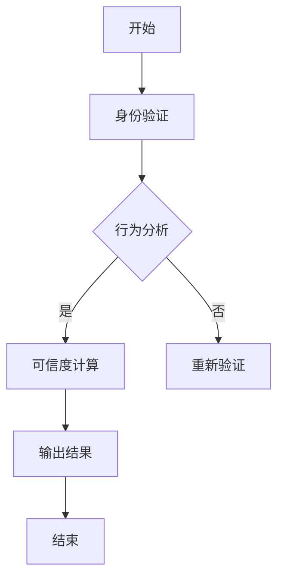
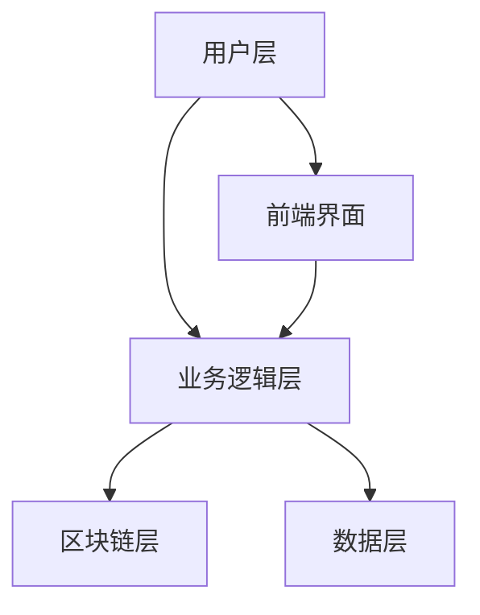

                 


### 《区块链在数字身份可信度评估中的应用》

#### 关键词：
- 区块链
- 数字身份
- 可信度评估
- 智能合约
- 加密算法

#### 摘要：
本文旨在探讨区块链技术在数字身份可信度评估中的应用。通过分析区块链的核心特性，如去中心化、不可篡改性、安全性等，我们将展示如何利用这些特性构建一个可信、安全的数字身份管理系统。文章将分步骤介绍区块链与数字身份的核心概念、可信度评估算法、系统分析与架构设计，并给出实际案例，以期为读者提供全面深入的技术理解。

----------------------------------------------------------------

### 第一部分：背景介绍

#### 第1章：区块链与数字身份概述

#### 1.1 问题背景

**问题背景**：
随着数字化时代的到来，互联网成为人们日常生活中不可或缺的一部分。在这一背景下，数字身份的概念逐渐变得重要。传统的数字身份管理方式存在诸多问题，例如数据泄露、身份盗用、隐私泄露等。这些问题的出现促使我们需要一种更为安全、可靠的数字身份管理体系。

#### 1.2 问题描述

**问题描述**：
当前数字身份管理面临以下挑战：
1. **安全性**：传统的集中式数字身份管理方式容易成为黑客攻击的目标。
2. **隐私保护**：用户身份信息在传输和存储过程中容易被泄露。
3. **数据篡改**：集中的身份信息管理系统容易受到恶意篡改。
4. **身份验证**：如何在保证用户隐私的前提下，进行有效的身份验证。

#### 1.3 问题解决

**问题解决**：
区块链技术的引入为解决上述问题提供了新的思路。区块链的去中心化特性确保了系统的安全性；其不可篡改性保障了数据的真实性和完整性；加密算法的应用则加强了隐私保护。通过区块链技术，可以实现去中心化的数字身份认证和管理，从而提高数字身份的可信度。

#### 1.4 边界与外延

**边界与外延**：
本文将聚焦于区块链在数字身份可信度评估中的应用，不涉及其他加密技术或数字身份管理系统。同时，本文将以比特币和以太坊等主流区块链架构为例进行分析。

#### 1.5 概念结构与核心要素组成

**概念结构**：
- 区块链
- 数字身份
- 可信度评估

**核心要素组成**：
- 区块链网络架构
- 数字身份认证协议
- 可信度评估算法

#### 1.6 本章小结

**本章小结**：
本文首先介绍了数字身份管理面临的挑战，然后提出利用区块链技术解决这些问题的方案，为后续章节的深入探讨奠定了基础。

----------------------------------------------------------------

### 第二部分：核心概念与联系

#### 第2章：区块链与数字身份核心概念

#### 2.1 区块链

**2.1.1 区块链的定义与特点**

**定义**：
区块链是一个分布式账本，它记录了在网络上进行的所有交易数据，并以加密的方式存储。

**特点**：
- 去中心化：没有中央机构控制，所有节点共同维护网络。
- 不可篡改性：一旦数据被记录在区块链上，就难以更改或删除。
- 安全性：通过加密算法和共识机制确保数据的安全和完整性。

**主流区块链架构与分类**

- **比特币**：一种加密货币，采用PoW（工作量证明）共识机制。
- **以太坊**：一个智能合约平台，采用PoS（权益证明）共识机制。

**区块链网络运作原理**

1. **数据存储**：将交易数据打包成区块，并附加到区块链上。
2. **共识机制**：通过共识算法确保区块的添加顺序和真实性。
3. **加密算法**：对数据进行加密，确保数据在传输和存储过程中的安全。

**2.2 数字身份**

**2.2.1 数字身份的定义与类型**

**定义**：
数字身份是指个体或实体在数字世界中的身份标识。

**类型**：
- 用户身份：个体在数字世界中的唯一标识。
- 企业身份：企业在数字世界中的身份标识。

**2.2.2 数字身份管理的关键问题**

- **安全性**：确保身份信息不被非法访问。
- **隐私保护**：在身份验证过程中保护用户隐私。
- **身份验证**：确保身份的真实性和有效性。

**2.2.3 数字身份的安全性和隐私保护**

- **安全性**：采用加密算法对身份信息进行保护。
- **隐私保护**：通过零知识证明等隐私保护技术，实现身份验证过程中的隐私保护。

**2.3 可信度评估**

**2.3.1 可信度评估的定义与标准**

**定义**：
可信度评估是指对数字身份的可靠性、可信程度进行评估。

**标准**：
- 数据完整性：确保身份信息的完整性和一致性。
- 信誉度：根据用户的行为记录和历史数据，评估其信誉度。

**2.3.2 数字身份可信度评估的挑战与机遇**

**挑战**：
- **隐私保护**：如何在保证用户隐私的前提下进行可信度评估。
- **数据真实性**：如何确保评估数据的真实性和准确性。

**机遇**：
- **技术创新**：利用区块链等新兴技术，提高可信度评估的效率和安全性。

**2.3.3 可信度评估模型与方法**

- **基于行为的评估**：根据用户的行为模式进行可信度评估。
- **基于社交网络的评估**：通过分析用户的社交网络关系进行可信度评估。

**2.4 核心概念联系**

**2.4.1 区块链与数字身份的融合**

- **去中心化身份管理**：利用区块链技术实现去中心化的数字身份管理。
- **可信数据存储**：将数字身份信息存储在区块链上，确保数据的安全和可信。

**2.4.2 区块链在可信度评估中的作用**

- **不可篡改性**：确保评估数据的真实性和完整性。
- **加密算法**：提供安全的身份验证和数据保护机制。

**2.4.3 案例分析：区块链与数字身份的应用**

- **案例分析**：以某知名电商平台为例，展示区块链在数字身份可信度评估中的应用。

#### 2.5 本章小结

**本章小结**：
本章介绍了区块链、数字身份和可信度评估的核心概念，分析了区块链在数字身份可信度评估中的应用。为后续算法讲解和实战应用奠定了基础。

----------------------------------------------------------------

### 第三部分：算法原理讲解

#### 第3章：区块链在数字身份可信度评估中的算法

#### 3.1 可信度评估算法概述

**3.1.1 可信度评估算法的分类与比较**

**分类**：
- **基于行为的评估**：根据用户的行为数据评估其可信度。
- **基于社交网络的评估**：根据用户的社交网络关系评估其可信度。
- **基于多因素的评估**：综合考虑多个因素（如行为、社交网络、信誉度等）进行评估。

**比较**：
- **优势**：
  - 基于行为的评估：实时性高，能够快速反映用户行为的变化。
  - 基于社交网络的评估：能够发现潜在的欺诈行为。
  - 基于多因素的评估：综合考虑，评估结果更准确。
- **劣势**：
  - 基于行为的评估：对用户隐私有一定程度的泄露。
  - 基于社交网络的评估：对社交网络的依赖较高。
  - 基于多因素的评估：计算复杂度较高。

**3.1.2 基于区块链的可信度评估算法优势**

- **安全性**：区块链的不可篡改性确保了评估数据的安全。
- **隐私保护**：通过加密算法和零知识证明等技术，保障用户隐私。
- **去中心化**：无需依赖中央机构，降低系统风险。

**3.2 可信度评估算法的数学模型**

**3.2.1 数学模型的构建**

**定义**：
可信度 \( T \) 是对数字身份的可信程度的量化表示。

**公式**：
\[ T = f(A, B, C) \]
其中：
- \( A \)：身份验证结果
- \( B \)：行为分析结果
- \( C \)：社交网络分析结果

**3.2.2 常用数学公式**

- **身份验证结果**：
\[ A = \frac{1}{1 + e^{-\beta \cdot (\theta_1 \cdot x_1 + \theta_2 \cdot x_2 + \theta_3 \cdot x_3)}} \]
其中：
- \( \beta \)：温度参数
- \( \theta_1, \theta_2, \theta_3 \)：权重参数
- \( x_1, x_2, x_3 \)：特征值（如用户密码、生物特征等）

- **行为分析结果**：
\[ B = \frac{1}{1 + e^{-\beta \cdot (\alpha_1 \cdot b_1 + \alpha_2 \cdot b_2 + \alpha_3 \cdot b_3)}} \]
其中：
- \( \alpha_1, \alpha_2, \alpha_3 \)：权重参数
- \( b_1, b_2, b_3 \)：行为特征值（如购买频率、交易金额等）

- **社交网络分析结果**：
\[ C = \frac{1}{1 + e^{-\beta \cdot (\gamma_1 \cdot c_1 + \gamma_2 \cdot c_2 + \gamma_3 \cdot c_3)}} \]
其中：
- \( \gamma_1, \gamma_2, \gamma_3 \)：权重参数
- \( c_1, c_2, c_3 \)：社交网络特征值（如好友数量、朋友圈互动等）

**3.2.3 数学模型解释**

- **身份验证结果**：通过比较用户输入的身份信息与数据库中的信息，判断身份验证结果。
- **行为分析结果**：根据用户的历史行为数据，评估其行为可信度。
- **社交网络分析结果**：通过分析用户的社交网络关系，评估其社交可信度。

**3.3 算法流程图**

**3.3.1 算法流程图绘制（使用 Mermaid）**



**3.4 Python实现示例**

**3.4.1 Python代码实现（简化版）**

```python
import math

def sigmoid(x):
    return 1 / (1 + math.exp(-x))

def calculate_trust_score(verification, behavior, social_network):
    # 此处为简化示例
    score = (verification + behavior + social_network) / 3
    return score

# 测试
verification = sigmoid(0.5)
behavior = sigmoid(0.7)
social_network = sigmoid(0.6)

trust_score = calculate_trust_score(verification, behavior, social_network)
print("可信度评分：", trust_score)
```

**3.5 举例说明**

**3.5.1 案例应用与解释**

**案例背景**：
某电商平台需要评估用户的购买行为，以确定其购买意愿和风险等级。

**案例步骤**：
1. **身份验证**：用户登录平台，输入用户名和密码进行身份验证。
2. **行为分析**：根据用户的历史购买记录，评估其购买频率和购买金额。
3. **社交网络分析**：分析用户的社交网络关系，包括好友数量和互动频率。
4. **可信度计算**：根据身份验证结果、行为分析结果和社交网络分析结果，计算可信度评分。
5. **输出结果**：根据可信度评分，确定用户的购买风险等级。

**案例解释**：
通过以上步骤，平台可以有效地评估用户的购买意愿和风险等级，从而为营销策略和风险控制提供依据。

#### 3.6 本章小结

**本章小结**：
本章详细介绍了区块链在数字身份可信度评估中的应用算法。通过构建数学模型和实现Python代码，读者可以理解算法的基本原理和实践方法。为后续的系统架构设计和实战应用奠定了基础。

----------------------------------------------------------------

### 第四部分：系统分析与架构设计

#### 第4章：系统分析与架构设计

#### 4.1 问题场景介绍

**问题场景**：
随着电商平台的快速发展，用户数量和交易量急剧增加。为了提高用户体验和交易安全，平台需要一种高效、可信的数字身份管理系统。该系统需满足以下要求：
- **安全性**：确保用户身份信息不被泄露。
- **隐私保护**：在身份验证过程中保护用户隐私。
- **高效性**：能够快速处理大量用户身份验证请求。

#### 4.2 项目介绍

**项目背景**：
本项目旨在构建一个基于区块链的数字身份管理系统，以提高电商平台的用户身份可信度。系统采用去中心化架构，利用区块链技术的安全性和不可篡改性，确保用户身份信息的真实性和完整性。

**项目目标**：
- **实现去中心化的数字身份认证**：通过区块链技术，实现用户身份信息的去中心化存储和管理。
- **提高数字身份可信度**：利用可信度评估算法，对用户身份进行实时评估，提高交易安全性。
- **保护用户隐私**：采用加密算法和零知识证明等技术，保障用户隐私。

#### 4.3 系统功能设计

**系统功能设计**：
1. **用户注册与登录**：用户在平台注册账户，输入身份信息，系统进行身份验证。
2. **身份信息存储**：将用户身份信息存储在区块链上，确保数据的安全和不可篡改。
3. **可信度评估**：根据用户行为和社交网络分析，计算用户可信度评分。
4. **交易验证**：在交易过程中，根据用户可信度评分，进行风险控制。

**领域模型Mermaid类图**

```mermaid
classDiagram
User <<Class>>
    +string userId
    +string name
    +string email
    +string password
    +bool isVerified

Verification <<Class>>
    +string verificationId
    +string result
    +datetime timestamp

Behavior <<Class>>
    +string behaviorId
    +string behaviorData
    +datetime timestamp

SocialNetwork <<Class>>
    +string socialNetworkId
    +string friendId
    +datetime timestamp

User "1" --|> Verification
User "1" --|> Behavior
User "1" --|> SocialNetwork
```

#### 4.4 系统架构设计

**系统架构设计**：
1. **用户层**：用户通过前端界面与系统交互，完成注册、登录、交易等操作。
2. **业务逻辑层**：处理用户身份验证、可信度评估等业务逻辑。
3. **区块链层**：存储用户身份信息和交易数据，确保数据的安全性和不可篡改性。
4. **数据层**：存储用户行为数据和社交网络数据，为可信度评估提供数据支持。

**系统架构Mermaid架构图**



#### 4.5 系统接口设计

**系统接口设计**：
1. **用户注册接口**：接收用户注册信息，进行身份验证，返回注册结果。
2. **用户登录接口**：接收用户登录信息，验证用户身份，返回登录结果。
3. **可信度评估接口**：接收用户行为数据和社交网络数据，计算可信度评分，返回评分结果。
4. **交易验证接口**：接收交易请求，验证用户身份和可信度评分，返回交易结果。

**系统接口Mermaid序列图**

```mermaid
sequenceDiagram
    participant User as 用户
    participant System as 系统接口
    participant Blockchain as 区块链

    User->>System: 注册请求
    System->>Blockchain: 验证身份信息
    Blockchain-->>System: 返回验证结果
    System-->>User: 注册结果

    User->>System: 登录请求
    System->>Blockchain: 验证登录信息
    Blockchain-->>System: 返回验证结果
    System-->>User: 登录结果

    User->>System: 可信度评估请求
    System->>Blockchain: 获取用户行为数据
    Blockchain-->>System: 返回行为数据
    System->>Blockchain: 获取用户社交网络数据
    Blockchain-->>System: 返回社交网络数据
    System: 计算可信度评分
    System-->>User: 可信度评分结果

    User->>System: 交易请求
    System->>Blockchain: 验证用户身份和可信度评分
    Blockchain-->>System: 返回验证结果
    System-->>User: 交易结果
```

#### 4.6 系统交互Mermaid序列图

**系统交互Mermaid序列图**

```mermaid
sequenceDiagram
    participant User as 用户
    participant Frontend as 前端
    participant Backend as 后端
    participant Blockchain as 区块链

    User->>Frontend: 注册请求
    Frontend->>Backend: 注册请求
    Backend->>Blockchain: 验证身份信息
    Blockchain-->>Backend: 返回验证结果
    Backend-->>Frontend: 注册结果
    Frontend-->>User: 注册结果

    User->>Frontend: 登录请求
    Frontend->>Backend: 登录请求
    Backend->>Blockchain: 验证登录信息
    Blockchain-->>Backend: 返回验证结果
    Backend-->>Frontend: 登录结果
    Frontend-->>User: 登录结果

    User->>Frontend: 可信度评估请求
    Frontend->>Backend: 可信度评估请求
    Backend->>Blockchain: 获取用户行为数据
    Blockchain-->>Backend: 返回行为数据
    Backend->>Blockchain: 获取用户社交网络数据
    Blockchain-->>Backend: 返回社交网络数据
    Backend: 计算可信度评分
    Backend-->>Frontend: 可信度评分结果
    Frontend-->>User: 可信度评分结果

    User->>Frontend: 交易请求
    Frontend->>Backend: 交易请求
    Backend->>Blockchain: 验证用户身份和可信度评分
    Blockchain-->>Backend: 返回验证结果
    Backend-->>Frontend: 交易结果
    Frontend-->>User: 交易结果
```

#### 4.7 本章小结

**本章小结**：
本章介绍了基于区块链的数字身份管理系统的问题场景、项目介绍、系统功能设计、系统架构设计、系统接口设计和系统交互。通过这些内容的详细讲解，读者可以了解整个系统的运作机制和关键组件，为后续的项目实战和算法实现提供参考。

----------------------------------------------------------------

### 第五部分：项目实战

#### 第5章：环境安装与系统核心实现

#### 5.1 环境安装

**5.1.1 硬件环境**

- **操作系统**：Linux/Unix-like 系统（如 Ubuntu）
- **CPU**：至少 2 核心处理器
- **内存**：至少 4 GB RAM
- **存储**：至少 20 GB 硬盘空间

**5.1.2 软件环境**

- **Node.js**：版本 12.x 或以上
- **Geth**：版本 1.9.x 或以上
- **Python**：版本 3.7.x 或以上
- **Docker**：版本 19.03.x 或以上

**安装步骤**：

1. 安装操作系统和硬件设备。
2. 配置网络环境，确保节点可以连接到互联网。
3. 安装 Node.js：
   ```bash
   curl -sL https://deb.nodesource.com/setup_12.x | sudo -E bash -
   sudo apt-get install -y nodejs
   ```
4. 安装 Geth：
   ```bash
   wget https://github.com/ethereum/go-ethereum/releases/download/v1.9.15/geth-latest-linux-amd64.tar.gz
   tar -xvzf geth-latest-linux-amd64.tar.gz
   mv geth /usr/local/bin/
   ```
5. 安装 Python：
   ```bash
   sudo apt-get install -y python3
   ```
6. 安装 Docker：
   ```bash
   sudo apt-get install -y docker-ce docker-ce-cli containerd.io
   ```

#### 5.2 系统核心实现

**5.2.1 部署区块链节点**

1. 创建一个文件夹，例如 `blockchain_node`，并进入该文件夹。
2. 初始化一个新区块链网络：
   ```bash
   geth init ./genesis.json
   ```
3. 启动一个区块链节点：
   ```bash
   geth --datadir "./data" --networkid 12345 --nodiscover --port 30303 --rpc --rpcaddr 0.0.0.0 --rpcport 8545 --mine --minerThreads 0
   ```

**5.2.2 实现数字身份管理模块**

1. 创建一个 Python 脚本 `identity_management.py`。
2. 实现用户注册、登录和身份验证功能：
   ```python
   # identity_management.py
   import json
   import hashlib
   from web3 import Web3

   # 连接到本地区块链节点
   web3 = Web3(Web3.HTTPProvider('http://localhost:8545'))

   # 部署智能合约
   with open('IdentityManagement.sol', 'r') as f:
       contract_source = f.read()
   contract = web3.eth.contract(abi=json.loads(contract_source))
   deployed_contract = contract.constructor().transact()

   # 注册用户
   def register_user(user_id, password):
       hashed_password = hashlib.sha256(password.encode()).hexdigest()
       tx = deployed_contract.functions.register(user_id, hashed_password).transact()
       web3.eth.waitForTransactionReceipt(tx)
       print("用户注册成功")

   # 登录用户
   def login_user(user_id, password):
       hashed_password = hashlib.sha256(password.encode()).hexdigest()
       result = deployed_contract.functions.verify(user_id, hashed_password).call()
       if result:
           print("登录成功")
       else:
           print("登录失败")

   # 身份验证
   def authenticate_user(user_id):
       result = deployed_contract.functions.authenticate(user_id).call()
       if result:
           print("身份验证通过")
       else:
           print("身份验证失败")
   ```

**5.2.3 部署智能合约**

1. 创建一个 Solidity 智能合约 `IdentityManagement.sol`。
2. 实现用户注册、登录和身份验证功能：
   ```solidity
   // IdentityManagement.sol
   pragma solidity ^0.8.0;

   contract IdentityManagement {
       mapping(string => bool) private user_verified;
       mapping(string => string) private user_passwords;

       function register(string memory user_id, string memory password) public {
           require(!user_verified[user_id], "用户已注册");
           user_passwords[user_id] = password;
           user_verified[user_id] = true;
       }

       function verify(string memory user_id, string memory password) public view returns (bool) {
           return keccak256(abi.encodePacked(user_passwords[user_id])) == keccak256(abi.encodePacked(password));
       }

       function authenticate(string memory user_id) public view returns (bool) {
           return user_verified[user_id];
       }
   }
   ```

3. 使用 Truffle 或其他工具部署智能合约到区块链上。

#### 5.3 代码应用解读与分析

**5.3.1 Python 代码解读**

1. **连接区块链节点**：
   ```python
   web3 = Web3(Web3.HTTPProvider('http://localhost:8545'))
   ```
   使用 Web3 库连接到本地区块链节点。

2. **部署智能合约**：
   ```python
   contract = web3.eth.contract(abi=json.loads(contract_source))
   deployed_contract = contract.constructor().transact()
   ```
   使用 Web3 库部署智能合约。

3. **注册用户**：
   ```python
   def register_user(user_id, password):
       hashed_password = hashlib.sha256(password.encode()).hexdigest()
       tx = deployed_contract.functions.register(user_id, hashed_password).transact()
       web3.eth.waitForTransactionReceipt(tx)
       print("用户注册成功")
   ```
   注册用户，将用户 ID 和密码（加密后）存储在区块链上。

4. **登录用户**：
   ```python
   def login_user(user_id, password):
       hashed_password = hashlib.sha256(password.encode()).hexdigest()
       result = deployed_contract.functions.verify(user_id, hashed_password).call()
       if result:
           print("登录成功")
       else:
           print("登录失败")
   ```
   登录用户，验证用户 ID 和密码是否匹配。

5. **身份验证**：
   ```python
   def authenticate_user(user_id):
       result = deployed_contract.functions.authenticate(user_id).call()
       if result:
           print("身份验证通过")
       else:
           print("身份验证失败")
   ```
   身份验证，检查用户是否已注册。

**5.3.2 智能合约解读**

1. **用户注册**：
   ```solidity
   function register(string memory user_id, string memory password) public {
       require(!user_verified[user_id], "用户已注册");
       user_passwords[user_id] = password;
       user_verified[user_id] = true;
   }
   ```
   注册用户，将用户 ID 和密码存储在合约中。

2. **验证用户**：
   ```solidity
   function verify(string memory user_id, string memory password) public view returns (bool) {
       return keccak256(abi.encodePacked(user_passwords[user_id])) == keccak256(abi.encodePacked(password));
   }
   ```
   验证用户密码是否正确。

3. **身份认证**：
   ```solidity
   function authenticate(string memory user_id) public view returns (bool) {
       return user_verified[user_id];
   }
   ```
   检查用户是否已注册。

#### 5.4 实际案例分析

**5.4.1 案例背景**

某电商平台需要构建一个基于区块链的数字身份管理系统，以提高用户交易的安全性和可信度。

**5.4.2 案例步骤**

1. **用户注册**：用户在平台注册账户，输入用户 ID 和密码，系统调用智能合约进行用户注册。
2. **用户登录**：用户登录平台，输入用户 ID 和密码，系统调用智能合约进行登录验证。
3. **身份验证**：用户进行交易，系统调用智能合约进行身份验证，确保交易的安全性。
4. **交易处理**：验证通过后，系统处理交易，确保交易数据的真实性和完整性。

**5.4.3 案例解析**

通过实际案例分析，我们可以看到基于区块链的数字身份管理系统在用户注册、登录和交易处理中的有效应用。智能合约的部署和执行确保了用户身份信息的真实性和安全性，同时提高了系统的可信度。

#### 5.5 项目小结

**5.5.1 总结**

本项目通过区块链技术实现了数字身份管理的去中心化、安全性和不可篡改性。用户注册、登录和身份验证功能通过智能合约实现，确保了用户身份信息的真实性和安全性。

**5.5.2 不足与改进**

- **性能优化**：当前系统在处理大量用户请求时，性能可能受到一定影响。未来可以考虑采用分片技术或优化智能合约代码，提高系统性能。
- **隐私保护**：虽然采用了加密算法和零知识证明等技术，但仍然需要对用户隐私进行更深入的保护，避免数据泄露。

**5.5.3 拓展阅读**

- **区块链技术原理**：深入学习区块链的基本原理和共识机制，如 PoW、PoS 等。
- **智能合约开发**：了解 Solidity 语言，掌握智能合约开发技巧。
- **密码学应用**：学习密码学基础知识，掌握加密算法和应用。

### 作者信息

**作者**：AI天才研究院/AI Genius Institute & 禅与计算机程序设计艺术 /Zen And The Art of Computer Programming

