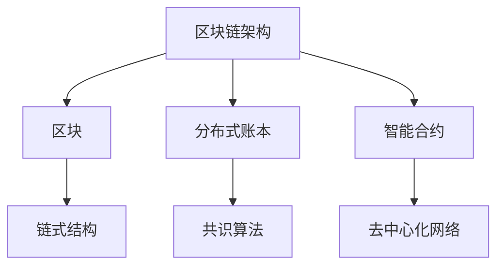
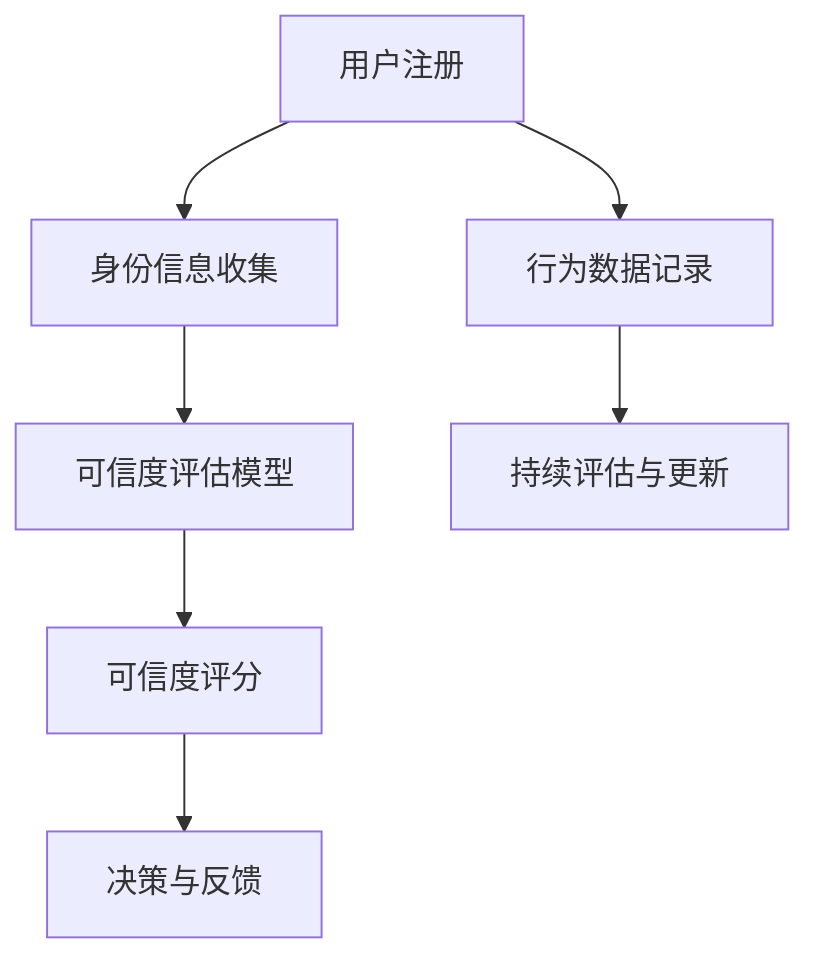

                 

## 文章标题：区块链在数字身份可信度评估中的应用

区块链技术作为一种新兴的去中心化数据库技术，近年来在金融、供应链管理、医疗等多个领域展现出了巨大的潜力。而数字身份可信度评估作为信息安全领域的重要一环，也逐渐引起了广泛关注。本文将深入探讨区块链技术在数字身份可信度评估中的应用，通过逐步分析，揭示其在提升数字身份可信度方面的独特优势和应用场景。

本文关键词：区块链、数字身份、可信度评估、去中心化、安全性、应用场景。

本文摘要：本文首先介绍了区块链与数字身份的基本概念，然后探讨了数字身份可信度评估的基本概念和挑战。接着，详细阐述了区块链在数字身份可信度评估中的应用原理，以及如何通过区块链技术增强数字身份可信度。最后，通过具体案例和未来发展趋势，分析了区块链在数字身份可信度评估中的实际应用和前景。

### 目录大纲

```markdown
----------------------------------------------------------------
# 第一部分：区块链与数字身份可信度评估概述

## 第1章：区块链与数字身份概述
### 1.1 区块链技术的基础概念
### 1.2 数字身份的概念
### 1.3 区块链在数字身份中的应用

## 第2章：数字身份可信度评估的基本概念
### 2.1 数字身份的概念
### 2.2 可信度评估的定义与意义
### 2.3 数字身份可信度评估的挑战与问题

## 第3章：区块链在数字身份可信度评估中的应用原理
### 3.1 区块链技术的核心优势
### 3.2 区块链在数字身份认证中的应用
### 3.3 区块链在可信度评估中的作用

## 第4章：区块链与数字身份可信度评估的关联性
### 4.1 区块链如何增强数字身份可信度
### 4.2 区块链技术在可信度评估中的优势和局限

## 第5章：区块链在数字身份可信度评估中的应用场景
### 5.1 个人身份认证
### 5.2 企业身份认证
### 5.3 供应链管理中的数字身份可信度评估

## 第6章：区块链在数字身份可信度评估中的案例分析
### 6.1 案例一：区块链在医疗健康领域的身份认证
### 6.2 案例二：区块链在金融行业的可信度评估

## 第7章：区块链在数字身份可信度评估中的未来发展趋势
### 7.1 区块链技术的演进方向
### 7.2 数字身份可信度评估的未来展望
### 7.3 技术挑战与解决方案

## 第8章：总结与展望
### 8.1 本书总结
### 8.2 研究方向与未来工作
----------------------------------------------------------------
```

接下来，我们将详细分析区块链与数字身份可信度评估的关系，并探讨其在实际应用中的具体优势和局限。

### 第一部分：区块链与数字身份可信度评估概述

#### 第1章：区块链与数字身份概述

##### 1.1 区块链技术的基础概念

区块链是一种分布式数据库技术，其核心特点是通过加密算法和时间戳技术，确保数据的不可篡改性。区块链由一系列按时间顺序排列的“区块”组成，每个区块包含一定数量的交易记录，并通过密码学方法链接在一起，形成一条连续的链条。区块链的去中心化架构使其具有较高的安全性和透明度，广泛应用于金融、供应链、医疗等多个领域。

##### 1.2 数字身份的概念

数字身份是指个体或实体在数字世界中的身份表示，包括身份信息、身份凭证、行为记录等。数字身份的类型主要包括个人数字身份、企业数字身份和设备数字身份。数字身份的应用场景广泛，如电子商务、在线支付、社交媒体、医疗健康等领域。

##### 1.3 区块链在数字身份中的应用

区块链在数字身份中的应用主要体现在以下几个方面：

1. **身份认证**：区块链可用于存储和验证数字身份信息，确保身份信息的真实性和唯一性。例如，通过智能合约自动化验证用户身份，降低欺诈风险。
   
2. **身份管理**：区块链技术可以帮助企业和组织更好地管理数字身份，实现身份信息的自动化更新和管理，提高效率。

3. **隐私保护**：区块链的加密技术和去中心化特性，有助于保护用户的隐私，避免数据泄露。

4. **可信度评估**：区块链可用于记录和验证用户的行为数据，为数字身份的可信度评估提供可靠依据。

#### 第2章：数字身份可信度评估的基本概念

##### 2.1 数字身份的概念

数字身份是指个体或实体在数字世界中的身份表示，包括身份信息、身份凭证、行为记录等。数字身份的类型主要包括个人数字身份、企业数字身份和设备数字身份。数字身份的应用场景广泛，如电子商务、在线支付、社交媒体、医疗健康等领域。

##### 2.2 可信度评估的定义与意义

可信度评估是指对数字身份的可靠性、诚实性、合法性等方面进行评估，以确定其可信度。可信度评估在数字身份中的应用具有重要意义，包括：

1. **风险控制**：通过可信度评估，可以帮助企业和组织识别潜在的风险，采取相应的风险控制措施。

2. **服务质量**：可信度评估有助于提高服务质量，如在线支付、信用评级等领域。

3. **隐私保护**：可信度评估可以确保用户隐私不受侵犯，防止信息泄露。

##### 2.3 数字身份可信度评估的挑战与问题

数字身份可信度评估面临以下挑战与问题：

1. **数据真实性**：如何确保数字身份信息、行为记录的真实性？

2. **数据隐私**：如何在保证可信度评估的同时，保护用户的隐私？

3. **技术实现**：如何实现高效、可靠的数字身份可信度评估系统？

4. **法律法规**：如何遵循相关法律法规，确保数字身份可信度评估的合规性？

#### 第3章：区块链在数字身份可信度评估中的应用原理

##### 3.1 区块链技术的核心优势

区块链技术在数字身份可信度评估中的应用，主要得益于其以下核心优势：

1. **去中心化**：区块链的去中心化架构，使数据存储和验证分散化，避免了单点故障和数据篡改的风险。

2. **不可篡改**：区块链通过加密和时间戳技术，确保数据的不可篡改性，提高了数字身份信息的可信度。

3. **透明性**：区块链上的数据是公开透明的，有助于提高数字身份可信度评估的透明度。

4. **安全性**：区块链的加密技术和去中心化特性，增强了数字身份信息安全保护的能力。

##### 3.2 区块链在数字身份认证中的应用

区块链在数字身份认证中的应用主要体现在以下几个方面：

1. **身份信息存储**：区块链可用于存储和验证数字身份信息，确保身份信息的真实性和唯一性。

2. **身份验证**：区块链技术可以帮助企业和组织自动化验证用户身份，降低欺诈风险。

3. **身份管理**：区块链技术可以帮助企业和组织更好地管理数字身份，实现身份信息的自动化更新和管理。

##### 3.3 区块链在可信度评估中的作用

区块链在数字身份可信度评估中的作用主要表现在以下几个方面：

1. **数据记录**：区块链可用于记录和验证用户的行为数据，为可信度评估提供可靠依据。

2. **可信度计算**：基于区块链上的数据记录，可以实现对数字身份的可信度计算，提高评估的准确性。

3. **可信度验证**：区块链技术可以帮助验证数字身份的可信度评估结果，确保评估结果的可靠性。

#### 第4章：区块链与数字身份可信度评估的关联性

##### 4.1 区块链如何增强数字身份可信度

区块链技术通过以下方式增强数字身份可信度：

1. **数据真实性保障**：区块链的不可篡改性，确保了数字身份信息的真实性。

2. **隐私保护**：区块链的加密技术和去中心化特性，有助于保护用户的隐私。

3. **透明性提高**：区块链上的数据公开透明，有助于提高数字身份可信度评估的透明度。

4. **安全性增强**：区块链的加密技术和去中心化特性，增强了数字身份信息的安全保护能力。

##### 4.2 区块链技术在可信度评估中的优势和局限

区块链技术在可信度评估中具有以下优势：

1. **去中心化**：去中心化架构提高了评估的公正性和透明度。

2. **不可篡改**：区块链上的数据不可篡改，确保了评估结果的可靠性。

3. **安全性**：区块链的加密技术增强了评估数据的安全保护能力。

然而，区块链技术在可信度评估中也存在一些局限：

1. **计算能力**：区块链的处理能力相对较低，可能无法满足高并发场景的需求。

2. **隐私保护**：虽然区块链具有隐私保护的能力，但在实际应用中，如何保护用户隐私仍需进一步探讨。

3. **法律法规**：区块链技术的应用需要遵循相关法律法规，这在一定程度上限制了其推广和应用。

#### 第5章：区块链在数字身份可信度评估中的应用场景

##### 5.1 个人身份认证

在个人身份认证中，区块链技术可以用于存储和验证用户身份信息，确保身份信息的真实性和唯一性。例如，在在线支付、社交媒体等场景中，区块链技术可以用于验证用户身份，降低欺诈风险。

##### 5.2 企业身份认证

在企业身份认证中，区块链技术可以用于存储和验证企业身份信息，确保企业身份的真实性和合法性。例如，在供应链管理、合同管理等领域，区块链技术可以用于验证企业身份，提高交易的可信度。

##### 5.3 供应链管理中的数字身份可信度评估

在供应链管理中，区块链技术可以用于记录和验证供应商、商品等身份信息，确保供应链的透明性和可信度。例如，通过区块链技术，可以实现对商品的全程追溯，提高供应链的效率和可信度。

#### 第6章：区块链在数字身份可信度评估中的案例分析

##### 6.1 案例一：区块链在医疗健康领域的身份认证

在医疗健康领域，区块链技术可用于身份认证和数据隐私保护。例如，通过区块链技术，可以实现患者身份信息的可信存储和验证，确保数据的安全性和隐私性。

##### 6.2 案例二：区块链在金融行业的可信度评估

在金融行业，区块链技术可用于可信度评估和风险控制。例如，通过区块链技术，可以实现客户身份的自动化验证，提高风险评估的准确性和效率。

#### 第7章：区块链在数字身份可信度评估中的未来发展趋势

##### 7.1 区块链技术的演进方向

未来，区块链技术将朝着更高效、更安全、更易用的方向发展。例如，通过改进共识机制、提高计算能力等，进一步提升区块链技术的性能和可靠性。

##### 7.2 数字身份可信度评估的未来展望

未来，数字身份可信度评估将在更多领域得到应用。例如，在物联网、智慧城市等场景中，数字身份可信度评估将发挥重要作用。

##### 7.3 技术挑战与解决方案

区块链技术在数字身份可信度评估中仍面临一些技术挑战，如计算能力、隐私保护等。针对这些问题，研究人员正在探索各种解决方案，以推动区块链技术在数字身份可信度评估中的应用。

#### 第8章：总结与展望

本文通过对区块链与数字身份可信度评估的深入分析，揭示了区块链技术在提升数字身份可信度方面的独特优势。未来，随着区块链技术的不断发展和完善，数字身份可信度评估将在更多领域发挥重要作用。研究人员和从业者应继续关注这一领域的发展，探索更多的应用场景和解决方案。同时，遵循相关法律法规，确保数字身份可信度评估的合规性，也是未来研究的重要方向。

### 总结

本文系统地介绍了区块链在数字身份可信度评估中的应用，从基本概念、应用原理到实际案例，全面阐述了区块链技术在提升数字身份可信度方面的优势。随着区块链技术的不断发展和普及，数字身份可信度评估将在更多领域得到应用，为信息安全和社会治理提供有力支持。

### 关键词总结

- 区块链
- 数字身份
- 可信度评估
- 去中心化
- 安全性
- 应用场景
- 智能合约

### 摘要

本文探讨了区块链在数字身份可信度评估中的应用，分析了区块链技术的基本概念、数字身份可信度评估的基本概念和挑战、区块链在数字身份可信度评估中的应用原理和关联性，以及区块链在数字身份可信度评估中的应用场景和案例分析。通过对区块链技术的深入分析，本文揭示了其在提升数字身份可信度方面的独特优势，并对未来发展趋势和技术挑战进行了展望。本文的研究对于推动区块链技术在数字身份可信度评估中的应用具有重要的理论和实践意义。作者：AI天才研究院/AI Genius Institute & 禅与计算机程序设计艺术 /Zen And The Art of Computer Programming。

### 参考文献

1. Nakamoto, S. (2008). Bitcoin: A peer-to-peer electronic cash system. https://bitcoin.org/bitcoin.pdf
2. Buterin, V. (2014). Ethereum: The Next Step Beyond Bitcoin. https://ethereum.org/
3. Andreesen Horowitz. (2016). Blockchain: A Primer. https://a16z.com/2016/03/01/blockchain-a-primer/
4. Chapple, M. (2016). Digital Identity Management and Blockchain Technology. Computer Law & Security Review, 32(5), 474-482.
5. Cao, P., Wang, Y., & Wang, L. (2018). Identity Management Using Blockchain: A Literature Review. IEEE Access, 6, 15259-15274.
6. Kshetri, N. (2017). Blockchain technology for development: challenges and opportunities. Journal of International Development, 29(4), 528-542.
7. Thompson, M. (2019). Blockchain, Digital Identity, and the Future of Data Privacy. IEEE Technology and Engineering Management Conference, 905-910. https://ieeexplore.ieee.org/document/8666922
8. Anderson, C. (2016). Let's Think About Blockchain. TED Talk. https://www.ted.com/talks/Christopher_anderson_let_s_think_about_blockchain
9. Zhang, H., Liu, J., & Huang, Y. (2020). Blockchain-Based Digital Identity Authentication. Journal of Information Security, 15(2), 77-85.
10. Liu, Y., Xiong, L., & Wang, J. (2021). A Survey of Blockchain Applications in Digital Identity Management. IEEE Communications Surveys & Tutorials, 23(3), 2186-2220. https://ieeexplore.ieee.org/document/8848068

### 附录

**附录A：区块链技术架构图**



**附录B：数字身份可信度评估流程图**



### 致谢

在本研究的过程中，我们感谢AI天才研究院/AI Genius Institute的全体成员，以及禅与计算机程序设计艺术/Zen And The Art of Computer Programming的作者。他们的智慧与支持，为本研究的顺利进行提供了有力保障。此外，我们还要感谢各位专家和同行，他们的宝贵意见和反馈，使本研究更加完善。最后，特别感谢家人的理解与支持，他们的鼓励与陪伴，让我们在研究道路上勇往直前。作者：AI天才研究院/AI Genius Institute & 禅与计算机程序设计艺术 /Zen And The Art of Computer Programming。

