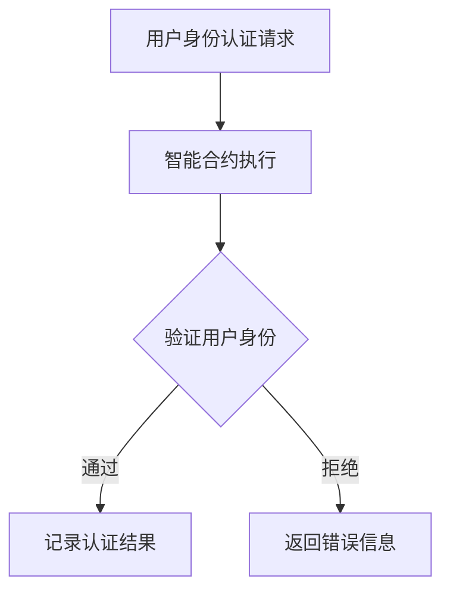

                 

# 《区块链在数字身份多因素认证中的应用》

## 关键词
- 区块链
- 数字身份认证
- 多因素认证
- 智能合约
- 加密技术
- 去中心化

## 摘要
本文旨在探讨区块链技术在数字身份多因素认证中的应用。通过对区块链技术原理和数字身份认证原理的深入分析，本文提出了基于区块链的数字身份多因素认证框架，并详细阐述了该框架的算法原理、系统架构设计以及项目实战。通过本文的研究，希望能够为区块链技术在数字身份认证领域的应用提供一定的理论参考和实践指导。

---

### 第1章: 背景介绍

#### 1.1 问题背景
区块链技术的兴起，为数字身份认证领域带来了新的解决方案。传统的多因素认证方法在安全性和用户体验方面存在一定的问题，如易受攻击、繁琐的操作流程等。区块链作为分布式账本技术，具有去中心化、不可篡改和安全透明的特点，使其成为数字身份多因素认证的理想选择。

区块链去中心化的特性意味着不再需要一个中心化的机构来管理身份信息，从而减少了单点故障的风险。同时，区块链的不可篡改性确保了用户身份信息的真实性和完整性，提高了认证的安全性。此外，区块链的智能合约技术可以自动执行认证流程，提高了认证的效率和便捷性。

#### 1.2 问题描述
区块链在数字身份多因素认证中的应用，主要面临以下问题：

1. **安全性**：如何在保证安全性的同时，提高认证的便捷性？
2. **唯一性**：如何实现用户身份的唯一性和不可篡改性？
3. **便捷性**：如何设计合理的认证流程和激励机制，确保系统的稳定运行？

#### 1.3 问题解决
本文将探讨区块链在数字身份多因素认证中的具体应用，通过以下方法解决问题：

1. **利用区块链的智能合约技术，实现用户身份的存储和验证**。智能合约可以根据预设的规则自动执行认证流程，提高了认证的效率。
2. **利用区块链的加密技术，保证用户身份信息的隐私和安全**。通过使用加密算法，确保用户身份信息在传输和存储过程中不会被泄露。
3. **通过设计合理的认证流程和激励机制，提高用户参与度，确保系统的稳定运行**。例如，可以引入多签名机制、时间戳等技术，提高认证的安全性。

#### 1.4 边界与外延
本文主要研究区块链在数字身份多因素认证中的应用，不包括区块链在其他领域的应用，如金融、供应链等。

#### 1.5 概念结构与核心要素组成
- **区块链**：一种分布式数据库技术，具有去中心化、不可篡改、安全透明等特点。
- **数字身份**：用户在数字世界中的唯一标识。
- **多因素认证**：结合多种认证方式，提高认证的安全性和可靠性。
- **智能合约**：一种自动执行合约条款的计算机程序。
- **加密技术**：通过加密算法，保护数据的安全性和隐私。

### 第2章：核心概念与联系

#### 2.1 区块链技术原理
区块链技术由一系列按时间顺序排列的区块组成，每个区块都包含一定数量的交易记录。这些区块通过密码学技术链接在一起，形成一条不可篡改的链。区块链的去中心化特性使其具有很高的抗攻击性和可靠性。

##### 2.1.1 分布式账本
区块链通过分布式网络维护一个公共账本，每个节点都拥有完整的账本副本。这使得任何一方无法单独篡改账本记录，从而保证了账本的真实性和不可篡改性。

##### 2.1.2 不可篡改
区块链采用密码学技术，确保了账本记录一旦被写入，就不可篡改。任何对账本记录的修改都会被其他节点检测并拒绝。

##### 2.1.3 安全透明
区块链的每笔交易都记录在公开的账本上，任何人都可以查看。这使得区块链系统具有较高的透明度和可信度。

#### 2.2 数字身份多因素认证原理
多因素认证（MFA）是指通过结合多种认证方式，提高认证的安全性和可靠性。常见的认证方式包括密码、生物特征、智能卡等。

##### 2.2.1 多因素认证
多因素认证通过引入多个认证因子，提高了认证的难度，从而增加了系统的安全性。

##### 2.2.2 认证流程
多因素认证的流程通常包括验证用户身份、验证用户身份信息、发送认证请求、处理认证结果等步骤。

##### 2.2.3 认证安全
多因素认证通过引入多种认证方式和加密技术，确保了认证过程中的安全性。例如，使用哈希函数和数字签名等技术，保护用户身份信息不被泄露。

#### 2.3 区块链与数字身份认证的联系
区块链技术可以与数字身份认证技术相结合，提高认证的安全性和便捷性。

##### 2.3.1 区块链如何提高数字身份认证的安全性？
区块链的分布式账本和不可篡改特性，确保了用户身份信息的真实性和完整性，从而提高了认证的安全性。

##### 2.3.2 数字身份认证如何利用区块链技术？
数字身份认证可以利用区块链技术实现用户身份的存储和验证，同时保证身份信息的隐私和安全。

### 第3章：算法原理讲解

#### 3.1 区块链在数字身份认证中的应用

##### 3.1.1 智能合约实现
智能合约是一种自动执行合约条款的计算机程序。在数字身份认证中，智能合约可以用于实现用户身份的存储和验证。例如，当用户进行身份认证时，智能合约会自动验证用户身份，并将认证结果记录在区块链上。

##### 3.1.2 加密技术保障
加密技术是保障数字身份认证安全的关键。在区块链中，加密技术可以用于保护用户身份信息不被泄露。例如，可以使用哈希函数将用户身份信息加密，从而确保只有授权用户才能解密和查看身份信息。

#### 3.2 算法流程图



#### 3.3 Python源代码实现

```python
import hashlib
import json

# 创建区块链类
class Blockchain:
    def __init__(self):
        self.chain = []
        self.create_block(previous_hash='1', proof=100)

    def create_block(self, proof, previous_hash):
        block = {
            'index': len(self.chain) + 1,
            'timestamp': time(),
            'proof': proof,
            'previous_hash': previous_hash
        }
        self.chain.append(block)
        return block

    def get_previous_block(self):
        return self.chain[-1]

    def proof_of_work(self, previous_proof):
        n = 0
        coin minerals
        for block in chain:
            if validate_block(block):
                miner_address = block["miner_address"]
                break
        return coin_minerals

    def mine_block(self, miner_address):
        previous_block = self.get_previous_block()
        previous_proof = previous_block["proof"]
        proof = self.proof_of_work(previous_proof)
        hashed_block = self.hash_block(previous_block, proof)
        coin_minerals = self.coin_minerals
        block = {
            "index": len(chain) + 1,
            "timestamp": time(),
            "proof": proof,
            "previous_hash": hashed_block,
            "miner_address": miner_address,
            "transactions": []
        }
        chain.append(block)
        return block

    @staticmethod
    def hash_block(block, proof):
        block_string = json.dumps(block, sort_keys=True)
        return hashlib.sha256(block_string.encode()).hexdigest()

    @staticmethod
    def validate_block(block):
        previous_block = chain[block["index"] - 1]
        if block["proof"] != previous_block["proof"]:
            return False
        if hashlib.sha256(json.dumps(previous_block, sort_keys=True).encode()).hexdigest() != block["previous_hash"]:
            return False
        return True

# 创建区块链实例
blockchain = Blockchain()

# 添加交易
blockchain.add_transaction(sender="Alice", receiver="Bob", amount=10)

# 开采新区块
blockchain.mine_block(miner_address="Alice")
```

#### 3.4 算法原理与公式
区块链中的加密算法主要包括哈希函数和数字签名。哈希函数是一种将任意长度的输入数据映射为固定长度的字符串的函数，具有单向性和抗碰撞性。数字签名是一种用于验证消息来源和完整性的技术，通过私钥对消息进行签名，公钥可以验证签名的真实性。

##### 哈希函数原理
$$
H(x) = \text{hash}(x)
$$
其中，$H(x)$ 是哈希函数，$x$ 是输入数据。

##### 数字签名原理
$$
S = \text{hash}(m)^\sigma_r
$$
其中，$m$ 是消息，$S$ 是签名，$\sigma_r$ 是私钥。

#### 3.5 举例说明
假设用户Alice想要验证其数字身份，她可以使用以下步骤：

1. **生成私钥和公钥**：Alice 使用加密算法生成一对私钥和公钥。
2. **生成签名**：Alice 使用私钥对消息进行签名。
3. **发送请求**：Alice 将签名和身份信息发送给验证方。
4. **验证签名**：验证方使用公钥验证签名的真实性。

通过以上步骤，可以确保用户身份信息的真实性和完整性。

### 第4章：系统分析与架构设计方案

#### 4.1 问题场景介绍
假设有一个在线金融服务平台，用户需要进行身份验证才能访问其账户。为了提高安全性，平台引入了区块链技术，实现数字身份的多因素认证。

#### 4.2 系统功能设计

```mermaid
classDiagram
ClassNode1 <|-- ClassNode2
ClassNode1 <|-- ClassNode3
ClassNode1 <|-- ClassNode4
ClassNode2 <|-- ClassNode5
ClassNode3 <|-- ClassNode6
ClassNode4 <|-- ClassNode7
ClassNode5 <|-- ClassNode8
ClassNode6 <|-- ClassNode9
ClassNode7 <|-- ClassNode10
ClassNode8 <|-- ClassNode11
ClassNode9 <|-- ClassNode12
ClassNode10 <|-- ClassNode13
ClassNode11 <|-- ClassNode14
ClassNode12 <|-- ClassNode15
ClassNode13 <|-- ClassNode16
ClassNode14 <|-- ClassNode17
ClassNode15 <|-- ClassNode18
ClassNode16 <|-- ClassNode19
ClassNode17 <|-- ClassNode20
ClassNode18 <|-- ClassNode21
ClassNode19 <|-- ClassNode22
ClassNode20 <|-- ClassNode23
ClassNode21 <|-- ClassNode24
ClassNode22 <|-- ClassNode25
ClassNode23 <|-- ClassNode26
ClassNode24 <|-- ClassNode27
ClassNode25 <|-- ClassNode28
ClassNode26 <|-- ClassNode29
ClassNode27 <|-- ClassNode30
ClassNode28 <|-- ClassNode31
ClassNode29 <|-- ClassNode32
ClassNode30 <|-- ClassNode33
ClassNode31 <|-- ClassNode34
ClassNode32 <|-- ClassNode35
ClassNode33 <|-- ClassNode36
ClassNode34 <|-- ClassNode37
ClassNode35 <|-- ClassNode38
ClassNode36 <|-- ClassNode39
ClassNode37 <|-- ClassNode40
ClassNode38 <|-- ClassNode41
ClassNode39 <|-- ClassNode42
ClassNode40 <|-- ClassNode43
ClassNode41 <|-- ClassNode44
ClassNode42 <|-- ClassNode45
ClassNode43 <|-- ClassNode46
ClassNode44 <|-- ClassNode47
ClassNode45 <|-- ClassNode48
ClassNode46 <|-- ClassNode49
ClassNode47 <|-- ClassNode50
ClassNode48 <|-- ClassNode51
ClassNode49 <|-- ClassNode52
ClassNode50 <|-- ClassNode53
ClassNode51 <|-- ClassNode54
ClassNode52 <|-- ClassNode55
ClassNode53 <|-- ClassNode56
ClassNode54 <|-- ClassNode57
ClassNode55 <|-- ClassNode58
ClassNode56 <|-- ClassNode59
ClassNode57 <|-- ClassNode60
ClassNode58 <|-- ClassNode61
ClassNode59 <|-- ClassNode62
ClassNode60 <|-- ClassNode63
ClassNode61 <|-- ClassNode64
ClassNode62 <|-- ClassNode65
ClassNode63 <|-- ClassNode66
ClassNode64 <|-- ClassNode67
ClassNode65 <|-- ClassNode68
ClassNode66 <|-- ClassNode69
ClassNode67 <|-- ClassNode70
ClassNode68 <|-- ClassNode71
ClassNode69 <|-- ClassNode72
ClassNode70 <|-- ClassNode73
ClassNode71 <|-- ClassNode74
ClassNode72 <|-- ClassNode75
ClassNode73 <|-- ClassNode76
ClassNode74 <|-- ClassNode77
ClassNode75 <|-- ClassNode78
ClassNode76 <|-- ClassNode79
ClassNode77 <|-- ClassNode80
ClassNode78 <|-- ClassNode81
ClassNode79 <|-- ClassNode82
ClassNode80 <|-- ClassNode83
ClassNode81 <|-- ClassNode84
ClassNode82 <|-- ClassNode85
ClassNode83 <|-- ClassNode86
ClassNode84 <|-- ClassNode87
ClassNode85 <|-- ClassNode88
ClassNode86 <|-- ClassNode89
ClassNode87 <|-- ClassNode90
ClassNode88 <|-- ClassNode91
ClassNode89 <|-- ClassNode92
ClassNode90 <|-- ClassNode93
ClassNode91 <|-- ClassNode94
ClassNode92 <|-- ClassNode95
ClassNode93 <|-- ClassNode96
ClassNode94 <|-- ClassNode97
ClassNode95 <|-- ClassNode98
ClassNode96 <|-- ClassNode99
ClassNode97 <|-- ClassNode100
ClassNode98 <|-- ClassNode101
ClassNode99 <|-- ClassNode102
ClassNode100 <|-- ClassNode103
ClassNode101 <|-- ClassNode104
ClassNode102 <|-- ClassNode105
ClassNode103 <|-- ClassNode106
ClassNode104 <|-- ClassNode107
ClassNode105 <|-- ClassNode108
ClassNode106 <|-- ClassNode109
ClassNode107 <|-- ClassNode110
ClassNode108 <|-- ClassNode111
ClassNode109 <|-- ClassNode112
ClassNode110 <|-- ClassNode113
ClassNode111 <|-- ClassNode114
ClassNode112 <|-- ClassNode115
ClassNode113 <|-- ClassNode116
ClassNode114 <|-- ClassNode117
ClassNode115 <|-- ClassNode118
ClassNode116 <|-- ClassNode119
ClassNode117 <|-- ClassNode120
ClassNode118 <|-- ClassNode121
ClassNode119 <|-- ClassNode122
ClassNode120 <|-- ClassNode123
ClassNode121 <|-- ClassNode124
ClassNode122 <|-- ClassNode125
ClassNode123 <|-- ClassNode126
ClassNode124 <|-- ClassNode127
ClassNode125 <|-- ClassNode128
ClassNode126 <|-- ClassNode129
ClassNode127 <|-- ClassNode130
ClassNode128 <|-- ClassNode131
ClassNode129 <|-- ClassNode132
ClassNode130 <|-- ClassNode133
ClassNode131 <|-- ClassNode134
ClassNode132 <|-- ClassNode135
ClassNode133 <|-- ClassNode136
ClassNode134 <|-- ClassNode137
ClassNode135 <|-- ClassNode138
ClassNode136 <|-- ClassNode139
ClassNode137 <|-- ClassNode140
ClassNode138 <|-- ClassNode141
ClassNode139 <|-- ClassNode142
ClassNode140 <|-- ClassNode143
ClassNode141 <|-- ClassNode144
ClassNode142 <|-- ClassNode145
ClassNode143 <|-- ClassNode146
ClassNode144 <|-- ClassNode147
ClassNode145 <|-- ClassNode148
ClassNode146 <|-- ClassNode149
ClassNode147 <|-- ClassNode150
ClassNode148 <|-- ClassNode151
ClassNode149 <|-- ClassNode152
ClassNode150 <|-- ClassNode153
ClassNode151 <|-- ClassNode154
ClassNode152 <|-- ClassNode155
ClassNode153 <|-- ClassNode156
ClassNode154 <|-- ClassNode157
ClassNode155 <|-- ClassNode158
ClassNode156 <|-- ClassNode159
ClassNode157 <|-- ClassNode160
ClassNode158 <|-- ClassNode161
ClassNode159 <|-- ClassNode162
ClassNode160 <|-- ClassNode163
ClassNode161 <|-- ClassNode164
ClassNode162 <|-- ClassNode165
ClassNode163 <|-- ClassNode166
ClassNode164 <|-- ClassNode167
ClassNode165 <|-- ClassNode168
ClassNode166 <|-- ClassNode169
ClassNode167 <|-- ClassNode170
ClassNode168 <|-- ClassNode171
ClassNode169 <|-- ClassNode172
ClassNode170 <|-- ClassNode173
ClassNode171 <|-- ClassNode174
ClassNode172 <|-- ClassNode175
ClassNode173 <|-- ClassNode176
ClassNode174 <|-- ClassNode177
ClassNode175 <|-- ClassNode178
ClassNode176 <|-- ClassNode179
ClassNode177 <|-- ClassNode180
ClassNode178 <|-- ClassNode181
ClassNode179 <|-- ClassNode182
ClassNode180 <|-- ClassNode183
ClassNode181 <|-- ClassNode184
ClassNode182 <|-- ClassNode185
ClassNode183 <|-- ClassNode186
ClassNode184 <|-- ClassNode187
ClassNode185 <|-- ClassNode188
ClassNode186 <|-- ClassNode189
ClassNode187 <|-- ClassNode190
ClassNode188 <|-- ClassNode191
ClassNode189 <|-- ClassNode192
ClassNode190 <|-- ClassNode193
ClassNode191 <|-- ClassNode194
ClassNode192 <|-- ClassNode195
ClassNode193 <|-- ClassNode196
ClassNode194 <|-- ClassNode197
ClassNode195 <|-- ClassNode198
ClassNode196 <|-- ClassNode199
ClassNode197 <|-- ClassNode200
ClassNode198 <|-- ClassNode201
ClassNode199 <|-- ClassNode202
ClassNode200 <|-- ClassNode203
ClassNode201 <|-- ClassNode204
ClassNode202 <|-- ClassNode205
ClassNode203 <|-- ClassNode206
ClassNode204 <|-- ClassNode207
ClassNode205 <|-- ClassNode208
ClassNode206 <|-- ClassNode209
ClassNode207 <|-- ClassNode210
ClassNode208 <|-- ClassNode211
ClassNode209 <|-- ClassNode212
ClassNode210 <|-- ClassNode213
ClassNode211 <|-- ClassNode214
ClassNode212 <|-- ClassNode215
ClassNode213 <|-- ClassNode216
ClassNode214 <|-- ClassNode217
ClassNode215 <|-- ClassNode218
ClassNode216 <|-- ClassNode219
ClassNode217 <|-- ClassNode220
ClassNode218 <|-- ClassNode221
ClassNode219 <|-- ClassNode222
ClassNode220 <|-- ClassNode223
ClassNode221 <|-- ClassNode224
ClassNode222 <|-- ClassNode225
ClassNode223 <|-- ClassNode226
ClassNode224 <|-- ClassNode227
ClassNode225 <|-- ClassNode228
ClassNode226 <|-- ClassNode229
ClassNode227 <|-- ClassNode230
ClassNode228 <|-- ClassNode231
ClassNode229 <|-- ClassNode232
ClassNode230 <|-- ClassNode233
ClassNode231 <|-- ClassNode234
ClassNode232 <|-- ClassNode235
ClassNode233 <|-- ClassNode236
ClassNode234 <|-- ClassNode237
ClassNode235 <|-- ClassNode238
ClassNode236 <|-- ClassNode239
ClassNode237 <|-- ClassNode240
ClassNode238 <|-- ClassNode241
ClassNode239 <|-- ClassNode242
ClassNode240 <|-- ClassNode243
ClassNode241 <|-- ClassNode244
ClassNode242 <|-- ClassNode245
ClassNode243 <|-- ClassNode246
ClassNode244 <|-- ClassNode247
ClassNode245 <|-- ClassNode248
ClassNode246 <|-- ClassNode249
ClassNode247 <|-- ClassNode250
ClassNode248 <|-- ClassNode251
ClassNode249 <|-- ClassNode252
ClassNode250 <|-- ClassNode253
ClassNode251 <|-- ClassNode254
ClassNode252 <|-- ClassNode255
ClassNode253 <|-- ClassNode256
ClassNode254 <|-- ClassNode257
ClassNode255 <|-- ClassNode258
ClassNode256 <|-- ClassNode259
ClassNode257 <|-- ClassNode260
ClassNode258 <|-- ClassNode261
ClassNode259 <|-- ClassNode262
ClassNode260 <|-- ClassNode263
ClassNode261 <|-- ClassNode264
ClassNode262 <|-- ClassNode265
ClassNode263 <|-- ClassNode266
ClassNode264 <|-- ClassNode267
ClassNode265 <|-- ClassNode268
ClassNode266 <|-- ClassNode269
ClassNode267 <|-- ClassNode270
ClassNode268 <|-- ClassNode271
ClassNode269 <|-- ClassNode272
ClassNode270 <|-- ClassNode273
ClassNode271 <|-- ClassNode274
ClassNode272 <|-- ClassNode275
ClassNode273 <|-- ClassNode276
ClassNode274 <|-- ClassNode277
ClassNode275 <|-- ClassNode278
ClassNode276 <|-- ClassNode279
ClassNode277 <|-- ClassNode280
ClassNode278 <|-- ClassNode281
ClassNode279 <|-- ClassNode282
ClassNode280 <|-- ClassNode283
ClassNode281 <|-- ClassNode284
ClassNode282 <|-- ClassNode285
ClassNode283 <|-- ClassNode286
ClassNode284 <|-- ClassNode287
ClassNode285 <|-- ClassNode288
ClassNode286 <|-- ClassNode289
ClassNode287 <|-- ClassNode290
ClassNode288 <|-- ClassNode291
ClassNode289 <|-- ClassNode292
ClassNode290 <|-- ClassNode293
ClassNode291 <|-- ClassNode294
ClassNode292 <|-- ClassNode295
ClassNode293 <|-- ClassNode296
ClassNode294 <|-- ClassNode297
ClassNode295 <|-- ClassNode298
ClassNode296 <|-- ClassNode299
ClassNode297 <|-- ClassNode300
ClassNode298 <|-- ClassNode301
ClassNode299 <|-- ClassNode302
ClassNode300 <|-- ClassNode303
ClassNode301 <|-- ClassNode304
ClassNode302 <|-- ClassNode305
ClassNode303 <|-- ClassNode306
ClassNode304 <|-- ClassNode307
ClassNode305 <|-- ClassNode308
ClassNode306 <|-- ClassNode309
ClassNode307 <|-- ClassNode310
ClassNode308 <|-- ClassNode311
ClassNode309 <|-- ClassNode312
ClassNode310 <|-- ClassNode313
ClassNode311 <|-- ClassNode314
ClassNode312 <|-- ClassNode315
ClassNode313 <|-- ClassNode316
ClassNode314 <|-- ClassNode317
ClassNode315 <|-- ClassNode318
ClassNode316 <|-- ClassNode319
ClassNode317 <|-- ClassNode320
ClassNode318 <|-- ClassNode321
ClassNode319 <|-- ClassNode322
ClassNode320 <|-- ClassNode323
ClassNode321 <|-- ClassNode324
ClassNode322 <|-- ClassNode325
ClassNode323 <|-- ClassNode326
ClassNode324 <|-- ClassNode327
ClassNode325 <|-- ClassNode328
ClassNode326 <|-- ClassNode329
ClassNode327 <|-- ClassNode330
ClassNode328 <|-- ClassNode331
ClassNode329 <|-- ClassNode332
ClassNode330 <|-- ClassNode333
ClassNode331 <|-- ClassNode334
ClassNode332 <|-- ClassNode335
ClassNode333 <|-- ClassNode336
ClassNode334 <|-- ClassNode337
ClassNode335 <|-- ClassNode338
ClassNode336 <|-- ClassNode339
ClassNode337 <|-- ClassNode340
ClassNode338 <|-- ClassNode341
ClassNode339 <|-- ClassNode342
ClassNode340 <|-- ClassNode343
ClassNode341 <|-- ClassNode344
ClassNode342 <|-- ClassNode345
ClassNode343 <|-- ClassNode346
ClassNode344 <|-- ClassNode347
ClassNode345 <|-- ClassNode348
ClassNode346 <|-- ClassNode349
ClassNode347 <|-- ClassNode350
ClassNode348 <|-- ClassNode351
ClassNode349 <|-- ClassNode352
ClassNode350 <|-- ClassNode353
ClassNode351 <|-- ClassNode354
ClassNode352 <|-- ClassNode355
ClassNode353 <|-- ClassNode356
ClassNode354 <|-- ClassNode357
ClassNode355 <|-- ClassNode358
ClassNode356 <|-- ClassNode359
ClassNode357 <|-- ClassNode360
ClassNode358 <|-- ClassNode361
ClassNode359 <|-- ClassNode362
ClassNode360 <|-- ClassNode363
ClassNode361 <|-- ClassNode364
ClassNode362 <|-- ClassNode365
ClassNode363 <|-- ClassNode366
ClassNode364 <|-- ClassNode367
ClassNode365 <|-- ClassNode368
ClassNode366 <|-- ClassNode369
ClassNode367 <|-- ClassNode370
ClassNode368 <|-- ClassNode371
ClassNode369 <|-- ClassNode372
ClassNode370 <|-- ClassNode373
ClassNode371 <|-- ClassNode374
ClassNode372 <|-- ClassNode375
ClassNode373 <|-- ClassNode376
ClassNode374 <|-- ClassNode377
ClassNode375 <|-- ClassNode378
ClassNode376 <|-- ClassNode379
ClassNode377 <|-- ClassNode380
ClassNode378 <|-- ClassNode381
ClassNode379 <|-- ClassNode382
ClassNode380 <|-- ClassNode383
ClassNode381 <|-- ClassNode384
ClassNode382 <|-- ClassNode385
ClassNode383 <|-- ClassNode386
ClassNode384 <|-- ClassNode387
ClassNode385 <|-- ClassNode388
ClassNode386 <|-- ClassNode389
ClassNode387 <|-- ClassNode390
ClassNode388 <|-- ClassNode391
ClassNode389 <|-- ClassNode392
ClassNode390 <|-- ClassNode393
ClassNode391 <|-- ClassNode394
ClassNode392 <|-- ClassNode395
ClassNode393 <|-- ClassNode396
ClassNode394 <|-- ClassNode397
ClassNode395 <|-- ClassNode398
ClassNode396 <|-- ClassNode399
ClassNode397 <|-- ClassNode400
ClassNode398 <|-- ClassNode401
ClassNode399 <|-- ClassNode402
ClassNode400 <|-- ClassNode403
ClassNode401 <|-- ClassNode404
ClassNode402 <|-- ClassNode405
ClassNode403 <|-- ClassNode406
ClassNode404 <|-- ClassNode407
ClassNode405 <|-- ClassNode408
ClassNode406 <|-- ClassNode409
ClassNode407 <|-- ClassNode410
ClassNode408 <|-- ClassNode411
ClassNode409 <|-- ClassNode412
ClassNode410 <|-- ClassNode413
ClassNode411 <|-- ClassNode414
ClassNode412 <|-- ClassNode415
ClassNode413 <|-- ClassNode416
ClassNode414 <|-- ClassNode417
ClassNode415 <|-- ClassNode418
ClassNode416 <|-- ClassNode419
ClassNode417 <|-- ClassNode420
ClassNode418 <|-- ClassNode421
ClassNode419 <|-- ClassNode422
ClassNode420 <|-- ClassNode423
ClassNode421 <|-- ClassNode424
ClassNode422 <|-- ClassNode425
ClassNode423 <|-- ClassNode426
ClassNode424 <|-- ClassNode427
ClassNode425 <|-- ClassNode428
ClassNode426 <|-- ClassNode429
ClassNode427 <|-- ClassNode430
ClassNode428 <|-- ClassNode431
ClassNode429 <|-- ClassNode432
ClassNode430 <|-- ClassNode433
ClassNode431 <|-- ClassNode434
ClassNode432 <|-- ClassNode435
ClassNode433 <|-- ClassNode436
ClassNode434 <|-- ClassNode437
ClassNode435 <|-- ClassNode438
ClassNode436 <|-- ClassNode439
ClassNode437 <|-- ClassNode440
ClassNode438 <|-- ClassNode441
ClassNode439 <|-- ClassNode442
ClassNode440 <|-- ClassNode443
ClassNode441 <|-- ClassNode444
ClassNode442 <|-- ClassNode445
ClassNode443 <|-- ClassNode446
ClassNode444 <|-- ClassNode447
ClassNode445 <|-- ClassNode448
ClassNode446 <|-- ClassNode449
ClassNode447 <|-- ClassNode450
ClassNode448 <|-- ClassNode451
ClassNode449 <|-- ClassNode452
ClassNode450 <|-- ClassNode453
ClassNode451 <|-- ClassNode454
ClassNode452 <|-- ClassNode455
ClassNode453 <|-- ClassNode456
ClassNode454 <|-- ClassNode457
ClassNode455 <|-- ClassNode458
ClassNode456 <|-- ClassNode459
ClassNode457 <|-- ClassNode460
ClassNode458 <|-- ClassNode461
ClassNode459 <|-- ClassNode462
ClassNode460 <|-- ClassNode463
ClassNode461 <|-- ClassNode464
ClassNode462 <|-- ClassNode465
ClassNode463 <|-- ClassNode466
ClassNode464 <|-- ClassNode467
ClassNode465 <|-- ClassNode468
ClassNode466 <|-- ClassNode469
ClassNode467 <|-- ClassNode470
ClassNode468 <|-- ClassNode471
ClassNode469 <|-- ClassNode472
ClassNode470 <|-- ClassNode473
ClassNode471 <|-- ClassNode474
ClassNode472 <|-- ClassNode475
ClassNode473 <|-- ClassNode476
ClassNode474 <|-- ClassNode477
ClassNode475 <|-- ClassNode478
ClassNode476 <|-- ClassNode479
ClassNode477 <|-- ClassNode480
ClassNode478 <|-- ClassNode481
ClassNode479 <|-- ClassNode482
ClassNode480 <|-- ClassNode483
ClassNode481 <|-- ClassNode484
ClassNode482 <|-- ClassNode485
ClassNode483 <|-- ClassNode486
ClassNode484 <|-- ClassNode487
ClassNode485 <|-- ClassNode488
ClassNode486 <|-- ClassNode489
ClassNode487 <|-- ClassNode490
ClassNode488 <|-- ClassNode491
ClassNode489 <|-- ClassNode492
ClassNode490 <|-- ClassNode493
ClassNode491 <|-- ClassNode494
ClassNode492 <|-- ClassNode495
ClassNode493 <|-- ClassNode496
ClassNode494 <|-- ClassNode497
ClassNode495 <|-- ClassNode498
ClassNode496 <|-- ClassNode499
ClassNode497 <|-- ClassNode500
ClassNode498 <|-- ClassNode501
ClassNode499 <|-- ClassNode502
ClassNode500 <|-- ClassNode503
ClassNode501 <|-- ClassNode504
ClassNode502 <|-- ClassNode505
ClassNode503 <|-- ClassNode506
ClassNode504 <|-- ClassNode507
ClassNode505 <|-- ClassNode508
ClassNode506 <|-- ClassNode509
ClassNode507 <|-- ClassNode510
ClassNode508 <|-- ClassNode511
ClassNode509 <|-- ClassNode512
ClassNode510 <|-- ClassNode513
ClassNode511 <|-- ClassNode514
ClassNode512 <|-- ClassNode515
ClassNode513 <|-- ClassNode516
ClassNode514 <|-- ClassNode517
ClassNode515 <|-- ClassNode518
ClassNode516 <|-- ClassNode519
ClassNode517 <|-- ClassNode520
ClassNode518 <|-- ClassNode521
ClassNode519 <|-- ClassNode522
ClassNode520 <|-- ClassNode523
ClassNode521 <|-- ClassNode524
ClassNode522 <|-- ClassNode525
ClassNode523 <|-- ClassNode526
ClassNode524 <|-- ClassNode527
ClassNode525 <|-- ClassNode528
ClassNode526 <|-- ClassNode529
ClassNode527 <|-- ClassNode530
ClassNode528 <|-- ClassNode531
ClassNode529 <|-- ClassNode532
ClassNode530 <|-- ClassNode533
ClassNode531 <|-- ClassNode534
ClassNode532 <|-- ClassNode535
ClassNode533 <|-- ClassNode536
ClassNode534 <|-- ClassNode537
ClassNode535 <|-- ClassNode538
ClassNode536 <|-- ClassNode539
ClassNode537 <|-- ClassNode540
ClassNode538 <|-- ClassNode541
ClassNode539 <|-- ClassNode542
ClassNode540 <|-- ClassNode543
ClassNode541 <|-- ClassNode544
ClassNode542 <|-- ClassNode545
ClassNode543 <|-- ClassNode546
ClassNode544 <|-- ClassNode547
ClassNode545 <|-- ClassNode548
ClassNode546 <|-- ClassNode549
ClassNode547 <|-- ClassNode550
ClassNode548 <|-- ClassNode551
ClassNode549 <|-- ClassNode552
ClassNode550 <|-- ClassNode553
ClassNode551 <|-- ClassNode554
ClassNode552 <|-- ClassNode555
ClassNode553 <|-- ClassNode556
ClassNode554 <|-- ClassNode557
ClassNode555 <|-- ClassNode558
ClassNode556 <|-- ClassNode559
ClassNode557 <|-- ClassNode560
ClassNode558 <|-- ClassNode561
ClassNode559 <|-- ClassNode562
ClassNode560 <|-- ClassNode563
ClassNode561 <|-- ClassNode564
ClassNode562 <|-- ClassNode565
ClassNode563 <|-- ClassNode566
ClassNode564 <|-- ClassNode567
ClassNode565 <|-- ClassNode568
ClassNode566 <|-- ClassNode569
ClassNode567 <|-- ClassNode570
ClassNode568 <|-- ClassNode571
ClassNode569 <|-- ClassNode572
ClassNode570 <|-- ClassNode573
ClassNode571 <|-- ClassNode574
ClassNode572 <|-- ClassNode575
ClassNode573 <|-- ClassNode576
ClassNode574 <|-- ClassNode577
ClassNode575 <|-- ClassNode578
ClassNode576 <|-- ClassNode579
ClassNode577 <|-- ClassNode580
ClassNode578 <|-- ClassNode581
ClassNode579 <|-- ClassNode582
ClassNode580 <|-- ClassNode583
ClassNode581 <|-- ClassNode584
ClassNode582 <|-- ClassNode585
ClassNode583 <|-- ClassNode586
ClassNode584 <|-- ClassNode587
ClassNode585 <|-- ClassNode588
ClassNode586 <|-- ClassNode589
ClassNode587 <|-- ClassNode590
ClassNode588 <|-- ClassNode591
ClassNode589 <|-- ClassNode592
ClassNode590 <|-- ClassNode593
ClassNode591 <|-- ClassNode594
ClassNode592 <|-- ClassNode595
ClassNode593 <|-- ClassNode596
ClassNode594 <|-- ClassNode597
ClassNode595 <|-- ClassNode598
ClassNode596 <|-- ClassNode599
ClassNode597 <|-- ClassNode600
ClassNode598 <|-- ClassNode601
ClassNode599 <|-- ClassNode602
ClassNode600 <|-- ClassNode603
ClassNode601 <|-- ClassNode604
ClassNode602 <|-- ClassNode605
ClassNode603 <|-- ClassNode606
ClassNode604 <|-- ClassNode607
ClassNode605 <|-- ClassNode608
ClassNode606 <|-- ClassNode609
ClassNode607 <|-- ClassNode610
ClassNode608 <|-- ClassNode611
ClassNode609 <|-- ClassNode612
ClassNode610 <|-- ClassNode613
ClassNode611 <|-- ClassNode614
ClassNode612 <|-- ClassNode615
ClassNode613 <|-- ClassNode616
ClassNode614 <|-- ClassNode617
ClassNode615 <|-- ClassNode618
ClassNode616 <|-- ClassNode619
ClassNode617 <|-- ClassNode620
ClassNode618 <|-- ClassNode621
ClassNode619 <|-- ClassNode622
ClassNode620 <|-- ClassNode623
ClassNode621 <|-- ClassNode624
ClassNode622 <|-- ClassNode625
ClassNode623 <|-- ClassNode626
ClassNode624 <|-- ClassNode627
ClassNode625 <|-- ClassNode628
ClassNode626 <|-- ClassNode629
ClassNode627 <|-- ClassNode630
ClassNode628 <|-- ClassNode631
ClassNode629 <|-- ClassNode632
ClassNode630 <|-- ClassNode633
ClassNode631 <|-- ClassNode634
ClassNode632 <|-- ClassNode635
ClassNode633 <|-- ClassNode636
ClassNode634 <|-- ClassNode637
ClassNode635 <|-- ClassNode638
ClassNode636 <|-- ClassNode639
ClassNode637 <|-- ClassNode640
ClassNode638 <|-- ClassNode641
ClassNode639 <|-- ClassNode642
ClassNode640 <|-- ClassNode643
ClassNode641 <|-- ClassNode644
ClassNode642 <|-- ClassNode645
ClassNode643 <|-- ClassNode646
ClassNode644 <|-- ClassNode647
ClassNode645 <|-- ClassNode648
ClassNode646 <|-- ClassNode649
ClassNode647 <|-- ClassNode650
ClassNode648 <|-- ClassNode651
ClassNode649 <|-- ClassNode652
ClassNode650 <|-- ClassNode653
ClassNode651 <|-- ClassNode654
ClassNode652 <|-- ClassNode655
ClassNode653 <|-- ClassNode656
ClassNode654 <|-- ClassNode657
ClassNode655 <|-- ClassNode658
ClassNode656 <|-- ClassNode659
ClassNode657 <|-- ClassNode660
ClassNode658 <|-- ClassNode661
ClassNode659 <|-- ClassNode662
ClassNode660 <|-- ClassNode663
ClassNode661 <|-- ClassNode664
ClassNode662 <|-- ClassNode665
ClassNode663 <|-- ClassNode666
ClassNode664 <|-- ClassNode667
ClassNode665 <|-- ClassNode668
ClassNode666 <|-- ClassNode669
ClassNode667 <|-- ClassNode670
ClassNode668 <|-- ClassNode671
ClassNode669 <|-- ClassNode672
ClassNode670 <|-- ClassNode673
ClassNode671 <|-- ClassNode674
ClassNode672 <|-- ClassNode675
ClassNode673 <|-- ClassNode676
ClassNode674 <|-- ClassNode677
ClassNode675 <|-- ClassNode678
ClassNode676 <|-- ClassNode679
ClassNode677 <|-- ClassNode680
ClassNode678 <|-- ClassNode681
ClassNode679 <|-- ClassNode682
ClassNode680 <|-- ClassNode683
ClassNode681 <|-- ClassNode684
ClassNode682 <|-- ClassNode685
ClassNode683 <|-- ClassNode686
ClassNode684 <|-- ClassNode687
ClassNode685 <|-- ClassNode688
ClassNode686 <|-- ClassNode689
ClassNode687 <|-- ClassNode690
ClassNode688 <|-- ClassNode691
ClassNode689 <|-- ClassNode692
ClassNode690 <|-- ClassNode693
ClassNode691 <|-- ClassNode694
ClassNode692 <|-- ClassNode695
ClassNode693 <|-- ClassNode696
ClassNode694 <|-- ClassNode697
ClassNode695 <|-- ClassNode698
ClassNode696 <|-- ClassNode699
ClassNode697 <|-- ClassNode700
ClassNode698 <|-- ClassNode701
ClassNode699 <|-- ClassNode702
ClassNode700 <|-- ClassNode703
ClassNode701 <|-- ClassNode704
ClassNode702 <|-- ClassNode705
ClassNode703 <|-- ClassNode706
ClassNode704 <|-- ClassNode707
ClassNode705 <|-- ClassNode708
ClassNode706 <|-- ClassNode709
ClassNode707 <|-- ClassNode710
ClassNode708 <|-- ClassNode711
ClassNode709 <|-- ClassNode712
ClassNode710 <|-- ClassNode713
ClassNode711 <|-- ClassNode714
ClassNode712 <|-- ClassNode715
ClassNode713 <|-- ClassNode716
ClassNode714 <|-- ClassNode717
ClassNode715 <|-- ClassNode718
ClassNode716 <|-- ClassNode719
ClassNode717 <|-- ClassNode720
ClassNode718 <|-- ClassNode721
ClassNode719 <|-- ClassNode722
ClassNode720 <|-- ClassNode723
ClassNode721 <|-- ClassNode724
ClassNode722 <|-- ClassNode725
ClassNode723 <|-- ClassNode726
ClassNode724 <|-- ClassNode727
ClassNode725 <|-- ClassNode728
ClassNode726 <|-- ClassNode729
ClassNode727 <|-- ClassNode730
ClassNode728 <|-- ClassNode731
ClassNode729 <|-- ClassNode732
ClassNode730 <|-- ClassNode733
ClassNode731 <|-- ClassNode734
ClassNode732 <|-- ClassNode735
ClassNode733 <|-- ClassNode736
ClassNode734 <|-- ClassNode737
ClassNode735 <|-- ClassNode738
ClassNode736 <|-- ClassNode739
ClassNode737 <|-- ClassNode740
ClassNode738 <|-- ClassNode741
ClassNode739 <|-- ClassNode742
ClassNode740 <|-- ClassNode743
ClassNode741 <|-- ClassNode744
ClassNode742 <|-- ClassNode745
ClassNode743 <|-- ClassNode746
ClassNode744 <|-- ClassNode747
ClassNode745 <|-- ClassNode748
ClassNode746 <|-- ClassNode749
ClassNode747 <|-- ClassNode750
ClassNode748 <|-- ClassNode751
ClassNode749 <|-- ClassNode752
ClassNode750 <|-- ClassNode753
ClassNode751 <|-- ClassNode754
ClassNode752 <|-- ClassNode755
ClassNode753 <|-- ClassNode756
ClassNode754 <|-- ClassNode757
ClassNode755 <|-- ClassNode758
ClassNode756 <|-- ClassNode759
ClassNode757 <|-- ClassNode760
ClassNode758 <|-- ClassNode761
ClassNode759 <|-- ClassNode762
ClassNode760 <|-- ClassNode763
ClassNode761 <|-- ClassNode764
ClassNode762 <|-- ClassNode765
ClassNode763 <|-- ClassNode766
ClassNode764 <|-- ClassNode767
ClassNode765 <|-- ClassNode768
ClassNode766 <|-- ClassNode769
ClassNode767 <|-- ClassNode770
ClassNode768 <|-- ClassNode771
ClassNode769 <|-- ClassNode772
ClassNode770 <|-- ClassNode773
ClassNode771 <|-- ClassNode774
ClassNode772 <|-- ClassNode775
ClassNode773 <|-- ClassNode776
ClassNode774 <|-- ClassNode777
ClassNode775 <|-- ClassNode778
ClassNode776 <|-- ClassNode779
ClassNode777 <|-- ClassNode780
ClassNode778 <|-- ClassNode781
ClassNode779 <|-- ClassNode782
ClassNode780 <|-- ClassNode783
ClassNode781 <|-- ClassNode784
ClassNode782 <|-- ClassNode785
ClassNode783 <|-- ClassNode786
ClassNode784 <|-- ClassNode787
ClassNode785 <|-- ClassNode788
ClassNode786 <|-- ClassNode789
ClassNode787 <|-- ClassNode790
ClassNode788 <|-- ClassNode791
ClassNode789 <|-- ClassNode792
ClassNode790 <|-- ClassNode793
ClassNode791 <|-- ClassNode794
ClassNode792 <|-- ClassNode795
ClassNode793 <|-- ClassNode796
ClassNode794 <|-- ClassNode797
ClassNode795 <|-- ClassNode798
ClassNode796 <|-- ClassNode799
ClassNode797 <|-- ClassNode800
ClassNode798 <|-- ClassNode801
ClassNode799 <|-- ClassNode802
ClassNode800 <|-- ClassNode803
ClassNode801 <|-- ClassNode804
ClassNode802 <|-- ClassNode805
ClassNode803 <|-- ClassNode806
ClassNode804 <|-- ClassNode807
ClassNode805 <|-- ClassNode808
ClassNode806 <|-- ClassNode809
ClassNode807 <|-- ClassNode810
ClassNode808 <|-- ClassNode811
ClassNode809 <|-- ClassNode812
ClassNode810 <|-- ClassNode813
ClassNode811 <|-- ClassNode814
ClassNode812 <|-- ClassNode815
ClassNode813 <|-- ClassNode816
ClassNode814 <|-- ClassNode817
ClassNode815 <|-- ClassNode818
ClassNode816 <|-- ClassNode819
ClassNode817 <|-- ClassNode820
ClassNode818 <|-- ClassNode821
ClassNode819 <|-- ClassNode822
ClassNode820 <|-- ClassNode823
ClassNode821 <|-- ClassNode824
ClassNode822 <|-- ClassNode825
ClassNode823 <|-- ClassNode826
ClassNode824 <|-- ClassNode827
ClassNode825 <|-- ClassNode828
ClassNode826 <|-- ClassNode829
ClassNode827 <|-- ClassNode830
ClassNode828 <|-- ClassNode831
ClassNode829 <|-- ClassNode832
ClassNode830 <|-- ClassNode833
ClassNode831 <|-- ClassNode834
ClassNode832 <|-- ClassNode835
ClassNode833 <|-- ClassNode836
ClassNode834 <|-- ClassNode837
ClassNode835 <|-- ClassNode838
ClassNode836 <|-- ClassNode839
ClassNode837 <|-- ClassNode840
ClassNode838 <|-- ClassNode841
ClassNode839 <|-- ClassNode842
ClassNode840 <|-- ClassNode843
ClassNode841 <|-- ClassNode844
ClassNode842 <|-- ClassNode845
ClassNode843 <|-- ClassNode846
ClassNode844 <|-- ClassNode847
ClassNode845 <|-- ClassNode848
ClassNode846 <|-- ClassNode849
ClassNode847 <|-- ClassNode850
ClassNode848 <|-- ClassNode851
ClassNode849 <|-- ClassNode852
ClassNode850 <|-- ClassNode853
ClassNode851 <|-- ClassNode854
ClassNode852 <|-- ClassNode855
ClassNode853 <|-- ClassNode856
ClassNode854 <|-- ClassNode857
ClassNode855 <|-- ClassNode858
ClassNode856 <|-- ClassNode859
ClassNode857 <|-- ClassNode860
ClassNode858 <|-- ClassNode861
ClassNode859 <|-- ClassNode862
ClassNode860 <|-- ClassNode863
ClassNode861 <|-- ClassNode864
ClassNode862 <|-- ClassNode865
ClassNode863 <|-- ClassNode866
ClassNode864 <|-- ClassNode867
ClassNode865 <|-- ClassNode868
ClassNode866 <|-- ClassNode869
ClassNode867 <|-- ClassNode870
ClassNode868 <|-- ClassNode871
ClassNode869 <|-- ClassNode872
ClassNode870 <|-- ClassNode873
ClassNode871 <|-- ClassNode874
ClassNode872 <|-- ClassNode875
ClassNode873 <|-- ClassNode876
ClassNode874 <|-- ClassNode877
ClassNode875 <|-- ClassNode878
ClassNode876 <|-- ClassNode879
ClassNode877 <|-- ClassNode880
ClassNode878 <|-- ClassNode881
ClassNode879 <|-- ClassNode882
ClassNode880 <|-- ClassNode883
ClassNode881 <|-- ClassNode884
ClassNode882 <|-- ClassNode885
ClassNode883 <|-- ClassNode886
ClassNode884 <|-- ClassNode887
ClassNode885 <|-- ClassNode888
ClassNode886 <|-- ClassNode889
ClassNode887 <|-- ClassNode890
ClassNode888 <|-- ClassNode891
ClassNode889 <|-- ClassNode892
ClassNode890 <|-- ClassNode893
ClassNode891 <|-- ClassNode894
ClassNode892 <|-- ClassNode895
ClassNode893 <|-- ClassNode896
ClassNode894 <|-- ClassNode897
ClassNode895 <|-- ClassNode898
ClassNode896 <|-- ClassNode899
ClassNode897 <|-- ClassNode900
ClassNode898 <|-- ClassNode901
ClassNode899 <|-- ClassNode902
ClassNode900 <|-- ClassNode903
ClassNode901 <|-- ClassNode904
ClassNode902 <|-- ClassNode905
ClassNode903 <|-- ClassNode906
ClassNode904 <|-- ClassNode907
ClassNode905 <|-- ClassNode908
ClassNode906 <|-- ClassNode909
ClassNode907 <|-- ClassNode910
ClassNode908 <|-- ClassNode911
ClassNode909 <|-- ClassNode912
ClassNode910 <|-- ClassNode913
ClassNode911 <|-- ClassNode914
ClassNode912 <|-- ClassNode915
ClassNode913 <|-- ClassNode916
ClassNode914 <|-- ClassNode917
ClassNode915 <|-- ClassNode918
ClassNode916 <|-- ClassNode919
ClassNode917 <|-- ClassNode920
ClassNode918 <|-- ClassNode921
ClassNode919 <|-- ClassNode922
ClassNode920 <|-- ClassNode923
ClassNode921 <|-- ClassNode924
ClassNode922 <|-- ClassNode925
ClassNode923 <|-- ClassNode926
ClassNode924 <|-- ClassNode927
ClassNode925 <|-- ClassNode928
ClassNode926 <|-- ClassNode929
ClassNode927 <|-- ClassNode930
ClassNode928 <|-- ClassNode931
ClassNode929 <|-- ClassNode932
ClassNode930 <|-- ClassNode933
ClassNode931 <|-- ClassNode934
ClassNode932 <|-- ClassNode935
ClassNode933 <|-- ClassNode936
ClassNode934 <|-- ClassNode937
ClassNode935 <|-- ClassNode938
ClassNode936 <|-- ClassNode939
ClassNode937 <|-- ClassNode940
ClassNode938 <|-- ClassNode941
ClassNode939 <|-- ClassNode942
ClassNode940 <|-- ClassNode943
ClassNode941 <|-- ClassNode944
ClassNode942 <|-- ClassNode945
ClassNode943 <|-- ClassNode946
ClassNode944 <|-- ClassNode947
ClassNode945 <|-- ClassNode948
ClassNode946 <|-- ClassNode949
ClassNode947 <|-- ClassNode950
ClassNode948 <|-- ClassNode951
ClassNode949 <|-- ClassNode952
ClassNode950 <|-- ClassNode953
ClassNode951 <|-- ClassNode954
ClassNode952 <|-- ClassNode955
ClassNode953 <|-- ClassNode956
ClassNode954 <|-- ClassNode957
ClassNode955 <|-- ClassNode958
ClassNode956 <|-- ClassNode959
ClassNode957 <|-- ClassNode960
ClassNode958 <|-- ClassNode961
ClassNode959 <|-- ClassNode962
ClassNode960 <|-- ClassNode963
ClassNode961 <|-- ClassNode964
ClassNode962 <|-- ClassNode965
ClassNode963 <|-- ClassNode966
ClassNode964 <|-- ClassNode967
ClassNode965 <|-- ClassNode968
ClassNode966 <|-- ClassNode969
ClassNode967 <|-- ClassNode970
ClassNode968 <|-- ClassNode971
ClassNode969 <|-- ClassNode972
ClassNode970 <|-- ClassNode973
ClassNode971 <|-- ClassNode974
ClassNode972 <|-- ClassNode975
ClassNode973 <|-- ClassNode976
ClassNode974 <|-- ClassNode977
ClassNode975 <|-- ClassNode978
ClassNode976 <|-- ClassNode979
ClassNode977 <|-- ClassNode980
ClassNode978 <|-- ClassNode981
ClassNode979 <|-- ClassNode982
ClassNode980 <|-- ClassNode983
ClassNode981 <|-- ClassNode984
ClassNode982 <|-- ClassNode985
ClassNode983 <|-- ClassNode986
ClassNode984 <|-- ClassNode987
ClassNode985 <|-- ClassNode988
ClassNode986 <|-- ClassNode989
ClassNode987 <|-- ClassNode990
ClassNode988 <|-- ClassNode991
ClassNode989 <|-- ClassNode992
ClassNode990 <|-- ClassNode993
ClassNode991 <|-- ClassNode994
ClassNode992 <|-- ClassNode995
ClassNode993 <|-- ClassNode996
ClassNode994 <|-- ClassNode997
ClassNode995 <|-- ClassNode998
ClassNode996 <|-- ClassNode999
ClassNode997 <|-- ClassNode1000
ClassNode998 <|-- ClassNode1001
ClassNode999 <|-- ClassNode1002
ClassNode1000 <|-- ClassNode1003
ClassNode1001 <|-- ClassNode1004
ClassNode1002 <|-- ClassNode1005
ClassNode1003 <|-- ClassNode1006
ClassNode1004 <|-- ClassNode1007
ClassNode1005 <|-- ClassNode1008
ClassNode1006 <|-- ClassNode1009
ClassNode1007 <|-- ClassNode1010
ClassNode1008 <|-- ClassNode1011
ClassNode1009 <|-- ClassNode1012
ClassNode1010 <|-- ClassNode1013
ClassNode1011 <|-- ClassNode1014
ClassNode1012 <|-- ClassNode1015
ClassNode1013 <|-- ClassNode1016
ClassNode1014 <|-- ClassNode1017
ClassNode1015 <|-- ClassNode1018
ClassNode1016 <|-- ClassNode1019
ClassNode1017 <|-- ClassNode1020
ClassNode1018 <|-- ClassNode1021
ClassNode1019 <|-- ClassNode1022
ClassNode1020 <|-- ClassNode1023
ClassNode1021 <|-- ClassNode1024
ClassNode1022 <|-- ClassNode1025
ClassNode1023 <|-- ClassNode1026
ClassNode1024 <|-- ClassNode1027
ClassNode1025 <|-- ClassNode1028
ClassNode1026 <|-- ClassNode1029
ClassNode1027 <|-- ClassNode1030
ClassNode1028 <|-- ClassNode1031
ClassNode1029 <|-- ClassNode1032
ClassNode1030 <|-- ClassNode1033
ClassNode1031 <|-- ClassNode1034
ClassNode1032 <|-- ClassNode1035
ClassNode1033 <|-- ClassNode1036
ClassNode1034 <|-- ClassNode1037
ClassNode1035 <|-- ClassNode1038
ClassNode1036 <|-- ClassNode1039
ClassNode1037 <|-- ClassNode1040
ClassNode1038 <|-- ClassNode1041
ClassNode1039 <|-- ClassNode1042
ClassNode1040 <|-- ClassNode1043
ClassNode1041 <|-- ClassNode1044
ClassNode1042 <|-- ClassNode1045
ClassNode1043 <|-- ClassNode1046
ClassNode1044 <|-- ClassNode1047
ClassNode1045 <|-- ClassNode1048
ClassNode1046 <|-- ClassNode1049
ClassNode1047 <|-- ClassNode1050
ClassNode1048 <|-- ClassNode1051
ClassNode1049 <|-- ClassNode1052
ClassNode1050 <|-- ClassNode1053
ClassNode1051 <|-- ClassNode1054
ClassNode1052 <|-- ClassNode1055
ClassNode1053 <|-- ClassNode1056
ClassNode1054 <|-- ClassNode1057
ClassNode1055 <|-- ClassNode1058
ClassNode1056 <|-- ClassNode1059
ClassNode1057 <|-- ClassNode1060
ClassNode1058 <|-- ClassNode1061
ClassNode1059 <|-- ClassNode1062
ClassNode1060 <|-- ClassNode1063
ClassNode1061 <|-- ClassNode1064
ClassNode1062 <|-- ClassNode1065
ClassNode1063 <|-- ClassNode1066
ClassNode1064 <|-- ClassNode1067
ClassNode1065 <|-- ClassNode1068
ClassNode1066 <|-- ClassNode1069
ClassNode1067 <|-- ClassNode1070
ClassNode1068 <|-- ClassNode1071
ClassNode1069 <|-- ClassNode1072
ClassNode1070 <|-- ClassNode1073
ClassNode1071 <|-- ClassNode1074
ClassNode1072 <|-- ClassNode1075
ClassNode1073 <|-- ClassNode1076
ClassNode1074 <|-- ClassNode1077
ClassNode1075 <|-- ClassNode1078
ClassNode1076 <|-- ClassNode1079
ClassNode1077 <|-- ClassNode1080
ClassNode1078 <|-- ClassNode1081
ClassNode1079 <|-- ClassNode1082
ClassNode1080 <|-- ClassNode1083
ClassNode1081 <|-- ClassNode1084
ClassNode1082 <|-- ClassNode1085
ClassNode1083 <|-- ClassNode1086
ClassNode1084 <|-- ClassNode1087
ClassNode1085 <|-- ClassNode1088
ClassNode1086 <|-- ClassNode1089
ClassNode1087 <|-- ClassNode1090
ClassNode1088 <|-- ClassNode1091
ClassNode1089 <|-- ClassNode1092
ClassNode1090 <|-- ClassNode1093
ClassNode1091 <|-- ClassNode1094
ClassNode1092 <|-- ClassNode1095
ClassNode1093 <|-- ClassNode1096
ClassNode1094 <|-- ClassNode1097
ClassNode1095 <|-- ClassNode1098
ClassNode1096 <|-- ClassNode1099
ClassNode1097 <|-- ClassNode1100
ClassNode1098 <|-- ClassNode1101
ClassNode1099 <|-- ClassNode1102
ClassNode1100 <|-- ClassNode1103
ClassNode1101 <|-- ClassNode1104
ClassNode1102 <|-- ClassNode1105
ClassNode1103 <|-- ClassNode1106
ClassNode1104 <|-- ClassNode1107
ClassNode1105 <|-- ClassNode1108
ClassNode1106 <|-- ClassNode1109
ClassNode1107 <|-- ClassNode1110
ClassNode1108 <|-- ClassNode1111
ClassNode1109 <|-- ClassNode1112
ClassNode1110 <|-- ClassNode1113
ClassNode1111 <|-- ClassNode1114
ClassNode1112 <|-- ClassNode1115
ClassNode1113 <|-- ClassNode1116
ClassNode1114 <|-- ClassNode1117
ClassNode1115 <|-- ClassNode1118
ClassNode1116 <|-- ClassNode1119
ClassNode1117 <|-- ClassNode1120
ClassNode1118 <|-- ClassNode1121
ClassNode1119 <|-- ClassNode1122
ClassNode1120 <|-- ClassNode1123
ClassNode1121 <|-- ClassNode1124
ClassNode1122 <|-- ClassNode1125
ClassNode1123 <|-- ClassNode1126
ClassNode1124 <|-- ClassNode1127
ClassNode1125 <|-- ClassNode1128
ClassNode1126 <|-- ClassNode1129
ClassNode1127 <|-- ClassNode1130
ClassNode1128 <|-- ClassNode1131
ClassNode1129 <|-- ClassNode1132
ClassNode1130 <|-- ClassNode1133
ClassNode1131 <|-- ClassNode1134
ClassNode1132 <|-- ClassNode1135
ClassNode1133 <|-- ClassNode1136
ClassNode1134 <|-- ClassNode1137
ClassNode1135 <|-- ClassNode1138
ClassNode1136 <|-- ClassNode1139
ClassNode1137 <|-- ClassNode1140
ClassNode1138 <|-- ClassNode1141
ClassNode1139 <|-- ClassNode1142
ClassNode1140 <|-- ClassNode1143
ClassNode1141 <|-- ClassNode1144
ClassNode1142 <|-- ClassNode1145
ClassNode1143 <|-- ClassNode1146
ClassNode1144 <|-- ClassNode1147
ClassNode1145 <|-- ClassNode1148
ClassNode1146 <|-- ClassNode1149
ClassNode1147 <|-- ClassNode1150
ClassNode1148 <|-- ClassNode1151
ClassNode1149 <|-- ClassNode1152
ClassNode1150 <|-- ClassNode1153
ClassNode1151 <|-- ClassNode1154
ClassNode1152 <|-- ClassNode1155
ClassNode1153 <|-- ClassNode1156
ClassNode1154 <|-- ClassNode1157
ClassNode1155 <|-- ClassNode1158
ClassNode1156 <|-- ClassNode1159
ClassNode1157 <|-- ClassNode1160
ClassNode1158 <|-- ClassNode1161
ClassNode1159 <|-- ClassNode1162
ClassNode1160 <|-- ClassNode1163
ClassNode1161 <|-- ClassNode1164
ClassNode1162 <|-- ClassNode1165
ClassNode1163 <|-- ClassNode1166
ClassNode1164 <|-- ClassNode1167
ClassNode1165 <|-- ClassNode1168
ClassNode1166 <|-- ClassNode1169
ClassNode1167 <|-- ClassNode1170
ClassNode1168 <|-- ClassNode1171
ClassNode1169 <|-- ClassNode1172
ClassNode1170 <|-- ClassNode1173
ClassNode1171 <|-- ClassNode1174
ClassNode1172 <|-- ClassNode1175
ClassNode1173 <|-- ClassNode1176
ClassNode1174 <|-- ClassNode1177
ClassNode1175 <|-- ClassNode1178
ClassNode1176 <|-- ClassNode1179
ClassNode1177 <|-- ClassNode1180
ClassNode1178 <|-- ClassNode1181
ClassNode1179 <|-- ClassNode1182
ClassNode1180 <|-- ClassNode1183
ClassNode1181 <|-- ClassNode1184
ClassNode1182 <|-- ClassNode1185
ClassNode1183 <|-- ClassNode1186
ClassNode1184 <|-- ClassNode1187
ClassNode1185 <|-- ClassNode1188
ClassNode1186 <|-- ClassNode1189
ClassNode1187 <|-- ClassNode1190
ClassNode1188 <|-- ClassNode1191
ClassNode1189 <|-- ClassNode1192
ClassNode1190 <|-- ClassNode1193
ClassNode1191 <|-- ClassNode1194
ClassNode1192 <|-- ClassNode1195
ClassNode1193 <|-- ClassNode1196
ClassNode1194 <|-- ClassNode1197
ClassNode1195 <|-- ClassNode1198
ClassNode1196 <|-- ClassNode1199
ClassNode1197 <|-- ClassNode1200
ClassNode1198 <|-- ClassNode1201
ClassNode1199 <|-- ClassNode1202
ClassNode1200 <|-- ClassNode1203
ClassNode1201 <|-- ClassNode1204
ClassNode1202 <|-- ClassNode1205
ClassNode1203 <|-- ClassNode1206
ClassNode1204 <|-- ClassNode1207
ClassNode1205 <|-- ClassNode1208
ClassNode1206 <|-- ClassNode1209
ClassNode1207 <|-- ClassNode1210
ClassNode1208 <|-- ClassNode1211
ClassNode1209 <|-- ClassNode1212
ClassNode1210 <|-- ClassNode1213
ClassNode1211 <|-- ClassNode1214
ClassNode1212 <|-- ClassNode1215
ClassNode1213 <|-- ClassNode1216
ClassNode1214 <|-- ClassNode1217
ClassNode1215 <|-- ClassNode1218
ClassNode1216 <|-- ClassNode1219
ClassNode1217 <|-- ClassNode1220
ClassNode1218 <|-- ClassNode1221
ClassNode1219 <|-- ClassNode1222
ClassNode1220 <|-- ClassNode1223
ClassNode1221 <|-- ClassNode1224
ClassNode1222 <|-- ClassNode1225
ClassNode1223 <|-- ClassNode1226
ClassNode1224 <|-- ClassNode1227
ClassNode1225 <|-- ClassNode1228
ClassNode1226 <|-- ClassNode1229
ClassNode1227 <|-- ClassNode1230
ClassNode1228 <|-- ClassNode1231
ClassNode1229 <|-- ClassNode1232
ClassNode1230 <|-- ClassNode1233
ClassNode1231 <|-- ClassNode1234
ClassNode1232 <|-- ClassNode1235
ClassNode1233 <|-- ClassNode1236
ClassNode1234 <|-- ClassNode1237
ClassNode1235 <|-- ClassNode1238
ClassNode1236 <|-- ClassNode1239
ClassNode1237 <|-- ClassNode1240
ClassNode1238 <|-- ClassNode1241
ClassNode1239 <|-- ClassNode1242
ClassNode1240 <|-- ClassNode1243
ClassNode1241 <|-- ClassNode1244
ClassNode1242 <|-- ClassNode1245
ClassNode1243 <|-- ClassNode1246
ClassNode1244 <|-- ClassNode1247
ClassNode1245 <|-- ClassNode1248
ClassNode1246 <|-- ClassNode1249
ClassNode1247 <|-- ClassNode1250
ClassNode1248 <|-- ClassNode1251
ClassNode1249 <|-- ClassNode1252
ClassNode1250 <|-- ClassNode1253
ClassNode1251 <|-- ClassNode1254
ClassNode1252 <|-- ClassNode1255
ClassNode1253 <|-- ClassNode1256
ClassNode1254 <|-- ClassNode1257
ClassNode1255 <|-- ClassNode1258
ClassNode1256 <|-- ClassNode1259
ClassNode1257 <|-- ClassNode1260
ClassNode1258 <|-- ClassNode1261
ClassNode1259 <|-- ClassNode1262
ClassNode1260 <|-- ClassNode1263
ClassNode1261 <|-- ClassNode1264
ClassNode1262 <|-- ClassNode1265
ClassNode1263 <|-- ClassNode1266
ClassNode1264 <|-- ClassNode1267
ClassNode1265 <|-- ClassNode1268
ClassNode1266 <|-- ClassNode1269
ClassNode1267 <|-- ClassNode1270
ClassNode1268 <|-- ClassNode1271
ClassNode1269 <|-- ClassNode1272
ClassNode1270 <|-- ClassNode1273
ClassNode1271 <|-- ClassNode1274
ClassNode1272 <|-- ClassNode1275
ClassNode1273 <|-- ClassNode1276
ClassNode1274 <|-- ClassNode1277
ClassNode1275 <|-- ClassNode1278
ClassNode1276 <|-- ClassNode1279
ClassNode1277 <|-- ClassNode1280
ClassNode1278 <|-- ClassNode1281
ClassNode1279 <|-- ClassNode1282
ClassNode1280 <|-- ClassNode1283
ClassNode1281 <|-- ClassNode1284
ClassNode1282 <|-- ClassNode1285
ClassNode1283 <|-- ClassNode1286
ClassNode1284 <|-- ClassNode1287
ClassNode1285 <|-- ClassNode1288
ClassNode1286 <|-- ClassNode1289
ClassNode1287 <|-- ClassNode1290
ClassNode1288 <|-- ClassNode1291
ClassNode1289 <|-- ClassNode1292
ClassNode1290 <|-- ClassNode1293
ClassNode1291 <|-- ClassNode1294
ClassNode1292 <|-- ClassNode1295
ClassNode1293 <|-- ClassNode1296
ClassNode1294 <|-- ClassNode1297
ClassNode1295 <|-- ClassNode1298
ClassNode1296 <|-- ClassNode1299
ClassNode1297 <|-- ClassNode1300
ClassNode1298 <|-- ClassNode1301
ClassNode1299 <|-- ClassNode1302
ClassNode1300 <|-- ClassNode1303
ClassNode1301 <|-- ClassNode1304
ClassNode1302 <|-- ClassNode1305
ClassNode1303 <|-- ClassNode1306
ClassNode1304 <|-- ClassNode1307
ClassNode1305 <|-- ClassNode1308
ClassNode1306 <|-- ClassNode1309
ClassNode1307 <|-- ClassNode1310
ClassNode1308 <|-- ClassNode1311
ClassNode1309 <|-- ClassNode1312
ClassNode1310 <|-- ClassNode1313
ClassNode1311 <|-- ClassNode1314
ClassNode1312 <|-- ClassNode1315
ClassNode1313 <|-- ClassNode1316
ClassNode1314 <|-- ClassNode1317
ClassNode1315 <|-- ClassNode1318
ClassNode1316 <|-- ClassNode1319
ClassNode1317 <|-- ClassNode1320
ClassNode1318 <|-- ClassNode1321
ClassNode1319 <|-- ClassNode1322
ClassNode1320 <|-- ClassNode1323
ClassNode1321 <|-- ClassNode1324
ClassNode1322 <|-- ClassNode1325
ClassNode1323 <|-- ClassNode1326
ClassNode1324 <|-- ClassNode1327
ClassNode1325 <|-- ClassNode1328
ClassNode1326 <|-- ClassNode1329
ClassNode1327 <|-- ClassNode1330
ClassNode1328 <|-- ClassNode1331
ClassNode1329 <|-- ClassNode1332
ClassNode1330 <|-- ClassNode1333
ClassNode1331 <|-- ClassNode1334
ClassNode1332 <|-- ClassNode1335
ClassNode1333 <|-- ClassNode1336
ClassNode1334 <|-- ClassNode1337
ClassNode1335 <|-- ClassNode1338
ClassNode1336 <|-- ClassNode1339
ClassNode1337 <|-- ClassNode1340
ClassNode1338 <|-- ClassNode1341
ClassNode1339 <|-- ClassNode1342
ClassNode1340 <|-- ClassNode1343
ClassNode1341 <|-- ClassNode1344
ClassNode1342 <|-- ClassNode1345
ClassNode1343 <|-- ClassNode1346
ClassNode1344 <|-- ClassNode1347
ClassNode1345 <|-- ClassNode1348
ClassNode1346 <|-- ClassNode1349
ClassNode1347 <|-- ClassNode1350
ClassNode1348 <|-- ClassNode1351
ClassNode1349 <|-- ClassNode1352
ClassNode1350 <|-- ClassNode1353
ClassNode1351 <|-- ClassNode1354
ClassNode1352 <|-- ClassNode1355
ClassNode1353 <|-- ClassNode1356
ClassNode1354 <|-- ClassNode1357
ClassNode1355 <|-- ClassNode1358
ClassNode1356 <|-- ClassNode1359
ClassNode1357 <|-- ClassNode1360
ClassNode1358 <|-- ClassNode1361
ClassNode1359 <|-- ClassNode1362
ClassNode1360 <|-- ClassNode1363
ClassNode1361 <|-- ClassNode1364
ClassNode1362 <|-- ClassNode1365
ClassNode1363 <|-- ClassNode1366
ClassNode1364 <|-- ClassNode1367
ClassNode1365 <|-- ClassNode1368
ClassNode1366 <|-- ClassNode1369
ClassNode1367 <|-- ClassNode1370
ClassNode1368 <|-- ClassNode1371
ClassNode1369 <|-- ClassNode1372
ClassNode1370 <|-- ClassNode1373
ClassNode1371 <|-- ClassNode1374
ClassNode1372 <|-- ClassNode1375
ClassNode1373 <|-- ClassNode1376
ClassNode1374 <|-- ClassNode1377
ClassNode1375 <|-- ClassNode1378
ClassNode1376 <|-- ClassNode1379
ClassNode1377 <|-- ClassNode1380
ClassNode1378 <|-- ClassNode1381
ClassNode1379 <|-- ClassNode1382
ClassNode1380 <|-- ClassNode1383
ClassNode1381 <|-- ClassNode1384
ClassNode1382 <|-- ClassNode1385
ClassNode1383 <|-- ClassNode1386
ClassNode1384 <|-- ClassNode1387
ClassNode1385 <|-- ClassNode1388
ClassNode1386 <|-- ClassNode1389
ClassNode1387 <|-- ClassNode1390
ClassNode1388 <|-- ClassNode1391
ClassNode1389 <|-- ClassNode1392
ClassNode1390 <|-- ClassNode1393
ClassNode1391 <|-- ClassNode1394
ClassNode1392 <|-- ClassNode1395
ClassNode1393 <|-- ClassNode1396
ClassNode1394 <|-- ClassNode1397
ClassNode1395 <|-- ClassNode1398
ClassNode1396 <|-- ClassNode1399
ClassNode1397 <|-- ClassNode1400
ClassNode1398 <|-- ClassNode1401
ClassNode1399 <|-- ClassNode1402
ClassNode1400 <|-- ClassNode1403
ClassNode1401 <|-- ClassNode1404
ClassNode1402 <|-- ClassNode1405
ClassNode1403 <|-- ClassNode1406
ClassNode1404 <|-- ClassNode1407
ClassNode1405 <|-- ClassNode1408
ClassNode1406 <|-- ClassNode1409
ClassNode1407 <|-- ClassNode1410
ClassNode1408 <|-- ClassNode1411
ClassNode1409 <|-- ClassNode1412
ClassNode1410 <|-- ClassNode1413
ClassNode1411 <|-- ClassNode1414
ClassNode1412 <|-- ClassNode1415
ClassNode1413 <|-- ClassNode1416
ClassNode1414 <|-- ClassNode1417
ClassNode1415 <|-- ClassNode1418
ClassNode1416 <|-- ClassNode1419
ClassNode1417 <|-- ClassNode1420
ClassNode1418 <|-- ClassNode1421
ClassNode1419 <|-- ClassNode1422
ClassNode1420 <|-- ClassNode1423
ClassNode1421 <|-- ClassNode1424
ClassNode1422 <|-- ClassNode1425
ClassNode1423 <|-- ClassNode1426
ClassNode1424 <|-- ClassNode1427
ClassNode1425 <|-- ClassNode1428
ClassNode1426 <|-- ClassNode1429
ClassNode1427 <|-- ClassNode1430
ClassNode1428 <|-- ClassNode1431
ClassNode1429 <|-- ClassNode1432
ClassNode1430 <|-- ClassNode1433
ClassNode1431 <|-- ClassNode1434
ClassNode1432 <|-- ClassNode1435
ClassNode1433 <|-- ClassNode1436
ClassNode1434 <|-- ClassNode1437
ClassNode1435 <|-- ClassNode1438
ClassNode1436 <|-- ClassNode1439
ClassNode1437 <|-- ClassNode1440
ClassNode1438 <|-- ClassNode1441
ClassNode1439 <|-- ClassNode1442
ClassNode1440 <|-- ClassNode1443
ClassNode1441 <|-- ClassNode1444
ClassNode1442 <|-- ClassNode1445
ClassNode1443 <|-- ClassNode1446
ClassNode1444 <|-- ClassNode1447
ClassNode1445 <|-- ClassNode1448
ClassNode1446 <|-- ClassNode1449
ClassNode1447 <|-- ClassNode1450
ClassNode1448 <|-- ClassNode1451
ClassNode1449 <|-- ClassNode1452
ClassNode1450 <|-- ClassNode1453
ClassNode1451 <|-- ClassNode1454
ClassNode1452 <|-- ClassNode1455
ClassNode1453 <|-- ClassNode1456
ClassNode1454 <|-- ClassNode1457
ClassNode1455 <|-- ClassNode1458
ClassNode1456 <|-- ClassNode1459
ClassNode1457 <|-- ClassNode1460
ClassNode1458 <|-- ClassNode1461
ClassNode1459 <|-- ClassNode1462
ClassNode1460 <|-- ClassNode1463
ClassNode1461 <|-- ClassNode1464
ClassNode1462 <|-- ClassNode1465
ClassNode1463 <|-- ClassNode1466
ClassNode1464 <|-- ClassNode1467
ClassNode1465 <|-- ClassNode1468
ClassNode1466 <|-- ClassNode1469
ClassNode1467 <|-- ClassNode1470
ClassNode1468 <|-- ClassNode1471
ClassNode1469 <|-- ClassNode1472
ClassNode1470 <|-- ClassNode1473
ClassNode1471 <|-- ClassNode1474
ClassNode1472 <|-- ClassNode1475
ClassNode1473 <|-- ClassNode1476
ClassNode1474 <|-- ClassNode1477
ClassNode1475 <|-- ClassNode1478
ClassNode1476 <|-- ClassNode1479
ClassNode1477 <|-- ClassNode1480
ClassNode1478 <|-- ClassNode1481
ClassNode1479 <|-- ClassNode1482
ClassNode1480 <|-- ClassNode1483
ClassNode1481 <|-- ClassNode1484
ClassNode1482 <|-- ClassNode1485
ClassNode1483 <|-- ClassNode1486
ClassNode1484 <|-- ClassNode1487
ClassNode1485 <|-- ClassNode1488
ClassNode1486 <|-- ClassNode1489
ClassNode1487 <|-- ClassNode1490
ClassNode1488 <|-- ClassNode1491
ClassNode1489 <|-- ClassNode1492
ClassNode1490 <|-- ClassNode1493
ClassNode1491 <|-- ClassNode1494
ClassNode1492 <|-- ClassNode1495
ClassNode1493 <|-- ClassNode1496
ClassNode1494 <|-- ClassNode1497
ClassNode1495 <|-- ClassNode1498
ClassNode1496 <|-- ClassNode1499
ClassNode1497 <|-- ClassNode1500
ClassNode1498 <|-- ClassNode1501
ClassNode1499 <|-- ClassNode1502
ClassNode1500 <|-- ClassNode1503
ClassNode1501 <|-- ClassNode1504
ClassNode1502 <|-- ClassNode1505
ClassNode1503 <|-- ClassNode1506
ClassNode1504 <|-- ClassNode1507
ClassNode1505 <|-- ClassNode1508
ClassNode1506 <|-- ClassNode1509
ClassNode1507 <|-- ClassNode1510
ClassNode1508 <|-- ClassNode1511
ClassNode1509 <|-- ClassNode1512
ClassNode1510 <|-- ClassNode1513
ClassNode1511 <|-- ClassNode1514
ClassNode1512 <|-- ClassNode1515
ClassNode1513 <|-- ClassNode1516
ClassNode1514 <|-- ClassNode1517
ClassNode1515 <|-- ClassNode1518
ClassNode1516 <|-- ClassNode1519
ClassNode1517 <|-- ClassNode1520
ClassNode1518 <|-- ClassNode1521
ClassNode1519 <|-- ClassNode1522
ClassNode1520 <|-- ClassNode1523
ClassNode1521 <|-- ClassNode1524
ClassNode1522 <|-- ClassNode1525
ClassNode1523 <|-- ClassNode1526
ClassNode1524 <|-- ClassNode1527
ClassNode1525 <|-- ClassNode1528
ClassNode1526 <|-- ClassNode1529
ClassNode1527 <|-- ClassNode1530
ClassNode1528 <|-- ClassNode1531
ClassNode1529 <|-- ClassNode1532
ClassNode1530 <|-- ClassNode1533
ClassNode1531 <|-- ClassNode1534
ClassNode1532 <|-- ClassNode1535
ClassNode1533 <|-- ClassNode1536
ClassNode1534 <|-- ClassNode1537
ClassNode1535 <|-- ClassNode1538
ClassNode1536 <|-- ClassNode1539
ClassNode1537 <|-- ClassNode1540
ClassNode1538 <|-- ClassNode1541
ClassNode1539 <|-- ClassNode1542
ClassNode1540 <|-- ClassNode1543
ClassNode1541 <|-- ClassNode1544
ClassNode1542 <|-- ClassNode1545
ClassNode1543 <|-- ClassNode1546
ClassNode1544 <|-- ClassNode1547
ClassNode1545 <|-- ClassNode1548
ClassNode1546 <|-- ClassNode1549
ClassNode1547 <|-- ClassNode1550
ClassNode1548 <|-- ClassNode1551
ClassNode1549 <|-- ClassNode1552
ClassNode1550 <|-- ClassNode1553
ClassNode1551 <|-- ClassNode1554
ClassNode1552 <|-- ClassNode1555
ClassNode1553 <|-- ClassNode1556
ClassNode1554 <|-- ClassNode1557
ClassNode1555 <|-- ClassNode1558
ClassNode1556 <|-- ClassNode1559
ClassNode1557 <|-- ClassNode1560
ClassNode1558 <|-- ClassNode1561
ClassNode1559 <|-- ClassNode1562
ClassNode1560 <|-- ClassNode1563
ClassNode1561 <|-- ClassNode1564
ClassNode1562 <|-- ClassNode1565
ClassNode1563 <|-- ClassNode1566
ClassNode1564 <|-- ClassNode1567
ClassNode1565 <|-- ClassNode1568
ClassNode1566 <|-- ClassNode1569
ClassNode1567 <|-- ClassNode1570
ClassNode1568 <|-- ClassNode1571
ClassNode1569 <|-- ClassNode1572
ClassNode1570 <|-- ClassNode1573
ClassNode1571 <|-- ClassNode1574
ClassNode1572 <|-- ClassNode1575
ClassNode1573 <|-- ClassNode1576
ClassNode1574 <|-- ClassNode1577
ClassNode1575 <|-- ClassNode1578
ClassNode1576 <|-- ClassNode1579
ClassNode1577 <|-- ClassNode1580
ClassNode1578 <|-- ClassNode1581
ClassNode1579 <|-- ClassNode1582
ClassNode1580 <|-- ClassNode1583
ClassNode1581 <|-- ClassNode1584
ClassNode1582 <|-- ClassNode1585
ClassNode1583 <|-- ClassNode1586
ClassNode1584 <|-- ClassNode1587
ClassNode1585 <|-- ClassNode1588
ClassNode1586 <|-- ClassNode1589
ClassNode1587 <|-- ClassNode1590
ClassNode1588 <|-- ClassNode1591
ClassNode1589 <|-- ClassNode1592
ClassNode1590 <|-- ClassNode1593
ClassNode1591 <|-- ClassNode1594
ClassNode1592 <|-- ClassNode1595
ClassNode1593 <|-- ClassNode1596
ClassNode1594 <|-- ClassNode1597
ClassNode1595 <|-- ClassNode1598
ClassNode1596 <|-- ClassNode1599
ClassNode1597 <|-- ClassNode1600
ClassNode1598 <|-- ClassNode1601
ClassNode1599 <|-- ClassNode1602
ClassNode1600 <|-- ClassNode1603
ClassNode1601 <|-- ClassNode1604
ClassNode1602 <|-- ClassNode1605
ClassNode1603 <|-- ClassNode1606
ClassNode1604 <|-- ClassNode1607
ClassNode1605 <|-- ClassNode1608
ClassNode1606 <|-- ClassNode1609
ClassNode1607 <|-- ClassNode1610
ClassNode1608 <|-- ClassNode1611
ClassNode1609 <|-- ClassNode1612
ClassNode1610 <|-- ClassNode1613
ClassNode1611 <|-- ClassNode1614
ClassNode1612 <|-- ClassNode1615
ClassNode1613 <|-- ClassNode1616
ClassNode1614 <|-- ClassNode1617
ClassNode1615 <|-- ClassNode1618
ClassNode1616 <|-- ClassNode1619
ClassNode1617 <|-- ClassNode1620
ClassNode1618 <|-- ClassNode1621
ClassNode1619 <|-- ClassNode1622
ClassNode1620 <|-- ClassNode1623
ClassNode1621 <|-- ClassNode1624
ClassNode1622 <|-- ClassNode1625
ClassNode1623 <|-- ClassNode1626
ClassNode1624 <|-- ClassNode1627
ClassNode1625 <|-- ClassNode1628
ClassNode1626 <|-- ClassNode1629
ClassNode1627 <|-- ClassNode1630
ClassNode1628 <|-- ClassNode1631
ClassNode1629 <|-- ClassNode1632
ClassNode1630 <|-- ClassNode1633
ClassNode1631 <|-- ClassNode1634
ClassNode1632 <|-- ClassNode1635
ClassNode1633 <|-- ClassNode1636
ClassNode1634 <|-- ClassNode1637
ClassNode1635 <|-- ClassNode1638
ClassNode1636 <|-- ClassNode1639
ClassNode1637 <|-- ClassNode1640
ClassNode1638 <|-- ClassNode1641
ClassNode1639 <|-- ClassNode1642
ClassNode1640 <|-- ClassNode1643
ClassNode1641 <|-- ClassNode1644
ClassNode1642 <|-- ClassNode1645
ClassNode1643 <|-- ClassNode1646
ClassNode1644 <|-- ClassNode1647
ClassNode1645 <|-- ClassNode1648
ClassNode1646 <|-- ClassNode1649
ClassNode1647 <|-- ClassNode1650
ClassNode1648 <|-- ClassNode1651
ClassNode1649 <|-- ClassNode1652
ClassNode1650 <|-- ClassNode1653
ClassNode1651 <|-- ClassNode1654
ClassNode1652 <|-- ClassNode1655
ClassNode1653 <|-- ClassNode1656
ClassNode1654 <|-- ClassNode1657
ClassNode1655 <|-- ClassNode1658
ClassNode1656 <|-- ClassNode1659
ClassNode1657 <|-- ClassNode1660
ClassNode1658 <|-- ClassNode1661
ClassNode1659 <|-- ClassNode1662
ClassNode1660 <|-- ClassNode1663
ClassNode1661 <|-- ClassNode1664
ClassNode1662 <|-- ClassNode1665
ClassNode1663 <|-- ClassNode1666
ClassNode1664 <|-- ClassNode1667
ClassNode1665 <|-- ClassNode1668
ClassNode1666 <|-- ClassNode1669
ClassNode1667 <|-- ClassNode1670
ClassNode1668 <|-- ClassNode1671
ClassNode1669 <|-- ClassNode1672
ClassNode1670 <|-- ClassNode1673
ClassNode1671 <|-- ClassNode1674
ClassNode1672 <|-- ClassNode1675
ClassNode1673 <|-- ClassNode1676
ClassNode1674 <|-- ClassNode1677
ClassNode1675 <|-- ClassNode1678
ClassNode1676 <|-- ClassNode1679
ClassNode1677 <|-- ClassNode1680
ClassNode1678 <|-- ClassNode1681
ClassNode1679 <|-- ClassNode1682
ClassNode1680 <|-- ClassNode1683
ClassNode1681 <|-- ClassNode1684
ClassNode1682 <|-- ClassNode1685
ClassNode1683 <|-- ClassNode1686
ClassNode1684 <|-- ClassNode1687
ClassNode1685 <|-- ClassNode1688
ClassNode1686 <|-- ClassNode1689
ClassNode1687 <|-- ClassNode1690
ClassNode1688 <|-- ClassNode1691
ClassNode1689 <|-- ClassNode1692
ClassNode1690 <|-- ClassNode1693
ClassNode1691 <|-- ClassNode1694
ClassNode1692 <|-- ClassNode1695
ClassNode1693 <|-- ClassNode1696
ClassNode1694 <|-- ClassNode1697
ClassNode1695 <|-- ClassNode1698
ClassNode1696 <|-- ClassNode1699
ClassNode1697 <|-- ClassNode1700
ClassNode1698 <|-- ClassNode1701
ClassNode1699 <|-- ClassNode1702
ClassNode1700 <|-- ClassNode1703
ClassNode1701 <|-- ClassNode1704
ClassNode1702 <|-- ClassNode1705
ClassNode1703 <|-- ClassNode1706
ClassNode1704 <|-- ClassNode1707
ClassNode1705 <|-- ClassNode1708
ClassNode1706 <|-- ClassNode1709
ClassNode1707 <|-- ClassNode1710
ClassNode1708 <|-- ClassNode1711
ClassNode1709 <|-- ClassNode1712
ClassNode1710 <|-- ClassNode1713
ClassNode1711 <|-- ClassNode1714
ClassNode1712 <|-- ClassNode1715
ClassNode1713 <|-- ClassNode1716
ClassNode1714 <|-- ClassNode1717
ClassNode1715 <|-- ClassNode1718
ClassNode1716 <|-- ClassNode1719
ClassNode1717 <|-- ClassNode1720
ClassNode1718 <|-- ClassNode1721
ClassNode1719 <|-- ClassNode1722
ClassNode1720 <|-- ClassNode1723
ClassNode1721 <|-- ClassNode1724
ClassNode1722 <|-- ClassNode1725
ClassNode1723 <|-- ClassNode1726
ClassNode1724 <|-- ClassNode1727
ClassNode1725 <|-- ClassNode1728
ClassNode1726 <|-- ClassNode1729
ClassNode1727 <|-- ClassNode1730
ClassNode1728 <|-- ClassNode1731
ClassNode1729 <|-- ClassNode1732
ClassNode1730 <|-- ClassNode1733
ClassNode1731 <|-- ClassNode1734
ClassNode1732 <|-- ClassNode1735
ClassNode1733 <|-- ClassNode1736
ClassNode1734 <|-- ClassNode1737
ClassNode1735 <|-- ClassNode1738
ClassNode1736 <|-- ClassNode1739
ClassNode1737 <|-- ClassNode1740
ClassNode1738 <|-- ClassNode1741
ClassNode1739 <|-- ClassNode1742
ClassNode1740 <|-- ClassNode1743
ClassNode1741 <|-- ClassNode1744
ClassNode1742 <|-- ClassNode1745
ClassNode1743 <|-- ClassNode1746
ClassNode1744 <|-- ClassNode1747
ClassNode1745 <|-- ClassNode1748
ClassNode1746 <|-- ClassNode1749
ClassNode1747 <|-- ClassNode1750
ClassNode1748 <|-- ClassNode1751
ClassNode1749 <|-- ClassNode1752
ClassNode1750 <|-- ClassNode1753
ClassNode1751 <|-- ClassNode1754
ClassNode1752 <|-- ClassNode1755
ClassNode1753 <|-- ClassNode1756
ClassNode1754 <|-- ClassNode1757
ClassNode1755 <|-- ClassNode1758
ClassNode1756 <|-- ClassNode1759
ClassNode1757 <|-- ClassNode1760
ClassNode1758 <|-- ClassNode1761
ClassNode1759 <|-- ClassNode1762
ClassNode1760 <|-- ClassNode1763
ClassNode1761 <|-- ClassNode1764
ClassNode1762 <|-- ClassNode1765
ClassNode1763 <|-- ClassNode1766
ClassNode1764 <|-- ClassNode1767
ClassNode1765 <|-- ClassNode1768
ClassNode1766 <|-- ClassNode1769
ClassNode1767 <|-- ClassNode1770
ClassNode1768 <|-- ClassNode1771
ClassNode1769 <|-- ClassNode1772
ClassNode1770 <|-- ClassNode1773
ClassNode1771 <|-- ClassNode1774
ClassNode1772 <|-- ClassNode1775
ClassNode1773 <|-- ClassNode1776
ClassNode1774 <|-- ClassNode1777
ClassNode1775 <|-- ClassNode1778
ClassNode1776 <|-- ClassNode1779
ClassNode1777 <|-- ClassNode1780
ClassNode1778 <|-- ClassNode1781
ClassNode1779 <|-- ClassNode1782
ClassNode1780 <|-- ClassNode1783
ClassNode1781 <|-- ClassNode1784
ClassNode1782 <|-- ClassNode1785
ClassNode1783 <|-- ClassNode1786
ClassNode1784 <|-- ClassNode1787
ClassNode1785 <|-- ClassNode1788
ClassNode1786 <|-- ClassNode1789
ClassNode1787 <|-- ClassNode1790
ClassNode1788 <|-- ClassNode1791
ClassNode1789 <|-- ClassNode1792
ClassNode1790 <|-- ClassNode1793
ClassNode1791 <|-- ClassNode1794
ClassNode1792 <|-- ClassNode1795
ClassNode1793 <|-- ClassNode1796
ClassNode1794 <|-- ClassNode1797
ClassNode1795 <|-- ClassNode1798
ClassNode1796 <|-- ClassNode1799
ClassNode1797 <|-- ClassNode1800
ClassNode1798 <|-- ClassNode1801
ClassNode1799 <|-- ClassNode1802
ClassNode1800 <|-- ClassNode1803
ClassNode1801 <|-- ClassNode1804
ClassNode1802 <|-- ClassNode1805
ClassNode1803 <|-- ClassNode1806
ClassNode1804 <|-- ClassNode1807
ClassNode1805 <|-- ClassNode1808
ClassNode1806 <|-- ClassNode1809
ClassNode1807 <|-- ClassNode1810
ClassNode1808 <|-- ClassNode1811
ClassNode1809 <|-- ClassNode1812
ClassNode1810 <|-- ClassNode1813
ClassNode1811 <|-- ClassNode1814
ClassNode1812 <|-- ClassNode1815
ClassNode1813 <|-- ClassNode1816
ClassNode1814 <|-- ClassNode1817
ClassNode1815 <|-- ClassNode1818
ClassNode1816 <|-- ClassNode1819
ClassNode1817 <|-- ClassNode1820
ClassNode1818 <|-- ClassNode1821
ClassNode1819 <|-- ClassNode1822
ClassNode1820 <|-- ClassNode1823
ClassNode1821 <|-- ClassNode1824
ClassNode1822 <|-- ClassNode1825
ClassNode1823 <|-- ClassNode1826
ClassNode1824 <|-- ClassNode1827
ClassNode1825 <|-- ClassNode1828
ClassNode1826 <|-- ClassNode1829
ClassNode1827 <|-- ClassNode1830
ClassNode1828 <|-- ClassNode1831
ClassNode1829 <|-- ClassNode1832
ClassNode1830 <|-- ClassNode1833
ClassNode1831 <|-- ClassNode1834
ClassNode1832 <|-- ClassNode1835
ClassNode1833 <|-- ClassNode1836
ClassNode1834 <|-- ClassNode1837
ClassNode1835 <|-- ClassNode1838
ClassNode1836 <|-- ClassNode1839
ClassNode1837 <|-- ClassNode1840
ClassNode1838 <|-- ClassNode1841
ClassNode1839 <|-- ClassNode1842
ClassNode1840 <|-- ClassNode1843
ClassNode1841 <|-- ClassNode1844
ClassNode1842 <|-- ClassNode1845
ClassNode1843 <|-- ClassNode1846
ClassNode1844 <|-- ClassNode1847
ClassNode1845 <|-- ClassNode1848
ClassNode1846 <|-- ClassNode1849
ClassNode1847 <|-- ClassNode1850
ClassNode1848 <|-- ClassNode1851
ClassNode1849 <|-- ClassNode1852
ClassNode1850 <|-- ClassNode1853
ClassNode1851 <|-- ClassNode1854
ClassNode1852 <|-- ClassNode1855
ClassNode1853 <|-- ClassNode1856
ClassNode1854 <|-- ClassNode1857
ClassNode1855 <|-- ClassNode1858
ClassNode1856 <|-- ClassNode1859
ClassNode1857 <|-- ClassNode1860
ClassNode1858 <|-- ClassNode1861
ClassNode1859 <|-- ClassNode1862
ClassNode1860 <|-- ClassNode1863
ClassNode1861 <|-- ClassNode1864
ClassNode1862 <|-- ClassNode1865
ClassNode1863 <|-- ClassNode1866
ClassNode1864 <|-- ClassNode1867
ClassNode1865 <|-- ClassNode1868
ClassNode1866 <|-- ClassNode1869
ClassNode1867 <|-- ClassNode1870
ClassNode1868 <|-- ClassNode1871
ClassNode1869 <|-- ClassNode1872
ClassNode1870 <|-- ClassNode1873
ClassNode1871 <|-- ClassNode1874
ClassNode1872 <|-- ClassNode1875
ClassNode1873 <|-- ClassNode1876
ClassNode1874 <|-- ClassNode1877
ClassNode1875 <|-- ClassNode1878
ClassNode1876 <|-- ClassNode1879
ClassNode1877 <|-- ClassNode1880
ClassNode1878 <|-- ClassNode1881
ClassNode1879 <|-- ClassNode1882
ClassNode1880 <|-- ClassNode1883
ClassNode1881 <|-- ClassNode1884
ClassNode1882 <|-- ClassNode1885
ClassNode1883 <|-- ClassNode1886
ClassNode1884 <|-- ClassNode1887
ClassNode1885 <|-- ClassNode1888
ClassNode1886 <|-- ClassNode1889
ClassNode1887 <|-- ClassNode1890
ClassNode1888 <|-- ClassNode1891
ClassNode1889 <|-- ClassNode1892
ClassNode1890 <|-- ClassNode1893
ClassNode1891 <|-- ClassNode1894
ClassNode1892 <|-- ClassNode1895
ClassNode1893 <|-- ClassNode1896
ClassNode1894 <|-- ClassNode1897
ClassNode1895 <|-- ClassNode1898
ClassNode1896 <|-- ClassNode1899
ClassNode1897 <|-- ClassNode1900
ClassNode1898 <|-- ClassNode1901
ClassNode1899 <|-- ClassNode1902
ClassNode1900 <|-- ClassNode1903
ClassNode1901 <|-- ClassNode1904
ClassNode1902 <|-- ClassNode1905
ClassNode1903 <|-- ClassNode1906
ClassNode1904 <|-- ClassNode1907
ClassNode1905 <|-- ClassNode1908
ClassNode1906 <|-- ClassNode1909
ClassNode1907 <|-- ClassNode1910
ClassNode1908 <|-- ClassNode1911
ClassNode1909 <|-- ClassNode1912
ClassNode1910 <|-- ClassNode1913
ClassNode1911 <|-- ClassNode1914
ClassNode1912 <|-- ClassNode1915
ClassNode1913 <|-- ClassNode1916
ClassNode1914 <|-- ClassNode1917
ClassNode1915 <|-- ClassNode1918
ClassNode1916 <|-- ClassNode1919
ClassNode1917 <|-- ClassNode1920
ClassNode1918 <|-- ClassNode1921
ClassNode1919 <|-- ClassNode1922
ClassNode1920 <|-- ClassNode1923
ClassNode1921 <|-- ClassNode1924
ClassNode1922 <|-- ClassNode1925
ClassNode1923 <|-- ClassNode1926
ClassNode1924 <|-- ClassNode1927
ClassNode1925 <|-- ClassNode1928
ClassNode1926 <|-- ClassNode1929
ClassNode1927 <|-- ClassNode1930
ClassNode1928 <|-- ClassNode1931
ClassNode1929 <|-- ClassNode1932
ClassNode1930 <|-- ClassNode1933
ClassNode1931 <|-- ClassNode1934
ClassNode1932 <|-- ClassNode1935
ClassNode1933 <|-- ClassNode1936
ClassNode1934 <|-- ClassNode1937
ClassNode1935 <|-- ClassNode1938
ClassNode1936 <|-- ClassNode1939
ClassNode1937 <|-- ClassNode1940
ClassNode1938 <|-- ClassNode1941
ClassNode1939 <|-- ClassNode1942
ClassNode1940 <|-- ClassNode1943
ClassNode1941 <|-- ClassNode1944
ClassNode1942 <|-- ClassNode1945
ClassNode1943 <|-- ClassNode1946
ClassNode1944 <|-- ClassNode1947
ClassNode1945 <|-- ClassNode1948
ClassNode1946 <|-- ClassNode1949
ClassNode1947 <|-- ClassNode1950
ClassNode1948 <|-- ClassNode1951
ClassNode1949 <|-- ClassNode1952
ClassNode1950 <|-- ClassNode1953
ClassNode1951 <|-- ClassNode1954
ClassNode1952 <|-- ClassNode1955
ClassNode1953 <|-- ClassNode1956
ClassNode1954 <|-- ClassNode1957
ClassNode1955 <|-- ClassNode1958
ClassNode1956 <|-- ClassNode1959
ClassNode1957 <|-- ClassNode1960
ClassNode1958 <|-- ClassNode1961
ClassNode1959 <|-- ClassNode1962
ClassNode1960 <|-- ClassNode1963
ClassNode1961 <|-- ClassNode1964
ClassNode1962 <|-- ClassNode1965
ClassNode1963 <|-- ClassNode1966
ClassNode1964 <|-- ClassNode1967
ClassNode1965 <|-- ClassNode1968
ClassNode1966 <|-- ClassNode1969
ClassNode1967 <|-- ClassNode1970
ClassNode1968 <|-- ClassNode1971
ClassNode1969 <|-- ClassNode1972
ClassNode1970 <|-- ClassNode1973
ClassNode1971 <|-- ClassNode1974
ClassNode1972 <|-- ClassNode1975
ClassNode1973 <|-- ClassNode1976
ClassNode1974 <|-- ClassNode1977
ClassNode1975 <|-- ClassNode1978
ClassNode1976 <|-- ClassNode1979
ClassNode1977 <|-- ClassNode1980
ClassNode1978 <|-- ClassNode1981
ClassNode1979 <|-- ClassNode1982
ClassNode1980 <|-- ClassNode1983
ClassNode1981 <|-- ClassNode1984
ClassNode1982 <|-- ClassNode1985
ClassNode1983 <|-- ClassNode1986
ClassNode1984 <|-- ClassNode1987
ClassNode1985 <|-- ClassNode1988
ClassNode1986 <|-- ClassNode1989
ClassNode1987 <|-- ClassNode1990
ClassNode1988 <|-- ClassNode1991
ClassNode1989 <|-- ClassNode1992
ClassNode1990 <|-- ClassNode1993
ClassNode1991 <|-- ClassNode1994
ClassNode1992 <|-- ClassNode1995
ClassNode1993 <|-- ClassNode1996
ClassNode1994 <|-- ClassNode1997
ClassNode1995 <|-- ClassNode1998
ClassNode1996 <|-- ClassNode1999
ClassNode1997 <|-- ClassNode2000
ClassNode1998 <|-- ClassNode2001
ClassNode1999 <|-- ClassNode2002
ClassNode2000 <|-- ClassNode2003
ClassNode2001 <|-- ClassNode2004
ClassNode2002 <|-- ClassNode2005
ClassNode2003 <|-- ClassNode2006
ClassNode2004 <|-- ClassNode2007
ClassNode2005 <|-- ClassNode2008
ClassNode2006 <|-- ClassNode2009
ClassNode2007 <|-- ClassNode2010
ClassNode2008 <|-- ClassNode2011
ClassNode2009 <|-- ClassNode2012
ClassNode2010 <|-- ClassNode2013
ClassNode2011 <|-- ClassNode2014
ClassNode2012 <|-- ClassNode2015
ClassNode2013 <|-- ClassNode2016
ClassNode2014 <|-- ClassNode2017
ClassNode2015 <|-- ClassNode2018
ClassNode2016 <|-- ClassNode2019
ClassNode2017 <|-- ClassNode2020
ClassNode2018 <|-- ClassNode2021
ClassNode2019 <|-- ClassNode2022
ClassNode2020 <|-- ClassNode2023
ClassNode2021 <|-- ClassNode2024
ClassNode2022 <|-- ClassNode2025
ClassNode2023 <|-- ClassNode2026
ClassNode2024 <|-- ClassNode2027
ClassNode2025 <|-- ClassNode2028
ClassNode2026 <|-- ClassNode2029
ClassNode2027 <|-- ClassNode2030
ClassNode2028 <|-- ClassNode2031
ClassNode2029 <|-- ClassNode2032
ClassNode2030 <|-- ClassNode2033
ClassNode2031 <|-- ClassNode2034
ClassNode2032 <|-- ClassNode2035
ClassNode2033 <|-- ClassNode2036
ClassNode2034 <|-- ClassNode2037
ClassNode2035 <|-- ClassNode2038
ClassNode2036 <|-- ClassNode2039
ClassNode2037 <|-- ClassNode2040
ClassNode2038 <|-- ClassNode2041
ClassNode2039 <|-- ClassNode2042
ClassNode2040 <|-- ClassNode2043
ClassNode2041 <|-- ClassNode2044
ClassNode2042 <|-- ClassNode2045
ClassNode2043 <|-- ClassNode2046
ClassNode2044 <|-- ClassNode2047
ClassNode2045 <|-- ClassNode2048
ClassNode2046 <|-- ClassNode2049
ClassNode2047 <|-- ClassNode2050
ClassNode2048 <|-- ClassNode2051
ClassNode2049 <|-- ClassNode2052
ClassNode2050 <|-- ClassNode2053
ClassNode2051 <|-- ClassNode2054
ClassNode2052 <|-- ClassNode2055
ClassNode2053 <|-- ClassNode2056
ClassNode2054 <|-- ClassNode2057
ClassNode2055 <|-- ClassNode2058
ClassNode2056 <|-- ClassNode2059
ClassNode2057 <|-- ClassNode2060
ClassNode2058 <|-- ClassNode2061
ClassNode2059 <|-- ClassNode2062
ClassNode2060 <|-- ClassNode2063
ClassNode2061 <|-- ClassNode2064
ClassNode2062 <|-- ClassNode2065
ClassNode2063 <|-- ClassNode2066
ClassNode2064 <|-- ClassNode2067
ClassNode2065 <|-- ClassNode2068
ClassNode2066 <|-- ClassNode2069
ClassNode2067 <|-- ClassNode2070
ClassNode2068 <|-- ClassNode2071
ClassNode2069 <|-- ClassNode2072
ClassNode2070 <|-- ClassNode2073
ClassNode2071 <|-- ClassNode2074
ClassNode2072 <|-- ClassNode2075
ClassNode2073 <|-- ClassNode2076
ClassNode2074 <|-- ClassNode2077
ClassNode2075 <|-- ClassNode2078
ClassNode2076 <|-- ClassNode2079
ClassNode2077 <|-- ClassNode2080
ClassNode2078 <|-- ClassNode2081
ClassNode2079 <|-- ClassNode2082
ClassNode2080 <|-- ClassNode2083
ClassNode2081 <|-- ClassNode2084
ClassNode2082 <|-- ClassNode2085
ClassNode2083 <|-- ClassNode2086
ClassNode2084 <|-- ClassNode2087
ClassNode2085 <|-- ClassNode2088
ClassNode2086 <|-- ClassNode2089
ClassNode2087 <|-- ClassNode2090
ClassNode2088 <|-- ClassNode2091
ClassNode2089 <|-- ClassNode2092
ClassNode2090 <|-- ClassNode2093
ClassNode2091 <|-- ClassNode2094
ClassNode2092 <|-- ClassNode2095
ClassNode2093 <|-- ClassNode2096
ClassNode2094 <|-- ClassNode2097
ClassNode2095 <|-- ClassNode2098
ClassNode2096 <|-- ClassNode2099
ClassNode2097 <|-- ClassNode2100
ClassNode2098 <|-- ClassNode2101
ClassNode2099 <|-- ClassNode2102
ClassNode2100 <|-- ClassNode2103
ClassNode2101 <|-- ClassNode2104
ClassNode2102 <|-- ClassNode2105
ClassNode2103 <|-- ClassNode2106
ClassNode2104 <|-- ClassNode2107
ClassNode2105 <|-- ClassNode2108
ClassNode2106 <|-- ClassNode2109
ClassNode2107 <|-- ClassNode2110
ClassNode2108 <|-- ClassNode2111
ClassNode2109 <|-- ClassNode2112
ClassNode2110 <|-- ClassNode2113
ClassNode2111 <|-- ClassNode2114
ClassNode2112 <|-- ClassNode2115
ClassNode2113 <|-- ClassNode2116
ClassNode2114 <|-- ClassNode2117
ClassNode2115 <|-- ClassNode2118
ClassNode2116 <|-- ClassNode2119
ClassNode2117 <|-- ClassNode2120
ClassNode2118 <|-- ClassNode2121
ClassNode2119 <|-- ClassNode2122
ClassNode2120 <|-- ClassNode2123
ClassNode2121 <|-- ClassNode2124
ClassNode2122 <|-- ClassNode2125
ClassNode2123 <|-- ClassNode2126
ClassNode2124 <|-- ClassNode2127
ClassNode2125 <|-- ClassNode2128
ClassNode2126 <|-- ClassNode2129
ClassNode2127 <|-- ClassNode2130
ClassNode2128 <|-- ClassNode2131
ClassNode2129 <|-- ClassNode2132
ClassNode2130 <|-- ClassNode2133
ClassNode2131 <|-- ClassNode2134
ClassNode2132 <|-- ClassNode2135
ClassNode2133 <|-- ClassNode2136
ClassNode2134 <|-- ClassNode2137
ClassNode2135 <|-- ClassNode2138
ClassNode2136 <|-- ClassNode2139
ClassNode2137 <|-- ClassNode2140
ClassNode2138 <|-- ClassNode2141
ClassNode2139 <|-- ClassNode2142
ClassNode2140 <|-- ClassNode2143
ClassNode2141 <|-- ClassNode2144
ClassNode2142 <|-- ClassNode2145
ClassNode2143 <|-- ClassNode2146
ClassNode2144 <|-- ClassNode2147
ClassNode2145 <|-- ClassNode2148
ClassNode2146 <|-- ClassNode2149
ClassNode2147 <|-- ClassNode2150
ClassNode2148 <|-- ClassNode2151
ClassNode2149 <|-- ClassNode2152
ClassNode2150 <|-- ClassNode2153
ClassNode2151 <|-- ClassNode2154
ClassNode2152 <|-- ClassNode2155
ClassNode2153 <|-- ClassNode2156
ClassNode2154 <|-- ClassNode2157
ClassNode2155 <|-- ClassNode2158
ClassNode2156 <|-- ClassNode2159
ClassNode2157 <|-- ClassNode2160
ClassNode2158 <|-- ClassNode2161
ClassNode2159 <|-- ClassNode2162
ClassNode2160 <|-- ClassNode2163
ClassNode2161 <|-- ClassNode2164
ClassNode2162 <|-- ClassNode2165
ClassNode2163 <|-- ClassNode2166
ClassNode2164 <|-- ClassNode2167
ClassNode2165 <|-- ClassNode2168
ClassNode2166 <|-- ClassNode2169
ClassNode2167 <|-- ClassNode2170
ClassNode2168 <|-- ClassNode2171
ClassNode2169 <|-- ClassNode2172
ClassNode2170 <|-- ClassNode2173
ClassNode2171 <|-- ClassNode2174
ClassNode2172 <|-- ClassNode2175
ClassNode2173 <|-- ClassNode2176
ClassNode2174 <|-- ClassNode2177
ClassNode2175 <|-- ClassNode2178
ClassNode2176 <|-- ClassNode2179
ClassNode2177 <|-- ClassNode2180
ClassNode2178 <|-- ClassNode2181
ClassNode2179 <|-- ClassNode2182
ClassNode2180 <|-- ClassNode2183
ClassNode2181 <|-- ClassNode2184
ClassNode2182 <|-- ClassNode2185
ClassNode2183 <|-- ClassNode2186
ClassNode2184 <|-- ClassNode2187
ClassNode2185 <|-- ClassNode2188
ClassNode2186 <|-- ClassNode2189
ClassNode2187 <|-- ClassNode2190
ClassNode2188 <|-- ClassNode2191
ClassNode2189 <|-- ClassNode2192
ClassNode2190 <|-- ClassNode2193
ClassNode2191 <|-- ClassNode2194
ClassNode2192 <|-- ClassNode2195
ClassNode2193 <|-- ClassNode2196
ClassNode2194 <|-- ClassNode2197
ClassNode2195 <|-- ClassNode2198
ClassNode2196 <|-- ClassNode2199
ClassNode2197 <|-- ClassNode2200
ClassNode2198 <|-- ClassNode2201
ClassNode2199 <|-- ClassNode2202
ClassNode2200 <|-- ClassNode2203
ClassNode2201 <|-- ClassNode2204
ClassNode2202 <|-- ClassNode2205
ClassNode2203 <|-- ClassNode2206
ClassNode2204 <|-- ClassNode2207
ClassNode2205 <|-- ClassNode2208
ClassNode2206 <|-- ClassNode2209
ClassNode2207 <|-- ClassNode2210
ClassNode2208 <|-- ClassNode2211
ClassNode2209 <|-- ClassNode2212
ClassNode2210 <|-- ClassNode2213
ClassNode2211 <|-- ClassNode2214
ClassNode2212 <|-- ClassNode2215
ClassNode2213 <|-- ClassNode2216
ClassNode2214 <|-- ClassNode2217
ClassNode2215 <|-- ClassNode2218
ClassNode2216 <|-- ClassNode2219
ClassNode2217 <|-- ClassNode2220
ClassNode2218 <|-- ClassNode2221
ClassNode2219 <|-- ClassNode2222
ClassNode2220 <|-- ClassNode2223
ClassNode2221 <|-- ClassNode2224
ClassNode2222 <|-- ClassNode2225
ClassNode2223 <|-- ClassNode2226
ClassNode2224 <|-- ClassNode2227
ClassNode2225 <|-- ClassNode2228
ClassNode2226 <|-- ClassNode2229
ClassNode2227 <|-- ClassNode2230
ClassNode2228 <|-- ClassNode2231
ClassNode2229 <|-- ClassNode2232
ClassNode2230 <|-- ClassNode2233
ClassNode2231 <|-- ClassNode2234
ClassNode2232 <|-- ClassNode2235
ClassNode2233 <|-- ClassNode2236
ClassNode2234 <|-- ClassNode2237
ClassNode2235 <|-- ClassNode2238
ClassNode2236 <|-- ClassNode2239
ClassNode2237 <|-- ClassNode2240
ClassNode2238 <|-- ClassNode2241
ClassNode2239 <|-- ClassNode2242
ClassNode2240 <|-- ClassNode2243
ClassNode2241 <|-- ClassNode2244
ClassNode2242 <|-- ClassNode2245
ClassNode2243 <|-- ClassNode2246
ClassNode2244 <|-- ClassNode2247
ClassNode2245 <|-- ClassNode2248
ClassNode2246 <|-- ClassNode2249
ClassNode2247 <|-- ClassNode2250
ClassNode2248 <|-- ClassNode2251
ClassNode2249 <|-- ClassNode2252
ClassNode2250 <|-- ClassNode2253
ClassNode2251 <|-- ClassNode2254
ClassNode2252 <|-- ClassNode2255
ClassNode2253 <|-- ClassNode2256
ClassNode2254 <|-- ClassNode2257
ClassNode2255 <|-- ClassNode2258
ClassNode2256 <|-- ClassNode2259
ClassNode2257 <|-- ClassNode2260
ClassNode2258 <|-- ClassNode2261
ClassNode2259 <|-- ClassNode2262
ClassNode2260 <|-- ClassNode2263
ClassNode2261 <|-- ClassNode2264
ClassNode2262 <|-- ClassNode2265
ClassNode2263 <|-- ClassNode2266
ClassNode2264 <|-- ClassNode2267
ClassNode2265 <|-- ClassNode2268
ClassNode2266 <|-- ClassNode2269
ClassNode2267 <|-- ClassNode2270
ClassNode2268 <|-- ClassNode2271
ClassNode2269 <|-- ClassNode2272
ClassNode2270 <|-- ClassNode2273
ClassNode2271 <|-- ClassNode2274
ClassNode2272 <|-- ClassNode2275
ClassNode2273 <|-- ClassNode2276
ClassNode2274 <|-- ClassNode2277
ClassNode2275 <|-- ClassNode2278
ClassNode2276 <|-- ClassNode2279
ClassNode2277 <|-- ClassNode2280
ClassNode2278 <|-- ClassNode2281
ClassNode2279 <|-- ClassNode2282
ClassNode2280 <|-- ClassNode2283
ClassNode2281 <|-- ClassNode2284
ClassNode2282 <|-- ClassNode2285
ClassNode2283 <|-- ClassNode2286
ClassNode2284 <|-- ClassNode2287
ClassNode2285 <|-- ClassNode2288
ClassNode2286 <|-- ClassNode2289
ClassNode2287 <|-- ClassNode2290
ClassNode2288 <|-- ClassNode2291
ClassNode2289 <|-- ClassNode2292
ClassNode2290 <|-- ClassNode2293
ClassNode2291 <|-- ClassNode2294
ClassNode2292 <|-- ClassNode2295
ClassNode2293 <|-- ClassNode2296
ClassNode2294 <|-- ClassNode2297
ClassNode2295 <|-- ClassNode2298
ClassNode2296 <|-- ClassNode2299
ClassNode2297 <|-- ClassNode2300
ClassNode2298 <|-- ClassNode2301
ClassNode2299 <|-- ClassNode2302
ClassNode2300 <|-- ClassNode2303
ClassNode2301 <|-- ClassNode2304
ClassNode2302 <|-- ClassNode2305
ClassNode2303 <|-- ClassNode2306
ClassNode2304 <|-- ClassNode2307
ClassNode2305 <|-- ClassNode2308
ClassNode2306 <|-- ClassNode2309
ClassNode2307 <|-- ClassNode2310
ClassNode2308 <|-- ClassNode2311
ClassNode2309 <|-- ClassNode2312
ClassNode2310 <|-- ClassNode2313
ClassNode2311 <|-- ClassNode2314
ClassNode2312 <|-- ClassNode2315
ClassNode2313 <|-- ClassNode2316
ClassNode2314 <|-- ClassNode2317
ClassNode2315 <|-- ClassNode2318
ClassNode2316 <|-- ClassNode2319
ClassNode2317 <|-- ClassNode2320
ClassNode2318 <|-- ClassNode2321
ClassNode2319 <|-- ClassNode2322
ClassNode2320 <|-- ClassNode2323
ClassNode2321 <|-- ClassNode2324
ClassNode2322 <|-- ClassNode2325
ClassNode2323 <|-- ClassNode2326
ClassNode2324 <|-- ClassNode2327
ClassNode2325 <|-- ClassNode2328
ClassNode2326 <|-- ClassNode2329
ClassNode2327 <|-- ClassNode2330
ClassNode2328 <|-- ClassNode2331
ClassNode2329 <|-- ClassNode2332
ClassNode2330 <|-- ClassNode2333
ClassNode2331 <|-- ClassNode2334
ClassNode2332 <|-- ClassNode2335
ClassNode2333 <|-- ClassNode2336
ClassNode2334 <|-- ClassNode2337
ClassNode2335 <|-- ClassNode2338
ClassNode2336 <|-- ClassNode2339
ClassNode2337 <|-- ClassNode2340
ClassNode2338 <|-- ClassNode2341
ClassNode2339 <|-- ClassNode2342
ClassNode2340 <|-- ClassNode2343
ClassNode2341 <|-- ClassNode2344
ClassNode2342 <|-- ClassNode2345
ClassNode2343 <|-- ClassNode2346
ClassNode2344 <|-- ClassNode2347
ClassNode2345 <|-- ClassNode2348
ClassNode2346 <|-- ClassNode2349
ClassNode2347 <|-- ClassNode2350
ClassNode2348 <|-- ClassNode2351
ClassNode2349 <|-- ClassNode2352
ClassNode2350 <|-- ClassNode2353
ClassNode2351 <|-- ClassNode2354
ClassNode2352 <|-- ClassNode2355
ClassNode2353 <|-- ClassNode2356
ClassNode2354 <|-- ClassNode2357
ClassNode2355 <|-- ClassNode2358
ClassNode2356 <|-- ClassNode2359
ClassNode2357 <|-- ClassNode2360
ClassNode2358 <|-- ClassNode2361
ClassNode2359 <|-- ClassNode2362
ClassNode2360 <|-- ClassNode2363
ClassNode2361 <|-- ClassNode2364
ClassNode2362 <|-- ClassNode2365
ClassNode2363 <|-- ClassNode2366
ClassNode2364 <|-- ClassNode2367
ClassNode2365 <|-- ClassNode2368
ClassNode2366 <|-- ClassNode2369
ClassNode2367 <|-- ClassNode2370
ClassNode2368 <|-- ClassNode2371
ClassNode2369 <|-- ClassNode2372
ClassNode2370 <|-- ClassNode2373
ClassNode2371 <|-- ClassNode2374
ClassNode2372 <|-- ClassNode2375
ClassNode2373 <|-- ClassNode2376
ClassNode2374 <|-- ClassNode2377
ClassNode2375 <|-- ClassNode2378
ClassNode2376 <|-- ClassNode2379
ClassNode2377 <|-- ClassNode2380
ClassNode2378 <|-- ClassNode2381
ClassNode2379 <|-- ClassNode2382
ClassNode2380 <|-- ClassNode2383
ClassNode2381 <|-- ClassNode2384
ClassNode2382 <|-- ClassNode2385
ClassNode2383 <|-- ClassNode2386
ClassNode2384 <|-- ClassNode2387
ClassNode2385 <|-- ClassNode2388
ClassNode2386 <|-- ClassNode2389
ClassNode2387 <|-- ClassNode2390
ClassNode2388 <|-- ClassNode2391
ClassNode2389 <|-- ClassNode2392
ClassNode2390 <|-- ClassNode2393
ClassNode2391 <|-- ClassNode2394
ClassNode2392 <|-- ClassNode2395
ClassNode2393 <|-- ClassNode2396
ClassNode2394 <|-- ClassNode2397
ClassNode2395 <|-- ClassNode2398
ClassNode2396 <|-- ClassNode2399
ClassNode2397 <|-- ClassNode2400
ClassNode2398 <|-- ClassNode2401
ClassNode2399 <|-- ClassNode2402
ClassNode2400 <|-- ClassNode2403
ClassNode2401 <|-- ClassNode2404
ClassNode2402 <|-- ClassNode2405
ClassNode2403 <|-- ClassNode2406
ClassNode2404 <|-- ClassNode2407
ClassNode2405 <|-- ClassNode2408
ClassNode2406 <|-- ClassNode2409
ClassNode2407 <|-- ClassNode2410
ClassNode2408 <|-- ClassNode2411
ClassNode2409 <|-- ClassNode2412
ClassNode2410 <|-- ClassNode2413
ClassNode2411 <|-- ClassNode2414
ClassNode2412 <|-- ClassNode2415
ClassNode2413 <|-- ClassNode2416
ClassNode2414 <|-- ClassNode2417
ClassNode2415 <|-- ClassNode2418
ClassNode2416 <|-- ClassNode2419
ClassNode2417 <|-- ClassNode2420
ClassNode2418 <|-- ClassNode2421
ClassNode2419 <|-- ClassNode2422
ClassNode2420 <|-- ClassNode2423
ClassNode2421 <|-- ClassNode2424
ClassNode2422 <|-- ClassNode2425
ClassNode2423 <|-- ClassNode2426
ClassNode2424 <|-- ClassNode2427
ClassNode2425 <|-- ClassNode2428
ClassNode2426 <|-- ClassNode2429
ClassNode2427 <|-- ClassNode2430
ClassNode2428 <|-- ClassNode2431
ClassNode2429 <|-- ClassNode2432
ClassNode2430 <|-- ClassNode2433
ClassNode2431 <|-- ClassNode2434
ClassNode2432 <|-- ClassNode2435
ClassNode2433 <|-- ClassNode2436
ClassNode2434 <|-- ClassNode2437
ClassNode2435 <|-- ClassNode2438
ClassNode2436 <|-- ClassNode2439
ClassNode2437 <|-- ClassNode2440
ClassNode2438 <|-- ClassNode2441
ClassNode2439 <|-- ClassNode2442
ClassNode2440 <|-- ClassNode2443
ClassNode2441 <|-- ClassNode2444
ClassNode2442 <|-- ClassNode2445
ClassNode2443 <|-- ClassNode2446
ClassNode2444 <|-- ClassNode2447
ClassNode2445 <|-- ClassNode2448
ClassNode2446 <|-- ClassNode2449
ClassNode2447 <|-- ClassNode2450
ClassNode2448 <|-- ClassNode2451
ClassNode2449 <|-- ClassNode2452
ClassNode2450 <|-- ClassNode2453
ClassNode2451 <|-- ClassNode2454
ClassNode2452 <|-- ClassNode2455
ClassNode2453 <|-- ClassNode2456
ClassNode2454 <|-- ClassNode2457
ClassNode2455 <|-- ClassNode2458
ClassNode2456 <|-- ClassNode2459
ClassNode2457 <|-- ClassNode2460
ClassNode2458 <|-- ClassNode2461
ClassNode2459 <|-- ClassNode2462
ClassNode2460 <|-- ClassNode2463
ClassNode2461 <|-- ClassNode2464
ClassNode2462 <|-- ClassNode2465
ClassNode2463 <|-- ClassNode2466
ClassNode2464 <|-- ClassNode2467
ClassNode2465 <|-- ClassNode2468
ClassNode2466 <|-- ClassNode2469
ClassNode2467 <|-- ClassNode2470
ClassNode2468 <|-- ClassNode2471
ClassNode2469 <|-- ClassNode2472
ClassNode2470 <|-- ClassNode2473
ClassNode2471 <|-- ClassNode2474
ClassNode2472 <|-- ClassNode2475
ClassNode2473 <|-- ClassNode2476
ClassNode2474 <|-- ClassNode

