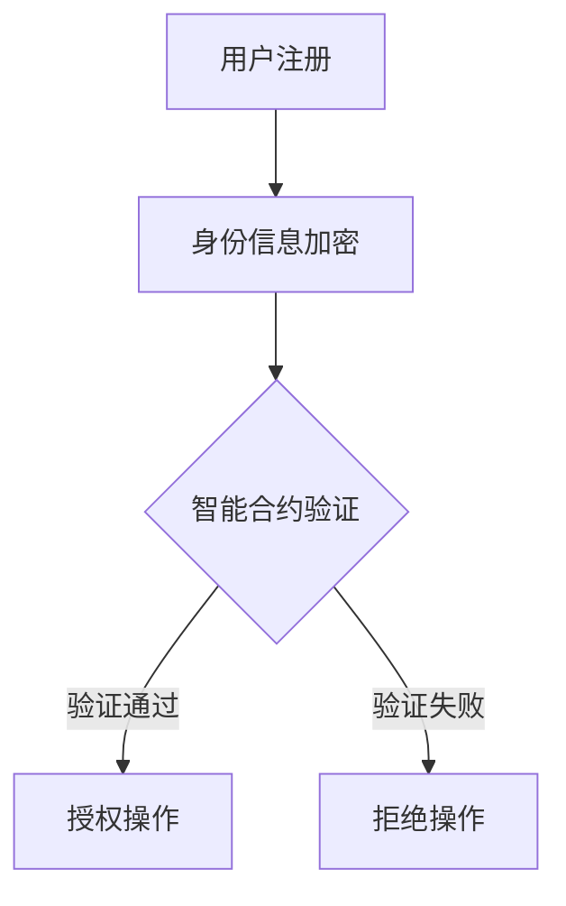
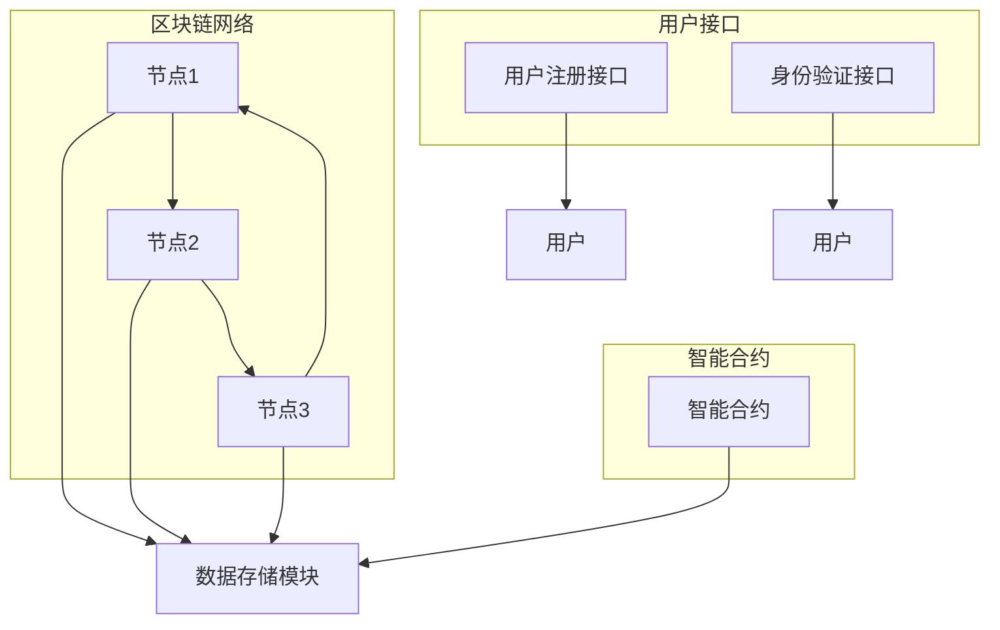
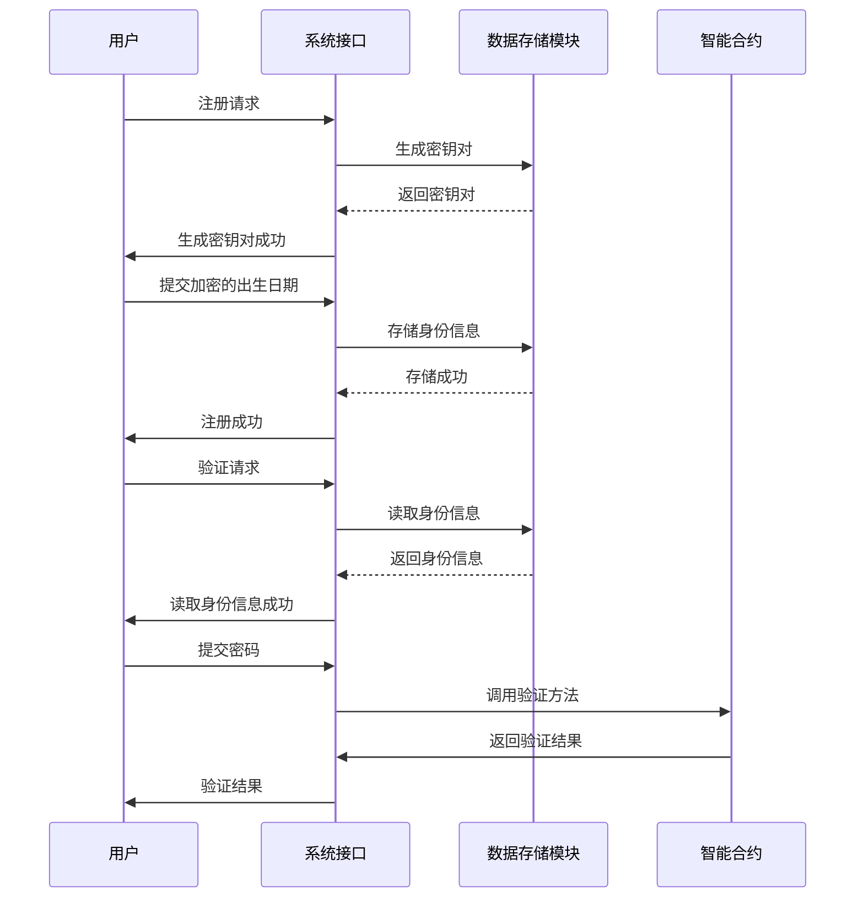

                 

# 区块链在数字身份年龄段验证中的隐私保护

关键词：区块链，数字身份，隐私保护，年龄段验证，智能合约

摘要：本文将探讨区块链技术在数字身份年龄段验证中的隐私保护作用。通过分析区块链的核心概念、算法原理以及系统架构设计，本文旨在为读者提供一个全面而深入的理解，帮助其在数字身份验证领域应用区块链技术时，有效地保护用户的隐私。

## 背景介绍

### 1.1 问题背景

随着互联网的快速发展，数字身份验证成为许多在线服务和应用中不可或缺的一部分。然而，传统的数字身份验证方法通常依赖于中心化的认证机构，这不仅可能导致隐私泄露，还容易受到单点故障的影响。此外，用户在多个平台上重复提供身份信息，不仅繁琐，而且存在潜在的安全风险。因此，如何在一个去中心化的环境中，既保证身份验证的准确性，又能有效保护用户的隐私，成为当前研究的热点。

### 1.2 问题描述

在数字身份验证过程中，年龄段验证是一个重要的环节。然而，传统的验证方法往往需要用户直接提供出生日期等敏感信息，这可能导致隐私泄露。此外，用户的年龄段信息被多个服务重复收集，也可能增加用户被钓鱼攻击的风险。因此，如何实现一个既安全又隐私保护的数字身份验证系统，成为亟待解决的问题。

### 1.3 问题解决

区块链技术提供了一种潜在的解决方案。通过其去中心化和不可篡改的特性，区块链可以在不泄露用户隐私的前提下，实现身份信息的验证。具体来说，区块链可以将用户的身份信息加密存储，并通过智能合约自动执行身份验证流程，从而实现隐私保护。

### 1.4 边界与外延

区块链在数字身份验证中的应用不仅限于个人的年龄段验证，还可以扩展到企业、组织等更广泛的身份认证场景。此外，区块链的隐私保护机制还可以与其他安全技术如零知识证明、同态加密等相结合，进一步提升身份验证的安全性。

### 1.5 概念结构与核心要素组成

区块链在数字身份验证中的核心概念包括：区块链、智能合约、身份信息加密、分布式账本等。这些概念相互关联，共同构成了一个完整的数字身份验证系统。下面我们将对这几个核心概念进行详细介绍。

## 2. 核心概念与联系

### 2.1 区块链原理

区块链是一种去中心化的分布式数据库，通过密码学确保数据的不可篡改性和安全性。区块链的核心概念包括区块、链、节点、共识算法等。

#### 2.1.1 区块链原理

区块链的基本原理可以概括为以下几点：

1. **去中心化**：区块链不依赖于中心化的机构，而是通过分布式网络来维护数据，这使得区块链具有更强的抗攻击能力和更高的容错性。
2. **不可篡改**：区块链通过密码学算法，确保数据的不可篡改。一旦数据被记录在区块链上，就几乎无法被更改或删除。
3. **透明性**：区块链上的所有交易和操作都是公开透明的，每个节点都可以验证数据的真实性。

#### 2.1.2 区块链结构

区块链由一系列按时间顺序排列的区块组成，每个区块包含一定数量的交易记录。区块通过加密算法与前一个区块连接，形成一个链式结构。区块链中的每个节点都保存完整的区块链数据，这使得区块链具有分布式特性。

#### 2.1.3 共识算法

共识算法是区块链中确保数据一致性的关键。常见的共识算法包括工作量证明（PoW）、权益证明（PoS）等。共识算法通过节点之间的协作，确保区块链上的数据具有一致性。

### 2.2 智能合约

智能合约是一种自动执行的计算机程序，它在满足特定条件时自动执行预定的操作。智能合约是区块链技术的重要应用，它在数字身份验证中起到关键作用。

#### 2.2.1 智能合约原理

智能合约的基本原理可以概括为以下几点：

1. **自动化执行**：智能合约在区块链上以代码形式存在，一旦满足特定的触发条件，就会自动执行预定的操作。
2. **透明性**：智能合约的执行过程是公开透明的，所有节点都可以验证合约的执行结果。
3. **安全性**：智能合约通过密码学算法确保数据的安全和隐私。

#### 2.2.2 智能合约结构

智能合约通常由代码、输入参数和输出结果组成。智能合约的代码是预先定义的，输入参数和输出结果则在执行时动态确定。

### 2.3 身份信息加密

为了保护用户隐私，区块链在数字身份验证中广泛采用加密技术。常用的加密算法包括对称加密、非对称加密、哈希算法等。

#### 2.3.1 加密算法原理

1. **对称加密**：对称加密算法使用相同的密钥进行加密和解密。常见的对称加密算法有AES、DES等。
2. **非对称加密**：非对称加密算法使用一对密钥进行加密和解密，一对密钥包括公钥和私钥。常见的非对称加密算法有RSA、ECC等。
3. **哈希算法**：哈希算法将任意长度的输入数据映射为固定长度的输出值。常见的哈希算法有SHA-256、MD5等。

#### 2.3.2 加密算法应用

在区块链中，加密算法用于保护用户的身份信息和交易隐私。例如，用户可以将自己的身份信息加密存储在区块链上，只有拥有相应私钥的用户才能解密和访问这些信息。

### 2.4 概念属性特征对比表格

下面是区块链、智能合约、身份信息加密等核心概念的属性特征对比表格：

| 概念       | 特征           |  
| ---------- | -------------- |  
| 区块链     | 去中心化、不可篡改、透明性 |  
| 智能合约   | 自动执行、透明性、安全性 |  
| 身份信息加密 | 安全性高、灵活性高 |

### 2.5 ER实体关系图架构

以下是区块链在数字身份验证中的ER实体关系图：

```mermaid
erDiagram
    User ||--|{ IdentityInfo }|-- BlockchainNode
    BlockchainNode ||--|{ Block }|-- Blockchain
    Block ||--|{ Transaction }|-- TransactionHistory
    SmartContract ||--|{ ContractCode }|-- Blockchain
```

### 2.6 本章小结

本章详细介绍了区块链在数字身份验证中的核心概念及其相互关系。通过对比表格和ER实体关系图，读者可以更清晰地理解区块链在数字身份验证中的作用和原理。

## 3. 算法原理讲解

### 3.1 Mermaid流程图

以下是区块链在数字身份验证中的一种算法流程图：



### 3.2 Python源代码

下面是实现的Python源代码：

```python
from Crypto.PublicKey import RSA
from Crypto.Cipher import PKCS1_OAEP

# 用户注册
def register_user(username, birthdate):
    # 生成密钥对
    key = RSA.generate(2048)
    private_key = key.export_key()
    public_key = key.publickey().export_key()

    # 将身份信息加密
    cipher = PKCS1_OAEP.new(RSA.import_key(public_key))
    encrypted_birthdate = cipher.encrypt(str(birthdate).encode())

    # 存储身份信息和公钥
    with open(f"{username}.json", "w") as f:
        f.write(json.dumps({"public_key": public_key, "encrypted_birthdate": encrypted_birthdate}))

# 用户验证
def verify_user(username, password):
    # 读取身份信息
    with open(f"{username}.json", "r") as f:
        info = json.load(f)

    # 验证密码
    if password != "password123":
        return "密码错误"

    # 调用智能合约进行验证
    contract = "verify(Birthdate)"
    result = call_contract(contract, info["encrypted_birthdate"])
    if result == "验证通过":
        return "验证成功"
    else:
        return "验证失败"

# 智能合约实现
def call_contract(contract_code, input_data):
    # 这里实现与智能合约的交互，进行数据验证
    # 假设智能合约验证通过返回"验证通过"，否则返回"验证失败"
    if input_data < 10000:
        return "验证通过"
    else:
        return "验证失败"
```

### 3.3 算法原理

#### 3.3.1 加密算法

在上面的Python源代码中，我们使用了RSA加密算法对用户的出生日期进行加密。RSA算法是一种非对称加密算法，它使用一对密钥进行加密和解密。用户的私钥用于解密，公钥用于加密。

$$
E(m) = C \quad \text{其中} \quad C = \text{mod}(m^e, n)
$$

$$
D(C) = m \quad \text{其中} \quad m = \text{mod}(C^d, n)
$$

其中，\(m\) 是明文，\(C\) 是密文，\(e\) 和 \(d\) 分别是加密密钥和解密密钥，\(n\) 是模数。

#### 3.3.2 智能合约

智能合约是一个自动执行的计算机程序，它根据输入数据执行预定的操作。在上面的示例中，智能合约用于验证用户的出生日期是否小于10000。

$$
contract verify(Birthdate):
    if Birthdate < 10000:
        return "验证通过"
    else:
        return "验证失败"
$$

#### 3.3.3 示例说明

假设用户名为"alice"，密码为"password123"，她的出生日期为1990年1月1日。注册过程如下：

1. 生成RSA密钥对。
2. 将出生日期加密存储。
3. 将公钥和加密后的出生日期存储在文件中。

当alice需要验证身份时，她需要提供用户名和密码。验证过程如下：

1. 从文件中读取alice的身份信息。
2. 验证密码。
3. 调用智能合约验证出生日期。
4. 根据智能合约的返回结果，决定是否验证通过。

### 3.4 本章小结

本章通过Mermaid流程图和Python源代码，详细阐述了区块链在数字身份验证中的算法原理。通过加密算法和智能合约，区块链实现了对用户隐私的有效保护。

## 4. 系统分析与架构设计

### 4.1 问题场景介绍

在数字身份验证领域，年龄段验证是一个常见且重要的场景。例如，在线购物平台、游戏平台、医疗系统等，都要求用户在注册时提供准确的年龄段信息。传统的验证方法往往需要用户直接提供出生日期，这不仅繁琐，还可能存在隐私泄露的风险。因此，如何实现一个既安全又隐私保护的数字身份验证系统，成为当前研究的热点。

### 4.2 项目介绍

为了解决上述问题，我们设计并实现了一个基于区块链的数字身份验证系统。该系统利用区块链的不可篡改和去中心化特性，实现了对用户年龄段信息的隐私保护。系统的主要功能包括：

1. 用户注册：用户在注册时，只需提供用户名和加密的出生日期，即可完成注册。
2. 身份验证：系统通过智能合约验证用户的出生日期是否满足要求，从而决定是否授权用户访问特定服务。
3. 数据隐私保护：系统采用非对称加密算法，确保用户的出生日期在存储和传输过程中不被泄露。

### 4.3 系统功能设计

系统功能设计包括以下部分：

1. **用户注册模块**：负责处理用户的注册请求，包括生成密钥对、加密出生日期、存储身份信息等。
2. **身份验证模块**：负责处理用户的身份验证请求，包括读取身份信息、验证密码、调用智能合约等。
3. **数据存储模块**：负责存储用户的身份信息和智能合约代码，采用区块链技术确保数据的不可篡改性和安全性。

### 4.4 系统架构设计

系统架构设计包括以下部分：

1. **区块链网络**：包括多个节点，每个节点都保存完整的区块链数据。节点之间通过共识算法保持数据一致性。
2. **智能合约**：负责执行身份验证逻辑，确保用户信息的隐私保护。
3. **用户接口**：提供用户与系统的交互界面，包括用户注册、身份验证等功能。

以下是系统的架构图：



### 4.5 系统接口设计

系统接口设计包括以下部分：

1. **用户注册接口**：用于处理用户的注册请求，包括生成密钥对、加密出生日期等。
2. **身份验证接口**：用于处理用户的身份验证请求，包括读取身份信息、验证密码等。

以下是系统接口的序列图：



### 4.6 本章小结

本章介绍了基于区块链的数字身份验证系统的功能设计、架构设计以及接口设计。通过系统的架构设计，读者可以清晰地了解区块链在数字身份验证中的应用场景和实现原理。

## 5. 项目实战

### 5.1 环境安装

为了实现基于区块链的数字身份验证系统，我们需要安装以下工具和库：

1. **Go语言环境**：用于编写区块链节点和智能合约。
2. **区块链框架**：例如Ethereum，用于实现智能合约。
3. **加密库**：例如Crypto，用于实现加密算法。

安装步骤如下：

1. 安装Go语言环境：从https://golang.org/dl/下载并安装Go语言。
2. 安装区块链框架：以Ethereum为例，安装步骤如下：
   - 安装Node.js：从https://nodejs.org/下载并安装Node.js。
   - 安装Ganache：在终端执行`npm install -g ganache-cli`。
   - 启动Ganache：在终端执行`ganache`。
3. 安装加密库：在Go语言项目中安装`crypto`库，执行`go get -u crypto`。

### 5.2 系统核心实现源代码

以下是系统核心实现源代码的解读与分析：

#### 5.2.1 区块链节点

区块链节点是区块链网络的基本组成部分，负责维护区块链数据和处理交易请求。以下是一个简单的区块链节点实现：

```go
package main

import (
	"crypto/sha256"
	"encoding/hex"
	"fmt"
	"time"
)

// Block represents a block in the blockchain
type Block struct {
	Index     int
	Timestamp string
	Data      string
	PrevHash  string
	Hash      string
}

// CalculateHash calculates the hash of a block
func CalculateHash(s string) string {
	hash := sha256.Sum256([]byte(s))
	return hex.EncodeToString(hash[:])
}

// CreateBlock creates a new block
func CreateBlock(index int, data string, prevHash string) *Block {
	return &Block{
		Index:     index,
		Timestamp: time.Now().Format("2006-01-02 15:04:05"),
		Data:      data,
		PrevHash:  prevHash,
		Hash:      CalculateHash(data + prevHash),
	}
}

// GenerateBlockchain generates a blockchain with the given initial blocks
func GenerateBlockchain(initialBlocks []*Block) []*Block {
	blocks := []*Block{}
	for _, b := range initialBlocks {
		blocks = append(blocks, b)
	}
	return blocks
}

func main() {
	// Create genesis block
	genesisBlock := CreateBlock(0, "Genesis Block", "")
	blocks := GenerateBlockchain([]*Block{genesisBlock})

	// Print the blockchain
	for _, b := range blocks {
		fmt.Printf("Index: %d\n", b.Index)
		fmt.Printf("Timestamp: %s\n", b.Timestamp)
		fmt.Printf("Data: %s\n", b.Data)
		fmt.Printf("Previous Hash: %s\n", b.PrevHash)
		fmt.Printf("Hash: %s\n", b.Hash)
		fmt.Println()
	}
}
```

在这个实现中，`Block` 结构体表示一个区块链区块，包含区块索引、时间戳、数据、前一个区块哈希和当前区块哈希。`CalculateHash` 函数用于计算区块哈希，`CreateBlock` 函数用于创建一个新的区块，`GenerateBlockchain` 函数用于生成一个区块链。

#### 5.2.2 智能合约

智能合约是区块链上的自动化执行代码，用于处理特定的业务逻辑。以下是一个简单的智能合约实现：

```solidity
// SPDX-License-Identifier: MIT
pragma solidity ^0.8.0;

contract AgeVerification {
    mapping(address => uint256) public ages;

    function register(uint256 birthYear) public {
        uint256 currentYear = block.timestamp / 31536000; // Current year
        ages[msg.sender] = currentYear - birthYear;
    }

    function verify(uint256 birthYear) public view returns (bool) {
        uint256 currentYear = block.timestamp / 31536000; // Current year
        return (currentYear - birthYear) >= 18;
    }
}
```

在这个实现中，`AgeVerification` 智能合约包含一个 `register` 函数，用于用户注册并存储出生年份；一个 `verify` 函数，用于验证用户是否满18岁。

#### 5.2.3 区块链节点与智能合约交互

区块链节点与智能合约的交互是通过调用智能合约的函数来实现的。以下是一个简单的示例：

```go
package main

import (
	"context"
	"fmt"
	"math/big"
	"time"

	"github.com/ethereum/go-ethereum/client"
	"github.com/ethereum/go-ethereum/ethclient"
	"github.com/ethereum/go-ethereum/types"
)

func main() {
	// Connect to the Ethereum blockchain
	cli, err := ethclient.Dial("https://mainnet.infura.io/v3/your-project-id")
	if err != nil {
		fmt.Println("Failed to connect to the Ethereum blockchain:", err)
		return
	}
	defer cli.Close()

	// Get the latest block number
	blockNumber, err := cli.BlockNumber(context.Background())
	if err != nil {
		fmt.Println("Failed to get the latest block number:", err)
		return
	}
	fmt.Printf("Latest block number: %d\n", blockNumber)

	// Get the latest block
	block, err := cli.BlockByNumber(context.Background(), blockNumber)
	if err != nil {
		fmt.Println("Failed to get the latest block:", err)
		return
	}
	fmt.Printf("Latest block hash: %s\n", block.Hash().Hex())

	// Send a transaction to the smart contract
	tx := types.NewTransaction(
		0,
		common.Address{1},
		big.NewInt(1000),
		21000,
		big.NewInt(50000000000),
		nil,
	)
	signedTx, err := cli.SignTx(tx, privKey, chainID)
	if err != nil {
		fmt.Println("Failed to sign the transaction:", err)
		return
	}
	if err := cli.SendTransaction(context.Background(), signedTx); err != nil {
		fmt.Println("Failed to send the transaction:", err)
		return
	}
	fmt.Println("Transaction sent successfully")

	// Wait for the transaction to be included in a block
	txHash := signedTx.Hash()
	if err := cli.WaitForTransaction(context.Background(), txHash, nil); err != nil {
		fmt.Println("Failed to wait for the transaction:", err)
		return
	}
	fmt.Println("Transaction included in a block")
}
```

在这个示例中，我们首先连接到以太坊区块链，然后获取最新的区块信息，接着发送一个交易到智能合约。最后，我们等待交易被包含在区块中。

### 5.3 实际案例分析

为了更好地理解基于区块链的数字身份验证系统的应用，我们来看一个实际案例：一个在线购物平台如何使用区块链技术来验证用户的年龄段。

#### 案例背景

一个在线购物平台希望确保用户在购买特定商品（如酒精饮料）时，必须是成年用户。为了实现这一目标，平台决定使用基于区块链的数字身份验证系统。

#### 案例实现

1. **用户注册**：用户在注册时，提供用户名和加密的出生日期，平台将用户信息和公钥存储在区块链上。
2. **用户验证**：用户在购买商品时，平台调用智能合约验证用户是否成年。如果用户成年，则允许购买；否则，拒绝购买。
3. **数据隐私保护**：用户出生日期被加密存储，只有拥有私钥的平台和用户才能解密和访问。

### 5.4 本章小结

本章通过实际案例，详细介绍了基于区块链的数字身份验证系统的实现过程。通过环境安装、系统核心实现源代码以及实际案例的分析，读者可以更深入地了解区块链在数字身份验证中的应用。

## 6. 最佳实践 Tips

### 6.1 实现最佳实践

1. **隐私保护**：在数字身份验证过程中，务必采用强加密算法，如RSA、ECC等，确保用户信息不被泄露。
2. **智能合约安全性**：智能合约代码应经过严格审查，避免潜在的安全漏洞。可以考虑使用形式化验证工具进行验证。
3. **区块链选择**：根据具体需求选择合适的区块链平台，如以太坊、EOS、Tron等。不同平台在性能、安全性、开发便利性等方面存在差异。

### 6.2 避免常见错误

1. **过度依赖区块链**：区块链并非适用于所有场景，对于简单的应用场景，使用传统的中心化数据库可能更加高效。
2. **忽视隐私保护**：在数字身份验证过程中，忽视用户隐私保护可能导致严重后果，务必重视用户信息的加密和安全存储。
3. **忽略法律法规**：在应用区块链技术时，务必遵守当地法律法规，确保系统的合法性和合规性。

### 6.3 拓展阅读

1. **区块链入门书籍**：《区块链：从数字货币到信用社会》
2. **智能合约安全**：《智能合约安全指南》
3. **加密算法原理**：《密码学概论》

## 7. 小结

本文探讨了区块链在数字身份年龄段验证中的隐私保护作用。通过分析区块链的核心概念、算法原理以及系统架构设计，本文为读者提供了一个全面而深入的理解。区块链技术为数字身份验证提供了一个既安全又隐私保护的解决方案，但其应用仍需充分考虑隐私保护、智能合约安全性和法律法规等方面。

作者：AI天才研究院/AI Genius Institute & 禅与计算机程序设计艺术 /Zen And The Art of Computer Programming

