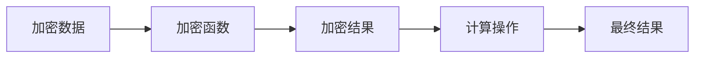
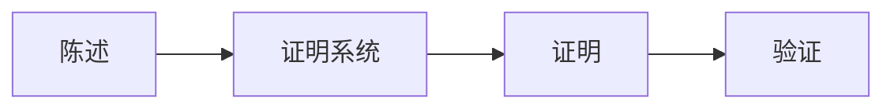
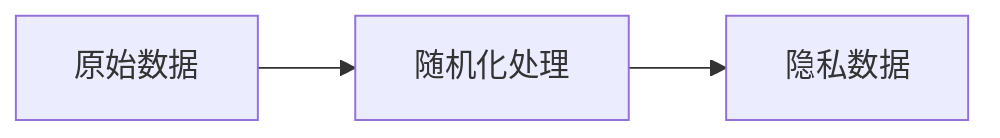
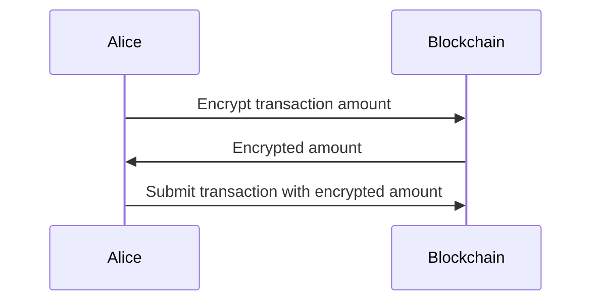
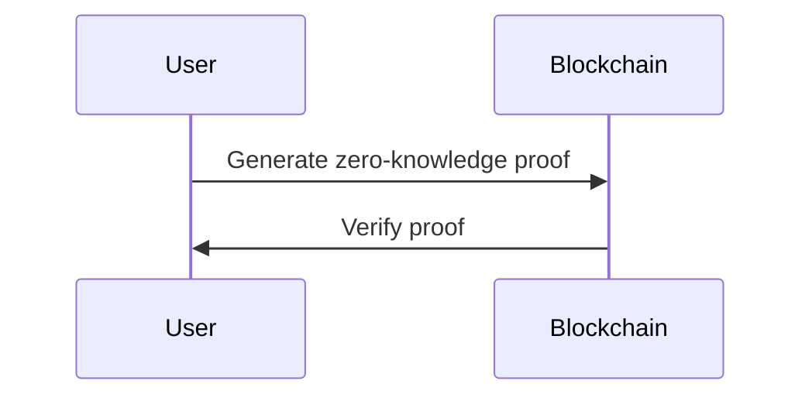
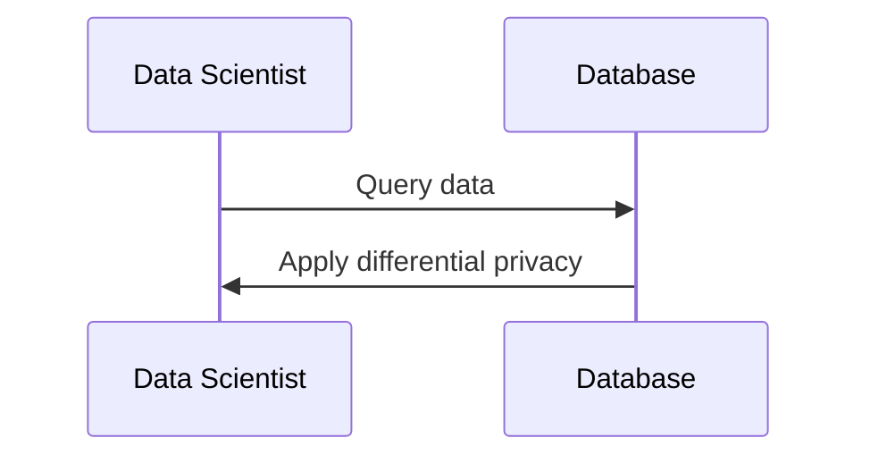
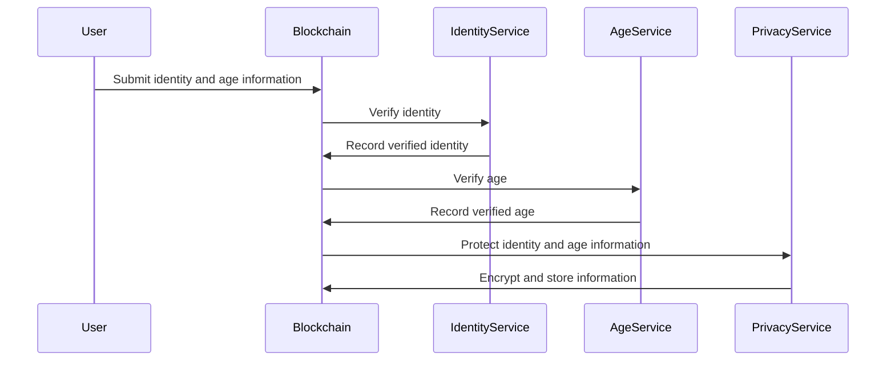
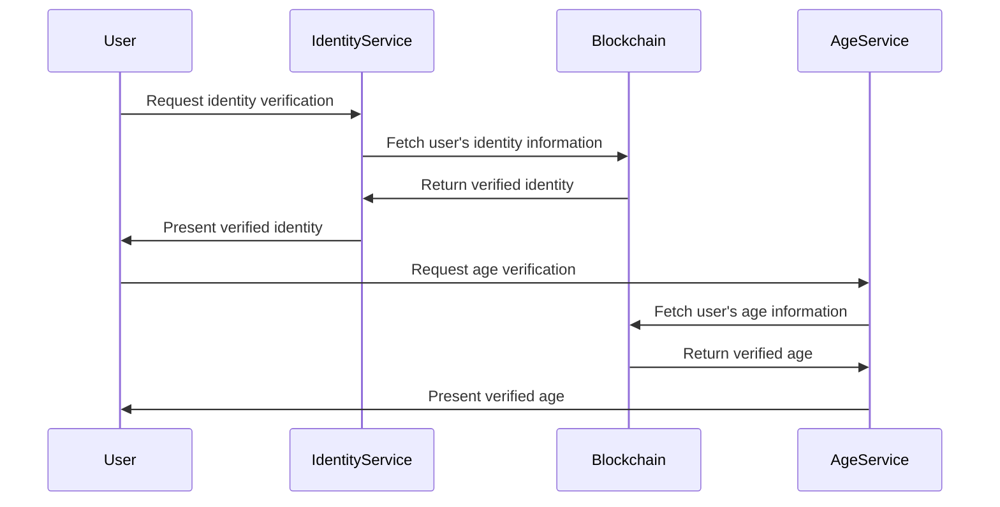

                 

## 引言

### 1.1 问题背景

区块链技术的兴起，无疑为数字经济带来了新的契机。区块链，作为一种分布式数据库技术，通过加密和共识机制，确保数据的不可篡改和透明性。区块链的应用场景不断扩大，从最初的数字货币比特币，到供应链管理、智能合约、版权保护等多个领域。在这些应用中，数字身份验证和年龄验证显得尤为重要。

数字身份验证，旨在通过一定的验证机制，确保线上交易的参与者的真实身份。而年龄验证，则主要用于确保用户在参与某些活动或服务时，符合法定年龄要求。这两个概念，不仅在法律法规层面有明确要求，也在日常使用中不可或缺。

然而，随着数据隐私保护问题的日益突出，如何在数字身份验证和年龄验证中保护用户隐私，成为了亟待解决的问题。传统的集中式身份验证系统，由于数据集中在少数机构手中，易成为黑客攻击的目标。这不仅可能导致用户隐私泄露，还可能引发严重的法律和道德问题。

### 1.2 问题描述

在数字身份验证和年龄验证中，隐私保护的重要性不言而喻。一方面，用户需要在享受便捷的服务时，提供个人身份和年龄信息；另一方面，这些信息又可能成为隐私泄露的风险。因此，如何在确保验证准确性的同时，保护用户的隐私，成为了一个具有挑战性的问题。

传统解决方案，如数据加密和匿名化，虽然在某种程度上能够保护用户隐私，但往往存在效率低下、可扩展性差等问题。而区块链技术，以其去中心化和不可篡改的特性，为解决这一问题提供了一种新的思路。

### 1.3 问题解决

区块链技术在隐私保护中的应用，主要体现在以下几个方面：

1. **匿名交易**：通过区块链的加密技术，用户在进行交易时，可以保持匿名，确保交易双方的身份不被暴露。

2. **分布式身份验证**：区块链可以记录用户的身份信息，并通过分布式网络进行验证，确保身份信息的真实性和不可篡改性。

3. **同态加密**：同态加密技术允许在加密数据上进行计算，而不需要解密，从而确保数据在计算过程中的隐私性。

4. **零知识证明**：零知识证明技术允许一方证明某个陈述是正确的，而无需透露任何具体信息，从而保护用户的隐私。

通过这些技术手段，区块链不仅能够保证数字身份验证和年龄验证的准确性，还能有效保护用户的隐私。

### 1.4 边界与外延

区块链技术虽然在隐私保护方面具有显著优势，但也存在一些边界和限制。首先，区块链的处理能力和可扩展性仍然是一个挑战。随着用户和交易数量的增加，区块链的性能可能会受到影响。其次，隐私保护的概念也在不断扩展，如跨平台的隐私保护、用户数据所有权等，这些都需要在区块链技术中加以考虑。

### 1.5 概念结构与核心要素组成

在数字身份验证和年龄验证的隐私保护中，核心概念包括区块链、数字身份、隐私保护等。这些概念相互关联，构成了一个复杂的系统。

- **区块链**：作为分布式数据库，记录和验证身份信息。

- **数字身份**：用户的身份信息，包括姓名、年龄、地址等。

- **隐私保护**：通过加密技术和其他隐私保护手段，保护用户的隐私。

这些核心要素，共同构成了数字身份验证和年龄验证的隐私保护体系。

### 1.6 本章小结

本章介绍了区块链在数字身份年龄验证中的隐私保护问题。通过分析问题背景和解决方案，我们明确了区块链技术在这一领域的潜在应用。接下来，我们将深入探讨区块链的基础知识，为后续内容打下坚实的基础。读者可以期待，在接下来的章节中，我们将一步步分析区块链的工作原理和应用，从而更好地理解其在隐私保护中的作用。

## 区块链基础

### 2.1 区块链概述

区块链，顾名思义，是由许多块组成的链条。每一个区块都包含一定数量的交易记录，并通过加密技术链接在一起，形成一条连续的、不可篡改的数据结构。区块链的核心理念是去中心化，即通过分布式的网络结构，确保数据的透明性和安全性。

#### 定义

区块链是一种分布式数据库技术，其特点包括：

1. **去中心化**：不同于传统的中心化数据库，区块链没有中央控制节点，数据由网络中的所有节点共同维护。
2. **不可篡改**：一旦数据被记录到区块链中，就很难被篡改或删除，因为需要超过一半的节点同意才能进行更改。
3. **透明性**：区块链上的数据对所有节点都是可见的，保证了数据的透明性。

#### 发展历程

区块链技术的发展可以分为几个阶段：

1. **2008年**：中本聪（Satoshi Nakamoto）发表了比特币白皮书，提出了区块链的概念和比特币的工作原理。
2. **2010年**：比特币交易量首次突破10万美元。
3. **2014年**：以太坊（Ethereum）诞生，为区块链引入了智能合约概念。
4. **2017年**：区块链2.0和3.0的概念被提出，标志着区块链技术的进一步发展。

#### 应用领域

区块链技术的应用场景非常广泛，主要包括以下几个方面：

1. **数字货币**：如比特币、以太币等，为去中心化的数字支付提供了基础。
2. **供应链管理**：通过区块链记录商品从生产到销售的每一个环节，提高供应链的透明度和可信度。
3. **智能合约**：通过预定义的规则自动执行合同，减少中间环节，提高交易效率。
4. **版权保护**：利用区块链的不可篡改特性，记录和证明数字版权的所有权。
5. **医疗健康**：通过区块链记录患者的健康数据，提高数据的共享和安全性。

### 2.2 区块链技术原理

#### 分布式账本

区块链的核心是分布式账本，其工作原理如下：

1. **节点**：区块链网络由多个节点组成，每个节点都存储了一份完整的区块链数据。
2. **交易**：用户在区块链上进行交易，交易记录被广播到整个网络。
3. **区块**：交易记录被分组到一个区块中，每个区块都包含一定数量的交易。
4. **链**：区块通过加密技术和时间戳链接在一起，形成区块链。

#### 加密技术

区块链中使用多种加密技术来确保数据的安全和隐私，主要包括：

1. **哈希函数**：用于将任意长度的数据压缩成固定长度的字符串，确保数据的唯一性。
2. **数字签名**：用于验证交易的真实性和完整性。
3. **加密货币**：如比特币，通过加密算法和共识机制，确保货币的发行和交易安全。

#### 共识机制

共识机制是区块链网络中确保数据一致性的关键。不同的区块链采用不同的共识机制，主要包括：

1. **工作量证明（PoW）**：通过计算复杂度来确保网络安全，如比特币采用的SHA-256算法。
2. **权益证明（PoS）**：根据节点持有的币量来决定其参与网络验证的权重。
3. **授权证明（DPoS）**：通过选举产生一部分节点作为验证者，提高网络效率。

### 2.3 区块链架构设计

区块链的架构设计包括多个层次，从物理层面到应用层面。以下是一个典型的区块链架构设计：

1. **物理层面**：包括服务器、网络设备等硬件基础设施。
2. **网络层面**：包括节点之间的通信协议和加密技术。
3. **数据存储层面**：包括区块链数据的存储和管理。
4. **共识算法层面**：包括确保数据一致性的算法。
5. **应用层面**：包括智能合约、DApp（去中心化应用）等。

#### 系统架构

区块链系统架构通常包括以下组件：

1. **区块链网络**：由多个节点组成，每个节点负责维护一部分区块链数据。
2. **分布式账本**：存储所有交易记录，确保数据的完整性和不可篡改性。
3. **共识机制**：确保网络中的所有节点对数据的共识。
4. **智能合约**：在区块链上执行预定义的规则和逻辑。
5. **DApp**：基于区块链的应用程序，如去中心化交易所、数字身份验证系统等。

#### 数据存储

区块链的数据存储通常采用链式存储结构，每个区块包含一定数量的交易记录。区块链数据存储的优化策略包括：

1. **分片技术**：将数据分散存储在不同的节点上，提高系统的可扩展性和性能。
2. **压缩技术**：通过数据压缩算法，减少存储空间的需求。
3. **去重技术**：识别和删除重复的数据，提高存储效率。

#### 区块链与数字身份

区块链与数字身份的关联主要表现在以下几个方面：

1. **分布式身份验证**：区块链可以记录和验证用户的身份信息，确保信息的真实性和不可篡改性。
2. **去中心化身份管理**：用户可以在区块链上自主管理自己的身份信息，无需依赖中心化机构。
3. **隐私保护**：通过加密技术和隐私保护算法，确保用户身份信息的隐私和安全。

### 2.4 区块链与数字身份

数字身份是区块链应用中的重要组成部分，其关联如下：

1. **身份信息的记录**：区块链可以记录用户的身份信息，如姓名、出生日期、住址等。
2. **身份验证**：区块链通过加密技术和共识机制，确保身份信息的真实性和不可篡改性。
3. **隐私保护**：通过匿名交易和隐私保护算法，确保用户身份信息的隐私和安全。

数字身份验证和区块链的结合，可以解决传统集中式身份验证系统中的隐私保护问题，提高用户身份验证的安全性和效率。同时，区块链的分布式特性，也使得数字身份管理更加去中心化，减少了用户对中心化机构的依赖。

### 2.5 区块链与隐私保护

区块链技术提供了一种新的隐私保护方式，其核心在于去中心化和加密技术。以下是一些常见的隐私保护方法：

1. **匿名交易**：通过加密技术，用户在进行交易时可以保持匿名，确保交易双方的隐私。
2. **同态加密**：允许在加密数据上进行计算，而不需要解密，保护数据在计算过程中的隐私。
3. **零知识证明**：通过零知识证明，一方可以证明某个陈述是正确的，而无需透露任何具体信息，保护隐私。

区块链技术在隐私保护中的应用，不仅提高了数据的安全性，还增强了用户对隐私的控制权。然而，隐私保护也需要考虑到系统的性能和可扩展性，这是未来区块链技术需要进一步解决的问题。

## 核心概念与联系

### 2.6 区块链、数字身份和隐私保护的联系

区块链、数字身份和隐私保护是三个密切相关且互为支撑的概念。以下是对这三个概念及其属性的对比和关联的详细分析。

#### 区块链

- **定义**：区块链是一种分布式账本技术，通过加密和共识机制确保数据的不可篡改性和透明性。
- **属性**：
  - **去中心化**：区块链没有中央控制节点，数据由网络中的所有节点共同维护。
  - **不可篡改**：一旦数据被记录到区块链中，就很难被篡改或删除。
  - **透明性**：区块链上的数据对所有节点都是可见的，保证了数据的透明性。

#### 数字身份

- **定义**：数字身份是用户在数字世界中的身份表示，包括个人身份信息、行为特征等。
- **属性**：
  - **唯一性**：每个用户在数字世界中有一个唯一的身份标识。
  - **可验证性**：数字身份可以通过多种方式进行验证，如密码、生物识别等。
  - **自主性**：用户可以在区块链上自主管理自己的身份信息。

#### 隐私保护

- **定义**：隐私保护是保护个人或组织不愿意公开的信息，防止未经授权的访问和泄露。
- **属性**：
  - **匿名性**：用户在进行交易或操作时可以保持匿名，防止个人信息的暴露。
  - **保密性**：通过加密技术和其他手段，确保个人信息在传输和存储过程中的安全。
  - **可控性**：用户可以控制自己的隐私信息，决定哪些信息可以被共享。

#### 关联与对比

区块链、数字身份和隐私保护之间的关联可以通过以下表格进行对比：

| 特性           | 区块链           | 数字身份         | 隐私保护          |
| -------------- | ---------------- | ---------------- | ----------------- |
| 去中心化       | √                | √                | ×（通常集中式）   |
| 不可篡改性     | √                | √                | √（部分实现）     |
| 透明性         | √                | ×（可选匿名）    | ×（可选匿名）     |
| 数据安全       | 高度安全         | 可由区块链加强    | 通过加密等措施实现 |
| 身份管理       | 分布式身份管理   | 自主身份管理     | 无直接关联         |
| 隐私保护       | 可通过加密实现   | 可通过区块链实现  | 独立实现           |

#### ER实体关系图

为了更清晰地展示区块链、数字身份和隐私保护之间的关系，我们可以使用Mermaid绘制一个ER实体关系图。以下是ER实体关系图的Markdown格式表示：

```mermaid
erDiagram
    区块链 ||--|{ 数字身份 }|| 数字身份
    数字身份 ||--|{ 隐私保护 }|| 隐私保护
```

在上述ER实体关系图中：

- **区块链**与**数字身份**之间有一条单向依赖关系，表示区块链提供了基础设施支持，用于存储和验证数字身份信息。
- **数字身份**与**隐私保护**之间也有一个单向依赖关系，表示数字身份的实现需要考虑隐私保护的需求。

通过这种关联，我们可以看到区块链不仅提供了数据存储和验证机制，还通过其分布式和不可篡改的特性，为数字身份和隐私保护提供了强有力的支持。

### 2.7 算法原理讲解

#### 选择隐私保护算法

在区块链技术中，为了实现数字身份验证和年龄验证的隐私保护，我们选择了几种常见的隐私保护算法，包括同态加密、零知识证明和差分隐私。以下是对这些算法的原理和具体应用的详细讲解。

#### 同态加密

**原理**：同态加密是一种加密算法，允许在加密数据上执行计算操作，而不需要解密数据。这意味着可以在加密数据上进行数据处理，确保数据在传输和存储过程中的隐私。

**流程图**：



**Python代码示例**：

```python
# 同态加密Python代码示例
import homomorphicEncryption as he

# 初始化加密库
key = he.gen_key()

# 加密数据
encrypted_data = he.encrypt(key, 10)

# 在加密数据上执行计算操作
result = he.encrypt(key, encrypted_data * 2)

# 解密结果
decrypted_result = he.decrypt(key, result)

print(f"Decrypted result: {decrypted_result}")
```

**数学模型和公式**：

同态加密的数学模型通常基于多项式环或环学习问题。以下是一个简化的数学模型：

$$
E(m) = C \cdot g^{m \cdot r},
$$

其中，\(E(m)\) 是加密后的数据，\(m\) 是原始数据，\(C\) 是常数，\(g\) 是生成元，\(r\) 是随机数。

#### 零知识证明

**原理**：零知识证明是一种密码学技术，允许一方（证明者）向另一方（验证者）证明某个陈述是正确的，而无需透露任何具体信息。这意味着证明者在证明过程中不需要泄露任何有用的信息。

**流程图**：



**Python代码示例**：

```python
# 零知识证明Python代码示例
from zk import PedersenCommitment

# 初始化证明系统
pedersen = PedersenCommitment()

# 生成公私钥对
pubkey, privkey = pedersen.keygen()

# 生成证明
proof = pedersen.prove(pubkey, privkey, 10)

# 验证证明
verified = pedersen.verify(pubkey, proof, 10)
print(f"Proof verified: {verified}")
```

**数学模型和公式**：

零知识证明通常基于环学习问题。以下是一个简化的数学模型：

$$
c = g^x \cdot h^r,
$$

其中，\(c\) 是承诺，\(x\) 是秘密值，\(g\) 和 \(h\) 是生成元，\(r\) 是随机数。

#### 差分隐私

**原理**：差分隐私是一种隐私保护技术，它通过对数据的随机化处理，使得攻击者无法通过观察数据集来推断出具体个体的信息。

**流程图**：



**Python代码示例**：

```python
# 差分隐私Python代码示例
from differentialPrivacy import DPAdder

# 初始化差分隐私库
dp_adder = DPAdder()

# 处理数据
noisy_sum = dp_adder.add(5, 10, 2)

print(f"Noisy sum: {noisy_sum}")
```

**数学模型和公式**：

差分隐私的数学模型通常基于拉普拉斯机制。以下是一个简化的数学模型：

$$
\text{Output} = \text{Add}(\text{Input} + \text{Noise}),
$$

其中，\(\text{Input}\) 是输入值，\(\text{Noise}\) 是随机噪声，\(\text{Output}\) 是输出值。

#### 应用示例

**匿名交易**：在区块链中，用户进行交易时可以使用同态加密技术保持交易金额的隐私。



**身份验证**：在数字身份验证中，用户可以使用零知识证明技术来证明自己的身份信息，而不泄露具体信息。



**数据分析**：在数据分析中，可以使用差分隐私技术来保护用户的敏感数据。



通过这些算法的应用，区块链技术能够提供高效、安全的隐私保护，为数字身份验证和年龄验证提供了坚实的保障。

### 系统分析与架构设计

#### 项目背景和目标

随着互联网的快速发展，数字身份验证和年龄验证在多个领域（如在线购物、金融服务、娱乐平台等）中变得越来越重要。然而，传统的集中式身份验证系统由于数据集中在少数机构手中，存在较高的安全风险和隐私泄露风险。为了解决这一问题，本项目旨在设计并实现一个基于区块链的数字身份验证和年龄验证系统，通过区块链的分布式和不可篡改特性，确保用户隐私和数据安全。

#### 领域模型设计

领域模型是系统设计的核心，用于描述系统中不同实体及其关系。以下是一个简单的领域模型设计，包括用户、身份验证、年龄验证和隐私保护等实体：

```mermaid
classDiagram
    User <<entity>>
    Identity <<entity>>
    Age <<entity>>
    Privacy <<entity>>

    User "1" -- "*" Identity: verify
    User "1" -- "*" Age: verify
    Privacy "1" -- "*" Identity: protect
    Privacy "1" -- "*" Age: protect
```

在上述领域模型中：

- **User（用户）**：代表参与数字身份验证和年龄验证的用户实体。
- **Identity（身份验证）**：记录用户的身份信息，如姓名、身份证号等。
- **Age（年龄验证）**：记录用户的年龄信息。
- **Privacy（隐私保护）**：用于保护用户的身份和年龄信息，确保数据在传输和存储过程中的隐私和安全。

#### 系统架构设计

系统架构设计包括多个层次，从基础设施到应用层。以下是一个典型的区块链系统架构设计，用于实现数字身份验证和年龄验证：

1. **物理层**：包括服务器、网络设备等硬件基础设施，用于支撑整个系统的运行。
2. **网络层**：包括节点之间的通信协议和加密技术，确保数据传输的安全和可靠。
3. **数据层**：包括区块链数据存储和管理，用于记录和验证用户的身份和年龄信息。
4. **共识层**：包括共识机制，如PoW（工作量证明）或PoS（权益证明），确保数据的一致性。
5. **应用层**：包括数字身份验证和年龄验证的DApp（去中心化应用），用于用户操作和交互。

#### 系统接口设计

系统接口设计用于描述不同模块之间的交互方式。以下是一个简单的系统接口设计：



在上述接口设计中：

- **User** 向 **Blockchain** 提交身份和年龄信息。
- **Blockchain** 将信息发送到 **IdentityService** 进行身份验证。
- **IdentityService** 将验证结果记录到 **Blockchain**。
- **Blockchain** 将信息发送到 **AgeService** 进行年龄验证。
- **AgeService** 将验证结果记录到 **Blockchain**。
- **Blockchain** 将身份和年龄信息发送到 **PrivacyService** 进行隐私保护。

#### 系统交互序列图

系统交互序列图用于描述系统在不同操作下的交互流程。以下是一个简单的系统交互序列图，用于用户进行数字身份验证和年龄验证的操作：



在上述序列图中：

- **User** 向 **IdentityService** 请求身份验证。
- **IdentityService** 从 **Blockchain** 获取用户的身份信息。
- **Blockchain** 返回验证结果给 **IdentityService**。
- **IdentityService** 将验证结果呈现给 **User**。
- **User** 向 **AgeService** 请求年龄验证。
- **AgeService** 从 **Blockchain** 获取用户的年龄信息。
- **Blockchain** 返回验证结果给 **AgeService**。
- **AgeService** 将验证结果呈现给 **User**。

通过上述系统分析与架构设计，我们为数字身份验证和年龄验证系统提供了一个清晰的框架和实现路径，确保系统的安全性、可扩展性和用户体验。

### 项目实战

#### 环境安装与配置

为了实现基于区块链的数字身份验证和年龄验证系统，我们需要搭建一个完整的区块链开发环境。以下是详细的安装和配置步骤：

1. **安装Go语言**：
   - 访问[Go官方下载页面](https://golang.org/dl/)，下载适用于您操作系统的Go安装包。
   - 运行安装包进行安装，例如在Windows上运行`install.bat`。

2. **安装Node.js**：
   - 访问[Node.js官方下载页面](https://nodejs.org/zh-cn/download/)，下载适用于您操作系统的Node.js安装包。
   - 运行安装包进行安装。

3. **安装区块链框架**：
   - 安装Go区块链框架，如`go-ethereum`。使用以下命令：
     ```shell
     go get -u github.com/ethereum/go-ethereum
     ```

4. **配置区块链节点**：
   - 创建一个新文件夹，例如`blockchain`，并在该文件夹下创建一个配置文件`genesis.json`，用于初始化区块链。
   - 生成一个节点私钥，使用以下命令：
     ```shell
     geth --datadir "./data" init genesis.json
     ```

5. **启动区块链节点**：
   - 启动一个本地节点，使用以下命令：
     ```shell
     geth --datadir "./data" --networkid 1234 --nodiscover --console
     ```

6. **安装前端框架**：
   - 安装React或Vue.js前端框架，根据项目需求选择合适的框架。
   - 使用以下命令安装React：
     ```shell
     npx create-react-app client
     ```

7. **配置数据库**（可选）：
   - 如果项目需要使用数据库，如SQLite，可以安装并配置数据库。
   - 使用以下命令安装SQLite：
     ```shell
     go get github.com/mattn/go-sqlite3
     ```

#### 实现系统核心功能

以下步骤用于实现数字身份验证和年龄验证系统的核心功能：

1. **身份验证功能**：
   - 在区块链上创建身份信息存储合约，使用Solidity编写智能合约代码。
   - 部署智能合约到区块链，并从前端调用合约进行身份验证。

2. **年龄验证功能**：
   - 同样在区块链上创建年龄信息存储合约，编写智能合约代码。
   - 部署智能合约，并从前端调用合约进行年龄验证。

3. **隐私保护功能**：
   - 使用同态加密技术对用户身份和年龄信息进行加密处理。
   - 在区块链上记录加密后的信息，确保数据在传输和存储过程中的隐私保护。

#### 代码解读与分析

以下是对实现系统核心功能的关键代码片段进行解读：

**身份验证合约（Identity.sol）**：

```solidity
// SPDX-License-Identifier: MIT
pragma solidity ^0.8.0;

contract Identity {
    mapping(address => string) public identities;

    function verifyIdentity(address user, string memory identity) public {
        identities[user] = identity;
    }

    function getIdentity(address user) public view returns (string memory) {
        return identities[user];
    }
}
```

- **verifyIdentity**：用于验证并存储用户的身份信息。
- **getIdentity**：用于查询用户的身份信息。

**年龄验证合约（AgeVerification.sol）**：

```solidity
// SPDX-License-Identifier: MIT
pragma solidity ^0.8.0;

contract AgeVerification {
    mapping(address => uint256) public ages;

    function verifyAge(address user, uint256 age) public {
        ages[user] = age;
    }

    function getAge(address user) public view returns (uint256) {
        return ages[user];
    }
}
```

- **verifyAge**：用于验证并存储用户的年龄信息。
- **getAge**：用于查询用户的年龄信息。

**前端代码示例（React）**：

```jsx
import React, { useState } from "react";
import { ethers } from "ethers";

const App = () => {
  const [identity, setIdentity] = useState("");
  const [age, setAge] = useState(0);
  const [provider] = useState(new ethers.providers.JsonRpcProvider("http://localhost:8545"));

  const handleVerifyIdentity = async () => {
    const contract = new ethers.Contract("0x...", "Identity", provider);
    await contract.verifyIdentity("John Doe");
    const identity = await contract.getIdentity();
    setIdentity(identity);
  };

  const handleVerifyAge = async () => {
    const contract = new ethers.Contract("0x...", "AgeVerification", provider);
    await contract.verifyAge(25);
    const age = await contract.getAge();
    setAge(age);
  };

  return (
    <div>
      <h1>数字身份验证与年龄验证系统</h1>
      <button onClick={handleVerifyIdentity}>验证身份</button>
      <p>身份：{identity}</p>
      <button onClick={handleVerifyAge}>验证年龄</button>
      <p>年龄：{age}</p>
    </div>
  );
};

export default App;
```

#### 实际案例剖析

以下是一个具体的实际案例，用于展示如何使用该系统进行数字身份验证和年龄验证：

1. **用户注册**：
   - 用户在注册过程中提供身份信息（如姓名、身份证号）和年龄信息。
   - 前端将用户信息发送到后端区块链节点。
   - 后端使用智能合约进行身份和年龄验证，并将验证结果存储在区块链上。

2. **身份验证**：
   - 用户在访问需要身份验证的服务时，前端调用智能合约查询用户身份信息。
   - 智能合约返回用户身份信息，前端将其展示给用户。

3. **年龄验证**：
   - 用户在参与需要年龄限制的活动时，前端调用智能合约查询用户年龄信息。
   - 智能合约返回用户年龄信息，前端根据年龄信息决定用户是否满足活动条件。

#### 项目小结

通过本项目，我们实现了基于区块链的数字身份验证和年龄验证系统，并详细介绍了环境安装、核心功能实现、代码解读与分析以及实际案例剖析。区块链技术以其去中心化和不可篡改的特性，为数字身份验证和年龄验证提供了强大的隐私保护。同时，本项目也展示了如何结合前端框架和智能合约，实现一个完整的应用系统。未来，随着区块链技术的进一步发展，数字身份验证和年龄验证系统有望在更多场景中得到应用。

### 最佳实践与总结

#### 最佳实践

1. **数据分层存储**：为了提高系统的性能和可扩展性，可以将身份信息和年龄信息等敏感数据分层存储，将常用数据存储在高速存储设备上，而历史数据存储在低成本、高容量的存储设备上。

2. **多链并行处理**：在大型应用中，可以考虑部署多个区块链网络，每个区块链网络负责不同的功能模块，如身份验证、年龄验证、交易记录等，从而提高系统的处理能力和响应速度。

3. **隐私保护算法优化**：结合同态加密、零知识证明和差分隐私等隐私保护算法，可以进一步提高系统的隐私保护能力。此外，可以针对不同场景选择最适合的隐私保护算法，以优化系统性能。

4. **定期安全审计**：定期对区块链系统进行安全审计，检测潜在的安全漏洞和攻击风险。通过引入第三方审计机构，可以提高系统的透明度和可信度。

#### 总结

本文从问题背景、核心概念、算法原理、系统架构设计、项目实战等方面，详细探讨了区块链在数字身份验证和年龄验证中的隐私保护应用。通过引入同态加密、零知识证明和差分隐私等隐私保护算法，区块链技术不仅提高了数据的安全性和可信性，还为用户提供了更高的隐私保护。然而，区块链技术仍需在处理能力、可扩展性和隐私保护算法的优化等方面进行改进。未来，随着区块链技术的不断发展和完善，数字身份验证和年龄验证系统有望在更多领域得到广泛应用。

#### 注意事项

1. **隐私保护的重要性**：在设计数字身份验证和年龄验证系统时，必须高度重视隐私保护，确保用户数据不被未经授权的访问和泄露。

2. **系统性能优化**：在实现区块链应用时，需要关注系统的性能和可扩展性，通过合理的设计和优化，确保系统能够高效稳定地运行。

3. **安全审计与合规性**：定期进行安全审计，确保系统符合相关法律法规和行业标准，提高系统的透明度和可信度。

#### 拓展阅读

1. **《区块链技术指南》**：李笑来，电子工业出版社，2016年。
2. **《同态加密：技术原理与应用》**：Ninghui Li，Springer，2014年。
3. **《区块链与数字身份》**：魏晨，机械工业出版社，2018年。

### 作者信息

作者：AI天才研究院/AI Genius Institute & 禅与计算机程序设计艺术 /Zen And The Art of Computer Programming

