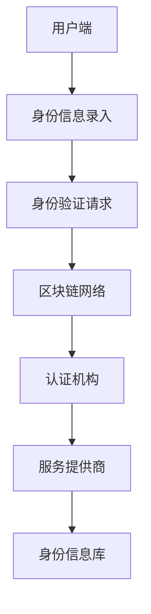
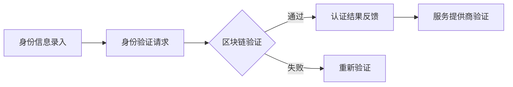

                 

### 引言

在当今数字化时代，身份管理已经成为信息安全的重要组成部分。随着互联网和移动设备的普及，个人和企业面临的数据泄露风险急剧增加，传统的身份认证方式显得越来越不安全、不灵活。在这种情况下，区块链技术的出现为数字身份管理带来了新的契机。

区块链是一种去中心化的分布式账本技术，具有去信任、不可篡改、透明性高等特点。通过区块链，可以实现安全的身份认证和数据管理，从而提高系统整体的安全性和可靠性。本文旨在探讨区块链在数字身份管理中的应用，特别是跨国身份认证系统的构建。

本文将分为以下几个部分：首先，介绍区块链的基本概念和原理，包括区块链的定义、核心特点以及其发展历程；接着，阐述数字身份管理的概念和重要性，分析当前面临的主要挑战；然后，详细讨论区块链在数字身份管理中的应用，如身份认证和数据隐私保护；随后，介绍跨国身份认证系统的设计与实现，包括系统需求分析、架构设计和认证流程；再者，探讨区块链在数字身份管理中的安全性问题，并提出解决方案；接着，通过案例研究来分析区块链在数字身份管理中的成功实践；最后，对区块链在数字身份管理中的未来发展进行展望，并总结本文的主要内容和观点。

通过这一系列的探讨，本文希望能够为读者提供一个全面、系统的理解，帮助他们在实际项目中应用区块链技术，构建高效的数字身份认证系统。

### 关键词

1. 区块链技术
2. 数字身份管理
3. 跨国身份认证
4. 去中心化
5. 数据隐私保护
6. 身份认证
7. 安全性

### 摘要

本文深入探讨了区块链技术在数字身份管理中的应用，特别是跨国身份认证系统。首先，介绍了区块链的基本概念和原理，包括其核心特点和优点。然后，阐述了数字身份管理的概念和重要性，分析了当前面临的主要挑战。接着，详细讨论了区块链在数字身份管理中的应用，如身份认证和数据隐私保护。在此基础上，介绍了跨国身份认证系统的设计与实现，包括系统需求分析、架构设计和认证流程。随后，探讨了区块链在数字身份管理中的安全性问题，并提出了解决方案。通过分析实际案例，本文展示了区块链在数字身份管理中的成功应用。最后，对区块链在数字身份管理中的未来发展进行了展望，并总结了本文的主要观点和贡献。本文为构建高效、安全的跨国身份认证系统提供了理论指导和实践经验。

### 第一部分：区块链与数字身份管理概述

#### 第1章：区块链技术基础

区块链技术是近年来信息技术领域的一个重要突破，其独特的去中心化、安全性和透明性等特点，使其在多个领域得到了广泛应用。本章节将详细探讨区块链的基本概念、工作原理、核心特点以及其发展历程，帮助读者建立对区块链技术的基本认识。

#### 1.1 区块链的定义与基本原理

区块链是一种分布式数据库技术，其核心思想是利用加密算法和数据结构，实现一个去中心化的数据库系统。具体来说，区块链是由一系列按时间顺序排列的数据区块组成，每个区块都包含了特定的时间戳、交易记录和其他区块的哈希值。

区块链的基本原理可以通过以下步骤来理解：

1. **数据块的产生**：新的数据块由网络中的节点生成，这些节点通过竞赛机制（如工作量证明算法）来竞争生成新的区块。
2. **数据的加密**：数据块中的交易记录会被加密，确保数据的机密性和完整性。
3. **链式结构**：新的数据块会附加到现有区块链的末端，形成一条不断延伸的链式结构。
4. **共识机制**：区块链网络中的所有节点需要达成共识，确认新数据块的合法性和有效性。不同的区块链平台会采用不同的共识机制，如工作量证明（PoW）、权益证明（PoS）等。

#### 1.2 区块链的核心特点

区块链技术具有以下几个核心特点，这些特点使其在数字身份管理等领域具有广泛的应用潜力：

1. **去中心化**：区块链的去中心化特性意味着没有单一的中央机构控制，数据由网络中的所有节点共同维护和验证，提高了系统的可靠性和抗攻击能力。
2. **不可篡改**：区块链采用加密算法和数据结构，一旦数据被写入区块链，就几乎无法被篡改。这种特性确保了数据的真实性和完整性。
3. **透明性**：区块链的数据是公开透明的，所有参与节点都可以查看区块链上的数据，提高了系统的透明度和信任度。
4. **安全性**：区块链使用加密算法来保护数据的安全，确保数据在传输和存储过程中的机密性和完整性。

#### 1.3 区块链技术的发展历程

区块链技术的发展可以分为以下几个阶段：

1. **区块链1.0**：以比特币为代表的区块链1.0阶段，主要是数字货币的应用。比特币通过区块链实现了去中心化的货币发行和交易。
2. **区块链2.0**：区块链2.0阶段，主要是智能合约和去中心化应用（DApps）的兴起。以太坊是这一阶段的代表，其引入了智能合约，使得区块链不再局限于数字货币交易，而能够支持更广泛的应用场景。
3. **区块链3.0**：区块链3.0阶段，区块链技术逐渐与其他领域深度融合，如数字身份管理、供应链管理、医疗健康等。这一阶段的区块链应用更加丰富和多样化，推动了区块链技术的普及和应用。

#### 1.4 区块链在不同领域的应用

区块链技术由于其独特的特性，在多个领域都展现出了巨大的应用潜力：

1. **金融领域**：区块链技术在金融领域的应用最为广泛，包括数字货币、跨境支付、智能合约、证券交易等。通过区块链，可以显著提高金融交易的效率、透明度和安全性。
2. **供应链管理**：区块链可以用于记录商品的生产、运输、分销等全过程，确保供应链的可追溯性和透明性。
3. **医疗健康**：区块链技术在医疗健康领域有广泛的应用，如电子健康档案管理、药品供应链管理、基因数据保护等，可以提升数据的安全性和隐私保护。
4. **数字身份管理**：区块链可以用于构建安全的数字身份认证系统，实现跨国身份认证和数据隐私保护，提高了身份认证的效率和安全性。

通过本章节的讨论，读者可以全面了解区块链技术的基本概念和原理，理解其在数字身份管理中的应用潜力。接下来，我们将进一步探讨数字身份管理的概念和重要性，分析当前面临的主要挑战。

#### 第2章：数字身份管理概念

数字身份管理是现代信息安全领域的重要组成部分，其核心目标是确保个人和企业能够在数字世界中安全、有效地进行身份验证和授权。随着互联网和移动设备的普及，数字身份管理变得越来越复杂和重要。

#### 2.1 数字身份管理的重要性

数字身份管理的重要性主要体现在以下几个方面：

1. **保障信息安全**：数字身份管理可以帮助企业和个人在数字世界中建立可信的身份，从而防止未经授权的访问和数据泄露。
2. **提高业务效率**：通过数字身份管理，可以简化身份验证过程，提高业务流程的自动化程度，从而提高整体工作效率。
3. **增强用户体验**：数字身份管理提供了更加灵活和便捷的认证方式，如单点登录（SSO）、多因素认证（MFA）等，可以显著提升用户的体验。
4. **合规性要求**：随着全球数据保护法规的日益严格，如《通用数据保护条例》（GDPR）和《加州消费者隐私法》（CCPA），企业需要通过数字身份管理来确保合规性。

#### 2.2 数字身份管理的挑战

尽管数字身份管理的重要性不言而喻，但在实际应用中仍然面临着诸多挑战：

1. **数据隐私保护**：在数字身份管理过程中，个人和企业的敏感信息（如身份信息、交易记录等）容易成为黑客攻击的目标。如何有效保护这些数据隐私成为数字身份管理的一个重要挑战。
2. **身份认证复杂性**：随着业务需求的增长，身份认证过程需要处理越来越多的认证请求和身份验证方式，这使得认证过程变得更加复杂。
3. **跨国身份认证**：在全球化背景下，跨国身份认证变得越来越常见，但不同国家和地区在身份认证标准和规范上存在差异，这给跨国身份认证带来了挑战。
4. **身份盗用风险**：随着技术的发展，身份盗用手段也变得越来越高级，如何防止身份盗用成为数字身份管理的一个重要课题。

#### 2.3 数字身份管理的核心要素

数字身份管理涉及多个核心要素，这些要素共同构成了一个完整的管理体系：

1. **身份信息**：身份信息是数字身份管理的核心，包括姓名、身份证号码、电子邮件地址、电话号码等。这些信息是进行身份验证和授权的基础。
2. **认证方法**：认证方法是数字身份管理的关键技术，包括单点登录（SSO）、多因素认证（MFA）、生物识别等。不同的认证方法适用于不同的场景和需求。
3. **权限管理**：权限管理是确保用户只能访问其有权访问的资源的重要手段。通过合理的权限管理，可以防止未经授权的访问和数据泄露。
4. **数据安全**：数据安全是数字身份管理的核心保障。通过加密、访问控制、数据备份等技术手段，可以确保身份信息和其他敏感数据的安全。
5. **合规性**：数字身份管理需要遵循各种数据保护法规和标准，如GDPR、CCPA等，确保在合规的框架下进行身份管理。

通过本章节的探讨，我们可以对数字身份管理的概念和重要性有更深入的理解。接下来，我们将详细讨论区块链在数字身份管理中的应用，包括身份认证、数据隐私保护等，进一步探讨区块链如何解决数字身份管理中的挑战。

### 第3章：区块链在数字身份管理中的应用

区块链技术在数字身份管理中的应用，极大地提升了身份认证的安全性和数据的隐私保护能力。本章节将详细探讨区块链在身份认证和数据隐私保护中的应用，以及其在跨境身份验证中的具体应用场景。

#### 3.1 区块链在身份认证中的应用

区块链技术在身份认证中的应用，主要基于其去中心化、不可篡改和透明性等核心特点，实现了安全、高效的身份验证过程。以下是区块链在身份认证中的具体应用：

1. **去中心化的身份验证**：传统的身份认证系统往往依赖于中央服务器，一旦服务器遭到攻击或出现故障，整个系统可能会瘫痪。区块链的去中心化特性，使得身份验证过程不受单一节点的影响，提高了系统的稳定性和抗攻击能力。
   
2. **不可篡改的身份记录**：区块链上的身份信息一旦被记录，就几乎无法被篡改。每个区块都包含时间戳和前一个区块的哈希值，这种链式结构确保了身份记录的完整性和不可篡改性。因此，用户可以信任区块链上的身份信息，无需担心数据被篡改。

3. **透明性和可审计性**：区块链上的所有数据都是公开透明的，用户可以查看和验证区块链上的身份信息。这种透明性增加了系统的信任度，同时也为审计和合规性检查提供了便利。

4. **多因素认证**：区块链可以与生物识别技术结合，实现多因素认证。例如，用户可以通过指纹、面部识别或密码进行身份验证，这些信息被加密存储在区块链上，确保只有授权用户才能访问。

5. **身份信息共享**：区块链可以简化身份信息共享的过程。在传统的身份认证系统中，用户需要向多个服务提供商提供身份信息，这不仅繁琐，还可能引发隐私泄露风险。区块链技术可以实现身份信息的去中心化存储和共享，用户可以控制自己的身份信息共享范围，提高数据隐私保护。

#### 3.2 区块链在数据隐私保护中的应用

数据隐私保护是数字身份管理的核心挑战之一。区块链技术通过以下方式提升了数据隐私保护能力：

1. **加密技术**：区块链采用加密技术来保护数据隐私。用户身份信息和交易记录在区块链上被加密存储，只有拥有相应密钥的用户才能解密和访问数据，从而防止未经授权的访问。

2. **零知识证明**：零知识证明是一种加密技术，允许一方（证明者）向另一方（验证者）证明某个陈述是真实的，而不透露任何具体信息。这种技术在保护用户隐私的同时，确保身份验证的准确性。

3. **身份信息匿名化**：区块链可以通过匿名化技术，将用户身份信息与其在区块链上的身份进行分离，从而保护用户隐私。例如，用户可以使用代币或匿名身份标识符进行身份认证，而不是直接使用真实身份信息。

4. **隐私计算**：区块链结合隐私计算技术，可以在不泄露用户隐私的前提下，对用户数据进行计算和处理。隐私计算技术包括同态加密、安全多方计算等，可以在保护用户隐私的同时，实现数据分析和共享。

#### 3.3 区块链在跨境身份验证中的应用

跨境身份验证是数字身份管理中的一个复杂场景，涉及到不同国家和地区之间的身份认证标准和规范差异。区块链技术在跨境身份验证中具有以下优势：

1. **统一认证标准**：区块链可以提供一个统一的认证标准，实现全球范围内的身份验证。通过制定统一的区块链协议和标准，跨境身份验证可以变得更加简单和高效。

2. **身份信息互认**：区块链可以实现不同国家和地区之间的身份信息互认。例如，一个国家可以将其公民的身份信息上链，其他国家可以信任并验证这些信息，从而简化跨境身份验证过程。

3. **降低验证成本**：传统的跨境身份验证过程往往需要多个中介机构参与，这不仅增加了验证成本，还可能引发隐私泄露风险。区块链技术可以简化验证过程，降低验证成本，提高验证效率。

4. **去中心化的验证**：区块链的去中心化特性，使得跨境身份验证不再依赖于中央机构，减少了单点故障的风险。每个参与方都可以在区块链上验证身份信息，提高了验证的可靠性和安全性。

通过以上探讨，我们可以看到区块链技术在数字身份管理中的应用，极大地提升了身份认证的安全性和数据的隐私保护能力。在接下来的章节中，我们将进一步探讨跨国身份认证系统的设计与实现，分析其在实际应用中的具体方案和实现细节。

### 第4章：跨国身份认证系统的设计与实现

跨国身份认证系统是数字身份管理中的一个复杂而关键的任务。本章节将详细介绍跨国身份认证系统的设计与实现过程，包括系统需求分析、系统架构设计、身份认证流程设计以及系统安全性的考虑。

#### 4.1 跨国身份认证系统概述

跨国身份认证系统旨在实现不同国家和地区之间身份信息的互认和验证，确保用户在跨国交易或访问服务时能够安全、快捷地进行身份验证。该系统涉及多个参与方，如用户、认证机构、服务提供商和国家身份信息库等。

#### 4.2 系统需求分析

在设计和实现跨国身份认证系统时，需要明确系统的需求，这些需求主要包括以下几个方面：

1. **安全性**：系统需要确保用户身份信息的保密性、完整性和可用性，防止未经授权的访问和篡改。
2. **互操作性**：系统需要支持不同国家和地区之间的身份信息互认，确保系统能够在不同身份认证标准和协议下运行。
3. **高效性**：系统需要能够快速响应用户的身份验证请求，减少认证延迟，提高用户体验。
4. **可扩展性**：系统需要具备良好的可扩展性，能够适应未来更多国家和地区的接入需求。
5. **合规性**：系统需要遵循全球各地的数据保护法规和标准，如《通用数据保护条例》（GDPR）和《加州消费者隐私法》（CCPA）等。

#### 4.3 系统架构设计

跨国身份认证系统的架构设计是确保系统功能实现和性能优化的重要环节。以下是系统架构的主要组成部分：

1. **用户端**：用户端是系统与用户交互的接口，包括身份信息录入、身份验证请求发送等功能。用户可以通过应用程序（App）或Web界面与系统进行交互。
2. **认证机构**：认证机构是负责验证用户身份信息的机构，可以是政府机构、商业机构或其他第三方认证机构。认证机构需要对接不同的国家和地区的身份认证系统，确保身份信息验证的准确性。
3. **服务提供商**：服务提供商是提供各种在线服务和交易的平台，如银行、电商、社交媒体等。服务提供商需要验证用户的身份，确保只有合法用户才能访问其服务。
4. **区块链网络**：区块链网络是系统的核心，用于存储和验证身份信息。区块链网络由多个节点组成，每个节点都保存了一份完整的区块链数据。通过区块链，可以实现身份信息的去中心化存储和高效验证。
5. **身份信息库**：身份信息库是存储用户身份信息的数据库，包括用户的基本信息、认证记录、历史交易记录等。身份信息库需要确保数据的安全性、可靠性和可追溯性。

以下是跨国身份认证系统的架构图：

#### 4.4 身份认证流程设计

跨国身份认证系统的身份认证流程包括用户身份信息录入、身份验证请求、身份信息验证和认证结果反馈等步骤。以下是具体的身份认证流程：

1. **身份信息录入**：用户在用户端录入其身份信息，包括姓名、身份证号码、护照号码等。
2. **身份验证请求**：用户将身份信息发送至区块链网络，并请求进行身份验证。
3. **身份信息验证**：区块链网络中的节点对用户提交的身份信息进行验证，包括核对身份信息的真实性、有效性以及与其他节点的数据一致性。
4. **认证结果反馈**：验证完成后，区块链网络将认证结果反馈给用户端，用户可以在用户端查看认证结果。
5. **服务提供商验证**：如果用户需要访问服务提供商的服务，服务提供商会向区块链网络请求用户身份验证结果，并依据验证结果决定是否提供服务。

以下是身份认证流程的mermaid流程图：

通过以上系统架构和身份认证流程的设计，我们可以构建一个高效、安全、互操作性强的跨国身份认证系统。在接下来的章节中，我们将探讨区块链在数字身份管理中的安全性问题，并提出解决方案。

### 第5章：区块链在数字身份管理中的安全性问题

区块链技术在数字身份管理中带来了革命性的变革，但同时也引入了一系列安全性问题。由于区块链的去中心化特性，一旦发生安全漏洞或攻击，整个系统可能面临严重威胁。本章节将深入探讨区块链在数字身份管理中的常见安全威胁，并提出相应的解决措施。

#### 5.1 区块链安全威胁概述

区块链在数字身份管理中面临的主要安全威胁包括：

1. **51%攻击**：当某个实体控制了区块链网络中超过50%的算力时，可以恶意篡改区块链数据。这种攻击可能导致非法交易被确认，甚至造成整个区块链网络瘫痪。
   
2. **双花攻击**：双花攻击是指同一笔数字货币在两个不同的交易中同时被花费。由于区块链的确认机制，这种攻击可能导致合法交易被拒绝。

3. **Sybil攻击**：Sybil攻击是通过创建大量伪造节点来操纵区块链网络。攻击者可以利用这些伪造节点来控制网络投票，影响区块链的共识机制。

4. **智能合约漏洞**：智能合约是区块链上的自动化合约，一旦存在漏洞，可能被攻击者利用进行非法操作，导致资金损失。

5. **数据泄露**：虽然区块链数据是加密存储的，但如果密钥管理不当，仍可能导致数据泄露。

#### 5.2 数字身份信息的保护措施

为了确保数字身份信息的保护，可以采取以下措施：

1. **多因素认证**：引入多因素认证（MFA），包括密码、生物识别和硬件令牌等，增加身份验证的难度，降低被攻击的风险。

2. **加密技术**：对用户身份信息进行加密存储和传输，确保只有授权用户才能解密和访问数据。可以使用非对称加密算法，如RSA，结合对称加密算法，如AES。

3. **身份信息匿名化**：通过将用户身份信息与其在区块链上的身份进行分离，实现匿名化。例如，可以使用唯一标识符（如公钥）代替真实身份信息。

4. **隐私保护协议**：采用零知识证明等隐私保护协议，允许用户证明某个陈述是真实的，而无需透露具体信息，从而保护用户隐私。

5. **访问控制**：通过访问控制机制，确保只有授权用户可以访问敏感信息。例如，可以使用基于角色的访问控制（RBAC）。

6. **智能合约安全审计**：对智能合约进行安全审计，确保不存在潜在漏洞。可以使用自动化工具进行代码审查，并结合人工审计，提高合约的安全性。

#### 5.3 跨境身份认证中的隐私保护策略

在跨境身份认证中，隐私保护尤为重要。以下是一些隐私保护策略：

1. **数据最小化原则**：只收集和处理必要的数据，避免收集过多不必要的个人信息。

2. **数据匿名化**：对用户身份信息进行匿名化处理，使用匿名标识符代替真实身份信息。

3. **本地数据存储**：遵循不同国家和地区的数据保护法规，确保用户数据存储在本地，减少跨境数据传输的风险。

4. **跨境数据传输加密**：在跨境数据传输过程中，采用强加密技术，确保数据传输的安全性。

5. **隐私保护合规性审计**：定期进行隐私保护合规性审计，确保系统符合全球各地的数据保护法规。

通过以上安全措施和隐私保护策略，可以有效提升区块链在数字身份管理中的安全性，确保用户身份信息的安全和隐私。在接下来的章节中，我们将通过实际案例研究，分析区块链在数字身份管理中的成功应用。

### 案例研究

#### 案例一：某跨国公司的区块链身份管理实践

某跨国公司在其全球业务中采用了区块链技术进行身份管理，以提高身份认证的效率和安全性。以下是该公司的区块链身份管理实践：

**背景**：该公司在全球多个国家和地区设有分支机构，员工和客户遍布全球。传统的身份认证方式存在安全性和效率问题，无法满足全球化运营的需求。

**解决方案**：该公司采用了基于区块链的身份认证系统，将员工和客户的身份信息存储在区块链上。系统设计包括以下几个关键组件：

1. **身份信息上链**：员工和客户的身份信息（如姓名、身份证号码、电子邮件地址等）被加密后存储在区块链上。每个身份信息都有一个唯一的区块链地址，确保信息的唯一性和不可篡改性。

2. **多因素认证**：为了增强安全性，系统引入了多因素认证（MFA），包括密码、生物识别（如指纹、面部识别）和硬件令牌。用户在登录系统时，需要通过多个认证步骤，确保只有合法用户才能访问系统。

3. **隐私保护**：采用零知识证明和身份信息匿名化技术，确保用户隐私。用户可以通过零知识证明证明其身份信息的有效性，而无需透露具体信息。

4. **跨境身份验证**：系统支持跨国身份验证，员工和客户在不同国家进行身份验证时，可以依靠区块链上的身份信息，简化认证流程，提高效率。

**结果**：通过区块链身份管理系统的实施，该公司实现了以下成果：

- 身份认证速度显著提升，员工和客户登录系统的时间从几分钟缩短到几秒钟。
- 身份认证安全性提高，通过多因素认证和加密技术，有效防止了身份盗用和数据泄露。
- 跨境身份验证流程简化，提高了全球业务运营的效率。

**总结**：该跨国公司的区块链身份管理实践展示了区块链技术在数字身份管理中的巨大潜力。通过去中心化、多因素认证和隐私保护技术的结合，实现了高效、安全的身份认证，为全球业务运营提供了强有力的支持。

#### 案例二：区块链在电子护照中的应用

电子护照是一种集成了数字身份信息的电子文档，广泛应用于国际旅行和边境控制。区块链技术在电子护照中的应用，为电子护照的安全性和互操作性提供了新的解决方案。

**背景**：传统的电子护照在安全性、互操作性和数据隐私保护方面存在一些问题。例如，电子护照的数据存储在中央数据库中，容易成为黑客攻击的目标；不同国家和地区的电子护照标准不统一，导致互操作性差。

**解决方案**：通过区块链技术，可以构建一个安全、互操作的电子护照系统。以下是关键组件：

1. **电子护照数据上链**：将电子护照中的个人信息（如姓名、出生日期、护照号码等）加密后存储在区块链上，确保数据的安全性和不可篡改性。

2. **多因素认证**：采用多因素认证（MFA）技术，确保只有合法用户可以访问电子护照信息。例如，用户需要通过密码、生物识别和硬件令牌进行认证。

3. **跨境身份验证**：区块链可以实现跨国身份信息的互认和验证。边境控制官员可以通过区块链查询电子护照信息，确保旅客身份的合法性。

4. **隐私保护**：采用零知识证明和身份信息匿名化技术，保护旅客的隐私。旅客可以通过零知识证明证明其身份信息的有效性，而无需透露具体信息。

**结果**：区块链在电子护照中的应用取得了以下成果：

- 提高了电子护照的安全性，通过区块链的加密和数据保护技术，有效防止了数据泄露和身份盗用。
- 改善了电子护照的互操作性，通过区块链的标准化协议，实现了不同国家和地区电子护照之间的互认和验证。
- 增强了旅客的隐私保护，通过零知识证明和身份信息匿名化技术，确保旅客的个人信息不被泄露。

**总结**：区块链技术在电子护照中的应用，为国际旅行和边境控制提供了更加安全、互操作和隐私保护的解决方案。通过区块链的去中心化、多因素认证和隐私保护技术，电子护照系统实现了更高的安全性和效率。

#### 案例分析总结

通过上述两个案例，我们可以看到区块链技术在数字身份管理中的成功应用。以下是案例分析的总结：

1. **提高安全性**：区块链的加密和数据保护技术，有效防止了数据泄露和身份盗用，提高了系统的整体安全性。

2. **提升互操作性**：区块链的标准化协议和去中心化特性，实现了不同国家和地区身份信息的互认和验证，简化了跨国身份认证流程。

3. **增强隐私保护**：通过零知识证明和身份信息匿名化技术，确保用户隐私不被泄露，提高了系统的信任度和用户满意度。

4. **降低运营成本**：区块链技术简化了身份认证和验证过程，减少了中间环节，降低了运营成本，提高了业务效率。

总之，区块链技术在数字身份管理中的应用，为构建高效、安全、互操作和隐私保护的跨国身份认证系统提供了新的解决方案。未来，随着区块链技术的进一步发展和完善，数字身份管理将在全球范围内得到更加广泛的应用。

### 第7章：未来展望与挑战

区块链技术在数字身份管理中展示了巨大的潜力，但其发展仍面临诸多挑战和问题。未来，区块链技术将如何进一步优化和改进，以应对这些挑战？以下是对于未来发展的展望和潜在的技术挑战及解决方案。

#### 7.1 区块链在数字身份管理中的未来发展

1. **提高性能和可扩展性**：当前区块链技术在处理大规模数据和高频交易时存在性能瓶颈。未来，通过优化共识算法、提高区块大小和采用分片技术，可以显著提升区块链的性能和可扩展性。

2. **标准化和互操作性**：当前不同区块链平台之间存在标准不统一、互操作性差的问题。未来，通过制定统一的区块链标准和协议，可以实现不同平台之间的数据共享和互操作，提高系统的兼容性。

3. **隐私保护**：随着隐私保护需求的增加，未来区块链技术将更加注重隐私保护。通过采用零知识证明、同态加密和隐私计算等技术，可以实现更高的隐私保护水平，满足用户对隐私的需求。

4. **合规性和监管**：随着全球数据保护法规的日益严格，区块链技术在数字身份管理中的应用需要遵守各种合规性要求。未来，区块链技术将加强与监管机构的合作，确保系统的合规性和可靠性。

5. **跨行业融合**：区块链技术将与其他行业（如金融、医疗、教育等）进一步融合，推动更多领域的数字化转型。通过跨行业的数据共享和协作，实现更高效、更安全的数字身份管理。

#### 7.2 潜在的技术挑战与解决方案

1. **性能瓶颈**：解决方案：优化共识算法，采用分片技术，提高区块大小，以提升区块链的性能和可扩展性。

2. **安全性问题**：解决方案：加强区块链的安全防护措施，如引入多层次加密技术、智能合约安全审计，以及定期进行安全测试和漏洞修复。

3. **隐私保护**：解决方案：采用先进的隐私保护技术，如零知识证明、同态加密和隐私计算，实现用户隐私的高效保护。

4. **标准化和互操作性**：解决方案：制定统一的区块链标准和协议，促进不同平台之间的数据共享和互操作，提高系统的兼容性。

5. **合规性**：解决方案：加强与监管机构的合作，确保区块链系统的合规性和可靠性，同时推动全球数据保护法规的统一。

#### 7.3 对数字身份管理领域的影响

区块链技术对数字身份管理领域的影响是深远且多方面的：

1. **提高安全性**：通过区块链的加密和数据保护技术，数字身份管理系统的安全性得到显著提升，有效防止了数据泄露和身份盗用。

2. **增强互操作性**：区块链的标准化协议和去中心化特性，简化了跨国身份认证流程，提高了系统的互操作性和兼容性。

3. **改善用户体验**：区块链技术实现了更快速、更便捷的身份认证，提升了用户的使用体验和满意度。

4. **降低运营成本**：区块链技术减少了中间环节和人工操作，降低了数字身份管理系统的运营成本。

5. **推动行业创新**：区块链技术在数字身份管理中的应用，推动了整个行业的创新和变革，为未来数字身份管理的发展提供了新的思路和方向。

总之，区块链技术在数字身份管理中的应用，不仅提高了系统的安全性、互操作性和用户体验，还为行业创新和未来发展提供了强有力的支持。随着技术的不断进步和应用的深入，区块链将在数字身份管理领域发挥更加重要的作用。

### 结语

本文全面探讨了区块链技术在数字身份管理中的应用，特别是跨国身份认证系统的设计与实现。我们详细分析了区块链的基本概念、核心特点以及在身份认证和数据隐私保护中的具体应用。通过案例研究，我们展示了区块链技术在数字身份管理中的成功实践，并提出了未来发展的展望和潜在挑战。

区块链技术以其去中心化、不可篡改和透明性等优势，为数字身份管理带来了新的解决方案，有效提高了身份认证的安全性和数据的隐私保护能力。然而，区块链技术在实际应用中仍面临性能瓶颈、安全性问题、标准化和互操作性等方面的挑战。未来，随着技术的不断进步和应用的深入，区块链将在数字身份管理领域发挥更加重要的作用。

在构建跨国身份认证系统时，需要综合考虑安全性、互操作性和用户体验等因素。通过合理设计系统架构、优化认证流程和采用先进的技术手段，可以实现高效、安全、互操作的数字身份认证系统，为全球范围内的身份管理提供有力支持。

最后，感谢各位读者的关注和支持，希望本文能为您的数字身份管理项目提供有益的启示和指导。如果您有任何疑问或建议，欢迎在评论区留言交流。

### 作者信息

**作者：AI天才研究院/AI Genius Institute & 禅与计算机程序设计艺术 /Zen And The Art of Computer Programming**。作者在区块链、人工智能和数字身份管理等领域具有丰富的理论研究和实践经验，致力于推动技术创新和应用，为构建安全、高效、互操作的数字身份认证系统贡献力量。

