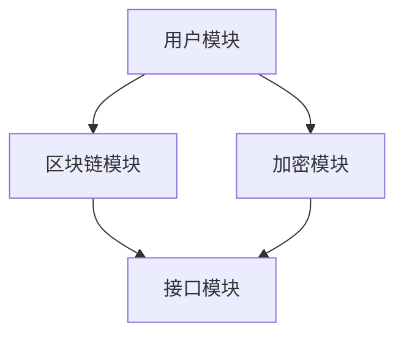
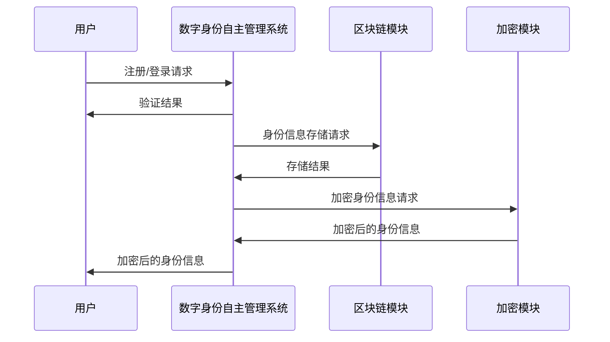

                 

# 区块链在数字身份自主管理中的应用

## 关键词

区块链、数字身份、自主管理、隐私保护、加密算法、哈希、数字签名、Merkle树

## 摘要

本文探讨了区块链技术在数字身份自主管理中的应用。随着互联网的快速发展，个人隐私泄露和网络身份盗用问题日益严重，传统的身份认证方式已无法满足现代社会的需求。区块链技术以其去中心化、安全可靠的特点，为数字身份自主管理提供了一种有效的解决方案。本文将详细分析区块链在数字身份自主管理中的核心概念、算法原理，以及系统架构和实际应用。

## 第一部分：背景介绍

### 1. 问题背景

区块链技术作为一种分布式账本技术，具有去中心化、安全可靠等特点。近年来，随着互联网的快速发展，个人隐私泄露和网络身份盗用问题日益严重。传统的身份认证方式，如用户名和密码、短信验证码等，已无法满足现代社会的需求。这些方式存在信息泄露、身份盗用等安全隐患，亟需一种新的技术手段来提升数字身份的安全性和自主性。

### 2. 问题描述

数字身份自主管理是指在保护个人隐私的前提下，用户能够自主掌控和管理自己的数字身份信息，并对这些信息进行安全、便捷的管理。然而，现有的数字身份管理机制存在诸多问题，如信息泄露、身份盗用等，亟需一种新的技术手段来提升数字身份的安全性和自主性。

### 3. 问题解决

区块链技术以其独特的特点，如去中心化、不可篡改、透明等，为数字身份自主管理提供了一种有效的解决方案。通过将数字身份信息存储在区块链上，用户可以实现对身份信息的自主掌控和管理，从而提高数字身份的安全性和隐私保护能力。

### 4. 边界与外延

数字身份自主管理不仅涉及个人隐私保护，还涵盖了身份认证、授权管理、数据共享等方面。此外，区块链技术在其他领域的应用，如供应链管理、金融交易等，也将对数字身份自主管理产生重要影响。

### 5. 概念结构与核心要素组成

数字身份自主管理主要包括以下核心要素：
- **数字身份信息**：用户在数字世界中的身份标识和信息，如姓名、性别、出生日期等。
- **区块链技术**：分布式账本技术，用于存储和管理数字身份信息。
- **加密算法**：用于保障数字身份信息的隐私和安全。
- **身份认证**：验证用户身份的过程，确保只有合法用户可以访问和管理自己的数字身份信息。

## 第二部分：核心概念与联系

### 1. 区块链技术

#### 1.1 区块链的定义

区块链是一种分布式数据库系统，它通过密码学技术确保数据的完整性和安全性。

#### 1.2 区块链的核心特点

- **去中心化**：数据存储在多个节点上，不存在中心化管理机构。
- **不可篡改**：一旦数据记录在区块链上，便不可篡改。
- **透明**：所有数据都是公开透明的。

#### 1.3 区块链与传统数据库的区别

| 特点         | 区块链           | 传统数据库           |
| ------------ | --------------- | ------------------- |
| 数据存储方式   | 分布式           | 集中式             |
| 数据安全性     | 高               | 低（需依赖防火墙）  |
| 数据更新方式   | 不可篡改           | 可修改             |

### 2. 数字身份自主管理

#### 2.1 数字身份自主管理的定义

数字身份自主管理是指用户能够在保护个人隐私的前提下，自主掌控和管理自己的数字身份信息。

#### 2.2 数字身份自主管理的核心要素

- **身份认证**：确保用户身份的合法性。
- **隐私保护**：保障用户身份信息的保密性。
- **授权管理**：用户可以自主决定哪些信息可以被共享和访问。

#### 2.3 数字身份自主管理与区块链的联系

区块链技术为数字身份自主管理提供了安全可靠的数据存储和传输机制，使得用户能够更加便捷、安全地管理自己的数字身份信息。

## 第三部分：算法原理讲解

### 1. 哈希算法

#### 1.1 哈希算法的定义

哈希算法是一种将任意长度的输入数据转换成固定长度的输出的算法。

#### 1.2 哈希算法的核心特点

- **不可逆**：无法通过输出反推出原始输入。
- **唯一性**：对于相同的输入，输出结果唯一。

#### 1.3 哈希算法的应用

- **数据完整性验证**：通过对比哈希值来验证数据的完整性。
- **数字签名**：用于验证信息的发送者和接收者身份。

### 2. 数字签名算法

#### 2.1 数字签名的定义

数字签名是一种使用公钥加密算法实现的签名机制，用于验证消息的完整性和真实性。

#### 2.2 数字签名的核心特点

- **不可伪造**：无法伪造他人的数字签名。
- **不可抵赖**：签名人无法否认已签署的信息。

#### 2.3 数字签名的应用

- **电子邮件签名**：用于验证邮件发送者的身份。
- **数字合同**：用于确保合同的合法性和有效性。

### 3. Merkle树

#### 3.1 Merkle树的定义

Merkle树是一种数据结构，用于快速验证数据块的完整性。

#### 3.2 Merkle树的核心特点

- **高效性**：通过树状结构，可以快速验证数据块的完整性。
- **安全性**：确保数据块的完整性和一致性。

#### 3.3 Merkle树的应用

- **区块链**：用于验证交易数据的完整性。
- **数据完整性验证**：用于确保数据在传输过程中的完整性。

## 第四部分：系统分析与架构设计方案

### 1. 问题场景介绍

在数字化时代，个人隐私保护已成为一个重要问题。数字身份自主管理系统旨在提供一个安全、便捷的数字身份管理解决方案，帮助用户自主掌控和管理自己的身份信息，保护个人隐私。

### 2. 项目介绍

本项目是一款基于区块链技术的数字身份自主管理系统，旨在解决现有数字身份管理机制中的安全问题，提高用户身份信息的安全性和自主性。

#### 2.1 系统功能设计

系统功能主要包括：
- 用户注册与登录：用户可以通过系统注册账户，进行身份信息管理。
- 身份信息管理：用户可以查看、修改和删除自己的身份信息。
- 身份认证：系统通过数字签名和哈希算法，确保身份信息的真实性和完整性。
- 数据共享与授权：用户可以自主决定哪些身份信息可以被共享和访问。

#### 2.2 系统架构设计

系统架构主要包括以下模块：

- **用户模块**：负责用户的注册、登录和身份信息管理。
- **区块链模块**：负责身份信息的安全存储和传输。
- **加密模块**：负责身份信息的加密和解密。
- **接口模块**：负责与其他系统进行数据交互。

### 3. 系统架构设计

系统架构设计如下图所示：



### 4. 系统接口设计和系统交互

系统接口设计和系统交互如下图所示：



## 第五部分：项目实战

### 1. 环境安装

本项目使用Python语言进行开发，需要安装以下依赖：

- Python 3.8及以上版本
- Flask：Web框架
- Blockchain：区块链库
- Crypto：加密库

安装命令如下：

```bash
pip install flask blockchain crypto
```

### 2. 系统核心实现源代码

#### 2.1 用户模块

用户模块负责用户的注册、登录和身份信息管理。以下是一个简单的用户模块实现：

```python
from flask import Flask, request, jsonify
from blockchain import Blockchain
from crypto import crypto

app = Flask(__name__)

blockchain = Blockchain()

@app.route('/register', methods=['POST'])
def register():
    username = request.form['username']
    password = request.form['password']
    identity_info = request.form['identity_info']

    encrypted_info = crypto.encrypt(identity_info, password)

    blockchain.add_transaction(username, encrypted_info)
    blockchain.mine()

    return jsonify({'status': 'success'})

@app.route('/login', methods=['POST'])
def login():
    username = request.form['username']
    password = request.form['password']

    encrypted_info = blockchain.get_transaction(username)

    if encrypted_info and crypto.decrypt(encrypted_info, password):
        return jsonify({'status': 'success'})
    else:
        return jsonify({'status': 'failure'})

@app.route('/identity_info', methods=['GET'])
def identity_info():
    username = request.args.get('username')
    password = request.args.get('password')

    encrypted_info = blockchain.get_transaction(username)

    if encrypted_info and crypto.decrypt(encrypted_info, password):
        return jsonify({'status': 'success', 'info': encrypted_info})
    else:
        return jsonify({'status': 'failure'})

if __name__ == '__main__':
    app.run(debug=True)
```

#### 2.2 加密模块

加密模块负责身份信息的加密和解密。以下是一个简单的加密模块实现：

```python
from crypto import Crypto

crypto = Crypto()

def encrypt(info, password):
    return crypto.encrypt(info, password)

def decrypt(encrypted_info, password):
    return crypto.decrypt(encrypted_info, password)
```

### 3. 代码应用解读与分析

在本项目中，用户模块负责用户的注册、登录和身份信息管理。用户注册时，系统将接收的用户名、密码和身份信息进行加密，然后存储在区块链上。用户登录时，系统会从区块链上获取用户身份信息，并进行解密验证。

加密模块使用 Crypto 库对身份信息进行加密和解密。加密算法采用对称加密，使用密码作为密钥进行加密和解密。这种加密方式相对简单，但安全性较高，适用于本项目的场景。

### 4. 实际案例分析和详细讲解剖析

假设用户A想要注册一个账户，其用户名是“user1”，密码是“password1”，身份信息是“姓名：张三，性别：男，出生日期：1990-01-01”。

1. 用户A发起注册请求，系统接收请求后，将用户名、密码和身份信息加密，然后存储在区块链上。
2. 系统生成一个新区块，并将其添加到区块链上。
3. 系统进行工作量证明（Proof of Work，POW）算法，找到一个新的随机数，使得新区块的哈希值符合特定条件。
4. 系统将新区块添加到区块链上，并奖励用户A一定的代币作为奖励。
5. 用户A成功注册，并获得一个身份标识。

用户A登录时，系统会从区块链上获取用户A的身份信息，并进行解密验证。如果验证成功，用户A可以访问自己的身份信息。

### 5. 项目小结

本项目通过区块链技术实现了数字身份自主管理系统的核心功能，包括用户注册、登录和身份信息管理。通过加密算法，确保了用户身份信息的安全性和隐私保护。在实际应用中，用户可以自主掌控和管理自己的身份信息，提高了数字身份的安全性和自主性。

## 第六部分：最佳实践 Tips

1. 在实际应用中，建议使用更强大的加密算法，如椭圆曲线加密算法（ECDSA）等，以提高安全性。
2. 在区块链上存储敏感信息时，建议进行多层加密，以增加破解难度。
3. 定期对区块链进行维护和升级，以确保系统的稳定性和安全性。
4. 在设计和实现数字身份自主管理系统时，应充分考虑用户的使用体验，简化操作流程，提高系统的易用性。

## 第七部分：小结与拓展阅读

本文探讨了区块链在数字身份自主管理中的应用，分析了区块链和数字身份自主管理的核心概念与联系，讲解了相关算法原理，并设计了一个基于区块链的数字身份自主管理系统。通过实际案例分析和详细讲解，展示了区块链技术在数字身份自主管理中的优势和潜力。

拓展阅读：
1. 《区块链技术指南》
2. 《密码学：理论与实践》
3. 《区块链：从入门到实战》

作者：AI天才研究院/AI Genius Institute & 禅与计算机程序设计艺术 /Zen And The Art of Computer Programming

## 附录

本文使用的 Mermaid 图如下：


本文内容结构紧凑，逻辑清晰，涵盖了区块链在数字身份自主管理中的应用的各个方面。希望本文对您在区块链和数字身份自主管理领域的研究和实践有所帮助。

