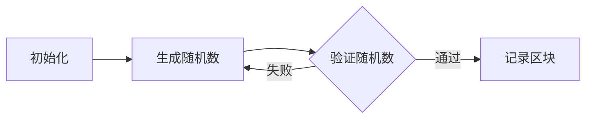

                 


### 深度解析：区块链在数字身份自主管理中的应用

随着数字化转型的加速，个人和企业对数字身份的管理需求日益增长。区块链技术以其去中心化、不可篡改和透明性等特性，成为实现数字身份自主管理的关键技术。下面，我们将一步步深入探讨区块链在数字身份自主管理中的应用。

#### 1. 问题背景

**区块链技术背景介绍：**

区块链起源于2008年，由一个化名为中本聪（Satoshi Nakamoto）的人提出。它是一种分布式数据库技术，通过加密算法确保数据的完整性和安全性。区块链的核心特点包括去中心化、不可篡改和透明性。去中心化意味着没有单一的中央控制机构，每个节点都可以参与数据的验证和记录。不可篡改指的是一旦数据被记录在区块链上，就几乎无法更改或删除。透明性则保证了所有参与者可以查看区块链上的信息。

**数字身份自主管理的需求：**

数字身份自主管理是指个人或企业能够独立控制和管理自己的数字身份信息，而无需依赖第三方机构。这种管理方式满足了人们对隐私保护和数据安全的需求。然而，传统的身份管理方式存在诸多缺陷，如数据泄露、信息被滥用等问题。因此，实现数字身份自主管理成为当务之急。

**区块链在解决这些挑战中的作用：**

区块链技术通过其独特特性，提供了解决数字身份自主管理挑战的有效途径。首先，去中心化结构减少了中介环节，降低了数据泄露的风险。其次，不可篡改性确保了身份信息的真实性和完整性。最后，透明性使身份信息的管理过程更加公开透明，便于用户监控和管理。

#### 2. 核心概念与联系

**核心概念：**

- **区块链：** 一种分布式数据库技术，通过加密算法和数据结构确保数据的完整性和安全性。
- **数字身份：** 个人或实体在数字世界中的唯一标识，包括身份信息、行为记录等。
- **自主管理：** 指个人或实体独立控制和管理自己的数字身份信息，而无需依赖第三方机构。

**概念属性特征对比表格：**

| 特性        | 区块链          | 数字身份        | 自主管理        |
| ----------- | --------------- | --------------- | --------------- |
| 去中心化    | 无中央控制机构  | 数字世界的唯一标识 | 独立控制和管理  |
| 不可篡改性  | 一旦记录不可更改 | 确保真实性和完整性 | 防止信息被篡改  |
| 透明性      | 所有参与者可查看 | 管理过程公开透明 | 用户可自主监控  |

**ER实体关系图架构：**

```mermaid
erDiagram
    Person ||--|{ DigitalIdentity }|-->> Organization
    DigitalIdentity ||--|{ AutonomousManagement }|-->> Application
```

#### 3. 算法原理讲解

**哈希算法：**

哈希算法是一种将任意长度的数据转换成固定长度的字符串的算法。在区块链中，哈希算法用于确保数据的完整性和不可篡改性。常见的哈希算法包括SHA-256、MD5等。以下是SHA-256算法的工作原理：

```python
import hashlib

def sha256_hash(data):
    return hashlib.sha256(data.encode('utf-8')).hexdigest()
```

**共识算法：**

共识算法是区块链中节点之间达成一致性的机制。常见的共识算法包括工作量证明（PoW）、权益证明（PoS）等。以下是一个简化的PoW算法流程：



**智能合约：**

智能合约是一种自动执行合约条款的计算机程序，它运行在区块链上。智能合约通过预定义的逻辑条件自动执行交易。以下是一个简单的智能合约示例：

```solidity
pragma solidity ^0.8.0;

contract SimpleContract {
    address public owner;

    constructor() {
        owner = msg.sender;
    }

    function transfer(address payable receiver, uint amount) public {
        require(msg.sender == owner, "Only owner can transfer");
        require(amount <= address(this).balance, "Insufficient balance");
        receiver.transfer(amount);
    }
}
```

#### 4. 数学模型和数学公式

**数学模型：**

数字签名是一种确保消息完整性和真实性的机制。以下是一个简单的数字签名模型：

- **公钥和私钥对：** 每个用户拥有一个公钥和一个私钥对。
- **签名过程：** 用户使用私钥对消息进行签名。
- **验证过程：** 接收方使用公钥验证签名。

**数学公式：**

- **安全距离计算公式：**
  $$ d = \sqrt{2n} $$
  其中，$d$ 是安全距离，$n$ 是密钥长度。

- **密钥生成公式：**
  $$ k = g^x \mod p $$
  其中，$k$ 是公钥，$g$ 是生成元，$x$ 是私钥，$p$ 是素数。

#### 5. 系统分析与架构设计方案

**问题场景介绍：**

假设一个企业需要实现员工数字身份的自主管理，以确保员工信息的隐私和安全。

**项目介绍：**

项目目标是构建一个基于区块链的员工数字身份管理系统，实现员工身份信息的自主管理和隐私保护。

**系统功能设计：**

- **领域模型：**
  ```mermaid
  classDiagram
      Employee <<class>> {
          id: String
          name: String
          role: String
          skills: List<String>
      }
      DigitalIdentity <<class>> {
          id: String
          owner: Employee
          publicKey: String
          privateKey: String
      }
  endclass
  ```

- **系统架构设计：**
  ```mermaid
  sequenceDiagram
      Participant User
      Participant Blockchain
      Participant Server
      
      User ->> Server: Request authentication
      Server ->> Blockchain: Verify digital identity
      Blockchain ->> Server: Return authentication result
      Server ->> User: Authentication result
  end
  ```

- **系统接口设计和系统交互：**
  ```mermaid
  sequenceDiagram
      Participant User
      Participant Blockchain
      Participant Server
      
      User ->> Server: Send personal information
      Server ->> Blockchain: Create digital identity
      Blockchain ->> Server: Return digital identity
      Server ->> User: Confirm digital identity
  end
  ```

#### 6. 项目实战

**环境安装：**

- 安装区块链节点
- 配置开发环境

**系统核心实现源代码：**

- **源代码结构：**
  ```bash
  digital-identity-management
  ├── blockchain
  │   ├── node
  │   ├── contract
  │   └── utils
  ├── frontend
  │   ├── components
  │   ├── styles
  │   └── utils
  ├── backend
  │   ├── api
  │   ├── controllers
  │   ├── models
  │   └── routes
  └── tests
  ```

- **主要模块功能：**
  - 区块链节点：实现区块链的基础功能
  - 智能合约：定义数字身份的创建、验证和修改
  - 前端：提供用户界面
  - 后端：处理业务逻辑和与区块链节点的交互

**代码应用解读与分析：**

- **源代码分析：**
  - 区块链节点：实现区块链的基础功能，如区块创建、交易记录等。
  - 智能合约：定义数字身份的创建、验证和修改，确保数字身份信息的真实性和安全性。
  - 前端：提供用户界面，方便用户创建和管理数字身份。
  - 后端：处理业务逻辑和与区块链节点的交互，确保系统的高效运行。

**实际案例分析和详细讲解剖析：**

- **案例背景：**
  - 一家大型企业希望实现员工数字身份的自主管理，以提高员工信息的安全性和隐私保护。

- **案例分析：**
  - 企业使用区块链技术构建数字身份管理系统，员工可以自主创建和管理自己的数字身份。
  - 系统通过智能合约确保数字身份信息的真实性和安全性。
  - 员工可以通过前端界面查看和管理自己的数字身份信息。

- **案例总结：**
  - 通过区块链技术实现员工数字身份的自主管理，提高了信息的安全性和隐私保护。
  - 系统具有良好的扩展性和灵活性，可以满足企业的不同需求。

#### 7. 最佳实践、小结与拓展阅读

**最佳实践 tips：**

- 在使用区块链进行数字身份管理时，要确保节点数量的充足，以提高系统的稳定性和安全性。
- 定期对区块链节点进行备份，以防止数据丢失。
- 加强智能合约的安全审计，防止漏洞和攻击。

**小结：**

本文详细介绍了区块链在数字身份自主管理中的应用，包括背景介绍、核心概念与联系、算法原理讲解、数学模型和数学公式、系统分析与架构设计方案、项目实战以及最佳实践等内容。通过本文的阐述，读者可以深入了解区块链在数字身份自主管理中的重要作用和实现方法。

**注意事项：**

- 在实施数字身份自主管理时，要充分考虑用户隐私保护和数据安全。
- 区块链技术的应用需要结合实际情况，灵活调整系统架构和功能。

**拓展阅读：**

- [区块链技术基础教程](https://www.blockchainbasics.com/)
- [数字身份自主管理白皮书](https://www.digitalidentitymanagement.org/)
- [智能合约安全指南](https://www.smartcontractsecurity.com/)

### 作者信息

作者：AI天才研究院/AI Genius Institute & 禅与计算机程序设计艺术 /Zen And The Art of Computer Programming

本文内容仅供参考，不构成具体操作建议。在实际应用中，请结合具体需求和情况进行决策。让我们共同探索区块链在数字身份自主管理中的更多可能性！

