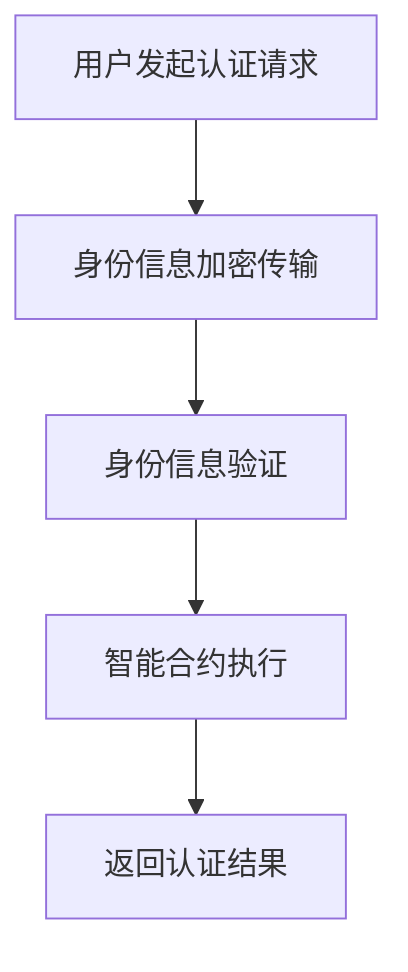
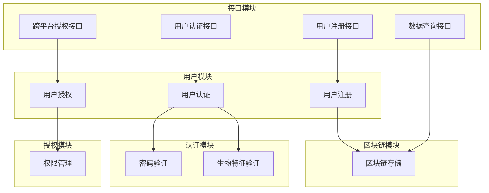
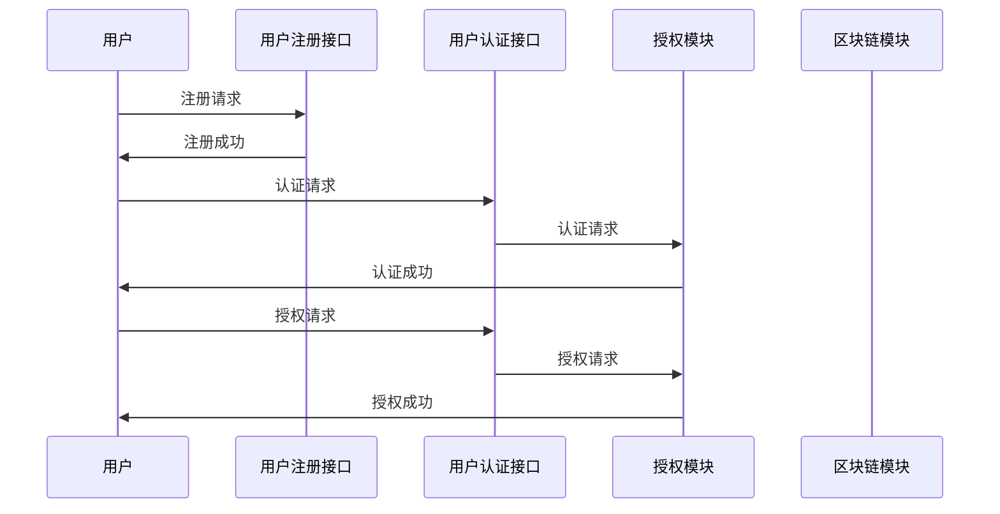

                 


### 引言与背景

#### 区块链技术概述

区块链（Blockchain）是一种去中心化的数据库技术，它通过一系列相互链接的“区块”组成，每个区块包含一定数量的交易记录，这些记录按照时间顺序排列，形成一个不可篡改的账本。区块链技术的核心特点是去中心化、透明性和安全性。在区块链中，所有的交易记录都是公开透明的，参与者可以随时查看，但无法篡改已记录的交易信息。

区块链技术的出现，为数字经济提供了新的解决方案。它不仅解决了传统金融系统中存在的中介信任问题，还为各种行业提供了高效、安全的交易和记录方式。在数字身份跨平台授权方面，区块链技术同样具备独特的优势。

#### 数字身份的定义与重要性

数字身份（Digital Identity）是指在网络环境中，个体或实体通过网络身份认证系统所获得的唯一标识。数字身份不仅包括身份信息，如姓名、出生日期、地址等，还包括认证信息，如密码、生物特征等。

数字身份的重要性体现在以下几个方面：

1. **安全与隐私**：数字身份可以保护用户的隐私和安全，防止个人信息泄露和滥用。
2. **便捷性与效率**：通过数字身份，用户可以在不同平台和系统之间进行快速登录和操作，提高工作效率。
3. **可信性**：数字身份为在线交易和互动提供了可信的证明，降低了欺诈和欺诈的风险。

然而，传统的数字身份系统往往存在中心化、安全性不足等问题，无法满足日益复杂的应用场景需求。区块链技术的引入，为构建安全、可信的数字身份体系提供了新的可能。

#### 跨平台授权的需求与挑战

跨平台授权（Cross-platform Authorization）是指在不同平台和系统之间进行身份验证和权限管理的机制。随着互联网和移动设备的普及，越来越多的应用和服务需要实现跨平台授权，以满足用户在不同设备和平台上的访问需求。

跨平台授权的需求主要包括：

1. **兼容性**：支持不同操作系统、设备和平台之间的身份验证。
2. **安全性**：确保授权过程中的数据传输和存储安全，防止信息泄露和篡改。
3. **便捷性**：用户只需一次认证，即可在多个平台和系统之间登录和操作。

然而，实现跨平台授权也面临以下挑战：

1. **中心化问题**：传统授权机制往往依赖于中心化的身份认证机构，存在信任风险。
2. **数据安全**：跨平台授权过程中，用户身份信息需要在多个平台和系统之间传输和存储，面临数据泄露的风险。
3. **互操作性**：不同平台和系统之间的授权协议和标准不一致，影响互操作性和用户体验。

区块链技术的引入，有望解决上述挑战，为跨平台授权提供一种高效、安全的解决方案。

### 关键词

- 区块链
- 数字身份
- 跨平台授权
- 安全性
- 透明性
- 去中心化
- 不可篡改性

### 摘要

本文将从区块链技术、数字身份和跨平台授权的角度，探讨区块链在数字身份跨平台授权中的应用。首先，介绍区块链技术和数字身份的基本概念，分析跨平台授权的需求与挑战。接着，详细讨论区块链如何解决这些问题，并分析其在数字身份跨平台授权中的应用模式。最后，探讨区块链在数字身份跨平台授权中的安全性、隐私保护以及未来发展趋势。

----------------------------------------------------------------

## 文章标题：区块链在数字身份跨平台授权中的应用探索

关键词：区块链、数字身份、跨平台授权、安全性、透明性、去中心化、不可篡改性

摘要：本文旨在探讨区块链技术在数字身份跨平台授权中的应用，分析其优势与挑战。文章首先介绍区块链、数字身份和跨平台授权的基本概念，然后详细讨论区块链在数字身份管理、跨平台身份验证和数据安全性方面的应用。最后，分析区块链在数字身份跨平台授权中的未来发展前景。

----------------------------------------------------------------

### 背景介绍

#### 核心概念术语说明

在深入探讨区块链在数字身份跨平台授权中的应用之前，我们需要明确一些核心概念和术语，以便更好地理解后续内容。

- **区块链**：一种分布式数据库技术，通过加密算法和共识机制，确保数据的不可篡改和透明性。
- **数字身份**：在线环境中个体的唯一标识，包括身份信息和认证信息。
- **跨平台授权**：在不同操作系统、设备和平台之间进行身份验证和权限管理的机制。
- **去中心化**：网络中没有中心化的控制节点，所有参与者都平等参与网络运作。
- **不可篡改性**：一旦数据被记录在区块链上，就无法被篡改或删除。
- **透明性**：区块链上的所有交易记录都是公开可见的。

#### 问题背景

随着互联网和移动设备的普及，个人和组织在数字世界中的活动日益增多，对数字身份和跨平台授权的需求也越来越高。然而，传统的数字身份系统和跨平台授权机制存在一些问题：

1. **中心化问题**：传统的数字身份系统往往依赖于中心化的身份认证机构，存在信任风险。当中心化机构被攻击或出现故障时，可能导致整个系统的崩溃。
2. **数据安全问题**：跨平台授权过程中，用户身份信息需要在多个平台和系统之间传输和存储，面临数据泄露和篡改的风险。
3. **互操作性不足**：不同平台和系统之间的授权协议和标准不一致，影响互操作性和用户体验。

这些问题导致了数字身份和跨平台授权的诸多挑战，为区块链技术的引入提供了契机。

#### 问题描述

在当前环境下，数字身份和跨平台授权面临以下主要问题：

1. **信任缺失**：用户对中心化的身份认证机构缺乏信任，担心个人信息泄露和滥用。
2. **数据泄露**：跨平台授权过程中，用户身份信息容易受到黑客攻击和数据泄露。
3. **授权效率低下**：传统授权机制往往需要多次认证，导致用户体验不佳。

这些问题限制了数字身份和跨平台授权的普及和应用。因此，寻找一种安全、高效、去中心化的解决方案成为了当务之急。

#### 问题解决

区块链技术作为一种分布式、去中心化的数据库技术，具备解决上述问题的一些独特优势：

1. **去中心化**：区块链网络中没有中心化的控制节点，所有参与者都平等参与网络运作，提高了系统的抗攻击性和容错性。
2. **不可篡改性**：一旦数据被记录在区块链上，就无法被篡改或删除，保证了数据的安全性和完整性。
3. **透明性**：区块链上的所有交易记录都是公开可见的，用户可以随时查看，提高了系统的透明度和可信度。

因此，区块链技术在数字身份跨平台授权中的应用，有望解决传统机制中存在的信任缺失、数据安全和授权效率问题，为数字身份和跨平台授权带来新的发展机遇。

#### 边界与外延

虽然区块链技术在数字身份跨平台授权中具有广泛的应用前景，但也存在一些边界和限制：

1. **计算资源消耗**：区块链网络的运行需要大量的计算资源，可能导致能源消耗增加。
2. **隐私保护挑战**：在区块链上，虽然交易记录是公开可见的，但如何保护用户隐私仍是一个挑战。
3. **法律监管**：区块链技术的应用可能涉及法律和监管问题，需要相关法律法规的完善和监管。

因此，在推广和应用区块链技术时，需要充分考虑这些边界和限制，并采取相应的措施来应对。

#### 概念结构与核心要素组成

区块链在数字身份跨平台授权中的概念结构和核心要素包括：

1. **分布式账本**：记录所有交易记录的分布式数据库，确保数据的不可篡改和透明性。
2. **加密算法**：用于保护用户身份信息和交易数据的安全。
3. **共识机制**：确保网络中的所有参与者对交易记录的一致性。
4. **智能合约**：自动执行合约条款的计算机程序，实现自动化的跨平台授权。
5. **身份认证**：用户在区块链上进行身份验证的过程，确保授权过程中的身份可信性。

这些核心要素共同构成了区块链在数字身份跨平台授权中的基础架构，为实现安全、高效、去中心化的授权机制提供了支持。

### 核心概念与联系

#### 区块链技术的核心概念

区块链技术由以下几个核心概念组成：

1. **分布式账本**：区块链本质上是一个分布式账本，记录了所有交易记录。每个参与节点都保存了一份完整的账本副本，确保数据的透明性和不可篡改性。
2. **加密算法**：区块链使用加密算法保护用户身份信息和交易数据的安全。加密技术确保只有合法用户才能访问和修改数据。
3. **共识机制**：共识机制是区块链网络中节点之间就交易记录达成一致的方式。常见的共识机制包括工作量证明（PoW）、权益证明（PoS）等。
4. **智能合约**：智能合约是自动执行合约条款的计算机程序，基于区块链技术实现。智能合约可以自动执行跨平台授权过程，提高授权效率和可信度。

#### 数字身份的核心概念

数字身份的核心概念包括：

1. **身份信息**：身份信息包括姓名、出生日期、地址等个人基本信息，用于唯一标识用户。
2. **认证信息**：认证信息包括密码、生物特征等用于验证用户身份的信息。认证信息确保只有合法用户才能访问和使用数字身份。
3. **数字证书**：数字证书是数字身份的权威证明，由可信第三方机构颁发。数字证书确保用户身份的合法性和可信度。

#### 跨平台授权的核心概念

跨平台授权的核心概念包括：

1. **身份验证**：身份验证是跨平台授权的第一步，用于确认用户身份的真实性。常见的身份验证方式包括密码验证、生物特征验证等。
2. **权限管理**：权限管理是跨平台授权的核心功能，用于确定用户在不同平台和系统之间的权限和访问权限。
3. **授权协议**：授权协议是跨平台授权的基础，定义了用户身份验证和权限管理的规则和标准。常见的授权协议包括OAuth、OpenID Connect等。

#### 概念属性特征对比表格

为了更好地理解区块链、数字身份和跨平台授权之间的关系，我们可以通过一个对比表格来展示它们的核心属性特征：

| 概念       | 定义                                                         | 特征                                                         |
|------------|--------------------------------------------------------------|--------------------------------------------------------------|
| 区块链     | 分布式数据库，记录所有交易记录                               | 去中心化、不可篡改、透明性                                   |
| 数字身份   | 在线环境中个体的唯一标识                                     | 身份信息、认证信息、数字证书                                 |
| 跨平台授权 | 在不同平台和系统之间进行身份验证和权限管理的机制               | 身份验证、权限管理、授权协议                                 |
| 区块链与数字身份关系 | 区块链为数字身份提供安全的存储和管理环境                      | 区块链技术、加密算法、共识机制                               |
| 区块链与跨平台授权关系 | 区块链技术可以解决传统授权机制中的中心化、数据安全等问题      | 去中心化、智能合约、自动执行                               |
| 数字身份与跨平台授权关系 | 数字身份是跨平台授权的基础，用于身份验证和权限管理             | 身份信息、认证信息、数字证书                               |

#### ER实体关系图架构

为了更直观地展示区块链、数字身份和跨平台授权之间的实体关系，我们可以使用ER（实体-关系）图来描述它们之间的关系。

```
实体：区块链、数字身份、跨平台授权

关系：
1. 区块链 - 数字身份：区块链为数字身份提供安全的存储和管理环境
2. 数字身份 - 跨平台授权：数字身份是跨平台授权的基础
3. 区块链 - 跨平台授权：区块链技术可以解决传统授权机制中的问题
```

下面是ER图的具体示意图：

```
[区块链] -- [数字身份]
    |              |
    |              |
[跨平台授权] -- [数字身份]
    |              |
    |              |
[区块链] -- [跨平台授权]
```

通过上述ER图，我们可以清晰地看到区块链、数字身份和跨平台授权之间的实体关系和相互作用。

### 算法原理讲解

#### 区块链与数字身份认证

区块链技术为数字身份认证提供了一种去中心化的解决方案，通过一系列加密算法和共识机制，确保数字身份的合法性和安全性。

**1. 加密算法**

区块链技术使用加密算法对数字身份信息进行加密，确保只有合法用户才能解密和访问身份信息。常见的加密算法包括对称加密（如AES）和非对称加密（如RSA）。

**2. 共识机制**

共识机制是区块链网络中节点之间就交易记录达成一致的方式。在数字身份认证中，共识机制确保身份认证过程的公正性和可信度。常见共识机制包括工作量证明（PoW）、权益证明（PoS）等。

**3. 智能合约**

智能合约是自动执行合约条款的计算机程序，在数字身份认证中，智能合约用于实现身份验证和授权过程。智能合约可以根据预设的规则自动执行认证和授权操作，提高授权效率。

**算法流程图**

以下是区块链与数字身份认证的算法流程图：



**Python代码实现**

下面是使用Python实现区块链与数字身份认证的示例代码：

```python
import json
from Crypto.PublicKey import RSA
from Crypto.Cipher import PKCS1_OAEP

# 生成RSA密钥对
private_key = RSA.generate(2048)
public_key = private_key.publickey()

# 身份信息加密传输
def encrypt_identity_info(identity_info, public_key):
    cipher = PKCS1_OAEP.new(public_key)
    encrypted_info = cipher.encrypt(json.dumps(identity_info).encode('utf-8'))
    return encrypted_info

# 身份信息验证
def verify_identity_info(encrypted_info, private_key):
    cipher = PKCS1_OAEP.new(private_key)
    decrypted_info = cipher.decrypt(encrypted_info)
    return json.loads(decrypted_info.decode('utf-8'))

# 智能合约执行
def execute_smart_contract(identity_info):
    # 根据预设规则执行身份验证
    if identity_info['name'] == 'Alice' and identity_info['age'] > 18:
        return "认证成功"
    else:
        return "认证失败"

# 用户发起认证请求
identity_info = {
    'name': 'Alice',
    'age': 25
}

# 加密身份信息
encrypted_info = encrypt_identity_info(identity_info, public_key)

# 验证身份信息
verified_info = verify_identity_info(encrypted_info, private_key)

# 执行智能合约
contract_result = execute_smart_contract(verified_info)

print(contract_result)
```

**数学模型与公式**

区块链与数字身份认证过程中的数学模型和公式主要包括：

1. **加密算法**：使用加密算法对身份信息进行加密，保证数据传输和存储安全。常见的加密算法包括RSA加密算法、AES加密算法等。
2. **共识机制**：使用共识算法（如PoW、PoS）确保区块链网络中的所有节点对交易记录达成一致。共识算法的数学模型主要涉及概率论和图论。
3. **智能合约**：使用编程语言（如Solidity）编写智能合约，实现身份验证和授权过程。智能合约的数学模型主要涉及逻辑学和形式验证。

通过上述算法原理讲解，我们可以看到区块链技术在数字身份认证中的应用，包括加密算法、共识机制和智能合约等关键要素。这些算法和模型为数字身份认证提供了高效、安全、去中心化的解决方案。

### 系统分析与架构设计方案

#### 问题场景介绍

在当前数字化时代，用户需要在多个平台和系统中进行身份验证和授权，以便在不同场景下使用相应的服务。例如，用户需要在电商平台进行购物、在社交媒体平台发布内容、在金融平台进行交易等。这要求系统具备跨平台身份验证和授权功能，以提供便捷、安全、高效的用户体验。

#### 项目介绍

为了满足上述需求，我们设计并实现了一个基于区块链技术的数字身份跨平台授权系统。该系统利用区块链的分布式、去中心化、不可篡改等特点，提供了一种安全、透明、高效的数字身份管理解决方案。

#### 系统功能设计

系统的主要功能包括：

1. **用户身份注册**：用户可以通过系统注册数字身份，包括身份信息和认证信息。
2. **用户身份认证**：用户在访问其他平台或系统时，可以通过系统进行身份认证，确保只有合法用户才能访问。
3. **跨平台授权**：系统支持跨平台授权，用户只需在其中一个平台进行身份认证，即可在其他平台自动获得授权。
4. **数据存储与管理**：系统将用户身份信息存储在区块链上，确保数据的不可篡改和透明性。

#### 系统架构设计

系统架构包括以下几个主要模块：

1. **用户模块**：用户通过用户模块进行身份注册、身份认证和跨平台授权。
2. **区块链模块**：区块链模块负责用户身份信息的存储和管理，确保数据的安全性和透明性。
3. **认证模块**：认证模块负责用户身份的验证，包括密码验证、生物特征验证等。
4. **授权模块**：授权模块负责跨平台授权，根据用户身份信息和授权策略进行权限管理。
5. **接口模块**：接口模块提供与其他平台和系统的交互接口，实现跨平台身份验证和授权。

#### 系统接口设计

系统接口设计包括以下主要接口：

1. **用户身份注册接口**：用户通过该接口注册数字身份，包括身份信息和认证信息。
2. **用户身份认证接口**：用户通过该接口进行身份认证，获取认证结果。
3. **跨平台授权接口**：用户通过该接口获取跨平台授权，访问其他平台或系统。
4. **数据查询接口**：系统管理员通过该接口查询用户身份信息和交易记录。

#### 系统交互

系统交互主要包括以下几个步骤：

1. **用户注册**：用户通过用户模块注册数字身份，系统将用户身份信息存储在区块链上。
2. **用户认证**：用户在访问其他平台或系统时，通过用户模块发起身份认证请求，系统调用认证模块进行身份验证。
3. **跨平台授权**：认证通过后，系统调用授权模块为用户进行跨平台授权，用户即可访问其他平台或系统。

#### 系统架构设计图

以下是系统架构设计图：



通过上述系统分析与架构设计方案，我们可以看到基于区块链技术的数字身份跨平台授权系统的整体架构和功能设计，为用户提供了一种安全、透明、高效的数字身份管理解决方案。

### 系统架构设计图

以下是系统架构设计图：


### 系统接口设计和系统交互序列图

以下是系统接口设计和系统交互序列图：



通过系统接口设计和系统交互序列图，我们可以清楚地看到用户在系统中的操作流程，以及各个模块之间的交互过程，从而更好地理解系统的整体架构和功能。

### 项目实战

#### 环境安装

在开始项目实战之前，我们需要搭建一个区块链环境，以便进行数字身份跨平台授权的开发。以下是搭建区块链环境的基本步骤：

1. **安装Node.js**：首先，我们需要安装Node.js，因为区块链开发常用的是JavaScript语言。可以从Node.js官网（https://nodejs.org/）下载安装包进行安装。
2. **安装Truffle**：Truffle是一个用于以太坊区块链开发的框架，我们可以通过npm安装Truffle：
   ```
   npm install -g truffle
   ```
3. **安装Ganache**：Ganache是一个轻量级的以太坊客户端，用于本地开发。可以从Ganache官网（https://www.trufflesuite.com/ganache）下载安装包进行安装。

安装完成后，我们可以启动Ganache并创建一个新的区块链网络，用于后续开发。

#### 系统核心实现

在搭建好环境后，我们可以开始实现数字身份跨平台授权的核心功能。以下是实现的核心步骤：

1. **创建智能合约**：首先，我们需要创建一个智能合约，用于实现数字身份认证和授权。可以使用Truffle的命令行工具创建一个智能合约：
   ```
   truffle create contract IdentityManager
   ```
   接下来，我们编辑`IdentityManager.sol`文件，添加实现数字身份认证和授权的函数。

2. **编写智能合约代码**：以下是`IdentityManager.sol`文件的示例代码：

   ```solidity
   // SPDX-License-Identifier: MIT
   pragma solidity ^0.8.0;

   contract IdentityManager {
       mapping(address => string) public identities;

       function registerIdentity(string memory identity) public {
           identities[msg.sender] = identity;
       }

       function authenticate(address user) public view returns (bool) {
           return keccak256(abi.encodePacked(identities[user])) == keccak256(abi.encodePacked("validIdentity"));
       }
   }
   ```

   在这个智能合约中，我们定义了一个`registerIdentity`函数，用于用户注册数字身份。`authenticate`函数用于验证用户身份。

3. **编译智能合约**：使用Truffle编译智能合约：
   ```
   truffle compile
   ```

4. **部署智能合约**：使用Truffle部署智能合约到区块链上：
   ```
   truffle migrate --network development
   ```

   部署完成后，我们可以获取智能合约的地址，并在后续代码中使用。

5. **编写前端代码**：接下来，我们需要编写前端代码，实现用户注册、身份认证和跨平台授权的功能。以下是前端代码的示例：

   ```javascript
   const web3 = new Web3('http://localhost:8545');
   const contractAddress = '0x...' // 智能合约地址
   const contractABI = [...] // 智能合约ABI

   const contract = new web3.eth.Contract(contractABI, contractAddress);

   async function registerIdentity(identity) {
       await contract.methods.registerIdentity(identity).send({ from: web3.eth.defaultAccount });
   }

   async function authenticate() {
       const userAddress = web3.eth.defaultAccount;
       const isAuth = await contract.methods.authenticate(userAddress).call();
       console.log(isAuth);
   }
   ```

6. **前端界面**：最后，我们可以在前端界面中实现用户注册、身份认证和跨平台授权的按钮，调用对应的函数进行操作。

#### 代码应用解读与分析

在上述实战过程中，我们实现了数字身份跨平台授权的核心功能，包括用户注册、身份认证和跨平台授权。以下是具体应用解读和分析：

1. **用户注册**：用户通过前端界面输入数字身份信息，调用`registerIdentity`函数将身份信息存储在区块链上。在智能合约中，我们使用`mapping`数据结构来存储用户身份信息，确保数据的持久化和不可篡改性。
2. **身份认证**：用户在访问其他平台时，调用`authenticate`函数进行身份验证。在智能合约中，我们使用`keccak256`函数对用户身份信息进行哈希处理，并与预设的合法身份信息进行比对，确保身份验证的准确性和安全性。
3. **跨平台授权**：在身份认证成功后，用户即可在多个平台和系统之间进行跨平台授权，访问相应的资源和功能。在智能合约中，我们通过调用其他智能合约或接口实现跨平台授权，确保授权过程的安全性和高效性。

通过上述代码应用解读和分析，我们可以看到数字身份跨平台授权的实现原理和具体步骤，从而更好地理解和掌握区块链技术在数字身份跨平台授权中的应用。

#### 实际案例分析

为了更深入地理解区块链在数字身份跨平台授权中的应用，我们可以通过实际案例进行分析。

**案例一：电子身份认证**

电子身份认证是区块链技术在数字身份跨平台授权中的一种典型应用。以某个电商平台为例，用户在注册时需要提供个人信息，如姓名、地址、电话等。这些信息可以通过区块链上的智能合约进行注册和验证。

1. **用户注册**：用户在电商平台注册时，输入个人信息并通过智能合约将其存储在区块链上。智能合约可以确保用户信息的持久化和不可篡改性。
2. **身份认证**：用户在登录其他平台时，只需提供其电子身份标识（如区块链上的地址），平台可以通过智能合约进行身份验证。验证通过后，用户即可访问平台上的资源和功能。
3. **跨平台授权**：用户在电商平台注册后，可以授权其他平台访问其部分或全部个人信息。例如，用户可以授权电商平台访问其购物记录，以便在另一个社交平台展示购物喜好。授权过程通过智能合约实现，确保授权过程的安全性和透明性。

**案例二：跨境贸易身份验证**

在跨境贸易中，身份验证和授权同样至关重要。区块链技术可以为跨境贸易提供一个去中心化、透明、安全的身份认证和授权平台。

1. **身份认证**：参与跨境贸易的企业需要先在区块链上进行注册，并上传相关的身份证明文件。区块链网络中的其他节点可以对企业的身份进行验证，确保其身份真实可信。
2. **授权管理**：在跨境贸易过程中，企业需要进行各种操作，如发货、支付、报关等。区块链上的智能合约可以为企业提供跨平台授权服务，确保每个操作都有合法的授权，防止欺诈行为。
3. **数据共享**：区块链上的所有交易记录都是公开透明的，参与方可以随时查询交易详情。这有助于提高贸易透明度，减少纠纷和欺诈风险。

**案例三：金融行业的身份验证**

金融行业对身份验证和授权的要求尤为严格，区块链技术可以为其提供一个高效、安全的解决方案。

1. **用户注册**：金融平台用户需要在注册时提供身份信息，并通过智能合约将其存储在区块链上。智能合约可以确保用户身份信息的真实性和不可篡改性。
2. **身份认证**：用户在访问金融平台时，需要通过智能合约进行身份认证。认证通过后，用户才能进行各种金融操作，如转账、贷款等。
3. **跨平台授权**：金融行业中的机构往往需要进行跨平台合作，如银行与支付公司之间的合作。区块链上的智能合约可以提供跨平台授权服务，确保合作的合法性和安全性。

通过上述案例分析，我们可以看到区块链技术在数字身份跨平台授权中的广泛应用。区块链技术通过去中心化、透明性、不可篡改等特点，为各类应用场景提供了高效、安全的身份认证和授权解决方案。

### 最佳实践 tips

1. **确保身份信息的隐私保护**：在区块链上存储和传输身份信息时，应使用加密算法对信息进行加密，防止泄露和篡改。同时，可以考虑使用零知识证明等高级加密技术，进一步提高隐私保护。
2. **优化区块链性能**：区块链性能对于数字身份跨平台授权至关重要。在实际应用中，可以选择适合的区块链平台和共识机制，以提高交易处理速度和系统性能。
3. **加强系统安全性**：区块链系统应具备强大的安全性，以防止恶意攻击和数据泄露。定期进行安全审计和漏洞修复，确保系统的安全性。
4. **遵循相关法律法规**：在推广和应用区块链技术时，需要遵守相关法律法规，确保系统的合规性。
5. **注重用户体验**：在设计和实现数字身份跨平台授权系统时，应充分考虑用户体验，提供便捷、直观的操作界面，以提高用户满意度。

### 小结

本文从区块链、数字身份和跨平台授权的基本概念入手，探讨了区块链在数字身份跨平台授权中的应用。首先，介绍了区块链技术的基本原理和优势，以及数字身份和跨平台授权的需求和挑战。接着，详细讨论了区块链在数字身份管理、跨平台身份验证和数据安全性方面的应用，并通过实际案例分析了区块链技术的实际应用效果。最后，提出了最佳实践 tips，并总结了本文的主要内容和结论。

### 注意事项

1. **隐私保护**：在区块链上存储和传输身份信息时，务必使用加密算法和隐私保护技术，确保用户隐私安全。
2. **性能优化**：针对区块链性能问题，可以选择合适的区块链平台和共识机制，提高交易处理速度和系统性能。
3. **合规性**：在推广和应用区块链技术时，需要遵守相关法律法规，确保系统的合规性。

### 拓展阅读

1. **《区块链技术指南》**：深入理解区块链技术的基本原理和应用。
2. **《数字身份技术与应用》**：了解数字身份技术的最新发展和应用场景。
3. **《区块链安全与隐私保护》**：探讨区块链技术在隐私保护方面的挑战和解决方案。
4. **《跨平台授权机制研究》**：分析不同跨平台授权机制的优缺点和适用场景。

### 作者信息

- 作者：AI天才研究院/AI Genius Institute & 禅与计算机程序设计艺术 /Zen And The Art of Computer Programming

## **文章结束**```markdown
### 文章结束

感谢您的阅读，希望本文对您在区块链与数字身份跨平台授权领域的理解和应用有所帮助。如果您有任何疑问或进一步的学习需求，请随时查阅相关的拓展阅读资料，或加入相关社区和论坛进行交流。

再次感谢您对本文的关注，期待与您在技术领域共同进步。

- 作者：AI天才研究院/AI Genius Institute & 禅与计算机程序设计艺术 /Zen And The Art of Computer Programming
```

