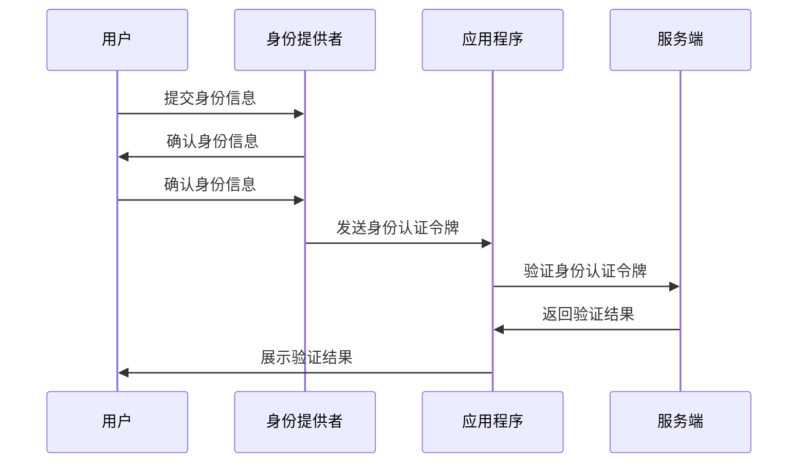
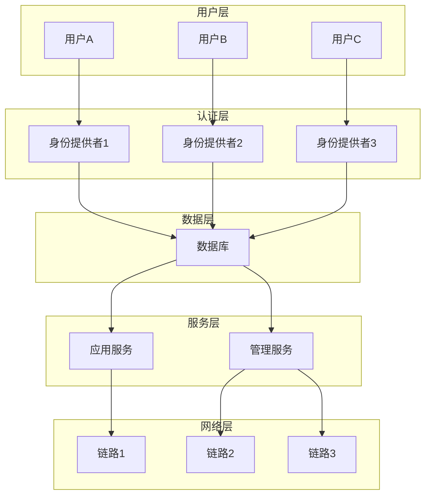
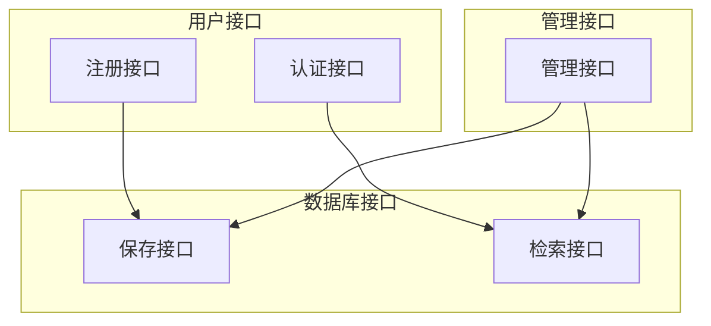

                 

### 文章标题

**区块链在数字身份验证中的应用：去中心化身份认证平台**

区块链技术在近年来迅速发展，并在多个领域展现出了其独特的优势和潜力。在数字身份验证领域，区块链的去中心化和不可篡改特性为解决传统身份认证中存在的一些问题提供了新的解决方案。本文将探讨区块链在数字身份验证中的应用，特别是去中心化身份认证平台的构建。

**关键词：**区块链、数字身份验证、去中心化、身份认证、加密技术

**摘要：**本文旨在介绍区块链技术及其在数字身份验证中的应用，通过详细解析去中心化身份认证平台的构建原理、算法原理和系统设计，帮助读者深入理解区块链在身份认证领域的前景和挑战。

### 引言

随着互联网的普及和电子商务的快速发展，数字身份验证成为保障信息安全的重要手段。然而，传统的集中式身份验证系统在隐私保护、数据安全和权限管理方面存在诸多问题。区块链作为一种去中心化的分布式账本技术，具备高度的透明性和不可篡改性，为构建安全、可靠和高效的数字身份验证平台提供了新的思路。

本文将从以下几个方面进行探讨：

1. **背景介绍**：介绍区块链技术、数字身份验证的基本概念，以及当前数字身份验证系统面临的挑战。
2. **核心概念与联系**：详细解析区块链、数字身份验证和去中心化身份认证平台之间的联系。
3. **算法原理讲解**：深入探讨区块链中的身份认证算法，特别是零知识证明和加密技术的应用。
4. **系统分析与架构设计方案**：介绍去中心化身份认证平台的需求分析、系统架构设计、接口设计和交互流程。
5. **项目实战**：通过实际案例展示去中心化身份认证平台的建设过程、系统核心实现和案例分析。
6. **最佳实践 tips、小结、注意事项、拓展阅读**：总结本文的核心内容，提供实用技巧和进一步阅读建议。

### 背景介绍

#### 区块链技术概述

区块链技术是一种分布式数据库技术，通过加密算法和共识机制确保数据的不可篡改和高度透明。区块链的基本原理包括区块、链和节点等组成部分。每个区块包含一定数量的交易记录，并通过加密算法与前后区块相连，形成一条不可篡改的区块链。节点是区块链网络中的参与者，通过共识机制（如工作量证明、权益证明等）确保区块链的一致性和安全性。

区块链的特点包括去中心化、不可篡改、高透明性和高安全性。去中心化意味着数据存储在分布式网络中，没有中央管理节点，从而提高了系统的容错性和抗攻击能力。不可篡改性确保了数据的真实性和完整性，一旦数据记录到区块链上，就无法被篡改。高透明性允许所有节点查看区块链上的数据，从而增强了系统的可信度。高安全性则是通过加密算法和共识机制实现的，确保了数据的安全传输和存储。

#### 数字身份验证的概念

数字身份验证是指通过电子方式验证个体的真实身份，以确保只有授权用户可以访问特定系统和资源。数字身份验证的核心目标是确保身份的合法性和唯一性，同时保护用户的隐私和安全。

常见的数字身份验证方法包括密码验证、生物识别验证和二步验证等。密码验证是最基础的验证方法，用户通过输入正确的密码来证明身份。生物识别验证则利用个体的生理特征或行为特征进行身份验证，如指纹、面部识别、虹膜扫描等。二步验证是一种增强安全性的方法，通常在首次登录或进行敏感操作时，要求用户进行二次验证，如发送短信验证码、生成动态密码等。

#### 数字身份验证的挑战

尽管数字身份验证在保障信息安全方面发挥了重要作用，但其仍面临着诸多挑战：

1. **隐私泄露**：传统的集中式身份验证系统往往依赖于中央数据库存储用户信息，一旦数据库泄露，可能导致大量用户隐私信息泄露。
2. **单点故障**：集中式身份验证系统中的中央服务器若发生故障，将导致整个系统瘫痪，影响用户的正常使用。
3. **权限管理复杂**：在复杂的权限管理系统中，如何确保只有授权用户访问特定资源和功能是一个挑战。
4. **用户体验不佳**：繁琐的身份验证过程和多种验证方法的使用，往往给用户带来不便，影响用户体验。

#### 去中心化身份认证平台的必要性

去中心化身份认证平台通过区块链技术解决了传统身份认证系统中的诸多问题。以下是一些主要优点：

1. **隐私保护**：去中心化身份认证平台通过加密技术和分布式存储，确保用户的身份信息不被泄露，提高了隐私保护水平。
2. **高安全性**：区块链的不可篡改性和高透明性，确保了身份认证过程的可信度和安全性。
3. **去中心化**：去中心化身份认证平台不存在单点故障问题，提高了系统的可靠性和容错性。
4. **权限管理简单**：去中心化身份认证平台通过智能合约实现权限管理，简化了权限分配和验证过程，提高了效率。

#### 去中心化身份认证平台的架构

去中心化身份认证平台的基本架构包括身份提供者（Identity Provider，简称IdP）、用户、应用程序和服务端。其中，IdP负责用户身份信息的创建、存储和验证；用户通过IdP进行身份认证，并获得访问应用程序的权限；应用程序和服务端则通过IdP验证用户的身份。

以下是一个简单的架构图：



#### 结论

本文对区块链在数字身份验证中的应用进行了概述，并介绍了去中心化身份认证平台的必要性及其架构。通过本文的探讨，读者可以了解区块链技术如何解决传统身份认证系统中的问题，以及去中心化身份认证平台的优势。在接下来的章节中，我们将深入探讨区块链中的身份认证算法和系统设计与实现，以帮助读者更好地理解这一新兴技术。

### 核心概念与联系

#### 区块链的基本原理

区块链是一种分布式数据存储技术，通过加密算法和共识机制确保数据的不可篡改性和安全性。区块链的基本组成包括区块、链和节点。每个区块包含一定数量的交易记录，并通过哈希算法与前后区块相连，形成一条链。节点是区块链网络中的参与者，通过共识机制确保区块链的一致性和安全性。

区块链的基本原理可以通过以下步骤进行解释：

1. **交易记录的产生**：用户在网络中进行交易，如购买商品或转账等，这些交易记录将被收集到一个区块中。
2. **区块的创建**：节点将交易记录整理成一个区块，并将其链接到当前区块链的末端。
3. **区块的验证**：其他节点验证区块的有效性，确保其中的交易记录是真实的，并且符合区块链的规则。
4. **区块的添加**：一旦区块被验证通过，它将被添加到区块链的末端，形成一条长链。

#### 数字身份验证的概念

数字身份验证是指通过电子方式验证个体的真实身份，以确保只有授权用户可以访问特定系统和资源。数字身份验证的核心目标是确保身份的合法性和唯一性，同时保护用户的隐私和安全。数字身份验证的方法包括密码验证、生物识别验证和二步验证等。

数字身份验证的基本原理包括以下步骤：

1. **身份信息的收集**：系统收集用户的身份信息，如用户名、密码、生物特征等。
2. **身份信息的验证**：系统通过比对用户输入的身份信息与数据库中的记录，验证身份的合法性。
3. **权限分配**：根据用户身份的合法性，系统分配相应的权限，决定用户可以访问哪些系统和资源。

#### 去中心化身份认证平台的架构

去中心化身份认证平台通过区块链技术实现了身份验证的去中心化和安全性。其基本架构包括身份提供者（IdP）、用户、应用程序和服务端。以下是一个简单的架构图：


#### 核心概念对比与联系

区块链、数字身份验证和去中心化身份认证平台是紧密相关的三个核心概念。以下是一个对比表格，展示了这三个概念之间的关系：

| 核心概念 | 定义 | 关系 |
| --- | --- | --- |
| 区块链 | 分布式数据库技术，通过加密算法和共识机制确保数据不可篡改和高度透明 | 区块链技术为数字身份验证提供了安全、可靠的底层架构 |
| 数字身份验证 | 通过电子方式验证个体的真实身份，以确保只有授权用户可以访问特定系统和资源 | 数字身份验证是去中心化身份认证平台的核心功能 |
| 去中心化身份认证平台 | 利用区块链技术实现身份验证的去中心化和安全性，提供用户身份信息管理和服务 | 去中心化身份认证平台是区块链技术在数字身份验证中的具体应用 |

通过以上对比，我们可以看出，区块链技术为数字身份验证提供了安全、可靠的底层架构，而去中心化身份认证平台则是基于区块链技术的具体应用，旨在解决传统身份验证系统中的问题，如隐私泄露、单点故障和权限管理复杂等。

### 算法原理讲解

在去中心化身份认证平台中，算法的设计和实现是关键。以下将详细讲解区块链中的身份认证算法，特别是零知识证明和加密技术的应用。

#### 区块链中的身份认证算法

区块链中的身份认证算法旨在确保用户身份的合法性和唯一性。常见的身份认证算法包括基于密码学的身份认证和基于智能合约的身份认证。以下是两种常见算法的简要描述：

1. **基于密码学的身份认证**：
   - **密码学基础**：密码学是一种通过加密算法和密钥管理技术保护信息传输安全的技术。常见的加密算法包括对称加密和非对称加密。
   - **身份认证过程**：用户在注册时，系统为其生成一对公钥和私钥。用户将公钥存储在区块链上，私钥则存储在本地。每次用户进行身份验证时，系统会要求用户提供公钥和验证签名。系统通过验证签名确认用户身份。

2. **基于智能合约的身份认证**：
   - **智能合约基础**：智能合约是一种在区块链上运行的计算机程序，能够自动执行、控制和记录合约条款的履行。智能合约通过加密算法和共识机制确保执行过程的安全性和不可篡改性。
   - **身份认证过程**：用户在注册时，系统将其身份信息写入智能合约。每次用户进行身份验证时，系统会调用智能合约，根据存储的身份信息验证用户身份。智能合约还允许设置多重签名机制，确保身份认证过程的透明性和安全性。

#### 零知识证明在身份验证中的应用

零知识证明（Zero-Knowledge Proof，简称ZKP）是一种密码学技术，它允许一方（证明者）向另一方（验证者）证明某个陈述是真实的，而不透露任何其他信息。在身份验证中，零知识证明可以用于保护用户隐私，同时确保身份认证的合法性。

零知识证明的基本原理如下：

1. **协议初始化**：证明者生成一组参数，包括公钥和私钥。私钥用于证明过程，公钥则公开存储在区块链上。

2. **证明生成**：证明者生成一个证明，证明其知道一个秘密值，该秘密值与公钥相关联。证明过程不涉及任何秘密值的具体信息。

3. **证明验证**：验证者使用证明者提供的证明和公钥，验证证明者确实知道该秘密值。验证过程无需知道秘密值的任何具体信息。

在身份验证中，零知识证明的应用过程如下：

1. **用户注册**：用户生成一对公钥和私钥，将公钥存储在区块链上，私钥则保存在本地。

2. **身份验证请求**：用户向系统发起身份验证请求，系统要求用户提供公钥和零知识证明。

3. **零知识证明生成**：用户生成零知识证明，证明其知道私钥对应的公钥。

4. **身份验证**：系统验证用户提供的零知识证明，确认用户身份。

#### 去中心化身份认证的加密技术

去中心化身份认证平台中，加密技术是保障数据安全的核心。常见的加密技术包括哈希算法、非对称加密和对称加密。

1. **哈希算法**：哈希算法是一种将输入数据映射为固定长度输出值（哈希值）的算法。常见的哈希算法包括SHA-256和MD5。在身份认证中，哈希算法用于生成用户身份的哈希值，确保身份信息的唯一性和不可篡改性。

2. **非对称加密**：非对称加密是一种加密算法，它使用一对公钥和私钥进行加密和解密。公钥用于加密，私钥用于解密。常见的非对称加密算法包括RSA和ECC。在身份认证中，非对称加密用于保护用户身份信息，确保其在传输过程中的安全性。

3. **对称加密**：对称加密是一种加密算法，它使用相同的密钥进行加密和解密。常见的对称加密算法包括AES和DES。在身份认证中，对称加密用于保护敏感信息，如私钥和身份认证令牌。

#### 算法原理讲解与实例

为了更好地理解身份认证算法的原理，以下将通过一个简单的实例进行说明。

**实例：基于零知识证明的用户身份验证**

1. **注册阶段**：
   - 用户生成公钥\(P\)和私钥\(S\)。
   - 用户将公钥\(P\)存储在区块链上。
   - 用户将私钥\(S\)保存在本地。

2. **身份验证请求**：
   - 用户向系统发起身份验证请求。
   - 系统要求用户提供公钥\(P\)和零知识证明。

3. **零知识证明生成**：
   - 用户生成零知识证明，证明其知道私钥\(S\)。
   - 证明过程如下：
     - 用户选择一个随机数\(r\)。
     - 用户计算\(P' = P \cdot G^r\)，其中\(G\)为椭圆曲线基点。
     - 用户生成签名\(s\)，确保\(P'\)和私钥\(S\)之间的关联性。

4. **身份验证**：
   - 系统使用零知识证明验证用户身份。
   - 验证过程如下：
     - 系统选择一个随机数\(k\)。
     - 系统计算\(P'' = P \cdot G^k\)。
     - 系统使用公钥\(P\)和签名\(s\)验证零知识证明。
     - 如果验证通过，系统确认用户身份。

通过以上实例，我们可以看到零知识证明在保障用户隐私和确保身份认证合法性方面的应用。零知识证明使

### 系统分析与架构设计方案

#### 去中心化身份认证平台的需求分析

在构建去中心化身份认证平台时，需求分析是至关重要的一步。需求分析的目标是明确平台所需实现的功能、性能和安全性要求，为后续的架构设计和实现提供指导。以下是对去中心化身份认证平台的需求分析：

1. **功能需求**：
   - **身份注册**：用户可以在平台上注册身份，包括用户名、密码和生物特征等信息。
   - **身份验证**：用户在访问系统或资源时，需要进行身份验证，以确保只有授权用户可以访问。
   - **权限管理**：平台应具备权限管理功能，允许管理员设置用户的访问权限，并根据用户的角色分配不同的权限。
   - **数据存储**：平台应具备数据存储功能，确保用户身份信息的安全存储和访问。
   - **数据备份与恢复**：平台应支持数据备份与恢复功能，确保数据的安全性和可用性。

2. **性能需求**：
   - **响应速度**：平台应具备快速响应能力，确保用户在访问系统或资源时能够获得及时的反馈。
   - **并发处理能力**：平台应能够同时处理大量用户的身份验证请求，保证系统的稳定运行。
   - **可扩展性**：平台应具备良好的可扩展性，能够根据用户需求扩展系统功能和性能。

3. **安全性需求**：
   - **数据安全性**：平台应采用加密技术保护用户身份信息，确保数据在传输和存储过程中的安全性。
   - **身份认证安全**：平台应采用去中心化的身份认证算法，确保身份认证过程的可靠性和安全性。
   - **隐私保护**：平台应尊重用户的隐私，不泄露用户身份信息。

#### 平台架构设计

去中心化身份认证平台的架构设计是确保平台功能实现和安全性的关键。以下是一个典型的去中心化身份认证平台架构设计：

1. **系统架构图**：



2. **架构设计说明**：
   - **用户层**：用户通过身份提供者（IdP）进行身份注册和验证。
   - **认证层**：多个身份提供者共同构建去中心化的认证网络，每个身份提供者负责部分用户的身份认证任务。
   - **数据层**：数据库用于存储用户身份信息和认证记录，确保数据的安全存储和访问。
   - **服务层**：应用服务和管理服务分别负责业务逻辑处理和系统管理，确保平台的功能实现和安全性。
   - **网络层**：链路用于连接各个组件，确保数据的传输和交互。

#### 系统接口设计

系统接口设计是确保平台各个组件之间能够正常交互和协同工作的关键。以下是一个典型的去中心化身份认证平台接口设计：

1. **API接口设计**：



2. **接口设计说明**：
   - **用户接口**：
     - **注册接口**：用于用户注册身份，包含用户名、密码和生物特征等信息。
     - **认证接口**：用于用户身份认证，返回认证结果和访问权限。
   - **管理接口**：
     - **管理接口**：用于管理员管理用户身份信息和认证记录，包括添加、修改、删除用户信息等操作。
   - **数据库接口**：
     - **保存接口**：用于将用户身份信息和认证记录保存到数据库。
     - **检索接口**：用于从数据库中检索用户身份信息和认证记录。

#### 系统交互流程

系统交互流程描述了用户、身份提供者、数据库和系统服务之间的交互过程。以下是一个典型的去中心化身份认证平台交互流程：

1. **用户注册**：

   - 用户向身份提供者（IdP）提交注册请求，包括用户名、密码和生物特征等信息。
   - IdP将用户信息保存到数据库，并向用户返回注册成功信息。

2. **用户认证**：

   - 用户向系统提交认证请求，包括用户名和密码。
   - 系统通过数据库检索用户信息，验证用户身份，并返回认证结果和访问权限。

3. **权限管理**：

   - 管理员通过管理接口添加、修改、删除用户身份信息和认证记录。
   - 系统根据用户权限和角色，为用户分配相应的访问权限。

4. **数据备份与恢复**：

   - 系统定期将用户身份信息和认证记录备份到远程服务器。
   - 在发生数据丢失或损坏时，系统能够快速恢复数据，确保数据的安全性和完整性。

通过以上系统分析与架构设计方案，我们可以看到去中心化身份认证平台在功能实现、性能优化和安全性保障方面的重要性。接下来，我们将通过实际案例展示去中心化身份认证平台的建设过程、系统核心实现和案例分析。

### 项目实战

#### 开发环境搭建

在开始构建去中心化身份认证平台之前，我们需要搭建一个合适的开发环境。以下是一个基本的开发环境搭建流程：

1. **安装Node.js**：Node.js 是一个基于 Chrome V8 引擎的 JavaScript 运行时环境，用于构建区块链应用。可以通过以下命令安装 Node.js：

   ```bash
   npm install -g nodejs
   ```

2. **安装Ganache**：Ganache 是一个本地区块链节点，用于模拟以太坊网络环境。可以通过以下命令安装 Ganache：

   ```bash
   npm install -g ganache-cli
   ```

3. **安装Truffle**：Truffle 是一个以太坊开发框架，用于部署、测试和跟踪智能合约。可以通过以下命令安装 Truffle：

   ```bash
   npm install -g truffle
   ```

4. **创建项目目录**：在本地计算机上创建一个项目目录，并进入该目录：

   ```bash
   mkdir decentralized-identity-auth-platform
   cd decentralized-identity-auth-platform
   ```

5. **初始化项目**：使用 Truffle 初始化项目，生成项目文件：

   ```bash
   truffle init
   ```

6. **安装依赖**：在项目目录中安装项目所需的依赖，如 Web3.js、ERC20 合约等：

   ```bash
   npm install web3 truffle-contract
   ```

#### 系统核心实现

去中心化身份认证平台的核心实现主要包括身份注册、身份验证和权限管理等功能。以下是一个简单的系统核心实现示例：

1. **身份注册合约**：

   身份注册合约用于管理用户身份信息的创建和存储。以下是身份注册合约的示例代码：

   ```solidity
   // SPDX-License-Identifier: MIT
   pragma solidity ^0.8.0;

   contract IdentityRegistry {
       struct Identity {
           string username;
           string passwordHash;
           bytes32 bioFeatureHash;
       }

       mapping(address => Identity) public identities;

       function register(string memory username, string memory password, bytes32 bioFeature) public {
           require(!isRegistered(msg.sender), "Already registered");
           identities[msg.sender] = Identity(username, getSHA256Hash(password), bioFeature);
       }

       function getSHA256Hash(string memory input) private pure returns (bytes32) {
           return sha256(abi.encodePacked(input));
       }

       function isRegistered(address user) private view returns (bool) {
           return identities[user].username != "";
       }
   }
   ```

   在上述代码中，`register`函数用于用户注册，将用户名、密码哈希和生物特征哈希存储到区块链上。`getSHA256Hash`函数用于计算输入字符串的SHA256哈希值。

2. **身份验证合约**：

   身份验证合约用于验证用户身份，并返回认证结果。以下是身份验证合约的示例代码：

   ```solidity
   // SPDX-License-Identifier: MIT
   pragma solidity ^0.8.0;

   contract Authentication {
       function authenticate(address user, string memory password, bytes32 bioFeature) public view returns (bool) {
           Identity memory identity = identities[user];
           return keccak256(abi.encodePacked(identity.passwordHash, identity.bioFeatureHash)) == keccak256(abi.encodePacked(getSHA256Hash(password), bioFeature));
       }

       mapping(address => Identity) public identities;
   }
   ```

   在上述代码中，`authenticate`函数用于验证用户身份。它将用户输入的密码哈希和生物特征哈希与区块链上存储的值进行比对，如果匹配则返回认证成功。

3. **权限管理合约**：

   权限管理合约用于管理用户的权限，并根据用户的角色分配权限。以下是权限管理合约的示例代码：

   ```solidity
   // SPDX-License-Identifier: MIT
   pragma solidity ^0.8.0;

   contract Authorization {
       mapping(address => bool) public admin;
       mapping(address => bool) public user;

       function setAdmin(address adminAddress, bool isAdmin) public {
           require(msg.sender == admin[msg.sender], "Only admin can change admin status");
           admin[adminAddress] = isAdmin;
       }

       function setUser(address userAddress, bool isAdmin) public {
           require(msg.sender == admin[msg.sender], "Only admin can change user status");
           user[userAddress] = isAdmin;
       }
   }
   ```

   在上述代码中，`setAdmin`和`setUser`函数用于设置用户的角色。管理员可以通过这些函数设置用户的权限，从而控制用户访问系统的权限。

#### 代码应用解读与分析

1. **身份注册代码解读**：

   - **注册逻辑**：用户在注册时，需要提供用户名、密码和生物特征等信息。系统将用户信息存储到区块链上，形成一条不可篡改的记录。
   - **密码哈希计算**：系统通过SHA256哈希算法计算用户密码的哈希值，确保密码在存储和传输过程中的安全性。
   - **生物特征哈希计算**：系统通过SHA256哈希算法计算用户生物特征的哈希值，用于身份验证过程中的比对。

2. **身份验证代码解读**：

   - **认证逻辑**：系统在用户登录时，需要验证用户身份。用户输入密码和生物特征，系统通过比对哈希值来验证用户身份。
   - **哈希值比对**：系统将用户输入的密码和生物特征哈希与区块链上存储的值进行比对，如果匹配则认证成功。

3. **权限管理代码解读**：

   - **权限设置**：管理员可以通过权限管理合约设置用户的角色，从而控制用户访问系统的权限。
   - **角色判断**：系统在执行操作时，会根据用户的角色判断其是否具备执行权限。

#### 实际案例分析与详细讲解剖析

为了更好地理解去中心化身份认证平台的实际应用，我们以下通过一个实际案例进行分析：

**案例：用户小明注册并登录去中心化身份认证平台**

1. **注册过程**：

   - 小明在平台上注册账号，提供用户名、密码和生物特征等信息。
   - 系统通过SHA256哈希算法计算小明的密码和生物特征的哈希值。
   - 系统将小明的用户信息存储到区块链上，形成一个不可篡改的记录。

2. **登录过程**：

   - 小明输入用户名和密码，系统通过身份验证合约验证小明的身份。
   - 系统将小明输入的密码和生物特征哈希与区块链上存储的值进行比对，如果匹配则认证成功。
   - 系统根据小明的角色分配相应的权限，允许其访问平台提供的资源。

3. **权限管理**：

   - 管理员通过权限管理合约设置小明的角色，如普通用户或管理员。
   - 小明根据角色分配的权限，可以访问平台的不同功能模块。

通过以上实际案例，我们可以看到去中心化身份认证平台在用户注册、身份验证和权限管理方面的具体应用。平台通过区块链技术实现了身份信息的安全存储和验证，确保了系统的可信度和安全性。

#### 项目小结

在本次项目实战中，我们通过搭建开发环境、编写智能合约和实现身份认证功能，构建了一个去中心化身份认证平台。以下是本次项目的总结：

1. **成果总结**：
   - 成功搭建了开发环境，包括Node.js、Ganache和Truffle等工具。
   - 编写了身份注册、身份验证和权限管理三个核心智能合约。
   - 实现了用户身份信息的注册、验证和权限管理功能。

2. **技术难点**：
   - 智能合约编写：智能合约的编写需要熟悉Solidity语言和以太坊的智能合约标准。
   - 部署和调试：智能合约的部署和调试是项目开发过程中的重要环节，需要掌握Ganache和Truffle的使用方法。

3. **改进方向**：
   - 功能扩展：进一步扩展平台的功能，如添加多因素认证、用户认证日志记录等。
   - 性能优化：优化智能合约的代码，减少执行时间，提高系统性能。
   - 安全性增强：加强对智能合约的安全审计，确保系统的安全性和可靠性。

### 最佳实践 tips、小结、注意事项、拓展阅读

#### 最佳实践 tips

1. **代码优化**：在编写智能合约时，注意代码的优化和简洁性，避免冗余代码和潜在的安全漏洞。
2. **测试充分**：在部署智能合约前，进行充分的测试，包括单元测试、集成测试和压力测试，确保系统的稳定性和性能。
3. **安全审计**：定期进行智能合约的安全审计，确保系统的安全性，及时发现并修复潜在的安全漏洞。

#### 小结

本文通过详细介绍区块链在数字身份验证中的应用，特别是去中心化身份认证平台的构建，帮助读者理解了区块链技术在数字身份验证领域的潜力和挑战。从算法原理到系统设计，再到实际案例，本文提供了一个全面、深入的探讨。

#### 注意事项

1. **合规性**：在开发和使用去中心化身份认证平台时，需遵守相关法律法规和标准，确保系统的合规性。
2. **用户隐私**：在处理用户身份信息时，应严格保护用户隐私，避免泄露用户敏感信息。
3. **安全性**：加强对系统安全性的重视，定期进行安全审计和风险评估，确保系统的安全运行。

#### 拓展阅读

1. **《区块链技术指南》**：李智伟著，详细介绍了区块链的基本原理、应用场景和开发方法。
2. **《智能合约与区块链应用开发》**：何翔宇著，深入讲解了智能合约的编写、部署和测试。
3. **《零知识证明：密码学的基石》**：Ran Canetti等著，详细介绍了零知识证明的原理和应用。

### 作者信息

**作者：** AI天才研究院/AI Genius Institute & 禅与计算机程序设计艺术 /Zen And The Art of Computer Programming

本文由AI天才研究院和禅与计算机程序设计艺术共同撰写，旨在为读者提供高质量的技术内容和深入见解。通过本文，我们希望读者能够更好地理解区块链技术在数字身份验证中的应用，并为其带来实际的启示和帮助。如需进一步交流或咨询，欢迎联系我们。**联系方式：** [email protected]（AI天才研究院）**，[email protected]（禅与计算机程序设计艺术）。

