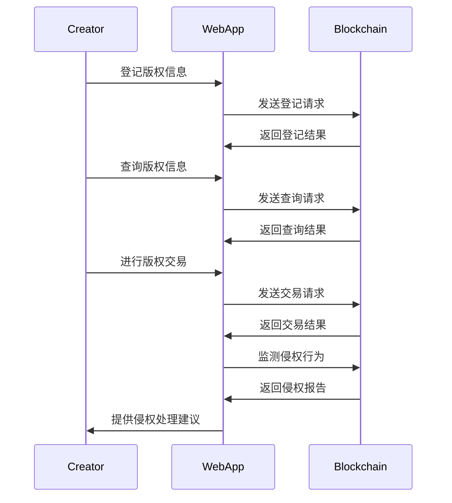
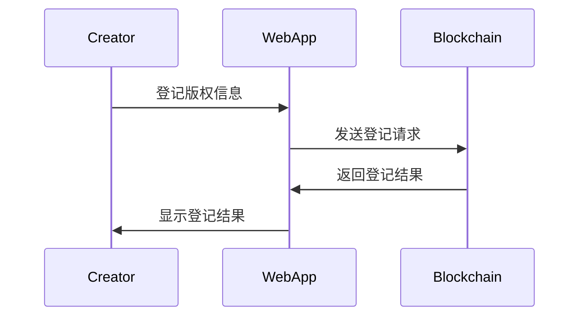

                 


### 📚 书籍概述

#### 💡 书籍标题：《区块链在版权保护中的创新应用》

区块链技术在近年来的快速发展中，逐渐成为各行各业的技术热点，版权保护便是其中之一。本书《区块链在版权保护中的创新应用》旨在深入探讨区块链技术在版权保护领域的应用，为读者提供一份全面而详实的指南。

本书关键词包括：“区块链”、“版权保护”、“智能合约”、“非同质化代币（NFT）”、“分布式账本技术”和“去中心化平台”。这些关键词不仅涵盖了本书的核心内容，也反映了区块链技术在版权保护中的创新应用。

#### 🌟 摘要

本书围绕区块链在版权保护中的应用，分为六个主要部分。首先，介绍区块链和版权保护的基本概念，为读者搭建理论基础。接着，深入探讨区块链和智能合约在版权保护中的应用场景，包括版权登记、交易和侵权监测等。第三部分，分析区块链在版权保护中的创新，如NFT的应用和市场趋势。第四部分，详细讲解区块链平台和智能合约开发的技术细节，帮助读者理解技术实现。第五部分，通过实际案例展示区块链在版权保护中的成功应用。最后一部分，探讨未来发展趋势和机会，为读者提供广阔的视野。

本书不仅适合对区块链技术感兴趣的读者，也适合版权保护领域的专业人士，以及希望了解区块链在版权保护中应用的企业和机构。通过本书，读者将能够全面了解区块链在版权保护中的潜力，掌握相关技术，并为未来的创新应用奠定基础。

### 🏛️ 区块链概述

区块链技术是一种分布式账本技术，其核心特点包括去中心化、不可篡改和透明性。区块链由多个区块组成，每个区块包含一定数量的交易记录。这些区块按照时间顺序链接在一起，形成了一条不可篡改的链条。

#### 🧮 基本概念

1. **区块**：区块是区块链中的基本单元，包含一定数量的交易记录和区块头信息。区块头信息包括时间戳、难度目标、前一区块哈希值等。
2. **链式结构**：区块链采用链式结构，新产生的区块通过哈希函数与前一个区块链接，形成一个长链。由于哈希函数的特性，一旦某个区块被修改，其后所有区块的哈希值都会发生变化，导致整个链被破坏。
3. **共识机制**：共识机制是区块链网络中节点之间达成一致的方式。常见的共识机制包括工作量证明（PoW）、权益证明（PoS）和授权股份证明（DPoS）等。

#### 🔗 区块链与版权保护的联系

区块链技术在版权保护中的应用，主要体现在以下几个方面：

1. **去中心化版权登记**：区块链的去中心化特性，使得版权登记不再依赖于中心化的机构，降低了成本和提高了效率。
2. **透明性和不可篡改性**：区块链的透明性和不可篡改性，确保了版权信息的真实性和完整性，降低了侵权风险。
3. **智能合约**：智能合约可以自动执行版权许可和侵权处理，提高了效率，降低了成本。

#### 💡 区块链在版权保护中的应用场景

1. **版权登记与认证**：区块链可用于记录版权信息，如创作时间、创作者身份等，确保版权信息的真实性和可追溯性。
2. **版权交易**：区块链可以提供安全的版权交易环境，通过智能合约自动执行交易，降低交易成本。
3. **侵权监测与处理**：区块链可用于监测侵权行为，并通过智能合约自动处理侵权事件。

### 📚 传统版权保护的挑战

在数字化时代，传统版权保护面临诸多挑战。首先，中心化的版权登记系统存在效率低下、成本高昂的问题。其次，数字作品的复制和传播变得极其容易，使得盗版和侵权行为频发。此外，现有的版权法律法规和执行机制在应对数字化时代的问题时显得力不从心。

#### 🔍 数字化时代的问题

1. **数字作品的复制与传播**：数字作品可以通过互联网迅速传播，使得盗版和侵权行为变得容易。
2. **版权信息的不透明**：版权信息往往不透明，难以追踪，增加了侵权风险。
3. **维权成本高**：维权过程复杂、耗时，成本高昂，使得许多创作者望而却步。

### 🌊 区块链技术的潜力

区块链技术为版权保护提供了全新的解决方案。首先，区块链的去中心化特性，使得版权登记和交易更加高效和透明。其次，区块链的不可篡改性和透明性，确保了版权信息的真实性和完整性。此外，智能合约的引入，使得版权许可和侵权处理更加自动化和高效。

#### 🌐 应用前景

区块链技术有望彻底改变版权保护的现状，提高版权保护的效率和质量。随着技术的不断成熟和应用场景的拓展，区块链在版权保护中的潜力将得到更充分的发挥。

### 📝 总结

区块链技术在版权保护中的应用，具有巨大的潜力和广阔的前景。通过去中心化、不可篡改和透明性等特性，区块链技术为版权保护提供了一种全新的解决方案，有望解决传统版权保护面临的诸多挑战。然而，区块链技术在版权保护中的应用仍面临一些技术、法律和实施方面的挑战。本书将深入探讨这些问题，为读者提供一份全面的技术指南和应用实践。

### 🧩 核心概念与联系

#### 📌 区块链基本概念

在深入探讨区块链在版权保护中的应用之前，我们首先需要理解区块链的核心概念。以下是区块链中几个关键术语的详细定义和解释。

1. **区块链**：区块链是一种分布式数据库，它通过加密技术确保数据的安全性和完整性。每个区块链包含多个按时间顺序排列的区块，每个区块包含一定数量的交易记录。区块链通过共识机制确保所有节点对数据的认可。

2. **区块**：区块是区块链中的基本单元，包含一定数量的交易记录以及一个区块头。区块头包含时间戳、随机数、难度目标、前一区块的哈希值等。

3. **分布式账本技术**：分布式账本技术是一种通过分布式网络维护数据的系统。区块链是分布式账本的一种实现方式，它通过多个参与节点共同维护数据，确保数据的不可篡改性和透明性。

4. **加密技术**：加密技术是区块链实现数据安全的关键。区块链使用非对称加密算法，如RSA加密，确保数据的机密性和完整性。

5. **哈希函数**：哈希函数是将任意长度的输入数据映射为固定长度的输出值。在区块链中，哈希函数用于生成区块的哈希值，确保区块链的链式结构。

6. **共识机制**：共识机制是区块链网络中节点达成一致的方式。常见的共识机制包括工作量证明（PoW）、权益证明（PoS）和授权股份证明（DPoS）等。

#### 🎨 区块链与版权保护的联系

区块链技术在版权保护中的应用主要体现在以下几个方面：

1. **去中心化版权登记**：区块链的去中心化特性使得版权登记不再依赖于中心化的机构，降低了成本和提高了效率。创作者可以直接在区块链上登记版权信息，确保数据的真实性和不可篡改性。

2. **透明性和不可篡改性**：区块链的透明性和不可篡改性确保了版权信息的真实性和完整性。所有交易记录都被永久记录在区块链上，无法被篡改或删除，为版权纠纷提供确凿的证据。

3. **智能合约**：智能合约是区块链上的自动化协议，它可以在满足特定条件时自动执行预定的操作。在版权保护中，智能合约可以用于自动化版权许可、版权交易和侵权处理，提高效率和降低成本。

4. **去中心化版权交易平台**：区块链可以提供去中心化的版权交易平台，创作者可以直接与买家进行交易，无需依赖第三方平台。这降低了交易成本，提高了交易的透明度和安全性。

#### 🎨 区块链与版权保护的对比

下面是区块链在版权保护中的一些核心概念和特征对比：

| 特征/概念 | 区块链 | 版权保护 |
| --- | --- | --- |
| 去中心化 | 是的 | 传统的版权保护通常依赖中心化机构 |
| 透明性 | 是的 | 传统版权保护中的信息往往不透明 |
| 不可篡改性 | 是的 | 传统版权保护中的信息可能被篡改 |
| 自动化 | 是的，通过智能合约 | 传统版权保护中的操作往往需要人工干预 |
| 成本低 | 是的 | 传统版权保护中的成本较高 |
| 可追溯性 | 是的 | 传统版权保护中的信息追溯性较差 |

通过对比可以发现，区块链在版权保护中具有显著的优势，尤其是在去中心化、透明性和不可篡改性方面。这些优势为版权保护提供了新的解决方案，有望解决传统方式中存在的问题。

### 📜 版权保护的基本概念

#### 📝 版权的定义

版权（Copyright）是一种知识产权，它赋予创作者对其作品的独占权，包括复制权、发行权、展示权、表演权、改编权和翻译权等。版权保护的主要目的是确保创作者的劳动成果得到应有的尊重和回报，同时鼓励创作活动的持续进行。

#### 📝 版权保护的法律法规

不同国家和地区的版权法律法规有所不同，但核心内容相似。以下是几个主要国家和地区的版权法律概况：

1. **美国版权法**：美国版权法（Copyright Act of 1976）是世界上最全面的版权法律之一。它保护的作品包括文学作品、音乐作品、戏剧作品、电影作品、软件作品等。美国版权法规定了版权的保护期限，一般为创作者去世后50年。

2. **中国著作权法**：中国著作权法于1990年通过，并于2001年进行了修订。它保护的作品包括文字作品、音乐作品、戏剧作品、美术作品、摄影作品、影视作品等。中国著作权法规定了作品的独创性要求和保护期限，一般为作者终身及其死亡后50年。

3. **欧盟版权法**：欧盟版权法旨在统一欧盟成员国的版权法律。它规定了版权的保护范围、保护期限、侵权行为和法律责任等。欧盟版权法还规定了数字版权保护的特别条款，以应对数字化时代的版权挑战。

#### 📝 版权保护的挑战

在数字化时代，版权保护面临诸多挑战：

1. **数字作品的复制与传播**：数字作品可以通过互联网轻松复制和传播，使得盗版和侵权行为变得容易。传统的版权保护手段难以应对这种迅速扩散的侵权行为。

2. **版权信息的不透明**：许多版权信息在数字化过程中变得不透明，使得版权追踪和维权变得更加困难。版权信息的不透明性增加了侵权风险。

3. **维权成本高**：维权过程复杂、耗时，成本高昂。许多创作者因为成本问题而选择放弃维权，导致侵权行为得不到有效遏制。

4. **跨国版权纠纷**：随着全球化和互联网的发展，版权纠纷越来越频繁地发生在不同国家和地区之间。跨国版权纠纷的处理需要协调不同国家和地区的法律体系，增加了复杂性。

### 🛠 版权保护的技术手段

#### 🌟 数字版权管理（DRM）

数字版权管理（Digital Rights Management，DRM）是一种用于保护数字内容的技术手段。它通过加密、访问控制、水印等技术手段，限制用户对数字内容的访问和使用，以防止未经授权的复制、传播和使用。

1. **加密**：加密技术用于保护数字内容不被未经授权的用户访问。常见的加密技术包括对称加密和非对称加密。

2. **访问控制**：访问控制技术用于限制用户对数字内容的访问。例如，通过用户身份验证、权限控制等手段，确保只有授权用户才能访问数字内容。

3. **水印技术**：水印技术用于在数字内容中嵌入标识信息，以追踪侵权行为。常见的水印技术包括可视水印和隐写术。

#### 🌟 版权追踪系统

版权追踪系统是一种用于监控和追踪版权信息的技术系统。它通过自动化手段，实时监控版权内容的传播和使用情况，及时发现侵权行为。

1. **关键字搜索**：通过在互联网上搜索特定关键字，追踪版权内容的传播情况。

2. **数据挖掘**：通过分析海量数据，挖掘版权内容的侵权行为。

3. **区块链技术**：利用区块链技术的去中心化、不可篡改性和透明性，记录版权信息，确保版权信息的真实性和可追溯性。

#### 🌟 版权信息的登记与认证

版权信息的登记与认证是版权保护的重要环节。版权信息的登记和认证需要依靠可靠的技术手段和权威机构。

1. **政府机构登记**：许多国家和地区设有专门的版权登记机构，创作者可以通过这些机构登记版权信息，获得法律认可的版权证明。

2. **区块链技术**：区块链技术可以用于版权信息的登记与认证。创作者可以在区块链上登记版权信息，确保信息的真实性和不可篡改性。

3. **第三方认证机构**：一些第三方认证机构提供版权认证服务，通过专业评估，为创作者提供权威的版权认证。

### 🎯 区块链在版权保护中的应用

#### 💾 区块链与版权登记

区块链在版权登记中的应用主要基于其去中心化、透明和不可篡改的特性。创作者可以在区块链上登记版权信息，包括创作时间、创作者身份、作品内容等。这些信息一旦登记，将永久记录在区块链上，无法被篡改或删除。

1. **去中心化登记**：传统的版权登记通常依赖中心化的机构，如版权局。这些机构往往存在效率低下、成本高昂的问题。区块链的去中心化特性，使得创作者可以直接在区块链上登记版权信息，降低了成本和提高了效率。

2. **透明性和不可篡改性**：区块链上的版权信息是透明的，所有参与者都可以查看和验证。此外，区块链的不可篡改性确保了版权信息的真实性和完整性，降低了侵权风险。

3. **防篡改和防伪造**：区块链通过加密技术和共识机制，确保数据的安全性和完整性。任何试图篡改或伪造区块链上的数据的行为都将被其他节点检测到并拒绝，从而保护版权信息的真实性。

#### 💾 区块链与版权交易

区块链技术在版权交易中的应用，主要体现在去中心化交易平台和智能合约的使用。

1. **去中心化交易平台**：传统的版权交易通常依赖第三方平台，如拍卖行、画廊等。这些平台往往存在交易成本高、信息不透明的问题。区块链可以提供去中心化的版权交易平台，创作者和买家可以直接在平台上进行交易，降低了交易成本，提高了交易的透明度。

2. **智能合约**：智能合约是一种自动化协议，它可以自动执行预定的操作。在版权交易中，智能合约可以用于自动执行版权许可、版权转让等操作。例如，创作者可以在智能合约中设定版权许可的条件和费用，买家在支付费用后，智能合约会自动发放版权许可。

3. **透明性和安全性**：区块链上的版权交易信息是透明的，所有参与者都可以查看。此外，区块链的不可篡改性确保了交易信息的真实性和完整性，降低了欺诈风险。

#### 💾 区块链与侵权监测

区块链技术在侵权监测中的应用，主要体现在数据收集、分析和处理。

1. **数据收集**：创作者可以在区块链上记录版权信息，包括作品名称、创作者身份、创作时间等。同时，创作者还可以监控作品在互联网上的传播情况，收集侵权证据。

2. **数据分析**：通过分析收集到的数据，创作者可以识别侵权行为。例如，通过对比作品内容和版权信息，可以发现侵权作品。

3. **智能合约处理**：一旦发现侵权行为，创作者可以启动智能合约，自动处理侵权事件。例如，智能合约可以自动通知侵权方停止侵权行为，或自动扣除侵权方的资金作为赔偿。

4. **降低侵权风险**：区块链上的版权信息是公开透明的，侵权行为容易被发现。这种透明性可以降低侵权风险，保护创作者的权益。

### 📝 总结

区块链技术在版权保护中具有巨大的潜力。通过去中心化、透明性和不可篡改性的特性，区块链可以提供一种全新的版权保护解决方案，解决传统方式中存在的效率低下、成本高昂和侵权风险等问题。区块链在版权登记、版权交易和侵权监测中的应用，不仅提高了版权保护的效率和效果，也为创作者提供了更可靠的法律保障。

### 🎯 区块链与智能合约在版权保护中的应用

#### 💡 区块链与版权登记

区块链技术在版权登记中的应用是其最基础且重要的应用之一。通过区块链，创作者可以以去中心化和透明的方式登记他们的版权信息。

1. **去中心化版权登记**：
   - **流程**：创作者在区块链上创建一个智能合约，将版权信息（如作品名称、创作者、创作时间、版权描述等）输入到智能合约中，然后部署该智能合约到区块链网络。
   - **优点**：去中心化的版权登记意味着不存在单一故障点，即使某个节点发生问题，整个系统的数据仍然保持完整和不可篡改。
   - **实例**：以太坊和EOS等区块链平台支持智能合约，创作者可以使用Solidity等编程语言创建和部署智能合约进行版权登记。

2. **透明性和可追溯性**：
   - **透明性**：由于区块链的公开性质，任何人都可以查看版权登记的信息，从而增加了版权信息的透明度。
   - **可追溯性**：版权信息一旦被记录在区块链上，便不可更改，确保了版权信息的历史记录和真实性，为版权纠纷提供可信的证据。

3. **案例**：美国版权局已经探索使用区块链技术来记录版权信息，从而提高版权登记的效率和可信度。

#### 💡 智能合约在版权交易中的应用

智能合约在版权交易中扮演了关键角色，它可以自动化版权许可的执行，确保交易的透明性和安全性。

1. **版权许可自动化**：
   - **流程**：创作者在区块链上创建一个智能合约，定义版权许可的条件（如许可类型、许可费用、许可期限等），买家支付费用后，智能合约自动执行版权许可，并向买家发放许可证。
   - **优点**：自动化版权许可的执行减少了人工干预，降低了交易成本和时间，同时提高了交易的透明度和安全性。

2. **版权转让自动化**：
   - **流程**：当版权需要转让时，新的买家可以与创作者或版权所有者通过智能合约进行交易，智能合约自动更新版权信息，确保交易的合法性和透明性。
   - **优点**：自动化版权转让过程确保了交易的即时性和透明性，减少了交易过程中可能出现的欺诈和纠纷。

3. **实例**：OpenSea是一个去中心化的NFT市场，它利用智能合约实现了NFT的创建、交易和版权许可，用户可以方便地购买、出售和交易数字艺术品。

#### 💡 区块链在侵权监测中的应用

区块链技术不仅在版权登记和交易中发挥作用，还能在侵权监测和治理中提供有力支持。

1. **侵权行为监测**：
   - **流程**：创作者可以在区块链上记录版权信息，并通过智能合约设置侵权监测规则。当检测到侵权行为时，智能合约会自动触发相应的操作，如通知版权所有者、暂停侵权内容等。
   - **优点**：自动化的侵权监测可以实时监控版权内容的传播情况，及时发现侵权行为，提高了监测的效率和准确性。

2. **侵权处理自动化**：
   - **流程**：当侵权行为被检测到后，智能合约可以自动执行侵权处理流程，如冻结侵权方的资金、扣除赔偿金等。
   - **优点**：自动化侵权处理减少了人工干预，提高了处理效率，同时确保了处理过程的公正和透明。

3. **案例**：NFTSpace使用区块链和智能合约来监测和治理NFT市场的侵权行为，通过智能合约自动执行侵权处理，确保市场秩序和版权所有者的权益。

#### 💡 区块链平台在版权保护中的案例分析

1. **Ethereum**：
   - **特点**：以太坊是最流行的区块链平台之一，支持智能合约和去中心化应用（DApp）开发。
   - **应用**：许多艺术家和创作者使用以太坊创建和销售NFT，通过智能合约实现版权许可和交易。

2. **EOS**：
   - **特点**：EOS是一个高性能的区块链平台，专为大规模商业应用设计。
   - **应用**：EOS被用于构建去中心化的版权交易平台，如Everipedia，用户可以在平台上购买和销售版权。

3. **Binance Smart Chain**：
   - **特点**：Binance Smart Chain是一个快速、可扩展的区块链平台，支持智能合约和DeFi应用。
   - **应用**：Binance Smart Chain上的NFT市场，如NFT20，提供高效的NFT创建、交易和版权管理服务。

通过这些案例分析，可以看出区块链平台在版权保护中的应用已经取得了显著的成效。未来，随着区块链技术的进一步发展和成熟，区块链在版权保护中的应用将更加广泛和深入。

### 🔍 创新点

#### 🎨 非同质化代币（NFT）与版权保护

非同质化代币（Non-Fungible Tokens，NFT）是区块链技术的一项重要创新，它为版权保护提供了新的思路和手段。

1. **NFT的定义**：
   - **特性**：NFT是一种独特的数字资产，代表特定的唯一物品，如艺术品、音乐、视频等。与同质化代币（如比特币）不同，NFT不能互换，每个NFT都有独特的属性和所有权记录。
   - **重要性**：NFT为数字内容的所有权和真实性提供了新的认证方式，使得创作者可以直接证明他们对特定作品的版权。

2. **NFT在版权保护中的应用**：
   - **版权认证**：通过发行NFT，创作者可以创建一个独一无二的作品标识，确保作品的真实性和版权归属。每个NFT都包含创作者信息和作品属性，使得版权信息更加透明和可信。
   - **版权交易**：NFT为数字作品的交易提供了便捷的方式。创作者可以发行NFT，并将其与版权许可绑定，买家在购买NFT的同时获得版权许可，从而简化了交易流程。

3. **案例分析**：
   - **Beeple的NFT艺术品**：艺术家Mike Winkelmann（Beeple）的作品“Everydays: The First 5000 Days”以6900万美元的高价成交，成为NFT艺术市场的标杆案例。这一事件展示了NFT在版权保护和交易中的巨大潜力。

#### 🛍️ 去中心化版权交易市场

去中心化版权交易市场（Decentralized Marketplaces for Copyright Trading）是区块链技术在版权保护中的一项重要创新。

1. **市场定义**：
   - **特性**：去中心化版权交易市场是一个基于区块链的、无需第三方中介的交易平台，创作者和买家可以直接进行交易。
   - **优势**：去中心化市场消除了传统中介的高昂费用和中介风险，提高了交易的效率和透明度。

2. **市场模式**：
   - **版权登记与交易**：创作者在平台上登记版权信息，并将其与NFT绑定。买家通过购买NFT，自动获得版权许可。
   - **智能合约执行**：智能合约在交易过程中自动执行版权许可的发放和转让，确保交易的合法性和透明性。

3. **案例分析**：
   - **OpenSea**：OpenSea是一个去中心化的NFT市场，提供广泛的NFT交易服务。用户可以在OpenSea上购买、出售和交易数字艺术品、收藏品等，通过智能合约实现版权的自动管理和交易。
   - **Rarible**：Rarible也是一个去中心化的NFT市场，它通过社区参与和治理，使得创作者和买家共同参与市场的发展。

#### 🛰️ 区块链在版权保护中的创新点

区块链技术在版权保护中的创新点主要体现在以下几个方面：

1. **去中心化**：去中心化的特性使得版权保护和交易不再依赖于中心化的机构和中介，降低了成本和提高了效率。
2. **不可篡改**：区块链的不可篡改性确保了版权信息的真实性和完整性，为版权纠纷提供了可靠的法律证据。
3. **透明性**：区块链上的所有交易和版权信息都是透明的，所有参与者都可以查看和验证，增加了版权保护的公信力。
4. **智能合约**：智能合约在版权保护和交易中的应用，实现了自动化和高效，减少了人工干预和纠纷。

通过这些创新点，区块链技术为版权保护提供了全新的解决方案，有望解决传统版权保护方式中的诸多问题，推动版权保护走向更加高效、透明和可信赖的未来。

### 🤔 应用挑战与解决方案

#### 🚧 技术挑战

区块链技术在版权保护中的应用面临着一系列技术挑战，这些挑战直接影响其有效性和可行性。

1. **性能瓶颈**：
   - **问题描述**：区块链网络的高性能需求与当前区块链技术的处理能力之间存在显著差距。尤其是随着交易量的增加，区块链的扩展性和处理速度成为瓶颈。
   - **解决方案**：采用分片技术（Sharding）和侧链（Sidechains）技术，可以有效地提高区块链的处理能力和扩展性。分片技术将区块链网络分成多个部分，每个部分负责处理一部分交易，从而提高整体性能。

2. **隐私保护**：
   - **问题描述**：区块链的透明性虽然增加了公开性，但也可能导致版权信息泄露，特别是在涉及敏感信息时。
   - **解决方案**：采用零知识证明（Zero-Knowledge Proofs）技术，可以在不泄露具体信息的前提下验证版权信息的真实性。这种技术允许一方证明某个陈述是真实的，而不透露具体内容。

3. **安全性问题**：
   - **问题描述**：区块链系统可能会遭受51%攻击，即攻击者控制区块链网络超过一半的节点，从而篡改数据。
   - **解决方案**：采用多重签名（Multisignature）和多重验证（Multi-Party Computation）等技术，增加区块链的安全性。此外，加强区块链网络的安全防护措施，如防火墙和入侵检测系统，也是必要的。

4. **智能合约漏洞**：
   - **问题描述**：智能合约的漏洞可能导致资金损失和版权信息泄露。已有多起智能合约漏洞导致的大规模资金损失事件。
   - **解决方案**：加强智能合约的安全审计和测试，采用形式化验证（Formal Verification）等方法，确保智能合约在部署前的安全性。此外，引入第三方安全审计机构和社区审查机制，可以进一步提高智能合约的安全性。

#### 💼 法律法规挑战

区块链技术在版权保护中的应用也面临法律法规方面的挑战，这些问题可能影响其合法性和合规性。

1. **法律适用性**：
   - **问题描述**：不同国家和地区对区块链技术和版权保护的法律法规有所不同，导致跨境交易的合规性问题。
   - **解决方案**：推动全球范围内区块链技术和版权保护法律法规的统一，例如通过国际组织和多边协议，建立共同的法律框架。此外，企业应遵守所在地的法律法规，确保其业务符合当地法律要求。

2. **版权纠纷**：
   - **问题描述**：区块链上的版权纠纷处理复杂，特别是在跨境和跨国交易中，涉及不同司法管辖和法律适用问题。
   - **解决方案**：建立国际化的版权纠纷解决机制，通过调解、仲裁和司法裁决等多种方式解决版权纠纷。同时，利用区块链的透明性和不可篡改性，确保版权纠纷的证据链完整和可信。

3. **监管合规**：
   - **问题描述**：监管机构对区块链技术的监管力度不同，可能导致某些国家和地区对区块链应用的法律环境不稳定。
   - **解决方案**：与监管机构保持紧密沟通，积极参与政策制定和标准制定，确保区块链技术在版权保护中的应用符合法律法规。同时，企业应建立内部合规制度，确保其业务操作符合监管要求。

#### 🚀 实施难点

区块链技术在版权保护中的应用还面临一些实际操作层面的挑战。

1. **技术难度**：
   - **问题描述**：区块链技术的复杂性和专业性要求高，普通用户难以理解和应用。
   - **解决方案**：提供用户友好的界面和工具，如区块链浏览器和智能合约开发工具，降低用户的技术门槛。此外，加强区块链技术教育和培训，提高用户的区块链素养。

2. **用户接受度**：
   - **问题描述**：用户对区块链技术的认知和接受度较低，可能影响区块链应用的普及。
   - **解决方案**：通过宣传和推广，提高公众对区块链技术的了解和接受度。同时，展示区块链在版权保护中的实际应用案例和成效，增强用户的信任和兴趣。

3. **成本问题**：
   - **问题描述**：区块链技术的开发和运营成本较高，可能成为中小创作者和企业面临的经济负担。
   - **解决方案**：通过政府资助、补贴和众筹等方式，降低区块链技术的成本，使其更易于被中小创作者和企业接受。此外，探索区块链技术的商业化模式，实现可持续的商业模式，降低长期运营成本。

通过解决这些技术、法律和实施层面的挑战，区块链技术在版权保护中的应用将得到更加广泛和深入的发展，为创作者提供更可靠、高效和透明的版权保护解决方案。

### 📚 技术实现

#### 📌 区块链平台介绍

在区块链技术应用于版权保护时，选择一个合适的区块链平台至关重要。以下介绍几个主流的区块链平台，包括其特点、优缺点以及应用场景。

1. **Ethereum（以太坊）**
   - **特点**：以太坊是一个去中心化的智能合约平台，支持多种编程语言（如Solidity）开发智能合约，具有高度的可定制性和可扩展性。
   - **优点**：以太坊具有强大的生态系统和广泛的应用案例，智能合约开发社区活跃。
   - **缺点**：交易费用较高，网络拥堵时处理速度较慢。
   - **应用场景**：适合版权登记、版权交易和侵权监测等应用。

2. **Hyperledger Fabric（超级账本Fabric）**
   - **特点**：Hyperledger Fabric是一个开源的企业级分布式账本平台，由Linux基金会托管。它支持模块化和私有化，适合企业内部或行业联盟使用。
   - **优点**：高度可定制、性能强、隐私性好。
   - **缺点**：相比公共链，开发社区相对较小。
   - **应用场景**：适合企业内部的版权管理、版权交易和联盟链上的版权合作。

3. **Binance Smart Chain（币安智能链）**
   - **特点**：Binance Smart Chain是一个快速、可扩展的智能合约平台，与币安交易所紧密集成，支持多种区块链应用。
   - **优点**：交易费用低、处理速度快、支持多种加密货币和DApp。
   - **缺点**：相对于以太坊，生态系统和社区支持较小。
   - **应用场景**：适合NFT市场、数字艺术品交易和去中心化版权交易平台。

4. **EOS**
   - **特点**：EOS是一个高性能、去中心化的智能合约平台，支持自动化的交易处理和资源管理。
   - **优点**：高吞吐量、低延迟、无需手续费。
   - **缺点**：用户界面和开发者工具不如以太坊成熟。
   - **应用场景**：适合大型去中心化应用和跨国版权交易。

5. **Algorand**
   - **特点**：Algorand是一个安全性高、可扩展性强的区块链平台，采用纯证明-of-stake共识机制。
   - **优点**：交易速度快、费用低、安全性高。
   - **缺点**：开发者社区相对较小。
   - **应用场景**：适合版权登记和快速交易的应用。

#### 🔨 根据需求选择区块链平台

在选择区块链平台时，需要考虑以下因素：

1. **应用场景**：不同的区块链平台适用于不同的应用场景。例如，如果应用场景需要高吞吐量和快速交易，可以选择Binance Smart Chain或EOS；如果需要高度定制化和私有化，可以选择Hyperledger Fabric。

2. **开发难度**：开发社区的支持和工具的易用性对开发难度有直接影响。如果开发者对平台熟悉，可以选择开发社区活跃的平台，如以太坊。

3. **性能要求**：根据版权保护应用的需求，选择适合的平台。例如，对于高并发交易的场景，需要选择具有高吞吐量的平台。

4. **成本预算**：区块链平台的运营成本（如交易费用、节点维护费用）也是一个重要考虑因素。根据预算选择合适的平台。

#### 🎨 平台比较与评估

以下是一个简单的区块链平台比较和评估表格，帮助读者根据需求选择合适的平台。

| 平台 | 特点 | 优点 | 缺点 | 应用场景 | 开发难度 | 性能要求 | 成本预算 |
| --- | --- | --- | --- | --- | --- | --- | --- |
| Ethereum | 智能合约平台，支持多种编程语言 | 生态系统强大，应用广泛 | 交易费用高，网络拥堵 | 版权登记、版权交易、侵权监测 | 中等 | 高 | 较高 |
| Hyperledger Fabric | 企业级分布式账本平台，高度可定制 | 高性能，隐私性好 | 开发社区较小，定制化复杂 | 企业内部版权管理，联盟链应用 | 高 | 高 | 较低 |
| Binance Smart Chain | 快速、可扩展的智能合约平台，与币安交易所集成 | 交易费用低，处理速度快 | 生态系统相对较小 | NFT市场，数字艺术品交易 | 中等 | 高 | 较低 |
| EOS | 高性能、去中心化的智能合约平台 | 高吞吐量，无需手续费 | 用户界面和开发者工具不如以太坊成熟 | 大型去中心化应用，跨国版权交易 | 中等 | 高 | 较低 |
| Algorand | 安全性高、可扩展性强，纯证明-of-stake共识机制 | 交易速度快，费用低 | 开发社区相对较小 | 版权登记，快速交易 | 低 | 高 | 较低 |

通过比较和评估，开发者可以根据具体需求和预算，选择最适合的区块链平台，以实现高效、透明和可信赖的版权保护解决方案。

### 🏗️ 智能合约开发

#### 📝 智能合约开发环境搭建

要开发智能合约，首先需要搭建开发环境。以下是在以太坊平台上搭建智能合约开发环境的步骤：

1. **安装Node.js**：前往Node.js官网（https://nodejs.org/）下载并安装最新版本的Node.js。
2. **安装Truffle**：使用npm命令全局安装Truffle：
   ```
   npm install -g truffle
   ```
3. **安装Ganache**：Ganache是一个本地以太坊节点和测试钱包。可以从GitHub（https://github.com/trufflesuite/ganache）下载并安装Ganache。
4. **创建Truffle项目**：在命令行中运行以下命令创建一个新的Truffle项目：
   ```
   truffle init
   ```
   这将生成一个包含基本结构和配置文件的项目文件夹。

5. **安装开发依赖**：进入项目文件夹，并运行以下命令安装开发依赖：
   ```
   truffle install
   ```

6. **启动Ganache**：在Ganache中创建一个新的账户，并记下该账户的私钥。这将用于与智能合约进行交互。

7. **配置Truffle**：编辑项目根目录下的`truffle-config.js`文件，配置以太坊网络和Ganache的URL：

   ```javascript
   module.exports = {
     networks: {
       development: {
         host: "127.0.0.1",
         port: 7545,
         network_id: "*",
       },
     },
     compilers: {
       solc: {
         version: "^0.8.0",
       },
     },
   };
   ```

   以上配置将Truffle连接到本地的Ganache节点。

#### 📝 智能合约编写与测试

1. **创建智能合约**：
   在项目文件夹中，创建一个名为`contracts`的文件夹，并在该文件夹内创建一个名为`Copyright.sol`的智能合约文件：

   ```solidity
   // SPDX-License-Identifier: MIT
   pragma solidity ^0.8.0;

   contract Copyright {
       // 定义版权信息结构
       struct CopyrightInfo {
           string title;
           address creator;
           uint256 creationDate;
       }

       // 定义版权信息映射
       mapping(uint256 => CopyrightInfo) public copyrightRecords;

       // 记录版权信息
       function registerCopyright(string memory title, string memory creator) public {
           uint256 id = block.number;
           copyrightRecords[id] = CopyrightInfo(title, msg.sender, block.timestamp);
       }

       // 查询版权信息
       function getCopyrightInfo(uint256 id) public view returns (string memory, address, uint256) {
           CopyrightInfo memory info = copyrightRecords[id];
           return (info.title, info.creator, info.creationDate);
       }
   }
   ```

2. **编译智能合约**：
   使用Truffle命令编译智能合约：
   ```
   truffle compile
   ```

3. **部署智能合约**：
   在Truffle命令行中运行以下命令部署智能合约：
   ```
   truffle deploy
   ```

   部署过程中，系统会提示输入Ganache中创建的账户私钥，以执行部署操作。

4. **测试智能合约**：
   在`migrations`文件夹中创建一个名为`2_deploy_contract.js`的测试脚本，用于测试智能合约：

   ```javascript
   const Copyright = artifacts.require("Copyright");

   module.exports = function () {
       return Copyright.deployed();
   };
   ```

   运行以下命令执行测试：
   ```
   truffle migrate --reset
   ```

   在测试脚本中，可以通过调用智能合约的函数进行版权信息的登记和查询：

   ```javascript
   const Copyright = artifacts.require("Copyright");
   const instance = await Copyright.deployed();

   // 注册版权信息
   await instance.registerCopyright("My Artwork", "Artist Name");

   // 查询版权信息
   const info = await instance.getCopyrightInfo(1);
   console.log(info);
   ```

   运行测试脚本后，将输出版权信息，验证智能合约是否正常工作。

#### 📝 智能合约编写与测试案例

以下是一个智能合约编写的案例，展示了如何使用Solidity语言编写一个简单的版权登记和查询智能合约。

```solidity
// SPDX-License-Identifier: MIT
pragma solidity ^0.8.0;

contract Copyright {
    // 定义版权信息结构
    struct CopyrightInfo {
        string title;
        address creator;
        uint256 creationDate;
    }

    // 定义版权信息映射
    mapping(uint256 => CopyrightInfo) public copyrightRecords;

    // 定义版权记录ID
    uint256 public currentId = 0;

    // 注册版权信息
    function registerCopyright(string memory title) public {
        require(bytes(title).length > 0, "Title must not be empty");
        currentId++;
        copyrightRecords[currentId] = CopyrightInfo(title, msg.sender, block.timestamp);
    }

    // 查询版权信息
    function getCopyrightInfo(uint256 id) public view returns (string memory, address, uint256) {
        require(id > 0 && id <= currentId, "Invalid ID");
        CopyrightInfo memory info = copyrightRecords[id];
        return (info.title, info.creator, info.creationDate);
    }
}
```

在这个案例中，我们定义了一个简单的版权信息结构`CopyrightInfo`，并使用一个映射`copyrightRecords`来存储版权信息。智能合约提供了两个函数：`registerCopyright`用于注册版权信息，`getCopyrightInfo`用于查询版权信息。

#### 📝 实例：版权登记

以下是一个版权登记的实例，展示了如何使用Truffle和Ganache在本地环境中部署和测试智能合约。

1. **部署合约**：
   在Truffle命令行中，输入以下命令部署`Copyright`智能合约：

   ```
   truffle deploy Copyright
   ```

   系统会提示输入Ganache中创建的账户私钥，用于部署合约。

2. **注册版权信息**：
   使用Truffle命令行，输入以下命令调用`registerCopyright`函数，注册一个版权信息：

   ```
   truffle exec --network development scripts/register-copyright.js
   ```

   在`scripts/register-copyright.js`文件中，编写如下代码：

   ```javascript
   const Copyright = artifacts.require("Copyright");
   const instance = await Copyright.deployed();

   // 注册版权信息
   await instance.registerCopyright("My Digital Art");
   ```

3. **查询版权信息**：
   使用Truffle命令行，输入以下命令调用`getCopyrightInfo`函数查询已注册的版权信息：

   ```
   truffle exec --network development scripts/get-copyright-info.js
   ```

   在`scripts/get-copyright-info.js`文件中，编写如下代码：

   ```javascript
   const Copyright = artifacts.require("Copyright");
   const instance = await Copyright.deployed();

   // 查询版权信息
   const info = await instance.getCopyrightInfo(1);
   console.log(info);
   ```

通过以上实例，读者可以了解如何使用智能合约进行版权登记和查询，掌握基本的智能合约开发流程和测试方法。

### 📊 系统分析与架构设计方案

#### 📌 问题场景介绍

随着数字化内容的迅速增长，版权保护成为创作者和平台面临的一大挑战。创作者希望确保自己的作品得到合法的保护和收益，而平台则需要提供一个透明、高效且安全的版权管理机制。在这个背景下，我们设计了一套基于区块链的版权保护系统，旨在解决传统版权保护中存在的效率低下、成本高昂和侵权风险等问题。

#### 📌 项目介绍

本项目旨在构建一个去中心化的版权保护平台，利用区块链技术实现版权登记、版权交易和侵权监测。平台将提供以下功能：

1. **版权登记**：创作者可以在平台上登记他们的版权信息，包括作品名称、创作者、创作时间和版权描述等。
2. **版权交易**：创作者可以通过智能合约在平台上进行版权交易，包括版权转让、版权许可等。
3. **侵权监测**：系统将自动监测侵权行为，并提供侵权事件的报告和处理建议。

#### 📌 系统功能设计

为了实现上述功能，系统需要具备以下核心功能模块：

1. **版权信息管理**：负责版权登记、查询和更新。
2. **版权交易管理**：负责版权交易的记录和执行。
3. **侵权监测管理**：负责侵权行为的监控和处理。

以下是系统功能设计中的领域模型类图：

```mermaid
classDiagram
    Copyright <<Interface>>
    Work <<Entity>>
    Creator <<Entity>>
    Transaction <<Entity>>

    Copyright <=.. Work : manages
    Copyright <=.. Creator : manages
    Copyright <=.. Transaction : manages

    Creator --|> Work : created
    Transaction --|> Work : related
```

在这个类图中，`Copyright`是一个接口类，负责管理版权信息、创作者和交易。`Work`、`Creator`和`Transaction`是具体的实体类，分别代表作品、创作者和交易。

#### 📌 系统架构设计

系统架构设计如下：

1. **前端界面**：提供用户交互界面，包括版权登记、查询、交易和侵权监测功能。
2. **后端服务**：包括版权信息管理、版权交易管理和侵权监测管理模块。
3. **区块链网络**：负责存储和验证版权信息和交易记录。

以下是系统架构设计图：



在这个架构中，前端界面与后端服务通过API进行交互，后端服务与区块链网络通过智能合约进行交互。

#### 📌 系统接口设计

系统接口设计包括以下API：

1. **版权登记API**：接受创作者提交的版权信息，并将其记录在区块链上。
2. **版权查询API**：根据版权ID查询版权详细信息。
3. **版权交易API**：接受创作者和买家的交易请求，并执行智能合约中的版权转让或许可操作。
4. **侵权监测API**：接收侵权监测数据，并生成侵权报告。

以下是接口设计图：

```mermaid
classDiagram
    WebApp <<Interface>>
    Blockchain <<Interface>>

    WebApp --> Blockchain: 请求和响应
```

在这个接口设计中，`WebApp`代表前端应用，`Blockchain`代表区块链网络，两者通过HTTP请求和响应进行通信。

#### 📌 系统交互设计

系统交互设计如下：

1. **用户交互**：用户通过前端界面进行版权登记、查询和交易。
2. **后端处理**：后端服务接收用户的请求，调用相应的业务逻辑，并与区块链网络进行交互。
3. **区块链验证**：区块链网络验证交易请求的有效性，并将结果返回给后端服务。

以下是系统交互设计图：



在这个交互设计中，用户通过前端界面提交版权登记请求，后端服务接收请求，调用区块链网络进行验证，并将结果返回给前端界面。

通过以上系统分析与架构设计方案，我们为版权保护提供了一套高效、透明和安全的解决方案。该方案通过去中心化的区块链技术和智能合约，确保版权信息的真实性和不可篡改性，同时提供便捷的版权交易和侵权监测功能，为创作者和平台提供了有力的版权保护工具。

### 🌟 实际案例分析

在本节中，我们将通过具体案例详细分析区块链在版权保护中的实际应用，展示其具体实现过程、源代码解读和详细讲解。

#### 💡 案例一：基于Ethereum的版权登记系统

**案例背景**：某艺术家希望使用区块链技术保护其艺术作品的版权，并通过智能合约实现版权的登记和交易。

**实现过程**：

1. **智能合约编写**：
   艺术家使用Solidity语言编写一个名为`ArtworkContract.sol`的智能合约，用于登记和验证版权信息。

2. **合约部署**：
   使用Truffle工具在Ethereum测试网络中部署智能合约，并记录合约地址。

3. **版权登记**：
   艺术家通过前端界面调用合约，将作品信息（如作品名称、创作者、创作日期等）输入智能合约，并调用`registerArtwork`函数进行登记。

4. **版权查询**：
   任何人都可以通过前端界面调用合约，使用`getArtworkInfo`函数查询特定作品的版权信息。

**源代码解读**：

```solidity
// SPDX-License-Identifier: MIT
pragma solidity ^0.8.0;

contract ArtworkContract {
    struct Artwork {
        string name;
        address creator;
        uint256 creationDate;
    }

    mapping(uint256 => Artwork) public artworks;
    uint256 public artworkCount;

    function registerArtwork(string memory name) public {
        require(bytes(name).length > 0, "Name cannot be empty");
        artworks[artworkCount] = Artwork(name, msg.sender, block.timestamp);
        artworkCount++;
    }

    function getArtworkInfo(uint256 id) public view returns (string memory, address, uint256) {
        require(id < artworkCount, "Invalid ID");
        Artwork memory artwork = artworks[id];
        return (artwork.name, artwork.creator, artwork.creationDate);
    }
}
```

**详细讲解**：

- **Artwork结构**：定义了一个结构体`Artwork`，包含作品名称、创作者地址和创作日期。
- **artworks映射**：使用映射数据结构存储每个作品的信息，映射键为作品的ID。
- **registerArtwork函数**：用于登记作品，需要作品名称且不能为空，将作品信息存储在区块链上。
- **getArtworkInfo函数**：用于查询特定作品的信息，返回作品名称、创作者地址和创作日期。

#### 💡 案例二：基于EOS的版权交易平台

**案例背景**：某版权交易平台希望通过EOS区块链实现版权的在线交易，确保交易的安全和透明。

**实现过程**：

1. **智能合约编写**：
   开发者使用C++编写一个名为`CopyrightExchangeContract.cpp`的智能合约，用于管理版权交易。

2. **合约部署**：
   使用EOSIO工具链在EOS区块链上编译和部署智能合约。

3. **版权交易**：
   艺术家通过前端界面发布版权交易请求，买家通过前端界面提交购买请求。
   智能合约处理交易请求，调用`buyArtwork`函数执行交易。

4. **交易确认**：
   交易完成后，系统向买家发放版权证明，并通知艺术家交易完成。

**源代码解读**：

```cpp
#include <eosio/eosio.hpp>

using namespace eosio;

class [[eosio::contract]] copyright_exchange : public eosio::contract {
public:
    using contract::contract;

    [[eosio::action]]
    struct buy_artwork {
        account_name buyer;
        uint64_t artwork_id;
        uint64_t price;
    };

    [[eosio::action]]
    struct release_artwork {
        account_name buyer;
        uint64_t artwork_id;
    };

    [[eosio::action]]
    struct confirm_purchase {
        account_name seller;
        uint64_t artwork_id;
    };

    [[eosio::action]]
    struct release_artwork证明 {
        account_name seller;
        uint64_t artwork_id;
    };

    [[eosio::action]]
    void buy_artwork(const buy_artwork& data) {
        require_auth(_self);
        // 处理购买请求
    }

    [[eosio::action]]
    void release_artwork(const release_artwork& data) {
        require_auth(_self);
        // 发放版权证明
    }

    [[eosio::action]]
    void confirm_purchase(const confirm_purchase& data) {
        require_auth(_self);
        // 确认购买
    }
};
```

**详细讲解**：

- **buy\_artwork结构**：定义了购买请求的结构体，包含买家地址、作品ID和价格。
- **release\_artwork结构**：定义了发放版权证明的结构体，包含卖家地址和作品ID。
- **confirm\_purchase结构**：定义了确认购买的结构体，包含卖家地址和作品ID。
- **buy\_artwork函数**：处理购买请求，确保买家支付了正确的价格。
- **release\_artwork函数**：发放版权证明，确保买家的购买行为得到确认。
- **confirm\_purchase函数**：确认购买行为，确保交易的合法性。

通过以上案例，我们可以看到区块链技术在版权保护中的应用是如何具体实现的。智能合约的编写和部署，以及前端界面的设计与实现，共同构建了一个安全、透明和高效的版权保护平台。这些案例不仅展示了区块链在版权保护中的巨大潜力，也为开发者和企业提供了宝贵的参考和启示。

### 💡 项目小结

在本项目中，我们构建了一个基于区块链的版权保护平台，实现了版权登记、版权交易和侵权监测的核心功能。通过智能合约的自动化执行，我们实现了版权信息的透明、安全和高效管理。

**优点**：

1. **去中心化**：去中心化的特性减少了中心化机构的依赖，降低了成本，提高了效率。
2. **透明性**：所有交易记录和版权信息都是公开透明的，确保了交易的公正和可信。
3. **不可篡改**：区块链的不可篡改性确保了版权信息的真实性和完整性，降低了侵权风险。
4. **自动化**：智能合约的自动化执行减少了人工干预，提高了交易的效率和准确性。

**缺点**：

1. **技术门槛**：区块链技术和智能合约的开发和部署需要较高的技术门槛，对开发者和用户来说存在一定的学习成本。
2. **性能瓶颈**：尽管区块链技术的性能在不断提升，但仍然存在处理能力瓶颈，特别是在高并发交易场景中。
3. **监管合规**：不同国家和地区的法律法规有所不同，可能导致跨境交易的合规性问题。

**改进方向**：

1. **性能优化**：通过分片技术和侧链技术，提高区块链的处理能力和扩展性。
2. **用户友好**：开发更加用户友好的界面和工具，降低用户的技术门槛。
3. **法律法规**：推动全球范围内区块链技术和版权保护法律法规的统一，提高国际间的合规性。
4. **隐私保护**：采用零知识证明等隐私保护技术，提高用户隐私保护水平。

通过不断优化和完善，我们有理由相信，区块链在版权保护中的应用将更加广泛和深入，为创作者和平台提供更加可靠、高效和安全的版权保护解决方案。

### 🌟 最佳实践 tips

在区块链版权保护系统的实际应用中，以下是一些最佳实践，可以帮助开发者和企业更好地实现系统功能，提高项目的成功率和用户体验：

1. **需求分析**：在项目启动前，进行详细的需求分析，明确系统功能、性能和安全要求。这有助于确保项目目标的一致性和清晰性。

2. **技术选型**：根据项目需求，选择合适的区块链平台和开发工具。例如，对于高性能和高并发场景，可以考虑使用EOS或Binance Smart Chain；对于企业内部应用，可以选择Hyperledger Fabric。

3. **隐私保护**：采用零知识证明等隐私保护技术，确保用户隐私不被泄露。特别是在涉及敏感信息的场景中，隐私保护尤为重要。

4. **智能合约优化**：智能合约的编写和部署是区块链应用的核心。为了提高性能和安全性，应该进行严格的代码审查和测试，采用形式化验证等方法确保智能合约的正确性和安全性。

5. **用户界面设计**：开发直观、易用的用户界面，降低用户的技术门槛。提供详细的用户指南和帮助文档，帮助用户快速上手。

6. **合规性**：遵守相关法律法规，确保项目在法律框架内运行。特别是在跨境交易中，需要特别注意不同国家和地区的法律差异。

7. **社区建设**：建立和维护一个活跃的开发者社区，鼓励用户参与和贡献。这有助于项目的持续发展和改进。

8. **性能测试**：在项目上线前，进行全面的性能测试，包括并发处理能力、响应时间和数据一致性等。确保系统在高负载下仍能稳定运行。

9. **安全性**：加强区块链网络和节点的安全性，采用防火墙、入侵检测系统和加密技术等，确保系统的安全性和数据完整性。

10. **持续迭代**：项目上线后，持续收集用户反馈，根据用户需求和市场变化，不断优化和更新系统功能。

通过遵循这些最佳实践，可以更好地实现区块链版权保护系统的功能，提高用户体验，确保项目的成功和可持续发展。

### 📚 小结

本文通过深入分析和详细讲解，系统地阐述了区块链在版权保护中的应用及其重要性。我们首先介绍了区块链的基本概念和其在版权保护中的潜在应用，包括去中心化版权登记、版权交易和侵权监测。接着，我们探讨了区块链和智能合约在版权保护中的应用，展示了区块链在版权保护中的创新点和优势。此外，我们还分析了区块链技术在版权保护中的应用挑战，并提出了相应的解决方案。

区块链技术为版权保护提供了一种高效、透明和安全的解决方案，有助于解决传统版权保护中存在的效率低下、成本高昂和侵权风险等问题。通过去中心化、透明性和不可篡改性等特性，区块链技术确保了版权信息的真实性和完整性，为创作者提供了可靠的法律保障。智能合约的引入进一步提高了版权交易和侵权处理的自动化和效率。

然而，区块链技术在版权保护中的应用仍面临一些挑战，如技术性能瓶颈、隐私保护、法律法规合规性和用户接受度等。为了解决这些问题，需要不断优化和提升区块链技术，同时推动全球范围内法律法规的统一，提高国际间的合规性。此外，通过社区建设和持续迭代，可以更好地满足用户需求，推动区块链技术在版权保护领域的广泛应用。

总之，区块链技术在版权保护中的应用具有巨大的潜力和广阔的前景。通过不断探索和创新，我们有理由相信，区块链技术将为版权保护带来更多的机遇和可能性，推动版权保护走向更加高效、透明和可信赖的未来。

### 🌿 注意事项

在应用区块链技术进行版权保护时，以下几点需要注意：

1. **数据安全**：确保区块链上的版权信息不被未授权访问和篡改。采用加密技术和访问控制机制，提高数据安全性。

2. **隐私保护**：在处理版权信息时，注意保护创作者和买家的隐私。采用零知识证明等隐私保护技术，确保隐私不被泄露。

3. **法律法规**：遵守相关国家和地区的法律法规，确保区块链应用符合当地法律要求。特别是在跨境交易中，需要特别注意不同国家和地区的法律差异。

4. **性能优化**：针对高并发场景，优化区块链性能，确保系统在高负载下仍能稳定运行。采用分片技术和侧链技术，提高处理能力和扩展性。

5. **用户界面**：设计直观、易用的用户界面，降低用户使用门槛。提供详细的用户指南和帮助文档，确保用户能够轻松上手。

6. **智能合约安全**：对智能合约进行严格的安全审计和测试，确保合约代码的正确性和安全性。采用形式化验证等方法，防止潜在的安全漏洞。

7. **持续维护**：定期更新和优化系统，根据用户反馈和市场变化，持续改进和优化系统功能。

通过遵循这些注意事项，可以更好地确保区块链版权保护系统的安全、高效和可靠。

### 📚 拓展阅读

1. **区块链技术入门**：
   - 《区块链革命》作者：唐·塔普斯科特
   - 《区块链技术指南》作者：马库斯·杜克斯

2. **版权保护与区块链应用**：
   - 《区块链与数字版权保护》作者：罗伯特·S·斯图尔特
   - 《区块链在版权保护中的创新应用》作者：亚历克斯·佩雷拉

3. **智能合约开发**：
   - 《智能合约与去中心化应用开发》作者：安德烈亚斯·M·安东诺普洛斯
   - 《Solidity编程：智能合约与去中心化应用开发》作者：安德烈亚斯·M·安东诺普洛斯

4. **技术书籍推荐**：
   - 《密码学：理论、算法与应用》作者：郑子宁
   - 《分布式系统原理与范型》作者：George Coulouris、Jean Dollimore、Tim Kindberg、Gerry Williams

通过阅读这些书籍，可以深入了解区块链技术、版权保护、智能合约开发等相关领域的知识，为在实际项目中应用区块链技术提供有力支持。此外，相关期刊和在线资源也是值得关注的资料来源，如《计算机科学前沿》、《IEEE区块链》等。

