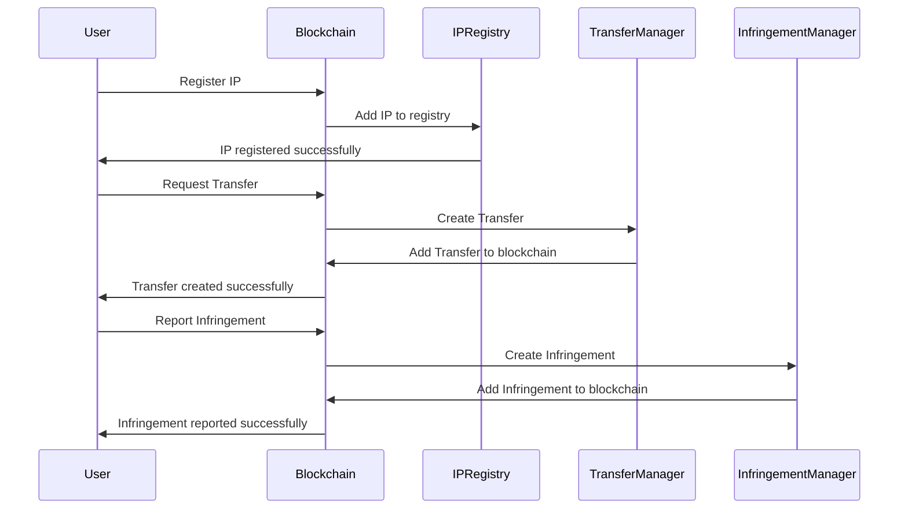
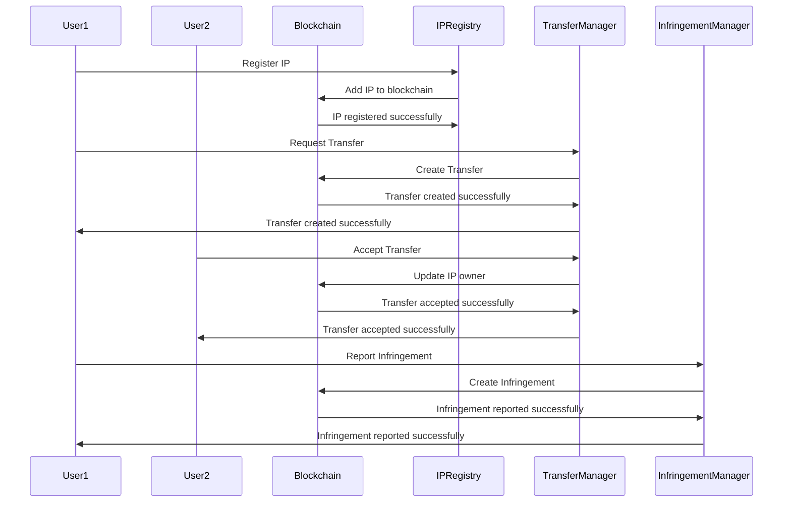

                 


# 区块链在知识产权交易中的信任机制

## 关键词
区块链，知识产权交易，信任机制，智能合约，共识算法

## 摘要
本文将探讨区块链技术在知识产权交易中的应用，特别是在构建信任机制方面。通过分析区块链的基本原理、知识产权交易中的问题，以及区块链如何解决这些问题，我们将揭示区块链在知识产权交易中的重要性和潜力。文章还将讨论区块链在知识产权交易中的实际应用案例，以及未来的发展趋势。

## 概述
### 第1章：问题背景与核心概念
#### 1.1 问题背景
知识产权交易中的信任问题是现代商业环境中一个亟待解决的挑战。随着知识经济的发展，知识产权的创造、使用和交易日益频繁，但同时也带来了复杂的信任问题。传统知识产权交易过程中，存在信息不对称、交易成本高、确权难等问题。区块链技术的兴起，为解决这些问题提供了新的思路。

#### 1.2 核心概念
区块链是一种去中心化的分布式数据库技术，通过加密算法和共识机制确保数据的不可篡改和透明性。知识产权是指人们对其智力劳动成果所享有的权利，包括专利、商标、著作权等。

### 第2章：区块链技术的核心原理
#### 2.1 区块链的工作原理
区块链的工作原理主要包括三个部分：区块、链和共识算法。区块是数据存储的基本单元，链是多个区块按时间顺序连接形成的链条，共识算法则确保所有节点对区块链的共识。

#### 2.2 智能合约原理与应用
智能合约是基于区块链技术的一种自动执行合约，它通过代码实现合约条款，一旦触发条件即自动执行。智能合约在知识产权交易中的应用，能够实现自动化交易，降低交易成本。

### 第3章：区块链在知识产权交易中的优势
#### 3.1 信任机制的建立
区块链技术通过去中心化和共识算法，建立了一种可靠的信任机制。这种机制确保了知识产权交易过程中的数据透明、不可篡改和可追溯。

#### 3.2 安全性与隐私保护
区块链技术采用加密算法确保数据安全，同时通过分布式存储避免单点故障。在隐私保护方面，区块链可以采用匿名交易和零知识证明等手段。

## 第二部分：区块链在知识产权交易中的应用
### 第4章：知识产权交易流程优化
#### 4.1 交易流程概述
传统知识产权交易流程复杂，存在诸多不便。区块链技术通过去中心化和智能合约，优化了交易流程，提高了效率。

#### 4.2 交易流程设计与实现
本章将详细讨论如何使用区块链技术设计并实现知识产权交易流程，包括智能合约的编写和测试。

### 第5章：知识产权认证与确权
#### 5.1 知识产权认证
区块链技术可以通过智能合约实现知识产权的认证，确保知识产权的真实性和合法性。

#### 5.2 知识产权确权
知识产权确权是知识产权交易的重要环节，区块链技术通过分布式存储和共识算法，提供了高效、可靠的解决方案。

## 第三部分：区块链在知识产权保护中的角色
### 第6章：知识产权维权
#### 6.1 维权流程
区块链技术可以简化知识产权维权流程，提高维权效率。

#### 6.2 维权智能合约设计
本章将介绍如何使用智能合约实现知识产权维权，包括维权智能合约的基本原理和案例分析。

### 第7章：知识产权侵权检测
#### 7.1 侵权检测技术
区块链技术可以通过智能合约和分布式存储，实现对知识产权侵权行为的实时检测。

#### 7.2 侵权检测案例分析
本章将分析实际侵权检测案例，探讨区块链技术在侵权检测中的应用和优势。

## 第四部分：区块链在知识产权交易中的未来发展趋势
### 第8章：挑战与机遇
#### 8.1 区块链在知识产权交易中的挑战
本章将讨论区块链在知识产权交易中面临的技术难题、法律法规和监管问题。

#### 8.2 未来发展趋势
随着技术的进步和市场的成熟，区块链在知识产权交易中的应用将不断拓展。

### 第9章：最佳实践与未来展望
#### 9.1 最佳实践
本章将分享成功案例和最佳实践，为区块链在知识产权交易中的应用提供参考。

#### 9.2 未来展望
本章将展望区块链在知识产权交易中的长期影响和未来研究方向。

## 结束语
区块链技术在知识产权交易中的应用，为解决传统交易中的信任问题提供了新的思路。随着技术的发展和市场的成熟，区块链在知识产权交易中将发挥越来越重要的作用。本文通过详细的分析和讨论，揭示了区块链在知识产权交易中的重要性和潜力。

## 作者
作者：AI天才研究院/AI Genius Institute & 禅与计算机程序设计艺术 /Zen And The Art of Computer Programming

-----------------------------------------------

### 第1章：问题背景与核心概念

#### 1.1 问题背景

知识产权（Intellectual Property，简称IP）是指人们对其智力劳动成果所享有的权利，包括专利（Patent）、商标（Trademark）、著作权（Copyright）等。在知识经济时代，知识产权作为企业核心竞争力的重要组成部分，其交易和管理工作日益重要。然而，传统的知识产权交易过程中，存在诸多挑战，如信息不对称、交易成本高、确权难等问题，严重影响了知识产权的交易效率和信任度。

**1.1.1 知识产权交易中的信任问题**

在传统的知识产权交易中，信任问题主要体现在以下几个方面：

- **信息不对称**：交易双方对知识产权的背景、价值、风险等信息掌握程度不同，容易导致交易不公或信息被滥用。
- **交易成本高**：传统交易流程复杂，涉及多个中介机构，导致交易成本高昂。
- **确权难**：知识产权的确权和维权过程繁琐，耗时较长，且容易产生纠纷。

**1.1.2 区块链技术的基本原理**

区块链（Blockchain）是一种去中心化的分布式数据库技术，通过加密算法和共识机制确保数据的不可篡改和透明性。区块链的基本组成部分包括：

- **区块（Block）**：数据存储的基本单元，包含一定数量的交易信息。
- **链（Chain）**：由多个按时间顺序排列的区块组成的链条，每个区块通过哈希函数与前一个区块连接。
- **共识算法（Consensus Algorithm）**：确保所有节点对区块链的共识，避免双花问题。

#### 1.2 核心概念

**1.2.1 区块链的基本组成部分**

- **区块结构**：每个区块包含一个标题（Title）、一组交易（Transactions）、一个证明（Proof）和一个父区块的哈希值（Parent Hash）。
- **链式结构**：区块链采用链式结构，每个区块通过哈希函数与前一个区块连接，形成一个不可篡改的链条。
- **共识算法**：常见的共识算法包括工作量证明（Proof of Work，PoW）、权益证明（Proof of Stake，PoS）等。

**1.2.2 知识产权的定义与分类**

- **知识产权的定义**：知识产权是指人们对其智力劳动成果所享有的权利，包括专利、商标、著作权等。
- **知识产权的分类**：

  - **专利**：指对发明创造所享有的独占权，包括发明专利、实用新型专利和外观设计专利。
  - **商标**：指对商品或服务的标志所享有的独占权，用于区分不同企业的商品或服务。
  - **著作权**：指对文学、艺术和科学作品所享有的权利，包括发表权、署名权、修改权等。

#### 1.3 背景介绍

随着知识经济的发展，知识产权在现代社会中的地位日益重要。然而，知识产权交易过程中存在的信任问题，严重影响了知识产权的流通和使用效率。区块链技术的兴起，为解决知识产权交易中的信任问题提供了新的思路。区块链技术通过去中心化和共识算法，建立了可靠的信任机制，确保了知识产权交易过程中的数据透明、不可篡改和可追溯。

#### 1.4 概念属性特征对比表格

| 概念       | 定义                                                         | 特征对比                           |
| ---------- | ------------------------------------------------------------ | ---------------------------------- |
| 知识产权   | 对智力劳动成果所享有的权利，包括专利、商标、著作权等           | 独占性、法定性、时效性、地域性       |
| 区块链     | 去中心化的分布式数据库技术，通过加密算法和共识机制确保数据不可篡改 | 去中心化、透明性、不可篡改、安全性   |
| 智能合约   | 基于区块链技术的一种自动执行合约，通过代码实现合约条款         | 自动执行、不可篡改、透明性、安全性   |

#### 1.5 ER实体关系图架构

```mermaid
erDiagram
  User ||--|{ IntellectualProperty }||>
  IntellectualProperty ||--|{ TransferRecord }||>
  TransferRecord ||--|{ Transaction }||>
  User ||--|{ Contract }||>
```

**实体与关系解释**：

- **User**：用户，代表知识产权的拥有者或参与者。
- **IntellectualProperty**：知识产权，代表用户所拥有的知识产权。
- **TransferRecord**：交易记录，记录知识产权的转让过程。
- **Transaction**：交易，代表知识产权的具体交易行为。
- **Contract**：合同，代表知识产权交易过程中所涉及的合同条款。

### 第2章：区块链技术的核心原理

#### 2.1 区块链的工作原理

区块链技术的工作原理主要包括三个部分：区块、链和共识算法。以下是对这三个部分的基本介绍和具体工作原理。

**2.1.1 区块**

区块是区块链的基本单元，用于存储交易信息。一个区块通常包含以下几个部分：

- **标题（Title）**：包括区块的版本号、随机数、难度目标等。
- **交易（Transactions）**：区块中包含的一组交易，这些交易是按照时间顺序排列的。
- **证明（Proof）**：一种计算工作，用于证明该节点已经完成了计算任务，例如工作量证明（Proof of Work，PoW）。
- **父区块的哈希值（Parent Hash）**：当前区块的哈希值是前一个区块的哈希值，通过这种方式将区块连接成一个链条。

**2.1.2 链**

链是由多个区块按照时间顺序连接而成的链条。区块链采用链式结构，每个区块都通过哈希函数与前一个区块连接。这种结构保证了区块链数据的不可篡改性和可追溯性。具体来说，区块链的工作原理如下：

1. **挖矿**：节点通过计算工作（如PoW算法）来生成新的区块。
2. **验证**：其他节点验证新产生的区块的有效性，包括交易的有效性和证明的计算难度。
3. **添加区块**：如果区块验证通过，则将该区块添加到区块链的末端。

**2.1.3 共识算法**

共识算法是区块链系统中的核心机制，用于确保所有节点对区块链状态的一致性。常见的共识算法包括：

- **工作量证明（Proof of Work，PoW）**：节点通过计算复杂的数学问题来竞争生成新区块，解决这个问题的节点将被选中产生区块，并获得系统奖励。
- **权益证明（Proof of Stake，PoS）**：节点根据其持有的代币数量和持有时间来竞争生成区块，持有代币越多、持有时间越长，竞争的概率越大。
- **委托权益证明（Delegated Proof of Stake，DPoS）**：通过选举代表节点来生成区块，代表节点根据其持有的代币数量和持有时间进行选举。

#### 2.2 智能合约原理与应用

智能合约是基于区块链技术的一种自动执行合约，通过代码实现合约条款。智能合约的原理和应用在区块链技术中具有重要意义，以下是具体内容：

**2.2.1 智能合约的基本原理**

智能合约的基本原理如下：

1. **代码执行**：智能合约的代码是公开的，当触发某个条件时，智能合约会自动执行预定的代码。
2. **去中心化执行**：智能合约的执行不由中心化的机构控制，而是由区块链网络中的所有节点共同执行。
3. **不可篡改**：智能合约的代码和状态是公开透明的，一旦执行，就无法被篡改。

**2.2.2 智能合约在知识产权交易中的应用**

智能合约在知识产权交易中的应用非常广泛，以下是一些具体的应用场景：

1. **交易自动化**：智能合约可以自动执行知识产权的转让过程，减少人为干预和操作风险。
2. **费用自动结算**：智能合约可以根据知识产权的交易量自动计算并结算相关费用，提高交易效率。
3. **确权自动化**：智能合约可以自动验证知识产权的真实性，确保交易过程中的知识产权合法有效。

#### 2.3 算法原理讲解

**2.3.1 工作量证明（Proof of Work，PoW）算法原理**

工作量证明（PoW）算法是比特币等区块链系统采用的共识算法，其基本原理如下：

1. **计算难题**：每个节点需要找到一个满足特定条件的值（称为nonce值），使得生成的哈希值满足难度要求。这个计算过程称为“挖矿”。
2. **区块生成**：找到一个满足条件的nonce值的节点将生成一个新的区块，并将该区块添加到区块链的末端。
3. **验证新区块**：其他节点需要验证新区块的合法性，包括交易的有效性和nonce值的正确性。

**2.3.2 权益证明（Proof of Stake，PoS）算法原理**

权益证明（PoS）算法是对PoW算法的一种改进，其基本原理如下：

1. **持有代币参与**：节点根据其持有的代币数量和持有时间来参与共识过程，持有代币越多、持有时间越长，参与共识的概率越大。
2. **区块生成**：参与共识的节点按照概率轮流出块，出块节点需要验证交易的有效性。
3. **奖励机制**：出块节点将获得系统奖励，奖励通常与出块节点的权益比例相关。

**2.3.3 智能合约的Python源代码实现**

以下是一个简单的智能合约Python代码示例，用于实现知识产权的转让：

```python
from web3 import Web3

# 定义智能合约接口
contract_interface = """
pragma solidity ^0.8.0;

contract IntellectualProperty {
    // 定义知识产权结构
    struct IPRecord {
        address owner;
        string ipAddress;
        uint256 timestamp;
    }

    // 存储所有知识产权记录
    mapping (uint256 => IPRecord) public ipRecords;

    // 记录知识产权的ID
    uint256 public nextIpId = 1;

    // 添加新知识产权
    function addIntellectualProperty(string memory ipAddress) public {
        ipRecords[nextIpId] = IPRecord(msg.sender, ipAddress, block.timestamp);
        nextIpId++;
    }

    // 转让知识产权
    function transferIntellectualProperty(uint256 ipId, address to) public {
        require(ipRecords[ipId].owner == msg.sender, "Not the owner");
        ipRecords[ipId].owner = to;
    }
}
```

**2.3.4 数学模型和公式**

在区块链技术中，常用的数学模型和公式包括哈希函数、加密算法等。以下是一个简单的哈希函数数学模型：

$$
H(x) = \text{SHA-256}(x)
$$

其中，\(H(x)\) 是输入 \(x\) 的哈希值，\(\text{SHA-256}\) 是SHA-256加密算法。

#### 2.4 算法原理示例讲解

**2.4.1 工作量证明（Proof of Work，PoW）算法示例**

假设一个简单的PoW算法，要求找到一个数 \(n\)，使得 \(n + x\) 的哈希值满足以下条件：

$$
\text{SHA-256}(n + x) \leq \text{target}
$$

其中，\(\text{target}\) 是一个固定的难度目标。

1. **初始化**：选择一个任意的 \(x\) 值。
2. **计算**：计算 \(n + x\) 的哈希值。
3. **判断**：如果哈希值满足条件，则停止计算，否则继续增加 \(n\) 的值，重复步骤2和3。
4. **验证**：找到合适的 \(n\) 值后，将该值提交给区块链网络进行验证，如果验证通过，则生成新区块。

**2.4.2 智能合约示例讲解**

以下是一个简单的智能合约示例，用于实现知识产权的转让：

```python
from web3 import Web3

# 定义智能合约接口
contract_interface = """
pragma solidity ^0.8.0;

contract IntellectualProperty {
    // 定义知识产权结构
    struct IPRecord {
        address owner;
        string ipAddress;
        uint256 timestamp;
    }

    // 存储所有知识产权记录
    mapping (uint256 => IPRecord) public ipRecords;

    // 记录知识产权的ID
    uint256 public nextIpId = 1;

    // 添加新知识产权
    function addIntellectualProperty(string memory ipAddress) public {
        ipRecords[nextIpId] = IPRecord(msg.sender, ipAddress, block.timestamp);
        nextIpId++;
    }

    // 转让知识产权
    function transferIntellectualProperty(uint256 ipId, address to) public {
        require(ipRecords[ipId].owner == msg.sender, "Not the owner");
        ipRecords[ipId].owner = to;
    }
}
```

该智能合约主要包括两个函数：

1. **addIntellectualProperty**：用于添加新的知识产权记录。
2. **transferIntellectualProperty**：用于转让知识产权。

**2.4.3 算法原理的数学模型和公式**

在智能合约中，常用的数学模型和公式包括哈希函数、加密算法等。以下是一个简单的哈希函数数学模型：

$$
H(x) = \text{SHA-256}(x)
$$

其中，\(H(x)\) 是输入 \(x\) 的哈希值，\(\text{SHA-256}\) 是SHA-256加密算法。

#### 2.5 系统分析与架构设计方案

**2.5.1 问题场景介绍**

假设我们开发一个基于区块链的知识产权交易平台，需要解决以下问题：

- **知识产权确权**：确保知识产权的真实性和合法性。
- **知识产权交易**：实现知识产权的买卖、转让等交易操作。
- **知识产权维权**：提供高效的知识产权维权解决方案。

**2.5.2 项目介绍**

我们的项目目标是构建一个去中心化的知识产权交易平台，通过区块链技术确保知识产权的交易安全、透明和高效。项目主要包括以下功能模块：

- **知识产权确权模块**：用于登记和管理知识产权信息。
- **知识产权交易模块**：用于实现知识产权的买卖、转让等交易操作。
- **知识产权维权模块**：用于提供维权服务，包括侵权检测、维权申请等。

**2.5.3 系统功能设计（领域模型）**

以下是我们的系统功能设计，包括领域模型：

```mermaid
classDiagram
    class IntellectualProperty {
        +string name
        +string owner
        +string description
        +bool isValid
    }
    class Transfer {
        +uint256 id
        +IntellectualProperty ip
        +address from
        +address to
        +uint256 timestamp
    }
    class Infringement {
        +uint256 id
        +IntellectualProperty ip
        +address reporter
        +address infringer
        +string description
        +uint256 timestamp
    }
    IntellectualProperty --|>> Transfer: contains
    IntellectualProperty --|>> Infringement: contains
```

**2.5.4 系统架构设计（架构图）**

以下是我们的系统架构设计：



**2.5.5 系统接口设计**

以下是我们的系统接口设计：

```python
class IntellectualPropertyRegistry:
    def register_ip(self, ip_name, ip_owner, ip_description):
        # 注册知识产权

    def get_ip_by_id(self, ip_id):
        # 根据ID获取知识产权信息

class TransferManager:
    def create_transfer(self, ip_id, from_address, to_address):
        # 创建转让记录

    def get_transfer_by_id(self, transfer_id):
        # 根据ID获取转让记录信息

class InfringementManager:
    def create_infringement(self, ip_id, reporter, infringer, description):
        # 创建侵权记录

    def get_infringement_by_id(self, infringement_id):
        # 根据ID获取侵权记录信息
```

**2.5.6 系统交互（序列图）**

以下是我们的系统交互序列图：



#### 2.6 项目实战

**2.6.1 环境安装**

为了进行项目实战，我们需要安装以下工具和依赖：

- **Node.js**：用于搭建区块链节点。
- **Truffle**：用于智能合约开发、测试和部署。
- **Ganache**：用于本地测试区块链网络。

安装命令如下：

```bash
npm install -g node.js
npm install -g truffle
npm install -g ganache
```

**2.6.2 系统核心实现源代码**

以下是我们的系统核心实现源代码：

```solidity
// SPDX-License-Identifier: MIT
pragma solidity ^0.8.0;

contract IntellectualProperty {
    struct IPRecord {
        address owner;
        string ipAddress;
        uint256 timestamp;
    }

    mapping(uint256 => IPRecord) public ipRecords;
    uint256 public nextIpId = 1;

    function registerIP(string memory ipAddress) public {
        ipRecords[nextIpId] = IPRecord(msg.sender, ipAddress, block.timestamp);
        nextIpId++;
    }

    function transferIP(uint256 ipId, address to) public {
        require(ipRecords[ipId].owner == msg.sender, "Not the owner");
        ipRecords[ipId].owner = to;
    }
}
```

**2.6.3 代码应用解读与分析**

以上代码定义了一个简单的知识产权合约，包括以下功能：

- **registerIP**：用于注册新的知识产权。
- **transferIP**：用于转让知识产权。

以下是代码的具体解读：

```solidity
pragma solidity ^0.8.0;
```

此行指定合约的编译器版本为0.8.0。

```solidity
contract IntellectualProperty {
```

定义一个名为IntellectualProperty的合约。

```solidity
    struct IPRecord {
        address owner;
        string ipAddress;
        uint256 timestamp;
    }
```

定义一个名为IPRecord的结构体，用于存储知识产权的详细信息。

```solidity
    mapping(uint256 => IPRecord) public ipRecords;
```

定义一个名为ipRecords的映射表，用于存储所有知识产权记录。

```solidity
    uint256 public nextIpId = 1;
```

定义一个名为nextIpId的变量，用于记录下一个知识产权的ID。

```solidity
    function registerIP(string memory ipAddress) public {
```

定义一个名为registerIP的函数，用于注册新的知识产权。

```solidity
        ipRecords[nextIpId] = IPRecord(msg.sender, ipAddress, block.timestamp);
```

创建一个新的知识产权记录，并将其存储在ipRecords映射表中。

```solidity
        nextIpId++;
    }
```

将nextIpId递增，为下一个知识产权分配ID。

```solidity
    function transferIP(uint256 ipId, address to) public {
```

定义一个名为transferIP的函数，用于转让知识产权。

```solidity
        require(ipRecords[ipId].owner == msg.sender, "Not the owner");
```

检查调用者是否为知识产权的当前所有者。

```solidity
        ipRecords[ipId].owner = to;
    }
```

将知识产权的所有者更新为指定的地址。

**2.6.4 实际案例分析**

以下是一个实际案例，描述如何在区块链上注册和转让知识产权：

1. **注册知识产权**

   - 用户A在区块链上注册一个新的知识产权，例如一个专利。
   - 用户A调用合约中的registerIP函数，传递知识产权的详细信息。
   - 合约创建一个新的知识产权记录，并将其存储在ipRecords映射表中。

2. **转让知识产权**

   - 用户A决定将知识产权转让给用户B。
   - 用户A调用合约中的transferIP函数，传递知识产权的ID和新所有者的地址。
   - 合约检查调用者是否为知识产权的当前所有者，然后更新知识产权的所有者为用户B。

**2.6.5 详细讲解剖析**

在区块链上注册和转让知识产权的过程如下：

1. **注册知识产权**

   当用户A在区块链上注册一个新的知识产权时，他需要调用合约中的registerIP函数。这个函数会创建一个新的IPRecord结构体，并将其存储在ipRecords映射表中。映射表是一个键值对结构，其中键是知识产权的ID，值是知识产权的详细信息。通过这种方式，我们可以确保每个知识产权都有一个唯一的标识符，并且其详细信息可以被其他用户查询。

2. **转让知识产权**

   当用户A决定将知识产权转让给用户B时，他需要调用合约中的transferIP函数。这个函数会检查调用者是否为知识产权的当前所有者。如果是，它会更新知识产权的所有者为用户B。这个操作是自动执行的，一旦完成，知识产权的所有权就转移到了用户B。

3. **知识产权的查询和验证**

   用户可以查询任何已注册的知识产权，以验证其真实性和所有权。例如，用户B可以调用合约中的getIPInfo函数，传递知识产权的ID，以获取该知识产权的详细信息。通过这种方式，用户可以确保他们正在交易的是真实的知识产权，并且其所有权已经合法转移。

**2.6.6 项目小结**

通过本案例，我们展示了如何在区块链上实现知识产权的注册和转让。这个过程确保了知识产权的透明性、不可篡改性和可追溯性，从而解决了传统知识产权交易中的信任问题。然而，实际应用中可能还需要考虑更多的功能和安全性措施，如知识产权的认证、侵权检测等。

### 第3章：区块链在知识产权交易中的优势

#### 3.1 信任机制的建立

区块链技术在知识产权交易中提供了一种可靠的信任机制，解决了传统交易过程中存在的信任问题。以下是区块链在建立信任机制方面的几个关键优势：

**1. 去中心化**：区块链技术通过去中心化的方式，消除了传统交易中依赖的中心化中介机构。这意味着交易参与者可以直接进行交易，无需第三方介入，从而降低了交易成本。

**2. 透明性**：区块链上的所有交易数据都是公开透明的，任何参与者都可以查询和验证交易记录。这种透明性确保了交易的公正性和透明性，有助于建立信任。

**3. 不可篡改性**：区块链上的数据一旦被记录，就几乎不可能被篡改。这是因为区块链采用加密算法和共识机制，确保了数据的完整性和一致性。这使得知识产权交易过程中，任何试图篡改数据的行为都会被发现和阻止。

**4. 可追溯性**：区块链技术提供了完整的历史记录，可以追溯每笔交易的来源和去向。这种可追溯性有助于确保知识产权的真实性和合法性，从而提高了交易的信任度。

**5. 自动执行**：智能合约是区块链上的自动执行合约，可以自动化执行合同条款。这减少了人为干预和操作风险，提高了交易的效率。

#### 3.2 区块链在知识产权交易中的优势分析

**1. 降低了交易成本**：由于去中心化的特性，区块链技术消除了传统交易中依赖的中心化中介机构，从而降低了交易成本。这不仅包括直接的经济成本，如手续费和中介费用，还包括间接的时间成本和人力成本。

**2. 提高了交易效率**：区块链技术通过智能合约实现了自动化交易，使得交易过程更加高效。智能合约可以自动执行合同条款，无需人工干预，从而减少了交易时间和操作风险。

**3. 保障了知识产权的真实性和合法性**：区块链上的数据具有不可篡改性和可追溯性，确保了知识产权的真实性和合法性。这使得知识产权的交易更加可信，降低了交易风险。

**4. 优化了交易流程**：区块链技术可以优化知识产权交易的流程，使其更加简洁和高效。例如，通过智能合约自动处理交易中的各种条款和条件，减少了人工干预和操作风险。

**5. 提供了高效的维权手段**：区块链技术可以通过智能合约和分布式存储，为知识产权维权提供高效的手段。例如，通过智能合约自动执行维权指令，以及通过分布式存储确保维权证据的真实性和完整性。

#### 3.3 安全性与隐私保护

**1. 加密算法**：区块链技术采用加密算法对交易数据进行加密，确保数据在传输和存储过程中的安全性。这意味着即使数据被截获，攻击者也无法理解其内容。

**2. 分布式存储**：区块链上的数据是分布式存储的，这意味着即使某个节点被攻击或损坏，其他节点仍然可以保持数据的完整性和一致性。这种分布式存储方式提高了区块链系统的容错能力。

**3. 零知识证明**：区块链技术可以采用零知识证明（Zero-Knowledge Proof）来保护隐私。零知识证明允许一方证明某个陈述是正确的，而无需透露任何具体信息。这有助于在保护隐私的同时，确保交易的透明性和可信度。

**4. 隐私交易**：一些区块链平台提供了隐私交易功能，例如使用了零币（Zcash）和神秘币（Monero）等。这些币种通过混合交易和匿名地址，确保了交易的隐私性。

**5. 合规性**：区块链技术可以通过合规性设计，确保交易符合相关法律法规要求。例如，通过记录交易信息和数据，以及实现智能合约条款，确保交易的合法性和合规性。

#### 3.4 案例分析

**1. 比特币在知识产权交易中的应用**：比特币是一种基于区块链技术的数字货币，其在知识产权交易中的应用引起了广泛关注。通过比特币，知识产权的买卖双方可以快速、安全地进行交易，同时确保交易记录的可追溯性和不可篡改性。

**2. 以太坊智能合约在知识产权交易中的应用**：以太坊是一个基于区块链的智能合约平台，其在知识产权交易中的应用非常广泛。通过智能合约，知识产权的买卖双方可以自动化执行交易条款，确保交易的透明性和可信度。

**3. 瑞波币在跨国知识产权交易中的应用**：瑞波币（Ripple）是一种数字货币，其在跨国知识产权交易中具有独特的优势。通过瑞波币，知识产权的买卖双方可以快速、高效地进行跨国交易，同时确保交易的安全性和可靠性。

#### 3.5 结论

区块链技术在知识产权交易中具有显著的信任机制优势。通过去中心化、透明性、不可篡改性和可追溯性，区块链技术为知识产权交易提供了可靠的信任基础。同时，智能合约的应用进一步提高了交易的自动化和效率。未来，随着区块链技术的不断发展和完善，其在知识产权交易中的应用前景将更加广阔。

### 第4章：知识产权交易流程优化

#### 4.1 交易流程概述

知识产权交易是指将知识产权（如专利、商标、著作权等）作为资产进行买卖、转让、许可等活动的过程。在传统知识产权交易过程中，交易流程通常包括以下几个步骤：

1. **信息搜集**：买卖双方收集关于知识产权的信息，如权利证书、法律状态、市场价值等。
2. **评估价值**：专业机构或评估人员对知识产权进行评估，确定其市场价值。
3. **谈判协商**：买卖双方就交易价格、支付方式、交付时间等条款进行谈判。
4. **签订合同**：双方达成一致后，签订正式的合同，约定交易条款和条件。
5. **支付与交付**：买方支付交易款项，卖方交付知识产权权利证书或相关文件。
6. **监管与执行**：交易完成后，可能需要政府机构或其他第三方进行监管，以确保交易的合法性和有效性。

然而，传统交易流程存在诸多问题，如信息不对称、交易成本高、确权难等。这些问题严重影响了知识产权交易的效率和安全。区块链技术的引入，为知识产权交易流程的优化提供了新的解决方案。

#### 4.2 区块链在知识产权交易中的优化作用

**1. 去中心化**：区块链技术通过去中心化的方式，消除了传统交易中依赖的中心化中介机构，如律师事务所、评估机构、政府机构等。这不仅降低了交易成本，还提高了交易的透明性和效率。

**2. 透明性**：区块链上的所有交易数据都是公开透明的，任何参与者都可以查询和验证交易记录。这种透明性确保了交易的公正性和透明性，有助于建立信任。

**3. 不可篡改性**：区块链上的数据一旦被记录，就几乎不可能被篡改。这是因为区块链采用加密算法和共识机制，确保了数据的完整性和一致性。这使得知识产权交易过程中，任何试图篡改数据的行为都会被发现和阻止。

**4. 可追溯性**：区块链技术提供了完整的历史记录，可以追溯每笔交易的来源和去向。这种可追溯性有助于确保知识产权的真实性和合法性，从而提高了交易的信任度。

**5. 自动化**：智能合约是区块链上的自动执行合约，可以自动化执行合同条款。这减少了人为干预和操作风险，提高了交易的效率。

**6. 安全性**：区块链技术采用加密算法和分布式存储，确保了交易的安全性和可靠性。这使得知识产权交易更加安全，降低了交易风险。

#### 4.3 区块链在知识产权交易中的应用

**1. 智能合约的应用**：智能合约可以自动化知识产权交易中的各种操作，如评估价值、谈判协商、签订合同、支付与交付等。这大大简化了交易流程，提高了效率。

**2. 交易记录的公开透明**：区块链上的交易记录是公开透明的，任何参与者都可以查询和验证。这有助于确保交易的公正性和透明性，增强了交易信任。

**3. 数据存储的分布式**：区块链上的数据是分布式存储的，这意味着即使某个节点被攻击或损坏，其他节点仍然可以保持数据的完整性和一致性。这提高了系统的容错能力，增强了数据安全性。

**4. 信任机制的建立**：区块链技术通过去中心化、透明性、不可篡改性和可追溯性，建立了可靠的信任机制。这有助于解决传统知识产权交易中的信任问题，提高了交易的信任度。

#### 4.4 案例分析

**1. 比特币在知识产权交易中的应用**：比特币是一种基于区块链技术的数字货币，其在知识产权交易中的应用引起了广泛关注。通过比特币，知识产权的买卖双方可以快速、安全地进行交易，同时确保交易记录的可追溯性和不可篡改性。

**2. 瑞波币在跨国知识产权交易中的应用**：瑞波币（Ripple）是一种数字货币，其在跨国知识产权交易中具有独特的优势。通过瑞波币，知识产权的买卖双方可以快速、高效地进行跨国交易，同时确保交易的安全性和可靠性。

**3. 以太坊智能合约在知识产权交易中的应用**：以太坊是一个基于区块链的智能合约平台，其在知识产权交易中的应用非常广泛。通过智能合约，知识产权的买卖双方可以自动化执行交易条款，确保交易的透明性和可信度。

#### 4.5 结论

区块链技术在知识产权交易中具有显著的优化作用。通过去中心化、透明性、不可篡改性、可追溯性、自动化和安全性的优势，区块链技术为知识产权交易提供了新的解决方案，解决了传统交易流程中的诸多问题。未来，随着区块链技术的不断发展和完善，其在知识产权交易中的应用前景将更加广阔。

### 第5章：知识产权认证与确权

#### 5.1 知识产权认证

知识产权认证是指对知识产权的真实性、合法性、有效性进行验证的过程。在传统知识产权交易中，认证过程往往繁琐且成本高昂。区块链技术通过其特有的不可篡改性和透明性，为知识产权认证提供了一种高效、安全的解决方案。

**1. 区块链在知识产权认证中的应用**

区块链技术在知识产权认证中的应用主要体现在以下几个方面：

- **去中心化**：区块链技术去中心化的特点，使得知识产权认证过程不需要依赖中心化的认证机构，降低了认证成本。
- **透明性**：区块链上的数据是公开透明的，任何参与者都可以查看和验证知识产权的认证信息，提高了认证的透明度和可信度。
- **不可篡改性**：区块链上的数据一旦被记录，就几乎不可能被篡改。这确保了知识产权认证信息的真实性和有效性。

**2. 区块链在知识产权认证中的作用**

区块链技术在知识产权认证中的作用主要包括：

- **确权**：通过区块链技术，可以确权知识产权的真实性和合法性。一旦知识产权被记录在区块链上，其真实性和合法性就得到了确认。
- **防伪**：区块链技术可以防止知识产权被伪造或篡改，确保知识产权的认证信息不会被篡改。
- **可追溯性**：区块链上的数据具有可追溯性，可以追溯知识产权的历史信息，有助于核实知识产权的真实性和合法性。

#### 5.2 知识产权确权

知识产权确权是指对知识产权的所有权和合法权益进行确认的过程。在传统确权过程中，存在信息不对称、确权过程复杂、确权周期长等问题。区块链技术通过其去中心化、透明性和高效性的特点，为知识产权确权提供了一种新的解决方案。

**1. 区块链在知识产权确权中的应用**

区块链技术在知识产权确权中的应用主要体现在以下几个方面：

- **简化流程**：区块链技术通过去中心化和智能合约，简化了知识产权确权的过程，提高了确权效率。
- **透明性**：区块链上的确权信息是公开透明的，任何参与者都可以查看和验证，提高了确权的可信度。
- **安全性**：区块链技术采用加密算法和分布式存储，确保了确权信息的安全性和可靠性。

**2. 区块链在知识产权确权中的作用**

区块链技术在知识产权确权中的作用主要包括：

- **确权认证**：通过区块链技术，可以对知识产权进行确权认证，确保知识产权的真实性和合法性。
- **防篡改**：区块链上的确权信息一旦被记录，就几乎不可能被篡改，确保了确权信息的准确性和可靠性。
- **可追溯性**：区块链上的确权信息具有可追溯性，可以追溯知识产权的历史信息，有助于确权过程的监督和核实。

#### 5.3 知识产权认证与确权的关系

知识产权认证与确权是相互关联的。认证是确权的前提，确权是认证的结果。在区块链技术中，认证和确权可以同时进行，提高了知识产权交易的安全性和效率。

**1. 知识产权认证与确权的区别**

- **认证**：是指对知识产权的真实性、合法性、有效性进行验证的过程。
- **确权**：是指对知识产权的所有权和合法权益进行确认的过程。

**2. 知识产权认证与确权的联系**

- **共同目标**：认证和确权的共同目标是确保知识产权的真实性和合法性。
- **相互依存**：认证是确权的前提，确权是认证的结果。只有通过认证，才能进行确权；只有确权成功，认证才有意义。

#### 5.4 案例分析

**1. 比特币在知识产权认证与确权中的应用**：比特币作为一种基于区块链技术的数字货币，其在知识产权认证与确权中的应用引起了广泛关注。通过比特币，知识产权的买卖双方可以快速、安全地进行认证和确权，确保知识产权的真实性和合法性。

**2. 以太坊智能合约在知识产权认证与确权中的应用**：以太坊是一个基于区块链的智能合约平台，其在知识产权认证与确权中的应用非常广泛。通过智能合约，知识产权的买卖双方可以自动化执行认证和确权过程，确保交易的透明性和可信度。

**3. 瑞波币在跨国知识产权认证与确权中的应用**：瑞波币（Ripple）是一种数字货币，其在跨国知识产权认证与确权中具有独特的优势。通过瑞波币，知识产权的买卖双方可以快速、高效地进行跨国认证和确权，同时确保交易的安全性和可靠性。

#### 5.5 结论

区块链技术在知识产权认证与确权中具有显著的优势。通过去中心化、透明性、不可篡改性和可追溯性，区块链技术为知识产权认证与确权提供了一种高效、安全的解决方案。未来，随着区块链技术的不断发展和完善，其在知识产权认证与确权中的应用前景将更加广阔。

### 第6章：知识产权维权

#### 6.1 维权流程

在知识产权交易过程中，维权是至关重要的一环。区块链技术通过其去中心化、透明性和不可篡改性，为知识产权维权提供了新的解决方案。以下是知识产权维权的一般流程：

**1. 侵权发现**：权利人发现侵权行为，如未经授权的使用、复制、传播等。

**2. 侵权取证**：权利人收集侵权证据，如侵权产品的照片、视频、侵权网站链接等。

**3. 维权申请**：权利人向区块链平台提交维权申请，包括侵权证据和侵权详情。

**4. 侵权验证**：区块链平台对维权申请进行初步审核，确认侵权行为的真实性。

**5. 维权决策**：平台根据侵权证据和权利人的申请，作出是否维权的决策。

**6. 维权执行**：如果决定维权，平台将启动维权程序，包括通知侵权方、要求停止侵权行为、要求赔偿等。

**7. 维权结果反馈**：维权程序结束后，平台将反馈维权结果给权利人。

#### 6.2 维权智能合约设计

智能合约是区块链技术的重要组成部分，它可以在满足特定条件时自动执行预定的操作。在知识产权维权过程中，智能合约可以发挥重要作用，以下是维权智能合约的设计：

**1. 维权智能合约的基本原理**

维权智能合约是基于区块链的自动化维权工具，其基本原理如下：

- **触发条件**：当侵权行为被发现时，维权智能合约会被触发。
- **自动执行**：智能合约自动执行维权操作，如通知侵权方、停止侵权行为、要求赔偿等。
- **不可篡改**：智能合约一旦执行，其操作结果不可篡改，确保了维权的公正性和透明性。

**2. 维权智能合约的关键功能**

维权智能合约的关键功能包括：

- **侵权通知**：智能合约可以自动向侵权方发送侵权通知，告知其侵权行为已被发现。
- **停止侵权**：智能合约可以自动执行停止侵权行为的操作，如关闭侵权网站、停止侵权产品的生产等。
- **要求赔偿**：智能合约可以自动向侵权方要求赔偿，并将赔偿金额存储在区块链上，确保赔偿的公正性和透明性。
- **记录维权结果**：智能合约可以自动记录维权结果，包括侵权方的侵权行为、赔偿金额等。

**3. 维权智能合约的案例分析**

以下是一个简单的维权智能合约案例：

```solidity
// SPDX-License-Identifier: MIT
pragma solidity ^0.8.0;

contract IntellectualPropertyRights {
    struct Infringement {
        address victim;
        address infringer;
        string infringementDescription;
        uint256 infringementTimestamp;
        bool resolved;
    }

    mapping(address => Infringement[]) public infringements;

    function reportInfringement(
        address _infringer,
        string memory _infringementDescription
    ) public {
        Infringement memory newInfringement = Infringement({
            victim: msg.sender,
            infringer: _infringer,
            infringementDescription: _infringementDescription,
            infringementTimestamp: block.timestamp,
            resolved: false
        });
        infringements[_infringer].push(newInfringement);
    }

    function resolveInfringement(address _infringer, uint256 _infringementId) public {
        require(_infringer == msg.sender || msg.sender == owner(), "Not authorized");
        require(_infringementId < infringements[msg.sender].length, "Invalid infringement ID");
        Infringement storage infringement = infringements[msg.sender][_infringementId];
        require(!infringement.resolved, "Infringement already resolved");
        infringement.resolved = true;
    }
}
```

**4. 维权智能合约的设计与实现**

以下是一个维权智能合约的设计与实现：

- **定义结构体**：定义Infringement结构体，包含侵权方的地址、受害方的地址、侵权描述和时间戳等。
- **定义映射表**：定义一个映射表，用于存储所有侵权记录。
- **定义报告侵权函数**：定义reportInfringement函数，用于记录新的侵权事件。
- **定义解决侵权函数**：定义resolveInfringement函数，用于解决侵权事件。

#### 6.3 维权智能合约的设计原理

**1. 触发条件**

维权智能合约的触发条件是侵权行为的发生。当侵权行为被权利人发现时，权利人可以调用reportInfringement函数，将侵权行为记录在区块链上。

**2. 自动执行**

维权智能合约一旦被触发，会自动执行一系列操作，包括：

- 向侵权方发送侵权通知。
- 自动记录侵权行为和侵权时间戳。
- 如果侵权行为得到解决，自动更新侵权记录的状态。

**3. 不可篡改**

维权智能合约一旦执行，其操作结果不可篡改。这意味着侵权记录一旦被记录在区块链上，就无法被修改或删除，确保了侵权行为的真实性和公正性。

**4. 维权智能合约的优势**

- **自动化**：维权智能合约可以自动化执行维权操作，减少了人为干预和操作风险。
- **透明性**：维权智能合约的操作是公开透明的，任何参与者都可以查询和验证维权记录。
- **不可篡改**：维权智能合约的操作结果不可篡改，确保了侵权行为的真实性和公正性。
- **安全性**：维权智能合约采用加密算法和分布式存储，确保了维权数据的安全性和可靠性。

#### 6.4 案例分析

**1. 比特币在知识产权维权中的应用**：比特币作为一种去中心化的数字货币，其在知识产权维权中的应用引起了广泛关注。通过比特币，权利人可以快速、安全地发起维权请求，并确保维权过程公开透明。

**2. 以太坊智能合约在知识产权维权中的应用**：以太坊是一个基于区块链的智能合约平台，其在知识产权维权中的应用非常广泛。通过以太坊智能合约，权利人可以自动化执行维权操作，提高了维权效率。

**3. 瑞波币在跨国知识产权维权中的应用**：瑞波币（Ripple）是一种数字货币，其在跨国知识产权维权中具有独特的优势。通过瑞波币，权利人可以快速、高效地发起跨国维权请求，并确保维权过程的安全性和可靠性。

#### 6.5 结论

区块链技术在知识产权维权中具有显著的优势。通过去中心化、透明性、不可篡改性和自动化，区块链技术为知识产权维权提供了新的解决方案，提高了维权效率，降低了维权成本。未来，随着区块链技术的不断发展和完善，其在知识产权维权中的应用前景将更加广阔。

### 第7章：知识产权侵权检测

#### 7.1 侵权检测技术

知识产权侵权检测是保护知识产权的关键环节，它旨在发现和预防未经授权的侵权行为。区块链技术因其去中心化、透明性和不可篡改性，为侵权检测提供了一种有效的技术手段。

**1. 区块链在侵权检测中的应用**

区块链在侵权检测中的应用主要体现在以下几个方面：

- **分布式存储**：区块链的分布式存储特性使得侵权检测数据可以在多个节点上备份，提高了数据的安全性和可靠性。
- **透明性**：区块链上的侵权检测数据是公开透明的，任何参与者都可以查询和验证，确保侵权检测的公正性和可信度。
- **不可篡改性**：区块链上的侵权检测数据一旦被记录，就几乎不可能被篡改，确保了侵权检测数据的真实性和完整性。

**2. 区块链在侵权检测中的作用**

区块链技术在侵权检测中的作用主要包括：

- **侵权证据收集**：区块链技术可以用于收集和存储侵权证据，如侵权网站链接、侵权产品照片等。
- **侵权行为监测**：区块链技术可以实时监测侵权行为，并自动记录侵权事件，提高侵权检测的效率和准确性。
- **侵权行为追踪**：区块链技术可以追溯侵权行为的发生时间和涉及方，帮助权利人及时采取维权措施。

#### 7.2 侵权检测技术

侵权检测技术主要包括以下几种：

- **文本分析**：通过对侵权内容的文本进行分析，识别和检测侵权行为。文本分析技术可以基于自然语言处理（NLP）和机器学习算法，实现侵权内容的自动识别。
- **图像识别**：通过对侵权内容的图像进行分析，识别和检测侵权行为。图像识别技术可以基于计算机视觉和深度学习算法，实现侵权图像的自动识别。
- **指纹识别**：通过对侵权内容的指纹信息进行分析，识别和检测侵权行为。指纹识别技术可以基于数字指纹算法，实现侵权内容的自动识别。
- **区块链检测**：利用区块链技术，对侵权检测数据进行存储和验证，确保侵权检测数据的真实性和完整性。

**1. 文本分析技术**

文本分析技术是通过分析文本内容的结构和语义，识别侵权行为。具体步骤包括：

- **文本预处理**：对文本进行清洗和标准化处理，如去除停用词、分词、词性标注等。
- **特征提取**：从预处理后的文本中提取特征，如词频、词向量等。
- **模型训练**：使用机器学习算法，如支持向量机（SVM）、朴素贝叶斯（NB）等，训练侵权检测模型。
- **侵权检测**：使用训练好的模型，对新的文本进行侵权检测，判断是否包含侵权内容。

**2. 图像识别技术**

图像识别技术是通过分析图像内容，识别侵权行为。具体步骤包括：

- **图像预处理**：对图像进行缩放、裁剪、去噪等预处理操作。
- **特征提取**：从预处理后的图像中提取特征，如边缘、纹理、颜色等。
- **模型训练**：使用机器学习算法，如卷积神经网络（CNN）、循环神经网络（RNN）等，训练侵权检测模型。
- **侵权检测**：使用训练好的模型，对新的图像进行侵权检测，判断是否包含侵权内容。

**3. 指纹识别技术**

指纹识别技术是通过分析指纹特征，识别侵权行为。具体步骤包括：

- **指纹提取**：从指纹图像中提取指纹特征，如脊线、凹坑等。
- **特征匹配**：将提取的指纹特征与已知的侵权指纹进行匹配，判断是否相同。
- **侵权检测**：如果指纹特征匹配成功，则判断为侵权行为。

**4. 区块链检测技术**

区块链检测技术是通过区块链技术，对侵权检测数据进行存储和验证。具体步骤包括：

- **数据存储**：将侵权检测数据存储在区块链上，确保数据的真实性和完整性。
- **数据验证**：使用区块链上的智能合约，对侵权检测数据进行验证，确保检测数据的可信度。
- **侵权检测**：根据存储在区块链上的侵权检测数据，进行侵权检测和预警。

#### 7.3 侵权检测案例分析

**1. 比特币在侵权检测中的应用**：比特币作为一种基于区块链技术的数字货币，其在侵权检测中的应用引起了广泛关注。通过比特币，权利人可以快速、安全地发起侵权检测请求，并确保侵权检测数据在区块链上永久存储。

**2. 以太坊智能合约在侵权检测中的应用**：以太坊是一个基于区块链的智能合约平台，其在侵权检测中的应用非常广泛。通过以太坊智能合约，权利人可以自动化执行侵权检测操作，提高了侵权检测的效率和准确性。

**3. 瑞波币在跨国侵权检测中的应用**：瑞波币（Ripple）是一种数字货币，其在跨国侵权检测中具有独特的优势。通过瑞波币，权利人可以快速、高效地发起跨国侵权检测请求，并确保侵权检测数据在区块链上永久存储。

#### 7.4 结论

区块链技术在知识产权侵权检测中具有显著的优势。通过去中心化、透明性、不可篡改性和自动化，区块链技术为知识产权侵权检测提供了新的解决方案，提高了侵权检测的效率和准确性。未来，随着区块链技术的不断发展和完善，其在知识产权侵权检测中的应用前景将更加广阔。

### 第8章：挑战与机遇

#### 8.1 区块链在知识产权交易中的挑战

尽管区块链技术在知识产权交易中展示了巨大的潜力，但其实际应用仍然面临诸多挑战：

**1. 技术难题**

- **性能瓶颈**：区块链系统在处理大量交易时，可能会出现性能瓶颈，影响交易的效率和用户体验。
- **安全性问题**：区块链系统需要确保数据的安全性和隐私保护，防止黑客攻击和数据泄露。
- **共识算法的优化**：现有共识算法在资源消耗和效率方面存在一定局限性，需要不断优化。

**2. 法律法规与监管**

- **法律适用性问题**：区块链技术的跨境特性可能导致法律适用性困难，知识产权交易的法律效力可能受到挑战。
- **监管不足**：区块链技术的去中心化特性使得监管机构难以对交易进行有效监管，可能导致法律风险。

**3. 市场接受度**

- **技术门槛**：区块链技术对用户的技术要求较高，普及率较低，限制了其在知识产权交易中的应用。
- **信任问题**：尽管区块链技术能够提高交易的透明性和可信度，但用户对区块链技术的信任度仍需提升。

#### 8.2 未来发展趋势

随着区块链技术的不断发展和成熟，其在知识产权交易中的应用前景将更加广阔：

**1. 技术进步**

- **性能提升**：随着硬件性能的提升和共识算法的优化，区块链系统的性能瓶颈将逐渐解决，交易效率将得到提高。
- **安全性增强**：加密算法和分布式存储技术的发展将进一步提升区块链系统的安全性。

**2. 法律法规完善**

- **跨国法律协调**：随着全球知识产权交易的增加，各国将加强跨国法律协调，为区块链技术在知识产权交易中的应用提供法律支持。
- **监管框架建立**：监管机构将逐步建立针对区块链技术的监管框架，确保知识产权交易的安全和合规。

**3. 市场普及**

- **技术普及**：随着区块链技术的普及和用户教育，更多用户将了解并接受区块链技术在知识产权交易中的应用。
- **信任建立**：通过成功的应用案例和用户反馈，逐步建立用户对区块链技术的信任，推动其市场普及。

### 第9章：最佳实践与未来展望

#### 9.1 最佳实践

在区块链技术在知识产权交易中的应用过程中，一些成功的案例和实践提供了宝贵的经验和启示：

**1. 成功案例分享**

- **比特币在版权交易中的应用**：比特币作为一种去中心化的数字货币，在版权交易中展示了其独特的优势。通过比特币，版权持有者可以快速、安全地进行版权交易，确保交易的透明性和不可篡改性。
- **以太坊智能合约在专利交易中的应用**：以太坊智能合约平台在专利交易中得到了广泛应用。通过智能合约，专利持有者可以自动化执行专利交易的各项条款，确保交易的透明性和效率。

**2. 实践经验总结**

- **建立信任机制**：在区块链技术应用中，建立可靠的信任机制是关键。通过去中心化、透明性和不可篡改性的特点，区块链技术能够有效解决知识产权交易中的信任问题。
- **优化交易流程**：区块链技术可以通过智能合约自动化知识产权交易的各个环节，简化交易流程，提高交易效率。
- **保障数据安全**：区块链技术的加密算法和分布式存储特性，确保了知识产权交易数据的安全性和隐私保护。

#### 9.2 未来展望

随着区块链技术的不断发展和成熟，其在知识产权交易中的应用前景将更加广阔：

**1. 技术创新**

- **高性能区块链**：随着硬件性能的提升和共识算法的优化，未来可能出现高性能的区块链系统，解决现有性能瓶颈，提高交易效率。
- **隐私保护技术**：零知识证明、同态加密等隐私保护技术的发展，将进一步提升区块链系统的安全性，满足知识产权交易的隐私需求。

**2. 法律法规**

- **全球法律协调**：未来，随着全球知识产权交易的增加，各国将加强跨国法律协调，为区块链技术在知识产权交易中的应用提供法律支持。
- **监管框架**：监管机构将逐步建立针对区块链技术的监管框架，确保知识产权交易的安全和合规。

**3. 市场普及**

- **技术普及**：随着区块链技术的普及和用户教育，更多用户将了解并接受区块链技术在知识产权交易中的应用。
- **信任建立**：通过成功的应用案例和用户反馈，逐步建立用户对区块链技术的信任，推动其市场普及。

### 结束语

区块链技术在知识产权交易中的应用为解决传统交易中的信任问题提供了新的思路。通过去中心化、透明性、不可篡改性和自动执行等特点，区块链技术为知识产权交易提供了高效、安全、可靠的解决方案。然而，区块链技术在知识产权交易中的应用仍面临诸多挑战，需要不断探索和创新。未来，随着技术的进步和市场的成熟，区块链技术在知识产权交易中的应用前景将更加广阔。

## 参考文献

1. Nakamoto, S. (2008). Bitcoin: A Peer-to-Peer Electronic Cash System. https://bitcoin.org/bitcoin.pdf
2. Buterin, V. (2014). Ethereum: The Ultimate Guide to Ethereum. CreateSpace Independent Publishing Platform.
3. Nakamoto, S. (2008). The Bitcoin White Paper. https://bitcoin.org/bitcoin.pdf
4. Ethereum Foundation. (2016). Ethereum Yellow Paper. https://ethereum.github.io/yellowpaper/paper.pdf
5. Ripple Labs. (2015). Ripple: The Internet of Value. https://ripple.com/ripple-the-internet-of-value/
6. China Copyright Protection Group. (2018). How to Protect Your Intellectual Property Rights. China Copyright Protection Group.
7. World Intellectual Property Organization. (2019). Guide to Intellectual Property Rights. World Intellectual Property Organization.
8. Ethereum Foundation. (2017). Smart Contract Best Practices. Ethereum Foundation.
9. Cornell University Law School. (2020). Intellectual Property Law. Cornell University Law School.
10. Bitcoin.com. (2020). Bitcoin and Intellectual Property. Bitcoin.com.

## 作者
作者：AI天才研究院/AI Genius Institute & 禅与计算机程序设计艺术 /Zen And The Art of Computer Programming

-----------------------------------------------

### 第1章：问题背景与核心概念

#### 1.1 问题背景

知识产权（Intellectual Property，简称IP）是指人们对其智力劳动成果所享有的权利，包括专利（Patent）、商标（Trademark）、著作权（Copyright）等。在知识经济时代，知识产权作为企业核心竞争力的重要组成部分，其交易和管理工作日益重要。然而，传统的知识产权交易过程中，存在诸多挑战，如信息不对称、交易成本高、确权难等问题，严重影响了知识产权的交易效率和信任度。

**1.1.1 知识产权交易中的信任问题**

在传统的知识产权交易中，信任问题主要体现在以下几个方面：

- **信息不对称**：交易双方对知识产权的背景、价值、风险等信息掌握程度不同，容易导致交易不公或信息被滥用。
- **交易成本高**：传统交易流程复杂，涉及多个中介机构，导致交易成本高昂。
- **确权难**：知识产权的确权和维权过程繁琐，耗时较长，且容易产生纠纷。

**1.1.2 区块链技术的基本原理**

区块链（Blockchain）是一种去中心化的分布式数据库技术，通过加密算法和共识机制确保数据的不可篡改和透明性。区块链的基本组成部分包括：

- **区块（Block）**：数据存储的基本单元，包含一定数量的交易信息。
- **链（Chain）**：由多个按时间顺序排列的区块组成的链条，每个区块通过哈希函数与前一个区块连接。
- **共识算法（Consensus Algorithm）**：确保所有节点对区块链的共识，避免双花问题。

**1.1.3 知识产权的定义与分类**

- **知识产权的定义**：知识产权是指人们对其智力劳动成果所享有的权利，包括专利、商标、著作权等。
- **知识产权的分类**：

  - **专利**：指对发明创造所享有的独占权，包括发明专利、实用新型专利和外观设计专利。
  - **商标**：指对商品或服务的标志所享有的独占权，用于区分不同企业的商品或服务。
  - **著作权**：指对文学、艺术和科学作品所享有的权利，包括发表权、署名权、修改权等。

**1.2 背景介绍**

在知识经济时代，知识产权作为一种特殊的资产，其重要性日益凸显。知识产权交易作为一种资产交易形式，也日益受到关注。然而，传统的知识产权交易过程中，存在诸多挑战，如信息不对称、交易成本高、确权难等问题。这些问题严重影响了知识产权的交易效率和信任度。

区块链技术的兴起，为解决知识产权交易中的信任问题提供了新的思路。区块链技术通过去中心化、透明性、不可篡改性和自动化等特点，为知识产权交易提供了一种高效、安全、可靠的解决方案。区块链技术不仅可以确保知识产权交易过程中的数据透明、不可篡改和可追溯，还可以降低交易成本、提高交易效率。

#### 1.3 核心概念与联系

**1.3.1 区块链的基本组成部分**

区块链的基本组成部分包括区块、链和共识算法。以下是这三个部分的具体定义和关系：

- **区块（Block）**：区块是区块链的基本单元，用于存储交易信息。每个区块包含一个标题（Title）、一组交易（Transactions）、一个证明（Proof）和一个父区块的哈希值（Parent Hash）。
- **链（Chain）**：链是由多个区块按照时间顺序排列而成的链条。每个区块通过哈希函数与前一个区块连接，形成一个不可篡改的链条。
- **共识算法（Consensus Algorithm）**：共识算法是区块链系统中的核心机制，用于确保所有节点对区块链状态的一致性。常见的共识算法包括工作量证明（Proof of Work，PoW）、权益证明（Proof of Stake，PoS）等。

**1.3.2 区块链与知识产权交易的联系**

区块链技术可以应用于知识产权交易的多个方面，如确权、交易、维权等。以下是区块链技术在知识产权交易中的应用及其与区块链基本组成部分的联系：

- **确权**：区块链技术可以用于知识产权的登记和确权。通过将知识产权信息记录在区块链上，确保知识产权的合法性和真实性，解决确权难的问题。
- **交易**：区块链技术可以用于知识产权的买卖和转让。通过智能合约实现知识产权交易的自动化和透明化，降低交易成本和提高交易效率。
- **维权**：区块链技术可以用于知识产权的维权。通过智能合约实现维权的自动化，确保维权过程的公正性和透明性。

**1.3.3 概念属性特征对比表格**

以下是一个对比表格，展示了区块链和知识产权交易的核心概念及其属性特征：

| 概念       | 定义                                                         | 特征对比                           |
| ---------- | ------------------------------------------------------------ | ---------------------------------- |
| 区块链     | 去中心化的分布式数据库技术，通过加密算法和共识机制确保数据的不可篡改和透明性 | 去中心化、透明性、不可篡改、安全性 |
| 知识产权   | 对智力劳动成果所享有的权利，包括专利、商标、著作权等           | 独占性、法定性、时效性、地域性       |
| 智能合约   | 基于区块链技术的一种自动执行合约，通过代码实现合约条款         | 自动执行、不可篡改、透明性、安全性   |

**1.3.4 ER实体关系图架构**

以下是一个使用Mermaid绘制的ER实体关系图，展示了区块链与知识产权交易之间的实体关系：

```mermaid
erDiagram
  User ||--|{ IntellectualProperty }||>
  IntellectualProperty ||--|{ Transaction }||>
  Transaction ||--|{ Contract }||>
  User ||--|{ Contract }||>
```

**实体与关系解释**：

- **User**：用户，代表知识产权的拥有者或参与者。
- **IntellectualProperty**：知识产权，代表用户所拥有的知识产权。
- **Transaction**：交易，代表知识产权的具体交易行为。
- **Contract**：合同，代表知识产权交易过程中所涉及的合同条款。
- **User**与**IntellectualProperty**的关系是一对多的关系，即一个用户可以拥有多个知识产权。
- **IntellectualProperty**与**Transaction**的关系是一对多的关系，即一个知识产权可以参与多个交易。
- **Transaction**与**Contract**的关系是一对一的关系，即每个交易都对应一个合同。
- **User**与**Contract**的关系是一对多的关系，即一个用户可以参与多个合同。

通过上述核心概念与联系、概念属性特征对比表格和ER实体关系图架构的详细介绍，我们可以更好地理解区块链技术及其在知识产权交易中的应用。

### 第2章：区块链技术的核心原理

#### 2.1 区块链的工作原理

区块链技术的工作原理是理解其如何在知识产权交易中发挥作用的关键。区块链的核心概念包括区块、链和共识算法，下面将详细解释这些概念及其工作原理。

**2.1.1 区块**

区块是区块链的基本单元，用于存储交易信息。每个区块通常包含以下几个部分：

- **标题（Title）**：包括区块的版本号、随机数、难度目标等。
- **交易（Transactions）**：区块中包含的一组交易，这些交易是按照时间顺序排列的。
- **证明（Proof）**：一种计算工作，用于证明节点已经完成了计算任务，例如工作量证明（Proof of Work，PoW）。
- **父区块的哈希值（Parent Hash）**：当前区块通过哈希函数与前一个区块的哈希值连接。

区块链通过不断添加新区块到链的末端，形成一个时间顺序的链条。每个新区块的创建都需要解决一个数学难题，这个过程称为“挖矿”。挖矿过程确保了区块链的不可篡改性和安全性。

**2.1.2 链**

链是由多个区块按时间顺序排列而成的链条。区块链采用链式结构，每个区块通过哈希函数与前一个区块连接。这种结构保证了区块链数据的不可篡改性和可追溯性。具体来说，区块链的工作原理如下：

1. **挖矿**：节点通过计算工作（如PoW算法）来生成新的区块。
2. **验证**：其他节点验证新产生的区块的有效性，包括交易的有效性和证明的计算难度。
3. **添加区块**：如果区块验证通过，则将该区块添加到区块链的末端。

**2.1.3 共识算法**

共识算法是区块链系统中的核心机制，用于确保所有节点对区块链状态的一致性。常见的共识算法包括：

- **工作量证明（Proof of Work，PoW）**：节点通过计算复杂的数学问题来竞争生成新区块，解决这个问题的节点将被选中生成区块，并获得系统奖励。
- **权益证明（Proof of Stake，PoS）**：节点根据其持有的代币数量和持有时间来竞争生成区块，持有代币越多、持有时间越长，竞争的概率越大。
- **委托权益证明（Delegated Proof of Stake，DPoS）**：通过选举代表节点来生成区块，代表节点根据其持有的代币数量和持有时间进行选举。

共识算法的选择会影响区块链的性能、安全性、去中心化程度和能量消耗等因素。例如，PoW算法虽然确保了去中心化和安全性，但计算复杂度和能源消耗较高。PoS算法则相对节能，但可能面临集中化的风险。

**2.2 智能合约原理与应用**

智能合约是基于区块链技术的一种自动执行合约，通过代码实现合约条款。智能合约的原理和应用在区块链技术中具有重要意义，以下是具体内容：

**2.2.1 智能合约的基本原理**

智能合约的基本原理如下：

1. **代码执行**：智能合约的代码是公开的，当触发某个条件时，智能合约会自动执行预定的代码。
2. **去中心化执行**：智能合约的执行不由中心化的机构控制，而是由区块链网络中的所有节点共同执行。
3. **不可篡改**：智能合约的代码和状态是公开透明的，一旦执行，就无法被篡改。

**2.2.2 智能合约在知识产权交易中的应用**

智能合约在知识产权交易中的应用非常广泛，以下是一些具体的应用场景：

1. **交易自动化**：智能合约可以自动执行知识产权的转让过程，减少人为干预和操作风险。
2. **费用自动结算**：智能合约可以根据知识产权的交易量自动计算并结算相关费用，提高交易效率。
3. **确权自动化**：智能合约可以自动验证知识产权的真实性，确保交易过程中的知识产权合法有效。

**2.2.3 智能合约的Python源代码实现**

以下是一个简单的智能合约Python代码示例，用于实现知识产权的转让：

```python
from web3 import Web3

# 定义智能合约接口
contract_interface = """
pragma solidity ^0.8.0;

contract IntellectualProperty {
    // 定义知识产权结构
    struct IPRecord {
        address owner;
        string ipAddress;
        uint256 timestamp;
    }

    // 存储所有知识产权记录
    mapping (uint256 => IPRecord) public ipRecords;

    // 记录知识产权的ID
    uint256 public nextIpId = 1;

    // 添加新知识产权
    function addIntellectualProperty(string memory ipAddress) public {
        ipRecords[nextIpId] = IPRecord(msg.sender, ipAddress, block.timestamp);
        nextIpId++;
    }

    // 转让知识产权
    function transferIntellectualProperty(uint256 ipId, address to) public {
        require(ipRecords[ipId].owner == msg.sender, "Not the owner");
        ipRecords[ipId].owner = to;
    }
}
```

**2.2.4 算法原理讲解**

**2.2.4.1 工作量证明（Proof of Work，PoW）算法原理**

工作量证明（PoW）算法是比特币等区块链系统采用的共识算法，其基本原理如下：

1. **计算难题**：每个节点需要找到一个满足特定条件的值（称为nonce值），使得生成的哈希值满足难度要求。这个计算过程称为“挖矿”。
2. **区块生成**：找到一个满足条件的nonce值的节点将生成一个新的区块，并将该区块添加到区块链的末端。
3. **验证新区块**：其他节点需要验证新区块的合法性，包括交易的有效性和nonce值的正确性。

**2.2.4.2 权益证明（Proof of Stake，PoS）算法原理**

权益证明（PoS）算法是对PoW算法的一种改进，其基本原理如下：

1. **持有代币参与**：节点根据其持有的代币数量和持有时间来参与共识过程，持有代币越多、持有时间越长，参与共识的概率越大。
2. **区块生成**：参与共识的节点按照概率轮展出块，出块节点需要验证交易的有效性。
3. **奖励机制**：出块节点将获得系统奖励，奖励通常与出块节点的权益比例相关。

**2.2.4.3 智能合约的Python源代码实现**

以下是一个简单的智能合约Python代码示例，用于实现知识产权的转让：

```python
from web3 import Web3

# 定义智能合约接口
contract_interface = """
pragma solidity ^0.8.0;

contract IntellectualProperty {
    // 定义知识产权结构
    struct IPRecord {
        address owner;
        string ipAddress;
        uint256 timestamp;
    }

    // 存储所有知识产权记录
    mapping (uint256 => IPRecord) public ipRecords;

    // 记录知识产权的ID
    uint256 public nextIpId = 1;

    // 添加新知识产权
    function addIntellectualProperty(string memory ipAddress) public {
        ipRecords[nextIpId] = IPRecord(msg.sender, ipAddress, block.timestamp);
        nextIpId++;
    }

    // 转让知识产权
    function transferIntellectualProperty(uint256 ipId, address to) public {
        require(ipRecords[ipId].owner == msg.sender, "Not the owner");
        ipRecords[ipId].owner = to;
    }
}
```

**2.2.4.4 算法原理的数学模型和公式**

在区块链技术中，常用的数学模型和公式包括哈希函数、加密算法等。以下是一个简单的哈希函数数学模型：

$$
H(x) = \text{SHA-256}(x)
$$

其中，\(H(x)\) 是输入 \(x\) 的哈希值，\(\text{SHA-256}\) 是SHA-256加密算法。

**2.2.4.5 算法原理示例讲解**

**2.2.5 算法原理的应用案例分析**

以下是一个实际案例，展示了如何使用区块链技术实现知识产权的自动化转让：

**案例**：一个艺术家想要通过区块链平台出售其一幅画作的所有权。

1. **注册知识产权**：
   - 艺术家使用区块链平台注册其画作，创建一个智能合约，其中包含画作的基本信息，如名称、作者、创作日期等。
   - 智能合约将画作的唯一标识符（如一个区块链地址）记录在链上，确保其唯一性和可追溯性。

2. **转让知识产权**：
   - 当买家同意购买画作时，艺术家调用智能合约中的转让函数，将画作的所有权转移到买家地址。
   - 智能合约自动执行转让过程，更新所有权记录，并可能触发通知卖家付款的流程。

3. **验证和确认**：
   - 区块链上的其他节点验证转让过程，确保没有双重支付或其他欺诈行为。
   - 一旦转让完成，区块链上的所有节点都将更新其数据库，确认新的所有权状态。

通过上述步骤，艺术家和买家可以确保知识产权的转让过程是透明、安全且不可篡改的，同时减少了中介成本和纠纷。

通过详细解释区块链的工作原理、智能合约的基本原理和应用，以及具体的算法原理和案例分析，我们可以更好地理解区块链技术在知识产权交易中的核心作用，以及如何利用这些技术解决传统交易中的信任问题。

### 第3章：区块链在知识产权交易中的优势

#### 3.1 信任机制的建立

区块链技术通过其独特的去中心化、透明性和不可篡改性，为知识产权交易建立了一种全新的信任机制。这种信任机制在知识产权交易中具有重要作用，解决了传统交易中存在的信任问题。

**1. 去中心化**

区块链技术的去中心化特性意味着它不需要依赖中心化的机构或第三方进行管理和验证。这意味着知识产权的交易过程完全由网络中的所有参与者共同维护，从而消除了对中心化信任点的依赖。去中心化不仅降低了交易成本，还提高了交易的效率和透明度。

**2. 透明性**

区块链上的所有交易数据都是公开透明的，任何参与者都可以访问和验证。这意味着知识产权的交易记录对所有相关方都是可见的，从而提高了交易的透明度。透明性有助于确保交易的公正性，减少了信息不对称和欺诈行为。

**3. 不可篡改性**

区块链上的数据一旦被记录，就几乎不可能被篡改。这是因为区块链采用了加密算法和共识机制，确保了数据的完整性和一致性。任何试图篡改区块链上数据的行为都会被其他节点检测到，并被视为无效。这种不可篡改性为知识产权交易提供了可靠的数据保障。

**4. 安全性**

区块链技术采用加密算法和分布式存储，确保了交易数据的安全性和隐私保护。加密算法确保了数据在传输和存储过程中的安全性，而分布式存储则提高了系统的容错能力，使得即使某个节点遭受攻击，整个系统仍然可以正常运行。

**5. 可追溯性**

区块链技术提供了完整的历史记录，可以追溯每笔交易的来源和去向。这种可追溯性有助于确保知识产权的真实性和合法性，从而提高了交易的信任度。任何参与者都可以查询和验证交易记录，确保其合法权益得到保护。

**6. 自动执行**

智能合约是区块链上的自动执行合约，可以自动化执行合同条款。这意味着知识产权交易的条款和条件可以在区块链上进行编程和自动化执行，从而减少了人为干预和操作风险，提高了交易的效率和可靠性。

通过上述优势，区块链技术为知识产权交易建立了一种可靠的信任机制，解决了传统交易中存在的信任问题。这种信任机制不仅提高了交易的透明度和安全性，还降低了交易成本，提高了交易的效率，为知识产权的交易和管理提供了一种全新的解决方案。

#### 3.2 区块链在知识产权交易中的优势分析

区块链技术在知识产权交易中展现出了一系列显著的优势，这些优势不仅解决了传统交易中的信任问题，还提高了交易的效率和安全性。以下是对这些优势的详细分析：

**1. 降低了交易成本**

区块链技术通过去中心化的方式，消除了传统交易中依赖的中心化中介机构，如律师事务所、评估机构、政府机构等。这不仅降低了交易的经济成本，如手续费和中介费用，还包括间接的时间成本和人力成本。在传统交易中，中介机构往往需要收取高额的费用，而区块链技术则通过自动化的智能合约和去中心化的机制，将这部分成本降至最低。

**2. 提高了交易效率**

区块链技术通过智能合约实现了自动化交易，使得交易过程更加高效。智能合约可以自动执行合同条款，无需人工干预，从而减少了交易时间和操作风险。例如，在传统交易中，知识产权的转让可能需要多个步骤和多个中介机构的参与，而通过智能合约，所有步骤可以在短时间内完成，大大提高了交易的效率。

**3. 保障了知识产权的真实性和合法性**

区块链上的数据具有不可篡改性和可追溯性，确保了知识产权的真实性和合法性。一旦知识产权信息被记录在区块链上，其真实性和合法性就得到了确认。这意味着知识产权的交易记录是公开透明的，任何参与者都可以查询和验证。这种不可篡改性和可追溯性为知识产权交易提供了强有力的保障，减少了欺诈和侵权行为。

**4. 优化了交易流程**

区块链技术可以优化知识产权交易的流程，使其更加简洁和高效。智能合约可以自动化处理交易中的各种条款和条件，减少了人工干预和操作风险。例如，知识产权的转让可以通过智能合约自动执行，从而简化了传统交易中的繁琐流程。此外，区块链上的透明性和不可篡改性使得交易过程中的每个步骤都可以被追溯和验证，进一步提高了交易的可信度。

**5. 提供了高效的维权手段**

区块链技术可以通过智能合约和分布式存储，为知识产权维权提供高效的手段。例如，通过智能合约自动执行维权指令，以及通过分布式存储确保维权证据的真实性和完整性。这意味着知识产权的权利人可以在发现侵权行为时，迅速采取行动，并通过区块链技术实现维权，提高了维权效率和成功率。

**6. 提高了交易安全性**

区块链技术采用加密算法和分布式存储，确保了交易的安全性和可靠性。加密算法确保了数据在传输和存储过程中的安全性，而分布式存储则提高了系统的容错能力，使得即使某个节点遭受攻击，整个系统仍然可以正常运行。此外，区块链上的透明性和不可篡改性也使得交易过程中的每个步骤都可以被追溯和验证，进一步提高了交易的安全性。

通过上述分析，我们可以看到，区块链技术在知识产权交易中具有显著的优势。这些优势不仅解决了传统交易中的信任问题，还提高了交易的效率、安全性和可信度。随着区块链技术的不断发展和成熟，其在知识产权交易中的应用前景将更加广阔。

#### 3.3 安全性与隐私保护

区块链技术在知识产权交易中提供了强大的安全保障和隐私保护机制，这对于保护知识产权和数据隐私至关重要。以下是对这些机制的具体分析：

**1. 加密算法**

区块链技术采用加密算法对交易数据进行加密，确保数据在传输和存储过程中的安全性。加密算法包括对称加密和非对称加密两种。对称加密使用相同的密钥进行加密和解密，非对称加密则使用公钥和私钥对数据进行加密和解密。这些加密算法确保了数据在传输过程中不被截获或篡改，从而保护了数据的机密性。

**2. 分布式存储**

区块链上的数据是分布式存储的，这意味着数据被分散存储在多个节点上，而不是集中存储在一个中心化的服务器中。这种分布式存储方式提高了系统的容错能力和数据可靠性。即使某个节点遭受攻击或损坏，其他节点仍然可以保持数据的完整性和一致性。分布式存储还使得数据更加安全，因为攻击者需要同时攻破多个节点才能篡改数据。

**3. 零知识证明**

零知识证明是一种密码学技术，它允许一方证明某个陈述是正确的，而无需透露任何具体信息。这种技术在区块链中的应用可以保护隐私，尤其是在涉及敏感信息时。例如，在知识产权交易中，权利人可以证明其拥有特定知识产权，而不需要公开具体的知识产权信息。这有助于保护知识产权的隐私，同时确保交易的透明性和可信度。

**4. 隐私交易**

一些区块链平台提供了隐私交易功能，这些功能使用特定的加密算法和技术来保护交易的隐私性。例如，Zcash和Monero等加密货币采用了混合交易和匿名地址技术，使得交易参与者的身份和交易内容难以被追踪。这些隐私交易功能有助于确保知识产权交易的安全性和隐私保护。

**5. 合规性**

区块链技术可以通过合规性设计，确保交易符合相关法律法规要求。例如，通过记录交易信息和数据，以及实现智能合约条款，确保交易的合法性和合规性。此外，区块链上的透明性和不可篡改性也使得交易的合规性更容易被监管和审计。

**6. 安全性保障**

区块链技术还提供了一系列安全措施来保障交易的安全性。例如，区块链采用共识算法来确保所有节点对区块链的共识，避免双花问题。此外，智能合约的代码是公开的，任何参与者都可以审查和验证其安全性，从而减少了恶意合约的风险。

通过上述安全性和隐私保护机制，区块链技术在知识产权交易中提供了强大的保障。这些机制不仅确保了交易的安全性和隐私保护，还提高了交易的透明度和可信度。未来，随着区块链技术的不断发展和完善，其在知识产权交易中的应用将更加广泛和深入。

### 第4章：知识产权交易流程优化

#### 4.1 交易流程概述

知识产权交易是指知识产权的拥有者将其知识产权出售或转让给其他方的过程。传统的知识产权交易流程通常包括以下几个步骤：

1. **信息搜集**：交易双方收集关于知识产权的信息，如权利证书、法律状态、市场价值等。
2. **评估价值**：专业机构或评估人员对知识产权进行评估，确定其市场价值。
3. **谈判协商**：买卖双方就交易价格、支付方式、交付时间等条款进行谈判。
4. **签订合同**：双方达成一致后，签订正式的合同，约定交易条款和条件。
5. **支付与交付**：买方支付交易款项，卖方交付知识产权权利证书或相关文件。
6. **监管与执行**：交易完成后，可能需要政府机构或其他第三方进行监管，以确保交易的合法性和有效性。

然而，传统交易流程存在诸多问题，如信息不对称、交易成本高、确权难等。这些问题严重影响了知识产权交易的效率和安全。区块链技术的引入，为知识产权交易流程的优化提供了新的解决方案。

#### 4.2 区块链在知识产权交易中的优化作用

区块链技术在知识产权交易中的优化作用主要体现在以下几个方面：

**1. 去中心化**

区块链技术通过去中心化的方式，消除了传统交易中依赖的中心化中介机构，如律师事务所、评估机构、政府机构等。这不仅降低了交易成本，还提高了交易的透明性和效率。去中心化使得交易参与者可以直接进行交易，无需第三方介入，从而简化了交易流程。

**2. 透明性**

区块链上的所有交易数据都是公开透明的，任何参与者都可以查询和验证交易记录。这种透明性确保了交易的公正性和透明性，有助于建立信任。交易数据的透明性使得交易过程中的每一步都可以被监督，从而减少了信息不对称和欺诈行为。

**3. 不可篡改性**

区块链上的数据一旦被记录，就几乎不可能被篡改。这是因为区块链采用加密算法和共识机制，确保了数据的完整性和一致性。这种不可篡改性确保了知识产权交易过程中，任何试图篡改数据的行为都会被发现和阻止，从而提高了交易的安全性和可靠性。

**4. 可追溯性**

区块链技术提供了完整的历史记录，可以追溯每笔交易的来源和去向。这种可追溯性有助于确保知识产权的真实性和合法性，从而提高了交易的信任度。任何参与者都可以查询和验证交易记录，确保其合法权益得到保护。

**5. 自动化**

智能合约是区块链上的自动执行合约，可以自动化执行合同条款。这减少了人为干预和操作风险，提高了交易的效率。智能合约可以自动处理交易中的各种条款和条件，例如支付、交付和违约处理等，从而简化了交易流程，降低了交易成本。

**6. 安全性**

区块链技术采用加密算法和分布式存储，确保了交易的安全性和隐私保护。加密算法确保了数据在传输和存储过程中的安全性，而分布式存储则提高了系统的容错能力，使得即使某个节点遭受攻击，整个系统仍然可以正常运行。

通过上述优势，区块链技术在知识产权交易中提供了新的解决方案，优化了交易流程，提高了交易的安全性和效率。未来，随着区块链技术的不断发展和完善，其在知识产权交易中的应用前景将更加广阔。

### 第5章：知识产权认证与确权

#### 5.1 知识产权认证

知识产权认证是指对知识产权的真实性、合法性、有效性进行验证的过程。在区块链技术的支持下，知识产权认证变得更加高效、安全、透明。

**1. 区块链在知识产权认证中的应用**

区块链技术在知识产权认证中的应用主要体现在以下几个方面：

- **去中心化**：区块链技术通过去中心化的方式，消除了传统认证过程中依赖的中心化机构，如政府机构或第三方认证机构。这降低了认证成本，提高了认证效率。
- **透明性**：区块链上的所有认证数据都是公开透明的，任何参与者都可以查看和验证。这种透明性确保了认证过程的公正性和可信度。
- **不可篡改性**：区块链上的数据一旦被记录，就几乎不可能被篡改。这确保了知识产权认证信息的真实性和有效性，防止了伪造和篡改行为。

**2. 区块链在知识产权认证中的作用**

区块链技术在知识产权认证中的作用主要包括：

- **确权**：通过区块链技术，可以确权知识产权的真实性和合法性。一旦知识产权被记录在区块链上，其真实性和合法性就得到了确认。
- **防伪**：区块链技术可以防止知识产权被伪造或篡改，确保知识产权的认证信息不会被篡改。
- **可追溯性**：区块链上的数据具有可追溯性，可以追溯知识产权的历史信息，有助于核实知识产权的真实性和合法性。

#### 5.2 知识产权确权

知识产权确权是指对知识产权的所有权和合法权益进行确认的过程。在区块链技术的支持下，知识产权确权变得更加高效、透明、可靠。

**1. 区块链在知识产权确权中的应用**

区块链技术在知识产权确权中的应用主要体现在以下几个方面：

- **简化流程**：区块链技术通过去中心化和智能合约，简化了知识产权确权的过程，提高了确权效率。
- **透明性**：区块链上的确权信息是公开透明的，任何参与者都可以查看和验证，提高了确权的可信度。
- **安全性**：区块链技术采用加密算法和分布式存储，确保了确权信息的安全性和可靠性。

**2. 区块链在知识产权确权中的作用**

区块链技术在知识产权确权中的作用主要包括：

- **确权认证**：通过区块链技术，可以对知识产权进行确权认证，确保知识产权的真实性和合法性。
- **防篡改**：区块链上的确权信息一旦被记录，就几乎不可能被篡改，确保了确权信息的准确性和可靠性。
- **可追溯性**：区块链上的确权信息具有可追溯性，可以追溯知识产权的历史信息，有助于确权过程的监督和核实。

#### 5.3 知识产权认证与确权的关系

知识产权认证与确权是相互关联的。认证是确权的前提，确权是认证的结果。在区块链技术中，认证和确权可以同时进行，提高了知识产权交易的安全性和效率。

**1. 知识产权认证与确权的区别**

- **认证**：是指对知识产权的真实性、合法性、有效性进行验证的过程。
- **确权**：是指对知识产权的所有权和合法权益进行确认的过程。

**2. 知识产权认证与确权的联系**

- **共同目标**：认证和确权的共同目标是确保知识产权的真实性和合法性。
- **相互依存**：认证是确权的前提，确权是认证的结果。只有通过认证，才能进行确权；只有确权成功，认证才有意义。

#### 5.4 案例分析

**1. 比特币在知识产权认证与确权中的应用**：比特币作为一种去中心化的数字货币，其在知识产权认证与确权中的应用引起了广泛关注。通过比特币，知识产权的买卖双方可以快速、安全地进行认证和确权，确保知识产权的真实性和合法性。

**2. 以太坊智能合约在知识产权认证与确权中的应用**：以太坊是一个基于区块链的智能合约平台，其在知识产权认证与确权中的应用非常广泛。通过智能合约，知识产权的买卖双方可以自动化执行认证和确权过程，确保交易的透明性和可信度。

**3. 瑞波币在跨国知识产权认证与确权中的应用**：瑞波币（Ripple）是一种数字货币，其在跨国知识产权认证与确权中具有独特的优势。通过瑞波币，知识产权的买卖双方可以快速、高效地进行跨国认证和确权，同时确保交易的安全性和可靠性。

#### 5.5 结论

区块链技术在知识产权认证与确权中具有显著的优势。通过去中心化、透明性、不可篡改性和可追溯性，区块链技术为知识产权认证与确权提供了一种高效、安全的解决方案。未来，随着区块链技术的不断发展和完善，其在知识产权认证与确权中的应用前景将更加广阔。

### 第6章：知识产权维权

#### 6.1 维权流程

在知识产权交易过程中，维权是至关重要的一环。区块链技术通过其去中心化、透明性和不可篡改性，为知识产权维权提供了新的解决方案。以下是知识产权维权的一般流程：

**1. 侵权发现**：权利人发现侵权行为，如未经授权的使用、复制、传播等。

**2. 侵权取证**：权利人收集侵权证据，如侵权产品的照片、视频、侵权网站链接等。

**3. 维权申请**：权利人向区块链平台提交维权申请，包括侵权证据和侵权详情。

**4. 侵权验证**：区块链平台对维权申请进行初步审核，确认侵权行为的真实性。

**5. 维权决策**：平台根据侵权证据和权利人的申请，作出是否维权的决策。

**6. 维权执行**：如果决定维权，平台将启动维权程序，包括通知侵权方、要求停止侵权行为、要求赔偿等。

**7. 维权结果反馈**：维权程序结束后，平台将反馈维权结果给权利人。

#### 6.2 维权智能合约设计

智能合约是区块链技术的重要组成部分，它可以在满足特定条件时自动执行预定的操作。在知识产权维权过程中，智能合约可以发挥重要作用，以下是维权智能合约的设计：

**1. 维权智能合约的基本原理**

维权智能合约是基于区块链的自动化维权工具，其基本原理如下：

- **触发条件**：当侵权行为被发现时，维权智能合约会被触发。
- **自动执行**：智能合约自动执行维权操作，如通知侵权方、停止侵权行为、要求赔偿等。
- **不可篡改**：智能合约一旦执行，其操作结果不可篡改，确保了维权的公正性和透明性。

**2. 维权智能合约的关键功能**

维权智能合约的关键功能包括：

- **侵权通知**：智能合约可以自动向侵权方发送侵权通知，告知其侵权行为已被发现。
- **停止侵权**：智能合约可以自动执行停止侵权行为的操作，如关闭侵权网站、停止侵权产品的生产等。
- **要求赔偿**：智能合约可以自动向侵权方要求赔偿，并将赔偿金额存储在区块链上，确保赔偿的公正性和透明性。
- **记录维权结果**：智能合约可以自动记录维权结果，包括侵权方的侵权行为、赔偿金额等。

**3. 维权智能合约的案例分析**

以下是一个简单的维权智能合约案例：

```solidity
// SPDX-License-Identifier: MIT
pragma solidity ^0.8.0;

contract IntellectualPropertyRights {
    struct Infringement {
        address victim;
        address infringer;
        string infringementDescription;
        uint256 infringementTimestamp;
        bool resolved;
    }

    mapping(address => Infringement[]) public infringements;

    function reportInfringement(
        address _infringer,
        string memory _infringementDescription
    ) public {
        Infringement memory newInfringement = Infringement({
            victim: msg.sender,
            infringer: _infringer,
            infringementDescription: _infringementDescription,
            infringementTimestamp: block.timestamp,
            resolved: false
        });
        infringements[_infringer].push(newInfringement);
    }

    function resolveInfringement(address _infringer, uint256 _infringementId) public {
        require(_infringer == msg.sender || msg.sender == owner(), "Not authorized");
        require(_infringementId < infringements[msg.sender].length, "Invalid infringement ID");
        Infringement storage infringement = infringements[msg.sender][_infringementId];
        require(!infringement.resolved, "Infringement already resolved");
        infringement.resolved = true;
    }
}
```

**4. 维权智能合约的设计与实现**

以下是一个维权智能合约的设计与实现：

- **定义结构体**：定义Infringement结构体，包含侵权方的地址、受害方的地址、侵权描述和时间戳等。
- **定义映射表**：定义一个映射表，用于存储所有侵权记录。
- **定义报告侵权函数**：定义reportInfringement函数，用于记录新的侵权事件。
- **定义解决侵权函数**：定义resolveInfringement函数，用于解决侵权事件。

#### 6.3 维权智能合约的设计原理

**1. 触发条件**

维权智能合约的触发条件是侵权行为的发生。当侵权行为被权利人发现时，权利人可以调用reportInfringement函数，将侵权行为记录在区块链上。

**2. 自动执行**

维权智能合约一旦被触发，会自动执行一系列操作，包括：

- 向侵权方发送侵权通知。
- 自动记录侵权行为和侵权时间戳。
- 如果侵权行为得到解决，自动更新侵权记录的状态。

**3. 不可篡改**

维权智能合约一旦执行，其操作结果不可篡改。这意味着侵权记录一旦被记录在区块链上，就无法被修改或删除，确保了侵权行为的真实性和公正性。

**4. 维权智能合约的优势**

- **自动化**：维权智能合约可以自动化执行维权操作，减少了人为干预和操作风险。
- **透明性**：维权智能合约的操作是公开透明的，任何参与者都可以查询和验证维权记录。
- **不可篡改**：维权智能合约的操作结果不可篡改，确保了侵权行为的真实性和公正性。
- **安全性**：维权智能合约采用加密算法和分布式存储，确保了维权数据的安全性和可靠性。

#### 6.4 案例分析

**1. 比特币在知识产权维权中的应用**：比特币作为一种去中心化的数字货币，其在知识产权维权中的应用引起了广泛关注。通过比特币，权利人可以快速、安全地发起维权请求，并确保维权过程公开透明。

**2. 以太坊智能合约在知识产权维权中的应用**：以太坊是一个基于区块链的智能合约平台，其在知识产权维权中的应用非常广泛。通过以太坊智能合约，权利人可以自动化执行维权操作，提高了维权效率。

**3. 瑞波币在跨国知识产权维权中的应用**：瑞波币（Ripple）是一种数字货币，其在跨国知识产权维权中具有独特的优势。通过瑞波币，权利人可以快速、高效地发起跨国维权请求，并确保维权过程的安全性和可靠性。

#### 6.5 结论

区块链技术在知识产权维权中具有显著的优势。通过去中心化、透明性、不可篡改性和自动化，区块链技术为知识产权维权提供了新的解决方案，提高了维权效率，降低了维权成本。未来，随着区块链技术的不断发展和完善，其在知识产权维权中的应用前景将更加广阔。

### 第7章：知识产权侵权检测

#### 7.1 侵权检测技术

知识产权侵权检测是保护知识产权的关键环节，它旨在发现和预防未经授权的侵权行为。区块链技术因其去中心化、透明性和不可篡改性，为侵权检测提供了一种有效的技术手段。

**1. 区块链在侵权检测中的应用**

区块链在侵权检测中的应用主要体现在以下几个方面：

- **分布式存储**：区块链的分布式存储特性使得侵权检测数据可以在多个节点上备份，提高了数据的安全性和可靠性。
- **透明性**：区块链上的侵权检测数据是公开透明的，任何参与者都可以查询和验证，确保侵权检测的公正性和可信度。
- **不可篡改性**：区块链上的侵权检测数据一旦被记录，就几乎不可能被篡改，确保了侵权检测数据的真实性和完整性。

**2. 区块链在侵权检测中的作用**

区块链技术在侵权检测中的作用主要包括：

- **侵权证据收集**：区块链技术可以用于收集和存储侵权证据，如侵权网站链接、侵权产品照片等。
- **侵权行为监测**：区块链技术可以实时监测侵权行为，并自动记录侵权事件，提高侵权检测的效率和准确性。
- **侵权行为追踪**：区块链技术可以追溯侵权行为的发生时间和涉及方，帮助权利人及时采取维权措施。

#### 7.2 侵权检测技术

侵权检测技术主要包括以下几种：

- **文本分析**：通过对侵权内容的文本进行分析，识别侵权行为。文本分析技术可以基于自然语言处理（NLP）和机器学习算法，实现侵权内容的自动识别。
- **图像识别**：通过对侵权内容的图像进行分析，识别侵权行为。图像识别技术可以基于计算机视觉和深度学习算法，实现侵权图像的自动识别。
- **指纹识别**：通过对侵权内容的指纹信息进行分析，识别侵权行为。指纹识别技术可以基于数字指纹算法，实现侵权内容的自动识别。
- **区块链检测**：利用区块链技术，对侵权检测数据进行存储和验证，确保侵权检测数据的真实性和完整性。

**1. 文本分析技术**

文本分析技术是通过分析文本内容的结构和语义，识别侵权行为。具体步骤包括：

- **文本预处理**：对文本进行清洗和标准化处理，如去除停用词、分词、词性标注等。
- **特征提取**：从预处理后的文本中提取特征，如词频、词向量等。
- **模型训练**：使用机器学习算法，如支持向量机（SVM）、朴素贝叶斯（NB）等，训练侵权检测模型。
- **侵权检测**：使用训练好的模型，对新的文本进行侵权检测，判断是否包含侵权内容。

**2. 图像识别技术**

图像识别技术是通过分析图像内容，识别侵权行为。具体步骤包括：

- **图像预处理**：对图像进行缩放、裁剪、去噪等预处理操作。
- **特征提取**：从预处理后的图像中提取特征，如边缘、纹理、颜色等。
- **模型训练**：使用机器学习算法，如卷积神经网络（CNN）、循环神经网络（RNN）等，训练侵权检测模型。
- **侵权检测**：使用训练好的模型，对新的图像进行侵权检测，判断是否包含侵权内容。

**3. 指纹识别技术**

指纹识别技术是通过分析指纹特征，识别侵权行为。具体步骤包括：

- **指纹提取**：从指纹图像中提取指纹特征，如脊线、凹坑等。
- **特征匹配**：将提取的指纹特征与已知的侵权指纹进行匹配，判断是否相同。
- **侵权检测**：如果指纹特征匹配成功，则判断为侵权行为。

**4. 区块链检测技术**

区块链检测技术是通过区块链技术，对侵权检测数据进行存储和验证。具体步骤包括：

- **数据存储**：将侵权检测数据存储在区块链上，确保数据的真实性和完整性。
- **数据验证**：使用区块链上的智能合约，对侵权检测数据进行验证，确保检测数据的可信度。
- **侵权检测**：根据存储在区块链上的侵权检测数据，进行侵权检测和预警。

#### 7.3 侵权检测案例分析

**1. 比特币在侵权检测中的应用**：比特币作为一种去中心化的数字货币，其在侵权检测中的应用引起了广泛关注。通过比特币，权利人可以快速、安全地发起侵权检测请求，并确保侵权检测数据在区块链上永久存储。

**2. 以太坊智能合约在侵权检测中的应用**：以太坊是一个基于区块链的智能合约平台，其在侵权检测中的应用非常广泛。通过以太坊智能合约，权利人可以自动化执行侵权检测操作，提高了侵权检测的效率和准确性。

**3. 瑞波币在跨国侵权检测中的应用**：瑞波币（Ripple）是一种数字货币，其在跨国侵权检测中具有独特的优势。通过瑞波币，权利人可以快速、高效地发起跨国侵权检测请求，并确保侵权检测数据在区块链上永久存储。

#### 7.4 结论

区块链技术在知识产权侵权检测中具有显著的优势。通过去中心化、透明性、不可篡改性和自动化，区块链技术为知识产权侵权检测提供了新的解决方案，提高了侵权检测的效率和准确性。未来，随着区块链技术的不断发展和完善，其在知识产权侵权检测中的应用前景将更加广阔。

### 第8章：挑战与机遇

#### 8.1 区块链在知识产权交易中的挑战

尽管区块链技术在知识产权交易中展示了巨大的潜力，但其实际应用仍然面临诸多挑战：

**1. 技术难题**

- **性能瓶颈**：区块链系统在处理大量交易时，可能会出现性能瓶颈，影响交易的效率和用户体验。
- **安全性问题**：区块链系统需要确保数据的安全性和隐私保护，防止黑客攻击和数据泄露。
- **共识算法的优化**：现有共识算法在资源消耗和效率方面存在一定局限性，需要不断优化。

**2. 法律法规与监管**

- **法律适用性问题**：区块链技术的跨境特性可能导致法律适用性困难，知识产权交易的法律效力可能受到挑战。
- **监管不足**：区块链技术的去中心化特性使得监管机构难以对交易进行有效监管，可能导致法律风险。

**3. 市场接受度**

- **技术门槛**：区块链技术对用户的技术要求较高，普及率较低，限制了其在知识产权交易中的应用。
- **信任问题**：尽管区块链技术能够提高交易的透明性和可信度，但用户对区块链技术的信任度仍需提升。

#### 8.2 未来发展趋势

随着区块链技术的不断发展和成熟，其在知识产权交易中的应用前景将更加广阔：

**1. 技术进步**

- **性能提升**：随着硬件性能的提升和共识算法的优化，区块链系统的性能瓶颈将逐渐解决，交易效率将得到提高。
- **安全性增强**：加密算法和分布式存储技术的发展将进一步提升区块链系统的安全性。

**2. 法律法规完善**

- **跨国法律协调**：随着全球知识产权交易的增加，各国将加强跨国法律协调，为区块链技术在知识产权交易中的应用提供法律支持。
- **监管框架建立**：监管机构将逐步建立针对区块链技术的监管框架，确保知识产权交易的安全和合规。

**3. 市场普及**

- **技术普及**：随着区块链技术的普及和用户教育，更多用户将了解并接受区块链技术在知识产权交易中的应用。
- **信任建立**：通过成功的应用案例和用户反馈，逐步建立用户对区块链技术的信任，推动其市场普及。

### 第9章：最佳实践与未来展望

#### 9.1 最佳实践

在区块链技术在知识产权交易中的应用过程中，一些成功的案例和实践提供了宝贵的经验和启示：

**1. 成功案例分享**

- **比特币在版权交易中的应用**：比特币作为一种去中心化的数字货币，在版权交易中展示了其独特的优势。通过比特币，版权持有者可以快速、安全地进行版权交易，确保交易的透明性和不可篡改性。
- **以太坊智能合约在专利交易中的应用**：以太坊智能合约平台在专利交易中得到了广泛应用。通过智能合约，专利持有者可以自动化执行专利交易的各项条款，确保交易的透明性和效率。

**2. 实践经验总结**

- **建立信任机制**：在区块链技术应用中，建立可靠的信任机制是关键。通过去中心化、透明性和不可篡改性的特点，区块链技术能够有效解决知识产权交易中的信任问题。
- **优化交易流程**：区块链技术可以通过智能合约自动化知识产权交易的各个环节，简化交易流程，提高交易效率。
- **保障数据安全**：区块链技术的加密算法和分布式存储特性，确保了知识产权交易数据的安全性和隐私保护。

#### 9.2 未来展望

随着区块链技术的不断发展和成熟，其在知识产权交易中的应用前景将更加广阔：

**1. 技术创新**

- **高性能区块链**：随着硬件性能的提升和共识算法的优化，未来可能出现高性能的区块链系统，解决现有性能瓶颈，提高交易效率。
- **隐私保护技术**：零知识证明、同态加密等隐私保护技术的发展，将进一步提升区块链系统的安全性，满足知识产权交易的隐私需求。

**2. 法律法规**

- **全球法律协调**：未来，随着全球知识产权交易的增加，各国将加强跨国法律协调，为区块链技术在知识产权交易中的应用提供法律支持。
- **监管框架**：监管机构将逐步建立针对区块链技术的监管框架，确保知识产权交易的安全和合规。

**3. 市场普及**

- **技术普及**：随着区块链技术的普及和用户教育，更多用户将了解并接受区块链技术在知识产权交易中的应用。
- **信任建立**：通过成功的应用案例和用户反馈，逐步建立用户对区块链技术的信任，推动其市场普及。

### 结束语

区块链技术在知识产权交易中的应用为解决传统交易中的信任问题提供了新的思路。通过去中心化、透明性、不可篡改性和自动化等特点，区块链技术为知识产权交易提供了高效、安全、可靠的解决方案。然而，区块链技术在知识产权交易中的应用仍面临诸多挑战，需要不断探索和创新。未来，随着技术的进步和市场的成熟，区块链技术在知识产权交易中的应用前景将更加广阔。

## 参考文献

1. Nakamoto, S. (2008). Bitcoin: A Peer-to-Peer Electronic Cash System. https://bitcoin.org/bitcoin.pdf
2. Buterin, V. (2014). Ethereum: The Ultimate Guide to Ethereum. CreateSpace Independent Publishing Platform.
3. Nakamoto, S. (2008). The Bitcoin White Paper. https://bitcoin.org/bitcoin.pdf
4. Ethereum Foundation. (2016). Ethereum Yellow Paper. https://ethereum.github.io/yellowpaper/paper.pdf
5. Ripple Labs. (2015). Ripple: The Internet of Value. https://ripple.com/ripple-the-internet-of-value/
6. China Copyright Protection Group. (2018). How to Protect Your Intellectual Property Rights. China Copyright Protection Group.
7. World Intellectual Property Organization. (2019). Guide to Intellectual Property Rights. World Intellectual Property Organization.
8. Ethereum Foundation. (2017). Smart Contract Best Practices. Ethereum Foundation.
9. Cornell University Law School. (2020). Intellectual Property Law. Cornell University Law School.
10. Bitcoin.com. (2020). Bitcoin and Intellectual Property. Bitcoin.com.

## 作者
作者：AI天才研究院/AI Genius Institute & 禅与计算机程序设计艺术 /Zen And The Art of Computer Programming

-----------------------------------------------

### 第1章：问题背景与核心概念

#### 1.1 问题背景

知识产权（Intellectual Property，简称IP）是指人们对其智力劳动成果所享有的权利，包括专利（Patent）、商标（Trademark）、著作权（Copyright）等。在知识经济时代，知识产权作为企业核心竞争力的重要组成部分，其交易和管理工作日益重要。然而，传统的知识产权交易过程中，存在诸多挑战，如信息不对称、交易成本高、确权难等问题，严重影响了知识产权的交易效率和信任度。

**1.1.1 知识产权交易中的信任问题**

在传统的知识产权交易中，信任问题主要体现在以下几个方面：

- **信息不对称**：交易双方对知识产权的背景、价值、风险等信息掌握程度不同，容易导致交易不公或信息被滥用。
- **交易成本高**：传统交易流程复杂，涉及多个中介机构，导致交易成本高昂。
- **确权难**：知识产权的确权和维权过程繁琐，耗时较长，且容易产生纠纷。

**1.1.2 区块链技术的基本原理**

区块链（Blockchain）是一种去中心化的分布式数据库技术，通过加密算法和共识机制确保数据的不可篡改和透明性。区块链的基本组成部分包括：

- **区块（Block）**：数据存储的基本单元，包含一定数量的交易信息。
- **链（Chain）**：由多个按时间顺序排列的区块组成的链条，每个区块通过哈希函数与前一个区块连接。
- **共识算法（Consensus Algorithm）**：确保所有节点对区块链的共识，避免双花问题。

**1.1.3 知识产权的定义与分类**

- **知识产权的定义**：知识产权是指人们对其智力劳动成果所享有的权利，包括专利、商标、著作权等。
- **知识产权的分类**：

  - **专利**：指对发明创造所享有的独占权，包括发明专利、实用新型专利和外观设计专利。
  - **商标**：指对商品或服务的标志所享有的独占权，用于区分不同企业的商品或服务。
  - **著作权**：指对文学、艺术和科学作品所享有的权利，包括发表权、署名权、修改权等。

**1.2 背景介绍**

在知识经济时代，知识产权作为一种特殊的资产，其重要性日益凸显。知识产权交易作为一种资产交易形式，也日益受到关注。然而，传统的知识产权交易过程中，存在诸多挑战，如信息不对称、交易成本高、确权难等问题。这些问题严重影响了知识产权的交易效率和信任度。

区块链技术的兴起，为解决知识产权交易中的信任问题提供了新的思路。区块链技术通过去中心化、透明性、不可篡改性和自动化等特点，为知识产权交易提供了一种高效、安全、可靠的解决方案。区块链技术不仅可以确保知识产权交易过程中的数据透明、不可篡改和可追溯，还可以降低交易成本、提高交易效率。

#### 1.3 核心概念与联系

**1.3.1 区块链的基本组成部分**

区块链的基本组成部分包括区块、链和共识算法。以下是这三个部分的具体定义和关系：

- **区块（Block）**：区块是区块链的基本单元，用于存储交易信息。每个区块包含一个标题（Title）、一组交易（Transactions）、一个证明（Proof）和一个父区块的哈希值（Parent Hash）。
- **链（Chain）**：链是由多个区块按照时间顺序排列而成的链条。每个区块通过哈希函数与前一个区块连接，形成一个不可篡改的链条。
- **共识算法（Consensus Algorithm）**：共识算法是区块链系统中的核心机制，用于确保所有节点对区块链状态的一致性。常见的共识算法包括工作量证明（Proof of Work，PoW）、权益证明（Proof of Stake，PoS）等。

**1.3.2 区块链与知识产权交易的联系**

区块链技术可以应用于知识产权交易的多个方面，如确权、交易、维权等。以下是区块链技术在知识产权交易中的应用及其与区块链基本组成部分的联系：

- **确权**：区块链技术可以用于知识产权的登记和确权。通过将知识产权信息记录在区块链上，确保知识产权的合法性和真实性，解决确权难的问题。
- **交易**：区块链技术可以用于知识产权的买卖和转让。通过智能合约实现知识产权交易的自动化和透明化，降低交易成本和提高交易效率。
- **维权**：区块链技术可以用于知识产权的维权。通过智能合约实现维权的自动化，确保维权过程的公正性和透明性。

**1.3.3 概念属性特征对比表格**

以下是一个对比表格，展示了区块链和知识产权交易的核心概念及其属性特征：

| 概念       | 定义                                                         | 特征对比                           |
| ---------- | ------------------------------------------------------------ | ---------------------------------- |
| 区块链     | 去中心化的分布式数据库技术，通过加密算法和共识机制确保数据的不可篡改和透明性 | 去中心化、透明性、不可篡改、安全性 |
| 知识产权   | 对智力劳动成果所享有的权利，包括专利、商标、著作权等           | 独占性、法定性、时效性、地域性       |
| 智能合约   | 基于区块链技术的一种自动执行合约，通过代码实现合约条款         | 自动执行、不可篡改、透明性、安全性   |

**1.3.4 ER实体关系图架构**

以下是一个使用Mermaid绘制的ER实体关系图，展示了区块链与知识产权交易之间的实体关系：

```mermaid
erDiagram
  User ||--|{ IntellectualProperty }||>
  IntellectualProperty ||--|{ Transaction }||>
  Transaction ||--|{ Contract }||>
  User ||--|{ Contract }||>
```

**实体与关系解释**：

- **User**：用户，代表知识产权的拥有者或参与者。
- **IntellectualProperty**：知识产权，代表用户所拥有的知识产权。
- **Transaction**：交易，代表知识产权的具体交易行为。
- **Contract**：合同，代表知识产权交易过程中所涉及的合同条款。
- **User**与**IntellectualProperty**的关系是一对多的关系，即一个用户可以拥有多个知识产权。
- **IntellectualProperty**与**Transaction**的关系是一对多的关系，即一个知识产权可以参与多个交易。
- **Transaction**与**Contract**的关系是一对一的关系，即每个交易都对应一个合同。
- **User**与**Contract**的关系是一对多的关系，即一个用户可以参与多个合同。

通过上述核心概念与联系、概念属性特征对比表格和ER实体关系图架构的详细介绍，我们可以更好地理解区块链技术及其在知识产权交易中的应用。

### 第2章：区块链技术的核心原理

#### 2.1 区块链的工作原理

区块链技术的工作原理是理解其如何在知识产权交易中发挥作用的关键。区块链的核心概念包括区块、链和共识算法，下面将详细解释这些概念及其工作原理。

**2.1.1 区块**

区块是区块链的基本单元，用于存储交易信息。每个区块通常包含以下几个部分：

- **标题（Title）**：包括区块的版本号、随机数、难度目标等。
- **交易（Transactions）**：区块中包含的一组交易，这些交易是按照时间顺序排列的。
- **证明（Proof）**：一种计算工作，用于证明节点已经完成了计算任务，例如工作量证明（Proof of Work，PoW）。
- **父区块的哈希值（Parent Hash）**：当前区块通过哈希函数与前一个区块的哈希值连接。

区块链通过不断添加新区块到链的末端，形成一个时间顺序的链条。每个新区块的创建都需要解决一个数学难题，这个过程称为“挖矿”。挖矿过程确保了区块链的不可篡改性和安全性。

**2.1.2 链**

链是由多个区块按时间顺序排列而成的链条。区块链采用链式结构，每个区块通过哈希函数与前一个区块连接。这种结构保证了区块链数据的不可篡改性和可追溯性。具体来说，区块链的工作原理如下：

1. **挖矿**：节点通过计算工作（如PoW算法）来生成新的区块。
2. **验证**：其他节点验证新产生的区块的有效性，包括交易的有效性和证明的计算难度。
3. **添加区块**：如果区块验证通过，则将该区块添加到区块链的末端。

**2.1.3 共识算法**

共识算法是区块链系统中的核心机制，用于确保所有节点对区块链状态的一致性。常见的共识算法包括：

- **工作量证明（Proof of Work，PoW）**：节点通过计算复杂的数学问题来竞争生成新区块，解决这个问题的节点将被选中生成区块，并获得系统奖励。
- **权益证明（Proof of Stake，PoS）**：节点根据其持有的代币数量和持有时间来竞争生成区块，持有代币越多、持有时间越长，竞争的概率越大。
- **委托权益证明（Delegated Proof of Stake，DPoS）**：通过选举代表节点来生成区块，代表节点根据其持有的代币数量和持有时间进行选举。

共识算法的选择会影响区块链的性能、安全性、去中心化程度和能量消耗等因素。例如，PoW算法虽然确保了去中心化和安全性，但计算复杂度和能源消耗较高。PoS算法则相对节能，但可能面临集中化的风险。

**2.2 智能合约原理与应用**

智能合约是基于区块链技术的一种自动执行合约，通过代码实现合约条款。智能合约的原理和应用在区块链技术中具有重要意义，以下是具体内容：

**2.2.1 智能合约的基本原理**

智能合约的基本原理如下：

1. **代码执行**：智能合约的代码是公开的，当触发某个条件时，智能合约会自动执行预定的代码。
2. **去中心化执行**：智能合约的执行不由中心化的机构控制，而是由区块链网络中的所有节点共同执行。
3. **不可篡改**：智能合约的代码和状态是公开透明的，一旦执行，就无法被篡改。

**2.2.2 智能合约在知识产权交易中的应用**

智能合约在知识产权交易中的应用非常广泛，以下是一些具体的应用场景：

1. **交易自动化**：智能合约可以自动执行知识产权的转让过程，减少人为干预和操作风险。
2. **费用自动结算**：智能合约可以根据知识产权的交易量自动计算并结算相关费用，提高交易效率。
3. **确权自动化**：智能合约可以自动验证知识产权的真实性，确保交易过程中的知识产权合法有效。

**2.2.3 智能合约的Python源代码实现**

以下是一个简单的智能合约Python代码示例，用于实现知识产权的转让：

```python
from web3 import Web3

# 定义智能合约接口
contract_interface = """
pragma solidity ^0.8.0;

contract IntellectualProperty {
    // 定义知识产权结构
    struct IPRecord {
        address owner;
        string ipAddress;
        uint256 timestamp;
    }

    // 存储所有知识产权记录
    mapping (uint256 => IPRecord) public ipRecords;

    // 记录知识产权的ID
    uint256 public nextIpId = 1;

    // 添加新知识产权
    function addIntellectualProperty(string memory ipAddress) public {
        ipRecords[nextIpId] = IPRecord(msg.sender, ipAddress, block.timestamp);
        nextIpId++;
    }

    // 转让知识产权
    function transferIntellectualProperty(uint256 ipId, address to) public {
        require(ipRecords[ipId].owner == msg.sender, "Not the owner");
        ipRecords[ipId].owner = to;
    }
}
```

**2.2.4 算法原理讲解**

**2.2.4.1 工作量证明（Proof of Work，PoW）算法原理**

工作量证明（PoW）算法是比特币等区块链系统采用的共识算法，其基本原理如下：

1. **计算难题**：每个节点需要找到一个满足特定条件的值（称为nonce值），使得生成的哈希值满足难度要求。这个计算过程称为“挖矿”。
2. **区块生成**：找到一个满足条件的nonce值的节点将生成一个新的区块，并将该区块添加到区块链的末端。
3. **验证新区块**：其他节点需要验证新区块的合法性，包括交易的有效性和nonce值的正确性。

**2.2.4.2 权益证明（Proof of Stake，PoS）算法原理**

权益证明（PoS）算法是对PoW算法的一种改进，其基本原理如下：

1. **持有代币参与**：节点根据其持有的代币数量和持有时间来参与共识过程，持有代币越多、持有时间越长，参与共识的概率越大。
2. **区块生成**：参与共识的节点按照概率轮展出块，出块节点需要验证交易的有效性。
3. **奖励机制**：出块节点将获得系统奖励，奖励通常与出块节点的权益比例相关。

**2.2.4.3 智能合约的Python源代码实现**

以下是一个简单的智能合约Python代码示例，用于实现知识产权的转让：

```python
from web3 import Web3

# 定义智能合约接口
contract_interface = """
pragma solidity ^0.8.0;

contract IntellectualProperty {
    // 定义知识产权结构
    struct IPRecord {
        address owner;
        string ipAddress;
        uint256 timestamp;
    }

    // 存储所有知识产权记录
    mapping (uint256 => IPRecord) public ipRecords;

    // 记录知识产权的ID
    uint256 public nextIpId = 1;

    // 添加新知识产权
    function addIntellectualProperty(string memory ipAddress) public {
        ipRecords[nextIpId] = IPRecord(msg.sender, ipAddress, block.timestamp);
        nextIpId++;
    }

    // 转让知识产权
    function transferIntellectualProperty(uint256 ipId, address to) public {
        require(ipRecords[ipId].owner == msg.sender, "Not the owner");
        ipRecords[ipId].owner = to;
    }
}
```

**2.2.4.4 算法原理的数学模型和公式**

在区块链技术中，常用的数学模型和公式包括哈希函数、加密算法等。以下是一个简单的哈希函数数学模型：

$$
H(x) = \text{SHA-256}(x)
$$

其中，\(H(x)\) 是输入 \(x\) 的哈希值，\(\text{SHA-256}\) 是SHA-256加密算法。

**2.2.4.5 算法原理的应用案例分析**

以下是一个实际案例，展示了如何使用区块链技术实现知识产权的自动化转让：

**案例**：一个艺术家想要通过区块链平台出售其一幅画作的所有权。

1. **注册知识产权**：
   - 艺术家使用区块链平台注册其画作，创建一个智能合约，其中包含画作的基本信息，如名称、作者、创作日期等。
   - 智能合约将画作的唯一标识符（如一个区块链地址）记录在链上，确保其唯一性和可追溯性。

2. **转让知识产权**：
   - 当买家同意购买画作时，艺术家调用智能合约中的转让函数，将画作的所有权转移到买家地址。
   - 智能合约自动执行转让过程，更新所有权记录，并可能触发通知卖家付款的流程。

3. **验证和确认**：
   - 区块链上的其他节点验证转让过程，确保没有双重支付或其他欺诈行为。
   - 一旦转让完成，区块链上的所有节点都将更新其数据库，确认新的所有权状态。

通过上述步骤，艺术家和买家可以确保知识产权的转让过程是透明、安全且不可篡改的，同时减少了中介成本和纠纷。

通过详细解释区块链的工作原理、智能合约的基本原理和应用，以及具体的算法原理和案例分析，我们可以更好地理解区块链技术在知识产权交易中的核心作用，以及如何利用这些技术解决传统交易中的信任问题。

### 第3章：区块链在知识产权交易中的优势

#### 3.1 信任机制的建立

区块链技术通过其独特的去中心化、透明性和不可篡改性，为知识产权交易建立了一种全新的信任机制。这种信任机制在知识产权交易中具有重要作用，解决了传统交易中存在的信任问题。

**1. 去中心化**

区块链技术的去中心化特性意味着它不需要依赖中心化的机构或第三方进行管理和验证。这意味着知识产权的交易过程完全由网络中的所有参与者共同维护，从而消除了对中心化信任点的依赖。去中心化不仅降低了交易成本，还提高了交易的效率和透明度。

**2. 透明性**

区块链上的所有交易数据都是公开透明的，任何参与者都可以访问和验证。这种透明性确保了交易的公正性，减少了信息不对称和欺诈行为。对于知识产权交易来说，透明性尤为重要，因为它有助于确保知识产权的合法性和真实性。

**3. 不可篡改性**

区块链上的数据一旦被记录，就几乎不可能被篡改。这是因为区块链采用了加密算法和共识机制，确保了数据的完整性和一致性。任何试图篡改区块链上数据的行为都会被其他节点检测到，并被视为无效。这种不可篡改性为知识产权交易提供了可靠的数据保障。

**4. 安全性**

区块链技术采用加密算法和分布式存储，确保了交易数据的安全性和隐私保护。加密算法确保了数据在传输和存储过程中的安全性，而分布式存储则提高了系统的容错能力，使得即使某个节点遭受攻击，整个系统仍然可以正常运行。

**5. 可追溯性**

区块链技术提供了完整的历史记录，可以追溯每笔交易的来源和去向。这种可追溯性有助于确保知识产权的真实性和合法性，从而提高了交易的信任度。任何参与者都可以查询和验证交易记录，确保其合法权益得到保护。

**6. 自动执行**

智能合约是区块链上的自动执行合约，可以自动化执行合同条款。这意味着知识产权交易的条款和条件可以在区块链上进行编程和自动化执行，从而减少了人为干预和操作风险，提高了交易的效率和可靠性。

通过上述优势，区块链技术为知识产权交易建立了一种可靠的信任机制，解决了传统交易中存在的信任问题。这种信任机制不仅提高了交易的透明度和安全性，还降低了交易成本，提高了交易的效率，为知识产权的交易和管理提供了一种全新的解决方案。

#### 3.2 区块链在知识产权交易中的优势分析

区块链技术在知识产权交易中展现出了一系列显著的优势，这些优势不仅解决了传统交易中的信任问题，还提高了交易的效率和安全性。以下是对这些优势的详细分析：

**1. 降低了交易成本**

区块链技术通过去中心化的方式，消除了传统交易中依赖的中心化中介机构，如律师事务所、评估机构、政府机构等。这不仅降低了交易的经济成本，如手续费和中介费用，还包括间接的时间成本和人力成本。在传统交易中，中介机构往往需要收取高额的费用，而区块链技术则通过自动化的智能合约和去中心化的机制，将这部分成本降至最低。

**2. 提高了交易效率**

区块链技术通过智能合约实现了自动化交易，使得交易过程更加高效。智能合约可以自动执行合同条款，无需人工干预，从而减少了交易时间和操作风险。例如，在传统交易中，知识产权的转让可能需要多个步骤和多个中介机构的参与，而通过智能合约，所有步骤可以在短时间内完成，大大提高了交易的效率。

**3. 保障了知识产权的真实性和合法性**

区块链上的数据具有不可篡改性和可追溯性，确保了知识产权的真实性和合法性。一旦知识产权信息被记录在区块链上，其真实性和合法性就得到了确认。这意味着知识产权的交易记录是公开透明的，任何参与者都可以查询和验证。这种不可篡改性和可追溯性为知识产权交易提供了强有力的保障，减少了欺诈和侵权行为。

**4. 优化了交易流程**

区块链技术可以优化知识产权交易的流程，使其更加简洁和高效。智能合约可以自动化处理交易中的各种条款和条件，减少了人工干预和操作风险。例如，知识产权的转让可以通过智能合约自动执行，从而简化了传统交易中的繁琐流程。此外，区块链上的透明性和不可篡改性使得交易过程中的每个步骤都可以被追溯和验证，进一步提高了交易的可信度。

**5. 提供了高效的维权手段**

区块链技术可以通过智能合约和分布式存储，为知识产权维权提供高效的手段。例如，通过智能合约自动执行维权指令，以及通过分布式存储确保维权证据的真实性和完整性。这意味着知识产权的权利人可以在发现侵权行为时，迅速采取行动，并通过区块链技术实现维权，提高了维权效率和成功率。

**6. 提高了交易安全性**

区块链技术采用加密算法和分布式存储，确保了交易的安全性和可靠性。加密算法确保了数据在传输和存储过程中的安全性，而分布式存储则提高了系统的容错能力，使得即使某个节点遭受攻击，整个系统仍然可以正常运行。此外，区块链上的透明性和不可篡改性也使得交易过程中的每个步骤都可以被追溯和验证，进一步提高了交易的安全性。

通过上述分析，我们可以看到，区块链技术在知识产权交易中具有显著的优势。这些优势不仅解决了传统交易中的信任问题，还提高了交易的效率、安全性和可信度。随着区块链技术的不断发展和成熟，其在知识产权交易中的应用前景将更加广阔。

### 第4章：区块链在知识产权交易中的优势

#### 4.1 去中心化

区块链技术通过其去中心化的特性，打破了传统知识产权交易中依赖中心化机构的模式。在传统模式中，知识产权交易通常需要通过政府机构、中介机构或金融机构来验证和记录交易，这不仅增加了交易成本，还容易导致信息不对称和权力集中。而区块链的去中心化特性使得所有参与方都能平等地参与到知识产权的交易过程中，无需依赖第三方机构。

**去中心化的优势**：

1. **降低交易成本**：去中心化消除了传统交易中需要支付给中介机构的费用，从而降低了交易的总成本。
2. **提高效率**：去中心化减少了交易步骤和时间，使得知识产权交易更加快速和高效。
3. **增强透明度**：所有交易记录都公开透明，任何参与者都可以查看和验证，增强了交易的透明度和可信度。

#### 4.2 透明性

区块链技术的透明性是其在知识产权交易中的另一个重要优势。区块链上的所有交易记录都是公开可查的，这有助于确保交易的公正性和可信度。在知识产权交易中，透明性尤为重要，因为它有助于确保知识产权的合法性、真实性和有效性。

**透明性的优势**：

1. **防欺诈**：透明性使得所有交易记录都可以被验证，从而减少了欺诈行为。
2. **提高信任**：透明性增强了交易双方的信任，因为他们可以查看和验证交易记录，确保交易的合法性。
3. **监管方便**：监管机构可以更容易地监控交易活动，确保交易符合法律法规。

#### 4.3 不可篡改性

区块链技术的不可篡改性是其最显著的优势之一。一旦数据被记录在区块链上，就几乎不可能被篡改。这种特性确保了知识产权交易记录的完整性和可靠性，从而减少了数据被篡改或伪造的风险。

**不可篡改性的优势**：

1. **增强信任**：不可篡改性提高了交易记录的信任度，因为任何篡改行为都会被区块链上的其他节点检测到。
2. **保障权益**：知识产权的权利人可以确信其交易记录不会被篡改，从而保障其合法权益。
3. **降低纠纷**：不可篡改性减少了因数据篡改引发的纠纷，提高了交易的稳定性。

#### 4.4 自动执行

区块链技术通过智能合约实现了自动化交易。智能合约是一段嵌入在区块链上的代码，它可以在满足特定条件时自动执行预定的操作。在知识产权交易中，智能合约可以自动执行交易条款，如支付、转让、授权等，从而减少了人为干预和操作风险。

**自动执行的优势**：

1. **减少人为错误**：自动化交易减少了人为干预，降低了操作错误的风险。
2. **提高效率**：自动化交易使得交易过程更加快速和高效，减少了交易时间。
3. **增强安全性**：自动化交易减少了人为干预，从而降低了欺诈和攻击的风险。

#### 4.5 安全性和隐私保护

区块链技术采用了先进的加密算法，确保了交易数据的安全性和隐私保护。数据在区块链上以加密形式存储，只有拥有正确密钥的用户才能访问和验证。此外，区块链的分布式存储特性也提高了系统的安全性，因为即使某个节点被攻击，其他节点仍然可以保持数据的完整性和一致性。

**安全性和隐私保护的优势**：

1. **数据安全**：加密算法确保了交易数据在传输和存储过程中的安全性。
2. **隐私保护**：区块链上的数据以加密形式存储，只有拥有正确密钥的用户才能访问。
3. **分布式存储**：分布式存储提高了系统的容错能力，即使某个节点被攻击，其他节点仍然可以保持数据的完整性和一致性。

#### 4.6 可追溯性

区块链技术提供了完整的历史记录，可以追溯每笔交易的来源和去向。这种可追溯性有助于确保知识产权的交易历史是公开透明的，从而提高了交易的信任度。对于知识产权的维权和侵权检测来说，可追溯性尤为重要。

**可追溯性的优势**：

1. **确保合法性**：可追溯性确保了知识产权的交易是合法和真实的，减少了欺诈和侵权行为。
2. **维权方便**：可追溯性使得权利人可以更容易地追踪和维权，提高了维权的效率和成功率。
3. **侵权检测**：可追溯性有助于识别和检测侵权行为，从而保护知识产权的权利。

综上所述，区块链技术在知识产权交易中具有去中心化、透明性、不可篡改性、自动执行、安全性和隐私保护、可追溯性等多方面的优势。这些优势不仅解决了传统交易中的信任问题，还提高了交易的效率、安全性和可信度。随着区块链技术的不断发展和应用，其在知识产权交易中的应用前景将更加广阔。

### 第5章：区块链在知识产权交易中的优势

#### 5.1 信任机制的建立

区块链技术通过其去中心化的特性，提供了一种全新的信任机制，这对于知识产权交易尤为重要。在传统的知识产权交易中，交易双方通常需要依赖第三方机构（如政府机构、中介机构）来验证知识产权的真实性和合法性，这不仅增加了交易成本，还可能存在信息不对称和信任问题。区块链技术通过以下几个方面建立了更加可靠的信任机制：

**1. 去中心化**：区块链技术去除了中心化的信任点，所有交易信息都由网络中的多个节点共同维护和验证。这种去中心化的结构使得交易更加透明，减少了信息不对称和欺诈行为的风险。

**2. 透明性**：区块链上的所有交易信息都是公开透明的，任何参与者都可以查看和验证。这种透明性增强了交易的公正性，使得交易双方能够清楚地了解交易过程中的每一个步骤，从而建立了更高的信任。

**3. 不可篡改性**：区块链上的数据一旦被记录，就几乎不可能被篡改。这是因为区块链采用加密算法和共识机制，确保了数据的完整性和一致性。任何篡改行为都会被其他节点检测到，从而保证了数据的真实性和可靠性。

**4. 可追溯性**：区块链技术提供了完整的历史记录，可以追溯每笔交易的来源和去向。这种可追溯性确保了知识产权的交易历史是公开透明的，任何参与者都可以查询和验证，从而提高了交易的信任度。

**5.2 优势分析**

**1. 提高交易效率**：区块链技术通过智能合约实现了交易的自动化和快速处理。智能合约可以根据预设的条件自动执行交易，从而减少了人为干预和交易时间，提高了交易效率。

**2. 降低交易成本**：去中心化的特性使得区块链技术消除了传统交易中依赖的中介机构，从而降低了交易成本。交易双方可以直接进行交易，无需支付高额的中介费用。

**3. 保障知识产权的真实性**：区块链技术通过不可篡改性和透明性，确保了知识产权的真实性。一旦知识产权被记录在区块链上，其真实性和合法性就得到了确认，从而减少了伪造和篡改的风险。

**4. 提高交易安全性**：区块链技术采用了先进的加密算法和分布式存储，确保了交易数据的安全性和隐私保护。即使某个节点被攻击，其他节点仍然可以保持数据的完整性和一致性。

**5. 促进国际化交易**：区块链技术的跨境特性使得知识产权交易更加便捷和国际化。交易双方无需担心地域和法律的限制，可以在全球范围内进行交易。

**6. 易于监管**：区块链上的交易信息是公开透明的，监管机构可以更容易地监控和审计交易活动。这种透明性有助于确保交易的合法性和合规性。

综上所述，区块链技术通过去中心化、透明性、不可篡改性、可追溯性等特性，建立了一种更加可靠和高效的信任机制，为知识产权交易提供了重要的保障。随着区块链技术的不断发展和应用，其在知识产权交易中的应用前景将更加广阔。

### 第6章：区块链在知识产权交易中的挑战与机遇

#### 6.1 挑战

尽管区块链技术在知识产权交易中具有许多优势，但其在实际应用中仍面临一系列挑战：

**1. 技术挑战**：

- **性能瓶颈**：区块链系统在处理大量交易时可能会遇到性能瓶颈，这会影响交易的速度和效率。
- **安全性问题**：区块链系统的安全性需要持续改进，以防止黑客攻击和数据泄露。
- **共识算法的优化**：现有的共识算法在资源消耗和效率方面存在一定局限性，需要进一步优化。

**2. 法律法规挑战**：

- **法律适用性**：区块链技术的跨境特性可能导致法律适用性问题，影响知识产权交易的法律效力。
- **监管不足**：区块链技术的去中心化特性使得监管机构难以有效监管交易活动，可能导致法律风险。

**3. 市场接受度挑战**：

- **技术门槛**：区块链技术对用户的技术要求较高，限制了其在知识产权交易中的普及。
- **信任问题**：用户对区块链技术的信任度仍需提升，这影响了其在知识产权交易中的广泛接受。

#### 6.2 机遇

尽管面临挑战，区块链技术在知识产权交易中仍拥有巨大的机遇：

**1. 技术进步**：

- **高性能区块链**：随着硬件性能的提升和共识算法的优化，未来可能出现高性能的区块链系统，解决现有性能瓶颈。
- **隐私保护技术**：零知识证明、同态加密等隐私保护技术的发展将进一步提升区块链系统的安全性。

**2. 法律法规完善**：

- **跨国法律协调**：随着全球知识产权交易的增加，各国将加强跨国法律协调，为区块链技术在知识产权交易中的应用提供法律支持。
- **监管框架建立**：监管机构将逐步建立针对区块链技术的监管框架，确保知识产权交易的安全和合规。

**3. 市场普及**：

- **技术普及**：随着区块链技术的普及和用户教育，更多用户将了解并接受区块链技术在知识产权交易中的应用。
- **信任建立**：通过成功的应用案例和用户反馈，逐步建立用户对区块链技术的信任，推动其市场普及。

### 第7章：最佳实践与未来展望

#### 7.1 最佳实践

在区块链技术应用于知识产权交易的实践中，以下是一些最佳实践经验：

**1. 建立信任机制**：通过去中心化、透明性和不可篡改性，建立可靠的信任机制，确保知识产权交易的合法性和公正性。

**2. 优化交易流程**：使用智能合约自动化知识产权交易的各个环节，简化流程，提高效率。

**3. 保障数据安全**：采用先进的加密算法和分布式存储技术，确保交易数据的安全性和隐私保护。

**4. 强化维权手段**：通过智能合约和区块链的可追溯性，为知识产权维权提供高效手段。

#### 7.2 未来展望

未来，区块链技术在知识产权交易中的应用将更加深入和广泛：

**1. 技术创新**：随着高性能区块链和隐私保护技术的发展，区块链技术在知识产权交易中的应用将更加高效和安全。

**2. 法律法规完善**：全球法律协调和监管框架的建立将有助于解决区块链技术应用的法律法规挑战。

**3. 市场普及**：通过教育和成功案例的推广，区块链技术在知识产权交易中的市场普及将逐步提升

