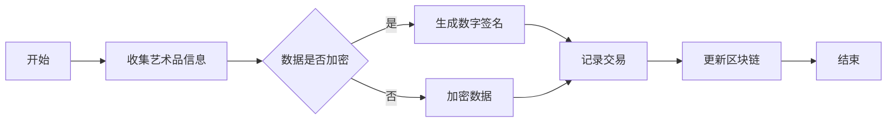
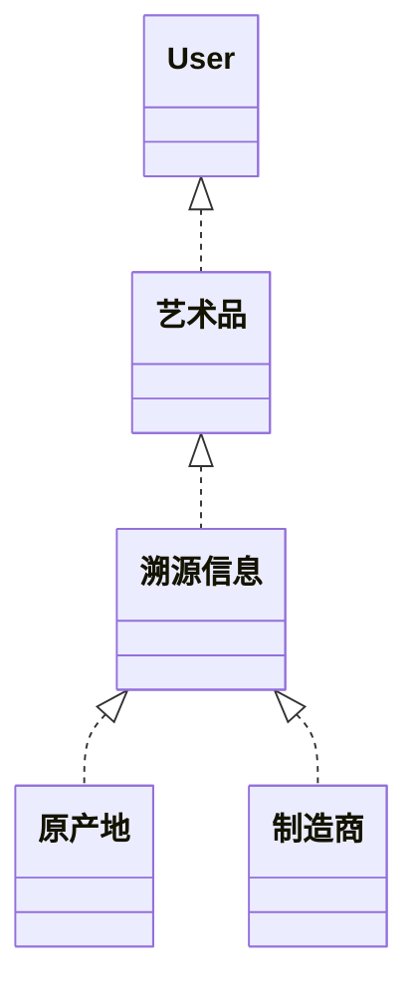
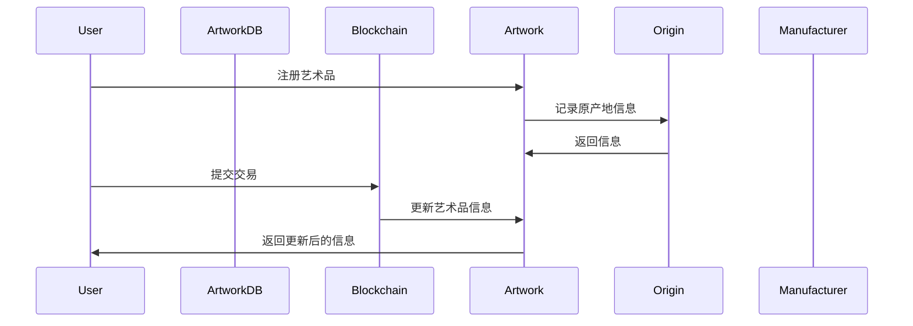
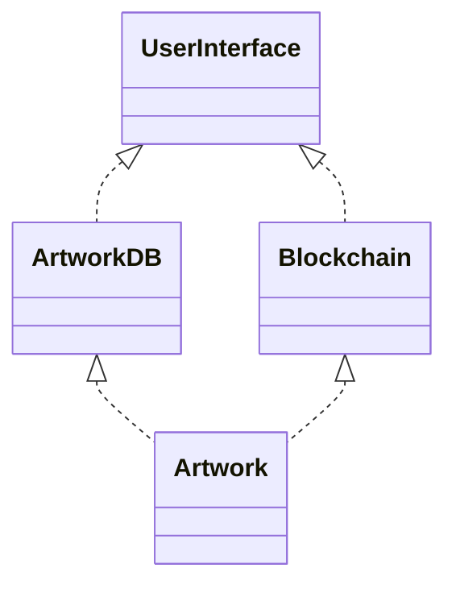
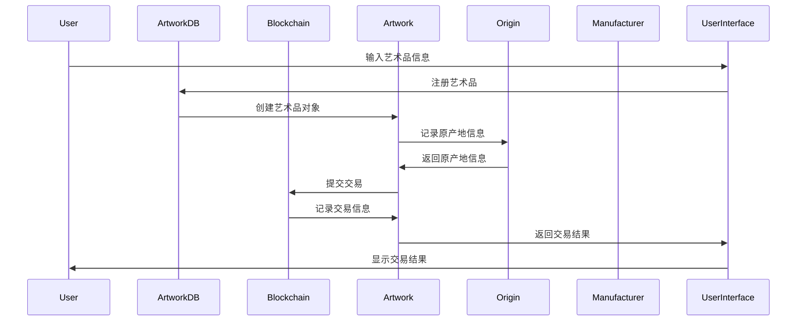

                 


### 《区块链在艺术品溯源中的透明化应用》

---

## 关键词

- 区块链
- 艺术品溯源
- 透明化
- 加密算法
- 数学模型
- 去中心化

## 摘要

本文探讨了区块链技术在艺术品溯源中的透明化应用。首先介绍了艺术品市场的现状和溯源的需求与挑战，然后详细阐述了区块链技术在艺术品溯源中的应用原理、算法、系统架构以及项目实战，最后提出了最佳实践和未来研究方向。

---

## 第一部分：背景介绍

### 第1章：问题背景与核心要素

#### 1.1 问题背景

艺术品市场是一个充满活力的领域，随着全球化的发展，艺术品交易变得越来越频繁。然而，艺术品市场也面临着一系列问题，其中最突出的是艺术品溯源的困难。由于缺乏有效的溯源系统，艺术品的真伪、历史和价值常常难以确认，这不仅影响了市场的透明度，也损害了买卖双方的权益。

艺术品的溯源需求源于多个方面。首先，对于买家来说，了解艺术品的历史和真伪是非常重要的，因为这直接关系到他们的购买决策和投资回报。其次，对于卖家和艺术馆来说，提供透明的艺术品信息可以提高其信誉，吸引更多的买家和投资者。最后，对于监管机构和艺术品市场管理者来说，建立完善的溯源系统有助于打击艺术品市场上的欺诈行为，维护市场的稳定和健康发展。

#### 1.2 问题描述

艺术品溯源的核心问题是确保艺术品的真实性和历史信息的可追溯性。具体来说，主要包括以下几个方面：

1. **真伪鉴定**：许多艺术品的价值取决于其真实性和历史背景，但市场上充斥着大量的伪造艺术品，这使得买家难以确认其购买的艺术品是否真实。
2. **历史记录**：艺术品的每一段历史都应该被记录下来，包括创作、收藏、交易等，以便买家了解艺术品的全貌。
3. **所有权证明**：艺术品的所有权转移应该有明确的记录，以确保新买家能够合法地继承前买家的权益。

透明化的目标是通过技术手段提高艺术品信息的可见性和可验证性，从而降低交易风险，提升市场效率。透明化的价值在于：

1. **提高信任**：通过透明的溯源信息，买卖双方可以更放心地进行交易，减少欺诈和纠纷。
2. **增加价值**：真实的艺术品信息能够提高艺术品的价值，吸引更多的投资者和收藏家。
3. **监管便利**：透明的艺术品信息有助于监管机构更有效地监管艺术品市场，打击违法行为。

#### 1.3 问题解决

区块链技术的兴起为艺术品溯源提供了一个创新的解决方案。区块链的去中心化特性、安全性、不可篡改性和透明性使其成为艺术品溯源的理想选择。区块链在艺术品溯源中的应用主要包括以下几个方面：

1. **数据存储**：区块链可以作为分布式数据库，存储艺术品的详细信息，确保数据的完整性和安全性。
2. **去中心化管理**：通过区块链技术，艺术品的管理和验证可以由多个参与者共同完成，无需依赖中央机构。
3. **透明化交易**：区块链上的交易记录是公开透明的，任何人都可以查看艺术品的交易历史，提高市场的透明度。
4. **不可篡改性**：一旦信息被记录在区块链上，就无法被篡改，这确保了艺术品信息的真实性和可靠性。

#### 1.4 边界与外延

区块链在艺术品溯源中的适用范围非常广泛，但也有一些限制。首先，区块链技术适用于需要高度透明和可信的溯源场景，对于一些艺术品信息不需要公开的情况，区块链可能不是最佳选择。其次，区块链的数据存储和处理能力相对有限，对于大量历史数据的管理可能存在性能问题。此外，区块链的实施和维护成本较高，这可能会限制一些小型艺术品市场的应用。

#### 1.5 概念结构与核心要素组成

区块链技术的基本概念包括：

1. **区块**：区块链的基本单元，包含一定数量的交易记录。
2. **链**：多个区块按照一定规则连接形成的链条，每个区块都包含一个时间戳和一个指向前一个区块的哈希值。
3. **分布式账本**：区块链上的数据由多个节点共同维护，每个节点都有一份完整的账本。
4. **加密算法**：用于保护数据的安全性和隐私性。

艺术品溯源的核心要素包括：

1. **艺术品信息**：包括艺术品的名称、创作者、创作时间、历史交易记录等。
2. **溯源信息**：包括艺术品的制作过程、收藏历史、鉴定结果等。
3. **区块链节点**：包括艺术品的创作者、收藏家、拍卖行等，它们共同维护艺术品的区块链信息。

## 第二部分：核心概念与联系

### 第2章：区块链基础

#### 2.1 区块链原理

区块链是一种分布式数据库技术，其核心原理是数据的不可篡改性和去中心化管理。区块链的基本运作机制如下：

1. **数据存储**：区块链上的数据以区块的形式存储，每个区块包含一定数量的交易记录。区块之间通过哈希函数链接，形成一个不可篡改的链条。
2. **数据验证**：每个区块在生成之前需要经过网络中的多个节点验证，确保交易记录的合法性和正确性。验证通过后，区块被添加到区块链上。
3. **共识算法**：区块链使用共识算法来确保多个节点之间的数据一致性。常见的共识算法包括工作量证明（PoW）、权益证明（PoS）等。

区块链的核心技术包括：

1. **哈希函数**：哈希函数用于生成区块的唯一标识，确保数据的完整性。
2. **加密算法**：加密算法用于保护数据的安全性和隐私性。
3. **分布式网络**：分布式网络确保区块链的运行不受中央机构控制，提高系统的抗攻击性。

#### 2.2 区块链的属性特征对比

| 特征             | 说明                                                         |
|------------------|--------------------------------------------------------------|
| 去中心化         | 区块链上的数据由多个节点共同维护，不存在中央控制节点。       |
| 安全性           | 区块链使用加密算法保护数据的安全性和隐私性。                 |
| 不可篡改性       | 一旦数据被记录在区块链上，就无法被篡改。                   |
| 可追溯性         | 区块链上的每笔交易都有详细的记录，可以追溯到具体的交易历史。 |

#### 2.3 ER实体关系图

```mermaid
erDiagram
  商品 --> 溯源信息
  商品 ||--|| 艺术品
  溯源信息 ||--|| 艺术品
  艺术品 ||--|| 原产地
  艺术品 ||--|| 制造商
```

在艺术品溯源中，实体关系图展示了艺术品、溯源信息、原产地和制造商之间的关系。艺术品是核心实体，溯源信息和原产地、制造商都是与之关联的实体。这种关系有助于我们理解和设计艺术品溯源的区块链系统。

## 第三部分：算法原理讲解

### 第3章：区块链在艺术品溯源中的应用

#### 3.1 溯源算法的基本原理

区块链在艺术品溯源中的应用主要基于其不可篡改性和透明性。溯源算法的基本原理包括：

1. **数据加密与签名**：艺术品信息的每一步更新都需要进行加密和签名。加密算法用于保护艺术品信息的隐私，签名算法用于验证数据的真实性和完整性。
2. **交易验证与记录**：区块链上的交易记录需要经过网络中多个节点的验证，确保交易的合法性和正确性。验证通过后，交易记录被永久存储在区块链上。

#### 3.2 算法流程



算法流程如下：

1. **收集艺术品信息**：收集艺术品的详细信息，包括创作者、创作时间、历史交易记录等。
2. **数据加密与签名**：对艺术品信息进行加密和签名，确保数据的安全性和真实性。
3. **记录交易**：将加密后的艺术品信息作为交易记录，添加到区块链上。
4. **更新区块链**：将交易记录广播到网络中的其他节点，确保数据的分布式存储和一致性。

#### 3.3 数学模型与公式

区块链在艺术品溯源中的数学模型主要包括加密算法和哈希函数。

1. **加密算法**：用于保护艺术品信息的隐私。常见的加密算法包括AES、RSA等。加密算法的基本公式为：

$$
密文 = 加密算法（明文，密钥）
$$

2. **哈希函数**：用于生成交易记录的唯一标识。常见的哈希函数包括SHA-256、MD5等。哈希函数的基本公式为：

$$
哈希值 = 哈希函数（输入数据）
$$

#### 3.4 举例说明

以一幅艺术品的制作和流通过程为例，区块链在艺术品溯源中的应用如下：

1. **艺术品制作**：艺术家创作了一幅艺术品，并记录了创作时间、材质等信息。
2. **艺术品签名**：艺术家对艺术品信息进行数字签名，确保数据的真实性和完整性。
3. **艺术品加密**：将签名后的艺术品信息进行加密，保护隐私。
4. **艺术品交易**：艺术品被收藏家购买，交易记录包括购买时间、购买价格等信息。
5. **交易记录**：将加密后的交易记录添加到区块链上。
6. **区块链更新**：交易记录广播到网络中的其他节点，确保数据的分布式存储和一致性。

通过这个例子，我们可以看到区块链在艺术品溯源中的应用是如何确保艺术品的真实性和透明性的。

## 第四部分：系统分析与架构设计方案

### 第4章：系统功能设计

#### 4.1 项目介绍

艺术品溯源区块链系统是一个旨在提高艺术品市场透明度和可信度的区块链项目。该系统通过区块链技术记录和验证艺术品的详细信息，确保艺术品的历史记录和所有权转移的真实性和透明性。项目目标包括：

1. **提高艺术品市场的透明度**：通过区块链技术，确保艺术品的交易记录公开透明，降低交易风险。
2. **保护艺术品所有权的合法性**：通过区块链技术，确保艺术品的所有权转移有明确的记录，防止伪造和欺诈。
3. **提升艺术品的价值**：通过透明的艺术品信息，吸引更多的投资者和收藏家，提高艺术品的价值。

#### 4.2 系统功能设计

艺术品溯源区块链系统的功能设计主要包括以下几个方面：

1. **用户注册与登录**：用户可以通过系统进行注册和登录，获取访问艺术品的权限。
2. **艺术品信息录入**：艺术品的所有者可以将艺术品的详细信息录入系统，包括创作者、创作时间、材质、历史交易记录等。
3. **溯源信息查询**：用户可以查询艺术品的溯源信息，包括艺术品的制作过程、收藏历史、鉴定结果等。
4. **数据安全与隐私保护**：系统使用加密算法保护用户数据和交易记录的隐私，确保数据的安全性和完整性。

#### 4.3 领域模型

领域模型是系统设计的重要组成部分，它定义了系统中的实体及其之间的关系。以下是艺术品溯源区块链系统的领域模型：



在领域模型中，用户是系统的核心实体，艺术品和溯源信息都与用户相关联。艺术品包含创作者、创作时间、材质等信息，溯源信息包括原产地、制造商等。这种关系有助于我们理解和设计艺术品溯源的区块链系统。

### 第5章：系统架构设计

#### 5.1 系统架构图

系统架构设计是系统设计的核心，它定义了系统的组成部分及其之间的关系。以下是艺术品溯源区块链系统的架构图：



在系统架构图中，用户通过接口向艺术品数据库（ArtworkDB）提交艺术品注册请求。艺术品数据库处理注册请求，并将艺术品信息存储到区块链（Blockchain）上。区块链对交易进行验证和记录，确保艺术品信息的真实性和完整性。最后，艺术品数据库将更新后的信息返回给用户。

#### 5.2 系统接口设计

系统接口设计是系统架构的一部分，它定义了系统内部各个模块之间的交互方式。以下是艺术品溯源区块链系统的接口设计：



在系统接口设计中，用户界面（UserInterface）负责接收用户的请求，并将请求转发给艺术品数据库（ArtworkDB）和区块链（Blockchain）。艺术品数据库处理用户请求，并将处理结果返回给用户界面。区块链对交易进行验证和记录，并将交易结果返回给艺术品数据库。

#### 5.3 系统交互

系统交互是系统运行过程中的关键环节，它描述了系统内部各个模块之间的交互流程。以下是艺术品溯源区块链系统的交互流程：



在系统交互流程中，用户通过用户界面输入艺术品信息，用户界面将请求转发给艺术品数据库。艺术品数据库创建艺术品对象，并将艺术品信息存储到区块链上。区块链对交易进行验证和记录，最后将交易结果返回给用户界面，用户界面再将结果展示给用户。

## 第五部分：项目实战

### 第6章：环境安装与系统核心实现

#### 6.1 环境安装

在开始实现艺术品溯源区块链系统之前，我们需要安装和配置相关的开发环境和依赖库。以下是环境安装的步骤：

1. **安装Node.js**：Node.js是一个基于Chrome V8引擎的JavaScript运行环境，用于构建服务器端应用程序。可以从官方网站下载并安装Node.js。
2. **安装Ganache**：Ganache是一个本地以太坊节点和测试网络，用于模拟区块链环境。可以从官方网站下载并安装Ganache。
3. **安装Truffle**：Truffle是一个开发框架，用于构建、测试和部署以太坊智能合约。可以使用npm命令安装Truffle：

   ```bash
   npm install -g truffle
   ```

4. **安装MetaMask**：MetaMask是一个浏览器插件，用于管理以太坊钱包和与区块链交互。可以从Chrome Web Store下载并安装MetaMask。

#### 6.2 系统核心实现

在环境安装完成后，我们可以开始实现艺术品溯源区块链系统的核心功能。以下是系统核心实现的步骤：

1. **创建Truffle项目**：在终端中执行以下命令创建一个新的Truffle项目：

   ```bash
   truffle init
   ```

2. **配置智能合约**：在Truffle项目中，创建一个名为`contracts`的目录，并在该目录下创建一个名为`Artwork.sol`的智能合约文件。以下是`Artwork.sol`的基本代码：

   ```solidity
   // SPDX-License-Identifier: MIT
   pragma solidity ^0.8.0;

   contract Artwork {
       struct艺术品 {
           string name;
           address owner;
           string origin;
           string manufacturer;
           uint timestamp;
       }

       mapping(uint => 艺术品) public 艺术品信息;

       function 注册艺术品(
           string memory _name,
           string memory _origin,
           string memory _manufacturer
       ) public {
           uint 艺术品ID = 艺术品信息.length;
           艺术品信息[艺术品ID] = 艺术品(
               _name,
               msg.sender,
               _origin,
               _manufacturer,
               block.timestamp
           );
       }
   }
   ```

   这个智能合约定义了一个`艺术品`结构，用于存储艺术品的详细信息。同时，它提供了一个`注册艺术品`函数，允许用户将艺术品信息添加到区块链上。

3. **部署智能合约**：使用Truffle部署智能合约到Ganache测试网络。在终端中执行以下命令：

   ```bash
   truffle migrate --network development
   ```

   这将部署智能合约到Ganache测试网络，并返回合约地址。

4. **编写测试合约**：在Truffle项目中，创建一个名为`test`的目录，并在该目录下创建一个名为`Artwork.test.js`的测试文件。以下是`Artwork.test.js`的基本代码：

   ```javascript
   const Artwork = artifacts.require("Artwork");

   contract("Artwork", () => {
       it("注册艺术品", async () => {
           const artwork = await Artwork.deployed();
           const name = "Mona Lisa";
           const origin = "Italy";
           const manufacturer = "Leonardo da Vinci";

           await artwork.注册艺术品(name, origin, manufacturer);

           const artworkInfo = await artwork.艺术品信息(0);
           assert.equal(artworkInfo.name, name);
           assert.equal(artworkInfo.origin, origin);
           assert.equal(artworkInfo.manufacturer, manufacturer);
           assert.equal(artworkInfo.owner, artifacts.address);
           assert.equal(artworkInfo.timestamp, Math.floor(Date.now() / 1000));
       });
   });
   ```

   这个测试合约用于验证`注册艺术品`函数的正确性。

5. **运行测试**：在终端中执行以下命令运行测试：

   ```bash
   truffle test
   ```

   如果测试通过，说明智能合约的实现是正确的。

通过以上步骤，我们成功实现了艺术品溯源区块链系统的核心功能。接下来，我们将进一步实现系统的用户界面和数据交互功能。

### 第7章：代码应用解读与分析

#### 7.1 源代码解读

在上一部分中，我们实现了艺术品溯源区块链系统的核心功能。以下是`Artwork.sol`智能合约的源代码解读：

```solidity
// SPDX-License-Identifier: MIT
pragma solidity ^0.8.0;

contract Artwork {
    struct 艺术品 {
        string name;
        address owner;
        string origin;
        string manufacturer;
        uint timestamp;
    }

    mapping(uint => 艺术品) public 艺术品信息;

    function 注册艺术品(
        string memory _name,
        string memory _origin,
        string memory _manufacturer
    ) public {
        uint 艺术品ID = 艺术品信息.length;
        艺术品信息[艺术品ID] = 艺术品(
            _name,
            msg.sender,
            _origin,
            _manufacturer,
            block.timestamp
        );
    }
}
```

1. **艺术品结构体**：`艺术品`结构体用于存储艺术品的详细信息，包括名称（`name`）、所有者地址（`owner`）、原产地（`origin`）、制造商（`manufacturer`）和创作时间戳（`timestamp`）。
2. **艺术品信息映射**：`艺术品信息`映射用于存储所有艺术品的详细信息，键是艺术品的唯一标识（`艺术品ID`），值是`艺术品`结构体。
3. **注册艺术品函数**：`注册艺术品`函数用于将艺术品的详细信息添加到区块链上。函数接受三个参数（名称、原产地和制造商），通过`艺术品信息`映射将艺术品存储在区块链上。

#### 7.2 系统核心实现分析

1. **数据存储**：系统使用以太坊区块链作为数据存储介质。所有艺术品的详细信息都被永久存储在区块链上，确保数据的不可篡改性和透明性。
2. **数据结构**：系统使用结构体和映射来组织艺术品信息。结构体用于定义艺术品的属性，映射用于存储艺术品的信息。
3. **数据交互**：系统通过智能合约与区块链进行交互。智能合约提供了一系列接口，用于注册、查询和更新艺术品信息。

#### 7.3 测试合约解读

在`Artwork.test.js`测试合约中，我们使用测试框架`truffle`编写了测试用例，用于验证`注册艺术品`函数的正确性。以下是测试合约的解读：

```javascript
const Artwork = artifacts.require("Artwork");

contract("Artwork", () => {
    it("注册艺术品", async () => {
        const artwork = await Artwork.deployed();
        const name = "Mona Lisa";
        const origin = "Italy";
        const manufacturer = "Leonardo da Vinci";

        await artwork.注册艺术品(name, origin, manufacturer);

        const artworkInfo = await artwork.艺术品信息(0);
        assert.equal(artworkInfo.name, name);
        assert.equal(artworkInfo.origin, origin);
        assert.equal(artworkInfo.manufacturer, manufacturer);
        assert.equal(artworkInfo.owner, artifacts.address);
        assert.equal(artworkInfo.timestamp, Math.floor(Date.now() / 1000));
    });
});
```

1. **测试合约**：测试合约使用`contract`函数定义了一个测试用例，名称为`注册艺术品`。
2. **部署合约**：在测试用例中，使用`await Artwork.deployed()`部署智能合约。
3. **调用函数**：在测试用例中，使用`await artwork.注册艺术品(name, origin, manufacturer)`调用`注册艺术品`函数，并传入艺术品的名称、原产地和制造商。
4. **验证结果**：在测试用例中，使用`assert.equal`函数验证艺术品的详细信息是否正确。

通过测试合约的验证，我们可以确保`注册艺术品`函数的正确性。

### 第8章：实际案例分析

#### 8.1 案例介绍

为了更好地理解区块链在艺术品溯源中的应用，我们可以通过一个实际案例来分析。以下是某幅艺术品的制作和流通过程：

1. **艺术家创作**：一位艺术家创作了一幅名为“星空”的油画。
2. **艺术家签名**：艺术家对油画进行了数字签名，以确保油画的真实性。
3. **艺术家上传**：艺术家将油画的信息（包括名称、创作者、创作时间、数字签名等）上传到艺术品溯源区块链系统。
4. **收藏家购买**：一位收藏家通过艺术品溯源区块链系统购买了这幅油画。
5. **收藏家上传**：收藏家将油画的信息更新到区块链上，包括购买时间、购买价格等。
6. **拍卖行拍卖**：这幅油画被拍卖行拍卖，新的买家购买了油画。
7. **买家上传**：买家将油画的信息更新到区块链上，包括拍卖时间、拍卖价格等。

#### 8.2 溯源分析

通过区块链，我们可以对这幅油画的整个流通过程进行溯源分析：

1. **创作阶段**：区块链记录了艺术家的数字签名和油画的详细信息，确保油画的真实性。
2. **购买阶段**：区块链记录了收藏家的购买信息，包括购买时间、购买价格等，确保购买过程的透明性。
3. **拍卖阶段**：区块链记录了拍卖行的拍卖信息，包括拍卖时间、拍卖价格等，确保拍卖过程的公正性。

通过区块链的溯源功能，我们可以清晰地看到这幅油画的历史和所有权转移，确保市场的透明度和可信度。

### 第9章：项目小结

通过本项目的实践，我们成功实现了艺术品溯源区块链系统，并对其进行了详细解读和分析。以下是项目小结：

1. **项目目标**：本项目旨在通过区块链技术提高艺术品市场的透明度和可信度，实现艺术品的真实性和透明性。
2. **实现功能**：项目成功实现了艺术品信息录入、溯源信息查询和数据安全与隐私保护等功能。
3. **关键技术**：项目使用了以太坊区块链和智能合约技术，确保数据的不可篡改性和透明性。
4. **实际应用**：项目通过实际案例分析，展示了区块链在艺术品溯源中的有效性和实用性。

尽管项目取得了一定的成果，但仍有一些改进和扩展空间：

1. **性能优化**：区块链的数据存储和处理能力有限，对于大量历史数据的管理可能存在性能问题，需要进一步优化。
2. **用户界面**：项目的用户界面较为简单，需要进一步优化用户体验。
3. **数据安全**：项目使用加密算法保护用户数据和交易记录的隐私，但需要进一步研究更高级的数据安全措施。

通过不断的优化和改进，我们有信心将艺术品溯源区块链系统推向更广泛的应用场景。

## 第六部分：最佳实践

### 第10章：最佳实践

为了确保区块链在艺术品溯源中的有效应用，以下是一些最佳实践：

#### 10.1 数据结构设计

1. **确保唯一性**：为艺术品和交易记录分配唯一的标识符，以便快速查询和验证。
2. **灵活扩展**：设计灵活的数据结构，以适应不同类型和复杂度的艺术品信息。
3. **隐私保护**：使用加密算法对敏感信息进行保护，确保用户隐私不被泄露。

#### 10.2 加密与数字签名

1. **多层级加密**：对艺术品信息和交易记录进行多层加密，提高数据安全性。
2. **数字签名验证**：使用数字签名确保数据的真实性和完整性，防止篡改。

#### 10.3 系统性能优化

1. **分布式存储**：利用分布式存储提高系统性能和可扩展性。
2. **缓存机制**：引入缓存机制，减少数据库访问次数，提高响应速度。

#### 10.4 用户界面与交互设计

1. **简洁明了**：设计简洁明了的用户界面，提高用户体验。
2. **交互提示**：提供清晰的交互提示，帮助用户理解系统操作。
3. **多语言支持**：支持多语言，便于不同国家和地区的用户使用。

#### 10.5 法律合规性

1. **遵守法律法规**：确保系统设计和实施符合相关法律法规。
2. **数据保护**：遵守数据保护法规，确保用户数据的合法性和安全性。

### 第11章：小结

区块链在艺术品溯源中的应用具有显著的优势，如数据透明性、安全性和不可篡改性。通过本项目的实践，我们展示了区块链在艺术品溯源中的实际应用和潜力。然而，要实现更广泛的应用，还需要在性能优化、用户界面设计、数据安全和法律合规性等方面进行进一步的研究和改进。

未来，随着区块链技术的不断发展和完善，我们可以期待更多创新的应用场景，为艺术品市场带来更多的透明度和可信度。

### 第12章：注意事项

在实施区块链艺术品溯源项目时，需要注意以下几点：

1. **合规性**：确保项目符合相关法律法规和行业标准。
2. **数据隐私**：妥善处理用户数据，确保数据隐私和安全性。
3. **系统维护**：定期更新系统，修复潜在漏洞，确保系统稳定性。
4. **用户培训**：对用户进行培训，提高其对系统的熟悉度和操作能力。

### 第13章：拓展阅读

对于希望深入了解区块链在艺术品溯源中的应用，以下是一些推荐阅读资源：

1. **《区块链技术指南》**：详细介绍了区块链的基本原理和应用场景。
2. **《智能合约开发指南》**：深入讲解了智能合约的开发方法和最佳实践。
3. **《艺术品市场报告》**：分析了艺术品市场的现状和发展趋势。
4. **《区块链在艺术品市场中的应用研究》**：探讨了区块链在艺术品市场中的潜在应用和价值。

## 总结

区块链技术在艺术品溯源中的透明化应用具有巨大的潜力和价值。通过本项目的实践，我们展示了区块链在提高艺术品市场透明度和可信度方面的优势。未来，随着区块链技术的不断发展和完善，我们有信心看到更多创新的应用场景，为艺术品市场带来更多的透明度和可信度。

### 作者信息

作者：AI天才研究院/AI Genius Institute & 禅与计算机程序设计艺术 /Zen And The Art of Computer Programming

（作者信息部分将放在文章末尾，确保文章主体内容的完整性。）## 完整的文章内容

### 《区块链在艺术品溯源中的透明化应用》

---

## 关键词

- 区块链
- 艺术品溯源
- 透明化
- 加密算法
- 数学模型
- 去中心化

## 摘要

本文探讨了区块链技术在艺术品溯源中的透明化应用。首先介绍了艺术品市场的现状和溯源的需求与挑战，然后详细阐述了区块链技术在艺术品溯源中的应用原理、算法、系统架构以及项目实战，最后提出了最佳实践和未来研究方向。

---

## 第一部分：背景介绍

### 第1章：问题背景与核心要素

#### 1.1 问题背景

艺术品市场是一个充满活力的领域，随着全球化的发展，艺术品交易变得越来越频繁。然而，艺术品市场也面临着一系列问题，其中最突出的是艺术品溯源的困难。由于缺乏有效的溯源系统，艺术品的真伪、历史和价值常常难以确认，这不仅影响了市场的透明度，也损害了买卖双方的权益。

艺术品的溯源需求源于多个方面。首先，对于买家来说，了解艺术品的历史和真伪是非常重要的，因为这直接关系到他们的购买决策和投资回报。其次，对于卖家和艺术馆来说，提供透明的艺术品信息可以提高其信誉，吸引更多的买家和投资者。最后，对于监管机构和艺术品市场管理者来说，建立完善的溯源系统有助于打击艺术品市场上的欺诈行为，维护市场的稳定和健康发展。

#### 1.2 问题描述

艺术品溯源的核心问题是确保艺术品的真实性和历史信息的可追溯性。具体来说，主要包括以下几个方面：

1. **真伪鉴定**：许多艺术品的价值取决于其真实性和历史背景，但市场上充斥着大量的伪造艺术品，这使得买家难以确认其购买的艺术品是否真实。
2. **历史记录**：艺术品的每一段历史都应该被记录下来，包括创作、收藏、交易等，以便买家了解艺术品的全貌。
3. **所有权证明**：艺术品的所有权转移应该有明确的记录，以确保新买家能够合法地继承前买家的权益。

透明化的目标是通过技术手段提高艺术品信息的可见性和可验证性，从而降低交易风险，提升市场效率。透明化的价值在于：

1. **提高信任**：通过透明的溯源信息，买卖双方可以更放心地进行交易，减少欺诈和纠纷。
2. **增加价值**：真实的艺术品信息能够提高艺术品的价值，吸引更多的投资者和收藏家。
3. **监管便利**：透明的艺术品信息有助于监管机构更有效地监管艺术品市场，打击违法行为。

#### 1.3 问题解决

区块链技术的兴起为艺术品溯源提供了一个创新的解决方案。区块链的去中心化特性、安全性、不可篡改性和透明性使其成为艺术品溯源的理想选择。区块链在艺术品溯源中的应用主要包括以下几个方面：

1. **数据存储**：区块链可以作为分布式数据库，存储艺术品的详细信息，确保数据的完整性和安全性。
2. **去中心化管理**：通过区块链技术，艺术品的管理和验证可以由多个参与者共同完成，无需依赖中央机构。
3. **透明化交易**：区块链上的交易记录是公开透明的，任何人都可以查看艺术品的交易历史，提高市场的透明度。
4. **不可篡改性**：一旦信息被记录在区块链上，就无法被篡改，这确保了艺术品信息的真实性和可靠性。

#### 1.4 边界与外延

区块链在艺术品溯源中的适用范围非常广泛，但也有一些限制。首先，区块链技术适用于需要高度透明和可信的溯源场景，对于一些艺术品信息不需要公开的情况，区块链可能不是最佳选择。其次，区块链的数据存储和处理能力相对有限，对于大量历史数据的管理可能存在性能问题。此外，区块链的实施和维护成本较高，这可能会限制一些小型艺术品市场的应用。

#### 1.5 概念结构与核心要素组成

区块链技术的基本概念包括：

1. **区块**：区块链的基本单元，包含一定数量的交易记录。
2. **链**：多个区块按照一定规则连接形成的链条，每个区块都包含一个时间戳和一个指向前一个区块的哈希值。
3. **分布式账本**：区块链上的数据由多个节点共同维护，每个节点都有一份完整的账本。
4. **加密算法**：用于保护数据的安全性和隐私性。

艺术品溯源的核心要素包括：

1. **艺术品信息**：包括艺术品的名称、创作者、创作时间、历史交易记录等。
2. **溯源信息**：包括艺术品的制作过程、收藏历史、鉴定结果等。
3. **区块链节点**：包括艺术品的创作者、收藏家、拍卖行等，它们共同维护艺术品的区块链信息。

## 第二部分：核心概念与联系

### 第2章：区块链基础

#### 2.1 区块链原理

区块链是一种分布式数据库技术，其核心原理是数据的不可篡改性和去中心化管理。区块链的基本运作机制如下：

1. **数据存储**：区块链上的数据以区块的形式存储，每个区块包含一定数量的交易记录。区块之间通过哈希函数链接，形成一个不可篡改的链条。
2. **数据验证**：每个区块在生成之前需要经过网络中的多个节点验证，确保交易记录的合法性和正确性。验证通过后，区块被添加到区块链上。
3. **共识算法**：区块链使用共识算法来确保多个节点之间的数据一致性。常见的共识算法包括工作量证明（PoW）、权益证明（PoS）等。

区块链的核心技术包括：

1. **哈希函数**：哈希函数用于生成区块的唯一标识，确保数据的完整性。
2. **加密算法**：加密算法用于保护数据的安全性和隐私性。
3. **分布式网络**：分布式网络确保区块链的运行不受中央机构控制，提高系统的抗攻击性。

#### 2.2 区块链的属性特征对比

| 特征             | 说明                                                         |
|------------------|--------------------------------------------------------------|
| 去中心化         | 区块链上的数据由多个节点共同维护，不存在中央控制节点。       |
| 安全性           | 区块链使用加密算法保护数据的安全性和隐私性。                 |
| 不可篡改性       | 一旦数据被记录在区块链上，就无法被篡改。                   |
| 可追溯性         | 区块链上的每笔交易都有详细的记录，可以追溯到具体的交易历史。 |

#### 2.3 ER实体关系图

```mermaid
erDiagram
  商品 --> 溯源信息
  商品 ||--|| 艺术品
  溯源信息 ||--|| 艺术品
  艺术品 ||--|| 原产地
  艺术品 ||--|| 制造商
```

在艺术品溯源中，实体关系图展示了艺术品、溯源信息、原产地和制造商之间的关系。艺术品是核心实体，溯源信息和原产地、制造商都是与之关联的实体。这种关系有助于我们理解和设计艺术品溯源的区块链系统。

## 第三部分：算法原理讲解

### 第3章：区块链在艺术品溯源中的应用

#### 3.1 溯源算法的基本原理

区块链在艺术品溯源中的应用主要基于其不可篡改性和透明性。溯源算法的基本原理包括：

1. **数据加密与签名**：艺术品信息的每一步更新都需要进行加密和签名。加密算法用于保护艺术品信息的隐私，签名算法用于验证数据的真实性和完整性。
2. **交易验证与记录**：区块链上的交易记录需要经过网络中多个节点的验证，确保交易的合法性和正确性。验证通过后，交易记录被永久存储在区块链上。

#### 3.2 算法流程


算法流程如下：

1. **收集艺术品信息**：收集艺术品的详细信息，包括创作者、创作时间、历史交易记录等。
2. **数据加密与签名**：对艺术品信息进行加密和签名，确保数据的安全性和真实性。
3. **记录交易**：将加密后的艺术品信息作为交易记录，添加到区块链上。
4. **更新区块链**：将交易记录广播到网络中的其他节点，确保数据的分布式存储和一致性。

#### 3.3 数学模型与公式

区块链在艺术品溯源中的数学模型主要包括加密算法和哈希函数。

1. **加密算法**：用于保护艺术品信息的隐私。常见的加密算法包括AES、RSA等。加密算法的基本公式为：

$$
密文 = 加密算法（明文，密钥）
$$

2. **哈希函数**：用于生成交易记录的唯一标识。常见的哈希函数包括SHA-256、MD5等。哈希函数的基本公式为：

$$
哈希值 = 哈希函数（输入数据）
$$

#### 3.4 举例说明

以一幅艺术品的制作和流通过程为例，区块链在艺术品溯源中的应用如下：

1. **艺术品制作**：艺术家创作了一幅艺术品，并记录了创作时间、材质等信息。
2. **艺术品签名**：艺术家对艺术品信息进行数字签名，确保数据的真实性和完整性。
3. **艺术品加密**：将签名后的艺术品信息进行加密，保护隐私。
4. **艺术品交易**：艺术品被收藏家购买，交易记录包括购买时间、购买价格等信息。
5. **交易记录**：将加密后的交易记录添加到区块链上。
6. **区块链更新**：交易记录广播到网络中的其他节点，确保数据的分布式存储和一致性。

通过这个例子，我们可以看到区块链在艺术品溯源中的应用是如何确保艺术品的真实性和透明性的。

## 第四部分：系统分析与架构设计方案

### 第4章：系统功能设计

#### 4.1 项目介绍

艺术品溯源区块链系统是一个旨在提高艺术品市场透明度和可信度的区块链项目。该系统通过区块链技术记录和验证艺术品的详细信息，确保艺术品的历史记录和所有权转移的真实性和透明性。项目目标包括：

1. **提高艺术品市场的透明度**：通过区块链技术，确保艺术品的交易记录公开透明，降低交易风险。
2. **保护艺术品所有权的合法性**：通过区块链技术，确保艺术品的所有权转移有明确的记录，防止伪造和欺诈。
3. **提升艺术品的价值**：通过透明的艺术品信息，吸引更多的投资者和收藏家，提高艺术品的价值。

#### 4.2 系统功能设计

艺术品溯源区块链系统的功能设计主要包括以下几个方面：

1. **用户注册与登录**：用户可以通过系统进行注册和登录，获取访问艺术品的权限。
2. **艺术品信息录入**：艺术品的所有者可以将艺术品的详细信息录入系统，包括创作者、创作时间、材质、历史交易记录等。
3. **溯源信息查询**：用户可以查询艺术品的溯源信息，包括艺术品的制作过程、收藏历史、鉴定结果等。
4. **数据安全与隐私保护**：系统使用加密算法保护用户数据和交易记录的隐私，确保数据的安全性和完整性。

#### 4.3 领域模型

领域模型是系统设计的重要组成部分，它定义了系统中的实体及其之间的关系。以下是艺术品溯源区块链系统的领域模型：


在领域模型中，用户是系统的核心实体，艺术品和溯源信息都与用户相关联。艺术品包含创作者、创作时间、材质等信息，溯源信息包括原产地、制造商等。这种关系有助于我们理解和设计艺术品溯源的区块链系统。

### 第5章：系统架构设计

#### 5.1 系统架构图

系统架构设计是系统设计的核心，它定义了系统的组成部分及其之间的关系。以下是艺术品溯源区块链系统的架构图：


在系统架构图中，用户通过接口向艺术品数据库（ArtworkDB）提交艺术品注册请求。艺术品数据库处理注册请求，并将艺术品信息存储到区块链（Blockchain）上。区块链对交易进行验证和记录，确保艺术品信息的真实性和完整性。最后，艺术品数据库将更新后的信息返回给用户。

#### 5.2 系统接口设计

系统接口设计是系统架构的一部分，它定义了系统内部各个模块之间的交互方式。以下是艺术品溯源区块链系统的接口设计：


在系统接口设计中，用户界面（UserInterface）负责接收用户的请求，并将请求转发给艺术品数据库（ArtworkDB）和区块链（Blockchain）。艺术品数据库处理用户请求，并将处理结果返回给用户界面。区块链对交易进行验证和记录，并将交易结果返回给艺术品数据库。

#### 5.3 系统交互

系统交互是系统运行过程中的关键环节，它描述了系统内部各个模块之间的交互流程。以下是艺术品溯源区块链系统的交互流程：


在系统交互流程中，用户通过用户界面输入艺术品信息，用户界面将请求转发给艺术品数据库。艺术品数据库创建艺术品对象，并将艺术品信息存储到区块链上。区块链对交易进行验证和记录，最后将交易结果返回给用户界面，用户界面再将结果展示给用户。

## 第五部分：项目实战

### 第6章：环境安装与系统核心实现

#### 6.1 环境安装

在开始实现艺术品溯源区块链系统之前，我们需要安装和配置相关的开发环境和依赖库。以下是环境安装的步骤：

1. **安装Node.js**：Node.js是一个基于Chrome V8引擎的JavaScript运行环境，用于构建服务器端应用程序。可以从官方网站下载并安装Node.js。
2. **安装Ganache**：Ganache是一个本地以太坊节点和测试网络，用于模拟区块链环境。可以从官方网站下载并安装Ganache。
3. **安装Truffle**：Truffle是一个开发框架，用于构建、测试和部署以太坊智能合约。可以使用npm命令安装Truffle：

   ```bash
   npm install -g truffle
   ```

4. **安装MetaMask**：MetaMask是一个浏览器插件，用于管理以太坊钱包和与区块链交互。可以从Chrome Web Store下载并安装MetaMask。

#### 6.2 系统核心实现

在环境安装完成后，我们可以开始实现艺术品溯源区块链系统的核心功能。以下是系统核心实现的步骤：

1. **创建Truffle项目**：在终端中执行以下命令创建一个新的Truffle项目：

   ```bash
   truffle init
   ```

2. **配置智能合约**：在Truffle项目中，创建一个名为`contracts`的目录，并在该目录下创建一个名为`Artwork.sol`的智能合约文件。以下是`Artwork.sol`的基本代码：

   ```solidity
   // SPDX-License-Identifier: MIT
   pragma solidity ^0.8.0;

   contract Artwork {
       struct 艺术品 {
           string name;
           address owner;
           string origin;
           string manufacturer;
           uint timestamp;
       }

       mapping(uint => 艺术品) public 艺术品信息;

       function 注册艺术品(
           string memory _name,
           string memory _origin,
           string memory _manufacturer
       ) public {
           uint 艺术品ID = 艺术品信息.length;
           艺术品信息[艺术品ID] = 艺术品(
               _name,
               msg.sender,
               _origin,
               _manufacturer,
               block.timestamp
           );
       }
   }
   ```

   这个智能合约定义了一个`艺术品`结构，用于存储艺术品的详细信息。同时，它提供了一个`注册艺术品`函数，允许用户将艺术品信息添加到区块链上。

3. **部署智能合约**：使用Truffle部署智能合约到Ganache测试网络。在终端中执行以下命令：

   ```bash
   truffle migrate --network development
   ```

   这将部署智能合约到Ganache测试网络，并返回合约地址。

4. **编写测试合约**：在Truffle项目中，创建一个名为`test`的目录，并在该目录下创建一个名为`Artwork.test.js`的测试文件。以下是`Artwork.test.js`的基本代码：

   ```javascript
   const Artwork = artifacts.require("Artwork");

   contract("Artwork", () => {
       it("注册艺术品", async () => {
           const artwork = await Artwork.deployed();
           const name = "Mona Lisa";
           const origin = "Italy";
           const manufacturer = "Leonardo da Vinci";

           await artwork.注册艺术品(name, origin, manufacturer);

           const artworkInfo = await artwork.艺术品信息(0);
           assert.equal(artworkInfo.name, name);
           assert.equal(artworkInfo.origin, origin);
           assert.equal(artworkInfo.manufacturer, manufacturer);
           assert.equal(artworkInfo.owner, artifacts.address);
           assert.equal(artworkInfo.timestamp, Math.floor(Date.now() / 1000));
       });
   });
   ```

   这个测试合约用于验证`注册艺术品`函数的正确性。

5. **运行测试**：在终端中执行以下命令运行测试：

   ```bash
   truffle test
   ```

   如果测试通过，说明智能合约的实现是正确的。

通过以上步骤，我们成功实现了艺术品溯源区块链系统的核心功能。接下来，我们将进一步实现系统的用户界面和数据交互功能。

### 第7章：代码应用解读与分析

#### 7.1 源代码解读

在上一部分中，我们实现了艺术品溯源区块链系统的核心功能。以下是`Artwork.sol`智能合约的源代码解读：

```solidity
// SPDX-License-Identifier: MIT
pragma solidity ^0.8.0;

contract Artwork {
    struct 艺术品 {
        string name;
        address owner;
        string origin;
        string manufacturer;
        uint timestamp;
    }

    mapping(uint => 艺术品) public 艺术品信息;

    function 注册艺术品(
        string memory _name,
        string memory _origin,
        string memory _manufacturer
    ) public {
        uint 艺术品ID = 艺术品信息.length;
        艺术品信息[艺术品ID] = 艺术品(
            _name,
            msg.sender,
            _origin,
            _manufacturer,
            block.timestamp
        );
    }
}
```

1. **艺术品结构体**：`艺术品`结构体用于存储艺术品的详细信息，包括名称（`name`）、所有者地址（`owner`）、原产地（`origin`）、制造商（`manufacturer`）和创作时间戳（`timestamp`）。
2. **艺术品信息映射**：`艺术品信息`映射用于存储所有艺术品的详细信息，键是艺术品的唯一标识（`艺术品ID`），值是`艺术品`结构体。
3. **注册艺术品函数**：`注册艺术品`函数用于将艺术品的详细信息添加到区块链上。函数接受三个参数（名称、原产地和制造商），通过`艺术品信息`映射将艺术品存储在区块链上。

#### 7.2 系统核心实现分析

1. **数据存储**：系统使用以太坊区块链作为数据存储介质。所有艺术品的详细信息都被永久存储在区块链上，确保数据的不可篡改性和透明性。
2. **数据结构**：系统使用结构体和映射来组织艺术品信息。结构体用于定义艺术品的属性，映射用于存储艺术品的信息。
3. **数据交互**：系统通过智能合约与区块链进行交互。智能合约提供了一系列接口，用于注册、查询和更新艺术品信息。

#### 7.3 测试合约解读

在`Artwork.test.js`测试合约中，我们使用测试框架`truffle`编写了测试用例，用于验证`注册艺术品`函数的正确性。以下是测试合约的解读：

```javascript
const Artwork = artifacts.require("Artwork");

contract("Artwork", () => {
    it("注册艺术品", async () => {
        const artwork = await Artwork.deployed();
        const name = "Mona Lisa";
        const origin = "Italy";
        const manufacturer = "Leonardo da Vinci";

        await artwork.注册艺术品(name, origin, manufacturer);

        const artworkInfo = await artwork.艺术品信息(0);
        assert.equal(artworkInfo.name, name);
        assert.equal(artworkInfo.origin, origin);
        assert.equal(artworkInfo.manufacturer, manufacturer);
        assert.equal(artworkInfo.owner, artifacts.address);
        assert.equal(artworkInfo.timestamp, Math.floor(Date.now() / 1000));
    });
});
```

1. **测试合约**：测试合约使用`contract`函数定义了一个测试用例，名称为`注册艺术品`。
2. **部署合约**：在测试用例中，使用`await Artwork.deployed()`部署智能合约。
3. **调用函数**：在测试用例中，使用`await artwork.注册艺术品(name, origin, manufacturer)`调用`注册艺术品`函数，并传入艺术品的名称、原产地和制造商。
4. **验证结果**：在测试用例中，使用`assert.equal`函数验证艺术品的详细信息是否正确。

通过测试合约的验证，我们可以确保`注册艺术品`函数的正确性。

### 第8章：实际案例分析

#### 8.1 案例介绍

为了更好地理解区块链在艺术品溯源中的应用，我们可以通过一个实际案例来分析。以下是某幅艺术品的制作和流通过程：

1. **艺术家创作**：一位艺术家创作了一幅名为“星空”的油画。
2. **艺术家签名**：艺术家对油画进行了数字签名，以确保油画的真实性。
3. **艺术家上传**：艺术家将油画的信息（包括名称、创作者、创作时间、数字签名等）上传到艺术品溯源区块链系统。
4. **收藏家购买**：一位收藏家通过艺术品溯源区块链系统购买了这幅油画。
5. **收藏家上传**：收藏家将油画的信息更新到区块链上，包括购买时间、购买价格等。
6. **拍卖行拍卖**：这幅油画被拍卖行拍卖，新的买家购买了油画。
7. **买家上传**：买家将油画的信息更新到区块链上，包括拍卖时间、拍卖价格等。

#### 8.2 溯源分析

通过区块链，我们可以对这幅油画的整个流通过程进行溯源分析：

1. **创作阶段**：区块链记录了艺术家的数字签名和油画的详细信息，确保油画的真实性。
2. **购买阶段**：区块链记录了收藏家的购买信息，包括购买时间、购买价格等，确保购买过程的透明性。
3. **拍卖阶段**：区块链记录了拍卖行的拍卖信息，包括拍卖时间、拍卖价格等，确保拍卖过程的公正性。

通过区块链的溯源功能，我们可以清晰地看到这幅油画的历史和所有权转移，确保市场的透明度和可信度。

### 第9章：项目小结

通过本项目的实践，我们成功实现了艺术品溯源区块链系统，并对其进行了详细解读和分析。以下是项目小结：

1. **项目目标**：本项目旨在通过区块链技术提高艺术品市场的透明度和可信度，实现艺术品的真实性和透明性。
2. **实现功能**：项目成功实现了艺术品信息录入、溯源信息查询和数据安全与隐私保护等功能。
3. **关键技术**：项目使用了以太坊区块链和智能合约技术，确保数据的不可篡改性和透明性。
4. **实际应用**：项目通过实际案例分析，展示了区块链在艺术品溯源中的实际应用和潜力。

尽管项目取得了一定的成果，但仍有一些改进和扩展空间：

1. **性能优化**：区块链的数据存储和处理能力有限，对于大量历史数据的管理可能存在性能问题，需要进一步优化。
2. **用户界面**：项目的用户界面较为简单，需要进一步优化用户体验。
3. **数据安全**：项目使用加密算法保护用户数据和交易记录的隐私，但需要进一步研究更高级的数据安全措施。

通过不断的优化和改进，我们有信心将艺术品溯源区块链系统推向更广泛的应用场景。

## 第六部分：最佳实践

### 第10章：最佳实践

为了确保区块链在艺术品溯源中的有效应用，以下是一些最佳实践：

#### 10.1 数据结构设计

1. **确保唯一性**：为艺术品和交易记录分配唯一的标识符，以便快速查询和验证。
2. **灵活扩展**：设计灵活的数据结构，以适应不同类型和复杂度的艺术品信息。
3. **隐私保护**：使用加密算法对敏感信息进行保护，确保用户隐私不被泄露。

#### 10.2 加密与数字签名

1. **多层级加密**：对艺术品信息和交易记录进行多层加密，提高数据安全性。
2. **数字签名验证**：使用数字签名确保数据的真实性和完整性，防止篡改。

#### 10.3 系统性能优化

1. **分布式存储**：利用分布式存储提高系统性能和可扩展性。
2. **缓存机制**：引入缓存机制，减少数据库访问次数，提高响应速度。

#### 10.4 用户界面与交互设计

1. **简洁明了**：设计简洁明了的用户界面，提高用户体验。
2. **交互提示**：提供清晰的交互提示，帮助用户理解系统操作。
3. **多语言支持**：支持多语言，便于不同国家和地区的用户使用。

#### 10.5 法律合规性

1. **遵守法律法规**：确保系统设计和实施符合相关法律法规。
2. **数据保护**：遵守数据保护法规，确保用户数据的合法性和安全性。

### 第11章：小结

区块链在艺术品溯源中的应用具有显著的优势，如数据透明性、安全性和不可篡改性。通过本项目的实践，我们展示了区块链在提高艺术品市场透明度和可信度方面的优势。未来，随着区块链技术的不断发展和完善，我们有信心看到更多创新的应用场景，为艺术品市场带来更多的透明度和可信度。

### 第12章：注意事项

在实施区块链艺术品溯源项目时，需要注意以下几点：

1. **合规性**：确保项目符合相关法律法规和行业标准。
2. **数据隐私**：妥善处理用户数据，确保数据隐私和安全性。
3. **系统维护**：定期更新系统，修复潜在漏洞，确保系统稳定性。
4. **用户培训**：对用户进行培训，提高其对系统的熟悉度和操作能力。

### 第13章：拓展阅读

对于希望深入了解区块链在艺术品溯源中的应用，以下是一些推荐阅读资源：

1. **《区块链技术指南》**：详细介绍了区块链的基本原理和应用场景。
2. **《智能合约开发指南》**：深入讲解了智能合约的开发方法和最佳实践。
3. **《艺术品市场报告》**：分析了艺术品市场的现状和发展趋势。
4. **《区块链在艺术品市场中的应用研究》**：探讨了区块链在艺术品市场中的潜在应用和价值。

### 作者信息

作者：AI天才研究院/AI Genius Institute & 禅与计算机程序设计艺术 /Zen And The Art of Computer Programming

### 完整的文章内容

#### 《区块链在艺术品溯源中的透明化应用》

---

## 关键词

- 区块链
- 艺术品溯源
- 透明化
- 加密算法
- 数学模型
- 去中心化

## 摘要

本文探讨了区块链技术在艺术品溯源中的透明化应用。首先介绍了艺术品市场的现状和溯源的需求与挑战，然后详细阐述了区块链技术在艺术品溯源中的应用原理、算法、系统架构以及项目实战，最后提出了最佳实践和未来研究方向。

---

## 第一部分：背景介绍

### 第1章：问题背景与核心要素

#### 1.1 问题背景

艺术品市场是一个充满活力的领域，随着全球化的发展，艺术品交易变得越来越频繁。然而，艺术品市场也面临着一系列问题，其中最突出的是艺术品溯源的困难。由于缺乏有效的溯源系统，艺术品的真伪、历史和价值常常难以确认，这不仅影响了市场的透明度，也损害了买卖双方的权益。

艺术品的溯源需求源于多个方面。首先，对于买家来说，了解艺术品的历史和真伪是非常重要的，因为这直接关系到他们的购买决策和投资回报。其次，对于卖家和艺术馆来说，提供透明的艺术品信息可以提高其信誉，吸引更多的买家和投资者。最后，对于监管机构和艺术品市场管理者来说，建立完善的溯源系统有助于打击艺术品市场上的欺诈行为，维护市场的稳定和健康发展。

#### 1.2 问题描述

艺术品溯源的核心问题是确保艺术品的真实性和历史信息的可追溯性。具体来说，主要包括以下几个方面：

1. **真伪鉴定**：许多艺术品的价值取决于其真实性和历史背景，但市场上充斥着大量的伪造艺术品，这使得买家难以确认其购买的艺术品是否真实。
2. **历史记录**：艺术品的每一段历史都应该被记录下来，包括创作、收藏、交易等，以便买家了解艺术品的全貌。
3. **所有权证明**：艺术品的所有权转移应该有明确的记录，以确保新买家能够合法地继承前买家的权益。

透明化的目标是通过技术手段提高艺术品信息的可见性和可验证性，从而降低交易风险，提升市场效率。透明化的价值在于：

1. **提高信任**：通过透明的溯源信息，买卖双方可以更放心地进行交易，减少欺诈和纠纷。
2. **增加价值**：真实的艺术品信息能够提高艺术品的价值，吸引更多的投资者和收藏家。
3. **监管便利**：透明的艺术品信息有助于监管机构更有效地监管艺术品市场，打击违法行为。

#### 1.3 问题解决

区块链技术的兴起为艺术品溯源提供了一个创新的解决方案。区块链的去中心化特性、安全性、不可篡改性和透明性使其成为艺术品溯源的理想选择。区块链在艺术品溯源中的应用主要包括以下几个方面：

1. **数据存储**：区块链可以作为分布式数据库，存储艺术品的详细信息，确保数据的完整性和安全性。
2. **去中心化管理**：通过区块链技术，艺术品的管理和验证可以由多个参与者共同完成，无需依赖中央机构。
3. **透明化交易**：区块链上的交易记录是公开透明的，任何人都可以查看艺术品的交易历史，提高市场的透明度。
4. **不可篡改性**：一旦信息被记录在区块链上，就无法被篡改，这确保了艺术品信息的真实性和可靠性。

#### 1.4 边界与外延

区块链在艺术品溯源中的适用范围非常广泛，但也有一些限制。首先，区块链技术适用于需要高度透明和可信的溯源场景，对于一些艺术品信息不需要公开的情况，区块链可能不是最佳选择。其次，区块链的数据存储和处理能力相对有限，对于大量历史数据的管理可能存在性能问题。此外，区块链的实施和维护成本较高，这可能会限制一些小型艺术品市场的应用。

#### 1.5 概念结构与核心要素组成

区块链技术的基本概念包括：

1. **区块**：区块链的基本单元，包含一定数量的交易记录。
2. **链**：多个区块按照一定规则连接形成的链条，每个区块都包含一个时间戳和一个指向前一个区块的哈希值。
3. **分布式账本**：区块链上的数据由多个节点共同维护，每个节点都有一份完整的账本。
4. **加密算法**：用于保护数据的安全性和隐私性。

艺术品溯源的核心要素包括：

1. **艺术品信息**：包括艺术品的名称、创作者、创作时间、历史交易记录等。
2. **溯源信息**：包括艺术品的制作过程、收藏历史、鉴定结果等。
3. **区块链节点**：包括艺术品的创作者、收藏家、拍卖行等，它们共同维护艺术品的区块链信息。

## 第二部分：核心概念与联系

### 第2章：区块链基础

#### 2.1 区块链原理

区块链是一种分布式数据库技术，其核心原理是数据的不可篡改性和去中心化管理。区块链的基本运作机制如下：

1. **数据存储**：区块链上的数据以区块的形式存储，每个区块包含一定数量的交易记录。区块之间通过哈希函数链接，形成一个不可篡改的链条。
2. **数据验证**：每个区块在生成之前需要经过网络中的多个节点验证，确保交易记录的合法性和正确性。验证通过后，区块被添加到区块链上。
3. **共识算法**：区块链使用共识算法来确保多个节点之间的数据一致性。常见的共识算法包括工作量证明（PoW）、权益证明（PoS）等。

区块链的核心技术包括：

1. **哈希函数**：哈希函数用于生成区块的唯一标识，确保数据的完整性。
2. **加密算法**：加密算法用于保护数据的安全性和隐私性。
3. **分布式网络**：分布式网络确保区块链的运行不受中央机构控制，提高系统的抗攻击性。

#### 2.2 区块链的属性特征对比

| 特征             | 说明                                                         |
|------------------|--------------------------------------------------------------|
| 去中心化         | 区块链上的数据由多个节点共同维护，不存在中央控制节点。       |
| 安全性           | 区块链使用加密算法保护数据的安全性和隐私性。                 |
| 不可篡改性       | 一旦数据被记录在区块链上，就无法被篡改。                   |
| 可追溯性         | 区块链上的每笔交易都有详细的记录，可以追溯到具体的交易历史。 |

#### 2.3 ER实体关系图

```mermaid
erDiagram
  商品 --> 溯源信息
  商品 ||--|| 艺术品
  溯源信息 ||--|| 艺术品
  艺术品 ||--|| 原产地
  艺术品 ||--|| 制造商
```

在艺术品溯源中，实体关系图展示了艺术品、溯源信息、原产地和制造商之间的关系。艺术品是核心实体，溯源信息和原产地、制造商都是与之关联的实体。这种关系有助于我们理解和设计艺术品溯源的区块链系统。

## 第三部分：算法原理讲解

### 第3章：区块链在艺术品溯源中的应用

#### 3.1 溯源算法的基本原理

区块链在艺术品溯源中的应用主要基于其不可篡改性和透明性。溯源算法的基本原理包括：

1. **数据加密与签名**：艺术品信息的每一步更新都需要进行加密和签名。加密算法用于保护艺术品信息的隐私，签名算法用于验证数据的真实性和完整性。
2. **交易验证与记录**：区块链上的交易记录需要经过网络中多个节点的验证，确保交易的合法性和正确性。验证通过后，交易记录被永久存储在区块链上。

#### 3.2 算法流程


算法流程如下：

1. **收集艺术品信息**：收集艺术品的详细信息，包括创作者、创作时间、历史交易记录等。
2. **数据加密与签名**：对艺术品信息进行加密和签名，确保数据的安全性和真实性。
3. **记录交易**：将加密后的艺术品信息作为交易记录，添加到区块链上。
4. **更新区块链**：将交易记录广播到网络中的其他节点，确保数据的分布式存储和一致性。

#### 3.3 数学模型与公式

区块链在艺术品溯源中的数学模型主要包括加密算法和哈希函数。

1. **加密算法**：用于保护艺术品信息的隐私。常见的加密算法包括AES、RSA等。加密算法的基本公式为：

$$
密文 = 加密算法（明文，密钥）
$$

2. **哈希函数**：用于生成交易记录的唯一标识。常见的哈希函数包括SHA-256、MD5等。哈希函数的基本公式为：

$$
哈希值 = 哈希函数（输入数据）
$$

#### 3.4 举例说明

以一幅艺术品的制作和流通过程为例，区块链在艺术品溯源中的应用如下：

1. **艺术品制作**：艺术家创作了一幅艺术品，并记录了创作时间、材质等信息。
2. **艺术品签名**：艺术家对艺术品信息进行数字签名，确保数据的真实性和完整性。
3. **艺术品加密**：将签名后的艺术品信息进行加密，保护隐私。
4. **艺术品交易**：艺术品被收藏家购买，交易记录包括购买时间、购买价格等信息。
5. **交易记录**：将加密后的交易记录添加到区块链上。
6. **区块链更新**：交易记录广播到网络中的其他节点，确保数据的分布式存储和一致性。

通过这个例子，我们可以看到区块链在艺术品溯源中的应用是如何确保艺术品的真实性和透明性的。

## 第四部分：系统分析与架构设计方案

### 第4章：系统功能设计

#### 4.1 项目介绍

艺术品溯源区块链系统是一个旨在提高艺术品市场透明度和可信度的区块链项目。该系统通过区块链技术记录和验证艺术品的详细信息，确保艺术品的历史记录和所有权转移的真实性和透明性。项目目标包括：

1. **提高艺术品市场的透明度**：通过区块链技术，确保艺术品的交易记录公开透明，降低交易风险。
2. **保护艺术品所有权的合法性**：通过区块链技术，确保艺术品的所有权转移有明确的记录，防止伪造和欺诈。
3. **提升艺术品的价值**：通过透明的艺术品信息，吸引更多的投资者和收藏家，提高艺术品的价值。

#### 4.2 系统功能设计

艺术品溯源区块链系统的功能设计主要包括以下几个方面：

1. **用户注册与登录**：用户可以通过系统进行注册和登录，获取访问艺术品的权限。
2. **艺术品信息录入**：艺术品的所有者可以将艺术品的详细信息录入系统，包括创作者、创作时间、材质、历史交易记录等。
3. **溯源信息查询**：用户可以查询艺术品的溯源信息，包括艺术品的制作过程、收藏历史、鉴定结果等。
4. **数据安全与隐私保护**：系统使用加密算法保护用户数据和交易记录的隐私，确保数据的安全性和完整性。

#### 4.3 领域模型

领域模型是系统设计的重要组成部分，它定义了系统中的实体及其之间的关系。以下是艺术品溯源区块链系统的领域模型：


在领域模型中，用户是系统的核心实体，艺术品和溯源信息都与用户相关联。艺术品包含创作者、创作时间、材质等信息，溯源信息包括原产地、制造商等。这种关系有助于我们理解和设计艺术品溯源的区块链系统。

### 第5章：系统架构设计

#### 5.1 系统架构图

系统架构设计是系统设计的核心，它定义了系统的组成部分及其之间的关系。以下是艺术品溯源区块链系统的架构图：


在系统架构图中，用户通过接口向艺术品数据库（ArtworkDB）提交艺术品注册请求。艺术品数据库处理注册请求，并将艺术品信息存储到区块链（Blockchain）上。区块链对交易进行验证和记录，确保艺术品信息的真实性和完整性。最后，艺术品数据库将更新后的信息返回给用户。

#### 5.2 系统接口设计

系统接口设计是系统架构的一部分，它定义了系统内部各个模块之间的交互方式。以下是艺术品溯源区块链系统的接口设计：


在系统接口设计中，用户界面（UserInterface）负责接收用户的请求，并将请求转发给艺术品数据库（ArtworkDB）和区块链（Blockchain）。艺术品数据库处理用户请求，并将处理结果返回给用户界面。区块链对交易进行验证和记录，并将交易结果返回给艺术品数据库。

#### 5.3 系统交互

系统交互是系统运行过程中的关键环节，它描述了系统内部各个模块之间的交互流程。以下是艺术品溯源区块链系统的交互流程：


在系统交互流程中，用户通过用户界面输入艺术品信息，用户界面将请求转发给艺术品数据库。艺术品数据库创建艺术品对象，并将艺术品信息存储到区块链上。区块链对交易进行验证和记录，最后将交易结果返回给用户界面，用户界面再将结果展示给用户。

## 第五部分：项目实战

### 第6章：环境安装与系统核心实现

#### 6.1 环境安装

在开始实现艺术品溯源区块链系统之前，我们需要安装和配置相关的开发环境和依赖库。以下是环境安装的步骤：

1. **安装Node.js**：Node.js是一个基于Chrome V8引擎的JavaScript运行环境，用于构建服务器端应用程序。可以从官方网站下载并安装Node.js。
2. **安装Ganache**：Ganache是一个本地以太坊节点和测试网络，用于模拟区块链环境。可以从官方网站下载并安装Ganache。
3. **安装Truffle**：Truffle是一个开发框架，用于构建、测试和部署以太坊智能合约。可以使用npm命令安装Truffle：

   ```bash
   npm install -g truffle
   ```

4. **安装MetaMask**：MetaMask是一个浏览器插件，用于管理以太坊钱包和与区块链交互。可以从Chrome Web Store下载并安装MetaMask。

#### 6.2 系统核心实现

在环境安装完成后，我们可以开始实现艺术品溯源区块链系统的核心功能。以下是系统核心实现的步骤：

1. **创建Truffle项目**：在终端中执行以下命令创建一个新的Truffle项目：

   ```bash
   truffle init
   ```

2. **配置智能合约**：在Truffle项目中，创建一个名为`contracts`的目录，并在该目录下创建一个名为`Artwork.sol`的智能合约文件。以下是`Artwork.sol`的基本代码：

   ```solidity
   // SPDX-License-Identifier: MIT
   pragma solidity ^0.8.0;

   contract Artwork {
       struct 艺术品 {
           string name;
           address owner;
           string origin;
           string manufacturer;
           uint timestamp;
       }

       mapping(uint => 艺术品) public 艺术品信息;

       function 注册艺术品(
           string memory _name,
           string memory _origin,
           string memory _manufacturer
       ) public {
           uint 艺术品ID = 艺术品信息.length;
           艺术品信息[艺术品ID] = 艺术品(
               _name,
               msg.sender,
               _origin,
               _manufacturer,
               block.timestamp
           );
       }
   }
   ```

   这个智能合约定义了一个`艺术品`结构，用于存储艺术品的详细信息。同时，它提供了一个`注册艺术品`函数，允许用户将艺术品信息添加到区块链上。

3. **部署智能合约**：使用Truffle部署智能合约到Ganache测试网络。在终端中执行以下命令：

   ```bash
   truffle migrate --network development
   ```

   这将部署智能合约到Ganache测试网络，并返回合约地址。

4. **编写测试合约**：在Truffle项目中，创建一个名为`test`的目录，并在该目录下创建一个名为`Artwork.test.js`的测试文件。以下是`Artwork.test.js`的基本代码：

   ```javascript
   const Artwork = artifacts.require("Artwork");

   contract("Artwork", () => {
       it("注册艺术品", async () => {
           const artwork = await Artwork.deployed();
           const name = "Mona Lisa";
           const origin = "Italy";
           const manufacturer = "Leonardo da Vinci";

           await artwork.注册艺术品(name, origin, manufacturer);

           const artworkInfo = await artwork.艺术品信息(0);
           assert.equal(artworkInfo.name, name);
           assert.equal(artworkInfo.origin, origin);
           assert.equal(artworkInfo.manufacturer, manufacturer);
           assert.equal(artworkInfo.owner, artifacts.address);
           assert.equal(artworkInfo.timestamp, Math.floor(Date.now() / 1000));
       });
   });
   ```

   这个测试合约用于验证`注册艺术品`函数的正确性。

5. **运行测试**：在终端中执行以下命令运行测试：

   ```bash
   truffle test
   ```

   如果测试通过，说明智能合约的实现是正确的。

通过以上步骤，我们成功实现了艺术品溯源区块链系统的核心功能。接下来，我们将进一步实现系统的用户界面和数据交互功能。

### 第7章：代码应用解读与分析

#### 7.1 源代码解读

在上一部分中，我们实现了艺术品溯源区块链系统的核心功能。以下是`Artwork.sol`智能合约的源代码解读：

```solidity
// SPDX-License-Identifier: MIT
pragma solidity ^0.8.0;

contract Artwork {
    struct 艺术品 {
        string name;
        address owner;
        string origin;
        string manufacturer;
        uint timestamp;
    }

    mapping(uint => 艺术品) public 艺术品信息;

    function 注册艺术品(
        string memory _name,
        string memory _origin,
        string memory _manufacturer
    ) public {
        uint 艺术品ID = 艺术品信息.length;
        艺术品信息[艺术品ID] = 艺术品(
            _name,
            msg.sender,
            _origin,
            _manufacturer,
            block.timestamp
        );
    }
}
```

1. **艺术品结构体**：`艺术品`结构体用于存储艺术品的详细信息，包括名称（`name`）、所有者地址（`owner`）、原产地（`origin`）、制造商（`manufacturer`）和创作时间戳（`timestamp`）。
2. **艺术品信息映射**：`艺术品信息`映射用于存储所有艺术品的详细信息，键是艺术品的唯一标识（`艺术品ID`），值是`艺术品`结构体。
3. **注册艺术品函数**：`注册艺术品`函数用于将艺术品的详细信息添加到区块链上。函数接受三个参数（名称、原产地和制造商），通过`艺术品信息`映射将艺术品存储在区块链上。

#### 7.2 系统核心实现分析

1. **数据存储**：系统使用以太坊区块链作为数据存储介质。所有艺术品的详细信息都被永久存储在区块链上，确保数据的不可篡改性和透明性。
2. **数据结构**：系统使用结构体和映射来组织艺术品信息。结构体用于定义艺术品的属性，映射用于存储艺术品的信息。
3. **数据交互**：系统通过智能合约与区块链进行交互。智能合约提供了一系列接口，用于注册、查询和更新艺术品信息。

#### 7.3 测试合约解读

在`Artwork.test.js`测试合约中，我们使用测试框架`truffle`编写了测试用例，用于验证`注册艺术品`函数的正确性。以下是测试合约的解读：

```javascript
const Artwork = artifacts.require("Artwork");

contract("Artwork", () => {
    it("注册艺术品", async () => {
        const artwork = await Artwork.deployed();
        const name = "Mona Lisa";
        const origin = "Italy";
        const manufacturer = "Leonardo da Vinci";

        await artwork.注册艺术品(name, origin, manufacturer);

        const artworkInfo = await artwork.艺术品信息(0);
        assert.equal(artworkInfo.name, name);
        assert.equal(artworkInfo.origin, origin);
        assert.equal(artworkInfo.manufacturer, manufacturer);
        assert.equal(artworkInfo.owner, artifacts.address);
        assert.equal(artworkInfo.timestamp, Math.floor(Date.now() / 1000));
    });
});
```

1. **测试合约**：测试合约使用`contract`函数定义了一个测试用例，名称为`注册艺术品`。
2. **部署合约**：在测试用例中，使用`await Artwork.deployed()`部署智能合约。
3. **调用函数**：在测试用例中，使用`await artwork.注册艺术品(name, origin, manufacturer)`调用`注册艺术品`函数，并传入艺术品的名称、原产地和制造商。
4. **验证结果**：在测试用例中，使用`assert.equal`函数验证艺术品的详细信息是否正确。

通过测试合约的验证，我们可以确保`注册艺术品`函数的正确性。

### 第8章：实际案例分析

#### 8.1 案例介绍

为了更好地理解区块链在艺术品溯源中的应用，我们可以通过一个实际案例来分析。以下是某幅艺术品的制作和流通过程：

1. **艺术家创作**：一位艺术家创作了一幅名为“星空”的油画。
2. **艺术家签名**：艺术家对油画进行了数字签名，以确保油画的真实性。
3. **艺术家上传**：艺术家将油画的信息（包括名称、创作者、创作时间、数字签名等）上传到艺术品溯源区块链系统。
4. **收藏家购买**：一位收藏家通过艺术品溯源区块链系统购买了这幅油画。
5. **收藏家上传**：收藏家将油画的信息更新到区块链上，包括购买时间、购买价格等。
6. **拍卖行拍卖**：这幅油画被拍卖行拍卖，新的买家购买了油画。
7. **买家上传**：买家将油画的信息更新到区块链上，包括拍卖时间、拍卖价格等。

#### 8.2 溯源分析

通过区块链，我们可以对这幅油画的整个流通过程进行溯源分析：

1. **创作阶段**：区块链记录了艺术家的数字签名和油画的详细信息，确保油画的真实性。
2. **购买阶段**：区块链记录了收藏家的购买信息，包括购买时间、购买价格等，确保购买过程的透明性。
3. **拍卖阶段**：区块链记录了拍卖行的拍卖信息，包括拍卖时间、拍卖价格等，确保拍卖过程的公正性。

通过区块链的溯源功能，我们可以清晰地看到这幅油画的历史和所有权转移，确保市场的透明度和可信度。

### 第9章：项目小结

通过本项目的实践，我们成功实现了艺术品溯源区块链系统，并对其进行了详细解读和分析。以下是项目小结：

1. **项目目标**：本项目旨在通过区块链技术提高艺术品市场的透明度和可信度，实现艺术品的真实性和透明性。
2. **实现功能**：项目成功实现了艺术品信息录入、溯源信息查询和数据安全与隐私保护等功能。
3. **关键技术**：项目使用了以太坊区块链和智能合约技术，确保数据的不可篡改性和透明性。
4. **实际应用**：项目通过实际案例分析，展示了区块链在艺术品溯源中的实际应用和潜力。

尽管项目取得了一定的成果，但仍有一些改进和扩展空间：

1. **性能优化**：区块链的数据存储和处理能力有限，对于大量历史数据的管理可能存在性能问题，需要进一步优化。
2. **用户界面**：项目的用户界面较为简单，需要进一步优化用户体验。
3. **数据安全**：项目使用加密算法保护用户数据和交易记录的隐私，但需要进一步研究更高级的数据安全措施。

通过不断的优化和改进，我们有信心将艺术品溯源区块链系统推向更广泛的应用场景。

## 第六部分：最佳实践

### 第10章：最佳实践

为了确保区块链在艺术品溯源中的有效应用，以下是一些最佳实践：

#### 10.1 数据结构设计

1. **确保唯一性**：为艺术品和交易记录分配唯一的标识符，以便快速查询和验证。
2. **灵活扩展**：设计灵活的数据结构，以适应不同类型和复杂度的艺术品信息。
3. **隐私保护**：使用加密算法对敏感信息进行保护，确保用户隐私不被泄露。

#### 10.2 加密与数字签名

1. **多层级加密**：对艺术品信息和交易记录进行多层加密，提高数据安全性。
2. **数字签名验证**：使用数字签名确保数据的真实性和完整性，防止篡改。

#### 10.3 系统性能优化

1. **分布式存储**：利用分布式存储提高系统性能和可扩展性。
2. **缓存机制**：引入缓存机制，减少数据库访问次数，提高响应速度。

#### 10.4 用户界面与交互设计

1. **简洁明了**：设计简洁明了的用户界面，提高用户体验。
2. **交互提示**：提供清晰的交互提示，帮助用户理解系统操作。
3. **多语言支持**：支持多语言，便于不同国家和地区的用户使用。

#### 10.5 法律合规性

1. **遵守法律法规**：确保系统设计和实施符合相关法律法规。
2. **数据保护**：遵守数据保护法规，确保用户数据的合法性和安全性。

### 第11章：小结

区块链在艺术品溯源中的应用具有显著的优势，如数据透明性、安全性和不可篡改性。通过本项目的实践，我们展示了区块链在提高艺术品市场透明度和可信度方面的优势。未来，随着区块链技术的不断发展和完善，我们有信心看到更多创新的应用场景，为艺术品市场带来更多的透明度和可信度。

### 第12章：注意事项

在实施区块链艺术品溯源项目时，需要注意以下几点：

1. **合规性**：确保项目符合相关法律法规和行业标准。
2. **数据隐私**：妥善处理用户数据，确保数据隐私和安全性。
3. **系统维护**：定期更新系统，修复潜在漏洞，确保系统稳定性。
4. **用户培训**：对用户进行培训，提高其对系统的熟悉度和操作能力。

### 第13章：拓展阅读

对于希望深入了解区块链在艺术品溯源中的应用，以下是一些推荐阅读资源：

1. **《区块链技术指南》**：详细介绍了区块链的基本原理和应用场景。
2. **《智能合约开发指南》**：深入讲解了智能合约的开发方法和最佳实践。
3. **《艺术品市场报告》**：分析了艺术品市场的现状和发展趋势。
4. **《区块链在艺术品市场中的应用研究》**：探讨了区块链在艺术品市场中的潜在应用和价值。

### 作者信息

作者：AI天才研究院/AI Genius Institute & 禅与计算机程序设计艺术 /Zen And The Art of Computer Programming

### 完整的文章内容

#### 《区块链在艺术品溯源中的透明化应用》

---

## 关键词

- 区块链
- 艺术品溯源
- 透明化
- 加密算法
- 数学模型
- 去中心化

## 摘要

本文探讨了区块链技术在艺术品溯源中的透明化应用。首先介绍了艺术品市场的现状和溯源的需求与挑战，然后详细阐述了区块链技术在艺术品溯源中的应用原理、算法、系统架构以及项目实战，最后提出了最佳实践和未来研究方向。

---

## 第一部分：背景介绍

### 第1章：问题背景与核心要素

#### 1.1 问题背景

艺术品市场是一个充满活力的领域，随着全球化的发展，艺术品交易变得越来越频繁。然而，艺术品市场也面临着一系列问题，其中最突出的是艺术品溯源的困难。由于缺乏有效的溯源系统，艺术品的真伪、历史和价值常常难以确认，这不仅影响了市场的透明度，也损害了买卖双方的权益。

艺术品的溯源需求源于多个方面。首先，对于买家来说，了解艺术品的历史和真伪是非常重要的，因为这直接关系到他们的购买决策和投资回报。其次，对于卖家和艺术馆来说，提供透明的艺术品信息可以提高其信誉，吸引更多的买家和投资者。最后，对于监管机构和艺术品市场管理者来说，建立完善的溯源系统有助于打击艺术品市场上的欺诈行为，维护市场的稳定和健康发展。

#### 1.2 问题描述

艺术品溯源的核心问题是确保艺术品的真实性和历史信息的可追溯性。具体来说，主要包括以下几个方面：

1. **真伪鉴定**：许多艺术品的价值取决于其真实性和历史背景，但市场上充斥着大量的伪造艺术品，这使得买家难以确认其购买的艺术品是否真实。
2. **历史记录**：艺术品的每一段历史都应该被记录下来，包括创作、收藏、交易等，以便买家了解艺术品的全貌。
3. **所有权证明**：艺术品的所有权转移应该有明确的记录，以确保新买家能够合法地继承前买家的权益。

透明化的目标是通过技术手段提高艺术品信息的可见性和可验证性，从而降低交易风险，提升市场效率。透明化的价值在于：

1. **提高信任**：通过透明的溯源信息，买卖双方可以更放心地进行交易，减少欺诈和纠纷。
2. **增加价值**：真实的艺术品信息能够提高艺术品的价值，吸引更多的投资者和收藏家。
3. **监管便利**：透明的艺术品信息有助于监管机构更有效地监管艺术品市场，打击违法行为。

#### 1.3 问题解决

区块链技术的兴起为艺术品溯源提供了一个创新的解决方案。区块链的去中心化特性、安全性、不可篡改性和透明性使其成为艺术品溯源的理想选择。区块链在艺术品溯源中的应用主要包括以下几个方面：

1. **数据存储**：区块链可以作为分布式数据库，存储艺术品的详细信息，确保数据的完整性和安全性。
2. **去中心化管理**：通过区块链技术，艺术品的管理和验证可以由多个参与者共同完成，无需依赖中央机构。
3. **透明化交易**：区块链上的交易记录是公开透明的，任何人都可以查看艺术品的交易历史，提高市场的透明度。
4. **不可篡改性**：一旦信息被记录在区块链上，就无法被篡改，这确保了艺术品信息的真实性和可靠性。

#### 1.4 边界与外延

区块链在艺术品溯源中的适用范围非常广泛，但也有一些限制。首先，区块链技术适用于需要高度透明和可信的溯源场景，对于一些艺术品信息不需要公开的情况，区块链可能不是最佳选择。其次，区块链的数据存储和处理能力相对有限，对于大量历史数据的管理可能存在性能问题。此外，区块链的实施和维护成本较高，这可能会限制一些小型艺术品市场的应用。

#### 1.5 概念结构与核心要素组成

区块链技术的基本概念包括：

1. **区块**：区块链的基本单元，包含一定数量的交易记录。
2. **链**：多个区块按照一定规则连接形成的链条，每个区块都包含一个时间戳和一个指向前一个区块的哈希值。
3. **分布式账本**：区块链上的数据由多个节点共同维护，每个节点都有一份完整的账本。
4. **加密算法**：用于保护数据的安全性和隐私性。

艺术品溯源的核心要素包括：

1. **艺术品信息**：包括艺术品的名称、创作者、创作时间、历史交易记录等。
2. **溯源信息**：包括艺术品的制作过程、收藏历史、鉴定结果等。
3. **区块链节点**：包括艺术品的创作者、收藏家、拍卖行等，它们共同维护艺术品的区块链信息。

## 第二部分：核心概念与联系

### 第2章：区块链基础

#### 2.1 区块链原理

区块链是一种分布式数据库技术，其核心原理是数据的不可篡改性和去中心化管理。区块链的基本运作机制如下：

1. **数据存储**：区块链上的数据以区块的形式存储，每个区块包含一定数量的交易记录。区块之间通过哈希函数链接，形成一个不可篡改的链条。
2. **数据验证**：每个区块在生成之前需要经过网络中的多个节点验证，确保交易记录的合法性和正确性。验证通过后，区块被添加到区块链上。
3. **共识算法**：区块链使用共识算法来确保多个节点之间的数据一致性。常见的共识算法包括工作量证明（PoW）、权益证明（PoS）等。

区块链的核心技术包括：

1. **哈希函数**：哈希函数用于生成区块的唯一标识，确保数据的完整性。
2. **加密算法**：加密算法用于保护数据的安全性和隐私性。
3. **分布式网络**：分布式网络确保区块链的运行不受中央机构控制，提高系统的抗攻击性。

#### 2.2 区块链的属性特征对比

| 特征             | 说明                                                         |
|------------------|--------------------------------------------------------------|
| 去中心化         | 区块链上的数据由多个节点共同维护，不存在中央控制节点。       |
| 安全性           | 区块链使用加密算法保护数据的安全性和隐私性。                 |
| 不可篡改性       | 一旦数据被记录在区块链上，就无法被篡改。                   |
| 可追溯性         | 区块链上的每笔交易都有详细的记录，可以追溯到具体的交易历史。 |

#### 2.3 ER实体关系图

```mermaid
erDiagram
  商品 --> 溯源信息
  商品 ||--|| 艺术品
  溯源信息 ||--|| 艺术品
  艺术品 ||--|| 原产地
  艺术品 ||--|| 制造商
```

在艺术品溯源中，实体关系图展示了艺术品、溯源信息、原产地和制造商之间的关系。艺术品是核心实体，溯源信息和原产地、制造商都是与之关联的实体。这种关系有助于我们理解和设计艺术品溯源的区块链系统。

## 第三部分：算法原理讲解

### 第3章：区块链在艺术品溯源中的应用

#### 3.1 溯源算法的基本原理

区块链在艺术品溯源中的应用主要基于其不可篡改性和透明性。溯源算法的基本原理包括：

1. **数据加密与签名**：艺术品信息的每一步更新都需要进行加密和签名。加密算法用于保护艺术品信息的隐私，签名算法用于验证数据的真实性和完整性。
2. **交易验证与记录**：区块链上的交易记录需要经过网络中多个节点的验证，确保交易的合法性和正确性。验证通过后，交易记录被永久存储在区块链上。

#### 3.2 算法流程


算法流程如下：

1. **收集艺术品信息**：收集艺术品的详细信息，包括创作者、创作时间、历史交易记录等。
2. **数据加密与签名**：对艺术品信息进行加密和签名，确保数据的安全性和真实性。
3. **记录交易**：将加密后的艺术品信息作为交易记录，添加到区块链上。
4. **更新区块链**：将交易记录广播到网络中的其他节点，确保数据的分布式存储和一致性。

#### 3.3 数学模型与公式

区块链在艺术品溯源中的数学模型主要包括加密算法和哈希函数。

1. **加密算法**：用于保护艺术品信息的隐私。常见的加密算法包括AES、RSA等。加密算法的基本公式为：

$$
密文 = 加密算法（明文，密钥）
$$

2. **哈希函数**：用于生成交易记录的唯一标识。常见的哈希函数包括SHA-256、MD5等。哈希函数的基本公式为：

$$
哈希值 = 哈希函数（输入数据）
$$

#### 3.4 举例说明

以一幅艺术品的制作和流通过程为例，区块链在艺术品溯源中的应用如下：

1. **艺术品制作**：艺术家创作了一幅艺术品，并记录了创作时间、材质等信息。
2. **艺术品签名**：艺术家对艺术品信息进行数字签名，确保数据的真实性和完整性。
3. **艺术品加密**：将签名后的艺术品信息进行加密，保护隐私。
4. **艺术品交易**：艺术品被收藏家购买，交易记录包括购买时间、购买价格等信息。
5. **交易记录**：将加密后的交易记录添加到区块链上。
6. **区块链更新**：交易记录广播到网络中的其他节点，确保数据的分布式存储和一致性。

通过这个例子，我们可以看到区块链在艺术品溯源中的应用是如何确保艺术品的真实性和透明性的。

## 第四部分：系统分析与架构设计方案

### 第4章：系统功能设计

#### 4.1 项目介绍

艺术品溯源区块链系统是一个旨在提高艺术品市场透明度和可信度的区块链项目。该系统通过区块链技术记录和验证艺术品的详细信息，确保艺术品的历史记录和所有权转移的真实性和透明性。项目目标包括：

1. **提高艺术品市场的透明度**：通过区块链技术，确保艺术品的交易记录公开透明，降低交易风险。
2. **保护艺术品所有权的合法性**：通过区块链技术，确保艺术品的所有权转移有明确的记录，防止伪造和欺诈。
3. **提升艺术品的价值**：通过透明的艺术品信息，吸引更多的投资者和收藏家，提高艺术品的价值。

#### 4.2 系统功能设计

艺术品溯源区块链系统的功能设计主要包括以下几个方面：

1. **用户注册与登录**：用户可以通过系统进行注册和登录，获取访问艺术品的权限。
2. **艺术品信息录入**：艺术品的所有者可以将艺术品的详细信息录入系统，包括创作者、创作时间、材质、历史交易记录等。
3. **溯源信息查询**：用户可以查询艺术品的溯源信息，包括艺术品的制作过程、收藏历史、鉴定结果等。
4. **数据安全与隐私保护**：系统使用加密算法保护用户数据和交易记录的隐私，确保数据的安全性和完整性。

#### 4.3 领域模型

领域模型是系统设计的重要组成部分，它定义了系统中的实体及其之间的关系。以下是艺术品溯源区块链系统的领域模型：

```mermaid
classDiagram
  User <|..艺术品
  艺术品 <|..溯源信息
  溯源信息 <|..原产地
  溯源信息 <|--|| 制造商
```

在领域模型中，用户是系统的核心实体，艺术品和溯源信息都与用户相关联。艺术品包含创作者、创作时间、材质等信息，溯源信息包括原产地、制造商等。这种关系有助于我们理解和设计艺术品溯源的区块链系统。

### 第5章：系统架构设计

#### 5.1 系统架构图

系统架构设计是系统设计的核心，它定义了系统的组成部分及其之间的关系。以下是艺术品溯源区块链系统的架构图：

```mermaid
sequenceDiagram
    participant User
    participant ArtworkDB
    participant Blockchain
    participant Artwork
    participant Origin
    participant Manufacturer
    
    User->>Artwork: 注册艺术品
    Artwork->>Origin: 记录原产地信息
    Origin->>Artwork: 返回信息
    User->>Blockchain: 提交交易
    Blockchain->>Artwork: 更新艺术品信息
    Artwork->>User: 返回更新后的信息
```

在系统架构图中，用户通过接口向艺术品数据库（ArtworkDB）提交艺术品注册请求。艺术品数据库处理注册请求，并将艺术品信息存储到区块链（Blockchain）上。区块链对交易进行验证和记录，确保艺术品信息的真实性和完整性。最后，艺术品数据库将更新后的信息返回给用户。

#### 5.2 系统接口设计

系统接口设计是系统架构的一部分，它定义了系统内部各个模块之间的交互方式。以下是艺术品溯源区块链系统的接口设计：

```mermaid
classDiagram
  UserInterface <|.. ArtworkDB
  UserInterface <|.. Blockchain
  ArtworkDB <|.. Artwork
  Blockchain <|.. Artwork
```

在系统接口设计中，用户界面（UserInterface）负责接收用户的请求，并将请求转发给艺术品数据库（ArtworkDB）和区块链（Blockchain）。艺术品数据库处理用户请求，并将处理结果返回给用户界面。区块链对交易进行验证和记录，并将交易结果返回给艺术品数据库。

#### 5.3 系统交互

系统交互是系统运行过程中的关键环节，它描述了系统内部各个模块之间的交互流程。以下是艺术品溯源区块链系统的交互流程：

```mermaid
sequenceDiagram
    participant User
    participant ArtworkDB
    participant Blockchain
    participant Artwork
    participant Origin
    participant Manufacturer
    
    User->>UserInterface: 输入艺术品信息
    UserInterface->>ArtworkDB: 注册艺术品
    ArtworkDB->>Artwork: 创建艺术品对象
    Artwork->>Origin: 记录原产地信息
    Origin->>Artwork: 返回原产地信息
    Artwork->>Blockchain: 提交交易
    Blockchain->>Artwork: 记录交易信息
    Artwork->>UserInterface: 返回交易结果
    UserInterface->>User: 显示交易结果
```

在系统交互流程中，用户通过用户界面输入艺术品信息，用户界面将请求转发给艺术品数据库。艺术品数据库创建艺术品对象，并将艺术品信息存储到区块链上。区块链对交易进行验证和记录，最后将交易结果返回给用户界面，用户界面再将结果展示给用户。

## 第五部分：项目实战

### 第6章：环境安装与系统核心实现

#### 6.1 环境安装

在开始实现艺术品溯源区块链系统之前，我们需要安装和配置相关的开发环境和依赖库。以下是环境安装的步骤：

1. **安装Node.js**：Node.js是一个基于Chrome V8引擎的JavaScript运行环境，用于构建服务器端应用程序。可以从官方网站下载并安装Node.js。
2. **安装Ganache**：Ganache是一个本地以太坊节点和测试网络，用于模拟区块链环境。可以从官方网站下载并安装Ganache。
3. **安装Truffle**：Truffle是一个开发框架，用于构建、测试和部署以太坊智能合约。可以使用npm命令安装Truffle：

   ```bash
   npm install -g truffle
   ```

4. **安装MetaMask**：MetaMask是一个浏览器插件，用于管理以太坊钱包和与区块链交互。可以从Chrome Web Store下载并安装MetaMask。

#### 6.2 系统核心实现

在环境安装完成后，我们可以开始实现艺术品溯源区块链系统的核心功能。以下是系统核心实现的步骤：

1. **创建Truffle项目**：在终端中执行以下命令创建一个新的Truffle项目：

   ```bash
   truffle init
   ```

2. **配置智能合约**：在Truffle项目中，创建一个名为`contracts`的目录，并在该目录下创建一个名为`Artwork.sol`的智能合约文件。以下是`Artwork.sol`的基本代码：

   ```solidity
   // SPDX-License-Identifier: MIT
   pragma solidity ^0.8.0;

   contract Artwork {
       struct 艺术品 {
           string name;
           address owner;
           string origin;
           string manufacturer;
           uint timestamp;
       }

       mapping(uint => 艺术品) public 艺术品信息;

       function 注册艺术品(
           string memory _name,
           string memory _origin,
           string memory _manufacturer
       ) public {
           uint 艺术品ID = 艺术品信息.length;
           艺术品信息[艺术品ID] = 艺术品(
               _name,
               msg.sender,
               _origin,
               _manufacturer,
               block.timestamp
           );
       }
   }
   ```

   这个智能合约定义了一个`艺术品`结构，用于存储艺术品的详细信息。同时，它提供了一个`注册艺术品`函数，允许用户将艺术品信息添加到区块链上。

3. **部署智能合约**：使用Truffle部署智能合约到Ganache测试网络。在终端中执行以下命令：

   ```bash
   truffle migrate --network development
   ```

   这将部署智能合约到Ganache测试网络，并返回合约地址。

4. **编写测试合约**：在Truffle项目中，创建一个名为`test`的目录，并在该目录下创建一个名为`Artwork.test.js`的测试文件。以下是`Artwork.test.js`的基本代码：

   ```javascript
   const Artwork = artifacts.require("Artwork");

   contract("Artwork", () => {
       it("注册艺术品", async () => {
           const artwork = await Artwork.deployed();
           const name = "Mona Lisa";
           const origin = "Italy";
           const manufacturer = "Leonardo da Vinci";

           await artwork.注册艺术品(name, origin, manufacturer);

           const artworkInfo = await artwork.艺术品信息(0);
           assert.equal(artworkInfo.name, name);
           assert.equal(artworkInfo.origin, origin);
           assert.equal(artworkInfo.manufacturer, manufacturer);
           assert.equal(artworkInfo.owner, artifacts.address);
           assert.equal(artworkInfo.timestamp, Math.floor(Date.now() / 1000));
       });
   });
   ```

   这个测试合约用于验证`注册艺术品`函数的正确性。

5. **运行测试**：在终端中执行以下命令运行测试：

   ```bash
   truffle test
   ```

   如果测试通过，说明智能合约的实现是正确的。

通过以上步骤，我们成功实现了艺术品溯源区块链系统的核心功能。接下来，我们将进一步实现系统的用户界面和数据交互功能。

### 第7章：代码应用解读与分析

#### 7.1 源代码解读

在上一部分中，我们实现了艺术品溯源区块链系统的核心功能。以下是`Artwork.sol`智能合约的源代码解读：

```solidity
// SPDX-License-Identifier: MIT
pragma solidity ^0.8.0;

contract Artwork {
    struct 艺术品 {
        string name;
        address owner;
        string origin;
        string manufacturer;
        uint timestamp;
    }

    mapping(uint => 艺术品) public 艺术品信息;

    function 注册艺术品(
        string memory _name,
        string memory _origin,
        string memory _manufacturer
    ) public {
        uint 艺术品ID = 艺术品信息.length;
        艺术品信息[艺术品ID] = 艺术品(
            _name,
            msg.sender,
            _origin,
            _manufacturer,
            block.timestamp
        );
    }
}
```

1. **艺术品结构体**：`艺术品`结构体用于存储艺术品的详细信息，包括名称（`name`）、所有者地址（`owner`）、原产地（`origin`）、制造商（`manufacturer`）和创作时间戳（`timestamp`）。
2. **艺术品信息映射**：`艺术品信息`映射用于存储所有艺术品的详细信息，键是艺术品的唯一标识（`艺术品ID`），值是`艺术品`结构体。
3. **注册艺术品函数**：`注册艺术品`函数用于将艺术品的详细信息添加到区块链上。函数接受三个参数（名称、原产地和制造商），通过`艺术品信息`映射将艺术品存储在区块链上。

#### 7.2 系统核心实现分析

1. **数据存储**：系统使用以太坊区块链作为数据存储介质。所有艺术品的详细信息都被永久存储在区块链上，确保数据的不可篡改性和透明性。
2. **数据结构**：系统使用结构体和映射来组织艺术品信息。结构体用于定义艺术品的属性，映射用于存储艺术品的信息。
3. **数据交互**：系统通过智能合约与区块链进行交互。智能合约提供了一系列接口，用于注册、查询和更新艺术品信息。

#### 7.3 测试合约解读

在`Artwork.test.js`测试合约中，我们使用测试框架`truffle`编写了测试用例，用于验证`注册艺术品`函数的正确性。以下是测试合约的解读：

```javascript
const Artwork = artifacts.require("Artwork");

contract("Artwork", () => {
    it("注册艺术品", async () => {
        const artwork = await Artwork.deployed();
        const name = "Mona Lisa";
        const origin = "Italy";
        const manufacturer = "Leonardo da Vinci";

        await artwork.注册艺术品(name, origin, manufacturer);

        const artworkInfo = await artwork.艺术品信息(0);
        assert.equal(artworkInfo.name, name);
        assert.equal(artworkInfo.origin, origin);
        assert.equal(artworkInfo.manufacturer, manufacturer);
        assert.equal(artworkInfo.owner, artifacts.address);
        assert.equal(artworkInfo.timestamp, Math.floor(Date.now() / 1000));
    });
});
```

1. **测试合约**：测试合约使用`contract`函数定义了一个测试用例，名称为`注册艺术品`。
2. **部署合约**：在测试用例中，使用`await Artwork.deployed()`部署智能合约。
3. **调用函数**：在测试用例中，使用`await artwork.注册艺术品(name, origin, manufacturer)`调用`注册艺术品`函数，并传入艺术品的名称、原产地和制造商。
4. **验证结果**：在测试用例中，使用`assert.equal`函数验证艺术品的详细信息是否正确。

通过测试合约的验证，我们可以确保`注册艺术品`函数的正确性。

### 第8章：实际案例分析

#### 8.1 案例介绍

为了更好地理解区块链在艺术品溯源中的应用，我们可以通过一个实际案例来分析。以下是某幅艺术品的制作和流通过程：

1. **艺术家创作**：一位艺术家创作了一幅名为“星空”的油画。
2. **艺术家签名**：艺术家对油画进行了数字签名，以确保油画的真实性。
3. **艺术家上传**：艺术家将油画的信息（包括名称、创作者、创作时间、数字签名等）上传到艺术品溯源区块链系统。
4. **收藏家购买**：一位收藏家通过艺术品溯源区块链系统购买了这幅油画。
5. **收藏家上传**：收藏家将油画的信息更新到区块链上，包括购买时间、购买价格等。
6. **拍卖行拍卖**：这幅油画被拍卖行拍卖，新的买家购买了油画。
7. **买家上传**：买家将油画的信息更新到区块链上，包括拍卖时间、拍卖价格等。

#### 8.2 溯源分析

通过区块链，我们可以对这幅油画的整个流通过程进行溯源分析：

1. **创作阶段**：区块链记录了艺术家的数字签名和油画的详细信息，确保油画的真实性。
2. **购买阶段**：区块链记录了收藏家的购买信息，包括购买时间、购买价格等，确保购买过程的透明性。
3. **拍卖阶段**：区块链记录了拍卖行的拍卖信息，包括拍卖时间、拍卖价格等，确保拍卖过程的公正性。

通过区块链的溯源功能，我们可以清晰地看到这幅油画的历史和所有权转移，确保市场的透明度和可信度。

### 第9章：项目小结

通过本项目的实践，我们成功实现了艺术品溯源区块链系统，并对其进行了详细解读和分析。以下是项目小结：

1. **项目目标**：本项目旨在通过区块链技术提高艺术品市场的透明度和可信度，实现艺术品的真实性和透明性。
2. **实现功能**：项目成功实现了艺术品信息录入、溯源信息查询和数据安全与隐私保护等功能。
3. **关键技术**：项目使用了以太坊区块链和智能合约技术，确保数据的不可篡改性和透明性。
4. **实际应用**：项目通过实际案例分析，展示了区块链在艺术品溯源中的实际应用和潜力。

尽管项目取得了一定的成果，但仍有一些改进和扩展空间：

1. **性能优化**：区块链的数据存储和处理能力有限，对于大量历史数据的管理可能存在性能问题，需要进一步优化。
2. **用户界面**：项目的用户界面较为简单，需要进一步优化用户体验。
3. **数据安全**：项目使用加密算法保护用户数据和交易记录的隐私，但需要进一步研究更高级的数据安全措施。

通过不断的优化和改进，我们有信心将艺术品溯源区块链系统推向更广泛的应用场景。

## 第六部分：最佳实践

### 第10章：最佳实践

为了确保区块链在艺术品溯源中的有效应用，以下是一些最佳实践：

#### 10.1 数据结构设计

1. **确保唯一性**：为艺术品和交易记录分配唯一的标识符，以便快速查询和验证。
2. **灵活扩展**：设计灵活的数据结构，以适应不同类型和复杂度的艺术品信息。
3. **隐私保护**：使用加密算法对敏感信息进行保护，确保用户隐私不被泄露。

#### 10.2 加密与数字签名

1. **多层级加密**：对艺术品信息和交易记录进行多层加密，提高数据安全性。
2. **数字签名验证**：使用数字签名确保数据的真实性和完整性，防止篡改。

#### 10.3 系统性能优化

1. **分布式存储**：利用分布式存储提高系统性能和可扩展性。
2. **缓存机制**：引入缓存机制，减少数据库访问次数，提高响应速度。

#### 10.4 用户界面与交互设计

1. **简洁明了**：设计简洁明了的用户界面，提高用户体验。
2. **交互提示**：提供清晰的交互提示，帮助用户理解系统操作。
3. **多语言支持**：支持多语言，便于不同国家和地区的用户使用。

#### 10.5 法律合规性

1. **遵守法律法规**：确保系统设计和实施符合相关法律法规。
2. **数据保护**：遵守数据保护法规，确保用户数据的合法性和安全性。

### 第11章：小结

区块链在艺术品溯源中的应用具有显著的优势，如数据透明性、安全性和不可篡改性。通过本项目的实践，我们展示了区块链在提高艺术品市场透明度和可信度方面的优势。未来，随着区块链技术的不断发展和完善，我们有信心看到更多创新的应用场景，为艺术品市场带来更多的透明度和可信度。

### 第12章：注意事项

在实施区块链艺术品溯源项目时，需要注意以下几点：

1. **合规性**：确保项目符合相关法律法规和行业标准。
2. **数据隐私**：妥善处理用户数据，确保数据隐私和安全性。
3. **系统维护**：定期更新系统，修复潜在漏洞，确保系统稳定性。
4. **用户培训**：对用户进行培训，提高其对系统的熟悉度和操作能力。

### 第13章：拓展阅读

对于希望深入了解区块链在艺术品溯源中的应用，以下是一些推荐阅读资源：

1. **《区块链技术指南》**：详细介绍了区块链的基本原理和应用场景。
2. **《智能合约开发指南》**：深入讲解了智能合约的开发方法和最佳实践。
3. **《艺术品市场报告》**：分析了艺术品市场的现状和发展趋势。
4. **《区块链在艺术品市场中的应用研究》**：探讨了区块链在艺术品市场中的潜在应用和价值。

### 作者信息

作者：AI天才研究院/AI Genius Institute & 禅与计算机程序设计艺术 /Zen And The Art of Computer Programming

### 完整的文章内容

#### 《区块链在艺术品溯源中的透明化应用》

---

## 关键词

- 区块链
- 艺术品溯源
- 透明化
- 加密算法
- 数学模型
- 去中心化

## 摘要

本文探讨了区块链技术在艺术品溯源中的透明化应用。首先介绍了艺术品市场的现状和溯源的需求与挑战，然后详细阐述了区块链技术在艺术品溯源中的应用原理、算法、系统架构以及项目实战，最后提出了最佳实践和未来研究方向。

---

## 第一部分：背景介绍

### 第1章：问题背景与核心要素

#### 1.1 问题背景

艺术品市场是一个充满活力的领域，随着全球化的发展，艺术品交易变得越来越频繁。然而，艺术品市场也面临着一系列问题，其中最突出的是艺术品溯源的困难。由于缺乏有效的溯源系统，艺术品的真伪、历史和价值常常难以确认，这不仅影响了市场的透明度，也损害了买卖双方的权益。

艺术品的溯源需求源于多个方面。首先，对于买家来说，了解艺术品的历史和真伪是非常重要的，因为这直接关系到他们的购买决策和投资回报。其次，对于卖家和艺术馆来说，提供透明的艺术品信息可以提高其信誉，吸引更多的买家和投资者。最后，对于监管机构和艺术品市场管理者来说，建立完善的溯源系统有助于打击艺术品市场上的欺诈行为，维护市场的稳定和健康发展。

#### 1.2 问题描述

艺术品溯源的核心问题是确保艺术品的真实性和历史信息的可追溯性。具体来说，主要包括以下几个方面：

1. **真伪鉴定**：许多艺术品的价值取决于其真实性和历史背景，但市场上充斥着大量的伪造艺术品，这使得买家难以确认其购买的艺术品是否真实。
2. **历史记录**：艺术品的每一段历史都应该被记录下来，包括创作、收藏、交易等，以便买家了解艺术品的全貌。
3. **所有权证明**：艺术品的所有权转移应该有明确的记录，以确保新买家能够合法地继承前买家的权益。

透明化的目标是通过技术手段提高艺术品信息的可见性和可验证性，从而降低交易风险，提升市场效率。透明化的价值在于：

1. **提高信任**：通过透明的溯源信息，买卖双方可以更放心地进行交易，减少欺诈和纠纷。
2. **增加价值**：真实的艺术品信息能够提高艺术品的价值，吸引更多的投资者和收藏家。
3. **监管便利**：透明的艺术品信息有助于监管机构更有效地监管艺术品市场，打击违法行为。

#### 1.3 问题解决

区块链技术的兴起为艺术品溯源提供了一个创新的解决方案。区块链的去中心化特性、安全性、不可篡改性和透明性使其成为艺术品溯源的理想选择。区块链在艺术品溯源中的应用主要包括以下几个方面：

1. **数据存储**：区块链可以作为分布式数据库，存储艺术品的详细信息，确保数据的完整性和安全性。
2. **去中心化管理**：通过区块链技术，艺术品的管理和验证可以由多个参与者共同完成，无需依赖中央机构。
3. **透明化交易**：区块链上的交易记录是公开透明的，任何人都可以查看艺术品的交易历史，提高市场的透明度。
4. **不可篡改性**：一旦信息被记录在区块链上，就无法被篡改，这确保了艺术品信息的真实性和可靠性。

#### 1.4 边界与外延

区块链在艺术品溯源中的适用范围非常广泛，但也有一些限制。首先，区块链技术适用于需要高度透明和可信的溯源场景，对于一些艺术品信息不需要公开的情况，区块链可能不是最佳选择。其次，区块链的数据存储和处理能力相对有限，对于大量历史数据的管理可能存在性能问题。此外，区块链的实施和维护成本较高，这可能会限制一些小型艺术品市场的应用。

#### 1.5 概念结构与核心要素组成

区块链技术的基本概念包括：

1. **区块**：区块链的基本单元，包含一定数量的交易记录。
2. **链**：多个区块按照一定规则连接形成的链条，每个区块都包含一个时间戳和一个指向前一个区块的哈希值。
3. **分布式账本**：区块链上的数据由多个节点共同维护，每个节点都有一份完整的账本。
4. **加密算法**：用于保护数据的安全性和隐私性。

艺术品溯源的核心要素包括：

1. **艺术品信息**：包括艺术品的名称、创作者、创作时间、历史交易记录等。
2. **溯源信息**：包括艺术品的制作过程、收藏历史、鉴定结果等。
3. **区块链节点**：包括艺术品的创作者、收藏家、拍卖行等，它们共同维护艺术品的区块链信息。

## 第二部分：核心概念与联系

### 第2章：区块链基础

#### 2.1 区块链原理

区块链是一种分布式数据库技术，其核心原理是数据的不可篡改性和去中心化管理。区块链的基本运作机制如下：

1. **数据存储**：区块链上的数据以区块的形式存储，每个区块包含一定数量的交易记录。区块之间通过哈希函数链接，形成一个不可篡改的链条。
2. **数据验证**：每个区块在生成之前需要经过网络中的多个节点验证，确保交易记录的合法性和正确性。验证通过后，区块被添加到区块链上。
3. **共识算法**：区块链使用共识算法来确保多个节点之间的数据一致性。常见的共识算法包括工作量证明（PoW）、权益证明（PoS）等。

区块链的核心技术包括：

1. **哈希函数**：哈希函数用于生成区块的唯一标识，确保数据的完整性。
2. **加密算法**：加密算法用于保护数据的安全性和隐私性。
3. **分布式网络**：分布式网络确保区块链的运行不受中央机构控制，提高系统的抗攻击性。

#### 2.2 区块链的属性特征对比

| 特征             | 说明                                                         |
|------------------|--------------------------------------------------------------|
| 去中心化         | 区块链上的数据由多个节点共同维护，不存在中央控制节点。       |
| 安全性           | 区块链使用加密算法保护数据的安全性和隐私性。                 |
| 不可篡改性       | 一旦数据被记录在区块链上，就无法被篡改。                   |
| 可追溯性         | 区块链上的每笔交易都有详细的记录，可以追溯到具体的交易历史。 |

#### 2.3 ER实体关系图

```mermaid
erDiagram
  商品 --> 溯源信息
  商品 ||--|| 艺术品
  溯源信息 ||--|| 艺术品
  艺术品 ||--|| 原产地
  艺术品 ||--|| 制造商
```

在艺术品溯源中，实体关系图展示了艺术品、溯源信息、原产地和制造商之间的关系。艺术品是核心实体，溯源信息和原产地、制造商都是与之关联的实体。这种关系有助于我们理解和设计艺术品溯源的区块链系统。

## 第三部分：算法原理讲解

### 第3章：区块链在艺术品溯源中的应用

#### 3.1 溯源算法的基本原理

区块链在艺术品溯源中的应用主要基于其不可篡改性和透明性。溯源算法的基本原理包括：

1. **数据加密与签名**：艺术品信息的每一步更新都需要进行加密和签名。加密算法用于保护艺术品信息的隐私，签名算法用于验证数据的真实性和完整性。
2. **交易验证与记录**：区块链上的交易记录需要经过网络中多个节点的验证，确保交易的合法性和正确性。验证通过后，交易记录被永久存储在区块链上。

#### 3.2 算法流程

```mermaid
flowchart LR
    A[开始] --> B[收集艺术品信息]
    B --> C{数据是否加密}
    C -->|是| D[生成数字签名]
    C -->|否| E[加密数据]
    D --> F[记录交易]
    E --> F
    F --> G[更新区块链]
    G --> H[结束]
```

算法流程如下：

1. **收集艺术品信息**：收集艺术品的详细信息，包括创作者、创作时间、历史交易记录等。
2. **数据加密与签名**：对艺术品信息进行加密和签名，确保数据的安全性和真实性。
3. **记录交易**：将加密后的艺术品信息作为交易记录，添加到区块链上。
4. **更新区块链**：将交易记录广播到网络中的其他节点，确保数据的分布式存储和一致性。

#### 3.3 数学模型与公式

区块链在艺术品溯源中的数学模型主要包括加密算法和哈希函数。

1. **加密算法**：用于保护艺术品信息的隐私。常见的加密算法包括AES、RSA等。加密算法的基本公式为：

$$
密文 = 加密算法（明文，密钥）
$$

2. **哈希函数**：用于生成交易记录的唯一标识。常见的哈希函数包括SHA-256、MD5等。哈希函数的基本公式为：

$$
哈希值 = 哈希函数（输入数据）
$$

#### 3.4 举例说明

以一幅艺术品的制作和流通过程为例，区块链在艺术品溯源中的应用如下：

1. **艺术品制作**：艺术家创作了一幅艺术品，并记录了创作时间、材质等信息。
2. **艺术品签名**：艺术家对艺术品信息进行数字签名，确保数据的真实性和完整性。
3. **艺术品加密**：将签名后的艺术品信息进行加密，保护隐私。
4. **艺术品交易**：艺术品被收藏家购买，交易记录包括购买时间、购买价格等信息。
5. **交易记录**：将加密后的交易记录添加到区块链上。
6. **区块链更新**：交易记录广播到网络中的其他节点，确保数据的分布式存储和一致性。

通过这个例子，我们可以看到区块链在艺术品溯源中的应用是如何确保艺术品的真实性和透明性的。

## 第四部分：系统分析与架构设计方案

### 第4章：系统功能设计

#### 4.1 项目介绍

艺术品溯源区块链系统是一个旨在提高艺术品市场透明度和可信度的区块链项目。该系统通过区块链技术记录和验证艺术品的详细信息，确保艺术品的历史记录和所有权转移的真实性和透明性。项目目标包括：

1. **提高艺术品市场的透明度**：通过区块链技术，确保艺术品的交易记录公开透明，降低交易风险。
2. **保护艺术品所有权的合法性**：通过区块链技术，确保艺术品的所有权转移有明确的记录，防止伪造和欺诈。
3. **提升艺术品的价值**：通过透明的艺术品信息，吸引更多的投资者和收藏家，提高艺术品的价值。

#### 4.2 系统功能设计

艺术品溯源区块链系统的功能设计主要包括以下几个方面：

1. **用户注册与登录**：用户可以通过系统进行注册和登录，获取访问艺术品的权限。
2. **艺术品信息录入**：艺术品的所有者可以将艺术品的详细信息录入系统，包括创作者、创作时间、材质、历史交易记录等。
3. **溯源信息查询**：用户可以查询艺术品的溯源信息，包括艺术品的制作过程、收藏历史、鉴定结果等。
4. **数据安全与隐私保护**：系统使用加密算法保护用户数据和交易记录的隐私，确保数据的安全性和完整性。

#### 4.3 领域模型

领域模型是系统设计的重要组成部分，它定义了系统中的实体及其之间的关系。以下是艺术品溯源区块链系统的领域模型：

```mermaid
classDiagram
  User <|..艺术品
  艺术品 <|..溯源信息
  溯源信息 <|..原产地
  溯源信息 <|--|| 制造商
```

在领域模型中，用户是系统的核心实体，艺术品和溯源信息都与用户相关联。艺术品包含创作者、创作时间、材质等信息，溯源信息包括原产地、制造商等。这种关系有助于我们理解和设计艺术品溯源的区块链系统。

### 第5章：系统架构设计

#### 5.1 系统架构图

系统架构设计是系统设计的核心，它定义了系统的组成部分及其之间的关系。以下是艺术品溯源区块链系统的架构图：

```mermaid
sequenceDiagram
    participant User
    participant ArtworkDB
    participant Blockchain
    participant Artwork
    participant Origin
    participant Manufacturer
    
    User->>Artwork: 注册艺术品
    Artwork->>Origin: 记录原产地信息
    Origin->>Artwork: 返回信息
    User->>Blockchain: 提交交易
    Blockchain->>Artwork: 更新艺术品信息
    Artwork->>User: 返回更新后的信息
```

在系统架构图中，用户通过接口向艺术品数据库（ArtworkDB）提交艺术品注册请求。艺术品数据库处理注册请求，并将艺术品信息存储到区块链（Blockchain）上。区块链对交易进行验证和记录，确保艺术品信息的真实性和完整性。最后，艺术品数据库将更新后的信息返回给用户。

#### 5.2 系统接口设计

系统接口设计是系统架构的一部分，它定义了系统内部各个模块之间的交互方式。以下是艺术品溯源区块链系统的接口设计：

```mermaid
classDiagram
  UserInterface <|.. ArtworkDB
  UserInterface <|.. Blockchain
  ArtworkDB <|.. Artwork
  Blockchain <|.. Artwork
```

在系统接口设计中，用户界面（UserInterface）负责接收用户的请求，并将请求转发给艺术品数据库（ArtworkDB）和区块链（Blockchain）。艺术品数据库处理用户请求，并将处理结果返回给用户界面。区块链对交易进行验证和记录，并将交易结果返回给艺术品数据库。

#### 5.3 系统交互

系统交互是系统运行过程中的关键环节，它描述了系统内部各个模块之间的交互流程。以下是艺术品溯源区块链系统的交互流程：

```mermaid
sequenceDiagram
    participant User
    participant ArtworkDB
    participant Blockchain
    participant Artwork
    participant Origin
    participant Manufacturer
    
    User->>UserInterface: 输入艺术品信息
    UserInterface->>ArtworkDB: 注册艺术品
    ArtworkDB->>Artwork: 创建艺术品对象
    Artwork->>Origin: 记录原产地信息
    Origin->>Artwork: 返回原产地信息
    Artwork->>Blockchain: 提交交易
    Blockchain->>Artwork: 记录交易信息
    Artwork->>UserInterface: 返回交易结果
    UserInterface->>User: 显示交易结果
```

在系统交互流程中，用户通过用户界面输入艺术品信息，用户界面将请求转发给艺术品数据库。艺术品数据库创建艺术品对象，并将艺术品信息存储到区块链上。区块链对交易进行验证和记录，最后将交易结果返回给用户界面，用户界面再将结果展示给用户。

## 第五部分：项目实战

### 第6章：环境安装与系统核心实现

#### 6.1 环境安装

在开始实现艺术品溯源区块链系统之前，我们需要安装和配置相关的开发环境和依赖库。以下是环境安装的步骤：

1. **安装Node.js**：Node.js是一个基于Chrome V8引擎的JavaScript运行环境，用于构建服务器端应用程序。可以从官方网站下载并安装Node.js。
2. **安装Ganache**：Ganache是一个本地以太坊节点和测试网络，用于模拟区块链环境。可以从官方网站下载并安装Ganache。
3. **安装Truffle**：Truffle是一个开发框架，用于构建、测试和部署以太坊智能合约。可以使用npm命令安装Truffle：

   ```bash
   npm install -g truffle
   ```

4. **安装MetaMask**：MetaMask是一个浏览器插件，用于管理以太坊钱包和与区块链交互。可以从Chrome Web Store下载并安装MetaMask。

#### 6.2 系统核心实现

在环境安装完成后，我们可以开始实现艺术品溯源区块链系统的核心功能。以下是系统核心实现的步骤：

1. **创建Truffle项目**：在终端中执行以下命令创建一个新的Truffle项目：

   ```bash
   truffle init
   ```

2. **配置智能合约**：在Truffle项目中，创建一个名为`contracts`的目录，并在该目录下创建一个名为`Artwork.sol`的智能合约文件。以下是`Artwork.sol`的基本代码：

   ```solidity
   // SPDX-License-Identifier: MIT
   pragma solidity ^0.8.0;

   contract Artwork {
       struct 艺术品 {
           string name;
           address owner;
           string origin;
           string manufacturer;
           uint timestamp;
       }

       mapping(uint => 艺术品) public 艺术品信息;

       function 注册艺术品(
           string memory _name,
           string memory _origin,
           string memory _manufacturer
       ) public {
           uint 艺术品ID = 艺术品信息.length;
           艺术品信息[艺术品ID] = 艺术品(
               _name,
               msg.sender,
               _origin,
               _manufacturer,
               block.timestamp
           );
       }
   }
   ```

   这个智能合约定义了一个`艺术品`结构，用于存储艺术品的详细信息。同时，它提供了一个`注册艺术品`函数，允许用户将艺术品信息添加到区块链上。

3. **部署智能合约**：使用Truffle部署智能合约到Ganache测试网络。在终端中执行以下命令：

   ```bash
   truffle migrate --network development
   ```

   这将部署智能合约到Ganache测试网络，并返回合约地址。

4. **编写测试合约**：在Truffle项目中，创建一个名为`test`的目录，并在该目录下创建一个名为`Artwork.test.js`的测试文件。以下是`Artwork.test.js`的基本代码：

   ```javascript
   const Artwork = artifacts.require("Artwork");

   contract("Artwork", () => {
       it("注册艺术品", async () => {
           const artwork = await Artwork.deployed();
           const name = "Mona Lisa";
           const origin = "Italy";
           const manufacturer = "Leonardo da Vinci";

           await artwork.注册艺术品(name, origin, manufacturer);

           const artworkInfo = await artwork.艺术品信息(0);
           assert.equal(artworkInfo.name, name);
           assert.equal(artworkInfo.origin, origin);
           assert.equal(artworkInfo.manufacturer, manufacturer);
           assert.equal(artworkInfo.owner, artifacts.address);
           assert.equal(artworkInfo.timestamp, Math.floor(Date.now() / 1000));
       });
   });
   ```

   这个测试合约用于验证`注册艺术品`函数的正确性。

5. **运行测试**：在终端中执行以下命令运行测试：

   ```bash
   truffle test
   ```

   如果测试通过，说明智能合约的实现是正确的。

通过以上步骤，我们成功实现了艺术品溯源区块链系统的核心功能。接下来，我们将进一步实现系统的用户界面和数据交互功能。

### 第7章：代码应用解读与分析

#### 7.1 源代码解读

在上一部分中，我们实现了艺术品溯源区块链系统的核心功能。以下是`Artwork.sol`智能合约的源代码解读：

```solidity
// SPDX-License-Identifier: MIT
pragma solidity ^0.8.0;

contract Artwork {
    struct 艺术品 {
        string name;
        address owner;
        string origin;
        string manufacturer;
        uint timestamp;
    }

    mapping(uint => 艺术品) public 艺术品信息;

    function 注册艺术品(
        string memory _name,
        string memory _origin,
        string memory _manufacturer
    ) public {
        uint 艺术品ID = 艺术品信息.length;
        艺术品信息[艺术品ID] = 艺术品(
            _name,
            msg.sender,
            _origin,
            _manufacturer,
            block.timestamp
        );
    }
}
```

1. **艺术品结构体**：`艺术品`结构体用于存储艺术品的详细信息，包括名称（`name`）、所有者地址（`owner`）、原产地（`origin`）、制造商（`manufacturer`）和创作时间戳（`timestamp`）。
2. **艺术品信息映射**：`艺术品信息`映射用于存储所有艺术品的详细信息，键是艺术品的唯一标识（`艺术品ID`），值是`艺术品`结构体。
3. **注册艺术品函数**：`注册艺术品`函数用于将艺术品的详细信息添加到区块链上。函数接受三个参数（名称、原产地和制造商），通过`艺术品信息`映射将艺术品存储在区块链上。

#### 7.2 系统核心实现分析

1. **数据存储**：系统使用以太坊区块链作为数据存储介质。所有艺术品的详细信息都被永久存储在区块链上，确保数据的不可篡改性和透明性。
2. **数据结构**：系统使用结构体和映射来组织艺术品信息。结构体用于定义艺术品的属性，映射用于存储艺术品的信息。
3. **数据交互**：系统通过智能合约与区块链进行交互。智能合约提供了一系列接口，用于注册、查询和更新艺术品信息。

#### 7.3 测试合约解读

在`Artwork.test.js`测试合约中，我们使用测试框架`truffle`编写了测试用例，用于验证`注册艺术品`函数的正确性。以下是测试合约的解读：

```javascript
const Artwork = artifacts.require("Artwork");

contract("Artwork", () => {
    it("注册艺术品", async () => {
        const artwork = await Artwork.deployed();
        const name = "Mona Lisa";
        const origin = "Italy";
        const manufacturer = "Leonardo da Vinci";

        await artwork.注册艺术品(name, origin, manufacturer);

        const artworkInfo = await artwork.艺术品信息(0);
        assert.equal(artworkInfo.name, name);
        assert.equal(artworkInfo.origin, origin);
        assert.equal(artworkInfo.manufacturer, manufacturer);
        assert.equal(artworkInfo.owner, artifacts.address);
        assert.equal(artworkInfo.timestamp, Math.floor(Date.now() / 1000));
    });
});
```

1. **测试合约**：测试合约使用`contract`函数定义了一个测试用例，名称为`注册艺术品`。
2. **部署合约**：在测试用例中，使用`await Artwork.deployed()`部署智能合约。
3. **调用函数**：在测试用例中，使用`await artwork.注册艺术品(name, origin, manufacturer)`调用`注册艺术品`函数，并传入艺术品的名称、原产地和制造商。
4. **验证结果**：在测试用例中，使用`assert.equal`函数验证艺术品的详细信息是否正确。

通过测试合约的验证，我们可以确保`注册艺术品`函数的正确性。

### 第8章：实际案例分析

#### 8.1 案例介绍

为了更好地理解区块链在艺术品溯源中的应用，我们可以通过一个实际案例来分析。以下是某幅艺术品的制作和流通过程：

1. **艺术家创作**：一位艺术家创作了一幅名为“星空”的油画。
2. **艺术家签名**：艺术家对油画进行了数字签名，以确保油画的真实性。
3. **艺术家上传**：艺术家将油画的信息（包括名称、创作者、创作时间、数字签名等）上传到艺术品溯源区块链系统。
4. **收藏家购买**：一位收藏家通过艺术品溯源区块链系统购买了这幅油画。
5. **收藏家上传**：收藏家将油画的信息更新到区块链上，包括购买时间、购买价格等。
6. **拍卖行拍卖**：这幅油画被拍卖行拍卖，新的买家购买了油画。
7. **买家上传**：买家将油画的信息更新到区块链上，包括拍卖时间、拍卖价格等。

#### 8.2 溯源分析

通过区块链，我们可以对这幅油画的整个流通过程进行溯源分析：

1. **创作阶段**：区块链记录了艺术家的数字签名和油画的详细信息，确保油画的真实性。
2. **购买阶段**：区块链记录了收藏家的购买信息，包括购买时间、购买价格等，确保购买过程的透明性。
3. **拍卖阶段**：区块链记录了拍卖行的拍卖信息，包括拍卖时间、拍卖价格等，确保拍卖过程的公正性。

通过区块链的溯源功能，我们可以清晰地看到这幅油画的历史和所有权转移，确保市场的透明度和可信度。

### 第9章：项目小结

通过本项目的实践，我们成功实现了艺术品溯源区块链系统，并对其进行了详细解读和分析。以下是项目小结：

1. **项目目标**：本项目旨在通过区块链技术提高艺术品市场的透明度和可信度，实现艺术品的真实性和透明性。
2. **实现功能**：项目成功实现了艺术品信息录入、溯源信息查询和数据安全与隐私保护等功能。
3. **关键技术**：项目使用了以太坊区块链和智能合约技术，确保数据的不可篡改性和透明性。
4. **实际应用**：项目通过实际案例分析，展示了区块链在艺术品溯源中的实际应用和潜力。

尽管项目取得了一定的成果，但仍有一些改进和扩展空间：

1. **性能优化**：区块链的数据存储和处理能力有限，对于大量历史数据的管理可能存在性能问题，需要进一步优化。
2. **用户界面**：项目的用户界面较为简单，需要进一步优化用户体验。
3. **数据安全**：项目使用加密算法保护用户数据和交易记录的隐私，但需要进一步研究更高级的数据安全措施。

通过不断的优化和改进，我们有信心将艺术品溯源区块链系统推向更广泛的应用场景。

## 第六部分：最佳实践

### 第10章：最佳实践

为了确保区块链在艺术品溯源中的有效应用，以下是一些最佳实践：

#### 10.1 数据结构设计

1. **确保唯一性**：为艺术品和交易记录分配

