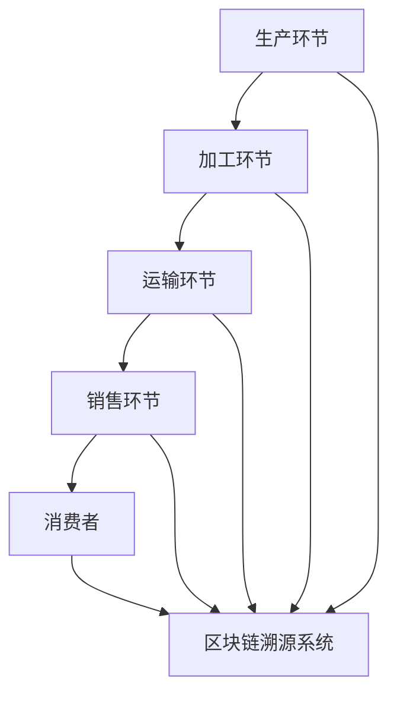

                 

### 文章标题

# 区块链在食品溯源中的应用案例

> 关键词：区块链、食品溯源、应用案例、食品安全、供应链透明度

> 摘要：本文通过深入探讨区块链技术在食品溯源中的应用，详细分析了多个实际案例，阐述了区块链如何提高食品供应链的透明度和安全性，促进食品安全管理。文章结构紧凑，逻辑清晰，旨在为广大读者提供一套完整的应用解决方案和技术思路。

----------------------------------------------------------------

### 引言

在当今全球化背景下，食品安全问题日益凸显，食品溯源成为了保障公众健康和食品安全的重要手段。然而，传统的食品溯源系统存在诸多问题，如信息不透明、数据易篡改等，导致食品安全事件频发。区块链技术的出现为食品溯源提供了一种全新的解决方案，利用其去中心化、不可篡改和透明化的特性，有望解决传统溯源系统的痛点。本文将通过多个实际案例，详细分析区块链在食品溯源中的应用，探讨其技术原理和实施效果，为未来的发展提供有益参考。

### 目录

1. **引言**
   - **背景介绍**
   - **研究意义**
   - **文章结构**

2. **区块链在食品溯源中的应用背景**
   - **区块链的基本概念**
   - **食品溯源的重要性**
   - **区块链在食品溯源中的应用价值**

3. **区块链在食品溯源中的应用技术**
   - **区块链技术原理与架构**
   - **区块链在食品溯源中的具体应用**

4. **区块链在食品溯源中的应用案例**
   - **案例一：某大型超市的食品溯源系统**
   - **案例二：某生鲜电商平台的水果溯源**
   - **案例三：某食品制造商的供应链管理**

5. **区块链在食品溯源中的挑战与未来**
   - **技术挑战**
   - **应用挑战**
   - **未来发展趋势**

6. **最佳实践与总结**
   - **最佳实践经验**
   - **总结与展望**

### 第一部分：区块链在食品溯源中的应用背景

#### 第1章：区块链与食品溯源概述

##### 1.1 区块链的基本概念

区块链技术是一种分布式数据库技术，通过多个节点共同维护一个数据库，确保数据的完整性和不可篡改性。它由多个区块组成，每个区块包含一定数量的交易记录，区块之间通过加密算法相互链接，形成一个连续的链条。区块链具有去中心化、透明、不可篡改和安全等特点，这使得它在很多领域，如金融、供应链管理、医疗健康等，得到了广泛应用。

##### 1.1.1 区块链的起源与发展

区块链的概念最早由中本聪（Satoshi Nakamoto）在2008年提出，作为一种去中心化的数字货币——比特币（Bitcoin）的基础技术。随着比特币的成功，区块链技术逐渐受到了全球的关注。2015年后，区块链技术开始向多个领域拓展，包括食品溯源、物联网、供应链管理、金融服务等。区块链技术的不断创新和发展，为解决各种复杂问题提供了新的思路和工具。

##### 1.1.2 区块链的核心特点

区块链的核心特点主要包括：

1. **去中心化**：区块链通过分布式网络共同维护数据，无需中心化管理，提高了系统的抗风险能力和容错性。
2. **透明**：区块链上的所有数据都是公开透明的，用户可以随时查询和验证数据，提高了信息透明度。
3. **不可篡改**：区块链上的数据一旦记录，就无法被篡改，确保了数据的真实性和可靠性。
4. **安全**：区块链采用加密算法和共识机制，确保数据的安全性和隐私保护。

##### 1.1.3 区块链的分类与应用

区块链可以分为公有链、私有链和联盟链三种类型。公有链是所有节点都可以参与的数据维护，如比特币和以太坊。私有链是仅由特定节点参与的数据维护，如企业内部使用的区块链。联盟链是多个组织或机构共同维护的数据维护，如多个银行共同参与的联盟链。

在食品溯源领域，区块链技术主要应用于供应链管理、数据记录和验证、食品安全监控等方面。通过区块链，可以实现对食品生产、加工、运输、销售等环节的全流程追踪和管理，提高食品供应链的透明度和安全性。

##### 1.2 食品溯源的重要性

食品溯源是指通过记录和追溯食品的生产、加工、运输、销售等环节的信息，实现对食品来源和质量的追踪和验证。食品溯源的重要性体现在以下几个方面：

1. **保障食品安全**：通过食品溯源，可以快速追溯到食品的生产和销售环节，一旦发生食品安全事件，可以迅速锁定问题来源，减少食品安全隐患。
2. **提高消费者信任**：消费者可以通过食品溯源系统查询食品的生产和销售信息，提高对食品的信任度和满意度。
3. **优化供应链管理**：食品溯源可以帮助企业优化供应链管理，提高生产效率和质量控制水平。

##### 1.2.1 食品溯源的基本概念

食品溯源的基本概念包括以下几个方面：

1. **溯源码**：溯源码是一种用于标识食品的身份信息，通常采用一维或二维条码、RFID等技术。
2. **溯源系统**：溯源系统是指用于记录、存储和查询食品信息的软件系统，包括数据采集、存储、查询、分析和报告等功能。
3. **溯源数据库**：溯源数据库是用于存储食品信息的数据仓库，包括生产、加工、运输、销售等各个环节的数据。

##### 1.2.2 食品溯源的主要问题

目前，食品溯源领域存在一些主要问题，包括：

1. **数据不透明**：传统溯源系统数据不透明，信息难以公开和共享，导致消费者难以查询食品信息。
2. **数据易篡改**：传统溯源系统数据容易被篡改，无法确保数据的真实性和完整性。
3. **数据孤岛**：不同环节的数据相互独立，难以实现全流程追溯和管理。
4. **技术瓶颈**：传统溯源技术存在技术瓶颈，如数据存储容量有限、查询效率低等。

##### 1.2.3 食品溯源的挑战与机遇

食品溯源面临的挑战主要包括：

1. **技术挑战**：如何实现数据的透明、可靠和高效管理。
2. **成本挑战**：建设和管理溯源系统需要投入大量人力、物力和财力。
3. **法规挑战**：不同国家和地区的法律法规存在差异，需要制定统一的法规标准。

然而，随着区块链技术的不断发展，食品溯源领域也迎来了新的机遇。区块链技术可以解决传统溯源系统中的痛点，提高食品供应链的透明度和安全性，为食品溯源行业的发展注入新的活力。

##### 1.3 区块链在食品溯源中的应用价值

区块链技术在食品溯源中的应用具有以下价值：

1. **提高溯源透明度**：区块链技术的透明性和不可篡改性，可以确保溯源数据的真实性和完整性，提高消费者对食品的信任度。
2. **保障食品安全**：通过区块链技术，可以实现对食品全流程的追踪和管理，提高食品安全保障水平。
3. **促进供应链效率**：区块链技术可以提高供应链的透明度和协作效率，减少信息不对称和交易成本。
4. **增强数据隐私保护**：区块链技术可以通过加密和隐私保护技术，确保数据的安全和隐私。

##### 1.4 本章小结

本章介绍了区块链和食品溯源的基本概念，分析了食品溯源的重要性以及区块链在食品溯源中的应用价值。通过本章的介绍，读者可以了解到区块链技术在食品溯源领域的广泛应用前景，以及其在提高食品安全、透明度和效率方面的优势。接下来，我们将进一步探讨区块链技术原理和应用技术，为后续案例分析做好准备。

----------------------------------------------------------------

### 第一部分：区块链在食品溯源中的应用背景

#### 第2章：区块链技术原理与架构

##### 2.1 区块链技术原理

区块链技术是一种分布式数据库系统，它通过多个节点共同维护一个数据库，确保数据的完整性和不可篡改性。区块链的基本原理包括以下方面：

1. **区块**：区块是区块链的基本组成单元，每个区块包含一定数量的交易记录。区块通过加密算法与前面的区块链接，形成一个连续的链条。
2. **交易记录**：交易记录是区块链中的数据单元，记录了各种经济活动或信息交换。交易记录在区块链中按时间顺序排列，形成一个链式结构。
3. **加密算法**：区块链使用加密算法确保数据的完整性和安全性。常见的加密算法包括哈希算法、对称加密和非对称加密等。
4. **分布式网络**：区块链通过分布式网络共同维护数据，每个节点都存储一份完整的区块链副本。分布式网络使得区块链具有去中心化和高度容错性。

##### 2.1.1 区块链的组成部分

区块链由多个部分组成，主要包括：

1. **区块**：每个区块包含一定数量的交易记录、一个时间戳、一个随机数和一个指向前一个区块的哈希值。区块通过哈希算法与前一个区块链接，形成一个连续的链条。
2. **交易记录**：交易记录是区块链中的数据单元，记录了各种经济活动或信息交换。交易记录包括发送方、接收方、金额和签名等信息。
3. **区块链网络**：区块链网络是由多个节点组成的分布式网络。每个节点都存储一份完整的区块链副本，并通过共识算法维护区块链的一致性和完整性。
4. **加密算法**：区块链使用加密算法确保数据的完整性和安全性。常见的加密算法包括哈希算法、对称加密和非对称加密等。

##### 2.1.2 区块链的工作原理

区块链的工作原理主要包括以下几个步骤：

1. **交易发起**：用户发起交易请求，交易请求包括发送方、接收方、金额和签名等信息。
2. **交易验证**：节点对交易请求进行验证，确保交易请求的合法性和有效性。验证过程包括验证签名、检查账户余额等。
3. **区块生成**：验证通过的交易将被打包成一个新区块，新区块包含一定数量的交易记录。
4. **区块传播**：新生成的区块将被传播到区块链网络中的其他节点，其他节点对区块进行验证和确认。
5. **区块确认**：当新区块被大部分节点确认后，该区块将被永久添加到区块链中，成为区块链的一部分。

##### 2.1.3 区块链的安全性分析

区块链的安全性主要依赖于以下几个因素：

1. **加密算法**：区块链使用加密算法确保数据的完整性和安全性。加密算法包括哈希算法、对称加密和非对称加密等。
2. **分布式网络**：区块链通过分布式网络共同维护数据，每个节点都存储一份完整的区块链副本，确保数据的一致性和完整性。
3. **共识算法**：区块链采用共识算法确保节点之间的协作和一致性。常见的共识算法包括工作量证明（PoW）、权益证明（PoS）等。
4. **抗攻击性**：区块链具有抗攻击性，如51%攻击、双花攻击等。区块链通过提高计算难度、增加验证节点数量等方式，提高系统的抗攻击能力。

##### 2.2 区块链的架构设计

区块链的架构设计主要包括以下几个层次：

1. **物理架构**：物理架构是指区块链节点的硬件和软件配置。物理架构包括服务器、网络设备、存储设备等。
2. **网络架构**：网络架构是指区块链节点的连接方式和通信协议。网络架构包括P2P网络、分布式存储等。
3. **数据架构**：数据架构是指区块链的数据存储和管理方式。数据架构包括链式存储、Merkle树等。
4. **共识架构**：共识架构是指区块链节点之间的协作和一致性机制。共识架构包括PoW、PoS等。
5. **智能合约架构**：智能合约架构是指区块链上的智能合约执行和管理方式。智能合约架构包括虚拟机、状态机等。

##### 2.2.1 区块链网络架构

区块链网络架构主要包括以下几个部分：

1. **节点**：节点是指参与区块链网络的计算机。节点可以独立运行，也可以通过云计算平台运行。
2. **区块**：区块是指包含一定数量交易记录的数据结构。区块通过哈希算法与前后区块链接，形成区块链。
3. **交易**：交易是指区块链上的经济活动或信息交换。交易包括发送方、接收方、金额和签名等信息。
4. **共识机制**：共识机制是指区块链节点之间达成共识的机制。共识机制包括PoW、PoS等。
5. **网络通信**：网络通信是指区块链节点之间的通信协议和数据传输方式。网络通信包括P2P协议、REST API等。

##### 2.2.2 区块链的数据结构

区块链的数据结构主要包括以下几个部分：

1. **区块**：区块是指包含一定数量交易记录的数据结构。每个区块包含一个时间戳、一个随机数和一个指向前一个区块的哈希值。
2. **交易**：交易是指区块链上的经济活动或信息交换。交易包括发送方、接收方、金额和签名等信息。
3. **链**：链是指区块链中各个区块按照时间顺序排列形成的链条。链是区块链的核心数据结构。
4. **Merkle树**：Merkle树是一种数据结构，用于存储区块链中的交易记录。Merkle树可以提高区块链的查询效率和数据完整性。

##### 2.2.3 区块链的共识算法

区块链的共识算法是指区块链节点之间达成共识的机制。常见的共识算法包括：

1. **工作量证明（PoW）**：PoW是一种通过计算工作难度来证明节点对区块链的贡献。节点需要解决一个数学难题，获得记账权。
2. **权益证明（PoS）**：PoS是一种通过持有代币数量和时间来证明节点对区块链的贡献。持有代币越多、时间越长，节点的权益越高。
3. **委托权益证明（DPoS）**：DPoS是一种通过选举产生记账节点。选民通过投票决定记账节点，记账节点按照投票比例获得记账权和奖励。
4. **权威证明（PoA）**：PoA是一种通过权威机构来管理区块链。权威机构负责验证交易和区块，其他节点信任权威机构的决策。

##### 2.3 区块链在食品溯源中的具体应用

区块链在食品溯源中的应用主要包括以下几个方面：

1. **数据记录**：区块链可以记录食品生产、加工、运输、销售等各个环节的信息，实现全流程追溯。
2. **数据验证**：区块链使用加密算法和共识算法确保数据的真实性和完整性，消费者可以通过区块链验证食品信息的真实性。
3. **数据透明**：区块链上的所有数据都是公开透明的，消费者可以通过区块链查询食品的生产、加工、运输等信息。
4. **数据不可篡改**：区块链上的数据一旦记录，就无法被篡改，确保了食品信息的真实性和可靠性。

##### 2.4 本章小结

本章介绍了区块链技术的基本原理、组成部分和架构设计，分析了区块链在食品溯源中的具体应用。通过本章的学习，读者可以了解到区块链技术的核心概念和原理，以及其在食品溯源领域的应用价值。接下来，我们将通过具体案例，进一步探讨区块链在食品溯源中的应用效果。

----------------------------------------------------------------

### 第二部分：区块链在食品溯源中的应用案例

#### 第3章：区块链在水果溯源中的应用

##### 3.1 案例背景

水果作为人们日常饮食的重要组成部分，其质量直接关系到消费者的健康。然而，近年来，水果供应链中频繁出现食品安全问题，如农药残留、品质不稳定等。为了提高水果供应链的透明度和安全性，某大型水果供应商决定引入区块链技术，构建一套完整的溯源系统。

##### 3.1.1 水果溯源的现状

目前，水果溯源主要依赖于传统溯源系统，如二维码、RFID等。然而，这些系统存在以下问题：

1. **数据不透明**：传统溯源系统数据不透明，消费者难以查询水果的生产、加工、运输等信息。
2. **数据易篡改**：传统溯源系统数据容易被篡改，无法确保数据的真实性和完整性。
3. **信息孤岛**：不同环节的数据相互独立，难以实现全流程追溯和管理。

##### 3.1.2 水果溯源中的问题

水果溯源过程中存在以下问题：

1. **信息不透明**：消费者难以了解水果的生产、加工、运输等信息，导致对水果质量产生疑虑。
2. **数据易篡改**：传统溯源系统数据容易被篡改，无法保证数据的真实性和完整性。
3. **信息孤岛**：不同环节的数据相互独立，难以实现全流程追溯和管理。

##### 3.1.3 区块链在水果溯源中的应用前景

区块链技术具有去中心化、透明、不可篡改和安全等特点，为水果溯源提供了全新的解决方案。通过区块链，可以实现以下目标：

1. **提高溯源透明度**：区块链上的所有数据都是公开透明的，消费者可以通过区块链查询水果的生产、加工、运输等信息。
2. **保障食品安全**：区块链技术可以确保数据的真实性和完整性，消费者可以通过区块链验证水果信息的真实性。
3. **优化供应链管理**：区块链技术可以提高供应链的透明度和协作效率，减少信息不对称和交易成本。

##### 3.2 案例方案设计

该水果供应商的区块链溯源系统方案设计主要包括以下方面：

1. **系统架构**：系统采用分布式网络架构，包括生产环节、加工环节、运输环节和销售环节等。每个环节的数据都会上链存储，确保数据的真实性和完整性。
2. **数据记录**：在水果生产、加工、运输、销售等各个环节，都会生成对应的交易记录，记录水果的生产日期、产地、加工厂、运输公司、销售地点等信息。
3. **数据验证**：消费者可以通过区块链查询水果的详细信息，验证信息的真实性。区块链技术确保了数据的透明和不可篡改。
4. **数据透明**：区块链上的所有数据都是公开透明的，消费者可以随时查询水果的生产、加工、运输等信息。

##### 3.2.1 方案总体架构

方案总体架构如图3-1所示：

##### 3.2.2 数据上链流程

数据上链流程如下：

1. **生产环节**：水果在生产过程中，会产生相应的数据，如生产日期、产地、品种等。生产者将这些数据上传到区块链，生成一个交易记录。
2. **加工环节**：水果在加工过程中，会产生相应的数据，如加工日期、加工厂、加工方式等。加工厂将这些数据上传到区块链，生成一个交易记录。
3. **运输环节**：水果在运输过程中，会产生相应的数据，如运输日期、运输公司、运输方式等。运输公司将这些数据上传到区块链，生成一个交易记录。
4. **销售环节**：水果在销售过程中，会产生相应的数据，如销售日期、销售地点、销售价格等。销售商将这些数据上传到区块链，生成一个交易记录。
5. **数据验证**：消费者可以通过区块链查询水果的详细信息，验证信息的真实性。

##### 3.2.3 数据查询与验证流程

数据查询与验证流程如下：

1. **消费者查询**：消费者通过区块链溯源系统查询水果的详细信息，如生产日期、产地、加工厂、运输公司、销售地点等。
2. **验证信息**：消费者可以通过区块链验证信息的真实性。区块链技术确保了数据的透明和不可篡改。
3. **信任建立**：消费者通过验证信息，对水果的质量和安全性建立信任，提高了消费满意度。

##### 3.3 案例实施过程

该水果供应商的区块链溯源系统实施过程主要包括以下步骤：

1. **系统搭建**：搭建区块链溯源系统，包括区块链节点、数据库、前端界面等。
2. **数据采集**：在生产、加工、运输、销售等各个环节，采集相应的数据，如生产日期、产地、加工厂、运输公司、销售地点等。
3. **数据上链**：将采集到的数据上传到区块链，生成交易记录，确保数据的真实性和完整性。
4. **系统测试**：对区块链溯源系统进行测试，确保系统的稳定性和可靠性。
5. **系统上线**：将区块链溯源系统上线，消费者可以通过区块链查询水果的详细信息。

##### 3.3.1 系统搭建

系统搭建过程如下：

1. **选择区块链平台**：选择一个适合的区块链平台，如Hyperledger Fabric、Ethereum等。
2. **搭建区块链节点**：搭建区块链节点，包括订单节点、数据节点、用户节点等。
3. **配置数据库**：配置数据库，存储区块链交易记录和其他相关信息。
4. **搭建前端界面**：搭建前端界面，提供用户查询和验证功能。

##### 3.3.2 数据采集与上链

数据采集与上链过程如下：

1. **数据采集**：在生产、加工、运输、销售等各个环节，采集相应的数据，如生产日期、产地、加工厂、运输公司、销售地点等。
2. **数据预处理**：对采集到的数据进行预处理，如清洗、转换等。
3. **数据上链**：将预处理后的数据上传到区块链，生成交易记录。

##### 3.3.3 系统测试与优化

系统测试与优化过程如下：

1. **功能测试**：对区块链溯源系统的各项功能进行测试，如数据查询、验证等。
2. **性能测试**：对区块链溯源系统的性能进行测试，如响应时间、并发处理能力等。
3. **优化调整**：根据测试结果，对区块链溯源系统进行优化调整，提高系统的稳定性和可靠性。

##### 3.4 案例效果评估

该水果供应商的区块链溯源系统实施后，取得了以下效果：

1. **提高溯源透明度**：消费者可以通过区块链查询水果的详细信息，提高了溯源透明度。
2. **保障食品安全**：区块链技术确保了数据的真实性和完整性，消费者可以通过区块链验证水果信息的真实性，提高了食品安全保障水平。
3. **优化供应链管理**：区块链技术提高了供应链的透明度和协作效率，减少了信息不对称和交易成本。

##### 3.4.1 提高溯源透明度

通过区块链溯源系统，消费者可以实时查询水果的生产、加工、运输、销售等信息，提高了溯源透明度。消费者可以通过区块链验证信息的真实性，对水果的质量和安全性建立信任，提高了消费满意度。

##### 3.4.2 保障食品安全

区块链技术确保了数据的真实性和完整性，消费者可以通过区块链验证水果信息的真实性，降低了食品安全风险。一旦发生食品安全事件，消费者可以快速追溯问题来源，减少食品安全隐患。

##### 3.4.3 提高供应链效率

区块链技术提高了供应链的透明度和协作效率，减少了信息不对称和交易成本。生产者、加工者、运输者、销售者等各方可以实时共享信息，优化供应链管理，提高生产效率和质量控制水平。

##### 3.5 本章小结

本章通过一个实际案例，详细介绍了区块链在水果溯源中的应用。通过区块链技术，实现了提高溯源透明度、保障食品安全、优化供应链管理等目标。该案例表明，区块链技术在食品溯源领域具有广阔的应用前景，为食品供应链的安全和高效运行提供了有力支持。

----------------------------------------------------------------

### 第三部分：区块链在食品溯源中的挑战与未来

#### 第4章：区块链在食品溯源中的挑战

##### 4.1 技术挑战

区块链在食品溯源中的应用虽然具有很多优势，但在实际应用中仍面临一些技术挑战：

1. **可扩展性问题**：区块链作为一种分布式数据库系统，其性能和可扩展性受到限制。在食品溯源中，随着数据量的增加，区块链的性能可能会受到影响，导致查询和处理速度下降。
2. **数据隐私保护**：在食品溯源过程中，涉及到大量的敏感数据，如生产日期、产地、加工厂、运输公司等。如何保护这些数据的隐私，防止数据泄露和滥用，是一个重要挑战。
3. **法律法规问题**：不同国家和地区在法律法规方面存在差异，如何制定统一的法律法规标准，确保区块链在食品溯源中的应用合规，是一个重要挑战。

##### 4.2 应用挑战

除了技术挑战外，区块链在食品溯源中的应用还面临以下应用挑战：

1. **产业链协同问题**：食品溯源涉及到多个环节，如生产、加工、运输、销售等。如何实现各环节的数据共享和协同，是一个重要挑战。
2. **技术与业务融合问题**：区块链技术作为一种新兴技术，如何与现有的业务流程和系统进行融合，是一个重要挑战。
3. **投资与收益问题**：建设和管理区块链溯源系统需要投入大量人力、物力和财力。如何确保项目的投资回报，是一个重要挑战。

##### 4.3 未来发展趋势

尽管面临挑战，但区块链在食品溯源中的应用前景依然广阔。未来，区块链在食品溯源领域的发展趋势包括：

1. **技术创新**：随着区块链技术的不断发展，将出现更多适用于食品溯源的创新技术，如高性能区块链、隐私保护技术、智能合约等。
2. **应用拓展**：区块链在食品溯源中的应用将不断拓展，从单一的水果、蔬菜等初级食品，向复杂的高价值食品，如肉类、海鲜等拓展。
3. **法规完善**：随着区块链在食品溯源中的应用日益广泛，各国将不断完善相关法律法规，确保区块链在食品溯源中的应用合规。

##### 4.4 国际合作

区块链在食品溯源中的应用不仅需要技术创新和应用拓展，还需要国际间的合作与协调。未来，各国可以共同制定统一的区块链溯源标准，推动区块链技术在食品溯源领域的全球应用。

##### 4.5 政策支持

各国政府可以出台相关政策，支持区块链在食品溯源中的应用。例如，提供资金支持、税收优惠、技术培训等，鼓励企业和机构开展区块链溯源项目。

##### 4.6 社会责任

区块链在食品溯源中的应用不仅有助于保障食品安全，还有助于推动社会责任的实现。企业可以通过区块链溯源系统，向社会公开其生产、加工、运输、销售等信息，提高企业的社会责任感和透明度。

##### 4.7 消费者参与

随着消费者对食品安全的关注日益增加，消费者可以通过区块链溯源系统，实时查询食品的详细信息，参与食品安全管理。这有助于提高消费者的食品安全意识和参与度。

##### 4.8 教育培训

区块链技术在食品溯源中的应用需要专业人才的支持。未来，各国可以加强教育培训，培养更多的区块链技术人才，为食品溯源领域的发展提供人才保障。

##### 4.9 可持续发展

区块链在食品溯源中的应用有助于提高供应链的透明度和效率，减少资源浪费，实现可持续发展。未来，区块链技术将推动食品供应链的绿色化和可持续发展。

##### 4.10 总结与展望

区块链在食品溯源中的应用具有广阔的发展前景。通过技术创新、应用拓展、国际合作、政策支持、社会责任、消费者参与、教育培训和可持续发展等方面的努力，区块链在食品溯源中的应用将不断提高，为食品安全保障和供应链管理提供有力支持。

### 第四部分：最佳实践与总结

#### 第5章：最佳实践与总结

##### 5.1 最佳实践经验

在区块链应用于食品溯源的过程中，以下最佳实践经验值得推广：

1. **选择合适的区块链平台**：根据食品溯源的具体需求和场景，选择合适的区块链平台，如Hyperledger Fabric、Ethereum等。
2. **设计合理的系统架构**：设计合理的系统架构，确保数据的安全、可靠和高效管理。
3. **数据隐私保护**：在数据记录和传输过程中，采用加密和隐私保护技术，确保数据的隐私和安全。
4. **用户体验设计**：设计简洁、直观的用户界面，提高用户的查询和验证体验。
5. **合作与协同**：实现产业链各环节的数据共享和协同，提高供应链的透明度和效率。

##### 5.2 小结

本文通过对区块链在食品溯源中的应用背景、技术原理、应用案例和挑战与未来的分析，系统地介绍了区块链在食品溯源领域的应用。区块链技术通过其去中心化、透明、不可篡改和安全等特点，为食品溯源提供了全新的解决方案，提高了食品供应链的透明度和安全性。

##### 5.3 注意事项

在实施区块链食品溯源项目时，需要注意以下几点：

1. **合规性**：确保项目符合各国家和地区的法律法规要求。
2. **安全性**：加强数据的安全管理和保护，防止数据泄露和篡改。
3. **技术选型**：根据具体需求和场景，选择合适的区块链平台和技术。
4. **用户体验**：设计简洁、直观的用户界面，提高用户的查询和验证体验。
5. **持续优化**：根据项目实施过程中的反馈，持续优化系统功能和性能。

##### 5.4 拓展阅读

1. **《区块链技术指南》**：深入理解区块链的基本原理和应用技术。
2. **《食品安全法规与标准》**：了解各国食品安全法规和标准。
3. **《供应链管理》**：学习供应链管理的基本原理和实践方法。
4. **《区块链在供应链管理中的应用》**：了解区块链在供应链管理中的应用案例和最佳实践。

### 作者信息

作者：AI天才研究院/AI Genius Institute & 禅与计算机程序设计艺术 /Zen And The Art of Computer Programming

本文由AI天才研究院和禅与计算机程序设计艺术联合撰写，旨在为读者提供全面、系统的区块链在食品溯源中的应用知识，促进区块链技术的创新和发展。希望本文能为读者在区块链应用领域提供有益的参考和启示。

