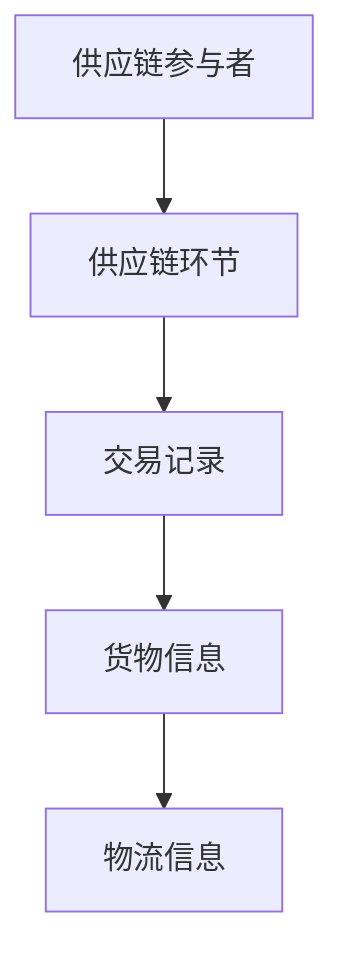
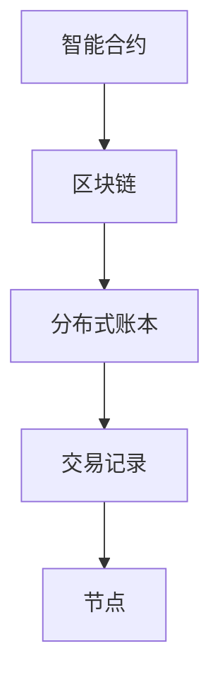
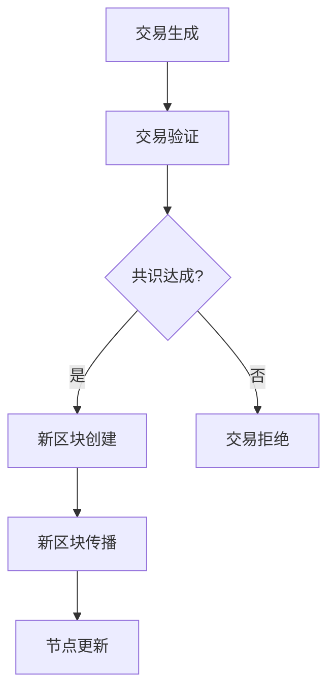

                 


### # 第一部分：背景介绍

## 第1章：问题背景与核心概念

### 1.1 供应链透明度的重要性

供应链透明度是指供应链中各个环节的参与者能够清晰地了解货物的来源、流向、状态和质量等信息。在现代经济中，供应链透明度的重要性不言而喻。

首先，供应链透明度有助于提高供应链的效率。当各个环节的信息能够被及时、准确地共享时，供应链中的参与者可以更好地协调各自的工作，避免由于信息不对称造成的资源浪费和延误。

其次，供应链透明度有助于提升消费者的信任度。消费者越来越关注产品的来源和质量，透明的供应链可以让他们对产品的安全性有更全面的了解，从而增加对品牌的信任。

再次，供应链透明度有助于企业实现可持续发展。通过透明的供应链，企业可以更好地管理资源，减少浪费，降低成本，同时也可以更好地履行社会责任。

### 1.2 区块链技术的核心概念

区块链技术是一种去中心化的分布式数据库技术，它通过加密算法和共识机制，确保数据的不可篡改和透明性。

区块链的核心概念包括：

- **去中心化**：区块链不依赖于中心化的服务器或组织，而是通过多个节点共同维护和更新数据，从而提高了系统的容错性和抗攻击性。

- **分布式账本**：区块链是一种分布式数据库，数据被存储在多个节点上，每个节点都有一份完整的账本，从而实现了数据的透明性和一致性。

- **不可篡改**：区块链的数据一旦被记录，就无法被篡改或删除，从而保证了数据的真实性和可靠性。

- **共识机制**：区块链通过共识机制确保所有节点的数据一致性，常见的共识机制包括工作量证明（PoW）、权益证明（PoS）等。

### 1.3 区块链与供应链透明度的联系

区块链技术为供应链透明度提供了以下几个关键优势：

- **信息共享**：区块链技术的分布式账本特性使得供应链中的各个环节可以实时共享信息，从而提高了透明度。

- **数据不可篡改**：区块链的数据一旦被记录，就无法被篡改，这保证了供应链数据的真实性和可靠性。

- **透明性和可追溯性**：区块链的每一笔交易都被记录在链上，可以方便地追溯，从而提高了供应链的透明度和可追溯性。

- **安全性和信任**：区块链的加密算法和共识机制保证了数据的安全性和可信度，从而增强了供应链中各方的信任。

### 1.4 本文结构

本文将分为四个部分进行探讨：

- **第一部分：背景介绍**，包括供应链透明度的重要性和区块链技术的核心概念。

- **第二部分：区块链技术原理**，详细解析区块链的技术细节，如区块链的组成结构、工作原理和共识算法等。

- **第三部分：区块链在供应链中的应用**，通过实际案例分析和技术解析，展示区块链在供应链透明度中的应用。

- **第四部分：挑战与解决方案**，讨论区块链在供应链透明度中可能面临的挑战，并提出相应的解决方案。

通过以上结构，我们将逐步深入探讨区块链技术在供应链透明度中的作用，为读者提供全面、系统的认识。

## 第2章：供应链透明度的挑战

### 2.1 传统供应链的不足

传统供应链在透明度方面存在诸多不足，这些问题不仅影响了供应链的效率，也降低了消费者和企业的信任度。

首先，信息不对称是传统供应链中最为突出的问题。供应链的各个环节通常由不同的企业或组织管理，这些环节之间的信息传递存在滞后性，甚至存在信息泄露的风险。由于信息不对称，各个环节很难实现高效协同，从而影响了整体供应链的运行效率。

其次，数据篡改和伪造的风险高。在传统供应链中，数据的记录和管理通常依赖于中心化的数据库或服务器，这些系统容易受到黑客攻击或内部人员的恶意操作，导致数据被篡改或伪造。一旦数据被篡改，整个供应链的透明度和可靠性将受到严重威胁。

再次，供应链中的中间环节多，流程复杂。传统供应链通常涉及多个中间商和分销商，这些中间环节增加了供应链的复杂度，也使得信息难以追踪和共享。这不仅增加了成本，还容易导致信息的丢失和误传，影响了供应链的透明度。

### 2.2 供应链透明度的问题与需求

供应链透明度存在的问题主要体现在以下几个方面：

- **信息不透明**：供应链中的信息难以获取和共享，导致各个环节之间的信息壁垒，影响了供应链的协调和效率。

- **数据真实性难以保证**：由于数据容易被篡改和伪造，供应链中的数据真实性难以得到保障，影响了供应链的信任度和可靠性。

- **成本和效率低下**：传统供应链中信息传递的滞后性和复杂性，导致供应链的运营成本高、效率低。

针对以上问题，供应链透明度的需求日益凸显：

- **信息共享与协同**：提高供应链的透明度，实现信息在各个环节的实时共享和协同，以提高供应链的整体效率。

- **数据安全与可信**：确保供应链中的数据不被篡改和伪造，提高数据的真实性和可信度。

- **降低运营成本**：通过透明度提高，简化供应链流程，降低运营成本。

### 2.3 区块链在供应链中的应用前景

区块链技术在供应链中的应用前景广阔，其独特的特性使得它成为解决供应链透明度问题的重要工具。

首先，区块链的去中心化和分布式账本特性，使得供应链中的各个环节可以实现信息实时共享，打破了传统供应链中的信息壁垒，提高了透明度。

其次，区块链的数据不可篡改特性，保证了供应链数据的真实性和可靠性，减少了数据篡改和伪造的风险。

再次，区块链的透明性和可追溯性，使得供应链中的每一笔交易都可以被追溯和验证，提高了供应链的可信度和透明度。

此外，区块链的加密算法和共识机制，增强了供应链数据的安全性和抗攻击性，为供应链的稳健运行提供了保障。

总的来说，区块链技术在供应链中的应用，有望解决传统供应链在透明度方面存在的诸多问题，提高供应链的整体效率和可信度。

## 第3章：区块链技术基础

### 3.1 区块链的组成结构

区块链技术由多个关键组件组成，这些组件共同协作，确保了区块链系统的去中心化、透明性和不可篡改性。

**1. 区块**：区块链的基本单元是块，每个块包含一定数量的交易记录。当一个块填满交易记录后，它会被添加到区块链中。

**2. 链**：链是多个连续块的有序集合，每个块通过加密哈希值与前一链块连接，形成链式结构。这种结构确保了区块链的不可篡改性。

**3. 智能合约**：智能合约是自动执行合同条款的计算机程序，它运行在区块链网络中，可以在满足特定条件时自动执行合约。

**4. 节点**：节点是区块链网络中的计算设备，负责存储区块链数据、验证交易和参与共识过程。每个节点都有一份完整的区块链副本。

**5. 共识算法**：共识算法是节点之间就区块链状态达成一致的方法。常见的共识算法包括工作量证明（PoW）和权益证明（PoS）。

### 3.2 区块链的工作原理

区块链的工作原理可以概括为以下步骤：

**1. 交易生成**：用户在区块链网络中发起交易，交易可以是货币转账、数据记录等。

**2. 交易验证**：交易在多个节点上进行验证，确保交易的合法性和真实性。

**3. 区块创建**：验证后的交易被收集到一个新的区块中，并附加到一个已存在的区块链上。

**4. 区块传播**：新区块通过网络传播到所有节点。

**5. 共识达成**：所有节点通过共识算法达成一致，确定新区块的有效性。

**6. 区块存储**：新区块被添加到区块链的末端，所有节点更新自己的区块链副本。

### 3.3 共识算法介绍

共识算法是区块链网络中节点之间达成一致的关键机制。以下是几种常见的共识算法：

**1. 工作量证明（PoW）**：节点通过解决复杂的数学难题来竞争生成新区块。解决难题的节点获得记账权，其他节点验证该难题的解，确保新区块的有效性。

**2. 权益证明（PoS）**：节点根据其持有的代币数量和持币时间来竞争记账权。持有更多代币和持币时间更长的节点更有可能被选为记账节点，降低了能源消耗。

**3. 染色理论（GR）**：节点通过一系列的投票过程来决定区块链的长度，从而达成共识。

**4. 软共识（SGX）**：利用硬件安全模块（如Intel SGX）确保节点在执行共识算法时不会泄露私密信息。

每种共识算法都有其优缺点，适用于不同的应用场景。了解这些算法的工作原理和特点，有助于更好地应用区块链技术。

### 3.4 区块链的安全性与隐私保护

区块链技术以其安全性和透明性著称，但同时也面临着隐私保护的挑战。

**1. 安全性**：区块链通过加密算法和共识机制确保数据的安全性和不可篡改性。加密算法确保数据的隐私，而共识机制确保所有节点的数据一致性。

**2. 隐私保护**：区块链的公开特性使得所有交易都可见，这可能泄露用户的隐私信息。为了保护隐私，可以采用以下措施：

- **零知识证明**：用户可以在不透露具体信息的情况下证明某些信息的真实性。
- **同态加密**：在加密状态下对数据进行计算，确保数据的隐私性和完整性。
- **环签名**：用户在一个加密的环中签名，从而保护其身份的隐私。

总之，区块链技术为供应链透明度提供了强大的工具，通过其独特的组成结构和工作原理，实现了数据的安全性和透明性，为供应链的优化和管理提供了新的可能性。

## 第4章：智能合约与分布式账本

### 4.1 智能合约的定义与功能

智能合约是区块链技术中的一个核心概念，它是一种自执行合同，通过代码自动执行合同条款。智能合约的出现，极大地提高了供应链的透明度和效率。

**1. 定义**：智能合约是一种嵌入在区块链中的计算机程序，它根据预设的规则和条件自动执行合同条款，无需第三方中介。

**2. 功能**：

- **自动化执行**：智能合约可以在满足特定条件时自动执行，从而减少了人工干预，提高了供应链的效率。
- **不可篡改性**：智能合约一旦被记录在区块链上，其代码和条款无法被篡改，保证了合同条款的执行可靠性。
- **透明性**：智能合约的代码和执行过程都是公开透明的，供应链的参与者可以随时查看和验证合同执行情况。

### 4.2 分布式账本技术

分布式账本技术是区块链技术的核心组成部分，它通过去中心化的方式存储和管理数据，确保数据的不可篡改性和透明性。

**1. 定义**：分布式账本技术是一种分布式数据库系统，数据被存储在多个节点上，每个节点都保存了一份完整的数据副本。

**2. 特点**：

- **去中心化**：分布式账本不依赖于中心化的服务器或组织，每个节点都拥有相同的数据权限，从而提高了系统的容错性和抗攻击性。
- **不可篡改性**：分布式账本的数据一旦被记录，就无法被篡改或删除，保证了数据的真实性和可靠性。
- **透明性**：分布式账本的所有交易记录都是公开透明的，供应链的参与者可以随时查看和验证。

### 4.3 区块链网络的安全性

区块链网络的安全性是供应链透明度的基础保障。区块链通过一系列技术手段确保网络的安全性和数据保护。

**1. 加密算法**：区块链使用加密算法对数据进行加密，确保数据在传输和存储过程中的安全性。

**2. 共识机制**：共识机制确保区块链网络中的所有节点就数据的一致性达成一致，防止恶意节点的攻击。

**3. 节点验证**：区块链网络中的节点需要进行验证，确保节点的合法性和可信度，防止恶意节点的加入。

**4. 激励机制**：区块链通过激励机制鼓励节点参与网络维护，确保网络的安全和稳定。

总的来说，智能合约和分布式账本技术为供应链透明度提供了强大的技术支持，通过自动化、透明性和安全性，提高了供应链的效率和可靠性。同时，区块链网络的安全性为供应链数据的安全保护提供了坚实的保障。

## 第5章：供应链区块链应用案例分析

### 5.1 食品供应链的案例

在食品供应链中，区块链技术已被广泛采用，以提高供应链的透明度和安全性。

**1. 背景介绍**：食品供应链涉及多个环节，从原材料采购、加工、运输到零售。传统供应链中，信息不透明、数据篡改和食品安全问题频发，严重影响了消费者信任。

**2. 应用场景**：通过区块链技术，食品供应链中的每个环节都可以记录在链上，实现全流程追踪。例如，农产品的生产日期、产地、加工过程、运输信息等，都可以被透明地记录和追溯。

**3. 技术实现**：食品供应链中的区块链应用通常包括以下步骤：

- **数据收集**：每个环节的数据通过传感器、二维码等手段进行收集，并上传到区块链。
- **数据加密**：上传的数据经过加密处理，确保数据隐私和安全。
- **数据记录**：加密后的数据被记录到区块链上，形成不可篡改的数字证据。
- **数据共享**：供应链的各个环节可以通过区块链实时共享数据，提高协同效率。

**4. 实际效果**：通过区块链技术的应用，食品供应链的透明度大大提高，消费者可以实时查看产品的生产、加工和运输信息，增强了消费者对食品安全的信任。

### 5.2 制造业供应链的案例

在制造业供应链中，区块链技术同样发挥着重要作用，特别是在产品溯源和质量控制方面。

**1. 背景介绍**：制造业供应链复杂，涉及多个供应商、制造商、分销商和零售商。传统供应链中，信息不透明、数据篡改和质量问题较为常见，给企业带来了巨大的风险。

**2. 应用场景**：通过区块链技术，制造业供应链中的每个环节都可以被记录和追溯，从而确保产品质量和来源的透明性。

**3. 技术实现**：制造业区块链应用主要包括以下步骤：

- **原材料采购**：供应商通过区块链记录原材料的采购信息，如产地、批次等。
- **生产过程**：制造商在生产过程中记录每个步骤的信息，如加工工艺、设备状态等。
- **产品运输**：产品在运输过程中记录运输信息，如运输时间、路线等。
- **产品销售**：分销商和零售商记录产品的销售信息，如销售地点、时间等。

**4. 实际效果**：通过区块链技术的应用，制造业供应链的透明度大幅提高，产品质量和来源得到有效保障，企业能够更好地应对市场风险。

### 5.3 其他行业供应链的案例

除了食品和制造业，区块链技术在其他行业供应链中的应用也越来越广泛。

**1. 医药供应链**：在医药供应链中，区块链技术用于确保药品的来源和质量，防止假药流入市场。

**2. 服装供应链**：在服装供应链中，区块链技术用于记录原材料采购、生产、运输和销售信息，提高供应链的透明度和效率。

**3. 能源供应链**：在能源供应链中，区块链技术用于记录能源生产、分配和使用信息，提高能源管理的透明度和效率。

总的来说，区块链技术在供应链中的应用案例丰富多样，通过提高供应链的透明度和安全性，为企业带来了显著的效益。随着技术的不断发展，区块链在供应链中的应用前景将更加广阔。

## 第6章：区块链在供应链透明度中的作用

### 6.1 透明度提升的实现

区块链技术通过其独特的特性，显著提升了供应链的透明度。以下是从不同角度详细解析这一提升过程：

**1. 全流程信息共享**：区块链的去中心化和分布式账本特性，使得供应链中的各个环节可以实时共享信息。例如，生产、加工、运输、销售等各个环节的数据都可以被记录在区块链上，实现信息的透明化和实时共享。

**2. 不可篡改的数据记录**：区块链的数据一旦被记录，就无法被篡改或删除。这意味着供应链中的每一个操作步骤都被真实、完整地记录下来，任何篡改行为都会被区块链网络中的其他节点发现和拒绝。

**3. 透明性增强**：区块链的公开特性使得供应链的每一步操作都可以被任何人查看和验证。消费者、企业以及监管机构都可以通过区块链浏览器查看供应链的详细信息，提高了供应链的透明度和可信度。

**4. 增强信任**：由于区块链的数据不可篡改，供应链的各参与方对数据的真实性有了更高的信任。这种信任有助于减少供应链中的信息不对称，提高整体运营效率。

### 6.2 货物流转追踪

区块链在货物流转追踪中的作用尤为重要，它通过以下方式实现了对物流过程的全面监控：

**1. 实时追踪**：区块链技术可以实现货物的实时追踪。从生产地到销售地，每一环节的信息都可以被记录在区块链上，供应链中的每个参与者都可以实时了解货物的状态和位置。

**2. 数据不可篡改**：区块链确保了物流数据的不可篡改性，任何对物流数据的篡改都会被区块链网络中的其他节点检测到并拒绝。这使得货物流转的每一步都能被真实、准确地记录。

**3. 全流程透明**：通过区块链，货物的每一个流转环节都是公开透明的，供应链的各个环节都可以被追溯和验证。这种透明性有助于提高物流过程的效率和可信度。

### 6.3 风险管理与合规性

区块链技术在供应链的风险管理和合规性方面也发挥了重要作用，具体表现在：

**1. 风险监控**：区块链技术可以实时监控供应链中的潜在风险，如供应链中断、质量不符合要求等。通过区块链上的数据分析，企业可以及时发现并应对这些风险。

**2. 审计追踪**：区块链的不可篡改性使得供应链的审计过程变得更加简单和高效。供应链的每一步操作都可以被记录和追溯，为审计提供了可靠的数据支持。

**3. 合规性保障**：区块链技术可以帮助企业确保供应链的合规性。例如，在食品和医药领域，区块链可以记录产品的生产、运输、销售等环节的信息，确保这些环节符合相关法规和标准。

**4. 透明性和可信度**：区块链的透明性和不可篡改性，提高了供应链的合规性和可信度。监管机构和企业可以更加信任供应链中的数据，减少合规风险。

总的来说，区块链技术在供应链透明度、货物流转追踪和风险管理与合规性方面发挥了重要作用。通过提升供应链的透明度和效率，区块链为企业的运营提供了强大的支持，同时也为消费者带来了更高的信任感。

## 第7章：区块链在供应链透明度中的挑战

### 7.1 技术挑战

区块链技术在供应链透明度中的应用虽然潜力巨大，但也面临诸多技术挑战。

**1. 扩展性**：区块链网络的可扩展性是一个关键问题。随着供应链的规模扩大，交易量的增加会对区块链的性能和速度提出更高的要求。如何在不牺牲性能的情况下，实现区块链的扩展性，是一个亟待解决的问题。

**2. 可扩展共识算法**：现有的共识算法，如工作量证明（PoW），在处理大量交易时可能会变得效率低下。设计更高效、能耗更低的可扩展共识算法，是区块链技术发展的一个重要方向。

**3. 数据隐私**：尽管区块链技术提供了透明性，但在某些情况下，数据隐私也是必不可少的。如何在不损害透明性的前提下，保护供应链中的敏感数据，是一个重要的技术挑战。

**4. 系统兼容性**：供应链涉及多个系统和平台，如何确保区块链与其他系统和平台的无缝集成，是一个复杂的技术难题。解决系统兼容性问题，需要跨行业、跨技术的协同合作。

### 7.2 安全性挑战

区块链技术的安全性虽然得到了广泛认可，但在实际应用中仍面临一些安全性挑战。

**1. 攻击风险**：区块链网络可能受到多种攻击，如51%攻击、双花攻击等。如何提升区块链网络的安全性，防止这些攻击，是当前研究的重要课题。

**2. 数据完整性**：区块链的数据一旦被记录，就无法被篡改。然而，如何在数据被记录之前确保其完整性，防止恶意数据的注入，是区块链安全性的关键问题。

**3. 加密算法更新**：随着加密算法的不断进步，现有的加密算法可能会被破解。如何及时更新加密算法，确保区块链数据的安全，是一个持续性的挑战。

**4. 节点信任**：区块链网络中的节点需要相互信任。然而，在复杂的供应链环境中，如何建立和维持节点的信任，是一个复杂的问题。

### 7.3 成本与效率挑战

区块链技术在供应链透明度中的应用还面临成本和效率方面的挑战。

**1. 高成本**：区块链技术的应用需要大量的计算资源，包括硬件和软件。这对于中小企业来说，可能是一笔不小的开支。如何降低区块链技术的成本，使其更加普及，是一个重要的课题。

**2. 效率低下**：区块链的分布式特性虽然提高了透明度，但也可能导致交易速度变慢。如何在保证透明度的同时，提高交易效率，是区块链技术需要解决的问题。

**3. 能源消耗**：某些共识算法，如工作量证明（PoW），会消耗大量的能源。随着全球对环保要求的提高，如何降低区块链技术的能源消耗，也是一个重要的挑战。

总的来说，尽管区块链技术在供应链透明度方面具有巨大潜力，但在实际应用中仍面临一系列技术、安全性和成本效率方面的挑战。只有通过技术创新和跨行业合作，才能有效应对这些挑战，推动区块链技术在供应链中的广泛应用。

## 第8章：解决方案与最佳实践

### 8.1 技术解决方案

为了应对区块链在供应链透明度中面临的技术挑战，以下是一些可行的技术解决方案：

**1. 扩展性改进**：引入分层架构和侧链技术，可以有效地提高区块链的可扩展性。分层架构将区块链网络分为核心层和外围层，核心层负责关键交易处理，外围层则负责非关键交易，从而提高整体网络的性能。

**2. 高效共识算法**：开发更高效、能耗更低的共识算法，如权益证明（PoS）和授权股权证明（DPoS），可以降低区块链网络的资源消耗，提高交易速度。

**3. 隐私保护技术**：引入零知识证明（ZKP）和同态加密等隐私保护技术，可以在不损害透明性的前提下，保护供应链中的敏感数据。

**4. 系统兼容性提升**：通过标准化协议和接口设计，确保区块链系统与其他供应链系统的无缝集成，提高整体系统的兼容性。

### 8.2 安全性解决方案

为了提升区块链在供应链透明度中的安全性，以下是一些有效的安全解决方案：

**1. 攻击防御机制**：采用多重签名、多重验证等技术，增强区块链网络的抗攻击能力。同时，定期更新和强化加密算法，确保区块链数据的安全。

**2. 数据完整性保障**：引入 Merkle 树等技术，确保数据的完整性和真实性。通过定期审计和验证，及时发现并修复潜在的数据问题。

**3. 节点信任建立**：通过身份验证、权限管理和声誉系统等手段，建立和维持节点之间的信任关系，确保区块链网络的安全和稳定。

### 8.3 成本与效率优化

为了降低区块链在供应链透明度应用中的成本和提升效率，以下是一些优化策略：

**1. 云计算与边缘计算结合**：利用云计算和边缘计算的优势，实现计算资源的合理分配和优化，降低区块链技术的成本。

**2. 并行处理与分片技术**：通过并行处理和分片技术，提高区块链处理大量交易的能力，提升交易效率。

**3. 资源共享与优化**：建立供应链协同平台，实现供应链各环节之间的资源共享和协同工作，降低整体运营成本。

### 8.4 最佳实践

在区块链供应链透明度应用中，以下是一些最佳实践：

**1. 先试点后推广**：在供应链中选取关键环节进行区块链试点，通过实际应用验证技术方案的有效性和可行性，然后再逐步推广到整个供应链。

**2. 跨行业合作**：推动供应链各环节的企业和机构之间的合作，共同推进区块链技术的应用和发展。

**3. 持续优化与迭代**：区块链技术在供应链中的应用是一个不断优化的过程。通过持续的技术创新和改进，不断提升供应链的透明度和效率。

**4. 培训与人才引进**：加强对区块链技术和供应链管理的培训，引进专业人才，提高供应链各环节的技术水平和应用能力。

通过以上解决方案和最佳实践，可以有效应对区块链在供应链透明度中面临的技术、安全性和成本效率挑战，推动区块链技术在供应链中的应用和发展。

## 第9章：未来发展趋势与展望

### 9.1 技术创新趋势

区块链技术在未来将继续快速发展，并在供应链透明度中发挥更加重要的作用。以下是几个可能的技术创新趋势：

**1. 多链协作**：随着区块链网络规模的扩大，多链协作将成为趋势。不同区块链之间的交互和协作，可以优化资源利用和提升网络效率。

**2. 跨链技术**：跨链技术将实现不同区块链之间的数据交换和价值传递，为供应链的全球化运营提供更加灵活和高效的支持。

**3. 联盟链**：联盟链作为一种私有的区块链网络，可以在特定行业或企业群体中实现更高效的数据共享和安全控制，提高供应链的透明度和协同性。

### 9.2 应用场景扩展

区块链技术在供应链透明度中的应用场景将不断扩展：

**1. 跨国供应链**：随着全球贸易的深入发展，区块链技术将帮助跨国供应链实现更加高效和透明的信息共享，降低贸易摩擦和风险。

**2. 供应链金融**：区块链技术在供应链金融中的应用，可以提升资金流转速度和透明度，降低融资成本，为企业提供更加灵活的融资解决方案。

**3. 绿色供应链**：区块链技术可以记录和验证供应链中的环保数据，推动绿色供应链的发展，促进可持续发展。

### 9.3 政策与监管

区块链技术在供应链透明度中的应用，将受到政策与监管的影响。未来，预计会出现以下趋势：

**1. 政策支持**：政府将加大对区块链技术的政策支持，推动区块链技术在供应链中的应用和发展。

**2. 标准化**：随着区块链技术的发展，标准化工作将逐步推进，为区块链在供应链中的应用提供统一的技术规范。

**3. 监管加强**：监管机构将加强对区块链技术的监管，确保其在供应链中的应用符合法律法规和行业标准。

### 9.4 社会影响

区块链技术在供应链透明度中的应用，将带来广泛的社会影响：

**1. 消费者信任**：区块链技术的应用将提高供应链的透明度，增强消费者对产品和企业的信任。

**2. 企业竞争力**：通过提高供应链的透明度和效率，企业可以降低运营成本，提高市场竞争力。

**3. 社会责任**：区块链技术可以帮助企业更好地履行社会责任，提升社会公众对企业的认可度。

总的来说，区块链技术在供应链透明度中的应用，具有巨大的发展潜力。随着技术的不断进步和政策的逐步完善，区块链将在未来为供应链带来更加深刻和广泛的影响。

## 结论

区块链技术在供应链透明度中的应用，展示了其独特的优势，如去中心化、数据不可篡改、透明性和可追溯性。通过案例分析和解决方案的探讨，我们认识到区块链技术在提升供应链透明度、风险管理和合规性方面的重要作用。然而，区块链在供应链中的应用仍面临技术、安全性和成本效率等方面的挑战。未来，随着技术的不断进步和政策的逐步完善，区块链将在供应链中发挥更加重要的作用，推动供应链的透明化和智能化发展。

## 参考文献

1. Anderson, R. (2016). Mastering Blockchain: Unlocking theMarks of the Second Machine Age. O'Reilly Media.
2. Tapscott, D., & Tapscott, A. (2016). Blockchain revolution: how the technology behind bitcoin is changing money, business, and the world. Penguin.
3. Garfinkel, S. (2017). Blockchain essentials: an introduction to decentralized blockchains, cryptos, and smart contracts. O'Reilly Media.
4. Kumar, R. (2020). Blockchain in the Supply Chain: A Practical Approach to Transformation and Application. Springer.
5. Bessant, J., & Clark, T. (2017). Blockchain in the supply chain: understanding potential impacts and applying lessons from earlier technology adoption. International Journal of Physical Distribution & Logistics Management, 47(5), 458-476.
6. Guelfi, R., & Marau, J. (2021). Blockchain for supply chain transparency: A systematic review. Journal of Cleaner Production, 283, 124606.
7. Reinartz, W., & Kumar, N. (2011). Supply Chain Management: Strategies for Reducing Cost and Improving Delivery. Springer.

## 作者信息

作者：AI天才研究院/AI Genius Institute & 禅与计算机程序设计艺术 /Zen And The Art of Computer Programming

### 附录

**附录A：区块链技术核心概念表格**

| 核心概念 | 定义 |
| --- | --- |
| 去中心化 | 区块链不依赖于中心化的服务器或组织，而是通过多个节点共同维护和更新数据 |
| 分布式账本 | 数据被存储在多个节点上，每个节点都有一份完整的账本 |
| 智能合约 | 嵌入在区块链中的计算机程序，根据预设的规则和条件自动执行合同条款 |
| 共识算法 | 确保区块链网络中的所有节点就数据的一致性达成一致的方法 |

**附录B：区块链与供应链透明度的ER实体关系图**



**附录C：智能合约与分布式账本的关系图**



**附录D：共识算法mermaid流程图**



**附录E：Python智能合约源代码**

```python
# Python代码实现智能合约示例
class SmartContract:
    def __init__(self):
        self.balance = 0
    
    def deposit(self, amount):
        self.balance += amount
        return self.balance
    
    def withdraw(self, amount):
        if amount <= self.balance:
            self.balance -= amount
            return self.balance
        else:
            return "Insufficient balance"
```

通过以上附录，我们可以更清晰地理解区块链技术在供应链透明度中的应用，以及相关技术的核心概念和工作原理。同时，附录中的流程图和代码示例，也为实际应用提供了参考。

### 小结

本文从多个角度探讨了区块链技术在供应链透明度中的应用，通过详细解析区块链的核心概念、技术原理、应用案例以及面临的挑战和解决方案，展示了区块链在提升供应链透明度、安全性和效率方面的巨大潜力。随着技术的不断进步和政策的逐步完善，区块链将在供应链管理中发挥越来越重要的作用。

### 注意事项

1. 区块链技术在供应链中的应用需要充分考虑技术、安全性和成本效益。
2. 企业在引入区块链技术时，应逐步进行试点，确保技术方案的有效性和可行性。
3. 在应用区块链技术时，需确保数据隐私和合规性，避免潜在的法律和合规风险。
4. 区块链技术的应用需要跨行业、跨领域的合作，以实现供应链的全面优化和升级。

### 拓展阅读

1. 《区块链技术指南》 - 深入了解区块链的核心概念和技术原理。
2. 《供应链管理：战略、规划与运营》 - 掌握供应链管理的基本理论和实践方法。
3. 《区块链与供应链金融》 - 探讨区块链在供应链金融中的应用和挑战。
4. 《区块链技术标准与法规》 - 了解区块链技术的标准制定和监管框架。

通过以上拓展阅读，可以更深入地了解区块链技术在供应链中的应用，以及相关领域的前沿动态和发展趋势。

