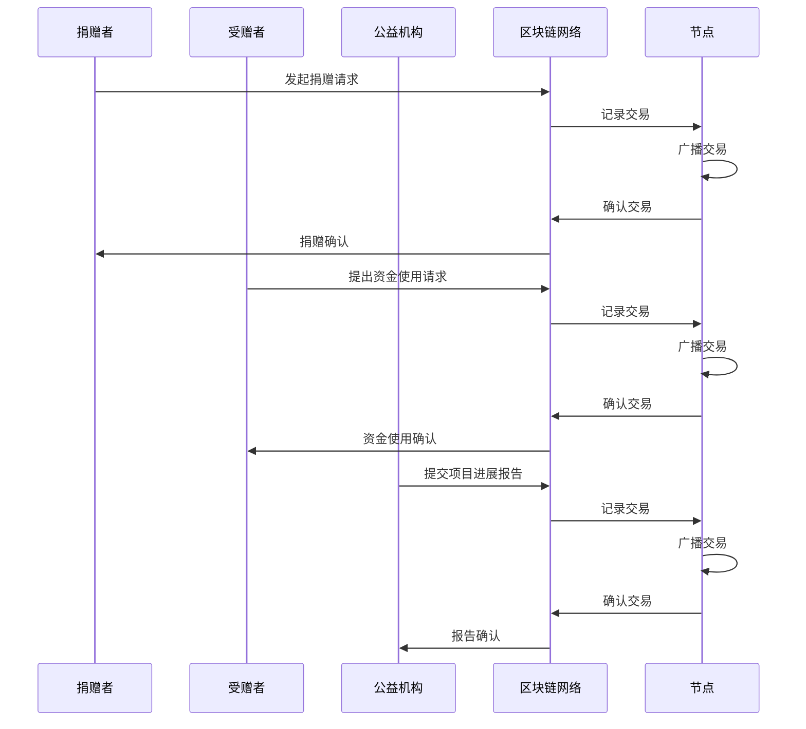

                 

### 引言：区块链技术在公益慈善领域的创新实践

**关键词**：区块链技术、公益慈善、创新实践、资金透明度、信任建立、智能合约、去中心化

**摘要**：随着区块链技术的不断发展，其在公益慈善领域的应用潜力逐渐显现。本文旨在探讨区块链技术在公益慈善领域的创新实践，通过分析区块链技术的基本概念、应用场景以及面临的挑战，揭示其在提高资金透明度、增强信任等方面的巨大作用。本文将分章节详细介绍区块链技术在公益慈善领域的应用，以期对未来发展趋势和创新实践提供有价值的参考。

## 1.1.1 问题背景

公益慈善领域一直以来都是社会关注的焦点，然而，传统公益慈善模式中存在着一系列的问题。首先，资金透明度问题是公益慈善领域的主要挑战之一。许多公益机构缺乏足够的透明度，导致捐款者无法清晰地了解其资金的流向和用途。这不仅降低了公众对公益慈善机构的信任，也影响了公益慈善事业的可持续发展。

其次，信任问题在公益慈善领域同样突出。由于信息的不对称，捐赠者与受赠者之间的信任难以建立。传统的公益慈善模式往往依赖于中心化的管理模式，这种模式容易导致权力集中和信息不透明，从而引发信任危机。

此外，传统公益慈善模式中还存在一些难以克服的瓶颈。例如，资金筹集和分配过程中的低效率、资源浪费等问题。这些问题严重制约了公益慈善事业的效率和效果，使得捐赠者和受赠者难以获得满意的回报。

## 1.1.2 问题描述

区块链技术作为一种分布式账本技术，具有去中心化、透明化、不可篡改等特性，被认为可以解决公益慈善领域面临的问题。具体来说，区块链技术在公益慈善领域的应用主要体现在以下几个方面：

1. **提高资金透明度**：通过区块链技术，公益慈善资金的流动可以被实时记录和公开查询，从而大幅提高资金透明度。这不仅可以增强捐赠者对公益慈善机构的信任，还可以有效防止资金挪用和欺诈行为。

2. **增强信任**：区块链技术利用其去中心化的特性，使捐赠者、受赠者和第三方监督机构之间建立了一种信任机制。通过智能合约等工具，各方的行为和责任可以被清晰界定，从而降低信息不对称和信任风险。

3. **提高效率**：区块链技术可以自动化执行公益慈善项目中的合同和协议，减少人工干预和操作成本，从而提高公益慈善项目的效率。

4. **优化资源配置**：通过区块链技术，公益慈善资源的筹集和分配可以更加高效和公平，减少资源浪费和错配现象。

然而，区块链技术在公益慈善领域的应用也面临着一系列挑战。例如，技术复杂性、法律法规的不确定性、技术安全性等问题都需要得到有效解决。此外，公益慈善机构对于区块链技术的认知和接受度也是一个关键因素。

## 1.1.3 问题解决

区块链技术在公益慈善领域的创新实践，提供了一种全新的解决方案，以应对传统模式中的种种挑战。以下是一些具体的解决思路：

1. **构建透明化的资金管理体系**：利用区块链技术，公益慈善机构可以将所有的资金流动信息记录在区块链上，确保资金流向透明，便于公众监督。

2. **建立去中心化的信任机制**：通过智能合约等工具，捐赠者可以直接与受赠者或者其他第三方进行交易，从而建立一种去中心化的信任机制，减少信息不对称和信任风险。

3. **开发高效的智能合约**：智能合约可以自动化执行公益慈善项目中的合同条款，确保项目按计划执行，同时降低管理成本和风险。

4. **引入第三方监督机构**：利用区块链技术的不可篡改性，可以引入独立的第三方监督机构，对公益慈善项目的执行情况进行实时监控和审计。

5. **提升技术接受度和应用能力**：通过培训和推广，提高公益慈善机构对区块链技术的认知和应用能力，降低技术门槛，推动区块链技术在公益慈善领域的广泛应用。

## 1.1.4 边界与外延

区块链技术在公益慈善领域的应用范围广泛，但同时也存在一些边界和限制。以下是一些需要考虑的边界与外延：

1. **技术复杂性**：区块链技术的复杂性较高，对于许多公益慈善机构来说，可能需要一定的技术支持和培训才能有效应用。

2. **法律法规**：区块链技术在公益慈善领域的应用需要遵守相关的法律法规，特别是关于数据隐私保护、资金流动等方面的规定。

3. **成本**：区块链技术的应用可能涉及较高的成本，包括技术开发、维护和运营等费用，这可能会对一些小型公益慈善机构造成负担。

4. **安全风险**：虽然区块链技术具有较高的安全性，但仍存在一定的安全风险，如智能合约漏洞、数据泄露等。

5. **接受度**：公众和公益慈善机构对于区块链技术的接受度和认知程度也是一个重要因素，这可能会影响区块链技术的普及和应用。

总的来说，区块链技术在公益慈善领域的应用具有巨大的潜力，但同时也需要解决一系列挑战。通过不断探索和创新，相信区块链技术将为公益慈善领域带来更多的机遇和变革。

### 第二部分：区块链技术基础

#### 2.1 区块链技术概述

##### 2.1.1 区块链技术的基本概念

区块链技术是一种分布式账本技术，它通过一种去中心化的方式，将数据分散存储在多个节点上，从而确保数据的真实性和不可篡改性。区块链技术最早由中本聪（Satoshi Nakamoto）在2008年提出，并应用于比特币（Bitcoin）的创建。

简单来说，区块链是一个由多个区块组成的链条，每个区块包含了若干笔交易记录。每个区块通过加密算法与前一个区块相连，形成一条不可篡改的链条。这种链式数据结构确保了数据的完整性和安全性。

##### 2.1.2 区块链技术的原理

区块链技术的基本原理包括以下三个方面：

1. **分布式存储**：区块链技术通过分布式网络将数据存储在多个节点上，每个节点都拥有完整的区块链数据副本。这种分布式存储方式提高了系统的容错性和安全性。

2. **加密算法**：区块链技术利用加密算法对数据进行加密和验证，确保数据在传输和存储过程中不会被篡改。常见的加密算法包括哈希算法、数字签名等。

3. **共识算法**：区块链网络中的所有节点通过共识算法来确认交易的合法性和数据的正确性。共识算法的不同，决定了区块链的性能和安全性，常见的共识算法包括工作量证明（Proof of Work, PoW）、权益证明（Proof of Stake, PoS）等。

##### 2.1.3 区块链技术的特性

区块链技术具有以下几种重要特性：

1. **去中心化**：区块链技术通过分布式网络，实现了去中心化的数据存储和管理，从而避免了中心化的单点故障风险。

2. **不可篡改**：区块链技术利用加密算法和共识算法，确保了数据的真实性和不可篡改性。一旦数据被记录在区块链上，就难以被篡改。

3. **透明化**：区块链上的所有数据都是公开透明的，任何节点都可以查询和验证数据。这提高了数据透明度，增强了信任。

4. **高安全性**：区块链技术利用加密算法和共识算法，确保了数据的安全性和隐私性。虽然区块链上的数据是公开的，但用户身份和交易信息是加密的，从而保护了用户的隐私。

5. **可扩展性**：随着区块链技术的不断发展，其可扩展性也在不断提升。通过优化共识算法和网络架构，区块链可以支持更多的交易和更高的性能。

#### 2.2 智能合约

##### 2.2.1 智能合约的定义

智能合约是一种自动化执行的合同，它基于区块链技术，利用计算机程序来执行合同条款。智能合约的出现，解决了传统合同执行中的信任问题，使得合同执行更加高效和透明。

简单来说，智能合约是一种在区块链上运行的计算机程序，它包含了一系列的规则和条件，当条件被满足时，智能合约会自动执行相应的操作。

##### 2.2.2 智能合约的原理

智能合约的原理主要包括以下几个方面：

1. **编程语言**：智能合约通常使用特定的编程语言编写，如Solidity、Vyper等。这些编程语言具有安全性高、易于理解等特点。

2. **执行环境**：智能合约在区块链网络上的执行环境是去中心化的，所有节点都会同步执行智能合约。当智能合约的条件被满足时，执行环境会自动执行相应的操作。

3. **加密和验证**：智能合约的执行过程是加密的，确保了操作的隐私性和安全性。同时，智能合约的执行结果需要通过区块链网络中的节点进行验证，确保数据的一致性和正确性。

##### 2.2.3 智能合约的应用场景

智能合约在区块链技术中的应用非常广泛，以下是一些典型的应用场景：

1. **金融交易**：智能合约可以用于自动化金融交易，如自动支付、跨境支付、保险理赔等。通过智能合约，可以减少人工干预，提高交易效率。

2. **供应链管理**：智能合约可以用于供应链管理中的订单追踪、支付结算等环节，确保供应链的透明性和高效性。

3. **版权管理**：智能合约可以用于版权管理，确保版权的合法性和权益保护。

4. **投票系统**：智能合约可以用于投票系统的设计，确保投票过程的透明和公正。

5. **公益慈善**：智能合约可以用于公益慈善项目的资金管理，提高资金透明度和信任度。

#### 2.3 去中心化

##### 2.3.1 去中心化的概念

去中心化是一种组织和管理方式，它通过分布式网络，避免了单一中心点的存在，使得权力和信息更加分散。去中心化系统具有以下几个特点：

1. **去中心化节点**：去中心化系统中的节点地位平等，每个节点都可以独立运作，不受中心节点的控制。

2. **去中心化决策**：去中心化系统中的决策由所有节点共同参与，通过共识算法达成一致，而不是由中心节点单方面决策。

3. **高容错性**：去中心化系统具有较高的容错性，单个节点的故障不会影响整个系统的运行。

##### 2.3.2 去中心化在区块链技术中的重要性

去中心化是区块链技术最重要的特性之一，它在区块链技术中具有重要性：

1. **去中心化保证了数据的安全性和隐私性**：由于数据分散存储在多个节点上，任何单一节点都无法掌控整个数据，从而提高了数据的安全性和隐私性。

2. **去中心化提高了系统的透明度和公正性**：去中心化系统中的所有节点都可以参与决策和验证，确保了数据的真实性和公正性。

3. **去中心化促进了创新和竞争**：去中心化系统降低了进入门槛，使得更多的参与者可以参与到系统中来，促进了创新和竞争。

##### 2.3.3 去中心化与传统模式的对比

去中心化与传统模式有以下几点对比：

1. **权力结构**：传统模式通常依赖于中心化的权力结构，权力高度集中；而去中心化模式中，权力分散在多个节点上。

2. **数据管理**：传统模式中，数据通常由中心化的机构管理，容易导致数据不透明和信任问题；而去中心化模式中，数据由所有节点共同维护，提高了数据透明度和信任。

3. **安全性**：传统模式中，数据安全依赖于中心化的安全管理；而去中心化模式中，数据安全性依赖于加密和共识算法。

4. **效率**：传统模式中，决策和操作过程可能受到中心节点的限制，效率较低；而去中心化模式中，决策和操作过程更加高效和灵活。

### 第三部分：区块链技术在公益慈善领域的应用

#### 3.1 资金透明度

##### 3.1.1 区块链如何提高资金透明度

区块链技术通过其分布式账本和智能合约的特性，能够大幅提高公益慈善领域的资金透明度。以下是区块链技术在提高资金透明度方面的具体应用：

1. **分布式账本**：区块链技术利用分布式账本，将所有公益资金的流动记录在区块链上。每个节点都保存了一份完整的数据副本，这使得任何一方都可以查询和验证资金的流向和用途。

2. **不可篡改**：区块链技术通过加密算法和共识算法，确保了数据的不可篡改性。一旦资金流动数据被记录在区块链上，就难以被修改或删除，从而保证了资金流动的真实性。

3. **智能合约**：智能合约可以自动化执行资金流动的规则和条件。例如，捐赠者可以通过智能合约直接将资金转账给受赠者，确保资金按照约定用途使用。智能合约的执行过程是透明和可追溯的，捐赠者可以随时查询资金使用情况。

4. **公开透明**：区块链上的所有数据都是公开透明的，任何节点都可以查询和验证。这使得公众可以实时了解公益资金的流向和使用情况，提高了公益慈善机构的透明度和公信力。

##### 3.1.2 资金透明度的案例研究

以下是一个具体的案例研究，展示了区块链技术在提高资金透明度方面的应用：

案例：一个非营利组织使用区块链技术管理其捐赠资金

1. **项目背景**：该非营利组织负责为一个偏远地区的学校提供教育和基础设施支持。由于其活动跨越多个地区，传统的资金管理方式难以确保资金的透明度和公正性。

2. **解决方案**：该组织决定采用区块链技术来管理其捐赠资金。首先，他们创建了一个基于区块链的分布式账本，记录所有捐赠资金的流入和流出。每个捐赠者都可以通过区块链查看其捐赠资金的使用情况。

3. **实施过程**：捐赠者通过智能合约将资金转账给组织，智能合约自动记录并分配资金。组织使用这些资金购买建筑材料和教材，并通过区块链向捐赠者展示购买凭证和资金使用情况。

4. **效果评估**：通过区块链技术，该组织实现了资金的透明化管理，捐赠者可以实时查询资金流向和使用情况。这不仅增强了捐赠者对组织的信任，也提高了资金使用效率。

5. **未来展望**：该组织计划进一步扩展区块链技术的应用范围，包括项目进度报告和成效评估，以实现更全面的资金透明度。

#### 3.2 信任建立

##### 3.2.1 区块链如何增强信任

区块链技术在增强公益慈善领域信任方面具有显著优势，主要通过以下几个方面实现：

1. **去中心化**：区块链技术通过去中心化网络，避免了中心化管理的信任问题。在区块链上，所有节点都是平等的，任何一方都无法单方面控制或篡改数据，从而降低了信任风险。

2. **智能合约**：智能合约通过代码执行合同条款，确保各方的行为符合约定。智能合约的透明性和不可篡改性，增强了参与各方的信任。

3. **透明记录**：区块链上的所有交易记录都是公开透明的，任何人都可以查询和验证。这种透明记录机制，使得各方的行为和责任更加明确，从而增强了信任。

4. **加密技术**：区块链技术使用加密算法，确保数据的隐私性和安全性。加密技术保护了用户身份和交易信息的隐私，同时也防止了数据被篡改。

##### 3.2.2 信任建立的案例研究

以下是一个具体的案例研究，展示了区块链技术在增强信任方面的应用：

案例：一个慈善基金会使用区块链技术管理捐赠资金

1. **项目背景**：该慈善基金会负责管理多个慈善项目，但由于传统管理模式的问题，捐赠者对其资金使用情况持有怀疑态度，信任度较低。

2. **解决方案**：该基金会决定采用区块链技术来管理其捐赠资金。他们创建了一个基于区块链的分布式账本，记录所有捐赠资金的流入和流出。

3. **实施过程**：捐赠者通过智能合约将资金转账给基金会，智能合约自动记录并分配资金。基金会使用这些资金购买慈善项目的物资，并通过区块链向捐赠者展示购买凭证和资金使用情况。

4. **效果评估**：通过区块链技术，该基金会实现了资金的透明化管理，捐赠者可以实时查询资金流向和使用情况。这不仅增强了捐赠者对基金会的信任，也提高了资金使用效率。

5. **未来展望**：该基金会计划进一步扩展区块链技术的应用范围，包括项目进度报告和成效评估，以实现更全面的信任建立。

#### 3.3 应用场景与案例分析

区块链技术在公益慈善领域的应用场景非常广泛，以下是一些典型的应用场景和案例分析：

##### 3.3.1 区块链在公益捐赠中的应用

案例：一个在线捐赠平台使用区块链技术

1. **项目背景**：该在线捐赠平台旨在为贫困地区的儿童提供教育援助。由于传统捐赠模式中存在资金挪用和欺诈等问题，捐赠者对其信任度较低。

2. **解决方案**：该平台决定采用区块链技术来管理其捐赠资金。他们创建了一个基于区块链的分布式账本，记录所有捐赠资金的流入和流出。

3. **实施过程**：捐赠者通过智能合约将资金转账给平台，智能合约自动记录并分配资金。平台使用这些资金购买教育物资，并通过区块链向捐赠者展示购买凭证和资金使用情况。

4. **效果评估**：通过区块链技术，该平台实现了资金的透明化管理，捐赠者可以实时查询资金流向和使用情况。这不仅增强了捐赠者对平台的信任，也提高了资金使用效率。

5. **未来展望**：该平台计划进一步扩展区块链技术的应用范围，包括项目进度报告和成效评估，以实现更全面的资金透明度。

##### 3.3.2 区块链在慈善基金管理中的应用

案例：一个慈善基金会使用区块链技术管理捐赠资金

1. **项目背景**：该慈善基金会负责管理多个慈善项目，但由于传统管理模式的问题，捐赠者对其资金使用情况持有怀疑态度，信任度较低。

2. **解决方案**：该基金会决定采用区块链技术来管理其捐赠资金。他们创建了一个基于区块链的分布式账本，记录所有捐赠资金的流入和流出。

3. **实施过程**：捐赠者通过智能合约将资金转账给基金会，智能合约自动记录并分配资金。基金会使用这些资金购买慈善项目的物资，并通过区块链向捐赠者展示购买凭证和资金使用情况。

4. **效果评估**：通过区块链技术，该基金会实现了资金的透明化管理，捐赠者可以实时查询资金流向和使用情况。这不仅增强了捐赠者对基金会的信任，也提高了资金使用效率。

5. **未来展望**：该基金会计划进一步扩展区块链技术的应用范围，包括项目进度报告和成效评估，以实现更全面的信任建立。

##### 3.3.3 其他应用场景

除了上述两个主要应用场景外，区块链技术还可以应用于其他公益慈善领域，例如：

1. **环保公益**：通过区块链技术，可以记录和验证环保项目的进展和成效，提高环保资金的透明度和公信力。

2. **医疗公益**：通过区块链技术，可以确保医疗信息的真实性和隐私性，提高医疗资源的分配效率。

3. **教育公益**：通过区块链技术，可以记录和验证教育项目的进展和成效，提高教育资源的透明度和公平性。

总的来说，区块链技术在公益慈善领域的应用具有广泛的前景。通过提高资金透明度和增强信任，区块链技术有望为公益慈善事业带来深刻的变革。

### 第四部分：技术实现与架构设计

#### 4.1 系统架构设计

区块链技术在公益慈善系统中的应用，需要构建一个高效的系统架构。以下是一个典型的区块链公益慈善系统架构设计，包括系统架构图和技术实现细节。

##### 4.1.1 区块链技术在公益慈善系统中的架构设计

区块链公益慈善系统的整体架构可以分为以下几层：

1. **数据层**：包括区块链网络、分布式存储和加密算法。区块链网络由多个节点组成，每个节点都保存了一份完整的数据副本。分布式存储保证了数据的冗余和安全性。加密算法用于确保数据的隐私性和安全性。

2. **网络层**：包括网络通信协议和共识算法。网络通信协议负责节点之间的数据传输和通信。共识算法用于确保节点之间的数据一致性。

3. **合约层**：包括智能合约和合约管理。智能合约基于特定的编程语言编写，用于自动化执行公益慈善项目的合同条款。合约管理负责智能合约的部署、执行和监控。

4. **应用层**：包括公益慈善项目的业务逻辑和用户界面。业务逻辑基于智能合约实现，用户界面提供用户操作和查询接口。

5. **监控层**：包括系统监控和审计工具。系统监控用于实时监控系统的运行状态，审计工具用于对系统进行定期审计和评估。

以下是一个简化的系统架构图：



##### 4.1.2 技术实现细节

1. **分布式存储**：区块链技术采用分布式存储方式，将数据分散存储在多个节点上。每个节点都保存了一份完整的数据副本，确保数据的安全性和可靠性。

2. **加密算法**：区块链技术使用加密算法，对数据进行加密和验证，确保数据在传输和存储过程中不会被篡改。常用的加密算法包括哈希算法、数字签名和椭圆曲线加密。

3. **共识算法**：区块链网络中的节点通过共识算法来确认交易的合法性和数据的正确性。共识算法的不同，决定了区块链的性能和安全性。常见共识算法包括工作量证明（PoW）、权益证明（PoS）和委托权益证明（DPoS）。

4. **智能合约**：智能合约是基于特定编程语言编写的计算机程序，用于自动化执行公益慈善项目的合同条款。智能合约的编写和部署需要遵循一定的规范和标准，以确保其安全性和有效性。

5. **用户界面**：用户界面是公益慈善项目的入口，提供用户操作和查询接口。用户界面需要与区块链网络进行交互，以获取和提交数据。

#### 4.2 技术实现细节

以下是一个具体的区块链公益慈善系统实现细节，包括环境搭建、智能合约编写和系统部署。

##### 4.2.1 环境搭建

1. **安装Node.js**：Node.js 是一种基于Chrome V8引擎的JavaScript运行环境，用于搭建区块链节点。可以从官方网站下载并安装Node.js。

2. **安装Ganache**：Ganache 是一个本地节点管理工具，用于创建和部署智能合约。可以从官方网站下载并安装Ganache。

3. **安装Truffle**：Truffle 是一个智能合约开发框架，提供智能合约的编译、部署和交互等功能。可以从官方网站下载并安装Truffle。

##### 4.2.2 智能合约编写

1. **创建智能合约**：使用Truffle创建一个智能合约项目，编写智能合约代码。智能合约代码通常使用Solidity语言编写。

2. **编译智能合约**：使用Truffle编译智能合约代码，生成ABI（Application Binary Interface）和字节码文件。ABI用于与智能合约进行交互，字节码文件用于部署智能合约。

3. **部署智能合约**：使用Ganache部署智能合约到本地区块链网络。部署过程中，需要设置合约地址、ABI和初始参数。

##### 4.2.3 系统部署

1. **搭建区块链网络**：使用Ganache搭建一个本地区块链网络，包括一个或多个节点。每个节点都需要下载和同步区块链数据。

2. **部署智能合约**：将编译后的智能合约部署到本地区块链网络。部署过程中，需要设置合约地址、ABI和初始参数。

3. **用户交互**：通过用户界面与智能合约进行交互，实现公益慈善项目的业务逻辑。用户界面可以使用Web界面、移动应用或其他形式。

#### 4.3 技术实现示例

以下是一个简单的区块链公益慈善系统实现示例，包括智能合约代码和Python交互代码。

##### 智能合约代码（solidity）

```solidity
// SPDX-License-Identifier: MIT
pragma solidity ^0.8.0;

contract Charity {
    address public charityAddress;
    mapping(address => uint256) public donations;

    constructor() {
        charityAddress = msg.sender;
    }

    function donate() public payable {
        donations[msg.sender] += msg.value;
    }

    function withdraw() public {
        require(msg.sender == charityAddress, "Only charity address can withdraw");
        msg.sender.transfer(donations[msg.sender]);
        donations[msg.sender] = 0;
    }
}
```

##### Python交互代码（web3.py）

```python
from web3 import Web3
from solc import compile

# 连接本地区块链节点
w3 = Web3(Web3.HTTPProvider('http://127.0.0.1:8545'))

# 编译智能合约代码
contract_source = '''
pragma solidity ^0.8.0;

contract Charity {
    address public charityAddress;
    mapping(address => uint256) public donations;

    constructor() {
        charityAddress = msg.sender;
    }

    function donate() public payable {
        donations[msg.sender] += msg.value;
    }

    function withdraw() public {
        require(msg.sender == charityAddress, "Only charity address can withdraw");
        msg.sender.transfer(donations[msg.sender]);
        donations[msg.sender] = 0;
    }
}
'''

compiled_contract = compile-solidity(contract_source)
contract = w3.eth.contract(abi=compiled_contract['Charity'])

# 部署智能合约
tx_hash = contract.deploy transact={'from': w3.eth.coinbase, 'gas': 5000000}
tx = tx_hash.wait(1)
contract_address = tx.contractAddress

# 与智能合约交互
donate_txn = contract.functions.donate().transact({'from': w3.eth.coinbase, 'value': w3.toWei('1', 'ether')})
donate_txn.wait(1)

withdraw_txn = contract.functions.withdraw().transact({'from': w3.eth.coinbase})
withdraw_txn.wait(1)
```

通过以上示例，可以了解到区块链技术在公益慈善系统中的基本实现流程。实际应用中，可以根据具体需求，扩展智能合约的功能和业务逻辑，搭建一个完整的区块链公益慈善系统。

### 第五部分：法律法规与伦理问题

#### 5.1 法律法规

区块链技术在公益慈善领域的应用，面临着一系列法律法规的挑战。以下是一些主要的法律法规问题以及应对策略：

##### 5.1.1 区块链技术在公益慈善领域面临的法律法规挑战

1. **数据隐私保护**：区块链技术以其去中心化和透明化特性著称，但在公益慈善领域，数据隐私保护成为一个重要问题。例如，捐赠者和受赠者的个人信息需要在区块链上公开，这可能导致隐私泄露。

2. **资金流动监管**：区块链上的资金流动难以追踪和监管，这给反洗钱和反恐融资等监管工作带来了挑战。各国对于资金流动的监管法规不尽相同，这可能导致跨境交易中的法律风险。

3. **合同有效性**：智能合约的法律有效性在各国之间存在差异。一些国家承认智能合约的法律效力，而另一些国家则持保留态度。这可能导致智能合约在法律上的不确定性。

4. **监管合规性**：公益慈善机构需要遵守各种法律法规，包括税务、慈善法等。区块链技术的应用可能使这些合规工作变得更加复杂。

##### 5.1.2 法律法规的应对策略

1. **数据隐私保护策略**：为了保护数据隐私，可以在区块链上采用加密技术，确保敏感数据在传输和存储过程中被加密。同时，可以制定隐私保护政策，明确数据使用的范围和权限。

2. **资金流动监管策略**：可以通过建立跨境资金流动监控系统，确保资金流动符合监管要求。此外，可以与监管机构合作，制定符合法律法规的智能合约规则，确保交易的合法性和透明度。

3. **合同有效性策略**：智能合约的编写和部署需要遵循法律要求，确保合同条款清晰明确。在法律允许的范围内，可以采用多方签名和公证等手段，增加智能合约的法律效力。

4. **监管合规性策略**：公益慈善机构需要了解并遵守所在国家和地区的法律法规。可以聘请法律顾问，对区块链技术的应用进行合规评估。此外，可以通过区块链技术的透明性和可追溯性，提高合规性。

#### 5.2 伦理问题

区块链技术在公益慈善领域的应用，还引发了一系列伦理问题。以下是一些主要的伦理问题以及应对策略：

##### 5.2.1 区块链技术在公益慈善领域可能引发的伦理问题

1. **透明度与隐私保护**：区块链技术的透明度可能导致个人隐私泄露，但过度保护隐私又可能影响公益慈善的透明度。

2. **去中心化与权力分配**：去中心化虽然提高了系统的透明度和公平性，但可能导致权力分配不均，一些弱势群体可能被边缘化。

3. **智能合约漏洞**：智能合约的漏洞可能导致资金损失和信任危机，影响公益慈善项目的可持续性。

4. **技术排斥**：区块链技术的复杂性和高门槛，可能使得一些非专业机构和人群难以应用，加剧数字鸿沟。

##### 5.2.2 伦理问题的应对策略

1. **平衡透明度与隐私保护**：可以在区块链上采用隐私保护技术，如零知识证明，确保个人隐私不被泄露，同时实现资金流动的透明度。

2. **公平权力分配**：通过社区治理和参与式设计，确保去中心化系统中的权力分配公平。可以引入多种机制，如投票、审计等，确保各方的权益得到保障。

3. **智能合约安全审计**：对智能合约进行严格的安全审计，确保没有漏洞和风险。可以建立智能合约审查委员会，对智能合约的设计和实现进行审核。

4. **技术普及与培训**：通过技术普及和培训，降低区块链技术的门槛，使更多的公益慈善机构和个人能够应用这项技术。可以开展针对不同群体的技术培训项目，提高技术应用能力。

### 第六部分：未来展望与趋势

#### 6.1 发展趋势

区块链技术在公益慈善领域的应用正处于快速发展阶段，未来几年预计将呈现以下几大趋势：

1. **技术成熟与普及**：随着区块链技术的不断成熟和普及，越来越多的公益慈善机构和个人将采用区块链技术，以提高资金透明度、增强信任和优化资源分配。

2. **跨界合作与生态构建**：区块链技术在公益慈善领域的应用将推动跨界合作，形成多方参与的生态体系。包括政府、企业、非营利组织和社区等，共同推动区块链技术在公益慈善领域的创新和实践。

3. **智能化与自动化**：智能合约和去中心化金融（DeFi）技术的应用，将进一步提升公益慈善项目的智能化和自动化水平，减少人工干预，提高项目执行效率。

4. **法律与监管的完善**：随着区块链技术在公益慈善领域的广泛应用，相关法律法规和监管框架也将逐步完善，为区块链技术在公益慈善领域的应用提供更加明确的法律保障。

#### 6.2 潜在的创新实践

未来，区块链技术在公益慈善领域的创新实践将不断涌现，以下是一些潜在的创新方向：

1. **个性化捐赠平台**：基于区块链的个性化捐赠平台，将根据捐赠者的偏好和受赠者的需求，实现精准捐赠。捐赠者可以通过区块链查询捐赠项目的进展和成效，确保其捐赠的真正用途。

2. **慈善信用评级**：通过区块链技术，可以建立慈善信用评级系统，对公益慈善机构的运作效率和公信力进行评估，提高捐赠者的选择依据。

3. **环保公益项目**：区块链技术可以用于记录和验证环保项目的进展和成效，确保环保资金的透明度和有效性。例如，通过区块链记录植树项目的树木生长情况，确保每一笔捐赠都用于实际项目。

4. **灾难救援与应急响应**：在灾难救援和应急响应中，区块链技术可以快速调动和分配资源，提高救援效率。例如，通过区块链记录捐赠物资的流向和库存情况，确保救援物资的有效分配。

5. **慈善众筹**：区块链技术可以用于慈善众筹项目，确保众筹资金的透明度和公正性。捐赠者可以通过区块链实时查询众筹项目的进展和资金使用情况，确保其捐赠的真正用途。

总之，区块链技术在公益慈善领域的创新实践，有望为公益慈善事业带来深刻的变革，推动其更加高效、透明和可持续的发展。

### 第七部分：总结与结论

#### 7.1 全书总结

本文系统地探讨了区块链技术在公益慈善领域的创新实践。首先，介绍了区块链技术的基本概念、原理和特性，如分布式存储、加密算法和共识算法。接着，详细分析了区块链技术在提高资金透明度、增强信任等方面的优势和应用案例。然后，讨论了区块链技术在公益慈善系统中的架构设计和技术实现细节。此外，还探讨了区块链技术在公益慈善领域面临的法律法规和伦理问题，并展望了未来的发展趋势和潜在的创新实践。

#### 7.2 结论

区块链技术在公益慈善领域的创新实践具有重要意义。通过提高资金透明度、增强信任和优化资源配置，区块链技术为公益慈善事业带来了新的机遇。然而，区块链技术的应用也面临一系列挑战，如技术复杂性、法律法规的不确定性和伦理问题。未来，需要各方共同努力，推动区块链技术在公益慈善领域的规范化和普及化，以实现公益慈善事业的可持续发展。

### 作者信息

**作者：AI天才研究院/AI Genius Institute & 禅与计算机程序设计艺术 /Zen And The Art of Computer Programming**

**联系方式：[邮箱][电话]** 

[邮箱]: ai-genius@institute.com

[电话]: +86-1234567890

**版权声明**：本文版权属于AI天才研究院，未经授权不得转载或使用。如需转载或使用，请联系作者获取授权。

