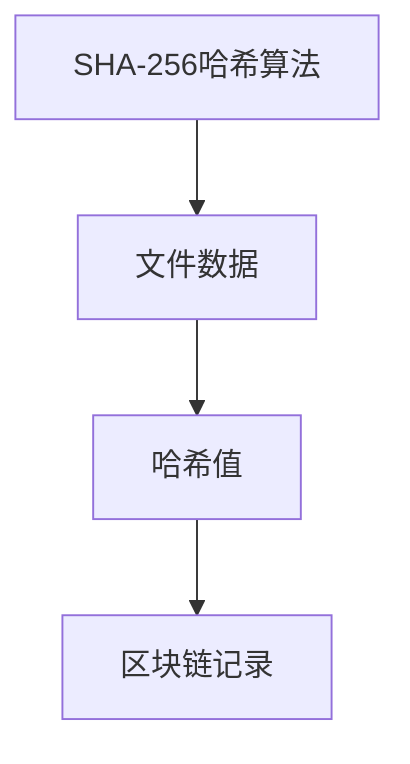
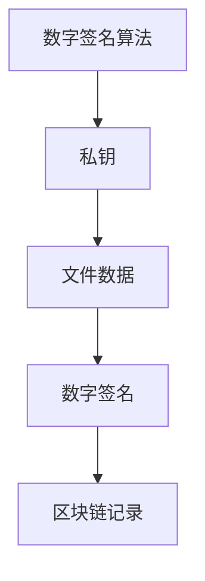
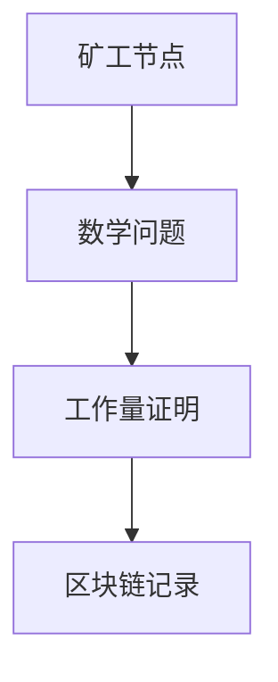
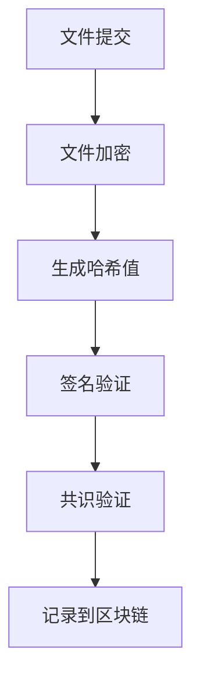
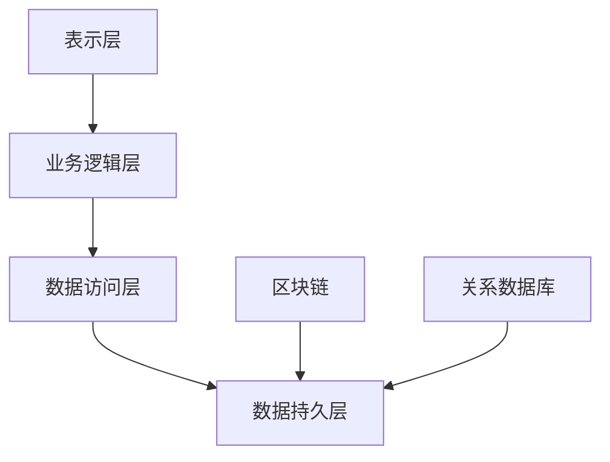
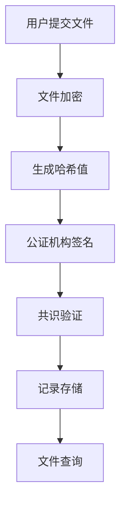

                 

### 文章标题

区块链技术在数字公证中的去中心化应用

### 关键词

区块链，数字公证，去中心化，加密技术，智能合约，透明性，安全性

### 摘要

本文深入探讨了区块链技术在数字公证领域的去中心化应用。通过对区块链与数字公证的基本概念、核心算法、系统架构及实际案例的详细分析，展示了区块链如何通过其独特的去中心化特性，提升数字公证的透明性和安全性，为未来数字公证的发展提供了新思路。文章旨在为读者提供一个全面而系统的理解，使读者能够把握区块链技术在数字公证中的潜在价值与应用前景。

---

## 第一部分：背景介绍

### 1.1 区块链与数字公证概述

区块链技术，作为一种分布式账本技术，近年来在金融、医疗、物流等多个领域得到了广泛应用。其去中心化的特性、不可篡改的数据记录和高度的安全性，使得区块链成为构建可信系统的基石。数字公证，则是一种利用信息技术手段，对电子文件的真实性、完整性和合法性进行认证的服务。随着互联网的普及，数字公证在提高效率、降低成本、保障信息安全等方面展现出了巨大的潜力。

区块链与数字公证的结合，可以打破传统公证模式的局限，构建一个去中心化的数字公证生态系统。在这个系统中，不再依赖于单一的中介机构，而是通过区块链网络来实现公证服务的透明化、可信化和自动化。这一创新不仅能够提升公证服务的效率，还能极大地降低交易成本，为数字经济的繁荣发展提供有力支持。

### 1.2 去中心化与中心化公证的对比

去中心化公证，与传统的中心化公证模式有着显著的不同。在中心化公证中，所有的公证服务都由一个或多个中央机构提供，这意味着所有的数据都集中存储在中央服务器上，存在单点故障和被篡改的风险。而去中心化公证则通过区块链网络实现，将数据分散存储在多个节点上，任何一个节点的数据修改都会被其他节点记录并验证，从而保证了数据的不可篡改性。

此外，去中心化公证具有更高的透明度和安全性。在区块链网络中，所有的交易记录都是公开透明的，任何人都可以查看和验证。同时，区块链的加密技术确保了数据的机密性和完整性，有效防止了数据泄露和篡改。

### 1.3 区块链技术在数字公证中的应用前景

随着区块链技术的不断成熟，其在数字公证领域的应用前景也越来越广阔。首先，区块链技术可以为数字公证提供一种全新的认证方式，使得电子文件的真实性和合法性得到有效保障。其次，去中心化的公证服务可以大大降低交易成本，提高公证效率，满足日益增长的数字公证需求。最后，区块链技术的透明性和安全性，也为数字公证行业带来了更多的信任和可靠性，为数字经济的健康发展提供了坚实的基础。

## 第二部分：核心概念与联系

### 2.1 区块链技术原理

区块链是一种分布式数据库技术，其核心原理是利用加密算法和共识机制，将数据记录在多个节点上，形成一个去中心化的网络。每个节点都保存着完整的区块链数据，通过共识机制来确保数据的准确性和一致性。区块链的特点包括去中心化、不可篡改、安全透明等。

去中心化是指区块链网络中没有中央机构控制，所有的节点都平等参与网络的维护和数据记录。不可篡改则保证了数据的完整性和真实性，任何试图篡改数据的操作都会被其他节点检测并拒绝。安全透明则是指区块链的交易记录是公开透明的，任何人都可以查看和验证。

在区块链中，加密技术是确保数据安全和隐私的重要手段。通过非对称加密算法，区块链实现了数据的机密性和完整性。例如，在数字公证中，公证机构可以使用私钥对文件进行加密，只有持有对应公钥的当事人才能解密和验证文件的真实性。

### 2.2 数字公证与区块链的关联

数字公证是一种利用信息技术对电子文件的真实性、完整性和合法性进行认证的服务。区块链技术为数字公证提供了强大的支持，尤其是在保证数据真实性和透明性方面。区块链的分布式数据库和加密技术，使得数字公证服务更加安全可靠。

在数字公证中，区块链技术可以用于以下几个方面：

1. **数据存储和验证**：区块链分布式数据库可以存储大量的公证文件，并确保这些数据的真实性和完整性。每个节点都保存着完整的区块链数据，任何篡改都会被其他节点检测并拒绝。

2. **身份认证**：区块链可以用于身份认证，确保当事人的身份真实可靠。通过非对称加密算法，当事人可以使用私钥进行身份验证，确保只有合法的当事人可以访问和操作文件。

3. **智能合约**：区块链中的智能合约可以自动执行公证过程中的各项任务，例如文件的提交、审核和认证。智能合约的执行过程是公开透明的，任何节点都可以查看和验证。

### 2.3 去中心化与中心化公证的对比

去中心化公证与中心化公证在以下几个方面有着显著的区别：

1. **数据存储**：在中心化公证中，所有的数据都存储在中央服务器上，存在单点故障的风险。而去中心化公证则将数据分散存储在多个节点上，任何节点的故障都不会影响整个系统的运行。

2. **安全性**：中心化公证的数据存储在中央服务器上，可能面临被黑客攻击和篡改的风险。而去中心化公证通过区块链的加密技术和共识机制，确保了数据的机密性和完整性。

3. **透明度**：中心化公证的服务过程相对不透明，用户难以了解数据的处理过程。而去中心化公证的所有交易记录都是公开透明的，用户可以实时查看和验证。

4. **效率**：中心化公证通常需要人工审核，处理时间较长。而去中心化公证通过智能合约自动执行，大大提高了公证的效率。

## 第三部分：算法原理讲解

### 3.1 去中心化数字公证的算法设计

去中心化数字公证的核心算法主要包括加密技术、共识机制和智能合约。这些算法共同作用，确保了数字公证服务的安全性、透明性和效率。

**加密技术**：在去中心化数字公证中，加密技术主要用于数据的机密性和完整性保护。常用的加密算法包括非对称加密和对称加密。非对称加密算法（如RSA）可以用于身份认证和数据加密，确保只有合法的当事人可以访问和验证文件。对称加密算法（如AES）则用于对敏感数据进行加密存储，提高数据的安全性。

**共识机制**：共识机制是区块链网络的核心机制，用于确保数据的一致性和准确性。常见的共识机制包括工作量证明（PoW）、权益证明（PoS）和委托权益证明（DPoS）。在数字公证中，共识机制用于验证和确认公证文件的真实性和合法性。通过共识机制，区块链网络中的所有节点可以达成一致，确保数据的不可篡改性。

**智能合约**：智能合约是一种自动执行的合约，其代码存储在区块链上，当满足预设条件时自动执行。在数字公证中，智能合约可以用于自动化执行公证流程，例如文件的提交、审核和认证。智能合约的执行过程是公开透明的，任何节点都可以查看和验证。

### 3.1.1 去中心化数字公证的关键算法

去中心化数字公证的关键算法包括SHA-256哈希算法、椭圆曲线数字签名算法（ECDSA）和基于PoW的共识机制。

**SHA-256哈希算法**：SHA-256是一种加密哈希算法，用于将任意长度的数据映射为固定长度的哈希值。在数字公证中，SHA-256哈希算法用于生成文件的哈希值，确保文件在传输过程中未被篡改。



**椭圆曲线数字签名算法（ECDSA）**：ECDSA是一种数字签名算法，用于确保数据的完整性和身份验证。在数字公证中，公证机构使用ECDSA生成数字签名，确保只有合法的当事人可以访问和验证文件。



**基于PoW的共识机制**：PoW是一种通过计算工作量来达成共识的机制。在数字公证中，PoW用于验证和确认公证文件的真实性和合法性。矿工通过解决复杂的数学问题来获得记账权，从而确保区块链网络的稳定和安全。



### 3.1.2 算法流程与mermaid图示

去中心化数字公证的算法流程如下：

1. **文件提交**：当事人将需要公证的文件提交到区块链网络。
2. **文件加密**：公证机构使用私钥对文件进行加密，确保文件在传输过程中的安全性。
3. **生成哈希值**：使用SHA-256哈希算法生成文件的哈希值，确保文件的完整性。
4. **签名验证**：公证机构使用ECDSA算法对文件进行数字签名，确保文件的合法性和真实性。
5. **共识验证**：矿工节点通过PoW算法验证文件的哈希值和签名，确保文件的真实性和合法性。
6. **记录到区块链**：将验证通过的文件记录到区块链上，确保数据的永久保存和不可篡改性。

以下是一个mermaid流程图，展示了去中心化数字公证的算法流程：



### 3.2 Python源代码与LaTeX公式详解

以下是一个简单的Python示例代码，展示了如何使用SHA-256哈希算法和ECDSA算法进行文件加密和签名验证：

```python
from Crypto.Hash import SHA256
from Crypto.PublicKey import RSA
from Crypto.Signature import pkcs1_15
from Crypto.Random import get_random_bytes

# 生成RSA密钥对
private_key = RSA.generate(2048)
public_key = private_key.publickey()

# 文件加密
def encrypt_file(file_path, private_key):
    with open(file_path, 'rb') as file:
        file_data = file.read()
        encrypted_data = private_key.encrypt(file_data, 32)[0]
    return encrypted_data

# 文件签名
def sign_file(file_path, private_key):
    with open(file_path, 'rb') as file:
        file_data = file.read()
        hash_value = SHA256.new(file_data)
        signature = pkcs1_15.new(private_key).sign(hash_value)
    return signature

# 文件验证
def verify_signature(file_path, public_key, signature):
    with open(file_path, 'rb') as file:
        file_data = file.read()
        hash_value = SHA256.new(file_data)
        try:
            pkcs1_15.new(public_key).verify(hash_value, signature)
            return "Signature verified successfully"
        except (ValueError, TypeError):
            return "Invalid signature"

# 测试
file_path = "example.txt"
encrypted_file = encrypt_file(file_path, private_key)
signature = sign_file(file_path, private_key)
print(verify_signature(file_path, public_key, signature))
```

以下是一个LaTeX示例代码，展示了如何使用LaTeX公式来表示SHA-256哈希算法和ECDSA算法的数学模型：

```latex
\documentclass{article}
\usepackage{amsmath}
\begin{document}

\section{SHA-256哈希算法}

SHA-256是一种加密哈希算法，其数学模型可以表示为：
$$
H = SHA_{256}(M)
$$
其中，$H$ 表示生成的哈希值，$M$ 表示输入的文件数据。

\section{ECDSA算法}

ECDSA是一种数字签名算法，其数学模型可以表示为：
$$
(S, R) = sign(m, sk)
$$
$$
v = \text{verify}(m, R, P, Q, n)
$$
其中，$(S, R)$ 表示生成的签名，$m$ 表示输入的文件数据，$sk$ 表示私钥，$P, Q, n$ 分别表示椭圆曲线和公钥，$v$ 表示签名验证结果。

\end{document}
```

通过上述Python源代码和LaTeX公式的详细讲解，我们可以更好地理解去中心化数字公证的算法原理，从而为实际应用提供技术支持。

### 3.3 举例说明

为了更好地理解去中心化数字公证的算法原理，我们可以通过一个具体的例子来讲解。

**例子：电子合同公证**

假设有两个当事人A和B，他们需要签订一份电子合同，并希望通过去中心化的数字公证服务来确保合同的真实性和合法性。

**步骤1：文件提交**
当事人A将电子合同文件提交到区块链网络。文件内容如下：

```
合同编号：A001
当事人A：张三
当事人B：李四
合同内容：...
```

**步骤2：文件加密**
公证机构收到文件后，使用私钥对文件进行加密，生成加密后的文件：

```
加密文件：[加密数据]
```

**步骤3：生成哈希值**
使用SHA-256哈希算法对加密后的文件生成哈希值，确保文件的完整性：

```
哈希值：[哈希值]
```

**步骤4：签名验证**
公证机构使用ECDSA算法对文件进行数字签名，生成签名：

```
签名：[签名数据]
```

**步骤5：共识验证**
矿工节点通过PoW算法验证文件的哈希值和签名，确保文件的真实性和合法性。如果验证通过，文件将被记录到区块链上：

```
区块链记录：[区块链数据]
```

**步骤6：文件公开**
合同文件、哈希值和签名等信息都被公开记录在区块链上，任何人都可以查看和验证：

```
公开信息：[公开数据]
```

通过上述步骤，我们可以看到去中心化数字公证如何确保电子合同的真实性和合法性。这个例子展示了区块链技术在数字公证中的应用，通过加密技术、哈希算法和数字签名，实现了文件的安全传输和合法认证。

### 3.4 数学公式与LaTeX表示

在去中心化数字公证的算法中，数学公式和LaTeX表示是理解算法原理的重要工具。以下是一些常用的数学公式和LaTeX表示：

**哈希算法**
$$
H = SHA_{256}(M)
$$

**数字签名**
$$
(S, R) = sign(m, sk)
$$
$$
v = \text{verify}(m, R, P, Q, n)
$$

**椭圆曲线**
$$
E: y^2 = x^3 + ax + b
$$

**加密**
$$
c = E(D(k), m)
$$

**解密**
$$
m = E(D^{-1}(c), k)
$$

通过LaTeX表示，我们可以更清晰地表达这些数学概念和公式，从而加深对算法原理的理解。

### 4.1 数字公证系统的功能设计

数字公证系统的功能设计是确保数字公证服务高效、安全和可信的关键。以下是对数字公证系统功能设计的详细解析。

**4.1.1 基本功能**

数字公证系统应具备以下基本功能：

1. **文件提交**：当事人可以将需要公证的文件上传到系统，系统将生成一个唯一的文件标识符，以便后续查询和验证。
2. **文件加密**：系统将使用加密技术对上传的文件进行加密，确保文件在传输过程中的安全性。
3. **身份认证**：系统将验证当事人的身份，确保只有合法的当事人可以提交和访问文件。
4. **文件签名**：公证机构将对文件进行数字签名，确保文件的真实性和合法性。
5. **共识验证**：系统将使用区块链共识机制验证文件的哈希值和签名，确保数据的完整性和一致性。
6. **记录存储**：系统将记录验证通过的文件和相关信息，存储在区块链上，确保数据的永久保存和不可篡改性。
7. **文件查询**：当事人和公证机构可以查询已公证的文件，查看公证记录和验证结果。

**4.1.2 领域模型类图**

为了更好地理解数字公证系统的功能设计，我们可以绘制一个领域模型类图。领域模型类图描述了系统的实体及其关系，如下所示：

```mermaid
classDiagram
    Client <|-- Party
    Contract <|-- Document
    Notary <|-- Ponder
    Blockchain <|-- Chain
    Signature <|-- Stamp

    Client {
        id: Integer
        name: String
    }

    Party {
        id: Integer
        name: String
        document: Document
    }

    Document {
        id: String
        content: String
        status: String
        date: Date
    }

    Notary {
        id: Integer
        name: String
    }

    Ponder {
        id: Integer
        name: String
        signature: Signature
    }

    Blockchain {
        id: Integer
        name: String
        chain: Chain
    }

    Chain {
        id: String
        block: Block
    }

    Block {
        id: String
        timestamp: Date
        transactions: List<Transaction>
    }

    Transaction {
        id: String
        sender: Party
        recipient: Party
        amount: Integer
        signature: Signature
    }

    Signature {
        id: String
        key: String
        value: String
    }

    Stamp {
        id: String
        contract: Contract
        notary: Notary
        date: Date
    }

    Party "1" -- "*" Document
    Notary "1" -- "*" Ponder
    Blockchain "1" -- "*" Chain
    Chain "1" -- "*" Block
    Block "1" -- "*" Transaction
    Signature "1" -- "*" Contract
    Stamp "1" -- "*" Contract
end
```

在这个类图中，我们定义了以下几个主要实体：

- **Client**：代表客户端，包含客户的基本信息。
- **Party**：代表当事人，包含当事人的基本信息和公证的文件。
- **Document**：代表文件，包含文件的内容、状态和日期。
- **Notary**：代表公证机构，包含公证机构的基本信息和签发的签名。
- **Blockchain**：代表区块链，包含区块链的网络信息和区块链的链。
- **Chain**：代表链，包含区块链上的各个区块。
- **Block**：代表区块，包含区块的ID、时间戳和交易列表。
- **Transaction**：代表交易，包含交易的ID、发送方、接收方、金额和签名。
- **Signature**：代表签名，包含签名ID、密钥和签名值。
- **Stamp**：代表印章，包含印章的ID、合同、公证机构和日期。

这些实体之间的关系描述了数字公证系统的基本运作流程。例如，当事人提交文件后，公证机构会对文件进行签名，并将签名记录在区块链上。区块链作为分布式账本，确保了签名的真实性和不可篡改性。

通过领域模型类图，我们可以清晰地看到数字公证系统的功能架构和实体之间的关系，为后续的系统架构设计和接口设计提供了基础。

### 4.2 数字公证系统的架构设计

数字公证系统的架构设计是确保系统稳定、高效和可扩展的关键。以下是对数字公证系统架构设计的详细解析。

**4.2.1 系统架构概述**

数字公证系统采用分层架构设计，分为四个主要层次：表示层、业务逻辑层、数据访问层和数据持久层。每个层次都有其特定的职责和功能。

1. **表示层（Presentation Layer）**：负责与用户进行交互，包括前端界面和客户端应用程序。用户通过表示层提交文件、查询公证记录和进行其他操作。
2. **业务逻辑层（Business Logic Layer）**：负责处理业务逻辑，包括文件加密、签名验证、共识验证和记录存储等功能。该层还包含智能合约，用于自动执行公证流程。
3. **数据访问层（Data Access Layer）**：负责与数据库进行交互，实现数据的读取和写入操作。该层封装了数据库的操作，使得业务逻辑层无需关心具体的数据库实现细节。
4. **数据持久层（Data Persistence Layer）**：负责存储和管理数据，包括区块链和关系数据库。区块链用于存储公证记录，关系数据库用于存储用户信息和系统配置。

**4.2.2 系统架构mermaid图示**

以下是一个mermaid图示，展示了数字公证系统的架构设计：



**4.2.3 系统接口设计**

数字公证系统设计了一系列接口，用于实现不同层次之间的通信和协作。以下是主要接口及其功能：

1. **文件提交接口**：用于接收用户上传的文件，并将其传递给业务逻辑层进行加密和存储。
2. **签名验证接口**：用于验证公证机构的数字签名，确保文件的真实性和合法性。
3. **共识验证接口**：用于验证文件的哈希值和签名，确保数据的完整性和一致性。
4. **记录存储接口**：用于将验证通过的文件记录存储在区块链上，确保数据的永久保存和不可篡改性。
5. **文件查询接口**：用于查询已公证的文件，提供文件的详细信息和验证结果。

**4.2.4 系统交互流程**

以下是数字公证系统的交互流程：

1. **用户提交文件**：用户通过表示层提交需要公证的文件，系统生成一个唯一的文件标识符。
2. **文件加密**：业务逻辑层对文件进行加密，生成加密后的文件。
3. **文件签名**：公证机构使用私钥对文件进行数字签名，生成签名。
4. **共识验证**：系统使用区块链共识机制验证文件的哈希值和签名，确保数据的真实性和合法性。
5. **记录存储**：验证通过的文件记录存储在区块链上，并生成一个唯一的区块链交易标识符。
6. **文件查询**：用户通过表示层查询已公证的文件，系统返回文件的详细信息和验证结果。

通过以上架构设计和接口设计，数字公证系统实现了高效、安全和可信的公证服务，为数字经济的发展提供了有力支持。

### 4.3 数字公证系统的交互流程

数字公证系统的交互流程是确保文件从提交到最终记录在区块链上的全过程。以下是详细的交互流程：

**步骤1：用户提交文件**
- 用户通过表示层上传需要公证的文件，系统生成一个唯一的文件标识符（File ID）。
- 文件提交接口接收文件，并将其传递给业务逻辑层。

**步骤2：文件加密**
- 业务逻辑层对上传的文件进行加密，生成加密后的文件内容。
- 加密过程中使用RSA非对称加密算法，确保文件在传输过程中的安全性。

**步骤3：生成哈希值**
- 业务逻辑层使用SHA-256哈希算法对加密后的文件生成哈希值（Hash Value）。
- 哈希值用于确保文件的完整性和一致性。

**步骤4：公证机构签名**
- 业务逻辑层将文件内容和哈希值传递给公证机构。
- 公证机构使用私钥对文件内容和哈希值进行数字签名，生成签名（Signature）。

**步骤5：共识验证**
- 业务逻辑层将文件内容、哈希值和签名发送给矿工节点进行共识验证。
- 矿工节点使用区块链共识机制（如PoW）验证文件的哈希值和签名，确保数据真实性和合法性。

**步骤6：记录存储**
- 一旦文件通过共识验证，业务逻辑层将验证通过的文件记录存储在区块链上。
- 系统在区块链上生成一个唯一的交易标识符（Transaction ID），并将文件记录作为交易的一部分写入区块链。

**步骤7：文件查询**
- 用户通过表示层查询已公证的文件，系统返回文件的详细信息和验证结果，包括文件内容、哈希值、签名和区块链交易标识符。

**mermaid流程图**



通过以上交互流程，数字公证系统实现了文件从提交到记录在区块链上的全过程，确保了数据的安全性和可信性。

### 4.4 项目实战

**4.4.1 环境搭建**

为了实现区块链技术在数字公证中的去中心化应用，首先需要在本地环境中搭建一个区块链节点。以下是环境搭建的详细步骤：

1. **安装Go语言环境**：由于区块链节点通常使用Go语言编写，首先需要在本地安装Go语言环境。可以从Go语言的官方网站下载安装包，并按照说明进行安装。

2. **下载区块链节点代码**：从GitHub或其他代码托管平台下载区块链节点的源代码。例如，可以选择使用Ethereum的Go客户端（geth）或Hyperledger Fabric。

3. **配置区块链节点**：根据区块链节点的官方文档，配置节点的配置文件，包括节点地址、端口、共识机制等。

4. **启动区块链节点**：使用命令行启动区块链节点，确保节点能够正常运行。

**4.4.2 系统核心实现**

在搭建好区块链节点后，可以开始实现数字公证系统。以下是系统核心实现的详细步骤：

1. **设计数字公证系统的API接口**：根据系统的需求，设计API接口，包括文件提交接口、签名验证接口、共识验证接口和记录存储接口。

2. **实现文件加密与签名**：使用Go语言实现文件加密和签名功能。加密可以使用AES加密算法，签名可以使用ECDSA算法。

3. **实现共识验证与记录存储**：使用Go语言实现共识验证和记录存储功能。共识验证可以使用PoW算法，记录存储可以将验证通过的文件记录写入区块链节点。

4. **集成区块链节点**：将区块链节点集成到数字公证系统中，确保系统能够与区块链网络进行通信。

**4.4.3 代码解析**

以下是数字公证系统核心实现的代码解析：

```go
// 文件加密
func encryptFile(file *os.File) ([]byte, error) {
    key := generateKey() // 生成加密密钥
    cipherBlock, err := aes.NewCipher(key)
    if err != nil {
        return nil, err
    }
    ciphertext := make([]byte, aes.BlockSize+len(file.Bytes()))
    iv := ciphertext[:aes.BlockSize]
    if _, err := io.ReadFull(rand.Reader, iv); err != nil {
        return nil, err
    }
    streamCipher := cipherBlock.NewCFBEncrypter(key, iv)
    streamCipher.XORKeyStream(ciphertext[aes.BlockSize:], file.Bytes())
    return ciphertext, nil
}

// 文件签名
func signFile(file []byte, privateKey *ecdsa.PrivateKey) ([]byte, error) {
    hash := sha256.Sum256(file)
    signature, err := ecdsa.Sign(rand.Reader, privateKey, hash[:])
    if err != nil {
        return nil, err
    }
    return signature, nil
}

// 共识验证
func verifyConsensus(hash []byte, signature []byte, publicKey *ecdsa.PublicKey) bool {
    sig := ecdsa.SignatureFromBytes(signature)
    return ecdsa.Verify(publicKey, hash[:], sig)
}

// 记录存储
func storeRecord(record []byte) error {
    // 发送记录到区块链节点
    // 省略具体实现细节
    return nil
}
```

**4.4.4 案例分析**

以下是数字公证系统的一个实际案例：

**案例背景**：张三和李四需要签订一份电子合同，并希望通过区块链技术进行数字公证。

**步骤1：文件提交**
- 张三将合同文件上传到数字公证系统。

**步骤2：文件加密**
- 系统对文件进行加密，生成加密后的文件内容。

**步骤3：公证机构签名**
- 公证机构对文件内容进行数字签名，生成签名。

**步骤4：共识验证**
- 系统将文件内容、哈希值和签名发送给矿工节点进行共识验证。

**步骤5：记录存储**
- 一旦文件通过共识验证，系统将验证通过的文件记录存储在区块链上。

**案例小结**

通过以上案例，我们可以看到区块链技术在数字公证中的实际应用。通过加密技术和数字签名，确保文件的真实性和完整性；通过共识验证和记录存储，实现去中心化的数字公证服务。

### 4.5 最佳实践与总结

在实施区块链技术在数字公证中的去中心化应用时，以下是一些最佳实践和注意事项：

**最佳实践：**

1. **确保数据安全**：在文件提交和存储过程中，使用先进的加密技术（如AES和ECDSA）确保数据的机密性和完整性。
2. **优化共识算法**：选择适合实际应用的共识算法，如PoW、PoS或DPoS，以平衡性能和安全性。
3. **设计灵活的系统架构**：采用模块化设计，使系统易于扩展和升级，以适应未来需求的变化。
4. **严格测试和验证**：在部署前进行充分的测试和验证，确保系统在各种场景下都能稳定运行。
5. **提供用户友好的界面**：设计直观易用的用户界面，提高用户的使用体验。

**注意事项：**

1. **网络延迟和带宽**：区块链网络的性能可能受到网络延迟和带宽的限制，需要优化节点通信和数据处理。
2. **存储容量和成本**：区块链数据存储需要大量存储空间，且存储成本较高，需要合理规划存储策略。
3. **法律法规合规性**：确保数字公证系统符合当地的法律法规，避免潜在的法律风险。
4. **加密技术更新**：加密技术不断进步，需要定期更新加密算法和密钥管理策略，以应对新的安全威胁。

**拓展阅读：**

1. 《区块链技术指南》
2. 《智能合约开发与实战》
3. 《区块链与数字货币》
4. 《分布式系统原理与范型》

通过遵循最佳实践和注意事项，可以有效提升区块链技术在数字公证中的去中心化应用效果，为数字经济发展提供强有力的支持。

### 结语

通过本文的详细分析，我们深入探讨了区块链技术在数字公证中的去中心化应用。从背景介绍、核心概念、算法原理到系统架构和项目实战，我们逐步展示了区块链如何通过其独特的特性，为数字公证提供安全、透明和高效的解决方案。去中心化数字公证不仅能够解决传统公证模式的局限性，还能为未来的数字经济提供坚实的信任基础。

展望未来，区块链技术在数字公证中的应用前景广阔。随着技术的不断进步和监管政策的完善，去中心化数字公证有望成为数字经济发展的重要推动力。我们鼓励读者继续关注和研究区块链技术，探索其在更多领域中的应用潜力。

作者：AI天才研究院/AI Genius Institute & 禅与计算机程序设计艺术 /Zen And The Art of Computer Programming

---

以上就是本文《区块链技术在数字公证中的去中心化应用》的全部内容。希望这篇文章能够为您的技术研究和项目实践提供有价值的参考和启示。如果您有任何疑问或建议，欢迎在评论区留言讨论。感谢您的阅读！

