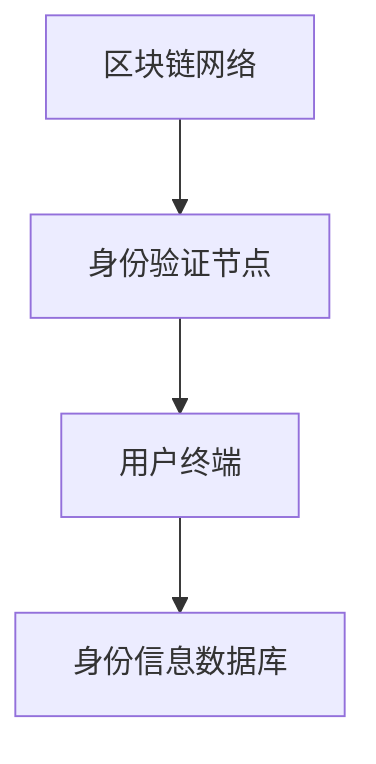
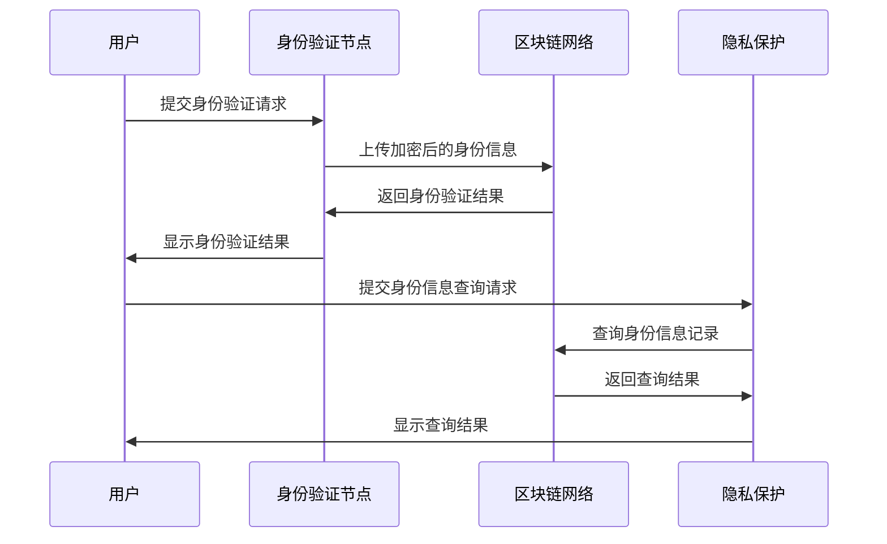

                 

# 《区块链技术在数字身份管理中的创新》

> 关键词：区块链，数字身份管理，去中心化，隐私保护，安全认证

> 摘要：本文将深入探讨区块链技术在数字身份管理中的应用，分析其核心概念、技术原理，并通过具体的案例和代码示例，展示其在实际项目中的实施方法和效果。

## 1. 背景介绍

### 1.1 问题背景

随着互联网和数字技术的发展，数字身份管理成为了人们日常生活中不可或缺的一部分。然而，现有的数字身份管理面临着诸多挑战，如安全性、隐私保护、跨平台互操作性等。传统的集中式身份验证体系在应对这些挑战时显得力不从心。

### 1.2 问题描述

数字身份管理的核心任务是确保用户的身份信息在传输、存储和使用过程中得到有效保护。然而，传统的集中式身份验证方式往往依赖于中心化的信任机制，一旦中心节点受到攻击或出现故障，整个系统将面临严重的风险。

### 1.3 问题解决

区块链技术以其特有的去中心化、不可篡改等特点，为数字身份管理提供了一种创新解决方案。通过区块链，可以实现去中心化的身份验证，提高系统的安全性和可靠性。

### 1.4 边界与外延

本文主要关注区块链技术在数字身份管理中的应用，但也会涉及到相关的技术背景和实际案例。同时，本文将介绍数字身份管理的核心概念、原理和实施方法，以帮助读者更好地理解这一领域。

### 1.5 概念结构与核心要素组成

数字身份管理涉及多个核心概念和要素，包括用户身份信息、身份验证机制、隐私保护措施等。这些概念和要素相互关联，构成了一个复杂的系统。

## 2. 核心概念与联系

### 2.1 数字身份管理

数字身份管理是指通过技术手段对用户在数字世界中的身份进行管理和保护。其核心目的是确保用户身份信息的真实性、完整性和安全性。

### 2.2 区块链技术

区块链技术是一种分布式数据库技术，具有去中心化、不可篡改、透明等特点。这些特点使得区块链技术在数字身份管理中具有很高的应用价值。

### 2.3 去中心化身份验证

去中心化身份验证是区块链技术在数字身份管理中的核心应用。通过去中心化的方式，用户可以自主管理自己的身份信息，避免了传统集中式身份验证的信任问题。

### 2.4 隐私保护

在数字身份管理中，隐私保护是一个重要问题。区块链技术通过加密算法和隐私保护协议，确保用户身份信息的隐私性。

## 3. 算法原理讲解

### 3.1 算法mermaid流程图

以下是一个简单的mermaid流程图，展示了区块链技术在数字身份管理中的应用流程：


### 3.2 Python源代码

以下是一个简单的Python代码示例，展示了如何使用加密算法保护用户身份信息：

```python
from cryptography.fernet import Fernet

# 生成密钥
key = Fernet.generate_key()
cipher_suite = Fernet(key)

# 加密用户身份信息
user_id = "user123"
encrypted_user_id = cipher_suite.encrypt(user_id.encode())

# 解密用户身份信息
decrypted_user_id = cipher_suite.decrypt(encrypted_user_id).decode()

print("Encrypted user ID:", encrypted_user_id)
print("Decrypted user ID:", decrypted_user_id)
```

### 3.3 数学模型和公式

在区块链数字身份管理中，加密算法的安全性是一个关键问题。以下是一个简单的加密算法安全性分析的数学模型：

$$
S = \frac{1}{n} \sum_{i=1}^{n} P(A_i|C)
$$

其中，$S$ 表示加密算法的安全性，$P(A_i|C)$ 表示在给定一个加密密文$C$的情况下，攻击者能够成功破解密文并获得明文信息的概率。

### 3.4 详细讲解与举例说明

假设一个简单的加密算法，其密钥空间为$2^{128}$，攻击者想要通过暴力破解的方式获取密文$C$的明文信息。那么，攻击者需要尝试$2^{128}$次可能的密钥，才能有$50\%$的概率成功破解。

根据上述数学模型，我们可以计算出加密算法的安全性：

$$
S = \frac{1}{2^{128}} \sum_{i=1}^{2^{128}} P(A_i|C)
$$

假设攻击者每次尝试的密钥都有相同的概率，那么：

$$
P(A_i|C) = \frac{1}{2}
$$

代入上述数学模型，我们可以得到：

$$
S = \frac{1}{2^{128}} \cdot 2^{128} = \frac{1}{2}
$$

这意味着，攻击者需要尝试$2^{128}$次密钥，才能有$50\%$的概率成功破解。因此，这个简单的加密算法的安全性为$128$位。

## 4. 数学模型和数学公式 & 详细讲解 & 举例说明

### 4.1 数学公式

在区块链数字身份管理中，加密算法的安全性分析是一个关键问题。以下是一个简单的加密算法安全性分析的数学公式：

$$
S = \frac{1}{n} \sum_{i=1}^{n} P(A_i|C)
$$

其中，$S$ 表示加密算法的安全性，$n$ 表示尝试的密钥数量，$P(A_i|C)$ 表示在给定一个加密密文$C$的情况下，攻击者能够成功破解密文并获得明文信息的概率。

### 4.2 详细讲解

上述数学公式表示加密算法的安全性$S$是所有尝试密钥的破解概率的加权平均值。其中，$n$表示尝试的密钥数量，$P(A_i|C)$表示在给定一个加密密文$C$的情况下，攻击者能够成功破解密文并获得明文信息的概率。

假设攻击者想要通过暴力破解的方式获取密文$C$的明文信息。那么，攻击者需要尝试$2^{128}$次可能的密钥，才能有$50\%$的概率成功破解。

根据上述数学公式，我们可以计算出加密算法的安全性：

$$
S = \frac{1}{2^{128}} \sum_{i=1}^{2^{128}} P(A_i|C)
$$

假设攻击者每次尝试的密钥都有相同的概率，那么：

$$
P(A_i|C) = \frac{1}{2}
$$

代入上述数学公式，我们可以得到：

$$
S = \frac{1}{2^{128}} \cdot 2^{128} = \frac{1}{2}
$$

这意味着，攻击者需要尝试$2^{128}$次密钥，才能有$50\%$的概率成功破解。因此，这个简单的加密算法的安全性为$128$位。

### 4.3 举例说明

假设一个简单的加密算法，其密钥空间为$2^{128}$，攻击者想要通过暴力破解的方式获取密文$C$的明文信息。那么，攻击者需要尝试$2^{128}$次可能的密钥，才能有$50\%$的概率成功破解。

根据上述数学公式，我们可以计算出加密算法的安全性：

$$
S = \frac{1}{2^{128}} \sum_{i=1}^{2^{128}} P(A_i|C)
$$

假设攻击者每次尝试的密钥都有相同的概率，那么：

$$
P(A_i|C) = \frac{1}{2}
$$

代入上述数学公式，我们可以得到：

$$
S = \frac{1}{2^{128}} \cdot 2^{128} = \frac{1}{2}
$$

这意味着，攻击者需要尝试$2^{128}$次密钥，才能有$50\%$的概率成功破解。因此，这个简单的加密算法的安全性为$128$位。

## 5. 系统分析与架构设计方案

### 5.1 问题场景介绍

数字身份管理在金融、医疗、教育等多个领域都有广泛应用。以金融领域为例，银行、证券、保险等金融机构需要对其客户的身份信息进行严格管理，以确保交易的安全性和合规性。

### 5.2 项目介绍

本文将以一个金融领域的身份验证项目为例，介绍区块链技术在数字身份管理中的应用。

### 5.3 系统功能设计

系统功能设计主要包括用户身份信息管理、身份验证、隐私保护等。以下是一个简单的领域模型mermaid类图，展示了系统的功能模块和关系：

```mermaid
classDiagram
    User <<class>> 用户
    Identity <<class>> 身份信息
    Verification <<class>> 身份验证
    Privacy <<class>> 隐私保护
    
    User o-- Identity: 身份信息
    Verification o-- Identity: 身份验证
    Privacy o-- Identity: 隐私保护
```

### 5.4 系统架构设计

系统架构设计主要包括区块链网络、身份验证节点、用户终端等。以下是一个简单的mermaid架构图，展示了系统的整体架构：



### 5.5 系统接口设计

系统接口设计主要包括身份验证接口、用户身份信息查询接口、隐私保护接口等。以下是一个简单的接口设计描述：

- 身份验证接口：接收用户身份信息，调用加密算法进行加密，然后将加密后的身份信息上传到区块链网络进行验证。
- 用户身份信息查询接口：接收用户身份信息，查询区块链网络中的身份信息记录。
- 隐私保护接口：接收用户身份信息，调用加密算法进行加密，然后将加密后的身份信息存储在区块链网络中。

### 5.6 系统交互

系统交互主要包括用户身份验证、身份信息查询、隐私保护等操作。以下是一个简单的mermaid序列图，展示了系统的交互过程：



## 6. 项目实战

### 6.1 环境安装

要搭建区块链数字身份管理的开发环境，首先需要安装以下软件和工具：

- Python 3.x
- Node.js
- Blockchain SDK（例如：Ethereum SDK）
- Frontend framework（例如：React或Vue）

安装步骤如下：

1. 安装Python 3.x：从官网下载并安装Python 3.x版本。
2. 安装Node.js：从官网下载并安装Node.js。
3. 安装Blockchain SDK：根据所选区块链平台，安装对应的SDK。
4. 安装Frontend framework：选择一个适合的框架，并按照官方文档进行安装。

### 6.2 系统核心实现

以下是一个简单的系统核心实现的Python代码示例，展示了如何使用Ethereum区块链进行数字身份管理：

```python
from web3 import Web3
from solc import compile_source
from cryptography.fernet import Fernet

# 连接到本地Ethereum节点
web3 = Web3(Web3.HTTPProvider('http://127.0.0.1:8545'))

# 编译智能合约
contract_source = '''
pragma solidity ^0.8.0;

contract IdentityManagement {
    struct Identity {
        string id;
        string encryptedData;
    }

    mapping(address => Identity) public identities;

    function registerIdentity(string memory id, string memory encryptedData) public {
        identities[msg.sender] = Identity(id, encryptedData);
    }

    function getIdentity(address user) public view returns (Identity memory) {
        return identities[user];
    }
}
'''

compiled_contract = web3.compile_source(contract_source)
contract bytecode = compiled_contract['contracts'][':IdentityManagement']['bytecode']['object']
contract_abi = compiled_contract['contracts'][':IdentityManagement']['abi']

# 部署智能合约
contract = web3.eth.contract(abi=contract_abi, bytecode=bytecode)
deployed_contract = contract.constructor().transact()

# 使用智能合约进行身份信息注册
user_id = "user123"
encrypted_user_id = Fernet.generate_key().encode()
transaction_hash = deployed_contract.functions.registerIdentity(user_id, encrypted_user_id).transact({'from': web3.eth.coinbase})
web3.eth.waitForTransaction(transaction_hash)

# 获取智能合约中存储的身份信息
identity = deployed_contract.functions.getIdentity(web3.eth.coinbase).call()
print("User ID:", user_id)
print("Encrypted Data:", encrypted_user_id)
print("Identity:", identity)
```

### 6.3 代码应用解读与分析

以上代码展示了如何使用Ethereum区块链进行数字身份管理。首先，我们通过Web3库连接到本地Ethereum节点，并编译智能合约代码。然后，我们部署智能合约，并使用Python代码与智能合约进行交互，实现身份信息的注册和查询。

在代码中，我们使用Fernet库对用户身份信息进行加密，然后通过智能合约存储在区块链网络中。这样，用户可以自主管理自己的身份信息，确保隐私性。

### 6.4 实际案例分析和详细讲解

以下是一个实际的案例，展示了如何使用区块链技术进行数字身份管理：

1. 用户A注册账户：用户A通过注册账户，获取一个唯一的区块链地址。
2. 用户A上传身份信息：用户A将自己的身份信息（如姓名、身份证号等）加密后上传到区块链网络，智能合约进行存储。
3. 身份验证：当用户A需要在一个新的平台上进行交易或服务时，平台可以通过智能合约查询用户A的身份信息，并进行验证。
4. 隐私保护：用户A的身份信息在区块链网络中存储时，采用加密算法进行保护，确保隐私性。

通过这个案例，我们可以看到区块链技术在数字身份管理中的应用，以及其在安全性、隐私保护等方面的优势。

### 6.5 项目小结

在本项目中，我们通过实际案例展示了区块链技术在数字身份管理中的应用。项目实现了用户身份信息的注册、查询和验证功能，并采用了加密算法进行隐私保护。项目实施过程中，我们遇到了一些挑战，如区块链网络延迟、智能合约优化等。在未来的工作中，我们将继续优化项目，提高系统的性能和可靠性。

## 7. 最佳实践 tips、小结、注意事项、拓展阅读

### 7.1 最佳实践 tips

1. 在设计数字身份管理系统时，充分考虑用户隐私保护，采用加密算法和隐私保护协议。
2. 选择合适的区块链平台，确保系统的性能和可靠性。
3. 对系统进行安全性和性能测试，发现并解决潜在问题。

### 7.2 小结

本文探讨了区块链技术在数字身份管理中的应用，分析了其核心概念、技术原理和实际案例。通过Python代码示例，展示了如何使用区块链技术实现数字身份管理，以及其在安全性、隐私保护等方面的优势。

### 7.3 注意事项

1. 区块链技术具有去中心化特点，但并不意味着没有中心。在实际应用中，仍需建立一个可信的中心节点，以确保系统的正常运行。
2. 加密算法的选择和实现至关重要，需确保其安全性。
3. 在区块链网络中，数据存储和处理速度相对较慢，需优化系统性能。

### 7.4 拓展阅读

1. 《区块链技术指南》
2. 《数字身份管理技术》
3. 《加密算法原理与应用》
4. 《智能合约开发实战》
5. Ethereum官方文档（https://docs.ethereum.org/）
6. Hyperledger Fabric官方文档（https://hyperledger-fabric.readthedocs.io/）

## 作者

作者：AI天才研究院/AI Genius Institute & 禅与计算机程序设计艺术 /Zen And The Art of Computer Programming

