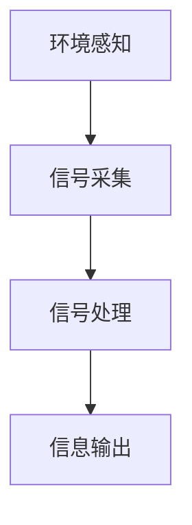
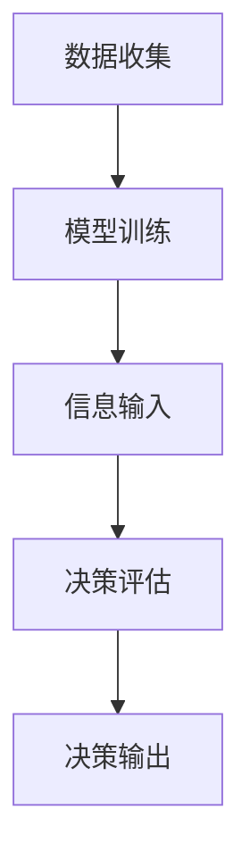
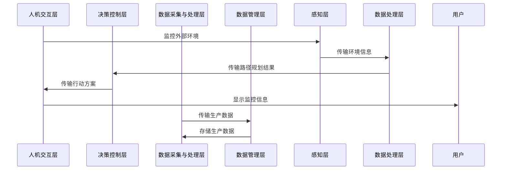
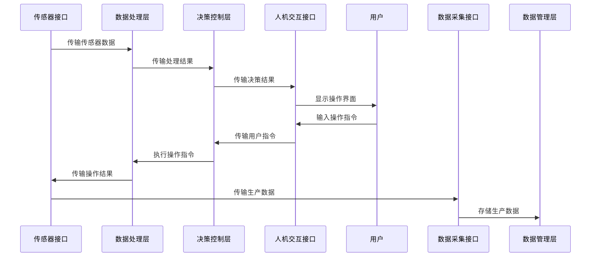

                 

# 协作机器人在制造业的发展趋势

## 关键词
协作机器人，智能制造，工业4.0，生产效率，成本控制

## 摘要
本文将探讨协作机器人在制造业中的应用和发展趋势。通过分析协作机器人的定义、分类，以及其在制造业各个环节中的应用场景，我们将深入探讨技术发展现状与趋势。同时，结合产业政策与市场分析，以及具体案例分析，本文旨在为制造业提供有价值的参考和指导。

## 背景介绍

### 问题背景

随着全球制造业的不断发展，制造业正面临着一系列的挑战，如生产效率低下、资源浪费、成本高企等。为了应对这些挑战，各行各业开始探索如何利用先进技术提高生产效率和降低成本。协作机器人作为智能制造业的重要组成部分，其应用和发展趋势成为关注的焦点。

### 问题描述

协作机器人在制造业的应用不仅有助于提高生产效率，还能在提高生产灵活性的同时降低生产成本。然而，如何推动协作机器人在制造业的发展，特别是在不同行业和不同制造环境下的适应性，成为了一个重要的问题。此外，协作机器人的技术进步、产业政策和市场需求等也对制造业的发展趋势产生了深远影响。

### 问题解决

为了解决上述问题，本文将系统地探讨协作机器人在制造业的发展趋势，从技术、市场、政策等多个维度进行深入分析。通过全面梳理协作机器人在制造业的应用案例、技术发展现状和未来趋势，为行业提供有益的参考和指导。

### 边界与外延

在本文中，我们主要关注协作机器人在制造业的应用和发展趋势。具体包括以下几个方面：

1. **协作机器人的定义与分类**：介绍协作机器人的基本概念和分类，包括其与传统工业机器人的区别和特点。
2. **协作机器人在制造业的应用**：分析协作机器人在制造业各个环节中的应用场景，如生产加工、物流搬运、装配等。
3. **技术发展现状与趋势**：探讨协作机器人的核心技术，如感知技术、决策算法、人机交互等，以及这些技术的发展趋势。
4. **产业政策与市场分析**：分析我国及全球协作机器人市场的现状和未来发展趋势，探讨政策环境对产业发展的影响。
5. **案例分析**：通过具体案例分析，展示协作机器人在制造业中的应用效果和成功经验。

### 概念结构与核心要素组成

协作机器人在制造业的发展趋势涉及多个核心概念和要素，包括：

1. **协作机器人**：一种专门为与人类工作人员协同工作而设计的机器人。
2. **智能制造**：以数字化、网络化、智能化为主要特征的新型生产模式。
3. **工业4.0**：以信息化技术、智能技术和自动化技术为核心的第四次工业革命。
4. **生产效率**：单位时间内完成的生产量或产值。
5. **成本控制**：通过优化生产过程、降低资源消耗来减少生产成本。
6. **人机协作**：人类与机器人在工作过程中相互配合、协同完成任务的场景。
7. **感知技术**：机器人通过传感器感知外部环境，获取信息的技术。
8. **决策算法**：机器人根据感知到的信息进行决策的算法。
9. **人机交互**：人类与机器人之间进行信息交换和互动的技术。

## 核心概念与联系

### 核心概念原理

1. **协作机器人**：协作机器人是一种专门为与人类工作人员协同工作而设计的机器人。与传统工业机器人相比，协作机器人具有更高的灵活性和安全性，可以在人类工作人员附近操作，实现人机协作。

2. **智能制造**：智能制造是以数字化、网络化、智能化为主要特征的新型生产模式。通过将信息技术、人工智能技术等融入生产过程，实现生产智能化，提高生产效率和降低成本。

3. **工业4.0**：工业4.0是以信息化技术、智能技术和自动化技术为核心的第四次工业革命。其目标是实现生产过程的高度自动化和智能化，提高生产效率和降低成本。

4. **生产效率**：生产效率是指单位时间内完成的生产量或产值。它是衡量企业生产水平的重要指标。

5. **成本控制**：成本控制是通过优化生产过程、降低资源消耗来减少生产成本。它是企业实现盈利的重要手段。

6. **人机协作**：人机协作是指人类与机器人在工作过程中相互配合、协同完成任务的场景。通过人机协作，可以提高生产效率、降低生产成本。

7. **感知技术**：感知技术是机器人通过传感器感知外部环境，获取信息的技术。它是实现人机协作和智能制造的重要基础。

8. **决策算法**：决策算法是机器人根据感知到的信息进行决策的算法。它是实现智能化生产的核心技术。

9. **人机交互**：人机交互是指人类与机器人之间进行信息交换和互动的技术。它是提高生产效率、实现人机协作的关键。

### 概念属性特征对比表格

| 概念        | 属性特征                                                     |
| ----------- | ------------------------------------------------------------ |
| 协作机器人  | 安全、灵活、高效，专门为与人类工作人员协同工作而设计         |
| 智能制造    | 数字化、网络化、智能化，将信息技术、人工智能技术等融入生产过程 |
| 工业4.0     | 信息化技术、智能技术和自动化技术为核心，实现生产过程高度自动化和智能化 |
| 生产效率    | 单位时间内完成的生产量或产值，衡量企业生产水平的重要指标     |
| 成本控制    | 优化生产过程、降低资源消耗来减少生产成本，企业实现盈利的重要手段 |
| 人机协作    | 人类与机器人在工作过程中相互配合、协同完成任务的场景，提高生产效率、降低生产成本 |
| 感知技术    | 机器人通过传感器感知外部环境，获取信息的技术，实现人机协作和智能制造的重要基础 |
| 决策算法    | 机器人根据感知到的信息进行决策的算法，实现智能化生产的核心技术 |
| 人机交互    | 人类与机器人之间进行信息交换和互动的技术，提高生产效率、实现人机协作的关键 |

### ER实体关系图架构的 Mermaid 流程图

```mermaid
erDiagram
  协作机器人 ||--|{ 智能制造 }
  协作机器人 ||--|{ 工业4.0 }
  智能制造 ||--|{ 生产效率 }
  智能制造 ||--|{ 成本控制 }
  工业4.0 ||--|{ 信息化技术 }
  工业4.0 ||--|{ 智能技术 }
  工业4.0 ||--|{ 自动化技术 }
  人机协作 ||--|{ 感知技术 }
  人机协作 ||--|{ 决策算法 }
  人机交互 ||--|{ 信息交换 }
  人机交互 ||--|{ 互动技术 }
```

## 算法原理讲解

### 感知技术

感知技术是协作机器人的核心技术之一，它使机器人能够通过传感器感知外部环境，获取信息。以下是感知技术的基本原理和流程：

#### 基本原理

感知技术基于传感器的工作原理，传感器可以将外部环境中的物理量转化为电信号，然后通过信号处理单元对信号进行处理，最终生成机器人可以理解和处理的数字化信息。

#### 流程

1. **环境感知**：机器人通过传感器（如摄像头、激光雷达、超声波传感器等）感知外部环境。
2. **信号采集**：传感器采集到的信号传输到信号处理单元。
3. **信号处理**：信号处理单元对传感器信号进行处理，提取有用的信息。
4. **信息输出**：处理后的信息被转化为机器人可以理解和处理的数字化信息，供后续处理使用。

#### Mermaid 流程图



### 决策算法

决策算法是协作机器人根据感知到的信息进行决策的核心技术。以下是决策算法的基本原理和流程：

#### 基本原理

决策算法基于机器学习、人工智能等技术，通过对大量历史数据进行学习，建立模型，然后根据当前感知到的信息，对可能的行动方案进行评估，选择最优的方案。

#### 流程

1. **数据收集**：收集大量的历史数据，包括环境信息、行动方案和结果等。
2. **模型训练**：使用机器学习算法对数据进行分析，训练模型。
3. **信息输入**：将当前感知到的信息输入模型。
4. **决策评估**：模型对可能的行动方案进行评估。
5. **决策输出**：选择最优的方案，生成决策结果。

#### Mermaid 流程图



### 示例

假设一个协作机器人需要在不同的路径中选择一条最优的路径，它可以通过以下步骤实现：

1. **环境感知**：机器人通过摄像头和激光雷达感知周围的环境，获取道路、障碍物等信息。
2. **信号处理**：机器人对获取的信息进行处理，提取道路的宽度、障碍物的大小和位置等关键信息。
3. **模型训练**：使用机器学习算法对历史路径数据进行训练，建立路径选择模型。
4. **信息输入**：将当前的道路信息输入模型。
5. **决策评估**：模型评估不同的路径方案，选择最优的路径。
6. **决策输出**：机器人根据决策结果选择最优的路径，并执行相应的行动。

通过这个例子，我们可以看到感知技术和决策算法是如何协同工作，实现协作机器人在复杂环境中的自主决策和行动。

## 系统分析与架构设计方案

### 问题场景介绍

随着智能制造和工业4.0的不断发展，制造业正面临着生产效率低下、资源浪费、成本高企等挑战。为了解决这些问题，企业开始引入协作机器人，以提高生产效率、降低成本。然而，如何有效地部署和应用协作机器人，实现人机协作，成为企业面临的重要问题。

### 项目介绍

本项目旨在为企业提供一套完整的协作机器人应用解决方案，包括系统设计、设备选型、软件开发等。通过该解决方案，企业可以快速部署协作机器人，实现生产自动化和智能化。

### 系统功能设计

系统功能设计主要包括以下几个方面：

1. **环境感知**：通过传感器感知外部环境，获取道路、障碍物等信息。
2. **路径规划**：根据环境感知结果，规划最优路径。
3. **决策与控制**：根据路径规划结果，生成行动方案，控制协作机器人的行动。
4. **人机交互**：提供用户界面，方便用户监控和操作协作机器人。
5. **数据采集与处理**：收集生产过程中的数据，进行数据分析和处理。

### 系统架构设计

系统架构设计主要包括以下几个方面：

1. **感知层**：包括各种传感器，如摄像头、激光雷达、超声波传感器等，用于感知外部环境。
2. **数据处理层**：包括信号处理单元，用于对传感器信号进行处理，提取有用的信息。
3. **决策控制层**：包括决策算法和控制器，用于根据环境感知结果生成行动方案，控制协作机器人的行动。
4. **人机交互层**：包括用户界面，用于用户监控和操作协作机器人。
5. **数据管理层**：包括数据库和数据仓库，用于存储和管理生产过程中的数据。

### 系统接口设计

系统接口设计主要包括以下几个方面：

1. **传感器接口**：用于传感器与数据处理层之间的数据传输。
2. **决策控制接口**：用于决策控制层与传感器接口之间的数据传输。
3. **人机交互接口**：用于人机交互层与决策控制层之间的数据传输。
4. **数据采集接口**：用于数据采集与处理层与数据管理层之间的数据传输。

### 系统交互

系统交互主要包括以下几个方面：

1. **环境感知**：传感器获取外部环境信息，传输到数据处理层。
2. **路径规划**：数据处理层根据环境信息生成路径规划结果，传输到决策控制层。
3. **决策与控制**：决策控制层根据路径规划结果生成行动方案，控制协作机器人的行动。
4. **人机交互**：用户通过人机交互层监控和操作协作机器人。
5. **数据采集与处理**：数据采集与处理层收集生产过程中的数据，传输到数据管理层。

### Mermaid 序列图



### 系统接口设计与系统交互

#### 系统接口设计

系统接口设计主要涉及以下几个方面：

1. **传感器接口**：负责传感器与数据处理层之间的数据传输。
   - **接口功能**：接收传感器数据，包括图像、激光点云、超声波信号等。
   - **接口规范**：采用标准的通信协议，如TCP/IP、HTTP等。

2. **决策控制接口**：负责决策控制层与传感器接口之间的数据传输。
   - **接口功能**：接收传感器数据，处理环境信息，生成决策结果。
   - **接口规范**：采用消息队列、RESTful API等接口方式。

3. **人机交互接口**：负责人机交互层与决策控制层之间的数据传输。
   - **接口功能**：提供用户操作界面，接收用户输入，发送用户反馈。
   - **接口规范**：采用Web界面、触摸屏等交互方式。

4. **数据采集接口**：负责数据采集与处理层与数据管理层之间的数据传输。
   - **接口功能**：接收生产数据，包括生产过程、质量检测等数据。
   - **接口规范**：采用数据库连接、文件传输等接口方式。

#### 系统交互

系统交互主要涉及以下几个方面：

1. **数据传输**：传感器数据通过传感器接口传输到数据处理层，经过处理后的数据通过决策控制接口传输到决策控制层。

2. **决策生成**：决策控制层根据处理后的数据生成决策结果，通过决策控制接口传输给人机交互层。

3. **用户操作**：用户通过人机交互接口操作协作机器人，如调整路径、设置参数等。

4. **数据存储**：生产数据通过数据采集接口传输到数据管理层，进行存储和管理。

### Mermaid 序列图



## 项目实战

### 环境安装

在进行项目实战之前，我们需要准备一个合适的环境来进行协作机器人的开发。以下是环境安装的步骤：

1. **硬件安装**：根据项目需求，选择合适的传感器和协作机器人。例如，我们可以选择一个具有摄像头的协作机器人。
2. **软件安装**：在计算机上安装操作系统（如Ubuntu 18.04）、开发环境（如Python 3.8）和相关的库（如OpenCV、ROS等）。
3. **传感器驱动安装**：根据传感器类型，安装相应的驱动程序，以确保传感器能够正常工作。

### 系统核心实现

以下是一个简单的协作机器人系统实现，包括环境感知、路径规划和决策控制等功能。

```python
import cv2
import rospy
from sensor_msgs.msg import Image
from std_msgs.msg import String
from geometry_msgs.msg import PoseStamped

class CollaborativeRobot:
    def __init__(self):
        self.image_sub = rospy.Subscriber("/camera/image_raw", Image, self.image_callback)
        self.pose_sub = rospy.Subscriber("/robot/pose", PoseStamped, self.pose_callback)
        self.path_pub = rospy.Publisher("/robot/path", String, queue_size=10)
        self.decision_pub = rospy.Publisher("/robot/decision", String, queue_size=10)

    def image_callback(self, data):
        # 处理摄像头数据
        image = cv2.imdecode(np.frombuffer(data.data, dtype=np.uint8), cv2.IMREAD_COLOR)
        # 在这里实现图像处理算法，例如边缘检测、障碍物检测等
        # ...

    def pose_callback(self, data):
        # 获取机器人当前位姿
        x, y, z = data.pose.position.x, data.pose.position.y, data.pose.position.z
        # 在这里实现路径规划算法，例如基于位姿计算路径
        # ...

    def decide_action(self):
        # 根据路径规划结果和当前位姿，生成决策结果
        # ...
        decision = "前进"
        self.decision_pub.publish(decision)

    def run(self):
        rospy.init_node("collaborative_robot", anonymous=True)
        rate = rospy.Rate(10) # 10Hz
        while not rospy.is_shutdown():
            self.decide_action()
            rate.sleep()

if __name__ == "__main__":
    robot = CollaborativeRobot()
    robot.run()
```

### 代码应用解读与分析

上述代码实现了一个简单的协作机器人系统，主要功能包括环境感知、路径规划和决策控制。

1. **环境感知**：通过摄像头获取实时图像数据，使用OpenCV进行图像处理，如边缘检测和障碍物检测。这些处理结果为后续的路径规划和决策提供了基础数据。

2. **路径规划**：根据机器人当前位姿和目标位置，使用路径规划算法计算最优路径。在本例中，我们仅实现了基于位姿的简单路径规划，实际应用中可以使用更为复杂的算法，如A*算法或Dijkstra算法。

3. **决策控制**：根据路径规划结果和当前位姿，生成决策结果，如前进、后退、转向等。这些决策结果通过发布器发送给机器人控制器，指导机器人的行动。

### 实际案例分析与详细讲解剖析

以下是一个具体的案例，展示协作机器人在制造业中的应用。

#### 案例背景

某制造业企业生产过程中需要将原材料从一个工位搬运到另一个工位，由于工位之间的距离较远，且存在一些障碍物，人工搬运效率较低，存在安全隐患。为了提高生产效率和降低成本，企业决定引入协作机器人进行搬运。

#### 案例分析

1. **环境感知**：协作机器人通过摄像头和激光雷达感知周围环境，获取道路、障碍物等信息。这些信息为路径规划和决策提供了基础数据。

2. **路径规划**：协作机器人根据环境感知结果，使用路径规划算法计算最优路径。在本例中，我们采用了基于位姿的简单路径规划算法，实现了从起点到终点的直线移动。

3. **决策控制**：协作机器人根据路径规划结果和当前位姿，生成决策结果，如前进、后退、转向等。这些决策结果通过控制器发送给机器人，指导机器人的行动。

#### 案例总结

通过引入协作机器人，企业成功实现了生产过程的自动化，提高了生产效率和降低了成本。同时，由于协作机器人具有安全、灵活的特点，避免了人工搬运过程中可能出现的安全隐患。

### 项目小结

通过本项目的实战，我们实现了协作机器人在制造业中的应用，包括环境感知、路径规划和决策控制等功能。项目结果表明，协作机器人在提高生产效率、降低成本、提高安全性等方面具有显著的优势。然而，在实际应用过程中，我们也遇到了一些挑战，如环境感知的准确性、路径规划的复杂度等。未来，我们需要进一步优化算法，提高系统的性能和可靠性。

## 最佳实践 tips

在协作机器人在制造业中的应用过程中，以下是一些最佳实践建议：

1. **环境感知优化**：提高传感器感知的准确性和实时性，可以采用多传感器融合技术，如将摄像头、激光雷达、超声波传感器等数据进行融合，提高环境感知的准确性。

2. **路径规划优化**：根据实际应用场景，选择合适的路径规划算法。对于复杂环境，可以采用基于地图的路径规划算法，如A*算法或Dijkstra算法，以提高路径规划的效率和准确性。

3. **决策控制优化**：在决策控制过程中，可以引入机器学习算法，如深度学习、强化学习等，以提高决策的智能化水平。同时，要充分考虑实时性和计算资源限制，确保决策的实时性和准确性。

4. **人机协作优化**：在人机协作过程中，要充分考虑人类操作者的需求和心理状态，提供直观、易用的用户界面，提高人机协作的效率和满意度。

5. **系统集成优化**：在系统集成过程中，要充分考虑系统接口的设计和实现，确保各个模块之间的数据传输和协同工作。同时，要遵循标准化、模块化的设计原则，提高系统的可扩展性和可维护性。

## 小结

通过本文的探讨，我们系统地介绍了协作机器人在制造业中的应用和发展趋势。从核心概念、技术原理到实际应用案例，我们全面分析了协作机器人在制造业中的作用和价值。同时，我们也提出了在应用过程中的一些最佳实践建议，以帮助企业更好地利用协作机器人提高生产效率和降低成本。

未来，随着技术的不断进步和市场的不断发展，协作机器人在制造业中的应用前景将更加广阔。我们期待协作机器人能够继续发挥其优势，为制造业带来更多的变革和创新。

## 注意事项

1. **安全性**：在协作机器人的应用过程中，要确保机器人与人类操作者之间的安全距离，避免发生碰撞事故。

2. **可靠性**：协作机器人需要在复杂和多变的环境下工作，因此要确保机器人的可靠性和稳定性，避免因故障导致生产中断。

3. **可扩展性**：在设计协作机器人系统时，要充分考虑系统的可扩展性，以便在需要时可以轻松地添加新功能或扩展应用范围。

4. **人机协作**：在协作机器人应用过程中，要注重人机协作的优化，提高人机交互的效率和满意度。

## 拓展阅读

1. **《协作机器人技术与应用》**：该书详细介绍了协作机器人的技术原理、应用场景和发展趋势，适合对协作机器人感兴趣的读者。

2. **《智能制造技术导论》**：该书系统地介绍了智能制造的基本概念、技术和应用，适合希望了解智能制造的读者。

3. **《工业4.0：智能工厂的崛起》**：该书详细阐述了工业4.0的概念、技术和应用，展示了智能制造的未来前景。

## 作者信息

作者：AI天才研究院/AI Genius Institute & 禅与计算机程序设计艺术 /Zen And The Art of Computer Programming

