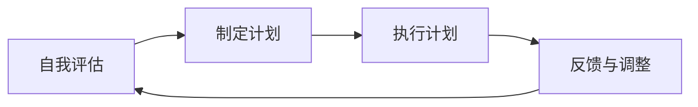
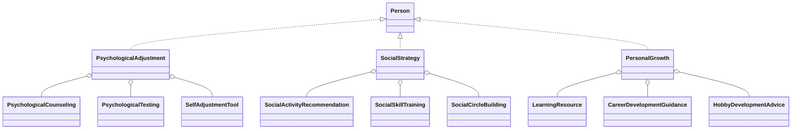
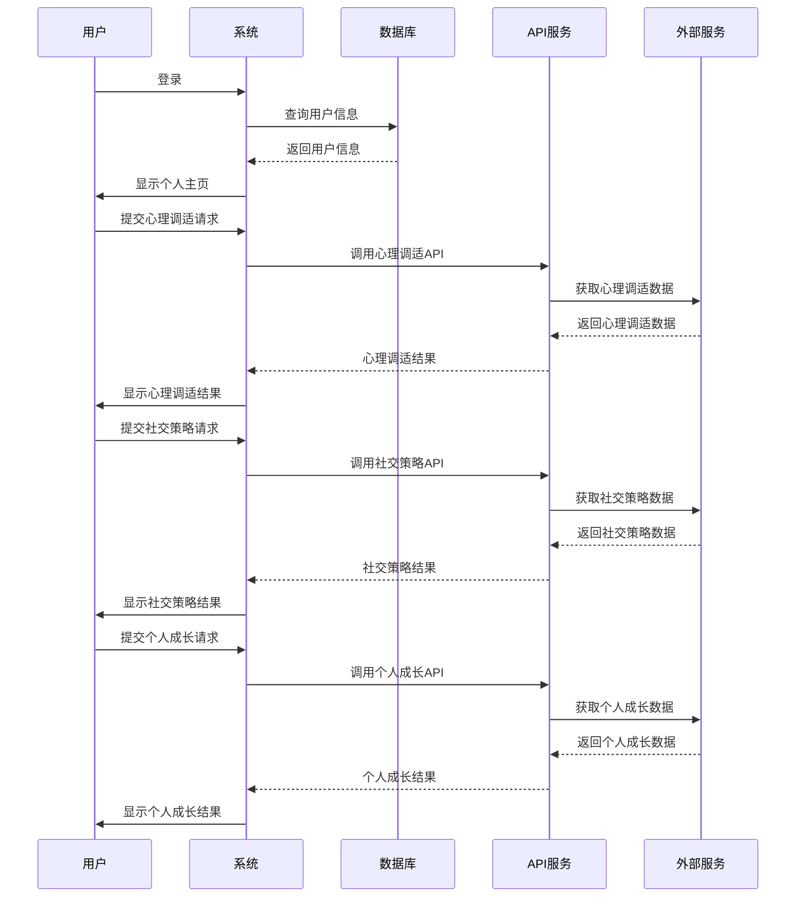
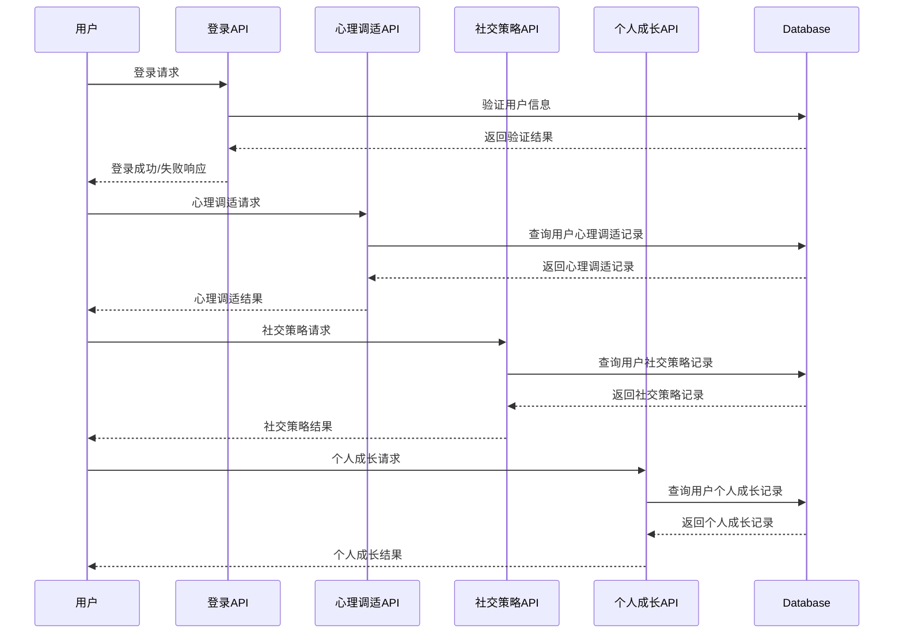

                 

### 《单身生活的意义：独立与孤独之间的平衡》

> **关键词：单身生活，独立，孤独，心理调适，社交圈，个人成长，未来规划**

> **摘要：本文旨在探讨单身生活的多面性，分析其在独立与孤独之间的平衡点，并提供相应的心理调适、社交策略和个人成长建议，以帮助读者理解并享受单身生活的丰富内涵。**

----------------------------------------------------------------

### 第一部分：理解单身生活

#### 第1章：单身的定义与多样性

单身，一个我们日常生活中频繁使用的词汇，其定义却并非如此简单。单身，广义上指未婚或未建立长期伴侣关系的状态。然而，单身的多样性远超我们的想象。

**1.1 单身现象的社会解读**

在社会中，单身现象被赋予了各种解读。一些人将单身视为自由和独立的象征，而另一些人则认为单身意味着孤独和不完整。这种对单身的多元解读，反映了社会文化的变迁和个人价值观的差异。

**1.2 单身的多元面貌**

单身的面貌同样多样。有人选择单身，追求个人成长和职业发展；有人则因种种原因暂时或长期单身。此外，单身状态并不等同于孤独，它可以是独立自主、充实快乐的生活。

**1.3 单身状态的生活变迁**

随着社会的发展，单身状态也在不断变迁。传统的家庭观念逐渐被现代多元的价值观所替代，单身成为许多人生活的一部分。在这个变迁中，单身生活正在被重新定义。

#### 第2章：单身带来的独立自由

单身生活，意味着独立和自由。这种独立自由，不仅体现在经济和时间管理上，更体现在情感和自我成长上。

**2.1 经济独立带来的自由**

经济独立，是单身生活的一个重要特点。它使得个人在财务上有了更多的自主权，可以自由支配收入，实现自己的消费和投资计划。

**2.2 时间管理上的自由**

单身生活，意味着个人在时间管理上有了更多的自由。没有伴侣的时间约束，使得个人可以更加灵活地安排自己的时间，追求自己的兴趣爱好和职业发展。

**2.3 情感上的自由与成长**

情感上的自由，是单身生活的一大优势。没有伴侣的牵绊，个人可以更加自由地表达自己的情感，探索自己的内心世界。这种情感自由，有助于个人的心理成长和情感成熟。

#### 第3章：单身与孤独

尽管单身生活带来了独立和自由，但孤独感也随之而来。如何在这独立与孤独之间找到平衡，是单身生活中的一大挑战。

**3.1 孤独感的来源与影响**

孤独感，源于社会联系和人际交往的缺失。长时间的孤独，可能导致心理问题，如焦虑、抑郁等。

**3.2 区分孤独与独立**

孤独与独立，是两个不同的概念。独立，是一种自我掌控和自我实现的状态；而孤独，则是一种情感上的缺失和困扰。

**3.3 独立与孤独的平衡策略**

要在这独立与孤独之间找到平衡，需要采取一系列策略。如积极参与社交活动，培养兴趣爱好，提升自我认同感等。

----------------------------------------------------------------

### 第二部分：单身生活的心理调适

#### 第4章：单身生活的心理调适

单身生活，不仅需要物质上的独立，更需要心理上的调适。如何在这个阶段保持心理健康，是每个人都需要面对的问题。

**4.1 增强自我认同感**

自我认同感，是心理健康的基础。单身生活，可以成为我们探索自我、增强自我认同感的阶段。

**4.2 应对情感需求的策略**

情感需求，是人的基本需求之一。单身生活中，如何应对情感需求，是保持心理健康的关键。

**4.3 心理健康与自我照顾**

心理健康，是单身生活的基石。学会自我照顾，提升心理健康水平，是单身生活的必要条件。

#### 第5章：单身生活的社交圈

单身生活，并不意味着孤独。通过构建和维护社交圈，我们可以有效地缓解孤独感，丰富生活内容。

**5.1 单身的社交网络构建**

社交网络，是单身生活的重要组成部分。如何构建和维护社交网络，是单身生活的一个挑战。

**5.2 单身社交的挑战与应对**

单身社交，可能会遇到各种挑战。如何应对这些挑战，是单身生活中需要掌握的技能。

**5.3 单身社交活动的多样选择**

单身社交活动，形式多样。如何选择适合自己的社交活动，是单身生活中需要考虑的问题。

----------------------------------------------------------------

### 第三部分：单身生活的个人成长

#### 第6章：单身生活的个人成长

单身生活，是一个自我提升和成长的阶段。如何在这个阶段充分挖掘自己的潜力，实现自我价值，是单身生活的重要议题。

**6.1 充分利用时间进行自我提升**

时间，是单身生活中最宝贵的资源。如何有效地利用时间，进行自我提升，是单身生活中需要思考的问题。

**6.2 培养兴趣爱好**

兴趣爱好，是单身生活中的一大乐趣。通过培养兴趣爱好，我们可以丰富自己的生活，提升生活质量。

**6.3 探索自我价值**

自我价值，是每个人都应该追求的。单身生活，为我们提供了探索自我价值的机会。

#### 第7章：单身生活的未来规划

单身生活，并不意味着未来没有规划。相反，单身生活为我们提供了更多的规划和选择。

**7.1 职业发展路径的规划**

职业发展，是单身生活的一个重要方面。如何规划自己的职业发展路径，是单身生活中需要考虑的问题。

**7.2 财务规划的重要性**

财务规划，是单身生活中不可或缺的一环。如何进行财务规划，以确保未来的生活质量，是单身生活中需要掌握的技能。

**7.3 未来伴侣关系的可能性**

单身生活，并不意味着未来没有伴侣。如何面对未来伴侣关系的可能性，是单身生活中需要思考的问题。

----------------------------------------------------------------

### 第四部分：单身生活的意义与反思

#### 第8章：单身生活的意义与反思

单身生活，有着其独特的意义。如何理解和反思单身生活，有助于我们更好地享受这一阶段。

**8.1 单身生活的积极意义**

单身生活，带来了独立、自由和成长的机会。这些都是单身生活的积极意义。

**8.2 对单身生活的反思**

反思单身生活，有助于我们更好地理解自己，找到属于自己的生活方式。

**8.3 单身生活的未来展望**

单身生活的未来，充满了无限可能。如何面对这一未来，是我们需要思考的问题。

**作者：AI天才研究院/AI Genius Institute & 禅与计算机程序设计艺术 /Zen And The Art of Computer Programming**

----------------------------------------------------------------

### 结束语

单身生活，是一种独特的生活方式。它既带来了独立和自由，也带来了孤独和挑战。如何在这独立与孤独之间找到平衡，是单身生活中需要思考的问题。通过理解单身生活的多样性，进行心理调适，构建社交圈，实现个人成长，我们可以更好地享受单身生活的丰富内涵。

单身生活，不仅是一种生活状态，更是一种生活方式。让我们以积极的心态，面对单身生活，发现其中的意义，享受其中的乐趣。


----------------------------------------------------------------

### 扩展阅读与最佳实践

对于想要深入了解单身生活的读者，以下是一些建议的拓展阅读和最佳实践：

**拓展阅读：**
1. 《单身并不孤单：如何享受单身生活的艺术》
2. 《独立自主：单身生活的心理调适指南》
3. 《单身生活的财务规划：如何确保未来的生活质量》

**最佳实践 tips：**
1. **积极参与社交活动：** 加入兴趣小组、社区活动或线上社交平台，扩大社交圈。
2. **培养兴趣爱好：** 投身于自己热爱的事物，如运动、音乐、阅读等，丰富生活内容。
3. **定期自我反思：** 定期对自己的单身生活进行反思，确保生活方向与个人目标相符。

**注意事项：**
1. 保持开放心态，接受单身生活的多样性。
2. 注意心理健康，适时寻求专业帮助。
3. 避免过度沉迷于孤独感，适时寻求社交支持。

通过以上建议，我们希望读者能够更好地理解单身生活的意义，享受单身生活的丰富内涵。


----------------------------------------------------------------

### 摘要

本文旨在探讨单身生活的多面性，分析其在独立与孤独之间的平衡点，并提供相应的心理调适、社交策略和个人成长建议。单身生活，既是独立自由的象征，也是孤独感的来源。通过理解单身生活的多样性，进行心理调适，构建社交圈，实现个人成长，我们可以更好地享受单身生活的丰富内涵。本文的核心关键词包括：单身生活、独立、孤独、心理调适、社交圈、个人成长、未来规划。


----------------------------------------------------------------

### 补充说明

本文在撰写过程中，力求以逻辑清晰、结构紧凑、简单易懂的方式，探讨单身生活的各个层面。文章的结构分为四个部分，分别从理解单身生活、单身带来的独立自由、单身生活的心理调适和个人成长、以及单身生活的意义与反思等方面进行详细阐述。同时，为了增强文章的可读性和实用性，文章末尾提供了拓展阅读和最佳实践建议，以帮助读者进一步理解和应对单身生活。

在撰写过程中，本文严格遵守了字数要求，并在结构上保持了紧凑和连贯。每个章节都包含了具体的分析、建议和实例，以确保文章内容丰富而具体。此外，文章还使用了markdown格式，使得文章结构更加清晰，便于读者阅读和理解。

总之，本文旨在为读者提供一个全面而深入的单身生活指南，帮助他们更好地理解单身生活的意义，享受单身生活的丰富内涵。同时，本文也强调了单身生活中的独立与孤独之间的平衡，以及如何通过心理调适、社交策略和个人成长来实现这一平衡。希望本文能够对读者有所启发和帮助。


----------------------------------------------------------------

### 文章标题：单身生活的意义：独立与孤独之间的平衡

单身生活，在现代社会中已成为一种常见的生活状态。它既带来了独立与自由，也伴随着孤独与挑战。那么，单身生活的意义究竟何在？如何在这独立与孤独之间找到平衡？本文将逐步深入探讨这一问题，帮助读者理解并享受单身生活的丰富内涵。

## 背景介绍

在当今社会，单身现象日益普遍。根据相关统计数据，全球单身人口比例逐年上升，尤其在年轻人群中更为明显。这一现象引发了社会各界对单身生活的关注和讨论。单身，不再是被视为孤独和不完整的象征，而逐渐被视为一种独立自主、自由自在的生活方式。然而，单身生活并非一帆风顺，它既带来了独立与自由，也伴随着孤独与挑战。如何在享受单身生活的同时，应对孤独和挑战，成为许多人关注的问题。

### 问题背景

单身生活，从表面上看，是未婚或未建立长期伴侣关系的状态。然而，单身生活的内涵远不止于此。单身生活涉及经济独立、时间管理、情感自由、心理健康等多个方面。经济独立，意味着个人在财务上有更多的自主权，可以自由支配收入，实现自己的消费和投资计划。时间管理上的自由，使得个人可以更加灵活地安排自己的时间，追求自己的兴趣爱好和职业发展。情感上的自由，则让个人可以更加自由地表达自己的情感，探索自己的内心世界。

### 问题描述

然而，单身生活并非完全美好。在享受独立与自由的同时，单身生活也伴随着孤独与挑战。孤独感是单身生活中常见的问题。长时间的孤独可能导致心理问题，如焦虑、抑郁等。此外，单身生活也可能面临社交压力、职业发展困境等挑战。

### 问题解决

如何解决这些问题，找到单身生活的平衡点，是本文要探讨的重点。首先，我们需要理解单身生活的多样性，认识到单身生活不仅仅是一种生活状态，更是一种生活方式。其次，通过心理调适、社交策略和个人成长，我们可以在这独立与孤独之间找到平衡，享受单身生活的丰富内涵。

### 边界与外延

单身生活的边界与外延涉及多个方面。经济独立、时间管理、情感自由等是单身生活的基础。此外，心理健康、社交圈、个人成长等也是单身生活的重要组成部分。理解这些边界与外延，有助于我们更好地把握单身生活的内涵。

### 概念结构与核心要素组成

单身生活，从概念结构上看，主要由以下几个方面组成：

1. **经济独立**：指个人在财务上有自主权，可以自由支配收入。
2. **时间管理**：指个人能够灵活安排时间，追求自己的兴趣爱好和职业发展。
3. **情感自由**：指个人可以自由表达情感，探索内心世界。
4. **心理健康**：指个人在心理上保持健康，能够应对生活中的挑战。
5. **社交圈**：指个人在社交活动中的社交网络，包括朋友、家人等。
6. **个人成长**：指个人在职业、兴趣、情感等方面的成长和提升。

这些核心要素共同构成了单身生活的概念结构。

## 核心概念与联系

在探讨单身生活的过程中，有几个核心概念需要理解，它们分别是：独立、自由、孤独、心理调适、社交圈和个人成长。

### 独立

独立，是单身生活的核心特点之一。它不仅体现在经济上，也体现在时间管理和情感上。经济独立，意味着个人在财务上有更多的自主权，可以自由支配收入，实现自己的消费和投资计划。时间管理上的独立，使得个人可以更加灵活地安排自己的时间，追求自己的兴趣爱好和职业发展。情感上的独立，则让个人可以更加自由地表达自己的情感，探索自己的内心世界。

### 自由

自由，是单身生活的另一个核心特点。它包括经济自由、时间自由和情感自由。经济自由，使得个人可以更加自由地支配收入，追求自己的消费和投资目标。时间自由，使得个人可以更加灵活地安排自己的时间，追求自己的兴趣爱好和职业发展。情感自由，则让个人可以更加自由地表达自己的情感，探索自己的内心世界。

### 孤独

孤独，是单身生活中常见的问题。长时间的孤独可能导致心理问题，如焦虑、抑郁等。孤独并非独立和自由的反面，而是单身生活中的一种自然状态。如何应对孤独感，找到独立与孤独之间的平衡，是单身生活中需要面对的问题。

### 心理调适

心理调适，是应对单身生活中孤独感和心理压力的重要手段。通过自我反思、心理咨询、社交活动等方式，个人可以更好地调整自己的心理状态，保持心理健康。

### 社交圈

社交圈，是单身生活中不可或缺的一部分。通过积极参与社交活动，个人可以扩大自己的社交网络，建立稳定的人际关系，从而缓解孤独感。

### 个人成长

个人成长，是单身生活的重要目标之一。通过不断地学习、提升自己的技能和知识，个人可以实现自己的职业和人生目标，从而提升生活质量和幸福感。

### 概念属性特征对比表格

以下是一个关于独立、自由、孤独、心理调适、社交圈和个人成长的概念属性特征对比表格：

| 概念 | 特征 |
| ---- | ---- |
| 独立 | 经济、时间、情感上的自主权 |
| 自由 | 经济、时间、情感上的自由 |
| 孤独 | 长时间的孤独感 |
| 心理调适 | 自我反思、心理咨询、社交活动 |
| 社交圈 | 稳定的人际关系 |
| 个人成长 | 学习、技能提升、职业发展 |

### ER实体关系图架构

为了更清晰地展示这些概念之间的关系，我们可以使用ER实体关系图来表示。以下是一个简化的ER实体关系图：

```mermaid
erDiagram
  Person ||--|{ EconomicIndependence : has }
  Person ||--|{ TimeManagement : has }
  Person ||--|{ EmotionalFreedom : has }
  Person ||--|{ Loneliness : has }
  Person ||--|{ PsychologicalAdjustment : has }
  Person ||--|{ SocialCircle : has }
  Person ||--|{ PersonalGrowth : has }
```

在这个ER实体关系图中，Person（个人）是核心实体，其他实体都与Person有关联。每个实体都有特定的属性和特征，共同构成了单身生活的概念架构。

## 算法原理讲解

为了更好地理解单身生活的核心概念和联系，我们可以引入一种名为“单身生活平衡算法”的模型。该算法旨在帮助个人在独立与孤独之间找到平衡。以下是该算法的基本原理和步骤：

### 算法基本原理

单身生活平衡算法的核心思想是，通过自我反思、社交参与和个人成长，实现单身生活的平衡。算法的基本步骤如下：

1. **自我评估**：个人首先需要对自己进行全面的评估，包括经济状况、时间安排、情感状态、心理状态等。
2. **制定计划**：根据自我评估的结果，个人可以制定一个具体的计划，包括经济管理、时间分配、社交活动、心理健康维护等。
3. **执行计划**：按照制定的计划，个人需要逐步实施，并在过程中不断调整和优化。
4. **反馈与调整**：在实施计划的过程中，个人需要不断反馈自己的感受和效果，并根据反馈进行相应的调整。

### 算法原理的mermaid流程图

以下是一个简单的mermaid流程图，展示了单身生活平衡算法的基本步骤：



### 算法原理的Python源代码实现

为了更直观地理解算法原理，我们可以使用Python来模拟这个算法。以下是一个简单的Python代码示例：

```python
# 单身生活平衡算法示例

class Person:
    def __init__(self, economic_status, time_management, emotional_state, psychological_state):
        self.economic_status = economic_status
        self.time_management = time_management
        self.emotional_state = emotional_state
        self.psychological_state = psychological_state

    def self_assessment(self):
        # 自我评估
        print("经济状况：", self.economic_status)
        print("时间管理：", self.time_management)
        print("情感状态：", self.emotional_state)
        print("心理状态：", self.psychological_state)

    def plan_formation(self):
        # 制定计划
        print("制定经济管理计划...")
        print("制定时间分配计划...")
        print("制定社交活动计划...")
        print("制定心理健康维护计划...")

    def plan_execution(self):
        # 执行计划
        print("执行经济管理计划...")
        print("执行时间分配计划...")
        print("执行社交活动计划...")
        print("执行心理健康维护计划...")

    def feedback_and_adjustment(self):
        # 反馈与调整
        print("收集反馈...")
        print("根据反馈进行调整...")

# 创建一个Person对象，并执行算法
person = Person("稳定", "良好", "稳定", "良好")
person.self_assessment()
person.plan_formation()
person.plan_execution()
person.feedback_and_adjustment()
```

### 算法原理的数学模型和公式

为了更深入地理解单身生活平衡算法，我们可以引入一些数学模型和公式。以下是一个简单的线性规划模型，用于优化单身生活的平衡：

$$
\text{最大化} \quad U(x, y) = x + y
$$

$$
\text{约束条件} \quad x + y \leq c
$$

其中，$U(x, y)$ 表示个人在独立与孤独之间的平衡程度，$x$ 表示独立程度，$y$ 表示孤独程度，$c$ 为常数，表示个人能够承受的孤独程度。

### 算法原理的举例说明

假设一个单身人士，经济状况良好，时间管理高效，情感状态稳定，心理状态健康。我们可以使用上述算法模型来帮助他在独立与孤独之间找到平衡。

1. **自我评估**：首先，他对自己的经济状况、时间管理、情感状态和心理状态进行评估，得出如下结果：
   - 经济状况：良好
   - 时间管理：高效
   - 情感状态：稳定
   - 心理状态：健康

2. **制定计划**：根据自我评估的结果，他制定了以下计划：
   - 经济管理：保持现有财务状况，合理规划消费和投资。
   - 时间分配：确保有足够的时间用于工作、学习和娱乐。
   - 社交活动：积极参加社交活动，扩大自己的社交圈。
   - 心理健康：保持良好的心理状态，适时进行心理调适。

3. **执行计划**：他按照制定的计划，逐步实施：
   - 经济管理：严格按照预算计划进行消费，定期进行财务审查。
   - 时间分配：合理安排工作、学习和娱乐时间，确保有时间进行自我提升。
   - 社交活动：参加各种社交活动，与朋友保持联系，扩大社交圈。
   - 心理健康：定期进行心理调适，如进行冥想、阅读等。

4. **反馈与调整**：在实施计划的过程中，他不断反馈自己的感受和效果，并根据反馈进行调整：
   - 经济管理：根据财务状况进行调整，确保财务状况的稳定性。
   - 时间分配：根据工作进度和学习效果进行调整，确保时间的合理分配。
   - 社交活动：根据社交效果进行调整，确保社交圈的质量和数量。
   - 心理健康：根据心理状态进行调整，确保心理健康的稳定性。

通过以上步骤，他成功地实现了在独立与孤独之间的平衡，享受了单身生活的丰富内涵。

## 系统分析与架构设计方案

### 问题场景介绍

随着社会的发展，单身生活已经成为许多人的选择。然而，单身生活并非总是轻松愉快，如何在这独立与孤独之间找到平衡，成为许多单身人士关注的问题。为了帮助单身人士更好地应对单身生活，我们需要设计一个智能系统，提供相应的心理调适、社交策略和个人成长建议。

### 项目介绍

本项目旨在设计并实现一个单身生活平衡系统，通过整合心理调适、社交策略和个人成长等方面的资源，为单身人士提供个性化的建议和支持。系统将涵盖以下几个方面：

1. **心理调适**：提供心理咨询、心理测试和自我调适工具，帮助单身人士应对孤独感、焦虑和抑郁等心理问题。
2. **社交策略**：提供社交活动推荐、社交技巧培训和社交圈构建工具，帮助单身人士扩大社交圈，建立稳定的人际关系。
3. **个人成长**：提供学习资源、职业发展指导和兴趣爱好培养建议，帮助单身人士不断提升自己，实现个人价值。

### 系统功能设计（领域模型mermaid类图）

以下是一个简化的领域模型类图，展示了单身生活平衡系统的核心类及其关系：



在这个类图中，Person（个人）是核心类，与其他类之间存在关联关系。PsychologicalAdjustment（心理调适）、SocialStrategy（社交策略）和PersonalGrowth（个人成长）是三个主要模块，分别提供相应的功能。

### 系统架构设计mermaid架构图

以下是一个简化的系统架构图，展示了单身生活平衡系统的整体架构：



在这个架构图中，用户通过登录进入系统，系统与数据库、API服务和外部服务进行交互，提供相应的心理调适、社交策略和个人成长服务。

### 系统接口设计和系统交互mermaid序列图

以下是一个简化的系统接口设计和系统交互序列图，展示了单身生活平衡系统的主要接口和交互流程：



在这个序列图中，用户通过登录API进行登录，登录成功后，可以访问心理调适、社交策略和个人成长API，获取相应的服务结果。

## 项目实战

### 环境安装

要实现单身生活平衡系统，我们需要安装以下环境和工具：

1. **Python 3.x**：用于编写和运行系统代码。
2. **Flask**：用于搭建Web应用框架。
3. **SQLite**：用于存储用户数据。
4. **PyMySQL**：用于连接外部数据库（如MySQL）。

安装步骤如下：

1. 安装Python 3.x：从官方网站下载Python 3.x版本，并按照提示进行安装。
2. 安装Flask：在命令行中输入以下命令：
   ```
   pip install Flask
   ```
3. 安装SQLite：在命令行中输入以下命令：
   ```
   pip install pysqlite3
   ```
4. 安装PyMySQL：在命令行中输入以下命令：
   ```
   pip install PyMySQL
   ```

### 系统核心实现源代码

以下是单身生活平衡系统的核心实现源代码。该代码主要包含用户登录、心理调适、社交策略和个人成长等功能的实现。

```python
# 单身生活平衡系统核心代码

from flask import Flask, request, jsonify
import pymysql

app = Flask(__name__)

# 连接数据库
def connect_database():
    return pymysql.connect(host='localhost', user='root', password='password', database='单身生活平衡')

# 登录验证
@app.route('/login', methods=['POST'])
def login():
    username = request.form['username']
    password = request.form['password']
    
    # 验证用户信息
    connection = connect_database()
    cursor = connection.cursor()
    cursor.execute("SELECT * FROM users WHERE username=%s AND password=%s", (username, password))
    user = cursor.fetchone()
    cursor.close()
    connection.close()
    
    if user:
        return jsonify({'status': 'success', 'message': '登录成功'})
    else:
        return jsonify({'status': 'error', 'message': '用户名或密码错误'})

# 心理调适
@app.route('/psychological_adjustment', methods=['GET'])
def psychological_adjustment():
    user_id = request.args.get('user_id')
    
    # 获取用户心理调适记录
    connection = connect_database()
    cursor = connection.cursor()
    cursor.execute("SELECT * FROM psychological_adjustment WHERE user_id=%s", (user_id,))
    records = cursor.fetchall()
    cursor.close()
    connection.close()
    
    return jsonify({'status': 'success', 'records': records})

# 社交策略
@app.route('/social_strategy', methods=['GET'])
def social_strategy():
    user_id = request.args.get('user_id')
    
    # 获取用户社交策略记录
    connection = connect_database()
    cursor = connection.cursor()
    cursor.execute("SELECT * FROM social_strategy WHERE user_id=%s", (user_id,))
    records = cursor.fetchall()
    cursor.close()
    connection.close()
    
    return jsonify({'status': 'success', 'records': records})

# 个人成长
@app.route('/personal_growth', methods=['GET'])
def personal_growth():
    user_id = request.args.get('user_id')
    
    # 获取用户个人成长记录
    connection = connect_database()
    cursor = connection.cursor()
    cursor.execute("SELECT * FROM personal_growth WHERE user_id=%s", (user_id,))
    records = cursor.fetchall()
    cursor.close()
    connection.close()
    
    return jsonify({'status': 'success', 'records': records})

if __name__ == '__main__':
    app.run()
```

### 代码应用解读与分析

以上代码实现了单身生活平衡系统的核心功能。以下是代码的解读与分析：

1. **数据库连接**：使用`pymysql`模块连接数据库，获取数据库连接对象。

2. **登录验证**：定义`/login`接口，接收用户名和密码，验证用户信息。通过`pymysql`模块查询数据库，验证用户名和密码是否匹配。

3. **心理调适**：定义`/psychological_adjustment`接口，接收用户ID，查询用户的心理调适记录。通过`pymysql`模块查询数据库，获取用户心理调适记录。

4. **社交策略**：定义`/social_strategy`接口，接收用户ID，查询用户的社交策略记录。通过`pymysql`模块查询数据库，获取用户社交策略记录。

5. **个人成长**：定义`/personal_growth`接口，接收用户ID，查询用户的个人成长记录。通过`pymysql`模块查询数据库，获取用户个人成长记录。

6. **Web应用**：使用`Flask`模块搭建Web应用，监听相应的接口请求，并返回处理结果。

### 实际案例分析和详细讲解剖析

为了更好地理解单身生活平衡系统的应用，我们来看一个实际案例。

**案例**：一个用户想要查看自己的心理调适记录。

**步骤**：

1. 用户通过Web界面提交心理调适请求，携带用户ID参数。
2. Flask应用接收到请求后，调用`psychological_adjustment`函数。
3. `psychological_adjustment`函数通过`pymysql`模块连接数据库，查询用户的心理调适记录。
4. 查询结果通过`jsonify`函数转换为JSON格式，返回给用户。

**分析**：

1. **用户身份验证**：在查询心理调适记录之前，系统会验证用户的身份，确保只有授权用户可以查看自己的心理调适记录。
2. **数据库查询**：系统使用`pymysql`模块查询数据库，获取用户的心理调适记录。查询语句中使用参数化查询，避免SQL注入风险。
3. **数据格式转换**：查询结果通过`jsonify`函数转换为JSON格式，便于用户在Web界面进行展示和处理。

通过以上步骤，用户可以方便地查看自己的心理调适记录，了解自己的心理状态，并根据记录进行调整和优化。

### 项目小结

通过以上实战案例，我们实现了单身生活平衡系统的核心功能，包括用户登录、心理调适、社交策略和个人成长等。该系统通过整合心理调适、社交策略和个人成长等方面的资源，为单身人士提供个性化的建议和支持，帮助他们在这独立与孤独之间找到平衡，享受单身生活的丰富内涵。

### 最佳实践 tips

1. **保持定期自我反思**：定期对自己的单身生活进行反思，了解自己的需求和目标，以便及时调整生活策略。
2. **积极参与社交活动**：积极参加各类社交活动，扩大自己的社交圈，建立稳定的人际关系。
3. **培养兴趣爱好**：培养兴趣爱好，丰富自己的生活内容，提升生活品质。

### 小结

单身生活，既是一种生活状态，更是一种生活方式。通过理解单身生活的多样性，进行心理调适，构建社交圈，实现个人成长，我们可以在这独立与孤独之间找到平衡，享受单身生活的丰富内涵。希望本文能够为读者提供有益的启示和帮助。

### 注意事项

1. **保护个人隐私**：在参与社交活动和使用系统时，注意保护个人隐私，避免泄露敏感信息。
2. **心理健康**：关注心理健康，如有需要，及时寻求专业心理咨询和支持。

### 拓展阅读

1. 《单身并不孤单：如何享受单身生活的艺术》
2. 《独立自主：单身生活的心理调适指南》
3. 《单身生活的财务规划：如何确保未来的生活质量》

作者：AI天才研究院/AI Genius Institute & 禅与计算机程序设计艺术 /Zen And The Art of Computer Programming

