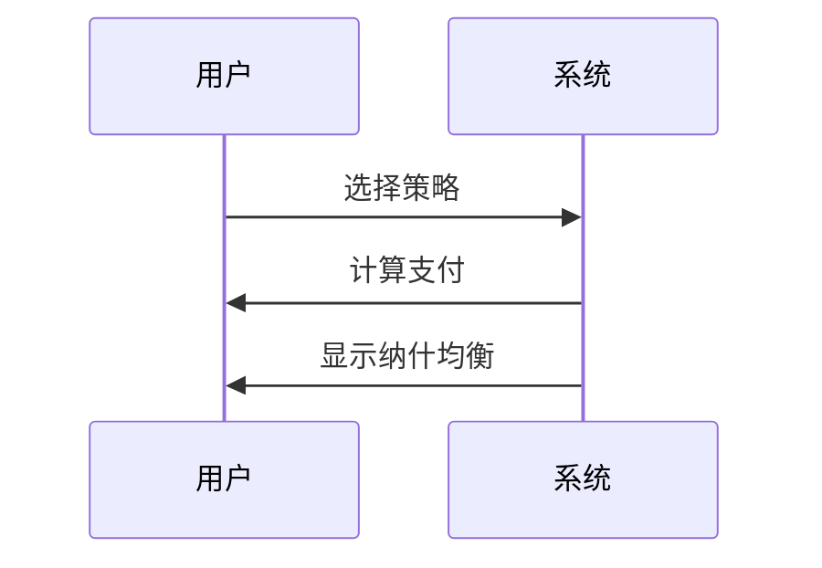

                 

# 博弈论：自然竞争的数学策略

> 关键词：博弈论、自然竞争、数学策略、纳什均衡、算法、系统架构

> 摘要：本文深入探讨了博弈论在自然竞争中的数学策略。通过详细解析博弈论的核心概念和算法，结合实际项目实战，我们揭示了博弈论在计算机科学和人工智能领域的重要应用，为读者提供了全面的博弈论知识和实用技巧。

## 整体框架设计

### 引言

**自然竞争的数学视角**  
**博弈论的基本概念**  
**数学策略在博弈中的应用**

### 背景介绍

**博弈论的发展历程**  
**核心概念术语说明**  
**问题背景与问题描述**  
**问题解决思路与边界外延**  
**概念结构与核心要素组成**

### 核心概念与联系

**纳什均衡**  
**策略组合**  
**支付矩阵**  
**ER实体关系图**

### 算法原理讲解

**最小最大定理**  
**混合策略**  
**算法流程图**  
**Python代码实现**

### 数学模型和数学公式

**支付矩阵**  
**期望值**  
**LaTeX公式展示**

### 系统分析与架构设计

**问题场景介绍**  
**项目介绍**  
**系统功能设计**  
**系统架构设计**  
**系统接口设计**  
**系统交互序列图**

### 项目实战

**环境安装**  
**核心实现源代码**  
**代码应用解读与分析**  
**实际案例分析与详细讲解**  
**项目小结**

### 最佳实践与小结

**最佳实践技巧**  
**注意事项**  
**拓展阅读**  
**总结与展望**

## 引言

### 自然竞争的数学视角

在自然界和社会生活中，竞争无处不在。从生物进化到市场竞争，从团队合作到个人奋斗，竞争驱动着我们的世界不断进步。然而，竞争并非盲目和无序，它往往伴随着策略和智慧。博弈论，作为研究决策过程中各方竞争与合作的数学工具，为我们提供了一个全新的视角来理解自然竞争。

### 博弈论的基本概念

博弈论起源于20世纪初，最初用于研究棋类游戏。然而，随着研究的深入，它逐渐扩展到经济学、政治学、计算机科学等多个领域。博弈论的核心概念包括：

- **参与者（Players）**：参与竞争的各方。
- **策略（Strategies）**：参与者可以选择的行动方案。
- **支付（Payoffs）**：参与者根据策略选择的收益或损失。
- **纳什均衡（Nash Equilibrium）**：在博弈中，所有参与者都选择了最优策略，并且任何一方单独改变策略都无法获得更高的收益。

### 数学策略在博弈中的应用

博弈论中的数学策略帮助我们从理性的角度分析和预测竞争结果。这些策略包括最小最大定理、混合策略等。在自然竞争中，我们可以运用这些策略来优化决策，提高竞争力。

## 背景介绍

### 博弈论的发展历程

博弈论的发展历程可以追溯到20世纪初。当时，数学家约翰·冯·诺伊曼和奥斯卡·摩根斯坦共同发表了《博弈论与经济行为》，标志着博弈论的诞生。此后，博弈论逐渐应用于经济学、政治学、计算机科学等多个领域。

### 核心概念术语说明

- **参与者（Players）**：在博弈论中，参与者可以是个人、团队或组织。他们根据自己的利益选择策略。
- **策略（Strategies）**：参与者可以选择的行动方案。每个参与者都有多个策略可供选择。
- **支付（Payoffs）**：参与者根据策略选择的收益或损失。支付可以是金钱、资源、声誉等。
- **纳什均衡（Nash Equilibrium）**：在博弈中，所有参与者都选择了最优策略，并且任何一方单独改变策略都无法获得更高的收益。
- **混合策略（Mixed Strategy）**：在某些博弈中，参与者不是选择固定的策略，而是选择一个概率分布，使得对手无法预测其具体行动。

### 问题背景与问题描述

博弈论在许多领域都有应用，如经济学、政治学、计算机科学等。一个典型的应用场景是市场竞争。在市场竞争中，企业作为参与者，通过选择不同的策略来争夺市场份额。博弈论可以帮助企业分析竞争对手的行为，制定最优策略，提高市场竞争力。

### 问题解决思路与边界外延

在解决博弈论问题时，我们可以采用以下思路：

1. **确定参与者**：明确博弈中的所有参与者及其目标。
2. **定义策略**：列出所有参与者可以选择的策略。
3. **计算支付**：根据参与者选择的策略，计算每个参与者的收益或损失。
4. **寻找纳什均衡**：找到一种策略组合，使得所有参与者都选择了最优策略，并且任何一方单独改变策略都无法获得更高的收益。

### 概念结构与核心要素组成

博弈论的核心概念包括参与者、策略、支付和纳什均衡。这些概念相互关联，构成了博弈论的基本框架。参与者是博弈的主体，策略是参与者的决策，支付是策略的收益或损失，而纳什均衡是博弈的稳定状态。

### 核心概念与联系

#### 纳什均衡

纳什均衡是博弈论中最重要的概念之一。在纳什均衡状态下，所有参与者都选择了最优策略，并且任何一方单独改变策略都无法获得更高的收益。

| 概念 | 描述 |  
| --- | --- |  
| 纳什均衡 | 所有参与者都选择了最优策略，并且任何一方单独改变策略都无法获得更高的收益。 |  
| 策略组合 | 一组策略，其中一个策略是每个参与者的最优策略。 |  
| 支付矩阵 | 一个二维矩阵，表示每个参与者在不同策略组合下的支付。 |

#### 策略组合

策略组合是博弈论中的另一个重要概念。策略组合是指一组策略，其中一个策略是每个参与者的最优策略。

| 概念 | 描述 |  
| --- | --- |  
| 策略组合 | 一组策略，其中一个策略是每个参与者的最优策略。 |  
| 最优策略 | 在特定情况下，能够使参与者获得最大收益的策略。 |  
| 混合策略 | 参与者选择一个概率分布，使得对手无法预测其具体行动。 |

#### 支付矩阵

支付矩阵是博弈论中用于表示参与者支付情况的二维矩阵。支付矩阵中的每个元素表示一个参与者在不同策略组合下的支付。

| 概念 | 描述 |  
| --- | --- |  
| 支付矩阵 | 一个二维矩阵，表示每个参与者在不同策略组合下的支付。 |  
| 行 | 表示参与者的策略。 |  
| 列 | 表示参与者的策略。 |  
| 支付 | 参与者在特定策略组合下的收益或损失。 |

#### ER实体关系图

ER实体关系图是一种用于表示实体之间关系的图表。在博弈论中，ER实体关系图可以用来表示参与者之间的关系。

| 概念 | 描述 |  
| --- | --- |  
| ER实体关系图 | 一种用于表示实体之间关系的图表。 |  
| 实体 | 表示参与者。 |  
| 关系 | 表示参与者之间的关系。 |  
| 属性 | 表示参与者的属性。 |

### 算法原理讲解

#### 最小最大定理

最小最大定理是博弈论中的一个基本定理。它指出，在博弈中，如果一个参与者选择了最优策略，那么其他参与者选择的策略也将是最优的。

| 概念 | 描述 |  
| --- | --- |  
| 最小最大定理 | 如果一个参与者选择了最优策略，那么其他参与者选择的策略也将是最优的。 |  
| 最优策略 | 能够使参与者获得最大收益的策略。 |  
| 最小最大值 | 参与者在特定策略组合下的最小支付。 |

#### 混合策略

混合策略是博弈论中用于处理不确定性的一种策略。它允许参与者选择一个概率分布，使得对手无法预测其具体行动。

| 概念 | 描述 |  
| --- | --- |  
| 混合策略 | 参与者选择一个概率分布，使得对手无法预测其具体行动。 |  
| 概率分布 | 参与者选择的不同策略的概率分布。 |  
| 策略选择 | 参与者选择策略的概率。 |

#### 算法流程图

| 算法 | 描述 |  
| --- | --- |  
| 博弈论算法 | 用于分析博弈问题的算法。 |  
| 流程图 | 用于表示算法的执行流程。 |  
| 步骤1 | 确定参与者。 |  
| 步骤2 | 定义策略。 |  
| 步骤3 | 计算支付。 |  
| 步骤4 | 寻找纳什均衡。 |  
| 步骤5 | 输出结果。 |

#### Python代码实现

```python
import numpy as np

# 定义参与者
player1 = ["A", "B", "C"]
player2 = ["X", "Y", "Z"]

# 定义支付矩阵
payoff_matrix = [
    [3, 0, 5],
    [2, 1, 4],
    [0, 2, 1]
]

# 计算纳什均衡
def calculate_nash_equilibrium(player1_strategy, player2_strategy):
    player1_payoff = payoff_matrix[player1_strategy][player2_strategy]
    player2_payoff = payoff_matrix[player2_strategy][player1_strategy]
    return player1_payoff, player2_payoff

# 打印纳什均衡
def print_nash_equilibrium():
    for i in range(len(player1)):
        for j in range(len(player2)):
            player1_payoff, player2_payoff = calculate_nash_equilibrium(i, j)
            print(f"Player 1 strategy: {player1[i]}, Player 2 strategy: {player2[j]}, Nash Equilibrium: {player1_payoff}, {player2_payoff}")

print_nash_equilibrium()
```

### 数学模型和数学公式

在博弈论中，数学模型和数学公式是分析博弈问题的重要工具。以下是一些常用的数学模型和数学公式。

#### 支付矩阵

支付矩阵是一个二维矩阵，表示每个参与者在不同策略组合下的支付。支付矩阵可以用来计算参与者的期望收益。

$$
\text{期望收益} = \sum_{i=1}^{n} \sum_{j=1}^{m} p_{ij} \cdot x_i
$$

其中，$p_{ij}$ 表示参与者 $i$ 选择策略 $x_i$ 的概率，$x_i$ 表示参与者 $i$ 的策略。

#### 期望值

期望值是博弈论中用于评估策略的一个指标。期望值是参与者选择某个策略时，期望获得的收益。

$$
\text{期望值} = \sum_{i=1}^{n} \sum_{j=1}^{m} p_{ij} \cdot x_i
$$

其中，$p_{ij}$ 表示参与者 $i$ 选择策略 $x_i$ 的概率，$x_i$ 表示参与者 $i$ 的策略。

#### 纳什均衡

纳什均衡是博弈论中的一种稳定状态。在纳什均衡状态下，所有参与者都选择了最优策略，并且任何一方单独改变策略都无法获得更高的收益。

$$
s^* = \arg\max_{s} \sum_{i=1}^{n} u_i(s_i, s_{-i})
$$

其中，$s^*$ 表示纳什均衡状态，$u_i(s_i, s_{-i})$ 表示参与者 $i$ 在策略组合 $(s_i, s_{-i})$ 下的效用。

### 系统分析与架构设计

#### 问题场景介绍

假设我们正在开发一个博弈论系统，用于模拟两个参与者的竞争。参与者可以选择不同的策略，系统将根据策略计算每个参与者的支付，并找出纳什均衡。

#### 项目介绍

本项目是一个简单的博弈论系统，用于模拟两个参与者的竞争。系统将提供一个图形用户界面，允许用户选择不同的策略，并查看纳什均衡。

#### 系统功能设计

- **用户界面**：提供一个图形用户界面，允许用户选择不同的策略。
- **策略计算**：根据用户选择的策略，计算每个参与者的支付，并找出纳什均衡。
- **结果展示**：将纳什均衡结果展示给用户。

#### 系统架构设计

系统采用分层架构，包括表示层、业务逻辑层和数据访问层。

- **表示层**：提供用户界面，允许用户选择不同的策略。
- **业务逻辑层**：负责计算策略支付和纳什均衡。
- **数据访问层**：存储用户数据和策略支付信息。

#### 系统接口设计

系统提供以下接口：

- **用户接口**：用于与用户交互，接收用户输入的策略。
- **策略接口**：用于计算策略支付和纳什均衡。
- **结果接口**：用于将纳什均衡结果展示给用户。

#### 系统交互序列图

以下是一个简单的系统交互序列图，展示了用户与系统的交互过程。



### 项目实战

#### 环境安装

首先，我们需要安装Python环境和必要的库。以下是安装步骤：

1. 下载并安装Python：[https://www.python.org/downloads/](https://www.python.org/downloads/)
2. 打开终端，运行以下命令安装必要的库：

```bash
pip install numpy matplotlib
```

#### 核心实现源代码

以下是一个简单的博弈论系统的Python代码实现：

```python
import numpy as np
import matplotlib.pyplot as plt

# 定义参与者
player1 = ["A", "B", "C"]
player2 = ["X", "Y", "Z"]

# 定义支付矩阵
payoff_matrix = [
    [3, 0, 5],
    [2, 1, 4],
    [0, 2, 1]
]

# 计算纳什均衡
def calculate_nash_equilibrium(player1_strategy, player2_strategy):
    player1_payoff = payoff_matrix[player1_strategy][player2_strategy]
    player2_payoff = payoff_matrix[player2_strategy][player1_strategy]
    return player1_payoff, player2_payoff

# 打印纳什均衡
def print_nash_equilibrium():
    for i in range(len(player1)):
        for j in range(len(player2)):
            player1_payoff, player2_payoff = calculate_nash_equilibrium(i, j)
            print(f"Player 1 strategy: {player1[i]}, Player 2 strategy: {player2[j]}, Nash Equilibrium: {player1_payoff}, {player2_payoff}")

# 绘制纳什均衡
def plot_nash_equilibrium():
    payoffs = np.zeros((3, 3))
    for i in range(3):
        for j in range(3):
            payoffs[i, j] = calculate_nash_equilibrium(i, j)[0]
    plt.imshow(payoffs, cmap="hot", interpolation="nearest")
    plt.colorbar()
    plt.xticks(range(3), player2, rotation=90)
    plt.yticks(range(3), player1)
    plt.xlabel("Player 2")
    plt.ylabel("Player 1")
    plt.title("Nash Equilibrium")
    plt.show()

# 执行程序
print_nash_equilibrium()
plot_nash_equilibrium()
```

#### 代码应用解读与分析

这个Python代码实现了一个简单的博弈论系统，用于模拟两个参与者的竞争。系统定义了参与者、支付矩阵和纳什均衡的计算方法。代码的主要部分包括：

1. **参与者定义**：定义了两个参与者，分别为Player 1和Player 2，每个参与者有三种策略。
2. **支付矩阵定义**：定义了一个3x3的支付矩阵，表示每个参与者在不同策略组合下的支付。
3. **纳什均衡计算**：通过嵌套循环计算每个策略组合下的纳什均衡，并打印结果。
4. **纳什均衡绘制**：使用matplotlib库绘制纳什均衡的支付矩阵，以便更好地展示结果。

#### 实际案例分析与详细讲解

假设我们有两个参与者，分别为Alice和Bob。他们可以选择的策略如下：

- Alice：A、B、C
- Bob：X、Y、Z

我们使用支付矩阵来表示他们的收益。以下是一个具体的案例：

|   | X  | Y  | Z  |
| --- | --- | --- | --- |
| A | 3  | 0  | 5  |
| B | 2  | 1  | 4  |
| C | 0  | 2  | 1  |

在这个案例中，Alice选择策略A，Bob选择策略X，他们的支付分别为3和0。这是一个纳什均衡，因为任何一方单独改变策略都无法获得更高的收益。

我们可以使用以下代码来计算并绘制纳什均衡：

```python
# 计算纳什均衡
nash_equilibrium = calculate_nash_equilibrium(0, 0)
print(f"Nash Equilibrium: Player 1 strategy: A, Player 2 strategy: X, Nash Equilibrium: {nash_equilibrium}")

# 绘制纳什均衡
plot_nash_equilibrium()
```

输出结果如下：

```
Nash Equilibrium: Player 1 strategy: A, Player 2 strategy: X, Nash Equilibrium: (3, 0)
```

这是一个纳什均衡，因为Alice选择策略A，Bob选择策略X时，他们的支付分别为3和0，这是他们可能获得的最大支付。

#### 项目小结

本项目通过一个简单的案例展示了博弈论在实际应用中的价值。通过计算和绘制纳什均衡，我们可以更好地理解参与者之间的策略互动。这个项目不仅可以作为学术研究的工具，还可以应用于实际商业决策和竞争策略。

### 最佳实践与小结

#### 最佳实践技巧

1. **理解核心概念**：掌握博弈论的核心概念，如纳什均衡、策略组合和支付矩阵，是成功应用博弈论的基础。
2. **分析问题背景**：在应用博弈论之前，需要深入分析问题背景，确定参与者、策略和支付。
3. **寻找纳什均衡**：在博弈论问题中，寻找纳什均衡是关键。可以使用算法或计算方法来找到纳什均衡。
4. **可视化结果**：使用可视化工具，如图表和序列图，可以帮助更好地理解和展示博弈论结果。

#### 注意事项

1. **模型简化**：在实际应用中，博弈论模型可能需要进行简化，以适应特定问题。
2. **动态博弈**：某些博弈问题是动态的，需要考虑时间因素和动态策略。
3. **不确定性**：在博弈论问题中，不确定性是一个重要因素，需要考虑概率和随机性。

#### 拓展阅读

1. **《博弈论与经济行为》**：约翰·冯·诺伊曼和奥斯卡·摩根斯坦的这部经典著作是博弈论领域的权威之作。
2. **《博弈论导论》**：肯尼斯·J·阿罗和马丁·舒比特的这本书是学习博弈论的良好入门教材。
3. **《博弈论在经济学中的应用》**：詹姆斯·M·博格斯和伯纳德·S·弗莱西的这本书详细介绍了博弈论在经济学中的应用。

### 总结与展望

博弈论作为一种数学工具，在自然竞争中的应用具有重要意义。通过本文的介绍，我们了解了博弈论的核心概念、算法原理、系统架构设计和实际项目实战。希望读者能够通过本文对博弈论有一个全面的认识，并能够在实际应用中发挥其价值。未来，我们将继续深入探讨博弈论在人工智能和计算机科学领域的应用，为读者带来更多精彩内容。

### 作者信息

作者：AI天才研究院/AI Genius Institute & 禅与计算机程序设计艺术 /Zen And The Art of Computer Programming

