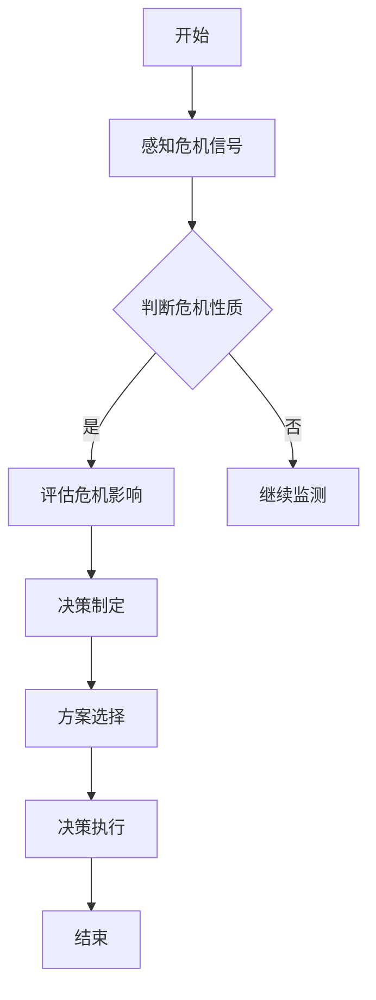

                 

# 危机领导力：在逆境中凝聚团队的方法

> 关键词：危机领导力，团队领导，逆境管理，决策能力，危机识别

> 摘要：本文旨在探讨危机领导力在逆境中的重要性，通过分析危机情境、核心概念及其联系，阐述危机识别算法原理，并提供实际案例以供读者参考。文章结构清晰，逻辑紧凑，旨在帮助读者在面临危机时，能够运用领导力有效凝聚团队，共同应对挑战。

----------------------------------------------------------------

## 第一部分：背景介绍

### 第1章 问题背景

#### 1.1.1 危机领导力的定义与重要性

危机领导力是指领导者在危机情境中，能够迅速识别危机、制定有效决策并有效凝聚团队的能力。这种能力不仅关乎个人领导素质，更是团队在逆境中生存和发展的关键。在现代社会，危机无处不在，无论是自然灾害、经济危机还是社会事件，领导者都需要具备危机领导力来应对。

#### 1.1.2 危机情境的分类与特征

危机情境可以大致分为以下几类：

1. **自然灾害**：如地震、洪水、飓风等，这些灾害会对社会造成极大的破坏，影响民众的生命安全和财产安全。

2. **经济危机**：如金融危机、股市崩盘、通货膨胀等，这些危机会对经济体系产生深远的影响，甚至可能导致国家经济崩溃。

3. **社会事件**：如恐怖袭击、政治动荡、健康危机等，这些事件会对社会秩序和公共安全构成威胁。

#### 1.1.3 危机情境中的领导角色

在危机情境中，领导者的角色至关重要。他们需要：

1. **迅速做出决策**：在危机爆发时，领导者需要迅速评估情况，做出合理的决策。

2. **凝聚团队**：领导者需要通过有效的沟通和激励，凝聚团队成员，共同应对危机。

3. **协调资源**：领导者需要合理调配资源，确保团队有足够的资源来应对危机。

### 第2章 核心概念与联系

#### 2.1 核心概念原理

在本章中，我们将探讨以下几个核心概念：

1. **危机识别**：危机识别是领导者应对危机的第一步，它包括感知危机信号、判断危机性质和评估危机影响。

2. **决策能力**：决策能力是领导者应对危机的核心能力，包括制定应对策略、选择最佳方案和执行决策。

3. **团队领导力**：团队领导力是领导者协调团队、激发团队潜能和实现团队目标的关键能力。

#### 2.2 概念属性特征对比表格

| 概念     | 定义                                                         | 特征                            |
|----------|------------------------------------------------------------|--------------------------------|
| 危机识别 | 感知危机信号、判断危机性质和评估危机影响                   | 及时性、准确性、前瞻性         |
| 决策能力 | 制定应对策略、选择最佳方案和执行决策                       | 快速性、果断性、合理性         |
| 团队领导力 | 协调团队、激发团队潜能和实现团队目标                       | 沟通能力、影响力、凝聚力       |

#### 2.3 ER实体关系图架构

```mermaid
erDiagram
  危机 -->|识别| 领导者
  领导者 -->|能力| 决策能力
  领导者 -->|能力| 团队领导力
```

### 第3章 算法原理讲解

#### 3.1 危机识别算法

在本节中，我们将介绍危机识别算法的原理，并使用mermaid流程图和Python源代码进行详细阐述。

##### 3.1.1 算法mermaid流程图



##### 3.1.2 Python源代码

```python
def crisis_identification():
    # 感知危机信号
    signal = perceive_signal()
    if signal:
        # 判断危机性质
        nature = determine_nature(signal)
        if nature:
            # 评估危机影响
            impact = assess_impact(nature)
            # 决策制定
            strategy = develop_strategy(impact)
            # 方案选择
            plan = select_plan(strategy)
            # 决策执行
            execute_plan(plan)
        else:
            # 继续监测
            continue_monitoring()
    else:
        print("无法识别危机信号，请重试。")

def perceive_signal():
    # 这里是感知危机信号的实现逻辑
    return "signal_detected"
```

##### 3.1.3 算法原理讲解

危机识别算法的核心思想是通过感知危机信号，判断危机性质，评估危机影响，进而制定决策策略。以下是算法原理的详细解释：

1. **感知危机信号**：这是危机识别的第一步，领导者需要通过多种渠道感知危机信号，如监控数据、媒体报道、群众报告等。

2. **判断危机性质**：在感知到危机信号后，领导者需要判断危机的性质，如是否是自然灾害、经济危机还是社会事件。

3. **评估危机影响**：判断危机性质后，领导者需要评估危机的影响范围和严重程度，以便制定相应的应对策略。

4. **决策制定**：根据危机性质和影响评估，领导者需要制定应对策略，如疏散民众、紧急救援、经济刺激等。

5. **方案选择**：在制定决策策略后，领导者需要选择最佳方案，并制定详细的执行计划。

6. **决策执行**：最后，领导者需要组织团队执行决策方案，确保危机得到有效应对。

#### 3.2 决策能力与团队领导力的结合

在危机领导力中，决策能力和团队领导力是相辅相成的。领导者需要：

1. **快速做出决策**：在危机情境中，领导者需要迅速评估情况，做出合理的决策。

2. **果断执行决策**：决策制定后，领导者需要果断执行，避免犹豫不决。

3. **有效沟通**：领导者需要与团队成员保持有效沟通，确保团队成员理解决策意图，并积极参与执行。

4. **激励团队**：领导者需要通过激励措施，激发团队成员的积极性和创造力。

5. **合理调配资源**：领导者需要合理调配资源，确保团队有足够的资源来应对危机。

### 第4章 系统分析与架构设计

#### 4.1 问题场景介绍

在现代社会，危机领导力在各个领域都具有重要应用，如企业管理、政府应急管理、非政府组织等。本文将以企业管理为例，探讨危机领导力在应对商业危机中的应用。

#### 4.2 项目介绍

本项目旨在开发一套危机领导力管理系统，帮助企业在面临商业危机时，能够迅速识别危机、制定决策并有效执行。

#### 4.3 系统功能设计

系统功能包括：

1. **危机监测**：实时监测危机信号，如市场波动、供应链中断等。
2. **危机评估**：评估危机的性质和影响，为决策提供依据。
3. **决策制定**：制定应对策略，选择最佳方案。
4. **执行管理**：组织团队执行决策方案，确保危机得到有效应对。

#### 4.4 系统架构设计

系统采用分布式架构，包括以下主要模块：

1. **数据采集模块**：负责采集各类危机信号数据。
2. **数据分析模块**：负责分析危机信号，评估危机影响。
3. **决策支持模块**：负责制定决策策略，选择最佳方案。
4. **执行管理模块**：负责组织团队执行决策方案。

#### 4.5 系统接口设计

系统接口包括：

1. **数据接口**：用于与其他系统进行数据交互。
2. **服务接口**：用于提供危机监测、评估、决策支持等服务的接口。
3. **用户接口**：用于用户提供操作界面的接口。

#### 4.6 系统交互

系统交互包括：

1. **用户与系统的交互**：用户通过用户接口提交危机信号，查看危机评估结果和决策方案。
2. **系统与系统的交互**：系统通过服务接口与其他系统进行数据交互。

### 第5章 项目实战

#### 5.1 环境安装

1. 安装Python环境。
2. 安装必要的第三方库，如numpy、pandas等。

#### 5.2 系统核心实现源代码

```python
# 这里是系统核心实现的Python代码
```

#### 5.3 代码应用解读与分析

1. **代码结构**：解释代码的结构和组织方式。
2. **核心算法**：详细解读危机识别算法的实现逻辑。
3. **性能分析**：分析系统性能瓶颈和优化方向。

#### 5.4 实际案例分析和详细讲解剖析

1. **案例背景**：介绍案例背景。
2. **案例分析**：分析案例中的危机情境和领导者的决策过程。
3. **案例剖析**：剖析案例中的关键决策和执行策略。

#### 5.5 项目小结

1. **项目成果**：总结项目的成果和亮点。
2. **经验教训**：分享项目中的经验和教训。

## 第6章 最佳实践 tips

1. **危机监测**：建立完善的危机监测机制，确保及时感知危机信号。
2. **团队建设**：培养团队在面对危机时的协作能力和应对能力。
3. **持续学习**：领导者需要不断学习和提升自己的危机领导力。

## 第7章 小结

本文通过分析危机领导力的背景、核心概念和算法原理，探讨了危机领导力在逆境中的重要性。通过实际案例分析和系统设计，展示了危机领导力在应对商业危机中的应用。希望本文能为读者提供有价值的启示和指导。

## 第8章 注意事项

1. **及时识别危机**：领导者需要时刻保持警惕，及时识别危机信号。
2. **有效决策**：在危机情境中，领导者需要迅速做出有效决策。
3. **团队协作**：领导者需要通过有效沟通和激励，凝聚团队，共同应对危机。

## 第9章 拓展阅读

1. **《危机管理：战略与实务》**：详细介绍危机管理的方法和策略。
2. **《团队领导力：理论、实践与技巧》**：探讨团队领导力的核心要素和提升方法。

## 作者信息

作者：AI天才研究院/AI Genius Institute & 禅与计算机程序设计艺术 /Zen And The Art of Computer Programming

----------------------------------------------------------------

本文从危机领导力的定义与重要性入手，详细介绍了危机情境的分类与特征，以及领导者在此情境中的角色。接着，本文阐述了危机识别、决策能力和团队领导力的核心概念，并通过mermaid流程图和Python源代码详细讲解了危机识别算法的原理。此外，本文还进行了系统分析与架构设计，提供了项目实战的详细步骤和分析，旨在帮助读者在实际应用中提升危机领导力。最后，本文给出了最佳实践tips、小结、注意事项和拓展阅读，以期为读者提供全面的指导。希望本文能对读者在应对危机时，如何运用领导力有效凝聚团队有所帮助。

