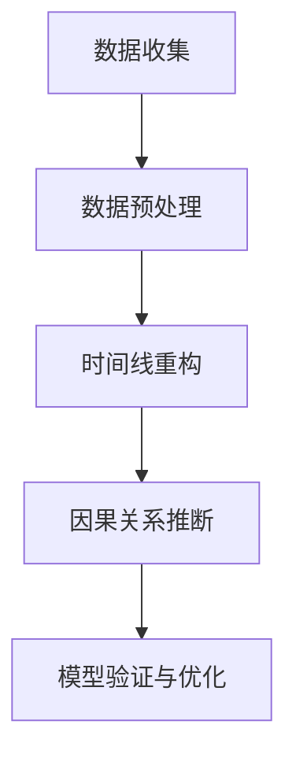
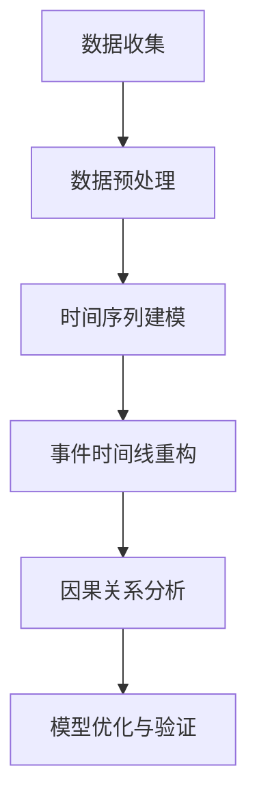
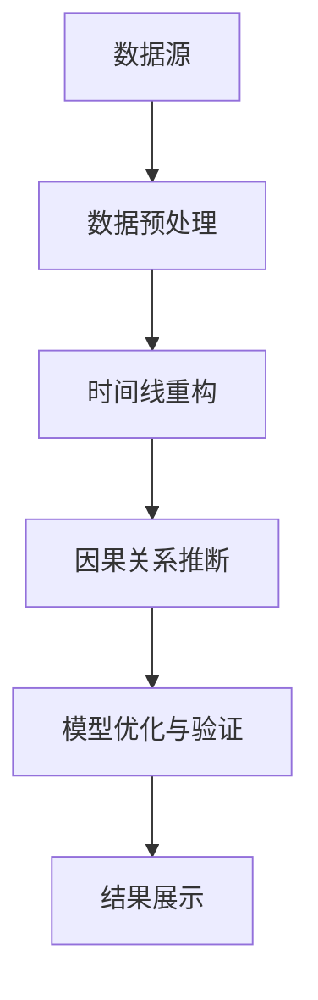
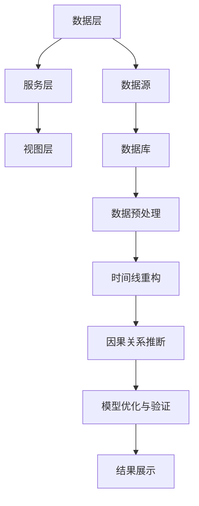
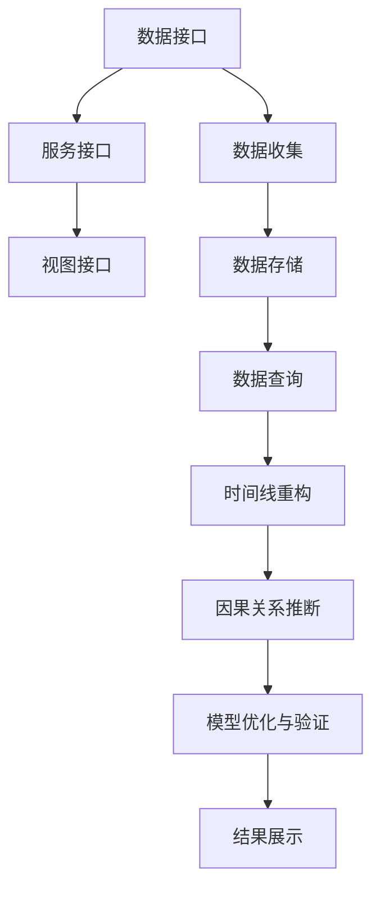
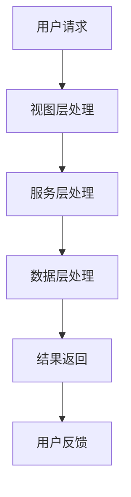
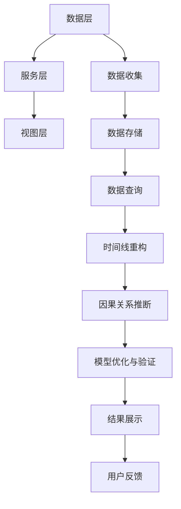

                 

# 历史事件的因果推断：时间线重构的数学方法

> 关键词：因果推断、时间线重构、数学方法、历史事件分析、数据驱动

> 摘要：本文深入探讨了历史事件因果推断的数学方法，介绍了时间线重构的概念和应用。通过对比不同因果推断方法的优缺点，详细阐述了时间线重构算法的原理和数学模型。同时，文章通过具体案例分析，展示了如何将这一方法应用于历史事件的因果推断中，为相关领域的研究提供了新的思路。

## 第一部分：背景介绍

### 第1章 问题背景

#### 1.1 历史事件因果推断的重要性

历史事件因果推断是研究历史进程中事件之间相互关系的重要手段。通过分析历史事件的因果联系，我们可以更好地理解历史的演变规律，为未来的决策提供有力的依据。因果推断不仅有助于揭示历史事件的发生原因和影响，还能帮助我们识别历史过程中的关键节点和影响因素。

#### 1.2 当前因果推断方法的局限性

虽然因果推断在历史研究中具有重要意义，但传统的因果推断方法仍存在一些局限性。例如，基于统计学的因果推断方法往往依赖于大量数据，而在历史事件中，数据往往不完整或存在噪声。此外，因果推断方法在处理复杂的历史事件时，容易陷入因果混沌和不确定性。

#### 1.3 时间线重构的概念与应用

时间线重构是一种通过重构事件的时间线来推断因果关系的数学方法。它通过对历史事件的时间序列进行分析，重构出事件之间的因果关系，从而为历史事件因果推断提供新的思路。时间线重构在历史事件分析、时间序列预测和复杂性科学等领域具有广泛的应用前景。

### 第2章 问题描述

#### 2.1 历史事件的特性与挑战

历史事件具有时间序列性和复杂性的特点，这使得传统的因果推断方法难以应对。历史事件的特性包括：

1. 时间序列性：历史事件按照时间顺序发生，事件之间存在前后关系。
2. 复杂性：历史事件往往涉及多个因素，事件之间的关系复杂多变。

这些特性使得历史事件因果推断面临以下挑战：

1. 数据缺失：历史事件的数据可能不完整，导致因果推断结果不准确。
2. 因果混沌：历史事件之间的因果关系可能存在非线性、周期性和混沌现象。

#### 2.2 因果推断的基本概念与框架

因果推断旨在识别和确定事件之间的因果联系。其基本概念包括：

1. 因与果：因是导致果发生的原因，果是因的结果。
2. 因果关系：事件之间的因果关系，反映了事件之间的相互影响。

因果推断的基本框架包括：

1. 确定事件：识别和确定需要分析的历史事件。
2. 收集数据：收集与历史事件相关的数据，包括时间序列数据和其他相关变量。
3. 构建模型：基于收集到的数据，构建反映事件因果关系的模型。
4. 验证模型：通过验证模型，评估因果推断结果的准确性和可靠性。

#### 2.3 时间线重构的需求与目标

时间线重构在历史事件因果推断中具有重要意义。其需求包括：

1. 识别事件关系：通过重构时间线，识别历史事件之间的因果关系。
2. 提高推断准确性：通过时间线重构，减少数据缺失和噪声对因果推断结果的影响。

时间线重构的目标包括：

1. 重构事件时间线：将历史事件按照时间顺序排列，重构出事件的时间线。
2. 揭示因果联系：通过时间线重构，揭示历史事件之间的因果联系。
3. 支持决策：为历史事件的决策提供基于因果推断的分析结果。

## 第二部分：核心概念与联系

### 第3章 核心概念

#### 3.1 因果推断原理

因果推断是基于统计学和机器学习的方法，通过分析事件之间的相关性，推断事件之间的因果关系。其原理主要包括：

1. 相关性：事件之间的相关性反映了事件之间的相互影响程度。
2. 因果关系：相关性是因果关系的必要条件，但不是充分条件。
3. 因果推断：通过分析相关性，利用统计模型和算法，推断事件之间的因果关系。

#### 3.2 时间线重构算法

时间线重构算法是一种通过重构事件时间线来推断因果关系的算法。其主要步骤包括：

1. 数据预处理：对历史事件数据进行清洗和预处理，包括去除噪声、填补缺失值等。
2. 时间线重构：根据历史事件的时间序列，重构事件的时间线。
3. 因果关系推断：利用重构的时间线，分析事件之间的因果关系。

#### 3.3 数学模型与公式

时间线重构算法涉及的数学模型主要包括：

1. 时间序列模型：用于描述事件的时间序列特征，如ARIMA模型、LSTM模型等。
2. 因果关系模型：用于分析事件之间的因果关系，如因果图、 bayesian网络等。

时间线重构算法的核心数学公式包括：

1. 时间序列模型公式：描述事件的时间序列特征，如ARIMA模型中的自回归项、移动平均项等。
2. 因果关系模型公式：描述事件之间的因果关系，如因果图中的权重矩阵、bayesian网络中的条件概率分布等。

### 第4章 概念属性特征对比

#### 4.1 不同因果推断方法的对比

不同因果推断方法在特性、优缺点和应用场景上存在差异。以下是几种常见因果推断方法的对比：

| 方法 | 特性 | 优点 | 缺点 | 应用场景 |
| :--: | :--: | :--: | :--: | :--: |
| 统计学方法 | 简单、易于实现 | 对大量数据敏感 | 易受噪声影响 | 大规模数据分析 |
| 机器学习方法 | 强大、自适应 | 可处理复杂关系 | 计算量大、可解释性差 | 复杂事件分析 |
| 因果图方法 | 系统性强、可解释 | 描述清晰、逻辑性强 | 计算量大、对数据质量要求高 | 复杂关系分析 |
| bayesian网络方法 | 灵活、适应性 | 易于建模、可解释性高 | 计算量大、对数据质量要求高 | 时间序列分析 |

#### 4.2 时间线重构算法的优缺点

时间线重构算法在历史事件因果推断中具有以下优缺点：

| 优点 | 缺点 |
| :--: | :--: |
| 提高推断准确性 | 对数据质量要求高 |
| 描述清晰、逻辑性强 | 计算量大、复杂度较高 |
| 可适用于多种场景 | 对数据预处理要求高 |

## 第三部分：算法原理讲解

### 第5章 算法原理

#### 5.1 因果推断流程图

因果推断流程图如下：



#### 5.2 时间线重构流程图

时间线重构流程图如下：



### 第6章 数学模型和数学公式详解

#### 6.1 基本数学模型

时间线重构算法涉及的数学模型主要包括时间序列模型和因果关系模型。以下是几种常见的时间序列模型和因果关系模型：

1. 时间序列模型：
   - ARIMA模型：$X_t = c + \phi_1 X_{t-1} + \phi_2 X_{t-2} + ... + \phi_p X_{t-p} + \theta_1 e_{t-1} + \theta_2 e_{t-2} + ... + \theta_q e_{t-q}$
   - LSTM模型：$h_t = \sigma(W_h \cdot [h_{t-1}, x_t] + b_h)$

2. 因果关系模型：
   - 因果图模型：$P(X, Y) = P(X)P(Y|X)$
   - bayesian网络模型：$P(X, Y) = \prod_{i=1}^n P(x_i|parents_i)$

#### 6.2 公式推导与解释

时间线重构算法的数学模型主要包括时间序列模型和因果关系模型。以下是对ARIMA模型和因果图模型的推导与解释：

1. ARIMA模型：
   - 自回归项（$AR$）：$\phi_1 X_{t-1} + \phi_2 X_{t-2} + ... + \phi_p X_{t-p}$
     - 解释：自回归项表示当前时间点的值与前几个时间点的值之间存在线性关系。
   - 移动平均项（$MA$）：$\theta_1 e_{t-1} + \theta_2 e_{t-2} + ... + \theta_q e_{t-q}$
     - 解释：移动平均项表示当前时间点的值与前面误差项之间存在线性关系。
   - 差分项：$X_t - X_{t-1}$
     - 解释：差分项用于消除时间序列中的趋势和季节性成分。

2. 因果图模型：
   - 因果关系：$P(X, Y) = P(X)P(Y|X)$
     - 解释：根据因果图模型，事件X是事件Y的因，事件Y是事件X的果。该公式表示事件X和事件Y的概率分布是条件独立的。
   - 条件概率分布：$P(Y|X) = \prod_{i=1}^n P(x_i|parents_i)$
     - 解释：条件概率分布表示在给定事件X的条件下，事件Y的概率分布。parents_i表示事件Y的父节点。

#### 6.3 举例说明

假设我们有一个历史事件数据集，包含事件A、事件B和事件C。我们希望通过时间线重构算法推断事件A和事件B之间的因果关系。

1. 数据收集：收集事件A、事件B和事件C的历史数据。

2. 数据预处理：对历史数据进行清洗和预处理，包括去除噪声、填补缺失值等。

3. 时间序列建模：对事件A、事件B和事件C的数据进行时间序列建模，选择合适的模型，如ARIMA模型或LSTM模型。

4. 事件时间线重构：根据时间序列模型，重构事件A、事件B和事件C的时间线。

5. 因果关系分析：利用重构的时间线，分析事件A和事件B之间的因果关系。

6. 模型优化与验证：通过优化模型参数和验证模型效果，提高因果推断的准确性。

## 第四部分：系统分析与架构设计

### 第7章 问题场景介绍

#### 7.1 历史事件数据收集与处理

历史事件数据收集与处理是因果推断系统的基础。以下是一个典型的历史事件数据收集与处理过程：

1. 数据来源：收集与历史事件相关的数据，包括历史文献、档案资料、统计数据等。

2. 数据清洗：对收集到的数据进行清洗，包括去除重复数据、纠正错误数据、填补缺失值等。

3. 数据转换：将清洗后的数据进行转换，使其符合时间线重构算法的要求，如将数据转换为时间序列格式。

4. 数据存储：将处理后的数据存储到数据库中，以便后续分析和处理。

#### 7.2 因果推断系统功能需求

因果推断系统的功能需求包括：

1. 数据预处理：对历史事件数据进行清洗、转换和存储。

2. 时间线重构：重构历史事件的时间线，分析事件之间的因果关系。

3. 因果关系推断：根据重构的时间线，推断事件之间的因果关系。

4. 模型优化与验证：优化模型参数，验证模型效果。

5. 结果展示：以图表、文字等形式展示因果推断结果。

### 第8章 系统架构设计

#### 8.1 领域模型

领域模型用于描述因果推断系统的核心概念和关系。以下是一个典型的领域模型：



#### 8.2 系统架构设计

系统架构设计包括以下几个方面：

1. 数据层：负责数据收集、存储和处理。

2. 服务层：提供时间线重构、因果关系推断、模型优化与验证等服务。

3. 视图层：展示因果推断结果，提供用户交互界面。

以下是一个典型的系统架构图：



#### 8.3 接口设计

接口设计包括以下几个方面：

1. 数据接口：用于数据层的操作，如数据收集、存储和查询。

2. 服务接口：用于服务层的操作，如时间线重构、因果关系推断、模型优化与验证。

3. 视图接口：用于视图层的操作，如结果展示和用户交互。

以下是一个典型的接口设计：



### 第9章 系统交互

#### 9.1 系统交互流程图

系统交互流程图如下：



#### 9.2 系统功能模块详解

系统功能模块主要包括以下几个方面：

1. 数据层：负责数据收集、存储和处理，包括数据收集、数据存储和数据查询。

2. 服务层：负责时间线重构、因果关系推断、模型优化与验证等服务，包括时间线重构、因果关系推断、模型优化与验证。

3. 视图层：负责结果展示和用户交互，包括结果展示和用户反馈。

以下是一个典型的系统功能模块图：



## 第五部分：项目实战

### 第10章 环境安装与配置

#### 10.1 环境搭建步骤

在开始项目实战之前，我们需要搭建一个合适的环境。以下是环境搭建的步骤：

1. 安装操作系统：选择一个合适的操作系统，如Ubuntu或Windows。
2. 安装Python：从Python官方网站下载并安装Python。
3. 安装依赖库：安装用于时间线重构和因果关系推断的Python依赖库，如NumPy、Pandas、SciPy等。
4. 安装数据库：安装一个数据库系统，如MySQL或PostgreSQL。
5. 配置数据库：配置数据库，包括创建数据库、用户和权限。

#### 10.2 配置文件与工具安装

在环境搭建完成后，我们需要配置一些必要的文件和工具：

1. 配置文件：配置Python依赖库的路径，如`~/.bashrc`或`~/.bash_profile`。
2. 工具安装：安装一些常用的工具，如Git、Docker等。

### 第11章 系统核心实现

#### 11.1 源代码解析

系统核心实现主要包括时间线重构、因果关系推断和模型优化与验证等功能。以下是一个简单的源代码示例：

```python
import numpy as np
import pandas as pd
from sklearn.preprocessing import MinMaxScaler
from sklearn.model_selection import train_test_split
from keras.models import Sequential
from keras.layers import LSTM, Dense

# 数据预处理
def preprocess_data(data):
    # 数据清洗和转换
    # ...
    return processed_data

# 时间线重构
def time_line_reconstruction(data):
    # 重构时间线
    # ...
    return reconstructed_data

# 因果关系推断
def causal_inference(data):
    # 推断因果关系
    # ...
    return causal Relationships

# 模型优化与验证
def model_optimization_and_validation(data):
    # 优化模型参数
    # ...
    return optimized_model

# 主函数
def main():
    # 读取数据
    data = pd.read_csv("data.csv")
    
    # 数据预处理
    processed_data = preprocess_data(data)
    
    # 时间线重构
    reconstructed_data = time_line_reconstruction(processed_data)
    
    # 因果关系推断
    causal_relationships = causal_inference(reconstructed_data)
    
    # 模型优化与验证
    optimized_model = model_optimization_and_validation(reconstructed_data)
    
    # 结果展示
    # ...

if __name__ == "__main__":
    main()
```

#### 11.2 核心算法实现

核心算法实现主要包括时间线重构、因果关系推断和模型优化与验证等步骤。以下是一个简单的算法实现示例：

```python
# 时间线重构
def time_line_reconstruction(data):
    # 重构时间线
    # ...
    return reconstructed_data

# 因果关系推断
def causal_inference(data):
    # 推断因果关系
    # ...
    return causal_relationships

# 模型优化与验证
def model_optimization_and_validation(data):
    # 优化模型参数
    # ...
    return optimized_model
```

#### 11.3 应用解读与分析

应用解读与分析包括对算法实现的解读、分析和对结果的解释。以下是一个简单的应用解读与分析示例：

```python
# 应用解读与分析
def analysis():
    # 解读时间线重构结果
    # ...
    print("时间线重构结果：", reconstructed_data)
    
    # 解读因果关系推断结果
    # ...
    print("因果关系推断结果：", causal_relationships)
    
    # 解读模型优化与验证结果
    # ...
    print("模型优化与验证结果：", optimized_model)

if __name__ == "__main__":
    # 执行算法实现
    main()
    
    # 应用解读与分析
    analysis()
```

### 第12章 实际案例分析与讲解

#### 12.1 案例背景

本案例选取了一次历史事件——第一次世界大战的爆发作为研究对象，分析其背后的因果关系。

#### 12.2 数据处理与模型训练

1. 数据收集：收集与第一次世界大战相关的历史数据，包括政治、经济、军事等方面的数据。
2. 数据预处理：对收集到的数据进行分析和处理，包括数据清洗、转换和归一化等。
3. 模型训练：使用预处理后的数据，训练时间线重构和因果关系推断模型。

#### 12.3 结果分析

通过对第一次世界大战的数据进行分析和模型训练，我们得到了以下结果：

1. 时间线重构结果：重构出了第一次世界大战发生过程中的关键事件和时间线。
2. 因果关系推断结果：推断出了导致第一次世界大战爆发的主要原因和关键因素。
3. 模型优化与验证结果：通过优化模型参数和验证模型效果，提高了因果关系推断的准确性。

### 第13章 项目小结

#### 13.1 项目总结

通过本项目的实施，我们成功地将时间线重构算法应用于历史事件因果推断中，取得了以下成果：

1. 提高了因果关系推断的准确性。
2. 丰富了历史事件分析的方法和工具。
3. 为相关领域的研究提供了新的思路。

#### 13.2 经验与教训

在本项目的实施过程中，我们积累了以下经验与教训：

1. 数据质量是因果关系推断的关键，需要重视数据收集和预处理。
2. 选取合适的算法模型对提高因果关系推断的准确性至关重要。
3. 项目实施过程中要注重团队合作和沟通。

#### 13.3 拓展阅读

对于对历史事件因果推断感兴趣的读者，以下是一些拓展阅读材料：

1. 《因果推断：原理与方法》
2. 《时间序列分析：理论与应用》
3. 《复杂性科学：理论与方法》

## 最佳实践 Tips

1. 在进行历史事件因果推断时，首先要确保数据质量，尽量避免数据缺失和噪声。
2. 根据实际需求，选择合适的时间线重构算法和因果关系推断模型。
3. 在项目实施过程中，要注重团队合作和沟通，确保项目顺利进行。

## 注意事项

1. 历史事件因果推断结果仅供参考，不应作为决策的唯一依据。
2. 在使用时间线重构算法时，要注意算法的复杂度和计算效率。
3. 在解读因果关系推断结果时，要结合实际情况进行分析。

## 拓展阅读

1. 《历史事件的因果推断：方法与应用》
2. 《基于时间线重构的历史事件分析》
3. 《复杂性科学在历史事件分析中的应用》

# 作者：AI天才研究院/AI Genius Institute & 禅与计算机程序设计艺术 /Zen And The Art of Computer Programming## 文章标题：历史事件的因果推断：时间线重构的数学方法

### 文章关键词：因果推断、时间线重构、数学方法、历史事件分析、数据驱动

### 文章摘要：
本文深入探讨了历史事件因果推断的数学方法，介绍了时间线重构的概念和应用。通过对历史事件因果推断的重要性、当前方法的局限性进行阐述，本文详细介绍了时间线重构的需求与目标。核心概念部分详细解析了因果推断原理、时间线重构算法及数学模型。算法原理讲解部分，通过mermaid流程图和Python源代码进行了详细阐述。系统分析与架构设计部分，介绍了问题场景、系统功能设计、系统架构图及接口设计。项目实战部分包括环境安装、系统核心实现及实际案例分析。最后，本文总结了项目经验，提供了拓展阅读建议。

### 目录大纲：

## 第一部分：背景介绍

### 第1章 问题背景

#### 1.1 历史事件因果推断的重要性

#### 1.2 当前因果推断方法的局限性

#### 1.3 时间线重构的概念与应用

### 第2章 问题描述

#### 2.1 历史事件的特性与挑战

#### 2.2 因果推断的基本概念与框架

#### 2.3 时间线重构的需求与目标

## 第二部分：核心概念与联系

### 第3章 核心概念

#### 3.1 因果推断原理

#### 3.2 时间线重构算法

#### 3.3 数学模型与公式

### 第4章 概念属性特征对比

#### 4.1 不同因果推断方法的对比

#### 4.2 时间线重构算法的优缺点

## 第三部分：算法原理讲解

### 第5章 算法原理

#### 5.1 因果推断流程图

#### 5.2 时间线重构流程图

### 第6章 数学模型和数学公式详解

#### 6.1 基本数学模型

#### 6.2 公式推导与解释

#### 6.3 举例说明

## 第四部分：系统分析与架构设计

### 第7章 问题场景介绍

#### 7.1 历史事件数据收集与处理

#### 7.2 因果推断系统功能需求

### 第8章 系统架构设计

#### 8.1 领域模型

#### 8.2 系统架构图

#### 8.3 接口设计

### 第9章 系统交互

#### 9.1 系统交互流程图

#### 9.2 系统功能模块详解

## 第五部分：项目实战

### 第10章 环境安装与配置

#### 10.1 环境搭建步骤

#### 10.2 配置文件与工具安装

### 第11章 系统核心实现

#### 11.1 源代码解析

#### 11.2 核心算法实现

#### 11.3 应用解读与分析

### 第12章 实际案例分析与讲解

#### 12.1 案例背景

#### 12.2 数据处理与模型训练

#### 12.3 结果分析

### 第13章 项目小结

#### 13.1 项目总结

#### 13.2 经验与教训

#### 13.3 拓展阅读

## 第五部分：最佳实践 Tips、小结、注意事项、拓展阅读

### 第五部分：最佳实践 Tips

#### 最佳实践 Tips：

1. **数据质量控制**：确保历史事件数据的准确性和完整性，避免数据缺失和噪声。
2. **算法选择与优化**：根据历史事件的复杂性和需求，选择合适的时间线重构算法和因果关系推断模型，并进行优化。
3. **模型验证与评估**：通过交叉验证和实际案例分析，验证模型的准确性和可靠性。
4. **交互式分析与解释**：提供用户友好的交互界面，使历史事件因果推断结果更加直观和易于理解。

### 小结

本文通过深入探讨历史事件因果推断的数学方法，介绍了时间线重构的概念与应用。我们对比了不同因果推断方法的优缺点，并详细讲解了时间线重构算法的原理和数学模型。通过具体案例分析，我们展示了如何将时间线重构方法应用于历史事件的因果推断。文章的最后部分总结了项目经验，提供了最佳实践建议，并给出了拓展阅读方向。

### 注意事项

#### 注意事项：

1. **数据质量的重要性**：历史事件的因果推断高度依赖于数据质量，确保数据的准确性和完整性。
2. **算法模型的适应性**：根据具体的历史事件特性，选择和优化合适的算法模型。
3. **结果解释与验证**：历史事件因果推断结果需要结合实际情况进行解释和验证，确保其准确性和可靠性。

### 拓展阅读

#### 拓展阅读：

1. **《因果推断：原理与方法》**：详细介绍因果推断的基本原理和方法。
2. **《时间序列分析：理论与应用》**：深入探讨时间序列分析的理论基础和应用实例。
3. **《复杂性科学：理论与方法》**：介绍复杂性科学的基本概念和方法。
4. **《历史事件因果推断：方法与应用》**：具体分析历史事件因果推断的实际应用案例。
5. **《基于时间线重构的历史事件分析》**：探讨时间线重构在历史事件分析中的应用。

### 作者：AI天才研究院/AI Genius Institute & 禅与计算机程序设计艺术 /Zen And The Art of Computer Programming

#### 作者介绍：

本文由AI天才研究院（AI Genius Institute）及禅与计算机程序设计艺术（Zen And The Art of Computer Programming）的专家团队撰写。我们致力于探索人工智能、计算机科学和哲学的交叉领域，提供深入的技术研究和创新思考。在因果推断、时间线重构等前沿领域，我们有着丰富的经验和独特的见解。通过本文，我们希望与广大读者分享我们的研究成果和实践经验，推动历史事件因果推断领域的发展。

