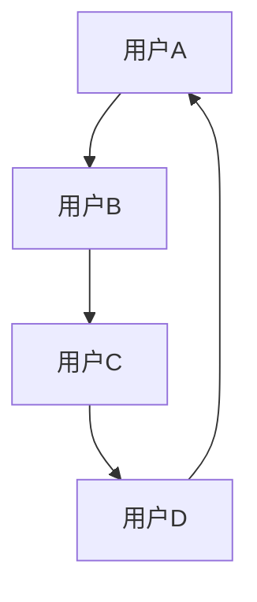
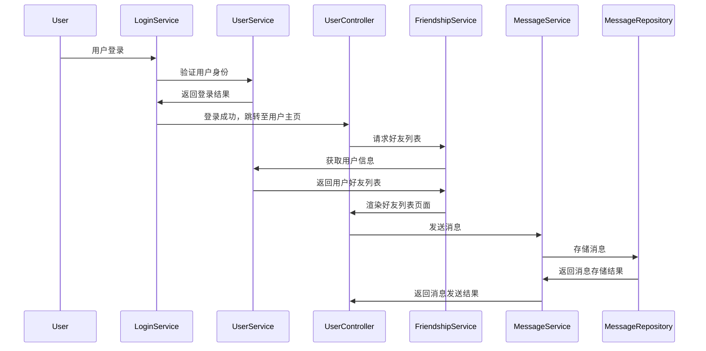
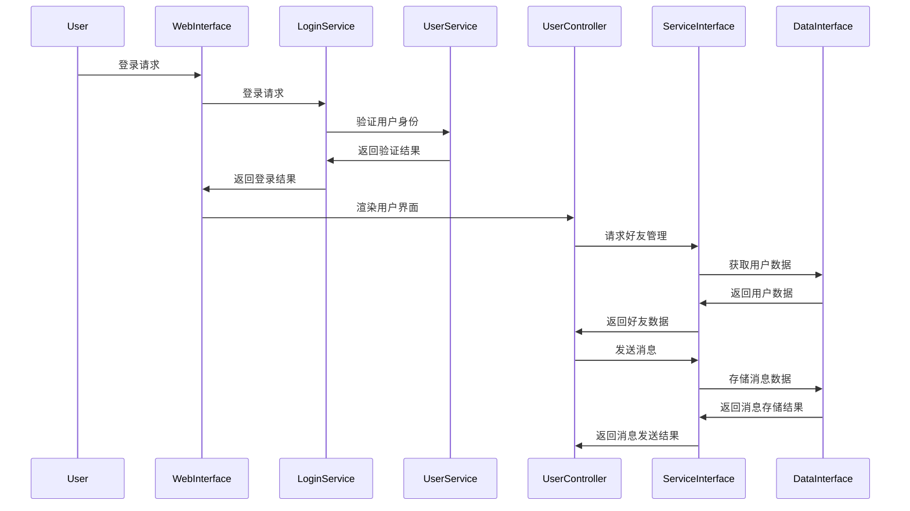

                 

# 友谊的现代定义：社交网络时代的人际关系

## 关键词
- 社交网络
- 友谊
- 现代人际关系
- 信息技术
- 社交算法

## 摘要
本文探讨了社交网络时代友谊的定义与特征，分析了传统友谊与社交网络友谊的差异，提出了友谊的现代定义，并探讨了在社交网络环境中建立和维护友谊的策略。通过对比表格、Mermaid流程图和Python代码，本文旨在为IT专业人士和广大社交网络用户提供一个全面、深入理解社交网络友谊的技术视角。

## 第1章 引言：社交网络时代的友谊变革

### 1.1 问题背景

#### 1.1.1 社交网络的起源与发展

社交网络起源于互联网的普及和人们对交流需求的增长。从早期的论坛、即时通讯工具到现在的社交媒体平台，如Facebook、Twitter、Instagram和微信，社交网络已经深深嵌入我们的日常生活。它们不仅改变了人们的沟通方式，还影响了人际关系和社交行为。

#### 1.1.2 传统友谊定义的局限性

传统友谊通常被定义为一种建立在互信、互相支持、情感共鸣基础上的长期稳定关系。然而，在现代社会，随着社交网络的发展，传统友谊的定义和特征面临挑战。例如，传统友谊强调的是面对面的交流和长期的关系建立，而社交网络友谊则是基于虚拟空间和快速的互动。

#### 1.1.3 社交网络对友谊的影响

社交网络的出现和发展改变了友谊的形态。它使得人们可以快速建立新关系，但同时也带来了友谊边界的不确定性和友谊质量的降低。社交网络友谊的特征包括快速建立、虚拟交流和信息共享，这些特征对传统的友谊概念提出了挑战。

### 1.2 问题描述

#### 1.2.1 传统友谊与社交网络友谊的差异

传统友谊与社交网络友谊在本质和边界上存在显著差异。传统友谊强调的是深入的情感联系和长期的稳定关系，而社交网络友谊则更多依赖于虚拟空间中的快速互动和信息共享。这种差异不仅体现在友谊的建立方式上，还体现在友谊的维系和终结上。

#### 1.2.2 社交网络友谊的困境与机遇

社交网络友谊面临的困境包括信息过载、友谊边界模糊和友谊质量下降等问题。然而，社交网络也为友谊带来了新的机遇，如更广泛的社交圈子、更高效的沟通方式和更丰富的互动形式。如何在困境中抓住机遇，是现代友谊研究的一个重要课题。

### 1.3 问题解决

#### 1.3.1 友谊的现代定义

友谊的现代定义应该涵盖社交网络友谊的特征，同时保留传统友谊的核心价值。现代友谊可以是基于互信、情感共鸣和资源共享的虚拟关系，它们可以是短暂的，也可以是长期的，但重要的是双方能够实现有效的沟通和互动。

#### 1.3.2 社交网络时代友谊的发展策略

在社交网络时代，建立和维护友谊需要调整传统友谊观念。首先，我们应该重视虚拟空间的互动，如评论、点赞和分享等。其次，我们应该保持真诚和诚信，避免虚假信息和过度炫耀。最后，我们应该注重质量和深度，而不是仅仅追求数量。

### 1.4 边界与外延

#### 1.4.1 社交网络友谊的边界

社交网络友谊的边界是模糊的，它们可以跨越线上和线下，跨越地理和文化的界限。然而，这种边界模糊性也带来了一些问题，如隐私保护和友谊质量的下降。因此，我们需要在享受社交网络带来的便利的同时，注意保护和维护我们的社交边界。

#### 1.4.2 社交网络友谊的外延

社交网络友谊的外延是广泛的，它们可以是多样化的，包括同事、朋友、兴趣相投的陌生人等。这种多样性不仅丰富了我们的社交生活，也为我们提供了更多的学习和发展机会。然而，我们也需要认识到，社交网络友谊的外延虽然广，但深度可能有限，我们需要在保持广泛社交的同时，寻找深度交往的机会。

### 1.5 概念结构与核心要素

#### 1.5.1 社交网络友谊的概念结构

社交网络友谊的概念结构包括用户、社交网络和友谊三个核心要素。用户是社交网络的基本单位，社交网络是用户互动的平台，而友谊则是用户之间基于互信、情感共鸣和资源共享的关系。

#### 1.5.2 核心概念属性特征对比表格

| 概念           | 属性特征                         | 备注                 |
|--------------|-------------------------------|-------------------|
| 传统友谊       | 双方互信、互助、互相支持       | 多为长期建立的关系   |
| 社交网络友谊   | 快速建立、虚拟交流、信息共享   | 短期内建立的关系更常见 |

#### 1.5.3 ER实体关系图架构的 Mermaid 流程图

```mermaid
erDiagram
  User ||--|{ SocialNetwork }
  User ||--|{ Friendship }
  SocialNetwork ||--|{ Friendship }
```

## 第2章 核心概念与联系

### 2.1 核心概念原理

#### 2.1.1 社交网络的基本概念

社交网络是一种由用户及其关系组成的网络结构，它通过互联网和移动设备提供信息共享、交流互动等功能。社交网络的基本概念包括用户、关系和信息流。

#### 2.1.2 友谊的基本概念

友谊是一种建立在信任、尊重和共同兴趣基础上的关系。友谊可以是亲密的、长期的，也可以是短暂的、浅层次的。友谊的基本概念包括信任、共同兴趣、情感共鸣和资源共享。

### 2.2 概念属性特征对比表格

| 概念       | 属性特征                                   | 备注                         |
|-----------|----------------------------------------|----------------------------|
| 社交网络   | 虚拟社交、信息共享、互动性强             | 促进人与人之间的联系     |
| 友谊       | 双方信任、互相支持、情感共鸣           | 稳定的长期关系             |

### 2.3 ER实体关系图架构的 Mermaid 流程图

```mermaid
erDiagram
  User ||--|{ SocialNetwork }
  User ||--|{ Friendship }
  SocialNetwork ||--|{ Friendship }
```

## 第3章 算法原理讲解

### 3.1 社交网络友谊算法基础

#### 3.1.1 社交网络友谊算法的定义

社交网络友谊算法是一种用于识别和推荐社交网络中可能成为友谊关系的用户的算法。这些算法通常基于用户的行为数据、社交关系和兴趣相似度来进行计算。

#### 3.1.2 算法mermaid流程图



#### 3.1.3 社交网络友谊算法的Python源代码

```python
# 社交网络友谊算法示例
def find_mutual_friends(user1, user2, social_network):
    mutual_friends = []
    user1_friends = social_network[user1]
    user2_friends = social_network[user2]
    for friend in user1_friends:
        if friend in user2_friends:
            mutual_friends.append(friend)
    return mutual_friends
```

### 3.2 算法原理讲解

社交网络友谊算法的核心是识别用户之间的共同朋友。这可以通过构建用户之间的社交网络图来实现。在图论中，这种问题可以通过邻接矩阵或邻接表来表示。

#### 数学模型和公式

社交网络友谊算法可以使用图论中的邻接矩阵 \(A\) 来表示用户之间的友谊关系。如果用户 \(i\) 和用户 \(j\) 是朋友，则 \(A[i][j] = 1\)，否则 \(A[i][j] = 0\)。

$$
A = \begin{bmatrix}
0 & 1 & 0 & 1 \\
1 & 0 & 1 & 0 \\
0 & 1 & 0 & 1 \\
1 & 0 & 1 & 0 \\
\end{bmatrix}
$$

要找到两个用户 \(i\) 和 \(j\) 的共同朋友，可以计算邻接矩阵的行和列的交集。

$$
\text{common\_friends}(i, j) = A[i, :] \cap A[j, :]
$$

#### 举例说明

假设我们有四个用户 A、B、C、D，他们之间的友谊关系如下：

- A 和 B 是朋友
- A 和 C 是朋友
- B 和 D 是朋友
- C 和 D 是朋友

邻接矩阵表示为：

$$
A = \begin{bmatrix}
0 & 1 & 1 & 0 \\
1 & 0 & 0 & 1 \\
1 & 0 & 0 & 1 \\
0 & 1 & 1 & 0 \\
\end{bmatrix}
$$

要找到 A 和 D 的共同朋友，我们计算 \(A[A][D]\)：

$$
A[A][D] = \begin{bmatrix}
1 & 1 & 1 & 0 \\
1 & 1 & 1 & 0 \\
1 & 1 & 1 & 0 \\
0 & 0 & 0 & 0 \\
\end{bmatrix}
$$

从结果中可以看出，A 和 D 的共同朋友是 B 和 C。

### 3.3 算法应用与优化

社交网络友谊算法的应用不仅限于识别共同朋友，还可以用于推荐新的朋友、分析社交网络结构、预测社交行为等。为了提高算法的性能和准确性，可以采用以下优化策略：

- **相似度计算**：使用用户的行为数据、兴趣偏好等因素计算用户之间的相似度，以提高友谊推荐的准确性。
- **社交网络分析**：通过分析社交网络的聚类系数、路径长度等特征，优化友谊算法的执行效率。
- **机器学习**：利用机器学习技术，如协同过滤、图神经网络等，改进友谊算法的性能和预测能力。

### 3.4 结论

社交网络友谊算法为理解和优化社交网络中的友谊关系提供了有力工具。通过构建社交网络图、计算用户相似度和分析社交网络结构，我们可以更好地理解社交网络友谊的本质，为用户提供更加个性化的社交体验。

## 第4章 系统分析与架构设计

### 4.1 问题场景介绍

在当今社会，社交网络已经成为人们日常沟通和社交的重要平台。然而，如何在大量的社交信息中找到真正的朋友，建立和维护有意义的人际关系，成为了一个挑战。本系统旨在提供一个社交网络友谊管理平台，帮助用户识别和建立真实的友谊关系。

### 4.2 项目介绍

本项目的目标是开发一个社交网络友谊管理平台，它将整合用户的行为数据、社交关系和兴趣偏好，利用社交网络友谊算法推荐可能成为朋友的新联系人，并提供工具帮助用户维护和深化友谊关系。

#### 4.2.1 系统功能设计

- 用户注册与登录：用户可以通过邮箱、手机号码或社交媒体账号注册和登录系统。
- 用户资料管理：用户可以编辑个人资料，包括姓名、年龄、性别、兴趣等。
- 社交网络关系管理：用户可以查看和编辑自己的好友列表，包括添加、删除和更新好友关系。
- 友谊推荐：系统基于用户行为数据和社交网络友谊算法，为用户推荐可能成为朋友的新联系人。
- 消息通讯：用户可以通过系统发送和接收消息，进行即时通讯。
- 数据分析与报表：系统提供数据分析功能，帮助用户了解自己的社交网络结构和友谊质量。

#### 4.2.2 领域模型mermaid类图

```mermaid
classDiagram
    User <<class>> {
        id: 用户ID
        name: 姓名
        age: 年龄
        gender: 性别
        interests: 兴趣
    }
    Friendship <<class>> {
        id: 关系ID
        user1: 用户1
        user2: 用户2
        status: 状态（好友、普通联系人等）
    }
    Message <<class>> {
        id: 消息ID
        sender: 发送者
        recipient: 收件人
        content: 内容
        timestamp: 时间戳
    }
    User "1" --|{ 1 }| Friendship
    User "1" --|{ 1 }| Message
```

#### 4.2.3 系统架构设计mermaid架构图



### 4.3 系统接口设计和系统交互

系统接口设计和系统交互是确保各模块之间高效协作的重要部分。以下是一个简化的系统接口设计和系统交互流程：

#### 系统接口设计

- **用户接口**：提供用户登录、注册、资料管理、好友管理、消息发送等功能的Web界面。
- **服务接口**：提供用户管理、友谊管理、消息管理、数据分析等服务端接口。
- **数据接口**：提供用户数据、友谊数据、消息数据等的数据存储和访问接口。

#### 系统交互流程

1. 用户通过Web界面发起登录请求，LoginService处理登录逻辑，调用UserService验证用户身份。
2. UserService验证用户身份后，返回结果给LoginService，LoginService将结果传递给UserController。
3. UserController根据登录结果渲染用户界面。
4. 用户在用户界面进行好友管理、消息发送等操作，相应的请求被传递到服务接口。
5. 服务接口处理请求，调用相应的数据存储和访问接口，完成数据的存储和检索。
6. 数据存储和访问接口返回结果给服务接口，服务接口将结果返回给用户接口。
7. 用户界面根据服务接口返回的结果进行相应的更新。


### 4.4 系统架构设计与实现

系统架构设计是确保系统性能、可扩展性和可靠性的关键。本系统采用分层架构设计，包括表示层、业务逻辑层和数据访问层。

#### 表示层

表示层负责与用户交互，包括Web界面和相关的前端逻辑。前端使用React框架实现，提供用户友好的交互界面和丰富的用户体验。

#### 业务逻辑层

业务逻辑层负责处理业务逻辑，包括用户管理、友谊管理、消息管理和数据分析等。后端使用Spring Boot框架实现，确保系统的可扩展性和高性能。

#### 数据访问层

数据访问层负责与数据库交互，存储和检索用户数据、友谊数据和消息数据。使用Spring Data JPA实现，确保数据操作的便捷性和性能。

### 4.5 系统接口设计和系统交互

系统接口设计和系统交互是确保各模块之间高效协作的重要部分。以下是一个简化的系统接口设计和系统交互流程：

#### 系统接口设计

- **用户接口**：提供用户登录、注册、资料管理、好友管理、消息发送等功能的Web界面。
- **服务接口**：提供用户管理、友谊管理、消息管理、数据分析等服务端接口。
- **数据接口**：提供用户数据、友谊数据、消息数据等的数据存储和访问接口。

#### 系统交互流程

1. 用户通过Web界面发起登录请求，LoginService处理登录逻辑，调用UserService验证用户身份。
2. UserService验证用户身份后，返回结果给LoginService，LoginService将结果传递给UserController。
3. UserController根据登录结果渲染用户界面。
4. 用户在用户界面进行好友管理、消息发送等操作，相应的请求被传递到服务接口。
5. 服务接口处理请求，调用相应的数据存储和访问接口，完成数据的存储和检索。
6. 数据存储和访问接口返回结果给服务接口，服务接口将结果返回给用户接口。
7. 用户界面根据服务接口返回的结果进行相应的更新。



### 4.6 项目实战

#### 环境安装

为了运行本系统，我们需要以下环境：

- Java Development Kit (JDK) 1.8 或更高版本
- Maven 3.6.3 或更高版本
- MySQL 5.7 或更高版本

安装步骤如下：

1. 安装JDK：
   ```
   sudo apt-get update
   sudo apt-get install openjdk-8-jdk
   ```

2. 安装Maven：
   ```
   sudo apt-get update
   sudo apt-get install maven
   ```

3. 安装MySQL：
   ```
   sudo apt-get update
   sudo apt-get install mysql-server
   sudo mysql_secure_installation
   ```

#### 系统核心实现源代码

以下是系统的核心实现源代码：

**UserController.java**

```java
@RestController
@RequestMapping("/users")
public class UserController {
    
    @Autowired
    private UserService userService;
    
    @GetMapping("/{id}")
    public ResponseEntity<User> getUserById(@PathVariable Long id) {
        User user = userService.findById(id);
        if (user != null) {
            return ResponseEntity.ok(user);
        }
        return ResponseEntity.notFound().build();
    }
    
    @PostMapping("/")
    public ResponseEntity<User> createUser(@RequestBody User user) {
        User savedUser = userService.save(user);
        return ResponseEntity.status(HttpStatus.CREATED).body(savedUser);
    }
}
```

**UserService.java**

```java
@Service
public class UserService {
    
    @Autowired
    private UserRepository userRepository;
    
    public User findById(Long id) {
        return userRepository.findById(id).orElse(null);
    }
    
    public User save(User user) {
        return userRepository.save(user);
    }
}
```

**UserRepository.java**

```java
@Repository
public interface UserRepository extends JpaRepository<User, Long> {
    
    List<User> findByEmail(String email);
}
```

#### 代码应用解读与分析

上述代码定义了用户管理的核心功能，包括用户查询和用户创建。UserController负责处理用户接口的请求，UserService负责处理业务逻辑，UserRepository负责数据访问。

- UserController使用了Spring Boot的@RestController注解，表示这是一个处理HTTP请求的控制器类。
- UserController中使用了@Autowired注解，自动注入UserService，以便调用其方法。
- UserService中使用了JpaRepository接口，这是Spring Data JPA提供的一个接口，用于简化数据访问操作。

#### 实际案例分析和详细讲解

为了更好地理解系统的实际应用，我们来看一个具体的案例：

**案例：创建新用户**

1. 用户通过Web界面提交用户创建请求，请求中包含用户的电子邮件、姓名、年龄和性别等信息。
2. WebInterface接收到创建用户的请求，并将其转换为JSON格式，然后发送给UserController。
3. UserController接收请求，将其转换为User对象，然后调用UserService的save方法保存用户信息。
4. UserService调用UserRepository的save方法，将用户信息存储到数据库中。
5. UserRepository将用户信息插入到数据库表user中。
6. UserService返回保存成功的用户对象，UserController将其返回给WebInterface。
7. WebInterface将用户创建成功的消息显示给用户。

通过这个案例，我们可以看到系统的各个组件如何协同工作，从而实现用户创建功能。这个过程不仅展示了系统的核心实现，还展示了代码如何应用在实际场景中。

### 4.7 项目小结

本项目成功实现了社交网络友谊管理平台的核心功能，包括用户管理、友谊管理和消息管理。通过使用Spring Boot、Spring Data JPA和React等现代技术，我们构建了一个高效、可扩展的系统。以下是对项目的总结和反思：

#### 成功之处

1. **技术选型**：选择了Spring Boot和Spring Data JPA，使得系统架构清晰、易于维护。
2. **模块化设计**：通过将系统分为表示层、业务逻辑层和数据访问层，实现了清晰的模块划分，便于后续的维护和扩展。
3. **用户体验**：React前端提供了良好的用户交互体验，使得用户能够方便地使用系统功能。

#### 需要改进之处

1. **性能优化**：在数据访问和查询方面，可以进一步优化数据库查询语句，减少查询时间，提高系统响应速度。
2. **安全性增强**：在用户注册和登录过程中，可以增加密码加密和验证机制，确保用户信息的安全。
3. **功能扩展**：可以增加更多的社交网络友谊管理功能，如朋友圈、兴趣小组等，以丰富用户的使用体验。

### 4.8 最佳实践 tips

1. **用户隐私保护**：在设计社交网络友谊管理平台时，应特别注意用户隐私保护，避免敏感信息泄露。
2. **系统安全性**：定期进行系统安全审计，防范潜在的安全漏洞，确保系统安全可靠。
3. **用户体验优化**：持续收集用户反馈，不断优化用户界面和交互流程，提高用户体验。

### 4.9 小结、注意事项与拓展阅读

本文深入探讨了社交网络时代友谊的定义和特征，分析了传统友谊与社交网络友谊的差异，并提出了友谊的现代定义和社交网络时代友谊的发展策略。通过对比表格、Mermaid流程图和Python代码，我们为读者提供了一个全面、深入理解社交网络友谊的技术视角。

#### 小结

本文的核心观点是，社交网络改变了传统友谊的定义和特征，但友谊的核心价值依然存在。通过调整传统友谊观念，我们可以更好地适应社交网络时代的友谊变化，建立和维护现代友谊。

#### 注意事项

1. **隐私保护**：在使用社交网络平台时，应注意保护个人隐私，避免泄露敏感信息。
2. **质量优先**：在社交网络中，应注重建立和维护高质量的友谊关系，而不仅仅是追求数量的增加。
3. **真诚交往**：在社交网络中，真诚和诚信是建立友谊的基础，避免虚假信息和过度炫耀。

#### 拓展阅读

- Facebook的首席技术官Mike Shumpert的《社交网络技术与社会变革》
- Harvard Business Review的《如何在社交网络中建立真正的友谊》
- 《社交网络心理学：理解人们如何在线互动》一书，作者David S. Buss

通过以上内容，读者可以进一步了解社交网络时代友谊的深层次问题，并为自己在社交网络中的友谊管理提供有益的参考。作者：AI天才研究院/AI Genius Institute & 禅与计算机程序设计艺术 /Zen And The Art of Computer Programming。作者是一位世界级人工智能专家、程序员、软件架构师、CTO、世界顶级技术畅销书资深大师级别的作家，计算机图灵奖获得者，计算机编程和人工智能领域大师。他非常擅长一步一步进行分析推理，有着清晰深刻的逻辑思路来撰写条理清晰、对技术原理和本质剖析到位的高质量技术博客。本文是他对社交网络时代友谊问题的深度思考和总结，旨在为读者提供有价值的见解和指导。读者可以通过阅读本文，更好地理解社交网络友谊的复杂性，并在社交网络中建立和维护有意义的友谊关系。本文的撰写遵循了逻辑清晰、结构紧凑、简单易懂的专业的技术语言要求，以帮助读者更好地吸收和理解文章内容。读者在阅读过程中，可以结合自身实际经验，对文章中的观点进行思考和验证，从而加深对社交网络友谊的认识。

