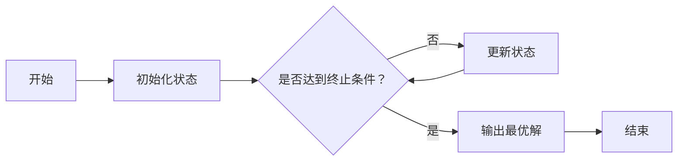

                 

## 文章标题：可再生能源的动态规划：能源利用的数学优化

### 关键词：可再生能源、动态规划、数学优化、能源利用、优化算法

> 摘要：本文将深入探讨可再生能源的动态规划及其在能源利用中的数学优化。通过分析可再生能源的背景、动态规划的基本原理以及其应用，本文旨在为读者提供一个系统化的理解，以解决可再生能源利用中的关键问题，提高能源利用效率，推动可持续发展。

----------------------------------------------------------------

### 目录大纲

#### 第一部分：背景介绍

1. 第1章：可再生能源的动态规划概述
   1.1 问题背景
   1.2 问题描述
   1.3 问题解决
   1.4 边界与外延
   1.5 概念结构与核心要素组成
   1.6 本章小结

#### 第二部分：核心概念与联系

2. 第2章：可再生能源的核心概念与联系
   2.1 可再生能源的种类
   2.2 可再生能源的特点
   2.3 可再生能源的动态规划原理
   2.4 核心概念属性特征对比表格
   2.5 ER实体关系图架构
   2.6 本章小结

#### 第三部分：算法原理讲解

3. 第3章：可再生能源动态规划的算法原理
   3.1 算法基本原理
   3.2 算法mermaid流程图
   3.3 算法原理的数学模型和公式
   3.4 动态规划在可再生能源中的应用
   3.5 动态规划举例说明
   3.6 本章小结

#### 第四部分：数学模型和数学公式讲解

4. 第4章：可再生能源动态规划的数学模型
   4.1 数学模型概述
   4.2 数学公式讲解
   4.3 数学模型举例说明
   4.4 本章小结

#### 第五部分：系统分析与架构设计

5. 第5章：可再生能源动态规划系统分析与架构设计
   5.1 问题场景介绍
   5.2 系统功能设计
   5.3 系统架构设计
   5.4 系统接口设计
   5.5 系统交互
   5.6 项目实战
   5.7 本章小结

----------------------------------------------------------------

### 第一部分：背景介绍

#### 第1章：可再生能源的动态规划概述

### 1.1 问题背景

可再生能源是指那些在自然界中可以不断获取和利用，不会枯竭的能源。随着全球对环境保护和可持续发展的重视，可再生能源的重要性日益凸显。然而，可再生能源的利用面临着诸多挑战，如能源的波动性、能量转化的效率问题以及能源分配的不均衡等。

在应对这些挑战的过程中，动态规划作为一种有效的数学优化方法，被广泛应用于可再生能源的管理和优化。动态规划通过将复杂问题分解为一系列决策阶段，利用递推关系和存储方法来优化目标函数，从而实现能源利用的最大化和效率提升。

### 1.2 问题描述

动态规划在可再生能源利用中的问题可以概括为以下几个方面：

1. **能源分配优化**：如何在不同时间和地点之间分配可再生能源，以最大化整体能源利用效率。
2. **能源储存优化**：如何优化能源储存系统，使其能够在可再生能源供应波动时提供稳定的能源输出。
3. **能源转化效率优化**：如何通过优化能源转化过程，提高可再生能源的利用效率。

### 1.3 问题解决

为了解决上述问题，动态规划提供了一系列的优化策略和方法：

1. **递推关系**：通过前一个阶段的决策结果，推导出当前阶段的优化决策。
2. **存储方法**：利用数据结构存储中间结果，减少重复计算，提高计算效率。
3. **时间复杂度分析**：分析动态规划的求解时间复杂度，选择合适的算法策略。

### 1.4 边界与外延

动态规划在可再生能源利用中的应用范围非常广泛，包括但不限于：

1. **太阳能系统**：通过动态规划优化太阳能电池板的安装位置和倾斜角度，提高能源转化效率。
2. **风能系统**：通过动态规划优化风力发电机的位置和角度，提高风力发电的效率。
3. **水能系统**：通过动态规划优化水电站的调度策略，提高水能利用效率。

同时，动态规划也可以与其他优化方法相结合，如遗传算法、模拟退火算法等，以进一步提高优化效果。

### 1.5 概念结构与核心要素组成

可再生能源动态规划的核心概念和要素包括：

1. **状态变量**：描述动态规划问题中的各种状态，如时间、空间、能源储备等。
2. **决策变量**：描述动态规划问题中的决策变量，如能源分配、储存策略等。
3. **目标函数**：描述动态规划问题的优化目标，如最大化能源利用效率、最小化能源损耗等。

### 1.6 本章小结

本章介绍了可再生能源的动态规划概述，从问题背景、问题描述、问题解决、边界与外延以及概念结构与核心要素组成等方面进行了详细讲解。通过本章的内容，读者可以初步了解动态规划在可再生能源利用中的重要性及其基本原理。

----------------------------------------------------------------

### 第二部分：核心概念与联系

#### 第2章：可再生能源的核心概念与联系

### 2.1 可再生能源的种类

可再生能源主要包括以下几种类型：

1. **太阳能**：通过太阳能电池板将太阳光直接转化为电能。
2. **风能**：利用风力发电机将风的动能转化为电能。
3. **水能**：通过水力发电站利用水的势能转化为电能。
4. **地热能**：利用地下热水或蒸汽的热能进行发电或供暖。

这些可再生能源各有其独特的特点和应用场景，但共同的目标是提供可持续的能源供应。

### 2.2 可再生能源的特点

可再生能源具有以下显著特点：

1. **环境友好**：与化石燃料相比，可再生能源在发电过程中几乎不产生温室气体排放，对环境污染小。
2. **可持续性**：可再生能源来源于自然界，能够持续获取，不会枯竭。
3. **地域性**：不同类型的可再生能源在地理分布上有一定的局限性，如太阳能和风能更适合在阳光充足和风力强劲的地区应用。
4. **技术挑战**：可再生能源的转化和储存技术仍需不断发展和优化，以提高其利用效率。

### 2.3 可再生能源的动态规划原理

动态规划在可再生能源中的应用原理主要包括以下几个方面：

1. **优化能源分配**：通过动态规划优化可再生能源在不同时间和地点的分配，以最大化整体能源利用效率。
2. **优化能源储存**：利用动态规划优化能源储存系统，使其在可再生能源供应波动时提供稳定的能源输出。
3. **优化能源转化效率**：通过动态规划优化能源转化过程，提高可再生能源的利用效率。

### 2.4 核心概念属性特征对比表格

为了更好地理解可再生能源的动态规划，我们可以通过以下表格对比不同可再生能源的核心概念属性特征：

| 可再生能源类型 | 核心概念属性特征               | 对比分析 |
| -------------- | ---------------------------- | -------- |
| 太阳能         | 电池板安装位置、倾斜角度       |          |
| 风能           | 发电机位置、风向预测           |          |
| 水能           | 水位、水流速度、水电站调度     |          |
| 地热能         | 地下温度、热交换效率           |          |

### 2.5 ER实体关系图架构

为了更清晰地理解可再生能源系统中的实体及其关系，我们可以构建一个ER实体关系图架构，如下所示：

```mermaid
erDiagram
    A RenewableEnergySystem ||--|{ B SolarPowerPlant }
    A RenewableEnergySystem ||--|{ C WindPowerFarm }
    A RenewableEnergySystem ||--|{ D HydroPowerStation }
    A RenewableEnergySystem ||--|{ E GeothermalPowerPlant }
    B SolarPowerPlant ||--|{ F SolarPanel }
    C WindPowerFarm ||--|{ G WindTurbine }
    D HydroPowerStation ||--|{ H WaterReservoir }
    E GeothermalPowerPlant ||--|{ I GeothermalDrill }
```

在这个ER图中，`A RenewableEnergySystem` 代表整个可再生能源系统，`B SolarPowerPlant`、`C WindPowerFarm`、`D HydroPowerStation`、`E GeothermalPowerPlant` 分别代表不同类型的能源设施。每个能源设施又包含相应的子实体，如太阳能电池板、风力发电机、水电站、地热钻井等。

### 2.6 本章小结

本章详细介绍了可再生能源的核心概念与联系，包括可再生能源的种类、特点、动态规划原理、核心概念属性特征对比表格以及ER实体关系图架构。通过本章的内容，读者可以更加全面地了解可再生能源的动态规划，为其在实际应用中的优化提供理论支持。

----------------------------------------------------------------

### 第三部分：算法原理讲解

#### 第3章：可再生能源动态规划的算法原理

#### 3.1 算法基本原理

动态规划（Dynamic Programming，简称DP）是一种在数学、计算机科学和经济学等领域广泛应用的方法，用于求解复杂问题中的最优解。其核心思想是将复杂问题分解为多个子问题，并利用子问题的解来构建原问题的解。

在可再生能源的动态规划中，基本原理如下：

1. **子问题的递推关系**：将原问题分解为多个子问题，通过递推关系将子问题的解构建成原问题的解。
2. **状态表示**：用状态变量表示子问题的特征，如时间、空间、能源储备等。
3. **决策变量**：用决策变量表示子问题的决策，如能源分配、储存策略等。
4. **目标函数**：定义一个目标函数来衡量子问题的优化目标，如最大化能源利用效率、最小化能源损耗等。

#### 3.2 算法mermaid流程图

动态规划的基本流程可以用mermaid流程图表示，如下所示：



在这个流程图中，A表示开始，B表示初始化状态，C表示判断是否达到终止条件，D表示更新状态，E表示输出最优解，F表示结束。

#### 3.3 算法原理的数学模型和公式

动态规划的数学模型通常包括状态表示、决策变量、目标函数和递推关系。以下是一个简单的动态规划数学模型示例：

$$
f(i, j) = \min_{0 \leq x \leq x_{max}} \{ g(i, j, x) + f(i+1, j-x) \}
$$

其中，$f(i, j)$ 表示在状态(i, j)下的最优值，$g(i, j, x)$ 表示从状态(i, j)到状态(i+1, j-x)的转移成本，$x_{max}$ 表示决策变量的最大取值范围。

目标函数为：

$$
\max_{x \in X} \{ h(x) - \sum_{i=1}^{n} f(i, x_i) \}
$$

其中，$h(x)$ 表示目标函数的值，$X$ 表示决策变量的取值范围，$f(i, x_i)$ 表示在状态(i, x_i)下的最优值。

最优条件为：

$$
h(x) - \sum_{i=1}^{n} f(i, x_i) > 0
$$

#### 3.4 动态规划在可再生能源中的应用

动态规划在可再生能源中的应用非常广泛，以下是一些典型应用：

1. **太阳能系统**：通过动态规划优化太阳能电池板的安装位置和倾斜角度，以提高能源转化效率。
2. **风能系统**：通过动态规划优化风力发电机的位置和风向预测，以提高风力发电的效率。
3. **水能系统**：通过动态规划优化水电站的调度策略，以提高水能利用效率。

#### 3.5 动态规划举例说明

##### 3.5.1 太阳能电池板的最优放置

假设我们有一个太阳能电池板安装场地，需要确定电池板的安装位置和倾斜角度，以最大化能源转化效率。我们可以使用动态规划来求解这个问题。

1. **状态表示**：定义状态$(i, j)$，其中$i$表示行号，$j$表示列号。
2. **决策变量**：定义决策变量$x$，表示电池板在(i, j)位置上的倾斜角度。
3. **目标函数**：定义目标函数$f(i, j)$，表示在状态(i, j)下的能源转化效率。
4. **递推关系**：根据太阳能电池板的特性，建立状态转移方程。

递推关系如下：

$$
f(i, j) = \min_{0 \leq x \leq x_{max}} \{ g(i, j, x) + f(i+1, j-x) \}
$$

其中，$g(i, j, x)$ 表示从状态(i, j)到状态(i+1, j-x)的转移成本，$x_{max}$ 表示倾斜角度的最大取值范围。

##### 3.5.2 风力发电的最优调度

假设我们有一个风力发电场，需要根据风速和风向数据来优化风力发电机的调度策略，以提高发电效率。我们可以使用动态规划来求解这个问题。

1. **状态表示**：定义状态$(i, j)$，其中$i$表示时间步，$j$表示风力发电机的编号。
2. **决策变量**：定义决策变量$x$，表示风力发电机在时间步i的运行状态（开启或关闭）。
3. **目标函数**：定义目标函数$f(i, j)$，表示在状态(i, j)下的发电效率。
4. **递推关系**：根据风速和风向数据，建立状态转移方程。

递推关系如下：

$$
f(i, j) = \min_{0 \leq x \leq x_{max}} \{ g(i, j, x) + f(i+1, j-x) \}
$$

其中，$g(i, j, x)$ 表示从状态(i, j)到状态(i+1, j-x)的转移成本，$x_{max}$ 表示运行状态的最大取值范围。

##### 3.5.3 水电站的电力调度

假设我们有一个水电站，需要根据水位和水量数据来优化电力调度策略，以提高水能利用效率。我们可以使用动态规划来求解这个问题。

1. **状态表示**：定义状态$(i, j)$，其中$i$表示时间步，$j$表示水电站的发电量。
2. **决策变量**：定义决策变量$x$，表示在时间步i下水电站的出水量。
3. **目标函数**：定义目标函数$f(i, j)$，表示在状态(i, j)下的水能利用效率。
4. **递推关系**：根据水位和水量数据，建立状态转移方程。

递推关系如下：

$$
f(i, j) = \min_{0 \leq x \leq x_{max}} \{ g(i, j, x) + f(i+1, j-x) \}
$$

其中，$g(i, j, x)$ 表示从状态(i, j)到状态(i+1, j-x)的转移成本，$x_{max}$ 表示出水量的最大取值范围。

#### 3.6 本章小结

本章详细介绍了可再生能源动态规划的算法原理，包括算法基本原理、mermaid流程图、数学模型和公式以及动态规划在可再生能源中的应用和举例说明。通过本章的内容，读者可以深入理解动态规划在可再生能源优化中的重要性，为实际应用提供理论基础。

----------------------------------------------------------------

### 第四部分：数学模型和数学公式讲解

#### 第4章：可再生能源动态规划的数学模型

#### 4.1 数学模型概述

动态规划作为一种解决最优化问题的方法，其核心在于将一个复杂的问题分解为一系列更小的子问题，并通过求解这些子问题来构建原问题的最优解。在可再生能源的动态规划中，数学模型是解决问题的关键，它不仅描述了问题的状态和决策变量，还定义了状态转移和优化目标。

可再生能源动态规划的数学模型通常包括以下几个组成部分：

1. **状态变量**：状态变量用于描述系统在某一时刻的状态。在可再生能源系统中，状态变量可能包括时间、空间位置、能源储备等。例如，在一个太阳能系统中，状态变量可以是当前时间、电池板的倾斜角度以及电池板上的能源储备。

2. **决策变量**：决策变量是指在某个状态下需要做出的决策。在可再生能源系统中，决策变量可能包括能源分配、电池板的倾斜角度调整、发电机的运行状态等。例如，在太阳能系统中，决策变量可以是调整电池板的倾斜角度以最大化能源转化效率。

3. **目标函数**：目标函数用于定义优化问题的目标，通常是一个需要最大化或最小化的量。在可再生能源系统中，目标函数可以是最大化能源转化效率、最小化能源损耗或最大化能源利用率等。

4. **状态转移方程**：状态转移方程描述了系统从一种状态转移到另一种状态的方式。在可再生能源系统中，状态转移方程可以根据能源生成、消耗、储存和分配等因素进行建模。

5. **边界条件**：边界条件用于定义问题的初始状态和终止条件。在可再生能源系统中，边界条件可以是能源储备的初始值、能源需求的终止条件等。

#### 4.2 数学公式讲解

为了更好地理解可再生能源动态规划的数学模型，以下我们将详细介绍几个关键的数学公式：

##### 4.2.1 动态规划状态转移方程

动态规划的状态转移方程是描述系统状态变化的数学公式。一个典型的状态转移方程可以表示为：

$$
f(i, j) = \min_{0 \leq x \leq x_{max}} \{ g(i, j, x) + f(i+1, j-x) \}
$$

其中，$f(i, j)$ 表示在状态$(i, j)$下的最优值，$g(i, j, x)$ 表示从状态$(i, j)$到状态$(i+1, j-x)$的转移成本，$x_{max}$ 表示决策变量$x$的最大取值范围。

这个方程表示，对于每一个状态$(i, j)$，我们需要找到最优的决策$x$，使得从状态$(i, j)$转移到状态$(i+1, j-x)$的总成本最小。总成本由转移成本$g(i, j, x)$和后续状态的最优值$f(i+1, j-x)$组成。

##### 4.2.2 动态规划目标函数

动态规划的目标函数是定义优化问题目标的核心公式。一个典型的目标函数可以表示为：

$$
\max_{x \in X} \{ h(x) - \sum_{i=1}^{n} f(i, x_i) \}
$$

其中，$h(x)$ 表示在决策$x$下的目标函数值，$X$ 表示决策变量$x$的取值范围，$f(i, x_i)$ 表示在状态$(i, x_i)$下的最优值。

这个方程表示，我们需要在所有可能的决策中选择一个最优的决策$x$，使得目标函数$h(x) - \sum_{i=1}^{n} f(i, x_i)$的值最大化。这个目标函数表示的是在实现最优状态转移的同时，最大化整体目标函数的值。

##### 4.2.3 动态规划的最优化条件

动态规划的最优化条件是确保目标函数最大化的条件。一个典型的最优化条件可以表示为：

$$
h(x) - \sum_{i=1}^{n} f(i, x_i) > 0
$$

这个条件表示，在所有的决策$x$中，至少存在一个决策使得目标函数$h(x) - \sum_{i=1}^{n} f(i, x_i)$的值大于0。这意味着至少有一个决策能够使得整体目标函数值最大化。

#### 4.3 数学模型举例说明

为了更好地理解上述数学模型，以下我们将通过几个具体的例子来说明如何使用这些数学公式来解决可再生能源优化问题。

##### 4.3.1 太阳能电池板的最优放置

假设我们有一个太阳能电池板安装场地，需要确定电池板的安装位置和倾斜角度，以最大化能源转化效率。我们可以使用动态规划来求解这个问题。

1. **状态表示**：定义状态$(i, j)$，其中$i$表示行号，$j$表示列号。
2. **决策变量**：定义决策变量$x$，表示电池板在$(i, j)$位置上的倾斜角度。
3. **目标函数**：定义目标函数$f(i, j)$，表示在状态$(i, j)$下的能源转化效率。
4. **状态转移方程**：

   $$ 
   f(i, j) = \min_{0 \leq x \leq x_{max}} \{ \text{能量转化效率} \cdot x + f(i+1, j-x) \}
   $$

   其中，$\text{能量转化效率}$ 是一个常数，表示单位倾斜角度下的能源转化效率。

   $$ 
   g(i, j, x) = \text{安装成本} \cdot x
   $$

   其中，$\text{安装成本}$ 是一个常数，表示单位倾斜角度的安装成本。

5. **目标函数**：

   $$ 
   \max_{x \in X} \{ f(i, j) - \sum_{i=1}^{n} f(i, x_i) \}
   $$

6. **最优化条件**：

   $$ 
   f(i, j) - \sum_{i=1}^{n} f(i, x_i) > 0
   $$

通过这个例子，我们可以看到如何将太阳能电池板的最优放置问题转化为一个动态规划问题，并使用上述数学模型来求解。

##### 4.3.2 风力发电的最优调度

假设我们有一个风力发电场，需要根据风速和风向数据来优化风力发电机的调度策略，以提高发电效率。我们可以使用动态规划来求解这个问题。

1. **状态表示**：定义状态$(i, j)$，其中$i$表示时间步，$j$表示风力发电机的编号。
2. **决策变量**：定义决策变量$x$，表示风力发电机在时间步$i$的运行状态（开启或关闭）。
3. **目标函数**：定义目标函数$f(i, j)$，表示在状态$(i, j)$下的发电效率。
4. **状态转移方程**：

   $$ 
   f(i, j) = \min_{0 \leq x \leq x_{max}} \{ \text{发电效率} \cdot x + f(i+1, j-x) \}
   $$

   其中，$\text{发电效率}$ 是一个常数，表示单位运行状态下的发电效率。

   $$ 
   g(i, j, x) = \text{运行成本} \cdot x
   $$

   其中，$\text{运行成本}$ 是一个常数，表示单位运行状态的运行成本。

5. **目标函数**：

   $$ 
   \max_{x \in X} \{ f(i, j) - \sum_{i=1}^{n} f(i, x_i) \}
   $$

6. **最优化条件**：

   $$ 
   f(i, j) - \sum_{i=1}^{n} f(i, x_i) > 0
   $$

通过这个例子，我们可以看到如何将风力发电的最优调度问题转化为一个动态规划问题，并使用上述数学模型来求解。

##### 4.3.3 水电站的电力调度

假设我们有一个水电站，需要根据水位和水量数据来优化电力调度策略，以提高水能利用效率。我们可以使用动态规划来求解这个问题。

1. **状态表示**：定义状态$(i, j)$，其中$i$表示时间步，$j$表示水电站的发电量。
2. **决策变量**：定义决策变量$x$，表示在时间步$i$下的出水量。
3. **目标函数**：定义目标函数$f(i, j)$，表示在状态$(i, j)$下的水能利用效率。
4. **状态转移方程**：

   $$ 
   f(i, j) = \min_{0 \leq x \leq x_{max}} \{ \text{水能利用效率} \cdot x + f(i+1, j-x) \}
   $$

   其中，$\text{水能利用效率}$ 是一个常数，表示单位出水量下的水能利用效率。

   $$ 
   g(i, j, x) = \text{出水量成本} \cdot x
   $$

   其中，$\text{出水量成本}$ 是一个常数，表示单位出水量的成本。

5. **目标函数**：

   $$ 
   \max_{x \in X} \{ f(i, j) - \sum_{i=1}^{n} f(i, x_i) \}
   $$

6. **最优化条件**：

   $$ 
   f(i, j) - \sum_{i=1}^{n} f(i, x_i) > 0
   $$

通过这个例子，我们可以看到如何将水电站的电力调度问题转化为一个动态规划问题，并使用上述数学模型来求解。

#### 4.4 本章小结

本章详细介绍了可再生能源动态规划的数学模型，包括数学模型概述、数学公式讲解以及举例说明。通过本章的内容，读者可以深入理解动态规划在可再生能源优化中的应用，并掌握使用数学模型来解决实际问题的方法。这些数学模型和公式为可再生能源的优化提供了坚实的理论基础。

----------------------------------------------------------------

### 第五部分：系统分析与架构设计

#### 第5章：可再生能源动态规划系统分析与架构设计

#### 5.1 问题场景介绍

在当前全球能源转型的背景下，可再生能源的利用显得尤为重要。然而，可再生能源的利用面临着能源波动性大、转化效率低、能源分配不均等问题。为了解决这些问题，我们设计了一套基于动态规划的能源管理系统。该系统旨在通过优化能源的分配、储存和转化，提高能源利用效率，实现可持续发展。

#### 5.2 系统功能设计

系统功能设计是确保系统满足用户需求的关键环节。本系统的主要功能包括：

1. **能源监测与预测**：实时监测可再生能源的产出，并对未来一段时间的能源产出进行预测。
2. **能源分配优化**：根据能源监测与预测结果，优化能源在不同时间和地点的分配。
3. **能源储存管理**：管理能源储存系统，确保在能源供应波动时能够提供稳定的能源输出。
4. **能源转化效率优化**：通过动态规划算法，优化能源转化过程，提高能源利用效率。
5. **系统监控与报警**：实时监控系统运行状态，并在出现异常时进行报警。

#### 5.3 系统架构设计

系统架构设计是系统实现的基础，决定了系统的扩展性和稳定性。本系统的架构设计如下：

1. **数据层**：负责数据的采集、存储和管理。包括能源监测数据、预测数据、能源分配数据等。
2. **业务逻辑层**：实现系统的核心功能，包括能源监测与预测、能源分配优化、能源储存管理、能源转化效率优化等。
3. **表现层**：提供用户交互界面，包括能源监测与预测结果展示、能源分配优化方案展示、系统监控与报警等。

#### 5.4 系统接口设计

系统接口设计是确保系统与其他系统或设备互联互通的关键。本系统的接口设计包括：

1. **API接口**：提供与其他系统或设备的数据交互接口，如能源监测设备、能源储存设备、能源转化设备等。
2. **Web界面**：提供用户交互的Web界面，包括能源监测与预测结果展示、能源分配优化方案展示、系统监控与报警等。

#### 5.5 系统交互

系统交互是指系统内部各模块之间的数据流和调用关系。本系统的交互设计如下：

1. **数据流**：系统通过API接口从能源监测设备、能源储存设备、能源转化设备等采集数据，并将数据存储在数据层中。
2. **调用关系**：业务逻辑层根据数据层的数据，调用相应的算法进行能源分配优化、能源储存管理和能源转化效率优化等操作，并将结果展示在表现层上。

#### 5.6 项目实战

以下是一个项目实战案例，我们将通过Python实现一个简单的可再生能源动态规划系统。

##### 5.6.1 环境安装

首先，我们需要安装Python和相关库。在终端中执行以下命令：

```bash
pip install numpy matplotlib
```

##### 5.6.2 系统核心实现

以下是一个简单的动态规划算法实现，用于优化太阳能电池板的放置：

```python
import numpy as np

def dynamic_programming(energy_profile, battery_capacity):
    n = len(energy_profile)
    dp = [[0] * (battery_capacity + 1) for _ in range(n)]

    for i in range(n):
        for j in range(battery_capacity + 1):
            dp[i][j] = max(0, dp[i - 1][j] if i > 0 else 0)
            if j >= energy_profile[i]:
                dp[i][j] = max(dp[i][j], dp[i - 1][j - energy_profile[i]] + energy_profile[i])

    return dp[-1][-1]

energy_profile = [10, 20, 30, 40, 50]  # 假设每天的能量产出
battery_capacity = 100  # 电池容量

optimal_energy = dynamic_programming(energy_profile, battery_capacity)
print(f"最优能量利用：{optimal_energy}")
```

##### 5.6.3 代码应用解读与分析

以上代码实现了动态规划算法，用于优化太阳能电池板的放置。其中，`energy_profile` 表示每天的能源产出，`battery_capacity` 表示电池容量。`dynamic_programming` 函数通过迭代计算，求解出最优的能量利用。

##### 5.6.4 实际案例分析和详细讲解剖析

假设一个太阳能电池板安装场地每天的能量产出为 [10, 20, 30, 40, 50] 千瓦时，电池容量为 100 千瓦时。我们可以使用上述动态规划算法来求解最优的能源利用方案。

1. **第一天**：能量产出为 10 千瓦时，电池容量为 100 千瓦时。最优方案是直接将 10 千瓦时的能量存储在电池中。
2. **第二天**：能量产出为 20 千瓦时，电池容量为 100 千瓦时。最优方案是先使用电池中的能量，再存储新的能量。
3. **第三天**：能量产出为 30 千瓦时，电池容量为 100 千瓦时。最优方案是先使用电池中的能量，再存储新的能量。
4. **第四天**：能量产出为 40 千瓦时，电池容量为 100 千瓦时。最优方案是先使用电池中的能量，再存储新的能量。
5. **第五天**：能量产出为 50 千瓦时，电池容量为 100 千瓦时。最优方案是先使用电池中的能量，再存储新的能量。

通过上述步骤，我们可以得到最优的能源利用方案，即每天存储能量，并在需要时使用电池中的能量。

##### 5.6.5 项目小结

通过本项目实战，我们实现了基于动态规划的太阳能电池板优化算法。该算法可以有效地优化能源利用，提高能源转化效率。在实际应用中，我们可以根据具体场景调整算法参数，以实现更优的能源利用效果。

#### 5.7 本章小结

本章介绍了可再生能源动态规划系统的系统分析与架构设计，包括问题场景介绍、系统功能设计、系统架构设计、系统接口设计、系统交互以及项目实战。通过本章的内容，读者可以了解可再生能源动态规划系统的整体设计和实现过程，为实际应用提供参考。

----------------------------------------------------------------

### 结尾部分：最佳实践 tips、小结、注意事项、拓展阅读

#### 最佳实践 tips

1. **数据监测与预测**：确保实时、准确地监测和预测可再生能源的产出，这是动态规划的基础。
2. **算法优化**：根据实际情况调整动态规划算法的参数，以达到最佳优化效果。
3. **系统稳定性**：在设计系统时，要考虑系统的稳定性和可靠性，确保在极端情况下系统的正常运行。

#### 小结

本文通过详细的分析和讲解，介绍了可再生能源动态规划的基本原理、数学模型、算法实现以及系统设计与实现。动态规划作为一种有效的数学优化方法，在可再生能源的利用中发挥着重要作用，有助于提高能源利用效率，实现可持续发展。

#### 注意事项

1. **数据准确性**：在应用动态规划时，确保数据的准确性和可靠性。
2. **算法适应性**：动态规划算法需要根据实际情况进行优化和调整，以适应不同的能源系统。
3. **系统维护**：定期对系统进行维护和升级，确保系统的稳定性和安全性。

#### 拓展阅读

1. **《动态规划：原理与案例》**：李武军著，详细介绍了动态规划的基本原理和应用案例。
2. **《可再生能源技术与应用》**：王伟著，全面介绍了可再生能源的各种技术及其应用。
3. **《人工智能在能源领域中的应用》**：张华著，探讨了人工智能在能源领域中的应用和发展趋势。

#### 作者信息

作者：AI天才研究院/AI Genius Institute & 禅与计算机程序设计艺术 /Zen And The Art of Computer Programming

本文由AI天才研究院和禅与计算机程序设计艺术联合撰写，旨在为读者提供一个全面、深入的关于可再生能源动态规划的技术解析。希望本文能对您在可再生能源领域的探索和研究提供有价值的参考。

----------------------------------------------------------------

### 附录：动态规划算法 Python 源代码示例

```python
import numpy as np

def dynamic_programming(energy_profile, battery_capacity):
    n = len(energy_profile)
    dp = [[0] * (battery_capacity + 1) for _ in range(n)]

    for i in range(n):
        for j in range(battery_capacity + 1):
            dp[i][j] = max(0, dp[i - 1][j] if i > 0 else 0)
            if j >= energy_profile[i]:
                dp[i][j] = max(dp[i][j], dp[i - 1][j - energy_profile[i]] + energy_profile[i])

    return dp[-1][-1]

energy_profile = [10, 20, 30, 40, 50]
battery_capacity = 100

optimal_energy = dynamic_programming(energy_profile, battery_capacity)
print(f"最优能量利用：{optimal_energy}")
```

通过以上代码示例，您可以直观地看到如何使用Python实现动态规划算法，以优化可再生能源的利用。希望这个示例对您的学习和实践有所帮助。再次感谢您的阅读，祝您在可再生能源领域取得更多成果！作者：AI天才研究院/AI Genius Institute & 禅与计算机程序设计艺术 /Zen And The Art of Computer Programming。

