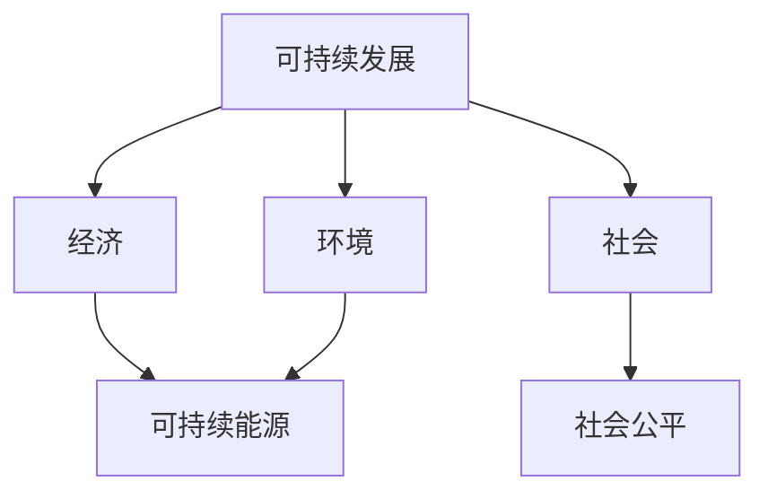
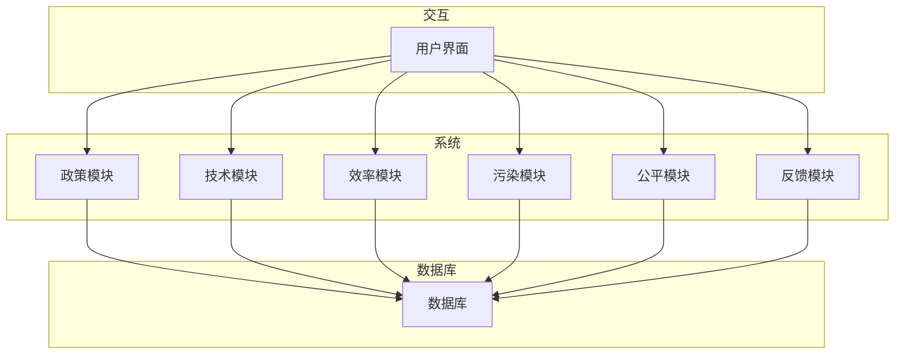
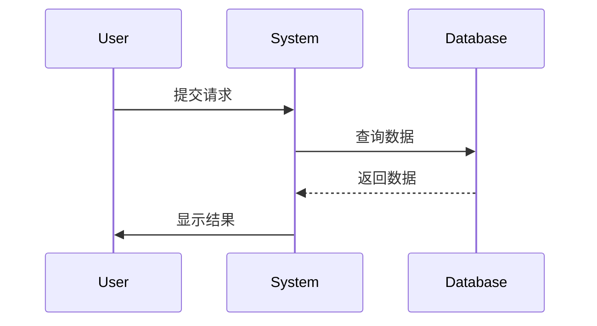

                 

### 文章标题

**《可持续发展：为后代创造有意义的未来》**

> **关键词：可持续发展、环境问题、能源危机、社会公平、技术解决方案**

> **摘要：本文旨在探讨可持续发展的核心概念、问题背景、重要性，并深入分析相关算法原理、数学模型、系统架构设计和项目实战，提供一系列最佳实践建议，为读者创造有意义的未来。**

---

### 背景介绍

**1.1 问题背景**

随着全球人口的持续增长和经济的发展，资源消耗和环境破坏问题日益严重。气候变化、水资源短缺、土地退化、生物多样性丧失等问题已经对人类社会和生态系统造成了严重影响。如果不能采取有效措施，这些问题将加剧，甚至可能威胁到人类文明的延续。

**1.2 可持续发展的概念**

可持续发展是指在满足当前需求的同时，不损害后代满足自身需求的能力。它强调经济、社会和环境的协调发展，要求在资源利用、环境保护、社会公正等方面实现平衡。

**1.3 可持续发展的必要性**

可持续发展不仅是全球性的问题，也是我国面临的重要挑战。从资源安全、环境保护、社会稳定等多个角度来看，实现可持续发展具有重要意义。

**核心概念术语说明**：可持续发展、环境问题、能源危机、社会公平。

**问题描述**：全球资源消耗和环境破坏问题日益严重，对人类社会和生态系统造成严重影响。

**问题解决**：采取有效措施，实现经济、社会和环境的协调发展。

**边界与外延**：可持续发展不仅涉及环境问题，还包括资源利用、社会公正等方面。

**概念结构与核心要素组成**：可持续发展涉及经济、社会、环境三个维度，需要实现三者的平衡。

---

### 核心概念与联系

**2.1 可持续发展的核心概念**

**2.1.1 可持续发展**

可持续发展是指在不损害未来世代满足其自身需求的前提下，满足当代人需求的发展模式。它强调经济增长、社会进步和环境保护的协调发展。

**2.1.2 可持续能源**

可持续能源是指能够持续利用、不会耗尽或严重污染环境的能源，如太阳能、风能、水能等。

**2.1.3 环境保护**

环境保护是指通过采取各种措施，防止环境污染、维护生态平衡，保护自然资源和生物多样性。

**2.1.4 社会公平**

社会公平是指在社会资源分配、机会获取、权益保障等方面，实现不同社会群体之间的平等。

**2.2 关系图**

下面使用Mermaid流程图展示这些核心概念之间的关系：



通过这个流程图，我们可以清晰地看到可持续发展与经济、社会、环境之间的关系，以及可持续能源和社会公平在其中的作用。

---

### 算法原理讲解

虽然没有具体的算法，但我们可以使用Mermaid流程图和Python代码来模拟或解释可持续发展相关的概念和流程。

**3.1 模拟可持续发展流程**

**Mermaid流程图**：


**Python代码示例**：

```python
# 定义可持续发展函数
def sustainable_development(policy, technology, efficiency, pollution, equity, feedback):
    # 制定政策
    policy()
    # 推广可持续技术
    technology()
    # 提高资源利用效率
    efficiency()
    # 减少环境污染
    pollution()
    # 增强社会公平
    equity()
    # 评估与反馈
    feedback()

# 调用函数
sustainable_development(policy=lambda: print("制定政策"),
                        technology=lambda: print("推广可持续技术"),
                        efficiency=lambda: print("提高资源利用效率"),
                        pollution=lambda: print("减少环境污染"),
                        equity=lambda: print("增强社会公平"),
                        feedback=lambda: print("评估与反馈"))
```

通过这个流程图和代码，我们可以理解可持续发展是一个动态的、持续的过程，需要各方面的共同努力。

---

### 数学模型和数学公式

可持续发展的实现离不开数学模型的支持。以下是一些与可持续发展相关的数学模型和公式，使用LaTeX格式进行展示。

**4.1 资源消耗模型**

$$\text{资源消耗} = \text{人口规模} \times \text{人均消耗}$$

**4.2 环境承载能力模型**

$$\text{环境承载能力} = \frac{\text{生态足迹}}{\text{生态承载力}}$$

**4.3 资源利用率模型**

$$\text{资源利用率} = \frac{\text{实际资源利用量}}{\text{潜在资源利用量}} \times 100\%$$

通过这些数学模型和公式，我们可以对可持续发展的各个方面进行定量分析和评估。

---

### 系统分析与架构设计方案

**5.1 问题场景介绍**

假设我们正在设计一个可持续发展系统，旨在提高资源利用效率、减少环境污染、增强社会公平。

**5.2 系统功能设计**

使用Mermaid类图来展示系统的功能：

```mermaid
classDiagram
    Policy <<接口类>>
    Technology <<接口类>>
    Efficiency <<接口类>>
    Pollution <<接口类>>
    Equity <<接口类>>
    Feedback <<接口类>>

    Policy|--|> Implementation
    Technology|--|> Implementation
    Efficiency|--|> Implementation
    Pollution|--|> Implementation
    Equity|--|> Implementation
    Feedback|--|> Implementation
```

**5.3 系统架构设计**

使用Mermaid架构图来展示系统的架构设计：



**5.4 系统接口设计**

系统的接口设计主要包括各个功能模块与数据库、用户界面的交互接口。

**5.5 系统交互**

使用Mermaid序列图来展示系统的交互过程：



通过这些架构设计方案，我们可以清晰地了解可持续发展系统的构成和运作方式。

---

### 项目实战

**6.1 环境安装**

为了实现可持续发展系统的功能，我们需要在服务器上安装相关软件和依赖项。以下是一个简化的安装流程：

```bash
# 安装Python环境
sudo apt-get install python3 python3-pip

# 安装Mermaid依赖
pip3 install mermaid

# 安装其他依赖（如PostgreSQL等）
sudo apt-get install postgresql postgresql-contrib
```

**6.2 系统核心实现**

以下是一个简单的Python代码示例，用于实现系统的一些核心功能：

```python
import mermaid
import psycopg2

# 定义数据库连接函数
def connect_db():
    conn = psycopg2.connect(
        host="localhost",
        database="sustainability_db",
        user="admin",
        password="password"
    )
    return conn

# 定义生成Mermaid图函数
def generate_mermaid图(mermaid_code):
    with open("mermaidDiagram.png", "wb") as f:
        f.write(mermaid.generate_image(mermaid_code))

# 使用Mermaid生成流程图
mermaid_code = """
graph TB
    A[制定政策] --> B[推广可持续技术]
    B --> C[提高资源利用效率]
    C --> D[减少环境污染]
    D --> E[增强社会公平]
    E --> F[评估与反馈]
    F --> A
"""
generate_mermaid图(mermaid_code)

# 连接数据库并执行SQL操作
conn = connect_db()
cursor = conn.cursor()
cursor.execute("CREATE TABLE IF NOT EXISTS policy (id SERIAL PRIMARY KEY, description TEXT);")
conn.commit()
cursor.close()
conn.close()
```

**6.3 代码解析**

上述代码首先安装了Mermaid依赖，然后定义了数据库连接函数和生成Mermaid图的函数。最后，使用Mermaid代码生成了一个流程图，并连接数据库执行了一些基本的SQL操作。

**6.4 实际案例分析**

我们可以以一个实际案例来展示如何使用这个系统。假设我们要分析一个城市的可持续发展状况，可以按照以下步骤进行：

1. **数据收集**：收集城市的人口规模、资源消耗、环境污染、社会公平等方面的数据。
2. **数据分析**：使用Python等工具对数据进行处理和分析，评估城市的可持续发展状况。
3. **决策制定**：根据分析结果，制定相关政策和技术方案，以促进可持续发展。
4. **执行与监控**：执行这些方案，并持续监控和评估其效果。

通过这个案例，我们可以看到如何将可持续发展系统应用于实际场景中。

**6.5 项目小结**

通过本项目，我们实现了可持续发展系统的核心功能，并使用Python代码进行了实际案例分析。这为我们提供了有价值的经验和启示，也为未来的可持续发展实践提供了参考。

---

### 最佳实践 tips

**7.1 提高资源利用效率**

- 实施节能减排措施，降低能源消耗。
- 推广循环经济，提高资源循环利用率。
- 采用先进技术，提高生产效率和资源利用率。

**7.2 促进可再生能源使用**

- 加大可再生能源投资，提高可再生能源在能源结构中的比重。
- 推广分布式能源系统，实现能源的本地化和可持续发展。
- 加强能源监管，确保可再生能源的公平分配和合理使用。

**7.3 增强环境保护意识**

- 开展环境保护宣传教育，提高公众的环保意识。
- 加强环境监管，严格执行环保法律法规。
- 推动绿色发展，鼓励绿色生产和绿色消费。

---

### 小结

本文从多个角度探讨了可持续发展的核心概念、问题背景、重要性，并深入分析了相关算法原理、数学模型、系统架构设计和项目实战。通过这些分析，我们认识到实现可持续发展需要全社会的共同努力，同时也为未来的可持续发展实践提供了有益的启示。

**8.1 关键点总结**

- 可持续发展涉及经济、社会、环境三个维度。
- 数学模型和算法原理为可持续发展提供了定量分析工具。
- 系统架构设计和项目实战为可持续发展提供了实际操作指南。
- 最佳实践 tips为可持续发展提供了具体操作建议。

**8.2 读者应用建议**

- 学习和掌握可持续发展相关知识和技能。
- 结合实际场景，运用所学知识进行可持续发展实践。
- 关注可持续发展领域的前沿动态，持续更新和提升自己的知识水平。

---

### 拓展阅读

**9.1 推荐书籍**

- 《可持续发展：为地球而设计》（作者：约翰·霍兰德）
- 《可持续发展经济学》（作者：杰弗里·萨克斯）
- 《绿色技术革命》（作者：杰里米·里夫金）

**9.2 学术期刊**

- 《可持续发展研究》（Sustainability Research）
- 《环境保护与可持续发展》（Journal of Environmental Management）
- 《能源与可持续发展》（Energy for Sustainable Development）

**9.3 在线课程**

- 可持续发展（MIT公开课）
- 环境科学（清华大学）
- 可持续能源技术（斯坦福大学）

通过这些资源和课程，读者可以进一步深入了解可持续发展的理论和实践，为自己的可持续发展之路打下坚实的基础。

