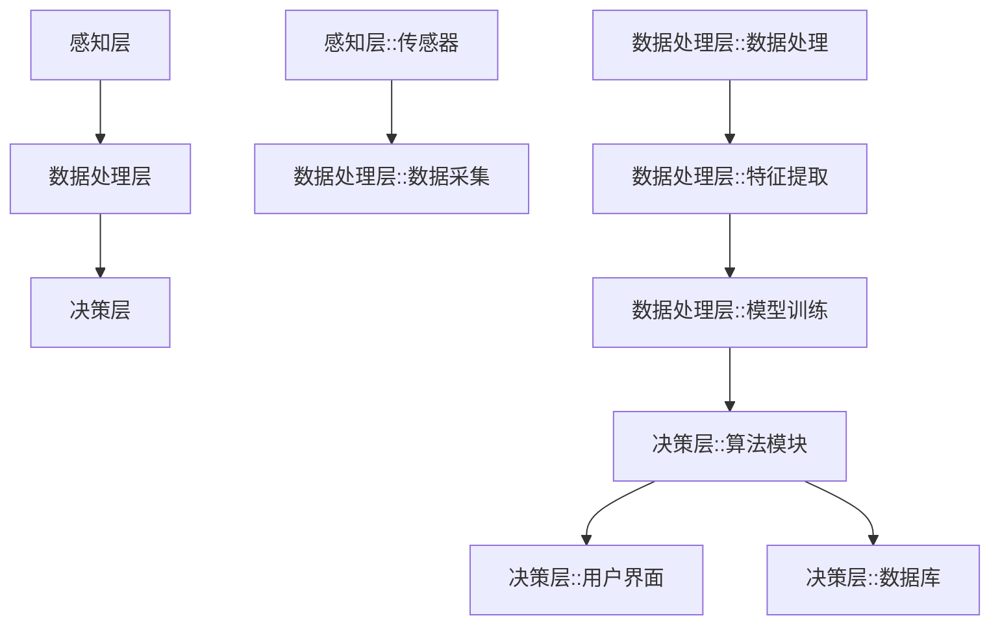
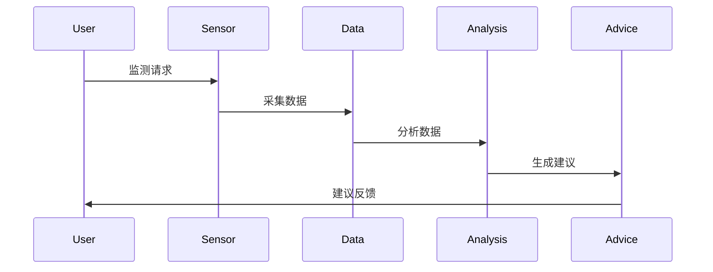
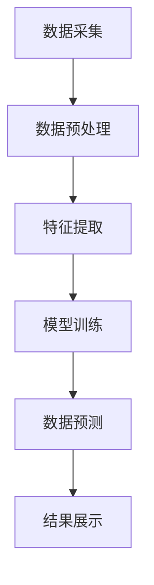

                 

### # 可穿戴设备的健康监测：生理指标的数学分析

#### 关键词：可穿戴设备，健康监测，生理指标，数学分析

> 摘要：本文将深入探讨可穿戴设备在健康监测领域的应用，特别是对生理指标的数学分析。通过对健康监测的基本概念、核心指标及其数学模型的详细讲解，文章旨在为读者提供一个全面、系统的认识，帮助他们在实际应用中准确解读和使用这些数据。

----------------------------------------------------------------

## 引言

随着科技的迅猛发展，可穿戴设备已经成为人们生活中不可或缺的一部分。它们不仅提供了便利，还通过实时监测用户的生理状态，为健康管理提供了强有力的支持。在这个背景下，如何准确地分析可穿戴设备收集到的生理指标，成为一个亟待解决的问题。

### 1.1 可穿戴设备概述

可穿戴设备是一种嵌入传感器和计算模块的个人穿戴设备，能够实时监测用户的生理参数，如心率、血压、血氧饱和度、步数等。这些设备通常具备小巧轻便、易于携带、长时间续航等特点，使得用户能够随时随地进行健康监测。

### 1.2 健康监测的基本原理

健康监测的核心在于通过传感器收集生理数据，并利用数学模型进行分析，以评估用户的健康状况。这个过程中，数据的准确性和模型的合理性至关重要。

### 1.3 本文目的

本文旨在介绍健康监测的基本原理，分析常见生理指标的数学模型，并提供实际应用的案例，以帮助读者更好地理解和使用可穿戴设备进行健康监测。

----------------------------------------------------------------

## 背景和核心概念

### 2.1 可穿戴技术的介绍

可穿戴技术是指将传感器、计算单元和通信模块集成到日常穿戴物品中，如手表、手环、智能服装等。这些设备通过无线传输技术将收集到的数据发送到云端或本地设备，为用户提供实时的健康信息。

#### 2.1.1 传感器技术

传感器是可穿戴设备的核心组件，负责监测用户的生理参数。常见的传感器包括光电传感器、压力传感器、加速度传感器等。它们能够测量心率、血压、运动轨迹等数据。

#### 2.1.2 计算单元

计算单元负责处理传感器收集到的数据，并进行初步的分析。常见的计算单元包括微控制器、智能手机等。

#### 2.1.3 通信模块

通信模块负责将处理后的数据传输到云端或本地设备。常用的通信技术包括蓝牙、Wi-Fi、NFC等。

### 2.2 健康监测的基本原理

健康监测的目的是通过监测生理参数，评估用户的健康状况，并给出相应的健康建议。基本原理如下：

1. **数据采集**：通过传感器收集用户的生理数据。
2. **数据处理**：计算单元对采集到的数据进行初步处理，如滤波、归一化等。
3. **数据分析**：利用数学模型对处理后的数据进行分析，评估用户的健康状况。
4. **健康建议**：根据分析结果，为用户提供健康建议。

### 2.3 数学分析在健康监测中的应用

数学分析在健康监测中起着至关重要的作用。通过数学模型，可以更准确地分析和预测用户的生理状态。以下是几种常见的数学分析方法：

1. **统计学方法**：通过统计分析方法，如平均值、方差等，对生理数据进行处理，以评估用户的健康状况。
2. **时间序列分析**：利用时间序列分析方法，如ARIMA模型、LSTM神经网络等，对生理数据进行预测。
3. **机器学习方法**：通过机器学习方法，如支持向量机、决策树等，对生理数据进行分类和预测。

----------------------------------------------------------------

## 核心概念及其关系

### 3.1 主要生理指标

在健康监测中，常用的生理指标包括心率、血压、血氧饱和度、步数等。这些指标不仅反映了用户的生理状态，还与多种健康问题密切相关。

#### 3.1.1 心率

心率是指心脏每分钟跳动的次数。正常心率范围为每分钟60-100次。心率过快或过慢都可能表明健康问题。

#### 3.1.2 血压

血压是指血液在血管内壁产生的压力。常用毫米汞柱（mmHg）表示。正常血压范围为120/80 mmHg。高血压和低血压都可能对健康造成不良影响。

#### 3.1.3 血氧饱和度

血氧饱和度是指血液中氧气的含量，通常以百分比表示。正常范围在95%以上。低血氧饱和度可能是肺部疾病或心脏疾病的信号。

#### 3.1.4 步数

步数是通过加速度传感器等设备监测的，反映了用户的运动强度。步数可以用于评估运动量和健康状况。

### 3.2 生理指标的比较

不同生理指标在健康监测中具有不同的作用和意义。以下是几个常用生理指标的比较：

| 生理指标 | 意义 | 影响因素 |  
| --- | --- | --- |  
| 心率 | 反映心脏泵血能力 | 心脏状况、年龄、运动强度 |  
| 血压 | 反映血管内压力 | 心脏状况、年龄、生活方式 |  
| 血氧饱和度 | 反映氧气供应 | 肺部状况、心脏状况、环境因素 |  
| 步数 | 反映运动量 | 运动强度、身体状态、生活习惯 |

### 3.3 实体关系图

为了更好地理解生理指标之间的关系，我们可以使用实体关系图（ER图）进行表示。以下是健康监测系统中的主要实体及其关系：

```mermaid
erDiagram
  类A[用户] ||--|{ 类B[传感器] } : 监测
  类B ||--|{ 类C[数据] } : 采集
  类C ||--|{ 类D[分析结果] } : 处理
  类D ||--|{ 类E[健康建议] } : 建议
```

这个实体关系图展示了用户、传感器、数据、分析结果和健康建议之间的关联。

----------------------------------------------------------------

## 数学模型和分析方法

### 4.1 数学模型在生理数据分析中的应用

数学模型在生理数据分析中扮演着重要角色，帮助我们从复杂的生理数据中提取有价值的信息。以下是几种常见的数学模型：

#### 4.1.1 时间序列模型

时间序列模型用于分析随时间变化的生理数据。常见的模型包括：

- **ARIMA模型**：自回归积分滑动平均模型，适用于线性时间序列数据。
- **LSTM神经网络**：长短时记忆神经网络，适用于非线性时间序列数据。

#### 4.1.2 统计模型

统计模型用于描述数据分布和关系，常见的模型包括：

- **线性回归模型**：用于描述两个变量之间的线性关系。
- **逻辑回归模型**：用于分类问题，如判断用户是否患有某种疾病。

#### 4.1.3 机器学习模型

机器学习模型通过学习大量数据，自动提取特征并进行预测。常见的模型包括：

- **支持向量机（SVM）**：用于分类问题。
- **决策树**：用于分类和回归问题。

### 4.2 数据分析流程

数据分析流程通常包括以下步骤：

1. **数据预处理**：对原始数据进行清洗、归一化等处理，提高数据质量。
2. **特征提取**：从预处理后的数据中提取有用的特征，如平均值、标准差等。
3. **模型选择**：根据数据特点和问题需求选择合适的模型。
4. **模型训练和验证**：使用训练数据训练模型，并在验证数据上评估模型性能。
5. **模型应用**：将训练好的模型应用于实际数据，进行预测和决策。

### 4.3 Python代码示例

以下是一个简单的Python代码示例，展示了如何使用LSTM神经网络进行心率数据分析：

```python
import numpy as np
import tensorflow as tf
from tensorflow.keras.models import Sequential
from tensorflow.keras.layers import LSTM, Dense

# 生成模拟数据
data = np.random.rand(100, 1)
X = np.reshape(data[:-1], (-1, 1, 1))
y = data[1:]

# 创建LSTM模型
model = Sequential()
model.add(LSTM(units=50, return_sequences=True, input_shape=(1, 1)))
model.add(LSTM(units=50))
model.add(Dense(units=1))

# 编译模型
model.compile(optimizer='adam', loss='mean_squared_error')

# 训练模型
model.fit(X, y, epochs=100, batch_size=1)

# 预测
predictions = model.predict(X[-1:])

print(predictions)
```

这个示例使用了TensorFlow库中的LSTM神经网络，对模拟的心率数据进行预测。

----------------------------------------------------------------

## 系统设计与架构

### 5.1 系统概述

健康监测系统是一个复杂的系统，涉及多个组件和模块。系统的主要目标是实时监测用户的生理参数，分析数据，并提供健康建议。

#### 5.1.1 系统功能

- **数据采集**：通过传感器实时采集用户的生理参数。
- **数据处理**：对采集到的数据进行预处理、特征提取等处理。
- **数据分析**：使用数学模型和算法对处理后的数据进行分析。
- **健康建议**：根据分析结果，为用户提供个性化的健康建议。

#### 5.1.2 系统架构

健康监测系统的架构可以分为三个主要层次：感知层、数据处理层和决策层。

- **感知层**：包括传感器和采集模块，负责实时采集用户的生理参数。
- **数据处理层**：包括数据预处理、特征提取、模型训练等模块，负责对采集到的数据进行处理和分析。
- **决策层**：包括算法模块和用户界面，负责根据分析结果生成健康建议，并展示给用户。

### 5.2 功能设计（领域模型）

领域模型用于描述系统的核心功能和组件。以下是健康监测系统的领域模型：

```mermaid
classDiagram
  类User <<类>> {
    用户ID
    姓名
  }
  类Sensor <<类>> {
    传感器ID
    类型
  }
  类Data <<类>> {
    数据ID
    用户ID
    传感器ID
    时间戳
    数据值
  }
  类Analysis <<类>> {
    分析ID
    数据ID
    分析结果
  }
  类Advice <<类>> {
    建议ID
    分析ID
    建议内容
  }
  类User "1" -- "*" 类Sensor : 监测
  类Sensor "1" -- "*" 类Data : 采集
  类Data "1" -- "*" 类Analysis : 分析
  类Analysis "1" -- "*" 类Advice : 建议
```

这个领域模型描述了用户、传感器、数据、分析和建议之间的关系。

### 5.3 架构设计

健康监测系统的架构设计包括以下模块：

- **感知层**：包括各种传感器，如心率传感器、血压传感器等。
- **数据处理层**：包括数据预处理、特征提取、模型训练等模块。
- **决策层**：包括算法模块、用户界面和数据库。

以下是健康监测系统的架构图：



### 5.4 接口设计和系统交互

接口设计和系统交互是确保系统各个模块协同工作的重要环节。以下是健康监测系统的接口设计：



这个序列图描述了用户与系统之间的交互过程。

----------------------------------------------------------------

## 案例研究和实际应用

### 6.1 案例研究1：心率监测

心率监测是可穿戴设备中最常见的应用之一。以下是心率监测的案例研究：

#### 6.1.1 问题背景

某公司开发了一款智能手表，旨在通过实时监测用户的心率，提供运动健康指导。

#### 6.1.2 问题描述

如何准确、稳定地监测用户的心率，并提供实时反馈和健康建议？

#### 6.1.3 解决方案

- **传感器选择**：选择高精度的光电传感器，用于检测用户的心率。
- **算法设计**：使用LSTM神经网络对心率数据进行预测和分析，以提供实时反馈。
- **数据可视化**：使用图表和图形展示用户的心率变化，便于用户理解。

#### 6.1.4 实现细节

- **数据采集**：通过智能手表的传感器，实时采集用户的心率数据。
- **数据处理**：对采集到的数据进行预处理，如滤波、归一化等。
- **数据分析**：使用LSTM神经网络对预处理后的数据进行预测和分析。
- **数据展示**：使用图表和图形展示用户的心率变化，并提供实时反馈。

#### 6.1.5 项目小结

该项目成功实现了心率监测功能，为用户提供实时的健康指导。通过不断优化算法和传感器，未来有望提高监测的准确性和稳定性。

### 6.2 案例研究2：睡眠质量分析

睡眠质量分析是另一个重要的应用领域。以下是睡眠质量分析的案例研究：

#### 6.2.1 问题背景

某公司开发了一款智能手环，旨在通过监测用户的睡眠质量，提供个性化的睡眠建议。

#### 6.2.2 问题描述

如何准确、全面地监测用户的睡眠质量，并提供有效的睡眠建议？

#### 6.2.3 解决方案

- **传感器选择**：选择加速度传感器和心率传感器，用于监测用户的睡眠状态。
- **算法设计**：使用时间序列分析和机器学习算法，对睡眠数据进行处理和分析。
- **数据可视化**：使用图表和图形展示用户的睡眠质量，并提供详细的睡眠分析报告。

#### 6.2.4 实现细节

- **数据采集**：通过智能手环的传感器，实时采集用户的睡眠数据。
- **数据处理**：对采集到的数据进行预处理，如滤波、去噪等。
- **数据分析**：使用时间序列分析和机器学习算法，对预处理后的数据进行处理和分析。
- **数据展示**：使用图表和图形展示用户的睡眠质量，并提供详细的睡眠分析报告。

#### 6.2.5 项目小结

该项目成功实现了睡眠质量分析功能，为用户提供个性化的睡眠建议。未来，通过不断优化算法和传感器，有望提高监测的准确性和全面性。

### 6.3 案例研究3：血氧饱和度监测

血氧饱和度监测是近年来备受关注的健康监测领域。以下是血氧饱和度监测的案例研究：

#### 6.3.1 问题背景

某公司开发了一款智能手表，旨在通过监测用户的血氧饱和度，提供健康预警和指导。

#### 6.3.2 问题描述

如何准确、可靠地监测用户的血氧饱和度，并及时发现健康问题？

#### 6.3.3 解决方案

- **传感器选择**：选择光电传感器，用于监测用户的血氧饱和度。
- **算法设计**：使用机器学习算法，对血氧饱和度数据进行实时分析。
- **数据可视化**：使用图表和图形展示用户的血氧饱和度变化，并提供实时预警。

#### 6.3.4 实现细节

- **数据采集**：通过智能手表的传感器，实时采集用户的血氧饱和度数据。
- **数据处理**：对采集到的数据进行预处理，如滤波、归一化等。
- **数据分析**：使用机器学习算法，对预处理后的数据进行实时分析。
- **数据展示**：使用图表和图形展示用户的血氧饱和度变化，并提供实时预警。

#### 6.3.5 项目小结

该项目成功实现了血氧饱和度监测功能，为用户提供健康预警和指导。未来，通过不断优化算法和传感器，有望提高监测的准确性和可靠性。

----------------------------------------------------------------

## 最佳实践与未来方向

### 7.1 最佳实践

在可穿戴设备的健康监测领域，最佳实践包括以下几点：

1. **传感器选择**：选择高精度、稳定的传感器，确保数据的准确性。
2. **算法优化**：不断优化算法，提高数据处理的效率和准确性。
3. **用户体验**：设计直观、易用的用户界面，提高用户的体验。
4. **数据安全**：确保用户数据的安全性和隐私性，遵循相关法律法规。

### 7.2 挑战与机遇

可穿戴设备的健康监测领域面临着诸多挑战，如数据准确性、算法优化、用户体验等。然而，这也带来了巨大的机遇，如个性化健康建议、实时健康预警等。

### 7.3 未来研究方向

未来可穿戴设备的健康监测领域有望在以下几个方面取得突破：

1. **人工智能**：利用人工智能技术，提高数据分析和预测的准确性。
2. **可解释性**：提高算法的可解释性，使用户更容易理解健康监测结果。
3. **多模态数据融合**：融合多种生理数据，提供更全面的健康监测。

----------------------------------------------------------------

## 结论

本文系统地介绍了可穿戴设备的健康监测，特别关注了生理指标的数学分析。通过详细的案例分析，读者可以了解到健康监测系统从数据采集、处理到分析的全过程。本文的目标是帮助读者深入理解健康监测的核心概念和技术，为实际应用提供指导。

## 限制与未来工作

尽管本文提供了全面的指导，但健康监测领域仍存在许多挑战，如数据准确性、算法优化等。未来研究应关注提高数据质量和算法性能，实现更精准的健康监测。此外，可解释性和用户体验也是重要研究方向。

## 拓展阅读

1. **《可穿戴设备的健康监测：技术与应用》**：本书详细介绍了可穿戴设备在健康监测领域的应用，包括传感器技术、数据分析方法和系统设计。
2. **《健康数据挖掘与分析》**：本书探讨了如何利用大数据和机器学习方法分析健康数据，提供个性化的健康建议。
3. **《人工智能在健康监测中的应用》**：本书介绍了人工智能在健康监测领域的最新研究进展和应用案例。

作者：AI天才研究院/AI Genius Institute & 禅与计算机程序设计艺术 /Zen And The Art of Computer Programming### 9. 附录

#### 9.1 算法流程图

以下为心率监测算法的流程图：



#### 9.2 Python代码示例

以下为心率监测的Python代码示例：

```python
import numpy as np
import pandas as pd
from sklearn.preprocessing import MinMaxScaler
from tensorflow.keras.models import Sequential
from tensorflow.keras.layers import LSTM, Dense

# 生成模拟数据
data = np.random.rand(100, 1)
X = np.reshape(data[:-1], (-1, 1, 1))
y = data[1:]

# 数据预处理
scaler = MinMaxScaler(feature_range=(0, 1))
X_scaled = scaler.fit_transform(X)

# 创建LSTM模型
model = Sequential()
model.add(LSTM(units=50, return_sequences=True, input_shape=(1, 1)))
model.add(LSTM(units=50))
model.add(Dense(units=1))

# 编译模型
model.compile(optimizer='adam', loss='mean_squared_error')

# 训练模型
model.fit(X_scaled, y, epochs=100, batch_size=1)

# 预测
predictions = model.predict(X_scaled[-1:])

# 反归一化
predictions = scaler.inverse_transform(predictions)

print(predictions)
```

#### 9.3 相关资源

- **可穿戴设备技术标准**：国家市场监督管理总局和国家标准化管理委员会发布了《可穿戴设备技术要求》等系列国家标准，为可穿戴设备的设计、生产和使用提供了规范。
- **健康监测应用案例**：各大互联网公司和医疗机构不断推出健康监测应用，如苹果的HealthKit、华为的华为健康等，可供读者参考。
- **开源项目**：如Kaggle、GitHub等平台上有大量的健康监测相关的开源项目，包括数据集、算法模型等，可供开发者学习和借鉴。

### 9.4 注意事项

- **数据隐私**：在健康监测应用中，要高度重视用户数据的隐私和安全，遵循相关法律法规，确保用户信息安全。
- **算法优化**：持续优化算法，提高监测的准确性和稳定性，确保为用户提供高质量的健康服务。
- **用户反馈**：积极收集用户反馈，不断改进产品和服务，提高用户体验。

通过附录部分的补充内容，读者可以更深入地理解文章的核心内容，并能够通过实际操作和拓展资源，进一步掌握可穿戴设备健康监测的相关技术。希望这篇文章能够对您的研究和工作有所启发。如果您有任何疑问或建议，欢迎随时提出。再次感谢您的阅读！

**作者：AI天才研究院/AI Genius Institute & 禅与计算机程序设计艺术 /Zen And The Art of Computer Programming**

