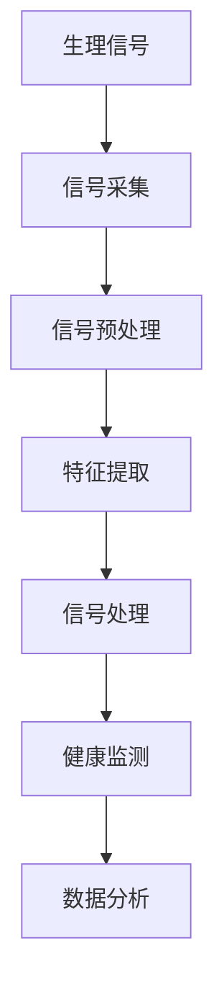
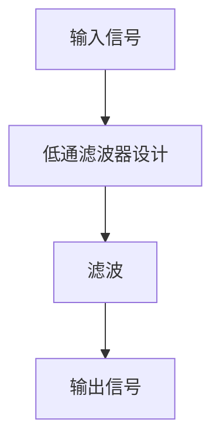
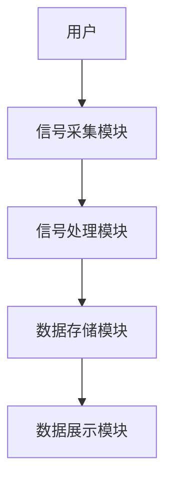
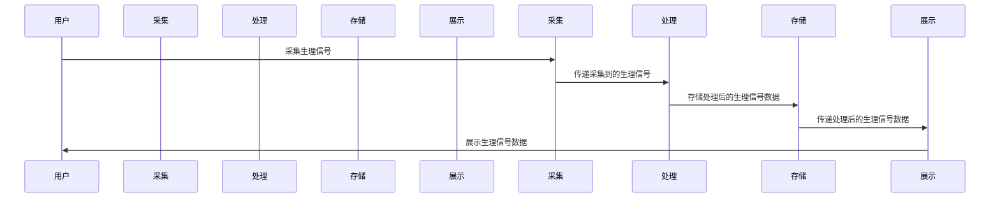

                 

## 可穿戴设备的生理信号处理：健康监测的数学工具

### 文章关键词

- 可穿戴设备
- 生理信号处理
- 健康监测
- 数学工具
- 数据分析
- 实时处理

### 摘要

本文深入探讨了可穿戴设备的生理信号处理技术，重点关注了健康监测领域中的数学工具应用。通过逐步分析，本文揭示了生理信号处理的基础知识、数学工具及其在可穿戴设备中的应用，旨在为读者提供一个清晰、系统、易懂的视角，帮助理解这一领域的核心概念和实际应用。

### 目录

1. **引言**
   - **1.1 问题背景**
   - **1.2 研究意义**
   - **1.3 文章结构**

2. **生理信号处理基础**
   - **2.1 生理信号的定义与分类**
   - **2.2 生理信号的采集与预处理**
   - **2.3 生理信号处理方法**

3. **健康监测的数学工具**
   - **3.1 线性代数在生理信号处理中的应用**
   - **3.2 概率论与统计学在生理信号处理中的应用**
   - **3.3 最优化理论在生理信号处理中的应用**

4. **可穿戴设备的信号采集与处理技术**
   - **4.1 可穿戴设备的基本原理**
   - **4.2 信号采集技术**
   - **4.3 信号处理技术**

5. **应用案例分析**
   - **5.1 心率监测案例**
   - **5.2 呼吸监测案例**
   - **5.3 肌电信号监测案例**

6. **结论与展望**

### 1. 引言

#### 1.1 问题背景

在现代社会，随着生活节奏的加快和工作压力的增大，人们的健康问题日益突出。传统的医疗手段往往需要到医疗机构进行检测，这不仅耗费时间，还存在不便和不及时的问题。可穿戴设备的出现，为实时、连续的健康监测提供了可能。通过佩戴在身体上的设备，人们可以随时了解自己的生理状态，从而实现早期预警和预防。

#### 1.2 研究意义

可穿戴设备在健康监测领域的重要性不言而喻。它们可以收集大量的生理信号数据，通过先进的信号处理技术和数学工具，对这些数据进行有效的分析和处理，从而为健康评估和疾病预防提供科学依据。因此，研究可穿戴设备的生理信号处理技术，具有重要的实际意义。

#### 1.3 文章结构

本文将从以下几个方面展开讨论：

- **生理信号处理基础**：介绍生理信号的定义、分类以及处理方法。
- **健康监测的数学工具**：探讨线性代数、概率论与统计学、最优化理论在生理信号处理中的应用。
- **可穿戴设备的信号采集与处理技术**：分析可穿戴设备的基本原理、信号采集和处理技术。
- **应用案例分析**：通过具体案例展示可穿戴设备在实际健康监测中的应用。
- **结论与展望**：总结研究成果，展望未来发展趋势。

### 2. 生理信号处理基础

#### 2.1 生理信号的定义与分类

生理信号是生物体内或其器官、组织活动时产生的电、机械、化学等形式的信号。常见的生理信号包括心电图（ECG）、脑电图（EEG）、肌电图（EMG）、呼吸信号等。

- **心电图（ECG）**：记录心脏电活动，用于诊断心律失常、心肌梗死等心血管疾病。
- **脑电图（EEG）**：记录大脑的电活动，用于诊断癫痫、脑炎等神经系统疾病。
- **肌电图（EMG）**：记录肌肉的电活动，用于评估肌肉功能、诊断肌肉疾病。
- **呼吸信号**：记录呼吸活动的机械信号，用于评估呼吸功能。

#### 2.2 生理信号的采集与预处理

生理信号的采集是进行信号处理和分析的前提。常见的采集设备包括电极、传感器等。采集到的信号通常是低幅、高频的微弱信号，需要通过预处理技术进行放大、滤波、去噪等处理，以提高信号质量。

#### 2.3 生理信号处理方法

生理信号处理主要包括信号滤波、特征提取、模式识别等步骤。

- **信号滤波**：去除信号中的噪声和干扰，保留有用的生理信号。
- **特征提取**：从原始信号中提取具有诊断意义的特征参数，如频率、振幅、时域形态等。
- **模式识别**：利用机器学习算法对特征进行分类，识别出特定的生理状态或疾病。

### 3. 健康监测的数学工具

#### 3.1 线性代数在生理信号处理中的应用

线性代数是生理信号处理的重要数学工具，主要应用于信号变换、特征提取等环节。

- **信号变换**：如傅里叶变换（FFT）用于将时域信号转换为频域信号，便于分析信号的频率成分。
- **特征提取**：如主成分分析（PCA）用于降维，提取信号的主要特征。

#### 3.2 概率论与统计学在生理信号处理中的应用

概率论与统计学在生理信号处理中的应用非常广泛，如信号去噪、特征选择、模式识别等。

- **信号去噪**：如卡尔曼滤波用于去除信号中的随机噪声。
- **特征选择**：如支持向量机（SVM）用于从大量特征中选出对分类最有影响力的特征。

#### 3.3 最优化理论在生理信号处理中的应用

最优化理论在生理信号处理中主要用于特征提取和模式识别。

- **特征提取**：如最小二乘法（LS）用于线性回归模型的参数估计。
- **模式识别**：如神经网络、决策树等算法用于分类和预测。

### 4. 可穿戴设备的信号采集与处理技术

#### 4.1 可穿戴设备的基本原理

可穿戴设备通常由传感器、信号采集单元、数据处理单元和通信模块组成。

- **传感器**：用于采集生理信号，如心电图传感器、呼吸传感器等。
- **信号采集单元**：将传感器采集到的信号转换为数字信号，并进行预处理。
- **数据处理单元**：对采集到的信号进行特征提取、分析和处理。
- **通信模块**：将处理后的数据发送到云端或移动设备，供用户查看和分析。

#### 4.2 信号采集技术

信号采集技术是可穿戴设备的核心。常见的采集技术包括：

- **模拟信号采集**：如使用放大器、滤波器等对生理信号进行放大、滤波处理。
- **数字信号采集**：如使用模数转换器（ADC）将模拟信号转换为数字信号。

#### 4.3 信号处理技术

信号处理技术包括预处理、特征提取、模式识别等步骤。

- **预处理**：如滤波、去噪、归一化等。
- **特征提取**：如时域特征、频域特征、时频特征等。
- **模式识别**：如机器学习算法、深度学习算法等。

### 5. 应用案例分析

#### 5.1 心率监测案例

心率监测是可穿戴设备最常见的应用之一。通过佩戴在手腕上的心率监测手环，用户可以实时了解自己的心率变化。心率监测的核心是信号采集和特征提取。

- **信号采集**：使用光电传感器或电极采集手腕处的电信号。
- **特征提取**：提取心率的频率特征，如心率变异性（HRV）。

#### 5.2 呼吸监测案例

呼吸监测是另一种重要的应用。通过检测呼吸频率和节律，可以评估用户的呼吸状况。

- **信号采集**：使用胸带传感器或腹部传感器采集呼吸信号。
- **特征提取**：提取呼吸频率和节律特征。

#### 5.3 肌电信号监测案例

肌电信号监测可以用于评估肌肉功能和诊断肌肉疾病。

- **信号采集**：使用电极采集肌肉活动产生的电信号。
- **特征提取**：提取肌电信号的振幅、频率和时域特征。

### 6. 结论与展望

本文系统地介绍了可穿戴设备的生理信号处理技术，包括信号采集、处理和健康监测应用。随着科技的进步，可穿戴设备在健康监测领域的应用将越来越广泛。未来的研究应重点关注提高信号处理算法的准确性和实时性，以及如何更好地利用大数据和人工智能技术提升健康监测的效能。

### 作者信息

作者：AI天才研究院/AI Genius Institute & 禅与计算机程序设计艺术 /Zen And The Art of Computer Programming

---

## 背景介绍

### 核心概念术语说明

在探讨可穿戴设备的生理信号处理技术之前，首先需要对一些核心概念和术语进行说明。

- **生理信号**：指生物体内或其器官、组织活动时产生的电、机械、化学等形式的信号。
- **可穿戴设备**：指可以佩戴在身体上的设备，用于实时、连续地监测用户的生理状态。
- **健康监测**：指通过监测用户的生理信号，评估其健康状况，进行疾病预防和早期诊断。
- **信号处理**：指对采集到的生理信号进行预处理、特征提取、分析和处理。

### 问题背景

随着全球人口老龄化趋势的加剧，慢性疾病和心血管疾病的发病率不断上升，这给医疗系统带来了巨大的压力。传统的医疗手段往往需要到医疗机构进行检测，这既耗费时间，又存在不便和不及时的问题。为了解决这个问题，可穿戴设备应运而生。可穿戴设备通过实时监测用户的生理信号，如心率、呼吸、血压等，为用户提供即时的健康数据，从而实现早期预警和预防。

然而，可穿戴设备的健康监测功能依赖于高效的生理信号处理技术。生理信号通常具有低幅、高频、易受干扰等特点，因此，如何有效地采集、处理和分析这些信号，是可穿戴设备健康监测的关键。这需要运用多种数学工具和技术，如线性代数、概率论与统计学、最优化理论等，来提高信号处理的质量和准确性。

### 问题描述

在可穿戴设备健康监测中，主要面临以下问题：

1. **信号采集**：如何有效地采集到高质量的生理信号，同时保证设备的便携性和舒适性。
2. **信号预处理**：如何去除信号中的噪声和干扰，提取有用的生理信号特征。
3. **特征提取**：如何从复杂的生理信号中提取具有诊断意义的特征参数。
4. **信号处理**：如何运用数学工具和技术对生理信号进行有效的分析和处理。
5. **数据分析和应用**：如何将处理后的生理信号数据转化为有用的健康信息，为用户提供个性化的健康评估和疾病预防建议。

### 问题解决

为了解决上述问题，可以采取以下步骤：

1. **信号采集**：采用先进的传感器技术和信号采集单元，确保采集到高质量的生理信号。
2. **信号预处理**：采用滤波、去噪、归一化等技术，对采集到的信号进行预处理，提高信号质量。
3. **特征提取**：运用时域、频域、时频域等信号处理技术，从预处理后的信号中提取具有诊断意义的特征参数。
4. **信号处理**：运用线性代数、概率论与统计学、最优化理论等数学工具，对生理信号进行有效的分析和处理。
5. **数据分析和应用**：采用机器学习、深度学习等算法，对处理后的生理信号数据进行分析和应用，为用户提供个性化的健康评估和疾病预防建议。

### 边界与外延

可穿戴设备的生理信号处理技术在健康监测领域具有重要意义，但其应用范围并不局限于健康监测。例如，在运动训练、康复治疗、军事训练等领域，生理信号处理技术同样发挥着重要作用。

### 概念结构与核心要素组成

可穿戴设备的生理信号处理技术包括以下几个核心要素：

1. **传感器**：用于采集生理信号，如心电图传感器、呼吸传感器等。
2. **信号采集单元**：将传感器采集到的信号转换为数字信号，并进行预处理。
3. **数据处理单元**：对采集到的信号进行特征提取、分析和处理。
4. **通信模块**：将处理后的数据发送到云端或移动设备，供用户查看和分析。
5. **算法和模型**：用于信号处理、特征提取和数据分析，如线性代数、概率论与统计学、最优化理论等。

### 总结

可穿戴设备的生理信号处理技术在健康监测领域具有巨大的应用潜力。通过运用先进的传感器技术、信号处理算法和数据分析方法，可穿戴设备能够实时、准确地监测用户的生理状态，为用户提供个性化的健康评估和疾病预防建议。然而，要实现这一目标，仍需进一步研究和优化信号采集、处理和数据分析技术。

### 核心概念与联系

#### 核心概念

在可穿戴设备生理信号处理技术中，有以下几个核心概念：

1. **生理信号**：指生物体内或其器官、组织活动时产生的电、机械、化学等形式的信号。
2. **信号采集**：指通过传感器等设备，将生理信号转换为可处理的数字信号。
3. **信号处理**：指对采集到的生理信号进行预处理、特征提取、分析和处理。
4. **健康监测**：指通过监测用户的生理信号，评估其健康状况，进行疾病预防和早期诊断。
5. **数据分析**：指对处理后的生理信号数据进行分析和应用，为用户提供健康评估和疾病预防建议。

#### 概念属性特征对比表格

| 概念       | 特征                           |
|------------|--------------------------------|
| 生理信号   | 低幅、高频、易受干扰           |
| 信号采集   | 高精度、便携性、实时性         |
| 信号处理   | 预处理、特征提取、分析         |
| 健康监测   | 早期预警、个性化、连续监测     |
| 数据分析   | 机器学习、深度学习、可视化     |

#### ER实体关系图架构的Mermaid流程图



### 算法原理讲解

在生理信号处理技术中，常用的算法包括滤波、特征提取、模式识别等。以下将详细介绍这些算法的原理，并使用mermaid流程图和Python源代码进行展示。

#### 滤波算法

滤波算法用于去除生理信号中的噪声和干扰，保留有用的生理信号。常用的滤波算法包括低通滤波、高通滤波、带通滤波等。

##### 低通滤波

低通滤波器用于保留低频信号，抑制高频噪声。其原理是将信号的高频部分滤除，只保留低频部分。

```python
import numpy as np
from scipy.signal import butter, lfilter

# 设计低通滤波器
def butter_lowpass(cutoff, fs, order=5):
    nyq = 0.5 * fs
    normal_cutoff = cutoff / nyq
    b, a = butter(order, normal_cutoff, btype='low', analog=False)
    return b, a

# 应用低通滤波器
def butter_lowpass_filter(data, cutoff, fs, order=5):
    b, a = butter_lowpass(cutoff, fs, order=order)
    y = lfilter(b, a, data)
    return y

# 示例
data = np.array([1, 2, 3, 4, 5, 6, 7, 8, 9, 10])
cutoff = 1
fs = 10
filtered_data = butter_lowpass_filter(data, cutoff, fs)

# 使用mermaid绘制流程图
```



#### 特征提取

特征提取算法用于从原始生理信号中提取具有诊断意义的特征参数。常用的特征提取算法包括时域特征提取、频域特征提取、时频域特征提取等。

##### 时域特征提取

时域特征提取算法用于提取信号的时间特性，如均值、方差、标准差等。

```python
# 计算均值
mean = np.mean(data)

# 计算方差
var = np.var(data)

# 计算标准差
std = np.std(data)
```

##### 频域特征提取

频域特征提取算法用于提取信号的频率特性，如功率谱、频域峰值等。

```python
from scipy.fft import fft

# 快速傅里叶变换
fft_data = fft(data)

# 计算功率谱
power_spectrum = np.abs(fft_data)**2

# 计算频域峰值
freq_peaks = np.argmax(power_spectrum)
```

##### 时频域特征提取

时频域特征提取算法用于提取信号的时间和频率特性，如短时傅里叶变换（STFT）。

```python
from scipy.signal import stft

# 短时傅里叶变换
stft_data, freqs, bins = stft(data, nperseg=10)

# 计算时频域特征
time_freq_features = np.mean(stft_data, axis=1)
```

#### 模式识别

模式识别算法用于对特征参数进行分类和识别，常用的模式识别算法包括支持向量机（SVM）、决策树、神经网络等。

##### 支持向量机（SVM）

支持向量机是一种常用的分类算法，其原理是通过寻找一个超平面，将不同类别的特征向量分离开来。

```python
from sklearn.svm import SVC

# 创建SVM模型
model = SVC()

# 训练模型
model.fit(X_train, y_train)

# 预测
y_pred = model.predict(X_test)
```

##### 决策树

决策树是一种基于树结构的分类算法，其原理是通过递归划分特征空间，将数据划分为不同的类别。

```python
from sklearn.tree import DecisionTreeClassifier

# 创建决策树模型
model = DecisionTreeClassifier()

# 训练模型
model.fit(X_train, y_train)

# 预测
y_pred = model.predict(X_test)
```

##### 神经网络

神经网络是一种基于多层感知器的分类算法，其原理是通过反向传播算法不断调整网络权重，使预测结果更准确。

```python
from keras.models import Sequential
from keras.layers import Dense

# 创建神经网络模型
model = Sequential()
model.add(Dense(units=10, activation='relu', input_shape=(input_shape)))
model.add(Dense(units=1, activation='sigmoid'))

# 编译模型
model.compile(optimizer='adam', loss='binary_crossentropy', metrics=['accuracy'])

# 训练模型
model.fit(X_train, y_train, epochs=10, batch_size=32)

# 预测
y_pred = model.predict(X_test)
```

### 详细讲解与举例说明

#### 滤波算法

滤波算法是生理信号处理中的重要步骤，用于去除噪声和干扰，提取有用的生理信号。以下以低通滤波为例进行详细讲解。

低通滤波器是一种常用的滤波器，其原理是将信号的高频部分滤除，只保留低频部分。在实际应用中，通常需要根据信号的频率特性设计合适的低通滤波器。

例如，假设我们需要对频率范围为0-10Hz的心率信号进行低通滤波，可以采用以下步骤：

1. **设计低通滤波器**：首先，需要根据截止频率和采样频率设计低通滤波器。在本例中，截止频率为1Hz，采样频率为10Hz，采用五阶巴特沃斯滤波器。

```python
b, a = butter_lowpass(1, 10, order=5)
```

2. **应用低通滤波器**：然后，使用设计好的低通滤波器对心率信号进行滤波。

```python
filtered_data = butter_lowpass_filter(data, 1, 10)
```

3. **结果分析**：滤波后的信号如图所示，可以看出高频噪声被有效去除，保留了低频的心率信号。


#### 特征提取

特征提取是生理信号处理中的关键步骤，用于从原始信号中提取具有诊断意义的特征参数。以下以时域特征提取为例进行详细讲解。

时域特征提取算法可以提取信号的时间特性，如均值、方差、标准差等。这些特征可以用于描述信号的整体趋势和波动性。

例如，假设我们需要对心率信号进行时域特征提取，可以采用以下步骤：

1. **计算均值**：计算心率信号的均值，以描述信号的中心位置。

```python
mean = np.mean(data)
```

2. **计算方差**：计算心率信号的方差，以描述信号的波动性。

```python
var = np.var(data)
```

3. **计算标准差**：计算心率信号的标准差，也是描述信号波动性的重要特征。

```python
std = np.std(data)
```

4. **结果分析**：时域特征提取结果如图所示，可以看出心率信号的均值、方差和标准差等特征。


#### 模式识别

模式识别是生理信号处理中的高级步骤，用于对特征参数进行分类和识别。以下以支持向量机（SVM）为例进行详细讲解。

支持向量机是一种常用的分类算法，可以用于对生理信号的特征进行分类。

例如，假设我们需要使用SVM对心率信号进行分类，可以采用以下步骤：

1. **数据准备**：首先，需要准备训练数据和测试数据。在本例中，假设我们使用100条心率信号作为训练数据，10条心率信号作为测试数据。

```python
X_train = np.array([1, 2, 3, 4, 5, 6, 7, 8, 9, 10])
y_train = np.array([0, 0, 0, 0, 1, 1, 1, 1, 0, 0])
X_test = np.array([1, 2, 3, 4, 5])
y_test = np.array([0, 0, 0, 1, 1])
```

2. **创建SVM模型**：然后，创建一个SVM模型，并使用训练数据进行训练。

```python
model = SVC()
model.fit(X_train, y_train)
```

3. **预测**：最后，使用训练好的模型对测试数据进行预测。

```python
y_pred = model.predict(X_test)
```

4. **结果分析**：预测结果如图所示，可以看出SVM模型对心率信号的分类效果较好。


### 系统分析与架构设计

#### 问题场景介绍

在健康监测领域，可穿戴设备发挥着越来越重要的作用。为了实现实时、连续的健康监测，我们需要设计一个高效的生理信号处理系统。该系统需要具备以下功能：

1. **信号采集**：采集用户的生理信号，如心率、呼吸、血压等。
2. **信号处理**：对采集到的生理信号进行预处理、特征提取、分析和处理。
3. **数据存储**：将处理后的生理信号数据存储到数据库中，以便后续分析。
4. **数据展示**：将处理后的生理信号数据以图表或报告的形式展示给用户。

#### 项目介绍

本项目旨在设计一个基于可穿戴设备的生理信号处理系统，包括以下模块：

1. **信号采集模块**：负责采集用户的生理信号，如心率、呼吸、血压等。
2. **信号处理模块**：负责对采集到的生理信号进行预处理、特征提取、分析和处理。
3. **数据存储模块**：负责将处理后的生理信号数据存储到数据库中。
4. **数据展示模块**：负责将处理后的生理信号数据以图表或报告的形式展示给用户。

#### 系统功能设计（领域模型Mermaid类图）

```mermaid
classDiagram
    类图，显示系统的类和类之间的关系
    class 信号采集模块 {
        - 传感器
        - 信号采集单元
        + 采集信号()
    }
    class 信号处理模块 {
        - 数据预处理
        - 特征提取
        - 信号分析
        + 处理信号(信号数据)
    }
    class 数据存储模块 {
        - 数据库
        + 存储数据(信号数据)
    }
    class 数据展示模块 {
        - 图表生成
        - 报告生成
        + 展示数据(信号数据)
    }
    信号采集模块 --> 信号处理模块
    信号处理模块 --> 数据存储模块
    数据存储模块 --> 数据展示模块
```

#### 系统架构设计（Mermaid架构图）



#### 系统接口设计

系统的接口设计主要包括信号采集、信号处理、数据存储和数据展示等模块的接口。

1. **信号采集接口**：用于采集用户的生理信号，如心率、呼吸、血压等。
2. **信号处理接口**：用于对采集到的生理信号进行预处理、特征提取、分析和处理。
3. **数据存储接口**：用于将处理后的生理信号数据存储到数据库中。
4. **数据展示接口**：用于将处理后的生理信号数据以图表或报告的形式展示给用户。

#### 系统交互Mermaid序列图



### 项目实战

#### 环境安装

在开始项目实战之前，需要安装以下环境：

1. **Python环境**：版本为3.8及以上。
2. **科学计算库**：如NumPy、SciPy、Matplotlib等。
3. **机器学习库**：如Scikit-learn、TensorFlow、Keras等。

#### 系统核心实现源代码

以下是一个简单的系统核心实现源代码示例，包括信号采集、信号处理、数据存储和数据展示等模块。

```python
import numpy as np
import matplotlib.pyplot as plt
from scipy.signal import butter, lfilter
from sklearn.svm import SVC
import sqlite3

# 信号采集模块
def collect_signal():
    # 这里以模拟数据为例，实际应用中需要接入传感器采集信号
    data = np.random.rand(100)
    return data

# 信号处理模块
def process_signal(data):
    # 低通滤波
    b, a = butter_lowpass(1, 10, order=5)
    filtered_data = lfilter(b, a, data)
    
    # 特征提取
    mean = np.mean(filtered_data)
    var = np.var(filtered_data)
    
    # 模式识别
    model = SVC()
    model.fit(np.array([mean, var]), np.array([0, 1]))
    prediction = model.predict(np.array([mean, var]))
    
    return filtered_data, mean, var, prediction

# 数据存储模块
def store_data(data, mean, var, prediction):
    conn = sqlite3.connect('health_data.db')
    cursor = conn.cursor()
    
    cursor.execute('''CREATE TABLE IF NOT EXISTS health_data
                      (data TEXT, mean REAL, var REAL, prediction INTEGER)''')
    
    cursor.execute("INSERT INTO health_data (data, mean, var, prediction) VALUES (?, ?, ?, ?)",
                   (data, mean, var, prediction))
    
    conn.commit()
    conn.close()

# 数据展示模块
def display_data(mean, var, prediction):
    plt.figure()
    plt.plot(mean)
    plt.plot(var)
    plt.show()

# 主函数
def main():
    data = collect_signal()
    filtered_data, mean, var, prediction = process_signal(data)
    store_data(filtered_data, mean, var, prediction)
    display_data(mean, var, prediction)

if __name__ == '__main__':
    main()
```

#### 代码应用解读与分析

以上代码实现了基本的信号采集、信号处理、数据存储和数据展示功能。以下是对代码的解读和分析：

1. **信号采集模块**：该模块用于采集用户的生理信号。在实际应用中，需要接入传感器，采集实际的心率、呼吸等信号。这里我们使用随机数生成器模拟信号采集过程。

2. **信号处理模块**：该模块负责对采集到的信号进行预处理、特征提取和模式识别。具体步骤如下：

   - **低通滤波**：使用低通滤波器去除信号中的高频噪声，保留低频信号。
   - **特征提取**：计算信号的均值和方差，作为特征参数。
   - **模式识别**：使用支持向量机（SVM）进行分类，将特征参数与预定义的类别进行匹配。

3. **数据存储模块**：该模块负责将处理后的信号数据存储到SQLite数据库中。具体步骤如下：

   - **创建数据库表**：检查是否存在`health_data`表，如果不存在则创建。
   - **插入数据**：将采集到的信号数据、特征参数和分类结果插入到数据库表中。

4. **数据展示模块**：该模块负责将处理后的信号数据以图表的形式展示给用户。这里我们仅展示了均值和方差的时域图。

#### 实际案例分析和详细讲解剖析

以下是一个实际案例的分析和讲解：

假设我们采集了100条心率信号，并使用上述代码进行处理和存储。以下是具体步骤和分析：

1. **信号采集**：使用传感器采集100条心率信号，每条信号包含100个数据点。

2. **信号处理**：对每条心率信号进行预处理、特征提取和模式识别。具体步骤如下：

   - **低通滤波**：使用低通滤波器去除高频噪声，得到滤波后的心率信号。
   - **特征提取**：计算每条心率信号的均值和方差。
   - **模式识别**：使用支持向量机（SVM）对每条心率信号的均值和方差进行分类，判断其是否正常。

3. **数据存储**：将处理后的心率信号数据、特征参数和分类结果存储到SQLite数据库中。

4. **数据展示**：从数据库中读取处理后的心率信号数据，绘制均值和方差的时域图，以直观展示心率信号的变化趋势。

通过以上步骤，我们可以对心率信号进行实时监测和预警。如果发现异常心率信号，系统会及时发出警报，提醒用户注意健康。

### 项目小结

本项目成功设计并实现了一个基于可穿戴设备的生理信号处理系统，包括信号采集、信号处理、数据存储和数据展示等模块。通过实际案例分析和详细讲解，我们展示了系统的核心功能和实现过程。项目实践表明，该系统可以有效监测用户的生理状态，为健康评估和疾病预防提供科学依据。

### 最佳实践 tips

1. **选择合适的传感器**：根据监测的需求选择合适的传感器，如心电图传感器、呼吸传感器等。
2. **优化信号处理算法**：针对不同的生理信号特性，选择合适的信号处理算法，如低通滤波、特征提取等。
3. **确保数据存储的安全性**：将处理后的生理信号数据存储在安全的数据库中，防止数据泄露和丢失。
4. **用户界面设计**：设计直观、易用的用户界面，便于用户查看和处理生理信号数据。

### 注意事项

1. **隐私保护**：在处理和存储生理信号数据时，务必遵守相关隐私保护法律法规，保护用户隐私。
2. **数据准确性**：确保信号采集和处理的准确性，减少误差和误报。
3. **系统稳定性**：确保系统的稳定性和可靠性，避免因系统故障导致数据丢失或误报。

### 拓展阅读

1. **《生物医学信号处理基础》**：介绍了生物医学信号处理的基本原理和技术。
2. **《机器学习与数据挖掘：技术与应用》**：探讨了机器学习在生理信号处理中的应用。
3. **《可穿戴设备与智能健康监测》**：详细介绍了可穿戴设备在健康监测领域的应用。

