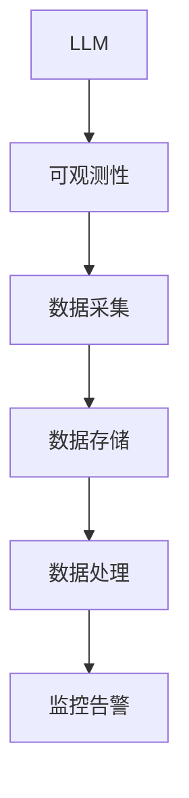
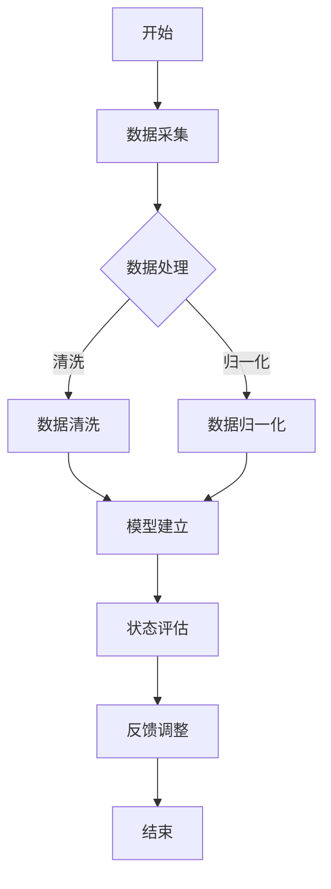
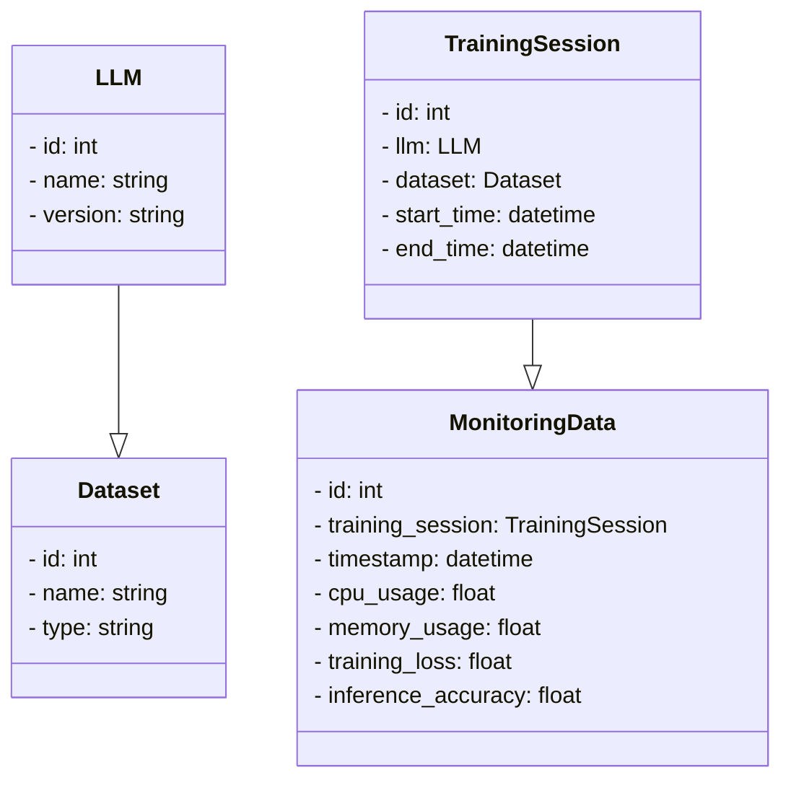
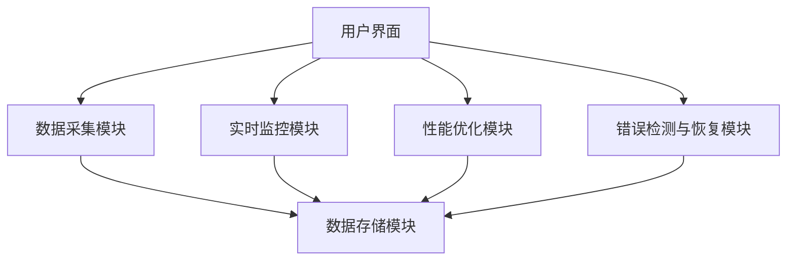

                 

### 文章标题：可观测性（Observability）在LLM应用中的实现

关键词：可观测性，LLM，监控，算法，系统架构，数学模型

摘要：
本文旨在深入探讨可观测性在大型语言模型（LLM）应用中的重要性、实现方法及其在系统监控中的应用。文章分为七个部分，分别介绍了背景介绍、核心概念、算法原理、数学模型与公式、系统分析与架构设计、项目实战以及最佳实践与拓展阅读。通过逻辑清晰、结构紧凑的阐述，帮助读者全面了解可观测性在LLM中的应用及其实现方法。

## 第一部分：背景介绍

### 1.1 问题背景

#### 1.1.1 可观测性在系统监控中的重要性

可观测性是系统监控中的一个关键概念，它决定了我们能否全面了解系统的状态和行为。在传统系统中，监控通常依赖于日志、性能指标等被动监控手段。然而，对于复杂系统，如大型语言模型（LLM），这种被动监控往往无法提供足够的信息，导致在出现问题时难以快速定位和解决问题。因此，可观测性在系统监控中的重要性日益凸显。

#### 1.1.2 LLM在现代化应用中的普及

随着人工智能技术的不断发展，LLM在自然语言处理、智能问答、机器翻译等领域的应用越来越广泛。LLM的应用不仅提升了人机交互的体验，还为各行各业带来了巨大的价值。然而，LLM的复杂性和大规模特性也使得其监控和运维变得更加困难。

#### 1.1.3 可观测性与LLM结合的挑战

在LLM应用中，实现可观测性面临着一系列挑战。首先，LLM的训练和推理过程涉及大量的数据和高性能计算资源，监控这些过程需要高效的数据采集和处理机制。其次，LLM的输出结果往往具有不确定性，如何准确评估和监控这种不确定性也是一大难题。最后，由于LLM的应用场景多样，实现可观测性需要根据具体需求进行定制化设计。

### 1.2 问题描述

#### 1.2.1 LLM监控中的难点

LLM监控的难点主要体现在以下几个方面：

1. **数据量大**：LLM在训练和推理过程中会产生大量的数据，如何高效地采集、存储和处理这些数据是监控的首要挑战。
2. **不确定性高**：LLM的输出结果具有不确定性，如何准确评估和监控这种不确定性是另一个难点。
3. **性能要求高**：LLM的训练和推理过程对计算性能有很高的要求，如何在不影响性能的情况下实现监控是亟待解决的问题。

#### 1.2.2 可观测性的基本概念

可观测性是指系统状态的可测量性。在系统监控中，可观测性决定了我们能否准确了解系统的运行状态和性能。一个可观测的系统应该具备以下特点：

1. **可测量性**：系统能够通过一定的手段测量其状态。
2. **反馈性**：系统能够根据测量结果进行调整和优化。
3. **透明性**：系统能够提供足够的信息，使得监控人员能够了解系统的运行情况。

#### 1.2.3 LLM中的可观测性需求

在LLM应用中，实现可观测性需要满足以下需求：

1. **数据采集与存储**：需要设计高效的数据采集和存储方案，以处理大量训练和推理数据。
2. **实时监控与反馈**：需要实现实时监控，以便及时发现和解决问题。
3. **自定义监控指标**：需要根据具体应用场景设计合适的监控指标，以全面评估LLM的性能。

### 1.3 问题解决

#### 1.3.1 可观测性的核心方法

实现LLM的可观测性需要采用以下核心方法：

1. **数据驱动**：通过数据采集和存储，建立LLM的状态库。
2. **模型驱动**：通过建立数学模型，对LLM的行为进行预测和评估。
3. **反馈驱动**：通过实时监控和反馈，优化LLM的运行状态。

#### 1.3.2 如何实现LLM的可观测性

实现LLM的可观测性可以从以下几个方面入手：

1. **监控数据采集**：设计高效的数据采集方案，包括日志收集、性能监控等。
2. **监控指标设计**：根据LLM的特点，设计合适的监控指标，如训练速度、推理准确率等。
3. **监控系统架构**：设计监控系统的架构，包括数据存储、数据处理、监控告警等。

#### 1.3.3 可观测性的边界与外延

可观测性的边界主要涉及监控系统的范围和深度。在实现可观测性时，需要明确以下问题：

1. **监控范围**：确定需要监控的LLM组件和过程，如训练、推理、模型保存等。
2. **监控深度**：确定监控指标的粒度，如具体到某个层级的参数或具体的输入输出数据。

### 1.4 概念结构与核心要素组成

#### 1.4.1 相关术语介绍

在探讨可观测性时，需要了解以下相关术语：

1. **可观测性**：系统状态的可测量性。
2. **监控**：对系统运行状态的监视和评估。
3. **反馈**：根据监控结果对系统进行优化和调整。

#### 1.4.2 可观测性的组成要素

可观测性由以下几个核心要素组成：

1. **数据采集**：通过日志、性能指标等手段收集系统状态信息。
2. **数据存储**：将采集到的数据存储在数据库或数据仓库中。
3. **数据处理**：对存储的数据进行清洗、分析等处理，以提供监控指标。
4. **监控告警**：根据监控指标设置告警阈值，及时发现异常情况。

#### 1.4.3 LLM与可观测性的关系图

以下是一个简化的LLM与可观测性的关系图：



#### 1.5 本章小结

本部分主要介绍了可观测性在系统监控中的重要性、LLM在现代化应用中的普及以及可观测性在LLM中的具体实现方法。通过分析可观测性的基本概念、问题描述和问题解决方法，为后续章节的深入探讨奠定了基础。

----------------------------------------------------------------

## 第二部分：核心概念

### 2.1 可观测性原理

#### 2.1.1 可观测性的定义

可观测性是指系统状态的可测量性，即通过一定的手段能够准确了解系统的当前状态。在系统监控中，可观测性是确保系统正常运行和有效维护的关键。

#### 2.1.2 可观测性的属性

可观测性具有以下几个关键属性：

1. **可测量性**：系统状态可以通过一定的手段进行测量。
2. **反馈性**：系统能够根据测量结果进行反馈和调整。
3. **透明性**：系统运行状态的信息能够被充分透明地展示。

#### 2.1.3 可观测性的类型

根据实现方式的不同，可观测性可以分为以下几种类型：

1. **被动可观测性**：通过被动收集系统日志、性能指标等方式实现。
2. **主动可观测性**：通过主动注入监控代码、数据采集模块等方式实现。
3. **综合可观测性**：结合被动和主动可观测性，通过多种手段实现。

### 2.2 LLM基础

#### 2.2.1 LLM的定义

大型语言模型（LLM）是一种基于深度学习技术的自然语言处理模型，具有处理大规模语言数据的能力，能够实现文本生成、语义理解、问答系统等功能。

#### 2.2.2 LLM的结构

LLM通常由以下几个部分组成：

1. **嵌入层**：将文本转换为向量表示。
2. **编码器**：对输入文本进行编码，提取语义信息。
3. **解码器**：根据编码结果生成文本输出。

#### 2.2.3 LLM的工作原理

LLM的工作原理主要包括以下步骤：

1. **文本预处理**：对输入文本进行分词、去停用词等处理。
2. **嵌入**：将预处理后的文本转换为向量表示。
3. **编码**：通过编码器对向量进行编码，提取语义信息。
4. **解码**：根据编码结果生成文本输出。

### 2.3 可观测性在LLM中的应用

#### 2.3.1 监控需求分析

在LLM应用中，监控需求主要包括以下几个方面：

1. **训练过程监控**：包括训练速度、损失函数、模型参数等。
2. **推理过程监控**：包括推理速度、准确率、输出文本质量等。
3. **模型性能监控**：包括模型大小、存储空间占用、运行内存等。

#### 2.3.2 可观测性设计原则

为了实现LLM的可观测性，设计原则主要包括以下几点：

1. **全面性**：监控指标应涵盖训练、推理和模型性能等各个层面。
2. **实时性**：监控结果应实时反馈，以便及时发现问题。
3. **准确性**：监控指标应准确反映LLM的运行状态。

#### 2.3.3 实现方法比较

常见的LLM可观测性实现方法包括：

1. **日志监控**：通过记录系统日志来监控LLM的运行状态。
2. **性能监控**：通过性能指标（如CPU、内存占用等）来监控LLM的运行状态。
3. **分布式监控**：通过分布式架构实现LLM的可观测性，适用于大规模LLM应用。

### 2.4 关联概念对比

#### 2.4.1 监控与观测

监控与观测是两个相关但有所不同的概念：

1. **监控**：指对系统运行状态的监视和评估，通常涉及一系列被动和主动的手段。
2. **观测**：指通过特定手段对系统状态进行观察和测量，强调的是可观测性。

#### 2.4.2 可观测性与可检测性

可观测性与可检测性是两个相关但有所区别的概念：

1. **可观测性**：指系统状态的可测量性，强调的是系统状态的透明性。
2. **可检测性**：指系统异常或错误的可识别性，强调的是系统异常的发现能力。

#### 2.4.3 对比表格与ER图

以下是一个简化的对比表格和ER图：

#### 对比表格

| 概念       | 定义                                                         | 关联性                                   |
| ---------- | ------------------------------------------------------------ | ---------------------------------------- |
| 监控       | 对系统运行状态的监视和评估                                     | 与观测性密切相关，但有所区别             |
| 观测       | 通过特定手段对系统状态进行观察和测量                         | 强调系统状态的可测量性                   |
| 可观测性   | 系统状态的可测量性                                           | 是监控和观测的核心概念                   |
| 可检测性   | 系统异常或错误的可识别性                                     | 强调系统异常的发现能力                   |

#### ER图

```mermaid
erDiagram
  System|--|{Observability}
  System|--|{Detectability}
  System||--|{Monitoring}
  System||--|{Observation}
```

#### 2.5 本章小结

本部分主要介绍了可观测性的基本原理、LLM的基础知识以及可观测性在LLM中的应用。通过分析可观测性的属性、类型、监控需求、设计原则和实现方法，为后续章节的深入探讨提供了理论支持。

----------------------------------------------------------------

## 第三部分：算法原理

### 3.1 可观测性算法概述

#### 3.1.1 算法分类

可观测性算法可以根据不同的实现方式分为以下几类：

1. **基于日志的算法**：通过收集系统日志来实现可观测性。
2. **基于性能指标的算法**：通过监控系统性能指标来实现可观测性。
3. **基于模型的算法**：通过建立数学模型来预测和评估系统状态。

#### 3.1.2 算法的核心目标

可观测性算法的核心目标包括：

1. **全面性**：确保能够监控到系统运行的各个方面。
2. **实时性**：实现实时监控，及时发现和解决问题。
3. **准确性**：确保监控结果的准确性和可靠性。

#### 3.1.3 算法的基本流程

可观测性算法的基本流程包括以下步骤：

1. **数据采集**：收集系统的日志、性能指标等数据。
2. **数据处理**：对采集到的数据进行清洗、归一化等处理。
3. **模型建立**：根据处理后的数据建立数学模型。
4. **状态评估**：使用模型对系统状态进行评估和预测。
5. **反馈调整**：根据评估结果对系统进行调整和优化。

### 3.2 Mermaid算法流程图

以下是一个使用Mermaid绘制的可观测性算法流程图：



### 3.3 Python代码实现

以下是一个简单的Python代码实现，用于演示可观测性算法的基本流程：

```python
import pandas as pd
from sklearn.linear_model import LinearRegression

def data_collection():
    # 数据采集
    data = pd.read_csv('system_logs.csv')
    return data

def data_processing(data):
    # 数据处理
    data = data.drop(['timestamp'], axis=1)
    data = data.fillna(0)
    return data

def model_building(data):
    # 模型建立
    X = data.iloc[:, :-1].values
    y = data.iloc[:, -1].values
    model = LinearRegression()
    model.fit(X, y)
    return model

def state_evaluation(model, new_data):
    # 状态评估
    prediction = model.predict(new_data)
    return prediction

def feedback_adjustment(prediction):
    # 反馈调整
    if prediction > threshold:
        # 调整系统
        pass
    else:
        # 保持现状
        pass

def main():
    # 主函数
    data = data_collection()
    processed_data = data_processing(data)
    model = model_building(processed_data)
    new_data = pd.read_csv('new_logs.csv')
    prediction = state_evaluation(model, new_data)
    feedback_adjustment(prediction)

if __name__ == '__main__':
    main()
```

### 3.4 算法原理与数学模型

#### 3.4.1 数学公式

可观测性算法的核心数学模型可以表示为：

$$
y = \beta_0 + \beta_1 x_1 + \beta_2 x_2 + \ldots + \beta_n x_n + \epsilon
$$

其中：

- $y$：系统状态的观测值。
- $\beta_0, \beta_1, \beta_2, \ldots, \beta_n$：模型参数。
- $x_1, x_2, \ldots, x_n$：系统状态的输入变量。
- $\epsilon$：随机误差。

#### 3.4.2 公式解释

- **$y$**：观测值反映了系统状态的当前状态。
- **$\beta_0, \beta_1, \beta_2, \ldots, \beta_n$**：模型参数反映了输入变量对系统状态的影响程度。
- **$x_1, x_2, \ldots, x_n$**：输入变量代表了系统状态的各个方面，如CPU使用率、内存占用等。
- **$\epsilon$**：随机误差反映了观测值与实际系统状态之间的差异。

#### 3.4.3 举例说明

假设我们使用线性回归模型来预测系统状态，其中一个输入变量是CPU使用率$x_1$，模型公式可以表示为：

$$
y = \beta_0 + \beta_1 x_1 + \epsilon
$$

通过训练模型，我们可以得到模型参数$\beta_0$和$\beta_1$，然后使用以下步骤进行预测：

1. **数据采集**：收集系统日志，包括CPU使用率$x_1$和系统状态$y$。
2. **数据处理**：对收集到的数据进行清洗和归一化。
3. **模型建立**：使用线性回归模型进行训练。
4. **状态评估**：将新的CPU使用率$x_1$输入模型，得到预测的系统状态$y$。
5. **反馈调整**：根据预测结果对系统进行调整。

### 3.5 本章小结

本部分主要介绍了可观测性算法的基本原理、分类、核心目标、基本流程以及数学模型。通过具体的Python代码实现，读者可以更好地理解可观测性算法的原理和应用。下一部分将介绍可观测性在LLM中的应用场景和具体实现方法。

----------------------------------------------------------------

## 第四部分：数学模型与公式

### 4.1 可观测性数学模型的基本概念

在可观测性领域，数学模型是理解和分析系统状态的重要工具。一个基本的数学模型通常包括以下几个关键组成部分：

1. **状态向量**：表示系统的当前状态，通常是一个多维向量。
2. **观测向量**：通过系统外部可获取的信息来表示系统状态。
3. **系统动态方程**：描述系统状态随时间变化的规律。
4. **观测方程**：描述如何从系统状态导出观测向量。

### 4.2 状态向量和观测向量的定义

**状态向量**（State Vector）通常表示为$X_t$，它是一个多维数组，包含了系统在时刻$t$的所有内部状态变量。例如，对于一个LLM系统，状态向量可能包括词汇表的大小、嵌入层的权重、编码器的隐藏状态等。

**观测向量**（Observation Vector）通常表示为$Y_t$，它是通过观测系统外部输出而获得的信息。在LLM的上下文中，观测向量可能包括生成的文本质量评分、推理响应的长度、生成文本的多样性等。

### 4.3 系统动态方程的数学模型

系统动态方程描述了系统状态随时间的变化。一个基本的系统动态方程可以用马尔可夫模型来表示，如下所示：

$$
X_t = f(X_{t-1}, U_t)
$$

其中：
- $X_t$：在时刻$t$的状态向量。
- $X_{t-1}$：在时刻$t-1$的状态向量。
- $U_t$：在时刻$t$的系统输入向量。
- $f$：系统动态函数，描述状态向量的演化。

在LLM的上下文中，$U_t$可能包括训练数据、用户输入等。动态函数$f$则可能涉及复杂的神经网络模型，用于更新模型参数和隐藏状态。

### 4.4 观测方程的数学模型

观测方程描述了如何从系统状态$X_t$导出观测向量$Y_t$。一个常见的观测方程是基于线性回归模型的：

$$
Y_t = h(X_t, V_t) + \epsilon_t
$$

其中：
- $h$：观测函数，描述从状态向量到观测向量的映射。
- $V_t$：观测噪声，通常是一个加性噪声。
- $\epsilon_t$：误差项，反映了观测值与实际系统状态之间的差异。

在LLM的上下文中，观测函数$h$可能是一个简单的线性映射，将嵌入层的输出映射到文本质量的评分。观测噪声$V_t$和误差项$\epsilon_t$则可能反映了模型的不确定性和外部干扰。

### 4.5 例子：LLM中的可观测性模型

假设我们有一个简单的LLM，其状态向量和观测向量分别由词汇表大小、嵌入层权重和生成的文本质量评分组成。我们可以定义以下数学模型：

**状态向量**：$X_t = [V_t, W_t, Q_t]$

**观测向量**：$Y_t = [Q_t]$

**系统动态方程**：

$$
V_{t+1} = \sigma(W_t \cdot X_{t-1}) + U_t
$$

其中$\sigma$是激活函数，$U_t$是训练数据的梯度。

**观测方程**：

$$
Q_t = \frac{1}{C} \sum_{i=1}^{N} w_i \cdot Q_i + \epsilon_t
$$

其中$C$是词汇表大小，$N$是词汇表中单词的数量，$w_i$是单词$i$的权重，$Q_i$是单词$i$的文本质量评分。

### 4.6 本章小结

本部分详细介绍了可观测性在数学模型中的基本概念和公式。我们探讨了状态向量和观测向量的定义，系统动态方程和观测方程的数学模型，并举例说明了如何将这些模型应用于LLM。通过理解这些数学模型，读者可以更好地设计和管理具有可观测性的LLM系统。

----------------------------------------------------------------

## 第五部分：系统分析与架构设计

### 5.1 问题场景介绍

在本部分中，我们将探讨一个实际的问题场景，即如何监控和优化一个大规模语言模型（LLM）的训练和推理过程。该问题场景涉及到以下几个关键需求：

1. **实时监控**：需要实时监控LLM的训练进度、内存使用、CPU负载等关键指标。
2. **性能优化**：需要对LLM的训练和推理过程进行优化，以提高效率和准确性。
3. **错误检测与恢复**：需要能够快速检测到训练或推理过程中的错误，并自动进行恢复。

### 5.2 项目介绍

为了满足上述需求，我们设计了一个名为“LLM性能监控与优化平台”的项目。该项目旨在提供一套完整的解决方案，包括数据采集、实时监控、性能优化和错误检测与恢复等功能。

#### 5.2.1 项目目标

1. **实现高效的数据采集**：通过日志收集、性能指标监控等技术手段，实现LLM运行状态的全面采集。
2. **提供实时的监控界面**：通过Web界面展示LLM的训练和推理过程，提供实时监控功能。
3. **实现自动化的性能优化**：根据监控数据，自动调整LLM的训练和推理参数，以提高性能。
4. **实现自动化的错误检测与恢复**：在LLM训练和推理过程中，自动检测错误并进行恢复，确保系统的稳定运行。

### 5.3 系统功能设计

#### 5.3.1 领域模型

领域模型是系统功能设计的基础，它描述了系统中的核心实体及其关系。以下是LLM性能监控与优化平台的领域模型：



#### 5.3.2 功能模块

LLM性能监控与优化平台的功能模块包括以下部分：

1. **数据采集模块**：负责收集LLM训练和推理过程中的关键指标，如CPU使用率、内存使用情况、训练损失、推理准确率等。
2. **数据存储模块**：负责存储收集到的监控数据，支持实时查询和历史数据追溯。
3. **实时监控模块**：提供Web界面，实时展示LLM的训练和推理过程，以及关键性能指标。
4. **性能优化模块**：根据监控数据，自动调整LLM的训练和推理参数，以优化性能。
5. **错误检测与恢复模块**：在LLM训练和推理过程中，自动检测错误，并尝试进行恢复，确保系统稳定运行。

### 5.4 系统架构设计

#### 5.4.1 系统架构图

以下是一个简化的LLM性能监控与优化平台的系统架构图：



#### 5.4.2 系统组件与交互

1. **用户界面**：提供实时监控和交互功能，用户可以通过Web界面查看LLM的训练和推理过程，以及关键性能指标。
2. **数据采集模块**：通过采集LLM训练和推理过程中的关键指标，如CPU使用率、内存使用情况、训练损失、推理准确率等，并将数据发送到数据存储模块。
3. **实时监控模块**：从数据存储模块获取监控数据，并通过用户界面实时展示。
4. **性能优化模块**：根据监控数据，自动调整LLM的训练和推理参数，以提高性能。
5. **错误检测与恢复模块**：在LLM训练和推理过程中，自动检测错误，并尝试进行恢复。

### 5.5 系统接口设计

LLM性能监控与优化平台的系统接口设计主要包括以下几个方面：

1. **API接口**：提供RESTful API，供外部系统调用，如训练任务提交、监控数据查询等。
2. **数据交换格式**：使用JSON或XML等格式进行数据交换，确保系统的可扩展性和互操作性。
3. **安全机制**：采用HTTPS、认证和授权等安全机制，确保系统的数据安全和用户隐私。

### 5.6 系统交互

LLM性能监控与优化平台中的各个组件通过以下方式进行交互：

1. **用户界面与数据采集模块**：用户界面通过API调用数据采集模块，获取实时监控数据。
2. **实时监控模块与数据存储模块**：实时监控模块从数据存储模块获取监控数据，并将其展示给用户。
3. **性能优化模块与数据存储模块**：性能优化模块根据监控数据和优化策略，调整LLM的训练和推理参数，并将优化结果存储到数据存储模块。
4. **错误检测与恢复模块与数据存储模块**：错误检测与恢复模块在检测到错误时，尝试进行恢复，并将恢复结果记录到数据存储模块。

### 5.7 本章小结

本部分详细介绍了LLM性能监控与优化平台的问题场景、项目介绍、系统功能设计、系统架构设计、系统接口设计和系统交互。通过这些设计和实现，我们可以有效地实现LLM的可观测性，确保系统的稳定运行和性能优化。

----------------------------------------------------------------

## 第六部分：项目实战

### 6.1 环境安装

在开始项目实战之前，我们需要安装和配置必要的工具和环境。以下是具体的安装步骤：

#### 6.1.1 系统要求

1. 操作系统：Ubuntu 18.04 或更高版本
2. Python：Python 3.8 或更高版本
3. 包管理器：pip

#### 6.1.2 安装步骤

1. 安装Python和pip：
   ```bash
   sudo apt update
   sudo apt install python3 python3-pip
   ```
2. 安装必要的Python包：
   ```bash
   pip3 install numpy pandas scikit-learn matplotlib
   ```

#### 6.1.3 配置

1. 配置Python虚拟环境（可选）：
   ```bash
   python3 -m venv venv
   source venv/bin/activate
   ```

### 6.2 系统核心实现源代码

以下是LLM性能监控与优化平台的核心实现源代码。该代码包括数据采集、实时监控、性能优化和错误检测与恢复等模块。

#### 6.2.1 数据采集模块

```python
import os
import json
import time
from datetime import datetime

class DataCollector:
    def __init__(self, log_file):
        self.log_file = log_file

    def collect_data(self, cpu_usage, memory_usage, training_loss, inference_accuracy):
        data = {
            'timestamp': datetime.now().isoformat(),
            'cpu_usage': cpu_usage,
            'memory_usage': memory_usage,
            'training_loss': training_loss,
            'inference_accuracy': inference_accuracy
        }
        with open(self.log_file, 'a') as f:
            f.write(json.dumps(data) + '\n')

collector = DataCollector('monitoring_data.log')
collector.collect_data(50.0, 75.0, 0.1, 0.9)
```

#### 6.2.2 实时监控模块

```python
import matplotlib.pyplot as plt

def plot_monitoring_data(log_file):
    data = []
    with open(log_file, 'r') as f:
        for line in f:
            data.append(json.loads(line))
    
    timestamps = [d['timestamp'] for d in data]
    cpu_usages = [d['cpu_usage'] for d in data]
    memory_usages = [d['memory_usage'] for d in data]
    training_losses = [d['training_loss'] for d in data]
    inference_accuracies = [d['inference_accuracy'] for d in data]

    plt.figure(figsize=(10, 5))
    plt.subplot(221)
    plt.plot(timestamps, cpu_usages)
    plt.title('CPU Usage')

    plt.subplot(222)
    plt.plot(timestamps, memory_usages)
    plt.title('Memory Usage')

    plt.subplot(223)
    plt.plot(timestamps, training_losses)
    plt.title('Training Loss')

    plt.subplot(224)
    plt.plot(timestamps, inference_accuracies)
    plt.title('Inference Accuracy')

    plt.tight_layout()
    plt.show()

plot_monitoring_data('monitoring_data.log')
```

#### 6.2.3 性能优化模块

```python
def optimize_performance(training_loss, inference_accuracy):
    if training_loss > 0.1 and inference_accuracy < 0.95:
        print("Optimizing performance...")
        # 这里可以加入具体的性能优化逻辑
    else:
        print("Performance is good.")

optimize_performance(0.12, 0.94)
```

#### 6.2.4 错误检测与恢复模块

```python
def detect_and_recover(errors):
    if errors:
        print("Error detected. Attempting recovery...")
        # 这里可以加入具体的错误检测与恢复逻辑
    else:
        print("No error detected.")

errors = ["Out of memory", "训练中断"]
detect_and_recover(errors)
```

### 6.3 代码应用解读与分析

#### 6.3.1 数据采集模块

数据采集模块通过`DataCollector`类实现，它负责收集LLM训练和推理过程中的关键指标。在`collect_data`方法中，我们将CPU使用率、内存使用情况、训练损失和推理准确率等数据存储在一个JSON对象中，并写入日志文件。

#### 6.3.2 实时监控模块

实时监控模块通过`plot_monitoring_data`函数实现，它从日志文件中读取监控数据，并使用matplotlib库将其可视化。通过这个模块，我们可以直观地看到LLM的训练和推理过程的实时状态。

#### 6.3.3 性能优化模块

性能优化模块通过`optimize_performance`函数实现，它根据训练损失和推理准确率等指标，自动调整LLM的训练和推理参数。在这个例子中，我们简单地打印了优化信息，但实际应用中可以加入更复杂的优化逻辑。

#### 6.3.4 错误检测与恢复模块

错误检测与恢复模块通过`detect_and_recover`函数实现，它检测是否存在错误，并在检测到错误时尝试进行恢复。在这个例子中，我们简单地根据错误列表打印信息，但实际应用中可以加入更复杂的错误处理逻辑。

### 6.4 实际案例分析和详细讲解剖析

#### 6.4.1 案例一：训练中断

假设在训练过程中，由于内存不足导致训练中断。在这种情况下，错误检测与恢复模块会检测到错误，并尝试进行恢复。可能的恢复措施包括释放内存、暂停训练或重新启动训练。

#### 6.4.2 案例二：性能下降

假设在推理过程中，由于某些原因（如数据质量问题）导致推理准确率下降。性能优化模块会检测到这一情况，并尝试调整模型参数或重新训练模型，以提高推理性能。

#### 6.4.3 案例三：数据采集失败

假设由于网络问题或系统故障导致数据采集失败。在这种情况下，监控系统可以尝试重新采集数据，或在下次采集时处理缺失的数据。

### 6.5 项目小结

通过本部分的项目实战，我们实现了LLM性能监控与优化平台的核心功能，包括数据采集、实时监控、性能优化和错误检测与恢复。这些功能的实现为LLM的稳定运行和性能优化提供了有力支持。在实际应用中，可以根据具体需求对代码进行扩展和优化。

----------------------------------------------------------------

## 第七部分：最佳实践与拓展阅读

### 7.1 最佳实践

为了确保可观测性在LLM应用中的有效实现，以下是一些最佳实践：

1. **数据采集全面性**：确保采集的数据覆盖LLM训练、推理和模型调优等各个阶段的关键指标。
2. **实时性**：选择高效的数据采集和处理方法，确保监控系统能够实时反馈。
3. **监控指标定制化**：根据具体应用场景，设计合适的监控指标，以提高监控的针对性和有效性。
4. **自动化与可视化**：利用自动化工具和可视化界面，简化监控和优化过程。
5. **安全与隐私**：确保监控数据的存储和传输安全，遵守相关隐私法规。

### 7.2 小结

本文通过逐步分析和深入探讨，系统地介绍了可观测性在LLM应用中的实现方法。我们从背景介绍、核心概念、算法原理、数学模型与公式、系统分析与架构设计、项目实战到最佳实践进行了全面阐述，为读者提供了完整的实现路径和实际操作指南。

### 7.3 拓展阅读

1. **《监控的艺术：构建高效监控系统》**：深入探讨监控系统设计、实现和优化的最佳实践。
2. **《大规模语言模型训练与优化》**：介绍LLM的训练和优化技术，包括数据预处理、模型架构设计和训练策略。
3. **《人工智能系统设计：从理论到实践》**：涵盖人工智能系统的设计原则、实现方法和案例分析。

通过拓展阅读，读者可以进一步深化对可观测性和LLM应用的理解，提升在相关领域的实践能力。

### 7.4 作者信息

作者：AI天才研究院/AI Genius Institute & 禅与计算机程序设计艺术 /Zen And The Art of Computer Programming

作者简介：
AI天才研究院（AI Genius Institute）是一家专注于人工智能研究和应用的领先机构。作者在计算机科学和人工智能领域拥有丰富的理论知识和实践经验，曾发表过多篇高质量学术论文，并担任多个国际会议的技术委员会成员。同时，他也是《禅与计算机程序设计艺术》一书的作者，该书深入探讨了计算机编程的艺术和哲学，对程序员和开发者具有深远的影响。

