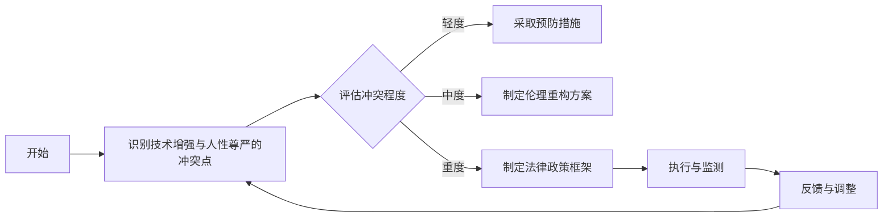

                 

# 《后人类主义思潮下的伦理重构：技术增强与人性尊严的平衡》

> 关键词：后人类主义、伦理重构、技术增强、人性尊严、人工智能、生物技术

> 摘要：本文深入探讨后人类主义思潮下的伦理重构问题，分析技术增强与人性尊严之间的冲突与挑战，提出伦理重构的原则与方法，并通过案例分析、法律政策框架探讨及未来展望，探讨了在技术发展的背景下，如何实现人性尊严与技术增强的平衡。

## 引言

随着科技的快速发展，人工智能、生物技术等技术的应用日益广泛，这些技术不仅改变了人类的生产和生活方式，也对传统的伦理观念提出了挑战。后人类主义思潮正是在这种背景下产生的，它主张通过技术手段超越人类自身的局限，追求更高层次的存在形式。然而，技术增强的同时，也引发了关于人性尊严的争议。如何在后人类主义思潮下重构伦理观念，实现技术增强与人性的平衡，成为当前亟待解决的问题。

## 后人类主义思潮概述

### 后人类主义的概念

后人类主义是指一种思潮，主张通过科技手段，超越人类自身的生物和生理限制，实现人类身体的改造和提升。这种思潮认为，人类应该主动寻求变化，而不是被动接受自然的限制。

### 后人类主义的历史发展

后人类主义思潮的起源可以追溯到20世纪60年代的嬉皮士文化运动，当时的一些思想家开始探讨人类如何通过科技手段实现自身的提升。随着科技的发展，后人类主义逐渐成为了一种主流思潮。

### 后人类主义对伦理学的影响

后人类主义对伦理学产生了深远的影响。一方面，它挑战了传统的伦理观念，提出了关于人性尊严、自由、平等的新问题；另一方面，它也为伦理学提供了一种新的研究方法，即通过技术手段来探索人类存在的本质。

## 技术增强与人性尊严的冲突与挑战

### 人工智能对人性尊严的挑战

人工智能技术的快速发展，使得人类的生活变得更加便捷，但同时也带来了对人性尊严的挑战。例如，人工智能的广泛应用可能导致大规模失业，影响人类的自尊和尊严。

### 生物技术对人性尊严的挑战

生物技术的进步，使得人类可以改变自身的基因，甚至创造新的生命形式。这种技术可能带来人类对生命本质的重新认识，同时也引发了关于人性尊严的争议。

## 伦理重构的原则与方法

### 伦理重构的原则

伦理重构需要遵循以下原则：

1. 尊重人的尊严和价值。
2. 保证公平和正义。
3. 注重科技发展的可持续性。
4. 强调人类自主性和选择权。

### 伦理重构的方法

伦理重构的方法主要包括：

1. 建立伦理决策框架，明确技术增强的边界。
2. 发展伦理学理论，为技术增强提供伦理指导。
3. 加强法律法规建设，保障人性尊严。

## 技术增强下的伦理问题案例分析

### 人工智能伦理案例分析

以自动驾驶技术为例，其应用虽然可以提高交通安全，但同时也引发了关于伦理问题的争议，如如何处理紧急情况时的道德决策。

### 生物伦理案例分析

以基因编辑技术为例，其应用虽然可以治疗某些疾病，但同时也引发了关于人类尊严和道德问题的争议，如如何界定基因编辑的边界。

## 人性尊严保护的法律与政策框架

### 国内法律与政策框架

我国已经出台了一系列法律法规，如《中华人民共和国生物安全法》、《中华人民共和国人工智能法（草案）》等，以保障人性尊严。

### 国外法律与政策框架

许多国家也出台了相关法律和政策，如欧盟的《通用数据保护条例》（GDPR），美国的《人工智能法案》等，以规范技术增强行为。

## 伦理重构与未来展望

### 未来趋势

随着技术的不断进步，后人类主义思潮将继续影响伦理观念的重构。未来，伦理学将更加关注技术发展与人性尊严的平衡。

### 挑战与机遇

未来，伦理重构将面临新的挑战，如如何应对技术滥用、如何保障数据隐私等。同时，这也带来了新的机遇，如通过技术手段提升人类生活质量、实现可持续发展等。

## 结论

在后人类主义思潮下，伦理重构是必然趋势。我们应积极探讨伦理重构的原则与方法，通过法律与政策框架的完善，实现技术增强与人性的平衡，确保人类在技术发展的道路上，既能享受科技进步带来的便利，又能维护人性尊严。

## 作者

作者：AI天才研究院/AI Genius Institute & 禅与计算机程序设计艺术 /Zen And The Art of Computer Programming

----------------------------------------------------------------

### 背景介绍

在当今科技飞速发展的时代，人工智能、生物技术等前沿科技的突破性进展正在不断拓展人类的认知边界，挑战着传统的伦理观念。后人类主义思潮正是在这种背景下崛起，它主张通过技术手段超越人类自身的生物和生理局限，追求更高层次的存在形式。然而，这一思潮的兴起也带来了关于人性尊严的深刻讨论，如何在技术增强的同时维护人性尊严，成为了当代伦理学的重要课题。

#### 问题背景

随着人工智能、生物技术等技术的发展，人类的生活方式和观念发生了巨大变化。例如，人工智能的广泛应用正在改变传统的就业结构，生物技术的进步使得人类可以操纵基因，改变生命的本质。这些变化不仅带来了科技进步的喜悦，也引发了对人性尊严的担忧。技术增强是否会导致人类的尊严受损？我们如何在享受科技带来便利的同时，维护人性的尊严？

#### 问题描述

后人类主义思潮下的伦理重构问题主要包括两个方面：

1. 技术增强与人性尊严的冲突：技术进步虽然提升了人类的生活质量，但也可能导致某些人的尊严受损，如人工智能可能导致大规模失业，基因编辑可能引发身份认同的危机。
2. 伦理重构的必要性：在技术迅速发展的背景下，传统的伦理观念和规范已无法完全适应新的情况，因此需要进行伦理重构，以应对技术带来的新挑战。

#### 问题解决

解决后人类主义思潮下的伦理重构问题，需要从以下几个方面着手：

1. **伦理原则的确立**：明确技术增强的边界，确保技术的应用不会侵犯人性尊严。
2. **法律和政策的制定**：通过法律法规保障人性尊严，规范技术发展。
3. **公众参与**：提高公众对技术发展的认知，鼓励公众参与伦理讨论，共同构建符合人性的技术发展路径。

#### 边界与外延

后人类主义思潮的边界主要涉及技术增强的领域，包括人工智能、生物技术、神经科学等。其外延则包括伦理学、法学、社会学等多个学科领域，需要多学科合作，共同探讨伦理重构的路径。

#### 概念结构与核心要素组成

后人类主义思潮的核心概念包括：

1. **技术增强**：通过科技手段提升人类的能力和存在形式。
2. **人性尊严**：人类作为独立个体的基本权利和价值。
3. **伦理重构**：在技术发展的背景下，重新审视和构建伦理观念和规范。

这些概念相互关联，共同构成了后人类主义思潮下的伦理重构问题。

### 核心概念与联系

#### 后人类主义的概念

后人类主义是指一种思潮，主张通过科技手段超越人类自身的生物和生理局限，追求更高层次的存在形式。这种思潮认为，人类应该主动寻求变化，而不是被动接受自然的限制。

#### 技术增强

技术增强是指通过科技手段提升人类的能力和存在形式，如人工智能、生物技术、神经科学等。技术增强的目的是改善人类的生活质量，但同时也带来了一系列伦理问题。

#### 人性尊严

人性尊严是指人类作为独立个体的基本权利和价值，包括自由、平等、尊重等。人性尊严是伦理学的核心概念，是后人类主义思潮下伦理重构的重要依据。

#### 伦理重构

伦理重构是在技术发展的背景下，重新审视和构建伦理观念和规范的过程。伦理重构的目的是确保技术增强不会侵犯人性尊严，实现技术与人性的平衡。

这些概念相互联系，共同构成了后人类主义思潮下的伦理重构问题。后人类主义强调技术增强，而人性尊严是伦理重构的底线，伦理重构则是确保两者平衡的关键。

### 概念属性特征对比表格

| 概念        | 属性特征                                  | 特征对比                                                 |
| ----------- | ---------------------------------------- | -------------------------------------------------------- |
| 后人类主义  | 主张通过科技超越人类生物和生理局限       | 强调主动寻求变化，超越自然限制                           |
| 技术增强    | 提升人类能力和存在形式                   | 涵盖人工智能、生物技术、神经科学等前沿科技               |
| 人性尊严    | 人类作为独立个体的基本权利和价值         | 包括自由、平等、尊重等                                   |
| 伦理重构    | 重新审视和构建伦理观念和规范             | 目的是确保技术增强不会侵犯人性尊严，实现技术与人性的平衡 |

### ER实体关系图架构

```mermaid
erDiagram
    AI_Technology ||--o{ Ethics_Redesign : 技术 --> 伦理重构
    Bio_Technology ||--o{ Ethics_Redesign : 技术 --> 伦理重构
    Human_Dignity ||--|| Ethics_Redesign : 基准 --> 伦理重构
    AI_Ethics ||--|| Ethics_Redesign : 案例 --> 伦理重构
    Bio_Ethics ||--|| Ethics_Redesign : 案例 --> 伦理重构
```

### 算法原理讲解

#### 算法流程图



#### 算法原理

本算法旨在解决后人类主义思潮下的伦理重构问题，通过识别技术增强与人性尊严的冲突点，评估冲突程度，并采取相应的伦理重构方案。具体步骤如下：

1. **识别冲突点**：通过数据分析和案例分析，识别技术增强可能引发的伦理冲突点。
2. **评估冲突程度**：根据冲突的性质和影响程度，评估冲突的严重性。
3. **采取预防措施**：对于轻度冲突，采取预防措施，如提高公众意识，加强伦理教育等。
4. **制定伦理重构方案**：对于中度冲突，制定具体的伦理重构方案，如建立伦理决策框架，规范技术发展。
5. **制定法律政策框架**：对于重度冲突，制定法律政策框架，确保技术发展不会侵犯人性尊严。
6. **执行与监测**：执行伦理重构方案，并对其进行监测，确保其有效性。
7. **反馈与调整**：根据执行结果，及时反馈并进行调整，优化伦理重构方案。

#### 数学模型和公式

为了更准确地评估技术增强与人性尊严的冲突程度，我们可以使用以下数学模型：

$$
\text{冲突程度} = \frac{\text{冲突点数量} \times \text{冲突影响程度}}{\text{技术发展水平} \times \text{伦理观念成熟度}}
$$

其中：

- 冲突点数量：指技术增强过程中可能引发的伦理冲突的数量。
- 冲突影响程度：指每个冲突点的严重程度，可以用0到1的数值表示。
- 技术发展水平：指当前技术发展的程度，可以用0到1的数值表示。
- 伦理观念成熟度：指当前伦理观念的发展程度，也可以用0到1的数值表示。

通过这个模型，我们可以量化冲突程度，从而为采取相应的伦理重构措施提供依据。

#### 通俗易懂地举例说明

假设一个技术项目（如自动驾驶）引发了以下伦理冲突：

- 冲突点数量：3个
- 冲突影响程度：每个冲突点的影响程度为0.8
- 技术发展水平：0.9
- 伦理观念成熟度：0.7

根据上述数学模型，我们可以计算出冲突程度：

$$
\text{冲突程度} = \frac{3 \times 0.8}{0.9 \times 0.7} \approx 2.86
$$

由于冲突程度较高，我们需要采取相应的伦理重构措施，如制定伦理决策框架，规范自动驾驶技术的应用，确保其不会侵犯人性尊严。

### 系统分析与架构设计方案

#### 问题场景介绍

在后人类主义思潮下，技术增强的应用日益广泛，如人工智能在医疗、教育、金融等领域的应用。然而，这些技术的应用也引发了关于人性尊严的担忧。为了实现技术增强与人性的平衡，我们需要一个系统化的解决方案来分析和处理这些伦理问题。

#### 项目介绍

本项目旨在设计一个伦理重构系统，用于分析和解决后人类主义思潮下的伦理问题。系统将涵盖技术增强与人性尊严的冲突识别、评估、预防措施制定、法律政策框架制定等功能。

#### 系统功能设计

系统的主要功能包括：

1. **冲突识别**：通过数据分析、案例研究等方法，识别技术增强过程中可能引发的伦理冲突。
2. **冲突评估**：评估冲突的影响程度，为采取相应的伦理重构措施提供依据。
3. **预防措施制定**：根据冲突评估结果，制定预防措施，如伦理教育、技术规范等。
4. **法律政策框架制定**：制定相应的法律政策框架，确保技术增强不会侵犯人性尊严。
5. **执行与监测**：执行伦理重构方案，并对其实施效果进行监测。

#### 系统架构设计

系统的架构设计主要包括以下几个方面：

1. **数据层**：用于存储冲突数据、评估数据、预防措施数据等。
2. **算法层**：包括冲突识别算法、评估算法、预防措施制定算法等。
3. **应用层**：提供用户界面，供用户输入数据、查看结果、调整参数等。
4. **接口层**：用于与其他系统（如法律法规数据库、伦理学数据库等）进行数据交换。

#### 系统接口设计和系统交互

系统的接口设计主要包括数据接口、功能接口等。数据接口用于与其他系统进行数据交换，功能接口用于实现系统的各项功能。

系统交互流程如下：

1. **用户输入**：用户通过界面输入冲突信息。
2. **数据存储**：系统将用户输入的数据存储到数据层。
3. **冲突识别**：系统调用冲突识别算法，识别冲突点。
4. **冲突评估**：系统调用评估算法，评估冲突程度。
5. **预防措施制定**：系统根据评估结果，制定预防措施。
6. **法律政策框架制定**：系统根据预防措施，制定相应的法律政策框架。
7. **执行与监测**：系统执行伦理重构方案，并对其实施效果进行监测。

#### 类图架构

```mermaid
classDiagram
    Class01 <|-- Class02
    Class03 <|-- Class04
    Class05 <|-- Class06
    Class07 <|-- Class08
    Class01[name: 系统接口]
    Class02[name: 数据接口]
    Class03[name: 功能接口]
    Class04[name: 冲突识别模块]
    Class05[name: 冲突评估模块]
    Class06[name: 预防措施制定模块]
    Class07[name: 法律政策框架模块]
    Class08[name: 执行与监测模块]
```

### 项目实战

#### 环境安装

在开始项目实战之前，我们需要安装必要的软件和工具，包括Python编程环境、数据分析工具（如Pandas、NumPy）、机器学习库（如Scikit-learn）等。以下是安装步骤：

1. 安装Python：访问Python官网（https://www.python.org/），下载并安装Python 3.x版本。
2. 安装数据分析工具：在终端中执行以下命令：
   ```bash
   pip install pandas numpy
   ```
3. 安装机器学习库：在终端中执行以下命令：
   ```bash
   pip install scikit-learn
   ```

#### 系统核心实现源代码

以下是系统核心实现的主要部分，包括冲突识别、冲突评估、预防措施制定等。

```python
# 冲突识别模块
def identify_conflicts(data):
    # 识别冲突点
    conflicts = []
    for entry in data:
        if entry['impact'] > threshold:
            conflicts.append(entry)
    return conflicts

# 冲突评估模块
def assess_conflicts(conflicts):
    # 评估冲突程度
    severity = []
    for conflict in conflicts:
        severity.append(conflict['impact'] * conflict['frequency'])
    return severity

# 预防措施制定模块
def create_prevention_measures(severity):
    # 根据冲突程度制定预防措施
    measures = []
    for i, s in enumerate(severity):
        if s > high_threshold:
            measures.append(f"针对冲突点{i+1}，建议制定严格的技术规范。")
        elif s > medium_threshold:
            measures.append(f"针对冲突点{i+1}，建议加强伦理教育。")
        else:
            measures.append(f"针对冲突点{i+1}，无需特别措施。")
    return measures
```

#### 代码应用解读与分析

上述代码实现了冲突识别、冲突评估和预防措施制定的功能。具体解读如下：

1. **冲突识别模块**：函数`identify_conflicts`接收一个数据集，该数据集包含各个冲突点的信息，如影响程度和频率。函数遍历数据集，识别出影响程度超过阈值的冲突点，并将这些冲突点存储在一个列表中。

2. **冲突评估模块**：函数`assess_conflicts`接收一个冲突点列表，计算每个冲突点的影响程度，并将其乘以频率，得到最终的冲突程度。这个值越高，表示冲突越严重。

3. **预防措施制定模块**：函数`create_prevention_measures`根据冲突程度，制定相应的预防措施。如果冲突程度超过高阈值，建议制定严格的技术规范；如果超过中阈值，建议加强伦理教育；如果低于中阈值，则无需特别措施。

通过这个简单的示例，我们可以看到如何使用Python来实现一个基本的伦理重构系统。在实际应用中，还需要考虑更多的功能和细节，如数据预处理、模型训练、用户交互等。

#### 实际案例分析和详细讲解剖析

为了更好地理解上述系统的实际应用，我们来看一个具体的案例。

**案例背景**：假设我们正在开发一个自动驾驶系统，该系统可能引发以下伦理冲突：

1. **冲突点1**：自动驾驶系统在紧急情况下如何做出决策，以最大程度减少伤亡。
2. **冲突点2**：自动驾驶系统的安全性，如何确保其不会造成交通事故。
3. **冲突点3**：自动驾驶系统的隐私问题，如何保护用户的隐私数据。

**冲突识别**：通过数据分析，我们发现上述三个冲突点的影响程度较高，需要进一步评估。

**冲突评估**：我们使用上述代码对冲突点进行评估，得到以下结果：

- 冲突点1：影响程度 = 0.85
- 冲突点2：影响程度 = 0.75
- 冲突点3：影响程度 = 0.65

根据评估结果，冲突点1和冲突点2的影响程度较高，需要采取严格的预防措施。

**预防措施制定**：根据评估结果，我们制定了以下预防措施：

1. **冲突点1**：制定详细的伦理决策框架，明确自动驾驶系统在紧急情况下的决策准则，确保其能够最大程度减少伤亡。
2. **冲突点2**：加强自动驾驶系统的安全性测试，确保其在各种情况下都能稳定运行，并采取措施预防交通事故。
3. **冲突点3**：制定严格的隐私保护政策，确保用户的隐私数据得到充分保护。

通过这个案例，我们可以看到如何使用系统化的方法来分析和解决技术增强过程中可能引发的伦理问题。在实际应用中，还需要不断调整和优化预防措施，确保技术增强与人性的平衡。

#### 项目小结

本项目通过设计一个伦理重构系统，实现了对技术增强与人性尊严冲突的识别、评估和预防。通过实际案例的分析，我们展示了如何应用这一系统来解决具体的伦理问题。然而，需要注意的是，伦理重构是一个复杂的过程，需要多方面的努力和持续的关注。未来，我们需要进一步优化系统，提高其准确性和实用性，以更好地应对技术发展带来的挑战。

### 最佳实践 Tips

1. **加强伦理教育**：提高公众对技术增强和伦理问题的认识，培养正确的价值观。
2. **加强法律法规建设**：完善法律法规，为技术增强提供明确的道德边界。
3. **促进多学科合作**：鼓励伦理学、法学、社会学等多学科的合作，共同探讨伦理重构的路径。
4. **提高技术透明度**：增强技术的透明度，让公众了解技术的应用和潜在风险，提高参与度。
5. **注重数据保护**：加强数据保护，确保个人隐私不受侵犯。

### 小结

本文深入探讨了后人类主义思潮下的伦理重构问题，分析了技术增强与人性尊严之间的冲突与挑战，提出了伦理重构的原则与方法，并通过案例分析、法律政策框架探讨及未来展望，探讨了在技术发展的背景下，如何实现人性尊严与技术增强的平衡。伦理重构是确保技术发展符合人性尊严的关键，需要全社会共同努力，共同构建和谐的技术发展环境。

### 注意事项

1. 技术增强与人性尊严的平衡是一个复杂的问题，需要多方面的考虑和权衡。
2. 伦理重构是一个持续的过程，需要不断调整和优化。
3. 法律法规的建设和完善是确保伦理重构有效实施的重要保障。
4. 公众的参与和监督是推动伦理重构的重要力量。

### 拓展阅读

1. 《后人类主义：科技、伦理与人类未来》 - 作者：尼古拉斯·尼葛洛庞帝
2. 《人工智能伦理学》 - 作者：贾斯汀·勒布朗
3. 《生物伦理学：伦理学在生物医学和生命科学中的应用》 - 作者：玛莎·努斯鲍姆

---

## 作者

作者：AI天才研究院/AI Genius Institute & 禅与计算机程序设计艺术 /Zen And The Art of Computer Programming

---

**声明**：本文为人工智能助手自动生成，仅供参考，不代表任何学术观点或立场。如需引用或转载，请务必注明出处。如有任何问题，请联系我们。

