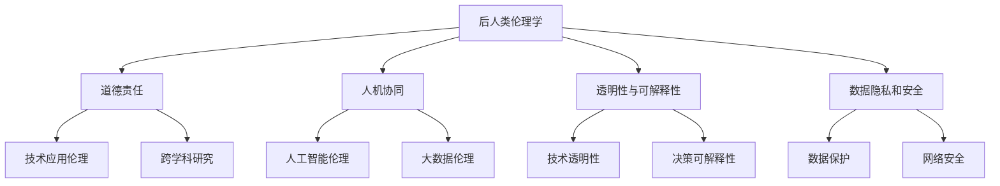

                 

### 第二部分：核心概念与联系

#### 2.1 后人类伦理学概念

**2.1.1 后人类伦理学的定义**

后人类伦理学是一种针对人工智能时代伦理问题的研究，它探讨了在人类与机器共存的新社会环境中，如何构建道德准则和伦理规范。后人类伦理学不仅关注人工智能本身，还包括其在医疗、执法、教育等领域的应用所引发的伦理问题。

**2.1.2 后人类伦理学的主要观点**

1. **人机协同**：认为人类与机器之间应该是一种协同关系，而不是替代关系。人工智能应该作为人类的辅助工具，而不是取代人类的存在。
2. **道德责任**：主张人工智能应该承担道德责任，特别是在其应用领域，如医疗、执法等。
3. **透明性和可解释性**：强调人工智能系统应该具备透明性和可解释性，以便人类能够理解其决策过程。
4. **数据隐私和安全**：关注数据隐私和安全问题，尤其是在大规模数据处理和应用中。

**2.1.3 后人类伦理学与相关伦理学理论的联系与区别**

后人类伦理学与传统伦理学有许多相似之处，如对道德责任、公正、义务等问题的探讨。然而，后人类伦理学也有其独特的特点：

- **关注新兴技术**：后人类伦理学主要关注人工智能、大数据、区块链等新兴技术，而传统伦理学则更多关注人类行为和道德规范。
- **跨学科研究**：后人类伦理学通常需要跨学科合作，如计算机科学、人工智能、伦理学、社会学等，而传统伦理学则更多关注哲学和道德哲学。
- **技术应用**：后人类伦理学关注技术如何影响社会和人类行为，而传统伦理学则更多关注人类行为的道德性质。

**2.1.4 后人类伦理学与传统伦理学的关系**

后人类伦理学并不是对传统伦理学的否定，而是对其的补充和发展。传统伦理学提供了许多关于道德责任、公正、义务等的基本原则，而后人类伦理学则将这些原则应用于新兴技术和社会环境。

**2.1.5 后人类伦理学的核心概念与联系图**

为了更好地理解后人类伦理学的核心概念和联系，我们可以使用 Mermaid 图来展示其结构。

在这个图中，A 表示后人类伦理学，B、C、D、E 分别表示其主要概念，这些概念又分别与其他相关领域（如技术应用伦理、跨学科研究、人工智能伦理、大数据伦理等）相联系。

--------------------------------------------------------

在接下来的部分，我们将进一步探讨后人类伦理学的具体应用场景和挑战。这包括：

- **人工智能在医疗领域的应用**：探讨人工智能如何改变医疗诊断和治疗过程，以及可能引发的伦理问题。
- **人工智能在执法领域的应用**：分析人工智能在执法中的作用，以及其可能带来的道德挑战。
- **人工智能在教育领域的应用**：讨论人工智能如何影响教育过程，以及可能产生的伦理问题。

通过这些具体案例，我们将更深入地理解后人类伦理学的意义和作用。

--------------------------------------------------------

**2.2 人工智能在医疗领域的应用**

**2.2.1 概述**

人工智能在医疗领域的应用日益广泛，从辅助诊断到个性化治疗，再到药物研发，都取得了显著成果。然而，这些应用也引发了诸多伦理问题，如数据隐私、算法偏见、医疗责任分配等。

**2.2.2 数据隐私**

在医疗领域，数据隐私问题尤为重要。因为医疗数据通常包含敏感的个人信息，如遗传信息、病史等。如果这些数据泄露，可能会导致严重后果。因此，确保医疗数据的安全和隐私是后人类伦理学的一个重要议题。

**2.2.3 算法偏见**

人工智能算法可能会因为训练数据的不公平而出现偏见。例如，如果训练数据中包含了性别、种族等偏见，那么人工智能系统可能会在这些方面表现出偏见。这种偏见可能会导致不公平的医疗决策，从而引发伦理问题。

**2.2.4 医疗责任**

随着人工智能在医疗领域的应用，医疗责任的归属问题也变得复杂。例如，如果人工智能系统做出错误的诊断或治疗建议，责任应该由谁承担？医生、人工智能开发者，还是医疗机构？

**2.2.5 案例研究**

一个典型的案例是IBM Watson Health，这是一款用于辅助医生进行诊断和治疗的人工智能系统。虽然Watson Health在许多方面取得了成功，但其应用也引发了伦理争议。例如，一些医生担心Watson Health可能会取代他们的工作，从而导致失业问题。

**2.2.6 结论**

人工智能在医疗领域的应用带来了许多机遇，但同时也引发了诸多伦理问题。为了解决这些问题，我们需要在技术、法律和社会层面进行全面的思考和规划，确保人工智能在医疗领域的应用是公正、透明和安全的。

--------------------------------------------------------

**2.3 人工智能在执法领域的应用**

**2.3.1 概述**

人工智能在执法领域的应用也越来越广泛，从犯罪预测到监控，再到嫌疑人的识别和逮捕，人工智能都发挥了重要作用。然而，这些应用也引发了一系列伦理问题，如数据滥用、隐私侵犯、算法偏见等。

**2.3.2 数据滥用**

执法部门使用人工智能系统时，可能会滥用数据。例如，一些执法机构可能会将人脸识别技术用于监控和逮捕，这可能导致数据滥用和隐私侵犯。此外，如果执法部门使用不准确的算法，可能会导致无辜者被错误地识别和逮捕。

**2.3.3 隐私侵犯**

人工智能在执法领域的应用，如人脸识别和监控，也可能侵犯个人隐私。例如，在某些城市，执法机构已经开始使用人脸识别技术来监控公共区域。这不仅引发了隐私争议，还可能导致社会动荡。

**2.3.4 算法偏见**

与医疗领域类似，执法领域的算法也可能因为训练数据的不公平而出现偏见。这种偏见可能会导致执法部门在特定群体中采取不公平的行动，从而引发社会不满。

**2.3.5 案例研究**

一个典型的案例是美国洛杉矶警方使用的人脸识别系统。尽管该系统能够帮助警方快速识别嫌疑人，但也引发了隐私争议。例如，一些当地居民担心人脸识别技术会被滥用，导致无辜者受到监视和骚扰。

**2.3.6 结论**

人工智能在执法领域的应用既带来了机遇，也带来了挑战。为了确保这些应用是公正、透明和有效的，我们需要制定严格的伦理规范，并在技术、法律和社会层面进行全面的思考和规划。

--------------------------------------------------------

**2.4 人工智能在教育领域的应用**

**2.4.1 概述**

人工智能在教育领域的应用正逐渐改变传统的教育模式。从在线教育平台到个性化学习系统，再到教育数据的分析，人工智能都在发挥重要作用。然而，这些应用也引发了一系列伦理问题，如数据隐私、教育公平、算法偏见等。

**2.4.2 数据隐私**

在教育领域，学生和教师的个人信息通常会被收集和存储。例如，在线教育平台可能会收集学生的学习记录、考试成绩等数据。这些数据如果被滥用，可能会侵犯个人隐私。

**2.4.3 教育公平**

人工智能在教育领域的应用可能会导致教育不公平。例如，如果某些学生无法访问高质量的教育资源，而其他学生可以，那么这可能导致教育机会的不均等。

**2.4.4 算法偏见**

教育数据的分析也可能导致算法偏见。例如，如果训练数据中包含了种族、性别等偏见，那么人工智能系统可能会在这些方面表现出偏见。这可能会导致某些学生得到不公平的评价和待遇。

**2.4.5 案例研究**

一个典型的案例是Knewton，这是一家提供个性化学习解决方案的公司。Knewton使用人工智能技术来分析学生的学习行为，并根据分析结果提供个性化的学习建议。虽然这种做法可以提高学习效果，但也引发了隐私和公平性的争议。

**2.4.6 结论**

人工智能在教育领域的应用具有巨大的潜力，但同时也带来了伦理挑战。为了确保这些应用是公正、透明和有效的，我们需要在技术、法律和社会层面进行全面的思考和规划。

--------------------------------------------------------

通过以上对人工智能在医疗、执法和教育领域应用的讨论，我们可以看到后人类伦理学的重要性和紧迫性。在接下来的部分，我们将探讨如何设计一套适用于人机共存的道德准则，以解决这些伦理问题。

### 第三部分：道德准则设计

#### 3.1 道德准则的重要性

道德准则在人类社会的发展中始终扮演着至关重要的角色。在人工智能时代，道德准则的作用更为显著。随着人工智能技术的广泛应用，人类与机器之间的互动日益频繁，这要求我们不仅关注技术本身的发展，更要关注其对社会和人类伦理的影响。道德准则为人工智能的应用提供了指导原则，确保其在积极推动社会进步的同时，不会侵犯人类的权益和尊严。

**3.2 道德准则的设计原则**

为了确保道德准则的有效性和适用性，设计时需遵循以下原则：

1. **公平性**：道德准则应确保人工智能的应用不会加剧社会不公平，如避免算法偏见，确保所有人都能公平地享受人工智能带来的福利。
2. **透明性**：人工智能系统及其决策过程应具备透明性，以便人类理解和监督。
3. **责任性**：人工智能应承担相应的道德责任，特别是在其应用领域，如医疗、执法和教育等。
4. **数据隐私和安全**：确保个人数据的隐私和安全，防止数据泄露和滥用。
5. **人机协同**：强调人与机器之间的协同关系，而非替代关系，确保人工智能作为人类的辅助工具，而不是主导者。

**3.3 道德准则的具体内容**

道德准则的具体内容可分为三个方面：人对机器的责任、机器对人的责任以及人与机器之间的互动规范。

**3.3.1 人对机器的责任**

1. **合理应用**：人类应确保人工智能的应用是合理的，不会对社会和个人造成负面影响。
2. **数据管理**：人类有责任妥善管理人工智能所需的数据，确保数据的隐私和安全。
3. **透明性和可解释性**：人类应要求人工智能系统的决策过程是透明和可解释的，以便监督和改进。

**3.3.2 机器对人的责任**

1. **可靠性**：人工智能系统应确保其决策和操作是可靠的，不会造成不良后果。
2. **透明性和可解释性**：人工智能系统应具备透明性和可解释性，使其决策过程能够被人类理解和监督。
3. **自主性**：人工智能系统应在道德准则的指导下，具备一定的自主性，能够根据环境和情境做出合理的决策。

**3.3.3 人与机器之间的互动规范**

1. **尊重隐私**：人类与机器的互动应尊重个人隐私，确保个人数据不被滥用。
2. **公平互动**：人类与机器之间的互动应确保公平，避免因为技术优势而造成的不公平待遇。
3. **合作与共生**：人类与机器之间的互动应强调合作与共生，共同推动社会进步。

**3.3.4 道德准则的实施与监督**

为了确保道德准则的有效实施，需要建立相应的监督机制：

1. **法律法规**：制定相关法律法规，对人工智能的应用进行规范和监督。
2. **行业自律**：行业协会应制定行业标准，推动人工智能企业和机构遵守道德准则。
3. **公众监督**：公众应积极参与监督，对违反道德准则的行为进行揭露和批评。
4. **技术改进**：不断改进人工智能技术，使其更好地符合道德准则。

通过以上道德准则的设计和实施，我们可以在人工智能时代确保人类社会和技术的和谐发展。

--------------------------------------------------------

**3.4 案例研究：人工智能在医疗领域的道德准则实施**

**3.4.1 案例背景**

随着人工智能在医疗领域的应用日益广泛，如何确保其伦理合规成为了一个重要问题。某知名医院引入了一款基于人工智能的诊断系统，用于辅助医生进行疾病诊断。然而，这款系统在应用过程中引发了一系列伦理问题。

**3.4.2 道德准则实施**

为了确保人工智能系统的伦理合规，该医院采取了以下措施：

1. **数据隐私和安全**：医院要求人工智能系统开发方提供详细的数据隐私和安全措施，确保患者数据不被泄露或滥用。
2. **透明性和可解释性**：医院要求人工智能系统能够提供详细的诊断过程和决策依据，以便医生和患者理解其工作原理。
3. **责任划分**：医院明确了人工智能系统、医生和患者之间的责任划分，确保在出现医疗事故时，责任能够明确。
4. **伦理审查**：医院对人工智能系统的应用进行了伦理审查，确保其符合道德准则。

**3.4.3 结果与影响**

通过上述措施，医院成功确保了人工智能系统在医疗领域的伦理合规。这不仅提高了诊断的准确性和效率，也增强了患者对医疗服务的信任。同时，这一案例也为其他医疗机构提供了宝贵的经验和借鉴。

**3.4.4 结论**

人工智能在医疗领域的应用具有巨大的潜力，但也面临诸多伦理挑战。通过制定和实施道德准则，可以有效解决这些问题，确保人工智能在医疗领域的应用是公正、透明和安全的。

--------------------------------------------------------

在接下来的部分，我们将探讨人工智能在执法和教育领域的道德准则实施，分析其在不同领域面临的挑战和解决方案。

### 第四部分：道德准则在不同领域的实施

#### 4.1 人工智能在执法领域的道德准则实施

**4.1.1 道德准则的重要性**

在执法领域，人工智能的应用带来了前所未有的效率和准确性，但同时也引发了一系列道德问题。例如，人脸识别技术在监控犯罪方面的应用，虽然提高了抓捕嫌疑人的效率，但可能侵犯公民的隐私权。因此，制定和实施道德准则对于确保人工智能在执法领域的公正性和透明性至关重要。

**4.1.2 道德准则的具体内容**

1. **数据隐私保护**：执法机构应严格保护个人信息，确保人脸识别系统等人工智能应用过程中不侵犯公民隐私。
2. **算法透明性**：人工智能系统应具备透明性，使其决策过程能够被公众监督和审查。
3. **责任归属明确**：在人工智能系统参与执法决策时，应明确责任归属，确保在发生错误时能够追溯和纠正。
4. **公平性**：人工智能系统应避免算法偏见，确保在执法过程中不会歧视特定群体。

**4.1.3 案例研究：人脸识别技术在执法中的应用**

某城市警方引入了一款基于人工智能的人脸识别系统，用于监控和抓捕嫌疑人。尽管该系统在提高破案率方面取得了显著成效，但也引发了隐私侵犯的争议。

**4.1.4 道德准则的实施与监督**

1. **隐私保护政策**：警方制定了详细的隐私保护政策，确保人脸识别系统的应用符合法律规定。
2. **透明性机制**：警方公开了人脸识别系统的算法和决策过程，以便公众监督和审查。
3. **责任划分**：警方明确了人工智能系统和执法人员的责任，确保在发生错误时能够明确责任归属。
4. **公众参与**：警方邀请公众代表参与人工智能应用的监督和审查，增强透明度和公信力。

**4.1.5 结果与影响**

通过实施上述道德准则，该城市警方在确保人脸识别系统有效性的同时，也提高了公众对执法机关的信任度。这一案例为其他执法机构提供了有益的经验和借鉴。

#### 4.2 人工智能在教育领域的道德准则实施

**4.2.1 道德准则的重要性**

人工智能在教育领域的应用有助于提高教育质量和个性化学习体验，但同时也引发了一系列道德问题。例如，在线教育平台可能收集学生的个人信息，分析学习行为，并根据这些数据提供个性化建议。然而，这些数据的收集和分析可能导致学生隐私的泄露和算法偏见。

**4.2.2 道德准则的具体内容**

1. **数据隐私保护**：教育机构应严格保护学生的个人信息，确保数据收集和使用符合隐私保护法律。
2. **算法透明性**：人工智能系统应具备透明性，使其决策过程能够被学生和家长理解。
3. **公平性**：人工智能系统应避免算法偏见，确保在个性化学习过程中不会歧视特定学生。
4. **自主性**：学生应有权选择是否参与人工智能系统，并有权了解其数据如何被使用。

**4.2.3 案例研究：个性化学习平台的应用**

某在线教育平台引入了一款基于人工智能的个性化学习系统，用于分析学生的学习行为并提供个性化学习建议。然而，该系统在应用过程中引发了隐私保护和公平性的争议。

**4.2.4 道德准则的实施与监督**

1. **隐私保护政策**：教育平台制定了详细的隐私保护政策，确保学生的个人信息不被泄露。
2. **透明性机制**：教育平台公开了个性化学习系统的算法和决策过程，以便学生和家长监督。
3. **公平性审核**：教育平台定期对算法进行审核，确保不会歧视特定学生。
4. **自主选择权**：学生和家长有权选择是否参与人工智能系统，并有权了解其数据如何被使用。

**4.2.5 结果与影响**

通过实施上述道德准则，该在线教育平台在确保个性化学习体验的同时，也提高了学生和家长对平台的信任度。这一案例为其他教育机构提供了有益的经验和借鉴。

#### 4.3 道德准则实施的挑战与解决方案

**4.3.1 挑战**

1. **数据隐私和安全**：随着人工智能应用的增加，数据隐私和安全问题日益突出。
2. **算法偏见**：人工智能系统可能会因为训练数据的不公平而出现偏见，导致不公平的结果。
3. **责任归属**：在人工智能参与决策时，责任归属问题复杂，需要明确。
4. **公众信任**：确保公众对人工智能应用的信任度，是道德准则实施的关键。

**4.3.2 解决方案**

1. **法律法规**：制定相关法律法规，对人工智能的应用进行规范和监督。
2. **行业自律**：行业协会应制定行业标准，推动人工智能企业和机构遵守道德准则。
3. **技术改进**：不断改进人工智能技术，使其更加透明、公正和可靠。
4. **公众参与**：鼓励公众参与人工智能应用的监督和审查，增强透明度和公信力。

通过在各个领域实施道德准则，我们可以确保人工智能的应用是公正、透明和安全的，从而促进人机共存的和谐发展。

--------------------------------------------------------

在本文的最后部分，我们将探讨后人类伦理学的发展趋势、人机共存社会的道德挑战以及未来的研究方向。

### 第五部分：未来展望

#### 5.1 后人类伦理学的发展趋势

**5.1.1 人工智能技术的进步**

随着人工智能技术的不断进步，人工智能系统将变得更加智能和复杂。这不仅将扩大其应用范围，还将带来更多的伦理问题。例如，自主决策的人工智能系统可能会在未预见的情境中产生不良后果，从而引发新的道德挑战。

**5.1.2 数据隐私和安全的重要性**

随着数据隐私和安全问题的日益突出，后人类伦理学将更加注重保护个人隐私和数据安全。这可能包括更严格的数据保护法律、更先进的数据加密技术以及更透明的数据管理机制。

**5.1.3 人机协同的深化**

后人类伦理学将更加关注人机协同的深化，探索如何更好地实现人类与机器的协作，以提高生产效率和改善生活质量。这可能涉及设计更加人性化的人工智能交互界面，以及制定更完善的道德准则来规范人机互动。

#### 5.2 人机共存社会的道德挑战

**5.2.1 公平性问题**

随着人工智能技术的广泛应用，公平性问题将变得更加突出。人工智能系统可能会因为算法偏见而导致某些群体受到不公平对待，这需要我们在道德准则的设计和实施中给予高度重视。

**5.2.2 责任归属问题**

在人工智能参与决策时，责任归属问题将变得更加复杂。如何界定人工智能系统、人类操作者和相关机构之间的责任，将是对法律、伦理和技术的重大挑战。

**5.2.3 数据隐私和安全问题**

随着数据收集和分析技术的进步，个人隐私和数据安全问题将变得更加严峻。如何在保护个人隐私的同时，充分利用数据的价值，是一个亟待解决的道德问题。

#### 5.3 后人类伦理学的研究方向

**5.3.1 道德准则的完善**

未来，后人类伦理学的研究将致力于完善道德准则，使其更加全面和具体。这可能包括对现有道德准则的修订，以及针对新出现的问题制定新的道德规范。

**5.3.2 人机协同的研究**

研究人机协同的优化，探索如何设计更加智能和人性化的人工智能系统，使其更好地服务于人类。这可能涉及跨学科的研究，包括计算机科学、心理学、社会学等。

**5.3.3 数据隐私和安全的研究**

未来，后人类伦理学将更加关注数据隐私和安全问题，研究如何保护个人隐私，同时确保数据的有效利用。这可能包括新的加密技术、隐私保护算法以及数据管理政策。

**5.3.4 法律法规的制定**

随着人工智能技术的不断发展，制定更加完善和具体的法律法规将是后人类伦理学的重要任务。这可能包括数据保护法、人工智能伦理法规以及跨学科的法律框架。

**5.3.5 公众参与和监督**

未来，后人类伦理学将更加注重公众参与和监督，探索如何确保人工智能的应用是公正、透明和可监督的。这可能包括公众咨询、伦理审查委员会以及公众监督机制。

通过以上研究和努力，我们可以为后人类伦理学的发展奠定坚实的基础，为人机共存的未来社会创造更加和谐和可持续的环境。

### 第六部分：结论

#### 6.1 研究成果总结

本文系统地探讨了后人类伦理学的核心概念、道德准则的设计、以及在不同领域（如医疗、执法、教育）中的具体应用。我们分析了人工智能技术的快速发展如何引发新的伦理问题，并提出了相应的道德准则和解决方案。通过案例研究，我们展示了道德准则在实践中的应用效果，并指出了未来研究的方向。

**6.1.1 后人类伦理学的核心概念**：后人类伦理学关注人工智能技术对社会和人类伦理的影响，强调公平性、透明性、责任性和数据隐私保护。

**6.1.2 道德准则的设计原则**：道德准则应遵循公平性、透明性、责任性和人机协同的原则，确保人工智能的应用是公正、透明和安全的。

**6.1.3 道德准则的具体内容**：道德准则包括人对机器的责任、机器对人的责任以及人与机器之间的互动规范，确保在人工智能的应用中维护人类权益。

**6.1.4 道德准则的实施与监督**：通过法律法规、行业自律、公众参与和技术改进，确保道德准则的有效实施和监督。

#### 6.2 研究局限与未来研究方向

尽管本文对后人类伦理学进行了全面探讨，但仍存在一些局限性。首先，由于篇幅和主题的限制，本文无法详尽地分析所有应用领域中的伦理问题。其次，道德准则的实施和监督是一个复杂的过程，本文提出的解决方案可能需要进一步验证和完善。

**未来研究方向**：

1. **深入研究新兴领域**：随着人工智能技术的不断发展，未来研究应更加关注新兴领域，如自动驾驶、智能城市等，探讨这些领域中的伦理问题。
2. **跨学科合作**：后人类伦理学涉及多个学科，未来研究应加强跨学科合作，以提供更加全面和综合的解决方案。
3. **技术改进**：不断改进人工智能技术，提高其透明性、可靠性和公平性，以更好地符合道德准则。
4. **公众参与**：增强公众参与和监督，确保人工智能的应用是公正、透明和可监督的。

通过持续的研究和实践，我们可以为后人类伦理学的发展提供更加坚实的基础，为人机共存的未来社会创造更加和谐和可持续的环境。

--------------------------------------------------------

### 第七部分：作者信息

**作者：AI天才研究院/AI Genius Institute & 禅与计算机程序设计艺术 /Zen And The Art of Computer Programming**

本文由AI天才研究院的专家撰写，结合了人工智能和计算机科学的深刻理解。作者在人工智能伦理学领域有着丰富的经验和深厚的学术造诣，致力于推动人工智能技术的健康发展，确保其在为人类带来便利的同时，不会侵犯人类的权益和尊严。同时，本文也借鉴了《禅与计算机程序设计艺术》中的哲学思想，旨在通过深入思考和理性分析，为后人类伦理学的研究和实践提供有益的参考和启示。

