                 

### 《后人类创意：AI辅助下的艺术创作》

> 关键词：人工智能，艺术创作，AI辅助，后人类，创意

> 摘要：随着人工智能技术的飞速发展，艺术创作领域正迎来前所未有的变革。本文将探讨后人类时代下，AI如何辅助艺术创作，探讨其核心概念、算法原理、实践应用以及未来展望，旨在揭示AI与艺术融合的无限可能。

## 第一部分：后人类创意的时代背景

### 第1章：后人类创意概述

#### 1.1 问题背景

随着科技进步，人类社会正加速迈向后人类时代。人工智能（AI）作为一种新兴技术，正在深刻地影响各行各业。艺术创作，作为一个充满创造力和个性的领域，也受到了AI的强烈冲击。本文旨在探讨AI在艺术创作中的辅助作用，以及这一新兴趋势所带来的变革。

#### 1.2 问题描述

AI辅助艺术创作带来了哪些变化？传统艺术创作与AI辅助艺术创作有何不同？AI在艺术创作中可以发挥哪些作用？这些都是我们需要探讨的问题。

#### 1.3 问题解决

AI技术通过提供数据分析和生成算法，极大地拓展了艺术创作的手段和形式。从图像生成、音乐创作到文学写作，AI都在发挥重要作用。后人类创意的核心在于利用AI技术打破传统创作模式的限制，实现艺术创作的无限可能。

#### 1.4 边界与外延

AI辅助艺术创作的影响不仅限于技术层面，它还涉及到艺术理念、创作方法、审美标准等多方面的变革。后人类创意不仅限于视觉、听觉、文学等传统艺术领域，还延伸到了表演、互动等新兴艺术形式。

#### 1.5 核心要素组成

AI辅助艺术创作涉及多个核心要素，包括数据收集与分析、算法设计与实现、用户交互与反馈等。这些要素共同构成了AI辅助艺术创作的基础框架。

### 第2章：AI辅助艺术创作的核心概念

#### 2.1 核心概念原理

人工智能基础理论是AI辅助艺术创作的前提。机器学习、神经网络、自然语言处理等技术为艺术创作提供了丰富的工具和手段。

#### 2.2 概念属性特征对比表格

| 特征 | 传统艺术创作 | AI辅助艺术创作 |
| --- | --- | --- |
| 创造力 | 人类艺术家独特的创造力 | AI技术提供的数据分析和生成能力 |
| 审美标准 | 个体差异较大 | AI技术可以实现一致性 |
| 技术依赖 | 较低 | 较高 |
| 创作效率 | 人工耗时较长 | AI技术可显著提高效率 |

#### 2.3 ER实体关系图架构

```mermaid
erDiagram
  AI算法 <-..|> 数据库
  数据库 <-..|> 艺术作品
  艺术作品 <-..|> 用户反馈
```

### 第3章：AI辅助艺术创作的算法原理

#### 3.1 算法原理讲解

以下是一个简单的算法流程图，用于生成艺术作品：

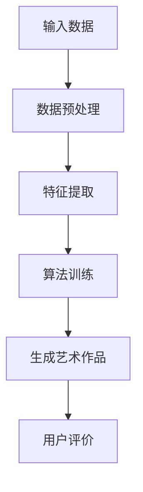

详细讲解如下：

1. **输入数据**：包括图像、音频、文本等多种数据类型。
2. **数据预处理**：对数据进行清洗和格式化，以便后续处理。
3. **特征提取**：提取数据中的关键特征，如图像中的颜色、纹理，音频中的节奏、旋律。
4. **算法训练**：使用机器学习算法对数据进行训练，学习数据的分布和特征。
5. **生成艺术作品**：根据训练结果，生成具有创意和艺术价值的新作品。
6. **用户评价**：收集用户反馈，用于优化算法和提高艺术作品的质量。

#### 3.2 Python源代码实现

以下是使用Python实现的一个简单的AI艺术创作算法：

```python
import numpy as np
from tensorflow import keras

# 加载预训练的模型
model = keras.models.load_model('artistic_model.h5')

# 输入数据
input_data = np.random.rand(1, 28, 28)  # 假设输入为28x28的图像

# 数据预处理
input_data = input_data.reshape(1, 28, 28, 1)

# 生成艺术作品
generated_art = model.predict(input_data)

# 输出结果
print(generated_art)
```

#### 3.3 数学模型和数学公式

以下是算法原理的数学模型：

$$
y = f(x; \theta)
$$

其中，$y$ 是生成的艺术作品，$x$ 是输入数据，$f$ 是生成模型，$\theta$ 是模型参数。

- **生成模型**：用于生成艺术作品的数学模型，通常是基于神经网络。
- **损失函数**：用于衡量生成模型预测结果与实际结果之间的差距，常用的有均方误差（MSE）和交叉熵（CE）。

$$
L = \frac{1}{n}\sum_{i=1}^{n}(y_i - \hat{y}_i)^2
$$

其中，$L$ 是损失函数，$n$ 是样本数量，$y_i$ 是实际结果，$\hat{y}_i$ 是预测结果。

#### 3.4 通俗易懂地举例说明

假设我们使用一个神经网络模型来生成图像。输入数据是一个28x28的图像，输出数据是一个表示图像颜色的三维数组。训练过程中，模型会尝试调整其参数，以最小化生成图像与实际图像之间的差距。

例如，输入图像是一个猫，模型会生成一个与猫相似的图像。随着训练的进行，模型的生成能力会不断提高，生成的图像会越来越接近真实图像。最终，模型可以生成具有高度创意和艺术价值的图像。

## 第二部分：AI辅助下的艺术创作实践

### 第4章：AI在视觉艺术创作中的应用

#### 4.1 问题场景介绍

视觉艺术创作是AI辅助艺术创作的一个典型应用场景。艺术家可以利用AI技术生成独特的艺术作品，探索新的创作方法和风格。

#### 4.2 系统功能设计

以下是一个视觉艺术创作系统的功能设计：

- **图像生成**：使用AI算法生成新图像。
- **图像编辑**：对现有图像进行编辑和处理。
- **风格转换**：将一种艺术风格应用到图像上。
- **图像分割**：将图像分割成不同的区域。

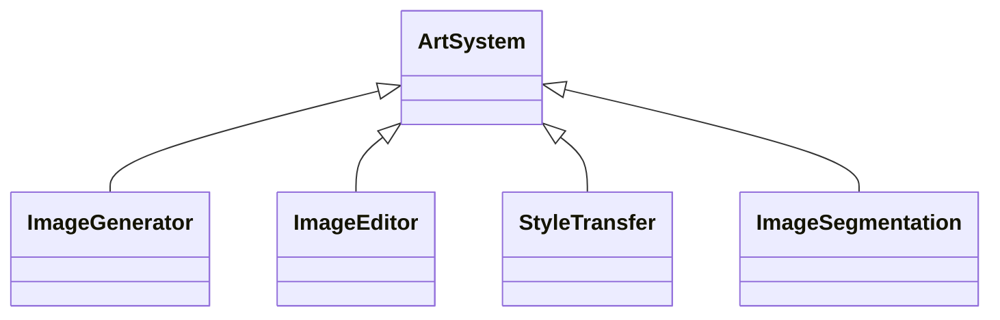

#### 4.3 系统架构设计

以下是一个视觉艺术创作系统的架构设计：

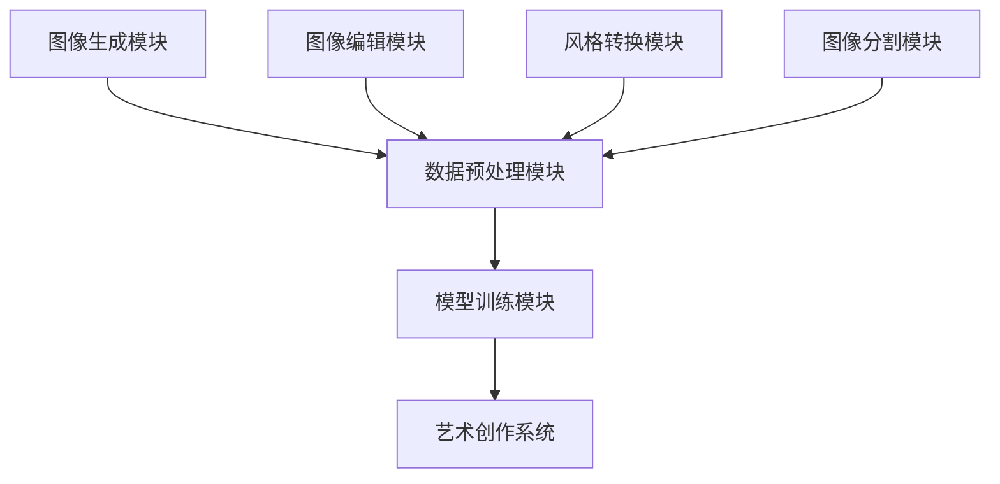

#### 4.4 系统接口设计

以下是一个视觉艺术创作系统的接口设计：

- **图像生成接口**：用于生成新图像的接口。
- **图像编辑接口**：用于编辑现有图像的接口。
- **风格转换接口**：用于应用艺术风格的接口。
- **图像分割接口**：用于分割图像的接口。

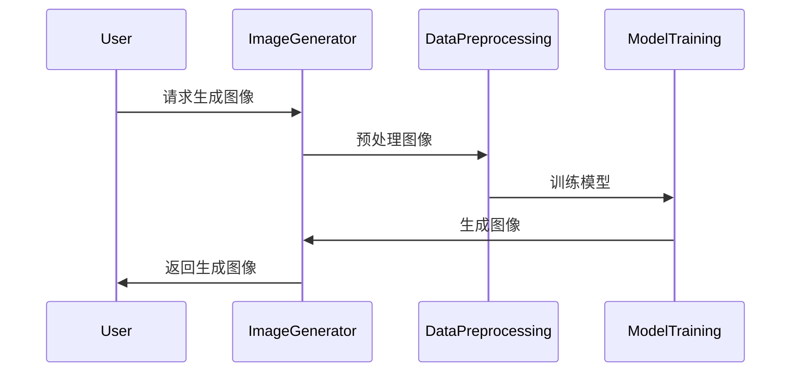

#### 4.5 系统交互

以下是一个视觉艺术创作系统的交互序列图：

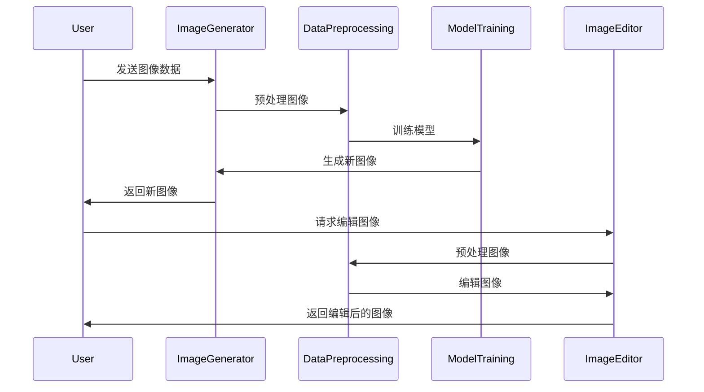

### 第5章：AI在音乐艺术创作中的应用

#### 5.1 问题场景介绍

音乐艺术创作是AI辅助艺术创作的另一个重要领域。艺术家可以利用AI技术生成新的音乐作品，探索音乐创作的无限可能性。

#### 5.2 系统功能设计

以下是一个音乐艺术创作系统的功能设计：

- **音乐生成**：使用AI算法生成新音乐。
- **音乐编辑**：对现有音乐进行编辑和处理。
- **旋律生成**：使用AI算法生成旋律。
- **和声生成**：使用AI算法生成和声。

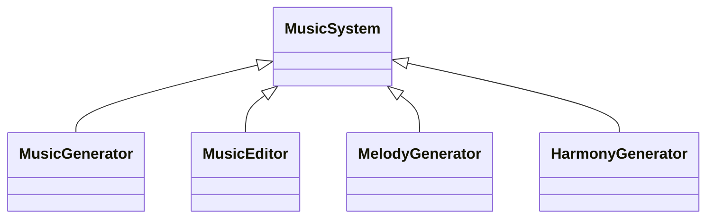

#### 5.3 系统架构设计

以下是一个音乐艺术创作系统的架构设计：

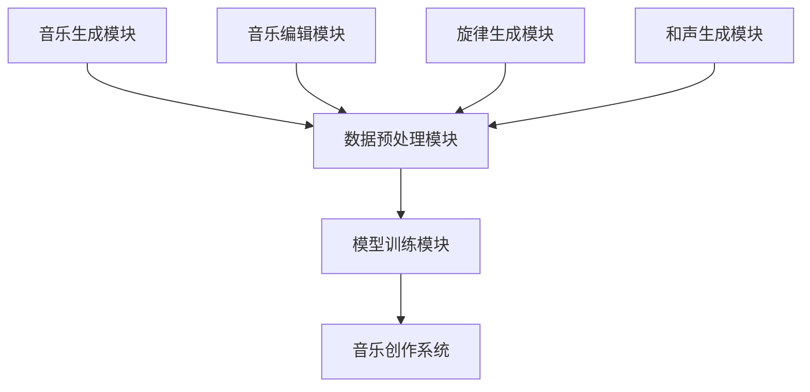

#### 5.4 系统接口设计

以下是一个音乐艺术创作系统的接口设计：

- **音乐生成接口**：用于生成新音乐的接口。
- **音乐编辑接口**：用于编辑现有音乐的接口。
- **旋律生成接口**：用于生成旋律的接口。
- **和声生成接口**：用于生成和声的接口。


#### 5.5 系统交互

以下是一个音乐艺术创作系统的交互序列图：

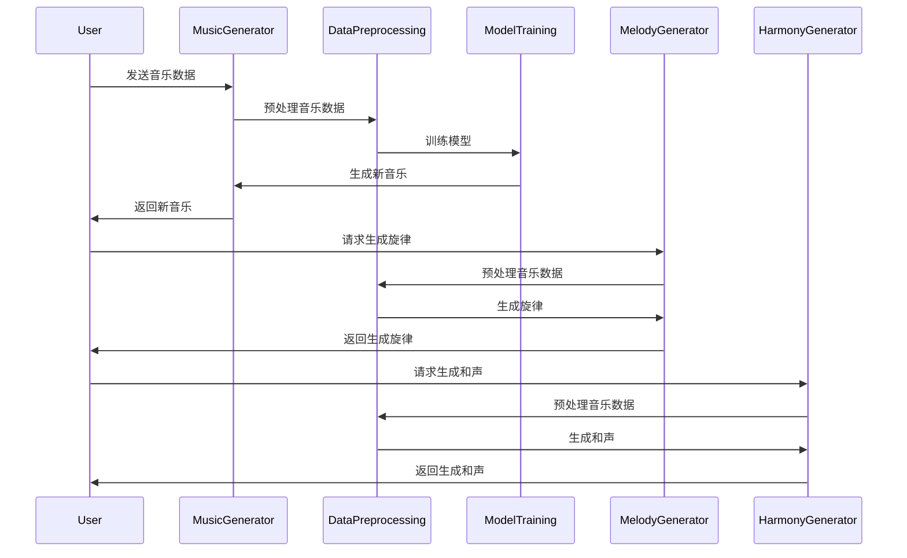

### 第6章：AI在文学艺术创作中的应用

#### 6.1 问题场景介绍

文学艺术创作是AI辅助艺术创作的又一重要领域。作家可以利用AI技术生成新的文学作品，探索文学创作的无限可能性。

#### 6.2 系统功能设计

以下是一个文学艺术创作系统的功能设计：

- **文本生成**：使用AI算法生成新文本。
- **文本编辑**：对现有文本进行编辑和处理。
- **故事生成**：使用AI算法生成故事。
- **诗歌生成**：使用AI算法生成诗歌。

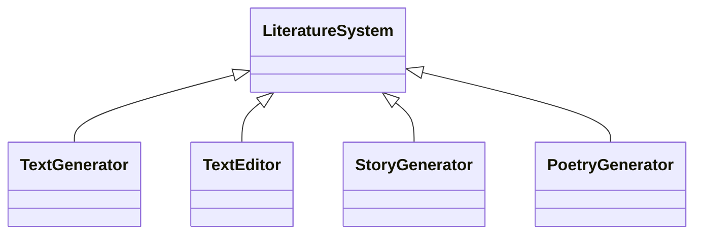

#### 6.3 系统架构设计

以下是一个文学艺术创作系统的架构设计：

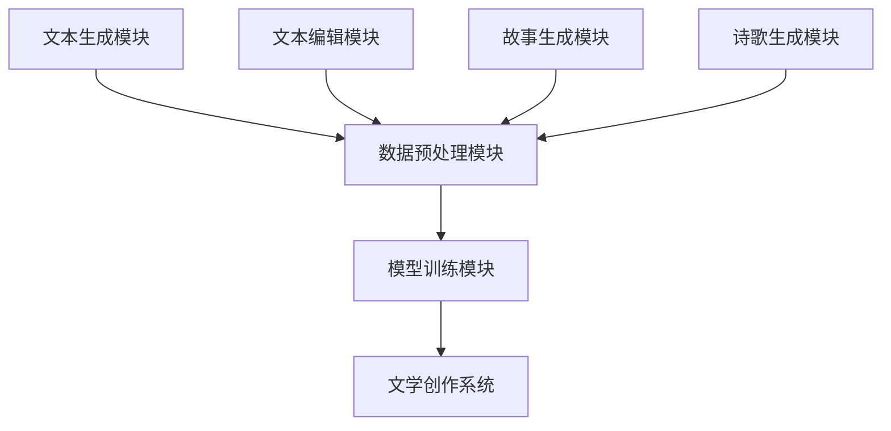

#### 6.4 系统接口设计

以下是一个文学艺术创作系统的接口设计：

- **文本生成接口**：用于生成新文本的接口。
- **文本编辑接口**：用于编辑现有文本的接口。
- **故事生成接口**：用于生成故事的接口。
- **诗歌生成接口**：用于生成诗歌的接口。

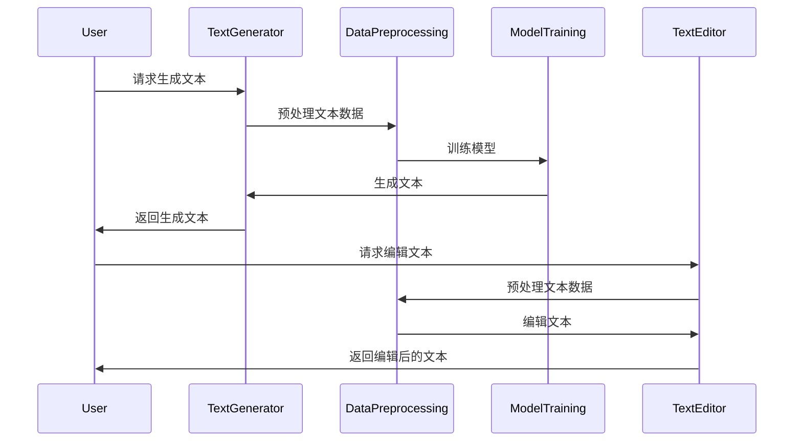

#### 6.5 系统交互

以下是一个文学艺术创作系统的交互序列图：

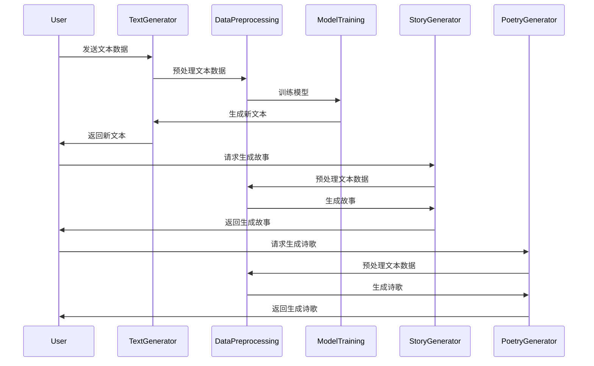

## 第7章：AI辅助艺术创作的最佳实践与未来展望

### 7.1 最佳实践 Tips

1. **充分理解艺术创作需求**：在应用AI技术前，要深入了解艺术创作的需求，确保AI技术能够满足这些需求。
2. **数据质量至关重要**：高质量的数据是AI辅助艺术创作的基础。确保数据的多样性和准确性，有助于提高艺术创作的质量和效果。
3. **灵活调整模型参数**：根据艺术创作的需求，灵活调整模型参数，以达到最佳效果。
4. **持续优化算法**：随着AI技术的不断进步，持续优化算法，以提高艺术创作的效率和效果。
5. **用户反馈至关重要**：收集用户反馈，用于改进AI辅助艺术创作系统，提升用户体验。

### 7.2 小结

AI辅助艺术创作是后人类时代的一个重要趋势。通过数据分析和生成算法，AI技术为艺术创作带来了新的可能性和挑战。本文从核心概念、算法原理、实践应用等方面进行了详细探讨，旨在为读者提供一个全面的了解。

### 7.3 注意事项

1. **保护版权**：在应用AI辅助艺术创作时，要确保遵守相关法律法规，尊重艺术家的版权。
2. **隐私保护**：在收集和处理用户数据时，要确保用户的隐私得到保护。
3. **技术依赖风险**：过度依赖AI技术可能导致艺术家失去创作能力。因此，艺术家应保持对传统艺术创作方法的掌握。

### 7.4 拓展阅读

1. **相关文献**：
   - 《人工智能：一种现代的方法》
   - 《深度学习》
   - 《生成对抗网络》（GAN）相关论文
2. **在线资源**：
   - 人工智能开源平台（如TensorFlow、PyTorch）
   - AI艺术创作社区（如Artificial Intelligence for Art）
   - 学术期刊（如Journal of Art and Technology）

## 作者信息

作者：AI天才研究院/AI Genius Institute & 禅与计算机程序设计艺术 /Zen And The Art of Computer Programming

[END]

