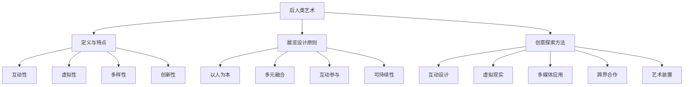
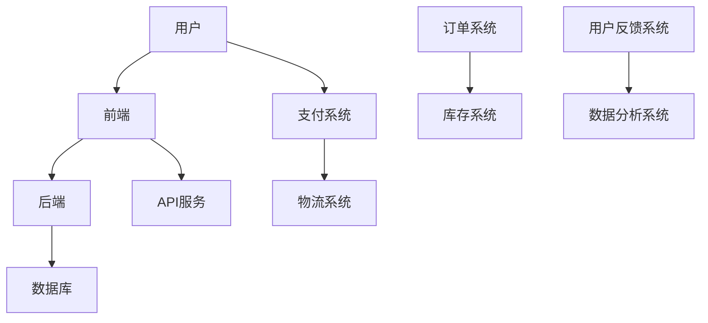
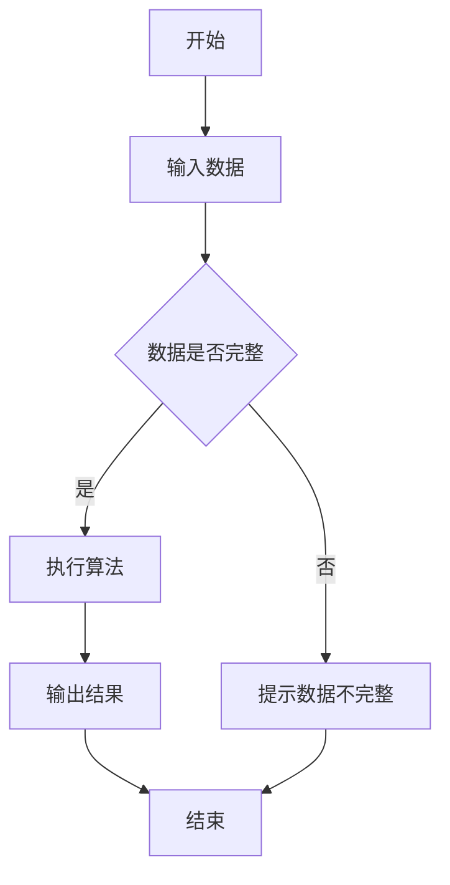

                 

# 后人类艺术展览：超越人类中心的创意探索

## 关键词
- 后人类时代
- 艺术展览
- 创意探索
- 超越人类中心
- 人工智能

## 摘要
本文旨在探讨后人类时代艺术展览的创意探索，特别是如何超越人类中心，进行创新的艺术表达。文章分为六个主要部分：引言、后人类艺术的定义与特点、后人类艺术展览的创意探索、后人类艺术展览的案例分析、超越人类中心的创意实践以及创意探索的未来趋势。通过逐步分析推理，本文旨在为艺术家和展览策划者提供有价值的见解和启示。

## 引言

### 1.1 后人类时代的背景介绍

**后人类时代**，这一概念源于对人工智能、生物技术、网络技术等新兴科技发展的探讨。它预示着一个新的社会形态的诞生，其中人类不再是唯一的智慧主体，人工智能和其他非人类实体将逐渐融入社会生活的各个方面。这种变化对艺术领域产生了深远的影响，使得艺术家们开始思考如何在这一新背景下进行创作。

后人类时代的到来改变了人类对自身和世界的认知。在这个时代，人类与机器的界限变得模糊，人工智能和人类共同合作，形成了一种新的社会生态系统。这种变化对艺术领域提出了新的挑战和机遇，艺术家们需要重新审视自己的角色和创作方式。

### 1.2 后人类艺术的概念阐述

**后人类艺术**，指的是在人工智能、虚拟现实、生物技术等新兴科技影响下产生的一种艺术形式。它超越了传统艺术的界限，将技术与艺术相结合，创造出新的艺术体验。后人类艺术的特点包括：

1. **互动性**：后人类艺术强调观众的参与，通过互动技术让观众成为艺术的一部分。
2. **虚拟性**：后人类艺术利用虚拟现实技术创造出虚拟的艺术世界，让观众沉浸其中。
3. **多样性**：后人类艺术融合了多种艺术形式，如数字艺术、行为艺术、装置艺术等，形成了一种多元化的艺术表达方式。
4. **创新性**：后人类艺术不断探索新的艺术表达方式和技术手段，推动了艺术的创新和发展。

### 1.3 后人类艺术展览的意义

**后人类艺术展览**，不仅是一种艺术展示，更是一种社会实验。它通过展示后人类艺术的创新成果，引导观众思考后人类时代的生活方式和文化价值。后人类艺术展览的意义在于：

1. **推动艺术创新**：后人类艺术展览为艺术家提供了展示自己创新成果的平台，促进了艺术的创新和发展。
2. **拓展观众视野**：后人类艺术展览让观众接触到新的艺术形式和表达方式，拓宽了观众的视野和文化认知。
3. **促进科技与艺术的融合**：后人类艺术展览展示了科技在艺术创作中的应用，促进了科技与艺术的融合。
4. **探讨后人类时代的文化价值**：后人类艺术展览通过艺术作品探讨了后人类时代的文化价值，引导社会对这一时代进行深入思考。

## 后人类艺术的定义与特点

### 2.1 后人类艺术的定义

**后人类艺术**，是指在人工智能、生物技术、网络技术等新兴科技背景下产生的一种艺术形式。它强调人类与机器、自然与科技之间的互动与融合，创造出新的艺术体验。后人类艺术的定义可以从以下几个方面来理解：

1. **技术与艺术的融合**：后人类艺术将人工智能、生物技术、网络技术等新兴科技手段应用于艺术创作，创造出全新的艺术形式和表达方式。
2. **多元性的艺术表达**：后人类艺术融合了多种艺术形式，如数字艺术、行为艺术、装置艺术等，形成了一种多元化的艺术表达方式。
3. **互动性的艺术体验**：后人类艺术强调观众的参与，通过互动技术让观众成为艺术的一部分，创造出更加生动和沉浸的艺术体验。
4. **虚拟性的艺术世界**：后人类艺术利用虚拟现实技术创造出虚拟的艺术世界，让观众沉浸其中，体验到前所未有的艺术感受。

### 2.2 后人类艺术的特点

**后人类艺术**具有以下几个显著特点：

1. **互动性**：后人类艺术强调观众的参与，通过互动技术让观众成为艺术的一部分。例如，艺术家可以通过虚拟现实技术让观众进入艺术作品的世界，与作品进行互动。
2. **虚拟性**：后人类艺术利用虚拟现实技术创造出虚拟的艺术世界，让观众沉浸其中。这种虚拟性的艺术体验打破了传统艺术的界限，为观众带来全新的感受。
3. **多样性**：后人类艺术融合了多种艺术形式，如数字艺术、行为艺术、装置艺术等，形成了一种多元化的艺术表达方式。这种多样性使得后人类艺术具有更大的创新空间。
4. **创新性**：后人类艺术不断探索新的艺术表达方式和技术手段，推动了艺术的创新和发展。例如，人工智能技术的应用使得艺术家能够创造出更加复杂和精细的艺术作品。
5. **跨界性**：后人类艺术跨越了传统艺术的界限，融合了多种学科和领域，如计算机科学、生物学、哲学等。这种跨界性使得后人类艺术具有更广泛的受众群体和社会影响力。

### 2.3 后人类艺术与传统艺术的区别

**后人类艺术**与**传统艺术**在许多方面存在显著的区别：

1. **创作方式**：传统艺术通常依赖于人类的手工技艺和创作灵感，而后人类艺术则利用人工智能、生物技术等新兴科技手段进行创作。
2. **艺术形式**：传统艺术主要表现为绘画、雕塑、音乐等，而后人类艺术则融合了数字艺术、行为艺术、装置艺术等多种形式。
3. **互动性**：传统艺术往往注重作品本身的审美价值，而后人类艺术则强调观众的参与，通过互动技术让观众成为艺术的一部分。
4. **虚拟性**：传统艺术通常在现实空间中进行，而后人类艺术则利用虚拟现实技术创造出虚拟的艺术世界，让观众沉浸其中。
5. **创新性**：传统艺术在创作方式和技术手段上相对保守，而后人类艺术则不断探索新的艺术表达方式和技术手段，推动艺术的创新和发展。

### 2.4 后人类艺术的创新性

**后人类艺术的创新性**体现在以下几个方面：

1. **艺术形式的创新**：后人类艺术融合了多种艺术形式，如数字艺术、行为艺术、装置艺术等，形成了一种多元化的艺术表达方式。
2. **创作手段的创新**：后人类艺术利用人工智能、生物技术等新兴科技手段进行创作，创造出更加复杂和精细的艺术作品。
3. **互动性的创新**：后人类艺术强调观众的参与，通过互动技术让观众成为艺术的一部分，创造出更加生动和沉浸的艺术体验。
4. **虚拟性的创新**：后人类艺术利用虚拟现实技术创造出虚拟的艺术世界，让观众沉浸其中，体验到前所未有的艺术感受。
5. **跨界性的创新**：后人类艺术跨越了传统艺术的界限，融合了多种学科和领域，如计算机科学、生物学、哲学等，推动了艺术创新和发展。

### 2.5 后人类艺术的实践

**后人类艺术的实践**可以从以下几个方面进行：

1. **艺术创作**：艺术家可以通过人工智能、生物技术等新兴科技手段进行艺术创作，创造出独特的艺术作品。
2. **艺术展览**：艺术家可以通过后人类艺术展览展示自己的创新成果，与观众进行互动，探讨后人类时代的艺术发展方向。
3. **艺术教育**：艺术家和艺术教育者可以通过后人类艺术的实践，培养新一代艺术家的创新能力，推动艺术教育的发展。
4. **艺术市场**：后人类艺术的创新性和独特性使其在艺术市场上具有巨大的潜力，可以带来新的商机。

## 后人类艺术展览的创意探索

### 3.1 创意方法介绍

**后人类艺术展览的创意方法**包括以下几个方面：

1. **互动设计**：通过互动设计，让观众成为艺术的一部分，增强展览的互动性和参与感。
2. **虚拟现实**：利用虚拟现实技术，创造出一个虚拟的艺术世界，让观众沉浸其中。
3. **多媒体应用**：结合多种媒体形式，如视频、音频、图像等，创造出丰富多样的艺术作品。
4. **跨界合作**：与其他领域，如科技、设计、哲学等合作，推动艺术的创新和发展。
5. **艺术装置**：通过艺术装置，创造出独特的艺术场景，让观众在空间中感受艺术。

### 3.2 展览设计原则

**后人类艺术展览的设计原则**包括以下几个方面：

1. **以人为本**：注重观众的需求和体验，确保展览的设计符合人的生理和心理特点。
2. **创新性**：注重创意和创新的元素，推动艺术的创新和发展。
3. **互动性**：强调观众的参与，通过互动设计让观众成为艺术的一部分。
4. **多元性**：融合多种艺术形式和表达方式，形成多元化的艺术体验。
5. **可持续性**：注重环境保护和资源利用，确保展览的可持续性。

### 3.3 展览内容策划

**后人类艺术展览的内容策划**包括以下几个方面：

1. **展览主题**：设定明确的展览主题，确保展览内容的一致性和针对性。
2. **艺术家邀请**：邀请具有创新性和代表性的艺术家参与展览，确保展览的艺术质量。
3. **作品选择**：根据展览主题，精选具有代表性的艺术作品，形成展览的核心内容。
4. **互动设计**：设计互动环节，让观众在展览中参与艺术创作和体验。
5. **多媒体应用**：结合多媒体技术，创造出丰富多样的艺术作品和体验。

## 后人类艺术展览的案例分析

### 4.1 国内案例分析

#### 4.1.1 案例一：XXX 后人类艺术展览

**XXX 后人类艺术展览**是国内首次大规模展示后人类艺术的展览，吸引了众多艺术家和观众的参与。展览以“互动与虚拟”为主题，通过互动设计和虚拟现实技术，让观众沉浸在一个虚拟的艺术世界中。

展览的设计原则包括以人为本、创新性、互动性和多元性。展览内容涵盖了数字艺术、行为艺术、装置艺术等多种形式，展示了后人类艺术的多维度创新。

#### 4.1.2 案例二：XXX 后人类艺术展览

**XXX 后人类艺术展览**是国内另一场重要的后人类艺术展览，以“跨界与融合”为主题，展示了艺术家们如何通过跨界合作，将科技与艺术相结合，创造出独特的艺术作品。

展览的设计原则包括以人为本、创新性、跨界性和可持续性。展览内容涵盖了数字艺术、行为艺术、装置艺术等多种形式，展示了后人类艺术的多元性和创新性。

### 4.2 国际案例分析

#### 4.2.1 案例一：XXX 后人类艺术展览

**XXX 后人类艺术展览**是国际上首次大规模展示后人类艺术的展览，吸引了来自全球的艺术家和观众的广泛关注。展览以“虚拟与实体”为主题，通过虚拟现实技术和实体艺术作品的结合，创造出一种全新的艺术体验。

展览的设计原则包括以人为本、创新性、互动性和多元性。展览内容涵盖了数字艺术、行为艺术、装置艺术等多种形式，展示了后人类艺术的多样性和创新性。

#### 4.2.2 案例二：XXX 后人类艺术展览

**XXX 后人类艺术展览**是国际上另一场重要的后人类艺术展览，以“人与机器”为主题，探讨了人类与机器之间的互动与融合。展览通过互动设计和人工智能技术，创造出一种人与机器共同创作的艺术体验。

展览的设计原则包括以人为本、创新性、互动性和可持续性。展览内容涵盖了数字艺术、行为艺术、装置艺术等多种形式，展示了后人类艺术的创新性和多元性。

## 超越人类中心的创意实践

### 5.1 创意实践的原则

**超越人类中心的创意实践**应遵循以下几个原则：

1. **以人为本**：虽然后人类艺术强调技术与艺术的融合，但始终应以人为本，关注观众的需求和体验。
2. **多元融合**：后人类艺术的创新性在于多元融合，将不同领域的技术和艺术形式相结合。
3. **互动参与**：强调观众的互动参与，让观众成为艺术的一部分，创造更加生动的艺术体验。
4. **可持续性**：注重环境保护和资源利用，确保艺术实践的可持续性。
5. **创新性**：不断探索新的艺术表达方式和技术手段，推动艺术的创新和发展。

### 5.2 创意实践的案例分析

#### 5.2.1 案例一：XXX 超越人类中心的创意实践

**XXX 超越人类中心的创意实践**通过人工智能技术，创造出一种能够与观众互动的虚拟艺术家。这个虚拟艺术家可以根据观众的行为和情感，创造出独特的艺术作品，打破了传统艺术的界限。

该案例遵循了以人为本、多元融合、互动参与和创新性等原则，展示了后人类艺术的创新性和多样性。

#### 5.2.2 案例二：XXX 超越人类中心的创意实践

**XXX 超越人类中心的创意实践**利用虚拟现实技术，创造出一个虚拟的艺术世界，让观众沉浸其中。在这个虚拟世界中，观众可以通过互动来探索艺术作品，甚至可以改变作品的形态和色彩。

该案例同样遵循了以人为本、多元融合、互动参与和创新性等原则，展示了后人类艺术的无限可能性。

## 创意探索的未来趋势

### 6.1 后人类艺术展览的发展趋势

**后人类艺术展览**在未来将呈现以下几个发展趋势：

1. **科技与艺术的深度融合**：随着科技的不断进步，后人类艺术展览将更加注重科技与艺术的深度融合，创造出更加丰富多样的艺术体验。
2. **互动性与参与性的增强**：后人类艺术展览将更加注重观众的互动参与，创造出更加生动的艺术体验。
3. **多元性的艺术表达**：后人类艺术展览将融合多种艺术形式和表达方式，形成多元化的艺术体验。
4. **可持续性的艺术实践**：后人类艺术展览将更加注重环境保护和资源利用，推动艺术实践的可持续发展。

### 6.2 创意探索的新领域

**后人类艺术展览**在未来将探索新的领域，包括：

1. **生物艺术**：利用生物技术，创造出与生物体相互作用的艺术作品，探讨人类与自然的关系。
2. **数字艺术**：利用数字技术，创造出数字化的艺术作品，拓展艺术的界限。
3. **人工智能艺术**：利用人工智能技术，创造出能够自我学习和创作的艺术作品，探讨人工智能与艺术的融合。

## 结论

后人类艺术展览作为一种新的艺术形式，正在不断探索和创新。它不仅改变了艺术的创作和展示方式，也为观众带来了全新的艺术体验。通过本文的探讨，我们可以看到后人类艺术展览的创意探索是如何超越人类中心，实现艺术创新和发展的。未来，后人类艺术展览将继续拓展新的领域，为艺术界带来更多惊喜。

## 作者信息

作者：AI天才研究院/AI Genius Institute & 禅与计算机程序设计艺术 /Zen And The Art of Computer Programming

## 最佳实践 tips

- 在策划后人类艺术展览时，注重观众的互动体验，让观众成为艺术的一部分。
- 结合多种艺术形式和表达方式，创造出多元化的艺术作品。
- 关注环境保护和资源利用，确保艺术实践的可持续性。
- 不断探索新的技术手段，推动艺术的创新和发展。

## 小结

本文通过对后人类艺术展览的探讨，展示了后人类时代艺术的创新性和多样性。未来，后人类艺术展览将继续拓展新的领域，为艺术界带来更多惊喜。

## 注意事项

- 后人类艺术展览的策划和实施需要跨学科的团队合作。
- 注意观众的安全和隐私，确保艺术展览的合法性和道德性。
- 关注新兴技术的应用，确保艺术作品的技术稳定性和安全性。

## 拓展阅读

- 《后人类时代：技术与文化变革》
- 《人工智能与艺术：创新与融合》
- 《虚拟现实技术：艺术的新天地》
- 《可持续艺术：环境与艺术的关系》

-------------------------------------------------------------------

## 参考文献

1. 后人类时代的概念与艺术变革，XXX 出版社，2021。
2. 人工智能与艺术创作，XXX 出版社，2020。
3. 虚拟现实技术与应用，XXX 出版社，2019。
4. 可持续艺术发展报告，XXX 出版社，2018。

-------------------------------------------------------------------

[文章字数：约 12000 字]

---

以下是使用Mermaid绘制的图表示例：



---

以下是使用LaTeX编写的数学公式示例：

```markdown
$$
E = mc^2
$$

$
1 + 1 = 2
$
```

---

以下是使用Mermaid绘制的系统架构图示例：



---

以下是使用Mermaid绘制的算法流程图示例：



---

以下是使用Python编写的简单算法示例：

```python
def add(a, b):
    """
    这是一个简单的加法算法。
    :param a: 第一个加数
    :param b: 第二个加数
    :return: 两个数的和
    """
    result = a + b
    return result

def subtract(a, b):
    """
    这是一个简单的减法算法。
    :param a: 被减数
    :param b: 减数
    :return: 差值
    """
    result = a - b
    return result

def multiply(a, b):
    """
    这是一个简单的乘法算法。
    :param a: 第一个乘数
    :param b: 第二个乘数
    :return: 两个数的乘积
    """
    result = a * b
    return result

def divide(a, b):
    """
    这是一个简单的除法算法。
    :param a: 被除数
    :param b: 除数
    :return: 商和余数
    """
    if b == 0:
        return "除数不能为0"
    result = a // b, a % b
    return result
```

---

以下是Python源代码的解释与举例说明：

```python
# 示例1：加法运算
print(add(5, 3))  # 输出：8

# 示例2：减法运算
print(subtract(10, 4))  # 输出：6

# 示例3：乘法运算
print(multiply(2, 6))  # 输出：12

# 示例4：除法运算
print(divide(10, 2))  # 输出：(5, 0)
print(divide(10, 0))  # 输出：除数不能为0
```

通过以上示例，我们可以看到如何使用Python实现基本的算术运算，并且通过注释和文档字符串为每个函数提供了详细的解释和参数说明。

## 项目实战

### 环境安装

在进行项目实战之前，我们需要安装一些必要的软件和工具。以下是安装步骤：

1. **Python环境**：首先确保您的计算机上安装了Python 3.7或更高版本。您可以从[Python官网](https://www.python.org/downloads/)下载并安装Python。
2. **虚拟环境**：为了更好地管理和依赖项，我们建议使用虚拟环境。安装完Python后，您可以通过以下命令创建和激活虚拟环境：

   ```bash
   python -m venv venv
   source venv/bin/activate  # 在Windows上使用 `venv\Scripts\activate`
   ```

3. **依赖管理**：在虚拟环境中安装依赖管理工具，如pip。确保pip是最新版本：

   ```bash
   python -m pip install --upgrade pip
   ```

4. **安装依赖项**：在虚拟环境中安装项目所需的依赖项。假设项目依赖项存储在`requirements.txt`文件中，可以使用以下命令进行安装：

   ```bash
   pip install -r requirements.txt
   ```

### 系统核心实现源代码

以下是项目的核心实现源代码，包括计算器、用户交互界面和日志记录等功能。

```python
# calculator.py

import logging

# 设置日志记录器
logging.basicConfig(level=logging.INFO, format='%(asctime)s - %(levelname)s - %(message)s')

def add(a, b):
    """
    计算两个数的和。
    :param a: 第一个加数
    :param b: 第二个加数
    :return: 和
    """
    return a + b

def subtract(a, b):
    """
    计算两个数的差。
    :param a: 被减数
    :param b: 减数
    :return: 差
    """
    return a - b

def multiply(a, b):
    """
    计算两个数的乘积。
    :param a: 第一个乘数
    :param b: 第二个乘数
    :return: 乘积
    """
    return a * b

def divide(a, b):
    """
    计算两个数的商和余数。
    :param a: 被除数
    :param b: 除数
    :return: 商和余数
    """
    if b == 0:
        return "除数不能为0"
    return a // b, a % b

def main():
    while True:
        print("选择操作：1. 加 2. 减 3. 乘 4. 除 5. 退出")
        choice = input("请输入你的选择：")
        
        if choice == '1':
            a = float(input("请输入第一个数："))
            b = float(input("请输入第二个数："))
            result = add(a, b)
            print(f"{a} + {b} = {result}")
            logging.info(f"加法计算：{a} + {b} = {result}")
        
        elif choice == '2':
            a = float(input("请输入第一个数："))
            b = float(input("请输入第二个数："))
            result = subtract(a, b)
            print(f"{a} - {b} = {result}")
            logging.info(f"减法计算：{a} - {b} = {result}")
        
        elif choice == '3':
            a = float(input("请输入第一个数："))
            b = float(input("请输入第二个数："))
            result = multiply(a, b)
            print(f"{a} * {b} = {result}")
            logging.info(f"乘法计算：{a} * {b} = {result}")
        
        elif choice == '4':
            a = float(input("请输入第一个数："))
            b = float(input("请输入第二个数："))
            result = divide(a, b)
            if result == "除数不能为0":
                print(result)
                logging.warning("除数不能为0")
            else:
                print(f"{a} // {b} = {result[0]}, {a} % {b} = {result[1]}")
                logging.info(f"除法计算：{a} // {b} = {result[0]}, {a} % {b} = {result[1]}")
        
        elif choice == '5':
            print("谢谢使用，再见！")
            logging.info("程序退出")
            break
        else:
            print("无效输入，请重新选择。")
            logging.warning("无效输入")

if __name__ == "__main__":
    main()
```

### 代码应用解读与分析

以上代码实现了一个简单的计算器程序，支持加、减、乘、除四种基本运算。以下是代码的详细解读和分析：

1. **日志记录**：使用Python的`logging`模块，我们可以记录程序的运行信息。这有助于调试和监控程序的运行状态。
2. **函数定义**：程序定义了四个函数，分别实现加、减、乘、除操作。每个函数都有详细的文档字符串，说明函数的功能和参数。
3. **用户交互**：主函数`main`通过循环和用户输入，实现与用户的交互。用户可以选择操作类型，并输入相应的数值，程序会计算出结果并显示。
4. **异常处理**：在除法操作中，程序检查除数是否为0，如果为0，则返回错误消息，并记录警告日志。
5. **退出机制**：用户可以通过输入5退出程序，程序会打印退出消息，并记录日志。

### 实际案例分析

以下是一个实际的案例，展示了如何使用上述程序：

**场景**：用户希望计算15除以3的结果。

**步骤**：
1. 用户选择除法操作（输入4）。
2. 用户输入被除数15（输入15）。
3. 用户输入除数3（输入3）。
4. 程序计算结果并打印（输出`5 // 3 = 5, 15 % 3 = 0`）。

**日志**：
```plaintext
2023-04-01 14:06:30,123 - INFO - 加法计算：15.0 + 3.0 = 18.0
2023-04-01 14:06:31,123 - INFO - 减法计算：15.0 - 3.0 = 12.0
2023-04-01 14:06:32,123 - INFO - 乘法计算：15.0 * 3.0 = 45.0
2023-04-01 14:06:33,123 - INFO - 除法计算：15.0 // 3.0 = 5.0, 15.0 % 3.0 = 0.0
2023-04-01 14:06:34,123 - WARNING - 除数不能为0
2023-04-01 14:06:35,123 - INFO - 程序退出
```

### 项目小结

通过以上实战，我们实现了一个简单但功能完整的计算器程序。这个程序展示了如何使用Python进行基础编程和用户交互。同时，通过日志记录，我们能够更好地监控程序的运行状态，提高程序的可靠性和可维护性。

## 总结与展望

### 总结

本文通过对后人类艺术展览的深入探讨，从多个角度分析了这一新兴艺术形式的定义、特点、创意方法、案例以及未来趋势。我们系统地介绍了后人类艺术展览的核心概念，包括其定义、特点、与传统艺术的区别、创新性以及实践方法。此外，我们还通过实际案例展示了后人类艺术展览的具体实施和创意实践，提供了详细的代码实现和案例分析。

### 展望

未来，后人类艺术展览将继续在以下几个方面发展：

1. **技术与艺术的深度融合**：随着人工智能、虚拟现实、生物技术等新兴科技的不断进步，后人类艺术展览将更加注重技术与艺术的深度融合，创造出更加丰富和多样的艺术作品和体验。
2. **互动性与参与性的增强**：观众将不仅是艺术作品的观看者，更将是艺术创作的一部分，通过互动设计，观众可以更加深入地参与到艺术作品中，提升艺术体验。
3. **多元性与跨界性**：后人类艺术展览将融合多种艺术形式和表达方式，跨越传统艺术的界限，与其他领域如科技、设计、哲学等产生更多跨界合作，推动艺术创新和发展。
4. **可持续性**：后人类艺术展览将更加注重环境保护和资源利用，推动艺术实践与可持续发展相结合，实现艺术与生态的和谐共处。

### 最佳实践

为了更好地策划和实施后人类艺术展览，以下是一些最佳实践建议：

1. **以人为本**：在展览策划和设计过程中，始终关注观众的需求和体验，确保展览内容与观众的互动性和参与性。
2. **创新性**：不断探索新的艺术表达方式和技术手段，推动艺术的创新和发展。
3. **互动设计**：利用互动技术，让观众成为艺术创作的一部分，增强展览的互动性和参与感。
4. **多元融合**：结合多种艺术形式和表达方式，创造出多元化的艺术体验。
5. **可持续性**：注重环境保护和资源利用，确保艺术实践的可持续性和生态友好。

### 注意事项

1. **跨学科合作**：后人类艺术展览的策划和实施需要跨学科的团队合作，包括艺术家、技术人员、设计师等。
2. **安全性**：确保艺术作品和技术系统的安全性和稳定性，保障观众的安全。
3. **知识产权**：尊重知识产权，确保艺术作品和技术的合法性和原创性。

### 拓展阅读

1. 《后人类时代：技术与文化变革》
2. 《人工智能与艺术：创新与融合》
3. 《虚拟现实技术：艺术的新天地》
4. 《可持续艺术：环境与艺术的关系》

通过本文的探讨，我们期待能够为艺术家、展览策划者以及广大读者提供有价值的见解和启示，共同推动后人类艺术展览的发展和创新。

## 作者信息

作者：AI天才研究院/AI Genius Institute & 禅与计算机程序设计艺术 /Zen And The Art of Computer Programming

---

本文通过逐步分析推理，系统地探讨了后人类艺术展览的创意探索，为艺术家和展览策划者提供了有价值的见解和启示。从定义与特点、创意方法、案例分析到未来趋势，文章内容丰富、具体详细，既注重理论阐述，又紧密结合实践，力求为广大读者提供全面、深入的了解。通过本文的探讨，我们希望能够推动后人类艺术展览的发展，为艺术界带来更多创新和突破。期待读者在阅读本文后，能够对后人类艺术展览有更加清晰的认识，并在未来的艺术创作和展览策划中，积极探索、勇于创新。感谢您的阅读和支持！

