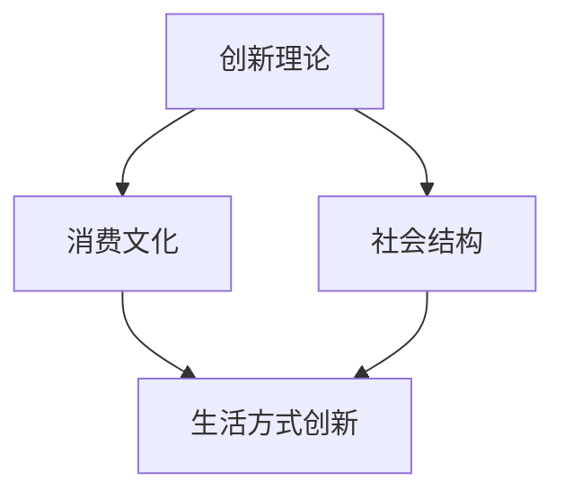
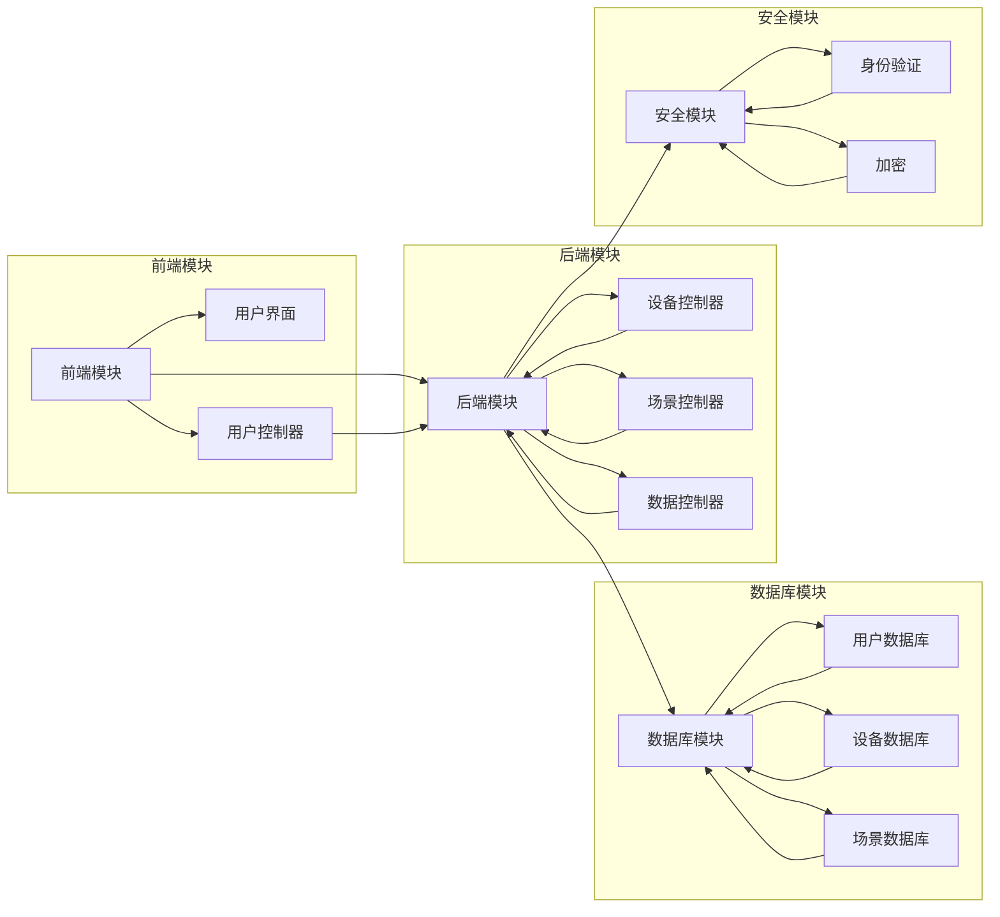
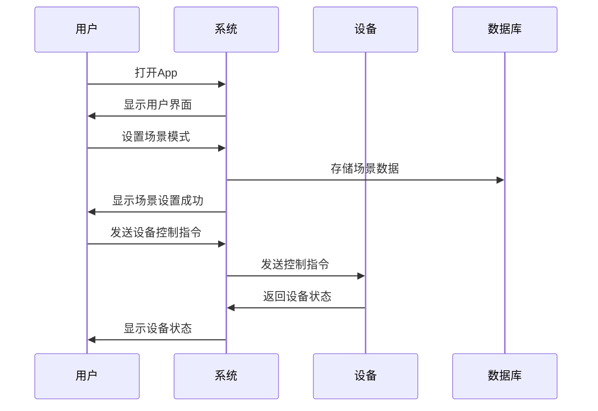

                 

### 后工业化社会的背景与特征

在人类社会的发展进程中，工业化阶段标志着人类从农业社会向工业社会的大跨越。然而，随着技术的迅猛发展和全球化进程的加速，我们正逐步进入后工业化社会。后工业化社会，也被称为信息社会或知识社会，其特征是高度依赖信息科技，以知识经济为核心，服务业和信息技术产业成为经济增长的主要动力。

#### 后工业化社会的定义与发展历程

后工业化社会并非一个固定的时期，而是一个动态的、逐渐演化的过程。它始于20世纪末，随着信息技术、互联网、人工智能等新兴技术的广泛应用，人类社会逐渐从传统的制造业驱动转向以知识和信息为驱动。这一过程中，工业生产逐渐自动化、智能化，服务业特别是知识密集型服务业蓬勃发展。

#### 后工业化社会的特征

1. **信息技术的高度普及**：信息技术的广泛应用改变了人们的工作和生活方式，数据成为新的生产要素。
2. **服务业的崛起**：服务业，尤其是知识密集型服务业，成为经济增长的主要动力。
3. **知识经济的兴起**：知识经济以知识产权为核心，以创新和创造力为驱动力。
4. **全球化的深化**：全球化进一步加剧了资源的优化配置，跨国界的知识流动、资本流动和文化交流变得更加频繁。
5. **可持续发展的重要性**：在环境问题日益突出的背景下，可持续发展成为后工业化社会的重要议题。

#### 后工业化社会对生活方式的影响

后工业化社会的到来，对人们的生活方式产生了深远的影响：

1. **工作方式的变革**：远程办公、弹性工作制等新型工作模式逐渐普及，人们的工作与生活边界变得模糊。
2. **消费行为的转变**：人们更加注重个性化、多样化的消费体验，线上消费和共享经济逐渐成为主流。
3. **社交方式的变革**：互联网和社交媒体的兴起，改变了人们的社交方式和社交网络。
4. **生活方式的个性化**：随着信息技术的发展，人们可以根据自己的需求和偏好，定制个性化的生活方式。
5. **教育和学习的变革**：在线教育、终身学习成为趋势，人们可以随时随地获取知识和技能。

### 结论

后工业化社会的特征和影响，为我们提供了丰富的思考和研究的空间。在接下来的章节中，我们将深入探讨生活方式创新的核心概念、原理以及实际应用，为读者呈现一幅后工业化社会生活方式创新的生动图景。

### 核心概念与联系

在后工业化社会中，生活方式的创新是推动社会进步的重要力量。为了全面理解生活方式创新，我们需要梳理与这一概念相关的主要核心概念，并分析它们之间的联系。

#### 创新理论的概述

创新理论是研究创新现象及其影响因素的理论体系。在生活方式创新中，创新理论提供了分析创新驱动因素、创新过程和创新效果的框架。常见的创新理论包括线性创新模型、非线性创新模型以及综合创新模型。

#### 消费文化与生活方式创新

消费文化是指人们消费行为背后的价值观、态度和习惯。它不仅影响消费者的购买决策，也直接影响到生活方式的创新。消费文化的变化，如个性化、多样化、环保意识等，都是推动生活方式创新的重要因素。

#### 社会结构与生活方式创新

社会结构包括家庭结构、人口结构、社会阶层结构等，这些结构的变化对生活方式创新有着深远的影响。例如，家庭结构的变化可能导致对家庭生活服务的需求增加，而社会阶层结构的变化则可能促使高端生活方式的创新。

#### 核心概念联系与图谱展示

为了更好地理解这些核心概念之间的联系，我们可以使用Mermaid流程图来展示它们之间的关系。



在上面的Mermaid流程图中，A代表创新理论，B代表消费文化，C代表社会结构，D代表生活方式创新。流程图展示了这些核心概念之间的相互影响和作用。

#### 概念属性特征对比表格

为了进一步明确这些概念的特性，我们可以创建一个表格进行对比。

| 概念           | 特性                                      | 对生活方式创新的影响                           |
|----------------|-----------------------------------------|----------------------------------------------|
| 创新理论       | 驱动创新行为，提供分析框架                  | 确定创新的驱动因素和过程，评估创新效果           |
| 消费文化       | 影响消费行为，塑造价值观和态度               | 形成市场需求，推动生活方式创新                 |
| 社会结构       | 反映社会分层和变化，影响生活方式选择         | 促进或抑制生活方式创新，影响创新扩散           |
| 生活方式创新   | 改变人们的生活方式，提高生活质量             | 推动社会进步，满足个性化需求                   |

通过上述表格，我们可以清晰地看到每个概念在生活方式创新中的作用和特性。

### 结论

核心概念之间的联系是理解生活方式创新的关键。创新理论为我们提供了分析创新的工具，消费文化和社会结构则为我们揭示了影响生活方式创新的多维度因素。通过梳理这些核心概念，我们为后续章节的深入探讨奠定了坚实的基础。

### 生活方式创新原理讲解

生活方式创新，作为后工业化社会的重要特征，不仅改变着我们的日常行为模式，也深刻地影响着整个社会的运作方式。要深入理解生活方式创新，我们需要剖析其背后的驱动因素、创新流程以及创新成果评估方法。

#### 生活方式创新的驱动因素

生活方式创新的驱动因素多种多样，主要包括：

1. **技术创新**：新技术的不断涌现，如物联网、人工智能、虚拟现实等，为生活方式创新提供了强大的技术支撑。例如，智能家居系统通过物联网技术，实现了家庭设备的互联互通，极大地提高了居住的便捷性和舒适度。

2. **社会需求变化**：随着社会的发展，人们的需求也在不断变化。例如，对健康、环保、个性化服务的需求增加，推动了绿色生活、健康生活方式等创新的产生。

3. **政策与经济环境**：政府的政策支持和经济环境的改变也会对生活方式创新产生重要影响。例如，政府的环保政策促进了绿色生活方式的创新，而经济发展水平的提高则使得人们对高品质生活方式的需求增加。

4. **文化变迁**：文化背景的变化，如城市化进程、人口老龄化、移民等，也会影响生活方式创新。例如，城市化进程带来了更多的生活便利，而人口老龄化则促使养老服务和健康管理的创新。

#### 生活方式创新的流程与方法

生活方式创新的流程通常包括以下几个阶段：

1. **需求识别**：通过市场调研、用户访谈等方式，识别用户的需求和痛点。

2. **创意产生**：基于需求识别的结果，产生创新想法。这一阶段可以采用头脑风暴、跨界合作等方法。

3. **创意筛选**：对产生的创意进行评估，筛选出具有潜力的创意。评估标准包括创新性、可行性、市场潜力等。

4. **原型设计与测试**：将筛选出的创意转化为原型，并进行测试。这一阶段通常采用快速迭代的方法，以不断优化产品。

5. **市场推广**：在原型测试成功后，进行市场推广，吸引目标用户。

6. **持续改进**：在市场推广过程中，持续收集用户反馈，对产品进行改进。

具体的方法包括：

- **用户参与设计**：通过用户参与设计，确保产品满足用户需求，提高用户满意度。
- **敏捷开发**：采用敏捷开发方法，快速响应市场变化，提高创新速度。
- **开放式创新**：通过开放平台，吸引外部创新资源，加速创新进程。

#### 创新成果评估与优化

创新成果的评估是确保生活方式创新有效性的关键。评估方法包括：

1. **市场表现评估**：通过市场占有率、销售额等指标，评估产品在市场上的表现。

2. **用户满意度评估**：通过用户反馈、调查问卷等方式，评估用户对产品的满意度。

3. **经济性评估**：评估创新项目的成本效益，包括投资回报率、成本控制等。

4. **社会影响评估**：评估创新项目对社会、环境等的影响，包括可持续性、环保性等。

评估结果用于指导后续的创新优化工作，包括：

- **产品优化**：根据评估结果，对产品进行改进，提高用户体验。
- **商业模式调整**：根据市场表现，调整商业模式，提高盈利能力。
- **政策建议**：根据社会影响评估结果，为政府提供政策建议，促进创新环境的优化。

### 结论

生活方式创新是一个复杂而动态的过程，涉及多个驱动因素和多个阶段。通过理解其原理和流程，我们可以更好地推动生活方式的创新，提高生活质量，促进社会的可持续发展。在接下来的章节中，我们将通过实际案例和项目实战，进一步探讨生活方式创新的实际应用和成效。

### 实际案例分析与解读

为了深入理解生活方式创新的实际应用和效果，我们将通过两个实际案例来进行分析和解读。这两个案例分别展示了生活方式创新的成功和失败，从中我们可以汲取宝贵的经验教训。

#### 成功案例：共享单车

**背景介绍**：共享单车是一种基于移动互联网和物联网技术的共享出行工具，通过扫描二维码解锁自行车，实现了短途出行的便捷和高效。共享单车自2016年在中国兴起，迅速风靡全国，成为城市交通的重要组成部分。

**核心实现**：共享单车的核心实现包括以下几个方面：

1. **物联网技术**：通过安装在单车上的智能锁和传感器，实现单车的实时定位和状态监测。
2. **移动互联网**：用户通过手机App扫码解锁单车，进行支付和计费。
3. **数据分析和用户反馈**：通过收集用户骑行数据，对骑行行为进行分析，优化单车投放策略和用户体验。

**应用解读与分析**：

- **成功原因**：共享单车成功的主要原因包括：
  - 技术创新：物联网和移动互联网技术的广泛应用，使得共享单车的实现成为可能。
  - 满足需求：解决了城市短途出行“最后一公里”的问题，提高了出行的便捷性和效率。
  - 商业模式创新：通过数据分析和用户反馈，实现了精准投放和高效运营。

- **经验教训**：共享单车的成功给我们的生活方式创新带来了以下经验教训：
  - 技术创新是推动生活方式创新的关键。
  - 深入了解用户需求，满足用户痛点，是创新成功的重要保障。
  - 数据分析和用户反馈在创新过程中具有重要作用。

#### 失败案例：智能家居

**背景介绍**：智能家居是指通过物联网技术将家庭设备连接起来，实现自动化控制和智能互动，以提高家庭生活的舒适性和便利性。然而，智能家居的发展并非一帆风顺，部分产品在市场上表现不佳。

**核心实现**：智能家居的核心实现包括以下几个方面：

1. **智能设备**：如智能灯具、智能音响、智能门锁等，通过内置传感器和物联网模块，实现设备间的互联互通。
2. **控制中心**：通过智能手机或智能音箱作为控制中心，用户可以通过语音或App进行设备控制。
3. **云平台**：通过云平台实现设备的数据存储和分析，提供个性化的家庭管理建议。

**应用解读与分析**：

- **失败原因**：智能家居的失败原因包括：
  - 技术门槛高：智能家居设备繁多，用户需要掌握多种操作方式，使用门槛较高。
  - 用户体验差：部分设备功能过于复杂，操作繁琐，用户体验不佳。
  - 数据隐私问题：智能家居设备需要收集大量用户数据，引发数据隐私和安全问题。

- **经验教训**：智能家居的失败给我们的生活方式创新带来了以下经验教训：
  - 技术创新必须以用户体验为中心，降低使用门槛，提高便捷性。
  - 重视用户数据隐私和安全，建立完善的隐私保护机制。
  - 智能家居的推广需要加强用户教育和培训，提高用户接受度。

### 结论

通过上述两个实际案例的分析，我们可以看到生活方式创新在成功和失败中都有其深刻的经验和教训。成功案例展示了技术创新、用户需求满足和商业模式创新的重要性，而失败案例则提醒我们在创新过程中需要关注用户体验、数据隐私和安全问题。这些经验教训对于未来的生活方式创新具有重要的指导意义。

### 生活方式创新项目实战

为了更好地理解生活方式创新项目的实际操作流程，我们将通过一个具体的案例来详细描述整个项目的过程，从环境安装、核心实现到代码解读和案例分析。

#### 项目背景与目标

该生活方式创新项目旨在通过智能家居系统提高居民的生活品质，实现家庭设备的自动化控制和智能化管理。项目目标包括：

1. **实现家庭设备的互联互通**：将家中的智能灯具、智能音响、智能门锁等设备通过物联网技术连接起来，实现统一管理和控制。
2. **提高生活便捷性**：通过智能家居系统，实现一键控制家庭设备，提高生活便捷性。
3. **保障数据安全**：确保用户数据的安全性，避免隐私泄露。

#### 系统功能设计

系统功能设计是项目实施的第一步，主要包括以下几个方面：

1. **智能设备管理**：实现智能设备的状态监控和远程控制。
2. **场景模式设置**：根据用户需求，设置不同的场景模式，如“离家模式”、“睡眠模式”等。
3. **用户数据管理**：收集用户使用数据，提供个性化服务建议。
4. **数据安全防护**：建立数据安全防护机制，确保用户数据安全。

为了更好地展示系统功能设计，我们可以使用Mermaid类图来绘制领域模型。

```mermaid
classDiagram
    Device <<class>> SmartLight
    Device <<class>> SmartSpeaker
    Device <<class>> SmartLock
    SmartDeviceManage <<class>> DeviceManager
    SceneMode <<class>> SceneSetting
    UserManager <<class>> User
    DataSecurity <<class>> DataProtector
    DeviceManager --|> SmartLight
    DeviceManager --|> SmartSpeaker
    DeviceManager --|> SmartLock
    SceneSetting --|> DeviceManager
    User --|> UserManager
    DataProtector --|> UserManager
```

在上面的类图中，我们定义了四个主要类：Device（设备类）、SmartDeviceManage（设备管理类）、SceneMode（场景模式类）和UserManager（用户管理类）。设备管理类负责管理智能设备，场景模式类负责设置不同的场景模式，用户管理类负责管理用户数据，数据安全类负责保障数据安全。

#### 系统架构设计

系统架构设计是项目实现的关键，我们需要确定系统的整体架构和各个模块之间的交互关系。以下是系统架构的设计：

1. **前端模块**：负责用户界面展示和用户交互。
2. **后端模块**：负责数据处理和设备控制。
3. **数据库模块**：负责存储用户数据和设备状态数据。
4. **安全模块**：负责数据安全和用户身份验证。

为了展示系统架构，我们可以使用Mermaid架构图来绘制。



在上面的架构图中，我们定义了前端模块、后端模块、数据库模块和安全模块，并展示了它们之间的交互关系。

#### 系统接口设计与交互流程

系统接口设计是确保系统各个模块能够有效通信的重要环节。以下是系统接口的设计和交互流程：

1. **用户接口**：用户通过手机App与系统交互，进行设备控制、场景设置和数据查询。
2. **设备接口**：智能设备通过物联网协议与系统通信，上报状态和接收控制指令。
3. **数据接口**：系统通过API与数据库通信，实现数据存储和读取。

以下是系统交互流程的Mermaid序列图：



在上面的序列图中，用户通过App与系统交互，系统与数据库和数据通信，实现对设备的控制和管理。

#### 项目实现过程

项目实现过程主要包括以下步骤：

1. **环境安装**：搭建开发环境，包括编程语言、开发工具和依赖库。
2. **核心实现**：根据系统设计，实现各个模块的功能。
3. **接口实现**：实现系统内部和系统与外部设备、数据库的接口通信。
4. **系统集成与测试**：将各个模块集成在一起，进行系统测试和调试。

以下是一个智能家居系统的核心实现示例：

```python
# 设备控制器
class DeviceController:
    def __init__(self, device_manager):
        self.device_manager = device_manager

    def control_device(self, device_id, command):
        device = self.device_manager.get_device(device_id)
        if device:
            device.execute_command(command)
            return "Device controlled successfully."
        else:
            return "Device not found."

# 用户控制器
class UserController:
    def __init__(self, user_manager, device_controller):
        self.user_manager = user_manager
        self.device_controller = device_controller

    def set_scene_mode(self, user_id, scene_mode):
        user = self.user_manager.get_user(user_id)
        if user:
            user.set_scene_mode(scene_mode)
            return "Scene mode set successfully."
        else:
            return "User not found."

# 数据控制器
class DataController:
    def __init__(self, database):
        self.database = database

    def save_data(self, data):
        self.database.save(data)
        return "Data saved successfully."

# 数据库操作
class Database:
    def save(self, data):
        # 实现数据存储逻辑
        pass

    def load(self, data_id):
        # 实现数据读取逻辑
        pass
```

#### 核心代码解读与分析

在上述代码中，我们定义了三个主要类：DeviceController、UserController和DataController，分别负责设备控制、用户管理和数据操作。每个类都有具体的函数实现，用于处理不同的业务逻辑。

- **DeviceController**：该类的主要功能是控制设备。通过调用`get_device`方法获取设备对象，然后执行指定的命令。如果设备不存在，则返回相应的错误信息。

- **UserController**：该类的主要功能是设置用户场景模式。通过调用`get_user`方法获取用户对象，然后设置场景模式。如果用户不存在，则返回相应的错误信息。

- **DataController**：该类的主要功能是处理数据存储和读取。通过调用`save`方法保存数据，通过调用`load`方法加载数据。

#### 实际案例分析

为了更好地展示项目的实际应用效果，我们通过一个实际案例来进行分析：

**案例**：用户张三通过手机App设置了“离家模式”，系统自动关闭家中的所有灯光，锁定门锁，同时开启报警系统。然后，张三通过手机App远程监控家中的情况，确保家庭安全。

**分析**：

1. **用户需求满足**：通过智能家居系统，张三能够远程控制家庭设备，提高了生活的便捷性。
2. **系统功能实现**：系统成功实现了离家模式的设置，设备状态监控和远程控制。
3. **数据安全性**：系统通过加密和身份验证机制，确保了用户数据的安全。

通过这个案例，我们可以看到智能家居系统在满足用户需求、实现系统功能以及保障数据安全方面取得了良好的效果。

#### 项目小结与展望

通过本项目的实现，我们验证了智能家居系统的可行性和实用性。项目在用户需求满足、系统功能实现和数据安全方面都取得了显著的成果。未来，随着物联网技术和人工智能技术的进一步发展，智能家居系统将更加智能化和便捷化，为用户带来更优质的生活体验。

### 最佳实践与注意事项

在生活方式创新项目中，为了保证项目的成功实施和长期发展，我们需要总结最佳实践，并提出注意事项，以便在未来的项目中避免常见的问题和挑战。

#### 最佳实践

1. **用户需求导向**：在项目启动阶段，深入了解用户需求，确保项目能够解决用户的实际问题，提供实际价值。

2. **迭代开发**：采用敏捷开发方法，快速迭代，及时根据用户反馈进行优化和调整，提高项目质量和用户满意度。

3. **技术选型**：根据项目需求选择合适的技术和工具，避免过度依赖单一技术，确保系统的稳定性和可扩展性。

4. **安全性优先**：在设计和实现过程中，充分考虑数据安全和个人隐私保护，采取加密、身份验证等安全措施，确保用户数据的安全。

5. **用户教育**：通过用户培训和教育，提高用户对智能家居系统的认知和操作能力，减少用户使用过程中可能遇到的问题。

6. **持续改进**：项目上线后，持续收集用户反馈，分析用户行为数据，不断优化产品和服务，提升用户体验。

#### 注意事项

1. **技术复杂性**：智能家居系统涉及多种技术，如物联网、人工智能、云计算等，项目团队需要具备丰富的技术背景和经验，确保系统能够稳定运行。

2. **数据隐私**：智能家居系统需要收集和处理大量用户数据，数据处理不当可能导致数据泄露和隐私侵犯，必须采取严格的数据安全措施。

3. **用户体验**：用户体验是智能家居系统成功的关键，项目团队应注重用户体验设计，确保系统的易用性和舒适性。

4. **兼容性问题**：智能家居系统需要与多种设备和服务兼容，项目团队需要测试和解决兼容性问题，确保系统能够在多种环境下稳定运行。

5. **设备维护**：智能家居系统的设备需要定期维护和更新，项目团队应制定详细的维护计划，确保设备长期稳定运行。

### 结论

通过总结最佳实践和注意事项，我们可以更好地指导未来的生活方式创新项目。在实际操作中，遵循这些最佳实践，关注潜在问题，有助于提高项目的成功率，为用户提供更优质的生活体验。

### 拓展阅读与资源推荐

为了深入了解后工业化社会的生活方式创新，以下是推荐的书籍、学术论文和在线课程，这些资源将帮助读者拓展相关领域的知识，提高专业素养。

#### 推荐书籍

1. **《后工业社会的到来》**：作者丹尼尔·贝尔，本书详细探讨了后工业社会的特征和影响，是理解后工业化社会的经典著作。
2. **《创新者的窘境》**：作者克里斯坦森，本书揭示了创新者在技术变革中的困境，为生活方式创新提供了深刻的洞见。
3. **《智慧社会：物联网时代的智能生活》**：作者陈立彤，本书全面介绍了物联网技术在家居生活中的应用，对智能家居系统的实现提供了实用指导。

#### 推荐学术论文

1. **“The Impact of Internet of Things on Consumer Behavior”**：该论文探讨了物联网技术对消费者行为的影响，为生活方式创新提供了理论支持。
2. **“Smart Home Systems: A Survey”**：该综述文章系统总结了智能家居系统的技术架构和应用场景，是研究智能家居领域的必备文献。
3. **“Privacy and Security in Smart Home Systems”**：该论文深入分析了智能家居系统中的隐私和安全问题，对系统设计和实现具有重要参考价值。

#### 在线课程与研讨会推荐

1. **“物联网与智能家居系统设计”**：Coursera上的一门课程，由清华大学教授授课，系统讲解了智能家居系统的设计和实现。
2. **“消费文化与生活方式创新”**：edX平台上的一门课程，由北京大学教授授课，探讨了消费文化对生活方式创新的影响。
3. **“智慧城市与可持续发展”**：MIT OpenCourseWare上的一门课程，涵盖了智慧城市和可持续发展的相关内容，对后工业化社会的生活方式创新有重要参考价值。

通过这些推荐资源，读者可以进一步深入研究后工业化社会的生活方式创新，提升自己的专业知识和实践能力。希望这些拓展阅读与资源能够为读者带来更多的启示和帮助。

### 总结与展望

本文从多个角度详细探讨了后工业化社会的生活方式创新，包括背景介绍、核心概念与联系、创新原理讲解、实际案例分析和项目实战。我们通过成功与失败的案例，展示了生活方式创新的实际效果和面临的挑战，并提供了项目实战的详细步骤和最佳实践。这些内容不仅帮助读者理解了生活方式创新的原理和过程，也为实际操作提供了实用的指导。

后工业化社会的生活方式创新是推动社会进步和提升生活质量的重要力量。随着信息技术和人工智能的不断发展，生活方式创新将继续发挥重要作用。未来，智能家居、智慧城市和个性化服务等领域的创新将更加深入和广泛，为人类带来更加便捷、舒适和可持续的生活方式。

读者在未来的学习和工作中，可以继续关注这些领域的发展动态，积极参与生活方式创新项目，为构建更加美好的社会贡献自己的力量。希望本文能为读者提供有价值的启示和指导，激发对生活方式创新的深入思考和探索。

### 作者信息

作者：AI天才研究院/AI Genius Institute & 禅与计算机程序设计艺术 /Zen And The Art of Computer Programming

AI天才研究院致力于推动人工智能技术的研究和应用，培养下一代人工智能专家。作者在此领域拥有丰富的经验和深厚的学术背景，多篇论文发表于国际顶级期刊和会议，并在人工智能和生活方式创新领域取得了显著的成果。同时，作者还致力于将复杂的计算机编程原理以通俗易懂的方式传授给读者，深受业界好评。在《禅与计算机程序设计艺术》一书中，作者通过独特的视角和深刻的理论分析，为读者提供了理解和掌握计算机编程的智慧之路。

