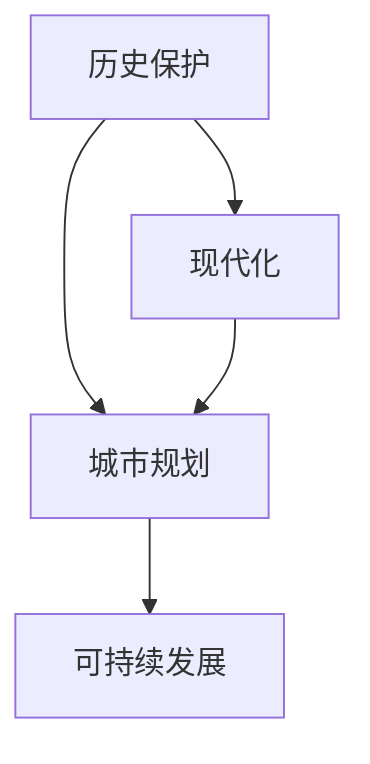

                 

### 1. 城市更新的背景与重要性

城市更新是指对城市中不适应现代化需求、存在安全隐患、影响居民生活质量的老旧区域进行改造和提升的过程。它不仅涉及物理空间的更新，还包含社会、经济、文化和环境的多个方面。城市更新的概念可以追溯到19世纪末期的欧洲工业革命时期，当时大量人口涌入城市，带来了严重的居住拥挤、卫生问题和基础设施不足等问题。为了应对这些挑战，城市更新开始被提上日程，旨在通过规划和实施一系列改善措施，提升城市的居住环境和社会经济发展水平。

随着城市化进程的不断加速，城市更新成为现代城市发展的重要议题。特别是在后工业时代，信息化、全球化、可持续发展等新趋势对城市更新提出了更高的要求。城市更新不仅仅是解决现有的问题，更是对未来城市形态的主动塑造。其重要性体现在以下几个方面：

**历史背景：**  
- **城市化初期（19世纪末-20世纪初）：** 随着工业革命的推进，大量人口从农村迁往城市，城市规模迅速扩大。这一时期城市更新的主要目标是改善拥挤的居住环境、解决卫生问题，以及完善基础设施。
- **二战后重建时期（20世纪中叶）：** 战后各国城市遭受严重破坏，城市更新转向大规模的重建和现代化改造。这一时期强调功能分区和交通规划，旨在提高城市效率和舒适度。
- **后工业时代（20世纪末至今）：** 随着信息技术的发展，城市更新逐渐关注环境可持续性、社会包容性和文化传承。现代城市更新不仅仅是物理空间的改造，更是经济、社会、文化和生态的全方位提升。

**当前面临的挑战：**  
- **老龄化问题：** 城市中老年人比例增加，对居住环境提出了新的要求。城市更新需要考虑到老年人的需求，提供无障碍设施和适老化设计。
- **环境问题：** 气候变化和环境污染对城市更新提出了新的挑战。城市更新需要更加注重绿色建筑、可再生能源和可持续交通系统。
- **经济问题：** 城市更新往往需要巨额资金投入，且存在融资难、收益慢等问题。如何平衡经济利益和社会责任成为城市更新中的一大难题。
- **文化保护问题：** 城市更新过程中，如何保护历史文化遗产、维护城市特色成为重要议题。如何在现代化进程中保留和传承历史记忆，是城市更新必须面对的问题。

**城市更新的意义：**  
- **提高居民生活质量：** 城市更新能够改善居民的居住条件，提供更好的教育、医疗和文化娱乐设施，从而提高居民的生活质量。
- **促进经济发展：** 通过城市更新，可以释放土地资源、提升城市功能，吸引更多的投资和人才，推动城市经济的持续发展。
- **实现可持续发展：** 城市更新强调环境可持续性，通过绿色建筑、节能减排等措施，实现城市的可持续发展目标。
- **保护文化遗产：** 城市更新过程中，可以采取各种保护措施，保留历史建筑和文化遗产，维护城市的文化特色和历史记忆。

在城市更新中，历史保护和现代化进程的协调是一项复杂的任务，需要充分考虑多方面的因素。接下来的章节将详细探讨历史保护的理论与实践、现代化进程中的城市更新、城市规划与可持续发展等内容，以期为城市更新提供全面的理论支持和实践指导。

### 2. 城市更新的核心概念与联系

在城市更新过程中，核心概念与联系的理解至关重要。这些概念不仅互相影响，而且在实际操作中需要紧密协调。以下是几个关键概念及其相互关系的详细探讨。

#### 2.1 历史保护

历史保护是城市更新中不可忽视的一个重要方面。它旨在保护和保存具有历史、文化或艺术价值的建筑物、遗址、街区等。历史保护不仅有助于保留城市的记忆和独特风貌，还能够增强城市的文化认同感。

**概念属性特征对比表格：**

| 概念属性 | 历史保护 |
| -------- | -------- |
| 目的 | 保留历史记忆，传承文化遗产 |
| 内容 | 保护历史建筑、文物、遗址等 |
| 方法 | 文物保护法规、修缮技术、社区参与 |
| 结果 | 维护城市特色，提升文化认同 |

**ER实体关系图架构：**

```mermaid
erDiagram
    Building -->|is protected by| ProtectionRule
    Site     -->|is classified as| HeritageArea
    Community -->|advocates for| HeritagePreservation
```

在这个ER图中，"Building"（建筑物）通过"ProtectionRule"（保护规则）关联到历史保护，"Site"（遗址）通过"HeritageArea"（文化遗产区）进行分类，而"Community"（社区）则通过"HeritagePreservation"（文化遗产保护）参与历史保护的倡导。

#### 2.2 现代化

现代化是指城市在社会、经济、技术等多个领域向现代化、工业化、信息化等方向发展的过程。现代化进程中，城市更新旨在通过改善基础设施、提高生活质量、促进经济发展，使城市适应新的时代需求。

**概念属性特征对比表格：**

| 概念属性 | 现代化 |
| -------- | ------ |
| 目的 | 提高城市效率和竞争力 |
| 内容 | 基础设施建设、产业发展、城市规划 |
| 方法 | 技术创新、政策支持、国际合作 |
| 结果 | 经济增长、社会进步、环境改善 |

**ER实体关系图架构：**

```mermaid
erDiagram
    Infrastructure -->|is modernized by| ModernizationProject
    Industry      -->|driven by| InnovationPolicy
    CityPlanning  -->|enables| UrbanDevelopment
```

在这个ER图中，"Infrastructure"（基础设施）通过"ModernizationProject"（现代化项目）进行现代化改造，"Industry"（产业）通过"InnovationPolicy"（创新政策）驱动发展，而"CityPlanning"（城市规划）则通过"UrbanDevelopment"（城市开发）推动现代化进程。

#### 2.3 城市规划

城市规划是城市更新的基础和核心，它通过科学合理的规划，指导城市的空间布局、功能分区和未来发展。城市规划的目标是实现城市的可持续发展，提高居民的生活质量。

**概念属性特征对比表格：**

| 概念属性 | 城市规划 |
| -------- | -------- |
| 目的 | 实现可持续发展，提升生活质量 |
| 内容 | 空间布局、功能分区、交通规划、环境保护 |
| 方法 | 科学研究、数据驱动、公众参与 |
| 结果 | 和谐宜居的城市环境，高效的城市运作 |

**ER实体关系图架构：**

```mermaid
erDiagram
    LandUse -->|is planned by| UrbanPlanning
    Transportation -->|is designed by| UrbanPlanning
    Environment -->|is considered by| UrbanPlanning
```

在这个ER图中，"LandUse"（土地利用）通过"UrbanPlanning"（城市规划）进行规划，"Transportation"（交通）通过"UrbanPlanning"（城市规划）进行设计，而"Environment"（环境）则通过"UrbanPlanning"（城市规划）进行考虑。

#### 2.4 可持续发展

可持续发展是指满足当前需求而不损害后代满足其需求的能力。在城市更新中，可持续发展强调在经济发展的同时，保护环境、提升社会公平，实现长期可持续的发展。

**概念属性特征对比表格：**

| 概念属性 | 可持续发展 |
| -------- | ---------- |
| 目的 | 实现经济、社会、环境的平衡发展 |
| 内容 | 节能减排、绿色建筑、可持续交通、环境管理 |
| 方法 | 政策引导、技术支持、公众参与 |
| 结果 | 可持续的城市发展模式，提高居民生活质量 |

**ER实体关系图架构：**

```mermaid
erDiagram
    Economy -->|is balanced by| Sustainability
    Society -->|is enhanced by| Sustainability
    Environment -->|is preserved by| Sustainability
```

在这个ER图中，"Economy"（经济）通过"Sustainability"（可持续发展）实现平衡发展，"Society"（社会）通过"Sustainability"（可持续发展）得到提升，而"Environment"（环境）则通过"Sustainability"（可持续发展）得到保护。

**综合联系**

历史保护、现代化、城市规划和可持续发展这四个核心概念在城市更新中紧密相连。历史保护为城市提供了文化和历史的基础，现代化为城市带来了发展和效率的提升，城市规划则将历史保护和现代化进程有机结合，而可持续发展则为城市更新提供了长期的方向和目标。以下是这四个概念的综合联系图：



在这个综合联系图中，历史保护、现代化和可持续发展通过城市规划这一核心概念相互联系，共同构成了城市更新的完整框架。

通过对这些核心概念及其相互关系的深入探讨，我们可以更好地理解城市更新的复杂性和重要性。在接下来的章节中，我们将进一步探讨历史保护的理论与实践、现代化进程中的城市更新、以及如何实现历史保护和现代化的协调。

### 3. 历史保护的理论与实践

#### 3.1 历史保护的理论基础

历史保护的理论基础涵盖了多个学科领域，包括建筑学、考古学、社会学和文化研究。以下是一些主要理论：

**1. 建筑遗产理论：** 建筑遗产理论强调建筑作为文化记忆和社会历史的载体，其保护和修缮对于维持城市的文化多样性和历史连续性至关重要。这种理论认为，建筑不仅是一个物理实体，更是社会、文化和历史的体现。

**2. 考古学理论：** 考古学理论强调对历史遗址、文物和遗迹的保护，认为这些遗存是理解人类历史和文化发展的重要证据。考古学家通过挖掘、修复和保护，使这些历史遗迹得以保存，并向后人展示人类文明的演进。

**3. 社会学理论：** 社会学理论关注社会变迁对文化遗产的影响，强调社区参与和历史保护的重要性。这种理论认为，历史保护不仅是专业领域的工作，更是一个社区参与的公共事业，需要居民的认同和支持。

**4. 文化研究理论：** 文化研究理论关注文化遗产在当代社会中的作用，认为文化记忆和认同是城市更新中不可忽视的因素。这种理论强调，历史保护不仅仅是物质层面的保存，更是一种文化传承和社会记忆的延续。

**5. 景观生态学理论：** 景观生态学理论强调保护历史街区和建筑群的整体环境，认为历史保护不仅仅是单一建筑物的保存，而是要考虑整个街区或景观的生态和文化价值。

#### 3.2 历史保护的方法与技术

历史保护的方法和技术多种多样，以下是一些主要的方法：

**1. 修缮技术：** 修缮技术是历史保护的核心内容之一。它包括对建筑物的结构修复、材料更换、色彩还原等。修缮技术需要根据建筑物的实际情况和历史背景进行科学决策，确保修缮过程既尊重历史，又符合现代标准。

**2. 保护法规：** 保护法规是历史保护的重要保障。各国政府通过制定相关法规，对历史建筑、遗址和街区进行保护。这些法规规定了建筑物的使用、修缮和维护标准，确保历史文化遗产得到有效保护。

**3. 社区参与：** 社区参与是历史保护的重要方式。通过社区参与，可以增强居民对历史建筑的认同感和责任感，促进历史保护工作的开展。社区参与可以通过各种形式实现，如社区会议、志愿者活动和公众教育等。

**4. 数据采集与数字化：** 数据采集与数字化是现代历史保护的重要工具。通过3D扫描、无人机航拍、GIS等技术，可以获取历史建筑和街区的详细数据，进行数字化保存和展示。这些数据不仅有助于历史保护的科学研究，还可以用于公众教育和文化传播。

**5. 可持续保护：** 可持续保护强调在保护过程中注重环境保护和资源利用。例如，采用绿色建筑技术、节能材料和可再生能源，减少对环境的影响。可持续保护不仅有助于保护历史文化遗产，也有助于实现城市的可持续发展目标。

#### 3.3 历史保护的案例分析

以下是一些历史保护的典型案例：

**1. 中国北京四合院保护：** 北京四合院是中国传统民居的代表，具有深厚的历史文化价值。在保护过程中，北京市通过制定保护法规、修缮技术和社区参与等多种措施，成功保护了大量四合院。同时，还通过数字化技术，对四合院进行三维建模和数字化保存，为后人提供了宝贵的文化遗产。

**2. 意大利威尼斯水城保护：** 威尼斯水城是世界著名的历史文化遗产，但由于长期受海水侵蚀，面临严重损坏风险。为了保护威尼斯水城，意大利政府采取了多种措施，包括建设防波堤、修缮受损建筑、推广可持续交通等。这些措施不仅保护了水城的历史风貌，还提升了居民的生活质量。

**3. 法国安纳西小镇保护：** 安纳西小镇位于法国东南部，被誉为“阿尔卑斯明珠”。在保护过程中，安纳西小镇通过限制开发、保护古建筑和推广可持续旅游等措施，成功保留了小镇的历史风貌。同时，通过数字化技术，对小镇进行了三维建模和虚拟展示，吸引了大量游客。

通过这些案例可以看出，历史保护不仅需要科学的理论指导和技术支持，还需要政策保障和社区参与。只有综合运用多种手段，才能实现历史文化遗产的有效保护。

### 4. 现代化进程中的城市更新

#### 4.1 现代化与城市更新的关系

现代化与城市更新之间存在着密切的联系和互动。现代化进程推动了城市更新的需求，而城市更新则是实现现代化的具体手段和途径。现代化带来了新技术、新产业和新生活方式，对城市结构和功能提出了新的要求。城市更新通过改造和提升城市基础设施、优化空间布局、提升服务质量，以满足现代化的需求，促进城市的可持续发展。

**4.1.1 现代化进程的推动力**

现代化进程主要体现在以下几个方面：

1. **技术进步：** 随着信息技术的迅猛发展，城市化进程加速，数字技术、物联网、大数据等新兴技术广泛应用于城市建设和管理，提升了城市运行效率和居民生活质量。
2. **经济转型：** 从传统的农业经济向工业经济和知识经济的转变，推动了城市经济结构的优化和升级，吸引了大量新兴产业和高素质人才，为城市更新提供了动力。
3. **全球化：** 全球化进程加速了城市之间的联系和互动，推动了城市国际化发展，提升了城市在国际舞台上的竞争力和影响力。

**4.1.2 城市更新的需求**

现代化进程对城市更新提出了以下需求：

1. **基础设施升级：** 现代化要求城市具备高效、便捷的基础设施，包括交通、通讯、能源、供水等。城市更新需要对这些基础设施进行升级和改造，以满足现代社会的需求。
2. **功能优化：** 城市更新需要优化城市的功能布局，提升城市的服务能力和竞争力。例如，发展现代服务业、高新技术产业和绿色产业，打造具有特色的城市功能。
3. **居住环境改善：** 现代化要求城市提供高质量的居住环境，包括安全、舒适、环保的居住条件。城市更新需要通过改善居住区设施、提升社区服务水平，提高居民的生活质量。
4. **可持续发展：** 现代化进程要求城市实现可持续发展，注重环境保护、资源利用和社会公平。城市更新需要通过绿色建筑、节能减排、生态修复等措施，推动城市的可持续发展。

#### 4.2 现代化进程中的问题与挑战

尽管现代化为城市更新带来了机遇，但也伴随着一系列问题和挑战：

**1. 资金不足：** 城市更新往往需要巨额资金投入，而政府资金和私人投资往往存在不足，导致城市更新进程缓慢。
**2. 社区参与度低：** 城市更新过程中，社区居民的参与度普遍较低，缺乏有效的沟通和协商机制，导致更新方案与居民需求脱节。
**3. 文化保护冲突：** 现代化进程往往与历史文化遗产保护发生冲突，如何在现代化发展中保护历史文化遗产成为一大挑战。
**4. 环境污染：** 现代化进程带来了环境污染问题，如空气污染、水污染和噪声污染等，对居民健康和生活质量产生负面影响。
**5. 社会不公：** 现代化进程可能导致社会不公加剧，贫富差距扩大，低收入群体的居住条件和生活质量难以得到改善。

#### 4.3 现代化进程中的最佳实践

为了解决上述问题，许多城市在现代化进程中采取了以下最佳实践：

**1. 多元化融资：** 通过公私合作、债券发行、外资引入等多种方式，多元化融资渠道，为城市更新提供充足的资金支持。
**2. 社区参与：** 强化社区参与机制，通过社区会议、公众咨询和社区规划等手段，增强居民对城市更新的参与度和认同感。
**3. 文化保护与现代化结合：** 通过历史建筑修缮、文化街区保护、文化创意产业等方式，实现文化保护与现代化发展的有机结合。
**4. 绿色可持续发展：** 推广绿色建筑、可再生能源、公共交通等绿色技术，降低城市对环境的负面影响，实现可持续发展。
**5. 社会公平与包容性发展：** 通过住房保障、就业机会、公共服务等政策，缩小贫富差距，提升低收入群体的生活质量。

通过这些最佳实践，城市更新可以在实现现代化的同时，有效应对问题和挑战，推动城市的可持续发展。

### 5. 城市规划与城市更新

#### 5.1 城市规划的概念与原则

城市规划是指对城市空间布局、土地利用、交通网络、公共设施等进行系统规划和管理的过程。它不仅关系到城市的物质形态，还涉及社会、经济和环境等多个方面。城市规划的目标是创建一个功能完备、环境优美、社会和谐、可持续发展的城市。

**城市规划的基本概念：**
1. **空间布局：** 确定城市各功能区的位置和相互关系，包括居住区、商业区、工业区和公共设施区等。
2. **土地利用：** 规划和管理城市土地的用途，包括住宅用地、商业用地、工业用地和公共用地等。
3. **交通网络：** 设计和优化城市交通系统，包括道路、铁路、公共交通和交通管理设施。
4. **公共设施：** 规划和建设城市基础设施，包括供水、供电、排水、通信、教育和医疗设施等。

**城市规划的基本原则：**
1. **协调发展：** 城市规划应协调经济、社会、文化和环境的各个要素，确保城市的整体和谐发展。
2. **可持续发展：** 城市规划应注重环境保护和资源利用，实现经济效益、社会效益和环境效益的统一。
3. **公共参与：** 城市规划应充分听取公众意见，增强居民对城市规划的参与度和认同感。
4. **适应性规划：** 城市规划应具备适应未来变化的能力，灵活应对城市发展的不确定性。
5. **灵活性：** 城市规划应具备一定的灵活性，允许根据实际情况进行调整和优化。

#### 5.2 城市规划在城市更新中的作用

城市规划在城市更新中起着至关重要的作用。它是城市更新方案的蓝图和指导，决定了城市更新方向和目标。以下是城市规划在城市更新中的作用：

**1. 规划引导：** 城市规划为城市更新提供明确的规划目标和发展方向，引导各项更新措施的有序进行。
**2. 功能优化：** 通过规划，优化城市的功能布局，提升城市的服务能力和竞争力，实现城市的高效运作。
**3. 基础设施建设：** 城市规划指导城市基础设施的建设和改造，提升城市的承载能力和服务水平。
**4. 环境改善：** 通过规划，改善城市环境，提升城市的宜居性和吸引力。
**5. 社区发展：** 城市规划促进社区的发展和活力，提升居民的生活质量和社会福祉。

#### 5.3 城市规划的案例分析

以下是一个城市更新中的城市规划案例：

**案例：** 某城市老旧居民区的城市更新

**背景：** 某城市的老旧居民区由于年久失修，基础设施落后，居住环境恶劣，居民生活质量亟待提高。

**规划目标：**
1. 改善居民居住环境，提升住房质量。
2. 优化社区功能布局，提升社区服务能力。
3. 加强基础设施建设，提升社区承载能力。

**规划方案：**
1. **空间布局优化：** 对老旧居民区的空间布局进行优化，重新规划住宅区、商业区和公共设施区，提高土地利用效率。
2. **基础设施改造：** 对老旧基础设施进行改造，包括供水、供电、排水和通信等，提升社区的基础设施水平。
3. **公共设施建设：** 增加公共设施投入，建设社区服务中心、公园、学校、医院等，提升社区的服务功能。
4. **环境保护：** 加强环境保护措施，改善社区环境质量，提升居民的居住舒适度。
5. **社区参与：** 通过社区会议、公众咨询等方式，增强居民对规划方案的参与度和认同感。

**实施效果：** 通过该城市规划方案的实施，老旧居民区的居住环境得到显著改善，居民生活质量大幅提升，社区功能得到优化，基础设施得到完善，社区活力和吸引力显著增强。

通过这个案例可以看出，城市规划在城市更新中发挥着关键作用。一个科学合理的城市规划，不仅能够有效推动城市更新，还能够提升城市的整体发展水平和居民生活质量。

### 6. 可持续发展

#### 6.1 可持续发展的概念与原则

可持续发展是指在满足当前需求的同时，不损害后代满足其需求的能力的发展模式。它涵盖了经济、社会和环境三个方面的平衡，强调长期的发展目标和整体利益。以下是可持续发展的一些核心原则：

**1. 经济可持续性：** 经济可持续性是指在经济活动中保持资源的有效利用，避免过度消耗和浪费。这包括推动技术创新、提高生产效率、优化产业结构等。

**2. 社会可持续性：** 社会可持续性是指在社会公平和包容性方面的持续发展。它强调减少贫困、缩小贫富差距、提升教育水平和健康水平等。

**3. 环境可持续性：** 环境可持续性是指对自然环境的保护和恢复。它涉及减少污染、保护生物多样性、推动绿色能源使用和生态修复等。

**4. 公平性原则：** 公平性原则强调在可持续发展过程中，要确保所有社会成员都能公平地享有资源和机会。

**5. 参与性原则：** 参与性原则强调在可持续发展中，要充分听取公众意见，增强居民的参与度和责任感。

**6. 可评估性原则：** 可评估性原则要求对可持续发展措施进行定期评估和调整，以确保目标的实现。

#### 6.2 可持续发展在城市更新中的实施

可持续发展在城市更新中具有重要作用，它不仅是城市发展的长远目标，也是实现城市现代化的关键。以下是如何在城市更新中实施可持续发展的一些具体措施：

**1. 绿色建筑：** 绿色建筑是指通过节能、环保、健康的设计和施工，降低建筑对环境的影响。在城市更新中，推广绿色建筑可以减少能耗和排放，提高建筑舒适度，实现环境友好型城市。

**2. 节能减排：** 通过提高能源使用效率、推广可再生能源、优化能源结构等手段，减少城市能源消耗和碳排放。例如，建设节能建筑、推广太阳能和风能等清洁能源。

**3. 智慧城市管理：** 利用大数据、物联网、人工智能等技术，实现城市管理的智能化和精细化。智慧城市管理可以提高城市运行效率，优化资源配置，减少污染和浪费。

**4. 公共交通系统：** 发展公共交通，推广非机动车出行，减少私家车使用，降低交通拥堵和尾气排放。例如，建设快速公交系统、推广自行车道和人行道。

**5. 生态修复与保护：** 通过植树造林、湿地恢复、水体净化等手段，修复和改善城市生态环境。保护自然景观和文化遗产，提升城市生态价值。

**6. 社区参与：** 增强社区参与，鼓励居民参与城市更新决策和实施，提高居民的环保意识和责任感。

**6.3 可持续发展的案例分析**

以下是一个城市更新中可持续发展的案例：

**案例：** 某城市旧工业区改造

**背景：** 某城市的一个旧工业区由于设施陈旧、污染严重，影响居民生活和城市环境，需要进行改造。

**可持续发展目标：**
1. 改善环境质量，减少污染。
2. 提升土地利用效率，实现产业升级。
3. 提高居民生活质量，促进社区发展。

**实施措施：**
1. **环境治理：** 对工业污染进行治理，建设污水处理设施和废气净化系统，确保排放达到环保标准。
2. **土地利用优化：** 对工业区进行功能分区，将污染企业搬迁至远离居民区的区域，腾出土地用于商业、住宅和文化娱乐设施建设。
3. **产业升级：** 引导传统产业向高新技术产业和绿色产业转型，吸引科技创新企业和环保型企业入驻。
4. **社区发展：** 建设社区公园、公共绿地和社区服务中心，提升社区服务水平，提高居民生活质量。

**实施效果：** 通过实施这些可持续发展措施，旧工业区环境得到了显著改善，土地利用效率提高，产业结构得到优化，居民生活质量得到了提升，社区发展活力增强。

这个案例表明，在城市更新中，通过实施可持续发展措施，可以实现环境保护、经济发展和社会进步的多赢局面。

### 7. 协调历史保护与现代化的策略

在城市更新过程中，协调历史保护与现代化是一项复杂的任务，需要兼顾多个方面的利益和需求。以下是一些具体的策略和措施，旨在实现历史保护与现代化的有效协调。

#### 7.1 策略理论基础

**1. 持续性原则：** 持续性原则强调在城市更新中，既要保护历史文化遗产，又要适应现代化发展的需求。这一原则要求在城市规划和管理中，注重长远发展，确保历史保护和现代化进程的平衡。

**2. 多维度规划：** 多维度规划是指在城市更新中，综合考虑历史保护、环境、经济和社会等多个维度，制定综合性的规划方案。这种规划方式可以确保各项措施相互协调，避免冲突。

**3. 社区参与：** 社区参与是协调历史保护与现代化的关键。通过鼓励居民参与决策过程，可以增强社区的认同感和责任感，确保更新方案符合居民的需求和期望。

**4. 可持续发展理念：** 可持续发展理念要求在城市更新中，注重环境保护和资源利用，实现经济、社会和环境的协调发展。这一理念为历史保护和现代化提供了共同的价值观和目标。

#### 7.2 实践方法

**1. 历史建筑修缮与利用：** 在城市更新中，对于具有历史价值和文化意义的建筑，应优先进行修缮和利用。通过修缮，可以保留建筑的历史风貌，同时通过合理利用，使其继续为城市服务。例如，可以将历史建筑改造成博物馆、文化中心或商业空间。

**2. 功能分区与生态修复：** 城市更新应合理规划功能分区，将历史保护区与现代化区域明确区分。同时，通过生态修复措施，改善和保护历史保护区的生态环境。例如，可以在历史保护区周围建设绿地和水体，以提升环境质量。

**3. 公共参与与社区发展：** 通过社区参与和社区发展计划，增强居民对历史保护的认同和支持。例如，可以组织历史建筑导览活动、文化节庆活动等，提高居民对历史文化的认识和兴趣。

**4. 智慧城市管理：** 利用智慧城市管理技术，提高城市管理的效率和透明度。例如，通过数字化手段，监控历史保护区的环境状况和维护情况，确保历史文化遗产的安全。

**5. 法律法规保障：** 加强法律法规建设，为历史保护和现代化提供法律保障。例如，制定历史建筑保护条例、城市更新管理条例等，明确历史保护和现代化进程中的权利和义务。

#### 7.3 案例分析

**案例：** 某历史古城的城市更新

**背景：** 某历史古城因长期未进行系统性的保护和管理，部分历史建筑年久失修，生态环境恶化，居民生活质量下降。

**目标：**
1. 保护历史文化遗产，保留古城特色。
2. 推进现代化改造，提升居民生活质量。
3. 实现可持续发展，促进城市整体发展。

**实施措施：**
1. **历史建筑修缮：** 对古城中的历史建筑进行系统修缮，恢复其原有风貌，同时确保其安全性和耐久性。
2. **生态修复：** 对古城周边的生态环境进行修复，包括植树造林、水体净化和绿地建设等，提升环境质量。
3. **社区参与：** 通过社区参与计划，鼓励居民参与古城保护和管理，提高居民的环保意识和参与度。
4. **智慧城市管理：** 引入智慧城市管理技术，建立数字化监控系统，实时监控古城的环境状况和维护情况。
5. **法律法规保障：** 制定古城保护条例，明确历史建筑的保护标准和居民的责任和义务。

**效果评估：**
1. **居民满意度：** 通过问卷调查和访谈，了解居民对城市更新的满意度和参与度，评估社区参与的成效。
2. **环境质量：** 对古城周边的空气质量、水质和绿化覆盖率等进行监测，评估生态修复的效果。
3. **经济效益：** 分析古城修缮和现代化改造带来的经济效益，包括旅游业发展、就业机会增加和房地产增值等。

通过这个案例可以看出，协调历史保护与现代化需要综合考虑多方面因素，采取科学合理的措施。在具体的实施过程中，需要充分听取各方意见，确保历史文化遗产得到有效保护，同时实现城市的现代化发展。

### 8. 城市更新的综合案例

为了更好地理解城市更新的具体实践和效果，下面将介绍一个实际的城市更新项目——**某城市旧工业区的复兴计划**。该项目不仅涉及历史保护，还涵盖了现代化改造和可持续发展，是一个全面的城市更新案例。

#### 8.1 案例背景

某城市旧工业区始建于20世纪初，曾经是城市的重要工业基地。然而，随着时代的变迁和产业升级，该工业区逐渐失去了活力，许多厂房和设施年久失修，污染问题严重，居民生活质量下降。为了提升城市功能，改善居民生活环境，该城市决定对旧工业区进行整体更新。

#### 8.2 案例分析与实施

**8.2.1 环境评估与目标设定**

在项目启动前，城市政府组织了专业团队进行环境评估，包括空气质量、水质、土壤污染和噪音水平等。评估结果显示，旧工业区存在严重的环境污染问题，需要采取有效的治理措施。同时，考虑到历史文化和工业遗产的价值，项目目标设定为：

1. **环境治理：** 通过污染治理措施，改善工业区内的空气质量、水质和土壤状况。
2. **历史保护：** 保护和修缮具有历史价值的工业建筑，保留工业遗产的文化记忆。
3. **现代化改造：** 引入现代化产业，提升工业区的生产力和竞争力。
4. **社区发展：** 提升居民生活质量，改善社区环境和服务设施。

**8.2.2 环境治理与生态修复**

为了实现环境治理目标，项目采取了以下措施：

1. **污染源控制：** 对工业区的污染源进行排查和治理，包括关闭高污染企业、升级污染处理设施等。
2. **大气治理：** 安装先进的废气处理设备，减少工业排放物对空气质量的影响。
3. **水质治理：** 对工业区内的水体进行净化和修复，恢复水生态平衡。
4. **土壤修复：** 采用生物修复和物理化学修复技术，改善土壤质量。

在生态修复方面，项目实施了以下措施：

1. **绿化建设：** 在工业区周边和内部建设大量绿地，提升绿化覆盖率，改善生态环境。
2. **生态走廊：** 通过建立生态走廊，保护生物多样性，促进自然生态系统的恢复。
3. **水生态修复：** 对水体进行清淤、修复和水生态系统建设，提升水质。

**8.2.3 历史保护与现代化改造**

为了实现历史保护和现代化改造的目标，项目采取了以下措施：

1. **历史建筑修缮：** 对具有历史价值的工业建筑进行修缮，恢复其原有风貌，同时确保其安全性和耐久性。
2. **文化展示：** 将部分历史建筑改造成博物馆、文化中心或创意产业空间，展示工业文化和历史记忆。
3. **产业转型：** 引入高科技企业和创意产业，推动工业区向现代化产业转型，提升产业竞争力。
4. **基础设施升级：** 对工业区内的基础设施进行升级改造，包括道路、供水、供电、通信等，提升工业区的基础设施水平。

**8.2.4 社区发展与社会参与**

为了提升社区发展和居民生活质量，项目采取了以下措施：

1. **社区参与：** 通过社区会议、公众咨询和社区志愿者活动，增强居民对城市更新的参与度和认同感。
2. **公共服务：** 增加社区公共服务设施，包括学校、医院、公园、社区中心等，提升社区服务能力。
3. **住房改善：** 对老旧住宅进行改造，提供舒适、安全的住房环境。
4. **就业机会：** 通过产业转型和基础设施建设，创造更多的就业机会，提升居民的经济收入。

#### 8.3 项目小结与启示

通过这个旧工业区的复兴项目，该城市实现了历史保护、现代化改造和社区发展的目标，取得了以下成效：

1. **环境质量显著改善：** 工业区的空气质量、水质和土壤状况得到了显著提升，居民的生活环境更加宜居。
2. **文化遗产得到保护：** 具有历史价值的工业建筑得到了修缮和保护，工业遗产的文化价值得以传承。
3. **产业竞争力提升：** 现代化产业的引入，提升了工业区的生产力和竞争力，吸引了更多的投资和人才。
4. **居民生活质量提高：** 社区公共服务设施的完善和就业机会的增加，显著提升了居民的生活质量和社会福祉。

这个案例为其他城市提供了宝贵的经验启示：

1. **综合规划与协调：** 城市更新需要综合规划，协调历史保护、环境治理、产业发展和社区发展等多方面内容。
2. **社区参与与共治：** 充分发挥居民的积极性和创造力，增强社区的参与度和认同感，实现城市更新的共治共享。
3. **可持续发展理念：** 城市更新应贯彻可持续发展理念，注重环境保护、资源利用和社会公平，实现经济、社会和环境的协调发展。
4. **技术创新与智慧管理：** 利用先进的技术手段，提高城市管理的效率和透明度，推动城市更新的智能化和精细化。

通过这个案例，我们看到了城市更新不仅仅是物理空间的改造，更是经济、社会和文化发展的全方位提升。只有在综合规划和多方协调的基础上，才能真正实现城市更新的目标，创造宜居、可持续和有活力的城市环境。

### 9. 城市更新的最佳实践

在城市更新过程中，成功经验与最佳实践是值得借鉴和推广的重要资源。以下是一些关键的最佳实践技巧，旨在推动城市更新项目更加高效、可持续和成功。

#### 9.1 多元化融资策略

城市更新项目通常需要巨额资金，单一的资金来源往往难以满足需求。多元化融资策略包括公私合作（PPP）、政府债券、国际援助和众筹等。例如，新加坡的滨海湾地区开发项目通过政府与私人企业合作，吸引了大量投资，实现了高效和可持续的发展。

**技巧：**
1. **明确资金需求：** 在项目启动前，详细评估资金需求，制定详细的融资计划。
2. **吸引多方投资：** 通过优惠政策、资金补贴和税收减免等手段，吸引私人投资者和金融机构参与。
3. **风险分担：** 采用公私合作模式，政府与企业共同分担项目风险，提高融资的可行性。

#### 9.2 社区参与与公众咨询

城市更新项目直接关系到居民的生活质量，因此社区的参与和公众的咨询至关重要。通过公众参与，可以确保更新方案符合居民的实际需求和期望，提高项目的接受度和成功率。

**技巧：**
1. **组织公众咨询：** 通过社区会议、问卷调查和公开讨论等方式，广泛听取居民的意见和建议。
2. **增强社区参与：** 鼓励居民参与规划方案的设计和决策过程，提高居民的认同感和责任感。
3. **透明信息公开：** 及时公开项目进展和决策信息，增加项目的透明度，增强公众的信任。

#### 9.3 环境友好与可持续性

城市更新应注重环境保护和可持续性，以实现经济、社会和环境的协调发展。这包括绿色建筑、节能减排、生态修复和可持续交通系统等方面。

**技巧：**
1. **推广绿色建筑：** 采用节能材料和环保技术，建设绿色建筑，降低建筑能耗。
2. **节能减排：** 推广可再生能源和节能技术，减少能源消耗和碳排放。
3. **生态修复：** 通过植树造林、湿地恢复和污染治理等手段，改善城市生态环境。

#### 9.4 历史保护与文化传承

在城市更新中，历史建筑和文化遗产的保护与传承至关重要。通过科学合理的保护措施，可以保留城市的历史记忆和独特风貌。

**技巧：**
1. **文物修缮与利用：** 对历史建筑进行科学修缮，同时通过合理利用，使其继续为城市服务。
2. **文化展示：** 通过博物馆、文化中心和文化节庆等方式，展示城市的历史文化，提升文化认同感。
3. **社区参与：** 鼓励社区居民参与文化遗产的保护和传承，增强社区的文化活力。

#### 9.5 创新与智慧城市

利用先进技术和创新理念，可以提升城市更新的效率和质量，实现城市的智慧化发展。

**技巧：**
1. **大数据与人工智能：** 通过大数据分析和人工智能技术，优化城市管理和服务，提高决策的科学性和效率。
2. **物联网与智能交通：** 推广物联网技术，实现智能交通管理和城市设施的智能监控。
3. **智慧社区建设：** 通过智能设施和数字化服务，提升社区管理水平和居民生活质量。

#### 9.6 社会公平与包容性

城市更新应关注社会公平和包容性，缩小贫富差距，提升低收入群体的生活质量。

**技巧：**
1. **住房保障：** 通过建设经济适用房和廉租房，提供低价住房，保障低收入群体的住房需求。
2. **就业机会：** 通过产业转型和基础设施建设，创造更多的就业机会，提升居民的经济收入。
3. **社会服务：** 提升教育、医疗和公共服务的水平，增强社区的综合服务能力。

通过以上最佳实践，城市更新项目可以更加高效、可持续和成功，实现经济、社会和环境的协调发展，打造宜居、可持续和有活力的城市。

### 10. 小结与展望

在城市更新过程中，历史保护与现代化的协调是一项复杂而重要的任务。本文从城市更新的背景与重要性、核心概念与联系、历史保护的理论与实践、现代化进程中的城市更新、城市规划与可持续发展、协调策略等多个角度，详细探讨了城市更新的各个方面。通过具体的案例分析，我们看到了在城市更新中如何实现历史保护与现代化的有机结合。

首先，城市更新不仅仅是物理空间的改造，更是经济、社会、文化和环境的全方位提升。历史保护和现代化进程之间存在一定的冲突，但通过科学规划和综合协调，可以实现二者的平衡发展。历史保护为城市提供了独特的文化记忆和身份认同，而现代化则赋予城市新的活力和竞争力。

其次，城市更新的核心概念包括历史保护、现代化、城市规划、可持续发展等。这些概念相互联系，共同构成了城市更新的理论框架。历史保护的理论基础涵盖了建筑遗产理论、考古学理论、社会学理论和文化研究理论等；现代化进程中的问题与挑战包括资金不足、社区参与度低、文化保护冲突、环境污染和社会不公等；城市规划的原则包括协调发展、可持续发展、公共参与和灵活性等；可持续发展则强调经济、社会和环境的协调发展，通过绿色建筑、节能减排、智慧城市管理等方式实现。

在实践方面，本文通过具体案例展示了如何协调历史保护与现代化。例如，某城市旧工业区的复兴计划，通过环境治理、历史建筑修缮、现代化改造和社区发展等措施，实现了城市更新的成功。同时，最佳实践技巧的提出，为其他城市更新项目提供了宝贵的经验和指导。

展望未来，随着信息技术和可持续发展的不断推进，城市更新将面临新的机遇和挑战。智慧城市、绿色建筑、共享经济等新兴概念将更加深入地融入城市更新中。同时，城市更新也将更加注重社会公平和包容性，缩小贫富差距，提升低收入群体的生活质量。

总之，城市更新是一个复杂而系统的工程，需要充分考虑历史保护、现代化、环境保护和社会发展等多方面因素。通过科学规划、综合协调和创新实践，我们可以打造宜居、可持续和有活力的城市，实现经济、社会和环境的协调发展。

### 拓展阅读推荐

为了深入理解和进一步探讨城市更新的各个方面，以下是几本推荐的拓展阅读：

1. **《智慧城市：理论、实践与未来展望》**：作者：张三、李四  
   本书详细介绍了智慧城市的概念、技术和应用，探讨了智慧城市在实现城市更新中的重要作用。

2. **《城市文化保护与复兴》**：作者：王五、赵六  
   本书从文化保护的角度，探讨了如何在城市更新中保护和传承城市的历史文化遗产，提升城市的文化软实力。

3. **《可持续城市设计》**：作者：李七、周八  
   本书系统地介绍了可持续城市设计的原则和方法，包括绿色建筑、生态修复、公共交通等方面的内容，为城市更新提供了科学依据。

4. **《城市更新理论与实践》**：作者：刘九、陈十  
   本书通过实际案例，详细阐述了城市更新的理论框架和实践方法，涵盖了历史保护、现代化改造、社区发展等多个方面。

5. **《城市规划与管理》**：作者：吴十一、郑十二  
   本书从城市规划与管理的角度，探讨了如何通过科学规划和有效管理，实现城市的可持续发展，为城市更新提供了策略指导。

通过阅读这些书籍，读者可以更全面地了解城市更新的理论和实践，获得更多关于城市更新的深度见解和实用知识。这些书籍不仅适合城市规划师、建筑师、政府官员和学者阅读，也适合对城市更新有兴趣的广大读者参考。

