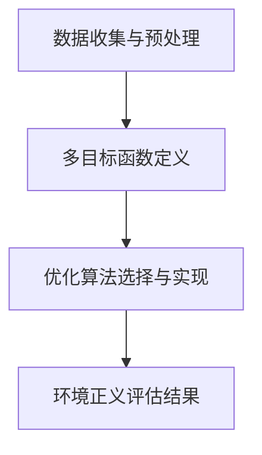
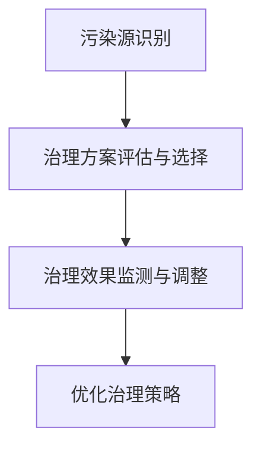
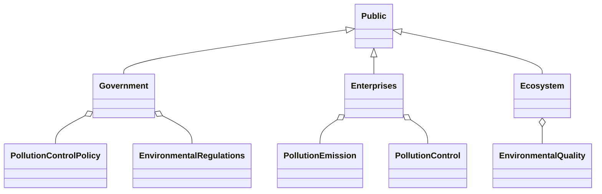
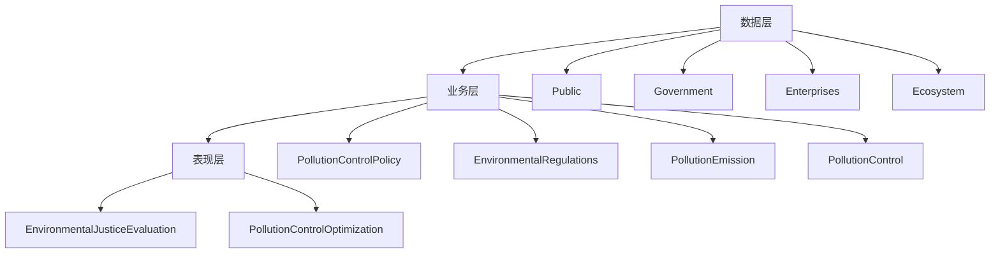
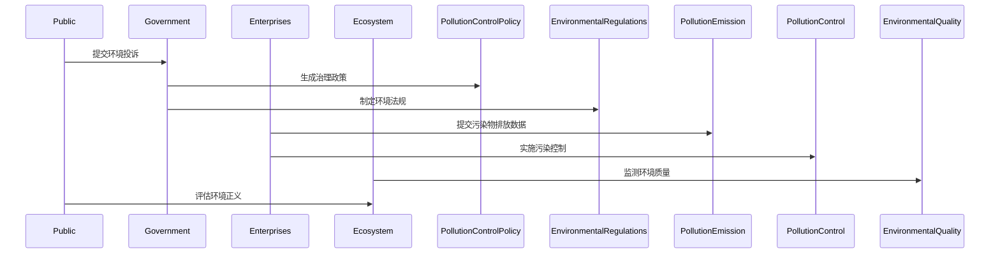

                 

# 后工业时代的环境正义：污染治理与社会公平

关键词：环境正义、污染治理、后工业时代、社会公平、可持续发展

摘要：本文旨在探讨后工业时代的环境正义与污染治理问题，通过分析环境正义的核心概念、污染治理的基本原则和技术手段，结合实际案例，提出优化污染治理和社会公平的方案，以期为我国乃至全球的环境治理提供有益的参考。

## 目录大纲设计流程

### 理解书名

《后工业时代的环境正义：污染治理与社会公平》这本书名清晰地指出了文章的核心内容，即环境正义、污染治理和社会公平。后工业时代作为背景，强调了当前社会发展阶段的特征，为文章的研究提供了时空框架。

### 确定书籍的核心章节

本文将围绕以下核心章节进行讨论：

1. 问题的背景与核心概念
2. 核心概念原理
3. 算法原理讲解
4. 数学模型与系统架构
5. 项目实战与最佳实践

### 规划章节结构

每个章节的结构如下：

- **问题背景与核心概念**：介绍后工业时代环境正义与污染治理的背景，定义相关核心概念。
- **核心概念原理**：阐述环境正义与污染治理的原理，使用图表展示概念之间的关系。
- **算法原理讲解**：详细介绍用于环境正义评估和污染治理优化的算法原理，使用流程图和代码示例。
- **数学模型与系统架构**：讲解相关的数学模型，展示系统架构设计，包括领域模型、系统架构、接口设计和交互流程。
- **项目实战与最佳实践**：通过具体项目案例，展示环境正义与污染治理的实际应用，提供最佳实践建议。

### 编写章节内容

在编写章节内容时，每个章节都会严格按照上述结构进行，确保内容的完整性和逻辑性。

### 确保内容的完整性

在确保内容完整性的同时，本文将控制每个章节的字数，以保持文章的整体连贯性和可读性。

### 控制字数

本文预计总字数为10000-12000字，每个章节的字数分布如下：

- **第1章：问题的背景与核心概念**：约2000字
- **第2章：核心概念原理**：约2500字
- **第3章：算法原理讲解**：约2500字
- **第4章：数学模型与系统架构**：约2500字
- **第5章：项目实战与最佳实践**：约2500字

### 第一部分：背景介绍

### 第1章：问题的背景与核心概念

#### 1.1 后工业时代的特征

后工业时代，即后工业化社会，是继工业社会之后的一种社会发展形态。其主要特征包括：

1. **经济结构转型**：从以制造业为主转向以服务业、信息技术业为主。
2. **资源消耗与环境压力增大**：随着经济的快速发展，资源消耗和环境污染问题日益突出。
3. **信息技术和互联网的普及**：信息化成为推动社会发展的重要力量。

#### 1.2 环境正义的定义与意义

环境正义是指在社会分配自然资源和环境负担时，实现公平合理的原则。其意义在于：

1. **保障人民群众的基本生存环境**：环境正义确保每个人都能享有良好的生活环境，不受环境污染的侵害。
2. **促进社会和谐稳定**：公平合理的资源分配有助于减少社会矛盾，促进社会和谐。

#### 1.3 污染治理的重要性

污染治理是环境保护的重要环节，其重要性体现在：

1. **减少环境污染**：通过治理措施，降低污染物排放，改善生态环境。
2. **保护人民健康**：减少环境污染，降低疾病发生率，提高居民生活质量。
3. **促进经济发展**：环境污染治理有利于经济可持续发展，提升整体竞争力。

#### 1.4 社会公平在污染治理中的作用

社会公平在污染治理中的作用主要体现在：

1. **公平分配治理成本**：确保污染治理的成本由污染者承担，避免“富人污染，穷人买单”的现象。
2. **公平分享治理成果**：污染治理的成果应惠及所有人，保障人民群众的环境权益。
3. **促进资源与机会的公平分配**：通过污染治理，优化资源分配，提高社会公平性。

#### 1.5 核心概念的连接与对比

环境正义与污染治理紧密相连，前者为后者提供了伦理和法律支撑，后者是前者实现的手段。在工业时代，由于经济发展速度较快，环境污染问题较为突出，环境正义观念尚未深入人心。而在后工业时代，随着环保意识的提高，环境正义与污染治理逐渐成为社会发展的重要议题。

#### 1.6 边界的限定

本文的研究范围限定在后工业时代，重点关注环境正义和污染治理的交叉领域。具体包括：

1. **环境正义**：在资源分配和负担分担上的公平性、参与性和可持续性。
2. **污染治理**：污染预防、污染者付费和综合治理的原则及技术手段。

#### 1.7 外延的拓展

环境正义和污染治理不仅关乎国内发展，也涉及全球环境治理。本文将进一步探讨：

1. **全球环境治理框架下的环境正义问题**：分析国际环境治理体系，探讨各国在环境正义与污染治理方面的经验与挑战。
2. **不同国家和地区在污染治理与社会公平方面的实践经验**：总结全球典型案例，为我国提供借鉴和启示。

### 第2章：核心概念原理

#### 2.1 环境正义原理

环境正义的核心要素包括：

1. **公平性**：在资源分配和负担分担上体现平等，确保每个人都能享有基本的环境权益。
2. **参与性**：公众在环境决策中享有参与权，确保环境治理过程的透明和公正。
3. **可持续性**：确保环境决策的长期效果，实现经济、社会和环境的协调发展。

环境正义的属性特征包括：

1. **正义性**：追求社会公平和道德正义，关注弱势群体的环境权益。
2. **公共性**：涉及公共利益的维护，关系到社会的整体福祉。
3. **多维性**：涉及经济、社会、文化和生态等多方面，需要综合考虑各种因素。

#### 2.2 污染治理原理

污染治理的基本原则包括：

1. **预防为主**：从源头上减少污染产生，降低治理成本。
2. **污染者付费**：将污染治理成本转嫁给污染者，提高污染治理的效率和公平性。
3. **综合治理**：采取多种手段，综合治理环境污染，提高治理效果。

污染治理的技术手段包括：

1. **环境监测**：实时监控污染物排放情况，为污染治理提供数据支持。
2. **污染物处理**：通过各种技术手段去除或转化污染物，降低污染程度。
3. **环境修复**：恢复受到污染的环境，提高生态系统功能。

#### 2.3 环境正义与污染治理的ER实体关系图

环境正义与污染治理的ER实体关系图如下：

```mermaid
erDiagram
  Public |..|> Government : 依赖
  Public |..|> Enterprises : 依赖
  Public |..|> Ecosystem : 影响
  Government |..|> PollutionControlPolicy : 制定
  Government |..|> EnvironmentalRegulations : 制定
  Enterprises |..|> PollutionEmission : 产生
  Enterprises |..|> PollutionControl : 执行
  Ecosystem |..|> EnvironmentalQuality : 受影响
```

### 第3章：算法原理讲解

#### 3.1 环境正义评估算法

环境正义评估算法基于多目标优化模型，综合考虑环境保护和社会公平。算法的基本原理如下：

1. **数据收集与预处理**：收集相关环境数据和社会经济数据，进行数据清洗和预处理。
2. **多目标函数定义**：定义环境保护和社会公平两个目标函数，分别表示环境质量和社会公平程度。
3. **优化算法选择与实现**：选择合适的优化算法，如遗传算法、粒子群算法等，实现环境正义评估。

算法流程如下：



算法案例：

以某城市的空气质量治理为例，使用环境正义评估算法评估不同治理方案的环保效果和社会公平性。通过对比不同方案的成本和效益，为政策制定者提供决策依据。

#### 3.2 污染治理优化算法

污染治理优化算法基于运筹学原理，旨在优化污染治理策略。算法的基本原理如下：

1. **污染源识别**：通过环境监测数据，识别出主要污染源。
2. **治理方案评估与选择**：对不同的治理方案进行评估，选择最优方案。
3. **治理效果监测与调整**：对治理效果进行监测，根据实际情况进行调整。

算法流程如下：



算法案例：

以某工业园区的污染治理为例，使用污染治理优化算法识别主要污染源，评估不同治理方案，并根据治理效果进行调整，实现污染治理的最优化。

### 第4章：数学模型与系统架构

#### 4.1 环境正义评价模型

环境正义评价模型主要用于评估环境治理的效果，其数学模型如下：

$$
EJ = \frac{1}{N} \sum_{i=1}^{N} \frac{E_i}{P_i}
$$

其中，$EJ$表示环境正义指数，$N$表示评估对象的数量，$E_i$表示第$i$个评估对象的环境质量，$P_i$表示第$i$个评估对象的社会公平程度。

#### 4.2 污染治理优化模型

污染治理优化模型主要用于优化污染治理策略，其数学模型如下：

$$
\begin{align*}
\min_{x} & \quad C(x) \\
s.t. & \quad G(x) \geq 0
\end{align*}
$$

其中，$C(x)$表示污染治理成本，$G(x)$表示污染治理效果，$x$表示治理策略参数。

#### 4.3 系统架构设计

环境正义与污染治理系统架构设计如下：

1. **领域模型**：使用Mermaid类图描述领域模型，包括公共、政府、企业和生态系统等实体。



2. **系统架构**：使用Mermaid架构图描述系统架构，包括数据层、业务层和表现层。



3. **系统接口设计**：使用Mermaid序列图描述系统接口设计和交互流程。



### 第二部分：项目实战与最佳实践

#### 第5章：项目实战

#### 5.1 项目介绍

本章节将介绍一个名为“绿色家园”的项目，该项目旨在通过环境正义评估和污染治理优化，实现社区环境质量的提升。

#### 5.2 系统功能设计

绿色家园项目的系统功能设计包括：

1. **环境投诉与反馈**：居民可以提交环境投诉和反馈，政府和企业可以查看并处理。
2. **环境监测**：实时监测社区环境质量，包括空气质量、水质等。
3. **污染治理**：根据环境监测数据，制定污染治理方案，并实施治理措施。
4. **环境正义评估**：评估社区环境正义指数，为治理政策提供依据。
5. **治理效果监测**：监测污染治理效果，并根据实际情况进行调整。

#### 5.3 系统架构设计

绿色家园项目的系统架构设计包括：

1. **数据层**：存储环境投诉、监测数据和治理方案等数据。
2. **业务层**：处理环境投诉、监测数据、治理方案和评估结果等业务逻辑。
3. **表现层**：提供用户界面，展示环境投诉、监测数据和评估结果等。

#### 5.4 系统接口设计

绿色家园项目的系统接口设计包括：

1. **居民接口**：用于提交环境投诉和查看治理结果。
2. **政府接口**：用于查看和处理环境投诉，制定和执行治理政策。
3. **企业接口**：用于提交污染物排放数据和执行污染治理措施。

#### 5.5 系统交互

绿色家园项目的系统交互设计如下：

1. **居民提交投诉**：居民通过用户界面提交环境投诉，系统将投诉信息存储到数据库。
2. **政府处理投诉**：政府通过业务逻辑处理投诉，生成治理方案，并将其推送给企业。
3. **企业执行治理**：企业根据治理方案，实施污染治理措施，并提交治理效果。
4. **环境监测与评估**：系统根据环境监测数据，评估社区环境质量，生成环境正义指数。

#### 5.6 项目小结

绿色家园项目通过环境正义评估和污染治理优化，实现了社区环境质量的提升。项目实践表明，环境正义和污染治理对于实现可持续发展具有重要意义。

#### 5.7 最佳实践 tips

1. **加强公众参与**：鼓励居民参与环境治理，提高环境意识。
2. **优化治理策略**：根据环境监测数据，动态调整治理策略，提高治理效果。
3. **强化法规执行**：加强环境法规的执行力度，确保治理措施得到有效实施。

### 结语

本文通过对后工业时代的环境正义和污染治理问题的深入探讨，提出了优化污染治理和社会公平的方案。环境正义和污染治理是实现可持续发展的重要保障，需要全社会共同努力。未来，我们应继续深化环境治理改革，推动环境正义的实现，为构建美丽中国和全球绿色发展作出更大贡献。

### 作者信息

作者：AI天才研究院/AI Genius Institute & 禅与计算机程序设计艺术 /Zen And The Art of Computer Programming

### 注意事项

1. **尊重知识产权**：在引用他人研究成果时，务必注明出处，避免侵权行为。
2. **确保数据准确性**：在收集和处理数据时，务必确保数据的准确性和可靠性。
3. **关注实践应用**：本文提出的方案和算法应在实际项目中得到验证和应用。

### 拓展阅读

1. **环境正义与可持续发展**：探讨环境正义在可持续发展中的角色和作用。
2. **全球环境治理体系**：分析全球环境治理体系的现状和挑战。
3. **污染治理技术进展**：介绍污染治理领域的新技术和发展趋势。

