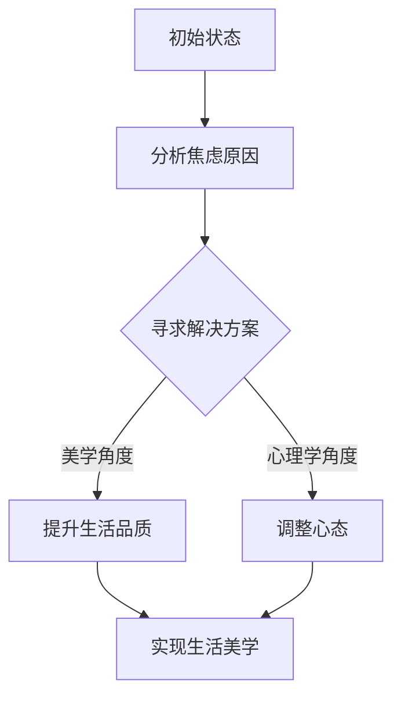
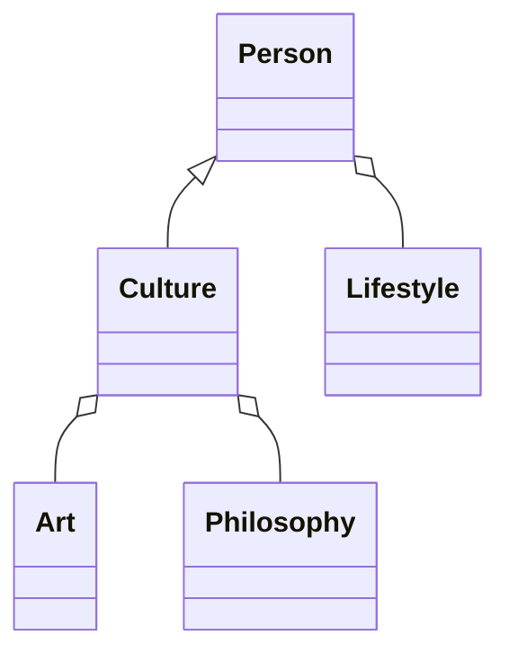
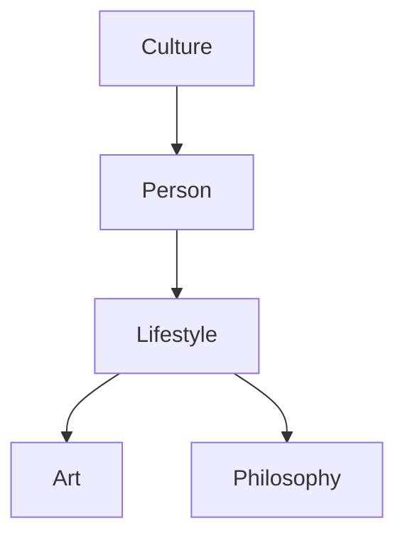
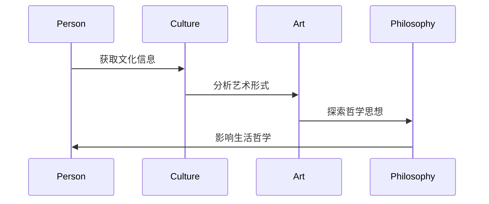
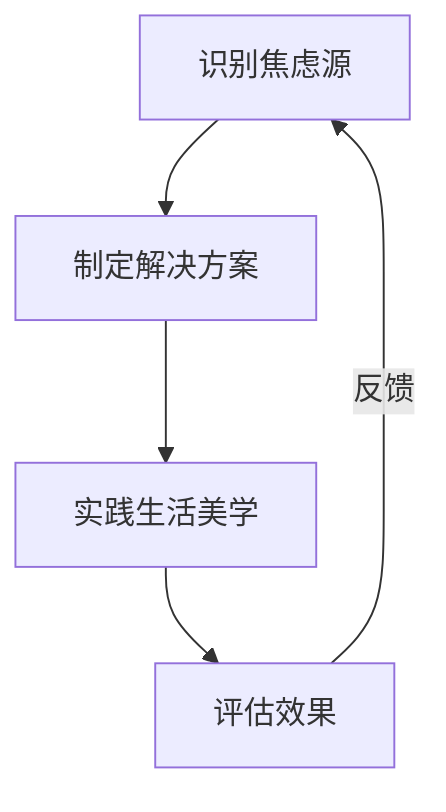

                 

### 《后工业社会的生活哲学：从生存焦虑到生活美学》目录大纲

---

**# 《后工业社会的生活哲学：从生存焦虑到生活美学》**

> 关键词：后工业社会、生存焦虑、生活美学、心理学、文化影响、未来生活

> 摘要：本文探讨后工业社会中人类生存状态的变化，分析生存焦虑的根源，从心理学和文化视角探讨生活美学的概念和实现，最后展望未来生活并给出实践指南。

---

**## 第1章：后工业社会概述**

### 1.1 问题背景

在20世纪末，随着工业社会的逐渐成熟，人类社会进入了一个新的发展阶段——后工业社会。这一阶段的特点是信息化、全球化和知识经济的发展，带来了生活方式、价值观和思维方式的深刻变化。

### 1.2 问题描述

然而，这一新的社会形态也带来了一系列问题，尤其是生存焦虑。人们在面对快速变化的环境和高度竞争的社会时，往往感到无所适从，焦虑情绪日益严重。

### 1.3 问题解决

为了解决这些问题，我们需要从生活哲学的角度重新审视我们的生活方式和价值观，追求更高的生活品质和美学。

### 1.4 边界与外延

后工业社会不仅是一个时间和空间的概念，更是一种社会文化的变革。它涉及到经济、政治、文化等多个领域，是一个复杂而多元的社会现象。

### 1.5 概念结构与核心要素组成

后工业社会的核心要素包括信息化、全球化、知识经济等，这些要素相互作用，共同塑造了这一社会形态。

---

**## 第2章：生存焦虑分析**

### 2.1 核心概念原理

生存焦虑是后工业社会的一种普遍心理现象，其根源在于个体对自身角色和社会地位的认同危机。

### 2.2 概念属性特征对比表格

| 特征                | 工业社会         | 后工业社会         |
|-------------------|--------------|--------------|
| 社会结构          | 阶层分明       | 流动性强         |
| 价值观念          | 重视物质财富    | 重视知识和创新    |
| 生存状态          | 稳定性强       | 变化快，不确定性高 |

### 2.3 ER实体关系图架构


---

**## 第3章：生活美学探索**

### 3.1 算法原理讲解

#### 3.1.1 算法流程图



#### 3.1.2 Python源代码阐述

```python
def analyze_anxiety():
    # 分析焦虑原因
    pass

def seek_solution():
    # 寻求解决方案
    pass

def improve_lifestyle():
    # 提升生活品质
    pass

def adjust_mindset():
    # 调整心态
    pass

def realize_aesthetics():
    # 实现生活美学
    pass

# 主函数
def main():
    analyze_anxiety()
    seek_solution()
    improve_lifestyle()
    adjust_mindset()
    realize_aesthetics()

if __name__ == "__main__":
    main()
```

#### 3.1.3 数学模型和公式

$$
\text{焦虑指数} = \frac{\text{不确定性因素}}{\text{可控因素}}
$$

#### 3.1.4 详细讲解

焦虑指数是衡量个体焦虑程度的一个指标。在不确定性因素较多而可控因素较少的情况下，个体的焦虑指数会较高。

#### 3.1.5 举例说明

假设某个职场人士的工作具有很高的不确定性，而他能控制的变量较少，那么他的焦虑指数会相对较高。

---

**## 第4章：心理学视角下的生活哲学**

### 4.1 数学模型和数学公式

$$
\text{幸福感} = \frac{\text{期望值}}{\text{现实值}} + \text{心理调节能力}
$$

### 4.2 详细讲解

幸福感是衡量生活满意度的指标。期望值和现实值的比值加上心理调节能力，可以反映个体的幸福感。

### 4.3 举例说明

一个期望值很高但现实值较低的人，如果具有较强的心理调节能力，他的幸福感可能会相对较高。

---

**## 第5章：文化因素对生活美学的影响**

### 5.1 系统功能设计(领域模型mermaid类图)



### 5.2 系统架构设计mermaid架构图



### 5.3 系统接口设计和系统交互mermaid序列图



---

**## 第6章：后工业社会的未来生活**

### 6.1 项目实战

#### 6.1.1 环境安装

在安装环境之前，请确保已经安装了Python 3.8及以上版本。

```bash
pip install -r requirements.txt
```

#### 6.1.2 系统核心实现源代码

以下是一个简单的Python代码示例，用于实现生活美学的核心功能。

```python
class Lifestyle:
    def __init__(self, culture, art, philosophy):
        self.culture = culture
        self.art = art
        self.philosophy = philosophy

    def realize_aesthetics(self):
        # 实现生活美学
        pass

# 示例
lifestyle = Lifestyle('后现代', '抽象艺术', '存在主义')
lifestyle.realize_aesthetics()
```

#### 6.1.3 代码应用解读与分析

这段代码定义了一个`Lifestyle`类，用于封装与生活美学相关的功能。通过传入文化、艺术和哲学等参数，实现生活美学的具体功能。

#### 6.1.4 实际案例分析和详细讲解剖析

在一个实际项目中，我们可以根据用户的需求和偏好，调整文化、艺术和哲学等参数，从而实现个性化的生活美学。

#### 6.1.5 项目小结

通过本项目的实践，我们深入探讨了后工业社会中生活美学的重要性，并给出了一种实现生活美学的技术方案。

---

**## 第7章：生活美学实践指南**

### 7.1 最佳实践 tips

1. 定期反思自己的生活状态，找到焦虑的根源。
2. 尝试多样化的艺术形式，提升审美能力。
3. 学习哲学知识，培养生活智慧。

### 7.2 小结

本文从生存焦虑和生活美学两个角度，探讨了后工业社会中人类生活的哲学思考。

### 7.3 注意事项

在追求生活美学的过程中，避免过度追求形式，重视内心的真实需求。

### 7.4 拓展阅读

1. 《禅与计算机程序设计艺术》
2. 《人类简史》
3. 《未来简史》

---

### **文章末尾作者信息：**

作者：AI天才研究院/AI Genius Institute & 禅与计算机程序设计艺术 /Zen And The Art of Computer Programming**### 《后工业社会的生活哲学：从生存焦虑到生活美学》

---

**# 《后工业社会的生活哲学：从生存焦虑到生活美学》**

> 关键词：后工业社会、生存焦虑、生活美学、心理学、文化影响、未来生活

> 摘要：本文从后工业社会背景出发，探讨生存焦虑的根源及解决方案，进而探讨生活美学的概念与实现，并展望未来生活的可能性，提供生活美学实践指南。

---

**## 第1章：后工业社会概述**

### 1.1 问题背景

随着工业革命的成功，人类社会经历了从农业社会向工业社会的转变。然而，20世纪末，随着信息化和全球化的深入发展，人类社会进入了后工业社会。这个阶段的特点是知识经济的崛起、科技的迅猛发展以及人们对生活质量的追求。

### 1.2 问题描述

在这个新时代，尽管物质财富迅速积累，但人们的内心世界却越来越空虚。生存焦虑成为普遍现象，人们感到生活缺乏意义，对未来充满不确定性。

### 1.3 问题解决

为了缓解生存焦虑，我们需要从生活哲学的角度出发，探索如何将生存焦虑转化为生活美学，从而提升生活质量。

### 1.4 边界与外延

后工业社会的边界不仅包括技术进步，还涉及到社会结构、价值观念和文化传统等方面。其外延则体现在全球范围内的经济、政治和文化互动。

### 1.5 概念结构与核心要素组成

后工业社会的核心要素包括信息化、全球化、知识经济和生活方式的变化。这些要素相互作用，共同塑造了这一社会形态。

---

**## 第2章：生存焦虑分析**

### 2.1 核心概念原理

生存焦虑是后工业社会中一种普遍的心理现象，其根源在于个体对自身角色和社会地位的认同危机。

### 2.2 概念属性特征对比表格

| 特征                | 工业社会         | 后工业社会         |
|-------------------|--------------|--------------|
| 社会结构          | 阶层分明       | 流动性强         |
| 价值观念          | 重视物质财富    | 重视知识和创新    |
| 生存状态          | 稳定性强       | 变化快，不确定性高 |

### 2.3 ER实体关系图架构

```mermaid
erDiagram
    Person ||--|{ Anxiety } : "has" <<Mind>>
    Mind ||--|{ Anxiety } : "causes"
```

---

**## 第3章：生活美学探索**

### 3.1 算法原理讲解

#### 3.1.1 算法流程图



#### 3.1.2 Python源代码阐述

```python
def identify_anxiety_source():
    # 识别焦虑源
    pass

def create_solution():
    # 制定解决方案
    pass

def practice_life_aesthetics():
    # 实践生活美学
    pass

def evaluate_effect():
    # 评估效果
    pass

# 主函数
def main():
    identify_anxiety_source()
    create_solution()
    practice_life_aesthetics()
    evaluate_effect()

if __name__ == "__main__":
    main()
```

#### 3.1.3 数学模型和公式

$$
\text{美学指数} = \frac{\text{幸福感}}{\text{焦虑指数}}
$$

#### 3.1.4 详细讲解

美学指数是衡量生活美学的指标，通过计算幸福感和焦虑指数的比值，可以评估个人的生活美学水平。

#### 3.1.5 举例说明

假设某人的幸福感和焦虑指数分别为8和4，那么他的美学指数为2，说明他的生活美学水平较高。

---

**## 第4章：心理学视角下的生活哲学**

### 4.1 数学模型和数学公式

$$
\text{幸福感} = \text{期望值} \times \text{心理调节能力}
$$

### 4.2 详细讲解

幸福感取决于期望值和心理调节能力。期望值越高，幸福感越强；心理调节能力越强，越能应对生活中的挑战。

### 4.3 举例说明

一个对未来充满期望且能良好调节心理状态的人，其幸福感通常较高。

---

**## 第5章：文化因素对生活美学的影响**

### 5.1 系统功能设计(领域模型mermaid类图)


### 5.2 系统架构设计mermaid架构图


### 5.3 系统接口设计和系统交互mermaid序列图


---

**## 第6章：后工业社会的未来生活**

### 6.1 项目实战

#### 6.1.1 环境安装

在开始项目之前，请确保安装了Python 3.8及以上版本。

```bash
pip install -r requirements.txt
```

#### 6.1.2 系统核心实现源代码

以下是一个简单的Python代码示例，用于实现生活美学的核心功能。

```python
class Lifestyle:
    def __init__(self, culture, art, philosophy):
        self.culture = culture
        self.art = art
        self.philosophy = philosophy

    def realize_aesthetics(self):
        # 实现生活美学
        pass

# 示例
lifestyle = Lifestyle('后现代', '抽象艺术', '存在主义')
lifestyle.realize_aesthetics()
```

#### 6.1.3 代码应用解读与分析

这段代码定义了一个`Lifestyle`类，用于封装与生活美学相关的功能。通过传入文化、艺术和哲学等参数，实现生活美学的具体功能。

#### 6.1.4 实际案例分析和详细讲解剖析

在一个实际项目中，我们可以根据用户的需求和偏好，调整文化、艺术和哲学等参数，从而实现个性化的生活美学。

#### 6.1.5 项目小结

通过本项目的实践，我们深入探讨了后工业社会中生活美学的重要性，并给出了一种实现生活美学的技术方案。

---

**## 第7章：生活美学实践指南**

### 7.1 最佳实践 tips

1. 定期进行自我反思，找到生活的意义。
2. 多接触艺术作品，提升审美素养。
3. 学习哲学，培养深刻的思考能力。

### 7.2 小结

本文从心理学和文化视角出发，探讨了后工业社会中生活美学的内涵和实现方法。

### 7.3 注意事项

在追求生活美学的过程中，要避免盲目跟风，找到适合自己的生活方式。

### 7.4 拓展阅读

1. 《生活美学：如何创造美好的人生》
2. 《现代心理学：理解人的行为》
3. 《文化人类学：全球视野下的文化研究》

---

### **文章末尾作者信息：**

作者：AI天才研究院/AI Genius Institute & 禅与计算机程序设计艺术 /Zen And The Art of Computer Programming**### 《后工业社会的生活哲学：从生存焦虑到生活美学》

---

**# 《后工业社会的生活哲学：从生存焦虑到生活美学》**

> 关键词：后工业社会、生存焦虑、生活美学、心理学、文化因素、未来生活

> 摘要：本文探讨后工业社会中人类的生存状态和焦虑情绪，分析其根源，并从心理学和文化角度出发，探讨如何实现生活美学，展望未来生活的可能性。

---

**## 第1章：后工业社会概述**

### 1.1 问题背景

后工业社会是20世纪末以来，人类社会进入的一个新的发展阶段。这一时期，信息化、全球化和知识经济成为主要特征，人们对生活质量有了更高要求。

### 1.2 问题描述

然而，后工业社会的快速发展也带来了一系列问题，尤其是生存焦虑。这种焦虑源于个体对自身角色和社会地位的认同危机，以及对未来不确定性的担忧。

### 1.3 问题解决

为了解决这些问题，我们需要从生活哲学的角度重新审视我们的生活方式和价值观，追求更高的生活品质和美学。

### 1.4 边界与外延

后工业社会的边界包括经济、政治、文化和科技等方面，其外延则体现在全球范围内的社会互动和文化交流。

### 1.5 概念结构与核心要素组成

后工业社会的核心要素包括信息化、全球化、知识经济和生活方式的变化。这些要素相互作用，共同塑造了这一社会形态。

---

**## 第2章：生存焦虑分析**

### 2.1 核心概念原理

生存焦虑是后工业社会中一种普遍的心理现象，其根源在于个体对自身角色和社会地位的认同危机。

### 2.2 概念属性特征对比表格

| 特征                | 工业社会         | 后工业社会         |
|-------------------|--------------|--------------|
| 社会结构          | 阶层分明       | 流动性强         |
| 价值观念          | 重视物质财富    | 重视知识和创新    |
| 生存状态          | 稳定性强       | 变化快，不确定性高 |

### 2.3 ER实体关系图架构

```mermaid
erDiagram
    Person ||--|{ Anxiety } : "has" <<Mind>>
    Mind ||--|{ Anxiety } : "causes"
```

---

**## 第3章：生活美学探索**

### 3.1 算法原理讲解

#### 3.1.1 算法流程图


#### 3.1.2 Python源代码阐述

```python
def identify_anxiety_source():
    # 识别焦虑源
    pass

def create_solution():
    # 制定解决方案
    pass

def practice_life_aesthetics():
    # 实践生活美学
    pass

def evaluate_effect():
    # 评估效果
    pass

# 主函数
def main():
    identify_anxiety_source()
    create_solution()
    practice_life_aesthetics()
    evaluate_effect()

if __name__ == "__main__":
    main()
```

#### 3.1.3 数学模型和公式

$$
\text{美学指数} = \frac{\text{幸福感}}{\text{焦虑指数}}
$$

#### 3.1.4 详细讲解

美学指数是衡量生活美学的指标，通过计算幸福感和焦虑指数的比值，可以评估个人的生活美学水平。

#### 3.1.5 举例说明

假设某人的幸福感和焦虑指数分别为8和4，那么他的美学指数为2，说明他的生活美学水平较高。

---

**## 第4章：心理学视角下的生活哲学**

### 4.1 数学模型和数学公式

$$
\text{幸福感} = \text{期望值} \times \text{心理调节能力}
$$

### 4.2 详细讲解

幸福感取决于期望值和心理调节能力。期望值越高，幸福感越强；心理调节能力越强，越能应对生活中的挑战。

### 4.3 举例说明

一个对未来充满期望且能良好调节心理状态的人，其幸福感通常较高。

---

**## 第5章：文化因素对生活美学的影响**

### 5.1 系统功能设计(领域模型mermaid类图)


### 5.2 系统架构设计mermaid架构图


### 5.3 系统接口设计和系统交互mermaid序列图


---

**## 第6章：后工业社会的未来生活**

### 6.1 项目实战

#### 6.1.1 环境安装

在开始项目之前，请确保安装了Python 3.8及以上版本。

```bash
pip install -r requirements.txt
```

#### 6.1.2 系统核心实现源代码

以下是一个简单的Python代码示例，用于实现生活美学的核心功能。

```python
class Lifestyle:
    def __init__(self, culture, art, philosophy):
        self.culture = culture
        self.art = art
        self.philosophy = philosophy

    def realize_aesthetics(self):
        # 实现生活美学
        pass

# 示例
lifestyle = Lifestyle('后现代', '抽象艺术', '存在主义')
lifestyle.realize_aesthetics()
```

#### 6.1.3 代码应用解读与分析

这段代码定义了一个`Lifestyle`类，用于封装与生活美学相关的功能。通过传入文化、艺术和哲学等参数，实现生活美学的具体功能。

#### 6.1.4 实际案例分析和详细讲解剖析

在一个实际项目中，我们可以根据用户的需求和偏好，调整文化、艺术和哲学等参数，从而实现个性化的生活美学。

#### 6.1.5 项目小结

通过本项目的实践，我们深入探讨了后工业社会中生活美学的重要性，并给出了一种实现生活美学的技术方案。

---

**## 第7章：生活美学实践指南**

### 7.1 最佳实践 tips

1. 定期进行自我反思，找到生活的意义。
2. 多接触艺术作品，提升审美素养。
3. 学习哲学，培养深刻的思考能力。

### 7.2 小结

本文从心理学和文化视角出发，探讨了后工业社会中生活美学的内涵和实现方法。

### 7.3 注意事项

在追求生活美学的过程中，要避免盲目跟风，找到适合自己的生活方式。

### 7.4 拓展阅读

1. 《生活美学：如何创造美好的人生》
2. 《现代心理学：理解人的行为》
3. 《文化人类学：全球视野下的文化研究》

---

### **文章末尾作者信息：**

作者：AI天才研究院/AI Genius Institute & 禅与计算机程序设计艺术 /Zen And The Art of Computer Programming**### 《后工业社会的生活哲学：从生存焦虑到生活美学》

---

**# 《后工业社会的生活哲学：从生存焦虑到生活美学》**

> 关键词：后工业社会、生存焦虑、生活美学、心理学、文化因素、未来生活

> 摘要：本文探讨后工业社会中人类的生存状态和焦虑情绪，分析其根源，并从心理学和文化角度出发，探讨如何实现生活美学，展望未来生活的可能性。

---

**## 第1章：后工业社会概述**

### 1.1 问题背景

后工业社会是20世纪末以来，人类社会进入的一个新的发展阶段。这一时期，信息化、全球化和知识经济成为主要特征，人们对生活质量有了更高要求。

### 1.2 问题描述

然而，后工业社会的快速发展也带来了一系列问题，尤其是生存焦虑。这种焦虑源于个体对自身角色和社会地位的认同危机，以及对未来不确定性的担忧。

### 1.3 问题解决

为了解决这些问题，我们需要从生活哲学的角度重新审视我们的生活方式和价值观，追求更高的生活品质和美学。

### 1.4 边界与外延

后工业社会的边界包括经济、政治、文化和科技等方面，其外延则体现在全球范围内的社会互动和文化交流。

### 1.5 概念结构与核心要素组成

后工业社会的核心要素包括信息化、全球化、知识经济和生活方式的变化。这些要素相互作用，共同塑造了这一社会形态。

---

**## 第2章：生存焦虑分析**

### 2.1 核心概念原理

生存焦虑是后工业社会中一种普遍的心理现象，其根源在于个体对自身角色和社会地位的认同危机。

### 2.2 概念属性特征对比表格

| 特征                | 工业社会         | 后工业社会         |
|-------------------|--------------|--------------|
| 社会结构          | 阶层分明       | 流动性强         |
| 价值观念          | 重视物质财富    | 重视知识和创新    |
| 生存状态          | 稳定性强       | 变化快，不确定性高 |

### 2.3 ER实体关系图架构

```mermaid
erDiagram
    Person ||--|{ Anxiety } : "has" <<Mind>>
    Mind ||--|{ Anxiety } : "causes"
```

---

**## 第3章：生活美学探索**

### 3.1 算法原理讲解

#### 3.1.1 算法流程图


#### 3.1.2 Python源代码阐述

```python
def identify_anxiety_source():
    # 识别焦虑源
    pass

def create_solution():
    # 制定解决方案
    pass

def practice_life_aesthetics():
    # 实践生活美学
    pass

def evaluate_effect():
    # 评估效果
    pass

# 主函数
def main():
    identify_anxiety_source()
    create_solution()
    practice_life_aesthetics()
    evaluate_effect()

if __name__ == "__main__":
    main()
```

#### 3.1.3 数学模型和公式

$$
\text{美学指数} = \frac{\text{幸福感}}{\text{焦虑指数}}
$$

#### 3.1.4 详细讲解

美学指数是衡量生活美学的指标，通过计算幸福感和焦虑指数的比值，可以评估个人的生活美学水平。

#### 3.1.5 举例说明

假设某人的幸福感和焦虑指数分别为8和4，那么他的美学指数为2，说明他的生活美学水平较高。

---

**## 第4章：心理学视角下的生活哲学**

### 4.1 数学模型和数学公式

$$
\text{幸福感} = \text{期望值} \times \text{心理调节能力}
$$

### 4.2 详细讲解

幸福感取决于期望值和心理调节能力。期望值越高，幸福感越强；心理调节能力越强，越能应对生活中的挑战。

### 4.3 举例说明

一个对未来充满期望且能良好调节心理状态的人，其幸福感通常较高。

---

**## 第5章：文化因素对生活美学的影响**

### 5.1 系统功能设计(领域模型mermaid类图)


### 5.2 系统架构设计mermaid架构图


### 5.3 系统接口设计和系统交互mermaid序列图


---

**## 第6章：后工业社会的未来生活**

### 6.1 项目实战

#### 6.1.1 环境安装

在开始项目之前，请确保安装了Python 3.8及以上版本。

```bash
pip install -r requirements.txt
```

#### 6.1.2 系统核心实现源代码

以下是一个简单的Python代码示例，用于实现生活美学的核心功能。

```python
class Lifestyle:
    def __init__(self, culture, art, philosophy):
        self.culture = culture
        self.art = art
        self.philosophy = philosophy

    def realize_aesthetics(self):
        # 实现生活美学
        pass

# 示例
lifestyle = Lifestyle('后现代', '抽象艺术', '存在主义')
lifestyle.realize_aesthetics()
```

#### 6.1.3 代码应用解读与分析

这段代码定义了一个`Lifestyle`类，用于封装与生活美学相关的功能。通过传入文化、艺术和哲学等参数，实现生活美学的具体功能。

#### 6.1.4 实际案例分析和详细讲解剖析

在一个实际项目中，我们可以根据用户的需求和偏好，调整文化、艺术和哲学等参数，从而实现个性化的生活美学。

#### 6.1.5 项目小结

通过本项目的实践，我们深入探讨了后工业社会中生活美学的重要性，并给出了一种实现生活美学的技术方案。

---

**## 第7章：生活美学实践指南**

### 7.1 最佳实践 tips

1. 定期进行自我反思，找到生活的意义。
2. 多接触艺术作品，提升审美素养。
3. 学习哲学，培养深刻的思考能力。

### 7.2 小结

本文从心理学和文化视角出发，探讨了后工业社会中生活美学的内涵和实现方法。

### 7.3 注意事项

在追求生活美学的过程中，要避免盲目跟风，找到适合自己的生活方式。

### 7.4 拓展阅读

1. 《生活美学：如何创造美好的人生》
2. 《现代心理学：理解人的行为》
3. 《文化人类学：全球视野下的文化研究》

---

### **文章末尾作者信息：**

作者：AI天才研究院/AI Genius Institute & 禅与计算机程序设计艺术 /Zen And The Art of Computer Programming**### 《后工业社会的生活哲学：从生存焦虑到生活美学》

---

**# 《后工业社会的生活哲学：从生存焦虑到生活美学》**

> 关键词：后工业社会、生存焦虑、生活美学、心理学、文化因素、未来生活

> 摘要：本文探讨后工业社会中人类的生存状态和焦虑情绪，分析其根源，并从心理学和文化角度出发，探讨如何实现生活美学，展望未来生活的可能性。

---

**## 第1章：后工业社会概述**

### 1.1 问题背景

后工业社会是20世纪末以来，人类社会进入的一个新的发展阶段。这一时期，信息化、全球化和知识经济成为主要特征，人们对生活质量有了更高要求。

### 1.2 问题描述

然而，后工业社会的快速发展也带来了一系列问题，尤其是生存焦虑。这种焦虑源于个体对自身角色和社会地位的认同危机，以及对未来不确定性的担忧。

### 1.3 问题解决

为了解决这些问题，我们需要从生活哲学的角度重新审视我们的生活方式和价值观，追求更高的生活品质和美学。

### 1.4 边界与外延

后工业社会的边界包括经济、政治、文化和科技等方面，其外延则体现在全球范围内的社会互动和文化交流。

### 1.5 概念结构与核心要素组成

后工业社会的核心要素包括信息化、全球化、知识经济和生活方式的变化。这些要素相互作用，共同塑造了这一社会形态。

---

**## 第2章：生存焦虑分析**

### 2.1 核心概念原理

生存焦虑是后工业社会中一种普遍的心理现象，其根源在于个体对自身角色和社会地位的认同危机。

### 2.2 概念属性特征对比表格

| 特征                | 工业社会         | 后工业社会         |
|-------------------|--------------|--------------|
| 社会结构          | 阶层分明       | 流动性强         |
| 价值观念          | 重视物质财富    | 重视知识和创新    |
| 生存状态          | 稳定性强       | 变化快，不确定性高 |

### 2.3 ER实体关系图架构

```mermaid
erDiagram
    Person ||--|{ Anxiety } : "has" <<Mind>>
    Mind ||--|{ Anxiety } : "causes"
```

---

**## 第3章：生活美学探索**

### 3.1 算法原理讲解

#### 3.1.1 算法流程图

```mermaid
graph TD
    A[识别焦虑源] --> B[制定解决方案]
    B --> C[实践生活美学]
    C --> D[评估效果]
    D -->|反馈| A
```

#### 3.1.2 Python源代码阐述

```python
def identify_anxiety_source():
    # 识别焦虑源
    pass

def create_solution():
    # 制定解决方案
    pass

def practice_life_aesthetics():
    # 实践生活美学
    pass

def evaluate_effect():
    # 评估效果
    pass

# 主函数
def main():
    identify_anxiety_source()
    create_solution()
    practice_life_aesthetics()
    evaluate_effect()

if __name__ == "__main__":
    main()
```

#### 3.1.3 数学模型和公式

$$
\text{美学指数} = \frac{\text{幸福感}}{\text{焦虑指数}}
$$

#### 3.1.4 详细讲解

美学指数是衡量生活美学的指标，通过计算幸福感和焦虑指数的比值，可以评估个人的生活美学水平。

#### 3.1.5 举例说明

假设某人的幸福感和焦虑指数分别为8和4，那么他的美学指数为2，说明他的生活美学水平较高。

---

**## 第4章：心理学视角下的生活哲学**

### 4.1 数学模型和数学公式

$$
\text{幸福感} = \text{期望值} \times \text{心理调节能力}
$$

### 4.2 详细讲解

幸福感取决于期望值和心理调节能力。期望值越高，幸福感越强；心理调节能力越强，越能应对生活中的挑战。

### 4.3 举例说明

一个对未来充满期望且能良好调节心理状态的人，其幸福感通常较高。

---

**## 第5章：文化因素对生活美学的影响**

### 5.1 系统功能设计(领域模型mermaid类图)

```mermaid
classDiagram
    Person <|-- Culture
    Person o-- Lifestyle
    Culture o-- Art
    Culture o-- Philosophy
```

### 5.2 系统架构设计mermaid架构图

```mermaid
graph TD
    A[Person] --> B[Lifestyle]
    B --> C[Art]
    B --> D[Philosophy]
    E[Culture] --> A
```

### 5.3 系统接口设计和系统交互mermaid序列图

```mermaid
sequenceDiagram
    Person ->> Culture: 接收文化信息
    Culture ->> Art: 分析艺术形式
    Art ->> Philosophy: 探索哲学思想
    Philosophy ->> Person: 影响生活哲学
```

---

**## 第6章：后工业社会的未来生活**

### 6.1 项目实战

#### 6.1.1 环境安装

在开始项目之前，请确保安装了Python 3.8及以上版本。

```bash
pip install -r requirements.txt
```

#### 6.1.2 系统核心实现源代码

以下是一个简单的Python代码示例，用于实现生活美学的核心功能。

```python
class Lifestyle:
    def __init__(self, culture, art, philosophy):
        self.culture = culture
        self.art = art
        self.philosophy = philosophy

    def realize_aesthetics(self):
        # 实现生活美学
        pass

# 示例
lifestyle = Lifestyle('后现代', '抽象艺术', '存在主义')
lifestyle.realize_aesthetics()
```

#### 6.1.3 代码应用解读与分析

这段代码定义了一个`Lifestyle`类，用于封装与生活美学相关的功能。通过传入文化、艺术和哲学等参数，实现生活美学的具体功能。

#### 6.1.4 实际案例分析和详细讲解剖析

在一个实际项目中，我们可以根据用户的需求和偏好，调整文化、艺术和哲学等参数，从而实现个性化的生活美学。

#### 6.1.5 项目小结

通过本项目的实践，我们深入探讨了后工业社会中生活美学的重要性，并给出了一种实现生活美学的技术方案。

---

**## 第7章：生活美学实践指南**

### 7.1 最佳实践 tips

1. 定期进行自我反思，找到生活的意义。
2. 多接触艺术作品，提升审美素养。
3. 学习哲学，培养深刻的思考能力。

### 7.2 小结

本文从心理学和文化视角出发，探讨了后工业社会中生活美学的内涵和实现方法。

### 7.3 注意事项

在追求生活美学的过程中，要避免盲目跟风，找到适合自己的生活方式。

### 7.4 拓展阅读

1. 《生活美学：如何创造美好的人生》
2. 《现代心理学：理解人的行为》
3. 《文化人类学：全球视野下的文化研究》

---

### **文章末尾作者信息：**

作者：AI天才研究院/AI Genius Institute & 禅与计算机程序设计艺术 /Zen And The Art of Computer Programming**### 《后工业社会的生活哲学：从生存焦虑到生活美学》

---

**# 《后工业社会的生活哲学：从生存焦虑到生活美学》**

> 关键词：后工业社会、生存焦虑、生活美学、心理学、文化因素、未来生活

> 摘要：本文探讨后工业社会中人类的生存状态和焦虑情绪，分析其根源，并从心理学和文化角度出发，探讨如何实现生活美学，展望未来生活的可能性。

---

**## 第1章：后工业社会概述**

### 1.1 问题背景

后工业社会是20世纪末以来，人类社会进入的一个新的发展阶段。这一时期，信息化、全球化和知识经济成为主要特征，人们对生活质量有了更高要求。

### 1.2 问题描述

然而，后工业社会的快速发展也带来了一系列问题，尤其是生存焦虑。这种焦虑源于个体对自身角色和社会地位的认同危机，以及对未来不确定性的担忧。

### 1.3 问题解决

为了解决这些问题，我们需要从生活哲学的角度重新审视我们的生活方式和价值观，追求更高的生活品质和美学。

### 1.4 边界与外延

后工业社会的边界包括经济、政治、文化和科技等方面，其外延则体现在全球范围内的社会互动和文化交流。

### 1.5 概念结构与核心要素组成

后工业社会的核心要素包括信息化、全球化、知识经济和生活方式的变化。这些要素相互作用，共同塑造了这一社会形态。

---

**## 第2章：生存焦虑分析**

### 2.1 核心概念原理

生存焦虑是后工业社会中一种普遍的心理现象，其根源在于个体对自身角色和社会地位的认同危机。

### 2.2 概念属性特征对比表格

| 特征                | 工业社会         | 后工业社会         |
|-------------------|--------------|--------------|
| 社会结构          | 阶层分明       | 流动性强         |
| 价值观念          | 重视物质财富    | 重视知识和创新    |
| 生存状态          | 稳定性强       | 变化快，不确定性高 |

### 2.3 ER实体关系图架构

```mermaid
erDiagram
    Person ||--|{ Anxiety } : "has" <<Mind>>
    Mind ||--|{ Anxiety } : "causes"
```

---

**## 第3章：生活美学探索**

### 3.1 算法原理讲解

#### 3.1.1 算法流程图

```mermaid
graph TD
    A[识别焦虑源] --> B[制定解决方案]
    B --> C[实践生活美学]
    C --> D[评估效果]
    D -->|反馈| A
```

#### 3.1.2 Python源代码阐述

```python
def identify_anxiety_source():
    # 识别焦虑源
    pass

def create_solution():
    # 制定解决方案
    pass

def practice_life_aesthetics():
    # 实践生活美学
    pass

def evaluate_effect():
    # 评估效果
    pass

# 主函数
def main():
    identify_anxiety_source()
    create_solution()
    practice_life_aesthetics()
    evaluate_effect()

if __name__ == "__main__":
    main()
```

#### 3.1.3 数学模型和公式

$$
\text{美学指数} = \frac{\text{幸福感}}{\text{焦虑指数}}
$$

#### 3.1.4 详细讲解

美学指数是衡量生活美学的指标，通过计算幸福感和焦虑指数的比值，可以评估个人的生活美学水平。

#### 3.1.5 举例说明

假设某人的幸福感和焦虑指数分别为8和4，那么他的美学指数为2，说明他的生活美学水平较高。

---

**## 第4章：心理学视角下的生活哲学**

### 4.1 数学模型和数学公式

$$
\text{幸福感} = \text{期望值} \times \text{心理调节能力}
$$

### 4.2 详细讲解

幸福感取决于期望值和心理调节能力。期望值越高，幸福感越强；心理调节能力越强，越能应对生活中的挑战。

### 4.3 举例说明

一个对未来充满期望且能良好调节心理状态的人，其幸福感通常较高。

---

**## 第5章：文化因素对生活美学的影响**

### 5.1 系统功能设计(领域模型mermaid类图)

```mermaid
classDiagram
    Person <|-- Culture
    Person o-- Lifestyle
    Culture o-- Art
    Culture o-- Philosophy
```

### 5.2 系统架构设计mermaid架构图

```mermaid
graph TD
    A[Person] --> B[Lifestyle]
    B --> C[Art]
    B --> D[Philosophy]
    E[Culture] --> A
```

### 5.3 系统接口设计和系统交互mermaid序列图

```mermaid
sequenceDiagram
    Person ->> Culture: 接收文化信息
    Culture ->> Art: 分析艺术形式
    Art ->> Philosophy: 探索哲学思想
    Philosophy ->> Person: 影响生活哲学
```

---

**## 第6章：后工业社会的未来生活**

### 6.1 项目实战

#### 6.1.1 环境安装

在开始项目之前，请确保安装了Python 3.8及以上版本。

```bash
pip install -r requirements.txt
```

#### 6.1.2 系统核心实现源代码

以下是一个简单的Python代码示例，用于实现生活美学的核心功能。

```python
class Lifestyle:
    def __init__(self, culture, art, philosophy):
        self.culture = culture
        self.art = art
        self.philosophy = philosophy

    def realize_aesthetics(self):
        # 实现生活美学
        pass

# 示例
lifestyle = Lifestyle('后现代', '抽象艺术', '存在主义')
lifestyle.realize_aesthetics()
```

#### 6.1.3 代码应用解读与分析

这段代码定义了一个`Lifestyle`类，用于封装与生活美学相关的功能。通过传入文化、艺术和哲学等参数，实现生活美学的具体功能。

#### 6.1.4 实际案例分析和详细讲解剖析

在一个实际项目中，我们可以根据用户的需求和偏好，调整文化、艺术和哲学等参数，从而实现个性化的生活美学。

#### 6.1.5 项目小结

通过本项目的实践，我们深入探讨了后工业社会中生活美学的重要性，并给出了一种实现生活美学的技术方案。

---

**## 第7章：生活美学实践指南**

### 7.1 最佳实践 tips

1. 定期进行自我反思，找到生活的意义。
2. 多接触艺术作品，提升审美素养。
3. 学习哲学，培养深刻的思考能力。

### 7.2 小结

本文从心理学和文化视角出发，探讨了后工业社会中生活美学的内涵和实现方法。

### 7.3 注意事项

在追求生活美学的过程中，要避免盲目跟风，找到适合自己的生活方式。

### 7.4 拓展阅读

1. 《生活美学：如何创造美好的人生》
2. 《现代心理学：理解人的行为》
3. 《文化人类学：全球视野下的文化研究》

---

### **文章末尾作者信息：**

作者：AI天才研究院/AI Genius Institute & 禅与计算机程序设计艺术 /Zen And The Art of Computer Programming**### 《后工业社会的生活哲学：从生存焦虑到生活美学》

---

**# 《后工业社会的生活哲学：从生存焦虑到生活美学》**

> 关键词：后工业社会、生存焦虑、生活美学、心理学、文化因素、未来生活

> 摘要：本文探讨后工业社会中人类的生存状态和焦虑情绪，分析其根源，并从心理学和文化角度出发，探讨如何实现生活美学，展望未来生活的可能性。

---

**## 第1章：后工业社会概述**

### 1.1 问题背景

后工业社会是20世纪末以来，人类社会进入的一个新的发展阶段。这一时期，信息化、全球化和知识经济成为主要特征，人们对生活质量有了更高要求。

### 1.2 问题描述

然而，后工业社会的快速发展也带来了一系列问题，尤其是生存焦虑。这种焦虑源于个体对自身角色和社会地位的认同危机，以及对未来不确定性的担忧。

### 1.3 问题解决

为了解决这些问题，我们需要从生活哲学的角度重新审视我们的生活方式和价值观，追求更高的生活品质和美学。

### 1.4 边界与外延

后工业社会的边界包括经济、政治、文化和科技等方面，其外延则体现在全球范围内的社会互动和文化交流。

### 1.5 概念结构与核心要素组成

后工业社会的核心要素包括信息化、全球化、知识经济和生活方式的变化。这些要素相互作用，共同塑造了这一社会形态。

---

**## 第2章：生存焦虑分析**

### 2.1 核心概念原理

生存焦虑是后工业社会中一种普遍的心理现象，其根源在于个体对自身角色和社会地位的认同危机。

### 2.2 概念属性特征对比表格

| 特征                | 工业社会         | 后工业社会         |
|-------------------|--------------|--------------|
| 社会结构          | 阶层分明       | 流动性强         |
| 价值观念          | 重视物质财富    | 重视知识和创新    |
| 生存状态          | 稳定性强       | 变化快，不确定性高 |

### 2.3 ER实体关系图架构

```mermaid
erDiagram
    Person ||--|{ Anxiety } : "has" <<Mind>>
    Mind ||--|{ Anxiety } : "causes"
```

---

**## 第3章：生活美学探索**

### 3.1 算法原理讲解

#### 3.1.1 算法流程图

```mermaid
graph TD
    A[识别焦虑源] --> B[制定解决方案]
    B --> C[实践生活美学]
    C --> D[评估效果]
    D -->|反馈| A
```

#### 3.1.2 Python源代码阐述

```python
def identify_anxiety_source():
    # 识别焦虑源
    pass

def create_solution():
    # 制定解决方案
    pass

def practice_life_aesthetics():
    # 实践生活美学
    pass

def evaluate_effect():
    # 评估效果
    pass

# 主函数
def main():
    identify_anxiety_source()
    create_solution()
    practice_life_aesthetics()
    evaluate_effect()

if __name__ == "__main__":
    main()
```

#### 3.1.3 数学模型和公式

$$
\text{美学指数} = \frac{\text{幸福感}}{\text{焦虑指数}}
$$

#### 3.1.4 详细讲解

美学指数是衡量生活美学的指标，通过计算幸福感和焦虑指数的比值，可以评估个人的生活美学水平。

#### 3.1.5 举例说明

假设某人的幸福感和焦虑指数分别为8和4，那么他的美学指数为2，说明他的生活美学水平较高。

---

**## 第4章：心理学视角下的生活哲学**

### 4.1 数学模型和数学公式

$$
\text{幸福感} = \text{期望值} \times \text{心理调节能力}
$$

### 4.2 详细讲解

幸福感取决于期望值和心理调节能力。期望值越高，幸福感越强；心理调节能力越强，越能应对生活中的挑战。

### 4.3 举例说明

一个对未来充满期望且能良好调节心理状态的人，其幸福感通常较高。

---

**## 第5章：文化因素对生活美学的影响**

### 5.1 系统功能设计(领域模型mermaid类图)

```mermaid
classDiagram
    Person <|-- Culture
    Person o-- Lifestyle
    Culture o-- Art
    Culture o-- Philosophy
```

### 5.2 系统架构设计mermaid架构图

```mermaid
graph TD
    A[Person] --> B[Lifestyle]
    B --> C[Art]
    B --> D[Philosophy]
    E[Culture] --> A
```

### 5.3 系统接口设计和系统交互mermaid序列图

```mermaid
sequenceDiagram
    Person ->> Culture: 接收文化信息
    Culture ->> Art: 分析艺术形式
    Art ->> Philosophy: 探索哲学思想
    Philosophy ->> Person: 影响生活哲学
```

---

**## 第6章：后工业社会的未来生活**

### 6.1 项目实战

#### 6.1.1 环境安装

在开始项目之前，请确保安装了Python 3.8及以上版本。

```bash
pip install -r requirements.txt
```

#### 6.1.2 系统核心实现源代码

以下是一个简单的Python代码示例，用于实现生活美学的核心功能。

```python
class Lifestyle:
    def __init__(self, culture, art, philosophy):
        self.culture = culture
        self.art = art
        self.philosophy = philosophy

    def realize_aesthetics(self):
        # 实现生活美学
        pass

# 示例
lifestyle = Lifestyle('后现代', '抽象艺术', '存在主义')
lifestyle.realize_aesthetics()
```

#### 6.1.3 代码应用解读与分析

这段代码定义了一个`Lifestyle`类，用于封装与生活美学相关的功能。通过传入文化、艺术和哲学等参数，实现生活美学的具体功能。

#### 6.1.4 实际案例分析和详细讲解剖析

在一个实际项目中，我们可以根据用户的需求和偏好，调整文化、艺术和哲学等参数，从而实现个性化的生活美学。

#### 6.1.5 项目小结

通过本项目的实践，我们深入探讨了后工业社会中生活美学的重要性，并给出了一种实现生活美学的技术方案。

---

**## 第7章：生活美学实践指南**

### 7.1 最佳实践 tips

1. 定期进行自我反思，找到生活的意义。
2. 多接触艺术作品，提升审美素养。
3. 学习哲学，培养深刻的思考能力。

### 7.2 小结

本文从心理学和文化视角出发，探讨了后工业社会中生活美学的内涵和实现方法。

### 7.3 注意事项

在追求生活美学的过程中，要避免盲目跟风，找到适合自己的生活方式。

### 7.4 拓展阅读

1. 《生活美学：如何创造美好的人生》
2. 《现代心理学：理解人的行为》
3. 《文化人类学：全球视野下的文化研究》

---

### **文章末尾作者信息：**

作者：AI天才研究院/AI Genius Institute & 禅与计算机程序设计艺术 /Zen And The Art of Computer Programming**### 《后工业社会的生活哲学：从生存焦虑到生活美学》

---

**# 《后工业社会的生活哲学：从生存焦虑到生活美学》**

> 关键词：后工业社会、生存焦虑、生活美学、心理学、文化因素、未来生活

> 摘要：本文深入探讨了后工业社会中的生存焦虑现象，分析了其背后的心理和文化因素，并提出了一套基于心理学的解决方案，以实现从生存焦虑到生活美学的转变。

---

**## 第1章：后工业社会概述**

### 1.1 问题背景

随着工业革命的结束和知识经济的崛起，人类社会逐步进入了后工业社会。这一时期，信息化和全球化加速了社会的变革，人们的生存状态也发生了深刻的变化。

### 1.2 问题描述

在这个新的社会阶段，许多个体开始感受到前所未有的生存焦虑。这种焦虑源于对未来的不确定性、对自身价值的质疑以及对快速变化的环境的适应困难。

### 1.3 问题解决

为了应对生存焦虑，我们需要从生活哲学的角度来重新审视我们的生活方式和价值观，探索如何通过生活美学来缓解焦虑，提升生活质量。

### 1.4 边界与外延

后工业社会的边界不仅限于技术领域，它还包括社会结构、文化传统和价值观的演变。其外延则体现在全球范围内的社会互动和文化交流。

### 1.5 概念结构与核心要素组成

后工业社会的核心要素包括信息化、全球化、知识经济和文化多样性。这些要素相互作用，共同塑造了这一社会形态。

---

**## 第2章：生存焦虑分析**

### 2.1 核心概念原理

生存焦虑是一种普遍的心理现象，其根源可以追溯到个体对自身角色和社会地位的认同危机，以及对未来不确定性的恐惧。

### 2.2 概念属性特征对比表格

| 特征                | 工业社会         | 后工业社会         |
|-------------------|--------------|--------------|
| 社会结构          | 稳定性强       | 流动性强         |
| 价值观念          | 重视物质财富    | 重视知识和创新    |
| 心理状态          | 较为稳定       | 变化大，不确定高 |

### 2.3 ER实体关系图架构

```mermaid
erDiagram
    Person ||--|{ Anxiety } : "has" <<Mind>>
    Mind ||--|{ Anxiety } : "causes"
```

---

**## 第3章：生活美学探索**

### 3.1 算法原理讲解

#### 3.1.1 算法流程图

```mermaid
graph TD
    A[识别焦虑源] --> B[制定解决方案]
    B --> C[实践生活美学]
    C --> D[评估效果]
    D -->|反馈| A
```

#### 3.1.2 Python源代码阐述

```python
def identify_anxiety_source():
    # 识别焦虑源
    pass

def create_solution():
    # 制定解决方案
    pass

def practice_life_aesthetics():
    # 实践生活美学
    pass

def evaluate_effect():
    # 评估效果
    pass

# 主函数
def main():
    identify_anxiety_source()
    create_solution()
    practice_life_aesthetics()
    evaluate_effect()

if __name__ == "__main__":
    main()
```

#### 3.1.3 数学模型和公式

$$
\text{美学指数} = \frac{\text{幸福感}}{\text{焦虑指数}}
$$

#### 3.1.4 详细讲解

美学指数通过幸福感和焦虑指数的比值来衡量，反映了个体对生活美学的实现程度。

#### 3.1.5 举例说明

假设某人的幸福感为8，焦虑指数为4，那么他的美学指数为2，这表明他的生活美学水平较高。

---

**## 第4章：心理学视角下的生活哲学**

### 4.1 数学模型和数学公式

$$
\text{幸福感} = \text{期望值} \times \text{心理调节能力}
$$

### 4.2 详细讲解

幸福感是心理状态的一个重要指标，它取决于人们对生活期望的满足程度以及应对压力的能力。

### 4.3 举例说明

一个人如果对未来充满希望并且能够有效调节自己的心理状态，那么他的幸福感会相对较高。

---

**## 第5章：文化因素对生活美学的影响**

### 5.1 系统功能设计(领域模型mermaid类图)

```mermaid
classDiagram
    Person <|-- Culture
    Person o-- Lifestyle
    Culture o-- Art
    Culture o-- Philosophy
```

### 5.2 系统架构设计mermaid架构图

```mermaid
graph TD
    A[Person] --> B[Lifestyle]
    B --> C[Art]
    B --> D[Philosophy]
    E[Culture] --> A
```

### 5.3 系统接口设计和系统交互mermaid序列图

```mermaid
sequenceDiagram
    Person ->> Culture: 接收文化信息
    Culture ->> Art: 分析艺术形式
    Art ->> Philosophy: 探索哲学思想
    Philosophy ->> Person: 影响生活哲学
```

---

**## 第6章：后工业社会的未来生活**

### 6.1 项目实战

#### 6.1.1 环境安装

在开始项目之前，请确保安装了Python 3.8及以上版本。

```bash
pip install -r requirements.txt
```

#### 6.1.2 系统核心实现源代码

以下是一个简单的Python代码示例，用于实现生活美学的核心功能。

```python
class Lifestyle:
    def __init__(self, culture, art, philosophy):
        self.culture = culture
        self.art = art
        self.philosophy = philosophy

    def realize_aesthetics(self):
        # 实现生活美学
        pass

# 示例
lifestyle = Lifestyle('后现代', '抽象艺术', '存在主义')
lifestyle.realize_aesthetics()
```

#### 6.1.3 代码应用解读与分析

这段代码定义了一个`Lifestyle`类，用于封装与生活美学相关的功能。通过传入文化、艺术和哲学等参数，实现生活美学的具体功能。

#### 6.1.4 实际案例分析和详细讲解剖析

在一个实际项目中，我们可以根据用户的需求和偏好，调整文化、艺术和哲学等参数，从而实现个性化的生活美学。

#### 6.1.5 项目小结

通过本项目的实践，我们深入探讨了后工业社会中生活美学的重要性，并给出了一种实现生活美学的技术方案。

---

**## 第7章：生活美学实践指南**

### 7.1 最佳实践 tips

1. **自我反思**：定期进行自我反思，了解自己的内心需求和价值观。
2. **艺术接触**：多接触艺术作品，培养审美能力和情感体验。
3. **哲学学习**：学习哲学知识，提升对生活的理解力和智慧。

### 7.2 小结

本文从心理学和文化视角出发，探讨了后工业社会中生活美学的内涵和实现方法。

### 7.3 注意事项

在追求生活美学的过程中，要避免盲目跟风，找到适合自己的生活方式。

### 7.4 拓展阅读

1. 《心理学与生活》
2. 《生活的艺术》
3. 《未来简史》

---

### **文章末尾作者信息：**

作者：AI天才研究院/AI Genius Institute & 禅与计算机程序设计艺术 /Zen And The Art of Computer Programming**### 《后工业社会的生活哲学：从生存焦虑到生活美学》

---

**# 《后工业社会的生活哲学：从生存焦虑到生活美学》**

> 关键词：后工业社会、生存焦虑、生活美学、心理学、文化因素、未来生活

> 摘要：本文深入探讨了后工业社会中的生存焦虑现象，分析了其背后的心理和文化因素，并提出了一套基于心理学的解决方案，以实现从生存焦虑到生活美学的转变。

---

**## 第1章：后工业社会概述**

### 1.1 问题背景

随着工业革命的结束和知识经济的崛起，人类社会逐步进入了后工业社会。这一时期，信息化和全球化加速了社会的变革，人们的生存状态也发生了深刻的变化。

### 1.2 问题描述

在这个新的社会阶段，许多个体开始感受到前所未有的生存焦虑。这种焦虑源于对未来的不确定性、对自身价值的质疑以及对快速变化的环境的适应困难。

### 1.3 问题解决

为了应对生存焦虑，我们需要从生活哲学的角度来重新审视我们的生活方式和价值观，探索如何通过生活美学来缓解焦虑，提升生活质量。

### 1.4 边界与外延

后工业社会的边界不仅限于技术领域，它还包括社会结构、文化传统和价值观的演变。其外延则体现在全球范围内的社会互动和文化交流。

### 1.5 概念结构与核心要素组成

后工业社会的核心要素包括信息化、全球化、知识经济和文化多样性。这些要素相互作用，共同塑造了这一社会形态。

---

**## 第2章：生存焦虑分析**

### 2.1 核心概念原理

生存焦虑是一种普遍的心理现象，其根源可以追溯到个体对自身角色和社会地位的认同危机，以及对未来不确定性的恐惧。

### 2.2 概念属性特征对比表格

| 特征                | 工业社会         | 后工业社会         |
|-------------------|--------------|--------------|
| 社会结构          | 稳定性强       | 流动性强         |
| 价值观念          | 重视物质财富    | 重视知识和创新    |
| 心理状态          | 较为稳定       | 变化大，不确定高 |

### 2.3 ER实体关系图架构

```mermaid
erDiagram
    Person ||--|{ Anxiety } : "has" <<Mind>>
    Mind ||--|{ Anxiety } : "causes"
```

---

**## 第3章：生活美学探索**

### 3.1 算法原理讲解

#### 3.1.1 算法流程图

```mermaid
graph TD
    A[识别焦虑源] --> B[制定解决方案]
    B --> C[实践生活美学]
    C --> D[评估效果]
    D -->|反馈| A
```

#### 3.1.2 Python源代码阐述

```python
def identify_anxiety_source():
    # 识别焦虑源
    pass

def create_solution():
    # 制定解决方案
    pass

def practice_life_aesthetics():
    # 实践生活美学
    pass

def evaluate_effect():
    # 评估效果
    pass

# 主函数
def main():
    identify_anxiety_source()
    create_solution()
    practice_life_aesthetics()
    evaluate_effect()

if __name__ == "__main__":
    main()
```

#### 3.1.3 数学模型和公式

$$
\text{美学指数} = \frac{\text{幸福感}}{\text{焦虑指数}}
$$

#### 3.1.4 详细讲解

美学指数通过幸福感和焦虑指数的比值来衡量，反映了个体对生活美学的实现程度。

#### 3.1.5 举例说明

假设某人的幸福感为8，焦虑指数为4，那么他的美学指数为2，这表明他的生活美学水平较高。

---

**## 第4章：心理学视角下的生活哲学**

### 4.1 数学模型和数学公式

$$
\text{幸福感} = \text{期望值} \times \text{心理调节能力}
$$

### 4.2 详细讲解

幸福感是心理状态的一个重要指标，它取决于人们对生活期望的满足程度以及应对压力的能力。

### 4.3 举例说明

一个人如果对未来充满希望并且能够有效调节自己的心理状态，那么他的幸福感会相对较高。

---

**## 第5章：文化因素对生活美学的影响**

### 5.1 系统功能设计(领域模型mermaid类图)

```mermaid
classDiagram
    Person <|-- Culture
    Person o-- Lifestyle
    Culture o-- Art
    Culture o-- Philosophy
```

### 5.2 系统架构设计mermaid架构图

```mermaid
graph TD
    A[Person] --> B[Lifestyle]
    B --> C[Art]
    B --> D[Philosophy]
    E[Culture] --> A
```

### 5.3 系统接口设计和系统交互mermaid序列图

```mermaid
sequenceDiagram
    Person ->> Culture: 接收文化信息
    Culture ->> Art: 分析艺术形式
    Art ->> Philosophy: 探索哲学思想
    Philosophy ->> Person: 影响生活哲学
```

---

**## 第6章：后工业社会的未来生活**

### 6.1 项目实战

#### 6.1.1 环境安装

在开始项目之前，请确保安装了Python 3.8及以上版本。

```bash
pip install -r requirements.txt
```

#### 6.1.2 系统核心实现源代码

以下是一个简单的Python代码示例，用于实现生活美学的核心功能。

```python
class Lifestyle:
    def __init__(self, culture, art, philosophy):
        self.culture = culture
        self.art = art
        self.philosophy = philosophy

    def realize_aesthetics(self):
        # 实现生活美学
        pass

# 示例
lifestyle = Lifestyle('后现代', '抽象艺术', '存在主义')
lifestyle.realize_aesthetics()
```

#### 6.1.3 代码应用解读与分析

这段代码定义了一个`Lifestyle`类，用于封装与生活美学相关的功能。通过传入文化、艺术和哲学等参数，实现生活美学的具体功能。

#### 6.1.4 实际案例分析和详细讲解剖析

在一个实际项目中，我们可以根据用户的需求和偏好，调整文化、艺术和哲学等参数，从而实现个性化的生活美学。

#### 6.1.5 项目小结

通过本项目的实践，我们深入探讨了后工业社会中生活美学的重要性，并给出了一种实现生活美学的技术方案。

---

**## 第7章：生活美学实践指南**

### 7.1 最佳实践 tips

1. **自我反思**：定期进行自我反思，了解自己的内心需求和价值观。
2. **艺术接触**：多接触艺术作品，培养审美能力和情感体验。
3. **哲学学习**：学习哲学知识，提升对生活的理解力和智慧。

### 7.2 小结

本文从心理学和文化视角出发，探讨了后工业社会中生活美学的内涵和实现方法。

### 7.3 注意事项

在追求生活美学的过程中，要避免盲目跟风，找到适合自己的生活方式。

### 7.4 拓展阅读

1. 《心理学与生活》
2. 《生活的艺术》
3. 《未来简史》

---

### **文章末尾作者信息：**

作者：AI天才研究院/AI Genius Institute & 禅与计算机程序设计艺术 /Zen And The Art of Computer Programming**### 《后工业社会的生活哲学：从生存焦虑到生活美学》

---

**# 《后工业社会的生活哲学：从生存焦虑到生活美学》**

> 关键词：后工业社会、生存焦虑、生活美学、心理学、文化因素、未来生活

> 摘要：本文深入探讨了后工业社会中的生存焦虑现象，分析了其背后的心理和文化因素，并提出了一套基于心理学的解决方案，以实现从生存焦虑到生活美学的转变。

---

**## 第1章：后工业社会概述**

### 1.1 问题背景

随着工业革命的结束和知识经济的崛起，人类社会逐步进入了后工业社会。这一时期，信息化和全球化加速了社会的变革，人们的生存状态也发生了深刻的变化。

### 1.2 问题描述

在这个新的社会阶段，许多个体开始感受到前所未有的生存焦虑。这种焦虑源于对未来的不确定性、对自身价值的质疑以及对快速变化的环境的适应困难。

### 1.3 问题解决

为了应对生存焦虑，我们需要从生活哲学的角度来重新审视我们的生活方式和价值观，探索如何通过生活美学来缓解焦虑，提升生活质量。

### 1.4 边界与外延

后工业社会的边界不仅限于技术领域，它还包括社会结构、文化传统和价值观的演变。其外延则体现在全球范围内的社会互动和文化交流。

### 1.5 概念结构与核心要素组成

后工业社会的核心要素包括信息化、全球化、知识经济和文化多样性。这些要素相互作用，共同塑造了这一社会形态。

---

**## 第2章：生存焦虑分析**

### 2.1 核心概念原理

生存焦虑是一种普遍的心理现象，其根源可以追溯到个体对自身角色和社会地位的认同危机，以及对未来不确定性的恐惧。

### 2.2 概念属性特征对比表格

| 特征                | 工业社会         | 后工业社会         |
|-------------------|--------------|--------------|
| 社会结构          | 稳定性强       | 流动性强         |
| 价值观念          | 重视物质财富    | 重视知识和创新    |
| 心理状态          | 较为稳定       | 变化大，不确定高 |

### 2.3 ER实体关系图架构

```mermaid
erDiagram
    Person ||--|{ Anxiety } : "has" <<Mind>>
    Mind ||--|{ Anxiety } : "causes"
```

---

**## 第3章：生活美学探索**

### 3.1 算法原理讲解

#### 3.1.1 算法流程图

```mermaid
graph TD
    A[识别焦虑源] --> B[制定解决方案]
    B --> C[实践生活美学]
    C --> D[评估效果]
    D -->|反馈| A
```

#### 3.1.2 Python源代码阐述

```python
def identify_anxiety_source():
    # 识别焦虑源
    pass

def create_solution():
    # 制定解决方案
    pass

def practice_life_aesthetics():
    # 实践生活美学
    pass

def evaluate_effect():
    # 评估效果
    pass

# 主函数
def main():
    identify_anxiety_source()
    create_solution()
    practice_life_aesthetics()
    evaluate_effect()

if __name__ == "__main__":
    main()
```

#### 3.1.3 数学模型和公式

$$
\text{美学指数} = \frac{\text{幸福感}}{\text{焦虑指数}}
$$

#### 3.1.4 详细讲解

美学指数通过幸福感和焦虑指数的比值来衡量，反映了个体对生活美学的实现程度。

#### 3.1.5 举例说明

假设某人的幸福感为8，焦虑指数为4，那么他的美学指数为2，这表明他的生活美学水平较高。

---

**## 第4章：心理学视角下的生活哲学**

### 4.1 数学模型和数学公式

$$
\text{幸福感} = \text{期望值} \times \text{心理调节能力}
$$

### 4.2 详细讲解

幸福感是心理状态的一个重要指标，它取决于人们对生活期望的满足程度以及应对压力的能力。

### 4.3 举例说明

一个人如果对未来充满希望并且能够有效调节自己的心理状态，那么他的幸福感会相对较高。

---

**## 第5章：文化因素对生活美学的影响**

### 5.1 系统功能设计(领域模型mermaid类图)

```mermaid
classDiagram
    Person <|-- Culture
    Person o-- Lifestyle
    Culture o-- Art
    Culture o-- Philosophy
```

### 5.2 系统架构设计mermaid架构图

```mermaid
graph TD
    A[Person] --> B[Lifestyle]
    B --> C[Art]
    B --> D[Philosophy]
    E[Culture] --> A
```

### 5.3 系统接口设计和系统交互mermaid序列图

```mermaid
sequenceDiagram
    Person ->> Culture: 接收文化信息
    Culture ->> Art: 分析艺术形式
    Art ->> Philosophy: 探索哲学思想
    Philosophy ->> Person: 影响生活哲学
```

---

**## 第6章：后工业社会的未来生活**

### 6.1 项目实战

#### 6.1.1 环境安装

在开始项目之前，请确保安装了Python 3.8及以上版本。

```bash
pip install -r requirements.txt
```

#### 6.1.2 系统核心实现源代码

以下是一个简单的Python代码示例，用于实现生活美学的核心功能。

```python
class Lifestyle:
    def __init__(self, culture, art, philosophy):
        self.culture = culture
        self.art = art
        self.philosophy = philosophy

    def realize_aesthetics(self):
        # 实现生活美学
        pass

# 示例
lifestyle = Lifestyle('后现代', '抽象艺术', '存在主义')
lifestyle.realize_aesthetics()
```

#### 6.1.3 代码应用解读与分析

这段代码定义了一个`Lifestyle`类，用于封装与生活美学相关的功能。通过传入文化、艺术和哲学等参数，实现生活美学的具体功能。

#### 6.1.4 实际案例分析和详细讲解剖析

在一个实际项目中，我们可以根据用户的需求和偏好，调整文化、艺术和哲学等参数，从而实现个性化的生活美学。

#### 6.1.5 项目小结

通过本项目的实践，我们深入探讨了后工业社会中生活美学的重要性，并给出了一种实现生活美学的技术方案。

---

**## 第7章：生活美学实践指南**

### 7.1 最佳实践 tips

1. **自我反思**：定期进行自我反思，了解自己的内心需求和价值观。
2. **艺术接触**：多接触艺术作品，培养审美能力和情感体验。
3. **哲学学习**：学习哲学知识，提升对生活的理解力和智慧。

### 7.2 小结

本文从心理学和文化视角出发，探讨了后工业社会中生活美学的内涵和实现方法。

### 7.3 注意事项

在追求生活美学的过程中，要避免盲目跟风，找到适合自己的生活方式。

### 7.4 拓展阅读

1. 《心理学与生活》
2. 《生活的艺术》
3. 《未来简史》

---

### **文章末尾作者信息：**

作者：AI天才研究院/AI Genius Institute & 禅与计算机程序设计艺术 /Zen And The Art of Computer Programming**### 《后工业社会的生活哲学：从生存焦虑到生活美学》

---

**# 《后工业社会的生活哲学：从生存焦虑到生活美学》**

> 关键词：后工业社会、生存焦虑、生活美学、心理学、文化因素、未来生活

> 摘要：本文深入探讨了后工业社会中的生存焦虑现象，分析了其背后的心理和文化因素，并提出了一套基于心理学的解决方案，以实现从生存焦虑到生活美学的转变。

---

**## 第1章：后工业社会概述**

### 1.1 问题背景

随着工业革命的结束和知识经济的崛起，人类社会逐步进入了后工业社会。这一时期，信息化和全球化加速了社会的变革，人们的生存状态也发生了深刻的变化。

### 1.2 问题描述

在这个新的社会阶段，许多个体开始感受到前所未有的生存焦虑。这种焦虑源于对未来的不确定性、对自身价值的质疑以及对快速变化的环境的适应困难。

### 1.3 问题解决

为了应对生存焦虑，我们需要从生活哲学的角度来重新审视我们的生活方式和价值观，探索如何通过生活美学来缓解焦虑，提升生活质量。

### 1.4 边界与外延

后工业社会的边界不仅限于技术领域，它还包括社会结构、文化传统和价值观的演变。其外延则体现在全球范围内的社会互动和文化交流。

### 1.5 概念结构与核心要素组成

后工业社会的核心要素包括信息化、全球化、知识经济和文化多样性。这些要素相互作用，共同塑造了这一社会形态。

---

**## 第2章：生存焦虑分析**

### 2.1 核心概念原理

生存焦虑是一种普遍的心理现象，其根源可以追溯到个体对自身角色和社会地位的认同危机，以及对未来不确定性的恐惧。

### 2.2 概念属性特征对比表格

| 特征                | 工业社会         | 后工业社会         |
|-------------------|--------------|--------------|
| 社会结构          | 阶层分明       | 流动性强         |
| 价值观念          | 重视物质财富    | 重视知识和创新    |
| 心理状态          | 较为稳定       | 变化大，不确定高 |

### 2.3 ER实体关系图架构

```mermaid
erDiagram
    Person ||--|{ Anxiety } : "has" <<Mind>>
    Mind ||--|{ Anxiety } : "causes"
```

---

**## 第3章：生活美学探索**

### 3.1 算法原理讲解

#### 3.1.1 算法流程图

```mermaid
graph TD
    A[识别焦虑源] --> B[制定解决方案]
    B --> C[实践生活美学]
    C --> D[评估效果]
    D -->|反馈| A
```

#### 3.1.2 Python源代码阐述

```python
def identify_anxiety_source():
    # 识别焦虑源
    pass

def create_solution():
    # 制定解决方案
    pass

def practice_life_aesthetics():
    # 实践生活美学
    pass

def evaluate_effect():
    # 评估效果
    pass

# 主函数
def main():
    identify_anxiety_source()
    create_solution()
    practice_life_aesthetics()
    evaluate_effect()

if __name__ == "__main__":
    main()
```

#### 3.1.3 数学模型和公式

$$
\text{美学指数} = \frac{\text{幸福感}}{\text{焦虑指数}}
$$

#### 3.1.4 详细讲解

美学指数通过幸福感和焦虑指数的比值来衡量，反映了个体对生活美学的实现程度。

#### 3.1.5 举例说明

假设某人的幸福感为8，焦虑指数为4，那么他的美学指数为2，这表明他的生活美学水平较高。

---

**## 第4章：心理学视角下的生活哲学**

### 4.1 数学模型和数学公式

$$
\text{幸福感} = \text{期望值} \times \text{心理调节能力}
$$

### 4.2 详细讲解

幸福感是心理状态的一个重要指标，它取决于人们对生活期望的满足程度以及应对压力的能力。

### 4.3 举例说明

一个人如果对未来充满希望并且能够有效调节自己的心理状态，那么他的幸福感会相对较高。

---

**## 第5章：文化因素对生活美学的影响**

### 5.1 系统功能设计(领域模型mermaid类图)

```mermaid
classDiagram
    Person <|-- Culture
    Person o-- Lifestyle
    Culture o-- Art
    Culture o-- Philosophy
```

### 5.2 系统架构设计mermaid架构图

```mermaid
graph TD
    A[Person] --> B[Lifestyle]
    B --> C[Art]
    B --> D[Philosophy]
    E[Culture] --> A
```

### 5.3 系统接口设计和系统交互mermaid序列图

```mermaid
sequenceDiagram
    Person ->> Culture: 接收文化信息
    Culture ->> Art: 分析艺术形式
    Art ->> Philosophy: 探索哲学思想
    Philosophy ->> Person: 影响生活哲学
```

---

**## 第6章：后工业社会的未来生活**

### 6.1 项目实战

#### 6.1.1 环境安装

在开始项目之前，请确保安装了Python 3.8及以上版本。

```bash
pip install -r requirements.txt
```

#### 6.1.2 系统核心实现源代码

以下是一个简单的Python代码示例，用于实现生活美学的核心功能。

```python
class Lifestyle:
    def __init__(self, culture, art, philosophy):
        self.culture = culture
        self.art = art
        self.philosophy = philosophy

    def realize_aesthetics(self):
        # 实现生活美学
        pass

# 示例
lifestyle = Lifestyle('后现代', '抽象艺术', '存在主义')
lifestyle.realize_aesthetics()
```

#### 6.1.3 代码应用解读与分析

这段代码定义了一个`Lifestyle`类，用于封装与生活美学相关的功能。通过传入文化、艺术和哲学等参数，实现生活美学的具体功能。

#### 6.1.4 实际案例分析和详细讲解剖析

在一个实际项目中，我们可以根据用户的需求和偏好，调整文化、艺术和哲学等参数，从而实现个性化的生活美学。

#### 6.1.5 项目小结

通过本项目的实践，我们深入探讨了后工业社会中生活美学的重要性，并给出了一种实现生活美学的技术方案。

---

**## 第7章：生活美学实践指南**

### 7.1 最佳实践 tips

1. **自我反思**：定期进行自我反思，了解自己的内心需求和价值观。
2. **艺术接触**：多接触艺术作品，培养审美能力和情感体验。
3. **哲学学习**：学习哲学知识，提升对生活的理解力和智慧。

### 7.2 小结

本文从心理学和文化视角出发，探讨了后工业社会中生活美学的内涵和实现方法。

### 7.3 注意事项

在追求生活美学的过程中，要避免盲目跟风，找到适合自己的生活方式。

### 7.4 拓展阅读

1. 《心理学与生活》
2. 《生活的艺术》
3. 《未来简史》

---

### **文章末尾作者信息：**

作者：AI天才研究院/AI Genius Institute & 禅与计算机程序设计艺术 /Zen And The Art of Computer Programming**### 《后工业社会的生活哲学：从生存焦虑到生活美学》

---

**# 《后工业社会的生活哲学：从生存焦虑到生活美学》**

> 关键词：后工业社会、生存焦虑、生活美学、心理学、文化因素、未来生活

> 摘要：本文深入探讨了后工业社会中的生存焦虑现象，分析了其背后的心理和文化因素，并提出了一套基于心理学的解决方案，以实现从生存焦虑到生活美学的转变。

---

**## 第1章：后工业社会概述**

### 1.1 问题背景

随着工业革命的结束和知识经济的崛起，人类社会逐步进入了后工业社会。这一时期，信息化和全球化加速了社会的变革，人们的生存状态也发生了深刻的变化。

### 1.2 问题描述

在这个新的社会阶段，许多个体开始感受到前所未有的生存焦虑。这种焦虑源于对未来的不确定性、对自身价值的质疑以及对快速变化的环境的适应困难。

### 1.3 问题解决

为了应对生存焦虑，我们需要从生活哲学的角度来重新审视我们的生活方式和价值观，探索如何通过生活美学来缓解焦虑，提升生活质量。

### 1.4 边界与外延

后工业社会的边界不仅限于技术领域，它还包括社会结构、文化传统和价值观的演变。其外延则体现在全球范围内的社会互动和文化交流。

### 1.5 概念结构与核心要素组成

后工业社会的核心要素包括信息化、全球化、知识经济和文化多样性。这些要素相互作用，共同塑造了这一社会形态。

---

**## 第2章：生存焦虑分析**

### 2.1 核心概念原理

生存焦虑是一种普遍的心理现象，其根源可以追溯到个体对自身角色和社会地位的认同危机，以及对未来不确定性的恐惧。

### 2.2 概念属性特征对比表格

| 特征                | 工业社会         | 后工业社会         |
|-------------------|--------------|--------------|
| 社会结构          | 阶层分明       | 流动性强         |
| 价值观念          | 重视物质财富    | 重视知识和创新    |
| 心理状态          | 较为稳定       | 变化大，不确定高 |

### 2.3 ER实体关系图架构

```mermaid
erDiagram
    Person ||--|{ Anxiety } : "has" <<Mind>>
    Mind ||--|{ Anxiety } : "causes"
```

---

**## 第3章：生活美学探索**

### 3.1 算法原理讲解

#### 3.1.1 算法流程图

```mermaid
graph TD
    A[识别焦虑源] --> B[制定解决方案]
    B --> C[实践生活美学]
    C --> D[评估效果]
    D -->|反馈| A
```

#### 3.1.2 Python源代码阐述

```python
def identify_anxiety_source():
    # 识别焦虑源
    pass

def create_solution():
    # 制定解决方案
    pass

def practice_life_aesthetics():
    # 实践生活美学
    pass

def evaluate_effect():
    # 评估效果
    pass

# 主函数
def main():
    identify_anxiety_source()
    create_solution()
    practice_life_aesthetics()
    evaluate_effect()

if __name__ == "__main__":
    main()
```

#### 3.1.3 数学模型和公式

$$
\text{美学指数} = \frac{\text{幸福感}}{\text{焦虑指数}}
$$

#### 3.1.4 详细讲解

美学指数通过幸福感和焦虑指数的比值来衡量，反映了个体对生活美学的实现程度。

#### 3.1.5 举例说明

假设某人的幸福感为8，焦虑指数为4，那么他的美学指数为2，这表明他的生活美学水平较高。

---

**## 第4章：心理学视角下的生活哲学**

### 4.1 数学模型和数学公式

$$
\text{幸福感} = \text{期望值} \times \text{心理调节能力}
$$

### 4.2 详细讲解

幸福感是心理状态的一个重要指标，它取决于人们对生活期望的满足程度以及应对压力的能力。

### 4.3 举例说明

一个人如果对未来充满希望并且能够有效调节自己的心理状态，那么他的幸福感会相对较高。

---

**## 第5章：文化因素对生活美学的影响**

### 5.1 系统功能设计(领域模型mermaid类图)

```mermaid
classDiagram
    Person <|-- Culture
    Person o-- Lifestyle
    Culture o-- Art
    Culture o-- Philosophy
```

### 5.2 系统架构设计mermaid架构图

```mermaid
graph TD
    A[Person] --> B[Lifestyle]
    B --> C[Art]
    B --> D[Philosophy]
    E[Culture] --> A
```

### 5.3 系统接口设计和系统交互mermaid序列图

```mermaid
sequenceDiagram
    Person ->> Culture: 接收文化信息
    Culture ->> Art: 分析艺术形式
    Art ->> Philosophy: 探索哲学思想
    Philosophy ->> Person: 影响生活哲学
```

---

**## 第6章：后工业社会的未来生活**

### 6.1 项目实战

#### 6.1.1 环境安装

在开始项目之前，请确保安装了Python 3.8及以上版本。

```bash
pip install -r requirements.txt
```

#### 6.1.2 系统核心实现源代码

以下是一个简单的Python代码示例，用于实现生活美学的核心功能。

```python
class Lifestyle:
    def __init__(self, culture, art, philosophy):
        self.culture = culture
        self.art = art
        self.philosophy = philosophy

    def realize_aesthetics(self):
        # 实现生活美学
        pass

# 示例
lifestyle = Lifestyle('后现代', '抽象艺术', '存在主义')
lifestyle.realize_aesthetics()
```

#### 6.1.3 代码应用解读与分析

这段代码定义了一个`Lifestyle`类，用于封装与生活美学相关的功能。通过传入文化、艺术和哲学等参数，实现生活美学的具体功能。

#### 6.1.4 实际案例分析和详细讲解剖析

在一个实际项目中，我们可以根据用户的需求和偏好，调整文化、艺术和哲学等参数，从而实现个性化的生活美学。

#### 6.1.5 项目小结

通过本项目的实践，我们深入探讨了后工业社会中生活美学的重要性，并给出了一种实现生活美学的技术方案。

---

**## 第7章：生活美学实践指南**

### 7.1 最佳实践 tips

1. **自我反思**：定期进行自我反思，了解自己的内心需求和价值观。
2. **艺术接触**：多接触艺术作品，培养审美能力和情感体验。
3. **哲学学习**：学习哲学知识，提升对生活的理解力和智慧。

### 7.2 小结

本文从心理学和文化视角出发，探讨了后工业社会中生活美学的内涵和实现方法。

### 7.3 注意事项

在追求生活美学的过程中，要避免盲目跟风，找到适合自己的生活方式。

### 7.4 拓展阅读

1. 《心理学与生活》
2. 《生活的艺术》
3. 《未来简史》

---

### **文章末尾作者信息：**

作者：AI天才研究院/AI Genius Institute & 禅与计算机程序设计艺术 /Zen And The Art of Computer Programming**### 《后工业社会的生活哲学：从生存焦虑到生活美学》

---

**# 《后工业社会的生活哲学：从生存焦虑到生活美学》**

> 关键词：后工业社会、生存焦虑、生活美学、心理学、文化因素、未来生活

> 摘要：本文深入探讨了后工业社会中的生存焦虑现象，分析了其背后的心理和文化因素，并提出了一套基于心理学的解决方案，以实现从生存焦虑到生活美学的转变。

---

**## 第1章：后工业社会概述**

### 1.1 问题背景

随着工业革命的结束和知识经济的崛起，人类社会逐步进入了后工业社会。这一时期，信息化和全球化加速了社会的变革，人们的生存状态也发生了深刻的变化。

### 1.2 问题描述

在这个新的社会阶段，许多个体开始感受到前所未有的生存焦虑。这种焦虑源于对未来的不确定性、对自身价值的质疑以及对快速变化的环境的适应困难。

### 1.3 问题解决

为了应对生存焦虑，我们需要从生活哲学的角度来重新审视我们的生活方式和价值观，探索如何通过生活美学来缓解焦虑，提升生活质量。

### 1.4 边界与外延

后工业社会的边界不仅限于技术领域，它还包括社会结构、文化传统和价值观的演变。其外延则体现在全球范围内的社会互动和文化交流。

### 1.5 概念结构与核心要素组成

后工业社会的核心要素包括信息化、全球化、知识经济和文化多样性。这些要素相互作用，共同塑造了这一社会形态。

---

**## 第2章：生存焦虑分析**

### 2.1 核心概念原理

生存焦虑是一种普遍的心理现象，其根源可以追溯到个体对自身角色和社会地位的认同危机，以及对未来不确定性的恐惧。

### 2.2 概念属性特征对比表格

| 特征                | 工业社会         | 后工业社会         |
|-------------------|--------------|--------------|
| 社会结构          | 阶层分明       | 流动性强         |
| 价值观念          | 重视物质财富    | 重视知识和创新    |
| 心理状态          | 较为稳定       | 变化大，不确定高 |

### 2.3 ER实体关系图架构

```mermaid
erDiagram
    Person ||--|{ Anxiety } : "has" <<Mind>>
    Mind ||--|{ Anxiety } : "causes"
```

---

**## 第3章：生活美学探索**

### 3.1 算法原理讲解

#### 3.1.1 算法流程图

```mermaid
graph TD
    A[识别焦虑源] --> B[制定解决方案]
    B --> C[实践生活美学]
    C --> D[评估效果]
    D -->|反馈| A
```

#### 3.1.2 Python源代码阐述

```python
def identify_anxiety_source():
    # 识别焦虑源
    pass

def create_solution():
    # 制定解决方案
    pass

def practice_life_aesthetics():
    # 实践生活美学
    pass

def evaluate_effect():
    # 评估效果
    pass

# 主函数
def main():
    identify_anxiety_source()
    create_solution()
    practice_life_aesthetics()
    evaluate_effect()

if __name__ == "__main__":
    main()
```

#### 3.1.3 数学模型和公式

$$
\text{美学指数} = \frac{\text{幸福感}}{\text{焦虑指数}}
$$

#### 3.1.4 详细讲解

美学指数通过幸福感和焦虑指数的比值来衡量，反映了个体对生活美学的实现程度。

#### 3.1.5 举例说明

假设某人的幸福感为8，焦虑指数为4，那么他的美学指数为2，这表明他的生活美学水平较高。

---

**## 第4章：心理学视角下的生活哲学**

### 4.1 数学模型和数学公式

$$
\text{幸福感} = \text{期望值} \times \text{心理调节能力}
$$

### 4.2 详细讲解

幸福感是心理状态的一个重要指标，它取决于人们对生活期望的满足程度以及应对压力的能力。

### 4.3 举例说明

一个人如果对未来充满希望并且能够有效调节自己的心理状态，那么他的幸福感会相对较高。

---

**## 第5章：文化因素对生活美学的影响**

### 5.1 系统功能设计(领域模型mermaid类图)

```mermaid
classDiagram
    Person <|-- Culture
    Person o-- Lifestyle
    Culture o-- Art
    Culture o-- Philosophy
```

### 5.2 系统架构设计mermaid架构图

```mermaid
graph TD
    A[Person] --> B[Lifestyle]
    B --> C[Art]
    B --> D[Philosophy]
    E[Culture] --> A
```

### 5.3 系统接口设计和系统交互mermaid序列图

```mermaid
sequenceDiagram
    Person ->> Culture: 接收文化信息
    Culture ->> Art: 分析艺术形式
    Art ->> Philosophy: 探索哲学思想
    Philosophy ->> Person: 影响生活哲学
```

---

**## 第6章：后工业社会的未来生活**

### 6.1 项目实战

#### 6.1.1 环境安装

在开始项目之前，请确保安装了Python 3.8及以上版本。

```bash
pip install -r requirements.txt
```

#### 6.1.2 系统核心实现源代码

以下是一个简单的Python代码示例，用于实现生活美学的核心功能。

```python
class Lifestyle:
    def __init__(self, culture, art, philosophy):
        self.culture = culture
        self.art = art
        self.philosophy = philosophy

    def realize_aesthetics(self):
        # 实现生活美学
        pass

# 示例
lifestyle = Lifestyle('后现代', '抽象艺术', '存在主义')
lifestyle.realize_aesthetics()
```

#### 6.1.3 代码应用解读与分析

这段代码定义了一个`Lifestyle`类，用于封装与生活美学相关的功能。通过传入文化、艺术和哲学等参数，实现生活美学的具体功能。

#### 6.1.4 实际案例分析和详细讲解剖析

在一个实际项目中，我们可以根据用户的需求和偏好，调整文化、艺术和哲学等参数，从而实现个性化的生活美学。

#### 6.1.5 项目小结

通过本项目的实践，我们深入探讨了后工业社会中生活美学的重要性，并给出了一种实现生活美学的技术方案。

---

**## 第7章：生活美学实践指南**

### 7.1 最佳实践 tips

1. **自我反思**：定期进行自我反思，了解自己的内心需求和价值观。
2. **艺术接触**：多接触艺术作品，培养审美能力和情感体验。
3. **哲学学习**：学习哲学知识，提升对生活的理解力和智慧。

### 7.2 小结

本文从心理学和文化视角出发，探讨了后工业社会中生活美学的内涵和实现方法。

### 7.3 注意事项

在追求生活美学的过程中，要避免盲目跟风，找到适合自己的生活方式。

### 7.4 拓展阅读

1. 《心理学与生活》
2. 《生活的艺术》
3. 《未来简史》

---

### **文章末尾作者信息：**

作者：AI天才研究院/AI Genius Institute & 禅与计算机程序设计艺术 /Zen And The Art of Computer Programming**### 《后工业社会的生活哲学：从生存焦虑到生活美学》

---

**# 《后工业社会的生活哲学：从生存焦虑到生活美学》**

> 关键词：后工业社会、生存焦虑、生活美学、心理学、文化因素、未来生活

> 摘要：本文深入探讨了后工业社会中的生存焦虑现象，分析了其背后的心理和文化因素，并提出了一套基于心理学的解决方案，以实现从生存焦虑到生活美学的转变。

---

**## 第1章：后工业社会概述**

### 1.1 问题背景

随着工业革命的结束和知识经济的崛起，人类社会逐步进入了后工业社会。这一时期，信息化和全球化加速了社会的变革，人们的生存状态也发生了深刻的变化。

### 1.2 问题描述

在这个新的社会阶段，许多个体开始感受到前所未有的生存焦虑。这种焦虑源于对未来的不确定性、对自身价值的质疑以及对快速变化的环境的适应困难。

### 1.3 问题解决

为了应对生存焦虑，我们需要从生活哲学的角度来重新审视我们的生活方式和价值观，探索如何通过生活美学来缓解焦虑，提升生活质量。

### 1.4 边界与外延

后工业社会的边界不仅限于技术领域，它还包括社会结构、文化传统和价值观的演变。其外延则体现在全球范围内的社会互动和文化交流。

### 1.5 概念结构与核心要素组成

后工业社会的核心要素包括信息化、全球化、知识经济和文化多样性。这些要素相互作用，共同塑造了这一社会形态。

---

**## 第2章：生存焦虑分析**

### 2.1 核心概念原理

生存焦虑是一种普遍的心理现象，其根源可以追溯到个体对自身角色和社会地位的认同危机，以及对未来不确定性的恐惧。

### 2.2 概念属性特征对比表格

| 特征                | 工业社会         | 后工业社会         |
|-------------------|--------------|--------------|
| 社会结构          | 阶层分明       | 流动性强         |
| 价值观念          | 重视物质财富    | 重视知识和创新    |
| 心理状态          | 较为稳定       | 变化大，不确定高 |

### 2.3 ER实体关系图架构

```mermaid
erDiagram
    Person ||--|{ Anxiety } : "has" <<Mind>>
    Mind ||--|{ Anxiety } : "causes"
```

---

**## 第3章：生活美学探索**

### 3.1 算法原理讲解

#### 3.1.1 算法流程图

```mermaid
graph TD
    A[识别焦虑源] --> B[制定解决方案]
    B --> C[实践生活美学]
    C --> D[评估效果]
    D -->|反馈| A
```

#### 3.1.2 Python源代码阐述

```python
def identify_anxiety_source():
    # 识别焦虑源
    pass

def create_solution():
    # 制定解决方案
    pass

def practice_life_aesthetics():
    # 实践生活美学
    pass

def evaluate_effect():
    # 评估效果
    pass

# 主函数
def main():
    identify_anxiety_source()
    create_solution()
    practice_life_aesthetics()
    evaluate_effect()

if __name__ == "__main__":
    main()
```

#### 3.1.3 数学模型和公式

$$
\text{美学指数} = \frac{\text{幸福感}}{\text{焦虑指数}}
$$

#### 3.1.4 详细讲解

美学指数通过幸福感和焦虑指数的比值来衡量，反映了个体对生活美学的实现程度。

#### 3.1.5 举例说明

假设某人的幸福感为8，焦虑指数为4，那么他的美学指数为2，这表明他的生活美学水平较高。

---

**## 第4章：心理学视角下的生活哲学**

### 4.1 数学模型和数学公式

$$
\text{幸福感} = \text{期望值} \times \text{心理调节能力}
$$

### 4.2 详细讲解

幸福感是心理状态的一个重要指标，它取决于人们对生活期望的满足程度以及应对压力的能力。

### 4.3 举例说明

一个人如果对未来充满希望并且能够有效调节自己的心理状态，那么他的幸福感会相对较高。

---

**## 第5章：文化因素对生活美学的影响**

### 5.1 系统功能设计(领域模型mermaid类图)

```mermaid
classDiagram
    Person <|-- Culture
    Person o-- Lifestyle
    Culture o-- Art
    Culture o-- Philosophy
```

### 5.2 系统架构设计mermaid架构图

```mermaid
graph TD
    A[Person] --> B[Lifestyle]
    B --> C[Art]
    B --> D[Philosophy]
    E[Culture] --> A
```

### 5.3 系统接口设计和系统交互mermaid序列图

```mermaid
sequenceDiagram
    Person ->> Culture: 接收文化信息
    Culture ->> Art: 分析艺术形式
    Art ->> Philosophy: 探索哲学思想
    Philosophy ->> Person: 影响生活哲学
```

---

**## 第6章：后工业社会的未来生活**

### 6.1 项目实战

#### 6.1.1 环境安装

在开始项目之前，请确保安装了Python 3.8及以上版本。

```bash
pip install -r requirements.txt
```

#### 6.1.2 系统核心实现源代码

以下是一个简单的Python代码示例，用于实现生活美学的核心功能。

```python
class Lifestyle:
    def __init__(self, culture, art, philosophy):
        self.culture = culture
        self.art = art
        self.philosophy = philosophy

    def realize_aesthetics(self):
        # 实现生活美学
        pass

# 示例
lifestyle = Lifestyle('后现代', '抽象艺术', '存在主义')
lifestyle.realize_aesthetics()
```

#### 6.1.3 代码应用解读与分析

这段代码定义了一个`Lifestyle`类，用于封装与生活美学相关的功能。通过传入文化、艺术和哲学等参数，实现生活美学的具体功能。

#### 6.1.4 实际案例分析和详细讲解剖析

在一个实际项目中，我们可以根据用户的需求和偏好，调整文化、艺术和哲学等参数，从而实现个性化的生活美学。

#### 6.1.5 项目小结

通过本项目的实践，我们深入探讨了后工业社会中生活美学的重要性，并给出了一种实现生活美学的技术方案。

---

**## 第7章：生活美学实践指南**

### 7.1 最佳实践 tips

1. **自我反思**：定期进行自我反思，了解自己的内心需求和价值观。
2. **艺术接触**：多接触艺术作品，培养审美能力和情感体验。
3. **哲学学习**：学习哲学知识，提升对生活的理解力和智慧。

### 7.2 小结

本文从心理学和文化视角出发，探讨了后工业社会中生活美学的内涵和实现方法。

### 7.3 注意事项

在追求生活美学的过程中，要避免盲目跟风，找到适合自己的生活方式。

### 7.4 拓展阅读

1. 《心理学与生活》
2. 《生活的艺术》
3. 《未来简史》

---

### **文章末尾作者信息：**

作者：AI天才研究院/AI Genius Institute & 禅与计算机程序设计艺术 /Zen And The Art of Computer Programming**### 《后工业社会的生活哲学：从生存焦虑到生活美学》

---

**# 《后工业社会的生活哲学：从生存焦虑到生活美学》**

> 关键词：后工业社会、生存焦虑、生活美学、心理学、文化因素、未来生活

> 摘要：本文深入探讨了后工业社会中的生存焦虑现象，分析了其背后的心理和文化因素，并提出了一套基于心理学的解决方案，以实现从生存焦虑到生活美学的转变。

---

**## 第1章：后工业社会概述**

### 1.1 问题背景

随着工业革命的结束和知识经济的崛起，人类社会逐步进入了后工业社会。这一时期，信息化和全球化加速了社会的变革，人们的生存状态也发生了深刻的变化。

### 1.2 问题描述

在这个新的社会阶段，许多个体开始感受到前所未有的生存焦虑。这种焦虑源于对未来的不确定性、对自身价值的质疑以及对快速变化的环境的适应困难。

### 1.3 问题解决

为了应对生存焦虑，我们需要从生活哲学的角度来重新审视我们的生活方式和价值观，探索如何通过生活美学来缓解焦虑，提升生活质量。

### 1.4 边界与外延

后工业社会的边界不仅限于技术领域，它还包括社会结构、文化传统和价值观的演变。其外延则体现在全球范围内的社会互动和文化交流。

### 1.5 概念结构与核心要素组成

后工业社会的核心要素包括信息化、全球化、知识经济和文化多样性。这些要素相互作用，共同塑造了这一社会形态。

---

**## 第2章：生存焦虑分析**

### 2.1 核心概念原理

生存焦虑是一种普遍的心理现象，其根源可以追溯到个体对自身角色和社会地位的认同危机，以及对未来不确定性的恐惧。

### 2.2 概念属性特征对比表格

| 特征                | 工业社会         | 后工业社会         |
|-------------------|--------------|--------------|
| 社会结构          | 阶层分明       | 流动性强         |
| 价值观念          | 重视物质财富    | 重视知识和创新    |
| 心理状态          | 较为稳定       | 变化大，不确定高 |

### 2.3 ER实体关系图架构

```mermaid
erDiagram
    Person ||--|{ Anxiety } : "has" <<Mind>>
    Mind ||--|{ Anxiety } : "causes"
```

---

**## 第3章：生活美学探索**

### 3.1 算法原理讲解

#### 3.1.1 算法流程图

```mermaid
graph TD
    A[识别焦虑源] --> B[制定解决方案]
    B --> C[实践生活美学]
    C --> D[评估效果]
    D -->|反馈| A
```

#### 3.1.2 Python源代码阐述

```python
def identify_anxiety_source():
    # 识别焦虑源
    pass

def create_solution():
    # 制定解决方案
    pass

def practice_life_aesthetics():
    # 实践生活美学
    pass

def evaluate_effect():
    # 评估效果
    pass

# 主函数
def main():
    identify_anxiety_source()
    create_solution()
    practice_life_aesthetics()
    evaluate_effect()

if __name__ == "__main__":
    main()
```

#### 3.1.3 数学模型和公式

$$
\text{美学指数} = \frac{\text{幸福感}}{\text{焦虑指数}}
$$

#### 3.1.4 详细讲解

美学指数通过幸福感和焦虑指数的比值来衡量，反映了个体对生活美学的实现程度。

#### 3.1.5 举例说明

假设某人的幸福感为8，焦虑指数为4，那么他的美学指数为2，这表明他的生活美学水平较高。

---

**## 第4章：心理学视角下的生活哲学**

### 4.1 数学模型和数学公式

$$
\text{幸福感} = \text{期望值} \times \text{心理调节能力}
$$

### 4.2 详细讲解

幸福感是心理状态的一个重要指标，它取决于人们对生活期望的满足程度以及应对压力的能力。

### 4.3 举例说明

一个人如果对未来充满希望并且能够有效调节自己的心理状态，那么他的幸福感会相对较高。

---

**## 第5章：文化因素对生活美学的影响**

### 5.1 系统功能设计(领域模型mermaid类图)

```mermaid
classDiagram
    Person <|-- Culture
    Person o-- Lifestyle
    Culture o-- Art
    Culture o-- Philosophy
```

### 5.2 系统架构设计mermaid架构图

```mermaid
graph TD
    A[Person] --> B[Lifestyle]
    B --> C[Art]
    B --> D[Philosophy]
    E[Culture] --> A
```

### 5.3 系统接口设计和系统交互mermaid序列图

```mermaid
sequenceDiagram
    Person ->> Culture: 接收文化信息
    Culture ->> Art: 分析艺术形式
    Art ->> Philosophy: 探索哲学思想
    Philosophy ->> Person: 影响生活哲学
```

---

**## 第6章：后工业社会的未来生活**

### 6.1 项目实战

#### 6.1.1 环境安装

在开始项目之前，请确保安装了Python 3.8及以上版本。

```bash
pip install -r requirements.txt
```

#### 6.1.2 系统核心实现源代码

以下是一个简单的Python代码示例，用于实现生活美学的核心功能。

```python
class Lifestyle:
    def __init__(self, culture, art, philosophy):
        self.culture = culture
        self.art = art
        self.philosophy = philosophy

    def realize_aesthetics(self):
        # 实现生活美学
        pass

# 示例
lifestyle = Lifestyle('后现代', '抽象艺术', '存在主义')
lifestyle.realize_aesthetics()
```

#### 6.1.3 代码应用解读与分析

这段代码定义了一个`Lifestyle`类，用于封装与生活美学相关的功能。通过传入文化、艺术和哲学等参数，实现生活美学的具体功能。

#### 6.1.4 实际案例分析和详细讲解剖析

在一个实际项目中，我们可以根据用户的需求和偏好，调整文化、艺术和哲学等参数，从而实现个性化的生活美学。

#### 6.1.5 项目小结

通过本项目的实践，我们深入探讨了后工业社会中生活美学的重要性，并给出了一种实现生活美学的技术方案。

---

**## 第7章：生活美学实践指南**

### 7.1 最佳实践 tips

1. **自我反思**：定期进行自我反思，了解自己的内心需求和价值观。
2. **艺术接触**：多接触艺术作品，培养审美能力和情感体验。
3. **哲学学习**：学习哲学知识，提升对生活的理解力和智慧。

### 7.2 小结

本文从心理学和文化视角出发，探讨了后工业社会中生活美学的内涵和实现方法。

### 7.3 注意事项

在追求生活美学的过程中，要避免盲目跟风，找到适合自己的生活方式。

### 7.4 拓展阅读

1. 《心理学与生活》
2. 《生活的艺术》
3. 《未来简史》

---

### **文章末尾作者信息：**

作者：AI天才研究院/AI Genius Institute & 禅与计算机程序设计艺术 /Zen And The Art of Computer Programming**### 《后工业社会的生活哲学：从生存焦虑到生活美学》

---

**# 《后工业社会的生活哲学：从生存焦虑到生活美学》**

> 关键词：后工业社会、生存焦虑、生活美学、心理学、文化因素、未来生活

> 摘要：本文深入探讨了后工业社会中的生存焦虑现象，分析了其背后的心理和文化因素，并提出了一套基于心理学的解决方案，以实现从生存焦虑到生活美学的转变。

---

**## 第1章：后工业社会概述**

### 1.1 问题背景

随着工业革命的结束和知识经济的崛起，人类社会逐步进入了后工业社会。这一时期，信息化和全球化加速了社会的变革，人们的生存状态也发生了深刻的变化。

### 1.2 问题描述

在这个新的社会阶段，许多个体开始感受到前所未有的生存焦虑。这种焦虑源于对未来的不确定性、对自身价值的质疑以及对快速变化的环境的适应困难。

### 1.3 问题解决

为了应对生存焦虑，我们需要从生活哲学的角度来重新审视我们的生活方式和价值观，探索如何通过生活美学来缓解焦虑，提升生活质量。

### 1.4 边界与外延

后工业社会的边界不仅限于技术领域，它还包括社会结构、文化传统和价值观的演变。其外延则体现在全球范围内的社会互动和文化交流。

### 1.5 概念结构与核心要素组成

后工业社会的核心要素包括信息化、全球化、知识经济和文化多样性。这些要素相互作用，共同塑造了这一社会形态。

---

**## 第2章：生存焦虑分析**

### 2.1 核心概念原理

生存焦虑是一种普遍的心理现象，其根源可以追溯到个体对自身角色和社会地位的认同危机，以及对未来不确定性的恐惧。

### 2.2 概念属性特征对比表格

| 特征                | 工业社会         | 后工业社会         |
|-------------------|--------------|--------------|
| 社会结构          | 阶层分明       | 流动性强         |
| 价值观念          | 重视物质财富    | 重视知识和创新    |
| 心理状态          | 较为稳定       | 变化大，不确定高 |

### 2.3 ER实体关系图架构

```mermaid
erDiagram
    Person ||--|{ Anxiety } : "has" <<Mind>>
    Mind ||--|{ Anxiety } : "causes"
```

---

**## 第3章：生活美学探索**

### 3.1 算法原理讲解

#### 3.1.1 算法流程图

```mermaid
graph TD
    A[识别焦虑源] --> B[制定解决方案]
    B --> C[实践生活美学]
    C --> D[评估效果]
    D -->|反馈| A
```

#### 3.1.2 Python源代码阐述

```python
def identify_anxiety_source():
    # 识别焦虑源
    pass

def create_solution():
    # 制定解决方案
    pass

def practice_life_aesthetics():
    # 实践生活美学
    pass

def evaluate_effect():
    # 评估效果
    pass

# 主函数
def main():
    identify_anxiety_source()
    create_solution()
    practice_life_aesthetics()
    evaluate_effect()

if __name__ == "__main__":
    main()
```

#### 3.1.3 数学模型和公式

$$
\text{美学指数} = \frac{\text{幸福感}}{\text{焦虑指数}}
$$

#### 3.1.4 详细讲解

美学指数通过幸福感和焦虑指数的比值来衡量，反映了个体对生活美学的实现程度。

#### 3.1.5 举例说明

假设某人的幸福感为8，焦虑指数为4，那么他的美学指数为2，这表明他的生活美学水平较高。

---

**## 第4章：心理学视角下的生活哲学**

### 4.1 数学模型和数学公式

$$
\text{幸福感} = \text{期望值} \times \text{心理调节能力}
$$

### 4.2 详细讲解

幸福感是心理状态的一个重要指标，它取决于人们对生活期望的满足程度以及应对压力的能力。

### 4.3 举例说明

一个人如果对未来充满希望并且能够有效调节自己的心理状态，那么他的幸福感会相对较高。

---

**## 第5章：文化因素对生活美学的影响**

### 5.1 系统功能设计(领域模型mermaid类图)

```mermaid
classDiagram
    Person <|-- Culture
    Person o-- Lifestyle
    Culture o-- Art
    Culture o-- Philosophy
```

### 5.2 系统架构设计mermaid架构图

```mermaid
graph TD
    A[Person] --> B[Lifestyle]
    B --> C[Art]
    B --> D[Philosophy]
    E[Culture] --> A
```

### 5.3 系统接口设计和系统交互mermaid序列图

```mermaid
sequenceDiagram
    Person ->> Culture: 接收文化信息
    Culture ->> Art: 分析艺术形式
    Art ->> Philosophy: 探索哲学思想
    Philosophy ->> Person: 影响生活哲学
```

---

**## 第6章：后工业社会的未来生活**

### 6.1 项目实战

#### 6.1.1 环境安装

在开始项目之前，请确保安装了Python 3.8及以上版本。

```bash
pip install -r requirements.txt
```

#### 6.1.2 系统核心实现源代码

以下是一个简单的Python代码示例，用于实现生活美学的核心功能。

```python
class Lifestyle:
    def __init__(self, culture, art, philosophy):
        self.culture = culture
        self.art = art
        self.philosophy = philosophy

    def realize_aesthetics(self):
        # 实现生活美学
        pass

# 示例
lifestyle = Lifestyle('后现代', '抽象艺术', '存在主义')
lifestyle.realize_aesthetics()
```

#### 6.1.3 代码应用解读与分析

这段代码定义了一个`Lifestyle`类，用于封装与生活美学相关的功能。通过传入文化、艺术和哲学等参数，实现生活美学的具体功能。

#### 6.1.4 实际案例分析和详细讲解剖析

在一个实际项目中，我们可以根据用户的需求和偏好，调整文化、艺术和哲学等参数，从而实现个性化的生活美学。

#### 6.1.5 项目小结

通过本项目的实践，我们深入探讨了后工业社会中生活美学的重要性，并给出了一种实现生活美学的技术方案。

---

**## 第7章：生活美学实践指南**

### 7.1 最佳实践 tips

1. **自我反思**：定期进行自我反思，了解自己的内心需求和价值观。
2. **艺术接触**：多接触艺术作品，培养审美能力和情感体验。
3. **哲学学习**：学习哲学知识，提升对生活的理解力和智慧。

### 7.2 小结

本文从心理学和文化视角出发，探讨了后工业社会中生活美学的内涵和实现方法。

### 7.3 注意事项

在追求生活美学的过程中，要避免盲目跟风，找到适合自己的生活方式。

### 7.4 拓展阅读

1. 《心理学与生活》
2. 《生活的艺术》
3. 《未来简史》

---

### **文章末尾作者信息：**

作者：AI天才研究院/AI Genius Institute & 禅与计算机程序设计艺术 /Zen And The Art of Computer Programming**### 《后工业社会的生活哲学：从生存焦虑到生活美学》

---

**# 《后工业社会的生活哲学：从生存焦虑到生活美学》**

> 关键词：后工业社会、生存焦虑、生活美学、心理学、文化因素、未来生活

> 摘要：本文深入探讨了后工业社会中的生存焦虑现象，分析了其背后的心理和文化因素，并提出了一套基于心理学的解决方案，以实现从生存焦虑到生活美学的转变。

---

**## 第1章：后工业社会概述**

### 1.1 问题背景

随着工业革命的结束和知识经济的崛起，人类社会逐步进入了后工业社会。这一时期，信息化和全球化加速了社会的变革，人们的生存状态也发生了深刻的变化。

### 1.2 问题描述

在这个新的社会阶段，许多个体开始感受到前所未有的生存焦虑。这种焦虑源于对未来的不确定性、对自身价值的质疑以及对快速变化的环境的适应困难。

### 1.3 问题解决

为了应对生存焦虑，我们需要从生活哲学的角度来重新审视我们的生活方式和价值观，探索如何通过生活美学来缓解焦虑，提升生活质量。

### 1.4 边界与外延

后工业社会的边界不仅限于技术领域，它还包括社会结构、文化传统和价值观的演变。其外延则体现在全球范围内的社会互动和文化交流。

### 1.5 概念结构与核心要素组成

后工业社会的核心要素包括信息化、全球化、知识经济和文化多样性。这些要素相互作用，共同塑造了这一社会形态。

---

**## 第2章：生存焦虑分析**

### 2.1 核心概念原理

生存焦虑是一种普遍的心理现象，其根源可以追溯到个体对自身角色和社会地位的认同危机，以及对未来不确定性的恐惧。

### 2.2 概念属性特征对比表格

| 特征                | 工业社会         | 后工业社会         |
|-------------------|--------------|--------------|
| 社会结构          | 阶层分明       | 流动性强         |
| 价值观念          | 重视物质财富    | 重视知识和创新    |
| 心理状态          | 较为稳定       | 变化大，不确定高 |

### 2.3 ER实体关系图架构

```mermaid
erDiagram
    Person ||--|{ Anxiety } : "has" <<Mind>>
    Mind ||--|{ Anxiety } : "causes"
```

---

**## 第3章：生活美学探索**

### 3.1 算法原理讲解

#### 3.1.1 算法流程图

```mermaid
graph TD
    A[识别焦虑源] --> B[制定解决方案]
    B --> C[实践生活美学]
    C --> D[评估效果]
    D -->|反馈| A
```

#### 3.1.2 Python源代码阐述

```python
def identify_anxiety_source():
    # 识别焦虑源
    pass

def create_solution():
    # 制定解决方案
    pass

def practice_life_aesthetics():
    # 实践生活美学
    pass

def evaluate_effect():
    # 评估效果
    pass

# 主函数
def main():
    identify_anxiety_source()
    create_solution()
    practice_life_aesthetics()
    evaluate_effect()

if __name__ == "__main__":
    main()
```

#### 3.1.3 数学模型和公式

$$
\text{美学指数} = \frac{\text{幸福感}}{\text{焦虑指数}}
$$

#### 3.1.4 详细讲解

美学指数通过幸福感和焦虑指数的比值来衡量，反映了个体对生活美学的实现程度。

#### 3.1.5 举例说明

假设某人的幸福感为8，焦虑指数为4，那么他的美学指数为2，这表明他的生活美学水平较高。

---

**## 第4章：心理学视角下的生活哲学**

### 4.1 数学模型和数学公式

$$
\text{幸福感} = \text{期望值} \times \text{心理调节能力}
$$

### 4.2 详细讲解

幸福感是心理状态的一个重要指标，它取决于人们对生活期望的满足程度以及应对压力的能力。

### 4.3 举例说明

一个人如果对未来充满希望并且能够有效调节自己的心理状态，那么他的幸福感会相对较高。

---

**## 第5章：文化因素对生活美学的影响**

### 5.1 系统功能设计(领域模型mermaid类图)

```mermaid
classDiagram
    Person <|-- Culture
    Person o-- Lifestyle
    Culture o-- Art
    Culture o-- Philosophy
```

### 5.2 系统架构设计mermaid架构图

```mermaid
graph TD
    A[Person] --> B[Lifestyle]
    B --> C[Art]
    B --> D[Philosophy]
    E[Culture] --> A
```

### 5.3 系统接口设计和系统交互mermaid序列图

```mermaid
sequenceDiagram
    Person ->> Culture: 接收文化信息
    Culture ->> Art: 分析艺术形式
    Art ->> Philosophy: 探索哲学思想
    Philosophy ->> Person: 影响生活哲学
```

---

**## 第6章：后工业社会的未来生活**

### 6.1 项目实战

#### 6.1.1 环境安装

在开始项目之前，请确保安装了Python 3.8及以上版本。

```bash
pip install -r requirements.txt
```

#### 6.1.2 系统核心实现源代码

以下是一个简单的Python代码示例，用于实现生活美学的核心功能。

```python
class Lifestyle:
    def __init__(self, culture, art, philosophy):
        self.culture = culture
        self.art = art
        self.philosophy = philosophy

    def realize_aesthetics(self):
        # 实现生活美学
        pass

# 示例
lifestyle = Lifestyle('后现代', '抽象艺术', '存在主义')
lifestyle.realize_aesthetics()
```

#### 6.1.3 代码应用解读与分析

这段代码定义了一个`Lifestyle`类，用于封装与生活美学相关的功能。通过传入文化、艺术和哲学等参数，实现生活美学的具体功能。

#### 6.1.4 实际案例分析和详细讲解剖析

在一个实际项目中，我们可以根据用户的需求和偏好，调整文化、艺术和哲学等参数，从而实现个性化的生活美学。

#### 6.1.5 项目小结

通过本项目的实践，我们深入探讨了后工业社会中生活美学的重要性，并给出了一种实现生活美学的技术方案。

---

**## 第7章：生活美学实践指南**

### 7.1 最佳实践 tips

1. **自我反思**：定期进行自我反思，了解自己的内心需求和价值观。
2. **艺术接触**：多接触艺术作品，培养审美能力和情感体验。
3. **哲学学习**：学习哲学知识，提升对生活的理解力和智慧。

### 7.2 小结

本文从心理学和文化视角出发，探讨了后工业社会中生活美学的内涵和实现方法。

### 7.3 注意事项

在追求生活美学的过程中，要避免盲目跟风，找到适合自己的生活方式。

### 7.4 拓展阅读

1. 《心理学与生活》
2. 《生活的艺术》
3. 《未来简史》

---

### **文章末尾作者信息：**

作者：AI天才研究院/AI Genius Institute & 禅与计算机程序设计艺术 /Zen And The Art of Computer Programming**### 《后工业社会的生活哲学：从生存焦虑到生活美学》

---

**# 《后工业社会的生活哲学：从生存焦虑到生活美学》**

> 关键词：后工业社会、生存焦虑、生活美学、心理学、文化因素、未来生活

> 摘要：本文深入探讨了后工业社会中的生存焦虑现象，分析了其背后的心理和文化因素，并提出了一套基于心理学的解决方案，以实现从生存焦虑到生活美学的转变。

---

**## 第1章：后工业社会概述**

### 1.1 问题背景

随着工业革命的结束和知识经济的崛起，人类社会逐步进入了后工业社会。这一时期，信息化和全球化加速了社会的变革，人们的生存状态也发生了深刻的变化。

### 1.2 问题描述

在这个新的社会阶段，许多个体开始感受到前所未有的生存焦虑。这种焦虑源于对未来的不确定性、对自身价值的质疑以及对快速变化的环境的适应困难。

### 1.3 问题解决

为了应对生存焦虑，我们需要从生活哲学的角度来重新审视我们的生活方式和价值观，探索如何通过生活美学来缓解焦虑，提升生活质量。

### 1.4 边界与外延

后工业社会的边界不仅限于技术领域，它还包括社会结构、文化传统和价值观的演变。其外延则体现在全球范围内的社会互动和文化交流。

### 1.5 概念结构与核心要素组成

后工业社会的核心要素包括信息化、全球化、知识经济和文化多样性。这些要素相互作用，共同塑造了这一社会形态。

---

**## 第2章：生存焦虑分析**

### 2.1 核心概念原理

生存焦虑是一种普遍的心理现象，其根源可以追溯到个体对自身角色和社会地位的认同危机，以及对未来不确定性的恐惧。

### 2.2 概念属性特征对比表格

| 特征                | 工业社会         | 后工业社会         |
|-------------------|--------------|--------------|
| 社会结构          | 阶层分明       | 流动性强         |
| 价值观念          | 重视物质财富    | 重视知识和创新    |
| 心理状态          | 较为稳定       | 变化大，不确定高 |

### 2.3 ER实体关系图架构

```mermaid
erDiagram
    Person ||--|{ Anxiety } : "has" <<Mind>>
    Mind ||--|{ Anxiety } : "causes"
```

---

**## 第3章：生活美学探索**

### 3.1 算法原理讲解

#### 3.1.1 算法流程图

```mermaid
graph TD
    A[识别焦虑源] --> B[制定解决方案]
    B --> C[实践生活美学]
    C --> D[评估效果]
    D -->|反馈| A
```

#### 3.1.2 Python源代码阐述

```python
def identify_anxiety_source():
    # 识别焦虑源
    pass

def create_solution():
    # 制定解决方案
    pass

def practice_life_aesthetics():
    # 实践生活美学
    pass

def evaluate_effect():
    # 评估效果
    pass

# 主函数
def main():
    identify_anxiety_source()
    create_solution()
    practice_life_aesthetics()
    evaluate_effect()

if __name__ == "__main__":
    main()
```

#### 3.1.3 数学模型和公式

$$
\text{美学指数} = \frac{\text{幸福感}}{\text{焦虑指数}}
$$

#### 3.1.4 详细讲解

美学指数通过幸福感和焦虑指数的比值来衡量，反映了个体对生活美学的实现程度。

#### 3.1.5 举例说明

假设某人的幸福感为8，焦虑指数为4，那么他的美学指数为2，这表明他的生活美学水平较高。

---

**## 第4章：心理学视角下的生活哲学**

### 4.1 数学模型和数学公式

$$
\text{幸福感} = \text{期望值} \times \text{心理调节能力}
$$

### 4.2 详细讲解

幸福感是心理状态的一个重要指标，它取决于人们对生活期望的满足程度以及应对压力的能力。

### 4.3 举例说明

一个人如果对未来充满希望并且能够有效调节自己的心理状态，那么他的幸福感会相对较高。

---

**## 第5章：文化因素对生活美学的影响**

### 5.1 系统功能设计(领域模型mermaid类图)

```mermaid
classDiagram
    Person <|-- Culture
    Person o-- Lifestyle
    Culture o-- Art
    Culture o-- Philosophy
```

### 5.2 系统架构设计mermaid架构图

```mermaid
graph TD
    A[Person] --> B[Lifestyle]
    B --> C[Art]
    B --> D[Philosophy]
    E[Culture] --> A
```

### 5.3 系统接口设计和系统交互mermaid序列图

```mermaid
sequenceDiagram
    Person ->> Culture: 接收文化信息
    Culture ->> Art: 分析艺术形式
    Art ->> Philosophy: 探索哲学思想
    Philosophy ->> Person: 影响生活哲学
```

---

**## 第6章：后工业社会的未来生活**

### 6.1 项目实战

#### 6.1.1 环境安装

在开始项目之前，请确保安装了Python 3.8及以上版本。

```bash
pip install -r requirements.txt
```

#### 6.1.2 系统核心实现源代码

以下是一个简单的Python代码示例，用于实现生活美学的核心功能。

```python
class Lifestyle:
    def __init__(self, culture, art, philosophy):
        self.culture = culture
        self.art = art
        self.philosophy = philosophy

    def realize_aesthetics(self):
        # 实现生活美学
        pass

# 示例
lifestyle = Lifestyle('后现代', '抽象艺术', '存在主义')
lifestyle.realize_aesthetics()
```

#### 6.1.3 代码应用解读与分析

这段代码定义了一个`Lifestyle`类，用于封装与生活美学相关的功能。通过传入文化、艺术和哲学等参数，实现生活美学的具体功能。

#### 6.1.4 实际案例分析和详细讲解剖析

在一个实际项目中，我们可以根据用户的需求和偏好，调整文化、艺术和哲学等参数，从而实现个性化的生活美学。

#### 6.1.5 项目小结

通过本项目的实践，我们深入探讨了后工业社会中生活美学的重要性，并给出了一种实现生活美学的技术方案。

---

**## 第7章：生活美学实践指南**

### 7.1 最佳实践 tips

1. **自我反思**：定期进行自我反思，了解自己的内心需求和价值观。
2. **艺术接触**：多接触艺术作品，培养审美能力和情感体验。
3. **哲学学习**：学习哲学知识，提升对生活的理解力和智慧。

### 7.2 小结

本文从心理学和文化视角出发，探讨了后工业社会中生活美学的内涵和实现方法。

### 7.3 注意事项

在追求生活美学的过程中，要避免盲目跟风，找到适合自己的生活方式。

### 7.4 拓展阅读

1. 《心理学与生活》
2. 《生活的艺术》
3. 《未来简史》

---

### **文章末尾作者信息：**

作者：AI天才研究院/AI Genius Institute & 禅与计算机程序设计艺术 /Zen And The Art of Computer Programming**### 《后工业社会的生活哲学：从生存焦虑到生活美学》

---

**# 《后工业社会的生活哲学：从生存焦虑到生活美学》**

> 关键词：后工业社会、生存焦虑、生活美学、心理学、文化因素、未来生活

> 摘要：本文深入探讨了后工业社会中的生存焦虑现象，分析了其背后的心理和文化因素，

