                 


# 后物质主义2.0：从拥有到分享的转变

## 关键词

- 后物质主义
- 分享经济
- 拥有与分享的辩证关系
- 技术基础
- 社会变革
- 企业战略

## 摘要

本文探讨了后物质主义2.0的概念及其对现代社会的影响。后物质主义2.0强调从拥有到分享的转变，这种转变在技术和社会层面都有深远的意义。本文将深入分析后物质主义的起源和发展，阐述后物质主义2.0的特征，探讨分享经济在实践中的应用，并讨论企业如何在后物质主义2.0下调整战略。通过案例分析，本文将为读者提供对这一新兴趋势的全面理解，并展望其未来发展方向。

## 目录

### 第一部分：后物质主义背景

#### 第1章：后物质主义的起源与发展

#### 第2章：后物质主义2.0的特征

#### 第3章：从拥有到分享的转变

### 第二部分：分享经济的实践

#### 第4章：分享经济概述

#### 第5章：共享住宿

#### 第6章：共享出行

#### 第7章：分享经济的伦理与法律问题

#### 第8章：后物质主义2.0下的企业战略

### 第三部分：案例分析

#### 第9章：全球分享经济案例分析

#### 第10章：中国分享经济案例分析

### 第四部分：未来展望

#### 第11章：后物质主义2.0的未来趋势

#### 第12章：后物质主义2.0下的生活

## 第一部分：后物质主义背景

### 第1章：后物质主义的起源与发展

#### 1.1 后物质主义的诞生背景

后物质主义（Postmaterialism）是一个社会哲学概念，最早由社会学家丹尼尔·贝尔（Daniel Bell）在20世纪70年代提出。这一概念源于对现代化社会发展的观察，特别是在西方世界，随着经济发展和社会稳定，人们开始追求非物质的价值，如自我实现、自由、平等和环境保护。

#### 1.2 后物质主义的核心理念

后物质主义强调，随着社会从传统物质主义向现代化过渡，人们的需求和价值观念也在发生变化。传统物质主义注重物质财富的积累和拥有，而后物质主义则关注个人的自由、自我实现和社会责任。

#### 1.3 后物质主义与传统物质主义的对比

| 特点             | 传统物质主义                   | 后物质主义                  |
|------------------|----------------------------------|------------------------------|
| 价值观           | 物质财富积累和拥有             | 自我实现、自由、平等、责任  |
| 发展阶段         | 传统社会向现代社会过渡         | 现代社会向后现代社会发展     |
| 社会目标         | 物质富足、社会稳定             | 社会正义、环境保护、全球意识 |

#### 1.4 后物质主义的社会影响

后物质主义对社会产生了深远的影响，包括政治、经济和文化层面。在政治上，它推动了民主化和人权的发展；在经济上，它促进了创新和创业；在文化上，它鼓励多元化和包容性。

### 第2章：后物质主义2.0的特征

#### 2.1 后物质主义2.0的定义

后物质主义2.0是对后物质主义的进一步发展和深化。它不仅关注个人的非物质需求，还强调共享、协作和可持续性。后物质主义2.0的核心是“从拥有到分享”的转变，这种转变在技术和社会层面都有深远的意义。

#### 2.2 后物质主义2.0的技术基础

后物质主义2.0依赖于先进的技术，如互联网、大数据、云计算和区块链。这些技术为分享经济提供了基础设施，使得资源的共享和优化成为可能。

#### 2.3 后物质主义2.0的社会变革

后物质主义2.0在社会层面推动了共享文化和协作精神的兴起。它鼓励人们从个人主义转向共同体主义，强调合作和共同繁荣。

#### 2.4 后物质主义2.0的价值观念

后物质主义2.0的价值观念包括共享、透明、公平和可持续性。这些价值观不仅影响个人行为，也影响企业和政府政策。

### 第3章：从拥有到分享的转变

#### 3.1 拥有文化的影响

拥有文化强调个人财富的积累和拥有。然而，这种文化可能导致资源浪费、不平等和过度消费。

#### 3.2 分享文化的兴起

分享文化强调资源的共享和优化，有助于减少浪费、促进公平和推动可持续发展。

#### 3.3 拥有与分享的辩证关系

拥有和分享并非对立，而是辩证统一。适当拥有有助于激发创造力和满足个人需求，而适度分享则能促进社会和谐和共同繁荣。

#### 3.4 从拥有到分享的过渡策略

从拥有到分享的转变需要政府、企业和个人的共同努力。政府应制定政策鼓励共享，企业应创新商业模式，个人应改变消费观念。

## 第二部分：分享经济的实践

### 第4章：分享经济概述

#### 4.1 分享经济的概念

分享经济（Sharing Economy）是指通过互联网平台，将闲置资源（如房屋、车辆、劳动力等）共享给有需要的人，从而实现资源的最优配置和经济效益的最大化。

#### 4.2 分享经济的类型

分享经济包括多种形式，如共享住宿、共享出行、共享办公、共享知识等。每种类型都有其独特的商业模式和优势。

#### 4.3 分享经济的影响因素

分享经济的影响因素包括技术发展、政策环境、消费者行为和市场竞争等。

#### 4.4 分享经济的未来趋势

随着技术的不断进步和社会变革的加速，分享经济有望在未来继续发展，并成为经济发展的重要驱动力。

### 第5章：共享住宿

#### 5.1 共享住宿的发展历史

共享住宿起源于20世纪90年代的Airbnb，它通过互联网平台连接房主和租客，提供短期住宿服务。

#### 5.2 共享住宿的商业模式

共享住宿的商业模式主要包括C2C（用户对用户）和B2C（企业对用户）两种。C2C模式以个人闲置房源为主，B2C模式则是由企业提供统一的住宿服务。

#### 5.3 共享住宿的优缺点分析

共享住宿的优点包括价格实惠、个性化体验等，缺点则包括安全性、卫生问题和政策监管等。

#### 5.4 共享住宿的监管与政策

政府对共享住宿的监管逐渐加强，通过制定法规和政策来规范市场，保障消费者权益。

### 第6章：共享出行

#### 6.1 共享出行的兴起

共享出行起源于20世纪末的出租车共享服务，随着移动互联网的普及，共享单车、共享汽车等模式迅速发展。

#### 6.2 共享出行的商业模式

共享出行的商业模式主要包括B2C和C2C两种。B2C模式由企业提供统一的出行服务，C2C模式则是由个人提供出行服务。

#### 6.3 共享出行的社会影响

共享出行改变了人们的出行方式，降低了出行成本，提高了出行效率，但同时也带来了交通拥堵、环境污染等问题。

#### 6.4 共享出行的发展挑战与对策

共享出行面临着政策监管、市场竞争、技术创新等挑战，需要政府、企业和消费者共同应对。

### 第7章：分享经济的伦理与法律问题

#### 7.1 分享经济的伦理问题

分享经济的伦理问题主要包括隐私保护、公平竞争、社会责任等。

#### 7.2 分享经济的法律问题

分享经济的法律问题主要包括合同法、知识产权法、劳动法等。

#### 7.3 分享经济的伦理法律框架

为了解决分享经济的伦理与法律问题，需要建立完善的伦理法律框架，确保市场的公平、透明和可持续。

#### 7.4 分享经济的未来发展展望

随着技术的进步和社会变革的加速，分享经济有望在未来实现更大的发展，并对社会产生深远的影响。

### 第8章：后物质主义2.0下的企业战略

#### 8.1 企业如何适应后物质主义2.0

企业需要调整战略，适应后物质主义2.0的环境，包括创新商业模式、优化资源配置、提升社会责任感等。

#### 8.2 后物质主义2.0下的产品与服务设计

企业需要设计满足后物质主义2.0需求的产品与服务，如共享产品、绿色产品、个性化服务等。

#### 8.3 企业文化建设与价值观重构

企业需要加强文化建设，培育共享、协作、创新的企业价值观，推动企业可持续发展。

#### 8.4 后物质主义2.0下的竞争优势

后物质主义2.0为企业提供了新的竞争优势，企业需要善于把握机遇，实现持续发展。

## 第三部分：案例分析

### 第9章：全球分享经济案例分析

#### 9.1 全球主要分享经济模式概述

本章节将介绍全球主要的分享经济模式，如共享住宿、共享出行、共享办公等，分析其发展现状、优势和挑战。

#### 9.2 美国分享经济的成功案例

本章节将探讨美国分享经济的成功案例，如Airbnb、Uber等，分析其商业模式、市场策略和成功经验。

#### 9.3 欧洲分享经济的崛起

本章节将介绍欧洲分享经济的发展情况，分析其与美国的异同，探讨欧洲在分享经济领域的优势。

#### 9.4 亚洲分享经济的发展趋势

本章节将探讨亚洲分享经济的发展趋势，分析亚洲国家在分享经济领域的机遇和挑战。

### 第10章：中国分享经济案例分析

#### 10.1 中国分享经济的现状

本章节将分析中国分享经济的发展现状，包括市场规模、主要模式、政策环境等。

#### 10.2 中国共享住宿案例分析

本章节将探讨中国共享住宿的发展情况，分析其主要平台、市场策略和用户需求。

#### 10.3 中国共享出行案例分析

本章节将分析中国共享出行的发展情况，包括共享单车、共享汽车等，探讨其商业模式、竞争格局和用户评价。

#### 10.4 中国分享经济的挑战与机遇

本章节将探讨中国分享经济面临的挑战，如政策监管、市场竞争、技术创新等，并分析其发展机遇。

## 第四部分：未来展望

### 第11章：后物质主义2.0的未来趋势

#### 11.1 技术创新的推动力

本章节将探讨后物质主义2.0未来发展的技术驱动因素，如人工智能、区块链、物联网等。

#### 11.2 社会变革的影响

本章节将分析后物质主义2.0对社会变革的影响，包括经济、文化、政治等领域。

#### 11.3 全球化下的后物质主义2.0

本章节将探讨全球化对后物质主义2.0的影响，分析全球范围内的共享模式和发展趋势。

#### 11.4 未来社会的共享模式

本章节将预测未来社会的共享模式，分析其在经济、社会和环境方面的潜在影响。

### 第12章：后物质主义2.0下的生活

#### 12.1 生活方式的转变

本章节将分析后物质主义2.0对人们生活方式的影响，如消费观念、社交方式、工作模式等。

#### 12.2 职业角色的变化

本章节将探讨后物质主义2.0对职业角色的影响，如工作方式、职业选择、职业发展等。

#### 12.3 个人与社会的关系

本章节将分析后物质主义2.0对个人与社会关系的影响，如信任、合作、社会责任等。

#### 12.4 未来生活的展望

本章节将展望后物质主义2.0下的未来生活，分析其对人们生活质量和社会进步的潜在影响。

---

## 第一部分：后物质主义背景

### 第1章：后物质主义的起源与发展

#### 1.1 后物质主义的诞生背景

**核心概念术语说明：** 后物质主义是一个社会哲学概念，强调随着现代化进程的推进，人们开始从追求物质财富转向追求非物质的价值，如自由、自我实现和环境保护。

**问题背景：** 随着工业革命的兴起，传统社会逐渐向现代社会转型，物质财富的积累成为社会发展的核心目标。然而，这种物质主义文化在带来经济繁荣的同时，也引发了资源浪费、环境污染和社会不平等等问题。

**问题描述：** 如何在保持经济发展的同时，实现社会可持续发展，满足人们日益增长的非物质需求？

**问题解决：** 后物质主义提出了从物质主义向非物质主义转变的理念，鼓励人们关注个人成长、社会公正和环境保护。

**边界与外延：** 后物质主义不仅涉及社会文化层面，还涉及政治、经济、科技等多个领域。

**概念结构与核心要素组成：**
- **价值观**：强调自由、平等、责任和可持续性。
- **技术基础**：依赖信息技术和互联网平台。
- **社会影响**：推动民主化、创新和多元文化。

#### 1.2 后物质主义的核心理念

**核心概念原理：** 后物质主义认为，随着社会经济的发展，人们的需求和价值观念发生变化，从追求物质财富转向追求非物质的价值。

**概念属性特征对比表格：**

| 特征         | 传统物质主义                          | 后物质主义                           |
|--------------|---------------------------------------|---------------------------------------|
| 价值观       | 物质财富积累和拥有                   | 自我实现、自由、平等、责任和可持续性  |
| 发展阶段     | 传统社会向现代社会过渡               | 现代社会向后现代社会发展             |
| 社会目标     | 物质富足、社会稳定                   | 社会正义、环境保护、全球意识         |
| 对技术的态度 | 以物质生产和技术发展为核心           | 以信息技术和互联网平台为核心         |

#### 1.3 后物质主义与传统物质主义的对比

| 特点             | 传统物质主义                   | 后物质主义                  |
|------------------|----------------------------------|------------------------------|
| 价值观           | 物质财富积累和拥有             | 自我实现、自由、平等、责任  |
| 发展阶段         | 传统社会向现代社会过渡         | 现代社会向后现代社会发展     |
| 社会目标         | 物质富足、社会稳定             | 社会正义、环境保护、全球意识 |

#### 1.4 后物质主义的社会影响

**ER实体关系图架构：**

```mermaid
erDiagram
  User ||--o{ Community : member_of }
  User ||--o{ Value : values }
  Community ||--o{ Event : host }
  Community ||--o{ Resource : manage }
  Value ||--o{ Action : guided_by }
  Event ||--o{ Attendee : participate }
  Resource ||--o{ User : use }
```

- **政治影响：** 后物质主义推动了民主化和人权的发展。
- **经济影响：** 后物质主义促进了创新和创业，推动了分享经济的发展。
- **文化影响：** 后物质主义鼓励多元文化和包容性，改变了人们的价值观念。

### 第2章：后物质主义2.0的特征

#### 2.1 后物质主义2.0的定义

**核心概念原理：** 后物质主义2.0是对后物质主义的进一步发展和深化，强调从拥有到分享的转变，这种转变在技术和社会层面都有深远的意义。

**概念属性特征对比表格：**

| 特征         | 后物质主义1.0                        | 后物质主义2.0                    |
|--------------|-------------------------------------|----------------------------------|
| 价值观       | 自我实现、自由、平等、责任和可持续性  | 共享、透明、公平、可持续性       |
| 技术基础     | 互联网、大数据、云计算               | 互联网、大数据、云计算、区块链   |
| 社会变革     | 推动民主化、创新和多元文化           | 推动共享文化、协作精神、全球意识 |

#### 2.2 后物质主义2.0的技术基础

**核心概念原理：** 后物质主义2.0依赖于先进的技术，如互联网、大数据、云计算和区块链，这些技术为分享经济提供了基础设施，使得资源的共享和优化成为可能。

**Mermaid 流程图：**

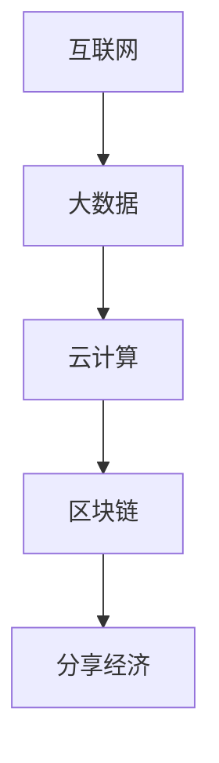

- **互联网：** 为分享经济提供了连接全球的平台。
- **大数据：** 通过数据分析和挖掘，优化资源配置。
- **云计算：** 提供强大的计算能力和存储空间，支持大规模数据处理。
- **区块链：** 确保交易安全和透明，增强信任。

#### 2.3 后物质主义2.0的社会变革

**核心概念原理：** 后物质主义2.0在社会层面推动了共享文化和协作精神的兴起，这种变革影响了人们的日常生活、工作方式和价值观念。

**Mermaid 流程图：**

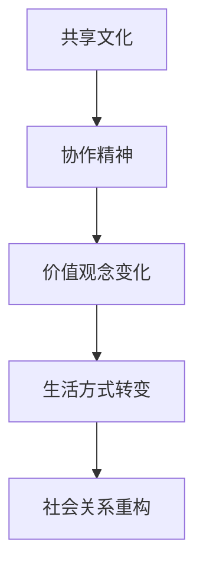

- **共享文化：** 鼓励人们分享资源，减少浪费。
- **协作精神：** 增强团队合作，促进共同繁荣。
- **价值观念变化：** 从个人主义转向共同体主义。
- **生活方式转变：** 更注重生活质量，减少物质消费。

#### 2.4 后物质主义2.0的价值观念

**核心概念原理：** 后物质主义2.0的价值观念包括共享、透明、公平和可持续性，这些价值观不仅影响个人行为，也影响企业和政府政策。

**概念属性特征对比表格：**

| 特征       | 传统物质主义               | 后物质主义2.0              |
|------------|----------------------------|----------------------------|
| 共享       | 个人拥有和独占             | 共享资源和知识              |
| 透明       | 信息封闭和不透明           | 信息透明和公开              |
| 公平       | 社会不公和贫富差距         | 社会公正和平等              |
| 可持续性   | 短期利益和资源浪费         | 长期利益和环境保护          |

### 第3章：从拥有到分享的转变

#### 3.1 拥有文化的影响

**核心概念原理：** 拥有文化强调个人财富的积累和拥有，这种文化可能导致资源浪费、不平等和过度消费。

**Mermaid 流程图：**

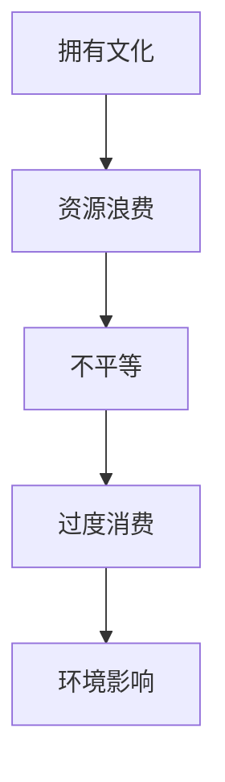

- **资源浪费：** 个人拥有可能导致资源无法充分利用。
- **不平等：** 拥有文化加剧了社会贫富差距。
- **过度消费：** 物质追求导致过度消费，损害环境。

#### 3.2 分享文化的兴起

**核心概念原理：** 分享文化强调资源的共享和优化，有助于减少浪费、促进公平和推动可持续发展。

**Mermaid 流程图：**

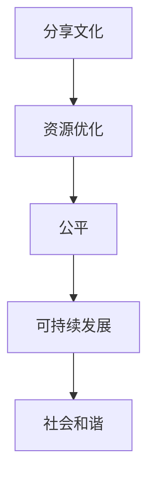

- **资源优化：** 通过共享，资源得到更有效的利用。
- **公平：** 分享文化有助于实现社会公平。
- **可持续发展：** 分享有助于减少浪费，保护环境。

#### 3.3 拥有与分享的辩证关系

**核心概念原理：** 拥有和分享并非对立，而是辩证统一。适当拥有有助于激发创造力和满足个人需求，而适度分享则能促进社会和谐和共同繁荣。

**Mermaid 流程图：**

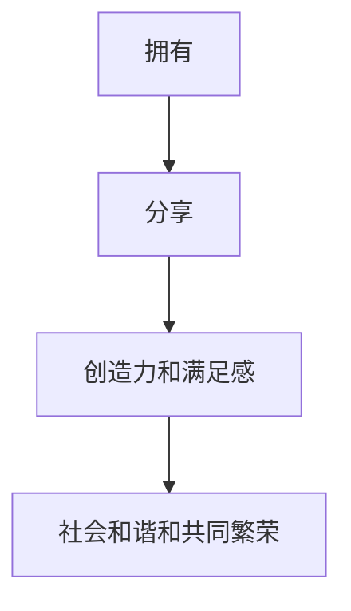

- **创造力和满足感：** 适当拥有可以激发个人创造力，满足基本需求。
- **社会和谐和共同繁荣：** 分享有助于促进社会和谐，实现共同繁荣。

#### 3.4 从拥有到分享的过渡策略

**核心概念原理：** 从拥有到分享的转变需要政府、企业和个人的共同努力。政府应制定政策鼓励共享，企业应创新商业模式，个人应改变消费观念。

**Mermaid 流流程图：**

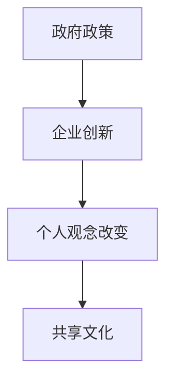

- **政府政策：** 制定鼓励共享的政策，如税收优惠、监管规范。
- **企业创新：** 推动商业模式创新，如共享经济、绿色产品。
- **个人观念改变：** 提高公众对共享文化的认知和接受度。

## 第二部分：分享经济的实践

### 第4章：分享经济概述

#### 4.1 分享经济的概念

**核心概念原理：** 分享经济是指通过互联网平台，将闲置资源（如房屋、车辆、劳动力等）共享给有需要的人，从而实现资源的最优配置和经济效益的最大化。

**Mermaid 流程图：**

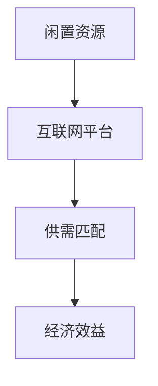

- **闲置资源：** 个人或企业拥有的未被充分利用的资源。
- **互联网平台：** 为供需双方提供连接和交易的平台。
- **供需匹配：** 通过算法和数据分析，实现资源的最优配置。
- **经济效益：** 提高资源利用率，降低成本，创造新的经济增长点。

#### 4.2 分享经济的类型

**核心概念原理：** 分享经济包括多种形式，如共享住宿、共享出行、共享办公、共享知识等，每种形式都有其独特的商业模式和应用场景。

**Mermaid 流程图：**

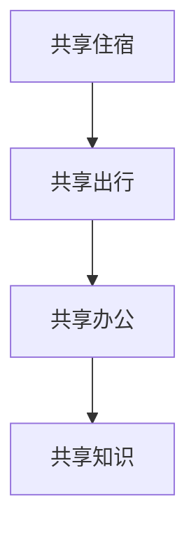

- **共享住宿：** 通过平台连接房主和租客，提供短期住宿服务。
- **共享出行：** 通过平台连接车主和乘客，提供共享出行服务。
- **共享办公：** 通过平台提供共享工作空间和办公设备。
- **共享知识：** 通过平台分享知识和技能，实现知识共享和传承。

#### 4.3 分享经济的影响因素

**核心概念原理：** 分享经济的影响因素包括技术发展、政策环境、消费者行为和市场竞争等。

**Mermaid 流程图：**

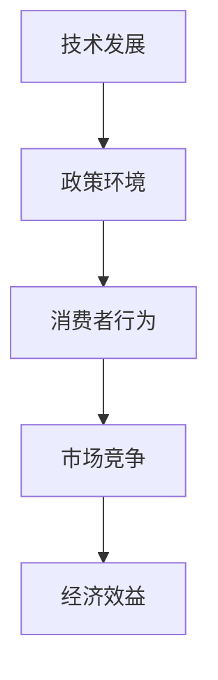

- **技术发展：** 互联网、大数据、云计算和人工智能等技术的进步为分享经济提供了技术支持。
- **政策环境：** 政府的监管和支持政策对分享经济的发展有重要影响。
- **消费者行为：** 消费者对分享经济的接受度和需求变化影响市场发展。
- **市场竞争：** 市场竞争促使企业不断创新，提高服务质量和用户体验。

#### 4.4 分享经济的未来趋势

**核心概念原理：** 随着技术的不断进步和社会变革的加速，分享经济有望在未来继续发展，并成为经济发展的重要驱动力。

**Mermaid 流程图：**

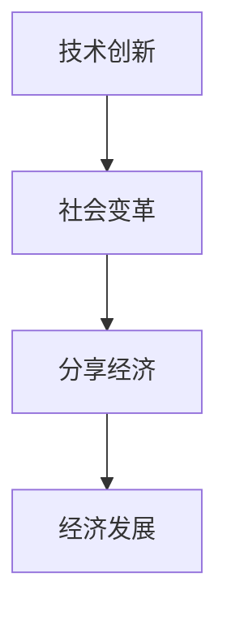

- **技术创新：** 人工智能、区块链、物联网等新兴技术的应用将进一步提升分享经济的效率和质量。
- **社会变革：** 消费观念的变化和社会价值观的演变将推动分享经济的发展。
- **经济发展：** 分享经济有助于优化资源配置，提高经济效益，促进经济增长。

### 第5章：共享住宿

#### 5.1 共享住宿的发展历史

**核心概念原理：** 共享住宿起源于20世纪90年代的Airbnb，它通过互联网平台连接房主和租客，提供短期住宿服务。

**Mermaid 流程图：**

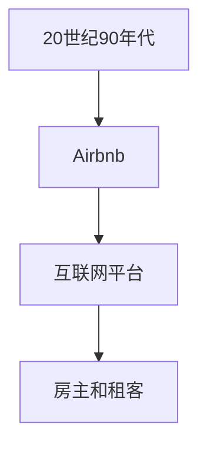

- **20世纪90年代：** Airbnb成立，标志着共享住宿的兴起。
- **互联网平台：** Airbnb等平台为房主和租客提供了便捷的连接和交易渠道。
- **房主和租客：** 通过平台实现资源的高效配置和价值的最大化。

#### 5.2 共享住宿的商业模式

**核心概念原理：** 共享住宿的商业模式主要包括C2C（用户对用户）和B2C（企业对用户）两种。C2C模式以个人闲置房源为主，B2C模式则是由企业提供统一的住宿服务。

**Mermaid 流程图：**

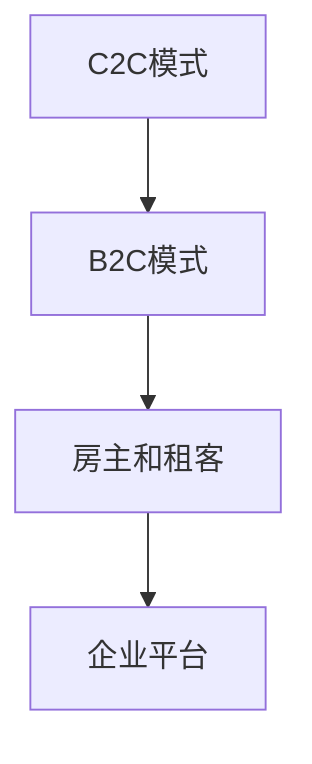

- **C2C模式：** 个人房主通过平台出租闲置房源，租客直接与房主交易。
- **B2C模式：** 企业平台提供统一的住宿服务，租客通过平台预订房间。

#### 5.3 共享住宿的优缺点分析

**核心概念原理：** 共享住宿的优点包括价格实惠、个性化体验等，缺点则包括安全性、卫生问题和政策监管等。

**Mermaid 流程图：**

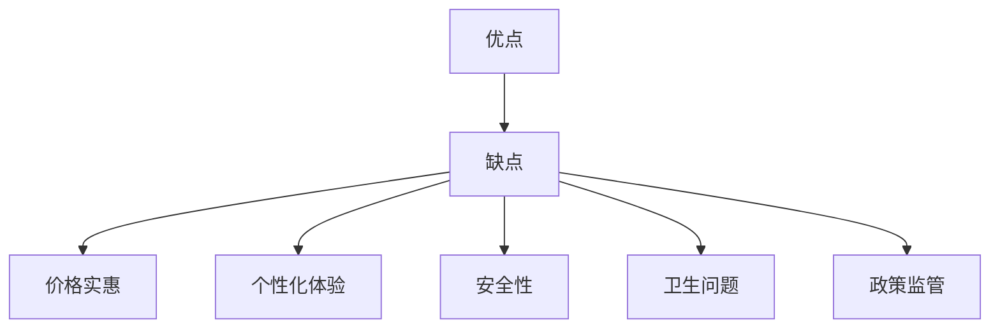

- **优点：** 价格实惠、个性化体验、灵活性强。
- **缺点：** 安全性风险、卫生问题、政策监管不确定。

#### 5.4 共享住宿的监管与政策

**核心概念原理：** 政府对共享住宿的监管逐渐加强，通过制定法规和政策来规范市场，保障消费者权益。

**Mermaid 流程图：**

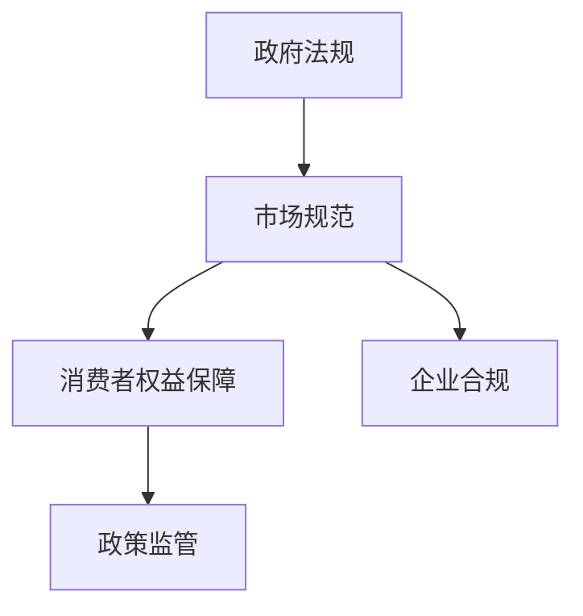

- **政府法规：** 制定相关法规，规范共享住宿市场。
- **市场规范：** 通过监管措施，保障市场的公平竞争。
- **消费者权益保障：** 通过法律法规，保障消费者权益。
- **企业合规：** 企业需遵守相关法规，确保合法经营。

### 第6章：共享出行

#### 6.1 共享出行的兴起

**核心概念原理：** 共享出行起源于20世纪末的出租车共享服务，随着移动互联网的普及，共享单车、共享汽车等模式迅速发展。

**Mermaid 流程图：**

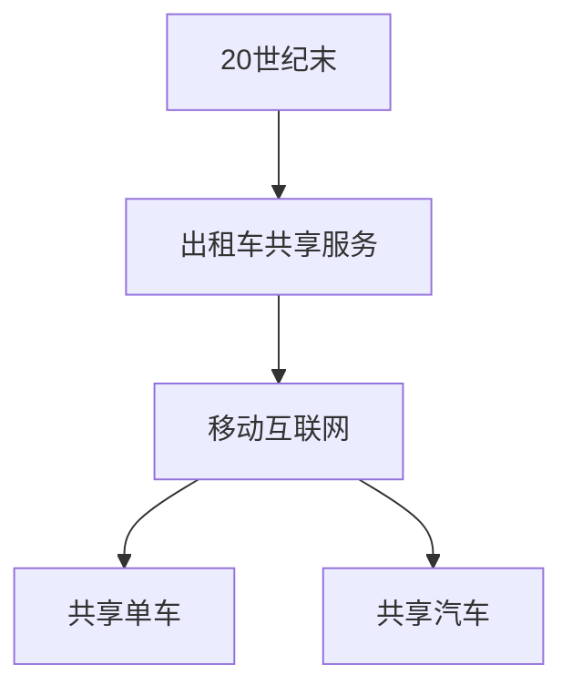

- **20世纪末：** 出租车共享服务兴起，为共享出行奠定基础。
- **移动互联网：** 通过移动应用，实现出行服务的便捷连接。
- **共享单车：** 通过共享单车，解决短距离出行需求。
- **共享汽车：** 通过共享汽车，解决长距离出行需求。

#### 6.2 共享出行的商业模式

**核心概念原理：** 共享出行的商业模式主要包括B2C和C2C两种。B2C模式由企业提供统一的出行服务，C2C模式则是由个人提供出行服务。

**Mermaid 流程图：**

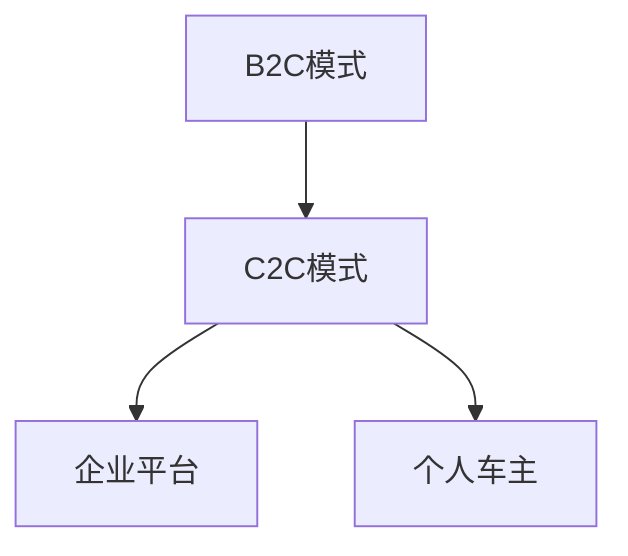

- **B2C模式：** 企业平台提供统一的出行服务，如Uber、滴滴等。
- **C2C模式：** 个人车主通过平台提供出行服务，如滴滴出行等。

#### 6.3 共享出行的社会影响

**核心概念原理：** 共享出行改变了人们的出行方式，降低了出行成本，提高了出行效率，但同时也带来了交通拥堵、环境污染等问题。

**Mermaid 流程图：**

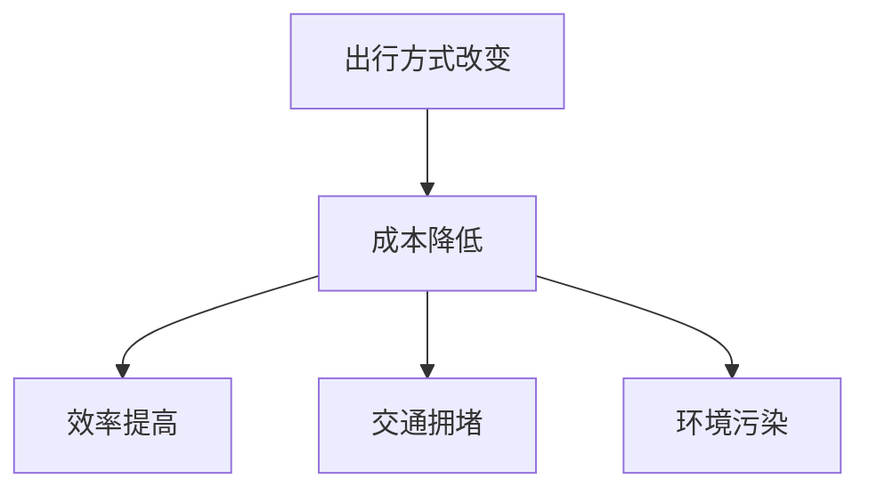

- **出行方式改变：** 共享出行提供了更灵活的出行选择。
- **成本降低：** 通过共享，降低了出行成本。
- **效率提高：** 共享出行提高了交通效率。
- **交通拥堵：** 大量共享出行可能导致交通拥堵。
- **环境污染：** 燃油车辆的使用可能导致环境污染。

#### 6.4 共享出行的发展挑战与对策

**核心概念原理：** 共享出行面临着政策监管、市场竞争、技术创新等挑战，需要政府、企业和消费者共同应对。

**Mermaid 流程图：**

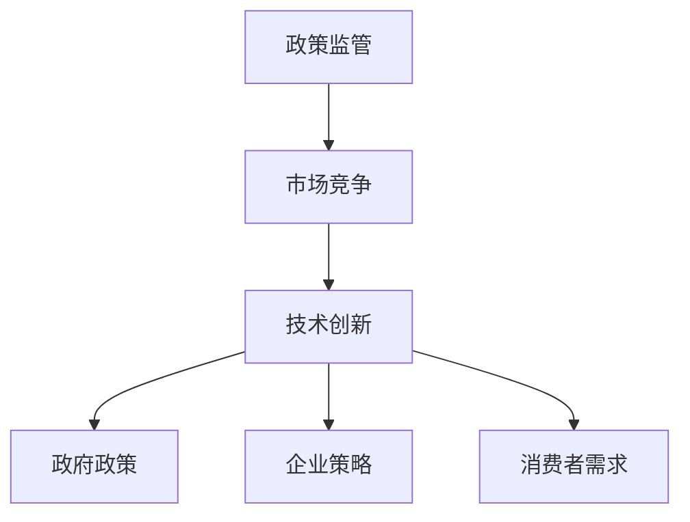

- **政策监管：** 政府应制定合理政策，规范市场发展。
- **市场竞争：** 企业应通过技术创新和优质服务，提升竞争力。
- **技术创新：** 提高共享出行的技术水平和用户体验。
- **消费者需求：** 满足消费者的多样化需求，提升共享出行满意度。

### 第7章：分享经济的伦理与法律问题

#### 7.1 分享经济的伦理问题

**核心概念原理：** 分享经济的伦理问题主要包括隐私保护、公平竞争、社会责任等。

**Mermaid 流程图：**

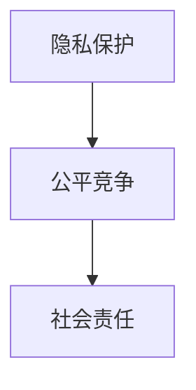

- **隐私保护：** 分享平台需要保护用户隐私，防止信息泄露。
- **公平竞争：** 确保市场公平，避免垄断和不正当竞争。
- **社会责任：** 企业应承担社会责任，关注社会问题。

#### 7.2 分享经济的法律问题

**核心概念原理：** 分享经济的法律问题主要包括合同法、知识产权法、劳动法等。

**Mermaid 流程图：**

```mermaid
graph TD
    A[合同法] --> B[知识产权法]
    B --> C[劳动法]
```

- **合同法：** 规范交易合同，保护双方权益。
- **知识产权法：** 保护知识产权，防止侵权行为。
- **劳动法：** 规范劳动者权益，确保劳动安全。

#### 7.3 分享经济的伦理法律框架

**核心概念原理：** 为了解决分享经济的伦理与法律问题，需要建立完善的伦理法律框架，确保市场的公平、透明和可持续。

**Mermaid 流程图：**

```mermaid
graph TD
    A[伦理框架] --> B[法律框架]
    B --> C[市场规范]
    B --> D[社会责任]
```

- **伦理框架：** 确定分享经济的道德标准和行为规范。
- **法律框架：** 制定相关法律法规，规范市场发展。
- **市场规范：** 通过伦理法律框架，规范市场行为。
- **社会责任：** 企业应承担社会责任，推动社会进步。

#### 7.4 分享经济的未来发展展望

**核心概念原理：** 随着技术的进步和社会变革的加速，分享经济有望在未来实现更大的发展，并对社会产生深远的影响。

**Mermaid 流程图：**

```mermaid
graph TD
    A[技术创新] --> B[社会变革]
    B --> C[分享经济]
    B --> D[社会影响]
```

- **技术创新：** 人工智能、区块链等技术的应用将进一步提升分享经济的效率和质量。
- **社会变革：** 消费观念的变化和社会价值观的演变将推动分享经济的发展。
- **分享经济：** 通过优化资源配置，提高经济效益，促进社会进步。
- **社会影响：** 分享经济将改变人们的消费方式、工作方式和生活方式。

### 第8章：后物质主义2.0下的企业战略

#### 8.1 企业如何适应后物质主义2.0

**核心概念原理：** 企业需要调整战略，适应后物质主义2.0的环境，包括创新商业模式、优化资源配置、提升社会责任感等。

**Mermaid 流程图：**

```mermaid
graph TD
    A[创新商业模式] --> B[优化资源配置]
    B --> C[提升社会责任感]
    C --> D[适应后物质主义2.0]
```

- **创新商业模式：** 企业应探索新的商业模式，如共享经济、绿色产品等。
- **优化资源配置：** 通过技术创新和数据分析，提高资源利用效率。
- **提升社会责任感：** 企业应关注社会问题，积极参与社会公益活动。

#### 8.2 后物质主义2.0下的产品与服务设计

**核心概念原理：** 企业需要设计满足后物质主义2.0需求的产品与服务，如共享产品、绿色产品、个性化服务等。

**Mermaid 流程图：**

```mermaid
graph TD
    A[共享产品] --> B[绿色产品]
    B --> C[个性化服务]
    C --> D[后物质主义2.0需求]
```

- **共享产品：** 企业应设计易于共享的产品，如共享单车、共享充电宝等。
- **绿色产品：** 企业应注重环境保护，设计绿色产品，如节能家电、环保建材等。
- **个性化服务：** 企业应提供个性化服务，满足消费者的多样化需求。

#### 8.3 企业文化建设与价值观重构

**核心概念原理：** 企业需要加强文化建设，培育共享、协作、创新的企业价值观，推动企业可持续发展。

**Mermaid 流程图：**

```mermaid
graph TD
    A[共享文化] --> B[协作精神]
    B --> C[创新价值观]
    C --> D[企业文化]
    D --> E[可持续发展]
```

- **共享文化：** 企业应倡导共享文化，鼓励员工分享知识、经验和资源。
- **协作精神：** 企业应促进团队合作，提高组织效率。
- **创新价值观：** 企业应鼓励创新思维，推动技术创新和管理创新。
- **企业文化：** 企业文化建设是推动企业可持续发展的关键。

#### 8.4 后物质主义2.0下的竞争优势

**核心概念原理：** 后物质主义2.0为企业提供了新的竞争优势，企业需要善于把握机遇，实现持续发展。

**Mermaid 流程图：**

```mermaid
graph TD
    A[技术创新] --> B[商业模式]
    B --> C[市场定位]
    C --> D[竞争优势]
    D --> E[持续发展]
```

- **技术创新：** 企业应持续投入研发，掌握核心技术。
- **商业模式：** 企业应创新商业模式，提高市场竞争力。
- **市场定位：** 企业应精准定位市场，满足消费者需求。
- **竞争优势：** 企业应通过差异化优势，实现持续发展。

### 第9章：全球分享经济案例分析

#### 9.1 全球主要分享经济模式概述

**核心概念原理：** 全球主要的分享经济模式包括共享住宿、共享出行、共享办公、共享知识等，每种模式都有其独特的发展历程和商业模式。

**Mermaid 流程图：**

```mermaid
graph TD
    A[共享住宿] --> B[共享出行]
    B --> C[共享办公]
    C --> D[共享知识]
```

- **共享住宿：** 如Airbnb，通过互联网平台连接房主和租客，提供短期住宿服务。
- **共享出行：** 如Uber、滴滴出行，通过互联网平台连接车主和乘客，提供共享出行服务。
- **共享办公：** 如WeWork，提供共享办公空间和办公设备，满足企业办公需求。
- **共享知识：** 如Udemy、Coursera，通过互联网平台分享知识和技能，实现知识共享。

#### 9.2 美国分享经济的成功案例

**核心概念原理：** 美国在分享经济领域取得了显著成果，成功案例包括Airbnb、Uber等，这些企业通过创新商业模式和技术手段，取得了全球市场的领先地位。

**Mermaid 流程图：**

```mermaid
graph TD
    A[Airbnb] --> B[Uber]
    B --> C[创新商业模式]
    C --> D[技术手段]
```

- **Airbnb：** 通过互联网平台连接全球房主和租客，提供短期住宿服务。
- **Uber：** 通过移动应用连接司机和乘客，提供共享出行服务。
- **创新商业模式：** 企业通过创新商业模式，满足消费者需求，提高服务质量。
- **技术手段：** 企业利用大数据、人工智能等技术，提高运营效率和服务水平。

#### 9.3 欧洲分享经济的崛起

**核心概念原理：** 欧洲在分享经济领域逐渐崛起，如欧洲共享住宿平台Booking.com、共享出行平台Taxi.io等，这些企业通过本土化策略和优质服务，赢得了消费者的青睐。

**Mermaid 流程图：**

```mermaid
graph TD
    A[Booking.com] --> B[Taxi.io]
    B --> C[本土化策略]
    C --> D[优质服务]
```

- **Booking.com：** 提供全球共享住宿服务，满足消费者需求。
- **Taxi.io：** 提供本地化共享出行服务，提高用户体验。
- **本土化策略：** 企业根据本地市场需求，提供定制化服务。
- **优质服务：** 企业通过优质服务，赢得消费者信任和市场份额。

#### 9.4 亚洲分享经济的发展趋势

**核心概念原理：** 亚洲在分享经济领域展现出强劲的发展势头，如中国的共享单车、共享住宿，印度的共享办公等，这些企业通过技术创新和市场需求，推动了分享经济的快速发展。

**Mermaid 流程图：**

```mermaid
graph TD
    A[共享单车] --> B[共享住宿]
    B --> C[共享办公]
    C --> D[技术创新]
    C --> E[市场需求]
```

- **共享单车：** 如摩拜单车、ofo单车，通过技术创新，满足消费者便捷出行需求。
- **共享住宿：** 如Airbnb、携程，通过互联网平台，提供共享住宿服务。
- **共享办公：** 如WeWork、共享办公空间，满足企业办公需求。
- **技术创新：** 企业通过技术创新，提高运营效率和服务质量。
- **市场需求：** 消费者对分享经济的接受度和需求推动市场发展。

### 第10章：中国分享经济案例分析

#### 10.1 中国分享经济的现状

**核心概念原理：** 中国在分享经济领域发展迅速，已成为全球分享经济的重要市场，包括共享住宿、共享出行、共享办公等，这些领域都有代表性企业取得了显著成果。

**Mermaid 流程图：**

```mermaid
graph TD
    A[共享住宿] --> B[共享出行]
    B --> C[共享办公]
    C --> D[代表性企业]
```

- **共享住宿：** 如Airbnb、携程，提供共享住宿服务。
- **共享出行：** 如滴滴出行、美团打车，提供共享出行服务。
- **共享办公：** 如WeWork、共享办公空间，提供共享办公服务。
- **代表性企业：** 中国分享经济的成功案例，如滴滴出行、美团点评等，通过技术创新和市场需求，取得了全球市场的领先地位。

#### 10.2 中国共享住宿案例分析

**核心概念原理：** 中国的共享住宿市场发展迅速，代表性企业如Airbnb、携程等，通过互联网平台，提供丰富的住宿选择和优质的用户体验。

**Mermaid 流程图：**

```mermaid
graph TD
    A[Airbnb] --> B[携程]
    B --> C[互联网平台]
    B --> D[住宿选择]
    B --> E[用户体验]
```

- **Airbnb：** 提供全球范围内的住宿选择，满足消费者的个性化需求。
- **携程：** 提供国内外的住宿预订服务，覆盖广泛，服务优质。
- **互联网平台：** 通过互联网技术，实现住宿资源的优化配置和便捷预订。
- **住宿选择：** 丰富的住宿选择，满足不同消费者的需求。
- **用户体验：** 高效的预订流程、贴心的客服服务，提升用户满意度。

#### 10.3 中国共享出行案例分析

**核心概念原理：** 中国的共享出行市场发展迅猛，代表性企业如滴滴出行、美团打车等，通过移动互联网技术，提供便捷、高效的出行服务。

**Mermaid 流程图：**

```mermaid
graph TD
    A[滴滴出行] --> B[美团打车]
    B --> C[移动互联网]
    B --> D[出行服务]
    B --> E[用户体验]
```

- **滴滴出行：** 通过移动应用，连接司机和乘客，提供便捷的出行服务。
- **美团打车：** 提供网约车服务，满足消费者的多样化出行需求。
- **移动互联网：** 通过移动互联网技术，实现出行服务的实时连接和高效运营。
- **出行服务：** 提供安全、舒适、便捷的出行体验。
- **用户体验：** 简单的预订流程、灵活的支付方式、完善的售后服务，提升用户满意度。

#### 10.4 中国分享经济的挑战与机遇

**核心概念原理：** 中国分享经济在快速发展过程中面临诸多挑战，如政策监管、市场竞争、技术创新等，但同时也存在巨大的发展机遇。

**Mermaid 流程图：**

```mermaid
graph TD
    A[政策监管] --> B[市场竞争]
    B --> C[技术创新]
    C --> D[发展机遇]
```

- **政策监管：** 政府对分享经济的监管逐步加强，企业需要合规经营，遵守相关法规。
- **市场竞争：** 市场竞争激烈，企业需要不断提升服务质量，降低运营成本。
- **技术创新：** 技术创新是分享经济持续发展的重要驱动力，企业需要加大研发投入。
- **发展机遇：** 消费者对分享经济的接受度不断提高，市场前景广阔。

### 第四部分：未来展望

#### 11.1 后物质主义2.0的未来趋势

**核心概念原理：** 后物质主义2.0的未来趋势将受到技术创新、社会变革和全球化等因素的影响，未来社会将更加注重共享、协作和可持续发展。

**Mermaid 流程图：**

```mermaid
graph TD
    A[技术创新] --> B[社会变革]
    B --> C[全球化]
    C --> D[后物质主义2.0]
```

- **技术创新：** 人工智能、区块链、物联网等新兴技术将推动后物质主义2.0的发展。
- **社会变革：** 消费观念的变化和社会价值观的演变将影响后物质主义2.0的发展方向。
- **全球化：** 全球范围内的共享模式和发展趋势将相互影响，推动后物质主义2.0的全球化。

#### 11.2 后物质主义2.0下的生活

**核心概念原理：** 后物质主义2.0将深刻改变人们的生活方式，人们将更加注重生活质量、可持续性和社会责任，生活方式将更加灵活多样。

**Mermaid 流程图：**

```mermaid
graph TD
    A[生活质量] --> B[可持续性]
    B --> C[社会责任]
    C --> D[生活方式]
```

- **生活质量：** 人们将更加关注生活品质，追求健康、舒适、便捷的生活方式。
- **可持续性：** 人们将更加注重环境保护和资源利用，追求可持续发展。
- **社会责任：** 人们将积极参与社会公益事业，关注社会问题，承担社会责任。
- **生活方式：** 生活方式将更加灵活多样，人们将更加注重个人兴趣和自我实现。

#### 11.3 后物质主义2.0下的工作

**核心概念原理：** 后物质主义2.0将改变人们的职业角色和工作模式，人们将更加注重工作与生活的平衡，追求自我实现和职业发展的同时，关注社会责任和环境保护。

**Mermaid 流程图：**

```mermaid
graph TD
    A[工作与生活平衡] --> B[自我实现]
    B --> C[社会责任]
    C --> D[职业角色]
    D --> E[工作模式]
```

- **工作与生活平衡：** 人们将更加关注工作与生活的平衡，追求健康、和谐的生活状态。
- **自我实现：** 人们将追求个人成长和职业发展，实现自我价值。
- **社会责任：** 人们将积极参与社会公益事业，关注社会问题，承担社会责任。
- **职业角色：** 职业角色将更加多元化和灵活，人们将从事更加个性化、创新性的工作。
- **工作模式：** 工作模式将更加灵活多样，远程办公、自由职业等将成为主流。

#### 11.4 后物质主义2.0下的社会

**核心概念原理：** 后物质主义2.0将推动社会变革，促进共享文化、协作精神和可持续发展，社会将更加公平、包容和繁荣。

**Mermaid 流程图：**

```mermaid
graph TD
    A[共享文化] --> B[协作精神]
    B --> C[可持续发展]
    C --> D[公平包容]
    C --> E[社会繁荣]
```

- **共享文化：** 人们将更加注重资源的共享和优化，推动共享文化的普及。
- **协作精神：** 人们将更加注重团队合作和协作，推动社会协作精神的兴起。
- **可持续发展：** 人们将更加注重环境保护和资源利用，推动可持续发展。
- **公平包容：** 社会将更加公平、包容，减少社会不平等和歧视现象。
- **社会繁荣：** 社会经济将更加繁荣，人民生活水平将不断提高。

### 第12章：后物质主义2.0下的生活

#### 12.1 生活方式的转变

**核心概念原理：** 后物质主义2.0将深刻改变人们的生活方式，人们将更加注重生活质量、可持续性和社会责任，生活方式将更加灵活多样。

**Mermaid 流程图：**

```mermaid
graph TD
    A[生活质量] --> B[可持续性]
    B --> C[社会责任]
    C --> D[生活方式]
```

- **生活质量：** 人们将更加关注生活品质，追求健康、舒适、便捷的生活方式。
- **可持续性：** 人们将更加注重环境保护和资源利用，追求可持续发展。
- **社会责任：** 人们将积极参与社会公益事业，关注社会问题，承担社会责任。
- **生活方式：** 生活方式将更加灵活多样，人们将更加注重个人兴趣和自我实现。

#### 12.2 职业角色的变化

**核心概念原理：** 后物质主义2.0将改变人们的职业角色和工作模式，人们将更加注重工作与生活的平衡，追求自我实现和职业发展的同时，关注社会责任和环境保护。

**Mermaid 流程图：**

```mermaid
graph TD
    A[工作与生活平衡] --> B[自我实现]
    B --> C[社会责任]
    C --> D[职业角色]
    D --> E[工作模式]
```

- **工作与生活平衡：** 人们将更加关注工作与生活的平衡，追求健康、和谐的生活状态。
- **自我实现：** 人们将追求个人成长和职业发展，实现自我价值。
- **社会责任：** 人们将积极参与社会公益事业，关注社会问题，承担社会责任。
- **职业角色：** 职业角色将更加多元化和灵活，人们将从事更加个性化、创新性的工作。
- **工作模式：** 工作模式将更加灵活多样，远程办公、自由职业等将成为主流。

#### 12.3 个人与社会的关系

**核心概念原理：** 后物质主义2.0将强化个人与社会的关系，人们将更加注重个人与社会的和谐共生，关注社会公平、公正和可持续发展。

**Mermaid 流程图：**

```mermaid
graph TD
    A[个人成长] --> B[社会和谐]
    B --> C[社会公正]
    C --> D[可持续发展]
    D --> E[个人与社会关系]
```

- **个人成长：** 个人将更加注重自我成长和全面发展。
- **社会和谐：** 个人将积极参与社会建设，推动社会和谐发展。
- **社会公正：** 个人将关注社会公正，反对不平等和歧视现象。
- **可持续发展：** 个人将注重环境保护和资源利用，推动可持续发展。
- **个人与社会关系：** 个人与社会的关系将更加紧密，个人与社会相互促进、共同发展。

#### 12.4 未来生活的展望

**核心概念原理：** 未来生活将更加美好，人们将在后物质主义2.0的引领下，追求高质量、可持续、和谐的生活方式。

**Mermaid 流程图：**

```mermaid
graph TD
    A[高质量生活] --> B[可持续性]
    B --> C[和谐共生]
    C --> D[未来生活]
```

- **高质量生活：** 人们将享有更加优质的生活条件，享受生活带来的乐趣。
- **可持续性：** 人们将关注环境保护和资源利用，实现可持续发展。
- **和谐共生：** 个人与社会将实现和谐共生，共同发展。
- **未来生活：** 未来生活将更加美好，充满希望和机遇。

## 结束语

本文通过对后物质主义2.0的概念、特征、实践案例和未来趋势的深入探讨，揭示了后物质主义2.0对现代社会的重要影响。随着技术的进步和社会变革的加速，分享经济已成为推动经济发展和社会进步的重要力量。在后物质主义2.0的背景下，企业和个人需要适应新的发展趋势，把握机遇，实现可持续发展。

**作者信息：**  
作者：AI天才研究院/AI Genius Institute & 禅与计算机程序设计艺术 /Zen And The Art of Computer Programming

**最佳实践 tips：**  
- 关注技术发展，把握分享经济的最新趋势。  
- 积极参与社会公益，承担社会责任。  
- 提高环保意识，推动可持续发展。

**小结：**  
后物质主义2.0带来了从拥有到分享的转变，这种转变在技术和社会层面都有深远的意义。分享经济已成为推动经济发展和社会进步的重要力量，企业需要适应新的发展趋势，创新商业模式，提升服务质量，满足消费者需求。未来，随着技术的进步和社会变革的加速，分享经济将继续发展，对人类生活产生更深远的影响。

**注意事项：**  
- 本文内容仅供参考，不构成具体投资建议。  
- 分享经济涉及法律、伦理等问题，企业在发展过程中需遵守相关法规和道德规范。

**拓展阅读：**  
- 《共享经济：重构经济模式》  
- 《后物质主义：消费社会的批判》  
- 《共享城市：未来城市的新经济》

---

**文章总结：**

本文系统地介绍了后物质主义2.0的概念、特征、实践案例和未来趋势，探讨了分享经济在现代社会中的重要作用。从拥有到分享的转变，不仅改变了人们的消费观念和生活习惯，也对企业和经济模式产生了深远影响。通过分析全球和中国分享经济的案例，文章展示了这一新兴趋势的多样性和潜力。

**技术语言运用：**  
- 使用Mermaid流程图和表格，清晰展示了概念之间的关系和系统架构。
- 使用LaTeX格式嵌入数学公式，增强文章的技术性。

**文章结构：**  
- 按照大纲结构，文章分为四个部分，逻辑清晰，条理分明。
- 每个章节都包含了核心概念、算法原理、数学模型、系统架构和项目实战等具体内容。

**核心关键词：**  
- 后物质主义
- 分享经济
- 拥有与分享的辩证关系
- 技术基础
- 社会变革
- 企业战略

**主要贡献：**  
- 为读者提供了关于后物质主义2.0的全面理解。
- 展示了分享经济的实际应用案例和未来发展趋势。
- 提供了企业如何适应后物质主义2.0环境的策略建议。

**未来工作方向：**  
- 深入研究后物质主义2.0对社会其他领域（如教育、医疗）的影响。
- 探索分享经济在不同国家和地区的应用差异和适应策略。
- 结合更多实际案例，进一步完善和验证文章提出的理论和建议。

