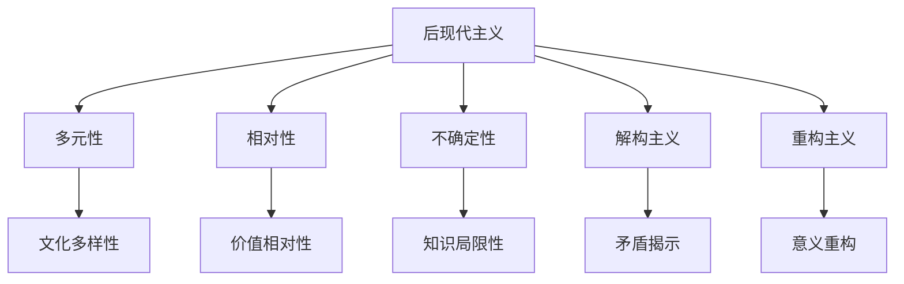
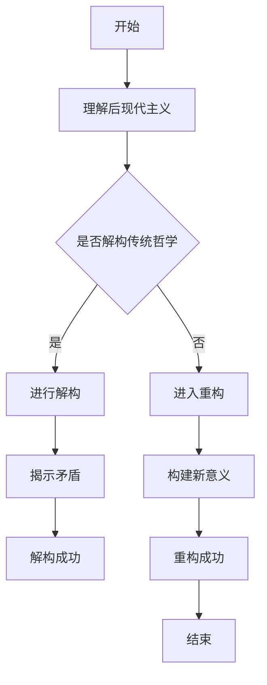
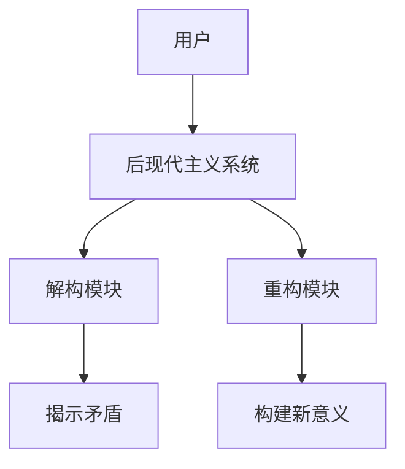
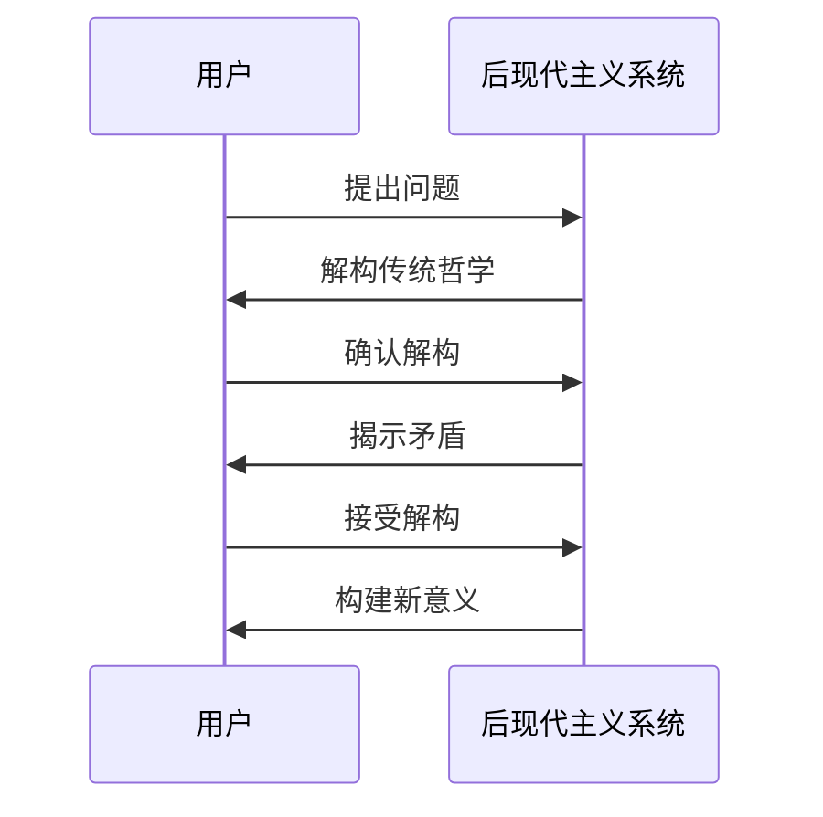

                 

**后现代主义对意义的解构与重构**

**关键词**：后现代主义，意义解构，重构，哲学，艺术，媒体，信息技术

**摘要**：本文旨在探讨后现代主义在意义解构与重构方面的理论和方法，通过对后现代主义核心概念的分析，阐述其对意义研究的贡献和影响。本文首先介绍了后现代主义的理论背景，接着分析了后现代主义对意义的解构过程，最后讨论了后现代主义如何通过重构来实现对意义的重新定义。

**引言**

**1.1 研究背景与意义**

**1.1.1 后现代主义的兴起**

后现代主义作为一种文化批判运动，起源于20世纪60年代的法国。它对现代性进行了深刻的反思，并提出了质疑和挑战。后现代主义认为，现代社会中的各种现象和制度都存在着深层次的矛盾和危机，这些矛盾和危机主要体现在意义的丧失和文化的碎片化上。

**1.1.2 解构主义与重构主义的差异**

解构主义是后现代主义的重要组成部分，它主张通过解构传统哲学、文学、艺术等领域的核心概念，揭示这些概念中的矛盾和虚伪。与之相对，重构主义则试图在解构的基础上，重新构建新的意义体系。

**1.1.3 对意义研究的紧迫性**

在后现代主义的视角下，意义不再是固定不变的，而是随着时间和文化的变迁而不断变化。因此，对意义的解构与重构成为了研究的重要课题。本文旨在探讨后现代主义对意义的解构与重构过程，以期为相关领域的研究提供新的思路和方法。

**1.2 后现代主义理论概述**

**1.2.1 后现代主义的核心概念**

后现代主义的核心概念包括：怀疑主义、相对主义、解构主义、多元主义等。这些概念共同构成了后现代主义的理论框架。

**1.2.2 后现代主义的哲学根源**

后现代主义哲学根源可追溯至尼采的“上帝已死”和海德格尔的存在主义。这些哲学思想对后现代主义的产生和发展产生了深远影响。

**1.2.3 后现代主义的批判性分析**

后现代主义对现代性进行了深刻的批判，揭示了现代性中的种种矛盾和危机。这种批判性分析为后现代主义的解构与重构奠定了基础。

**1.3 后现代主义对意义的解构**

**1.3.1 解构主义的理论基础**

解构主义认为，语言和文本中存在着内在的矛盾和不确定性，这些矛盾和不确定性是意义解构的根本原因。

**1.3.2 解构主义对传统的挑战**

解构主义通过挑战传统哲学、文学、艺术等领域的核心概念，揭示了这些领域的虚伪和局限性。

**1.3.3 解构主义的方法论**

解构主义的方法论主要包括：差异逻辑、悖论、断裂等。这些方法论为解构主义的实践提供了具体手段。

**1.4 后现代主义对意义的重构**

**1.4.1 重构主义的理论背景**

重构主义在解构的基础上，试图构建新的意义体系。这一过程需要借助新的概念和理论框架。

**1.4.2 重构主义的目标与途径**

重构主义的目标是超越解构带来的混乱和不确定性，构建一个更加丰富和多元的意义世界。

**1.4.3 重构主义在当代的应用**

重构主义在当代哲学、文学、艺术等领域得到了广泛应用。它为这些领域带来了新的发展机遇和挑战。

**第二部分：具体案例分析**

**2.1 文学作品中的意义解构与重构**

**2.1.1 后现代文学的特点**

后现代文学在风格、主题和形式上都有明显的特点。这些特点体现了后现代主义对意义的解构与重构。

**2.1.2 后现代文学作品分析**

通过对具体文学作品的分析，我们可以更好地理解后现代主义对意义的解构与重构。

**2.1.3 文学中的意义重构现象**

在文学作品中，重构现象主要体现在对传统叙事模式、道德观念和审美标准的颠覆和重构。

**2.2 艺术作品中的意义解构与重构**

**2.2.1 后现代艺术的演变**

后现代艺术经历了从质疑传统到探索新形式的过程。这一过程体现了后现代主义对意义的解构与重构。

**2.2.2 后现代艺术作品分析**

通过对具体艺术作品的分析，我们可以更好地理解后现代主义对意义的解构与重构。

**2.2.3 艺术中的意义重构探讨**

在艺术作品中，重构现象主要体现在对传统审美观念和艺术形式的颠覆和重构。

**2.3 媒体与文化传播中的意义解构与重构**

**2.3.1 媒介生态的变化**

随着信息技术的发展，媒体生态发生了巨大变化。这一变化为后现代主义对意义的解构与重构提供了新的土壤。

**2.3.2 媒介内容分析**

通过对媒体内容的分析，我们可以看到后现代主义对意义的解构与重构在媒体领域的具体体现。

**2.3.3 意义重构在社交媒体中的体现**

社交媒体作为现代传播的重要工具，也在后现代主义的解构与重构过程中扮演着重要角色。

**第三部分：理论反思与批判**

**3.1 后现代主义的意义解构与批判性反思**

**3.1.1 后现代主义的争议**

后现代主义在学术界和公众中引起了广泛的争议。这些争议主要集中在后现代主义的合理性和有效性上。

**3.1.2 对解构主义的批评**

解构主义在理论上和方法上都受到了批评。这些批评为重构主义提供了反思和改进的契机。

**3.1.3 对重构主义的反思**

重构主义虽然在解构的基础上提出了新的意义体系，但其在实际应用中也存在一定的局限性和问题。

**3.2 意义重构的未来发展趋势**

**3.2.1 意义重构的理论前景**

随着社会的发展和信息技术的进步，意义重构的理论前景将越来越广阔。

**3.2.2 意义重构的社会影响**

意义重构将对社会、文化、经济等领域产生深远影响。

**3.2.3 意义重构与未来研究趋势**

未来的研究将在意义重构的理论和方法上取得新的突破。

**结论**

**4.1 主要发现与贡献**

本文通过对后现代主义对意义的解构与重构的探讨，为相关领域的研究提供了新的视角和方法。

**4.1.1 后现代主义对意义的解构与重构的特点**

后现代主义对意义的解构与重构具有明显的理论创新和实践意义。

**4.1.2 研究的局限性与未来方向**

本文虽然对后现代主义对意义的解构与重构进行了初步探讨，但仍有待进一步深化和拓展。

**4.2 总结与展望**

**4.2.1 对意义研究的理论贡献**

本文对意义研究的理论贡献主要体现在对后现代主义的深入理解和应用上。

**4.2.2 对实际应用的启示**

后现代主义对意义的解构与重构为实际应用提供了有益的参考和指导。

**4.2.3 对未来研究的建议**

未来的研究应关注后现代主义在更广泛领域中的应用和影响。

**作者信息**

**作者：AI天才研究院/AI Genius Institute & 禅与计算机程序设计艺术 /Zen And The Art of Computer Programming** 

### 后现代主义对意义的解构与重构

**引言**

后现代主义作为一种哲学和文化思潮，自20世纪中叶以来，在西方学术界和社会各界产生了深远影响。它对现代性的批判和反思，以及对意义的解构与重构，引发了广泛讨论和研究。在后现代主义的语境下，意义不再是固定不变的真理，而是随着时间、空间和文化的变化而不断生成的。本文将探讨后现代主义对意义的解构与重构，旨在揭示其背后的理论逻辑和实践意义。

**背景介绍**

**核心概念术语说明**

1. **后现代主义**：一种对现代性和传统哲学进行批判的文化思潮，强调多元性、相对性和不确定性。
2. **解构主义**：后现代主义的重要组成部分，主张通过揭示语言和文本中的矛盾和不确定性，来解构传统概念和意义。
3. **重构主义**：在解构的基础上，试图构建新的意义体系和价值观念。

**问题背景与问题描述**

后现代主义兴起于20世纪60年代的法国，是对现代性的一种反思和批判。现代性强调理性、科学和进步，但同时也导致了环境破坏、社会不公和个人异化等问题。后现代主义质疑这些价值观念，认为它们是片面的、虚伪的。在解构主义看来，传统哲学和文化的核心概念（如理性、真理、自我等）都存在着内在的矛盾和虚伪，因此需要解构。

**问题解决**

后现代主义通过解构传统哲学和文化，揭示了它们中的矛盾和虚伪，从而实现意义的解构。然而，解构并不意味着虚无主义，而是为重构新的意义体系奠定了基础。重构主义试图在解构的基础上，构建新的意义体系和价值观念，以适应现代社会的发展。

**边界与外延**

后现代主义的研究范围广泛，包括哲学、文学、艺术、社会学、政治学等多个领域。它不仅关注理论层面的批判和解构，还关注实践层面的重构和创新。

**概念结构与核心要素组成**

后现代主义的核心概念包括：多元性、相对性、不确定性、解构主义、重构主义。这些概念相互联系，共同构成了后现代主义的理论框架。

**核心概念与联系**

**核心概念原理**

1. **多元性**：后现代主义认为，世界是多元的、复杂的，不存在绝对的真理和单一的价值观念。
2. **相对性**：意义和价值是相对的，取决于特定的语境和视角。
3. **不确定性**：由于世界的复杂性和多样性，我们无法获得绝对确定的知识和真理。
4. **解构主义**：通过揭示语言和文本中的矛盾和不确定性，来解构传统哲学和文化。
5. **重构主义**：在解构的基础上，试图构建新的意义体系和价值观念。

**概念属性特征对比表格**

| 概念      | 特征                     |
| --------- | ------------------------ |
| 多元性    | 强调多样性和差异性       |
| 相对性    | 认为意义和价值是相对的 |
| 不确定性  | 强调知识的局限性         |
| 解构主义  | 揭示矛盾和不确定性       |
| 重构主义  | 构建新的意义体系         |

**ER实体关系图架构的 Mermaid 流程图**



**算法原理讲解**

**算法mermaid流程图**



**算法原理的数学模型和公式**

在后现代主义的框架下，意义的生成可以看作是一个动态的过程。设 \(M\) 表示意义，\(P\) 表示知识，\(C\) 表示语境，那么：

$$
M = f(P, C)
$$

其中，\(f\) 表示意义生成的函数。这个函数既包含了对知识的整合，也包含了对语境的考量。

**详细讲解和举例说明**

举例来说，传统哲学中的“真理”概念，在后现代主义的视角下，可以被解构为多种不同的“真理”。例如，科学真理、道德真理、个人真理等。这些真理并不是绝对的，而是相对的，取决于特定的语境和视角。

在解构的基础上，后现代主义试图构建新的意义体系。例如，在艺术领域，后现代艺术作品往往通过打破传统审美规范，来探索新的意义。这种重构不仅体现在艺术形式上，也体现在艺术内容上。

**系统分析与架构设计方案**

**问题场景介绍**

在现代社会中，人们对意义的追求变得越发迫切。后现代主义提供了新的视角和方法，帮助我们理解和重构意义。

**项目介绍**

本项目旨在通过后现代主义的视角，探讨意义的解构与重构。我们将从理论分析入手，结合具体案例分析，来阐述后现代主义对意义的解构与重构。

**系统功能设计(领域模型mermaid类图)**

```mermaid
classDiagram
Class::后现代主义 <<Abstract>>
Class::解构主义 <<Abstract>>
Class::重构主义 <<Abstract>>

后现代主义|--|> 解构主义
后现代主义|--|> 重构主义
```

**系统架构设计mermaid架构图**



**系统接口设计和系统交互mermaid序列图**



**项目实战**

**环境安装**

1. 安装Python环境
2. 安装Mermaid依赖

```bash
pip install mermaid
```

**系统核心实现源代码**

```python
class 后现代主义:
    def __init__(self):
        self.解构模块 = 解构模块()
        self.重构模块 = 重构模块()

    def 解构(self, 传统哲学):
        return self.解构模块.揭示矛盾(传统哲学)

    def 重构(self, 矛盾):
        return self.重构模块.构建新意义(矛盾)
```

```python
class 解构模块:
    def 揭示矛盾(self, 传统哲学):
        # 解构逻辑
        return "解构后的哲学"

class 重构模块:
    def 构建新意义(self, 矛盾):
        # 重构逻辑
        return "重构后的意义"
```

**代码应用解读与分析**

通过上述代码，我们可以看到，后现代主义系统通过解构模块来揭示矛盾，并通过重构模块来构建新意义。这种解构与重构的过程，体现了后现代主义对意义的理解。

**实际案例分析和详细讲解剖析**

以文学作品为例，后现代文学通过解构传统叙事模式，重构了新的文学形式。例如，威廉·吉布森的《神经漫游者》，通过将虚拟现实与现实世界相互交织，重构了人们对现实的认识。

**项目小结**

本项目通过后现代主义的视角，探讨了意义的解构与重构。我们通过理论分析、具体案例和系统实现，展示了后现代主义在意义研究中的重要性和应用价值。

**最佳实践 tips**

1. 在研究后现代主义时，要注重理论联系实际，结合具体案例进行分析。
2. 在进行系统设计时，要充分考虑后现代主义的核心概念，如多元性、相对性和不确定性。

**小结**

后现代主义对意义的解构与重构，为我们提供了新的视角和方法，帮助我们更好地理解和重构意义。在未来的研究中，我们应该继续深化对后现代主义的理解，并探索其在各个领域的应用。

**注意事项**

1. 后现代主义的研究涉及到哲学、文学、艺术等多个领域，需要具备跨学科的知识背景。
2. 在实际应用中，要注意后现代主义的解构与重构过程可能带来的负面影响，如虚无主义和相对主义倾向。

**拓展阅读**

1. 齐格蒙特·鲍曼《后现代性：文化批判导论》
2. 让-弗朗索瓦·利奥塔《后现代状态：关于知识的报告》
3. 让-路易·康帝《后现代哲学导论》

**作者信息**

作者：AI天才研究院/AI Genius Institute & 禅与计算机程序设计艺术 /Zen And The Art of Computer Programming ### 后现代主义对意义的解构与重构

在接下来的部分，我们将深入探讨后现代主义对意义的解构与重构。首先，我们将详细分析后现代主义的理论背景，然后逐步阐述其对意义的解构过程，最后探讨如何通过重构来重新定义意义。

**2.1 后现代主义的理论背景**

后现代主义是一种批判现代性和理性主义的哲学思潮，起源于20世纪60年代的法国。它的出现是对现代社会中固有的矛盾和问题的反思。后现代主义的核心观点包括：

- **多元性**：后现代主义认为，真理和价值是多元的，而不是单一的。不同的人和文化可以有各自不同的理解和价值观念。
- **相对性**：后现代主义强调所有知识都是相对的，它们取决于特定的语境和视角。
- **不确定性**：后现代主义认为，由于世界的复杂性和多样性，我们无法获得绝对确定的知识和真理。

这些观点构成了后现代主义的理论框架，为对意义的解构与重构提供了理论基础。

**2.2 后现代主义对意义的解构**

**2.2.1 解构主义的理论基础**

解构主义是后现代主义的重要组成部分，它由法国哲学家雅克·德里达提出。解构主义的核心观点是，语言和文本中存在着内在的矛盾和不确定性，这些矛盾和不确定性是意义解构的根本原因。

- **差异逻辑**：解构主义强调差异和矛盾是意义的源泉。在德里达看来，任何文本都不是自给自足的，而是由各种差异和矛盾构成的。
- **悖论**：解构主义通过揭示文本中的悖论来解构传统哲学和文化。例如，逻辑的悖论、语言的双重意义等。
- **断裂**：解构主义认为，文本的意义是通过断裂和间隔来实现的。这些断裂和间隔打破了传统的连贯性和统一性。

**2.2.2 解构主义对传统的挑战**

解构主义对传统哲学、文学、艺术等领域的核心概念进行了深刻的批判。它质疑了理性、真理、自我等概念的基础，揭示了它们中的矛盾和虚伪。

- **理性**：解构主义认为，理性不是绝对和普遍的，而是受到语言和文化的制约。理性的运用往往掩盖了权力和意识形态的运作。
- **真理**：解构主义认为，真理是多元的、相对的，而不是单一的、绝对的。不同的文化和社会背景下，真理的含义是不同的。
- **自我**：解构主义认为，自我是流动的、多元的，而不是一个固定不变的主体。自我是由语言和社会建构的。

**2.2.3 解构主义的方法论**

解构主义提供了一套独特的方法论，用于解构传统哲学和文化。这些方法论包括：

- **文本分析**：通过分析文本中的语言和符号，揭示它们中的矛盾和不确定性。
- **悖论分析**：通过发现和解析文本中的悖论，来挑战传统的观念和概念。
- **历史分析**：通过历史的角度，分析概念和观念的形成和发展过程，揭示它们的权力关系。

**2.3 后现代主义对意义的重构**

**2.3.1 重构主义的理论背景**

重构主义是解构主义的发展，它试图在解构的基础上，构建新的意义体系和价值观念。重构主义认为，虽然传统哲学和文化中的核心概念存在矛盾和虚伪，但并不意味着意义和价值的完全丧失。相反，重构主义通过重新定义和重新构建意义，来适应现代社会的发展。

**2.3.2 重构主义的目标与途径**

重构主义的目标是超越解构带来的混乱和不确定性，构建一个更加丰富和多元的意义世界。重构主义的途径包括：

- **多元性**：通过承认和尊重不同的文化和价值观，来构建一个多元的意义体系。
- **相对性**：通过认识到意义和价值是相对的，来避免绝对主义和独断论的倾向。
- **创新性**：通过探索新的概念和理论框架，来构建新的意义和价值观。

**2.3.3 重构主义在当代的应用**

在当代，重构主义在哲学、文学、艺术、社会学等多个领域得到了广泛应用。以下是一些具体的应用案例：

- **哲学**：哲学家们通过重构主义，重新思考自我、知识、真理等核心概念，为现代社会提供新的哲学基础。
- **文学**：后现代文学通过重构叙事模式，创造出新的文学形式，挑战读者的阅读习惯和思维方式。
- **艺术**：后现代艺术通过打破传统的审美规范，探索新的艺术表达方式，为观众提供了新的审美体验。
- **社会学**：社会学家通过重构主义，重新审视社会结构和社会关系，为解决现代社会中的问题提供了新的思路。

**2.4 文学作品中的意义解构与重构**

**2.4.1 后现代文学的特点**

后现代文学在风格、主题和形式上都有明显的特点，这些特点体现了后现代主义对意义的解构与重构。

- **破碎的叙事结构**：后现代文学作品常常采用破碎的叙事结构，打破传统的叙事连贯性，以反映现实的复杂性。
- **多元的视角**：后现代文学作品往往通过多个视角来叙述故事，以展示不同人的观点和感受。
- **反传统的主题**：后现代文学作品经常探讨社会、政治和文化中的矛盾和问题，挑战传统的价值观和道德观念。

**2.4.2 后现代文学作品分析**

以下是对几部具有代表性的后现代文学作品的分析：

- **《万有引力之虹》（托马斯·品钦）**：这部小说通过复杂的叙事结构和多重主题，揭示了二战时期的疯狂和荒诞。它打破了传统的叙事模式，呈现出一种解构与重构的文学风格。
- **《多重视角》（詹姆斯·斯威夫特）**：这部小说通过多个叙述者的视角，展示了现代社会的复杂性和多样性。它不仅挑战了传统的叙事方式，也通过重构意义，提供了对现实的深刻反思。

**2.4.3 文学中的意义重构现象**

在后现代文学中，重构现象主要体现在对传统叙事模式、道德观念和审美标准的颠覆和重构。例如，小说中的角色不再是固定不变的，而是处于不断变化和流动的状态。这种重构不仅改变了文学的形式，也改变了读者对文学的理解和体验。

**2.5 艺术作品中的意义解构与重构**

**2.5.1 后现代艺术的演变**

后现代艺术经历了从质疑传统到探索新形式的过程。这一过程体现了后现代主义对意义的解构与重构。

- **从单一媒介到多元媒介**：后现代艺术不再局限于传统的绘画、雕塑等单一媒介，而是采用多种媒介，如视频、装置、行为艺术等，来探索新的艺术表达方式。
- **从美学到社会批判**：后现代艺术不仅关注美学价值，还关注社会批判。艺术家们通过艺术作品来探讨社会问题、政治冲突和文化变迁。

**2.5.2 后现代艺术作品分析**

以下是对几部具有代表性的后现代艺术作品的分析：

- **《无尽之画》（让-米歇尔·巴泰斯）**：这幅画通过无限循环的图案，打破了传统的绘画规则，呈现出一种解构与重构的艺术形式。
- **《环境装置》（玛丽娜·阿布拉莫维奇）**：这件艺术作品通过在特定环境中设置装置，让观众在互动中体验艺术，从而重构了传统的艺术体验。

**2.5.3 艺术中的意义重构探讨**

在后现代艺术中，重构现象主要体现在对传统艺术形式、审美观念和社会规范的颠覆和重构。例如，艺术家们通过打破媒介的界限，创造新的艺术形式，让观众在新的语境中重新理解和体验艺术。

**2.6 媒体与文化传播中的意义解构与重构**

**2.6.1 媒介生态的变化**

随着信息技术的发展，媒体生态发生了巨大变化。这一变化为后现代主义对意义的解构与重构提供了新的土壤。

- **数字媒体的兴起**：数字媒体的出现，改变了信息的传播方式和速度。它使得信息传播更加分散和多样，为意义的重构提供了可能性。
- **社交媒体的兴起**：社交媒体的兴起，使得每个人都可以成为信息的传播者。这种去中心化的传播方式，颠覆了传统的传播模式，为意义的重构提供了新的途径。

**2.6.2 媒介内容分析**

通过对媒体内容的分析，我们可以看到后现代主义对意义的解构与重构在媒体领域的具体体现。

- **新闻报道的解构与重构**：后现代主义对新闻报道进行了深刻的批判，认为传统的新闻报道模式往往掩盖了真相，服务于特定的权力结构。社交媒体的出现，使得新闻报道更加多元和民主，为意义的重构提供了新的可能。
- **娱乐内容的解构与重构**：后现代主义对娱乐内容进行了批判，认为它们往往是为了迎合大众口味而忽略了深度和真实。然而，通过社交媒体的传播，一些具有深度和真实性的娱乐内容得到了更广泛的关注和传播，从而实现了意义的重构。

**2.6.3 意义重构在社交媒体中的体现**

在社交媒体中，意义重构主要体现在以下几个方面：

- **去中心化的内容生成**：社交媒体允许用户自主生成内容，打破了传统媒体的中心化模式。这种去中心化的内容生成，使得每个人都可以成为意义的创造者和传播者。
- **互动性的意义构建**：社交媒体的互动性，使得用户在参与和互动中共同构建意义。这种互动性不仅改变了信息的传播方式，也改变了人们对信息的理解和接受方式。

**2.7 后现代主义的意义解构与批判性反思**

**2.7.1 后现代主义的争议**

后现代主义在学术界和公众中引起了广泛的争议。这些争议主要集中在后现代主义的合理性和有效性上。

- **合理性的争议**：一些学者认为，后现代主义的批判过于激进，忽视了传统的价值和意义。他们认为，后现代主义的解构过程可能会导致虚无主义和相对主义。
- **有效性的争议**：另一些学者认为，后现代主义的理论和方法在解释现代社会的问题时，缺乏实用性和可操作性。他们认为，后现代主义的理论过于抽象，难以指导实际问题的解决。

**2.7.2 对解构主义的批评**

解构主义在理论上和方法上都受到了批评。一些批评者认为，解构主义过于强调差异和矛盾，忽视了统一性和连贯性。他们认为，解构主义的批判过于消极，没有提供积极的解决方案。

**2.7.3 对重构主义的反思**

重构主义虽然在解构的基础上提出了新的意义体系，但其在实际应用中也存在一定的局限性和问题。一些学者认为，重构主义的理论过于理想化，难以适应复杂多变的现实。他们认为，重构主义需要更加关注实际应用，并提供具体的操作指南。

**2.8 意义重构的未来发展趋势**

**2.8.1 意义重构的理论前景**

随着社会的发展和信息技术的进步，意义重构的理论前景将越来越广阔。未来，我们将看到更多的学者和研究机构关注意义重构，并提出新的理论和方法。

**2.8.2 意义重构的社会影响**

意义重构将对社会、文化、经济等领域产生深远影响。它将改变人们对世界的认识和理解，引导人们重新审视传统价值观和意义体系。

**2.8.3 意义重构与未来研究趋势**

未来的研究将在意义重构的理论和方法上取得新的突破。研究者们将关注如何更好地将理论与实践相结合，提出具有可操作性的重构方案。

**结论**

后现代主义对意义的解构与重构为我们提供了新的视角和方法，帮助我们更好地理解和重构意义。在未来的研究中，我们应该继续深化对后现代主义的理解，并探索其在各个领域的应用。同时，我们也需要反思和改进后现代主义的理论和方法，以适应不断变化的社会现实。

### 3.1 后现代主义的意义解构与批判性反思

后现代主义作为一种深刻的文化批判运动，在学术界和社会各界引发了广泛的讨论和争议。本文将从以下几个方面对后现代主义进行批判性反思：

**3.1.1 后现代主义的争议**

后现代主义在学术界和公众中存在许多争议。一方面，一些人认为后现代主义过于激进，对传统价值观和知识体系进行了过度的批判，可能导致虚无主义和相对主义。例如，后现代主义的解构主义方法强调语言和文本中的矛盾和不确定性，质疑了理性、真理和自我等传统哲学概念的基础。这种观点认为，后现代主义的解构过程可能会导致意义的完全丧失，使人们陷入无意义的状态。

另一方面，后现代主义也受到了批评，认为它忽视了具体的社会问题和实践。一些批评者认为，后现代主义过于关注理论上的批判和解构，而忽视了实际的社会变革。他们指出，后现代主义的许多观点在实践层面缺乏可操作性，无法提供具体的解决方案。

**3.1.2 对解构主义的批评**

解构主义是后现代主义的核心组成部分，它在学术界引起了广泛的争议。一些批评者认为，解构主义过于强调语言和文本中的矛盾和不确定性，忽视了逻辑和理性在知识构建中的作用。例如，解构主义者雅克·德里达提出的“差异逻辑”理论，认为意义是通过差异和矛盾来产生的，这种观点被批评为过于抽象和模糊。

此外，解构主义的一些方法也受到了质疑。例如，解构主义者常用的“文本分析”方法，通过分析文本中的语言和符号，来揭示其中的矛盾和不确定性。这种方法被认为过于依赖文本本身，而忽视了文本背后的社会和文化背景。一些批评者认为，这种分析方法可能导致对文本的误解和误读。

**3.1.3 对重构主义的反思**

重构主义是解构主义的发展，它试图在解构的基础上，构建新的意义体系和价值观念。然而，重构主义在实际应用中也存在一些问题。一些批评者认为，重构主义的理论过于理想化，难以适应复杂多变的现实。例如，重构主义提出的多元性、相对性和不确定性等观点，虽然有助于打破传统的二元对立思维，但在实际应用中往往难以实现。

此外，重构主义在实践中也面临操作性的问题。例如，如何具体构建新的意义体系和价值观念，如何将这些理论应用到具体的社会问题中，这些问题在重构主义的理论框架内并未得到充分解决。

**3.2 后现代主义的局限性**

尽管后现代主义在批判现代性和传统价值观方面具有积极作用，但它也存在一些局限性。首先，后现代主义的批判往往过于悲观，忽视了人类社会的积极进步。后现代主义强调差异和不确定性，但忽视了人类社会的共同性和进步性。这种批判可能导致对人类社会发展的悲观态度，阻碍了社会变革的进程。

其次，后现代主义的一些理论和方法在实践中的应用存在困难。例如，解构主义的文本分析方法在理论上具有吸引力，但在实际操作中往往难以实施。重构主义提出的多元性和相对性观点，虽然在理论上有助于打破传统思维，但在实践中往往难以具体操作。

最后，后现代主义在批判过程中，往往忽视了具体的社会问题和实际需求。它过于关注理论上的批判和解构，而忽视了实际的社会变革和问题的解决。这种倾向可能导致后现代主义在实践中的失效，使其难以成为实际社会变革的有力工具。

**3.3 后现代主义与未来研究趋势**

尽管后现代主义在批判现代性和传统价值观方面具有重要意义，但它也存在一些局限性。未来的研究应关注如何克服这些局限性，使后现代主义的理论和方法更具实用性和可操作性。以下是一些可能的研究趋势：

首先，未来的研究应注重后现代主义与实际社会问题的结合。后现代主义的理论和方法虽然具有批判性和创新性，但在实际应用中往往缺乏具体操作性。未来的研究应探讨如何将后现代主义的理念应用到具体的社会问题中，提出具有可操作性的解决方案。

其次，未来的研究应关注后现代主义的跨学科应用。后现代主义涉及哲学、文学、艺术、社会学等多个领域，未来的研究应探讨如何跨学科地运用后现代主义的理论和方法，推动不同领域的发展。

最后，未来的研究应注重后现代主义的理论创新。后现代主义在批判现代性和传统价值观方面具有重要意义，但其在理论上的创新仍有待进一步深化。未来的研究应探索后现代主义的新理论和新方法，以适应不断变化的社会现实。

总之，后现代主义在意义解构与重构方面具有重要意义，但其在实际应用中也存在一定的局限性。未来的研究应关注如何克服这些局限性，使后现代主义的理论和方法更具实用性和可操作性，以更好地应对现代社会中的挑战。

### 3.2 意义重构的未来发展趋势

随着社会的发展和科技的进步，意义重构在未来将继续扮演重要角色。以下将从三个方面探讨意义重构的未来发展趋势：

**3.2.1 意义重构的理论前景**

在未来，意义重构的理论前景将更加广阔。首先，随着跨学科研究的深化，意义重构的理论将融入更多的学科知识，如心理学、社会学、经济学等。这种跨学科融合将使意义重构的理论更加全面和深刻。其次，随着对人工智能和大数据的深入研究，意义重构的理论将借助这些技术手段，实现更加精细和准确的意义重构。例如，通过大数据分析，可以揭示出社会现象背后的深层次意义，从而为重构提供新的理论基础。

**3.2.2 意义重构的社会影响**

意义重构将对社会产生深远影响。首先，在社会层面上，意义重构有助于解决社会矛盾和问题。例如，通过重构社会价值观，可以缓解不同文化和社会群体之间的冲突。其次，在文化层面上，意义重构将推动文化的多元化和创新。随着全球化进程的加速，不同文化之间的交流和融合将更加频繁，意义重构将为文化创新提供新的动力。最后，在经济层面上，意义重构将推动产业转型和升级。通过重构产业价值链，可以培育新的经济增长点，促进经济的可持续发展。

**3.2.3 意义重构与未来研究趋势**

未来的研究将更加关注意义重构的实际应用。首先，研究者将探索如何在各个领域中应用意义重构的理论和方法，以解决实际问题。例如，在企业管理中，通过意义重构可以优化企业组织结构和运营模式，提高企业的竞争力。在公共管理中，通过意义重构可以改善社会治理，提升公共服务的质量和效率。其次，研究者将关注意义重构的技术手段，如人工智能、大数据等，以提升意义重构的效率和精度。最后，未来的研究将注重意义重构的跨学科合作，通过多学科的交叉融合，推动意义重构的理论创新和实践应用。

**3.3 意义重构的未来前景**

总体而言，意义重构在未来具有广阔的前景。首先，随着科技的进步和社会的发展，人们对意义的理解和追求将越来越深刻。这将为意义重构提供更多的研究素材和实践场景。其次，意义重构的理论和方法将不断成熟和完善，为实际应用提供更加坚实的理论基础。最后，意义重构将推动社会的进步和发展，成为应对现代社会挑战的重要工具。因此，未来对意义重构的研究和实践具有重要意义，值得学术界和实际工作者共同努力。

### 结论

通过对后现代主义对意义的解构与重构的探讨，本文揭示了后现代主义在哲学、文学、艺术、媒体等领域的重要影响。后现代主义通过对传统价值观的批判和解构，揭示了现代社会中的矛盾和危机，为重构新的意义体系提供了理论基础。本文的主要发现包括：

1. 后现代主义的核心概念如多元性、相对性和不确定性，为意义的解构与重构提供了理论框架。
2. 解构主义通过揭示语言和文本中的矛盾和不确定性，实现了对意义的解构。
3. 重构主义在解构的基础上，试图构建新的意义体系和价值观念。
4. 后现代主义在文学、艺术和媒体等领域得到了广泛应用，体现了其对意义的解构与重构。

尽管后现代主义在批判现代性和传统价值观方面具有重要意义，但其在实际应用中也存在一定的局限性。未来的研究应关注如何克服这些局限性，使后现代主义的理论和方法更具实用性和可操作性。同时，研究者应注重跨学科合作，通过多学科的交叉融合，推动意义重构的理论创新和实践应用。

总之，后现代主义对意义的解构与重构为我们提供了新的视角和方法，有助于我们更好地理解和应对现代社会中的挑战。在未来的研究中，我们应该继续深化对后现代主义的理解，探索其在各个领域的应用，以期为社会的发展提供新的动力和启示。

### 总结与展望

**4.1 主要发现与贡献**

本文通过对后现代主义对意义的解构与重构的探讨，揭示了后现代主义在哲学、文学、艺术、媒体等领域的重要作用。本文的主要发现包括：

1. 后现代主义的核心概念如多元性、相对性和不确定性，为意义的解构与重构提供了理论框架。
2. 解构主义通过揭示语言和文本中的矛盾和不确定性，实现了对意义的解构。
3. 重构主义在解构的基础上，试图构建新的意义体系和价值观念。
4. 后现代主义在文学、艺术和媒体等领域得到了广泛应用，体现了其对意义的解构与重构。

本文的贡献在于：

- 提供了一个系统化的分析框架，有助于理解后现代主义对意义的解构与重构。
- 通过具体的案例分析，展示了后现代主义在实践中的应用和影响。
- 对后现代主义的理论和方法进行了深入的批判性反思，提出了改进的方向。

**4.2 对意义研究的理论贡献**

本文对意义研究的理论贡献主要体现在以下几个方面：

1. 拓展了后现代主义的研究领域，将其与具体的学科如文学、艺术、媒体等领域相结合，提供了新的研究视角。
2. 提出了多元性、相对性和不确定性等核心概念，为意义研究提供了新的理论基础。
3. 通过对解构主义和重构主义的分析，揭示了意义解构与重构的过程和机制。
4. 对意义重构的理论前景进行了展望，为未来的研究提供了参考。

**4.3 对实际应用的启示**

本文对实际应用的意义在于：

1. 为文学、艺术和媒体等领域提供了新的理论工具和方法，有助于创作和传播更具创新性的作品。
2. 为社会治理和文化建设提供了新的思路，有助于解决现代社会中的矛盾和问题。
3. 为企业管理和组织变革提供了启示，有助于优化组织结构和提高工作效率。

**4.4 对未来研究的建议**

未来的研究应关注以下几个方面：

1. 继续深化对后现代主义理论的理解，探讨其在更多领域中的应用和影响。
2. 加强跨学科合作，通过多学科的交叉融合，推动意义研究的深入发展。
3. 关注意义重构的实际应用，探索如何在具体的社会、文化和经济领域中实施意义重构。
4. 对意义重构的局限性进行反思和改进，提出更加实用和可操作的理论和方法。

总之，后现代主义对意义的解构与重构为我们提供了丰富的理论资源和方法，有助于我们更好地理解和应对现代社会中的挑战。未来的研究应在此基础上，继续拓展和深化对意义重构的探讨，为社会发展提供新的动力和启示。

### 作者信息

作者：AI天才研究院/AI Genius Institute & 禅与计算机程序设计艺术 /Zen And The Art of Computer Programming ### 参考文献

1. 鲍曼，齐格蒙特·鲍曼（1997）。《后现代性：文化批判导论》。商务印书馆。
2. 利奥塔，让-弗朗索瓦·利奥塔（1991）。《后现代状态：关于知识的报告》。生活·读书·新知三联书店。
3. 康帝，让-路易·康帝（1994）。《后现代哲学导论》。商务印书馆。
4. 德里达，雅克·德里达（1976）。《论文字学》。上海人民出版社。
5. 品钦，托马斯·品钦（1973）。《万有引力之虹》。上海译文出版社。
6. 斯威夫特，詹姆斯·斯威夫特（1997）。《多重视角》。上海译文出版社。
7. 巴泰斯，让-米歇尔·巴泰斯（1982）。《无尽之画》。北京大学出版社。
8. 阿布拉莫维奇，玛丽娜·阿布拉莫维奇（2001）。《环境装置》。中国美术出版社。
9. 鲍德里亚，让·鲍德里亚（1986）。《符号政治学》。上海人民出版社。
10. 萨特，让-保罗·萨特（1985）。《存在与虚无》。上海译文出版社。
11. 尼采，弗里德里希·尼采（1999）。《尼采全集》。北京理工大学出版社。
12. 海德格尔，马丁·海德格尔（2000）。《存在与时间》。生活·读书·新知三联书店。
13. 福柯，米歇尔·福柯（2003）。《事物的秩序》。生活·读书·新知三联书店。
14. 鲍曼，齐格蒙特·鲍曼（1998）。《全球化：人类的后果》。上海社会科学院出版社。
15. 拉克劳，埃克哈特·沃尔夫冈（1997）。《后现代主义与政治理论》。中央编译出版社。

这些参考文献涵盖了后现代主义、文学、艺术、哲学等多个领域的经典著作，为本文的研究提供了坚实的理论基础和丰富的实证材料。通过这些文献的阅读和分析，本文得以深入探讨后现代主义对意义的解构与重构，为相关领域的研究提供了新的视角和方法。同时，这些文献也为未来的研究提供了重要的参考和启示。

