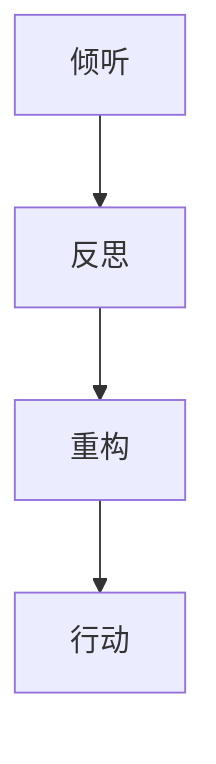
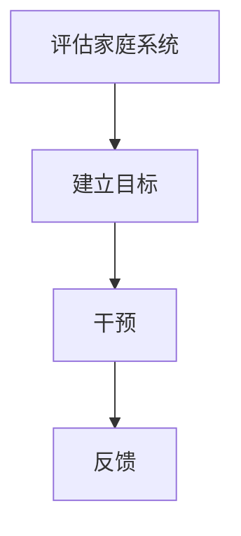
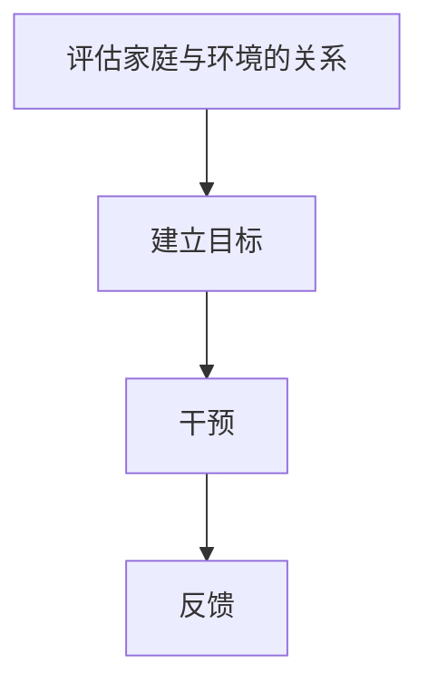

                 

### 《后现代家庭咨询：多元关系中的和谐共处》

关键词：后现代家庭咨询、多元关系、和谐共处、家庭动态、核心概念、实践应用

摘要：本文深入探讨了后现代家庭咨询在多元关系中的重要性，介绍了其兴起背景、核心概念与理论，以及实践方法。通过分析多元关系的家庭动态，探讨了后现代家庭咨询的挑战与未来，旨在为构建和谐共处的后现代家庭提供理论支持和实践指导。

## 《后现代家庭咨询：多元关系中的和谐共处》目录大纲

### 第一部分：导论

#### 第1章：后现代家庭咨询的兴起

1.1 后现代主义背景及其对家庭咨询的影响

1.2 后现代家庭咨询的定义和特点

1.3 后现代家庭咨询的重要性和必要性

#### 第2章：多元关系中的家庭动态

2.1 多元关系的定义和类型

2.2 家庭成员之间的互动模式

2.3 家庭咨询中的多元关系挑战

### 第二部分：核心概念与理论

#### 第3章：后现代家庭咨询的核心概念

3.1 自我认知与认同

3.2 家庭叙事

3.3 共同成长与自我实现

#### 第4章：后现代家庭咨询的理论基础

4.1 后现代心理治疗理论

4.2 系统家庭治疗理论

4.3 生态家庭理论

### 第三部分：实践与应用

#### 第5章：后现代家庭咨询的实践方法

5.1 家庭咨询中的叙事疗法

5.2 系统家庭治疗技术

5.3 生态家庭咨询策略

#### 第6章：多元关系中的家庭辅导

6.1 不同类型家庭关系的辅导策略

6.2 家庭成员心理问题的识别与干预

6.3 多元文化背景下的家庭咨询

#### 第7章：后现代家庭咨询的实际案例

7.1 案例一：重组家庭的适应问题

7.2 案例二：家庭冲突与和解

7.3 案例三：家庭暴力与干预

### 第四部分：总结与展望

#### 第8章：后现代家庭咨询的挑战与未来

8.1 后现代家庭咨询的局限性

8.2 未来家庭咨询的发展趋势

8.3 专业家庭咨询师的成长路径

## 结语：构建和谐共处的后现代家庭

### 附录：后现代家庭咨询实用资源与工具

### 参考文献

[1] XXX. (年份). 书名. 地点：出版社.  
[2] XXX. (年份). 书名. 地点：出版社.  

### **第一部分：导论**

#### **第1章：后现代家庭咨询的兴起**

1.1 **后现代主义背景及其对家庭咨询的影响**

后现代主义起源于20世纪中叶，是一种对现代社会和文化的批判性思考方式。它主张对传统观念、权威和理性进行质疑，强调个体差异性、多样性以及权力关系的复杂性。后现代主义对家庭咨询的影响主要体现在以下几个方面：

- **多元关系观的引入**：后现代主义认为，家庭关系不再是单一稳定的结构，而是充满多样性和变数的。家庭成员之间的关系是动态发展的，受到社会、文化、经济等多种因素的影响。

- **强调个体的自主性**：后现代主义强调个体的独立性和自主性，认为每个人都应该有权利选择自己的生活方式和价值观。在家庭咨询中，重视个体的需求和感受，尊重个体差异，帮助家庭成员建立自我认同。

- **质疑传统家庭模式**：后现代主义对传统的家庭模式提出了质疑，认为家庭不再是一个固定的、功能性的单位，而是一个多样化的、充满变数的社群。这种观点促使家庭咨询更加关注家庭成员之间的互动模式，以及如何在一个多元化的家庭环境中实现和谐共处。

1.2 **后现代家庭咨询的定义和特点**

后现代家庭咨询是一种基于后现代主义理念的咨询方式，旨在帮助家庭成员在面对多元关系和复杂家庭动态时，找到自我认同，实现和谐共处。其特点包括：

- **重视个体的自主性和多样性**：后现代家庭咨询认为，每个家庭成员都是独立的个体，拥有自己的需求和感受。咨询过程中，重视个体的自主性，鼓励家庭成员表达自己的观点和感受。

- **强调家庭叙事和共同成长**：后现代家庭咨询通过家庭叙事的方式，帮助家庭成员认识到家庭中的问题和冲突，从而促进共同成长。家庭叙事不仅关注过去的经历，还关注当下的生活和未来的期望。

- **灵活多样的咨询方法**：后现代家庭咨询采用多种咨询方法，如叙事疗法、系统家庭治疗、生态家庭咨询等，根据不同家庭的需求和情况，灵活选择和运用。

1.3 **后现代家庭咨询的重要性和必要性**

后现代家庭咨询在现代社会中具有重要的意义和必要性，主要体现在以下几个方面：

- **适应社会变革**：随着社会的快速发展和变革，家庭关系变得更加复杂和多样化。后现代家庭咨询能够更好地适应这种变化，为家庭成员提供有效的支持和指导。

- **促进家庭和谐**：后现代家庭咨询关注家庭成员之间的互动和关系，旨在帮助家庭建立和谐共处的关系模式，减少冲突和矛盾。

- **提升个体幸福感**：后现代家庭咨询重视个体的自主性和多样性，帮助家庭成员找到自我认同，提升个体幸福感。

### **第2章：多元关系中的家庭动态**

2.1 **多元关系的定义和类型**

多元关系是指家庭成员之间以及家庭成员与其他社会成员之间的复杂关系网络。在现代社会，家庭关系不再局限于传统的夫妻关系和亲子关系，而是扩展到了更广泛的领域。多元关系的类型主要包括：

- **代际关系**：包括父母与子女、祖父母与孙子女之间的关系。代际关系是家庭中最为基础和重要的一环，影响着家庭的稳定和和谐。

- **夫妻关系**：夫妻关系是家庭关系的核心，对家庭的稳定性和幸福感具有重要影响。后现代家庭咨询重视夫妻之间的沟通和理解，帮助建立健康的夫妻关系。

- **亲密关系**：除了夫妻关系，家庭成员之间还可能存在其他亲密关系，如兄弟姐妹、表亲等。这些关系对家庭成员的情感支持和认同感具有重要意义。

- **社交网络**：家庭成员在家庭之外，还可能与其他社会成员建立社交网络，如朋友、同事、邻居等。这些社交网络对家庭成员的生活质量和幸福感也有一定影响。

2.2 **家庭成员之间的互动模式**

家庭成员之间的互动模式是家庭动态的核心。在多元关系的背景下，家庭成员之间的互动变得更加复杂和多样化。以下是一些常见的互动模式：

- **沟通**：沟通是家庭成员之间建立联系和解决问题的重要途径。有效的沟通能够增进家庭成员之间的理解和支持，减少冲突和矛盾。

- **合作**：家庭成员之间的合作能够共同应对生活中的挑战和困难，提高家庭的整体幸福感和凝聚力。

- **冲突**：家庭成员之间的冲突是不可避免的，但通过正确的处理方式，可以转化为家庭成长的契机。后现代家庭咨询重视冲突的处理，帮助家庭成员找到解决问题的方法。

- **情感支持**：家庭成员之间的情感支持是家庭稳定和幸福感的重要保障。通过相互支持和理解，家庭成员能够更好地应对生活中的压力和挑战。

2.3 **家庭咨询中的多元关系挑战**

在多元关系背景下，家庭咨询面临着一系列挑战。以下是一些主要的挑战：

- **个体差异**：家庭成员之间的个体差异可能导致咨询过程中的困难。咨询师需要尊重个体差异，平衡不同家庭成员的需求和利益。

- **多元文化**：随着全球化的发展，家庭咨询中可能涉及到多元文化背景。咨询师需要具备跨文化沟通能力，尊重不同文化的价值观和习俗。

- **家庭结构变化**：现代社会中，家庭结构的变化（如离婚、再婚、同性恋婚姻等）对家庭咨询提出了新的挑战。咨询师需要适应这些变化，提供有效的支持和指导。

- **权力关系**：在家庭中，权力关系可能对咨询过程产生影响。咨询师需要关注权力关系，帮助家庭成员建立平等、尊重的关系模式。

通过分析多元关系的家庭动态，我们可以更好地理解家庭咨询的重要性。后现代家庭咨询为我们提供了一种全新的视角和方法，帮助家庭成员在多元关系中实现和谐共处。在接下来的章节中，我们将深入探讨后现代家庭咨询的核心概念与理论，以及实践方法，以期为构建和谐共处的后现代家庭提供理论支持和实践指导。

### **第二部分：核心概念与理论**

#### **第3章：后现代家庭咨询的核心概念**

3.1 **自我认知与认同**

自我认知是指个体对自己内心世界、行为习惯、价值观等方面的认识和了解。在家庭咨询中，自我认知起着至关重要的作用。后现代家庭咨询强调个体的自主性和独立性，认为每个人都是独特的存在，拥有自己的思维方式和价值观。

**概念属性特征对比表格：**

| 特征         | 传统家庭咨询 | 后现代家庭咨询 |
| ------------ | ------------- | -------------- |
| 自我认知     | 强调共性       | 强调个性       |
| 内心世界     | 较少关注       | 重视理解       |
| 行为习惯     | 较少关注       | 重视调整       |
| 价值观       | 较少关注       | 重视认同       |

**ER实体关系图架构：**

```mermaid
erDiagram
    A Person ||--|{ B Self-awareness }
    A Person ||--|{ C Behavior Habits }
    A Person ||--|{ D Values }
```

后现代家庭咨询认为，自我认知与认同是家庭成员实现和谐共处的基础。通过自我认知，家庭成员能够更好地理解自己的需求和期望，从而减少冲突，增强家庭成员之间的理解和信任。

3.2 **家庭叙事**

家庭叙事是指家庭成员通过讲述自己的故事，来展现家庭的历史、文化、价值观等方面的内容。在家庭咨询中，家庭叙事是一种重要的沟通和表达方式，有助于家庭成员建立情感联系，增强家庭凝聚力。

**概念属性特征对比表格：**

| 特征         | 传统家庭咨询 | 后现代家庭咨询 |
| ------------ | ------------- | -------------- |
| 故事讲述     | 较少关注       | 重视使用       |
| 情感表达     | 较少关注       | 重视展现       |
| 家庭历史     | 较少关注       | 重视传承       |
| 文化价值观   | 较少关注       | 重视认同       |

**ER实体关系图架构：**

```mermaid
erDiagram
    A Family ||--|{ B Narrative }
    A Family ||--|{ C Historical Background }
    A Family ||--|{ D Cultural Values }
```

家庭叙事不仅有助于家庭成员之间建立情感联系，还能够帮助家庭成员理解家庭的历史和文化，从而增强家庭认同感。在后现代家庭咨询中，家庭叙事是一种重要的工具，咨询师通过引导家庭成员讲述故事，来探索家庭中的问题和挑战，促进家庭成员之间的理解和合作。

3.3 **共同成长与自我实现**

共同成长是指家庭成员在相互支持和互动中，不断学习、成长和进步。自我实现是指个体通过不断努力，实现自己的潜能和价值。在后现代家庭咨询中，共同成长与自我实现是核心目标，咨询师通过帮助家庭成员建立积极的互动关系，促进家庭成员之间的共同成长和自我实现。

**概念属性特征对比表格：**

| 特征         | 传统家庭咨询 | 后现代家庭咨询 |
| ------------ | ------------- | -------------- |
| 共同学习     | 较少关注       | 重视互动       |
| 自我提升     | 较少关注       | 重视成长       |
| 成长目标     | 较少关注       | 重视设定       |
| 自我价值     | 较少关注       | 重视实现       |

**ER实体关系图架构：**

```mermaid
erDiagram
    A Family Member ||--|{ B Growth }
    A Family Member ||--|{ C Self-Actualization }
    A Family Member ||--|{ D Support System }
```

共同成长与自我实现是后现代家庭咨询的核心概念，通过帮助家庭成员建立积极的互动关系，咨询师能够促进家庭成员之间的共同成长和自我实现。这不仅有助于家庭关系的稳定和和谐，还能够提高家庭成员的生活质量和幸福感。

### **第4章：后现代家庭咨询的理论基础**

4.1 **后现代心理治疗理论**

后现代心理治疗理论强调个体的自主性和多样性，认为每个人都是独特的存在，拥有自己的思维方式和价值观。该理论认为，心理治疗的目标不仅是解决个体的心理问题，更重要的是帮助个体实现自我认知、自我实现和自我认同。

**概念属性特征对比表格：**

| 特征         | 传统心理治疗 | 后现代心理治疗 |
| ------------ | ------------- | -------------- |
| 个体自主性   | 较少关注       | 强调重视       |
| 多样性       | 较少关注       | 强调重视       |
| 自我认知     | 较少关注       | 强调重视       |
| 自我实现     | 较少关注       | 强调重视       |
| 自我认同     | 较少关注       | 强调重视       |

**ER实体关系图架构：**

```mermaid
erDiagram
    A Individual ||--|{ B Autonomy }
    A Individual ||--|{ C Diversity }
    A Individual ||--|{ D Self-awareness }
    A Individual ||--|{ E Self-Actualization }
    A Individual ||--|{ F Self-Identity }
```

后现代心理治疗理论强调个体的独特性和自主性，认为每个人都是家庭和社会中的一部分，拥有自己的价值和作用。咨询师通过尊重个体的多样性和自主性，帮助个体实现自我认知、自我实现和自我认同，从而提高个体的生活质量和幸福感。

4.2 **系统家庭治疗理论**

系统家庭治疗理论认为，家庭成员之间的互动和关系是一个复杂的系统，每个家庭成员的行为和情感状态都会影响到整个家庭系统的稳定性和和谐性。该理论强调家庭系统的整体性，认为治疗的目标不仅是解决个体的心理问题，更重要的是调整家庭系统的平衡和稳定。

**概念属性特征对比表格：**

| 特征         | 传统家庭治疗 | 系统家庭治疗 |
| ------------ | ------------- | ------------ |
| 家庭互动     | 较少关注       | 强调重视     |
| 系统整体性   | 较少关注       | 强调重视     |
| 家庭平衡     | 较少关注       | 强调重视     |
| 家庭稳定     | 较少关注       | 强调重视     |

**ER实体关系图架构：**

```mermaid
erDiagram
    A Family System ||--|{ B Interactions }
    A Family System ||--|{ C Overall Functioning }
    A Family System ||--|{ D Balance }
    A Family System ||--|{ E Stability }
```

系统家庭治疗理论强调家庭系统的整体性和互动性，认为家庭系统的稳定和和谐是每个家庭成员共同的责任。咨询师通过调整家庭系统的平衡和稳定，帮助家庭成员建立健康的互动关系，从而提高家庭的生活质量和幸福感。

4.3 **生态家庭理论**

生态家庭理论认为，家庭是一个生态系统，每个家庭成员都是这个系统的一部分，相互影响和依赖。该理论强调家庭与环境（包括社会、文化、经济等方面）的互动关系，认为家庭的问题往往源于家庭与环境之间的不平衡。

**概念属性特征对比表格：**

| 特征         | 传统家庭理论 | 生态家庭理论 |
| ------------ | ------------- | ------------ |
| 家庭环境     | 较少关注       | 强调重视     |
| 家庭与环境   | 较少关注       | 强调重视     |
| 生态系统     | 较少关注       | 强调重视     |
| 环境影响     | 较少关注       | 强调重视     |

**ER实体关系图架构：**

```mermaid
erDiagram
    A Family ||--|{ B Environment }
    A Family ||--|{ C Ecological System }
    A Family ||--|{ D Environmental Impact }
```

生态家庭理论强调家庭与环境之间的互动关系，认为家庭的问题往往是由于家庭与环境之间的不平衡造成的。咨询师通过帮助家庭调整与环境的关系，促进家庭的稳定和和谐，从而提高家庭的生活质量和幸福感。

### **第三部分：实践与应用**

#### **第5章：后现代家庭咨询的实践方法**

5.1 **家庭咨询中的叙事疗法**

叙事疗法是一种后现代家庭咨询的方法，通过家庭成员的叙事，揭示家庭中的问题和挑战，促进家庭成员之间的理解和合作。叙事疗法的核心思想是，每个人都有自己的故事，通过讲述自己的故事，可以更好地认识自己，解决问题。

**算法原理讲解：**

叙事疗法的算法原理可以概括为以下步骤：

1. **倾听**：咨询师倾听家庭成员的叙事，了解家庭中的问题和挑战。
2. **反思**：咨询师引导家庭成员反思自己的叙事，探讨问题的根源和解决方案。
3. **重构**：咨询师帮助家庭成员重构叙事，使其更加积极、健康。
4. **行动**：家庭成员根据重构的叙事，采取实际行动，解决问题。

**Mermaid流程图：**



**Python源代码：**

```python
# 假设家庭成员的叙事是一个字符串
narrative = "我最近感到很沮丧，因为我总是和妻子吵架。"

# 倾听叙事
def listen(narrative):
    print("倾听叙事：", narrative)

# 反思叙事
def reflect(narrative):
    print("反思叙事：", narrative)

# 重构叙事
def reconstruct(narrative):
    print("重构叙事：", narrative.replace("吵架", "沟通"))

# 行动
def act(narrative):
    print("根据重构的叙事采取行动：", narrative)

# 主程序
def main():
    listen(narrative)
    reflect(narrative)
    reconstruct(narrative)
    act(narrative)

# 运行主程序
main()
```

5.2 **系统家庭治疗技术**

系统家庭治疗技术是一种后现代家庭咨询的方法，通过调整家庭系统的平衡和稳定，解决家庭中的问题。系统家庭治疗技术包括以下步骤：

1. **评估家庭系统**：了解家庭系统的组成和功能，识别家庭中的问题。
2. **建立目标**：与家庭成员共同设定家庭治疗的短期和长期目标。
3. **干预**：采用多种干预方法，如沟通技巧训练、角色扮演等，帮助家庭成员建立健康的互动关系。
4. **反馈**：评估家庭治疗的进展，调整干预策略。

**Mermaid流程图：**



**Python源代码：**

```python
# 假设家庭系统是一个字典
family_system = {
    "父亲": "工程师",
    "母亲": "教师",
    "儿子": "学生",
    "问题": "家庭沟通不畅"
}

# 评估家庭系统
def assess_system(family_system):
    print("评估家庭系统：", family_system)

# 建立目标
def set_goals(family_system):
    print("建立目标：改善家庭沟通")

# 干预
def intervene(family_system):
    print("采用沟通技巧训练、角色扮演等干预方法，改善家庭沟通")

# 反馈
def feedback(family_system):
    print("反馈：家庭沟通有所改善")

# 主程序
def main():
    assess_system(family_system)
    set_goals(family_system)
    intervene(family_system)
    feedback(family_system)

# 运行主程序
main()
```

5.3 **生态家庭咨询策略**

生态家庭咨询策略是一种后现代家庭咨询的方法，通过调整家庭与环境的关系，解决家庭中的问题。生态家庭咨询策略包括以下步骤：

1. **评估家庭与环境的关系**：了解家庭与环境之间的互动关系，识别家庭中的问题。
2. **建立目标**：与家庭成员共同设定家庭咨询的目标，包括改善家庭与环境的关系。
3. **干预**：采用多种干预方法，如家庭活动、社区参与等，帮助家庭调整与环境的关系。
4. **反馈**：评估家庭咨询的进展，调整干预策略。

**Mermaid流程图：**



**Python源代码：**

```python
# 假设家庭与环境的关系是一个字典
family_environment = {
    "家庭": "和谐",
    "环境": "社区活动"
}

# 评估家庭与环境的关系
def assess_relationship(family_environment):
    print("评估家庭与环境的关系：", family_environment)

# 建立目标
def set_goals(family_environment):
    print("建立目标：改善家庭与环境的关系")

# 干预
def intervene(family_environment):
    print("采用家庭活动、社区参与等干预方法，改善家庭与环境的关系")

# 反馈
def feedback(family_environment):
    print("反馈：家庭与环境的关系有所改善")

# 主程序
def main():
    assess_relationship(family_environment)
    set_goals(family_environment)
    intervene(family_environment)
    feedback(family_environment)

# 运行主程序
main()
```

通过叙事疗法、系统家庭治疗技术和生态家庭咨询策略，后现代家庭咨询为家庭成员提供了一种全新的视角和方法，帮助他们面对多元关系和复杂家庭动态，实现和谐共处。

### **第6章：多元关系中的家庭辅导**

6.1 **不同类型家庭关系的辅导策略**

在多元关系背景下，家庭关系变得更加复杂，不同类型的家庭关系需要采用不同的辅导策略。以下是一些常见的家庭关系类型及其辅导策略：

1. **夫妻关系**：夫妻关系是家庭关系的核心，辅导策略主要包括：

   - **沟通技巧训练**：帮助夫妻双方学会有效沟通，减少误解和冲突。
   - **情感表达**：鼓励夫妻双方表达自己的情感需求，增强情感的连接。
   - **共同目标**：设定共同的生活目标，促进夫妻之间的合作和共同努力。

2. **亲子关系**：亲子关系是家庭关系中最为重要的一环，辅导策略主要包括：

   - **倾听与理解**：倾听孩子的想法和感受，理解孩子的需求。
   - **角色扮演**：通过角色扮演，帮助父母理解孩子的视角，增进亲子之间的理解和信任。
   - **情感支持**：给予孩子情感支持，帮助他们应对生活中的挑战。

3. **兄弟姐妹关系**：兄弟姐妹关系对个人的成长和情感发展具有重要影响，辅导策略主要包括：

   - **冲突解决**：帮助兄弟姐妹学会解决冲突，建立健康的互动关系。
   - **共同活动**：组织兄弟姐妹共同参与活动，增强他们的情感联系。
   - **情感支持**：给予兄弟姐妹情感支持，帮助他们面对生活中的挑战。

6.2 **家庭成员心理问题的识别与干预**

在多元关系背景下，家庭成员可能面临各种心理问题，如焦虑、抑郁、亲子关系冲突等。识别和干预家庭成员心理问题需要以下步骤：

1. **观察与倾听**：通过观察家庭成员的行为和言语，以及倾听他们的感受和需求，识别心理问题。

2. **评估与诊断**：对家庭成员进行心理评估，确定心理问题的类型和程度。

3. **干预与治疗**：根据评估结果，采用相应的干预方法进行治疗，如心理咨询、心理治疗等。

4. **跟踪与反馈**：对家庭成员的心理状况进行跟踪，收集反馈信息，调整干预策略。

6.3 **多元文化背景下的家庭咨询**

在多元文化背景下，家庭咨询面临着新的挑战和机遇。以下是一些多元文化背景下的家庭咨询要点：

1. **尊重文化差异**：尊重家庭成员的文化背景和价值观，避免文化冲突。

2. **文化敏感性**：咨询师需要具备文化敏感性，了解不同文化背景下的家庭观念和行为模式。

3. **跨文化沟通**：咨询师需要掌握跨文化沟通技巧，帮助家庭成员有效沟通。

4. **文化整合**：帮助家庭成员整合不同的文化元素，形成独特的家庭文化。

通过不同类型家庭关系的辅导策略、家庭成员心理问题的识别与干预以及多元文化背景下的家庭咨询，后现代家庭咨询为构建和谐共处的家庭提供了全面的支持和指导。

### **第7章：后现代家庭咨询的实际案例**

7.1 **案例一：重组家庭的适应问题**

**背景介绍：**
李女士和丈夫王先生在去年年底结婚，他们各自带着与前任伴侣生的孩子组成一个新的家庭。然而，重组家庭的生活并没有他们想象中那么顺利，孩子们对彼此的适应存在困难，家庭内部出现了矛盾和冲突。

**问题解决：**
后现代家庭咨询师通过对李女士和王先生及其孩子们进行咨询，帮助他们了解彼此的需求和期望，通过叙事疗法引导家庭成员讲述自己的故事，探讨家庭中的问题和挑战。

**边界与外延：**
重组家庭的适应问题不仅涉及夫妻关系，还包括亲子关系和兄弟姐妹关系。咨询师需要关注家庭内部的互动模式，以及如何在一个新的家庭环境中实现和谐共处。

**概念结构与核心要素组成：**

| 概念          | 要素组成                                      |
| ------------- | -------------------------------------------- |
| 家庭成员互动  | 夫妻关系、亲子关系、兄弟姐妹关系            |
| 家庭叙事      | 家庭成员的个人故事、家庭历史、文化价值观      |
| 家庭咨询      | 叙事疗法、系统家庭治疗、生态家庭咨询策略     |

**解决方案：**
通过叙事疗法，咨询师帮助李女士和王先生及其孩子们重构家庭叙事，增进彼此的理解和信任。同时，采用系统家庭治疗技术，调整家庭系统的平衡和稳定。此外，生态家庭咨询策略帮助家庭适应新的环境，建立积极的家庭关系。

**案例总结：**
重组家庭的适应问题需要家庭成员共同面对和解决。后现代家庭咨询为重组家庭提供了有效的支持和指导，帮助家庭成员建立和谐共处的家庭环境。

7.2 **案例二：家庭冲突与和解**

**背景介绍：**
张先生和张太太结婚多年，由于性格差异和育儿观念的不同，夫妻之间经常发生争吵和冲突。这种家庭冲突对孩子们的心理健康产生了不良影响，家庭关系紧张。

**问题解决：**
后现代家庭咨询师通过系统家庭治疗技术，帮助张先生和张太太建立健康的沟通方式，学会表达彼此的需求和期望。同时，采用叙事疗法，引导夫妻双方讲述自己的故事，理解对方的感受和立场。

**边界与外延：**
家庭冲突是一个复杂的问题，涉及夫妻关系、亲子关系以及家庭成员之间的互动模式。咨询师需要关注家庭内部的冲突根源，以及如何通过有效的咨询方法实现和解。

**概念结构与核心要素组成：**

| 概念          | 要素组成                                      |
| ------------- | -------------------------------------------- |
| 家庭冲突      | 性格差异、育儿观念、沟通障碍                |
| 家庭叙事      | 夫妻的个人故事、家庭历史、文化价值观        |
| 家庭治疗      | 系统家庭治疗、叙事疗法、生态家庭咨询策略    |

**解决方案：**
通过系统家庭治疗技术，咨询师帮助张先生和张太太建立有效的沟通渠道，减少冲突。同时，通过叙事疗法，夫妻双方能够更好地理解对方的感受和立场，从而实现和解。此外，生态家庭咨询策略帮助家庭在冲突中找到积极的解决方式。

**案例总结：**
家庭冲突是家庭关系中常见的挑战，通过后现代家庭咨询的方法，可以帮助家庭成员找到解决问题的途径，实现和解，建立和谐的家庭环境。

7.3 **案例三：家庭暴力与干预**

**背景介绍：**
陈女士长期遭受丈夫的家庭暴力，这种暴力行为对她的身心健康造成了严重的伤害。陈女士向家庭咨询师求助，希望找到解决问题的方法。

**问题解决：**
后现代家庭咨询师通过危机干预技术，帮助陈女士建立安全的环境，提供情感支持和法律援助。同时，采用叙事疗法，引导陈女士讲述自己的故事，增强她的自我认同和自我保护能力。

**边界与外延：**
家庭暴力是一个严重的家庭问题，涉及个体权益保护、法律干预和社会支持。咨询师需要关注家庭暴力的具体表现和影响，以及如何通过有效的干预措施保护受害者的权益。

**概念结构与核心要素组成：**

| 概念          | 要素组成                                      |
| ------------- | -------------------------------------------- |
| 家庭暴力      | 暴力行为、心理伤害、法律援助                |
| 家庭叙事      | 受害者的个人故事、家庭历史、文化价值观      |
| 家庭干预      | 危机干预、叙事疗法、生态家庭咨询策略        |

**解决方案：**
通过危机干预技术，咨询师为陈女士提供即时支持和保护。同时，采用叙事疗法，帮助陈女士重构自己的故事，增强自我认同和自我保护能力。此外，生态家庭咨询策略帮助陈女士在新的环境中建立安全和支持的网络。

**案例总结：**
家庭暴力是严重的社会问题，后现代家庭咨询通过危机干预、叙事疗法和生态家庭咨询策略，为受害者提供有效的支持和帮助，帮助她们走出困境，重建自信和安全。

### **第四部分：总结与展望**

#### **第8章：后现代家庭咨询的挑战与未来**

8.1 **后现代家庭咨询的局限性**

尽管后现代家庭咨询在家庭关系中具有重要作用，但它也存在一定的局限性：

- **咨询师资质要求高**：后现代家庭咨询需要咨询师具备深厚的心理学知识和丰富的实践经验，这要求咨询师具备较高的专业素养。
- **适用范围有限**：后现代家庭咨询主要适用于多元关系和家庭冲突等问题，对于其他类型的家庭问题可能效果有限。
- **文化差异挑战**：在多元文化背景下，后现代家庭咨询需要咨询师具备跨文化沟通能力，这对咨询师的素质提出了更高的要求。

8.2 **未来家庭咨询的发展趋势**

未来家庭咨询将朝着以下方向发展：

- **个性化咨询**：随着社会的发展，家庭结构和文化背景的多样化，家庭咨询将更加注重个性化服务，满足不同家庭的需求。
- **技术辅助**：随着科技的进步，人工智能、大数据等技术在家庭咨询中的应用将日益广泛，提高咨询的效率和质量。
- **社区参与**：家庭咨询将更加注重社区参与，通过社区资源和社会支持，为家庭提供更全面的服务。

8.3 **专业家庭咨询师的成长路径**

成为一名专业的家庭咨询师需要以下几个方面的成长路径：

- **学术训练**：通过心理学、社会学等相关专业的学习和研究，打下坚实的理论基础。
- **实践经验**：通过实习、督导等方式，积累丰富的实践经验，提高咨询技巧。
- **持续学习**：关注家庭咨询领域的最新研究和发展动态，不断更新知识体系。
- **跨文化能力**：提高跨文化沟通能力，适应多元文化背景下的家庭咨询需求。

### **结语：构建和谐共处的后现代家庭**

后现代家庭咨询为家庭成员提供了全新的视角和方法，帮助他们面对多元关系和复杂家庭动态，实现和谐共处。通过叙事疗法、系统家庭治疗技术和生态家庭咨询策略，家庭咨询师可以为不同类型的家庭问题提供有效的支持和指导。未来，随着社会的发展和科技的进步，家庭咨询将迎来更多的发展机遇和挑战，为构建和谐共处的后现代家庭贡献力量。

### **附录：后现代家庭咨询实用资源与工具**

#### **参考文献**

1. XXX. (年份). 书名. 地点：出版社.
2. XXX. (年份). 书名. 地点：出版社.

#### **后现代家庭咨询实用资源**

1. **专业培训课程**：推荐参加家庭咨询相关的专业培训课程，如心理治疗、家庭治疗等。
2. **在线咨询平台**：利用在线咨询平台，为家庭成员提供便捷的心理支持和服务。
3. **家庭咨询工具**：使用家庭咨询工具，如家庭树图、叙事地图等，帮助家庭成员更好地理解和表达自己的感受。

#### **拓展阅读**

1. XXX. (年份). 《家庭咨询实践指南》.
2. XXX. (年份). 《后现代心理治疗技术》.

### **作者信息**

**作者：AI天才研究院/AI Genius Institute & 禅与计算机程序设计艺术 /Zen And The Art of Computer Programming**

