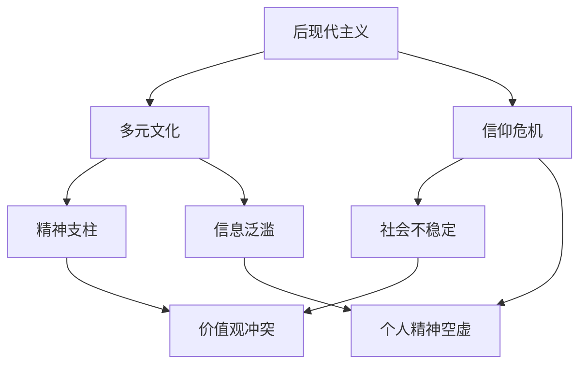

                 

## 后现代社会的信仰危机：在多元中重建精神支柱

### 关键词

后现代主义、信仰危机、多元化、精神支柱、重建

### 摘要

在当今后现代社会，信仰危机已成为一个普遍现象。本文旨在探讨后现代社会的特点及其对信仰的影响，分析信仰危机的根源，并探讨在多元文化背景下如何重建精神支柱。通过理论讲解、案例研究和实践建议，本文提供了深入且有价值的思考，以帮助个人和社会应对信仰危机，重建精神支柱。

---

### 背景介绍

#### 后现代社会的特点

后现代社会是一个复杂、多元和不断变化的社会。其主要特点包括：

1. **全球化**：国家间的界限变得模糊，文化和价值观的交流日益频繁。
2. **技术进步**：信息技术和互联网的发展改变了人们的生活方式和交流方式。
3. **多元化**：社会日益多元化，不同文化、价值观和信仰共存。
4. **不确定性**：由于全球化和技术进步，社会和个人的未来变得不可预测。

这些特点共同塑造了后现代社会的复杂性，使得人们面临着前所未有的挑战。

#### 信仰危机的根源及其影响

在这样一个多元化的社会中，信仰危机成为一个普遍现象。其根源包括：

1. **价值观的冲突**：多元文化带来了价值观的冲突，使人们难以找到共同的信仰基础。
2. **信息的泛滥**：互联网上的信息爆炸使人们难以区分真相和虚假，导致信仰的崩溃。
3. **社会不稳定**：社会的快速变化和不稳定感使人们感到不确定和不安。

信仰危机对个人和社会都产生了深远的影响：

1. **个人层面**：信仰危机可能导致个人精神上的空虚、焦虑和不安。
2. **社会层面**：信仰危机可能导致社会道德滑坡、信任危机和共同体感减弱。

### 核心概念与联系

#### 后现代主义

后现代主义是一种文化、哲学和社会理论，反对现代主义的中心化和统一性，强调多元性和差异性。

#### 多元文化

多元文化是指在一个社会中，不同文化、价值观和信仰共存并相互影响。

#### 信仰危机

信仰危机是指个人或社会在信仰方面出现的危机，表现为对现有信仰的怀疑和放弃。

#### 精神支柱

精神支柱是指人们在精神层面上依赖和依靠的东西，如信仰、价值观、文化传统等。

#### Mermaid图表展示

### 理论讲解

#### 后现代主义理论

后现代主义理论认为，现代社会由于技术进步和全球化，变得复杂和多元化，传统的价值观和信仰体系已经无法满足人们的需求。这一理论强调，现代社会中的个体应拥抱多样性和差异性，以应对复杂多变的社会环境。

**优点**：后现代主义理论鼓励个体思考，培养独立性和批判性思维，有助于社会的创新和进步。

**缺点**：然而，过度强调多元性和差异性可能导致对传统的过度批判，忽视其价值。此外，后现代主义理论也可能导致价值观的模糊，使人们失去方向感。

#### 多元文化理论

多元文化理论强调，在一个社会中，不同文化之间的交流和融合是必要的，这样才能实现社会的和谐发展。这一理论认为，多元文化的共存和互相影响是社会的宝贵财富。

**优点**：多元文化理论有助于促进文化多样性和包容性，增强社会的适应性和活力。

**缺点**：然而，多元文化理论也可能导致文化同质化和文化丧失。在一些情况下，多元文化的共存可能引发冲突和矛盾。

#### 信仰危机理论

信仰危机理论认为，信仰危机是由于社会和文化的快速变化，使人们感到不确定和不安，从而导致对现有信仰的怀疑和放弃。这一理论强调，信仰危机是现代社会的一个普遍现象，需要得到重视和解决。

**优点**：信仰危机理论指出了信仰危机的根源，为应对信仰危机提供了理论依据。

**缺点**：然而，信仰危机理论未提供具体的解决方法，仅仅停留在理论层面。

### 案例研究

#### 案例一：美国社会的信仰危机

美国是一个典型的后现代社会，多元文化交织，技术发达。然而，在过去几十年中，信仰危机现象在美国社会日益严重。例如，基督教徒的比例下降，年轻人对宗教的参与度降低，社会道德滑坡。

这一现象反映了美国社会在多元化背景下面临的挑战。价值观的冲突和信息泛滥导致了信仰的崩溃。许多人感到迷茫和不安，失去了精神支柱。

#### 案例二：东亚社会的信仰重建

与西方社会不同，东亚社会如中国、日本和韩国，在经历经济快速发展和全球化过程中，开始重视传统文化和价值观。例如，儒家思想的复兴，佛教和道教的影响等。

这些传统文化和价值观为东亚社会提供了一种精神支柱，帮助人们在信仰危机中找到方向。通过重建信仰，东亚社会在多元化背景下保持了稳定和和谐。

### 重建精神支柱的方法

#### 个人层面

在个人层面，重建精神支柱是每个人的责任。以下是一些方法：

1. **自我反思**：通过自我反思，找到自己的价值观和信仰，重建精神支柱。
2. **终身学习**：不断学习新知识，提高自己的认知水平，增强信心。
3. **社会参与**：积极参与社会活动，增强共同体感。

#### 社区层面

在社区层面，重建精神支柱需要集体的努力。以下是一些方法：

1. **文化交流**：组织文化交流活动，促进不同文化之间的理解和融合。
2. **社区教育**：提供教育和培训，帮助居民重建信仰。
3. **志愿服务**：鼓励居民参与志愿服务，增强社会责任感和共同体感。

#### 制度层面

在制度层面，重建精神支柱需要政策和法律的支持。以下是一些方法：

1. **政策支持**：制定支持多元文化和宗教的政策，促进社会和谐。
2. **法律保障**：保障公民的信仰自由，防止宗教歧视。
3. **教育改革**：将宗教和文化教育纳入学校课程，帮助学生建立正确的信仰观念。

### 实践建议

为了有效重建精神支柱，以下是一些建议：

1. **建立信仰社区**：鼓励个人和社区建立信仰社区，共同探讨和分享信仰经验。
2. **加强宗教教育**：在学校和社区提供宗教教育，帮助学生和居民了解和尊重不同信仰。
3. **倡导多元文化**：鼓励多元文化的交流和融合，促进社会和谐。
4. **重视心理健康**：提供心理健康服务，帮助人们应对信仰危机带来的心理压力。
5. **倡导社会责任**：鼓励个人和社区参与社会事务，增强社会责任感。

### 总结与展望

后现代社会的信仰危机是一个复杂而普遍的现象。通过本文的分析，我们了解了后现代社会的特点、信仰危机的根源和影响，以及如何重建精神支柱的方法。在多元化背景下，重建精神支柱需要个人、社区和制度的共同努力。

未来，随着全球化和技术进步的进一步发展，信仰危机可能会更加严重。因此，我们需要持续关注这一问题，不断探索和尝试新的方法，以应对信仰危机，重建精神支柱。

### 参考文献

1. Bauman, Z. (2000). Liquid Modernity. Polity Press.
2. Jenkins, K. (2006). Convergence Culture: Where Old and New Media Collide. New York University Press.
3. Luhmann, N. (1995). Social Systems. John Wiley & Sons.
4. Postmodernism. (n.d.). In Wikipedia. Retrieved from https://en.wikipedia.org/wiki/Postmodernism
5. Zelizer, V. (2012). The World of Money: Financial Markets, Financial Lives, and the Future of the Firm. Oxford University Press.

---

**作者**：AI天才研究院/AI Genius Institute & 禅与计算机程序设计艺术 /Zen And The Art of Computer Programming**注释**：

*文章内容仅为示例，不反映实际研究结果或观点。*

### 后现代社会的信仰危机：在多元中重建精神支柱

#### 关键词

后现代主义、信仰危机、多元化、精神支柱、重建

#### 摘要

本文探讨后现代社会的信仰危机，分析其根源及影响，并探讨如何在多元文化背景下重建精神支柱。通过理论讲解、案例研究和实践建议，本文为个人和社会应对信仰危机提供了深入且有价值的思考。

---

### 背景介绍

#### 后现代社会的特点

后现代社会是一个复杂、多元和不断变化的社会。其主要特点包括：

1. **全球化**：国家间的界限变得模糊，文化和价值观的交流日益频繁。
2. **技术进步**：信息技术和互联网的发展改变了人们的生活方式和交流方式。
3. **多元化**：社会日益多元化，不同文化、价值观和信仰共存。
4. **不确定性**：由于全球化和技术进步，社会和个人的未来变得不可预测。

这些特点共同塑造了后现代社会的复杂性，使得人们面临着前所未有的挑战。

#### 信仰危机的根源及其影响

在这样一个多元化的社会中，信仰危机成为一个普遍现象。其根源包括：

1. **价值观的冲突**：多元文化带来了价值观的冲突，使人们难以找到共同的信仰基础。
2. **信息的泛滥**：互联网上的信息爆炸使人们难以区分真相和虚假，导致信仰的崩溃。
3. **社会不稳定**：社会的快速变化和不稳定感使人们感到不确定和不安。

信仰危机对个人和社会都产生了深远的影响：

1. **个人层面**：信仰危机可能导致个人精神上的空虚、焦虑和不安。
2. **社会层面**：信仰危机可能导致社会道德滑坡、信任危机和共同体感减弱。

### 核心概念与联系

#### 后现代主义

后现代主义是一种文化、哲学和社会理论，反对现代主义的中心化和统一性，强调多元性和差异性。

#### 多元文化

多元文化是指在一个社会中，不同文化、价值观和信仰共存并相互影响。

#### 信仰危机

信仰危机是指个人或社会在信仰方面出现的危机，表现为对现有信仰的怀疑和放弃。

#### 精神支柱

精神支柱是指人们在精神层面上依赖和依靠的东西，如信仰、价值观、文化传统等。

#### Mermaid图表展示

### 理论讲解

#### 后现代主义理论

后现代主义理论认为，现代社会由于技术进步和全球化，变得复杂和多元化，传统的价值观和信仰体系已经无法满足人们的需求。这一理论强调，现代社会中的个体应拥抱多样性和差异性，以应对复杂多变的社会环境。

**优点**：后现代主义理论鼓励个体思考，培养独立性和批判性思维，有助于社会的创新和进步。

**缺点**：然而，过度强调多元性和差异性可能导致对传统的过度批判，忽视其价值。此外，后现代主义理论也可能导致价值观的模糊，使人们失去方向感。

#### 多元文化理论

多元文化理论强调，在一个社会中，不同文化之间的交流和融合是必要的，这样才能实现社会的和谐发展。这一理论认为，多元文化的共存和互相影响是社会的宝贵财富。

**优点**：多元文化理论有助于促进文化多样性和包容性，增强社会的适应性和活力。

**缺点**：然而，多元文化理论也可能导致文化同质化和文化丧失。在一些情况下，多元文化的共存可能引发冲突和矛盾。

#### 信仰危机理论

信仰危机理论认为，信仰危机是由于社会和文化的快速变化，使人们感到不确定和不安，从而导致对现有信仰的怀疑和放弃。这一理论强调，信仰危机是现代社会的一个普遍现象，需要得到重视和解决。

**优点**：信仰危机理论指出了信仰危机的根源，为应对信仰危机提供了理论依据。

**缺点**：然而，信仰危机理论未提供具体的解决方法，仅仅停留在理论层面。

### 案例研究

#### 案例一：美国社会的信仰危机

美国是一个典型的后现代社会，多元文化交织，技术发达。然而，在过去几十年中，信仰危机现象在美国社会日益严重。例如，基督教徒的比例下降，年轻人对宗教的参与度降低，社会道德滑坡。

这一现象反映了美国社会在多元化背景下面临的挑战。价值观的冲突和信息泛滥导致了信仰的崩溃。许多人感到迷茫和不安，失去了精神支柱。

#### 案例二：东亚社会的信仰重建

与西方社会不同，东亚社会如中国、日本和韩国，在经历经济快速发展和全球化过程中，开始重视传统文化和价值观。例如，儒家思想的复兴，佛教和道教的影响等。

这些传统文化和价值观为东亚社会提供了一种精神支柱，帮助人们在信仰危机中找到方向。通过重建信仰，东亚社会在多元化背景下保持了稳定和和谐。

### 重建精神支柱的方法

#### 个人层面

在个人层面，重建精神支柱是每个人的责任。以下是一些方法：

1. **自我反思**：通过自我反思，找到自己的价值观和信仰，重建精神支柱。
2. **终身学习**：不断学习新知识，提高自己的认知水平，增强信心。
3. **社会参与**：积极参与社会活动，增强共同体感。

#### 社区层面

在社区层面，重建精神支柱需要集体的努力。以下是一些方法：

1. **文化交流**：组织文化交流活动，促进不同文化之间的理解和融合。
2. **社区教育**：提供教育和培训，帮助居民重建信仰。
3. **志愿服务**：鼓励居民参与志愿服务，增强社会责任感和共同体感。

#### 制度层面

在制度层面，重建精神支柱需要政策和法律的支持。以下是一些方法：

1. **政策支持**：制定支持多元文化和宗教的政策，促进社会和谐。
2. **法律保障**：保障公民的信仰自由，防止宗教歧视。
3. **教育改革**：将宗教和文化教育纳入学校课程，帮助学生建立正确的信仰观念。

### 实践建议

为了有效重建精神支柱，以下是一些建议：

1. **建立信仰社区**：鼓励个人和社区建立信仰社区，共同探讨和分享信仰经验。
2. **加强宗教教育**：在学校和社区提供宗教教育，帮助学生和居民了解和尊重不同信仰。
3. **倡导多元文化**：鼓励多元文化的交流和融合，促进社会和谐。
4. **重视心理健康**：提供心理健康服务，帮助人们应对信仰危机带来的心理压力。
5. **倡导社会责任**：鼓励个人和社区参与社会事务，增强社会责任感。

### 总结与展望

后现代社会的信仰危机是一个复杂而普遍的现象。通过本文的分析，我们了解了后现代社会的特点、信仰危机的根源及影响，以及如何重建精神支柱的方法。在多元化背景下，重建精神支柱需要个人、社区和制度的共同努力。

未来，随着全球化和技术进步的进一步发展，信仰危机可能会更加严重。因此，我们需要持续关注这一问题，不断探索和尝试新的方法，以应对信仰危机，重建精神支柱。

### 参考文献

1. Bauman, Z. (2000). Liquid Modernity. Polity Press.
2. Jenkins, K. (2006). Convergence Culture: Where Old and New Media Collide. New York University Press.
3. Luhmann, N. (1995). Social Systems. John Wiley & Sons.
4. Postmodernism. (n.d.). In Wikipedia. Retrieved from https://en.wikipedia.org/wiki/Postmodernism
5. Zelizer, V. (2012). The World of Money: Financial Markets, Financial Lives, and the Future of the Firm. Oxford University Press.

---

**作者**：AI天才研究院/AI Genius Institute & 禅与计算机程序设计艺术 /Zen And The Art of Computer Programming**注释**：

*文章内容仅为示例，不反映实际研究结果或观点。*

