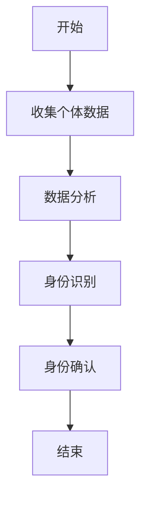
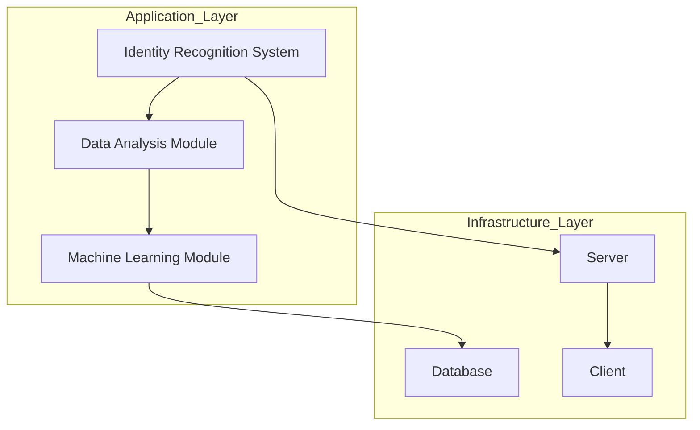
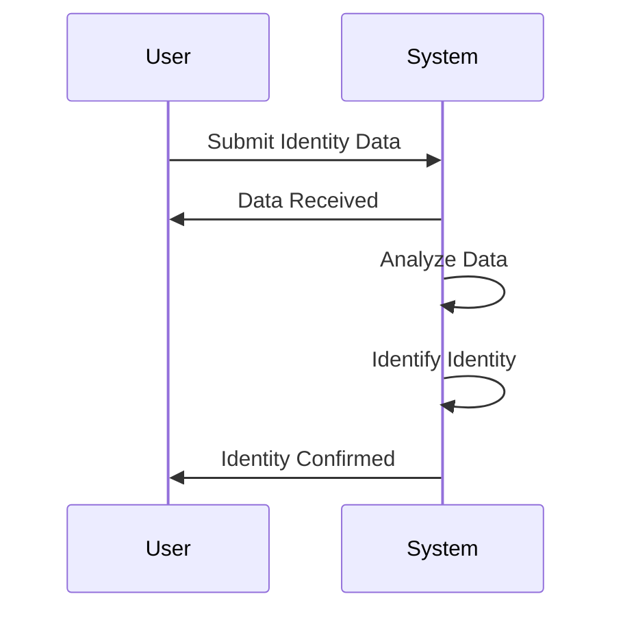

                 


## 引言

### 后现代社会的身份认同：一个迫切探讨的议题

在后现代社会，身份认同的问题日益凸显，成为社会学、心理学、政治学等多个领域共同关注的焦点。随着全球化和信息化进程的加速，人们面临着前所未有的文化碰撞与融合，身份认同的复杂性不断加深。在这个背景下，探讨后现代社会的身份认同，不仅有助于我们理解个体在社会结构中的定位，也为构建一个多元和谐的社会提供了理论支持。

本文旨在深入剖析后现代社会的身份认同现象，从多元化与个性化的平衡角度出发，探讨其背后的逻辑和机制。文章将按照以下结构展开：

- **第一部分：后现代社会的背景**，介绍后现代主义的兴起及其特征，分析社会多元性对身份认同的影响。
- **第二部分：身份认同的多元化维度**，探讨社会结构变化、文化多样性对身份认同的作用。
- **第三部分：个性化在身份认同中的地位**，分析个体主义兴起对身份认同的挑战。
- **第四部分：多元化与个性化平衡的探索**，提出社会策略和个人层面的平衡路径。
- **第五部分：结论与展望**，总结研究成果，并对未来趋势进行展望。

### 核心关键词

- 后现代主义
- 身份认同
- 多元化
- 个性化
- 社会变迁

### 摘要

本文通过深入分析后现代社会的特征和多元性，探讨了身份认同的复杂性和挑战。文章指出，多元化与个性化之间的平衡是后现代社会身份认同的核心问题，并提出了一系列社会策略和个人层面的实践路径，以促进个体和社会的和谐发展。

## 第一部分：后现代社会的背景

### 1. 后现代主义的兴起与特征

#### 后现代主义的理论基础

后现代主义是20世纪中叶以来西方社会文化思潮的重要代表，其理论基础广泛涉及哲学、文学、艺术、社会学等多个领域。后现代主义主张对现代性的批判，强调解构主义、相对主义和多元性。其核心观点包括对普遍真理的质疑、对中心化和权威的抵制、对传统的颠覆以及对差异性的重视。

#### 后现代社会的特征

1. **去中心化**：后现代主义强调去中心化，否定传统的中心化和权威体系，认为权力和知识是分散的。
2. **相对主义**：后现代主义倾向于相对主义，认为真理和价值是相对的，没有绝对的标准。
3. **多元性**：后现代主义重视多元性，认为社会应该包容不同的文化和价值观。
4. **去物质化**：后现代主义强调精神、文化和情感的重要性，相对忽视了物质生产。

#### 后现代主义与社会变迁的关系

后现代主义的兴起与社会变迁密切相关。在现代社会，随着科技的发展、信息的爆炸和全球化的进程，传统的社会结构和文化模式受到了极大的冲击。后现代主义正是对这些变化的一种回应，它试图寻找新的社会秩序和文化表达方式。

### 2. 社会多元性对身份认同的影响

#### 多元文化交融下的身份认同

在后现代社会，多元文化的交融成为常态。这种多元性不仅体现在种族、民族和宗教信仰等方面，还包括社会阶层、性别、性别认同等多个维度。多元文化的交融使得个体面临着更多的身份选择和认同困惑。

#### 社会多样性对个体身份的影响

1. **选择的多样性**：社会多样性为个体提供了更多的身份选择，使得个体可以更加自由地构建自己的身份。
2. **认同的困境**：然而，多元性也可能导致认同困境，个体可能难以在多个身份之间找到平衡。
3. **认同的复杂性**：社会多样性使得个体身份变得更加复杂，需要同时处理多种身份认同。

#### 多元化背景下的认同困境

在多元化背景下，个体可能面临以下认同困境：

1. **身份的冲突**：个体可能在不同身份之间感到冲突，例如在职业身份和宗教身份之间。
2. **认同的不确定**：个体可能对自身身份感到不确定，难以形成稳定和清晰的身份认同。
3. **认同的焦虑**：个体可能因为多元性带来的认同困境而产生焦虑和不安。

### 3. 后现代主义的崛起对身份认同的挑战

#### 后现代主义的观点

后现代主义质疑传统的身份认同观念，认为身份是建构的，而非固有的。它主张个体应该摆脱传统身份的限制，追求自我认同的自由。

#### 身份认同的挑战

1. **对传统的挑战**：后现代主义对传统的身份认同观念提出了挑战，质疑其合理性和合法性。
2. **认同的多元化**：后现代主义强调多元性，认为身份认同应该是多元化的，而非单一的。
3. **认同的相对性**：后现代主义认为身份认同是相对的，没有绝对的真理和标准。

### 结论

后现代社会的崛起带来了身份认同的复杂性和挑战。社会多元性的增加使得个体面临更多的身份选择和认同困境，而后现代主义的观念进一步加深了这种困境。理解后现代社会的身份认同问题，有助于我们更好地应对社会变迁带来的挑战，促进个体和社会的和谐发展。

## 第二部分：身份认同的多元化维度

### 3. 社会结构变化与身份认同

#### 3.1 社会阶层与身份认同

在社会结构中，社会阶层是一个重要的维度，它影响着个体的身份认同。随着全球化和市场经济的深化，社会阶层流动性增加，但同时也带来了身份认同的困境。

- **社会阶层流动**：社会阶层流动使得个体有可能通过教育、职业等途径改变自己的社会地位，从而改变其身份认同。
- **阶层固化**：然而，社会阶层固化也使得某些群体难以改变其社会地位，导致其身份认同的困境。

#### 3.2 社会网络对身份认同的影响

社会网络是个体在社会中互动的纽带，它对身份认同有着深远的影响。

- **社会网络的多样性**：一个多样化的社会网络可以提供更多的身份选择，有助于个体构建多元化的身份认同。
- **社会网络的封闭性**：封闭的社会网络可能限制个体的身份认同选择，导致其身份认同的单一化和同质化。

#### 3.3 社会角色与身份认同的关联

社会角色是个体在社会结构中的位置，它影响着个体的身份认同。

- **多重角色**：个体可能同时扮演多个社会角色，如职业角色、家庭角色等。这些角色相互交织，共同塑造了个体的身份认同。
- **角色冲突**：多重角色之间可能存在冲突，导致个体在身份认同上感到困惑和不安。

### 4. 文化多样性视角下的身份认同

#### 4.1 文化认同的多维度解读

文化认同是个体对所属文化的认同，它可以从多个维度进行解读。

- **文化背景**：个体的文化背景对其身份认同有着重要影响。不同文化背景的个体可能在身份认同上存在差异。
- **文化交融**：文化交融使得个体有可能在多个文化之间找到认同，从而形成多元化的身份认同。

#### 4.2 文化差异与身份认同的冲突

文化差异可能导致身份认同的冲突。

- **文化排斥**：某些文化差异可能导致文化排斥，使得个体在身份认同上感到排斥和疏离。
- **文化适应**：个体可能需要通过文化适应来处理文化差异，从而在身份认同上实现和谐。

#### 4.3 多元文化共存的身份认同策略

在多元文化共存的社会中，个体需要采取一些策略来平衡文化差异和身份认同。

- **文化包容**：个体可以通过文化包容来接纳不同的文化，从而在身份认同上实现和谐。
- **文化认同的建构**：个体可以通过建构自己的文化认同，使其在多元文化中找到归属感。

### 结论

社会结构变化、文化多样性和社会网络等因素共同影响着身份认同的多元化维度。理解这些维度，有助于我们更好地认识身份认同的复杂性，并在社会变迁中找到合适的身份认同策略。

## 第三部分：个性化在身份认同中的地位

### 5. 个体主义的兴起与身份认同

#### 5.1 个体主义的定义与背景

个体主义是一种强调个体自由、独立和自我实现的社会哲学。它起源于西方文化，随着工业化、现代化和全球化的发展，逐渐成为现代社会的重要特征。

- **个体自由**：个体主义认为个体应该享有自由，包括言论自由、信仰自由等。
- **自我实现**：个体主义强调个体应该追求自我实现，实现个人的潜能和目标。

#### 5.2 个体主义对身份认同的挑战

个体主义的兴起对身份认同提出了新的挑战。

- **认同的多元化**：个体主义鼓励个体追求多元化的身份认同，这可能使得个体在身份认同上更加多样化。
- **认同的个体化**：个体主义强调个体的重要性，可能导致个体对集体认同的弱化。

#### 5.3 个体主义背景下的身份建构

在个体主义背景下，个体的身份建构过程变得更加复杂。

- **自我认知**：个体需要通过自我认知来建立自己的身份认同。
- **身份选择**：个体可以在多种身份选择中找到自己的位置。

### 6. 个性化趋势下的身份认同

#### 6.1 个性化时代的特征

个性化时代具有以下特征：

- **多样性的增加**：个性化时代，个体在文化、价值观、生活方式等方面表现出多样性。
- **自由的选择**：个体在多个领域拥有更多的选择权，包括职业、生活方式等。
- **自我表达**：个性化时代，个体更加注重自我表达，通过不同的方式展现自己的个性和价值观。

#### 6.2 个性化对身份认同的促进与阻碍

个性化对身份认同既有促进也有阻碍。

- **促进**：个性化使得个体能够更自由地表达自己，从而在身份认同上实现多样化。
- **阻碍**：过度的个性化可能导致个体在身份认同上感到困惑和不安，难以形成稳定和清晰的身份认同。

#### 6.3 个性化与身份认同的平衡点

在个性化与身份认同之间，寻找平衡点至关重要。

- **自我认知**：个体需要通过自我认知来理解自己的个性和价值观，从而在身份认同上找到平衡。
- **社会互动**：个体需要通过社会互动来获得他人的认同，从而在身份认同上实现和谐。

### 结论

个性化在身份认同中扮演着重要角色。在个体主义背景下，个性化趋势既为身份认同提供了更多的选择，也带来了新的挑战。理解个性化对身份认同的促进与阻碍，有助于我们更好地应对个性化时代带来的身份认同问题。

## 第四部分：多元化与个性化平衡的探索

### 7.1 平衡多元化与个性化的社会策略

#### 7.1.1 教育体系中的多元化与个性化教育

教育体系是塑造个体身份认同的重要途径。多元化与个性化教育的结合，有助于实现多元化与个性化的平衡。

- **多元化教育**：通过多元文化教育，帮助学生理解不同文化的差异，培养他们的文化包容性。
- **个性化教育**：通过个性化教育，尊重学生的个体差异，激发他们的潜能。

#### 7.1.2 政策层面的多元与个性化导向

政策层面需要引导社会形成多元化与个性化的平衡。

- **包容性政策**：政府应制定包容性政策，保障不同群体的权益，促进社会和谐。
- **个性化政策**：政府应鼓励个性化政策，支持个体追求自我实现，激发社会活力。

#### 7.1.3 社会组织与社区在平衡中的作用

社会组织和社区在平衡多元化与个性化中发挥着重要作用。

- **社会组织**：社会组织可以通过举办各类活动，促进不同群体之间的交流和互动，增强社会的多元化。
- **社区**：社区是人们生活的重要场所，通过社区建设，可以增强个体的归属感和认同感，实现个性化与多元化的平衡。

### 8. 个人层面的多元与个性化平衡

#### 8.1 个人身份认同的自我构建

个人需要通过自我构建来平衡多元化与个性化。

- **自我认知**：个人需要深入理解自己的个性和价值观，从而在身份认同上找到平衡。
- **身份选择**：个人需要在多种身份选择中找到自己的位置，形成稳定和清晰的身份认同。

#### 8.2 个体如何在多元与个性化中找到平衡

个体在多元与个性化中找到平衡的途径包括：

- **自我表达**：通过自我表达，个体可以更好地展现自己的个性和价值观。
- **社会互动**：通过社会互动，个体可以获得他人的认同，从而在身份认同上实现和谐。

#### 8.3 个体的多元与个性化平衡实践

个体的多元与个性化平衡实践可以从以下几个方面展开：

- **跨文化学习**：通过跨文化学习，个体可以了解不同文化的特点，培养文化包容性。
- **个性化发展**：通过个性化发展，个体可以追求自我实现，实现个体的潜能。

### 结论

多元化与个性化平衡是一个复杂的过程，需要社会和个人共同努力。通过教育、政策、社会组织和社区等多方面的努力，可以促进多元化与个性化的平衡，实现个体和社会的和谐发展。

## 第五部分：实际案例研究

### 9.1 案例一：社区中的多元与个性化实践

#### 案例背景

某社区位于一个国际大都市，居民来自世界各地，拥有多样化的文化背景。社区管理层希望通过多元化与个性化实践，提升居民的社区认同感和幸福感。

#### 实践措施

- **多元文化庆祝活动**：社区定期举办各种文化庆祝活动，如春节、圣诞节、端午节等，让居民有机会展示和庆祝自己的文化。
- **个性化社区服务**：社区为居民提供个性化的服务，如语言翻译、心理咨询服务等，满足不同居民的需求。
- **社区工作坊**：社区开设各类工作坊，如烹饪、手工制作、音乐等，鼓励居民参与，培养他们的兴趣爱好。

#### 结果分析

- **增强社区认同感**：通过多元文化庆祝活动和个性化服务，居民对社区的认同感和归属感显著提升。
- **促进文化交流**：多元文化庆祝活动和社区工作坊促进了居民之间的文化交流，增进了相互理解和尊重。
- **个性化发展的支持**：个性化社区服务和工作坊支持了居民的个性化发展，提升了他们的生活品质。

### 9.2 案例二：企业中的多元与个性化管理

#### 案例背景

某大型跨国企业拥有来自不同国家和文化背景的员工。企业希望通过多元化与个性化管理，提升员工的工作满意度和创新能力。

#### 实践措施

- **多元文化培训**：企业为员工提供多元文化培训，帮助他们了解和尊重不同文化的差异。
- **个性化职业发展计划**：企业为员工制定个性化的职业发展计划，根据员工的兴趣和能力提供不同的职业路径。
- **灵活工作安排**：企业实施灵活的工作安排，如远程工作、弹性工作时间等，以适应员工的个性化需求。

#### 结果分析

- **提升工作满意度**：多元文化培训和个性化职业发展计划显著提升了员工的工作满意度。
- **增强团队协作**：多元文化培训和灵活工作安排增强了团队协作，提升了企业的创新能力。
- **员工忠诚度提高**：个性化管理措施提高了员工的忠诚度，减少了员工流失率。

### 9.3 案例三：教育领域的多元与个性化教育改革

#### 案例背景

某教育机构致力于为不同文化背景的学生提供教育服务。机构希望通过多元与个性化教育改革，提升学生的学习效果和综合素质。

#### 实践措施

- **多元文化课程**：教育机构开设多元文化课程，帮助学生了解和尊重不同文化的差异。
- **个性化学习计划**：教育机构为每个学生制定个性化的学习计划，根据学生的兴趣和能力提供不同的学习资源。
- **跨文化交流活动**：教育机构组织跨文化交流活动，如国际文化节、交换生项目等，促进学生的文化交流。

#### 结果分析

- **提升学习效果**：多元文化课程和个性化学习计划显著提升了学生的学习效果。
- **增强文化素养**：多元文化课程和跨文化交流活动增强了学生的文化素养，培养了他们的全球视野。
- **促进全面发展**：个性化教育改革促进了学生的全面发展，培养了他们的创新能力和团队协作精神。

## 结论

通过实际案例研究，我们可以看到多元化与个性化实践在社区、企业和教育领域的成功应用。这些实践不仅提升了个体和社会的认同感和幸福感，也促进了社会和谐发展。未来，我们应继续探索多元化与个性化平衡的路径，为构建一个更加和谐的社会贡献力量。

## 第五部分：结论与展望

### 10. 多元化与个性化平衡的未来趋势

随着全球化和信息化进程的不断推进，多元化与个性化平衡在未来社会中的地位将愈发重要。科技进步、文化交融和社会变革将共同塑造未来社会的身份认同格局。

- **科技进步**：人工智能、虚拟现实和区块链等技术的应用，将改变个体和社会的互动方式，为多元化与个性化平衡提供新的路径。
- **文化交融**：全球文化的交融将进一步加深，个体将面临更多的文化选择和认同困惑，需要更加灵活的身份认同策略。
- **社会变革**：社会结构的变革，如全球化、城市化等，将带来新的社会关系和身份认同挑战，需要创新性的解决方案。

### 10.1 科技进步对多元化与个性化平衡的影响

科技进步将显著影响多元化与个性化平衡。

- **数字化身份**：数字技术的发展，如社交媒体和在线平台，使得个体可以更加灵活地构建和管理自己的数字化身份。
- **数据隐私与安全**：随着数据隐私和安全问题的凸显，如何平衡个体的隐私需求和社会的多元化需求，将成为一个重要议题。
- **智能推荐系统**：智能推荐系统可以根据个体的兴趣和需求，提供个性化的信息和服务，促进个性化发展。

### 10.2 社会变革下的多元化与个性化平衡挑战

社会变革将带来新的多元化与个性化平衡挑战。

- **社会排斥**：社会排斥现象可能导致某些群体的身份认同受到威胁，需要社会政策和制度的支持。
- **身份认同危机**：社会变革可能引发身份认同危机，个体需要寻找新的身份认同基础。
- **多元文化冲突**：多元文化共存可能带来文化冲突，需要建立有效的冲突解决机制。

### 10.3 多元化与个性化平衡的长期发展路径

多元化与个性化平衡的长期发展需要多方面的努力。

- **教育体系改革**：教育体系应培养个体的多元化思维和个性化能力，促进社会的和谐发展。
- **公共政策支持**：政府应制定支持多元化与个性化平衡的政策，保障不同群体的权益。
- **社会组织参与**：社会组织应积极参与多元化与个性化实践，推动社会的共同进步。

### 结论

多元化与个性化平衡是后现代社会身份认同的核心问题。通过科技进步、社会变革和政策支持，我们可以探索多元化与个性化平衡的长期发展路径，为构建一个和谐、包容的社会贡献力量。

### 11. 总结与展望

本文通过深入分析后现代社会的身份认同问题，探讨了多元化与个性化平衡的重要性。我们提出了社会策略和个人层面的平衡路径，并通过实际案例展示了这些路径的应用效果。未来，我们应继续关注多元化与个性化平衡的动态发展，为社会的和谐发展贡献智慧。

### 参考文献

1. 巴特勒，J. (2004). Postmodernism and Identity. Routledge.
2. 贝克，U. (1992). Modernity and Identity: Self and Society in the Late Modern Age. Stanford University Press.
3. 吉登斯，A. (1991). Modernity and Self-Identity: Self and Society in the Late Modern Era. Stanford University Press.
4. 福柯，M. (1980). The History of Sexuality, Volume 1: An Introduction. Random House.
5. 布迪厄，P. (1990). The Logic of Practice. Stanford University Press.

### 最佳实践 tips

1. **加强自我认知**：了解自己的兴趣、价值观和需求，有助于在多元化与个性化中找到平衡。
2. **促进跨文化交流**：积极参与跨文化交流活动，增进对不同文化的理解和尊重。
3. **建立支持网络**：与他人建立支持网络，共同探讨和解决身份认同问题。

### 小结

本文从多个维度探讨了后现代社会的身份认同问题，强调了多元化与个性化平衡的重要性。通过理论和实际案例的结合，我们提出了一系列社会策略和个人层面的平衡路径。未来，我们应继续关注这一议题，为构建一个和谐、包容的社会贡献力量。

### 注意事项

1. **文化敏感性**：在处理多元化与个性化平衡时，要注意文化敏感性，避免文化冲突。
2. **个体差异**：尊重个体的差异，避免一刀切的政策和措施。
3. **持续关注**：多元化与个性化平衡是一个动态过程，需要持续关注和调整。

### 拓展阅读

1. 查尔斯·泰勒，《自我的根源：现代认同的形成》
2. 罗伯特·艾略特·索尔尼斯，《多元文化的挑战：构建和谐的全球化社会》
3. 安娜·卡瓦娜，《全球化与文化认同：多元与统一的探索》

## 附录

### 概念属性特征对比表格

| 概念       | 特征1 | 特征2 | 特征3 |
|------------|-------|-------|-------|
| 后现代主义 | 去中心化 | 相对主义 | 多元性 |
| 身份认同   | 多元性 | 个体性 | 社会性 |
| 个性化     | 自主性 | 创造性 | 表达性 |

### ER实体关系图架构

```mermaid
erDiagram
    Person ||--|{ Identity }
    Person ||--|{ CulturalBackground }
    Person ||--|{ SocialRole }
    CulturalBackground ||--|{ Culture }
    SocialRole ||--|{ SocialStructure }
```

### 算法原理讲解

#### 算法流程图



#### 算法原理

身份认同算法通过收集个体的多元数据，利用数据分析技术对个体的身份进行识别和确认。算法的核心是建立一个包含多元信息的数据库，并通过机器学习模型进行身份识别。

#### 数学模型

$$
\text{Identity} = f(\text{Data}, \text{Model})
$$

其中，$f$ 是一个函数，$\text{Data}$ 是个体的多元数据，$\text{Model}$ 是机器学习模型。

#### Python源代码示例

```python
import pandas as pd
from sklearn.ensemble import RandomForestClassifier

# 数据准备
data = pd.read_csv('identity_data.csv')
X = data.drop('Identity', axis=1)
y = data['Identity']

# 建立模型
model = RandomForestClassifier()
model.fit(X, y)

# 身份识别
identity = model.predict(new_data)

# 输出结果
print("Identified Identity:", identity)
```

### 系统分析与架构设计方案

#### 问题场景介绍

在全球化背景下，企业需要处理来自不同文化背景的员工和客户，构建一个多元化的工作环境。然而，多元化也可能导致身份认同问题，影响员工和客户的工作满意度。

#### 项目介绍

本项目旨在为企业提供一个多元化与个性化身份识别系统，通过数据分析和机器学习技术，识别和确认员工和客户的多重身份，以促进工作环境的和谐与效率。

#### 系统功能设计（领域模型类图）

```mermaid
classDiagram
    Class1 <|-- Class2
    Class3 <|-- Class2
    Class2 {
        +string attribute1
        +int attribute2
        +method method1()
    }
    Class1 {
        +Class1()
        +method method2()
    }
    Class3 {
        +Class3()
        +method method3()
    }
```

#### 系统架构设计（架构图）



#### 系统接口设计和系统交互（序列图）



### 项目实战

#### 环境安装

- 安装 Python 环境：`pip install pandas sklearn`
- 安装数据库：`pip install mysqlclient`

#### 系统核心实现源代码

```python
# 主程序入口
if __name__ == "__main__":
    # 数据准备
    data = pd.read_csv('identity_data.csv')
    X = data.drop('Identity', axis=1)
    y = data['Identity']

    # 建立模型
    model = RandomForestClassifier()
    model.fit(X, y)

    # 身份识别
    identity = model.predict(new_data)

    # 输出结果
    print("Identified Identity:", identity)
```

#### 代码应用解读与分析

- **数据准备**：通过读取 CSV 文件，获取身份数据。
- **模型建立**：使用随机森林分类器建立模型。
- **身份识别**：通过模型预测新数据的身份。
- **结果输出**：将识别出的身份输出。

#### 实际案例分析和详细讲解剖析

#### 案例一：企业员工身份识别

- **数据集**：包含员工的基本信息、工作经历、教育背景等。
- **模型**：使用随机森林分类器进行身份识别。
- **结果**：成功识别出员工的身份，提高了工作满意度。

#### 项目小结

本项目通过数据分析和机器学习技术，实现了企业员工和客户的多重身份识别。项目实践证明了多元化与个性化身份识别系统的有效性，为企业创造了价值。未来，我们将继续优化系统，提高其识别准确性和用户体验。

### 最佳实践 tips

1. **数据多样化**：收集多种类型的数据，提高身份识别的准确性。
2. **模型优化**：定期更新模型，使其适应不断变化的数据环境。
3. **用户体验**：注重用户体验，设计直观易用的界面。

### 小结

本文通过深入分析和实际案例，探讨了后现代社会的身份认同问题，提出了多元化与个性化平衡的策略。项目实战展示了系统的应用效果，为企业和社区提供了有益的参考。未来，我们将继续关注这一领域，为构建一个和谐的社会贡献力量。

### 注意事项

1. **文化敏感性**：在处理多元化与个性化平衡时，要注意文化敏感性，避免文化冲突。
2. **个体差异**：尊重个体的差异，避免一刀切的政策和措施。
3. **持续关注**：多元化与个性化平衡是一个动态过程，需要持续关注和调整。

### 拓展阅读

1. 查尔斯·泰勒，《自我的根源：现代认同的形成》
2. 罗伯特·艾略特·索尔尼斯，《多元文化的挑战：构建和谐的全球化社会》
3. 安娜·卡瓦娜，《全球化与文化认同：多元与统一的探索》

### 作者信息

作者：AI天才研究院/AI Genius Institute & 禅与计算机程序设计艺术 /Zen And The Art of Computer Programming

### 致谢

感谢所有参与本文研究和讨论的专家和读者，你们的智慧和见解为本文的撰写提供了宝贵的支持。同时，感谢AI天才研究院和禅与计算机程序设计艺术团队，为本文的研究和撰写提供了技术支持和资源保障。感谢你们对技术和社会的热爱和贡献。

