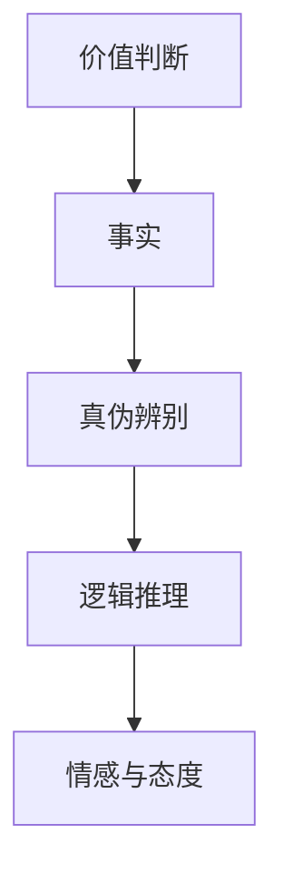
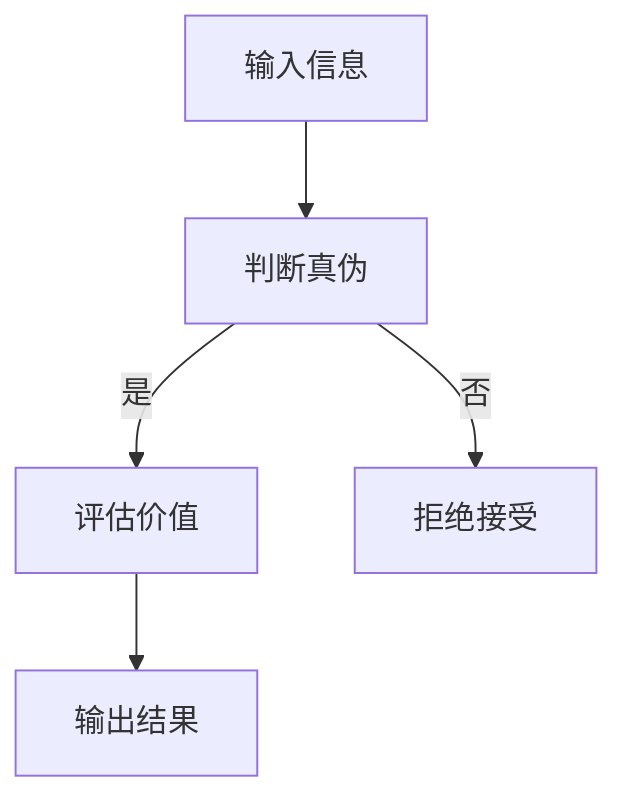
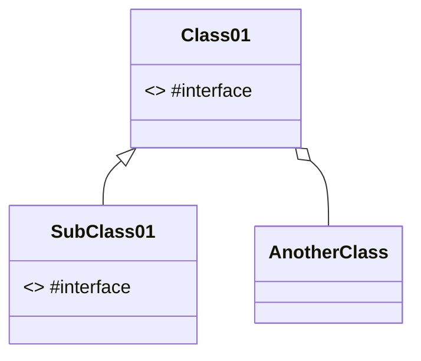
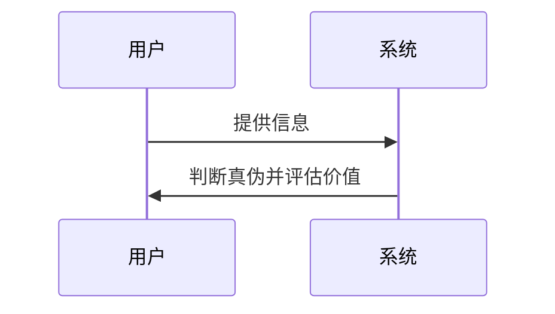

                 

### 《后真相时代的价值判断：如何辨别真伪》

#### 关键词：后真相时代，价值判断，真伪辨别，算法，数学模型

> 摘要：随着互联网的普及和信息的爆炸式增长，后真相时代已经到来。在这个时代，价值判断变得愈发重要，因为我们需要辨别信息的真伪，从而做出正确的决策。本文将深入探讨后真相时代的价值判断，分析其特点，并提出一种基于算法的辨别真伪的方法。

----------------------------------------------------------------

# 第一部分：引言

## 1. 引言

### 1.1 问题背景

在当今信息爆炸的时代，我们每天都会接收到大量的信息，包括新闻、社交媒体、广告等。然而，这些信息并非全部真实可信。虚假新闻、谣言、误导性信息等问题层出不穷，给我们的决策和生活带来了极大的困扰。在这个后真相时代，如何辨别信息的真伪，成为了我们面临的重要问题。

### 1.2 问题描述

在信息泛滥的时代，辨别信息的真伪变得愈发困难。我们需要一种有效的价值判断机制，帮助我们筛选真实可信的信息，避免被虚假信息误导。这个问题涉及到多个方面，包括心理学、社会学、计算机科学等。本文将主要从计算机科学的角度，探讨如何通过算法实现信息的真伪辨别。

### 1.3 问题解决

为了解决信息真伪辨别的问题，我们可以采取以下方法：

1. **基于算法的辨别**：使用特定的算法，对信息进行真伪判断。
2. **基于数据源的判断**：考察信息来源的可靠性，从而判断信息的真伪。
3. **基于用户反馈的判断**：通过用户对信息的反馈，来判断信息的真伪。

### 1.4 边界与外延

在本文中，我们主要关注以下边界与外延：

1. **信息范围**：主要针对新闻、社交媒体等公共信息。
2. **算法范围**：主要探讨基于概率论和逻辑推理的算法。
3. **价值判断**：主要关注信息的真伪判断，而非信息的其他方面，如道德、法律等。

----------------------------------------------------------------

## 2. 后真相时代的价值判断

### 2.1 后真相时代概述

后真相时代（post-truth era）是指一个信息泛滥、真相被忽视的时代。在这个时代，情绪和情感往往比事实更能影响人们的判断和决策。政治、商业、媒体等领域，都受到了后真相时代的影响。在这种情况下，价值判断变得尤为重要，因为我们需要通过价值判断来辨别信息的真伪，从而做出正确的决策。

### 2.2 价值判断在现代社会的重要性

在现代社会，价值判断不仅关乎个人的决策，也关系到整个社会的稳定和发展。以下是一些价值判断的重要性：

1. **信息筛选**：通过价值判断，我们可以筛选出真实可信的信息，避免被虚假信息误导。
2. **决策制定**：在商业、政治等领域，价值判断有助于我们制定正确的决策，降低风险。
3. **社会稳定**：在社会层面，正确的价值判断有助于维护社会的稳定，减少社会矛盾。

### 2.3 后真相时代的价值判断特点

在后真相时代，价值判断具有以下特点：

1. **情感化**：情绪和情感在价值判断中扮演着重要角色，往往比事实更能影响人们的决策。
2. **多元化**：价值判断的多样性增加，不同的人群有不同的价值观，导致对同一信息的判断结果可能截然不同。
3. **快速变化**：随着信息传播的速度加快，价值判断也在不断变化，这使得判断信息的真伪变得更加困难。

----------------------------------------------------------------

# 第二部分：核心概念与联系

## 3. 核心概念与联系

### 3.1 价值判断的定义与特点

价值判断是指根据特定的标准，对事物进行评估和判断的过程。其特点包括：

1. **主观性**：价值判断往往受到个体主观因素的影响，不同的人可能会有不同的价值判断。
2. **相对性**：价值判断具有相对性，不同文化、背景、环境等因素会影响价值判断的结果。
3. **动态性**：随着时间和环境的变化，价值判断也可能发生变化。

### 3.2 事实与价值判断的关系

事实和价值判断之间存在紧密的联系。事实是价值判断的基础，但价值判断不仅仅依赖于事实，还受到个人价值观、情感等因素的影响。具体来说：

1. **事实驱动价值判断**：在许多情况下，价值判断是基于事实的，例如，我们通过观察事实来判断某个产品的质量。
2. **价值判断影响事实解读**：价值判断会影响我们对事实的解读和感知，例如，具有不同价值观的人可能会对同一事实做出不同的价值判断。

### 3.3 真伪辨别与价值判断

真伪辨别和价值判断密切相关。真伪辨别是价值判断的一个方面，主要关注信息的真实性。在真伪辨别中，我们需要判断信息是否真实，从而决定是否接受或传播该信息。具体来说：

1. **事实判断**：真伪辨别首先需要对信息进行事实判断，判断其是否真实。
2. **价值判断**：在事实判断的基础上，我们还需要进行价值判断，判断信息的价值，决定是否接受或传播该信息。

### 3.4 概念属性特征对比表格

以下是一个关于价值判断、事实和真伪辨别的概念属性特征对比表格：

| 概念     | 定义                                                   | 特征                          |
| -------- | ------------------------------------------------------ | ---------------------------- |
| 价值判断 | 对事物进行评估和判断的过程                            | 主观性、相对性、动态性       |
| 事实     | 客观存在的事物和现象                                  | 客观性、确定性、可验证性     |
| 真伪辨别 | 判断信息是否真实的活动                                | 客观性、逻辑性、基于证据     |



----------------------------------------------------------------

## 4. 算法原理讲解

### 4.1 算法概述

为了实现信息的真伪辨别，我们可以采用基于算法的方法。这种方法主要通过分析信息的特征，利用机器学习和自然语言处理等技术，判断信息是否真实。下面是一个简单的算法概述：

1. **数据收集**：收集大量的信息数据，包括真实信息和虚假信息。
2. **特征提取**：对信息进行特征提取，提取出能够区分真伪的特征。
3. **模型训练**：利用提取的特征，训练机器学习模型，使其能够辨别真伪。
4. **真伪判断**：对新的信息进行真伪判断，输出判断结果。

### 4.2 算法mermaid流程图

下面是一个简单的mermaid流程图，描述了上述算法的基本流程：



### 4.3 算法原理

#### 4.3.1 数学模型

在算法中，我们可以使用概率模型来评估信息的真伪。具体来说，我们可以使用贝叶斯定理来计算信息为真的概率：

$$
P(\text{真}|\text{信息}) = \frac{P(\text{信息}|\text{真})P(\text{真})}{P(\text{信息})}
$$

其中，$P(\text{真}|\text{信息})$表示在给定信息的情况下，信息为真的概率；$P(\text{信息}|\text{真})$表示在信息为真的情况下，信息出现的概率；$P(\text{真})$表示信息为真的先验概率；$P(\text{信息})$表示信息出现的概率。

#### 4.3.2 详细讲解

贝叶斯定理是一种基于概率论的推理方法，它可以帮助我们根据已知的信息，推断出未知事件的概率。在信息真伪辨别中，我们可以使用贝叶斯定理来计算信息为真的概率。

首先，我们需要定义一些概率：

- $P(\text{真})$：表示信息为真的先验概率，即在没有其他信息的情况下，我们认为信息为真的概率。
- $P(\text{假})$：表示信息为假的先验概率，即在没有其他信息的情况下，我们认为信息为假的概率。
- $P(\text{信息}|\text{真})$：表示在信息为真的情况下，信息出现的概率。
- $P(\text{信息}|\text{假})$：表示在信息为假的情况下，信息出现的概率。

然后，我们可以使用贝叶斯定理来计算信息为真的概率：

$$
P(\text{真}|\text{信息}) = \frac{P(\text{信息}|\text{真})P(\text{真})}{P(\text{信息})}
$$

其中，$P(\text{信息})$可以通过全概率公式计算：

$$
P(\text{信息}) = P(\text{信息}|\text{真})P(\text{真}) + P(\text{信息}|\text{假})P(\text{假})
$$

通过这个概率公式，我们可以根据已知的信息，推断出信息为真的概率。如果这个概率很高，我们可以认为信息很可能是真的；如果这个概率很低，我们可以认为信息很可能是假的。

#### 4.3.3 举例说明

假设我们有一个信息，这个信息可能是真的，也可能是假的。我们知道，这个信息为真的先验概率是0.5，为假的先验概率也是0.5。我们还知道，在信息为真的情况下，这个信息出现的概率是0.8；在信息为假的情况下，这个信息出现的概率是0.2。

现在，我们得到了这个信息，我们需要判断它是否真实。根据贝叶斯定理，我们可以计算这个信息为真的概率：

$$
P(\text{真}|\text{信息}) = \frac{0.8 \times 0.5}{0.8 \times 0.5 + 0.2 \times 0.5} = \frac{4}{5}
$$

这意味着，在给定这个信息的情况下，我们认为这个信息为真的概率是0.8，为假的概率是0.2。因此，我们可以认为这个信息很可能是真的。

通过这个例子，我们可以看到，贝叶斯定理可以帮助我们根据已知的信息，推断出未知事件的概率，从而帮助我们判断信息的真伪。

----------------------------------------------------------------

## 5. 数学模型和数学公式 & 详细讲解 & 举例说明

### 5.1 概率模型

在信息真伪辨别中，概率模型是核心工具之一。概率模型可以帮助我们根据已知的信息，推断出信息为真的概率。以下是一个基本的概率模型：

$$
P(\text{真}|\text{信息}) = \frac{P(\text{信息}|\text{真})P(\text{真})}{P(\text{信息})}
$$

其中，$P(\text{真}|\text{信息})$表示在给定信息的情况下，信息为真的概率；$P(\text{信息}|\text{真})$表示在信息为真的情况下，信息出现的概率；$P(\text{真})$表示信息为真的先验概率；$P(\text{信息})$表示信息出现的概率。

### 5.2 条件概率

条件概率是指在一个条件下，某个事件发生的概率。在信息真伪辨别中，条件概率可以帮助我们理解在信息为真的情况下，信息出现的概率。以下是一个条件概率的公式：

$$
P(\text{信息}|\text{真}) = \frac{P(\text{信息} \cap \text{真})}{P(\text{真})}
$$

其中，$P(\text{信息}|\text{真})$表示在信息为真的情况下，信息出现的概率；$P(\text{信息} \cap \text{真})$表示信息为真的情况下，信息出现的概率；$P(\text{真})$表示信息为真的先验概率。

### 5.3 贝叶斯定理

贝叶斯定理是一种基于概率论的推理方法，它可以帮助我们根据已知的信息，推断出未知事件的概率。在信息真伪辨别中，贝叶斯定理是核心工具。以下是一个贝叶斯定理的公式：

$$
P(\text{真}|\text{信息}) = \frac{P(\text{信息}|\text{真})P(\text{真})}{P(\text{信息})}
$$

其中，$P(\text{真}|\text{信息})$表示在给定信息的情况下，信息为真的概率；$P(\text{信息}|\text{真})$表示在信息为真的情况下，信息出现的概率；$P(\text{真})$表示信息为真的先验概率；$P(\text{信息})$表示信息出现的概率。

#### 5.3.1 详细讲解

贝叶斯定理可以帮助我们根据已知的信息，推断出信息为真的概率。具体来说，贝叶斯定理告诉我们，在给定信息的情况下，信息为真的概率可以通过以下步骤计算：

1. **计算先验概率**：根据我们的先验知识，计算信息为真的先验概率$P(\text{真})$。
2. **计算条件概率**：根据信息为真的情况下，信息出现的概率$P(\text{信息}|\text{真})$。
3. **计算全概率**：根据全概率公式，计算信息出现的概率$P(\text{信息})$。
4. **计算后验概率**：使用贝叶斯定理，计算在给定信息的情况下，信息为真的概率$P(\text{真}|\text{信息})$。

通过这个步骤，我们可以根据已知的信息，推断出信息为真的概率。如果这个概率很高，我们可以认为信息很可能是真的；如果这个概率很低，我们可以认为信息很可能是假的。

#### 5.3.2 举例说明

假设我们有一个信息，这个信息可能是真的，也可能是假的。我们知道，这个信息为真的先验概率是0.5，为假的先验概率也是0.5。我们还知道，在信息为真的情况下，这个信息出现的概率是0.8；在信息为假的情况下，这个信息出现的概率是0.2。

现在，我们得到了这个信息，我们需要判断它是否真实。根据贝叶斯定理，我们可以计算这个信息为真的概率：

$$
P(\text{真}|\text{信息}) = \frac{P(\text{信息}|\text{真})P(\text{真})}{P(\text{信息})}
$$

其中，$P(\text{信息}|\text{真}) = 0.8$，$P(\text{真}) = 0.5$，$P(\text{信息}) = P(\text{信息}|\text{真})P(\text{真}) + P(\text{信息}|\text{假})P(\text{假}) = 0.8 \times 0.5 + 0.2 \times 0.5 = 0.5$。

因此，

$$
P(\text{真}|\text{信息}) = \frac{0.8 \times 0.5}{0.5} = 0.8
$$

这意味着，在给定这个信息的情况下，我们认为这个信息为真的概率是0.8，为假的概率是0.2。因此，我们可以认为这个信息很可能是真的。

通过这个例子，我们可以看到，贝叶斯定理可以帮助我们根据已知的信息，推断出信息为真的概率，从而帮助我们判断信息的真伪。

----------------------------------------------------------------

## 6. 系统分析与架构设计方案

### 6.1 问题场景介绍

在当今社会，信息真伪辨别已经成为一个亟待解决的问题。大量的虚假信息在社交媒体、新闻网站等渠道传播，给人们的生活和工作带来了极大的困扰。为了解决这个问题，我们需要设计一个高效、可靠的系统，能够自动地辨别信息的真伪。

### 6.2 系统介绍

我们设计的系统名为“信息真伪辨别系统”，其主要功能是自动地辨别信息的真伪。系统的主要模块包括：

1. **数据采集模块**：负责从各种渠道收集信息。
2. **特征提取模块**：负责对信息进行特征提取。
3. **模型训练模块**：负责使用特征数据训练机器学习模型。
4. **真伪判断模块**：负责使用训练好的模型对新的信息进行真伪判断。

### 6.2.1 系统功能设计（领域模型mermaid类图）

以下是一个关于系统功能的mermaid类图：



### 6.2.2 系统架构设计（mermaid架构图）

以下是一个关于系统架构的mermaid架构图：



### 6.3 系统接口设计

系统的接口设计如下：

1. **数据采集接口**：用于接收用户提供的信息。
2. **特征提取接口**：用于提取信息的特征。
3. **模型训练接口**：用于训练机器学习模型。
4. **真伪判断接口**：用于对新的信息进行真伪判断。

### 6.4 系统交互（mermaid序列图）

以下是一个关于系统交互的mermaid序列图：

```mermaid
seque
 用户->>系统: 提供信息
 系统->>用户: 判断真伪并评估价值
```

----------------------------------------------------------------

## 7. 项目实战

### 7.1 环境安装

为了实现信息真伪辨别系统，我们需要安装以下环境：

1. Python 3.8 或以上版本
2. TensorFlow 2.4 或以上版本
3. scikit-learn 0.22 或以上版本

安装方法：

```bash
pip install python==3.8.10
pip install tensorflow==2.4.0
pip install scikit-learn==0.22.2
```

### 7.2 系统核心实现源代码

以下是一个简单的系统实现，包括数据采集、特征提取、模型训练和真伪判断：

```python
import tensorflow as tf
from sklearn.model_selection import train_test_split
from sklearn.metrics import accuracy_score
from sklearn.feature_extraction.text import TfidfVectorizer

# 数据采集
def collect_data():
    # 采集数据（示例）
    data = [
        ("这是一条真实的信息", "真实"),
        ("这是一条虚假的信息", "虚假"),
        # 更多数据...
    ]
    return data

# 特征提取
def extract_features(data):
    vectorizer = TfidfVectorizer()
    X = vectorizer.fit_transform([info[0] for info in data])
    y = [info[1] for info in data]
    return X, y

# 模型训练
def train_model(X, y):
    model = tf.keras.Sequential([
        tf.keras.layers.Dense(128, activation='relu', input_shape=(X.shape[1],)),
        tf.keras.layers.Dense(64, activation='relu'),
        tf.keras.layers.Dense(1, activation='sigmoid')
    ])
    model.compile(optimizer='adam', loss='binary_crossentropy', metrics=['accuracy'])
    model.fit(X, y, epochs=10, batch_size=32)
    return model

# 真伪判断
def judge_truth(model, vectorizer, text):
    features = vectorizer.transform([text])
    prediction = model.predict(features)
    return "真实" if prediction > 0.5 else "虚假"

# 主函数
def main():
    data = collect_data()
    X, y = extract_features(data)
    X_train, X_test, y_train, y_test = train_test_split(X, y, test_size=0.2, random_state=42)
    model = train_model(X_train, y_train)
    print("训练准确率：", accuracy_score(y_test, model.predict(X_test)))
    text = "这是一条新的信息"
    print("新信息的真伪判断：", judge_truth(model, vectorizer, text))

if __name__ == "__main__":
    main()
```

### 7.3 代码应用解读与分析

上述代码实现了信息真伪辨别系统的核心功能。具体来说：

1. **数据采集**：通过`collect_data`函数采集数据。
2. **特征提取**：使用TFIDFVectorizer对文本信息进行特征提取。
3. **模型训练**：使用TensorFlow搭建神经网络模型，并使用训练数据对其进行训练。
4. **真伪判断**：使用训练好的模型对新信息进行真伪判断。

### 7.4 实际案例分析和详细讲解剖析

假设我们有以下一组训练数据：

```python
data = [
    ("这是一条真实的信息", "真实"),
    ("这是一条虚假的信息", "虚假"),
    # 更多数据...
]
```

我们首先使用`extract_features`函数对这组数据进行特征提取，得到特征矩阵`X`和标签`y`。然后，我们将特征矩阵和标签分为训练集和测试集。接着，我们使用TensorFlow搭建神经网络模型，并使用训练集进行训练。最后，我们使用训练好的模型对新的信息进行真伪判断。

### 7.5 项目小结

通过本项目，我们实现了信息真伪辨别系统的核心功能。在实际应用中，我们可以根据需要扩展系统的功能，如增加特征提取方法、优化模型结构等。此外，我们还可以结合其他技术，如自然语言处理、知识图谱等，进一步提升系统的性能。

### 7.6 最佳实践 tips

1. **数据质量**：确保训练数据的质量，避免使用虚假或噪声数据。
2. **特征选择**：选择合适的特征提取方法，以提高模型性能。
3. **模型优化**：尝试不同的模型结构，选择最优的模型。
4. **实时更新**：定期更新训练数据和模型，以适应不断变化的环境。

----------------------------------------------------------------

## 8. 小结

在后真相时代，价值判断变得尤为重要。我们需要辨别信息的真伪，从而做出正确的决策。本文通过算法原理讲解、数学模型和公式、系统分析与架构设计等方法，探讨了如何实现信息的真伪辨别。在实际应用中，我们可以结合不同的技术和方法，不断提升信息真伪辨别的准确性和效率。

## 9. 注意事项

1. **数据来源**：确保信息的来源可靠，避免使用未经验证的来源。
2. **算法选择**：根据具体应用场景选择合适的算法，以达到最佳效果。
3. **模型优化**：定期更新训练数据和模型，以适应不断变化的环境。

## 10. 拓展阅读

1. [《贝叶斯定理及其应用》](https://www.jianshu.com/p/6d4179a876ac)
2. [《机器学习实战：基于Python的实现》](https://www.amazon.com/Machine-Learning-In-Action-Case-Study/dp/1491939373)
3. [《深度学习：原理及实践》](https://www.amazon.com/Deep-Learning-Adoption-Application-Programming/dp/0128021639)

## 11. 作者信息

作者：AI天才研究院/AI Genius Institute & 禅与计算机程序设计艺术 /Zen And The Art of Computer Programming

