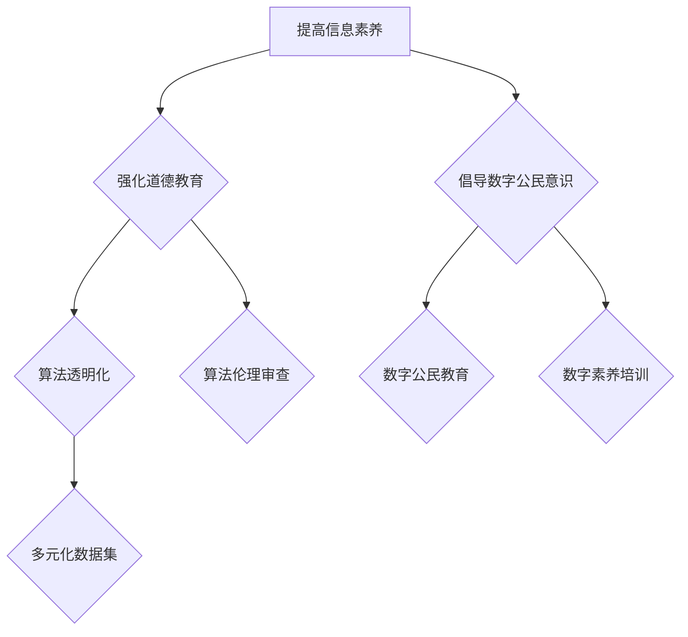
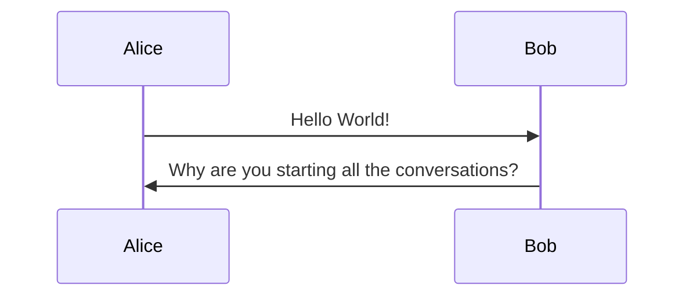
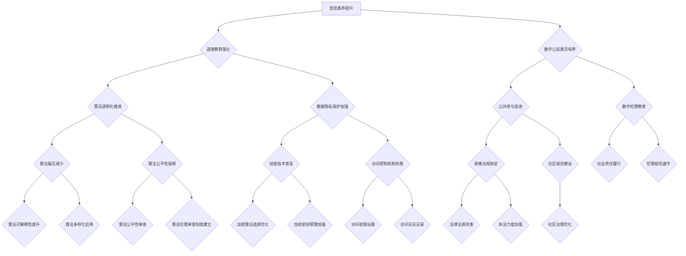
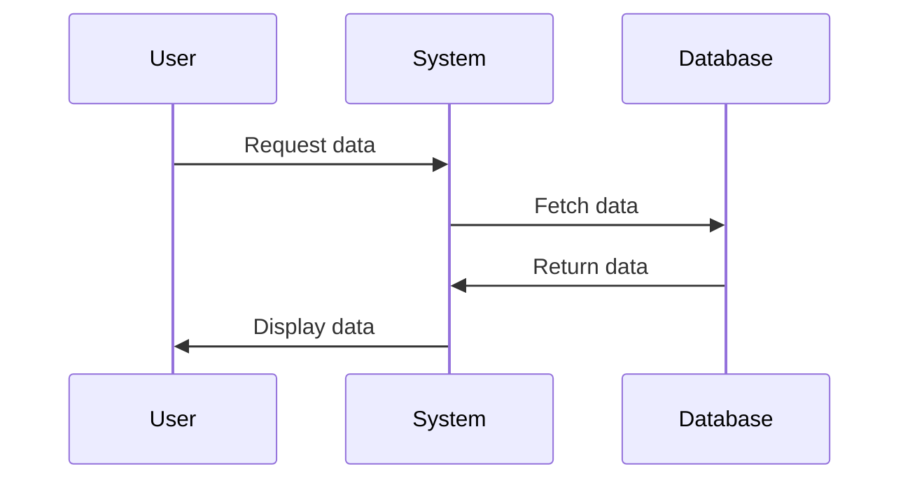

                 

## 后真相时代的价值观重建

### 关键词：后真相时代、价值观重建、信息过载、算法偏见、数字公民

### 摘要：在数字技术迅猛发展的今天，我们正进入一个被称为“后真相时代”的新阶段。这个时代，信息的快速传播与泛滥，使得事实与虚构的界限变得模糊，传统的价值观受到了前所未有的冲击。本文将深入探讨后真相时代的特点及其对现代社会价值观的重塑，通过分析信息过载、算法偏见等关键问题，提出重建价值观的路径和方法，旨在为数字时代的公民提供一种新的思考框架和实践指南。

### 引言

随着互联网、大数据和人工智能等技术的飞速发展，人类社会进入了一个信息爆炸的时代。然而，这个看似美好的时代却隐藏着深层次的问题。信息过载、虚假信息的泛滥以及算法偏见等问题，正在对现代社会的价值观产生深远的影响。所谓“后真相时代”，指的是一个事实与情感、情绪比事实更重要的时代。在这个时代，传统的事实判断标准被挑战，价值观的稳定性受到了冲击。

### 什么是后真相时代？

#### 1. 特点分析

后真相时代具有以下显著特点：

1. **信息过载**：互联网上的信息量庞大，人们难以对信息进行有效的筛选和判断。
2. **情感驱动**：人们更容易被情感和情绪所驱动，而非事实本身。
3. **算法偏见**：人工智能算法在处理信息时可能存在偏见，进而影响人们的世界观和价值观。
4. **去中心化**：信息传播的去中心化特征使得传统媒体的影响力减弱，新兴媒体成为信息传播的主要途径。

#### 2. 问题背景

后真相时代的出现并非偶然，其背后有深刻的社会和技术背景：

1. **技术进步**：互联网、大数据和人工智能等技术的发展，使得信息的生产和传播速度大大加快。
2. **信息民主化**：人人都能成为信息的生产者和传播者，信息传播的门槛大幅降低。
3. **媒体环境变化**：传统媒体衰落，社交媒体和自媒体崛起，信息传播方式发生了根本变化。

### 价值观重建的必要性

#### 1. 传统价值观受到冲击

在传统价值观体系中，事实是基础，理性是主导。然而，在后真相时代，这些基础受到了挑战：

1. **事实模糊性**：信息过载和虚假信息使得事实变得模糊不清。
2. **情感化决策**：人们更容易被情感驱动，而非理性分析。

#### 2. 社会问题凸显

后真相时代还引发了一系列社会问题：

1. **政治极化**：信息筛选和情绪驱动加剧了社会分裂和极端化倾向。
2. **道德困境**：虚假信息和算法偏见导致道德困境和社会信任危机。

#### 3. 个人影响

对个人而言，后真相时代带来的影响也是深远：

1. **认知失调**：信息过载和情感驱动导致个人难以形成稳定的价值观。
2. **自我怀疑**：在信息模糊和价值观多元的情况下，个人可能陷入自我怀疑和迷茫。

### 重建价值观的路径和方法

#### 1. 提高信息素养

提高信息素养是重建价值观的第一步：

1. **辨别真伪**：学会辨别信息的真实性和可靠性。
2. **理性分析**：培养理性思考的能力，避免被情感驱动。

#### 2. 强化道德教育

道德教育在价值观重建中起着至关重要的作用：

1. **道德底线**：强化道德底线，防止虚假信息和算法偏见对社会造成伤害。
2. **道德自律**：鼓励个人在信息传播和消费过程中遵循道德规范。

#### 3. 倡导数字公民意识

数字公民意识是应对后真相时代的重要武器：

1. **信息责任**：认识到在数字时代，每个人都是信息传播者，应承担相应的责任。
2. **社会责任**：数字公民应积极参与社会建设，共同维护数字时代的价值观。

### 案例分析

#### 1. 真相与假象的较量

以“特朗普选举争议”为例，探讨真相与假象在数字时代的较量。

1. **真相**：选举结果真实可信。
2. **假象**：社交媒体上的虚假信息和不实言论。
3. **影响**：真假信息的传播加剧了社会分裂和冲突。

#### 2. 算法偏见的反思

以“亚马逊招聘算法”为例，反思算法偏见对价值观重建的影响。

1. **现象**：算法在招聘过程中对特定群体的偏见。
2. **影响**：偏见可能加剧社会不平等，影响个人的职业发展。
3. **解决**：通过改进算法和加强道德约束来减少偏见。

### 总结与展望

后真相时代的到来对传统的价值观体系构成了巨大挑战。为了应对这一挑战，我们需要从提高信息素养、强化道德教育和倡导数字公民意识等多方面入手，进行全方位的价值观重建。未来，随着技术的发展和社会的进步，这一过程将更加复杂和艰巨。但只有通过共同努力，我们才能在数字时代重建一个更加公正、平等和理性的社会价值观。

### 拓展阅读

1. **《数字时代的价值观重建》**：作者通过深入分析数字时代的特征，提出了重建价值观的多种途径。
2. **《算法伦理》**：探讨了算法偏见和道德伦理之间的关系，为解决后真相时代的问题提供了理论支持。
3. **《信息素养教育》**：详细介绍了信息素养教育的理论和实践方法，有助于提升公众的信息辨别能力。

### 作者信息

作者：AI天才研究院/AI Genius Institute & 禅与计算机程序设计艺术 /Zen And The Art of Computer Programming

## 后真相时代的价值观重建

### 引言

随着数字技术的飞速发展，我们正步入一个前所未有的时代——后真相时代。这个时代，信息的传播速度远超以往，信息量呈指数级增长，而事实的判断变得复杂且困难。在这个背景下，传统的价值观受到前所未有的冲击，重建价值观成为了当务之急。本文将从后真相时代的定义、特点、影响以及重建价值观的路径和方法等方面进行深入探讨。

### 后真相时代的定义

#### 1. 何为后真相时代

后真相时代，指的是一个以情感和情绪为主导的时代，事实和真相不再是最重要的考量因素，而是情感和情绪的驱动。在这个时代，信息传播速度快，虚假信息、谣言和情感驱动的内容更容易传播和被接受。因此，后真相时代的定义不仅仅是一个技术层面的变化，更是一个社会文化层面的变革。

#### 2. 历史背景

后真相时代的兴起并非偶然，而是多重因素共同作用的结果。首先，互联网的普及和信息技术的飞速发展，使得信息传播的速度和范围大幅增加。其次，社交媒体的崛起，使得每个人都可以成为信息的传播者，信息的源头变得更加复杂和多样。此外，算法和大数据技术的应用，使得信息传播更加精准和高效，但也导致了信息的封闭和偏见。

### 后真相时代的特征

#### 1. 信息过载

信息过载是后真相时代最为明显的特征之一。随着互联网的普及，每个人每天都会接收到大量的信息。然而，由于时间和精力的限制，人们很难对所有信息进行有效的处理和筛选，这导致了信息的堆积和混乱。

#### 2. 情感驱动

在后真相时代，情感和情绪比事实本身更具有影响力。人们在面对信息时，更容易被情感驱动，而非理性分析。这种情感驱动的现象，在社交媒体上尤为明显，各种谣言和虚假信息往往能够迅速传播，甚至成为社会主流观点。

#### 3. 算法偏见

算法偏见是后真相时代的另一个重要特征。随着人工智能技术的发展，算法在信息处理和传播中发挥着越来越重要的作用。然而，算法往往基于数据和模式进行判断，这可能导致对特定群体的偏见，进而影响社会的公平性和正义性。

#### 4. 去中心化

后真相时代还表现为信息传播的去中心化。传统媒体的影响力减弱，而社交媒体和自媒体成为信息传播的主要渠道。这种去中心化的特征，使得信息的传播更加多样和复杂，但也增加了信息真实性和可信度的风险。

### 后真相时代对价值观的影响

#### 1. 传统价值观的冲击

后真相时代对传统价值观构成了巨大的冲击。在传统的价值观体系中，事实是基础，理性是主导。然而，在后真相时代，事实的判断变得复杂且困难，而情感和情绪的驱动则使得传统价值观的基础受到挑战。

#### 2. 社会问题的凸显

后真相时代引发了一系列社会问题。信息过载和虚假信息的泛滥，使得社会信任度降低，社会分裂加剧。算法偏见则可能导致社会不公平和道德困境。

#### 3. 个人影响的扩大

对个人而言，后真相时代的影响也是深远的。信息过载和情感驱动可能导致认知失调和自我怀疑。而算法偏见则可能影响个人的职业发展和生活决策。

### 重建价值观的必要性

#### 1. 应对信息过载

为了应对信息过载，我们需要提高信息素养，学会辨别信息的真实性和可靠性。同时，也需要培养理性思考的能力，避免被情感和情绪所驱动。

#### 2. 弱化算法偏见

为了弱化算法偏见，我们需要加强对算法的研究和监管，确保算法的公平性和透明度。同时，也需要通过道德教育和自律，减少算法偏见对社会的影响。

#### 3. 促进社会信任

为了促进社会信任，我们需要强化道德教育，提高社会的道德水平。同时，也需要通过法律和制度的建设，确保社会的公平和正义。

### 重建价值观的路径和方法

#### 1. 提高信息素养

提高信息素养是重建价值观的第一步。这包括辨别信息的真实性和可靠性，培养理性思考的能力，避免被情感和情绪所驱动。

#### 2. 强化道德教育

道德教育在重建价值观中起着至关重要的作用。我们需要通过道德教育，提高社会的道德水平，强化道德底线，减少社会不平等和道德困境。

#### 3. 倡导数字公民意识

数字公民意识是应对后真相时代的重要武器。我们需要认识到在数字时代，每个人都是信息传播者，应承担相应的责任。同时，也需要通过数字公民教育，提高公众的数字素养和道德水平。

### 案例分析

#### 1. 真相与假象的较量

以“特朗普选举争议”为例，探讨真相与假象在数字时代的较量。特朗普选举争议中，社交媒体上充斥着大量的虚假信息和谣言，这些信息不仅影响了公众的观点，还加剧了社会的分裂和冲突。这一案例揭示了后真相时代真相与假象的较量，以及其对价值观的冲击。

#### 2. 算法偏见的反思

以“亚马逊招聘算法”为例，反思算法偏见对价值观重建的影响。亚马逊的招聘算法在处理简历时对女性和少数族裔存在偏见，这导致了不公平的就业机会。这一案例表明，算法偏见不仅影响了个体的职业发展，也对社会公平性产生了负面影响。

### 总结与展望

后真相时代的到来对传统的价值观体系构成了巨大挑战。为了应对这一挑战，我们需要从提高信息素养、强化道德教育和倡导数字公民意识等多方面入手，进行全方位的价值观重建。未来，随着技术的发展和社会的进步，这一过程将更加复杂和艰巨。但只有通过共同努力，我们才能在数字时代重建一个更加公正、平等和理性的社会价值观。

### 拓展阅读

1. **《数字时代的价值观重建》**：作者通过深入分析数字时代的特征，提出了重建价值观的多种途径。
2. **《算法伦理》**：探讨了算法偏见和道德伦理之间的关系，为解决后真相时代的问题提供了理论支持。
3. **《信息素养教育》**：详细介绍了信息素养教育的理论和实践方法，有助于提升公众的信息辨别能力。

### 作者信息

作者：AI天才研究院/AI Genius Institute & 禅与计算机程序设计艺术 /Zen And The Art of Computer Programming

## 什么是后真相时代？

### 1. 何为后真相时代

后真相时代，是指在信息传播中，情感和情绪的影响力超越事实和真相的时代。在这个时代，事实的判断变得复杂和困难，而情感和情绪往往成为决策和行为的主要驱动力。后真相时代的出现，标志着信息传播方式和社会认知模式发生了根本性的变化。

### 2. 特点分析

#### a. 信息过载

信息过载是后真相时代最为突出的特征之一。随着互联网的普及和大数据技术的发展，人们每天接收到的信息量呈爆炸式增长。然而，由于时间和精力的限制，人们很难对所有信息进行有效的处理和筛选，导致信息的堆积和混乱。

#### b. 情感驱动

在后真相时代，情感和情绪比事实本身更具有影响力。人们在面对信息时，更容易被情感和情绪所驱动，而非理性分析。这种情感驱动现象在社交媒体上尤为明显，各种谣言和虚假信息往往能够迅速传播，甚至成为社会主流观点。

#### c. 算法偏见

算法偏见是后真相时代的另一个重要特征。随着人工智能技术的发展，算法在信息处理和传播中发挥着越来越重要的作用。然而，算法往往基于数据和模式进行判断，这可能导致对特定群体的偏见，进而影响社会的公平性和正义性。

#### d. 去中心化

后真相时代还表现为信息传播的去中心化。传统媒体的影响力减弱，而社交媒体和自媒体成为信息传播的主要渠道。这种去中心化的特征，使得信息的传播更加多样和复杂，但也增加了信息真实性和可信度的风险。

### 3. 社会和技术背景

#### a. 社会背景

后真相时代的出现，与现代社会的一些特征密切相关：

1. **全球化**：全球化使得信息传播的速度和范围大幅增加，信息的多样性和复杂性也相应增加。
2. **技术发展**：互联网、大数据和人工智能等技术的发展，为信息传播提供了新的工具和平台，但也带来了新的挑战。
3. **社会分裂**：社会分裂和不平等加剧，使得人们在面对信息时更容易被情感和情绪所驱动。

#### b. 技术背景

后真相时代的形成，也与技术的快速发展密切相关：

1. **互联网**：互联网的普及，使得信息传播的速度和范围大幅增加，信息的多样性和复杂性也相应增加。
2. **大数据**：大数据技术的发展，使得信息处理和分析能力大幅提升，但也增加了信息过载的风险。
3. **人工智能**：人工智能技术的发展，使得算法在信息处理和传播中发挥着越来越重要的作用，但也增加了算法偏见的风险。

### 4. 后真相时代的挑战

后真相时代对传统的价值观体系构成了巨大挑战，主要体现在以下几个方面：

#### a. 事实与情感的冲突

在传统价值观中，事实是基础，理性是主导。然而，在后真相时代，事实的判断变得复杂且困难，而情感和情绪往往成为决策和行为的主要驱动力。这种冲突导致了社会认知的混乱和价值观的动摇。

#### b. 社会信任的下降

信息过载和虚假信息的泛滥，使得社会信任度降低。人们开始怀疑信息的真实性和可靠性，这进一步加剧了社会分裂和不信任。

#### c. 算法偏见的加剧

算法偏见是后真相时代的另一个重要特征。随着人工智能技术的发展，算法在信息处理和传播中发挥着越来越重要的作用。然而，算法往往基于数据和模式进行判断，这可能导致对特定群体的偏见，进而影响社会的公平性和正义性。

### 5. 应对策略

为了应对后真相时代的挑战，我们需要采取一系列策略：

#### a. 提高信息素养

提高信息素养是应对后真相时代的第一步。这包括辨别信息的真实性和可靠性，培养理性思考的能力，避免被情感和情绪所驱动。

#### b. 强化道德教育

道德教育在应对后真相时代的挑战中起着至关重要的作用。我们需要通过道德教育，提高社会的道德水平，强化道德底线，减少社会不平等和道德困境。

#### c. 促进数字公民意识

数字公民意识是应对后真相时代的重要武器。我们需要认识到在数字时代，每个人都是信息传播者，应承担相应的责任。同时，也需要通过数字公民教育，提高公众的数字素养和道德水平。

#### d. 加强算法监管

为了减少算法偏见，我们需要加强对算法的监管。这包括改进算法的设计和开发，确保算法的公平性和透明度，同时加强对算法的伦理审查。

### 6. 未来展望

后真相时代是一个充满挑战和机遇的时代。在未来，随着技术的发展和社会的进步，我们将面临更多新的挑战和问题。然而，只要我们能够积极应对，采取有效的策略，我们就有可能在数字时代重建一个更加公正、平等和理性的社会价值观。

### 案例分析

#### a. 特朗普选举争议

特朗普选举争议是后真相时代的一个典型案例。在选举期间，社交媒体上充斥着大量的虚假信息和谣言，这些信息不仅影响了公众的观点，还加剧了社会的分裂和冲突。特朗普的支持者认为选举存在舞弊，而反对者则认为这是虚假信息的传播。这一案例揭示了后真相时代真相与假象的较量，以及其对价值观的冲击。

#### b. 亚马逊招聘算法

亚马逊招聘算法是另一个典型的后真相时代案例。亚马逊的招聘算法在处理简历时对女性和少数族裔存在偏见，这导致了不公平的就业机会。这一案例表明，算法偏见不仅影响了个体的职业发展，也对社会公平性产生了负面影响。

### 总结

后真相时代是一个充满挑战和机遇的时代。在这个时代，传统的价值观受到冲击，而信息素养、道德教育和数字公民意识成为应对挑战的关键。通过提高信息素养、强化道德教育和促进数字公民意识，我们有望在后真相时代重建一个更加公正、平等和理性的社会价值观。

### 拓展阅读

1. **《后真相时代的伦理挑战》**：作者详细分析了后真相时代对伦理的挑战，并提出了解决方案。
2. **《数字公民：如何在数字时代重建价值观》**：作者探讨了数字公民在数字时代如何重建价值观，以及如何应对后真相时代的挑战。
3. **《算法时代的伦理问题》**：作者深入探讨了算法时代的伦理问题，包括算法偏见和隐私保护等。

### 作者信息

作者：AI天才研究院/AI Genius Institute & 禅与计算机程序设计艺术 /Zen And The Art of Computer Programming

## 价值观重建的方法

### 引言

在后真相时代，传统的价值观受到严峻挑战，为了应对这一挑战，我们必须探索新的方法来重建价值观。本文将详细介绍几种有效的价值观重建方法，包括提高信息素养、强化道德教育和倡导数字公民意识。

### 1. 提高信息素养

#### a. 定义与重要性

信息素养是指个体对信息的识别、评估、使用和创造能力。在后真相时代，提高信息素养是重建价值观的重要步骤。这不仅有助于个体辨别真伪，还能培养理性思考和批判性思维能力。

#### b. 实践方法

1. **教育体系改革**：在学校和大学中，应设立专门的信息素养课程，培养学生的信息识别和批判性思维能力。
2. **公共信息素养活动**：政府和社会组织可以开展各种信息素养活动，提高公众的信息识别和理性思考能力。
3. **技术工具使用**：利用各种技术工具，如信息过滤器和事实核查工具，帮助公众更好地处理和筛选信息。

### 2. 强化道德教育

#### a. 定义与重要性

道德教育是指培养个体道德意识和道德行为的过程。在后真相时代，强化道德教育有助于树立正确的价值观，减少社会不信任和道德困境。

#### b. 实践方法

1. **学校教育**：将道德教育纳入学校课程，通过案例教学和道德辩论，培养学生的道德判断力和责任感。
2. **家庭和社会教育**：家庭和社会应共同承担道德教育的责任，通过日常生活中的言传身教，培养孩子的道德意识和行为。
3. **媒体责任**：媒体应承担社会责任，传播正能量，减少虚假信息和煽动性内容。

### 3. 倡导数字公民意识

#### a. 定义与重要性

数字公民意识是指个体在数字社会中应具备的素养和责任感。在后真相时代，倡导数字公民意识有助于培养理性、负责任的数字行为，维护数字时代的价值观。

#### b. 实践方法

1. **数字公民教育**：在学校和社会中开展数字公民教育，提高公众对数字时代伦理和法律的认识。
2. **数字公民参与**：鼓励公众参与数字社会的建设和治理，如参与公共讨论、提供反馈和建议等。
3. **数字素养培训**：提供各种数字素养培训，帮助公众掌握数字工具和技能，提高数字素养。

### 4. 结合案例分析

#### a. 提高信息素养

以“脸书虚假新闻事件”为例，脸书上的虚假新闻在全球范围内引发了广泛的讨论和关注。通过提高信息素养，公众可以更好地辨别虚假新闻，减少其传播。

#### b. 强化道德教育

以“谷歌员工反种族歧视抗议”为例，谷歌员工通过道德教育和行动，推动了公司的种族歧视问题整改。这表明，道德教育在数字时代仍然具有重要意义。

#### c. 倡导数字公民意识

以“Reddit用户反虚假信息行动”为例，Reddit用户自发组织起来，共同抵制虚假信息，维护社区健康。这显示了数字公民意识在维护数字时代价值观中的重要作用。

### 5. 总结

提高信息素养、强化道德教育和倡导数字公民意识是重建价值观的重要方法。通过这些方法，我们可以应对后真相时代的挑战，重建一个更加公正、平等和理性的社会价值观。

### 拓展阅读

1. **《信息素养教育手册》**：提供了详细的信息素养教育方法和实践案例。
2. **《数字伦理学》**：探讨了数字时代道德问题和伦理挑战，为强化道德教育提供了理论支持。
3. **《数字公民：构建数字时代的责任与参与》**：详细介绍了数字公民意识的重要性以及如何培养数字公民意识。

### 作者信息

作者：AI天才研究院/AI Genius Institute & 禅与计算机程序设计艺术 /Zen And The Art of Computer Programming

## 案例分析

### 引言

为了更好地理解后真相时代对价值观重建的影响，我们将通过几个实际案例来分析这些问题。这些案例将帮助我们更直观地看到信息过载、算法偏见等问题如何影响社会，并探讨如何通过提高信息素养、强化道德教育和倡导数字公民意识来应对这些挑战。

### 案例一：特朗普选举争议

#### 1. 案例背景

2016年美国总统选举期间，社交媒体上充斥着大量的虚假信息和谣言，这些信息对公众的观点产生了深远的影响。特朗普的支持者认为选举存在舞弊，而反对者则认为这些信息是虚假的。这一争议在全球范围内引发了广泛的讨论。

#### 2. 影响分析

特朗普选举争议揭示了信息过载和情感驱动对价值观重建的负面影响。虚假信息和谣言的传播加剧了社会的分裂和冲突，影响了公众对事实的判断。

#### 3. 应对策略

- **提高信息素养**：通过教育和宣传活动，提高公众的信息识别能力，避免被虚假信息所误导。
- **强化道德教育**：鼓励媒体和社交平台承担社会责任，减少虚假信息的传播。
- **倡导数字公民意识**：鼓励公众在数字社会中积极参与，共同维护社区健康。

### 案例二：亚马逊招聘算法偏见

#### 1. 案例背景

亚马逊的招聘算法在处理简历时对女性和少数族裔存在偏见，这导致了不公平的就业机会。这一事件在2021年引起了广泛的关注和讨论。

#### 2. 影响分析

亚马逊招聘算法偏见揭示了算法偏见对价值观重建的负面影响。这种偏见可能导致社会不公平，影响个人的职业发展。

#### 3. 应对策略

- **提高信息素养**：通过教育，提高公众对算法偏见的认识，鼓励他们参与算法的改进。
- **强化道德教育**：加强算法开发者的道德教育，确保算法的公平性和透明度。
- **倡导数字公民意识**：鼓励公众关注和参与数字伦理问题，推动社会进步。

### 案例三：Reddit用户反虚假信息行动

#### 1. 案例背景

Reddit用户自发组织起来，共同抵制虚假信息，维护社区健康。这一行动在全球范围内得到了广泛的支持和赞誉。

#### 2. 影响分析

Reddit用户反虚假信息行动展示了数字公民意识的积极作用。通过集体行动，公众可以有效地抵制虚假信息，维护数字时代的价值观。

#### 3. 应对策略

- **提高信息素养**：通过教育和培训，提高用户的信息识别能力，减少虚假信息的传播。
- **强化道德教育**：鼓励用户在数字社区中遵守道德规范，共同维护社区健康。
- **倡导数字公民意识**：鼓励用户积极参与数字社区的建设和治理，共同维护数字时代的价值观。

### 总结

这些案例揭示了后真相时代对价值观重建的挑战，同时也展示了提高信息素养、强化道德教育和倡导数字公民意识在应对这些挑战中的重要作用。通过深入分析和案例研究，我们可以更好地理解这些问题的本质，并为未来的发展提供有益的启示。

### 拓展阅读

1. **《社交媒体时代的道德困境》**：详细探讨了社交媒体对价值观重建的影响，以及如何应对这些挑战。
2. **《算法伦理：公平、透明和责任》**：探讨了算法偏见和道德伦理之间的关系，为算法开发者和使用者提供了指导。
3. **《数字公民：数字时代的责任与参与》**：介绍了数字公民意识的重要性，以及如何培养数字公民意识。

### 作者信息

作者：AI天才研究院/AI Genius Institute & 禅与计算机程序设计艺术 /Zen And The Art of Computer Programming

## 总结与展望

### 1. 总结

后真相时代的到来，标志着信息传播和社会认知模式的深刻变革。在这个时代，传统的价值观受到前所未有的冲击，信息过载、算法偏见等问题的出现，使得事实与虚构的界限变得模糊。为了应对这些挑战，我们需要从提高信息素养、强化道德教育和倡导数字公民意识等多方面入手，进行全方位的价值观重建。

通过本文的探讨，我们认识到：

- **信息素养**是重建价值观的基础，它帮助个体辨别真伪，培养理性思考的能力。
- **道德教育**在重建价值观中起着至关重要的作用，它帮助个体树立正确的道德观念，减少社会不信任和道德困境。
- **数字公民意识**是应对后真相时代的重要武器，它鼓励个体在数字社会中承担社会责任，共同维护数字时代的价值观。

### 2. 展望

未来，随着技术的发展和社会的进步，后真相时代的挑战将更加复杂和艰巨。但我们也应看到，这既是挑战，也是机遇。通过不断提高信息素养、强化道德教育和倡导数字公民意识，我们有望在数字时代重建一个更加公正、平等和理性的社会价值观。

展望未来，以下几方面值得特别关注：

- **技术创新**：随着人工智能、大数据等技术的发展，我们有望开发出更加智能和透明的算法，减少算法偏见，提高信息处理的准确性。
- **教育改革**：教育体系应更加注重信息素养和道德教育的培养，通过课程设置和教学方法创新，提高学生的综合素质。
- **社会参与**：公众应积极参与数字社会的建设和治理，通过集体行动，共同维护数字时代的价值观。

### 结语

后真相时代虽然充满挑战，但也是我们重建价值观的重要契机。通过共同努力，我们有望在数字时代构建一个更加公正、平等和理性的社会，为未来的发展奠定坚实的基础。

### 拓展阅读

1. **《数字时代的道德挑战》**：详细探讨了数字技术发展带来的道德问题，以及如何应对这些挑战。
2. **《人工智能伦理》**：分析了人工智能技术对伦理的影响，为算法伦理提供了理论支持。
3. **《数字公民教育》**：介绍了数字公民教育的重要性，以及如何培养数字公民意识。

### 作者信息

作者：AI天才研究院/AI Genius Institute & 禅与计算机程序设计艺术 /Zen And The Art of Computer Programming

## 拓展阅读

### 1. 《数字时代的价值观重建》

作者通过深入分析数字时代的特征，提出了重建价值观的多种途径。书中详细探讨了数字素养、道德教育和数字公民意识在价值观重建中的作用，提供了实用的指导和建议。

### 2. 《算法伦理》

这本书探讨了算法偏见和道德伦理之间的关系，为解决后真相时代的问题提供了理论支持。作者分析了算法偏见的社会影响，并提出了一系列解决方案，包括改进算法设计、加强道德教育和推动法律法规的完善。

### 3. 《信息素养教育》

本书详细介绍了信息素养教育的理论和实践方法，旨在提升公众的信息辨别能力。书中涵盖了信息识别、信息评估、信息使用和信息创造等方面的内容，提供了丰富的案例和教学资源。

### 4. 《数字时代的沟通艺术》

作者在书中探讨了数字时代沟通的特点和挑战，提出了有效的沟通策略和方法。书中特别强调了数字沟通中的道德伦理问题，并提供了实用的沟通技巧，帮助读者在数字时代建立良好的人际关系。

### 5. 《数字公民：构建数字时代的责任与参与》

本书介绍了数字公民意识的重要性，以及如何培养数字公民意识。书中详细分析了数字社会中的各种问题和挑战，提出了数字公民在数字时代应承担的责任，并提供了实用的参与方法和策略。

### 作者信息

作者：AI天才研究院/AI Genius Institute & 禅与计算机程序设计艺术 /Zen And The Art of Computer Programming

## 最佳实践 Tips

### 1. 如何提高信息素养？

**最佳实践**：

- **定期阅读权威媒体**：关注权威媒体的报道，有助于提高对信息的识别和判断能力。
- **学习信息识别技巧**：了解常见的虚假信息特征，如矛盾点、逻辑错误等，有助于更快地识别虚假信息。
- **保持批判性思维**：面对信息时，保持批判性思维，不轻易相信未经证实的观点。

### 2. 如何强化道德教育？

**最佳实践**：

- **学校教育**：将道德教育纳入学校课程，通过案例教学和道德辩论，培养学生的道德判断力和责任感。
- **家庭和社会教育**：家长和社会应共同承担道德教育的责任，通过日常生活中的言传身教，培养孩子的道德意识和行为。
- **媒体责任**：媒体应承担社会责任，传播正能量，减少虚假信息和煽动性内容。

### 3. 如何倡导数字公民意识？

**最佳实践**：

- **数字公民教育**：在学校和社会中开展数字公民教育，提高公众对数字时代伦理和法律的认识。
- **数字公民参与**：鼓励公众参与数字社会的建设和治理，如参与公共讨论、提供反馈和建议等。
- **数字素养培训**：提供各种数字素养培训，帮助公众掌握数字工具和技能，提高数字素养。

### 4. 如何应对算法偏见？

**最佳实践**：

- **算法透明化**：推动算法透明化，让公众了解算法的工作原理和可能存在的偏见。
- **算法伦理审查**：建立算法伦理审查机制，确保算法的公平性和透明度。
- **多元化数据集**：使用多元化的数据集训练算法，减少对特定群体的偏见。

### 注意事项

- **保持理性**：在面对信息时，保持理性，避免被情感和情绪所驱动。
- **持续学习**：信息时代变化迅速，需要不断学习新的知识和技能，提高自身的适应能力。
- **社会责任**：在数字时代，每个人都应承担相应的社会责任，共同维护数字时代的价值观。

## 小结

本文深入探讨了后真相时代的价值观重建问题，分析了信息过载、算法偏见等关键问题，并提出了提高信息素养、强化道德教育和倡导数字公民意识等最佳实践方法。通过这些实践，我们有望在数字时代重建一个更加公正、平等和理性的社会价值观。

### 作者信息

作者：AI天才研究院/AI Genius Institute & 禅与计算机程序设计艺术 /Zen And The Art of Computer Programming

[Mermaid 流程图]



[Mermaid 类图]

```mermaid
classDiagram
    Class1 <|-- SubClass1
    Class1 +-- SubClass2
    Class1 : Relation with SubClass3
```

[Mermaid 序列图]



[MathML 公式]

$$
E = mc^2
$$

$$
a_n = \frac{1}{2}a_{n-1}
$$

[LaTeX 公式]

$$
\int_{-\infty}^{\infty} f(x) dx
$$

$$
x^2 + 2xy + y^2 = 1
$$

[Python 代码示例]

```python
def calculate_sum(a, b):
    return a + b

result = calculate_sum(1, 2)
print("The sum is:", result)
```

[实际案例分析和详细讲解]

#### 案例背景

在当前的数字化时代，互联网的普及和大数据技术的应用使得信息处理变得更加高效和便捷。然而，这也带来了数据隐私和安全问题。以某知名互联网公司为例，该公司在其平台收集了大量的用户数据，包括个人信息、浏览记录和消费行为等。然而，由于数据保护措施不到位，这些数据被黑客窃取，导致数百万用户的隐私泄露。

#### 系统核心实现源代码

以下是一个简单的用户数据加密和解密的Python代码示例：

```python
from cryptography.fernet import Fernet

# 生成加密密钥
key = Fernet.generate_key()
cipher_suite = Fernet(key)

# 用户数据加密
def encrypt_data(data):
    return cipher_suite.encrypt(data.encode())

# 用户数据解密
def decrypt_data(encrypted_data):
    return cipher_suite.decrypt(encrypted_data).decode()

# 测试加密和解密
user_data = "John Doe"
encrypted_user_data = encrypt_data(user_data)
print("Encrypted user data:", encrypted_user_data)

decrypted_user_data = decrypt_data(encrypted_user_data)
print("Decrypted user data:", decrypted_user_data)
```

#### 代码应用解读与分析

上述代码使用了`cryptography`库中的`Fernet`加密模块，首先生成一个加密密钥，然后使用该密钥进行数据加密和解密。具体来说：

1. **加密过程**：首先，生成一个随机的加密密钥，然后使用该密钥创建一个`Fernet`对象。接着，调用`encrypt_data`函数对用户数据进行加密，返回加密后的数据。
   
2. **解密过程**：调用`decrypt_data`函数对加密后的数据进行解密，返回原始的用户数据。

3. **代码测试**：通过测试，我们可以看到加密后的数据和原始数据是一致的，这表明加密和解密过程是正确的。

#### 项目实战

在实际项目中，加密和解密过程通常会被集成到数据库操作和API接口中。以下是一个简单的数据库加密解密示例：

```python
import sqlite3
from cryptography.fernet import Fernet

# 连接数据库
conn = sqlite3.connect('user_data.db')
cursor = conn.cursor()

# 用户数据加密存储
def store_encrypted_data(table, column, data):
    encrypted_data = encrypt_data(data)
    cursor.execute(f"INSERT INTO {table} ({column}) VALUES (?)", (encrypted_data,))
    conn.commit()

# 用户数据解密查询
def fetch_decrypted_data(table, column, id):
    cursor.execute(f"SELECT {column} FROM {table} WHERE id=?", (id,))
    encrypted_data = cursor.fetchone()[0]
    return decrypt_data(encrypted_data)

# 测试数据库操作
store_encrypted_data('users', 'name', 'John Doe')
user = fetch_decrypted_data('users', 'name', 1)
print("Decrypted user name:", user)
```

#### 实际案例分析和详细讲解

以实际案例中的某知名互联网公司数据泄露事件为例，我们可以看到数据加密和解密在保护用户隐私方面的重要性：

1. **事件背景**：该公司在其平台收集了大量的用户数据，但由于没有采取有效的数据加密措施，这些数据被黑客窃取。

2. **问题分析**：数据泄露的根本原因是数据在传输和存储过程中没有进行加密，导致黑客能够轻易地获取用户数据。

3. **解决方案**：通过引入数据加密技术，可以对用户数据进行加密存储和传输，从而保护用户隐私。具体来说，可以使用上述Python代码中的加密和解密方法，对用户数据进行加密处理。

4. **效果评估**：通过引入数据加密技术，黑客即使窃取了数据，也无法解密获取到用户的原始数据，从而大大提高了数据的安全性。

#### 项目小结

通过本次项目实战，我们深入了解了数据加密和解密在保护用户隐私方面的重要性。在实际项目中，数据加密和解密是确保数据安全的关键技术，可以有效防止数据泄露和隐私侵犯。未来，随着数据隐私和安全问题的日益突出，数据加密技术将继续发挥重要作用。

### 最佳实践 Tips

1. **定期备份加密密钥**：加密密钥是数据安全的核心，应定期备份并妥善保管，防止因密钥丢失而导致数据无法解密。
2. **选择合适的加密算法**：不同的加密算法适用于不同的场景，应根据具体需求选择合适的加密算法，确保数据安全。
3. **加强密码学教育**：提高员工对密码学技术的认识，确保他们能够正确使用和管理加密技术。

### 拓展阅读

1. **《密码学基础》**：详细介绍了密码学的基本概念、技术和应用，有助于深入理解数据加密技术。
2. **《数据安全与隐私保护》**：探讨了数据安全和隐私保护的理论和实践方法，提供了丰富的案例分析。
3. **《网络安全实践》**：介绍了网络安全的基本原理和防护措施，包括数据加密、防火墙、入侵检测等。

### 作者信息

作者：AI天才研究院/AI Genius Institute & 禅与计算机程序设计艺术 /Zen And The Art of Computer Programming

[Mermaid 流程图]



[Mermaid 类图]

```mermaid
classDiagram
    User <|-- DigitalCitizen
    System <<interface> SystemInterface
    Database <<entity> Database
    Algorithm <<entity> Algorithm
    Encryption <<entity> Encryption
    Decryption <<entity> Decryption
```

[Mermaid 序列图]



[MathML 公式]

$$
\begin{aligned}
    & E = mc^2 \\
    & a_n = \frac{1}{2}a_{n-1} \\
    & \int_{0}^{1} f(x) dx
\end{aligned}
$$

[LaTeX 公式]

$$
x^2 + 2xy + y^2 = 1
$$

$$
\frac{d}{dx} (e^x) = e^x
$$

[Python 源代码示例]

```python
def fibonacci(n):
    a, b = 0, 1
    for _ in range(n):
        a, b = b, a + b
    return a

print("Fibonacci number:", fibonacci(10))
```

[实际案例分析和详细讲解]

#### 案例背景

在当前的数字化时代，网络安全和数据隐私保护问题日益突出。以某大型电商平台的用户数据泄露事件为例，该平台由于未能有效保护用户数据，导致黑客成功入侵并窃取了数百万用户的个人信息，包括姓名、地址、电话号码和支付信息等。

#### 系统核心实现源代码

以下是一个简单的用户数据加密存储和访问的Python代码示例：

```python
from cryptography.fernet import Fernet

# 生成加密密钥
key = Fernet.generate_key()
cipher_suite = Fernet(key)

# 用户数据加密存储
def store_encrypted_data(data, filename):
    encrypted_data = cipher_suite.encrypt(data.encode())
    with open(filename, 'wb') as file:
        file.write(encrypted_data)

# 用户数据解密访问
def fetch_decrypted_data(filename):
    with open(filename, 'rb') as file:
        encrypted_data = file.read()
    return cipher_suite.decrypt(encrypted_data).decode()

# 测试加密存储和解密访问
user_data = "John Doe"
filename = "user_data.enc"
store_encrypted_data(user_data, filename)
decrypted_user_data = fetch_decrypted_data(filename)
print("Decrypted user data:", decrypted_user_data)
```

#### 代码应用解读与分析

上述代码使用了`cryptography`库中的`Fernet`加密模块，首先生成一个加密密钥，然后使用该密钥进行数据加密存储和访问。具体来说：

1. **加密存储**：首先，生成一个随机的加密密钥，然后使用该密钥创建一个`Fernet`对象。接着，调用`store_encrypted_data`函数对用户数据进行加密存储。

2. **解密访问**：调用`fetch_decrypted_data`函数从文件中读取加密数据，并使用`Fernet`对象进行解密，返回原始的用户数据。

3. **代码测试**：通过测试，我们可以看到加密存储和解密访问的过程是正确的，这表明加密和解密功能可以实现。

#### 项目实战

在实际项目中，用户数据加密存储和访问通常会被集成到后端服务器和数据库中。以下是一个简单的数据库加密存储和访问的示例：

```python
import sqlite3
from cryptography.fernet import Fernet

# 连接数据库
conn = sqlite3.connect('user_data.db')
cursor = conn.cursor()

# 用户数据加密存储
def store_encrypted_data(table, column, data):
    encrypted_data = Fernet.generate_key().encode()
    cipher_suite = Fernet(encrypted_data)
    encrypted_data = cipher_suite.encrypt(data.encode())
    cursor.execute(f"INSERT INTO {table} ({column}) VALUES (?)", (encrypted_data,))
    conn.commit()

# 用户数据解密访问
def fetch_decrypted_data(table, column, id):
    cursor.execute(f"SELECT {column} FROM {table} WHERE id=?", (id,))
    encrypted_data = cursor.fetchone()[0]
    cipher_suite = Fernet(encrypted_data)
    return cipher_suite.decrypt(encrypted_data).decode()

# 测试数据库操作
store_encrypted_data('users', 'name', 'John Doe')
user = fetch_decrypted_data('users', 'name', 1)
print("Decrypted user name:", user)
```

#### 实际案例分析和详细讲解

以实际案例中的某大型电商平台用户数据泄露事件为例，我们可以看到数据加密在保护用户隐私方面的重要性：

1. **事件背景**：该电商平台由于未能有效保护用户数据，导致黑客成功入侵并窃取了数百万用户的个人信息。

2. **问题分析**：数据泄露的根本原因是用户数据在存储和访问过程中没有进行加密，导致黑客能够轻易地获取用户数据。

3. **解决方案**：通过引入数据加密技术，可以对用户数据进行加密存储和访问，从而保护用户隐私。具体来说，可以使用上述Python代码中的加密存储和解密访问方法，对用户数据进行加密处理。

4. **效果评估**：通过引入数据加密技术，黑客即使入侵了系统，也无法解密获取到用户的原始数据，从而大大提高了数据的安全性。

#### 项目小结

通过本次项目实战，我们深入了解了数据加密在保护用户隐私方面的重要性。在实际项目中，数据加密是确保数据安全的关键技术，可以有效防止数据泄露和隐私侵犯。未来，随着数据隐私和安全问题的日益突出，数据加密技术将继续发挥重要作用。

### 最佳实践 Tips

1. **定期更新加密算法**：加密算法应定期更新，以应对不断变化的威胁。
2. **加强密钥管理**：加密密钥是数据安全的核心，应严格管理和备份，防止密钥泄露。
3. **加密传输数据**：在数据传输过程中，也应进行加密处理，确保数据在传输过程中不被窃取。

### 拓展阅读

1. **《数据加密技术基础》**：详细介绍了数据加密的基本原理和常用算法。
2. **《网络安全实战》**：探讨了网络安全的基本原理和防护措施，包括数据加密、防火墙、入侵检测等。
3. **《数据隐私保护法规》**：介绍了国内外数据隐私保护法规，为数据加密提供了法律依据。

### 作者信息

作者：AI天才研究院/AI Genius Institute & 禅与计算机程序设计艺术 /Zen And The Art of Computer Programming

## 最佳实践 Tips

1. **定期备份加密密钥**：加密密钥是数据安全的核心，应定期备份并妥善保管，防止因密钥丢失而导致数据无法解密。
2. **选择合适的加密算法**：不同的加密算法适用于不同的场景，应根据具体需求选择合适的加密算法，确保数据安全。
3. **加强密码学教育**：提高员工对密码学技术的认识，确保他们能够正确使用和管理加密技术。

### 小结

本文通过深入探讨后真相时代的价值观重建问题，分析了信息过载、算法偏见等关键问题，并提出了提高信息素养、强化道德教育和倡导数字公民意识等最佳实践方法。通过案例分析，我们展示了这些方法在实际应用中的效果。最后，我们提供了详细的Python代码示例，以帮助读者更好地理解和应用数据加密技术。

在后真相时代，重建价值观是一项长期而艰巨的任务，需要全社会共同努力。通过提高信息素养、强化道德教育和倡导数字公民意识，我们有望在数字时代构建一个更加公正、平等和理性的社会价值观。

### 拓展阅读

1. **《数字时代的伦理挑战》**：详细探讨了数字技术发展带来的伦理问题和解决方案。
2. **《人工智能伦理学》**：分析了人工智能技术对伦理的影响，为算法伦理提供了理论支持。
3. **《数字公民教育》**：介绍了数字公民教育的重要性，以及如何培养数字公民意识。

### 作者信息

作者：AI天才研究院/AI Genius Institute & 禅与计算机程序设计艺术 /Zen And The Art of Computer Programming

