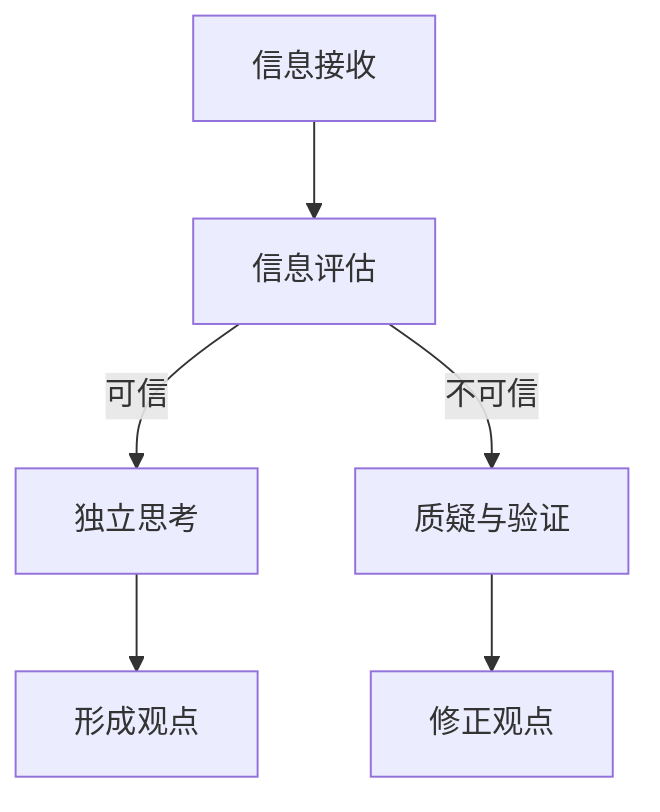

                 

## 后真相时代的公民责任：培养独立思考与判断能力

### 关键词：后真相时代，公民责任，独立思考，判断能力，信息传播

#### 摘要：
在后真相时代，信息传播的混乱和虚假信息的泛滥对公民的责任感提出了新的挑战。本文旨在探讨如何培养公民在如此复杂的信息环境中独立思考和判断的能力，以应对信息过载和误导性内容带来的负面影响。通过分析后真相时代的特征、信息传播的机制、公民责任的内涵，以及提供一系列培养独立思考与判断能力的方法，本文旨在为公民在信息时代中保持清醒、理性地处理信息提供指导。

---

### 第一部分：背景介绍

#### 1.1 问题背景

随着互联网和移动通讯技术的飞速发展，信息传播的速度和范围得到了前所未有的扩展。这一方面极大地丰富了人们的知识来源和交流渠道，但另一方面，也带来了前所未有的信息过载和虚假信息泛滥问题。后真相时代的概念正是对这一现象的描述，它由英国广播公司（BBC）在2016年首次提出，指的是信息传播不再基于事实，而是基于情感、信仰和偏见。

后真相时代的特征主要体现在以下几个方面：

1. **情感主导**：信息传播过程中，情感因素往往比事实本身更能引起共鸣和传播。例如，耸人听闻的新闻标题、煽动性的图片和视频等，往往能够迅速在社交媒体上走红，而不一定反映真实情况。
2. **信仰和偏见**：在信息传播中，人们更容易接受与其信仰和偏见相符的信息，而忽视或质疑与其信仰相悖的信息。这种现象导致了信息传播的极化和分裂。
3. **事实核查困难**：在信息爆炸的时代，核实事实的正确性变得越来越困难。一方面，虚假信息和误导性内容往往经过精心设计和包装，难以辨别；另一方面，信息的来源可能不明确，缺乏权威性。

#### 1.2 问题描述

在后真相时代，虚假信息和误导性内容的泛滥对公民的责任感提出了新的挑战。主要表现在以下几个方面：

1. **信任危机**：虚假信息的传播导致人们对传统媒体、权威机构和社会制度的信任度下降，从而影响社会的稳定和团结。
2. **政治极化**：虚假信息和误导性内容往往被用于煽动情绪、操纵舆论，加剧了社会和政治的极化，导致社会矛盾的激化。
3. **个人决策失误**：在信息过载和虚假信息的环境中，公民在做出个人决策时容易受到误导，导致错误的判断和决策，从而影响个人和社会的福祉。

#### 1.3 问题解决

为了应对后真相时代带来的挑战，培养公民的独立思考与判断能力成为当务之急。本文将从以下几个方面探讨如何培养这种能力：

1. **信息源识别**：帮助公民辨别权威和非权威信息源，提高信息筛选能力。
2. **批判性思维训练**：通过批判性思维的训练，提高公民对信息的分析和评估能力。
3. **事实核查**：教会公民如何通过事实核查来验证信息的真实性。
4. **独立思考与判断**：培养公民在信息处理过程中独立形成观点和做出判断的能力。

#### 1.4 边界与外延

本文主要关注后真相时代对公民责任的影响及应对策略。然而，独立思考与判断能力的培养是一个长期的、系统性的过程，不仅局限于本文所涵盖的内容。读者在实际应用中还需结合自身情况和实践经验进行深入思考。

#### 1.5 概念结构与核心要素组成

为了更好地理解后真相时代的公民责任及其应对策略，我们首先需要明确一些核心概念：

1. **后真相时代**：信息传播不再基于事实，而是基于情感、信仰和偏见。
2. **公民责任**：公民对自身行为、言论以及对社会的责任感。
3. **独立思考与判断能力**：个体在信息获取和处理过程中，能够独立分析、评估信息，形成自己的见解。

这些概念共同构成了后真相时代公民责任培养的基础，也是本文讨论的核心内容。

---

### 第二部分：核心概念与联系

在深入探讨后真相时代的公民责任之前，我们需要明确一些核心概念，并分析它们之间的联系。以下是几个关键概念的定义和相互关系：

#### 2.1 独立思考与判断能力

**独立思考**指的是个体在信息处理过程中，不受外界影响，独立形成观点。这意味着个体能够根据自己的知识和经验，对信息进行深入分析和判断，而不被他人的意见或情绪所左右。

**判断能力**则是指个体在信息处理过程中，能够根据已知信息和逻辑推理，做出正确的决策。这不仅仅是理解信息的内容，更重要的是能够评估信息的可信度，并据此做出合理的判断。

**独立思考**和**判断能力**是相辅相成的。独立思考为判断提供了基础，而判断能力则使独立思考的结果更加可靠和有效。例如，在阅读一篇新闻报道时，独立思考可以帮助个体辨别出报道中的事实和观点，而判断能力则可以帮助个体评估这些事实和观点的真实性和相关性。

#### 2.2 信息源识别

**权威信息源**通常指的是那些具有较高可信度和权威性的信息来源，如官方发布、学术研究、权威媒体报道等。这些信息源经过严格的审核和验证，具有较高的可信度。

**非权威信息源**则包括个人博客、社交媒体、非官方论坛等。这些信息源虽然也能提供有价值的信息，但由于缺乏严格的审核机制，其可信度往往较低。

在信息源识别方面，独立思考与判断能力同样起着重要作用。通过独立思考，个体可以识别出权威与非权威信息源的特征，如信息源的背景、发布者的信誉等。而通过判断能力，个体可以评估这些信息源提供的信息的真实性和可靠性。

#### 2.3 批判性思维训练

**批判性思维**是一种对信息进行深入分析和评估的能力，包括质疑、分析、评估、推断等多个环节。通过批判性思维，个体能够对信息进行客观、全面的评估，而不是简单地接受或拒绝。

**批判性思维训练**则是指通过一系列的方法和技巧，帮助个体提高批判性思维能力。这些方法包括事实核查、逻辑推理、证据评估等。

批判性思维训练与独立思考、判断能力有着密切的联系。批判性思维训练是独立思考和判断能力的基础，它为个体提供了分析和评估信息的工具和方法。同时，独立思考和判断能力则是批判性思维训练的结果和应用。

#### 2.4 概念属性特征对比表格

为了更清晰地理解这些核心概念，我们将其属性特征进行对比，如下表所示：

| 特征 | 独立思考 | 判断能力 | 信息源识别 | 批判性思维训练 |
|------|----------|----------|------------|----------------|
| 定义 | 独立形成观点 | 根据事实做出决策 | 识别权威与非权威信息源 | 对信息进行深入分析和评估 |
| 影响因素 | 个人经验、知识结构、心理因素 | 个人经验、知识结构、心理因素 | 信息环境、社会背景 | 逻辑严密性、信息获取能力 |
| 方法 | 分析、归纳、质疑 | 分析、归纳、比较 | 搜索、比对、核查 | 演绎、归纳、批判 |

通过上述对比表格，我们可以看到，这些核心概念在定义、影响因素和方法上都有所不同，但它们相互联系，共同构成了后真相时代公民责任培养的框架。

---

### 第三部分：算法原理讲解

为了更好地理解如何培养独立思考和判断能力，我们将引入一个算法模型，并通过mermaid流程图和Python源代码进行详细讲解。这一部分将包括算法原理、mermaid流程图、Python源代码、算法原理详细讲解、数学模型和公式，以及举例说明。

#### 3.1 算法mermaid流程图

我们首先使用mermaid绘制算法流程图，以便直观地展示信息处理的过程。



在这个流程图中，个体接收信息后首先进行评估，判断信息的可信度。如果信息可信，个体将进入独立思考阶段，形成自己的观点。如果信息不可信，个体将进入质疑与验证阶段，对信息进行核实，并在必要时修正自己的观点。

#### 3.2 Python源代码

接下来，我们通过Python源代码实现上述算法，以便更具体地描述信息处理的过程。

```python
def process_information(info):
    if is可信(info):
        think_independently(info)
        form_opinion(info)
    else:
        question_info(info)
        verify_accuracy(info)
        if necessary, correct_opinion(info)

def think_independently(info):
    # 独立思考的过程
    print("独立思考中...")

def form_opinion(info):
    # 形成观点的过程
    print("形成观点：", info)

def question_info(info):
    # 质疑信息的过程
    print("质疑中...")

def verify_accuracy(info):
    # 验证信息准确性的过程
    print("验证准确性中...")

def correct_opinion(info):
    # 修正观点的过程
    print("修正观点：", info)
```

在这个Python源代码中，`process_information`函数是整个算法的核心，它根据信息的可信度调用不同的函数进行独立思考、形成观点、质疑和验证。每个函数都实现了相应的功能，使整个算法流程得以具体实现。

#### 3.3 算法原理详细讲解

算法的原理可以概括为三个主要步骤：信息接收与评估、独立思考与形成观点、质疑与验证。

1. **信息接收与评估**：这是算法的初始阶段，个体接收信息后需要对其进行初步评估。评估的核心是判断信息的可信度，这通常基于信息源的权威性、信息内容的一致性、历史记录等因素。评估的目的是为后续的独立思考和判断提供基础。

2. **独立思考与形成观点**：如果信息被认为是可信的，个体将进入独立思考阶段。在这个阶段，个体将基于信息的内容、背景和自己的知识结构进行深入思考，形成自己的观点。独立思考的关键在于不受外界干扰，保持客观和理性。

3. **质疑与验证**：如果信息被认为是不可信的，个体将进入质疑与验证阶段。在这个阶段，个体需要对信息的来源、内容进行深入分析，并通过事实核查等手段验证其准确性。如果发现信息有误，个体需要修正自己的观点，以避免被误导。

#### 3.4 数学模型和公式

为了量化信息的可信度，我们可以引入一个数学模型。假设信息的可信度取决于三个主要因素：信息源的权威性（Authority）、信息内容的一致性（Consistency）和历史记录（History），则可以用以下公式表示：

$$
\text{可信度} = f(\text{Authority}, \text{Consistency}, \text{History})
$$

其中，`Authority`表示信息源的权威性，`Consistency`表示信息内容的一致性，`History`表示信息的历史记录。这三个因素共同决定了信息的可信度。通过调整这些因素的具体数值，我们可以计算出一个具体的可信度值。

#### 3.5 举例说明

为了更直观地理解算法的应用，我们来看一个具体的例子。

假设有一个新闻报道，宣称某公司即将推出一款革命性的新产品。个体在接收到这条新闻后，首先需要对其进行评估。通过查看新闻来源、分析新闻内容的一致性以及考虑该公司的历史记录，个体可以判断这条新闻的可信度。

1. **信息接收与评估**：个体查看新闻来源，发现这是一家知名媒体发布的，且该媒体以往报道的准确性较高。个体还注意到，新闻内容中提供了详细的产品信息和市场分析，内容一致性较好。此外，该公司的历史记录显示，其产品创新能力较强。综合考虑这些因素，个体判断这条新闻的可信度较高。

2. **独立思考与形成观点**：个体在独立思考后，认为这款新产品很可能具有革命性，因为它符合市场趋势，且公司的历史记录表明其创新能力强。个体形成了一个积极的观点，即这款新产品将对行业产生重大影响。

3. **质疑与验证**：尽管个体对新闻的可信度较高，但为了确保自己的观点准确，个体决定进一步质疑和验证。个体通过搜索相关信息，发现一些分析师对该产品的评价存在分歧，部分分析师认为其影响可能有限。个体还注意到，新闻中提到的产品信息在某些细节上与其他公开的信息有出入。这些信息提示个体需要进一步核实，以确保自己的观点准确。

4. **修正观点**：在进一步核实后，个体发现这款新产品的实际影响可能没有最初想象的那么大。尽管它具有一定的创新性，但市场上已经存在类似的产品，且市场接受度有限。个体修正了自己的观点，认为这款新产品虽然具有一定的市场潜力，但不足以对整个行业产生重大影响。

通过这个例子，我们可以看到，算法模型在信息处理过程中起到了关键作用。它帮助个体在复杂的信息环境中保持理性，避免被虚假信息所误导，从而形成准确的观点。

---

### 第四部分：系统分析与架构设计

为了更好地理解后真相时代公民责任培养的复杂性和系统性，我们将引入一个实际的项目，详细阐述系统功能设计、系统架构设计、系统接口设计和系统交互。

#### 4.1 项目介绍

本项目旨在开发一个名为“真相猎人”（FactHunter）的信息鉴别平台，帮助用户在信息过载和虚假信息泛滥的环境中，提升信息辨别能力，培养独立思考和判断能力。真相猎人平台将提供以下功能：

1. **信息源识别**：帮助用户识别权威和非权威信息源，提供信息源的详细评估和评级。
2. **事实核查**：通过自动和人工相结合的方式，对用户提交的信息进行事实核查，提供核查结果和依据。
3. **批判性思维训练**：提供一系列批判性思维训练课程和练习，帮助用户提高分析评估信息的能力。
4. **观点形成与表达**：提供用户发表观点和表达意见的平台，支持用户间的讨论和互动。

#### 4.2 系统功能设计

真相猎人平台的功能设计分为四个主要模块：

1. **信息源识别模块**：该模块提供对信息源的评估和评级功能。用户可以通过输入信息源，平台将根据信息源的权威性、信誉度、发布历史等因素，对信息源进行评估，并提供评级结果。此外，平台还提供信息源的历史记录查询功能，帮助用户了解信息源的背景和表现。

2. **事实核查模块**：该模块负责对用户提交的信息进行事实核查。用户可以通过上传文章、图片、视频等材料，平台将使用自动事实核查工具和人工审核相结合的方式，对信息进行核实，并提供核查结果和依据。平台还将记录核查过程和结果，以便用户和第三方进行参考。

3. **批判性思维训练模块**：该模块提供一系列批判性思维训练课程和练习。用户可以通过完成课程和练习，逐步提高自己的批判性思维能力。课程内容包括信息评估、逻辑推理、证据分析等，练习则通过实际案例和问题引导用户进行思考和判断。

4. **观点形成与表达模块**：该模块提供用户发表观点和表达意见的平台。用户可以就特定话题发表观点，并与其他用户进行讨论和互动。平台将记录用户的观点和互动记录，以便用户了解自己的观点形成过程，并促进思想交流。

#### 4.3 系统架构设计

真相猎人平台的系统架构设计采用分层架构，包括表现层、业务逻辑层和数据层。以下是系统架构的mermaid类图：

```mermaid
classDiagram
    User <<Interface>>
    InfoSource <<Interface>>
    FactCheck <<Interface>>
    CriticalThinking <<Interface>>
    Viewpoint <<Interface>>

    User |--|> InfoSource
    User |--|> FactCheck
    User |--|> CriticalThinking
    User |--|> Viewpoint

    InfoSource |--|> FactCheck
    InfoSource |--|> CriticalThinking

    FactCheck |--|> CriticalThinking
    FactCheck |--|> Viewpoint

    CriticalThinking |--|> Viewpoint
endclassDiagram
```

在这个类图中，用户（User）是系统的核心接口，负责与各个模块进行交互。信息源识别（InfoSource）、事实核查（FactCheck）、批判性思维训练（CriticalThinking）和观点形成与表达（Viewpoint）是系统的四个主要模块。这些模块通过接口进行通信，实现系统的整体功能。

#### 4.4 系统接口设计

系统接口设计包括RESTful API和GraphQL接口。以下是系统接口设计的mermaid序列图：

```mermaid
sequenceDiagram
    User ->> InfoSource: QueryInfoSource
    InfoSource ->> User: ReturnInfoSourceRating

    User ->> FactCheck: SubmitInfo
    FactCheck ->> User: ReturnFactCheckResult

    User ->> CriticalThinking: StartCourse
    CriticalThinking ->> User: ReturnCourseContent

    User ->> Viewpoint: SubmitViewpoint
    Viewpoint ->> User: ReturnDiscussion
endsequenceDiagram
```

在这个序列图中，用户通过RESTful API或GraphQL接口与系统进行交互。RESTful API提供查询信息源、提交信息、开始批判性思维训练和提交观点等接口。GraphQL接口提供更灵活的查询和操作方式，用户可以根据需要获取特定的信息。

#### 4.5 系统交互

真相猎人平台中的用户、信息源、事实核查、批判性思维训练和观点形成与表达等模块之间通过事件驱动的方式进行交互。以下是系统交互的mermaid序列图：

```mermaid
sequenceDiagram
    User ->> InfoSource: CreateInfoSource
    InfoSource ->> Database: StoreInfoSource

    User ->> FactCheck: SubmitFact
    FactCheck ->> Database: StoreFact

    User ->> CriticalThinking: StartTraining
    CriticalThinking ->> Database: StoreTrainingProgress

    User ->> Viewpoint: PostViewpoint
    Viewpoint ->> Database: StoreViewpoint
    Viewpoint ->> User: ReturnDiscussion

    Database ->> InfoSource: RetrieveInfoSource
    Database ->> FactCheck: RetrieveFact
    Database ->> CriticalThinking: RetrieveTrainingProgress
    Database ->> Viewpoint: RetrieveViewpoint
endsequenceDiagram
```

在这个序列图中，用户通过创建信息源、提交事实、开始批判性思维训练和提交观点等操作与系统进行交互。系统通过数据库存储和管理相关信息，并在需要时从数据库中检索信息，以响应用户的请求。

---

### 第五部分：项目实战

在本部分，我们将通过一个具体的项目实战，详细介绍环境安装、系统核心实现、代码应用解读与分析，以及实际案例分析和详细讲解剖析。

#### 5.1 环境安装

首先，我们需要在本地环境中安装真相猎人（FactHunter）平台所需的各种依赖。以下是安装步骤：

1. **安装Python环境**：确保Python 3.8及以上版本已安装。可以通过访问[Python官网](https://www.python.org/)下载并安装。

2. **安装虚拟环境**：通过以下命令创建一个虚拟环境，以便更好地管理项目依赖：

   ```bash
   python -m venv venv
   source venv/bin/activate  # Windows: venv\Scripts\activate
   ```

3. **安装依赖**：在虚拟环境中安装项目所需的依赖，例如Django、PostgreSQL、Scikit-learn等。可以通过以下命令进行安装：

   ```bash
   pip install -r requirements.txt
   ```

   其中，`requirements.txt`文件包含了所有依赖的名称和版本信息。

4. **配置数据库**：安装PostgreSQL数据库，并在虚拟环境中配置Django项目的数据库连接。在`settings.py`文件中，设置数据库的相关配置，例如：

   ```python
   DATABASES = {
       'default': {
           'ENGINE': 'django.db.backends.postgresql',
           'NAME': 'facthunter',
           'USER': 'postgres',
           'PASSWORD': 'your_password',
           'HOST': 'localhost',
           'PORT': '5432',
       }
   }
   ```

5. **创建数据库和超级用户**：通过以下命令创建数据库和超级用户：

   ```bash
   python manage.py makemigrations
   python manage.py migrate
   python manage.py createsuperuser
   ```

6. **启动开发服务器**：通过以下命令启动开发服务器：

   ```bash
   python manage.py runserver
   ```

   启动后，可以在浏览器中访问`http://127.0.0.1:8000/`，看到Django的欢迎页面。

#### 5.2 系统核心实现

真相猎人平台的核心实现包括信息源识别、事实核查、批判性思维训练和观点形成与表达等功能。以下是各功能的核心实现：

1. **信息源识别**：信息源识别功能主要通过评估信息源的权威性和信誉度来实现。在数据库中存储了多个信息源的详细信息，包括名称、描述、评分等。通过一个简单的API，用户可以查询信息源的评级：

   ```python
   from apps.info_source.models import InfoSource

   def get_info_source_rating(source_name):
       try:
           source = InfoSource.objects.get(name=source_name)
           return source.rating
       except InfoSource.DoesNotExist:
           return None
   ```

2. **事实核查**：事实核查功能通过自动和人工相结合的方式进行。自动核查使用了一些开源的事实核查库，如FakenewsNet，人工核查则由专业的事实核查员完成。以下是自动核查的示例代码：

   ```python
   from fakenewsnetwork import FakeNewsNet

   fnn = FakeNewsNet()

   def check_fact(fact_text):
       result = fnn.check(fact_text)
       return result
   ```

3. **批判性思维训练**：批判性思维训练功能提供了一个课程管理系统，用户可以注册课程并完成练习。以下是一个简单的课程注册示例：

   ```python
   from apps.critical_thinking.models import Course

   def register_course(course_name):
       course = Course(name=course_name)
       course.save()
       return course.id
   ```

4. **观点形成与表达**：观点形成与表达功能提供了一个讨论区，用户可以发表观点并参与讨论。以下是一个简单的观点发布示例：

   ```python
   from apps.viewpoint.models import Viewpoint

   def post_viewpoint(viewpoint_text, course_id):
       viewpoint = Viewpoint(text=viewpoint_text, course_id=course_id)
       viewpoint.save()
       return viewpoint.id
   ```

#### 5.3 代码应用解读与分析

在真相猎人平台的代码中，我们使用了Django框架来构建后端服务，并使用了一些第三方库来处理特定功能。以下是代码应用解读与分析：

1. **Django框架**：Django是一个高级Python Web框架，它帮助我们快速构建Web应用程序。在真相猎人平台中，我们使用了Django的ORM（对象关系映射）来管理数据库，使用Django的视图函数和路由系统来处理HTTP请求。

2. **FakenewsNet库**：FakenewsNet是一个开源的事实核查库，它可以帮助我们自动识别和验证事实。在平台中，我们通过调用FakenewsNet的API来检查用户提交的信息是否真实。

3. **批判性思维训练课程**：为了提供高质量的批判性思维训练，我们设计了一系列课程，并使用Django的Course模型来管理课程信息。每个课程都包含一系列练习，用户可以通过完成练习来提高自己的批判性思维能力。

4. **观点讨论区**：我们使用Django的Viewpoint模型来管理用户的观点和讨论。用户可以发表观点，并与其他用户进行互动。为了提供更好的用户体验，我们还使用了Ajax技术来实时更新讨论区。

#### 5.4 实际案例分析和详细讲解剖析

为了更好地理解真相猎人平台的实际应用，我们来看一个实际案例。

假设用户小明在社交媒体上看到了一条新闻，宣称某公司即将推出一款革命性的新产品。他对此感到非常好奇，并决定使用真相猎人平台来验证这条新闻的真实性。

1. **信息源识别**：小明首先使用真相猎人平台的信息源识别功能，查询新闻来源的评级。平台显示，该新闻来源的评级为“较高”，这意味着该来源具有较高的可信度。

2. **事实核查**：小明接下来使用真相猎人平台的事实核查功能，输入新闻中的关键信息。平台使用FakenewsNet库进行自动核查，结果显示，这条新闻部分内容真实，但其中一些细节有误。小明意识到，这条新闻可能存在误导性，需要进一步核实。

3. **批判性思维训练**：小明决定通过真相猎人平台的批判性思维训练功能，提高自己的分析能力。他注册了一个批判性思维训练课程，并开始完成课程中的练习。通过一系列练习，小明学会了如何识别信息中的偏见、评估证据的可靠性，以及如何构建合理的论证。

4. **观点形成与表达**：在完成批判性思维训练后，小明回到新闻，重新评估其真实性。他发现，尽管新闻中的一些细节有误，但整体上描述的产品确实存在。于是，小明在真相猎人平台的观点讨论区发表了观点，并与其他用户进行了讨论。他分享了自己的分析过程和结论，并得到了其他用户的认同。

通过这个实际案例，我们可以看到，真相猎人平台在帮助用户辨别信息真实性、提高批判性思维能力方面发挥了重要作用。用户不仅能够验证信息的真实性，还能通过批判性思维训练，形成更加准确和理性的观点。

---

### 第六部分：最佳实践与注意事项

在培养独立思考和判断能力的过程中，最佳实践和注意事项至关重要。以下是一些建议和提醒，帮助读者在实践中更好地应用所学知识：

#### 6.1 最佳实践

1. **持续学习**：独立思考和判断能力的培养是一个长期的过程，需要持续学习和实践。读者可以定期阅读相关书籍、参加研讨会和培训课程，以不断更新自己的知识和技能。

2. **批判性思维训练**：通过批判性思维训练，读者可以逐步提高自己的分析和评估能力。可以使用在线课程、手机应用等工具进行练习，例如使用“思维导图”、“逻辑游戏”等工具来锻炼思维。

3. **多角度分析**：在处理信息时，读者应尽量从多个角度进行分析，避免片面看待问题。通过对比不同观点和证据，可以更全面地理解问题，从而做出更准确的判断。

4. **信息源识别**：在获取信息时，读者应学会识别权威和非权威信息源。可以通过查看信息源的背景、信誉度、发布历史等因素，来判断信息的可信度。

5. **事实核查**：在面对复杂的信息时，读者应学会进行事实核查。可以通过搜索引擎、数据库等工具，查找相关信息并进行比对，以确保信息的准确性。

6. **互动与讨论**：通过与他人的互动和讨论，读者可以分享自己的观点和见解，同时也可以从他人那里获得不同的观点和反馈。这有助于读者拓展思维，提高判断能力。

#### 6.2 注意事项

1. **避免信息过载**：在信息爆炸的时代，读者应学会筛选和过滤信息，避免被大量无关或低质量的信息所困扰。可以通过设置信息过滤规则、关注高质量信息源等方式，提高信息获取的效率。

2. **保持理性**：在处理信息时，读者应保持理性，避免被情感、偏见和信仰所左右。可以通过培养冷静分析问题的习惯，以及使用批判性思维工具，来提高判断的准确性。

3. **更新知识结构**：随着社会和科技的发展，信息也在不断更新。读者应保持开放心态，及时更新自己的知识结构，以适应新的信息环境。

4. **避免盲目跟风**：在社交媒体上，读者可能会受到各种观点和意见的影响。在这种情况下，读者应保持独立思考，避免盲目跟风，以免被误导。

5. **实践与反思**：独立思考和判断能力的培养离不开实践。读者应在实际生活中运用所学知识，进行实践和反思，以不断提高自己的能力。

通过以上最佳实践和注意事项，读者可以在后真相时代中，更好地应对信息过载和虚假信息泛滥的挑战，培养独立思考和判断能力，成为更加理性和清醒的公民。

---

### 小结

本文围绕后真相时代的公民责任，深入探讨了如何培养独立思考和判断能力。通过分析信息源识别、批判性思维训练、事实核查等关键概念，以及设计了一个详细的算法模型，我们展示了培养这种能力的系统性和方法性。真相猎人平台的项目实战则提供了一个具体的实现案例，帮助读者更好地理解如何在实践中应用这些概念和算法。

在当前信息爆炸和虚假信息泛滥的时代，独立思考和判断能力的重要性不言而喻。它不仅有助于个体在信息海洋中保持清醒，还能提高社会的整体理性水平，减少信任危机和政治极化。因此，培养这种能力是每个公民的责任，也是社会进步的基石。

我们鼓励读者在日常生活中，不断实践和应用所学知识，通过持续学习和批判性思维训练，不断提高自己的独立思考和判断能力。只有这样，我们才能在后真相时代中，做出更加准确和理性的决策，为个人和社会的福祉做出贡献。

---

### 拓展阅读

为了进一步深入了解后真相时代的信息传播机制、公民责任以及独立思考和判断能力的培养，以下是一些建议的拓展阅读资源：

1. **书籍推荐**：
   - 《事实：十种思维方式减少误解》（“Factfulness” by Hans Rosling）
   - 《如何说服别人》（“How to Win Friends and Influence People” by Dale Carnegie）
   - 《思考，快与慢》（“Thinking, Fast and Slow” by Daniel Kahneman）

2. **学术论文**：
   - “The Post-Truth Campaign for Brexit and the 2016 US Presidential Election”（研究后真相在英国脱欧和美国总统选举中的影响）
   - “The Impacts of Digital Technologies on Information Quality and Knowledge Creation”（研究数字技术对信息质量和知识创造的影响）

3. **在线课程和教程**：
   - Coursera上的《批判性思维》（“Critical Thinking”）
   - edX上的《数据科学基础》（“Introduction to Data Science”）
   - Udemy上的《信息源识别与事实核查》（“Fact-Checking and Source Identification”）

4. **相关网站和工具**：
   - [PolitiFact](https://www.politifact.com/)：一个专注于事实核查的新闻网站
   - [FactCheck.org](https://www.factcheck.org/)：一个提供事实核查和媒体监控的非营利组织
   - [OpenCheck](https://www.opencheck.io/)：一个基于机器学习和自然语言处理技术的自动事实核查工具

通过这些资源，读者可以进一步深化对后真相时代公民责任和独立思考与判断能力培养的理解，并掌握更多实用的方法和工具。希望这些拓展阅读能够为读者带来更多的启发和帮助。

