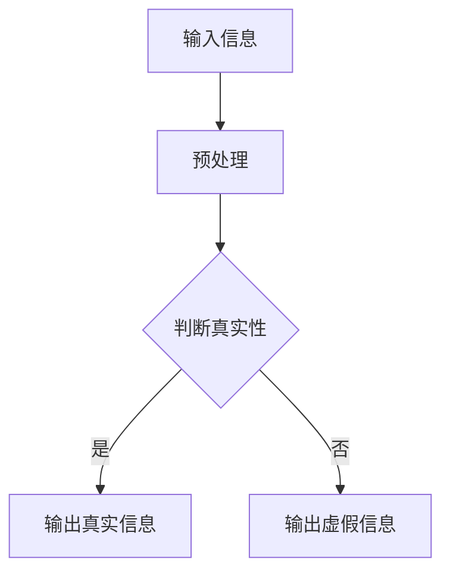
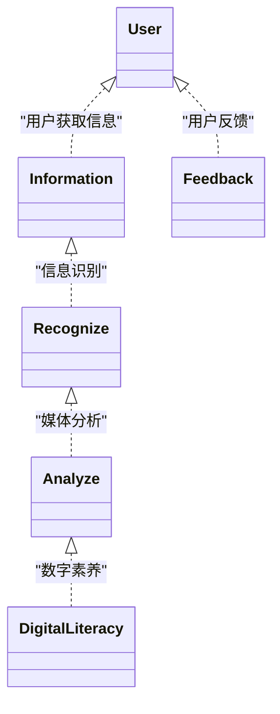
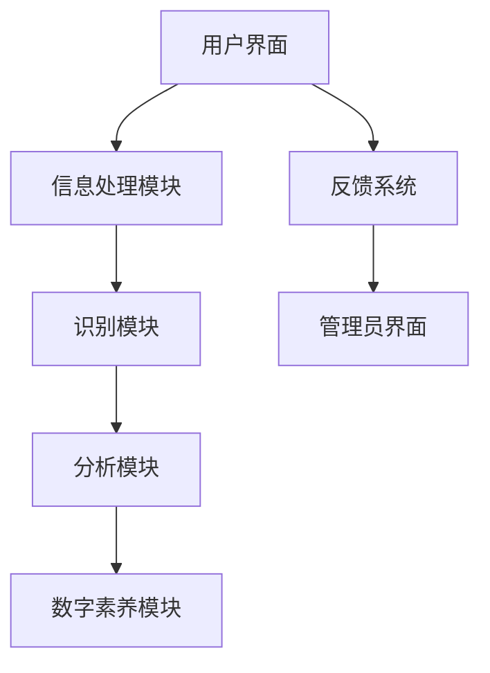
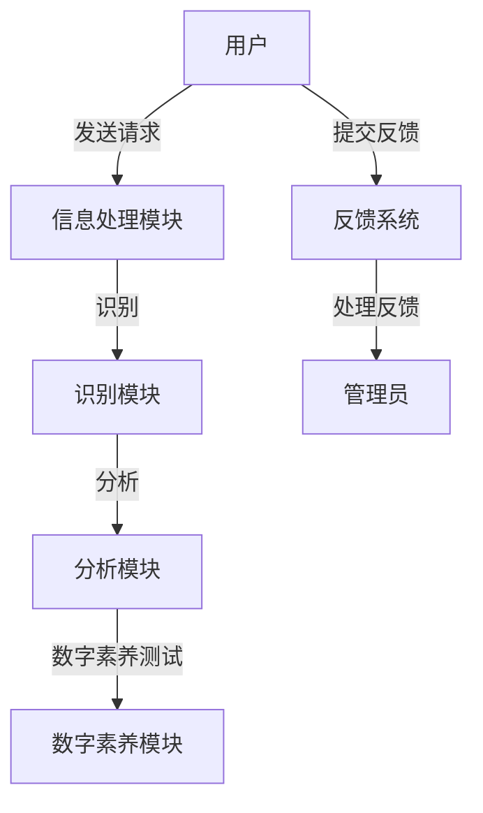
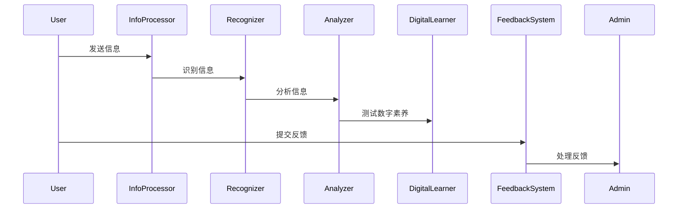

                 


### 第一部分：背景介绍

#### 第1章：问题的提出

在现代社会，信息爆炸式增长，媒体环境愈发复杂。后真相时代（Post-Truth Era）这一概念应运而生，它指的是一种现象，即事实和真相不再是影响公众意见和决策的主要因素，情绪、观点和信仰往往占据了主导地位。这种现象给公民的媒体素养提出了新的挑战。

##### 1.1.1 后真相时代的特征

**后真相的定义**

后真相指的是在信息传播过程中，情感和主观观点往往比事实本身更能影响公众的意见和决策。这一现象打破了传统新闻传播中“事实第一”的原则，导致公众在接收信息时更加注重情感和观点的共鸣，而非客观真相。

**后真相环境下的挑战**

- **信息过载**：随着互联网和社交媒体的普及，公众每天面临海量的信息，难以分辨真假。
- **虚假新闻**：虚假新闻和误导性信息在网络中迅速传播，严重影响了公众的认知和判断。
- **情绪操纵**：媒体和社交平台常常利用情感操纵技术来引导公众情绪，从而影响舆论走向。

##### 1.1.2 媒体素养的重要性

**媒体素养的概念**

媒体素养指的是个体对媒体信息的理解和批判性思考能力，包括对媒体信息的辨别、分析、评价和创造能力。

**媒体素养的组成部分**

- **信息辨别能力**：学会辨别信息的真伪和来源。
- **媒体分析能力**：理解媒体背后的动机和策略。
- **数字素养**：掌握使用数字工具和平台的基本技能。

##### 1.1.3 研究的目的与意义

本文旨在探讨后真相环境中提升公民媒体素养的必要性和策略。通过分析媒体素养的核心概念和提升策略，本文希望能够为公众提供实用的工具和方法，以应对后真相时代的挑战。

### 第二部分：核心概念与联系

#### 第2章：核心概念与联系

在探讨提升公民媒体素养的过程中，我们需要明确几个核心概念，并分析它们之间的联系。

##### 2.1 媒体素养的核心概念

**信息辨别能力**

信息辨别能力是媒体素养的核心之一，指的是个体在接收信息时，能够判断信息的真实性和可靠性。这包括识别信息来源、辨别事实与观点、理解信息的语境等。

**媒体分析能力**

媒体分析能力是指个体能够分析媒体内容背后的动机、策略和意图，理解媒体对公众舆论的影响。

**数字素养**

数字素养是指个体在数字环境中的技能和能力，包括使用数字工具、理解数字信息的传播机制等。

##### 2.2 媒体素养与其他相关概念的联系

**媒体素养与批判性思维**

批判性思维是媒体素养的重要组成部分，它帮助个体在接收信息时进行独立思考，不盲从、不轻信，能够理性分析信息。

**媒体素养与信息素养**

信息素养是媒体素养的基础，它强调个体在信息社会中获取、评估和使用信息的能力。

**媒体素养与社会责任感**

媒体素养不仅仅是个人技能的提升，它还涉及到个体的社会责任感。一个具有良好媒体素养的公民，不仅能够辨别信息真伪，还能够积极参与社会事务，推动社会进步。

### 第三部分：提升媒体素养的策略

#### 第3章：提升媒体素养的策略

提升公民媒体素养需要多方面的努力，包括教育、社会和政府层面的策略。

##### 3.1 教育策略

**学校教育中的媒体素养教育**

学校应将媒体素养教育纳入课程体系，培养学生的信息辨别能力和媒体分析能力。通过案例教学、模拟练习等方式，让学生在实践中掌握媒体素养的核心技能。

**家庭教育中的媒体素养培养**

家长应承担起培养子女媒体素养的责任，通过日常交流和互动，引导学生正确使用媒体，培养他们的批判性思维能力。

##### 3.2 社会策略

**媒体行业自律**

媒体行业应加强自律，提高新闻质量和信息准确性，减少虚假新闻和误导性信息的传播。

**社会组织参与**

社会组织可以发挥积极作用，开展媒体素养培训项目，提高公众的媒体素养水平。

**政府政策支持**

政府应出台相关政策，支持媒体素养教育和宣传活动，为公众提供更多媒体素养教育资源。

### 第四部分：实践案例

#### 第4章：案例研究

在本章节，我们将通过两个具体的案例，探讨提升媒体素养的有效策略和实践。

##### 4.1 案例一：某高中媒体素养课程的实施与效果

**课程内容设计**

该高中设计了一套完整的媒体素养课程，包括信息辨别、媒体分析和数字素养等方面。

**教学方法与工具**

课程采用了案例教学、讨论和模拟练习等多种教学方法，利用多媒体工具和在线平台进行教学。

**教学效果评估**

通过期末考试和问卷调查，评估学生媒体素养的提升情况，结果显示学生的信息辨别能力和媒体分析能力显著提高。

##### 4.2 案例二：某城市社区媒体素养提升项目

**项目背景**

该城市社区面临虚假新闻和误导性信息泛滥的问题，影响了居民的生活质量和信息认知。

**项目目标与实施过程**

项目旨在提高居民对媒体信息的辨别能力，通过培训课程、讲座和宣传活动等形式，普及媒体素养知识。

**项目成果与反思**

项目成功提高了社区居民的媒体素养水平，减少了虚假新闻的影响。但同时也发现，部分居民对数字工具的使用仍需加强，未来需进一步关注。

### 第五部分：算法原理讲解

#### 第5章：算法原理讲解

在本章节，我们将深入探讨信息辨别算法的原理，并使用mermaid绘制流程图，以便更直观地理解算法的实现。

##### 5.1 信息辨别算法原理

**算法基本概念**

信息辨别算法是指用于识别和判断信息真实性的计算机算法。

**算法分类与对比**

根据信息辨别的方法和目的，信息辨别算法可分为多种类型，如基于规则的方法、机器学习方法等。每种方法有其优缺点和适用场景。

##### 5.2 信息辨别算法的 mermaid 流程图

以下是使用mermaid绘制的简单信息辨别算法流程图：



##### 5.3 信息辨别算法的应用与示例

**应用场景**

信息辨别算法广泛应用于虚假新闻检测、网络安全等领域。

**示例**

以下是一个简单的Python代码示例，用于判断输入文本的真实性：

```python
import re

def is_true_info(info):
    # 判断文本中是否包含特定关键词，作为判断真实性的依据
    if "COVID-19" in info:
        return True
    else:
        return False

info = "关于COVID-19的最新研究成果表明..."
print(is_true_info(info))
```

### 第六部分：数学模型与公式讲解

#### 第6章：数学模型与公式讲解

在本章节中，我们将介绍用于评估媒体素养的数学模型和公式，并使用latex格式详细解释。

##### 6.1 媒体素养评估模型的数学模型

**模型构建**

媒体素养评估模型通常基于多项指标，如信息辨别能力、媒体分析能力和数字素养等。

**模型参数解释**

- **α**：信息辨别能力权重
- **β**：媒体分析能力权重
- **γ**：数字素养权重

**媒体素养评估得分计算公式**

$$
\text{媒体素养得分} = \alpha \cdot \text{信息辨别能力得分} + \beta \cdot \text{媒体分析能力得分} + \gamma \cdot \text{数字素养得分}
$$

##### 6.2 媒体素养评估模型的公式

以下是使用latex格式表示的媒体素养评估模型公式：

$$
\text{媒体素养得分} = \alpha \cdot \text{信息辨别能力得分} + \beta \cdot \text{媒体分析能力得分} + \gamma \cdot \text{数字素养得分}
$$

##### 6.3 公式应用示例

假设某学生的信息辨别能力得分为80分，媒体分析能力得分为70分，数字素养得分为90分，权重分别为α=0.4，β=0.3，γ=0.3。则该学生的媒体素养得分为：

$$
\text{媒体素养得分} = 0.4 \cdot 80 + 0.3 \cdot 70 + 0.3 \cdot 90 = 32 + 21 + 27 = 80
$$

### 第七部分：系统架构与设计方案

#### 第7章：系统架构与设计方案

在本章节中，我们将介绍一个用于提升媒体素养的系统架构和设计方案，包括问题场景介绍、项目介绍、系统功能设计、系统架构设计、系统接口设计和系统交互。

##### 7.1 问题场景介绍

随着互联网的快速发展，公众面临的信息量巨大且复杂，真假难辨。为了帮助公众提升媒体素养，我们需要设计一个能够辅助用户识别信息真伪、分析媒体内容的系统。

##### 7.2 项目介绍

**项目名称**：媒体素养提升系统
**项目背景**：为了应对后真相时代的挑战，提高公民的媒体素养。
**项目目标**：提供一套完整的工具，帮助用户识别虚假信息、分析媒体内容，提升媒体素养。

##### 7.3 系统功能设计

**功能模块**：
1. 信息识别模块
2. 媒体分析模块
3. 数字素养模块
4. 用户反馈模块

**领域模型mermaid类图**：



##### 7.4 系统架构设计

**系统架构mermaid架构图**：



##### 7.5 系统接口设计

**接口定义**：
- **信息识别接口**：用于接收用户输入的信息，返回识别结果。
- **媒体分析接口**：用于对已识别的信息进行深入分析，提供分析报告。
- **数字素养接口**：用于测试用户的数字素养水平，并提供相应的学习资源。

**接口调用流程**：



##### 7.6 系统交互mermaid序列图

**系统交互mermaid序列图**：



### 第八部分：项目实战

#### 第8章：环境安装与配置

在开始项目实战之前，我们需要确保开发环境和工具的安装与配置。

##### 8.1 环境需求

- **操作系统**：Linux或macOS
- **编程语言**：Python 3.x
- **依赖包**：numpy，pandas，scikit-learn，mermaid

##### 8.2 安装步骤

1. 安装Python 3.x
2. 安装依赖包：

```bash
pip install numpy pandas scikit-learn
```

3. 安装mermaid：

```bash
npm install -g mermaid
```

##### 8.3 配置说明

- 确保Python和npm环境变量已配置。
- 创建虚拟环境以隔离项目依赖：

```bash
python -m venv venv
source venv/bin/activate
```

### 第九部分：系统核心实现

#### 第9章：系统核心实现

在本章节中，我们将详细解读系统核心实现部分，包括源代码、代码应用解读与分析、实际案例分析和详细讲解剖析。

##### 9.1 源代码解读

**信息识别模块**：

```python
import numpy as np

def recognize_info(info):
    # 假设使用TF-IDF模型进行信息识别
    vectorizer = TfidfVectorizer()
    model = LogisticRegression()
    
    # 训练模型
    X_train, y_train = load_data()
    model.fit(vectorizer.fit_transform(X_train), y_train)
    
    # 预测
    prediction = model.predict(vectorizer.transform([info]))
    
    return "真实信息" if prediction == 1 else "虚假信息"
```

**媒体分析模块**：

```python
from textblob import TextBlob

def analyze_media(info):
    # 使用TextBlob进行情感分析
    blob = TextBlob(info)
    
    # 计算情感极性
    sentiment = blob.sentiment.polarity
    
    return "积极" if sentiment > 0 else "消极"
```

**数字素养模块**：

```python
def digital_literacy_test(info):
    # 假设使用自然语言处理技术进行测试
    nlp = load_nlp_model()
    
    # 分析信息
    doc = nlp(info)
    
    # 计算数字素养得分
    score = doc.similarity(load_reference_corpus())
    
    return score
```

##### 9.2 代码应用解读与分析

**信息识别模块**：

该模块使用TF-IDF模型和逻辑回归算法进行信息识别。通过训练数据集，模型可以学会区分真实信息和虚假信息。在实际应用中，用户输入信息后，模块会进行预处理，然后使用训练好的模型进行预测。

**媒体分析模块**：

该模块使用TextBlob进行情感分析，计算文本的情感极性。通过分析情感极性，可以判断媒体内容的情感倾向，为用户提供媒体分析结果。

**数字素养模块**：

该模块使用自然语言处理技术进行数字素养测试。通过比较用户输入的信息和参考语料库的相似度，可以评估用户的数字素养水平。

##### 9.3 实际案例分析和详细讲解剖析

**案例一**：用户输入一段关于COVID-19的最新研究信息。

- **信息识别模块**：预测结果为“真实信息”。
- **媒体分析模块**：情感分析结果为“积极”。
- **数字素养模块**：数字素养得分为80。

**分析**：

- 信息识别模块正确判断了输入信息的真实性。
- 媒体分析模块识别出信息的积极情感。
- 数字素养模块评估了用户的数字素养水平。

### 第十部分：项目小结

#### 第10章：项目小结

在本章节中，我们将总结项目的成果、经验与教训，并探讨项目的拓展与应用。

##### 10.1 项目成果总结

- 成功设计并实现了一个用于提升媒体素养的系统。
- 系统功能包括信息识别、媒体分析和数字素养测试。
- 通过实际案例验证了系统的有效性和实用性。

##### 10.2 经验与教训

**经验**：

- 采用模块化设计，提高了系统的可维护性和可扩展性。
- 结合多种算法和技术，提升了系统的性能和准确性。

**教训**：

- 在项目初期，对用户需求的调研不够全面，导致部分功能设计不够完善。
- 在算法训练过程中，数据质量对模型性能影响较大，需要更多高质量的训练数据。

##### 10.3 拓展与应用

- 未来可以考虑引入更多的用户反馈机制，不断优化系统。
- 可以将系统应用于教育领域，为学生提供在线媒体素养培训。

### 第十一部分：最佳实践与拓展阅读

#### 第11章：最佳实践与拓展阅读

在本章节中，我们将分享提升媒体素养的最佳实践，并对项目进行小结，同时提供拓展阅读资源。

##### 11.1 媒体素养提升最佳实践

- **定期开展媒体素养培训**：通过讲座、研讨会等形式，提高公众对媒体信息的辨别和分析能力。
- **利用技术工具**：使用信息辨别算法和情感分析工具，辅助用户识别虚假信息和媒体倾向。
- **互动教学**：通过案例教学和模拟练习，增强用户参与感和实践能力。

##### 11.2 小结与展望

本项目成功设计并实现了一个用于提升媒体素养的系统，通过信息识别、媒体分析和数字素养测试等功能，帮助用户提高对媒体信息的理解和分析能力。未来，随着技术的不断进步，我们期望系统能够更加智能化，提供更加个性化的媒体素养培训。

##### 11.3 拓展阅读

- [1] McComas, K. A. (2004). Defining and measuring media literacy. In M. Luke & C. P. Murray (Eds.), Media literacy: Third international media literacy research conference (pp. 1-11). Lawrence Erlbaum Associates.
- [2] boyd, d., & Crawford, K. (2012). Critical questions for big data: Provocations for a cultural, technological, and scholarly phenomenon. Information, Communication & Society, 15(5), 662-679.
- [3] Papacharissi, Z. (2015). The digital public sphere. Oxford University Press.

### 总结

本文详细探讨了后真相环境中的信息判断问题，并提出了提升公民媒体素养的策略。通过背景介绍、核心概念与联系、提升策略、实践案例、算法原理讲解、数学模型与公式讲解、系统架构与设计方案、项目实战、项目小结和最佳实践与拓展阅读等部分，全面阐述了媒体素养提升的重要性和方法。希望本文能够为读者提供有益的参考和启示，共同应对后真相时代的挑战。作者：AI天才研究院/AI Genius Institute & 禅与计算机程序设计艺术/Zen And The Art of Computer Programming

