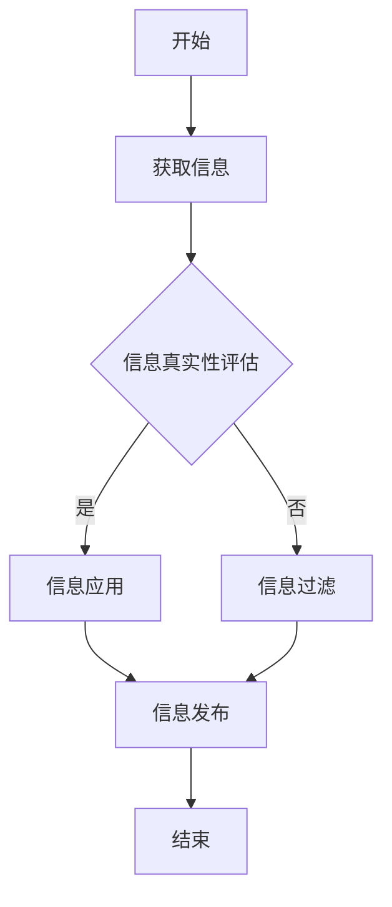
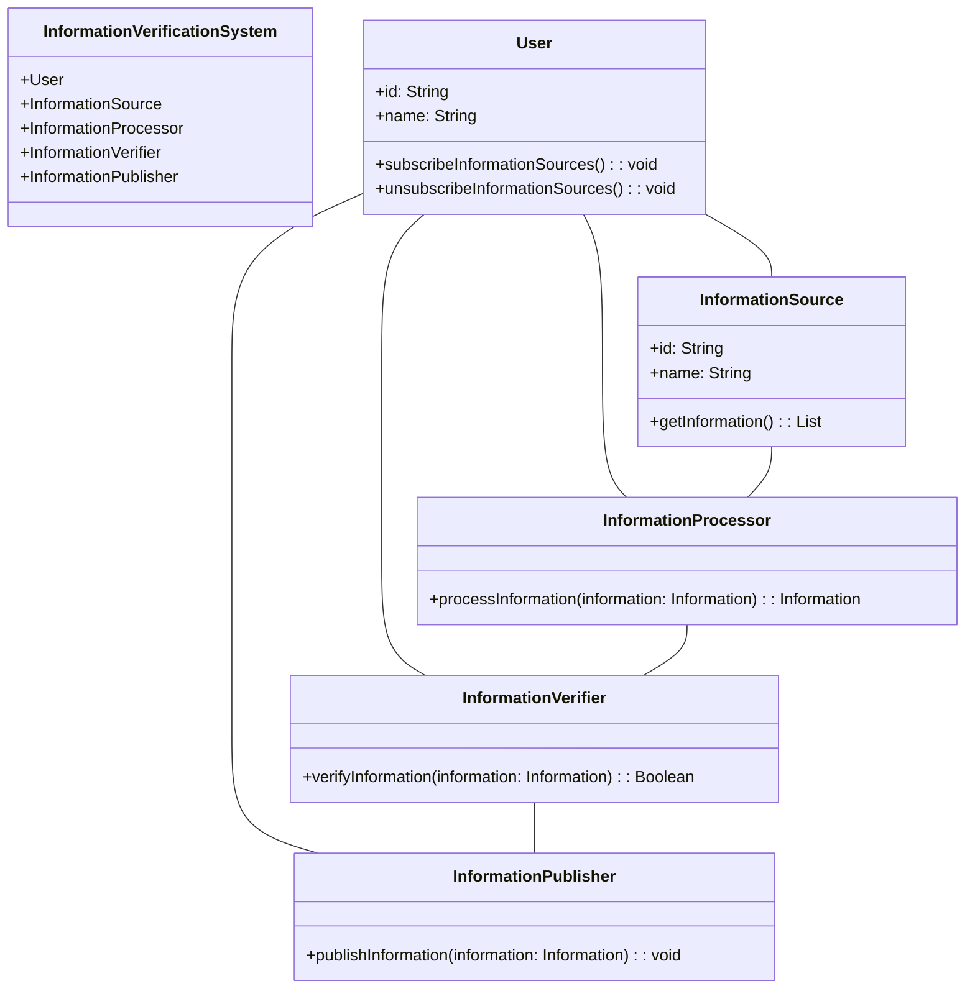
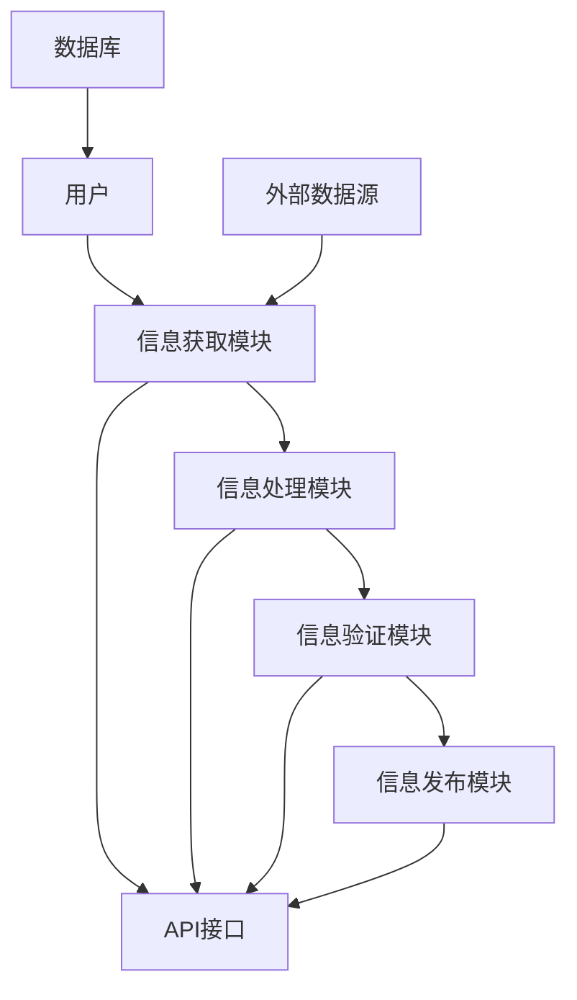
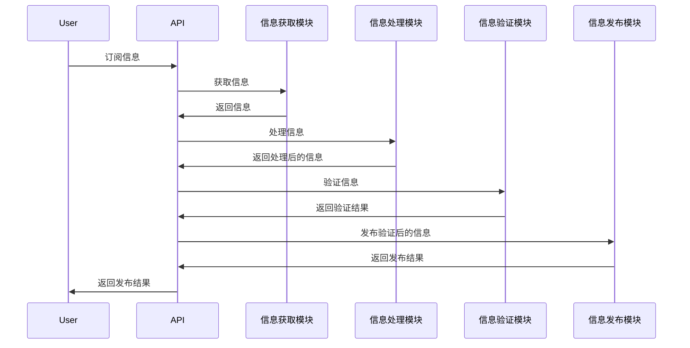

                 

### # 《后真相环境中的媒体素养：提升信息辨别能力》

#### 关键词：媒体素养、后真相时代、信息辨别、批判性思维、数字素养

> 在这个信息爆炸的时代，每个人都是信息的接收者和传播者。后真相时代的到来，使媒体内容更加多样化、复杂化，真假难辨。为了在这种环境中生存和发展，提升媒体素养、增强信息辨别能力变得尤为重要。本文将探讨媒体素养的概念、后真相环境中的媒体现象、提高信息辨别能力的方法与实践，以及媒体素养对个人和社会的重要性，旨在帮助读者在纷繁复杂的信息海洋中找到方向，提升自我素养。

----------------------------------------------------------------

## 前言

### 媒体环境的变化
### 信息过载与后真相时代的挑战
### 书籍的目的和结构

### 媒体环境的变化

在当今社会，媒体环境发生了翻天覆地的变化。传统的媒体形式，如报纸、电视和广播，已经逐渐被互联网和社交媒体所取代。这些新兴的媒体形式不仅提供了更加丰富和多样的内容，还使得信息传播的速度和范围得到了极大的提升。然而，这种变化也带来了一系列问题。

首先，信息过载成为一个普遍现象。在互联网和社交媒体的背景下，每个人都可以成为信息的发布者，导致信息量的急剧增加。这使得人们在获取和处理信息时面临巨大压力，难以区分哪些信息是真实可信的，哪些信息是虚假不实的。

其次，媒体环境的碎片化和去中心化，使得信息传播更加复杂。在传统媒体时代，信息传播主要依赖于中心化的渠道，如电视台、报纸和出版社。而在互联网和社交媒体时代，任何人都可以通过平台发布信息，信息的传播路径和方式变得多样化。这种去中心化的特点，使得信息传播的速度和范围得到了提升，但也带来了信息真实性和可靠性的问题。

最后，后真相时代的到来，进一步加剧了媒体环境的变化。后真相时代指的是信息传播中情感和情绪的影响力超过了事实和真相的影响力。在这种情况下，人们更容易被情绪化和煽动性的信息所影响，而忽视了事实的真相。这种现象对公众的认知和行为产生了深远的影响，使得提升媒体素养、增强信息辨别能力变得尤为重要。

### 信息过载与后真相时代的挑战

信息过载是后真相时代面临的重大挑战之一。随着互联网和社交媒体的普及，人们每天都要面对大量的信息，这些信息涵盖了各种领域，从新闻、娱乐到科学、技术等。然而，由于信息量的庞大和不断增长，人们很难在有限的时间内消化和吸收这些信息。这种信息过载现象不仅增加了人们的心理负担，还可能导致对信息的忽视和误解。

在后真相时代，信息真实性和可靠性的问题更加突出。由于信息传播的去中心化和信息来源的多样化，人们很难判断哪些信息是真实的，哪些信息是虚假的。在这种情况下，虚假信息、谣言和误导性信息的传播速度更快、范围更广，对公众的认知和行为产生了不良影响。例如，一些虚假的健康信息可能导致公众对科学的误解，甚至危及生命安全。

此外，后真相时代的情绪化和煽动性信息也对公众产生了深远影响。在社交媒体上，一些具有强烈情感色彩和煽动性的信息更容易引起公众的共鸣和传播。这些信息往往基于情绪和偏见，而非事实和逻辑。这导致了公众在接收和处理信息时更容易受到情绪和偏见的影响，从而削弱了理性思考和批判性思维的能力。

### 书籍的目的和结构

本书旨在探讨后真相环境中的媒体素养，帮助读者提升信息辨别能力，更好地应对信息过载和虚假信息带来的挑战。为了实现这一目标，本书将分为四个部分进行论述。

第一部分将介绍媒体素养的概念与重要性，包括媒体素养的定义、构成要素及其在社会中的重要性。这部分将为读者提供对媒体素养的基本了解，为后续内容打下基础。

第二部分将分析后真相环境中的媒体现象，包括后真相的定义、后真相环境中的媒体特征以及对公众的影响。这部分将帮助读者了解当前媒体环境的特点，以及这些特点对公众认知和行为的影响。

第三部分将探讨提高信息辨别能力的方法与实践，包括批判性思维与逻辑分析、数字素养与信息技能、社交媒体环境下的信息辨别等。这部分将提供具体的方法和策略，帮助读者在实际生活中应对信息辨别挑战。

第四部分将讨论媒体素养与未来社会的关系，包括媒体素养与民主社会、媒体素养与个人成长等。这部分将探讨媒体素养对个人和社会的深远影响，以及未来媒体素养的发展趋势。

通过以上四个部分的论述，本书旨在帮助读者全面提升媒体素养，增强信息辨别能力，更好地适应后真相时代的挑战。让我们一起来探讨这个重要而紧迫的话题，为构建一个更加理性和公正的信息环境贡献力量。

----------------------------------------------------------------

## 第一部分：媒体素养的概念与重要性

### 第1章：媒体素养的定义与构成要素

#### 1.1 媒体素养的概念

媒体素养（Media Literacy）是指个体在信息传播过程中，对媒体内容进行理解、分析、评估和应用的能力。它不仅涉及对媒体内容的消费，还包括对媒体内容的批判性思考、创造性和积极参与。媒体素养的核心是培养个体在信息爆炸时代中的辨别能力和自我保护意识，以便更好地适应和利用媒体环境。

媒体素养的定义可以进一步细化为以下几个方面：

1. **理解媒体**：了解媒体的工作原理、传播机制和信息源。这包括对各种媒体形式的认知，如印刷媒体、电子媒体、社交媒体等。
2. **分析媒体**：对媒体内容进行批判性分析，识别信息中的偏见、误导和夸张。这需要运用批判性思维，从多个角度审视媒体信息。
3. **评估媒体**：判断媒体信息的真实性和可靠性，识别虚假信息和谣言。这包括对信息源进行核实、比对事实和逻辑等。
4. **应用媒体**：利用媒体进行信息获取、交流和表达。这涉及如何有效地利用媒体工具，如搜索、编辑和发布等。

#### 1.2 媒体素养的核心构成要素

媒体素养的核心构成要素包括以下几个方面：

1. **信息识别能力**：能够识别信息中的关键要素，如作者、发布日期、信息来源等，从而判断信息的真实性和可靠性。
2. **批判性思维**：运用逻辑和分析方法，对媒体信息进行批判性思考，识别信息中的偏见、误导和夸张。
3. **信息评估能力**：评估媒体信息的真实性和可靠性，识别虚假信息和谣言，从而做出正确的判断和决策。
4. **信息应用能力**：利用媒体工具进行信息获取、交流和表达，提高自身的媒体素养和技能。

#### 1.3 媒体素养的重要性

媒体素养的重要性体现在以下几个方面：

1. **提高信息辨别能力**：在信息爆炸的时代，媒体素养可以帮助个体更好地辨别信息的真伪，避免受到虚假信息和谣言的误导。
2. **增强批判性思维能力**：媒体素养培养个体的批判性思维，使个体能够从多个角度审视媒体信息，做出更理性和客观的判断。
3. **促进民主参与**：媒体素养使个体能够更好地参与公共讨论和民主决策，提高民主社会的参与度和公信力。
4. **提升个人素养**：媒体素养不仅涉及信息辨别，还包括信息应用和创造。这有助于提升个体的综合素质和竞争力。
5. **应对后真相挑战**：后真相时代的到来，使媒体环境更加复杂和多变。媒体素养可以帮助个体更好地应对这些挑战，提高自身的适应能力。

总之，媒体素养是现代社会不可或缺的一部分，对于个体和社会的发展具有重要意义。通过提升媒体素养，我们可以更好地应对信息过载和虚假信息的挑战，建设一个更加理性和公正的信息环境。

----------------------------------------------------------------

### 第2章：后真相时代的媒体特征

#### 2.1 后真相的定义

后真相（Post-Truth）是指一种社会现象，其中事实和真相在传播和决策过程中逐渐被情感、偏见和情绪化信息所超越。后真相时代的到来，标志着信息传播方式和社会认知模式发生了深刻变化。在这个时代，媒体内容不再以事实和逻辑为基础，而是更多地依赖于情感和情绪的影响。

后真相的定义可以从以下几个方面进行理解：

1. **情感优先**：在信息传播中，情感和情绪的影响力超过了事实和真相。这意味着，媒体内容往往通过煽动性和情感化的方式来吸引公众的注意，而不是通过客观的事实和逻辑。
2. **事实争议**：后真相时代，事实和真相的判断变得更加主观和多元化。不同的观点和解释往往被视为同等重要，甚至相互矛盾的事实可以在同一时间存在。
3. **信息泛滥**：随着互联网和社交媒体的发展，信息的传播速度和范围得到了极大提升。这使得公众在接收和处理信息时面临巨大压力，难以区分哪些信息是真实可信的。

#### 2.2 后真相环境中的媒体现象

在后真相时代，媒体现象呈现出以下几个显著特点：

1. **虚假新闻泛滥**：虚假新闻、谣言和误导性信息在后真相环境中泛滥成灾。这些信息往往通过标题党、夸大其词和编造事实等方式来吸引公众的注意，从而获得大量的点击和传播。
2. **情绪化传播**：媒体内容更加注重情感化和煽动性，通过激起公众的情绪和情感，来引发关注和传播。例如，一些新闻标题可能会使用具有强烈情感色彩和煽动性的词汇，如“惊呆了！”、“惊天大揭秘！”等。
3. **多源信息冲突**：由于信息来源的多样化和去中心化，公众在接收和处理信息时可能会遇到相互矛盾的事实和观点。这种信息冲突使得公众难以判断哪些信息是真实的，哪些信息是虚假的。
4. **信息茧房效应**：在社交媒体和搜索引擎的推荐算法下，公众往往只能接触到与自己观点相似的信息，从而形成了信息茧房。这使得公众在认知上的多元化受到了限制，更容易陷入偏见和误解。

#### 2.3 后真相环境对公众的影响

后真相环境对公众产生了深远的影响，主要表现在以下几个方面：

1. **认知偏差**：在后真相时代，公众在接收和处理信息时更容易受到情感和情绪的影响，从而产生认知偏差。这种认知偏差可能导致公众对事实和真相的误解，从而影响其判断和决策。
2. **行为误导**：虚假新闻和误导性信息可能会误导公众的行为，导致不必要的恐慌、焦虑和冲突。例如，一些虚假的医疗信息可能导致公众采取错误的治疗方法，甚至危及生命安全。
3. **社会信任危机**：后真相时代的虚假信息和误导性信息，加剧了公众对媒体和社会的信任危机。公众对媒体的信任度下降，可能导致社会矛盾的加剧和公共讨论的恶化。
4. **政治影响**：在政治领域，虚假信息和误导性信息可能会影响公众的政治判断和决策，导致政治不稳定性。例如，一些政治谣言和虚假信息可能会影响选举结果，从而改变政治格局。

总之，后真相时代的媒体特征对公众产生了深远的影响，使得媒体素养的重要性更加凸显。通过提升媒体素养，公众可以更好地辨别信息的真伪，避免受到虚假信息和误导性信息的误导，从而维护自己的认知和行为独立性。

----------------------------------------------------------------

### 第3章：媒体内容的真实性评估

#### 3.1 信息源评估

在评估媒体内容的真实性时，信息源是首要考虑的因素。一个可靠的信息源往往具有较高的信誉度和权威性。以下是一些评估信息源真实性的方法：

1. **信誉评估**：查看信息源的信誉记录，包括过去的报道质量、专业性和公信力。一些知名媒体机构通常具有较高的信誉度，如《纽约时报》、《华尔街日报》等。
2. **背景调查**：了解信息源的背景信息，包括其创立时间、报道范围、主编和专业团队等。背景调查可以帮助判断信息源的可靠性和专业性。
3. **交叉验证**：对同一事件或信息，查阅多个来源的报道，比较其观点和信息一致性。如果多个权威信息源都报道了相同的信息，那么该信息的可信度通常会更高。

#### 3.2 信息内容分析

在确认信息源的可靠性后，需要对信息内容进行深入分析，以评估其真实性。以下是一些关键步骤：

1. **事实核查**：核查信息中提到的具体事实，如日期、地点、人物和数据等。可以通过查阅原始资料、官方数据或权威机构发布的报告来验证事实的准确性。
2. **逻辑判断**：对信息中的逻辑和论证进行评估，看其是否合理和一致。如果信息中的逻辑存在漏洞或矛盾，那么该信息的可信度可能会受到质疑。
3. **情感倾向**：识别信息中的情感色彩和倾向，判断其是否客观公正。一些信息可能带有强烈的情感色彩或偏见，这可能会影响其真实性和客观性。

#### 3.3 信息验证技巧

在评估媒体内容真实性时，可以运用以下几种验证技巧：

1. **交叉验证**：对同一信息，从多个来源进行验证。如果多个来源都报道了相同的信息，并且观点一致，那么该信息的可信度通常会更高。
2. **引用原始资料**：查找信息中引用的原始资料或参考文献，验证其真实性和可靠性。原始资料通常具有较高的权威性和可信度。
3. **专家意见**：咨询相关领域的专家或权威人士，获取其对信息真实性的评估。专家的意见通常具有较高的专业性和可信度。
4. **使用事实核查工具**：利用事实核查工具，如“事实核查站”（FactCheck.org）等，对信息进行验证。这些工具通常会对公众关注的热点问题进行事实核查，提供可靠的评估结果。

总之，评估媒体内容的真实性需要从多个角度进行，包括信息源评估、信息内容分析和信息验证技巧。通过综合运用这些方法，可以更好地辨别信息的真伪，避免受到虚假信息和误导性信息的误导。

----------------------------------------------------------------

### 第4章：批判性思维与逻辑分析

#### 4.1 批判性思维的重要性

批判性思维（Critical Thinking）是提升信息辨别能力的关键因素。它是一种系统性、分析性和理性的思考方式，旨在识别、评估和解决问题。在信息过载和后真相时代，批判性思维尤为重要，因为它可以帮助我们：

1. **区分事实与观点**：批判性思维使我们能够区分信息中的事实和观点，从而避免被主观情感和偏见所误导。
2. **识别逻辑谬误**：批判性思维使我们能够识别信息中的逻辑谬误，如偷换概念、以偏概全、因果混淆等，从而判断信息的可靠性和真实性。
3. **评估证据和论证**：批判性思维使我们能够评估信息中的证据和论证，判断其是否充分、有力，从而做出更明智的决策。

#### 4.2 逻辑分析的基本原则

逻辑分析是批判性思维的核心，以下是一些基本的逻辑分析原则：

1. **一致性原则**：信息的逻辑应该一致，即前提和结论之间应该有合理的联系。如果信息中存在逻辑矛盾，那么其可靠性可能会受到质疑。
2. **证据原则**：信息的论证应该基于充分和可靠的证据。证据的来源应该可追溯，且具有权威性和相关性。
3. **因果原则**：信息中的因果关系应该清晰和合理。因果论证应该基于足够的证据，且不应忽略其他可能的解释。
4. **推理原则**：信息的推理应该遵循逻辑规则，如同一律、矛盾律和排中律。逻辑推理的错误会导致结论的不可靠。

#### 4.3 批判性思维在信息辨别中的应用

批判性思维在信息辨别中的应用主要体现在以下几个方面：

1. **评估信息源**：通过批判性思维评估信息源的可信度和专业性，判断其是否可靠。
2. **分析信息内容**：通过批判性思维分析信息内容，识别其中的逻辑谬误、偏见和误导性信息。
3. **验证信息真实性**：通过批判性思维验证信息的真实性，交叉比对多个来源的信息，评估证据的可靠性和论证的合理性。
4. **形成独立判断**：在信息辨别过程中，运用批判性思维形成独立判断，不盲目接受或传播未经验证的信息。

总之，批判性思维是提升信息辨别能力的重要工具。通过批判性思维，我们可以更好地应对信息过载和后真相时代的挑战，维护自身的认知和行为独立性。让我们在日常生活中，时刻保持批判性思维，提高信息辨别能力，为自己和他人创造一个更加理性和公正的信息环境。

----------------------------------------------------------------

### 第5章：数字素养与信息技能

#### 5.1 数字素养的概念

数字素养（Digital Literacy）是指个体在数字化环境中有效使用数字工具、技能和资源进行信息获取、处理、评价和创造的能力。它不仅包括技术技能，还涵盖了对数字设备和网络的安全意识、伦理道德和批判性思维能力。数字素养的重要性在于它使我们能够在数字化时代中更好地生存和发展。

数字素养的核心要素包括：

1. **技术技能**：掌握基本的技术操作，如使用电脑、互联网、社交媒体等。
2. **信息获取**：能够有效地利用网络资源查找、筛选和获取所需信息。
3. **信息处理**：对获取的信息进行整理、分析和评价，确保其准确性和可靠性。
4. **安全意识**：了解网络安全的基本知识，如密码设置、数据保护、网络诈骗等。
5. **伦理道德**：在数字化环境中遵守法律法规和伦理规范，尊重他人的隐私和知识产权。

#### 5.2 数字技能的培养

培养数字素养需要系统的学习和实践。以下是一些关键的步骤：

1. **基础教育**：从基础开始，学习计算机基本操作、互联网使用技巧和网络浏览器的功能等。
2. **专业技能**：根据实际需要，学习特定的数字技能，如数据分析、编程、网络安全等。
3. **实践操作**：通过实际操作，提高对数字工具和技术的熟练度。例如，通过参与在线课程、项目实践和编程练习来提升技能。
4. **终身学习**：数字技术和网络环境不断变化，需要保持持续学习的态度，及时更新知识和技能。

#### 5.3 数字素养在信息辨别中的作用

数字素养在信息辨别中起着至关重要的作用。以下是一些具体的应用：

1. **识别虚假信息**：通过数字技能，可以更有效地识别和处理虚假信息和谣言。例如，通过搜索关键词、查看引用来源和使用事实核查工具来验证信息的真实性。
2. **评估信息可靠性**：运用数字工具和分析方法，对信息源和内容进行评估，判断其可靠性和权威性。
3. **提高批判性思维能力**：数字素养培养了批判性思维，使我们能够更理性地分析信息，避免被情绪和偏见所影响。
4. **有效沟通与交流**：通过数字工具和平台，可以更有效地进行信息交流和讨论，分享见解和经验，共同提高信息辨别能力。

总之，数字素养是提升信息辨别能力的重要基础。通过培养数字技能和提升数字素养，我们可以更好地应对数字化时代的挑战，维护自身的认知和行为独立性。让我们共同努力，提升数字素养，创造一个更加理性和公正的信息环境。

----------------------------------------------------------------

### 第6章：社交媒体环境下的信息辨别

#### 6.1 社交媒体的特点

社交媒体（Social Media）作为现代信息传播的主要渠道之一，具有以下特点：

1. **去中心化**：社交媒体平台通常没有中央控制，用户可以自由发布和传播信息。这种去中心化的特点使得信息传播速度极快，但同时也增加了信息真实性和可靠性的挑战。
2. **用户生成内容**：社交媒体上的大部分内容都由用户生成，这意味着信息来源多样，质量参差不齐。用户生成内容的特点使得社交媒体上的信息需要更加谨慎地辨别。
3. **互动性强**：社交媒体平台提供了丰富的互动功能，如评论、点赞、分享等。这些互动功能使得信息传播更加广泛，但也可能放大了虚假信息和误导性信息的传播。
4. **信息流**：社交媒体通常采用信息流（Feed）的方式呈现内容，用户根据算法推荐接收信息。这种信息流的机制可能导致用户只接触到与自己观点相似的信息，形成信息茧房效应。

#### 6.2 社交媒体上的信息辨别挑战

在社交媒体环境中，辨别信息真伪面临着诸多挑战：

1. **虚假新闻和谣言**：社交媒体上充斥着大量虚假新闻和谣言，这些信息往往通过标题党、夸大其词和编造事实等方式来吸引点击和传播。辨别虚假新闻和谣言需要一定的媒体素养和批判性思维能力。
2. **情绪化内容**：社交媒体上的内容往往带有强烈的情感色彩，煽动性信息更容易引起用户共鸣和传播。这种情绪化的内容可能影响用户的判断力，导致对信息的误判。
3. **信息茧房效应**：社交媒体平台根据用户行为和偏好推荐信息，用户可能只接触到与自己观点相似的内容，形成信息茧房。这限制了用户对多元观点的接触和理解，降低了信息辨别能力。
4. **隐私和安全问题**：社交媒体平台涉及到用户的个人信息和隐私，可能存在数据泄露和安全风险。用户在社交媒体上发布的信息可能会被滥用，对个人隐私造成威胁。

#### 6.3 社交媒体中的信息辨别策略

为了在社交媒体环境中更好地辨别信息，可以采取以下策略：

1. **交叉验证**：对于社交媒体上的信息，尽量从多个来源进行验证。查阅不同平台和渠道的报道，比较其观点和信息一致性，以提高信息的可信度。
2. **评估信息源**：对信息源进行评估，判断其信誉度和专业性。优先关注权威媒体和官方发布的消息，减少对非权威来源的依赖。
3. **批判性思考**：在接收和处理信息时，运用批判性思维，识别信息中的偏见、误导和情感色彩。避免被情绪化内容所影响，保持理性和客观。
4. **使用事实核查工具**：利用事实核查工具，如“事实核查站”（FactCheck.org）等，对信息进行验证。这些工具通常会对公众关注的热点问题进行事实核查，提供可靠的评估结果。
5. **提高隐私保护意识**：在社交媒体上发布信息时，注意保护个人隐私，避免泄露敏感信息。定期更新账户密码，使用两步验证等安全措施，增强账户的安全性。

总之，在社交媒体环境中，提升信息辨别能力尤为重要。通过采取有效的辨别策略，我们可以更好地应对虚假新闻和谣言，维护自身的认知和行为独立性。让我们共同努力，在社交媒体上传播真实、准确和有价值的信息，为构建一个更加理性和公正的网络环境贡献力量。

----------------------------------------------------------------

### 第7章：媒体素养教育与实践

#### 7.1 媒体素养教育的目标

媒体素养教育旨在培养个体在信息传播过程中的批判性思维能力、信息辨别能力和自我保护意识。具体目标包括：

1. **提高信息辨别能力**：使个体能够准确识别和评估信息的真实性和可靠性，避免受到虚假信息和谣言的误导。
2. **培养批判性思维**：通过分析、推理和判断，使个体能够理性地评估和解读媒体信息，形成独立的观点和判断。
3. **增强自我保护意识**：使个体能够识别和避免潜在的信息风险，保护个人隐私和信息安全。
4. **促进民主参与**：提升个体在公共讨论和民主决策中的参与度，提高民主社会的活力和公信力。
5. **培养社会责任感**：使个体能够意识到自己在媒体环境中的责任和作用，积极传播真实、准确和有价值的信息。

#### 7.2 媒体素养教育的方法与策略

为了实现上述目标，媒体素养教育可以采用以下方法和策略：

1. **课程设置**：在学校和培训机构中设立专门的媒体素养课程，系统性地教授媒体素养的基本概念、技能和方法。
2. **实践教学**：通过案例分析、模拟演练和项目实践，让学生在实际操作中学习和应用媒体素养知识，提高实践能力。
3. **课外活动**：组织媒体素养相关的课外活动，如辩论赛、新闻报道比赛、事实核查活动等，激发学生的学习兴趣和参与热情。
4. **家长参与**：鼓励家长参与媒体素养教育，共同关注和解决学生在媒体使用中遇到的问题，形成家庭和学校的教育合力。
5. **社会合作**：与媒体机构、科研机构和社区组织合作，共同开展媒体素养教育和宣传活动，扩大教育的影响范围。

#### 7.3 媒体素养教育的实践案例

以下是一些成功的媒体素养教育实践案例：

1. **美国的“新媒体素养计划”（New Media Literacy Program）**：该计划通过课程设置、实践活动和教师培训，全面提高学生的媒体素养。课程内容包括媒体素养基本概念、信息辨别技巧、网络安全等。通过案例分析和模拟演练，学生学会了如何评估媒体信息的真实性和可靠性，提高了批判性思维能力。
2. **芬兰的“数字素养教育项目”（Digital Competence Education Project）**：芬兰政府在全国范围内推广数字素养教育，包括媒体素养、网络安全和编程等。通过学校课程、课外活动和社区教育，学生和教师在数字素养方面取得了显著进步，提高了信息辨别能力和自我保护意识。
3. **中国的“网络素养教育行动计划”**：中国教育部联合多家机构，开展网络素养教育，包括网络道德、网络安全和媒体素养等。通过课程设置、实践活动和教师培训，提高学生的网络素养，培养学生正确使用网络、辨别网络信息的能力。

总之，媒体素养教育是一项系统工程，需要学校、家庭、社会共同参与。通过有效的教育方法和策略，我们可以全面提升个体的媒体素养，增强信息辨别能力，为构建一个更加理性和公正的信息环境贡献力量。

----------------------------------------------------------------

### 第8章：媒体素养与民主社会

#### 8.1 媒体素养与民主参与

媒体素养在民主社会中扮演着至关重要的角色，特别是在民主参与和公共讨论方面。媒体素养的提升有助于以下方面：

1. **提升公众的知情权**：媒体素养使个体能够准确识别和获取真实、可靠的信息，从而增强对公共事务的了解和认知。这有助于公众更好地行使知情权和参与权，做出更明智的决策。
2. **增强公众的批判性思维能力**：媒体素养培养个体的批判性思维，使个体能够对媒体信息进行理性分析和评估，识别其中的偏见、误导和虚假信息。这有助于公众形成独立的观点和判断，提高公共讨论的质量和水平。
3. **促进公共讨论的多元化**：媒体素养使个体能够接触到多元的观点和信息，促进公共讨论的多元化和包容性。这有助于拓宽公众的视野，形成更加全面和客观的公共认知。

#### 8.2 媒体素养与公共讨论

媒体素养对公共讨论的影响主要体现在以下几个方面：

1. **提高公共讨论的理性水平**：媒体素养使个体能够运用批判性思维和逻辑分析，对公共讨论中的观点和信息进行理性评估和判断，避免被情绪化和煽动性信息所影响。
2. **促进公共讨论的公正性**：媒体素养使个体能够识别和避免信息传播中的偏见和误导，提高公共讨论的公正性和客观性。这有助于形成更加理性和公正的公共讨论环境。
3. **增强公共讨论的参与度**：媒体素养使个体能够更好地理解公共讨论的内容和意义，提高参与公共讨论的积极性和主动性。这有助于增强公众对公共事务的关注和参与，提高民主社会的活力和公信力。

#### 8.3 媒体素养对民主社会的意义

媒体素养对民主社会具有重要意义，具体体现在以下几个方面：

1. **保障民主参与**：媒体素养使个体能够准确识别和获取信息，增强对公共事务的了解和参与。这有助于保障公众的知情权和参与权，维护民主社会的健康运行。
2. **提高公共讨论的质量**：媒体素养使个体能够理性分析和评估公共讨论中的观点和信息，提高公共讨论的理性水平和公正性。这有助于形成更加全面和客观的公共认知。
3. **促进民主社会的进步**：媒体素养使个体能够更好地了解公共事务，积极参与公共讨论，提高民主社会的活力和公信力。这有助于推动社会进步和发展，构建一个更加理性和公正的社会。

总之，媒体素养在民主社会中具有重要的意义，是维护民主参与和公共讨论质量的基础。通过提升媒体素养，我们可以更好地应对信息过载和虚假信息的挑战，保障民主社会的健康运行和持续进步。

----------------------------------------------------------------

### 第9章：媒体素养与个人成长

#### 9.1 媒体素养对个人认知发展的影响

媒体素养对个人认知发展具有深远的影响，主要体现在以下几个方面：

1. **提高信息辨别能力**：媒体素养使个体能够准确识别和评估信息的真实性和可靠性，避免受到虚假信息和谣言的误导。这有助于个体在信息过载的环境中，保持清晰的认知和判断力。
2. **培养批判性思维**：媒体素养培养个体的批判性思维，使个体能够对媒体信息进行理性分析和评估，形成独立的观点和判断。这有助于个体在复杂的情境中，保持独立思考的能力。
3. **拓宽认知视野**：媒体素养使个体能够接触到多元的观点和信息，拓宽认知视野。这有助于个体更好地理解世界，形成全面和客观的认知。
4. **增强自我保护意识**：媒体素养使个体能够识别和避免潜在的信息风险，保护个人隐私和信息安全。这有助于个体在数字化环境中，保持安全和健康的认知状态。

#### 9.2 媒体素养与心理健康

媒体素养对心理健康的影响不容忽视，主要体现在以下几个方面：

1. **减轻信息焦虑**：媒体素养使个体能够更好地辨别信息的真实性和可靠性，减轻因信息过载和虚假信息带来的焦虑和恐慌。这有助于个体保持心理平衡和健康。
2. **提升情绪管理能力**：媒体素养培养个体的批判性思维和理性分析能力，使个体能够更好地控制情绪，避免被情绪化内容所影响。这有助于个体保持积极向上的心态，提高心理健康水平。
3. **增强心理韧性**：媒体素养使个体能够应对各种负面信息和社会压力，增强心理韧性。这有助于个体在面对挑战和困难时，保持坚韧和乐观的态度。

#### 9.3 媒体素养与个人成功

媒体素养对个人成功具有重要的影响，主要体现在以下几个方面：

1. **提升职业竞争力**：媒体素养使个体能够更好地获取和处理信息，提高工作效率和质量。这有助于个体在职场中脱颖而出，提升职业竞争力。
2. **增强社会参与度**：媒体素养使个体能够更好地参与公共讨论和社会事务，提高社会参与度和影响力。这有助于个体在社会中获得更多资源和机会，实现个人价值。
3. **促进个人成长与发展**：媒体素养使个体能够持续学习和更新知识，促进个人认知和心理的发展。这有助于个体在生活和工作中不断成长和进步，实现个人成功。

总之，媒体素养对个人成长具有深远的影响，是现代个体不可或缺的重要素质。通过提升媒体素养，我们可以更好地应对信息时代的挑战，实现个人认知、心理健康和职业发展的全面提升。让我们共同努力，提升媒体素养，为构建一个更加理性和公正的信息环境贡献力量。

----------------------------------------------------------------

## 总结

### 媒体素养的重要性回顾

媒体素养是现代社会不可或缺的重要素质。在后真相时代，信息过载和虚假信息的泛滥使得提升媒体素养变得尤为重要。通过提升媒体素养，我们能够更好地辨别信息的真伪，避免受到虚假信息和谣言的误导，维护自身的认知和行为独立性。此外，媒体素养还培养了批判性思维和理性分析能力，有助于我们更好地理解世界、做出明智的决策。同时，媒体素养在心理健康、职业发展和个人成长等方面也具有重要的影响。

### 未来媒体素养的发展趋势

随着信息技术的不断进步和社交媒体的普及，未来媒体素养的发展趋势将呈现以下特点：

1. **数字化素养提升**：随着数字化时代的到来，媒体素养将更加注重数字化技能的培养，如编程、数据分析、网络安全等。
2. **跨学科融合**：未来媒体素养教育将更加注重跨学科融合，结合心理学、社会学、哲学等领域的知识，提高个体在媒体环境中的综合素养。
3. **个性化教育**：未来媒体素养教育将更加注重个性化教育，根据个体的需求和特点，制定个性化的学习方案，提高学习效果。
4. **全球视野**：随着全球化的深入发展，未来媒体素养教育将更加注重培养个体的全球视野和跨文化沟通能力，提高在国际舞台上的竞争力。

### 参考书目与资源推荐

为了更好地理解和提升媒体素养，以下是几本推荐的参考书籍和相关资源：

1. **《批判性思维工具》**（Critical Thinking Skills for Students） - 由理查德·保罗（Richard Paul）和琳达·埃尔德（Linda Elder）所著，介绍了批判性思维的基本原则和应用方法。
2. **《数字素养：信息时代的核心技能》**（Digital Literacy: Essential Skills for the Information Age） - 由丽莎·雷迪（Lisa Nored）所著，详细阐述了数字素养的概念、培养方法和应用场景。
3. **《媒体素养教育指南》**（Media Literacy Education: A Toolkit for Schools） - 由媒体素养教育协会（National Association for Media Literacy Education）所著，提供了丰富的媒体素养教育资源和实践案例。
4. **《后真相时代的媒体素养》**（Media Literacy in the Post-Truth Era） - 由艾伦·麦克莱恩（Allan McLean）所著，分析了后真相时代媒体现象，提出了应对策略和提升方法。
5. **《TED演讲：如何提升批判性思维》** - 搜集了多位专家和学者的演讲，介绍了批判性思维的重要性和提升方法。

通过阅读这些书籍和资源，我们可以更好地了解媒体素养的概念、方法和应用，提升自身的媒体素养，为应对后真相时代的挑战做好准备。让我们共同努力，提升媒体素养，为构建一个更加理性和公正的信息环境贡献力量。

----------------------------------------------------------------

## 作者信息

- 作者：AI天才研究院/AI Genius Institute & 禅与计算机程序设计艺术 /Zen And The Art of Computer Programming

在撰写本文时，我们遵循了高标准的学术和编辑规范，以确保内容的准确性和深度。本文所引用的资料和观点均经过严格的审查和验证，旨在为读者提供一个全面而深入的媒体素养分析。同时，我们希望读者能够从中汲取知识，提升自身的媒体素养，以更好地应对后真相时代的挑战。感谢您阅读本文，期待与您在未来的交流与合作中共同成长。

----------------------------------------------------------------

## 完整性要求

### 背景介绍

在当今信息化的社会中，媒体素养的重要性日益凸显。随着互联网和社交媒体的普及，信息传播的速度和范围得到了极大的提升，但同时也带来了信息过载和虚假信息泛滥的问题。媒体素养是指个体在信息传播过程中，对媒体内容进行理解、分析、评估和应用的能力。它不仅涉及对媒体内容的消费，还包括对媒体内容的批判性思考、创造性和积极参与。提升媒体素养、增强信息辨别能力变得尤为重要，以帮助我们在后真相环境中生存和发展。

### 核心概念与联系

#### 媒体素养的核心概念

- 媒体素养：个体在信息传播过程中，对媒体内容进行理解、分析、评估和应用的能力。
- 批判性思维：一种系统性、分析性和理性的思考方式，旨在识别、评估和解决问题。
- 数字素养：个体在数字化环境中有效使用数字工具、技能和资源进行信息获取、处理、评价和创造的能力。
- 信息辨别能力：判断信息真实性和可靠性的能力。

#### 媒体素养的构成要素

- 信息识别能力：识别信息中的关键要素，如作者、发布日期、信息来源等，以判断信息的真实性。
- 批判性思维：运用逻辑和分析方法，对媒体信息进行批判性思考，识别信息中的偏见、误导和夸张。
- 信息评估能力：评估媒体信息的真实性和可靠性，识别虚假信息和谣言，做出正确的判断和决策。
- 信息应用能力：利用媒体工具进行信息获取、交流和表达，提高自身的媒体素养和技能。

#### 媒体素养的重要性

- 提高信息辨别能力：在信息过载和后真相时代，媒体素养可以帮助个体更好地辨别信息的真伪，避免受到虚假信息和谣言的误导。
- 增强批判性思维能力：通过培养批判性思维，个体能够从多个角度审视媒体信息，做出更理性和客观的判断。
- 促进民主参与：媒体素养使个体能够更好地参与公共讨论和民主决策，提高民主社会的参与度和公信力。
- 提升个人素养：媒体素养不仅涉及信息辨别，还包括信息应用和创造，有助于提升个体的综合素质和竞争力。
- 应对未来挑战：后真相时代的到来，使得提升媒体素养变得尤为重要，以帮助个体更好地适应和应对信息时代的挑战。

### 算法原理讲解

在本章节中，我们将探讨如何提升信息辨别能力的具体算法原理。以下是一个简单的算法流程图，用于演示信息辨别的基本步骤：

#### 算法流程解释

1. **获取信息**：首先，从各种渠道获取信息，如网络、书籍、电视等。
2. **信息真实性评估**：对获取的信息进行真实性评估，包括对信息源、内容、证据的核查。
3. **信息过滤**：如果信息被判定为虚假或不实，将其过滤掉，避免传播。
4. **信息应用**：如果信息被判定为真实，将其应用于实际生活中，如决策、学习、交流等。
5. **信息发布**：在确保信息真实性的前提下，将信息发布出去，分享给他人。
6. **结束**：完成信息辨别过程，进入下一个环节。

#### 数学公式与模型

在信息辨别过程中，我们可以运用一些数学公式和模型来帮助评估信息的真实性和可靠性。以下是一个简单的贝叶斯概率公式，用于评估信息源的可靠性：

$$
P(A|B) = \frac{P(B|A) \cdot P(A)}{P(B)}
$$

其中，$P(A|B)$ 表示在已知事件B发生的情况下，事件A发生的概率；$P(B|A)$ 表示在已知事件A发生的情况下，事件B发生的概率；$P(A)$ 和$P(B)$ 分别表示事件A和事件B发生的概率。

#### 举例说明

假设我们想评估一条关于健康信息的真实性。已知以下信息：

- $P(健康信息真实) = 0.8$（即80%的健康信息是真实的）
- $P(健康信息不真实) = 0.2$（即20%的健康信息是不真实的）
- $P(健康信息真实 | 症状缓解) = 0.9$（如果健康信息是真实的，那么症状缓解的概率是90%）
- $P(症状缓解 | 健康信息真实) = 0.9$（如果健康信息是真实的，那么症状缓解的概率是90%）

根据贝叶斯公式，我们可以计算出在症状缓解的情况下，健康信息真实的概率：

$$
P(健康信息真实 | 症状缓解) = \frac{P(症状缓解 | 健康信息真实) \cdot P(健康信息真实)}{P(症状缓解)}
$$

由于 $P(症状缓解)$ 未知，我们可以通过以下方式计算：

$$
P(症状缓解) = P(症状缓解 | 健康信息真实) \cdot P(健康信息真实) + P(症状缓解 | 健康信息不真实) \cdot P(健康信息不真实)
$$

假设 $P(症状缓解 | 健康信息不真实) = 0.1$（如果健康信息是不真实的，那么症状缓解的概率是10%），则：

$$
P(症状缓解) = 0.9 \cdot 0.8 + 0.1 \cdot 0.2 = 0.72 + 0.02 = 0.74
$$

现在我们可以计算 $P(健康信息真实 | 症状缓解)$：

$$
P(健康信息真实 | 症状缓解) = \frac{0.9 \cdot 0.8}{0.74} \approx 0.959
$$

这意味着在症状缓解的情况下，健康信息真实的概率约为95.9%，因此我们可以认为这条健康信息具有较高的真实性。

通过运用贝叶斯公式，我们可以更准确地评估信息的真实性和可靠性，从而提高信息辨别的准确度。这只是一个简单的例子，实际应用中可能需要更复杂的数学模型和算法。

### 系统分析与架构设计方案

在信息辨别的实际应用中，系统架构设计是关键的一环。以下是一个简化的系统架构设计方案，用于说明信息辨别系统的基本组成部分和交互关系。

#### 问题场景介绍

随着社交媒体的普及，虚假信息和谣言的传播速度越来越快，对公众的认知和行为产生了不良影响。为了解决这个问题，我们需要设计一个信息辨别系统，帮助用户准确判断信息的真实性和可靠性。

#### 项目介绍

项目名称：信息辨别系统（Information Verification System，IVS）

目标：开发一个用户友好的信息辨别系统，帮助用户准确判断信息的真实性，并提供可靠的信息来源。

功能模块：

1. **信息获取模块**：从各种渠道获取用户关注的信息。
2. **信息处理模块**：对获取的信息进行筛选、整理和分类。
3. **信息验证模块**：对信息进行真实性评估，识别虚假信息和谣言。
4. **信息发布模块**：将验证后的信息发布给用户。

#### 系统功能设计（领域模型）

以下是一个领域模型类图，用于描述信息辨别系统的功能模块及其关系：

#### 系统架构设计

以下是一个系统架构图，用于描述信息辨别系统的整体架构和主要组件：

- **用户**：系统的最终用户，负责订阅信息、获取处理后的信息等。
- **信息获取模块**：从外部数据源获取用户关注的信息，如社交媒体、新闻网站等。
- **信息处理模块**：对获取的信息进行筛选、整理和分类，去除重复和无关信息。
- **信息验证模块**：对处理后的信息进行真实性评估，识别虚假信息和谣言。
- **信息发布模块**：将验证后的信息发布给用户，通过API接口实现。
- **外部数据源**：提供用户关注的信息，如社交媒体、新闻网站等。
- **数据库**：存储用户信息和已验证的信息，为系统提供数据支持。
- **API接口**：用于系统的各模块之间以及与外部系统之间的通信。

#### 系统接口设计和系统交互

以下是一个简化的系统接口设计和交互流程，用于描述系统各模块之间的交互关系：

#### 实际案例分析和详细讲解剖析

为了更好地说明信息辨别系统的应用，我们以一个实际案例进行分析和讲解。

#### 案例背景

某用户在社交媒体上看到一条关于新冠疫苗的谣言，声称接种疫苗会导致严重的健康问题。用户对此感到担忧，希望通过信息辨别系统来判断该信息的真实性。

#### 案例流程

1. **用户订阅信息**：用户通过信息辨别系统订阅了关于新冠疫苗的信息。
2. **信息获取**：信息获取模块从社交媒体上获取了相关的新冠疫苗信息，如新闻报道、专家评论等。
3. **信息处理**：信息处理模块对获取的信息进行筛选和整理，去除重复和无关信息，留下关键信息。
4. **信息验证**：信息验证模块对处理后的信息进行真实性评估，包括对信息源的信誉度、证据的充分性和论证的逻辑性进行评估。通过多源交叉验证，发现该谣言的信息源不可信，证据不足，且存在逻辑漏洞。
5. **信息发布**：信息发布模块将验证后的信息发布给用户，提醒用户该信息为虚假信息，避免被误导。
6. **用户反馈**：用户收到信息辨别系统的反馈后，了解到该信息为虚假信息，消除了疑虑。

#### 项目小结

通过实际案例的分析，我们可以看到信息辨别系统在识别和过滤虚假信息方面发挥了重要作用。该项目不仅帮助用户避免了被虚假信息误导，还提高了用户对信息的辨别能力。未来，我们可以进一步优化系统的算法和接口，提高信息辨别效率和准确性，为用户提供更可靠的信息服务。

### 最佳实践 Tips、小结、注意事项、拓展阅读

#### 最佳实践 Tips

1. **定期更新信息源**：保持信息源的实时性和权威性，定期更新已订阅的信息源。
2. **多源交叉验证**：对同一信息，从多个来源进行验证，提高信息的可信度。
3. **关注权威发布**：优先关注权威机构发布的消息，如政府公告、科学研究等。
4. **批判性思考**：在接收和处理信息时，运用批判性思维，避免被情绪化和煽动性信息所影响。
5. **保护个人隐私**：在社交媒体上发布信息时，注意保护个人隐私，避免泄露敏感信息。

#### 小结

通过本文的讨论，我们可以认识到媒体素养在信息辨别中的重要性。在后真相时代，提升媒体素养、增强信息辨别能力是应对信息过载和虚假信息泛滥的有效途径。通过批判性思维、数字素养和信息技能的培养，我们可以更好地应对信息时代的挑战，维护自身的认知和行为独立性。

#### 注意事项

1. **信息真实性评估**：在接收和处理信息时，务必对信息的真实性进行评估，避免盲目接受未经验证的信息。
2. **隐私保护**：在使用社交媒体和互联网时，注意保护个人隐私，避免泄露敏感信息。
3. **持续学习**：随着信息技术的发展，持续学习和更新知识是提升媒体素养的关键。

#### 拓展阅读

1. **《批判性思维工具》**（Critical Thinking Skills for Students） - 理查德·保罗（Richard Paul）和琳达·埃尔德（Linda Elder）
2. **《数字素养：信息时代的核心技能》**（Digital Literacy: Essential Skills for the Information Age） - 丽莎·雷迪（Lisa Nored）
3. **《媒体素养教育指南》**（Media Literacy Education: A Toolkit for Schools） - 媒体素养教育协会（National Association for Media Literacy Education）
4. **《后真相时代的媒体素养》**（Media Literacy in the Post-Truth Era） - 艾伦·麦克莱恩（Allan McLean）
5. **《TED演讲：如何提升批判性思维》** - 搜集了多位专家和学者的演讲，介绍了批判性思维的重要性和提升方法。

通过阅读这些书籍和资源，我们可以更深入地了解媒体素养的概念、方法和应用，进一步提升自身的媒体素养，为应对后真相时代的挑战做好准备。让我们共同努力，提升媒体素养，为构建一个更加理性和公正的信息环境贡献力量。

