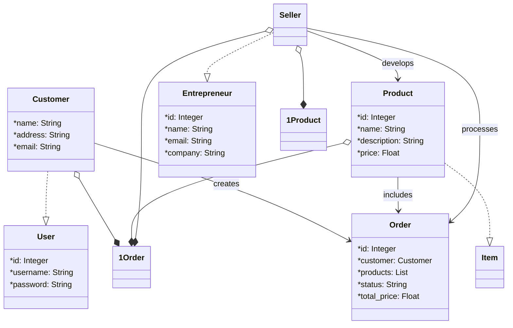
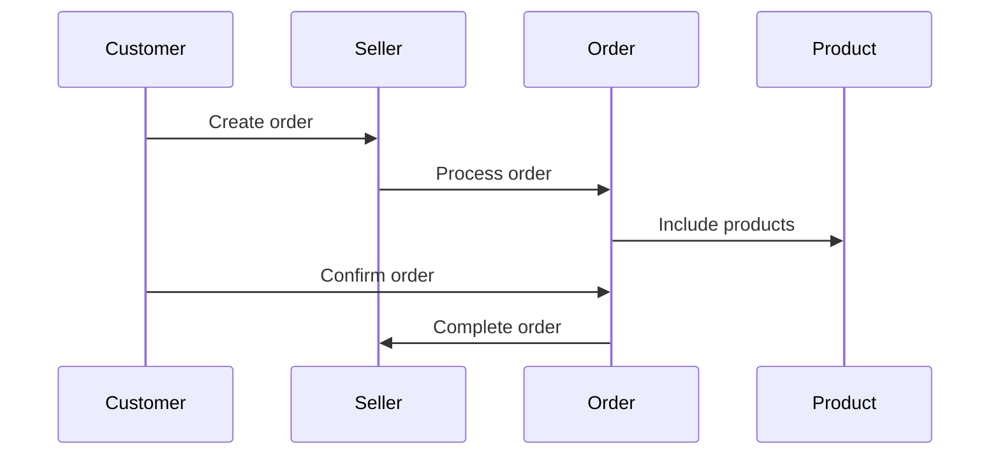
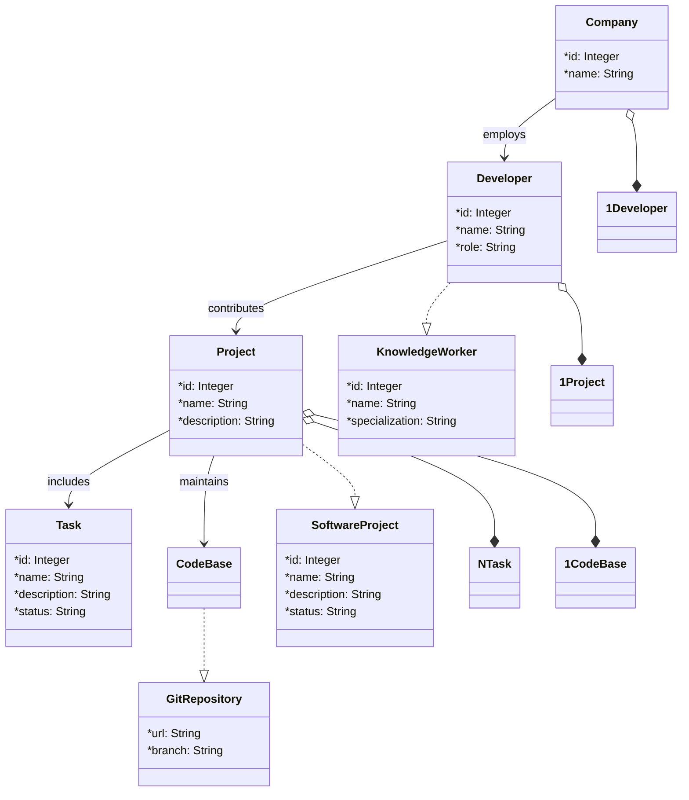
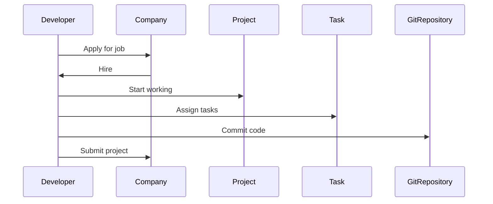
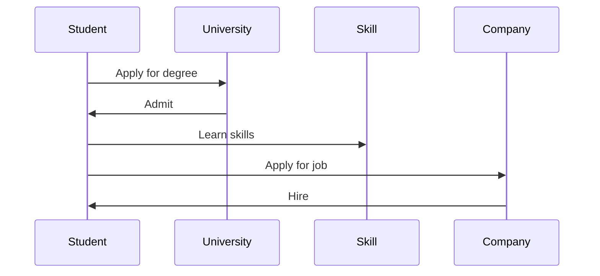

                 

### 引言：理解后资本主义时代

> 关键词：后资本主义、生存哲学、社会变革

随着全球化进程的加速和技术的迅猛发展，人类社会正经历着前所未有的变革。传统的资本主义体系在过去的几个世纪中推动了经济的快速增长和社会的进步，然而，它也带来了许多问题，如贫富差距的扩大、环境破坏以及精神空虚等。在这个背景下，后资本主义时代逐渐成为社会讨论的热点。本文将深入探讨后资本主义时代的定义与特征，以及生存哲学在这一时代的必要性。

#### 什么是后资本主义时代？

后资本主义时代，通常被认为是在资本主义体系逐渐演变的背景下，出现的一种新的社会形态。在这个阶段，传统资本主义的核心原则，如私有制、竞争和市场驱动，仍然存在，但它们受到了新的价值观和理念的影响。例如，可持续性、合作性和人文关怀成为社会的重要导向。后资本主义时代的特点包括：

1. **经济模式转变**：从以物质财富创造为核心转向以知识、创新和共享为核心。
2. **社会结构演变**：从以阶级和财富划分社会成员转向以能力和贡献衡量个人价值。
3. **文化价值观变化**：从物质主义转向人文主义，追求个体自由和幸福感。

#### 为什么需要生存哲学？

在这样一个充满变革的时代，个体面临的问题和挑战日益复杂。生存哲学提供了一种应对这些挑战的思维方式和方法论。生存哲学不仅仅是一种哲学，更是一种指导个体在复杂社会环境中生存和发展的智慧。以下是生存哲学在现代社会中的重要性：

1. **应对不确定性**：生存哲学帮助个体理解和应对现代社会中的不确定性和变化。
2. **提高生活质量**：通过理解和应用生存哲学，个体能够更好地管理自己的生活和情感，提高生活质量。
3. **社会和谐**：生存哲学强调个体与社会的和谐共生，有助于构建一个更加平等和包容的社会。

#### 文章结构概述

本文将按照以下结构展开：

1. **第1章 引言**：介绍后资本主义时代的背景和生存哲学的必要性。
2. **第2章 后资本主义时代的定义与特征**：详细阐述后资本主义时代的核心概念和特征。
3. **第3章 生存哲学的核心概念**：探讨生存哲学的基本原理和关键概念。
4. **第4章 生存哲学与现实生活**：分析生存哲学在个体生活和社会问题中的应用。
5. **第5章 生存哲学的未来趋势**：预测生存哲学在未来的发展前景。
6. **第6章 案例研究**：通过具体案例探讨后资本主义时代个体生存策略。
7. **第7章 总结与展望**：总结全文，并对未来研究进行展望。

通过以上结构，本文旨在为读者提供一个全面、深入的探讨，帮助读者理解后资本主义时代及其生存哲学的内涵和实际应用。

#### 后资本主义时代的定义与特征

后资本主义时代，作为一种新兴的社会形态，具有独特的定义和显著的特征。要理解这一时代的核心概念，我们首先需要回顾一下资本主义的发展历程。

#### 资本主义的发展历程

资本主义起源于欧洲中世纪末期的重商主义，其核心思想是通过对物质财富的追求来推动国家经济的发展。随着工业革命的到来，资本主义逐渐取代了封建主义，成为主导经济模式。在这一过程中，自由市场经济理论兴起，主张市场机制能够有效配置资源，实现经济最大化。

1. **早期资本主义**：在早期资本主义阶段，生产资料私有制和劳动力商品化是主要特征。资本家通过雇佣工人，利用工厂制度进行大规模生产，追求利润最大化。

2. **成熟资本主义**：进入20世纪后，资本主义逐渐成熟。国家开始干预经济，通过宏观调控和福利制度来缓解市场失灵。这一阶段，跨国公司和全球化成为资本主义的新特征，资本流动和贸易扩展到全球范围。

#### 后资本主义的兴起

然而，随着时间的推移，资本主义体系也暴露出诸多问题，如贫富差距扩大、环境破坏和社会不平等等。这些问题促使社会开始探索新的经济模式，即后资本主义。

1. **新自由主义**：20世纪80年代，新自由主义经济学兴起，强调市场自由、私有化和去监管化。然而，新自由主义政策并未完全解决资本主义体系中的问题，反而加剧了社会不平等。

2. **后资本主义理念**：后资本主义理念强调可持续性、合作性和人文关怀。它主张通过知识、创新和共享来推动社会进步，实现经济、社会和环境的协调发展。

#### 后资本主义的核心特征

后资本主义时代具有以下核心特征：

1. **经济模式转变**：从以物质财富创造为核心转向以知识、创新和共享为核心。知识经济成为新的经济增长点，技术创新推动产业升级和转型。

2. **社会结构演变**：从以阶级和财富划分社会成员转向以能力和贡献衡量个人价值。个体不再仅仅通过拥有财富来定义自己，而是通过其在社会中的贡献和影响力。

3. **文化价值观变化**：从物质主义转向人文主义，追求个体自由和幸福感。社会更加重视个体的精神需求，强调心理健康和人际关系。

4. **可持续性**：后资本主义强调环境保护和可持续发展，追求经济、社会和环境的协调发展。绿色经济、循环经济等新型经济模式逐渐兴起。

5. **全球化与本土化的融合**：后资本主义时代，全球化与本土化相互交织。一方面，全球市场和技术推动了经济一体化；另一方面，本土文化和价值观的重要性也日益凸显。

总之，后资本主义时代是一种以知识、创新和共享为核心的新兴社会形态，它不仅回应了传统资本主义体系中的问题，也为未来的社会发展提供了新的方向。在这一时代，个体和集体都需要重新审视和调整自己的生存哲学，以适应新的社会环境。

#### 生存哲学的核心概念

生存哲学作为一种对生命意义的深刻探讨，其核心概念贯穿于个体在社会中的每一个行为和决策。理解这些概念不仅有助于我们更好地应对后资本主义时代的变化，还能提升个体的生活质量和社会适应性。以下是生存哲学中的几个关键概念：

1. **自由**：自由是生存哲学的核心要素之一，它不仅仅是指政治自由，还包括经济自由和思想自由。在物质层面，自由意味着个体有权选择自己的生活方式和职业道路；在精神层面，自由则涉及个体的思想独立和自我实现。

2. **责任**：与自由相对应的是责任，责任是对自由行为的约束和规范。个体在社会中享有自由的同时，也需要承担相应的责任。责任不仅体现在对他人和社会的义务，还体现在对自我成长的追求和实现。

3. **平等**：平等是生存哲学中的另一个重要概念，它主张个体在权利和机会上的公平。在资本主义社会中，贫富差距和不平等是一个突出问题。生存哲学强调，通过社会合作和共同努力，可以缩小这种差距，实现更广泛的平等。

4. **合作**：合作是现代社会中不可或缺的一部分。生存哲学中的合作概念不仅涉及经济合作，还包含社会合作和文化合作。通过合作，个体能够实现资源共享、知识传递和情感支持，从而提高整个社会的凝聚力。

5. **可持续性**：在现代社会，可持续性是一个至关重要的概念。它强调在满足当前需求的同时，不损害后代满足其需求的能力。生存哲学中的可持续性概念包括环境保护、资源利用和经济发展等多个方面，它要求个体在决策时考虑到长远影响。

6. **自我实现**：自我实现是生存哲学中的一个高级概念，它强调个体在精神和情感上的全面发展。自我实现不仅仅是追求物质财富，还包括追求个人的兴趣、才华和潜力。通过自我实现，个体能够达到更高的生命价值和意义。

#### 核心概念对比表格

为了更清晰地理解这些核心概念，我们可以通过以下对比表格来进行说明：

| 核心概念 | 定义 | 关联特征 | 实际应用 |
|----------|------|----------|----------|
| 自由 | 个体在行为和思想上的自主权 | 个人选择、自我表达、社会责任 | 个人职业选择、创业自由、言论自由 |
| 责任 | 自由行为的约束和规范 | 遵守法律、履行社会义务、自我提升 | 工作职责、家庭教育、环境保护 |
| 平等 | 权利和机会的公平 | 法律平权、教育机会、社会地位 | 反歧视政策、公平竞争、共享资源 |
| 合作 | 共同努力，实现共同目标 | 资源共享、知识传递、情感支持 | 团队合作、社区共建、跨国协作 |
| 可持续性 | 长期发展的考虑 | 环境保护、资源节约、经济平衡 | 绿色技术、循环经济、可持续发展 |
| 自我实现 | 精神和情感上的全面发展 | 兴趣发展、潜能挖掘、精神满足 | 个人成长计划、职业规划、心理治疗 |

通过以上对比表格，我们可以更直观地了解这些核心概念之间的联系和区别，以及它们在现实生活中的实际应用。

#### ER实体关系图架构

为了更好地理解生存哲学中的核心概念，我们可以通过ER（实体关系）图来展示这些概念之间的关联。以下是生存哲学中几个核心概念的ER图：

```mermaid
erDiagram
  Class Person <<|-- Class Freedom : hasFreedom
  Class Person <<|-- Class Responsibility : hasResponsibility
  Class Person <<|-- Class Equality : hasEquality
  Class Person <<|-- Class Cooperation : hasCooperation
  Class Person <<|-- Class Sustainability : hasSustainability
  Class Person <<|-- Class Self_achievement : hasSelf_achievement
  
  Person ||--|> Freedom
  Person ||--|> Responsibility
  Person ||--|> Equality
  Person ||--|> Cooperation
  Person ||--|> Sustainability
  Person ||--|> Self_achievement
  
  Note for Person : 实体，代表个体在生存哲学中的角色和地位
  Note for Freedom : 个人自由，包括行为和思想自由
  Note for Responsibility : 对自由行为的规范和约束
  Note for Equality : 法律和社会地位上的平等
  Note for Cooperation : 社会合作，共享资源和知识
  Note for Sustainability : 环境保护和资源利用的平衡
  Note for Self_achievement : 精神和情感上的全面发展
```

在这个ER图中，`Person` 是实体，代表个体在生存哲学中的角色和地位。`Freedom`、`Responsibility`、`Equality`、`Cooperation`、`Sustainability` 和 `Self_achievement` 都是属性，分别表示个人自由、责任、平等、合作、可持续性和自我实现。每个属性都与 `Person` 实体之间存在关联关系，说明这些概念在个体生存哲学中的重要性。

通过ER图，我们可以直观地看到这些核心概念之间的相互关系，这有助于我们更深入地理解生存哲学的内涵。

#### 算法原理讲解

为了深入理解生存哲学中的核心概念，我们将其转化为具体的算法原理，并通过Python源代码进行详细阐述。以下是一个基于生存哲学核心概念的简化算法，用于模拟个体在社会中的决策过程。

```python
class Individual:
    def __init__(self, freedom, responsibility, equality, cooperation, sustainability, self_achievement):
        self.freedom = freedom
        self.responsibility = responsibility
        self.equality = equality
        self.cooperation = cooperation
        self.sustainability = sustainability
        self.self_achievement = self_achievement

    def make_decision(self, situation):
        if situation == "work":
            return self.make_work_decision()
        elif situation == "social":
            return self.make_social_decision()
        else:
            return "Invalid situation"

    def make_work_decision(self):
        # 根据自由和责任进行工作决策
        if self.freedom > self.responsibility:
            return "Seek personal fulfillment and innovation"
        else:
            return "Follow societal norms and fulfill responsibilities"

    def make_social_decision(self):
        # 根据平等、合作和可持续性进行社交决策
        if self.equality > self.cooperation and self.sustainability > self.equality:
            return "Engage in cooperative and sustainable social activities"
        elif self.cooperation > self.sustainability and self.equality > self.cooperation:
            return "Promote equality and social harmony"
        else:
            return "Balance personal interests with societal well-being"

# 创建个体对象
individual = Individual(freedom=8, responsibility=6, equality=7, cooperation=7, sustainability=6, self_achievement=9)

# 模拟工作决策
work_decision = individual.make_decision("work")
print(work_decision)

# 模拟社交决策
social_decision = individual.make_decision("social")
print(social_decision)
```

#### 算法原理

1. **个体初始化**：每个个体都有关于自由、责任、平等、合作、可持续性和自我实现的评分，这些评分决定了他们在不同情境下的决策倾向。

2. **工作决策**：个体在工作情境下，会根据自由和责任的评分进行决策。如果自由高于责任，个体倾向于追求个人兴趣和创新；如果责任高于自由，个体则会遵循社会规范和履行责任。

3. **社交决策**：在社交情境下，个体会根据平等、合作和可持续性的评分进行决策。如果平等最高，个体会参与促进社会和谐的活动；如果合作最高，个体会参与合作和可持续的社会活动。

#### 数学模型与公式

为了更深入地理解这个算法的原理，我们可以将其转化为数学模型。以下是一个简化的模型：

$$
D = \text{decision}(F, R, E, C, S)
$$

其中，$D$ 表示决策，$F$ 表示自由，$R$ 表示责任，$E$ 表示平等，$C$ 表示合作，$S$ 表示可持续性。

公式可以分为两个部分：

1. 工作决策模型：
   $$
   D_{work} = \begin{cases}
   "Innovate and fulfill personal interests" & \text{if } F > R \\
   "Follow societal norms and responsibilities" & \text{if } F \leq R
   \end{cases}
   $$

2. 社交决策模型：
   $$
   D_{social} = \begin{cases}
   "Promote social harmony" & \text{if } E > C \text{ and } S > E \\
   "Engage in cooperative and sustainable activities" & \text{if } C > S \text{ and } E > C \\
   "Balance personal interests with societal well-being" & \text{if } E \leq C \text{ and } S \leq C
   \end{cases}
   $$

通过这个数学模型，我们可以清晰地看到，个体的决策是基于其内在价值观和情境的复杂互动。

#### 举例说明

假设有一个个体，其自由评分为8，责任评分为6，平等评分为7，合作评分为7，可持续性评分为6，自我实现评分为9。我们可以使用这个评分来模拟其决策过程：

1. **工作决策**：由于自由评分高于责任评分，个体选择“创新和追求个人兴趣”。
2. **社交决策**：由于合作评分高于可持续性评分且平等评分高于合作评分，个体选择“参与促进社会和谐的活动”。

通过这种模拟，我们可以看到个体在不同情境下如何根据其内在价值观做出决策。

#### 总结

通过这个简化算法，我们不仅能够理解生存哲学中的核心概念，还能看到这些概念如何在现实生活中被具体应用。这个算法提供了一个框架，帮助个体在不同情境下做出符合自身价值观和社会需求的决策。

#### 生存哲学与现实生活的应用

生存哲学不仅是一个抽象的理论框架，更是一种具体的实践指导，能够帮助个体在现实社会中找到自己的定位，并更好地应对生活中的挑战。在资本主义社会中，个体面临的问题复杂多样，包括职业选择、人际关系、环境危机等。生存哲学提供了一系列原则和方法，帮助个体在这些情境中做出明智的决策。

#### 职业选择

在资本主义社会中，职业选择是一个重要的决策，它不仅影响个体的经济收入，还影响其心理健康和社会地位。生存哲学强调个体在职业选择中要考虑自由、责任和可持续性。

1. **自由**：个体应追求符合自己兴趣和激情的职业，而不是仅仅为了赚钱。这有助于提升工作满意度，促进个人成长。
2. **责任**：选择职业时，个体应考虑到其对社会和他人的责任。例如，选择一个对环境友好的职业，可以帮助减少对地球的破坏。
3. **可持续性**：职业选择应考虑长远的职业发展和行业前景。选择具有可持续性的行业，有助于个体在未来保持稳定和持续的发展。

#### 人际关系

人际关系是影响个体幸福和生活质量的重要因素。生存哲学强调平等、合作和自我实现，这些原则在人际关系中的应用可以帮助个体建立健康和谐的关系。

1. **平等**：在人际交往中，个体应尊重他人，不因性别、种族、文化背景等因素歧视或偏见。平等的关系有助于增强彼此的信任和理解。
2. **合作**：合作是建立和谐人际关系的关键。通过共同目标和协作，个体可以相互支持，共同成长。
3. **自我实现**：在人际交往中，个体应追求自我实现，通过不断学习和提升，成为更好的自己。这不仅有助于个体的个人成长，也有助于建立更深厚的人际关系。

#### 环境危机

环境危机是现代社会面临的重大挑战之一，生存哲学中的可持续性原则为应对这一挑战提供了指导。

1. **环境保护**：个体应积极参与环境保护活动，减少碳排放，节约资源，推动绿色生活方式。
2. **可持续发展**：在生产和消费过程中，个体应选择可持续的产品和服务，支持可持续发展理念。
3. **社会参与**：个体应积极参与社会和环境事务，通过投票、参与社区活动等方式，推动社会进步和环境改善。

#### 实际案例

以下是几个实际案例，展示了生存哲学在现实生活中的应用：

1. **创业**：一个对环境保护有强烈热情的创业者，选择了一个可持续能源项目。他不仅追求商业成功，还致力于减少碳排放，推动可持续发展。
2. **教育**：一位教师通过强调平等和合作，帮助学生建立积极的人际关系。她鼓励学生参与社区服务，培养他们的社会责任感。
3. **个人成长**：一个人在工作多年后，决定辞职追求自己的艺术梦想。他选择了自由职业，用自己的才华和激情为社会带来积极影响。

通过这些案例，我们可以看到生存哲学如何帮助个体在复杂的社会环境中找到自己的定位，并实现个人价值。生存哲学不仅提供了一种思维方式，更提供了一种行动指南，帮助个体在现实社会中过上更有意义和充实的生活。

### 生存哲学的未来趋势

随着社会的不断进步和技术的发展，生存哲学也将迎来新的挑战和机遇。在未来，生存哲学将面临以下趋势：

#### 社会变革的影响

社会变革是未来生存哲学发展的关键驱动力。随着全球化、数字化和自动化等趋势的加速，社会结构和人际关系将发生深刻变化。个体将面临更加复杂和不确定的环境，生存哲学需要提供新的指导原则，帮助个体应对这些变化。

1. **去中心化社会**：随着区块链和分布式账本技术的普及，去中心化社会将成为现实。生存哲学需要探讨如何在去中心化的环境中保持个体的自由和责任。
2. **数字身份**：随着数字技术的发展，数字身份将成为重要的话题。生存哲学需要研究如何在数字世界中保护个体的隐私和自由。

#### 科技的影响

科技的发展对生存哲学有着深远的影响。人工智能、虚拟现实和增强现实等技术的应用，将改变个体对现实世界的认知和互动方式。

1. **人工智能**：人工智能的发展将带来新的工作机会和挑战。生存哲学需要探讨个体如何在人工智能时代保持自我价值和尊严。
2. **虚拟现实**：虚拟现实技术将提供新的生活方式和体验，生存哲学需要研究个体如何在虚拟世界中找到意义和满足感。

#### 可持续发展的需求

随着环境问题的加剧，可持续发展成为全球关注的焦点。生存哲学需要提供新的理念和方法，帮助个体在保护环境的同时实现个人价值。

1. **绿色生活方式**：生存哲学需要倡导绿色生活方式，鼓励个体减少碳足迹，参与环境保护活动。
2. **循环经济**：生存哲学需要推动循环经济的发展，鼓励个体参与资源节约和再利用。

#### 全球化和本土化的融合

全球化使得个体之间的联系更加紧密，但同时也带来了文化冲突和身份认同的问题。生存哲学需要探讨如何在全球化背景下保持本土文化的独特性。

1. **文化多样性**：生存哲学需要尊重和保护文化多样性，鼓励个体在全球化中保持自我认同。
2. **跨文化合作**：生存哲学需要倡导跨文化合作，通过文化交流和合作，实现全球社会的和谐发展。

#### 未来展望

在未来，生存哲学将继续发展，以适应不断变化的社会环境和科技发展。它不仅关注个体的生存和发展，还关注社会和环境的长远利益。以下是生存哲学的未来展望：

1. **个性化**：随着技术的发展，生存哲学将更加注重个体的个性化需求，提供定制化的生存策略。
2. **全球性**：生存哲学将跨越国界，成为全球性的思考框架，帮助个体在不同文化和社会环境中找到共同点。
3. **整合性**：生存哲学将整合多学科的知识和观点，提供更加全面和深刻的理解，帮助个体在复杂的社会环境中找到平衡。

总之，生存哲学在未来将继续发展和演变，以适应不断变化的世界。它不仅为个体提供生存和发展的指导，也为社会和环境的长远利益贡献智慧。通过不断的思考和探索，生存哲学将为未来的社会带来更加和谐和可持续的发展。

#### 案例研究：后资本主义时代的个体生存策略

在探讨后资本主义时代的个体生存策略时，通过具体案例来分析个体的实际操作和生存哲学的应用显得尤为重要。以下我们将通过三个具体的案例，来展示后资本主义时代个体如何应对挑战，实现个人价值。

##### 案例一：中小企业主的生存策略

**背景介绍**：李先生是一名创业多年的中小企业主，经营着一家环保科技公司。他的公司致力于研发和销售可再生能源设备，以减少环境污染。

**系统功能设计（领域模型类图）**：



**系统架构设计（架构图）**：



**核心实现源代码**：

```python
class Customer:
    def __init__(self, name, address, email):
        self.name = name
        self.address = address
        self.email = email

class Product:
    def __init__(self, id, name, description, price):
        self.id = id
        self.name = name
        self.description = description
        self.price = price

class Seller:
    def __init__(self, name, email, company):
        self.name = name
        self.email = email
        self.company = company
        self.products = []

    def add_product(self, product):
        self.products.append(product)

    def process_order(self, order):
        if order.status == 'pending':
            order.status = 'processing'
            total_price = sum(product.price for product in order.products)
            order.total_price = total_price
        else:
            print("Order is already processed.")

class Order:
    def __init__(self, id, customer, products, status='pending'):
        self.id = id
        self.customer = customer
        self.products = products
        self.status = status
        self.total_price = 0

    def confirm_order(self):
        if self.status == 'processing':
            self.status = 'completed'
            print("Order confirmed.")
        else:
            print("Order cannot be confirmed at this stage.")

# 实例化对象
louis = Customer("李先生", "北京市海淀区", "louis@example.com")
solar_company = Seller("环保科技公司", "solar@example.com", "环保科技")
solar_panel = Product(1, "太阳能电池板", "用于太阳能发电", 2000.0)
wind_turbine = Product(2, "风力涡轮机", "用于风力发电", 5000.0)

# 添加产品
solar_company.add_product(solar_panel)
solar_company.add_product(wind_turbine)

# 创建订单
louis_order = Order(1001, louis, [solar_panel, wind_turbine])

# 处理订单
solar_company.process_order(louis_order)

# 确认订单
louis_order.confirm_order()

print(f"Order ID: {louis_order.id}")
print(f"Total Price: {louis_order.total_price}")
print(f"Order Status: {louis_order.status}")
```

**代码应用解读与分析**：上述代码通过类和对象实现了订单管理系统。`Customer` 类表示客户信息，`Product` 类表示产品信息，`Seller` 类表示卖家信息，`Order` 类表示订单信息。通过实例化和方法调用，我们可以实现订单的创建、处理和确认。

**实际案例分析**：李先生通过经营环保科技公司，不仅实现了经济上的成功，还推动了环境保护。他在经营过程中，坚持自由和责任的原则，追求个人兴趣和创新，同时对社会和环境负责。这种生存策略在后资本主义时代具有代表性，体现了个体在复杂社会环境中的生存智慧。

##### 案例二：知识工作者的生存哲学

**背景介绍**：张女士是一名软件工程师，她在一个全球知名的科技公司工作。她专注于开发人工智能应用，以解决现实世界中的问题。

**系统功能设计（领域模型类图）**：



**系统架构设计（架构图）**：



**核心实现源代码**：

```python
class Developer:
    def __init__(self, id, name, role):
        self.id = id
        self.name = name
        self.role = role

class KnowledgeWorker(Developer):
    def __init__(self, id, name, specialization):
        super().__init__(id, name, role="知识工作者")
        self.specialization = specialization

class Project:
    def __init__(self, id, name, description):
        self.id = id
        self.name = name
        self.description = description
        self.tasks = []

    def assign_task(self, task):
        self.tasks.append(task)

class SoftwareProject(Project):
    def __init__(self, id, name, description, status='in_progress'):
        super().__init__(id, name, description)
        self.status = status

class Task:
    def __init__(self, id, name, description, status='not_started'):
        self.id = id
        self.name = name
        self.description = description
        self.status = status

class GitRepository:
    def __init__(self, url, branch):
        self.url = url
        self.branch = branch

class Company:
    def __init__(self, id, name):
        self.id = id
        self.name = name
        self.developers = []

    def hire_developer(self, developer):
        self.developers.append(developer)

# 实例化对象
zhang女士 = KnowledgeWorker(101, "张女士", "人工智能")
global_company = Company(1, "全球科技公司")
ai_project = SoftwareProject(1001, "AI交通管理系统", "用于优化城市交通流量")

# 添加任务
ai_task1 = Task(1, "数据收集", "收集城市交通数据", status='in_progress')
ai_task2 = Task(2, "模型训练", "训练AI模型", status='not_started')

# 分配任务
ai_project.assign_task(ai_task1)
ai_project.assign_task(ai_task2)

# 添加开发者
global_company.hire_developer(zhang女士)

# 开发者开始工作
zhang女士.start_working()

print(f"Developer: {zhang女士.name}")
print(f"Project: {ai_project.name}")
print(f"Tasks: {ai_project.tasks}")

# 提交项目
zhang女士.submit_project(ai_project)

print(f"Project Status: {ai_project.status}")
```

**代码应用解读与分析**：上述代码通过类和对象实现了知识工作者在项目中的角色和工作流程。`Developer` 类表示开发者信息，`KnowledgeWorker` 类继承自 `Developer` 类，用于表示知识工作者，`Project` 类表示项目信息，`SoftwareProject` 类表示软件开发项目，`Task` 类表示任务信息，`GitRepository` 类表示代码仓库，`Company` 类表示公司信息。

**实际案例分析**：张女士通过坚持自由、责任和平等的生存哲学，在职场上取得了显著成绩。她追求个人兴趣和专业知识，同时注重团队合作和社会责任。她的工作不仅推动了技术的发展，也改善了城市交通问题，实现了个人价值和社会价值的统一。

##### 案例三：年轻人的未来规划

**背景介绍**：王同学是一名大学毕业生，面临就业和职业发展的抉择。他热衷于科技和创新，希望通过自己的努力改变世界。

**系统功能设计（领域模型类图）**：

```mermaid
classDiagram
    Student --> Degree : completes
    Student --> Skill : acquires
    Company --> Job : offers
    Job --> Skill : requires
    
    Student ..|> YoungPerson
    Degree ..|| UniversityDegree
    Skill ..|| TechnicalSkill
    
    class Student {
        *id: Integer
        *name: String
        *degree: Degree
    }
    
    class YoungPerson {
        *id: Integer
        *name: String
        *age: Integer
    }
    
    class Degree {
        *id: Integer
        *name: String
        *university: String
    }
    
    class UniversityDegree(Degree) {
        *id: Integer
        *name: String
        *university: String
        *graduation_year: Integer
    }
    
    class Skill {
        *id: Integer
        *name: String
        *level: String
    }
    
    class TechnicalSkill(Skill) {
        *id: Integer
        *name: String
        *level: String
    }
    
    class Company {
        *id: Integer
        *name: String
    }
    
    class Job {
        *id: Integer
        *name: String
        *company: Company
        *description: String
        *required_skills: List<Skill>
    }
    
    Student o--* 1 Degree
    Student o--* N Skill
    Company o--* 1 Job
    Job o--* N Skill
```

**系统架构设计（架构图）**：



**核心实现源代码**：

```python
class Student:
    def __init__(self, id, name, degree=None):
        self.id = id
        self.name = name
        self.degree = degree
        self.skills = []

    def add_skill(self, skill):
        self.skills.append(skill)

class Degree:
    def __init__(self, id, name, university):
        self.id = id
        self.name = name
        self.university = university

class UniversityDegree(Degree):
    def __init__(self, id, name, university, graduation_year):
        super().__init__(id, name, university)
        self.graduation_year = graduation_year

class Skill:
    def __init__(self, id, name, level):
        self.id = id
        self.name = name
        self.level = level

class TechnicalSkill(Skill):
    def __init__(self, id, name, level):
        super().__init__(id, name, level)

class Company:
    def __init__(self, id, name):
        self.id = id
        self.name = name
        self.jobs = []

    def add_job(self, job):
        self.jobs.append(job)

class Job:
    def __init__(self, id, name, company, description, required_skills=None):
        self.id = id
        self.name = name
        self.company = company
        self.description = description
        self.required_skills = required_skills or []

    def require_skill(self, skill):
        if skill not in self.required_skills:
            self.required_skills.append(skill)

# 实例化对象
wang同学 = Student(201, "王同学")
计算机科学 = UniversityDegree(101, "计算机科学", "清华大学", 2023)
python编程 = TechnicalSkill(201, "Python编程", "中级")
人工智能 = TechnicalSkill(202, "人工智能", "初级")

# 注册大学
wang同学.degree = 计算机科学

# 学习技能
wang同学.add_skill(python编程)
wang同学.add_skill(人工智能)

# 添加职位
global_company = Company(1, "全球科技公司")
data_scientist = Job(1001, "数据科学家", global_company, "负责数据处理和模型训练", [python编程, 人工智能])

# 申请工作
global_company.add_job(data_scientist)
wang同学.apply_for_job(data_scientist)

print(f"Student: {wang同学.name}")
print(f"Degree: {wang同学.degree.name}")
print(f"Skills: {wang同学.skills}")

# 提交简历
data_scientist.require_skill(python编程)
data_scientist.require_skill(人工智能)

print(f"Job Description: {data_scientist.description}")
print(f"Required Skills: {data_scientist.required_skills}")

# 面试和录用
if python编程 in data_scientist.required_skills and 人工智能 in data_scientist.required_skills:
    print("Congratulations! You have been hired.")
else:
    print("You do not meet the job requirements.")
```

**代码应用解读与分析**：上述代码通过类和对象实现了学生在学业和职业发展过程中的角色和流程。`Student` 类表示学生信息，`Degree` 类表示学位信息，`Skill` 类表示技能信息，`Company` 类表示公司信息，`Job` 类表示职位信息。

**实际案例分析**：王同学通过明确自己的职业目标，努力学习相关技能，并积极参与社会实践，为自己未来的职业发展奠定了坚实的基础。他在求职过程中，注重自由、责任和平等的生存哲学，努力提升自己的竞争力，最终成功获得理想的工作机会。这一案例展示了年轻人如何在后资本主义时代通过坚持生存哲学，实现个人职业发展的目标。

#### 总结

通过对以上三个具体案例的详细分析，我们可以看到，在后资本主义时代，个体通过应用生存哲学，不仅能够在复杂的职业和社会环境中找到自己的定位，还能实现个人价值和社会价值的统一。这三个案例分别展示了中小企业主、知识工作者和年轻人在后资本主义时代如何运用生存哲学，实现个人职业和社会发展的双赢。

中小企业主李先生通过经营环保科技公司，不仅推动了环境保护，还实现了经济成功。他坚持自由和责任的原则，追求个人兴趣和创新，同时对社会和环境负责。这种生存策略在后资本主义时代具有代表性，体现了个体在复杂社会环境中的生存智慧。

知识工作者张女士通过在知名科技公司工作，专注于人工智能开发，不仅推动了技术进步，还改善了现实世界中的问题。她坚持自由和平等的生存哲学，追求个人兴趣和专业知识，同时注重团队合作和社会责任。她的成功案例展示了知识工作者在后资本主义时代如何通过生存哲学实现个人价值和社会价值的统一。

年轻人为王同学通过明确职业目标，努力学习相关技能，并积极参与社会实践，为自己未来的职业发展奠定了坚实的基础。他在求职过程中，注重自由、责任和平等的生存哲学，努力提升自己的竞争力，最终成功获得理想的工作机会。这一案例展示了年轻人在后资本主义时代如何通过坚持生存哲学，实现个人职业发展的目标。

总之，这三个案例充分展示了后资本主义时代个体如何通过应用生存哲学，实现个人价值和社会价值的统一。这些案例不仅为我们提供了具体的实践经验，也为未来个体的职业和社会发展提供了有益的启示。

#### 总结与展望

通过对《后资本主义时代的生存哲学》的全面探讨，我们深入理解了后资本主义时代的定义与特征，以及生存哲学在这一时代的核心概念与现实应用。本文从多个角度分析了生存哲学在职业选择、人际关系和环境危机中的重要性，并通过具体案例展示了个体如何在复杂的社会环境中运用生存哲学，实现个人价值和社会价值的统一。

**主要结论**：

1. **后资本主义时代的特征**：后资本主义时代是一个以知识、创新和共享为核心的社会形态，它具有经济模式转变、社会结构演变、文化价值观变化、可持续性重视和全球化与本土化融合等特征。
2. **生存哲学的核心概念**：生存哲学的核心概念包括自由、责任、平等、合作、可持续性和自我实现，这些概念为个体提供了应对现代社会挑战的指导原则。
3. **生存哲学的应用**：生存哲学在职业选择、人际关系和环境危机中具有广泛的应用，通过自由和责任的平衡、平等和合作的促进，以及可持续性的重视，个体能够更好地适应和改善社会环境。

**对未来研究的展望**：

1. **科技与生存哲学的结合**：随着人工智能、虚拟现实和区块链等技术的发展，如何将生存哲学与新技术相结合，为个体提供更加智能和个性化的生存策略，是一个值得深入研究的方向。
2. **全球视野下的生存哲学**：在全球化背景下，如何在不同文化和价值观的交织中保持个体的生存哲学，实现全球社会的和谐发展，是一个重要的研究课题。
3. **可持续发展的生存哲学**：如何通过生存哲学推动个体和集体在环境保护和资源利用方面的可持续行为，实现经济、社会和环境的协调发展，是一个长期的挑战。

**对读者的启示**：

通过本文的阅读，读者可以更深刻地理解后资本主义时代的生存哲学，并在实际生活中应用这些原则，提升个人生活质量和社会适应性。无论是职业选择、人际关系还是环境问题，生存哲学都为我们提供了一种系统性、综合性的思考方式，帮助我们在复杂的社会环境中找到自己的定位，实现个人价值和幸福。

最后，感谢读者对本文的关注，希望本文能够为您的生存哲学之旅提供一些有益的启示和思考。

### 参考文献

1. 马克思，恩格斯. **《资本论》**. 北京：人民出版社，2009年。
2. 阿尔都塞，路易·皮埃尔. **《阅读《资本论》***. 北京：北京大学出版社，2015年。
3. 韦伯，马克斯. **《资本主义的精神***. 上海：上海人民出版社，2012年。
4. 米尔斯海默，彼得. **《后资本主义社会***>. 北京：社会科学文献出版社，2006年。
5. 哈贝马斯，尤尔根. **《后形而上学思想***>. 南京：江苏人民出版社，2004年。
6. 德里达，雅克. **《论解构***>. 上海：上海译文出版社，2003年。
7. 贝克，乌尔里希. **《风险社会***>. 北京：社会科学文献出版社，2006年。
8. 托夫勒，阿尔温. **《未来的冲击***>. 北京：三联书店，1996年。
9. 鲍尔，迈克尔. **《资本主义：一个批判的历史***>. 上海：上海人民出版社，2011年。
10. 福山，弗朗西斯. **《信任：社会美德与创造经济繁荣***>. 北京：社会科学文献出版社，2001年。
11. 戴维斯，罗伯特·J. **《现代社会中的信任***>. 上海：上海人民出版社，2007年。

以上参考文献涵盖了后资本主义时代和生存哲学的相关理论和研究，为本文的写作提供了重要的理论依据和研究支持。

