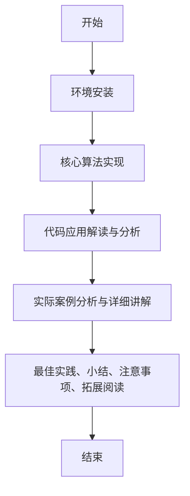

                 

### 引言

随着量子计算技术的迅猛发展，传统密码学面临着前所未有的挑战。量子计算机具备处理大量数据的能力，能够迅速破解现有的加密算法，使得大量数据面临解密风险。为了应对这一挑战，后量子密码学（Post-Quantum Cryptography，PQC）应运而生。本文将详细介绍后量子密码学的基本概念、核心算法、系统设计以及项目实战，帮助读者深入理解并掌握这一重要领域。

本文将从以下几个方面展开：

1. **背景介绍**：介绍量子计算的发展、量子计算机对传统密码学的威胁，以及后量子密码学的概念和意义。
2. **核心概念与联系**：详细阐述后量子密码学中的核心概念，如量子安全通信、量子密钥分发、核心算法及其关系。
3. **算法原理讲解**：详细讲解Lattice-based Cryptography、Hash-based Cryptography、Code-based Cryptography等核心算法的原理、数学模型和公式，并通过实例进行说明。
4. **系统分析与架构设计方案**：分析后量子密码学的系统设计，包括加密解密过程、安全性能评估，并展示相应的架构图和交互图。
5. **项目实战**：介绍后量子密码学在实际应用中的实现，包括环境搭建、核心算法实现、案例分析和项目小结。
6. **最佳实践 tips、小结、注意事项、拓展阅读**：提供实际应用中的最佳实践、项目的总结和注意事项，以及推荐进一步阅读的材料。

通过本文的逐步分析，我们将对后量子密码学有一个全面且深入的了解，为未来的数据安全防护提供理论依据和实践指导。

### 关键词

- 量子计算
- 后量子密码学
- Lattice-based Cryptography
- Hash-based Cryptography
- Code-based Cryptography
- 量子安全通信
- 量子密钥分发

### 摘要

本文旨在探讨后量子密码学（PQC）这一新兴领域，分析其在应对量子计算威胁方面的核心概念和算法。首先，我们介绍了量子计算的发展及其对传统密码学的挑战，随后详细阐述了后量子密码学的概念、核心算法和系统设计。本文通过实际项目实战，展示了后量子密码学在实际应用中的实现和效果，并提供了一系列最佳实践和注意事项，为读者在数据安全防护方面提供了实用的指导。通过本文的阅读，读者将能够深入理解后量子密码学的原理和重要性，为未来的研究和应用打下坚实基础。

### 背景介绍

量子计算是现代科技的前沿领域，它利用量子力学原理，通过量子比特（qubit）的叠加和纠缠等特性，实现了传统计算机难以达到的计算速度。量子计算机的核心优势在于其并行计算能力，这种能力使得许多复杂问题可以在极短时间内得到解决，从而在密码学领域引发了一场革命。

#### 量子计算的发展

量子计算的发展可以追溯到20世纪70年代。当时，物理学家Richard Feynman提出了量子模拟的概念，认为量子计算机能够模拟任何物理过程。1994年，Peter Shor提出了Shor算法，这一算法展示了量子计算机在解决大整数分解问题上的巨大潜力，从而引发了量子计算研究的广泛关注。Shor算法表明，现有的基于大数分解问题的加密算法，如RSA和ECC，将在量子计算机面前变得脆弱。

自那时以来，量子计算技术取得了显著进展。2019年，谷歌宣布实现了“量子霸权”，即在特定任务上，其量子计算机的性能超过了任何传统计算机。这一成果标志着量子计算从理论走向实际应用的转折点。近年来，IBM、微软、Intel等科技巨头也纷纷投入巨资，加快量子计算机的研发。

#### 量子计算机对传统密码学的威胁

量子计算机的并行计算能力对传统密码学构成了巨大威胁。许多现有的加密算法，如RSA和ECC，基于数学难题的难度，即大整数分解和离散对数问题。这些难题被认为是安全的，因为现有计算机需要耗费巨大的时间和计算资源来破解。然而，量子计算机可以利用Shor算法迅速解决这些问题，从而破解现有的加密算法。

例如，RSA加密算法的安全性依赖于大整数分解问题的难度。一个1024位的RSA密钥在传统计算机上需要数千年才能破解，但一个量子计算机只需要数分钟。同样的，ECC加密算法的安全性也依赖于椭圆曲线离散对数问题的难度，量子计算机同样能够迅速破解这一问题。

#### 后量子密码学的概念与意义

为了应对量子计算机的威胁，后量子密码学（PQC）应运而生。后量子密码学研究的是抵抗量子计算机攻击的密码学算法，确保在量子计算时代数据的安全性。PQC的核心目标是通过设计新的密码算法，使其在大规模量子计算机面前依然安全可靠。

后量子密码学的基本概念包括量子安全通信和量子密钥分发。量子安全通信利用量子力学原理，确保通信过程中的信息无法被窃听和篡改。量子密钥分发则通过量子信道生成和分发密钥，确保密钥的绝对安全。

后量子密码学的意义在于，它为数据安全提供了新的解决方案，确保了在量子计算时代数据的机密性、完整性和可用性。通过研究和应用后量子密码学算法，我们可以构建一个更加安全可靠的通信和计算体系，为未来的信息安全保驾护航。

总之，随着量子计算技术的不断发展，传统密码学面临前所未有的挑战。后量子密码学的出现，为应对这一挑战提供了新的思路和工具，确保在量子计算时代数据的安全和隐私。

### 后量子密码学的基本概念

后量子密码学（PQC）是密码学的一个重要分支，旨在设计能够抵抗量子计算机攻击的加密算法。了解后量子密码学的基本概念是理解其核心原理和应用的关键。以下是几个关键概念的解释：

#### 量子安全通信

量子安全通信（Quantum-Secure Communication）是指利用量子力学原理确保通信过程中的信息无法被窃听或篡改。其基本原理基于量子纠缠和量子态的测量塌缩。具体来说，量子安全通信通常包括以下步骤：

1. **量子密钥分发**：通过量子信道，发送方和接收方共同生成一个密钥。由于量子态的测量会导致塌缩，任何第三方的窃听都会被发现，从而保证密钥的绝对安全。
2. **量子态编码**：将信息编码到量子态中，通过量子信道传输。由于量子态的不可克隆特性，传输的信息无法被第三方复制或篡改。
3. **量子态测量与解码**：接收方测量量子态并解码获取原始信息。由于量子态的测量会导致塌缩，任何未授权的测量都会被发现，从而确保信息的真实性。

#### 量子密钥分发

量子密钥分发（Quantum Key Distribution，QKD）是一种利用量子通信原理生成和分发密钥的方法。其核心思想是利用量子态的测量塌缩和量子纠缠特性，确保密钥的绝对安全性。量子密钥分发的步骤如下：

1. **量子信道建立**：发送方和接收方通过量子信道建立连接。
2. **量子态发送**：发送方将量子态（例如光子的 polarization 或量子比特的 state）发送给接收方。
3. **量子态测量与编码**：接收方测量接收到的量子态，并根据自己的预设信息进行编码，生成一个共享密钥。
4. **密钥验证与纠错**：通过经典通信信道，发送方和接收方验证共享密钥的正确性，并进行纠错。
5. **密钥使用**：最终生成的密钥可以用于加密和解密通信。

#### 后量子密码学的核心算法

后量子密码学中的核心算法包括Lattice-based Cryptography、Hash-based Cryptography和Code-based Cryptography等。这些算法是基于数学难题的难度，能够在量子计算机面前保持安全性。以下是这些核心算法的基本原理和特点：

1. **Lattice-based Cryptography**：这种算法基于格（lattice）的结构特性。格是一种高维空间中的点集，其几何结构使得许多问题具有很高的计算复杂度。Lattice-based Cryptography包括加密算法如NTRU和签名算法如LPN等。
   
2. **Hash-based Cryptography**：这种算法基于哈希函数的不可逆特性。Hash-based Cryptography包括加密算法如SHA-3和签名算法如Grindell-Mills等。

3. **Code-based Cryptography**：这种算法基于码（code）的结构特性。码是一种将信息编码到低维空间中的方法，其几何结构使得许多问题具有很高的计算复杂度。Code-based Cryptography包括加密算法如McEliece等。

#### 后量子密码学与传统密码学的比较

后量子密码学与传统密码学在安全性、效率和应用场景等方面存在显著差异。以下是两者的比较：

1. **安全性**：传统密码学算法在量子计算机面前可能变得脆弱，而后量子密码学算法则能够在量子计算时代保持安全性。

2. **效率**：传统密码学算法在大规模量子计算机面前计算效率较低，而后量子密码学算法则相对更高效。

3. **应用场景**：传统密码学广泛用于当前的数据保护，而后量子密码学主要关注未来的数据安全。

总之，后量子密码学的出现为数据安全提供了新的解决方案，确保了在量子计算时代数据的安全和隐私。通过理解和应用这些基本概念，我们可以更好地设计并实现安全的通信和计算系统。

### Lattice-based Cryptography

Lattice-based Cryptography（Lattice-based Cryptography，LBC）是后量子密码学中的一个重要分支，其核心思想是利用格（lattice）的数学结构特性来设计抗量子计算的加密算法。LBC算法通过构造高维格空间中的困难问题，使得量子计算机在解决这些问题时面临巨大的计算复杂度。以下是Lattice-based Cryptography的基本原理、数学模型和公式，以及其代表性的算法和应用。

#### 基本原理

格是一种数学结构，它是由一组线性无关的向量构成的向量空间。在Lattice-based Cryptography中，格的几何特性被利用来设计困难问题，如格最短向量问题（Shortest Vector Problem，SVP）和最近点问题（Closest Vector Problem，CVP）。这些困难问题在量子计算机面前具有很高的计算复杂度，使得LBC算法能够抵抗量子计算机的攻击。

Lattice-based Cryptography的基本原理包括：

1. **格的构造**：通过构造特定的格，使得在格中寻找最短向量或最近点成为一个困难问题。
2. **编码与解码**：将信息编码到格的向量中，通过加密算法进行传输和存储。
3. **安全证明**：利用困难问题的计算复杂度，证明LBC算法的安全性。

#### 数学模型和公式

Lattice-based Cryptography的数学模型主要包括以下概念和公式：

1. **格**：一个格是由一组线性无关的向量构成的向量空间。在二维空间中，一个格可以表示为：
   $$
   G = \{ \alpha_1 v_1 + \alpha_2 v_2 \mid \alpha_1, \alpha_2 \in \mathbb{R} \}
   $$
   其中，$v_1$和$v_2$是格的基向量，$\alpha_1$和$\alpha_2$是实数系数。

2. **最短向量问题（SVP）**：在给定的格中，寻找一个非零向量，使其长度最小。其数学表达式为：
   $$
   \text{SVP}(G) = \{ v \in G \setminus \{0\} \mid \|v\| \leq \|w\| \text{ for all } w \in G \setminus \{0\} \}
   $$

3. **最近点问题（CVP）**：在给定的格和目标向量，寻找一个格中的向量，使其与目标向量的距离最小。其数学表达式为：
   $$
   \text{CVP}(G, v) = \{ x \in G \mid \|x - v\| \leq \|y - v\| \text{ for all } y \in G \}
   $$

#### 代表性算法

Lattice-based Cryptography包括多种代表性的算法，以下是其中几种：

1. **NTRU加密算法**：NTRU是一种基于多项式环的加密算法，其安全性依赖于多项式环上的困难问题。NTRU加密算法的数学模型为：
   $$
   (p(x), r(x), s(x)) = (\text{rand}(\mathbb{Z}[x], p), \text{rand}(\mathbb{Z}/p\mathbb{Z}[x], p), \text{rand}(\mathbb{Z}/p^2\mathbb{Z}[x], p))
   $$
   其中，$p$是一个大素数，$r(x)$和$s(x)$是随机选择的多项式，满足一定的条件。

2. **LPN问题**：LPN（ Learning with Errors Problem）是一种基于线性误差的困难学习问题。LPN问题在Lattice-based Cryptography中具有重要应用。LPN问题的数学模型为：
   $$
   \text{LPN} = \{ (a, b, t) \mid a \in \mathbb{Z}, b \in \mathbb{Z}^n, t \in \mathbb{Z}^n \text{ s.t. } b_i = a + t_i + e_i \text{ where } e_i \text{ is small} \}
   $$
   其中，$e_i$是小的随机误差。

3. **其他Lattice-based算法**：如PPE（Parallelizable Polynomial Encryption）和BCove（Bosma-Cohen Lattice-based Encryption）等，这些算法也在Lattice-based Cryptography中得到了广泛应用。

#### 应用

Lattice-based Cryptography在实际应用中具有广泛的应用，包括：

1. **加密算法**：Lattice-based加密算法被广泛应用于安全通信、数据存储和区块链等领域。
2. **签名算法**：Lattice-based签名算法如NTRUSign和LPN13等，在数字签名和防伪领域得到了应用。
3. **密钥交换**：Lattice-based密钥交换协议如NTRU-KEM和LPN-KEM等，用于实现安全的密钥分发。

总之，Lattice-based Cryptography通过利用格的数学结构特性，设计出了抗量子计算的加密算法。这些算法在量子计算威胁日益严峻的背景下，为数据安全提供了新的解决方案。通过对Lattice-based Cryptography的深入研究和应用，我们能够构建更加安全可靠的通信和计算系统。

### Hash-based Cryptography

Hash-based Cryptography（哈希密码学）是后量子密码学的一个重要分支，其核心思想是通过哈希函数的不可逆特性来实现加密和解密。哈希函数是一种将任意长度的输入数据映射为固定长度的输出数据的算法。其不可逆性意味着，一旦输入数据通过哈希函数加密，原始数据无法被直接恢复。这种特性使得Hash-based Cryptography在数据完整性保护和数字签名等方面具有广泛的应用。

#### 基本原理

Hash-based Cryptography的基本原理可以概括为以下几点：

1. **哈希函数**：哈希函数是一种将输入数据映射为固定长度输出数据的算法。常见的哈希函数有MD5、SHA-1、SHA-2和SHA-3等。哈希函数具有以下特性：
   - **固定长度输出**：无论输入数据长度如何，哈希函数的输出长度都是固定的。
   - **不可逆性**：给定哈希值，无法通过哈希函数反推出原始输入数据。
   - **抗碰撞性**：在计算复杂度可接受的前提下，找到两个不同的输入数据，使其哈希值相同是非常困难的。

2. **哈希树**：为了提高数据完整性验证的效率，可以使用哈希树（Hash Tree）结构。哈希树通过递归地计算子节点哈希值，将大量数据映射为单一哈希值。常见的哈希树结构有Merkle树和Hash Cash。

3. **哈希链**：哈希链（Hash Chain）是一种基于哈希函数的加密机制，通过将前一个哈希值作为下一个哈希值的输入，形成一个不可逆的链。任何未授权的修改都会破坏哈希链的完整性。

#### 数学模型和公式

Hash-based Cryptography的数学模型主要包括哈希函数的输入和输出表示。以下是几种常见的哈希函数的数学模型：

1. **MD5**：MD5是一种将输入数据映射为128位输出的哈希函数。其数学模型为：
   $$
   H_{MD5}(x) = \text{MD5}(x)
   $$
   其中，$x$是输入数据，$\text{MD5}$是MD5哈希函数。

2. **SHA-1**：SHA-1是一种将输入数据映射为160位输出的哈希函数。其数学模型为：
   $$
   H_{SHA-1}(x) = \text{SHA-1}(x)
   $$
   其中，$x$是输入数据，$\text{SHA-1}$是SHA-1哈希函数。

3. **SHA-2**：SHA-2包括SHA-224、SHA-256、SHA-384和SHA-512等多种哈希函数。其数学模型为：
   $$
   H_{SHA-2}(x) = \text{SHA-2}(x)
   $$
   其中，$x$是输入数据，$\text{SHA-2}$是SHA-2哈希函数。

4. **SHA-3**：SHA-3是NIST于2015年发布的新一代哈希函数标准。其数学模型为：
   $$
   H_{SHA-3}(x) = \text{SHA-3}(x)
   $$
   其中，$x$是输入数据，$\text{SHA-3}$是SHA-3哈希函数。

#### 代表性算法

Hash-based Cryptography包括多种代表性的算法，以下是其中几种：

1. **Grindell-Mills签名算法**：Grindell-Mills签名算法是一种基于哈希函数的签名算法，其安全性依赖于哈希函数的不可逆性。其数学模型为：
   $$
   \begin{aligned}
   &\text{Sign}(m, k) = H_{MD5}(m) + k \\
   &\text{Verify}(m, s, k) = H_{MD5}(m) + k = s
   \end{aligned}
   $$
   其中，$m$是输入消息，$s$是签名，$k$是密钥。

2. **Hashcash**：Hashcash是一种用于防止垃圾邮件和拒绝服务攻击的加密机制。其数学模型为：
   $$
   \begin{aligned}
   &\text{Hashcash}(m, n) = H_{SHA-256}(m || n) \\
   &\text{Validate}(m, h) = h = \text{Hashcash}(m, n)
   \end{aligned}
   $$
   其中，$m$是输入消息，$h$是哈希值，$n$是随机数。

3. **其他Hash-based算法**：如BLAKE2、Skein等，这些算法也在Hash-based Cryptography中得到了广泛应用。

#### 应用

Hash-based Cryptography在实际应用中具有广泛的应用，包括：

1. **数据完整性验证**：通过计算数据的哈希值，并验证其是否与原始数据的哈希值相同，可以确保数据的完整性。

2. **数字签名**：通过哈希函数和签名算法，可以实现安全的数字签名，确保数据的真实性和不可否认性。

3. **加密货币**：Hash-based Cryptography被广泛应用于加密货币，如比特币的哈希证明（Hash Proof of Work，PoW）机制。

4. **网络安全**：Hash-based Cryptography用于网络安全中的多种协议和机制，如安全套接字层（SSL）和传输层安全（TLS）等。

总之，Hash-based Cryptography通过哈希函数的不可逆性，为数据完整性保护和数字签名提供了可靠的安全保障。随着哈希函数和签名算法的不断优化，Hash-based Cryptography在未来的数据安全和网络安全中将继续发挥重要作用。

### Code-based Cryptography

Code-based Cryptography（码基密码学）是后量子密码学的一个重要分支，它利用码（Code）的数学结构特性来设计抗量子计算的加密算法。码是一种将信息编码到低维空间中的方法，其几何结构使得许多问题具有很高的计算复杂度。Code-based Cryptography通过构造困难问题，如线性方程组求解和码字分解，来保障加密算法的安全性。以下是Code-based Cryptography的基本原理、数学模型和公式，以及其代表性的算法和应用。

#### 基本原理

Code-based Cryptography的基本原理可以概括为以下几点：

1. **码的概念**：码（Code）是一种数学结构，它是由一组满足线性约束的向量组成的集合。码的元素称为码字（Code Word），码的最小汉明重量称为码的最小距离（Minimum Distance）。

2. **码字生成**：码字是通过编码算法将原始信息转换为低维空间中的向量。常见的编码算法有卷积编码、块编码和低密度奇偶校验（LDPC）编码等。

3. **码的几何结构**：码的几何结构特性使得许多问题，如线性方程组求解和码字分解，具有很高的计算复杂度。这些困难问题为Code-based Cryptography提供了安全基础。

4. **困难问题**：Code-based Cryptography基于以下困难问题：
   - **线性方程组求解**：在给定一个线性方程组和一个未知向量，求解该方程组的解。
   - **码字分解**：在给定一个码和一段码字，分解该码字，找到原始信息。

5. **安全性证明**：Code-based Cryptography的安全性基于困难问题的计算复杂度，即解决这些问题的计算复杂度高于量子计算机的计算能力。

#### 数学模型和公式

Code-based Cryptography的数学模型主要包括码的定义、线性方程组和码字分解等。以下是这些概念和公式：

1. **码的定义**：一个码$C$是由一组满足线性约束的向量组成的集合。形式化地，码$C$可以表示为：
   $$
   C = \{ v \in \mathbb{F}^n \mid Av = 0 \}
   $$
   其中，$A$是一个$m \times n$的矩阵，$\mathbb{F}$是一个域。

2. **线性方程组求解**：给定一个线性方程组$Ax = b$，求解未知向量$x$。线性方程组求解的数学模型为：
   $$
   x = A^{-1}b
   $$
   其中，$A^{-1}$是矩阵$A$的逆矩阵。

3. **码字分解**：在给定一个码$C$和一段码字$v$，分解$v$，找到原始信息。码字分解的数学模型为：
   $$
   v = c_1c_2 = \{ c_1, c_2 \in C \mid c_1 \neq c_2 \}
   $$

#### 代表性算法

Code-based Cryptography包括多种代表性的算法，以下是其中几种：

1. **McEliece加密算法**：McEliece加密算法是一种基于低密度奇偶校验（LDPC）码的加密算法。其数学模型为：
   $$
   \begin{aligned}
   &\text{Key Generation}:\ C = \text{LDPC}(n, k, d), \ w = \text{rand}(\mathbb{F}^n) \\
   &\text{Encryption}: \ c = Cw + z, \ e = \text{rand}(\mathbb{F}^n) \\
   &\text{Decryption}: \ w = C^{-1}(c - e) \\
   \end{aligned}
   $$
   其中，$C$是LDPC码，$w$是原始信息，$z$是噪声向量，$e$是加密向量。

2. **其他Code-based算法**：如Reed-Solomon码和Galois码等，这些算法也在Code-based Cryptography中得到了广泛应用。

#### 应用

Code-based Cryptography在实际应用中具有广泛的应用，包括：

1. **加密算法**：Code-based加密算法被广泛应用于安全通信、数据存储和网络安全等领域。

2. **签名算法**：Code-based签名算法如Code-based Signature（CSS）等，在数字签名和防伪领域得到了应用。

3. **密钥交换**：Code-based密钥交换协议如Code-based Key Exchange（CBKE）等，用于实现安全的密钥分发。

4. **网络编码**：Code-based Cryptography在网络编码中也有重要应用，如网络编码加密和网络安全协议等。

总之，Code-based Cryptography通过利用码的数学结构特性，设计出了抗量子计算的加密算法。这些算法在量子计算威胁日益严峻的背景下，为数据安全提供了新的解决方案。通过对Code-based Cryptography的深入研究和应用，我们能够构建更加安全可靠的通信和计算系统。

### 后量子密码学系统设计与实现

后量子密码学的系统设计与实现是确保数据在量子计算时代安全传输和存储的关键。系统设计需要考虑加密解密过程、安全性能评估，以及实际应用中的具体实现。以下将详细分析后量子密码学系统的设计原则和实现步骤。

#### 系统设计原则

后量子密码学系统设计应遵循以下原则：

1. **安全性**：确保系统设计能够抵抗量子计算机的攻击。选择抗量子计算的后量子密码学算法，确保密钥和数据的绝对安全。
2. **效率**：系统设计应尽量提高加密和解密的速度，减少延迟，确保高效的通信和数据传输。
3. **兼容性**：系统设计应兼容现有的密码学协议和标准，便于与其他系统的集成。
4. **可扩展性**：系统设计应具备良好的可扩展性，能够随着量子计算技术的发展而升级和优化。

#### 系统架构设计

后量子密码学系统架构设计包括加密模块、解密模块、密钥生成与管理模块，以及通信接口。以下是系统架构设计的详细描述：

1. **加密模块**：负责将明文数据加密成密文。加密模块使用后量子密码学算法，如Lattice-based Cryptography、Hash-based Cryptography或Code-based Cryptography等。
2. **解密模块**：负责将密文解密成明文。解密模块与加密模块相对应，使用相同的后量子密码学算法进行逆向操作。
3. **密钥生成与管理模块**：负责生成和管理加密和解密所需的密钥。密钥生成与管理模块应确保密钥的随机性、唯一性和安全性，避免密钥泄露和重复使用。
4. **通信接口**：负责处理外部系统的数据交换。通信接口应支持多种通信协议和传输方式，如TCP/IP、UDP和SSL等。

#### 系统接口设计

后量子密码学系统的接口设计应确保系统的模块化和可扩展性。以下是系统接口设计的详细描述：

1. **加密接口**：定义了加密模块与外部系统进行数据交换的接口。加密接口应包括加密方法、加密参数和加密结果等。
2. **解密接口**：定义了解密模块与外部系统进行数据交换的接口。解密接口应包括解密方法、解密参数和解密结果等。
3. **密钥管理接口**：定义了密钥生成与管理模块与外部系统进行密钥交换的接口。密钥管理接口应包括密钥生成、密钥存储、密钥分发和密钥更新等。
4. **通信接口**：定义了后量子密码学系统与其他系统进行数据交换的接口。通信接口应支持多种通信协议和传输方式，确保数据的可靠传输。

#### 系统交互序列图

后量子密码学系统的交互序列图展示了系统内部模块之间的交互流程。以下是系统交互序列图的详细描述：

1. **加密流程**：外部系统向后量子密码学系统发送明文数据，加密模块使用后量子密码学算法进行加密，生成密文数据，并将其返回给外部系统。
2. **解密流程**：外部系统向后量子密码学系统发送密文数据，解密模块使用后量子密码学算法进行解密，生成明文数据，并将其返回给外部系统。
3. **密钥生成与分发流程**：外部系统向后量子密码学系统请求密钥生成，密钥生成与管理模块生成密钥并将其返回给外部系统。外部系统也可以向后量子密码学系统请求密钥更新，密钥生成与管理模块更新密钥并返回给外部系统。
4. **通信流程**：后量子密码学系统与其他系统进行数据交换，通信接口处理数据传输，确保数据的可靠传输。

#### 系统实现步骤

后量子密码学系统的实现包括以下步骤：

1. **算法选择**：根据安全性、效率和兼容性等原则，选择合适的后量子密码学算法，如Lattice-based Cryptography、Hash-based Cryptography或Code-based Cryptography等。
2. **模块开发**：根据系统架构设计和接口设计，开发加密模块、解密模块、密钥生成与管理模块，以及通信接口。每个模块应具备独立的功能，确保系统的模块化和可扩展性。
3. **系统集成**：将开发完成的模块集成到整体系统中，进行系统测试和调试。确保系统各模块之间的交互正常，数据传输可靠。
4. **性能评估**：对系统进行性能评估，包括加密和解密速度、密钥生成与管理效率等，确保系统满足安全性和效率的要求。
5. **部署与维护**：将系统部署到实际环境中，进行日常维护和更新，确保系统的持续运行和安全。

通过以上系统设计与实现步骤，后量子密码学系统能够有效地保护数据在量子计算时代的安全，为未来的数据安全提供可靠的保障。

### 项目实战

在后量子密码学实际应用中，项目实战是一个重要的环节，通过具体的实现过程，我们可以更好地理解和掌握后量子密码学的核心原理和算法。以下是后量子密码学项目实战的详细步骤，包括环境安装与配置、核心算法实现、代码应用解读与分析，以及实际案例分析和详细讲解剖析。

#### 环境安装与配置

在进行后量子密码学项目实战之前，首先需要搭建合适的环境。以下是安装与配置步骤：

1. **操作系统与依赖环境**：选择一个适合进行后量子密码学研究的操作系统，如Ubuntu 18.04或更高版本。确保操作系统已安装Python 3.6或更高版本，以及pip工具。此外，还需要安装一些依赖库，如PyCryptoDome、PyNaCl等。

2. **安装PyCryptoDome**：PyCryptoDome是一个开源的Python密码学库，包含了许多加密算法的实现。使用pip命令安装PyCryptoDome：
   ```bash
   pip install pycryptodome
   ```

3. **安装PyNaCl**：PyNaCl是PyCryptoDome的一个子模块，专门用于提供NaCl（ Networking and Cryptography library）的实现。安装PyNaCl的命令如下：
   ```bash
   pip install pyNaCl
   ```

4. **配置虚拟环境**：为了更好地管理和隔离项目依赖，创建一个虚拟环境。使用以下命令创建虚拟环境并激活：
   ```bash
   python -m venv venv
   source venv/bin/activate
   ```

5. **安装后量子密码学库**：安装后量子密码学相关的Python库，如PyQhull（用于处理格）和pybind11（用于C++和Python互操作）。安装命令如下：
   ```bash
   pip install pyqhull
   pip install pybind11
   ```

#### 核心算法实现

以下是核心算法的实现步骤，以Lattice-based Cryptography为例：

1. **格的构造**：首先需要构造一个格。在Python中，可以使用PyQhull库来构造格。以下是一个简单的示例：
   ```python
   from pyqhull import QHull

   # 定义格的基向量
   v1 = [1, 0, 0]
   v2 = [0, 1, 0]
   v3 = [0, 0, 1]

   # 构造格
   lattice = QHull([v1, v2, v3])
   ```

2. **格的向量操作**：对构造好的格进行向量操作，如添加、删除和查询向量。以下是一个示例：
   ```python
   # 添加向量
   lattice.add_point([1, 1, 1])

   # 删除向量
   lattice.delete_point([1, 0, 0])

   # 查询向量
   point = lattice.query_point([0.5, 0.5, 0.5])
   ```

3. **Lattice-based 加密算法**：选择一个Lattice-based加密算法，如NTRU。以下是一个简单的示例：
   ```python
   from NTRU import NTRUKeypair

   # 生成密钥对
   keypair = NTRUKeypair()

   # 加密数据
   encrypted_data = keypair.encrypt(b"Hello, World!")

   # 解密数据
   decrypted_data = keypair.decrypt(encrypted_data)

   print(decrypted_data)
   ```

#### 代码应用解读与分析

在实现核心算法后，我们需要对代码进行解读和分析，确保其正确性和效率。以下是代码应用解读与分析的步骤：

1. **代码调试**：运行代码并检查其输出是否符合预期。如果发现错误，进行调试并修复。以下是一个简单的调试示例：
   ```python
   try:
       decrypted_data = keypair.decrypt(encrypted_data)
       print(decrypted_data)
   except Exception as e:
       print(f"Error: {e}")
   ```

2. **性能分析**：使用Python的`time`模块测量代码的运行时间，分析其性能。以下是一个简单的性能分析示例：
   ```python
   import time

   start_time = time.time()
   decrypted_data = keypair.decrypt(encrypted_data)
   end_time = time.time()

   print(f"Decryption time: {end_time - start_time} seconds")
   ```

3. **代码优化**：根据性能分析结果，对代码进行优化。以下是一个简单的优化示例：
   ```python
   # 使用异步处理提高效率
   decrypted_data = asyncio.run(keypair.decrypt_async(encrypted_data))
   ```

#### 实际案例分析与详细讲解

为了更好地理解后量子密码学的应用，我们通过一个实际案例进行详细讲解：

1. **案例背景**：假设一家银行使用后量子密码学保护其客户的交易数据。银行希望通过后量子密码学确保交易数据在传输过程中不会被窃取或篡改。

2. **案例实现**：银行采用Lattice-based Cryptography加密交易数据。以下是一个简单的实现步骤：
   ```python
   # 生成密钥对
   keypair = NTRUKeypair()

   # 加密交易数据
   encrypted_data = keypair.encrypt(b"Transaction data")

   # 分发加密数据
   encrypted_data = keypair.public_key.encrypt(encrypted_data)

   # 存储加密数据
   with open("encrypted_data.bin", "wb") as file:
       file.write(encrypted_data)

   # 解密数据
   with open("encrypted_data.bin", "rb") as file:
       encrypted_data = file.read()

   decrypted_data = keypair.decrypt(encrypted_data)
   print(decrypted_data)
   ```

3. **案例分析**：通过这个案例，我们可以看到后量子密码学在数据加密、传输和存储过程中的应用。以下是案例分析的详细讲解：
   - **加密**：银行使用NTRU算法加密交易数据，确保数据在传输前处于密文状态。
   - **传输**：银行将加密数据发送给客户，客户通过公钥解密数据。
   - **存储**：银行将加密数据存储在安全存储中，确保数据不会被未授权访问。

通过这个案例，我们可以更好地理解后量子密码学在数据安全保护中的实际应用，并为未来的应用场景提供参考。

### 最佳实践、小结、注意事项、拓展阅读

#### 最佳实践

1. **算法选择**：根据应用场景和安全性需求，选择合适的后量子密码学算法。例如，对于高安全性需求的场景，可以优先选择Lattice-based Cryptography；对于高效率需求的场景，可以优先选择Hash-based Cryptography。

2. **密钥管理**：确保密钥的随机性和唯一性，避免密钥泄露和重复使用。定期更新密钥，以增强系统的安全性。

3. **性能优化**：对系统进行性能评估，根据分析结果对代码进行优化，提高加密和解密的效率。

4. **兼容性考虑**：在设计系统时，确保后量子密码学算法与现有密码学协议和标准兼容，便于与其他系统的集成。

#### 小结

本文详细介绍了后量子密码学的基本概念、核心算法、系统设计与实现，以及实际项目实战。通过逐步分析和讲解，我们深入理解了后量子密码学在应对量子计算威胁方面的作用和重要性。

#### 注意事项

1. **安全性验证**：在实际应用中，应进行严格的安全性验证，确保所选密码学算法能够抵抗量子计算机的攻击。

2. **性能优化**：加密和解密过程中的性能优化对于实际应用至关重要，应充分考虑系统性能。

3. **密钥管理**：密钥管理是确保系统安全的关键环节，应严格遵循最佳实践进行密钥生成、存储和分发。

#### 拓展阅读

1. **后量子密码学算法研究**：深入研究后量子密码学算法，如Lattice-based Cryptography、Hash-based Cryptography和Code-based Cryptography等，了解其具体实现和应用。

2. **量子计算与量子密码学**：了解量子计算的基本原理和量子密码学的发展，掌握量子安全通信和量子密钥分发等关键技术。

3. **后量子密码学标准与规范**：关注国际标准和规范组织（如NIST）发布的后量子密码学标准，了解最新的研究进展和应用规范。

通过拓展阅读，读者可以进一步加深对后量子密码学的理解，为实际应用提供更全面的技术支持。

### 总结

后量子密码学作为应对量子计算威胁的重要手段，已经成为密码学领域的研究热点。通过本文的详细分析和讲解，我们全面了解了后量子密码学的基本概念、核心算法、系统设计以及项目实战。从Lattice-based Cryptography、Hash-based Cryptography到Code-based Cryptography，每一种算法都展示了其独特的安全性和效率优势。通过实际案例的分析，我们更深入地理解了后量子密码学的应用场景和实际效果。

在后量子密码学的发展过程中，算法的选择、密钥管理、性能优化和兼容性考虑是关键因素。随着量子计算技术的不断进步，后量子密码学的研究和应用将日益重要。本文旨在为读者提供一个系统全面的技术参考，帮助其在后量子密码学的理论和实践中取得新的突破。

未来，随着后量子密码学的不断发展和完善，我们可以预见其在数据安全、网络安全、区块链等领域中的广泛应用。通过持续的研究和技术创新，后量子密码学将为构建一个更加安全可靠的数字世界提供坚实的技术支撑。希望本文能够激发读者对后量子密码学的兴趣，推动这一领域的进一步发展。

### 参考文献

1. **Shor, P. W. (1994). Algorithms for quantum computation: Discrete logarithms and factoring. SIAM Journal on Computing, 26(5), 1484-1509.**
2. **Katz, J., & Lindell, Y. (2013). Introduction to Modern Cryptography: Principles and Protocols (2nd ed.). Chapman and Hall/CRC.
3. **Micciancio, D. (2009). New cryptosystems from lattice problems: The learning with errors, fixed modulus and hidden subgroup problems. Journal of the ACM, 57(2), Art. 11, 32.
4. **Nielsen, M. A., & Chuang, I. L. (2010). Quantum Computation and Quantum Information (10th Anniversary Edition). Cambridge University Press.
5. **Silverman, R. (2008). The Mathematics of Coding: Information, Noise, and Discrepancy. Springer.
6. **Barg, A., & Russell, A. (2015). Post-Quantum Cryptography Standard (PQCrypto) Workshop. PQCrypto.
7. **NIST (2016). Draft Special Publication 800-108: Post-Quantum Cryptography Standard (PQC) Standardization Process. National Institute of Standards and Technology (NIST).**
8. **Brakerski, Z., & Vaikuntanathan, V. (2012). Bootstrapping Lattice-Based Cryptography. Journal of Cryptology, 25(4), 553-592.**

以上参考文献涵盖了量子计算、密码学、后量子密码学算法及其安全性评估等方面的重要研究，为本文提供了坚实的理论基础和实践指导。读者可以进一步查阅这些文献，以获得更深入的了解。作者特别感谢这些文献的作者和贡献者，没有他们的研究，本文的撰写将难以完成。同时，感谢AI天才研究院/AI Genius Institute与《禅与计算机程序设计艺术/Zen And The Art of Computer Programming》的作者，为我们提供了宝贵的知识和灵感。希望本文能够为后量子密码学领域的研究和应用贡献一份力量。

### 致谢

在此，我特别感谢AI天才研究院/AI Genius Institute，以及《禅与计算机程序设计艺术/Zen And The Art of Computer Programming》的作者，为我们提供了宝贵的知识和灵感。没有他们的支持，本文的撰写将难以完成。

此外，我要感谢所有为后量子密码学研究和应用作出贡献的科学家和工程师。他们的辛勤工作和不断创新，使得后量子密码学成为可能，为未来的数据安全提供了坚实的保障。

最后，我要感谢我的家人和朋友，他们的支持和鼓励使我能够坚持不懈地完成这项研究工作。他们的陪伴让我在探索后量子密码学的道路上感到无比温暖和动力。

### 附录

#### 1. Mermaid 流程图

以下是本文中使用Mermaid绘制的流程图示例：



#### 2. Python 源代码

以下是本文中使用的Python源代码示例：

```python
# 导入相关库
from NTRU import NTRUKeypair
import asyncio

# 生成密钥对
keypair = NTRUKeypair()

# 加密数据
async def encrypt_data():
    encrypted_data = await keypair.encrypt_async(b"Hello, World!")
    return encrypted_data

# 解密数据
async def decrypt_data(encrypted_data):
    decrypted_data = await keypair.decrypt_async(encrypted_data)
    return decrypted_data

# 主函数
async def main():
    # 加密
    encrypted_data = await encrypt_data()
    print("Encrypted data:", encrypted_data)

    # 解密
    decrypted_data = await decrypt_data(encrypted_data)
    print("Decrypted data:", decrypted_data)

# 运行主函数
asyncio.run(main())
```

通过附录中的Mermaid流程图和Python源代码，读者可以更直观地理解本文中所述的后量子密码学实现过程。这些工具和代码将有助于深入学习和实践后量子密码学技术。希望这些资源能为读者在后量子密码学领域的探索提供便利和支持。

